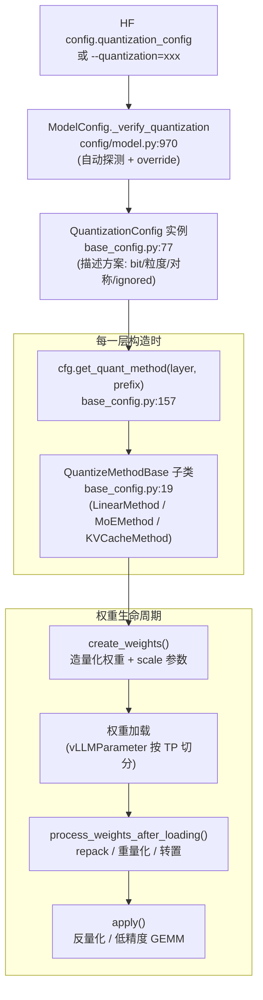
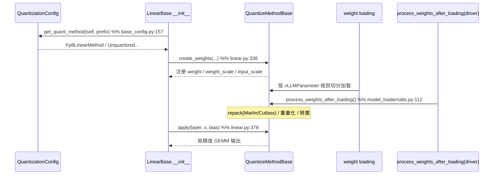

# vLLM 量化 —— 量化方法框架、权重量化与 KV Cache 量化

> **代码基准**:vLLM `main` @ `485bbe1c6`(2026-06-21)· V1 引擎
> **最后更新**:2026-06-22 · **系列**:vLLM 推理引擎源码级分析(见 [[vllm/index]])
> **分析维度**:Overview → Quick Start → Deep Dive
>
> 本页回答:vLLM 是用什么**统一插件框架**把十几种量化方法(AWQ/GPTQ/FP8/FP4/bitsandbytes/compressed-tensors…)接进同一套 `Linear`/`MoE`/`Attention` 层的;一种方法(以 **FP8** 为例)从 config 解析 → 建权重 → 加载后重打包 → 低精度 GEMM 的**端到端**链路;以及 **KV cache 量化**怎么挂到注意力后端。层本身怎么造、权重怎么按 TP 切分加载归 [[vllm_model_library_analysis]];本页只讲**量化这一横切关注点**:`QuantizationConfig → QuantizeMethodBase → create_weights/apply`。

---

## 一、Overview(总览)

### 1.1 量化在推理里的定位:省的是显存与带宽

LLM 解码是**访存瓶颈**(memory-bound):每生成一个 token 都要把全部权重 + 整个 KV cache 从 HBM 搬一遍。量化把权重/KV 从 16-bit 压到 8-bit(FP8/INT8)甚至 4-bit(AWQ/GPTQ/FP4),直接换来两件事:

- **权重显存减半/减四**:7B 模型 fp16 约 14GB,FP8 约 7GB,INT4 约 3.5GB —— 决定"能不能装下"。
- **带宽/算力翻倍**:低精度权重搬运更快;若硬件有 FP8/INT8 Tensor Core,GEMM 吞吐也翻倍(weight+activation 量化才吃得到算力红利,weight-only 主要省带宽)。
- **KV cache 减半**:长上下文场景 KV 占显存比权重还多,fp8 KV 直接让可容纳的并发/序列长度翻倍(详见 [[vllm_kv_cache_management_analysis]])。

代价是精度损失,因此 vLLM 不"自己拍脑袋量化",而是**消费**离线量化工具(AutoAWQ / AutoGPTQ / llm-compressor / ModelOpt / bitsandbytes)产出的 checkpoint,运行时只负责"建对应的量化权重 + 调对应的低精度 kernel"。

### 1.2 框架分层:一个横切关注点,四个接合点



整套机制只有**两个抽象基类**(`base_config.py`):

| 抽象 | 职责 | 关键方法 |
|------|------|----------|
| `QuantizationConfig` | 描述"一种量化方案":bit/粒度/对称性/哪些层不量化;并负责**为每一层分发** method | `from_config`(解析 HF dict)、`get_quant_method`、`override_quantization_method`(自动探测) |
| `QuantizeMethodBase` | 描述"某一层怎么量化":建权重 + 算 | `create_weights`、`process_weights_after_loading`、`apply` |

四个接合点:① **选方案**(`config/model.py`)→ ② **分发到层**(`linear.py`/`attention.py` 调 `get_quant_method`)→ ③ **建权重 + 加载后处理**(`create_weights` + 加载驱动 `model_loader/utils.py`)→ ④ **前向计算**(`apply`)。

### 1.3 方法全景对比表

| 方法名(注册键) | 类别 | 权重 | 激活 | 量化粒度 | 对称性 | 选中后典型 kernel | 入口文件 |
|---|---|---|---|---|---|---|---|
| `fp8` | **W+A** | e4m3(8) | 静态 per-tensor / 动态 per-token | per-tensor 或 **block 128×128** | 对称 | Cutlass / DeepGEMM / Marlin | `fp8.py:99` |
| `compressed-tensors` | **伞**(W-only & W+A) | int4/int8/fp8/fp4 | 视 scheme | tensor/channel/group/block | 视 scheme | 多 scheme 各自挑 | `compressed_tensors/compressed_tensors.py` |
| `awq` / `awq_marlin` | W-only | uint4 | fp16/bf16 | group(默认 128) | **非对称**(zero_point) | Marlin / Triton | `auto_awq.py:170` |
| `gptq` / `gptq_marlin` | W-only | 4/8 | fp16/bf16 | group(+可选 act-order) | sym 或 asym | Marlin / Machete | `auto_gptq.py:97` |
| `bitsandbytes` | W-only(**在线**) | NF4/FP4(4) 或 int8 | fp16/bf16 | blockwise | 非对称 | bnb kernels | `bitsandbytes.py:49` |
| `modelopt` / `modelopt_fp4` | **W+A** | fp8 / **nvfp4**(4) | fp8 / fp4 | per-tensor / block16 + global-scale | 对称 | Cutlass / FlashInfer | `modelopt.py:132` |
| `mxfp4` / `gpt_oss_mxfp4` | W(+A),MoE 为主 | e2m1(4) | mxfp4 / bf16 | **block 32 + e8m0 共享指数** | 对称 | Marlin / FlashInfer | `mxfp4.py:40` |
| `experts_int8` | W-only,MoE(在线) | int8 | fp16/bf16 | per-channel(每 expert) | 对称 | fused_moe | `experts_int8.py` |
| `moe_wna16` | W-only,MoE | int4/int8 | fp16/bf16 | group | sym/asym | wna16 moe | `moe_wna16.py` |

> 注册表全集见 `QUANTIZATION_METHODS`(`quantization/__init__.py:47`),名字→config 类映射见 `get_quantization_config` 的 `method_to_config`(`__init__.py:140`)。**weight-only**(AWQ/GPTQ/bnb/wna16)只压权重、激活保持高精度,主要省带宽;**weight+activation**(FP8/INT8/部分 compressed-tensors/FP4)两边都压,才能吃到低精度 Tensor Core 的算力。

---

## 二、Quick Start(快速上手)

### 2.1 三种触发方式

```python
from vllm import LLM

# (1) 自动探测:checkpoint 自带 config.json 里的 quantization_config,无需任何参数
llm = LLM("neuralmagic/Meta-Llama-3-8B-Instruct-FP8")          # 读到 quant_method=fp8

# (2) 显式指定:覆盖/补充探测结果(也用于"在线量化"未量化的 ckpt)
llm = LLM("meta-llama/Meta-Llama-3-8B-Instruct", quantization="fp8")  # 在线 FP8

# (3) KV cache 量化:与权重量化正交,单独开关
llm = LLM("...-FP8", kv_cache_dtype="fp8")   # KV 存成 fp8_e4m3
```

- **`quantization=`** 对应 `--quantization`,落到 `ModelConfig.quantization`;`None` 时走自动探测。
- **`kv_cache_dtype=`** 对应 `--kv-cache-dtype`,落到 `CacheConfig.cache_dtype`(`config/cache.py:75`),与权重量化**完全独立**。

### 2.2 关键入口锚点(读源码从这里进)

| 你想看… | 去这里 |
|---|---|
| 框架两个基类 | `quantization/base_config.py:19`(`QuantizeMethodBase`)、`:77`(`QuantizationConfig`)、`:157`(`get_quant_method`) |
| 方法注册表 | `quantization/__init__.py:47`(列表)、`:108`(`get_quantization_config`) |
| 自动探测/override | `config/model.py:970`(`_verify_quantization`) |
| 怎么挂到 Linear | `layers/linear.py:271`(`LinearBase` 调 `get_quant_method`)、`:338`(`create_weights`)、`:378`(`apply`) |
| 加载后重打包驱动 | `model_loader/utils.py:100`(`process_weights_after_loading`) |
| 量化参数类 | `model_executor/parameter.py:32`(`BasevLLMParameter`) |
| FP8 端到端 | `quantization/fp8.py:99`(config)→`:267`(LinearMethod)→`:446`(apply) |
| KV 量化 | `quantization/kv_cache.py:42`(`BaseKVCacheMethod`)、`layers/attention/attention.py:122`(`_init_kv_cache_quant`) |

---

## 三、Deep Dive(源码级深挖)

### 3.1 插件机制:两个基类 + 四个接合点

#### ① 抽象定义(`base_config.py`)

`QuantizeMethodBase`(`base_config.py:19`)只规定三个动作 —— 所有方法的统一接口:

```python
class QuantizeMethodBase(ABC):
    uses_meta_device: bool = False            # :25  在线量化:权重先建在 meta 设备,加载时逐层量化省峰值显存
    @abstractmethod
    def create_weights(self, layer, *w, **kw): ...   # :27  造"量化权重 + scale"挂到 layer
    @abstractmethod
    def apply(self, layer, *a, **kw) -> Tensor: ...  # :36  前向:反量化 / 低精度 GEMM
    def process_weights_after_loading(self, layer): ...  # :57  加载后 repack/重量化(默认 no-op)
```

`QuantizationConfig`(`base_config.py:77`)是"方案描述 + 层分发器",核心是 `get_quant_method`(`base_config.py:157`)—— **同一个 config 对不同层返回不同 method**,这正是插件机制的关键:它把"用什么方案"和"这一层具体怎么算"解耦。还有几个钩子值得记:

- `from_config`(`:112`):把 HF 的 `quantization_config` dict 解析成强类型 config。
- `override_quantization_method`(`:118`):**自动探测**入口(见 §3.2)。
- `get_cache_scale_mapper`(`:172`):把 checkpoint 里的 KV scale 名字映射到 vLLM 名字(见 §3.5)。
- `get_from_keys` / `get_from_keys_or`(`:139`/`:149`):容错地从 dict 取字段(不同工具字段名不同,如 AWQ 的 `w_bit` vs `bits`)。

#### ② 分发到层(`linear.py`)

`LinearBase.__init__`(`linear.py:271`)是所有 Linear 的总入口:

```python
if quant_config is None:
    self.quant_method = UnquantizedLinearMethod()
elif quant_method := quant_config.get_quant_method(self, prefix=prefix):  # :271
    self.quant_method = quant_method
```

注意传入 `prefix`(层全名,如 `model.layers.0.mlp.down_proj`)—— config 据此判断这一层是否在 `ignored_layers` 里(很多 ckpt 不量化 `lm_head`/部分 attention)。随后 `ColumnParallelLinear`/`RowParallelLinear` 在自己的 `__init__` 里调 `self.quant_method.create_weights(...)`(`linear.py:338`/`:461`/`:1565`),前向调 `self.quant_method.apply(self, x, bias)`(`linear.py:378`/`:555`/`:1644`)。**层完全不知道自己是不是被量化了**,一切走 `quant_method`。

#### ③ 建权重(`create_weights`)与 ④ 计算(`apply`)

见 §3.3 的 FP8 端到端。这里先给整体时序:



#### ⑤ 插件机制的二级分发:compressed-tensors 伞格式

上面是"一个 config → 一个 method"。但 **compressed-tensors**(llm-compressor 输出,生产环境最常见)是把任意 bit/粒度组合混在一份 checkpoint 里的伞格式,于是它在框架内**多套一层 scheme 分发**:`CompressedTensorsConfig.get_quant_method`(`compressed_tensors/compressed_tensors.py:151`)对 Linear 统一返回 `CompressedTensorsLinearMethod`(`:185`),而后者持有一个**按层选出的 `CompressedTensorsScheme`**——`get_scheme`(`:815`)→`_get_scheme_from_parts`(`:692`)依据该层的 `weights`/`input_activations` 配置在 `W8A8Fp8`/`W8A8Int8`/`W4A4Fp4`/`WNA16`/`W4A8Fp8` 等十余个 scheme 间挑一个(`:706-815`),真正的 `create_weights`/`apply` 由 scheme 完成。KV 量化同理由 `kv_cache_scheme`(`:86`)驱动 `CompressedTensorsKVCacheMethod`(`:206`)。

> 这说明统一框架的可扩展性:`QuantizeMethodBase` 既可以是"一种具体算法",也可以是"一个再分发器"——伞格式只是在 method 内部再跑一次 §3.1 的三段式。

### 3.2 方法怎么被"选中":自动探测 + override + 显式覆盖

`ModelConfig._verify_quantization`(`config/model.py:970`)是仲裁中心:

1. 读 HF config 的 `quantization_config` dict,取 `quant_method`(`model.py:976-979`)。
2. 因为同一份 checkpoint 可能被多个 config 类认领(典型:一个 AWQ ckpt 在支持的 GPU 上应升级走 **Marlin** kernel),vLLM 维护一个**优先级 `overrides` 列表**(`model.py:983`),把"会改写探测结果"的方法排在前面,按序调用每个 config 的 `override_quantization_method`(`model.py:1015-1036`):

```python
for name in quantization_methods:                       # model.py:1015
    method = me_quant.get_quantization_config(name)
    quantization_override = method.override_quantization_method(
        quant_cfg, self.quantization, hf_config=self.hf_config)
    if quantization_override is not None:
        quant_method = quantization_override; self.quantization = quantization_override; break
```

以 AWQ 为例,`AutoAWQConfig.override_quantization_method`(`auto_awq.py:258`):checkpoint 标的是 `quant_method="awq"`,只要用户没强制别的、且不在 CPU 上,就认领它(`auto_awq.py:269-280`)。真正决定走 Marlin 还是 Triton 推迟到**每层** `get_quant_method`(`auto_awq.py:284`)里:`check_marlin_supported(...)` 通过就返回 `AutoAWQMarlinLinearMethod`,否则回退 `AutoAWQLinearMethod`(`auto_awq.py:309-332`)。

3. **显式 `quantization=` 与探测冲突会报错**(`model.py:1042`),避免静默用错 kernel。

### 3.3 一种方法端到端:FP8(`fp8.py` + kernels)

FP8 同时覆盖 weight-only(GPU 无 FP8 Tensor Core 时退化为只省带宽)与 weight+activation,是最典型的样本。

#### (a) Config:解析与量化键

`Fp8Config`(`fp8.py:99`)从 `from_config`(`fp8.py:159`)读出 `activation_scheme`(static/dynamic)、`weight_block_size`(给 DeepSeek-V3 这类 **128×128 block** 量化)、`ignored_layers`。`get_quant_method`(`fp8.py:179`)按层类型四岔分发:

```python
if isinstance(layer, LinearBase):     return Fp8LinearMethod(self)          # :198  (或在线 :194)
elif isinstance(layer, RoutedExperts):return Fp8MoEMethod(self, layer)      # :215
elif isinstance(layer, Attention):    return Fp8KVCacheMethod(self)         # :220
```

`Fp8LinearMethod.__init__`(`fp8.py:267`)据"是否 block 量化 + 是否 static + Cutlass 是否支持"算出**激活量化键**(`fp8.py:301-320`):block→`kFp8Dynamic128Sym`;否则动态优先 **per-token**(`kFp8DynamicTokenSym`)、静态用 per-tensor。这个 `QuantKey` 决定后面建 scale 的形状与挑哪个 kernel。

#### (b) create_weights:造 FP8 权重 + scale 参数

`Fp8LinearMethod.create_weights`(`fp8.py:322`)注册三类参数:

- **权重**:`create_fp8_weight_parameter(...)`(`fp8.py:352`),dtype `float8_e4m3fn`。
- **weight_scale**:非 block 用 `PerTensorScaleParameter`(`fp8.py:359`);block 用 `BlockQuantScaleParameter` 并取名 `weight_scale_inv`(`fp8.py:370-379`,与 DeepSeek 命名对齐)。
- **input_scale**:仅 static 激活才有(`fp8.py:382`)。

最后 `init_fp8_linear_kernel(...)`(`fp8.py:387`)按平台/能力/block 选出 kernel 对象(`kernels/linear/__init__.py:531`):Hopper+block 走 **DeepGEMM**,有 FP8 Cutlass 走 **CutlassFP8**,老卡(如 Ampere)无 FP8 算力则走 **MarlinFP8**(把 FP8 当 weight-only,反量化后做 BF16 GEMM)。`self.use_marlin` 据此置位(`fp8.py:396`)。

> 这里就体现了 **vLLMParameter 的价值**(`parameter.py`):`PerTensorScaleParameter`(`:260`)知道融合层(QKV/gate_up)在 ckpt 里有多份 scale,要按 shard 装入(`load_qkv_weight`/`load_merged_column_weight`,`:285`/`:282`);`BlockQuantScaleParameter`(`:397`)与 `ModelWeightParameter`(`:233`)则带 `input_dim/output_dim`,让加载器按 TP 自动切分。量化权重的"加载时切分"逻辑全封装在参数类里,method 只管声明形状。

#### (c) process_weights_after_loading:重量化 + 转置 + repack

加载完由全局驱动 `process_weights_after_loading`(`model_loader/utils.py:100`)遍历所有 module 调用(`:112`)。`Fp8LinearMethod.process_weights_after_loading`(`fp8.py:398`)做三件事:

1. **Marlin 分支**(`fp8.py:399-408`):转置成 `(K,N)` 并交给 `MarlinFP8` 的 repack。
2. **融合 shard 重量化**(`fp8.py:424`):QKV 三段各有一个 per-tensor scale,但 `torch._scaled_mm` 要求单一 scale,于是 `process_fp8_weight_tensor_strategy` 取 max 重新量化成一份。
3. **转置**(`fp8.py:433`)成 GEMM 需要的列主序后 `replace_parameter` 写回。

#### (d) apply:激活量化 + 低精度 GEMM

`Fp8LinearMethod.apply`(`fp8.py:446`)默认直接委托给 kernel:`self.fp8_linear.apply_weights(layer, x, bias)`(`fp8.py:489`)。kernel 基类 `FP8ScaledMMLinearKernel.apply_weights`(`kernels/linear/scaled_mm/ScaledMMLinearKernel.py:135`)做两步:

```python
x_2d_q, x_s = self.quant_fp8(x_2d, x_s, x_s_ub)   # :161  在线量化激活(QuantFP8)
return self.apply_scaled_mm(A=x_2d_q, B=weight, As=x_s, Bs=weight_scale, ...)  # :162
```

- **激活在线量化**走 `QuantFP8`(`input_quant_fp8.py:30`)—— 一个 `CustomOp`,`forward_cuda`(`:84`)按 per-token/per-tensor/per-group 把激活压到 e4m3,`forward_native`(`:184`)是可被 `torch.compile` 融合的纯 PyTorch 参考实现(见 [[vllm_compilation_cudagraph_analysis]])。
- **GEMM** 在 `CutlassFP8ScaledMMLinearKernel.apply_scaled_mm`(`cutlass.py:243`)里调 `ops.cutlass_scaled_mm(A, B, scale_a, scale_b, bias)`(`cutlass.py:265`)—— 一条 kernel 完成 `dequant(A·B)`(scale 在 epilogue 里乘回)。

至此一条 FP8 Linear 的完整生命:`Fp8Config:99 → get_quant_method:179 → create_weights:322 → process_weights_after_loading:398 → apply:446 → cutlass_scaled_mm`。

### 3.4 权重重打包:为什么需要 `process_weights_after_loading`

checkpoint 里的权重布局是**给存储/通用性优化的**,不是给目标 kernel 优化的。各家 kernel(Marlin/Cutlass/Machete)对权重的 bit 排布、tile 对齐、行列序有硬性要求,所以"加载"和"能算"之间必须插一道**重打包**:

- **AWQ → Marlin**:AWQ 用非标准 4-bit 打包序(`[0,4,1,5,2,6,3,7]`)且沿输出维 pack。`_convert_awq_to_standard_format`(`auto_awq.py:92`)先反 pack 修正 bit 序、再沿输入维重 pack 成 GPTQ 风格,然后交给 Marlin kernel 的 `process_weights_after_loading`(`auto_awq.py:525-533`)。**没有这一步 Marlin kernel 直接读到乱码。**
- **FP8 → Cutlass**:`CutlassFP8ScaledMMLinearKernel.process_weights_after_loading`(`cutlass.py:204`)把权重 `K/N` 维 pad 到 16 的倍数(Cutlass tile 对齐),并替换 `weight_loader` 以便后续 reload 也按 pad 走。
- **FP8 融合 shard 重量化**:见 §3.3(c)第 2 点,本质也是"为 kernel 把多 scale 收敛成单 scale"。

意义:**把一次性的格式转换从热路径里挪走**。repack 只在加载时跑一次,之后每步解码的 `apply` 都直接吃 kernel-ready 的权重,零额外开销。驱动还会在 repack 后 `release_device_memory_under_pressure`(`model_loader/utils.py:115`)释放转换中间张量。

### 3.5 KV cache 量化:接到注意力后端

KV 量化与权重量化**正交**:它压的是运行时不断增长的 K/V 张量,入口在 `CacheConfig.cache_dtype`(`config/cache.py:75`,可选值 `CacheDType` 见 `cache.py:19`:`fp8`/`fp8_e4m3`/`fp8_e5m2`/`nvfp4`/`int8_per_token_head` 等)。

机制:`Attention` 层构造时 `_init_kv_cache_quant`(`attention.py:122`)把 q/k/v/prob 四个 scale 注册成 buffer(`set_default_quant_scales`,`attention.py:95-101`,默认 1.0,且**同时存一份 host float** 给 FlashInfer 这类需要 scale 在 CPU 的后端),再向 config 要 KV method(`attention.py:159`)。FP8 ckpt 返回 `Fp8KVCacheMethod`(`fp8.py:983`),它继承 `BaseKVCacheMethod`(`kv_cache.py:42`):

- `create_weights`(`kv_cache.py:57`)把 `q_scale/k_scale/v_scale/prob_scale` 建成 `KVCacheScaleParameter`(`kv_cache.py:18`,初值 -1.0 哨兵),以便从 checkpoint 加载标定好的 scale。
- `process_weights_after_loading`(`kv_cache.py:74`)是核心:把加载到的 k/v scale 收敛成 per-tensor 标量、缺失则回退 1.0 并告警(`kv_cache.py:104-152`),最终写进前向真正用的 `layer._k_scale/_v_scale`(`kv_cache.py:143-146`);**per-token-head 量化**(`fp8_per_token_head`)则 scale 在 kernel 里逐 (token,head) 动态算,checkpoint scale 不用(`kv_cache.py:85-94`)。
- checkpoint 里的 scale 名(如 `.k_proj.output_scale`)由 `get_cache_scale_mapper`(`fp8.py:223`)统一映射到 vLLM 的 `.attn.k_scale`,加载器自动套用。

**对注意力后端的影响**:写 KV 时按 `_k_scale/_v_scale` 把 K/V 量化进分页 cache;做注意力时 FP8 后端(FlashAttention/FlashInfer)用 `_q_scale/_prob_scale` 跑 FP8 attention。后端能否吃 fp8 KV、以及 `reshape_and_cache` 如何按 dtype 写入,详见 [[vllm_attention_backends_analysis]];块的分配/复用见 [[vllm_kv_cache_management_analysis]]。

> `calculate_kv_scales`(`cache.py:110`,已标记 deprecated)曾用于"运行时动态算 KV scale";现在优先从 checkpoint 加载,缺失才用默认值。

### 3.6 MoE 量化(简述)

MoE 的量化挂在 `RoutedExperts` 上(对应 `get_quant_method` 的第二岔),权重是 `[num_experts, ...]` 的三维张量,kernel 走 fused-MoE 而非普通 GEMM:

- **FP8 MoE**:`Fp8MoEMethod`(`fp8.py:492`)。`create_weights`(`fp8.py:534`)为 `w13/w2` 建 per-expert(或 per-block)scale;`process_weights_after_loading`(`fp8.py:719`)把每 expert 的 w1/w3 scale 取 max 重量化、再 `convert_to_fp8_moe_kernel_format` shuffle 成 backend 布局;backend 由 `select_fp8_moe_backend`(`fp8.py:527`)在 DeepGEMM/CUTLASS/AITER/Triton 间选。
- **在线 FP8 MoE**:`Fp8OnlineMoEMethod`(`fp8.py:859`)设 `uses_meta_device=True`(`fp8.py:869`)—— 权重先建在 meta 设备(`fp8.py:891-915`),加载后逐 expert `ops.scaled_fp8_quant`(`fp8.py:961-966`),把"在线量化未量化 ckpt"的峰值显存压下来。
- **weight-only MoE**:`experts_int8`(INT8 per-channel,在线量化 expert 权重)、`moe_wna16`(int4/int8 group,常作为 AWQ/GPTQ MoE 的回退,见 `auto_awq.py:347`)、`mxfp4`(`mxfp4.py:40`,block=32 + e8m0 共享指数,gpt-oss 用)。AWQ MoE 自身走 `AutoAWQMoEMethod`(`auto_awq.py:544`)→ Marlin。

统一点:无论哪种,都遵守 §3.1 的 `create_weights / process_weights_after_loading / apply` 三段式 —— MoE 只是把"层"换成"专家组",把"GEMM"换成"fused grouped GEMM"。

---

## Related Pages
- [[vllm_model_library_analysis]] · [[vllm_attention_backends_analysis]] · [[vllm_feature_optimizations_overview]] · [[vllm_distributed_inference_analysis]]
- [[vllm/index]] · [[../index]]

## Cross-Domain Links
- [[13_low_precision_training_analysis]] —— 低精度(FP8/FP4)训练侧原理
- [[14_transformer_engine_analysis]] —— FP8 GEMM/scaling
- [[24_deepseek_v4_fp4_qat_analysis]] —— FP4 量化
