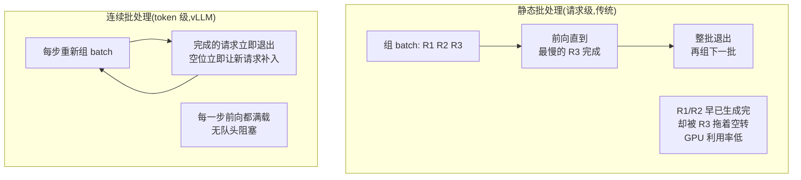
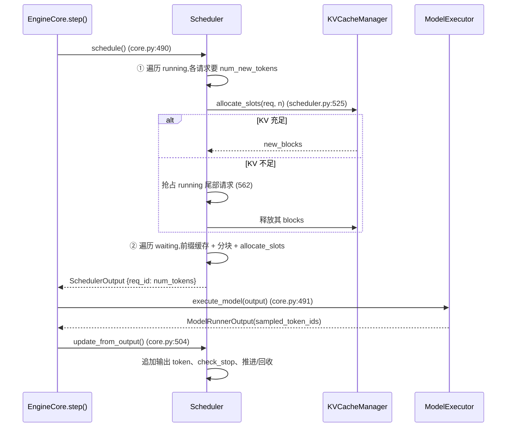
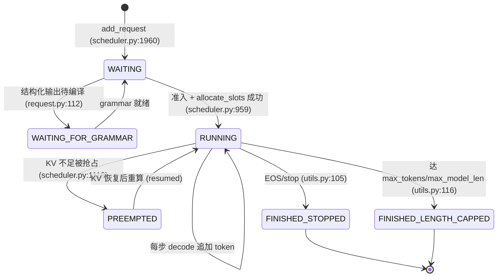
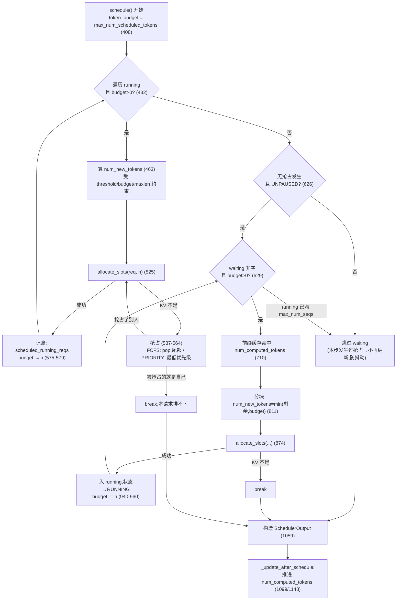

# vLLM V1 调度器 —— 连续批处理、分块预填充与抢占

> **代码基准**:vLLM `main` @ `485bbe1c6`(2026-06-21)· V1 引擎
> **最后更新**:2026-06-22 · **系列**:vLLM 推理引擎源码级分析(见 [[vllm/index]])
> **分析维度**:Overview → Quick Start → Deep Dive
>
> 本页回答:vLLM V1 的调度器如何在 **token 粒度**上每一步动态组 batch(连续批处理),如何把长 prompt 切成 chunk 与 decode 混批(分块预填充),以及 KV 不足时如何抢占重算。它是脊梁篇 [[vllm_engine_architecture_analysis]] 中 `EngineCore.step()` 的"大脑",其每一步的产物 `SchedulerOutput` 驱动执行层;而它做调度决策时反复调用的 `allocate_slots` 属于 KV 管理器,细节见 [[vllm_kv_cache_management_analysis]]。

---

## 一、Overview(总览)

### 1.1 调度器的定位

vLLM 的引擎核心是一个 **忙循环(busy loop)**:`EngineCore.step()`(`vllm/v1/engine/core.py:479`)每一轮做三件事——

```
scheduler.schedule()  ──→  model_executor.execute_model()  ──→  scheduler.update_from_output()
   决定本步算什么            执行一次前向                       回收输出、推进状态
(core.py:490)            (core.py:491)                     (core.py:504)
```

调度器(`Scheduler`,`vllm/v1/core/sched/scheduler.py:68`)是这个循环的"大脑":它持有全部请求的生命周期状态,在每一步前向之前决定**这一步要为哪些请求、各计算多少个 token**,并把这个决策打包成 `SchedulerOutput`(`vllm/v1/core/sched/output.py:180`)交给执行层。

一个核心设计理念写在 `schedule()` 的注释里(`scheduler.py:390-399`):

> 调度器里**没有"预填充阶段"也没有"解码阶段"**。每个请求只有两个数:已算到的 `num_computed_tokens` 和目标 `num_tokens_with_spec`。每一步,调度器尽力给请求分配 token,让 `num_computed_tokens` 去追赶 `num_tokens_with_spec`。这个抽象足够通用,自然覆盖了分块预填充、前缀缓存、投机解码乃至未来的 jump-decoding。

也就是说:**prefill 与 decode 不是两种请求,而是同一个"追赶"过程的不同进度**。这是理解整个 V1 调度器的钥匙。

### 1.2 连续批处理 vs 静态批处理



| 维度 | 静态批处理 | 连续批处理(vLLM V1) |
|------|-----------|---------------------|
| 组 batch 粒度 | 请求级,一批从头跟到尾 | **token 级,每一步前向重新组** |
| 短请求是否被长请求拖累 | 是(队头阻塞) | 否,完成即退出、空位即补入 |
| prefill / decode | 分两个阶段 | **统一为 token 追赶,可混批** |
| 调度产物 | 固定 batch | `{req_id: num_scheduled_tokens}` 字典 |

连续批处理之所以是 token 级而非请求级:`schedule()` 的输出本质是一个 `num_scheduled_tokens: dict[str, int]`(`scheduler.py:407`),即"本步给每个请求算几个 token"——decode 请求通常是 1(加投机草稿数),prefill 请求可以是几百上千(整段或一个 chunk)。这种"按 token 记账"使得 decode 与 prefill 能在同一次前向里共存。

### 1.3 关键概念表

| 概念 | 含义 | 代码锚点 |
|------|------|---------|
| `running` | 运行队列(普通 list,FIFO 顺序) | `scheduler.py:184` |
| `waiting` | 等待队列,按策略是 FCFS deque 或优先级堆 | `scheduler.py:181` |
| `skipped_waiting` | 本轮因依赖未就绪(远程 KV/grammar/流式)被跳过的等待请求 | `scheduler.py:183` |
| `token_budget` | 本步全局 token 预算,初值 = `max_num_scheduled_tokens` | `scheduler.py:408` |
| `num_computed_tokens` | 请求已算到的 token 数(prefill 进度 + 已生成) | `request.py:153` |
| `num_tokens_with_spec` | 目标 token 数 = prompt + 输出 + 草稿 | `request.py:251` |
| `is_prefill_chunk` | 该请求本步是否还在预填充(未追平) | `request.py:168` |
| `SchedulerOutput` | 一步调度的产物,传给执行层 | `output.py:180` |
| `RequestStatus` | 请求状态机(WAITING/RUNNING/PREEMPTED/FINISHED_*) | `request.py:323` |

---

## 二、Quick Start(快速上手)

### 2.1 三个最关键的 flag

全部定义在 `SchedulerConfig`(`vllm/config/scheduler.py:26`):

| flag | 默认 | 作用 |
|------|------|------|
| `max_num_batched_tokens` | 配置类里 2048(仅测试用) | **一步前向最多算多少 token**,即 token 预算上限。真实默认由 `EngineArgs` 按硬件/场景设定 |
| `max_num_seqs` | 128(配置类)/ 256~1024(真实) | **一步最多并发多少请求**(running 队列上限) |
| `enable_chunked_prefill` | `True` | 是否允许把长 prompt 切块、与 decode 混批 |

> [!note] 真实默认值
> 配置类里的 2048/128 注释明说"mainly for convenience when testing"。生产路径在 `vllm/engine/arg_utils.py:2406-2423` 按硬件分档:H100/H200/MI300x 等大显存卡 `max_num_batched_tokens` 默认 **16384**(`LLM`)/ **8192**(OpenAI server),`max_num_seqs` 默认 **1024**;其余卡为 **8192 / 2048**、`max_num_seqs` **256**。

其它影响调度的 flag:`policy`(`fcfs`/`priority`,默认 fcfs,`scheduler.py:109`)、`long_prefill_token_threshold`(单步长 prefill 上限)、`scheduler_reserve_full_isl`(默认 `True`,准入时要求整条序列的 KV 放得下,防过度准入抖动,`scheduler.py:140`)、`watermark`(KV 保留水位)。

### 2.2 入口:`Scheduler.schedule()`

签名与接口契约见 `scheduler.py:388` 与 `interface.py:52`。一步调度产出 `{req_id: num_tokens}` 与一个 `SchedulerOutput`。骨架是**两段式**:

```python
def schedule(self) -> SchedulerOutput:
    token_budget = self.max_num_scheduled_tokens          # 408
    # ① 先调度 RUNNING(优先保活,通常是 decode)
    while req_index < len(self.running) and token_budget > 0:   # 432
        ...allocate_slots; KV 不足则就地抢占...                  # 525 / 537-564
    # ② 再调度 WAITING(新请求 / 被抢占恢复的请求)
    if not preempted_reqs and pause == UNPAUSED:          # 626
        while (self.waiting or self.skipped_waiting) and token_budget > 0:  # 629
            if len(self.running) == self.max_num_running_reqs: break        # 630
            ...前缀缓存命中 → allocate_slots → 入 running...    # 710 / 874 / 940
    ...构造 SchedulerOutput...                             # 1059
    self._update_after_schedule(scheduler_output)         # 1099 推进 num_computed_tokens
```

### 2.3 一步调度的最小时序



---

## 三、Deep Dive(源码级深挖)

### 3.1 请求状态机

`RequestStatus`(`vllm/v1/request.py:323`)是一个 `IntEnum`,顺序即语义——`is_finished()` 直接用 `status > PREEMPTED` 判断(`request.py:344-346`):



要点:
- **入口** `WAITING`(`request.py:97`);若带结构化输出约束,初始为 `WAITING_FOR_STRUCTURED_OUTPUT_GRAMMAR`(`request.py:112`),需等 grammar 编译完成才"晋升"回 `WAITING`(`scheduler.py:2402-2407`)。
- `WAITING_FOR_REMOTE_KVS` / `WAITING_FOR_STREAMING_REQ` 是另外两个"阻塞态",统一由 `_is_blocked_waiting_status`(`scheduler.py:1805`)识别,它们待在 `skipped_waiting` 队列而非主 `waiting` 队列。
- **抢占**不是结束:`PREEMPTED` 仍 ≤ `PREEMPTED`,所以 `is_finished()` 为假,请求回到 waiting 等待重算。
- 终态由 `check_stop`(`utils.py:94`)判定:命中 `eos_token_id`/`stop_token_ids` → `FINISHED_STOPPED`;`num_tokens >= max_model_len` 或 `num_output_tokens >= max_tokens` → `FINISHED_LENGTH_CAPPED`。

### 3.2 token 预算与"追赶"模型

调度器对 prefill / decode 一视同仁,关键就是每个请求本步要算的 `num_new_tokens`。

**RUNNING 请求**(`scheduler.py:463-479`):
```python
num_new_tokens = (request.num_tokens_with_spec
                  + request.num_output_placeholders
                  - request.num_computed_tokens)            # 463-467
if 0 < long_prefill_token_threshold < num_new_tokens:       # 468 长 prefill 限幅
    num_new_tokens = long_prefill_token_threshold
num_new_tokens = min(num_new_tokens, token_budget)          # 470 受全局预算约束
num_new_tokens = min(num_new_tokens,
    max_model_len - num_computed_tokens - 1)                # 474 不越界
```
对一个纯 decode 请求:`num_tokens_with_spec - num_computed_tokens` 通常 = 1(无投机)或 = 1 + 草稿数(有投机)。对一个尚未追平的 prefill chunk(被抢占恢复、或上一步只算了一部分),这里就是"剩余还要算的 token 数"。

**WAITING 请求**(`scheduler.py:796-811`):
```python
num_new_tokens = request.num_tokens - num_computed_tokens   # 796 整段剩余 prompt
if 0 < threshold < num_new_tokens:                          # 797 长 prefill 限幅
    num_new_tokens = threshold
if not enable_chunked_prefill and num_new_tokens > token_budget:  # 803
    break                                                   # 不许分块 → 放不下就停
num_new_tokens = min(num_new_tokens, token_budget)          # 811 ← 这一行就是"分块"
```
其中 `num_computed_tokens` 已经把**前缀缓存命中**算进去了(见 3.5)。

每步结束后,`_update_after_schedule`(`scheduler.py:1130`)把本步 scheduled 的 token 加到 `num_computed_tokens` 上(`scheduler.py:1143`),并据此刷新 `is_prefill_chunk`(`scheduler.py:1147-1149`)。**这是乐观推进**:不等前向结果就推进进度,从而下一步能立刻继续算这个请求的下一段;若投机草稿被拒,再在 `update_from_output` 里回退(见 3.7)。

> $$\text{本步 } \texttt{num\_new\_tokens} = \min\big(\underbrace{N_{\text{tokens}} - N_{\text{computed}}}_{\text{剩余}},\ \underbrace{\text{threshold}}_{\text{长 prefill 限幅}},\ \underbrace{\text{token\_budget}}_{\text{全局预算}},\ \underbrace{L_{\max} - N_{\text{computed}} - 1}_{\text{不越界}}\big)$$

### 3.3 schedule() 主算法:先 running 后 waiting



**为什么先 running**:running 里多是已开始生成的请求,优先保活避免抢占级联;且 decode 单请求只吃 1 个 token 预算,先扣掉后,剩余预算才给 waiting 的 prefill 分块——**这正是 decode 与 prefill 混批的来源**。

**为什么"发生抢占就不纳新"**(`scheduler.py:626` 的 `if not preempted_reqs`):本步既然已经因 KV 紧张而抢占了运行中的请求,再去准入新请求只会加剧抖动,所以本步彻底跳过 waiting。

**`max_num_seqs` 闸门**:waiting 循环里 `if len(self.running) == self.max_num_running_reqs: break`(`scheduler.py:630`),`max_num_running_reqs` 即 `max_num_seqs`(`scheduler.py:108`)。这是并发请求数上限,与 token 预算是两条独立约束。

调度结束有一组不变量断言(`scheduler.py:990-1000`):`total_num_scheduled_tokens <= max_num_scheduled_tokens`、`token_budget >= 0`、`len(running) <= max_num_seqs`。

### 3.4 分块预填充(chunked prefill)

分块预填充不是一段独立逻辑,而是 3.2 里 `num_new_tokens = min(剩余 prompt, token_budget)`(`scheduler.py:811`)的**自然结果**:

- 一个 8000-token 的 prompt,若本步 `token_budget` 只剩 2048,则这一步只算前 2048 个(一个 chunk);
- `_update_after_schedule` 把 `num_computed_tokens` 推到 2048(`scheduler.py:1143`),`is_prefill_chunk` 仍为真;
- 下一步该请求已在 running 队列,RUNNING 分支继续算 `num_tokens_with_spec - 2048` 的下一段;
- 直到追平 `num_tokens`,`is_prefill_chunk` 变假,转入正常 decode(每步 1 token)。

**与 decode 混批**:由于 running(decode)先扣预算、waiting(prefill chunk)用剩余预算,**同一个 `SchedulerOutput` 里既有 decode 请求(num_scheduled_tokens=1)又有 prefill chunk(num_scheduled_tokens=几百)**。执行层用 varlen attention 一次前向处理这种不等长批。

**开关与边界**:
- `enable_chunked_prefill` 默认 `True`(`config/scheduler.py:84`)。若关闭,且某 prefill 放不下当前预算,直接 `break` 不调度(`scheduler.py:803-809`),退化为"prompt 必须整段装下"。
- encoder-decoder 模型在 `__post_init__` 里强制关闭分块预填充(`config/scheduler.py:238-241`)。
- `long_prefill_token_threshold`:把"长 prompt"单步上限钳到该值(`scheduler.py:797`),让短 prompt 插队、降低长 prompt 对延迟的冲击;当 `max_num_partial_prefills > 1` 而该阈值为 0 时,自动设为 `max_model_len * 0.04`(`config/scheduler.py:258-259`)。
- `max_num_partial_prefills` / `max_long_partial_prefills`:并发分块预填充的请求数上限与"长 prompt 并发"上限(`config/scheduler.py:70-78`)。
- `disable_chunked_mm_input`:多模态 item 不允许被部分调度,会回退到 mm item 边界(`scheduler.py:1370-1382`)。

### 3.5 前缀缓存如何并入 num_computed_tokens

WAITING 请求在算 `num_new_tokens` 之前,先问 KV 管理器"有多少前缀已被缓存":
```python
new_computed_blocks, num_new_local_computed_tokens = \
    self.kv_cache_manager.get_computed_blocks(request)      # scheduler.py:710-712
...
num_computed_tokens = num_new_local_computed_tokens + num_external_computed_tokens  # 746
```
本地命中(`get_computed_blocks`)加上经 KVConnector 的远端命中(P/D 分离场景),共同构成"已算 token"。于是 `num_new_tokens = num_tokens - num_computed_tokens`(`scheduler.py:796`)自动跳过缓存命中的前缀——前缀缓存对调度器是透明的。`allocate_slots`(`scheduler.py:874-886`)再把命中的 `new_computed_blocks` 直接挂到请求上、只为未命中部分分配新块。块的分配/复用/逐出细节见 [[vllm_kv_cache_management_analysis]]。

### 3.6 抢占与重算(preemption)

当 `allocate_slots` 返回 `None`(KV 块不足)时触发抢占。代码在 RUNNING 循环内的 `while True`(`scheduler.py:523-568`):

```python
while True:
    new_blocks = self.kv_cache_manager.allocate_slots(request, num_new_tokens, ...)  # 525
    if new_blocks is not None:
        break                                                # 拿到块,成功
    # KV 不足 → 抢占一个请求
    if self.policy == SchedulingPolicy.PRIORITY:             # 537
        preempted_req = max(self.running,
            key=lambda r: (r.priority, r.arrival_time))      # 538 抢最低优先级/最晚到达
        self.running.remove(preempted_req)
        ... 若它本步已被调度,回滚其预算与块 ...               # 543-560
    else:                                                    # FCFS
        preempted_req = self.running.pop()                   # 562 抢 running 尾部(最新)
    self._preempt_request(preempted_req, scheduled_timestamp)  # 564
    preempted_reqs.append(preempted_req)
    if preempted_req == request:                             # 566 连自己都抢了 → 排不下
        break
```

**抢谁**:
- **FCFS**:`self.running.pop()` 弹出 running 列表**尾部**——即最近才准入的请求。由于请求按到达顺序 append 进 running,尾部就是"最新"的,抢它能保住老请求,符合 FCFS 公平性(LIFO 抢占)。
- **PRIORITY**:抢 `(priority, arrival_time)` 最大者,即**优先级最低、同优先级里到达最晚**的请求(`scheduler.py:538-541`)。

**抢占动作** `_preempt_request`(`scheduler.py:1107`):
```python
self._free_request_blocks(request)        # 1116 释放它全部 KV 块
self.encoder_cache_manager.free(request)
request.status = RequestStatus.PREEMPTED  # 1119
request.num_computed_tokens = 0           # 1120 ← 进度清零!
request.num_preemptions += 1              # 1123 计数(影响前缀缓存统计)
self.waiting.prepend_request(request)     # 1128 插回 waiting 队首
```

**重算的代价与缓解**:`num_computed_tokens = 0` 意味着被抢请求**整段重新 prefill**(recompute),已生成的输出 token 保留在 `_output_token_ids` 里,但 KV 要从头算。`prepend_request` 把它放到 FCFS 队首,下一步优先恢复(在 waiting 分支里它的状态是 `PREEMPTED`,被归入 `scheduled_resumed_reqs`,`scheduler.py:947-948`)。重算时**前缀缓存可大幅减免**:若被抢时的 KV 块尚未被逐出,`get_computed_blocks` 会重新命中,`num_computed_tokens` 跳回去,实际只重算未命中部分。`watermark`(`config/scheduler.py:146`)与 `scheduler_reserve_full_isl`(准入时要求整条序列 KV 放得下,`scheduler.py:883`)都是为减少这种抖动。

> [!note] 与 V0 的区别
> vLLM V1 抢占只有 **recompute(重算)** 一种策略;V0 曾有 swap(换出到 CPU)选项。V1 依赖前缀缓存让"重算"在多数情况下并不昂贵,代码上抢占即"释放块 + 进度清零 + 回队首"。

### 3.7 update_from_output:回收输出、处理草稿拒绝

前向结束后 `update_from_output`(`scheduler.py:1464`)把采样结果写回:

- 遍历 `num_scheduled_tokens`,取 `sampled_token_ids[req_index]`(`scheduler.py:1544`);
- **投机草稿回退**(`scheduler.py:1551-1568`):`num_rejected = num_draft_tokens - num_accepted`,把 `num_computed_tokens -= num_rejected`——这正是 3.2"乐观推进"的对账步骤;
- `_update_request_with_output`(`scheduler.py:1849`)逐 token `append_output_token_ids` 并 `check_stop`(`utils.py:94`),命中即置终态;
- 停止的请求收集进 `stopped_running_reqs` / `stopped_preempted_reqs`,循环后一次性从队列移除(`scheduler.py:1711-1716`),其块经 `_free_request` → `_free_blocks` 归还(`scheduler.py:2047/2066`);
- 每个有产出的请求生成一个 `EngineCoreOutput`(`scheduler.py:1690`),按 client 聚合返回。

### 3.8 优先级调度与 request_queue

队列实现在 `vllm/v1/core/sched/request_queue.py`,由 `policy` 二选一(`create_request_queue`,`request_queue.py:201`):

| 队列 | 数据结构 | 出队/入队 | 序 |
|------|---------|----------|----|
| `FCFSRequestQueue` | `deque`(`request_queue.py:75`) | `popleft` / `append`;抢占回插用 `appendleft`(prepend) | 到达顺序 |
| `PriorityRequestQueue` | 二叉堆 `heapq`(`request_queue.py:131`) | `heappop` / `heappush` | `Request.__lt__` |

优先级序由 `Request.__lt__`(`request.py:309-320`)定义:先比 `priority`(**小者先**),再比 `arrival_time`(早者先),最后 `request_id`、`id()` 兜底确定性。注意 PRIORITY 模式下 `prepend_request` 退化为普通 `add_request`(堆里无"队首"概念,`request_queue.py:160-165`),所以被抢占请求按其优先级重新入堆,而非无条件插队。

调度时 `_select_waiting_queue_for_scheduling`(`scheduler.py:1819`)在主 `waiting` 与 `skipped_waiting` 两队之间选:FCFS 优先取 skipped(它们是"先来但曾被跳过"的),PRIORITY 则比较两队队首谁更优先。

### 3.9 SchedulerOutput:打包给执行层

`SchedulerOutput`(`output.py:180`)是调度器与执行层的契约,关键字段:

| 字段 | 含义 | 行号 |
|------|------|------|
| `scheduled_new_reqs: list[NewRequestData]` | 首次调度的请求(全量元数据,worker 端缓存) | `output.py:185` |
| `scheduled_cached_reqs: CachedRequestData` | 已调度过的请求(只发增量:新 token / 新块) | `output.py:189` |
| `num_scheduled_tokens: dict[str,int]` | **本步每请求算几个 token**(核心) | `output.py:193` |
| `total_num_scheduled_tokens` | 总和,执行层据此定 batch 形状 | `output.py:196` |
| `scheduled_spec_decode_tokens` | 投机草稿 token | `output.py:200` |
| `scheduled_encoder_inputs` | 本步要跑的多模态 encoder 输入 | `output.py:204` |
| `num_common_prefix_blocks` | 公共前缀块数(供 cascade attention) | `output.py:207` |
| `finished_req_ids` / `preempted_req_ids` | 已结束 / 本步被抢占的请求 | `output.py:212/219` |

设计要点:**首次 vs 缓存**两类分开(`NewRequestData` 全量 / `CachedRequestData` 增量,`output.py:30/111`),是为了把每步通过进程间通信发给 worker 的数据量压到最小——已经发过的请求只发"这步新增的 token 和新分配的块 id"。

### 3.10 异步调度(AsyncScheduler)

`AsyncScheduler`(`vllm/v1/core/sched/async_scheduler.py:12`)是 `Scheduler` 的子类,在 `async_scheduling=True`(`config/scheduler.py:158`,`get_scheduler_cls` 据此选类,`config/scheduler.py:180-188`)时启用,用于让 CPU 调度与 GPU 前向重叠,消除 GPU 空泡。

它只重写两处:
- `_update_after_schedule`(`async_scheduler.py:19`):为每个非 prefill-chunk 请求加 `num_output_placeholders`(`async_scheduler.py:39`)——即"这一步将产出但还没回来的 token 占位",使下一步能在结果未返回时就继续调度该请求;
- `_update_request_with_output`(`async_scheduler.py:51`):结果回来后 `num_output_placeholders -= len(new_token_ids)`(`async_scheduler.py:67`)并补缓存块。

正因为有这些占位,主调度逻辑里到处可见 `num_output_placeholders` 的修正项(如 `scheduler.py:436-444` 提前结束判断、`scheduler.py:463-467` 的 token 计算),这是同步/异步两条路径共用一套 `schedule()` 的代价。

### 3.11 与投机解码、结构化输出的交互(简述)

- **投机解码**:调度器为草稿 token 预留 `num_lookahead_tokens`(`scheduler.py:231-249`,eagle/draft 模型据 `num_speculative_tokens` 设定),`allocate_slots` 时带上以预分配 KV(`scheduler.py:528`);`scheduled_spec_decode_tokens` 随 `SchedulerOutput` 下发;草稿拒绝在 `update_from_output` 回退 `num_computed_tokens`(3.7)。动态 K 由 `dynamic_sd_lookup` 按 batch 大小查表(`scheduler.py:1052-1057`)。详见 [[vllm_speculative_decoding_analysis]]。
- **结构化输出**:带 grammar 约束的请求初始处于 `WAITING_FOR_STRUCTURED_OUTPUT_GRAMMAR`(`request.py:112`),编译完成才可调度;`get_grammar_bitmask`(`scheduler.py:1440`)在每步为已过 prefill 的结构化请求生成 bitmask 随输出下发。归并于 [[vllm_feature_optimizations_overview]]。

### 3.12 prefill/decode 的"切换":单实例统一 vs 集群级 PD 分离

vLLM 处理 prefill/decode 有两条**截然相反**的路径,常被混为一谈:

**① 单实例内:不"切换",而是统一追赶 + 混批。** 如 §1.1/§3.2,调度器对 prefill/decode 一视同仁,一个请求是"prefill 态"还是"decode 态"只看 `num_computed_tokens` 是否追平 `num_tokens`(`is_prefill_chunk`,`request.py:168`),**没有模式开关**:追平那一刻自动从"每步几百 token"变成"每步 1 token"。而且同一步里,running(decode,先扣预算)与 waiting(prefill chunk,用剩余预算)落进**同一个 `SchedulerOutput`**,执行层用 varlen attention 一次前向吃下混批(见 [[vllm_attention_backends_analysis]])。

**② 集群级:PD 分离,prefill 与 decode 跑在不同实例。** 通过 KV 连接器(`--kv-transfer-config`)把 prefill 实例算出的 KV 跨实例搬给 decode 实例;decode 侧请求在远端 KV 到齐前待在 `WAITING_FOR_REMOTE_KVS`(`scheduler.py:1805` 的 `_is_blocked_waiting_status` 识别,置于 `skipped_waiting`),远端命中的 token 经 `num_external_computed_tokens` 并入 `num_computed_tokens`(`scheduler.py:746`)。机制详见 [[vllm_feature_optimizations_overview]] §3.4。

| 场景 | prefill/decode 关系 | "切换"机制 | 开关 |
|------|--------|-----------|------|
| 单实例 + 分块预填充(默认) | 同一步**混批** | 无模式切换,按 `num_computed_tokens` 追赶 | `enable_chunked_prefill=True` |
| 单实例 + 关分块 | prefill 须整段装下,挤占 decode | 仍连续批处理,但 prefill 不切块 | `--no-enable-chunked-prefill`;encoder-decoder 强制此路 |
| 集群级 PD 分离 | **跨实例**物理分离 | KV 连接器搬运 + `WAITING_FOR_REMOTE_KVS` 跳过 prefill | `--kv-transfer-config` |

> 两种思路解的是同一矛盾——prefill(算力密集、长)干扰 decode(延迟敏感)的 TPOT:**混批**用 `long_prefill_token_threshold` 限幅让二者在一机和平共处;**PD 分离**干脆把二者放到不同机器各自打满,代价是跨实例搬 KV。二者可叠加(`MultiConnector`)。集群级 P/D 架构对照见 [[mooncake_analysis]]。

---

## Related Pages
- [[vllm_engine_architecture_analysis]] · [[vllm_kv_cache_management_analysis]] · [[vllm_attention_backends_analysis]] · [[vllm_feature_optimizations_overview]]
- [[vllm_speculative_decoding_analysis]] · [[vllm_distributed_inference_analysis]]
- [[vllm/index]] · [[../index]]

## Cross-Domain Links
- [[megatron_inference_engine_analysis]] —— Megatron 推理引擎连续批处理/分块预填充对照
- [[mooncake_analysis]] —— Mooncake P/D 分离架构,与本页 KVConnector 远端前缀命中、抢占重算形成对照
- [[../../../01_theory/05_inference/index]] —— 推理技术理论(连续批处理、PagedAttention 原理)
