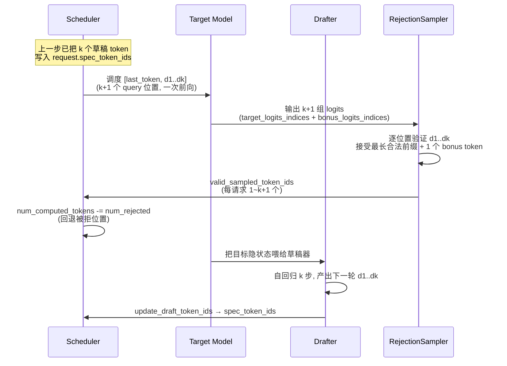
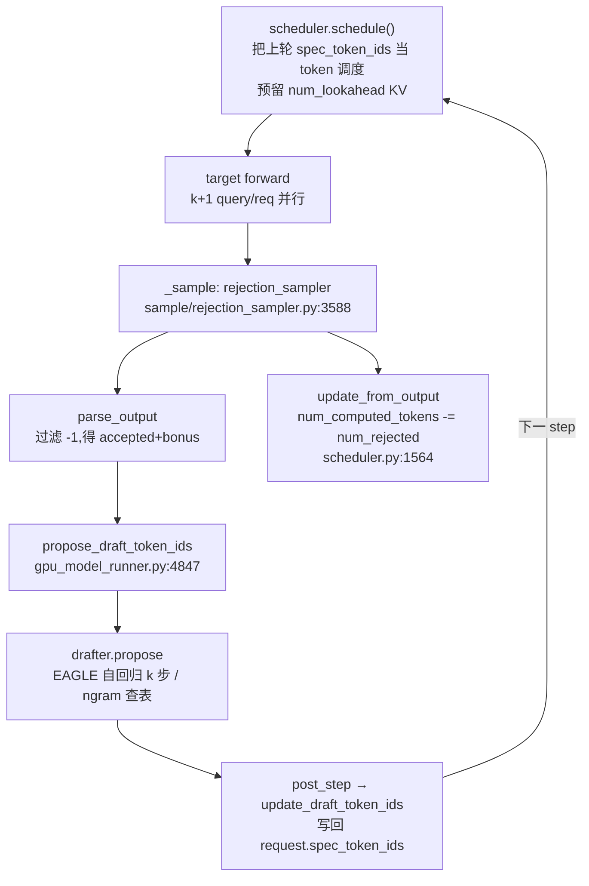

# vLLM 投机解码 —— 草稿提议器(n-gram/EAGLE/Medusa/MTP)与拒绝采样

> **代码基准**:vLLM `main` @ `485bbe1c6`(2026-06-21)· V1 引擎
> **最后更新**:2026-06-22 · **系列**:vLLM 推理引擎源码级分析(见 [[vllm/index]])
> **分析维度**:Overview → Quick Start → Deep Dive
>
> 本页回答:vLLM V1 如何用「草稿提议器一次提 k 个 token + 目标模型一次前向并行验证 + 拒绝采样接受最长合法前缀」把逐 token 串行解码压缩成几步并行解码。它讲清**验收侧的算法与内核**(提议器家族、草稿时序、拒绝采样数学与 Triton 实现);**调度侧的 lookahead 预留与拒绝回退**由 [[vllm_scheduler_analysis]] 主讲,本页只补「回退如何被验收结果驱动」这一环。

---

## 一、Overview(总览)

### 1.1 投机解码的定位

自回归解码的根本瓶颈是**串行**:生成 N 个 token 必须做 N 次目标模型前向,每次只产出 1 个 token,而单次前向严重受显存带宽限制(batch 小时算力闲置)。投机解码(Speculative Decoding)的核心洞察是:

> 用一个**便宜的草稿器(drafter)**一次性猜出未来 $k$ 个 token,再让**昂贵的目标模型(target)在一次前向里并行验证这 $k+1$ 个位置**,用**拒绝采样**接受其中最长的合法前缀。只要草稿命中率足够高,一次目标前向就能吐出多个 token,且**输出分布与原始目标模型逐 token 采样完全等价**(数学无偏)。

收益来自:目标前向从「1 token/次」变成「平均 $1+\bar{a}$ token/次」($\bar{a}$ 为平均接受长度),而代价仅是一个轻量草稿器。



注意时序的**关键交错**:草稿生成发生在**目标前向之后**(复用刚算出的隐状态),所以「第 t 步的草稿」和「第 t 步的验证」在同一次 `EngineCore.step()` 里完成 —— 见 `gpu_model_runner.py:4476` 的 `propose_draft_token_ids` 紧跟在采样之后。

### 1.2 提议器家族

vLLM V1 把「怎么猜」抽象成**多种 proposer**,由 `SpeculativeConfig.method` 选择(类型枚举见 `vllm/config/speculative.py:60` `SpeculativeMethod`)。经典 GPU runner(`gpu_model_runner.py:548-619`)按 method 实例化对应 drafter:

| 方法 `method` | 是否需草稿模型 | 是否用目标隐状态 | 一次产出 | 实现类 / 文件 | 适用场景 |
|---|---|---|---|---|---|
| `ngram` | 否(无模型) | 否 | k(prompt 内查表) | `NgramProposer` `ngram_proposer.py:12` | 长上下文、强重复(代码补全、RAG、JSON) |
| `ngram_gpu` | 否 | 否 | k(GPU 上查表) | `NgramProposerGPU` `ngram_proposer_gpu.py` | 同上,大 batch 免 CPU 同步 |
| `eagle` / `eagle3` | 是(轻量草稿头) | **是**(复用 target hidden) | k(自回归) | `EagleProposer` `eagle.py:10` | 通用,命中率高,主流选择 |
| `medusa` | 是(多个并行头) | 是 | k(每头 argmax) | `MedusaProposer` `medusa.py:18` | 单次前向出 k 个,无自回归 |
| `mtp` | 是(模型自带 MTP 模块) | 是 | k | `EagleProposer`(走 `use_eagle()`) | DeepSeek-V3/Qwen 等带 MTP 权重的模型 |
| `dflash` | 是 | 是 | k(并行 in-fill) | `DFlashProposer` `dflash.py` | 实验性,一次填充全部草稿 |
| `draft_model` | 是(独立小模型) | 否 | k(自回归) | `DraftModelProposer` `draft_model.py:17` | 有现成同族小模型(如 1B 草稿 70B) |
| `suffix` | 否(后缀树) | 否 | 动态 | `SuffixDecodingProposer` `suffix_decoding.py:9` | 多轮对话、agent,跨请求复用后缀 |
| `extract_hidden_states` | 是 | 是 | k | `ExtractHiddenStatesProposer` `extract_hidden_states.py:28` | 研究/蒸馏:导出 aux 隐状态 |
| `custom_class` | 用户自定义 | — | — | `create_custom_proposer` `custom_class_proposer.py` | 插件式扩展 |

> [!note] 两套运行时并存
> 仓库里有**两套**投机解码运行时:① 经典 runner `vllm/v1/worker/gpu_model_runner.py` 调用 `vllm/v1/spec_decode/` 下的 **Proposer** + `vllm/v1/sample/rejection_sampler.py`;② 新一代 runner `vllm/v1/worker/gpu/model_runner.py` 调用 `vllm/v1/worker/gpu/spec_decode/` 下的 **Speculator**(`init_speculator` 工厂,`__init__.py:8`)+ 同目录的 `rejection_sampler.py`。本页以**经典路径为主线**(它覆盖全部 method),在 §3.2、§3.4 标注新 Speculator 路径的对应实现。

---

## 二、Quick Start(快速上手)

投机解码统一通过 `--speculative-config`(JSON)开启。

**最简:n-gram(零额外模型,最易验证收益)**

```bash
vllm serve meta-llama/Llama-3.1-8B-Instruct \
  --speculative-config '{"method":"ngram","num_speculative_tokens":5,"prompt_lookup_min":3,"prompt_lookup_max":5}'
```

- `num_speculative_tokens`:每步最多猜几个(即 $k$),`speculative.py:81`。
- `prompt_lookup_min/max`:n-gram 匹配长度区间,`speculative.py:141-144`;若都不填,`__post_init__` 默认置 5/5(`speculative.py:637-638`)。

**EAGLE3(命中率最高的通用方案)**

```bash
vllm serve meta-llama/Llama-3.1-8B-Instruct \
  --speculative-config '{"model":"yuhuili/EAGLE3-LLaMA3.1-Instruct-8B","num_speculative_tokens":5}'
```

- 不写 `method` 时,`__post_init__` 会从草稿模型名/`model_type` **自动探测**(`speculative.py:735-755`):名字含 `eagle3`→`eagle3`,含 `medusa`→`medusa`,`model_type` 属 `MTPModelTypes`→`mtp`。

**MTP(DeepSeek-V3 风格,草稿头随主模型权重一起加载)**

```bash
vllm serve deepseek-ai/DeepSeek-V3 \
  --speculative-config '{"method":"mtp","num_speculative_tokens":1}'
```

**关键代码入口**

| 阶段 | 入口 | 锚点 |
|---|---|---|
| 配置解析/方法探测 | `SpeculativeConfig.__post_init__` | `config/speculative.py:564` |
| drafter 实例化 | `GPUModelRunner.__init__` 内分支 | `gpu_model_runner.py:548-619` |
| 草稿生成 | `propose_draft_token_ids` | `gpu_model_runner.py:4847` |
| EAGLE 自回归核心 | `SpecDecodeBaseProposer.propose` | `spec_decode/llm_base_proposer.py:443` |
| 拒绝采样调用 | `GPUModelRunner._sample` | `gpu_model_runner.py:3588` |
| 拒绝采样实现 | `RejectionSampler.forward` / `rejection_sample` | `sample/rejection_sampler.py:88 / 394` |
| 草稿回传调度器 | `EngineCore.post_step` | `engine/core.py:510` |

---

## 三、Deep Dive(源码级深挖)

### 3.1 提议器协议:三类「propose 签名」

vLLM 并没有一个强制的 ABC 协议(经典路径),而是按 method 在 `propose_draft_token_ids`(`gpu_model_runner.py:4847`)里**鸭子类型**分发。三类签名差异本质反映了「草稿器需要什么输入」:

1. **无模型类(ngram / suffix)** —— 只看 token,不看隐状态。
   `NgramProposer.propose(num_spec, sampled_token_ids, num_tokens_no_spec, token_ids_cpu)`(`ngram_proposer.py:135`),返回 `list[list[int]]`。调用点 `gpu_model_runner.py:4870`。
2. **隐状态类(medusa)** —— 吃目标隐状态,输出 token 张量。
   `MedusaProposer.propose(num_spec, target_hidden_states, sampling_metadata)`(`medusa.py:40`)。
3. **自回归类(eagle/eagle3/mtp/dflash/draft_model)** —— 统一走 `SpecDecodeBaseProposer.propose`(`llm_base_proposer.py:443`),签名最重:`(target_token_ids, target_positions, target_hidden_states, next_token_ids, common_attn_metadata, sampling_metadata, num_rejected_tokens_gpu, ...)`。调用点 `gpu_model_runner.py:5105`。

`EagleProposer` 与 `DraftModelProposer` 都只是 `SpecDecodeBaseProposer` 的薄封装,唯一区别是构造参数 `pass_hidden_states_to_model`:

```python
# eagle.py:10  —— EAGLE 把目标隐状态喂进草稿头
class EagleProposer(SpecDecodeBaseProposer):
    super().__init__(..., pass_hidden_states_to_model=True, ...)

# draft_model.py:17  —— 独立草稿模型不吃目标隐状态
class DraftModelProposer(SpecDecodeBaseProposer):
    super().__init__(..., pass_hidden_states_to_model=False, ...)
```

`DraftModelProposer` 额外校验:草稿模型与目标模型 vocab 必须一致(`draft_model.py:33`)、draft TP 必须等于 target TP(`draft_model.py:36-51`,否则 torch.compile 缓存会串扰)。

### 3.2 n-gram:无模型的「prompt 内查表」

n-gram 提议器完全不跑模型,而是在已生成序列里找「最近一次出现的、与当前后缀匹配的 n-gram」,把它后面的 $k$ 个 token 当草稿。算法是**反转 + KMP 的 LPS(最长前后缀)**,跑在 numba JIT 上:

- `_find_longest_matched_ngram_and_propose_tokens`(`ngram_proposer.py:206`):把 token 反转,用 `lps` 数组在 $O(n)$ 内找到最右(即原序列最早)的、长度落在 `[min_n, max_n]` 的匹配,返回其后 $k$ 个 token(`ngram_proposer.py:291-293`)。
- `batch_propose_numba`(`ngram_proposer.py:177`,`@njit(parallel=True)`):用 `prange` 对整个 batch 并行;线程数受 `num_tokens_threshold=8192`(`ngram_proposer.py:36`)与物理核数/TP 限制(`ngram_proposer.py:40-51`)。
- 构造时主动跑一次 `propose` 触发 JIT 预热(`ngram_proposer.py:57-62`)。

因为没有草稿模型,n-gram 的草稿 token **没有 draft 概率分布**(下游拒绝采样走 `NO_DRAFT_PROBS` 分支,见 §3.5)。`suffix` 类似但用 Arctic Inference 的后缀树缓存(`suffix_decoding.py:30`),能**跨解码步、跨请求**复用模式,每步产出的草稿数是动态的(`suffix_decoding.py:81-89`)。

### 3.3 EAGLE 草稿时序:隐状态复用 + 自回归 k 步

EAGLE 是主线方案,核心在 `SpecDecodeBaseProposer.propose`(`llm_base_proposer.py:443`)。理解它要抓住两点:**输入移位**与**k 步自回归循环**。

**(1) 输入移位(shift-by-one)** —— EAGLE 草稿头的输入是「目标 token 序列左移一位、末位填入刚采样的 next_token」,隐状态则直接用目标的:

```python
# llm_base_proposer.py:759-764  (set_inputs_first_pass)
# Shift the input ids by one token.
# E.g., [a1, b1, b2, c1, c2, c3] -> [b1, b2, c1, c2, c3, c3]
self.input_ids[: num_tokens - 1] = target_token_ids[1:]
# Replace the last token with the next token.
# E.g., -> [a2, b2, b3, c2, c3, c4]
self.input_ids[token_indices_to_sample] = next_token_ids
self.hidden_states[:num_tokens] = target_hidden_states   # 复用目标隐状态
```

这正是 EAGLE 的精髓:草稿头不重新编码 prompt,而是**站在目标模型已经算好的隐状态肩膀上**预测下一个 token,所以「轻量」。`target_hidden_states` 来自目标前向的输出(`gpu_model_runner.py:5057`);EAGLE3 还会把多层 aux 隐状态拼接(`gpu_model_runner.py:5053`,`use_aux_hidden_state_outputs`),再由草稿头 `combine_hidden_states` 融合(`llm_base_proposer.py:480`)。

**(2) k 步自回归循环** —— 第 1 个草稿 token 在首次前向后直接采样;其余 $k-1$ 个在循环里逐步生成,每步把上一步草稿当输入、重建注意力元数据、再前向:

```python
# llm_base_proposer.py:613  for token_index in range(self.num_speculative_tokens - 1):
input_ids = draft_token_ids_list[-1].int()              # 上一步草稿当本步输入
positions = self._update_positions_dependent_metadata(...)  # 位置 +1
_, per_layer_attn_metadata = self.build_per_group_and_layer_attn_metadata(
    common_attn_metadata, draft_index=token_index + 1)  # 每步重建 attn 元数据
...
ret_hidden_states = self.model(**model_kwargs)          # 草稿头前向
draft_token_ids, draft_probs = self._sample_draft_tokens(...)
draft_token_ids_list.append(draft_token_ids)
# 末尾堆叠成 [batch_size, num_speculative_tokens]   (llm_base_proposer.py:684)
```

草稿 token 的采样在 `_sample_draft_tokens`(`llm_base_proposer.py:430`):默认**贪心 argmax**(`_greedy_sample:411`);仅当 `draft_sample_method="probabilistic"`(`speculative.py:265`)且非全贪心时,才走 `compute_probs_and_sample_next_token` 并**额外返回 draft_probs**(`llm_base_proposer.py:435-438`),供拒绝采样做严格 speculative sampling。Medusa 是特例:多头一次前向,各头 argmax 直接堆叠(`medusa.py:51-56`),无自回归。

> **新 Speculator 路径**:`DraftModelSpeculator.sample_draft`(`worker/gpu/spec_decode/speculator.py:214`)用 `gumbel_sample`(Gumbel-max)做草稿采样,probabilistic 模式下把处理后的 logits 写进 `draft_logits` 缓冲(`speculator.py:125-133`),与目标侧 Gumbel 噪声对齐(注释见 `speculator.py:226-233`)。EAGLE 在该路径下是 `EagleSpeculator(AutoRegressiveSpeculator)`(`eagle/speculator.py:12`),工厂分发见 `init_speculator`(`worker/gpu/spec_decode/__init__.py:8`)。

> [!note] MTP(多 token 预测)为何复用 EAGLE 路径
> DeepSeek-V3/Qwen 等模型在主权重里**自带 MTP 模块**(若干个轻量预测头),`SpeculativeConfig.use_eagle()` 把 `mtp` 也算作 EAGLE 类(`speculative.py:1110` 返回 `method in ("eagle","eagle3","mtp","dflash")`),因此经典 runner 直接用 `EagleProposer` 驱动它(`gpu_model_runner.py:600`)。差异仅在「草稿模型从哪来」:EAGLE 需外挂草稿头权重,而 MTP 的草稿头与目标共用同一 checkpoint —— `__post_init__` 把 `self.model` 设为目标模型路径(`speculative.py:604`),再据此构建 `draft_model_config`(`speculative.py:713`,`runner="draft"`)。DeepSeek-V4 的 MTP 还会消费目标的 pre-`hc_head` 残差(`hidden_size *= hc_mult`,`llm_base_proposer.py:89-96`)。模型侧 MTP 的训练与结构原理见 [[deepseek_v3_analysis]]。`gemma4_mtp`/`step3p5_mtp` 是带专用 runner 分支的 MTP 变体(`use_gemma4_mtp` `speculative.py:1093`)。

### 3.4 验证侧元数据:SpecDecodeMetadata 与 logits 索引

草稿交给目标验证前,runner 把每请求的草稿打平成一维并构造 `SpecDecodeMetadata`(`spec_decode/metadata.py:10`),它告诉拒绝采样器「目标 logits 的哪些行是待验证的草稿位置、哪些行是 bonus 位置」:

| 字段 | 形状 | 含义 |
|---|---|---|
| `draft_token_ids` | `[num_tokens]` | 全 batch 打平的草稿 token |
| `num_draft_tokens` / `cu_num_draft_tokens` | `[batch]` | 每请求草稿数 / 其前缀和 |
| `target_logits_indices` | `[num_tokens]` | 目标 logits 中**草稿位置**的行号 |
| `bonus_logits_indices` | `[batch]` | 目标 logits 中**bonus 位置**的行号(每请求 1 个) |
| `max_spec_len` | 标量 | `max(num_draft_tokens)`,`metadata.py:27` |

目标模型对每个请求一次前向 $k+1$ 个 query 位置(原始位置 + k 个草稿),所以一个 batch 内**各请求 query 长度可变**;这要求注意力后端用变长 query 元数据。再加上**草稿模型有独立的 KV cache group**(`validate_same_kv_cache_group` `llm_base_proposer.py:1575`,`draft_attn_groups`),以及 EAGLE 自回归每步位置都在变 —— 因此注意力元数据天然是**按 group/按 step 构建的一组**(`build_per_group_and_layer_attn_metadata` `llm_base_proposer.py:906`,循环内每步重建 `llm_base_proposer.py:631-636`),而非单个静态对象。这也是「attn_metadata 为何变成 list」的根因:多 KV-group × 多草稿步。

### 3.5 拒绝采样:标准 speculative sampling 的数学与实现

主实现在 `vllm/v1/sample/rejection_sampler.py`,类 `RejectionSampler(nn.Module)`(`:37`),严格实现论文 [arxiv 2211.17192](https://arxiv.org/abs/2211.17192)。其术语在文件头注释定义得很清楚(`:38-58`):

- **accepted**:按 draft/target 概率关系被接受的草稿 token;
- **recovered**:某位置被拒后,从「修正分布」重采样得到的替换 token;
- **bonus**:若 $k$ 个草稿**全被接受**,在末尾追加一个**只从目标分布**采的奖励 token;
- **output** = accepted + recovered + bonus。

**数学(随机采样路径)** —— 设草稿在某位置给出 token $x$、草稿概率 $q(x)$、目标概率 $p(x)$:

$$\text{accept } x \text{ with prob } \min\!\left(1, \frac{p(x)}{q(x)}\right)$$

被拒则从**残差分布**重采样替换 token,并**停止**该请求后续草稿:

$$x' \sim p'(\cdot),\quad p'(x)=\frac{\max\big(p(x)-q(x),\,0\big)}{\sum_v \max\big(p(v)-q(v),\,0\big)}$$

可证:接受 + 残差重采样的复合分布**恰为 $p$**,故输出与目标模型逐 token 采样**严格同分布(无偏)**。

**贪心 vs 随机两条内核路径**(`rejection_sample` `sample/rejection_sampler.py:394`):

- **全贪心**走 `rejection_greedy_sample_kernel`(`:714`):草稿 token 等于目标 argmax 才接受,否则写入目标 argmax 并停止 ——
  ```python
  # :755-756
  token_id = target_argmax_id
  rejected = draft_token_id != target_argmax_id
  ```
  若 `all_greedy` 则直接返回(`:468-469`),省掉 softmax 与残差采样。
- **含随机**走 `rejection_random_sample_kernel`(`:772`):核心接受判据
  ```python
  # :825
  accepted = draft_prob > 0 and target_prob / draft_prob >= uniform_prob
  ```
  其中 `uniform_prob` 由 `generate_uniform_probs`(`:608`,用 **float64** 避免采到精确 0,`:639-643`)给出。被拒时取 `recovered_token_ids`(`:830`)。

**recovered token 的高效采样**(`sample_recovered_tokens` `:663` + kernel `:868`):残差分布 $\max(p-q,0)$ 不显式归一化,而是用 **Gumbel-max 技巧**直接取 argmax —— 对每个 vocab 项算 `score = max(target-draft,0) * inv_q`(`inv_q` 为指数分布的倒数,即 Gumbel 噪声,`:687-694`),取最大者(`:940-946`)。对 n-gram 这类无 draft 概率的情形,走 `NO_DRAFT_PROBS` 分支:`draft_prob=1`,残差退化为「目标分布去掉草稿 token」(`:909-913`)。

**bonus token**:由主采样器**单独**采(`forward:130` `predict_bonus_token=True`),只有当全部草稿接受时才写入输出末位(`:762-768` / `:835-841`)。这样设计让 bonus token 能享受 top-p/top-k 等草稿位置不支持的采样策略(注释 `:47-54`)。

**输出解析**:被拒位置在输出缓冲里填 `PLACEHOLDER_TOKEN_ID = -1`(`:30`),`parse_output`(`:248`)按掩码过滤出每请求的有效 token 列表。整个 batch 的草稿位置受 `MAX_SPEC_LEN = 128` 约束(`:34`,`forward:119` 断言)。

> [!note] synthetic 接受率(基准测试用)
> `rejection_sample_method="synthetic"`(`speculative.py:200`)不真正比对概率,而是按一条**递减的人造接受率**曲线决定接受/拒绝(`unconditional_to_conditional_rates` `spec_decode/utils.py:598`),用于在不依赖真实草稿质量的前提下压测投机解码的系统开销。

调用侧 `RejectionSampler.forward`(`:88`)的顺序:取 bonus_logits 单独采样 → 取 target_logits 转 float32 → `apply_logits_processors`(惩罚/bad_words/min_tokens,`:285`,注意需把草稿 token 也展开进历史)→ `apply_sampling_constraints`(温度/top-k/top-p,`:510`)→ `rejection_sample`。runner 侧入口在 `_sample`(`gpu_model_runner.py:3565`):无草稿时走普通 `sampler`,有草稿时走 `rejection_sampler`(`:3588`),结果再由 `RejectionSampler.parse_output`(`:3664`)拆成 list。

### 3.6 与调度器 / KV / CUDA Graph 的配合

**(1) lookahead 预留**:调度器在构造时按 method 算 `num_lookahead_tokens`(`scheduler.py:230-249`):

```python
# scheduler.py:240-249
if speculative_config.use_eagle():        # eagle/eagle3/mtp/dflash
    self.num_lookahead_tokens = self.num_spec_tokens
if speculative_config.uses_draft_model():
    self.num_lookahead_tokens = self.num_spec_tokens
if speculative_config.use_dflash():       # in-fill 需额外 1 槽
    self.num_lookahead_tokens = self.num_spec_tokens + 1
```

注意 **ngram/suffix/medusa 的 lookahead 为 0** —— 它们的草稿不需要草稿模型的独立前向 KV,而是作为普通 `spec_token_ids` 被下一步当作正常 token 调度(`num_tokens_with_spec - num_computed_tokens`,`scheduler.py:463-467`)。EAGLE/draft_model 则要为草稿前向**预留 KV 槽**,所以 `allocate_slots` 带上 `num_lookahead_tokens`。

**(2) 草稿 token 的 KV 处理与拒绝回退**:目标验证时草稿位置的 KV 会被写入;一旦某位置被拒,这些「白算」的 KV 必须作废。调度器在 `update_from_output` 里依据验收结果回退:

```python
# scheduler.py:1554-1564
num_draft_tokens = len(scheduled_spec_token_ids)
num_sampled  = self.num_sampled_tokens_per_step          # =1: 必出的 bonus/recovered token
num_accepted = max(len(generated_token_ids) - num_sampled, 0)
num_rejected = num_draft_tokens - num_accepted
if request.num_computed_tokens > 0:
    request.num_computed_tokens -= num_rejected           # ★ 回退被拒位置
```

`num_computed_tokens` 减去被拒数后,下一步调度会**重新覆盖**这些位置(对应 KV 槽被新内容写回),自然完成回滚。草稿前向内部对被拒/padding token 用 `is_rejected_token_mask` + `compute_new_slot_mapping`(`llm_base_proposer.py:854`)把它们映射到**padding 槽**,避免污染真实 KV。接受统计经 `make_spec_decoding_stats`(`scheduler.py:1569`)汇入指标(`spec_decode/metrics.py`)。

**(3) 草稿回传(异步与否两条路)**:草稿在 worker 产出后要写回 `request.spec_token_ids` 供下一步调度。同步调度走 `EngineCore.post_step`(`engine/core.py:510`):`take_draft_token_ids`(`gpu_model_runner.py:4726`)→ `scheduler.update_draft_token_ids`(`scheduler.py:1896`);异步调度则在输出阶段走 `update_draft_token_ids_in_output`(`scheduler.py:1918`,`engine/core.py:615-622`)。是否启用由 `check_for_draft_tokens`(`engine/core.py:160`)门控。

**(4) CUDA Graph 配合**:草稿器持有**自己的** `CudagraphDispatcher`(`llm_base_proposer.py:151`),key 由 `initialize_cudagraph_keys`(`:394`)注册;EAGLE 自回归每步前 `_determine_batch_execution_and_padding`(`:1660`)把 batch padding 到已捕获的图尺寸,并选择 PIECEWISE / FULL 运行模式。由于草稿步 batch 形状高度规则(每请求恰 1 query),非常适合 CUDA Graph 重放 —— 细节见 [[vllm_compilation_cudagraph_analysis]]。注意力后端如何在变长 query 下支持验证与草稿,见 [[vllm_attention_backends_analysis]]。

### 3.7 端到端串联(一次 step 内)



一句话总结:**调度器把草稿当普通 token 排进前向 → 目标一次算出 k+1 组 logits → 拒绝采样接受最长前缀 + bonus → 调度器按拒绝数回退 → 草稿器复用隐状态再猜下一轮**。整个闭环在单次 `EngineCore.step()` 内完成,平均每步多吐 $\bar{a}$ 个 token 而保持输出分布无偏。

---

## Related Pages
- [[vllm_scheduler_analysis]] · [[vllm_compilation_cudagraph_analysis]] · [[vllm_attention_backends_analysis]] · [[vllm_feature_optimizations_overview]]
- [[vllm/index]] · [[../index]]

## Cross-Domain Links
- [[megatron_inference_engine_analysis]] —— 训练框架推理引擎对照
- [[deepseek_v3_analysis]] —— MTP(多 token 预测)模型侧原理
- [[dspark_analysis]] —— DSpark:半自回归草稿 + 置信度调度验证(本页 dflash/mtp proposer 的算法演进与生产落地)
- [[speculative_decoding/index]] —— 投机推理草稿器演进总览(MTP → Eagle3 → DFlash → DSpark)
