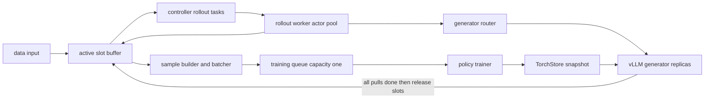

# TitanRL 异步 RL：版本窗口、全局 token 归一化与 GRPO/DAPO

> **论点式副标题**：TitanRL 的核心不是把 PPO loss 接到 vLLM，而是用 active-slot 账本把异步 rollout、有限 off-policy 窗口、全局有效 token 分母和版本化权重发布约束成一个可推进的系统；loss 只消费这套控制面已经建立的数据不变量。
>
> **源码基线**：pytorch/torchtitan `main@a3168782c9a3a2e40afbd0de114818b96e2bda6e`（2026-08-26）
> **核验日期**：2026-08-27
>
> **本页回答**：异步 controller 如何施加 backpressure；rollout worker 为什么移出 controller 进程；policy version 与 TorchStore 如何热更新；batch 如何按 prompt group 聚合、按全局 response token 归一化；GRPO/DAPO 实现究竟相差什么；checkpoint/restart 保存与遗漏什么；以及零有效 token batch 是否仍会错误推进 optimizer/version。
>
> **兄弟页边界**：GRPO/DAPO 的论文推导由理论页负责；跨框架控制面比较由后训练 Infra 页负责；本页只解释该固定 TorchTitan baseline 的 live `torchtitan/experiments/rl` 实现与有证据的失败边界。

---

## 1. Overview

### 1.1 背景与问题

异步 RL 同时存在四种速度不同的工作：读取 prompt、环境交互与采样、样本 packing、策略训练。若 trainer 同步等待一整批 rollout，长尾环境会制造全局 barrier；若只让 rollout 无限领先，trainer 又会消费过旧行为策略产生的数据。当前 `AsyncLoopConfig` 因而同时配置每步 prompt group 数 $P$、每 prompt sibling 数、目标 off-policy 步数 $S$ 和窗口比例，而不是只配置一个 batch size（`torchtitan/experiments/rl/controller.py:153-190`）。

### 1.2 Thesis：选中的设计与被否定的替代

当前实现选择“**有界异步流水 + anchored windowed FIFO + 版本化快照发布**”，而不是“生成一批、训练一步、同步更新”的 barrier，也不是“无界 producer queue”。决定标准是：允许窗口内绕过长尾，提高设备利用率；同时让容量、消费次序和权重 pull 完成时点共同给出硬 freshness 上界（`torchtitan/experiments/rl/components/work_buffer.py:54-83`、`torchtitan/experiments/rl/components/weight_sync.py:115-132`）。

更重要的纠偏是：当前 GRPO 与 DAPO **不拥有两套控制流，也不由 advantage 是否除标准差来区分**。`GRPOLoss` 直接复用 `DAPOLoss`，只把上下 ratio clip 设为同一个 `clip_eps`；组内标准差归一化则是独立、默认关闭的 advantage 配置（`torchtitan/experiments/rl/losses/grpo.py:17-36`、`torchtitan/experiments/rl/rollout/advantage.py:22-46`）。

### 1.3 概念与 owner

| 概念 | 当前 owner | 不变量 |
|---|---|---|
| 有限训练时钟 | `Controller._trainer_loop` | producer 无限运行，trainer 的有限 step 完成触发统一 shutdown（`torchtitan/experiments/rl/controller.py:757-768`） |
| rollout 生命周期 | `RolloutGroupWorkBuffer` | `WAITING -> INFLIGHT -> FINALIZED`；被 batcher 取走也不等于 slot 已释放（`torchtitan/experiments/rl/components/work_buffer.py:23-28`、`torchtitan/experiments/rl/components/work_buffer.py:64-72`） |
| 环境与 reward | `RolloutWorker` actor pool | worker 持有 renderer、env、rubric；generator 只提供 token 生成（`torchtitan/experiments/rl/rollout/rollouter.py:214-248`、`torchtitan/experiments/rl/rollout/rollouter.py:293-363`） |
| 训练 batch | `TrainingSampleBuilder` + `Batcher` | 按可训练 prompt groups 凑批，按全局有效 response tokens 归一化（`torchtitan/experiments/rl/components/batcher.py:104-167`） |
| 权重与版本 | `WeightSyncManager` + TorchStore | `push -> pull -> slot release`；下一步 fwd/bwd 可与发布重叠（`torchtitan/experiments/rl/components/weight_sync.py:30-50`） |

### 1.4 关键图

### 1.5 Quick Start：可追踪调用链

1. `Controller.setup_async` 建 trainer/generator/router/rollout-worker actor，初始化 TorchStore，并在 fresh run 或 resume 的 `start_step` 上先做一次初始 push/pull（`torchtitan/experiments/rl/controller.py:529-674`）。
2. `Controller.run` 创建 active buffer、容量为 1 的 training queue、每 active slot 一个 rollout task，以及 data/batcher/trainer tasks（`torchtitan/experiments/rl/controller.py:779-856`）。
3. rollout worker 并发驱动 sibling envs，评分后计算 group-relative advantage；builder 过滤无训练信号的 sample，batcher 凑够 $P$ 个可训练 groups 后 packing（`torchtitan/experiments/rl/rollout/rollouter.py:320-363`、`torchtitan/experiments/rl/components/training_sample_builder.py:111-170`）。
4. trainer 用预先算好的全局有效 token 数完成所有 microbatch forward/backward，随后 optimizer/version 前进，并异步发布新权重（`torchtitan/experiments/rl/controller.py:1090-1139`）。
5. 全部 generator pull 完成后才释放本 step 的 $P$ 个 slots；这一步把权重 freshness 与新 prompt admission 接起来（`torchtitan/experiments/rl/components/weight_sync.py:115-132`）。

---

## 2. 异步编排与 RolloutWorker 隔离

### 2.1 背景 / 问题

环境 step、renderer、reward 可能是 CPU 密集或阻塞 I/O；若它们留在 controller 进程，controller 的 Python GIL 与训练调度、metrics、routing 争用，GPU 侧 generator 即使有连续 batching 也可能吃不满。controller 自己还要管理有限训练时钟与异常清理，不能同时成为所有环境工作的执行器（`torchtitan/experiments/rl/controller.py:858-888`）。

### 2.2 为什么这样设计

当前路线是：controller 保留每个 active slot 的轻量 asyncio rollout task，把真正的 group 执行发送到独立 CPU `RolloutWorkerActor` pool；明显替代是直接在 controller 进程运行 `run_group_rollouts`。提交 `30eb5e5027e339665c3b296fbfd512ef0e532cef` 明确记录了后者的 CPU/GIL bottleneck，因而把执行迁到 Monarch actor mesh；提交 `294c17cd49621a841a86196310021a774c24b56f` 又把 actor API 统一为 `concurrent_endpoint`。判据是隔离 CPU/GIL 争用，而不是改变 rollout 的算法语义。

renderer 也不是每次 RPC 动态注入。提交 `f037bd1e095a0acee94128fc07cda2884f3365a6` 记录了 renderer 作为大 IPC payload 的代价；当前 worker 在 `setup_async` 时构建一次并持有它，代价是失去逐调用替换 renderer 的灵活性（`torchtitan/experiments/rl/actors/rollout_worker.py:21-45`、`torchtitan/experiments/rl/rollout/rollouter.py:241-248`）。

### 2.3 当前实现 / 状态 / 调用链

`Rollouter.setup_async` 在 controller host 上按 `worker_pool_size` 建 CPU proc mesh，spawn worker actors，再向所有 worker 一次发送 renderer 配置；`run_group_rollouts` 通过 Monarch `choose` 把一个 group 交给池中一个 actor（`torchtitan/experiments/rl/rollout/rollouter.py:135-160`、`torchtitan/experiments/rl/rollout/rollouter.py:175-211`）。actor 的 `setup_async`、`run_group` 和日志 step 都是 concurrent endpoints，actor 进程还安装受配置约束的 thread pool（`torchtitan/experiments/rl/actors/rollout_worker.py:21-67`）。

一个 worker 将同一 prompt 扩成 sibling envs，以 `asyncio.gather` 并发运行，关闭 env 后统一评分和计算 advantage（`torchtitan/experiments/rl/rollout/rollouter.py:320-363`）。单个 rollout 则循环 `generate -> env.step`；`routing_session_id` 去掉 turn id，让多轮请求可复用同一 generator 的 prefix cache，同时每 turn 保存 completion token、生成 log-prob 和版本范围（`torchtitan/experiments/rl/rollout/rollouter.py:391-428`）。

### 2.4 成本 / 失败边界

actor pool 只隔离 CPU 执行，并不让失败悄然消失：controller 捕获 group 异常，将其转成空 rollout group 和失败 metric，随后仍由 builder/batcher 释放 slot（`torchtitan/experiments/rl/controller.py:940-988`）。但异常 group 不会触发 optimizer step；若 producer task 意外退出，`run` 把它视为系统错误并走 close/cancel/gather，而非把 producer 正常结束误判为训练完成（`torchtitan/experiments/rl/controller.py:858-888`）。

### 2.5 有锚点的趋势

源码只锚定了两项后续方向：复用 sibling 首轮 prompt 的 tokenization，以及让粗粒度自定义 rollouter 可不生成闲置 worker pool（`torchtitan/experiments/rl/rollout/rollouter.py:75-84`、`torchtitan/experiments/rl/rollout/rollouter.py:326-327`）。除此之外，不从 actor 拆分推断远程弹性或 exactly-once rollout。

---

## 3. 版本窗口与 backpressure：一份 slot 账本约束整条流水

### 3.1 背景 / 问题

严格 FIFO 能保持最新，但最老的慢 rollout 会阻塞已经完成的年轻 group；任意乱序消费能提高吞吐，却会让被绕过 group 的 policy age 无界增长。只限制 asyncio queue 也不够，因为 group 可能已经离开 buffer、进入 packing 或 training，仍然占用 freshness 预算。

### 3.2 为什么这样设计

提交 `fd2776584fd0b85cf55ddc7e9ea1f804e6667d7d` 的提交正文把选择写得很清楚：使用 anchored windowed FIFO，在有界 look-ahead 内绕过长尾，同时由显式 `max_offpolicy_steps` 保住硬界。当前实现进一步让 slot 在 generator pull 完成后才释放；相比“batcher take 时释放”，判据是新 rollout 必须在 generator 已更新到新版本后才获准出生，避免 born-stale（`torchtitan/experiments/rl/components/work_buffer.py:64-83`、`torchtitan/experiments/rl/components/weight_sync.py:128-132`）。

### 3.3 当前实现 / 状态 / 调用链

令每个 optimizer step 需要 $P$ 个 prompt groups、目标 off-policy steps 为 $S$、窗口比例为 $f$。配置派生：

$$
B = (S + 1)P, \qquad
W = \max\!\left(1, \left\lfloor fB \right\rfloor\right), \qquad
S_{\mathrm{max}} = \left\lfloor \frac{B + W - 2}{P} \right\rfloor .
$$

这里 $B$ 是 active-slot capacity，$W=1$ 是 strict FIFO；`window_fraction=None` 也强制 $W=1$。这些计算和输入 guard 位于 `AsyncLoopConfig`，不是文档侧估算（`torchtitan/experiments/rl/controller.py:192-256`）。

buffer 的 entry 经 `WAITING -> INFLIGHT -> FINALIZED`，但 active slot 从 `add_work` 一直收费到显式 `release_active_groups`（`torchtitan/experiments/rl/components/work_buffer.py:136-172`、`torchtitan/experiments/rl/components/work_buffer.py:208-233`）。batcher 只在从最老 id 开始的 $W$ 个位置中取最老的 finalized group；取走非 head group 不移动 head（`torchtitan/experiments/rl/components/work_buffer.py:174-206`）。trainer 真正取 batch 时才用 live trainer version 计算 policy age，而不是在较早的 packing 时刻（`torchtitan/experiments/rl/controller.py:1079-1088`）。

### 3.4 成本 / 失败边界

$W>1$ 以更旧但有硬界的数据换吞吐；$W=1$ 则接受 head-of-line blocking。默认冷启动会一次填满整个 active window，而且一个 condition mutation 会 `notify_all` 所有 waiter；这两点分别带来初始 version-0 rollout 偏多和惊群开销（`torchtitan/experiments/rl/components/work_buffer.py:107-115`）。此外，全部 generator pull 完成前不释放任何 trained slot，最慢 generator 会压住全局 admission（`torchtitan/experiments/rl/components/weight_sync.py:123-126`）。

### 3.5 有锚点的趋势

源码 TODO 明确指向 warm start、用 queue/event 代替 condition 广播、以及按 generator 独立释放 slot；后者必须先把 born-fresh 不变量从全局改成 per-generator 才安全（`torchtitan/experiments/rl/components/work_buffer.py:107-115`、`torchtitan/experiments/rl/components/weight_sync.py:123-126`）。

---

## 4. Batching、全局 response-token 分母与零有效 token 审计

### 4.1 背景 / 问题

一个 prompt group 可有多个 sibling；多轮 history 被环境改写时，一个 rollout 还可能分成多个 training samples。用“rollout 条数”凑 batch 会改变每步 prompt 分布；用每张卡自己的 token 数归一化，则 padding、变长 packing 和 gradient accumulation 会改变梯度尺度。更危险的是：对象存在不代表它含有可训练 token。

### 4.2 为什么这样设计

当前路线分三层建立不变量：builder 在 causal shift 后过滤零有效 token sample；batcher 按**可训练 prompt groups**计数并计算全局有效 token 数；trainer 只消费已经完整 packing 的 batch。明显替代是在 loss 里把无效 log-prob 当成零或让 trainer 对空 batch照常 step。提交 `9a99528af2370b27092acd05b2c3cdeb7b5aaf1f` 说明前者会系统性缩小 loss/gradient；提交 `e03cc247bb813b5df1d38e90c32e924b68064957` 说明后者仍会改变权重衰减、optimizer state 和 policy version，因此不是 harmless no-op。

### 4.3 当前实现 / 状态 / 调用链

有效 token 的精确定义是：完成 causal shift 后，`loss_mask[1:]` 为 true，且对应 generator log-prob 有限。builder 用该定义逐 sample 过滤，但保留未过滤 sample 的版本信息与 group metrics（`torchtitan/experiments/rl/components/training_sample_builder.py:26-35`、`torchtitan/experiments/rl/components/training_sample_builder.py:111-170`）。多轮 prefix 保留时拼成一个 sample；history 断开才开新 branch，prompt/env token mask=false，completion token mask=true 并广播 group advantage（`torchtitan/experiments/rl/components/training_sample_builder.py:172-203`、`torchtitan/experiments/rl/components/training_sample_builder.py:258-276`）。

Batcher 再丢弃超过 `seq_len` 的 sample；一个 group 只要没有 survivor 就返回 `group_is_trainable=False`，但 metric-only group 仍随下一批 metrics 前行，不计入凑齐 $P$ 个 groups（`torchtitan/experiments/rl/components/batcher.py:104-147`）。controller 收到 false 会立即释放该 group 的 active slot；只有凑成 batch 才放入容量为 1 的 training queue（`torchtitan/experiments/rl/controller.py:990-1031`）。测试直接断言 metric-only group 不能形成零-token batch，并在后续 trainable group 到来时才产出 `num_global_valid_tokens > 0` 的 batch（`torchtitan/experiments/rl/tests/test_async_controller.py:64-94`）。

packing 后的分母是所有 rows 上

$$
N_{\mathrm{valid}} = \sum_t
\mathbf{1}\!\left[m_t \land \operatorname{isfinite}\!\left(\log q_{\mathrm{gen},t}\right)\right],
$$

并在构造 microbatch grid 前一次算完（`torchtitan/experiments/rl/components/batcher.py:149-198`）。因此 controller 明确不能边 pack 边训练：首个 microbatch forward 前尚不知道全局分母（`torchtitan/experiments/rl/controller.py:1090-1106`）。

### 4.4 成本 / 失败边界：`e03cc247b` 的明确结论

**结论：零有效 token batch 应跳过 optimizer step，也不应推进 policy version。** 当前 HEAD 的标准调用链通过 builder 过滤、batcher 的 trainable-group 计数和 controller 的提前 slot release 实现“根本不生成该 batch”，修复了 `e03cc247b` 描述的问题，也覆盖了“全部 sample 过长”导致 active slot 泄漏的分支（`torchtitan/experiments/rl/components/batcher.py:117-147`、`torchtitan/experiments/rl/controller.py:1020-1030`）。

但这是**上游不变量，不是 trainer 的 defense-in-depth guard**。若自定义 builder 绕过 `_has_valid_loss_token`，或回归产生 `num_global_valid_tokens=0` 的非空 `TrainingBatch`：`DAPOLoss` 会把分母 clamp 到 1，loss 仍是有限的 0；controller 只检查 loss 是否 finite，随后仍调用 `optim_step`；trainer 无条件执行 optimizer、scheduler、zero-grad 并 `policy_version += 1`（`torchtitan/experiments/rl/losses/dapo.py:101-105`、`torchtitan/experiments/rl/controller.py:1108-1126`、`torchtitan/experiments/rl/actors/trainer.py:433-477`）。因此当前失败边界是“标准 builder/batcher 路径安全；trainer 入口本身对零分母不安全”，不能把修复外推到任意可插拔 builder。

### 4.5 有锚点的趋势

源码留下两项可证趋势：若所有 groups 都因零 reward 方差被过滤，batcher 仍可能静默等不到 step；若要 streaming microbatch，需先累计 raw loss/token count 再在 optimizer 前统一缩放（`torchtitan/experiments/rl/components/training_sample_builder.py:88-92`、`torchtitan/experiments/rl/controller.py:1090-1092`）。当前源码没有下游 `N_valid > 0` assert 的 TODO，因此“会增加 trainer 二次 guard”只能记为缺口，不能写成计划。

---

## 5. Policy version、TorchStore 与 hot-swap

### 5.1 背景 / 问题

异步 rollout 需要知道行为策略来自哪个版本，但 generator 又不应直接读取 optimizer 正在修改的 trainer GPU tensor。若每步先 drain 全部请求再更新，版本边界清楚却丢掉重叠；若直接暴露 live tensor，则读取时点与一致性不可控。

### 5.2 为什么这样设计

当前选中 CPU-staged TorchStore snapshot：trainer push 完成后，多个 generator 从同一稳定快照 pull。提交 `ed4e8481ce7bf921ff967554dba290f43e5d7b85` 的正文明确把“避免 generator 暴露于正在被 optimizer 修改的 live trainer tensors”作为动机。提交 `390ea37ccca69129b6ecdae9ebddc07f5486eaf3` 则让 `push -> pull` 与下一步 fwd/bwd 重叠；替代的每步全局 barrier 更简单，但牺牲 trainer/generator 并行度。

### 5.3 当前实现 / 状态 / 调用链

初始化时 TorchStore StorageVolumes 与 trainer mesh 共置，并按 local rank 路由；controller 从 checkpoint 恢复 `policy_version` 后，启动 generator engine loop并做一次对应版本的初始 push/pull（`torchtitan/experiments/rl/controller.py:644-674`）。常规 step 的顺序是：所有 microbatch fwd/bwd；等上一轮 push；optimizer/version 前进；等上一轮 pull；启动本版本的新 push/pull（`torchtitan/experiments/rl/controller.py:1093-1139`）。trainer 用 `direct_rdma=False` 把 model state dict staging 到 CPU StorageVolume，而非发布 optimizer state（`torchtitan/experiments/rl/actors/trainer.py:493-527`）。

generator engine loop 在 step bursts 之间作决定，pull 优先于接收新请求；pull 从 TorchStore 填充自己的 state dict，加载完成后才设置 `policy_version`，可选清 prefix cache（`torchtitan/experiments/rl/actors/generator.py:1079-1136`、`torchtitan/experiments/rl/actors/generator.py:1181-1214`、`torchtitan/experiments/rl/actors/generator.py:1281-1314`）。默认 `hot_swap=True` 时 router 不 drain in-flight turn；关闭后只等当前 routed call idle，因此多轮 rollout 的两个 turn 之间仍可能换版本（`torchtitan/experiments/rl/routing/inter_generator_router.py:86-103`、`torchtitan/experiments/rl/routing/inter_generator_router.py:218-248`）。

### 5.4 成本 / 失败边界

版本 provenance 只精确到每 turn 的 min/max 范围：request admission 记录 min version，完成时用当前 version 扩出 max；类型定义明确尚无逐 token version boundary（`torchtitan/experiments/rl/actors/generator.py:1129-1173`、`torchtitan/experiments/rl/types.py:39-56`）。因此 hot-swap 下不能声称一条 completion 的所有 token 都来自单一 frozen old policy。`hot_swap=False` 还必须开启 pull 后 prefix-cache reset，否则 controller 配置直接报错（`torchtitan/experiments/rl/controller.py:407-415`）。

### 5.5 有锚点的趋势

generator 的 TODO 锚定了用 cumulative output 记录精确 per-token version boundary，以及新 rollout 按版本 salt prefix cache；router 则留下 large generator count 时错峰 fetch 的方向（`torchtitan/experiments/rl/actors/generator.py:1241-1246`、`torchtitan/experiments/rl/actors/generator.py:1307-1311`、`torchtitan/experiments/rl/routing/inter_generator_router.py:242-247`）。

---

## 6. GRPO / DAPO：同一逐 token surrogate，差异只在 clip 形状

### 6.1 背景 / 问题

rollout 使用异步 generator 的实际采样 log-prob，而 trainer 计算当前策略 log-prob；二者需要 importance ratio。序列级 ratio 会让长 completion 的 log-ratio 快速累积，且不能自然配合逐 token mask；组内 reward 又需要先转成 sibling-relative learning signal。

### 6.2 为什么这样设计

当前路线是“组级 advantage、逐 token ratio/loss、全局有效 token 分母”。明显替代是先把整段 log-prob 求和再做 sequence-level clip，或维护额外 frozen old-policy actor；当前实现均未采用。决定标准可从数据结构读出：completion 保存逐 token generator log-prob，sample builder 把一个 rollout 的标量 advantage 广播到 completion tokens，loss 直接逐 token clip（`torchtitan/experiments/rl/rollout/rollouter.py:414-428`、`torchtitan/experiments/rl/components/training_sample_builder.py:258-274`、`torchtitan/experiments/rl/losses/dapo.py:82-105`）。

### 6.3 当前实现 / 状态 / 调用链

同 prompt 的 sibling rewards 为 $R_i$ 时，advantage estimator 为

$$
A_i =
\begin{cases}
\dfrac{R_i - \bar{R}}{\sigma_R + 10^{-6}}, & \text{启用标准差归一化}, \\
R_i - \bar{R}, & \text{默认 Dr.GRPO mean baseline}.
\end{cases}
$$

默认 `should_std_normalize=False`，所以“GRPO 必定除组内标准差”是失效心智模型（`torchtitan/experiments/rl/rollout/advantage.py:30-46`）。对有效 token $t$，实现计算

$$
\rho_t = \exp\!\left(\operatorname{clip}\!\left(
\log p_{\theta,t} - \log q_{\mathrm{gen},t}, -10, 10
\right)\right),
$$

$$
\widehat{\rho}_t = \operatorname{clip}\!\left(
\rho_t, 1-\epsilon_{\mathrm{low}}, 1+\epsilon_{\mathrm{high}}
\right),
$$

$$
\mathcal{L} = -\frac{1}{N_{\mathrm{valid}}}
\sum_t \min\!\left(\rho_t A_t, \widehat{\rho}_t A_t\right)m_t .
$$

非有限 generator log-prob 先从 effective mask 和分母剔除；GRPO 令上下 clip 相同，DAPO 允许更高 upper clip（`torchtitan/experiments/rl/losses/dapo.py:18-35`、`torchtitan/experiments/rl/losses/dapo.py:82-105`、`torchtitan/experiments/rl/losses/grpo.py:17-36`）。trainer 将 packed microbatch 中的 labels、mask、generator log-probs、advantages 传给 loss，然后 backward（`torchtitan/experiments/rl/actors/trainer.py:389-417`）。

### 6.4 成本 / 失败边界

当前 `DAPOLoss` 返回 entropy、log-prob difference、clip fraction 作为 metrics，但没有把 entropy bonus 或 KL penalty 加回 loss（`torchtitan/experiments/rl/losses/dapo.py:107-136`）。`q_gen` 是真实采样路径的 behavior log-prob，不代表另一个常驻 frozen actor；freshness 是版本窗口的责任。默认还会丢弃 reward 方差为零的 group，这是一项 data filter，不是 DAPO 与 GRPO loss 的差别（`torchtitan/experiments/rl/components/training_sample_builder.py:88-109`）。

### 6.5 有锚点的趋势

提交 `e00b27de63d7edfaa6bcc32c43cd570c356ad1f8` 引入了单节点 DAPO-Math reference recipe。当前 recipe 选择 8 prompts/step、16 siblings、目标 off-policy 4、DAPO clip `[0.2, 0.28]`，证明这些部件已接线；它并不证明 DAPO 论文的所有 reward shaping 都实现了（`torchtitan/experiments/rl/examples/dapo_math/config_registry.py:45-76`、`torchtitan/experiments/rl/examples/dapo_math/config_registry.py:101-145`）。

---

## 7. Checkpoint / restart：训练状态可恢复，异步在途状态不可恢复

### 7.1 背景 / 问题

只保存模型权重不足以从中断处继续 RL：optimizer、LR scheduler 和 policy version 必须一致；但若还要恢复 active rollout、routing reservation 和 dataset cursor，checkpoint 就必须覆盖整个异步系统快照，复杂度显著提高。

### 7.2 为什么这样设计

当前选择恢复 trainer 的完整训练状态，再清空异步流水并重新填充；明显替代是做 rollout-level exactly-once snapshot。提交 `c6c2fb2c53abfef0e2cbf81a396a2daede8404fe` 的正文把目标限定为避免 preemption 后丢失 model/optimizer/scheduler/version 进度，并让 generator 回到 trainer 恢复出的版本。判据是可恢复训练 step，而不是重放完全相同的 prompt/rollout 序列。

### 7.3 当前实现 / 状态 / 调用链

`PolicyTrainer` 将 model parts、optimizers、LR schedulers 和 `states={"train_state": self}` 交给 `CheckpointManager`；自身 state dict 只有 `policy_version`（`torchtitan/experiments/rl/actors/trainer.py:173-193`、`torchtitan/experiments/rl/actors/trainer.py:216-228`）。controller 在 finite-loss guard 之后调用 save，避免保存已判定发散的 step（`torchtitan/experiments/rl/controller.py:1108-1110`、`torchtitan/experiments/rl/controller.py:1171-1176`）。resume 时先读取恢复的 version，再让 generators 从 trainer 的 TorchStore snapshot 拉取该版本（`torchtitan/experiments/rl/controller.py:653-674`）。

generator checkpoint 被 controller 配置显式禁止，因为 generator 权重来源是 trainer/TorchStore；TorchStore 本身只承担运行时 model-state handoff，不替代持久化训练 checkpoint（`torchtitan/experiments/rl/controller.py:338-348`、`torchtitan/experiments/rl/actors/trainer.py:493-527`）。

### 7.4 成本 / 失败边界

active-slot buffer、in-flight rollouts 和 dataset stream position 不恢复；data loop 的 `group_index` 从 0 重新开始。因此 resume 不是 rollout exactly-once，可能重新读取 prompt（`torchtitan/experiments/rl/controller.py:653-657`、`torchtitan/experiments/rl/controller.py:911-937`）。即便 DAPO dataset 自己实现可序列化 cursor并有单测，trainer 的 checkpoint manager 当前传 `dataloader=None`，controller 也没有接入该 state（`torchtitan/experiments/rl/tests/test_dapo_math.py:45-56`、`torchtitan/experiments/rl/actors/trainer.py:182-193`）。

### 7.5 有锚点的趋势

controller 的 TODO 明确要求持久化 dataset position 并回收 prompts；当前没有 active buffer serialization 方案（`torchtitan/experiments/rl/controller.py:653-657`、`torchtitan/experiments/rl/controller.py:920-925`）。集成测试只证明跨 trainer DP→TP、多个→单个 generator 的 checkpoint/TorchStore reshard 路径可运行，不证明异步样本序列重放一致（`torchtitan/experiments/rl/tests/integration_tests.py:119-175`）。

---

## 8. 支持矩阵、集成证据与负证据

### 8.1 背景 / 问题

目录里出现某模型、配置或 loss，不等于所有并行度、attention、CUDA Graph 和 batch-invariance 组合都已支持。source-faithful 结论必须区分“有 live guard”“有 reference config”“有 full-loop integration test”和“源码未出现证据”。

### 8.2 为什么这样设计

当前实现倾向在边界处拒绝未验证组合，而不是静默 fallback：RL trainer 只允许一个 model part；trainer/generator attention 只允许 Varlen/Flex；batch-invariant 对 ROCm、非 deterministic、非 bf16 和 SP 直接报错（`torchtitan/experiments/rl/actors/trainer.py:262-268`、`torchtitan/experiments/rl/actors/trainer.py:379-386`、`torchtitan/experiments/rl/controller.py:371-405`）。判据是避免把数值不一致误当成正常 off-policy drift。

### 8.3 当前实现 / 状态 / 调用链

generator dispatcher 的 live rank layout 只覆盖 DP/TP；EP 复用 `DP*TP` 全 rank 映射，且 `expert_parallel_degree` 必须为 1 或 `DP*TP`，PP/CP 仍是 TODO（`torchtitan/experiments/rl/actors/generator.py:346-404`、`torchtitan/experiments/rl/actors/generator.py:778-789`）。full-loop 集成表覆盖 trainer FSDP=2 + generator TP=2 的 compile on/off、GPT-OSS MoE TP=4/EP=4、checkpoint reshard，以及 on-policy batch-invariant 的 dense、MoE 和 Qwen3.5 GDN 配置（`torchtitan/experiments/rl/tests/integration_tests.py:31-117`、`torchtitan/experiments/rl/tests/integration_tests.py:119-251`）。

提交 `14366c5dc1a96413389c3d0c65d04024a1c33eaf` 处理了 vLLM batch-invariant API relocation；当前 HEAD 已直接从新位置 `vllm.model_executor.determinism.batch_invariant` 导入 bmm kernel，并解释该 patch 用于避免 MoE top-k routing 因 trainer/generator 数值漂移而分叉（`torchtitan/experiments/rl/batch_invariance.py:60-80`）。

### 8.4 成本 / 失败边界与负证据

`integration_tests.py` 的模块说明和条目都明确是 full GRPO loop；其中没有 DAPO full-loop entry（`torchtitan/experiments/rl/tests/integration_tests.py:7-18`、`torchtitan/experiments/rl/tests/integration_tests.py:31-32`）。DAPO 当前有 reference recipe 与 dataset/env/rubric CPU tests（`torchtitan/experiments/rl/examples/dapo_math/config_registry.py:45-76`、`torchtitan/experiments/rl/tests/test_dapo_math.py:7-23`），所以准确表述是“已接线、但该 baseline 的 integration matrix 未列 DAPO 端到端项”，不是“不支持 DAPO”。同理，8-GPU test entries 只验证列出的拓扑，不能外推任意 TP/EP/CUDA Graph 组合。

### 8.5 有锚点的趋势

现有 TODO 锚定 generator PP/CP 和更细 per-token version provenance；没有锚点表明会支持任意 attention backend 或 ROCm batch invariance（`torchtitan/experiments/rl/actors/generator.py:396-404`、`torchtitan/experiments/rl/types.py:50-56`）。所以这两者保持为缺口，而不是 roadmap。

---

## Related Pages

- [[02_engineering/04_posttrain_frameworks/01_posttraining_infra_mechanism_analysis|后训练 Infra 三平面机制]]：把 TitanRL 放到 rollout、训练与权重同步三平面中比较。
- [[02_engineering/04_posttrain_frameworks/12_rl_infra_efficiency_analysis|RL Infra 效率机制]]：继续分析异步流水的吞吐与资源利用问题。
- [[02_engineering/04_posttrain_frameworks/21_areal_async_architecture_analysis|AReaL Fully Async 架构]]：对照另一种版本管理与 fully async 控制面。
- [[02_engineering/04_posttrain_frameworks/verl/15_verl_rl_algorithms_analysis|verl RL 算法实现]]：对照其他框架的 GRPO/PPO 数据与 loss 接线。
- [[01_theory/04_posttraining/20_grpo_analysis|GRPO 原理]]：补充组相对 advantage 与优化目标的理论推导。
- [[01_theory/04_posttraining/21_dapo_analysis|DAPO 原理]]：区分论文 recipe 与 TitanRL 当前实际落地的 clip-higher 子集。
- [[02_engineering/07_training_reliability/20_batch_invariance_guide|Batch invariance 指南]]：解释 trainer/generator 数值一致性为何需要专门 guard。
