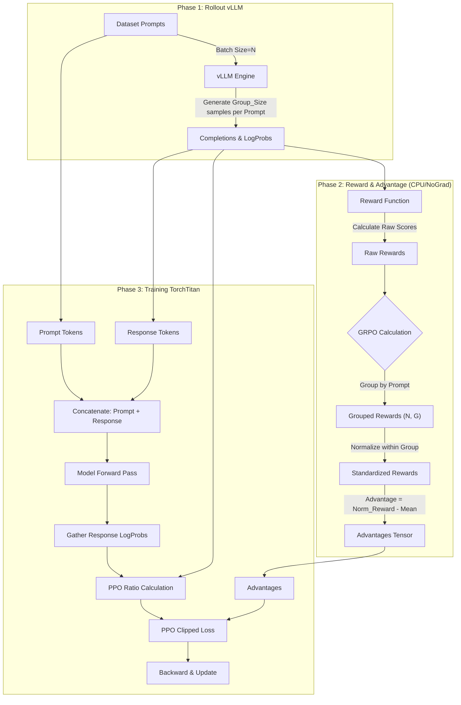
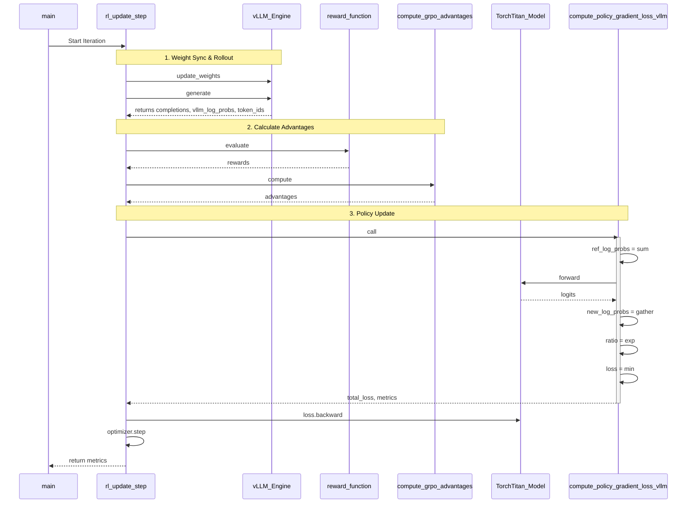
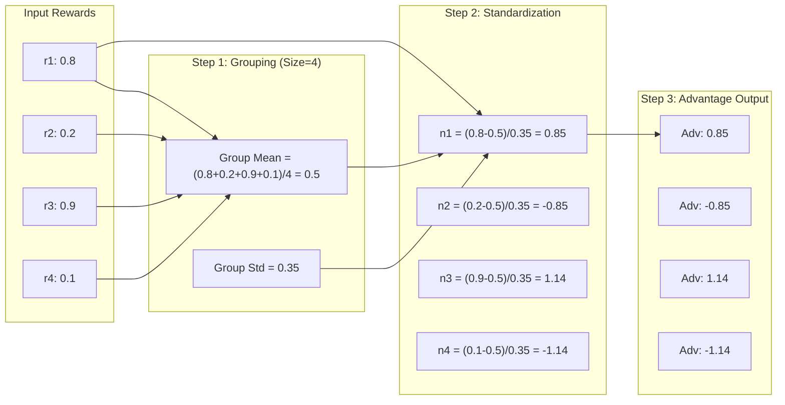

# RL PPO Loss 计算与 GRPO 流程深度分析

## 1. 深度解析：`compute_policy_gradient_loss_vllm`

`compute_policy_gradient_loss_vllm` 函数是 RL 训练循环的核心，负责使用 PPO（近端策略优化）算法计算策略梯度损失。它通过比较“当前策略”与“采样策略（vLLM）”的概率差异来更新模型。

### 1.1 输入与输出详解

| 类型 | 参数名 | 形状/类型 | 含义与来源 |
| :--- | :--- | :--- | :--- |
| **输入** | `model` | `nn.Module` | 当前正在训练的 **Policy Model** (TorchTitan)。支持梯度反向传播。 |
| **输入** | `vllm_token_ids` | `List[List[int]]` | vLLM 采样生成的 **Response** Token IDs。 |
| **输入** | `vllm_token_log_probs` | `List[List[float]]` | vLLM 采样时计算出的 Token 级 Log 概率。作为 **Old Policy Reference**（旧策略参考）。 |
| **输入** | `prompt_token_ids` | `List[List[int]]` | 对应的 Prompt Token IDs。 |
| **输入** | `advantages` | `Tensor [batch]` | 由 GRPO 算法预先计算好的每个样本的 **Advantage (优势值)**。 |
| **输出** | `total_loss` | `Scalar Tensor` | 最终用于反向传播的总 Loss (PG + Entropy + KL)。 |
| **输出** | `metrics` | `Dict` | 监控指标，包含 KL 散度、熵、PPO Clip 比例等。 |

### 1.2 计算步骤详细拆解

#### **步骤 1: 构建 Old Policy LogProbs (Reference)**
代码直接使用 vLLM 在生成阶段输出的 logprobs 作为 $\pi_{old}$。
*   **操作**: 对 `vllm_token_log_probs` 求和。
*   **数学含义**: $\log \pi_{old}(Response|Prompt) = \sum \log P_{vllm}(token_i | context)$。
*   **目的**: 获得采样时的序列总概率，作为 PPO 比率的分母。

#### **步骤 2: 计算 New Policy LogProbs (Forward Pass)**
这是构建计算图的关键步骤，需要支持梯度。
1.  **拼接序列**: `Full_Seq = Prompt + Response`。
2.  **前向传播**: `logits = model(Full_Seq)`。
3.  **LogSoftmax**: 获得全词表上的概率分布。
4.  **Gather (收集)**:
    *   只关注 **Response** 部分的 Token。
    *   使用 `torch.gather` 提取模型对实际生成 Token 的预测概率。
5.  **求和**: 获得当前模型下的序列总概率 $\log \pi_{new}(Response|Prompt)$。

#### **步骤 3: PPO 核心计算 (Importance Sampling)**
1.  **计算概率比率 (Ratio)**:
    $$r_t(\theta) = \frac{\pi_{new}(a|s)}{\pi_{old}(a|s)} = \exp(\log \pi_{new} - \log \pi_{old})$$
2.  **计算 Clipping Loss**:
    $$L^{CLIP} = \min(r_t(\theta) A_t, \text{clip}(r_t(\theta), 1-\epsilon, 1+\epsilon) A_t)$$
    *   如果不进行截断，更新步长可能过大，导致策略崩溃。
3.  **计算平均 Loss**: 取负号（为了梯度下降）并求平均。

#### **步骤 4: 附加 Loss 项**
1.  **Entropy Bonus (熵奖励)**: $-H(\pi) = \text{mean}(\log \pi)$。鼓励探索，防止过早收敛。
2.  **KL Penalty (KL 惩罚)**: 计算 $\pi_{new}$ 和 $\pi_{old}$ 之间的 KL 散度，作为额外的正则项添加到 Loss 中。

---

## 2. GRPO (Group Relative Policy Optimization) 实现流程图

GRPO 的核心思想是通过对同一个 Prompt 生成的一组 (Group) 回复进行相对打分来计算优势，从而消除了对 Critic 模型的需求。

### 2.1 整体训练流程 (Mermaid Flowchart)

### 2.2 详细调用栈 (Call Stack Sequence)

以下时序图展示了函数之间的详细调用时序和数据流向。

## 3. GRPO 计算细节图解

针对 `compute_grpo_advantages` 函数的逻辑可视化：

### 关键总结

1.  **Reference 的巧妙处理**:
    在该实现中，没有显式的 "Frozen Reference Model"（冻结参考模型）。代码假设 **vLLM 生成样本时的分布** 就是 **Old Policy**（旧策略）。PPO 的 `ratio` 计算的是“当前梯度更新后的模型”相对于“生成样本那一刻的模型”的概率变化。

2.  **GRPO 的优势**:
    通过对 Group 内的奖励进行标准化（减均值），GRPO 有效地降低了梯度的方差。即使所有回答的绝对奖励都很低（比如都是错误的），相对较好的那个回答（Advantage > 0）仍然会被鼓励，而相对较差的会被抑制。

3.  **Loss 计算**:
    严格遵循标准的 PPO 目标函数，但应用在序列级别（Sequence Level）而非 Token 级别（Token Level），因为 Reward 是整句给出的。

4.  **Batch Invariance (批次无关性) 的重要性**:
    代码中反复强调 `batch_invariant`。这是为了确保 **vLLM 推理**（通常为了速度会有各种 Kernel 优化）和 **TorchTitan 训练**（为了梯度精确计算）在数学上是完全等价的。只有这样，`total_log_probs - ref_log_probs` 在初始状态下才能严格为 0，PPO 训练才能稳定启动。

# FAQ

Q: 为啥优势函数的结果要乘以新旧策略的比率？

A:
在 Loss 计算中，使用 优势函数 (Advantage) 乘以 新旧策略比率 (Ratio)，即 $r_t(\theta) \cdot A_t$，是 PPO (Proximal Policy Optimization) 算法的核心。
这个公式来源于对 策略梯度 (Policy Gradient) 目标函数的数学变换和优化。
我可以为你详细推导一下它的由来。

1. 原始目标：最大化期望回报
我们的目标是找到一个策略参数 $\theta$，使得在该策略下获得的期望回报 $J(\theta)$ 最大化：
$$J(\theta) = \mathbb{E}{\tau \sim \pi\theta} [R(\tau)]$$
其中 $\tau$ 是轨迹，$R(\tau)$ 是回报。

2. 策略梯度定理 (Policy Gradient Theorem)
直接优化 $J(\theta)$ 很困难，我们通常使用梯度上升。策略梯度定理告诉我们，梯度的形式是：
$$\nabla_\theta J(\theta) = \mathbb{E}{t} [\nabla\theta \log \pi_\theta(a_t|s_t) \cdot A_t]$$
其中 $A_t$ 是优势函数（动作 $a_t$ 比平均水平好多少）。

3. 从梯度到目标函数 (Surrogate Objective)
如果我们想把这个梯度反推回一个“目标函数” $L(\theta)$，使得对该函数求导能得到上面的梯度，那么最直观的形式是：
$$L_{PG}(\theta) = \mathbb{E}{t} [\log \pi\theta(a_t|s_t) \cdot A_t]$$
但在实际训练中，我们通常使用重要性采样 (Importance Sampling) 来利用旧策略 $\pi_{old}$ 产生的数据更新新策略 $\pi_\theta$。这引入了概率比率：
$$L_{IS}(\theta) = \mathbb{E}{t} \left[ \frac{\pi\theta(a_t|s_t)}{\pi_{old}(a_t|s_t)} \cdot A_t \right] = \mathbb{E}{t} [r_t(\theta) \cdot A_t]$$
为什么要乘比率？
这本质上是数学上的 Change of Measure (测度变换)。
我们用 $\pi_{old}$ 采样的数据去估算 $\pi_\theta$ 的期望。因为数据出现的概率是按 $\pi_{old}$ 分布的，为了纠正偏差，必须乘上权重 $\frac{\pi_\theta}{\pi_{old}}$。

4. 直观理解
$$Loss \propto - \frac{\pi_{new}}{\pi_{old}} \cdot A$$
如果 $A > 0$ (动作是好的)：
为了最小化 Loss，我们需要 增大 $\frac{\pi_{new}}{\pi_{old}}$。
这意味着 $\pi_{new}$ 应该比 $\pi_{old}$ 更大概率去选择这个动作。
直白点说：这步走得好，下次多走几步！
如果 $A < 0$ (动作是坏的)：
为了最小化 Loss，我们需要 减小 $\frac{\pi_{new}}{\pi_{old}}$（因为 A 是负数，整体变成最大化比率，或者说 $Loss = \text{Ratio} \times (-|A|)$，要让 Loss 变小，Ratio 必须变小）。
这意味着 $\pi_{new}$ 应该比 $\pi_{old}$ 更小概率去选择这个动作。
直白点说：这步走得臭，下次少走点！

5. PPO 的改进 (Clipping)
直接优化 $L_{IS}$ 可能会导致 $\pi_{new}$ 更新过猛，偏离 $\pi_{old}$ 太远，导致策略崩溃。PPO 引入了 Clipping (截断)：
$$L^{CLIP}(\theta) = \mathbb{E}t \left[ \min(r_t(\theta) A_t, \text{clip}(r_t(\theta), 1-\epsilon, 1+\epsilon) A_t) \right]$$
这确保了比率 $r_t(\theta)$ 不会偏离 1 太多（即新策略不应与旧策略差异过大），保证了训练的稳定性（Trust Region）。

总结
“优势函数 $\times$ 比率” 的推导逻辑链是：
策略梯度定理：告诉我们梯度方向是 $\nabla \log \pi \cdot A$。
重要性采样：为了能用旧数据更新新模型，引入了比率 $\frac{\pi_{new}}{\pi_{old}}$ 来修正概率分布的偏差。
直观意义：根据动作的好坏 ($A$)，成比例地放大或缩小该动作在新策略中的出现概率 ($\text{Ratio}$)。

---

## Related Pages

- [[15_verl_rl_algorithms_analysis]] — 同类源码级 PPO/GRPO loss 分析,框架为 verl(注册表选型机制)而非 TorchTitan + vLLM
- [[13_reasoning_rl_algorithm_evolution_analysis]] — GRPO/PPO 公式演进与跨算法系统约束的权威页
- [[20_grpo_analysis]] — GRPO 论文原理背景
- [[20_batch_invariance_guide]] — 本页 §"关键总结"第 4 点提到的 batch_invariant 断言的算子级实现