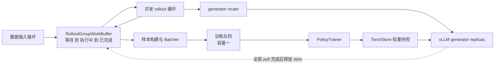

# TitanRL 异步 RL：版本窗口、rollout 流水与 GRPO/DAPO

> **源码基线**：TorchTitan `main@a3168782c9a3a2e40afbd0de114818b96e2bda6e`
> **核验日期**：2026-08-27
> **结论先行**：当前 `experiments/rl` 不是“trainer 同步调用 vLLM、生成完再训练”的 PPO 脚本，而是一个由 controller 驱动的有界异步系统。rollout group 在窗口化 FIFO 中流动，trainer 和多个 generator 通过 TorchStore 的版本化权重快照解耦；训练仍用生成时逐 token log-prob 做 clipped surrogate，但 freshness 由 policy version、buffer capacity 和 pull 完成后的 slot release 共同约束。GRPO 与 DAPO 的差别落在 advantage 归一化和 ratio clip 上，而不是另起一套控制流。
> **范围**：本文只描述上述固定提交中的 live `torchtitan/experiments/rl` 路径；旧的同步 PPO/vLLM walkthrough 作为过时解释处理，不再代表当前实现。

---

## 1. 一张图看懂当前主链

`Controller` 同时拥有 trainer、generator、rollouter，并把数据输入、多个 rollout loop、batcher 和 trainer loop 启动为并发任务；生产者可以无限运行，有限的训练 step 是系统时钟和最终 shutdown owner（`torchtitan/experiments/rl/controller.py:757-768`、`torchtitan/experiments/rl/controller.py:820-867`）。训练队列容量固定为 1，因此 batcher 至多预装下一批，不能在 trainer 后方无限堆积（`torchtitan/experiments/rl/controller.py:802-815`）。

这条主链有三个明确 owner：

| 平面 | owner | 持有的状态与职责 |
|---|---|---|
| 控制面 | `Controller` | actor mesh、并发 task、trainer policy version、buffer 与 shutdown（`torchtitan/experiments/rl/controller.py:530-674`、`torchtitan/experiments/rl/controller.py:757-867`） |
| 数据面 | `Rollouter` + `RolloutGroupWorkBuffer` + `Batcher` | 环境交互、group 状态机、窗口选择、样本过滤与 packing（`torchtitan/experiments/rl/rollout/rollouter.py:42-104`、`torchtitan/experiments/rl/components/work_buffer.py:23-84`、`torchtitan/experiments/rl/components/batcher.py:64-103`） |
| 权重面 | `WeightSyncManager` + `TorchStore` | trainer push、generator fan-out pull、版本推进后释放容量（`torchtitan/experiments/rl/components/weight_sync.py:30-50`、`torchtitan/experiments/rl/components/weight_sync.py:74-132`） |

选择这种拆分的原因是长尾 rollout、环境 I/O 和训练 step 不再互相形成全局 barrier；代价是必须显式回答“样本由哪个版本生成、最多能旧多少、何时允许继续生产”三个问题，而不能只靠一次同步 `update_weights()` 暗示一致性。

## 2. Rollout 不是 generator：环境循环在 controller CPU 侧

`Rollouter` 把一个 dataset sample 扩成一个 sibling rollout group，并在 controller 所在 CPU 主机上创建 worker actor pool；每个 group 通过 Monarch `choose` 交给一个 worker（`torchtitan/experiments/rl/rollout/rollouter.py:42-104`、`torchtitan/experiments/rl/rollout/rollouter.py:135-211`）。worker 为同一 prompt 创建 $N$ 个环境，异步执行所有 sibling，评分后才计算组内 advantage（`torchtitan/experiments/rl/rollout/rollouter.py:293-363`）。

单条 rollout 是 `generate -> env step -> generate` 的多轮循环；`routing_session_id` 在样本内保持稳定，使多轮请求尽量落到同一 generator，而每个 turn 都保存 completion tokens、逐 token generator log-prob 和 policy version 范围（`torchtitan/experiments/rl/controller.py:501-527`、`torchtitan/experiments/rl/rollout/rollouter.py:365-449`、`torchtitan/experiments/rl/rollout/types.py:82-160`）。所以：

- `RolloutWorker` 拥有 renderer、环境和 rubric；generator 只拥有连续批处理推理引擎。
- generator router 先在多个 generator mesh 之间选副本，再由副本内部 dispatcher 映射到 DP/TP ranks（`torchtitan/experiments/rl/routing/inter_generator_router.py:58-83`、`torchtitan/experiments/rl/routing/inter_generator_router.py:133-190`）。
- rollout 失败会被完成为空 group，交给后续过滤并释放容量，而不是令整个异步系统直接退出（`torchtitan/experiments/rl/controller.py:940-988`、`torchtitan/experiments/rl/components/training_sample_builder.py:56-85`）。

## 3. Windowed FIFO：吞吐与 freshness 共用同一容量账

`RolloutGroupWorkBuffer` 的元素依次经过 `WAITING`、`INFLIGHT`、`FINALIZED`。关键点是：一个 group 被 batcher 取走后，其 active slot **不会**立即释放；可训练 group 要等对应 trainer step 的新权重被所有 generator pull 完成后才释放，只有被过滤的不可训练 group 会提前释放（`torchtitan/experiments/rl/components/work_buffer.py:23-84`、`torchtitan/experiments/rl/controller.py:990-1032`）。这使 buffer 不只是内存限流器，也是防止新请求一出生就落后太多版本的 admission control。

令每个训练 step 需要的 prompt group 数为 $P$，目标 off-policy step 数为 $S$，窗口比例为 $f$。当前配置派生：

$$
B = (S + 1)P
$$

$$
W = \max\left(1, \left\lfloor fB \right\rfloor\right)
$$

$$
S_{\mathrm{max}} = \left\lfloor \frac{B + W - 2}{P} \right\rfloor
$$

其中 $B$ 是 active group capacity，$W$ 是窗口宽度；未设置 window fraction 时 $W=1$。配置层还用第三式得到消费时允许的硬 policy age 上界（`torchtitan/experiments/rl/controller.py:154-181`、`torchtitan/experiments/rl/controller.py:218-256`）。trainer 真正消费 batch 时，以当前 trainer version 减去 batch 中最小生成版本并检查这个上界，因此 `target_offpolicy_steps` 是容量设计目标，而不是对每个样本直接硬编码为 $S$（`torchtitan/experiments/rl/controller.py:1079-1088`、`torchtitan/experiments/rl/controller_metrics.py:167-213`）。

取数规则是 anchored windowed FIFO：只在最老 active id 起算的前 $W$ 个位置里挑最老的已完成 group；取走较年轻 group 不会移动窗口头（`torchtitan/experiments/rl/components/work_buffer.py:174-206`）。因此：

- $W=1$ 是严格 FIFO，freshness 最紧，但一个长尾 rollout 会 head-of-line block。
- $W>1$ 允许窗口内短请求越过长尾，提高 utilization；窗口仍锚定最老 group，所以乱序不会无界扩张。
- $B$ 限制 buffer、训练队列和正在被 trainer 消费的数据的总在途量；仅给 asyncio queue 设 `maxsize` 无法提供同样的版本保证（`torchtitan/experiments/rl/components/work_buffer.py:54-115`）。

## 4. Batching：按 prompt group 计数，按有效 response token 归一化

Batcher 要积累 $P$ 个**可训练 prompt groups**，不是 $P$ 条 rollout；一个 group 可含多个 sibling，单个多轮 rollout 又可在环境改写历史时分支成多个 training sample（`torchtitan/experiments/rl/components/batcher.py:64-147`、`torchtitan/experiments/rl/components/training_sample_builder.py:172-203`）。样本构建规则是：prompt 或环境新增 token 的 mask 为 false、log-prob/advantage 填零；completion token 的 mask 为 true，保留 generator log-prob，并把 rollout 的标量 advantage 广播到每个 completion token（`torchtitan/experiments/rl/components/training_sample_builder.py:230-276`）。

随后 next-fit packing 把样本放入受本地 sequence length 限制的行，再 round-robin 组成 `[microbatch][dp_rank]` 网格；过长样本会被丢弃，超过当前 step 需求的完整 groups 留给下一批（`torchtitan/experiments/rl/components/batcher.py:149-258`、`torchtitan/experiments/rl/components/batcher.py:277-386`）。分母是所有 microbatch 和 DP rank 上、同时满足 response mask 与 generator log-prob 有限的全局 token 数（`torchtitan/experiments/rl/components/batcher.py:149-198`）。

这也解释了 trainer 为什么不能边收一条 microbatch 边更新：在开始当前 step 的 forward/backward 之前，必须先知道全局有效 token 总数；源码明确把 streaming microbatch 留为未解决项（`torchtitan/experiments/rl/controller.py:1090-1106`）。

## 5. Policy version 与热更新：范围标签，不是假定冻结旧模型

启动或 checkpoint 恢复时，controller 先以 trainer 的起始 `policy_version` 做一次 push/pull，再开放异步主循环；trainer checkpoint 会保存版本，但 active rollout buffer 和 dataset stream 不恢复（`torchtitan/experiments/rl/actors/trainer.py:180-228`、`torchtitan/experiments/rl/controller.py:644-674`）。一次常规更新的顺序是：

1. 对当前 batch 完成所有 microbatch forward/backward。
2. 等上一轮 trainer push 完成，执行 optimizer step 并递增 trainer `policy_version`。
3. 等上一轮所有 generator pull 完成，再异步启动新版本的 trainer push 和 generator fan-out pull；下一轮 forward/backward 可与它重叠（`torchtitan/experiments/rl/controller.py:1093-1139`）。
4. trainer 把 state dict staging 到 CPU TorchStore 快照，generator 从快照重分片加载，因此读到的不是仍在 optimizer 修改的 live trainer tensor（`torchtitan/experiments/rl/actors/trainer.py:495-527`、`torchtitan/experiments/rl/actors/generator.py:1281-1304`）。
5. 所有 generator pull 完成后，manager 才释放恰好 $P$ 个 slots；当前实现会等待最慢 generator，源码把“按 generator 独立释放”标为 TODO（`torchtitan/experiments/rl/components/weight_sync.py:115-132`）。

默认 `hot_swap=True` 时，generator 可在 in-flight generation 未排空时加载新权重；关闭 hot swap 会先 drain 单轮请求，但同一多轮 rollout 的两个 turn 之间仍可能换版本（`torchtitan/experiments/rl/routing/inter_generator_router.py:86-103`、`torchtitan/experiments/rl/routing/inter_generator_router.py:218-248`）。generator 的 engine loop 把 pull 放在 step burst 间，pull 优先于接收新请求；请求 admission 记录最小版本，completion 时记录当前最大版本（`torchtitan/experiments/rl/actors/generator.py:1080-1214`、`torchtitan/experiments/rl/actors/generator.py:491-503`、`torchtitan/experiments/rl/actors/generator.py:537-590`）。

因此 `Completion.min_policy_version` / `max_policy_version` 是一个 turn 的**版本范围**，不是逐 token 精确 provenance；类型定义明确保留了逐 token version attribution 的 TODO（`torchtitan/experiments/rl/types.py:39-67`）。多轮 sample 只会把范围扩成覆盖所有拼接 turns 的最小/最大值（`torchtitan/experiments/rl/components/training_sample_builder.py:237-269`）。当前 freshness admission 是保守的版本范围检查，不能回答某个 token 究竟由范围内哪个权重产生。

## 6. GRPO 与 DAPO：同一逐 token surrogate，不是序列级 ratio

### 6.1 Group-relative advantage

对同一 prompt 的 sibling rewards $R_i$，当前 estimator 是：

$$
A_i =
\begin{cases}
\dfrac{R_i - \bar{R}}{\sigma_R + 10^{-6}}, & \text{启用标准差归一化} \\
R_i - \bar{R}, & \text{默认的 Dr.GRPO mean baseline}
\end{cases}
$$

`should_std_normalize` 默认是 false，因此旧页“GRPO 一定除以组内标准差”的说法不成立（`torchtitan/experiments/rl/rollout/advantage.py:22-46`）。sample builder 默认还会丢弃 reward 方差为零的 sibling group；若所有 group 都如此，当前源码标注的风险是 batcher 永远凑不齐 $P$ 个 group 而静默等待（`torchtitan/experiments/rl/components/training_sample_builder.py:46-51`、`torchtitan/experiments/rl/components/training_sample_builder.py:88-109`）。

### 6.2 Behavior ratio 与 clip-higher

对有效 completion token $t$，令 trainer 当前 log-prob 为 $\log p_{\theta,t}$，生成时 vLLM 返回的 log-prob 为 $\log q_{\mathrm{gen},t}$。实现先截断 log-ratio 以避免指数溢出：

$$
\rho_t = \exp\left(\operatorname{clip}\left(\log p_{\theta,t} - \log q_{\mathrm{gen},t}, -10, 10\right)\right)
$$

DAPO 的不对称 clip 与逐 token loss 为：

$$
\widehat{\rho}_t = \operatorname{clip}\left(\rho_t, 1-\epsilon_{\mathrm{low}}, 1+\epsilon_{\mathrm{high}}\right)
$$

$$
\mathcal{L} = \frac{1}{N_{\mathrm{valid}}}
\sum_t -\min\left(\rho_t A_t, \widehat{\rho}_t A_t\right)m_t
$$

这里 $m_t$ 同时要求 response mask 为 true 且 generator log-prob 有限；非有限值会从 loss 和分母一起剔除，而不是当作 on-policy token（`torchtitan/experiments/rl/losses/dapo.py:23-35`、`torchtitan/experiments/rl/losses/dapo.py:82-105`）。`GRPOLoss` 只是把上下界都设成同一个 `clip_eps` 的 `DAPOLoss`；DAPO 则允许例如 low 0.2、high 0.28 的 clip-higher（`torchtitan/experiments/rl/losses/grpo.py:14-36`、`torchtitan/experiments/rl/losses/dapo.py:38-55`）。

三个容易混淆的结论：

- ratio 和 loss 都是**逐 token**；组内标量 advantage 被广播到 response tokens，并不把 token log-prob 先求和成 sequence ratio。
- $q_{\mathrm{gen},t}$ 是实际采样路径返回的 behavior log-prob，不等于一个额外常驻、严格冻结的 `old_policy` actor；异步版本范围用 metadata 另行约束。
- 当前 `DAPOLoss` 中 entropy、log-prob difference 和 clip fraction 只作为 metrics 返回，不以 entropy bonus 或 KL penalty 加回 loss（`torchtitan/experiments/rl/losses/dapo.py:107-134`）。

trainer 从 packed microbatch 取出 generator log-probs、advantages 和 mask，调用上述 loss 后直接 backward；当前 RL trainer 明确只允许一个 model part，尚不支持 pipeline parallelism（`torchtitan/experiments/rl/actors/trainer.py:358-417`）。

## 7. 当前支持边界与已验证矩阵

| 边界 | 当前 live 事实 | 验证证据 |
|---|---|---|
| trainer 并行 | 使用普通 TorchTitan parallel dims/SPMD context；RL trainer 当前不支持 PP（`torchtitan/experiments/rl/actors/trainer.py:90-165`、`torchtitan/experiments/rl/actors/trainer.py:379-386`） | 集成测试覆盖 trainer FSDP=2 + generator TP=2（`torchtitan/experiments/rl/tests/integration_tests.py:31-85`） |
| MoE / EP | generator EP 只能为 1 或完整 `DP*TP` 映射；dispatcher 当前主路径是 DP/TP，PP/CP 留作 TODO（`torchtitan/experiments/rl/actors/generator.py:346-404`、`torchtitan/experiments/rl/actors/generator.py:778-789`） | GPT-OSS MoE TP=4/EP=4 有端到端项（`torchtitan/experiments/rl/tests/integration_tests.py:87-117`） |
| attention | trainer 与 generator 当前都只接受 Varlen/Flex attention（`torchtitan/experiments/rl/actors/trainer.py:242-268`、`torchtitan/experiments/rl/actors/generator.py:850-855`） | 测试配置均使用 varlen 路径（`torchtitan/experiments/rl/tests/integration_tests.py:31-117`） |
| batch invariance | 要求 deterministic、trainer/generator bf16、禁用 SP，且不支持 ROCm；若 `hot_swap=False` 还要求 pull 后 reset prefix cache（`torchtitan/experiments/rl/controller.py:371-415`） | on-policy TP=4、MoE TP=4/EP=4、Qwen3.5 GDN TP=2 有覆盖（`torchtitan/experiments/rl/tests/integration_tests.py:177-251`） |
| checkpoint / reshard | checkpoint 保存 trainer policy version；不保存 active rollout buffer 和 dataset stream（`torchtitan/experiments/rl/controller.py:653-662`） | 测试覆盖 trainer DP 到 TP reshard、TorchStore 到不同 generator 拓扑、多个 generator 到单 generator（`torchtitan/experiments/rl/tests/integration_tests.py:119-175`） |

“源码支持”不等于“这里列出的组合已全排列测试”。特别是 async controller 的 on-policy bitwise case 只证明固定测试配置下 trainer/generator log-prob 可一致，不能外推所有模型、cudagraph、TP/EP 组合都具备 bitwise parity（`torchtitan/experiments/rl/tests/integration_tests.py:177-203`）。

## 8. DAPO 示例究竟落地了什么

当前 `dapo_math` example 使用 binary MathVerify reward、单轮 rollout、错误 reward 为 0，并选择不做标准差归一化的 Dr.GRPO advantage（`torchtitan/experiments/rl/examples/dapo_math/rollouter.py:20-66`）。配置把 loss 切到 DAPO，并设置 low clip 0.2、high clip 0.28；异步侧使用每 step 8 个 prompts、每 prompt 16 个 samples、目标 off-policy steps 为 4（`torchtitan/experiments/rl/examples/dapo_math/config_registry.py:45-91`、`torchtitan/experiments/rl/examples/dapo_math/config_registry.py:113-145`）。

因此这个固定 baseline 中可以确认的是 per-token loss、clip-higher、动态有效 token 分母、组级过滤与 Dr.GRPO advantage。当前示例的 rubric 配置没有把 DAPO 论文中的所有 reward-shaping 技巧声明为可配置机制；不要仅凭目录名把完整论文 recipe 推断为已经实现（`torchtitan/experiments/rl/rubrics/rubric.py:71-170`、`torchtitan/experiments/rl/examples/dapo_math/rollouter.py:20-66`）。

## 9. 从旧页迁移时必须改掉的心智模型

| 旧解释 | 当前源码结论 |
|---|---|
| trainer 更新权重后同步生成，再做一步 PPO | 四类 async loop 并发，buffer/queue/backpressure 解耦，trainer step 才是有限时钟（`torchtitan/experiments/rl/controller.py:757-867`） |
| vLLM log-prob 是单一冻结 old policy 的 sequence score | completion 保存逐 token log-prob；版本只精确到 turn 的 min/max，且 hot swap 可跨 in-flight 请求（`torchtitan/experiments/rl/types.py:39-67`、`torchtitan/experiments/rl/actors/generator.py:1251-1314`） |
| PPO ratio 先累加整段 log-prob 再指数化 | DAPO/GRPO 直接逐 token 算 ratio、clip、loss，并按全局有效 response tokens 归一化（`torchtitan/experiments/rl/losses/dapo.py:57-105`） |
| entropy bonus 与 KL penalty 是 loss 必备项 | 当前实现只记录 entropy 和 log-prob difference metrics（`torchtitan/experiments/rl/losses/dapo.py:107-134`） |
| GRPO advantage 固定除组内标准差 | 默认是 Dr.GRPO mean baseline；标准差归一化是 opt-in（`torchtitan/experiments/rl/rollout/advantage.py:22-46`） |
| batch 按 rollout 条数凑齐即可 | Batcher 按可训练 prompt groups 计数，样本经多轮分支、next-fit packing 和 DP 网格化（`torchtitan/experiments/rl/components/batcher.py:64-147`、`torchtitan/experiments/rl/components/batcher.py:200-309`） |

## 10. 仍然开放的工程缺口

1. per-token policy-version provenance 尚未实现；跨版本 completion 只有 min/max 范围（`torchtitan/experiments/rl/types.py:50-56`）。
2. 权重发布等待所有 generators 后统一释放 slots，最慢副本会拖住全局 admission（`torchtitan/experiments/rl/components/weight_sync.py:115-132`）。
3. checkpoint resume 不恢复 active buffer 与 dataset stream，不能宣称 rollout 级 exactly-once（`torchtitan/experiments/rl/controller.py:653-662`）。
4. 全部 prompt groups 都因零 reward 方差被过滤时，batcher 可能静默等不到一个训练 batch（`torchtitan/experiments/rl/components/training_sample_builder.py:88-109`）。
5. RL PP、generator PP/CP、以及先未知全局有效 token 数时的 microbatch streaming 仍未落地（`torchtitan/experiments/rl/actors/trainer.py:379-386`、`torchtitan/experiments/rl/actors/generator.py:346-404`、`torchtitan/experiments/rl/controller.py:1090-1092`）。

## Related Pages

- [[02_engineering/04_posttrain_frameworks/index|后训练框架目录]]
- [[02_engineering/04_posttrain_frameworks/01_posttraining_infra_mechanism_analysis|后训练 Infra 三平面机制]]
- [[02_engineering/04_posttrain_frameworks/21_areal_async_architecture_analysis|AReaL Fully Async 与 Agentic 架构]]
- [[02_engineering/04_posttrain_frameworks/verl/15_verl_rl_algorithms_analysis|verl RL 算法实现]]
- [[01_theory/04_posttraining/20_grpo_analysis|GRPO 原理]]
- [[01_theory/04_posttraining/21_dapo_analysis|DAPO 原理]]
- [[02_engineering/07_training_reliability/20_batch_invariance_guide|Batch invariance 指南]]
