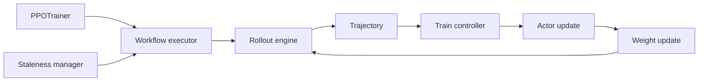

# D09 AReaL Fully Async 与 Agentic 架构

> **阶段**：S03
> **文档编号**：D09
> **源码基线**：AReaL `b23fa6cf9c8edfebcf055079ab78913128bc4579`
> **核验日期**：2026-07-27
> **结论先行**：AReaL 的核心不是一个 async 关键字，而是把 rollout workflow、freshness admission、train engine 和 weight update 分成可独立演进的 owner；当前源码又在向 v2 服务化迁移，阅读必须分代。
> **阅读导航**：[[20_slime_architecture_analysis|上一篇 D08]] · [[22_roll_strategy_and_ascend_analysis|下一篇 D10]]

---

## 1. 论文、legacy 主链与 v2 服务

| 代际 | 主要对象 | 本文用途 |
|---|---|---|
| AReaL 论文 | fully async generation/training | 设计目标与实验边界 |
| 当前 trainer/controller | `PPOTrainer`、workflow executor、staleness manager | 可达训练闭环 |
| v2 services | training、agent、weight-update gateway | 服务化演进方向 |

[AReaL v5](https://arxiv.org/abs/2505.24298v5) 的性能和架构结论不能自动覆盖 2026-07-27 主分支每个 v2 组件；反过来，v2 目录存在也不证明论文所有实验已迁移。

## 2. 当前主链



[`areal/trainer/rl_trainer.py:105-434`](https://github.com/areal-project/AReaL/blob/b23fa6cf9c8edfebcf055079ab78913128bc4579/areal/trainer/rl_trainer.py#L105-L434) 初始化：

- actor/critic/ref/teacher；
- SGLang 或 vLLM rollout；
- colocate/offload 策略；
- workflow/agent mode；
- actor 与 rollout 的 weight update connection；
- recovery 后的 staleness state。

`areal/trainer/rl_trainer.py:605-816` 的一轮：

```text
prepare or consume rollout batch
optional critic values
reference and teacher log probabilities
proximal actor log probabilities
advantages
actor and critic train
pause rollout
publish version global step plus one
set actor critic rollout versions
save and evaluate
resume
```

## 3. Workflow 是数据面边界

`areal/infra/workflow_executor.py` 中：

- `BatchTaskDispatcher`：`263`；
- `WorkflowExecutor`：`747`；
- trajectory format check：`48` 起。

它把“如何与环境交互”从 trainer 分离。`RolloutController` 在 `areal/infra/controller/rollout_controller.py:74` 负责 submit/poll/wait，`DistRolloutCoordinator` 在 `areal/infra/dist_rollout.py:97` 负责 trajectory redistribution。

这使多轮 agent、外部 tool 和长 I/O 能并发，但 contract 必须包含 tokens、mask、reward、version 和 task id。

## 4. Freshness admission

[`areal/infra/staleness_manager.py:20-181`](https://github.com/areal-project/AReaL/blob/b23fa6cf9c8edfebcf055079ab78913128bc4579/areal/infra/staleness_manager.py#L20-L181) 是 AReaL 最值得复用的机制之一。

可提交的新 rollout 数取：

```text
max concurrent capacity
and
version based staleness capacity
的最小值
```

version capacity 以 `(max_staleness + current_version + 1) * consumer_batch_size` 为总预算，再减已 accepted/running 数。

意义：

- producer 不能无限预生成；
- `max_staleness=0` 可以退回同步语义；
- 恢复 checkpoint 后要重置 accepted 基准，源码 `115-131` 专门处理；
- 这是 admission control，不是 trainer 端事后丢弃。

## 5. 三个概率比

AReaL 官方文档 `docs/en/best_practices/algo_perf.md:54-81` 明确区分：

\[
w_{\text{behave}}=\pi_{\text{proximal}}/\pi_{\text{behave}},
\qquad
r_{\text{ppo}}=\pi_\theta/\pi_{\text{proximal}}.
\]

这使诊断可以分开：

- behave ratio 偏离：异步 lag 或 TIM；
- PPO ratio 偏离：同 batch 多 epoch/minibatch 更新；
- 两者相乘：current 对 behavior 的总偏差。

工业上应保存 ratio 分位数、cap/clip fraction，而不只保存平均值。

## 6. Weight update

legacy trainer 在 `areal/trainer/rl_trainer.py:771-795`：

1. pause inference；
2. `new_version = global_step + 1`；
3. actor 根据 versioned meta 更新 rollout；
4. actor/critic/rollout 都设置新版本。

v2 则把 weight plane 服务化：

- `WeightUpdateController`：`areal/v2/weight_update/controller/controller.py:23`；
- gateway：`areal/v2/weight_update/gateway/app.py:170-757`；
- AWEX training adapters：FSDP/Megatron；
- inference adapter：SGLang；
- transfer：AWEX NCCL P2P、disk、colocate。

gateway 中 `/connect` 注册 training/inference pair，`/update_weights` 按 version 执行 transfer，成功后更新 `last_version`。disk path 还可保留多个 versioned LoRA。

服务化优点是 owner 与协议清楚；代价是 HTTP control、NCCL data、鉴权、超时和元数据 KV 一起成为故障面。

## 7. v2 Agent service

`areal/v2/agent_service/protocol.py:29-318` 定义：

- request/response/event frame；
- run status；
- queue mode；
- delta 与 tool-call event；
- run id。

`examples/hermes` 展示外部 Hermes agent loop：

- `examples/hermes/hermes.py:110` 的 `HermesAgent`；
- `examples/hermes/hermes_loop.py:36` 的 interactive loop；
- `start_session.py` 与 `set_reward.py` 把长生命周期会话和 delayed reward 接入服务。

这适合在线 agent 学习，但 completion id、reward event、token capture 和 policy version 必须能回到 trainer trajectory；否则只是在线服务，不是可审计 RL。

## 8. Partial rollout

异步 agent 的一条 trajectory 可能跨多个 policy version。AReaL 文档明确讨论 partial rollout，因此 schema 应记录每次 LLM call：

```text
completion id
policy version
rollout log probabilities
token span and loss mask
observation boundary
```

训练端有三种选择：

1. 每 segment 用自己的 behavior ratio；
2. 只训练满足 version bound 的 segment；
3. 丢整条 trajectory。

不能把 `trajectory.version = first_call_version` 用到所有 token。

## 9. NPU 边界

固定主分支有 `areal/infra/platforms/npu.py:14-30`，但官方安装文档明确说明 Ascend 支持由特定分支维护：

- `docs/en/tutorial/installation_npu.md:1-3`；
- rollout 使用 vLLM-Ascend，SGLang 不可用：`167-182`；
- `examples/vlm_npu` 给出 VLM GRPO 示例和局部 GPU/NPU 结果。

因此：

- platform abstraction 是 P1；
- branch image + end-to-end example 是 P2；
- 示例曲线可作为特定模型配置的 P3/P4；
- 不能推断 v2 AWEX/SGLang 路径已在 NPU 等价可用。

这里的“SGLang 不可用”只描述 AReaL 固定 Ascend 分支的 adapter 边界，不描述 SGLang upstream 的当前硬件能力；后者已提供 Ascend NPU backend，详见 D11。

## 10. 可修改性

| 目标 | 最小入口 |
|---|---|
| 新 agent/environment | `RolloutWorkflow` |
| 新 freshness rule | `StalenessManager` + controller callback |
| 新 trainer compute | train engine/controller |
| 新 weight backend | v2 training/inference adapter |
| 在线 delayed reward | agent service protocol/gateway |
| NPU | Ascend branch + vLLM-Ascend + train engine |

## 11. 必做验证

1. producer admission 在并发和版本两种限制下都可复现。
2. checkpoint 恢复不造成 rollout burst。
3. partial trajectory 的 per-call version 与 log-prob 对齐。
4. AWEX/disk/colocate 更新失败不推进 `last_version`。
5. online agent delayed reward 只绑定目标 completion。
6. NPU 只在官方分支/image 的固定版本上做结论。

## Related Pages

- [[20_slime_architecture_analysis|D08 slime 高性能与异步架构]]
- [[22_roll_strategy_and_ascend_analysis|D10 ROLL、异构与 Ascend]]
- [[25_on_policy_off_policy_staleness_analysis|D04 On-policy、Off-policy 与 Staleness]]
- [[31_cuda_ascend_posttraining_stack_comparison|D11 CUDA–Ascend 对照]]
