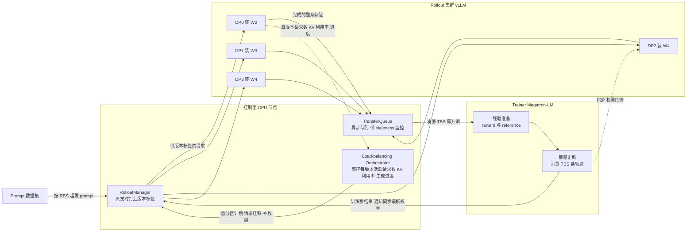
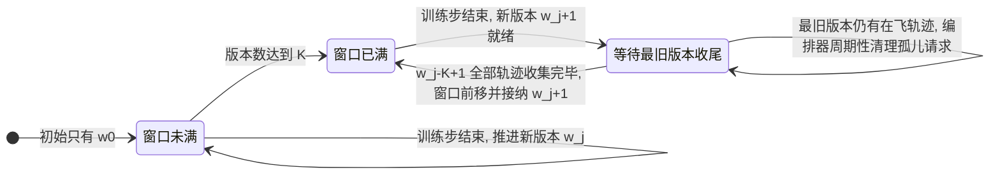
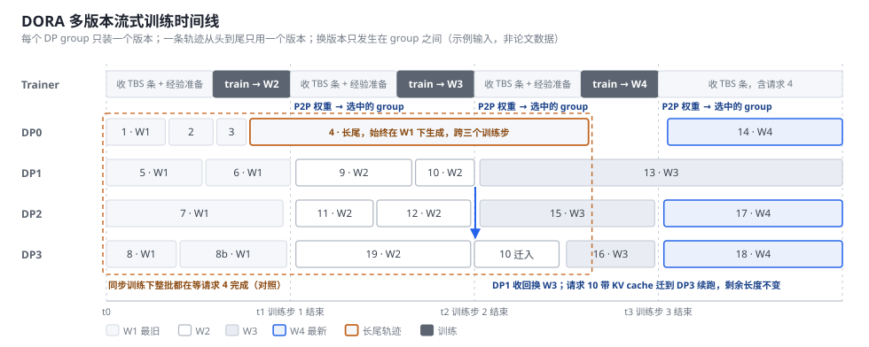
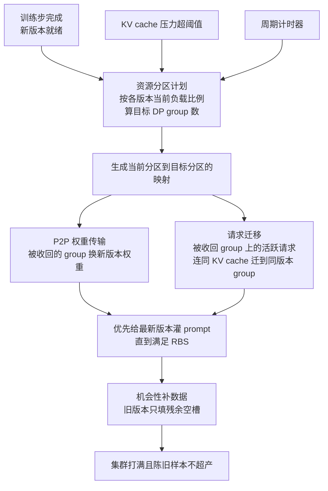
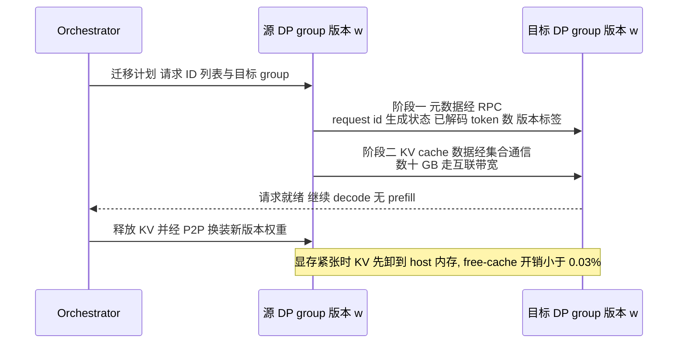

# DORA 多版本 Rollout 与动态编排：让长尾轨迹在旧版本里跑完

> **源码基线**：无公开实现。论文 [arXiv:2604.26256v2](https://arxiv.org/abs/2604.26256v2)（2026-07-20；v1 2026-04-29），美团 LongCat 团队；来源页 `raw/02_engineering/04_posttrain_frameworks/DORA_Asynchronous_RL_System-2604.26256.md`。全部机制描述来自论文正文与附录，未经代码核验；对照的 verl 机制以 `verl-project/verl@77f35e618c2de63bcae99e025a0ba72a678419fb`（`main`，2026-09-15）为准。
> **主题**：DORA 为什么把"rollout 集群只服务一个策略版本"这个假设拿掉；多版本流式训练、中心化编排器的 DP group 重分区、同版本 KV cache 直传三个机制怎样配合；四个组件之间数据、版本、资源三条流各自怎么动；论文报告的收益与它没有回答的问题。
> **适用范围**：本页只讲 DORA 论文描述的系统机制及其与本域其他资源调度方案的坐标关系。异步 RL 的 staleness 算法语义归 [[25_on_policy_off_policy_staleness_analysis]]；verl 两条把 trainer GPU 借给生成的路径归 [[17_verl_v1_async_trainer_analysis]] 与 [[22_verl_fully_async_dynamic_schedule_deepdive]]；长尾治理的其他手段归 [[12_rl_infra_efficiency_analysis]]。
> **最近更新**：2026-09-16. 新建页面。

---

## 0. 结论先行

rollout 阶段占一步 RL 时间的 50% 到 80%，而它的时长由全集群**最长的一条响应**决定，与平均长度无关。DORA 的判断是：现有异步方案在这个长尾困境上要么付系统代价（partial rollout 每次权重更新都重 prefill），要么付算法代价（超采样后丢弃最长的轨迹），根因是一个共同的隐含假设：所有 rollout 实例围绕**同一个**策略版本同步。DORA 让多个版本在 rollout 集群里并存，每个 DP group 只装一个版本，每条轨迹从派发到完成只用一个版本；长尾轨迹留在旧版本的 group 里跑完，其他 group 换新版本接新请求。多版本带来的资源碎片由一个中心化编排器按负载比例重分区 DP group 来消除，跨 group 迁移请求时因为版本一致，KV cache 可以直传而不重 prefill。

需要先说清的一点是，DORA 的"动态编排"**不改变** rollout 与训练之间的卡数，也不从外部加减实例。它弹的是 rollout 池内部 DP group 与策略版本之间的绑定关系。这与 verl 把空闲 trainer GPU 临时借给生成、RLBoost 从抢占式实例池加 rollout 实例，是三件不同的事，见 §7。

---

## 1. 问题：长尾困境的 max-max 结构

论文 §2.2 把同步训练一步的时间写成三项之和（Eq. 3）：

$$
T_{\mathrm{step}} \approx T_{\mathrm{train}} + T_{\mathrm{prefill}} + \tau \max_{j} \max_{i \in \mathcal{D}_j} L_i
$$

其中 $\tau$ 是每生成一个 token 的时间，在固定 batch 下近似常数；$L_i$ 是请求 $i$ 的输出长度；$\mathcal{D}_j$ 是第 $j$ 个 rollout 实例上并发的一批请求。里层 $\max$ 说的是一个实例要跑到它上面最长的那条请求结束才算完，这期间其他槽位早已空出，论文称为**实例内气泡**；外层 $\max$ 说的是整步要等最慢的那个实例，其余实例在等，称为**实例间气泡**。两层 $\max$ 叠在一起，rollout 时间由全集群最长的一条响应决定。

一个两实例、各四个槽位的例子：实例 A 上请求长度为 1k、2k、3k、30k，实例 B 上为 1k、1k、2k、2k。A 要跑 $30\mathrm{k}\cdot\tau$；B 跑完 $2\mathrm{k}\cdot\tau$ 后等 $28\mathrm{k}\cdot\tau$；A 上另外三个槽位分别空转 29k、28k、27k 个 token 时间。论文附录 C.3 用

$$
\mathrm{Bubble} = \frac{\max_i L_i - \bar{L}}{\max_i L_i}
$$

在同步训练下直接量了实例间气泡：第 20 步 74.8%，第 100 步 88.5%，最长与中位响应之比达 28 倍（Fig. 15b）。上面的例子按同一定义算出约 82%，与实测同量级。

这条长尾不能靠加算力压平，因为 decode 是访存受限的（§2.2）；也不能丢，因为附录 C.2 实测中等难度、最长、最陈旧的那批轨迹恰恰是 GRPO 组内奖励方差最高的样本（Table 3，方差约 1.0 对比易题 0.25）。MoE 还会放大这个偏斜：长尾输入让非 EP 层的 GMM 负载不均，最慢的 rank 拖住整个 EP 组（Fig. 5）。

---

## 2. 为什么是多版本：两条被否掉的路

论文 §1 与附录 A 把现有异步方案分成两类，并指出各自的代价：

| 方案 | 做法 | 代价 |
|---|---|---|
| 复制超采样后丢弃 | 派发多于训练批的请求，凑够就放弃在飞的长轨迹 | 丢掉的正是最长、最有信号的轨迹；长度偏斜的样本分布扭曲 GRPO 的组内优势估计 |
| partial rollout | 每次权重更新时把长轨迹切断，在新版本下续写 | 系统上每次更新都要用新权重重 prefill 已生成前缀，长上下文与 MoE 下代价陡增（Fig. 3：约 500B MoE、EP 128 在 128K 输入上 prefill 超过 1400 秒）；算法上一条轨迹拼了多个版本，需要 mask 前段或 decoupled PPO 修正 |
| 一步 off-policy | 用上一版本生成、本版本训练，重叠两个阶段 | 只重叠阶段，rollout 自身的长尾时长不变，两种气泡都还在 |

论文的判据是这两类代价来自同一个假设：**单版本 rollout**。在这个假设下，在飞的长轨迹要么在下次更新前跑完，要么在更新时被牺牲，没有第三种可能。拿掉它之后，每条轨迹在派发时绑定当时的版本，长尾在原版本下跑完，新请求在最新版本下进行。这个选择的直接算法收益是：训练目标只是标准的异步 GRPO（Eq. 2），把单一 behavior policy 换成逐轨迹的 $\pi_{w_i}$，用 importance ratio $\pi_\theta / \pi_{w_i}$ 加 clip 吸收 $v(\theta) - v(w_i) \le K$ 范围内的偏差（Eq. 1），不需要任何轨迹内修正。

> [!note] 两种 off-policy 要分开
> "训练权重与 rollout 权重不同"是所有异步 RL 的共性，不是 partial rollout 的定义。跨轨迹的 off-policy 是整条轨迹由旧版本生成，训练时策略已更新，标准做法是记录 behavior log-prob 后做 importance ratio 加 clip；DORA 只有这一种，且被 $K$ 限定。轨迹内的 off-policy 才是 partial rollout：一条轨迹前半段由 $w_i$ 生成、后半段由 $w_{i+1}$ 续写，需要额外修正与重 prefill。DORA 里不存在后者，这也是 §5 KV cache 直传成立的前提。

---

## 3. 机制：四个组件，三条流

论文 §3.1 以分离部署为例描述，并称可扩展到 colocate。四个组件跑在不同节点上，通过 RPC 协调，加速卡上的 worker 只执行任务。下图按本页的三条流重组：实线是数据流（prompt 进、轨迹出、权重回），虚线是控制流。

### 3.1 数据流：请求粒度进出，不再有批边界

论文 §3.2 的流程分四步。记 $\mathrm{RBS}$ 为每步派发的 prompt 数，$\mathrm{TBS}$ 为训练消费的轨迹数。

1. **超发。** 每步开始时 RolloutManager 派发 $\mathrm{RBS} > \mathrm{TBS}$ 条生成请求。附录 B 的开源实验设置是 512 个 prompt、每个 16 条响应、全局训练批 8192。
2. **流式收集。** 完成的轨迹逐条进入 TransferQueue，不等同批其他轨迹；队列带 staleness 监控。
3. **凑够即训。** Trainer 收到 $\mathrm{TBS}$ 条就做经验准备与更新；此刻没完成的长轨迹留在原版本的 DP group 里继续生成，流入后续步。
4. **权重回流。** 只有一次训练迭代结束，Trainer 才通知 RolloutManager 同步最新权重。同步的对象不是所有 DP group，而是编排器决定换版本的那些。

### 3.2 版本流：一条轨迹一个版本

prompt 在派发时打上版本 $w_j$，之后每个 token 都从 $\pi_{w_j}(\cdot \mid s_t)$ 采样（§3.2）。集群里活跃的版本集合是一个大小不超过 $K$ 的滑动窗口 $W = \{w_j, \ldots, w_{j-K+1}\}$，窗口只有在最旧版本 $w_{j-K+1}$ 的所有轨迹都已收集并送入训练后才前移，这给出确定性的 staleness 上界。

并存版本数的上界是 $\min(K, \text{DP group 数})$：$K$ 来自窗口，而每个 DP group 只装一个版本。多版本的代价因此是**占整组卡而不是占显存**，单个实例上永远只有一份权重。$K$ 是显式旋钮：小则更接近 on-policy 但最旧版本没跑完时新版本进不了集群，$K=1$ 退化成一步 off-policy；大则吞吐高但收敛变慢，论文 Fig. 10 里 $K=3$ 比 $K=1$ 收敛"适度更慢"。实验用了 $K=1$ 与 $K=3$，生产的 $K$ 未公开。

### 3.3 资源流：DP group 在版本之间移动

训练侧的卡不动，rollout 总卡数不动，动的是每个 DP group 装哪个版本。旧版本的待处理请求单调递减，如果资源固定，会出现一个 group 只跑一两条残余请求而最新版本缺资源的碎片化（§3.2 "Remaining challenges"）。§4 的编排器负责收缩旧版本、扩张新版本。

### 3.4 原理图：长轨迹留在旧版本里跑完

下图按论文 Fig. 6 的思路重画。上方是独立的训练集群，浅色段在等 $\mathrm{TBS}$ 条轨迹凑齐并做经验准备，深色段在训练；训练何时开始由轨迹到达速度决定，所以不落在固定网格上，训练结束的时刻定义了 $t_1$、$t_2$、$t_3$。下方四个 DP group 的条块样式是它们当时装载的版本，请求 4 是长尾，横跨三个训练步始终在 W1 下生成。

读图要抓住三点。第一，训练步之间不存在"所有 rollout 停下来等换权重"的栅栏，权重更新只影响被编排器选中的 DP group。第二，一个 DP group 的样式只在编排器决定时才变，变化意味着该 group 的权重被 P2P 替换。第三，跨版本从不发生在一条轨迹内部，只发生在 DP group 之间；请求 10 在 $t_2$ 从 DP1 迁到仍装着 W2 的 DP3 后，剩余 decode 长度不变，迁移只改变它在哪里跑。

> [!note] 谁在换权重，谁在训练，不是同一批卡
> 分离部署下训练集群是独立的 Megatron 进程组，它是权重的生产者，从不"换权重"；其内部所有 rank 按同步数据并行在同一时刻开始一步训练。换权重的是 rollout 侧的 DP group，它们不参与训练。训练开始由"凑够 TBS 条"触发，DP group 换版本由编排器在训练结束后触发，两者之间隔一次 P2P 传输。只有在 colocate 变体里，同一批卡才会在 rollout 与训练之间时分切换。论文没有展开 colocate 变体的细节。

---

## 4. 动态编排周期：三个触发，三个动作

编排器维护每版本的活跃请求数、KV cache 利用率与生成进度，三种触发条件（§3.3）：更新驱动，每次训练步完成后必触发以推进新版本；利用率驱动，KV cache 压力超阈值时触发，避免驱逐导致的重算；时间驱动，周期性执行，防止孤儿请求滞留在旧版本。每个周期执行三个动作：

- **资源分区计划。** 按各版本当前工作量的比例算目标 DP group 数，避免资源滞留在任务渐少的旧版本上。
- **P2P 权重更新与请求迁移。** 对分配数变化的版本，用 P2P 权重传输缩减旧版本、扩张最新版本；被重新指派 group 上的活跃请求迁往新 group，执行状态由 §5 的 KV cache 复用保全。论文强调此过程不丢任何轨迹。
- **staleness 感知的数据补充。** 先给最新版本灌 prompt 直到满足 $\mathrm{RBS}$，使大多数新轨迹用最新权重生成；然后机会性地给旧版本填满残余空槽，让集群打满但不过量生产陈旧样本。

论文 Fig. 7 的例子把这一周期具体化：

| DP group | Step N 重平衡前 | Step N+1 重平衡后 |
|---|---|---|
| DP0 | V1，0 条请求，空转 | V2，4 条请求，整体从 DP1 迁入 |
| DP1 | V2，4 条请求 | V3，3 条请求，加 1 条新灌入 |
| DP2 | V3，2 条请求 | V4，8 条新请求 |
| DP3 | V3，1 条请求 | V4，8 条新请求 |

最旧的 V1 被删除；V2 与 V3 各自合并到一个 group；腾出的两个 group 装最新的 V4 并各灌 8 条。V2 的 4 条请求从 DP1 整体搬到 DP0 而不是让 DP1 保持 V2，说明映射并不总能满足论文所说的"优先把请求放回原 rank"的局部性，而论文也没有给出映射的优化目标。

> [!note] 这里的 rank 是 rollout 侧的 DP group
> 分离部署下推理请求只派发到 rollout 集群的 DP group 上，训练集群不接任何生成请求。"locality-aware"讨论的是请求在 rollout group 之间要不要搬，与训练卡无关。

---

## 5. KV cache 复用：零重 prefill 的两阶段传输

跨 DP group 迁移请求最朴素的做法是重新 prefill，代价随上下文长度陡增并被 MoE 放大（§1、Fig. 3）。DORA 的单版本轨迹让 KV cache 在同版本实例间数学等价（§3.4），迁移于是变成两阶段状态传输：

编排器优先把请求放回原 rank 以免物理搬迁，只有因版本过渡必须搬的请求才付传输代价（locality-aware scheduling）；显存紧张时把 KV 临时卸到 host 内存（hierarchical memory management）。论文没有说明集合通信原语具体是什么，也没有说 vLLM 的 paged KV 如何在不同实例间做 block 映射；"近零"而非"零"重 prefill 的措辞论文未解释，属于本页未能核实的细节。

---

## 6. 证据：收益来自哪里

论文 §4 在 16 节点 H800 上用 Qwen2.5-32B 做开源实验，在非 CUDA 加速卡的生产集群上用约 500B MoE 做大规模评估；所有基线在同一套 in-house 框架内实现（附录 B：vLLM 0.8.5、Megatron-LM、torch RPC 流式扩展）。

| 指标 | 数值 | 条件与来源 |
|---|---|---|
| rollout-only 占步时 | 65% 降到 12%，绝对时间 14.9 分钟降到 1.8 分钟，8.2 倍 | 64 卡，对同步（Fig. 8） |
| rollout-only 占步时 | 73% 降到 24%，5.9 倍 | 128 卡，对同步（Fig. 8） |
| 端到端步时 | 1.56 倍 / 1.93 倍 | 64 / 128 卡，对同步（§4.2） |
| 端到端吞吐 | 23,327 / 34,135 tokens/s | 64 / 128 卡；对同步 1.65 倍 / 2.12 倍，对 partial rollout 1.17 倍 / 1.11 倍（Fig. 9） |
| KV cache 复用单项 | 183.6 秒降到 166.3 秒，约 9% | 32B dense（Fig. 11） |
| 负载均衡开销 | 0.4% / 1.5% | 64 / 128 卡，含监控、重分区、P2P 权重同步（Fig. 12） |
| 请求迁移开销 | 3.6% 降到 2.1% | 随规模摊薄（Fig. 12） |
| 生产 rollout 加速 | 3.6 倍 / 6.2 倍 | 数学与 TIR / agentic Tau2 与 Vita；约 500B MoE，64K 响应，4096 张加速卡，只对比调优过的同步基线（§4.5，Fig. 13） |
| 生产端到端 | 2 到 4 倍 | 自 2025 年起为默认异步范式（§4.5） |
| staleness 质量差距 | $\Delta < 0.6\%$ | $K=3$，按难度分层后 $s=0$ 与 $s=1$ 通过率无差；表面 3.3 个点的差距是选择偏差，难题更长所以更陈旧（附录 C.1，Table 1） |

读数的方式有三点。对同步的倍数很大，但对 partial rollout 只有 1.1 到 1.2 倍，而且论文把这部分差距归因于免重 prefill；如果基线已经是 partial rollout 且上下文不长，DORA 带来的增量主要是算法干净度而非吞吐。生产的 6.2 倍出现在 agentic 任务上，因为那里长尾最重，与附录 C.3 的气泡测量一致。附录 C.1 还给了 staleness 惩罚的理论上界：on-policy 每步提升约 0.113%，$K=3$ 的最大惩罚约 0.34%，低于采样噪声。

---

## 7. 约束与失败边界

| 前提或约束 | 论文依据 | 违反或缺失时的后果 |
|---|---|---|
| $K$ 手动配置，只靠 PPO clip 吸收 off-policy 偏差 | §5 Limitations | $K$ 过大时收敛变慢（Fig. 10 的 $K=3$）；自适应 staleness 与显式延迟补偿列为未来工作 |
| 每个 DP group 只装一个版本 | §3.2 | 版本数受 group 数限制；旧版本的最后几条请求仍占整组卡，只能靠编排器合并缓解 |
| 窗口前移要等最旧版本全部收尾 | §3.2 | 被一条极慢轨迹卡住时新版本进不了集群，集群以旧版本继续生产陈旧样本；时间触发缓解但不消除 |
| 重分区映射只说"按负载比例"与"优先放回原 rank" | §3.3、§3.4 | 迁移量最小化的目标函数未定义；Fig. 7 的例子里 V2 整体搬家说明局部性并非总能满足 |
| 编排模块未做消融 | §4.3 | 重分区本身贡献多少吞吐无法与多版本流式分开；唯一单独量出的是 KV cache 复用的约 9% |
| 生产数字只对比同步基线 | §4.5 | 6.2 倍不能与 partial rollout 或其他异步系统直接比较 |
| 无故障讨论 | 全文 | 装着旧版本的 DP group 挂掉后，其上轨迹是重生成还是丢弃未提 |
| 无公开实现 | 本页核实 | 复现需自行实现按 DP group 装不同版本权重并按版本路由、以 group 为单位的 P2P 权重替换、跨引擎 paged KV 的 block 级迁移；第三件在 SGLang 与 vLLM 上没有现成 API |

### 7.1 与本域其他资源调度方案的坐标

把 DORA 放回"资源怎么动"的坐标系里，它与常被混称为"弹性"的几种方案动的对象完全不同：

| 方案 | 动的对象 | 训练侧卡数 | rollout 总卡数 | 在飞请求怎么办 |
|---|---|---|---|---|
| DORA | rollout 池内 DP group 与版本的绑定 | 不变 | 不变 | 同版本 KV 直传，不丢不重算 |
| verl `separate_async` GPU lending（[[17_verl_v1_async_trainer_analysis]] §8） | trainer 卡在训练与生成之间的角色 | 步间临时减少 | 步间临时增加 | abort 后带前缀回 standalone 重试 |
| verl fully async dynamic schedule（[[22_verl_fully_async_dynamic_schedule_deepdive]] §4） | Hybrid replica 激活与休眠 | 窗口内减少 | 窗口内增加 | abort 后 partial rollout 重试 |
| RLBoost（[arXiv:2510.19225](https://arxiv.org/abs/2510.19225)） | 外部 spot 实例数量 | 不变 | 随抢占动态增减 | token 级迁移，只损失一次重 prefill |

DORA 与 verl 的两条路径正交：一个在 rollout 池内部按版本挪 DP group，另一个在 rollout 与 trainer 之间挪 GPU。多版本共存的思想在 verl 的 fully async 里没有对应物，verl 的 rollout 只看见一个已发布版本。附录 A 也承认与之同期有系统探索了多版本流式训练的概念，但依赖两层 CPU relay 做权重管理，编排与 staleness 控制机制不同。

---

## 8. 展望

论文 §5 把自适应 staleness 控制或显式延迟补偿列为后续方向；附录 C.3 提到用更激进的 staleness 策略理论上可以把 rollout-only 阶段完全消掉，但没有实验。这两条都是论文自己锚定的未来工作，本页不做额外推断。

---

## Related Pages

- [[12_rl_infra_efficiency_analysis]] — 长尾治理的其他手段（冗余 rollout、tail batching、in-flight reward），DORA 是其中"不丢轨迹也不重 prefill"的那条路。
- [[17_verl_v1_async_trainer_analysis]] — verl 把空闲 trainer GPU 借给生成的步间出借机制，与 DORA 的池内重分区正交。
- [[22_verl_fully_async_dynamic_schedule_deepdive]] — verl fully async 的 Hybrid replica 动态调度，同样在 remove、abort、sleep 顺序上处理在飞请求。
- [[21_areal_async_architecture_analysis]] — AReaL 的 fully async 与可中断 rollout，是论文"一步 off-policy 与 partial rollout"对照的另一种实现。
- [[25_on_policy_off_policy_staleness_analysis]] — 异步 RL 里 staleness、behavior log-prob 与 importance ratio 的算法语义。
- [[01_posttraining_frontier_map_analysis]] — 后训练前沿地图里同步 / 异步 / 流式系统的整体坐标。
