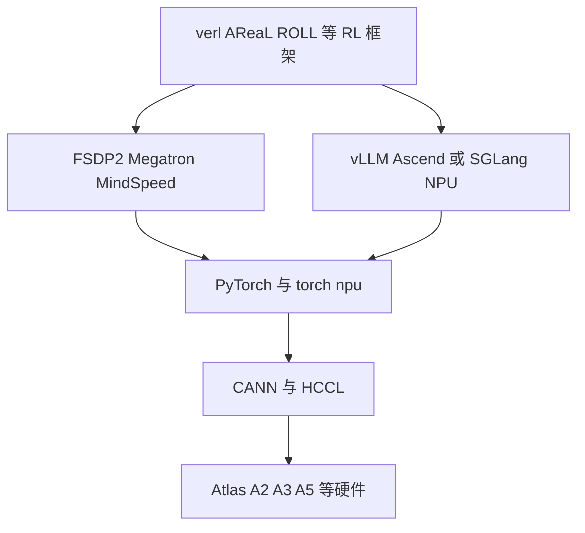

# D11 CUDA–Ascend 后训练栈对照

> **阶段**：S04
> **文档编号**：D11
> **快照日期**：2026-07-28
> **证据基线**：四框架 S00 commit、2026-07-27 官方 Ascend/PyTorch/vLLM/SGLang 文档快照与 Kimi K3 Technical Report `0797decb`
> **结论先行**：Ascend 已不是“只能训练、不能 rollout”的早期状态：torch_npu、HCCL、MindSpeed、vLLM-Ascend、SGLang NPU 和后训练框架都有可达路径；但迁移单位必须是整套版本矩阵与正确性闭环，不能只替换 `cuda` 字符串。
> **阅读导航**：[[roll_strategy_and_ascend_analysis|上一篇 D10]] · [[kimi_k3_posttraining_case_study_analysis|下一篇 D12]]

---

## 1. 2026-07-27 的栈



CUDA 基线通常是：

```text
PyTorch CUDA
NCCL
FSDP2 or Megatron
vLLM or SGLang
CUDA IPC and CUDA Graph
Nsight and NCCL diagnostics
```

Ascend 对应：

```text
PyTorch torch_npu
HCCL
FSDP2 or Megatron plus MindSpeed
vLLM-Ascend or SGLang NPU
NPU memory and graph mechanisms
msprof and CANN HCCL diagnostics
```

## 2. 组件矩阵

| 层 | CUDA/NVIDIA 基线 | Ascend/NPU 路径 | 判断 |
|---|---|---|---|
| device API | `torch.cuda` | `torch.npu` / `torch_npu` | 接口高度相似，细节不等价 |
| runtime/compiler | CUDA、cuDNN、Triton | CANN、AscendCL、Triton-Ascend/自定义算子 | 需要版本与算子适配 |
| collective | NCCL | HCCL | 原语齐全，拓扑/调优不同 |
| FSDP | FSDP/FSDP2 | torch_npu FSDP/FSDP2 | 可复用上层，需算子/通信验证 |
| Megatron | Megatron-Core | Megatron + MindSpeed/MindSpeed-LLM | 需要固定兼容 commit |
| rollout | vLLM/SGLang | vLLM-Ascend/SGLang NPU | 已可用，feature matrix 不同 |
| weight sync | NCCL/CUDA IPC/shared memory | HCCL/P2P/disk/框架适配 | 需要独立实现或 backend |
| graph | CUDA Graph | ACLGraph/NPUGraph 等 | capture 与 dynamic shape 不同 |
| kernels | FlashAttention、TransformerEngine、DeepEP | CANN op、MindSpeed、DeepEP-Ascend、NPU kernels | 不能直接复用 CUDA binary |
| post-training precision | trainer/rollout 可使用 FP8/FP4 与 QAT | MXFP4/MXFP8 的算子、scale、layout 和 checkpoint 支持需逐项确认 | 相同 dtype 名不保证相同数值 policy |
| profiling | Nsight、PyTorch profiler | msprof、CANN/torch_npu profiler | 指标映射而非工具替换 |
| container | CUDA driver/toolkit image | driver/firmware/CANN/torch_npu image | 版本耦合更显式 |

## 3. 版本矩阵是第一等 artifact

[vLLM-Ascend 安装页](https://docs.vllm.ai/projects/ascend/en/latest/installation.html) 要求从完整 compatibility row 选择 CANN、torch、torch_npu、vLLM 与 vLLM-Ascend；main 开发还要使用记录的 verified vLLM commit。

因此实验配置至少固定：

```text
hardware product and memory
driver and firmware
CANN and NNAL
PyTorch and torch_npu
training engine and commit
rollout engine and commit
RL framework and commit
container digest
model weight dtype and quantization
```

只给 `torch_npu==x` 不足以复现。

## 4. PyTorch 与 Device

[Ascend PyTorch 安装指南](https://ascend.github.io/docs/sources/pytorch/install.html) 和 [torch_npu 官方仓库](https://github.com/Ascend/pytorch) 表明 torch_npu 是 PyTorch 的 Ascend extension。

可直接复用：

- tensor/module `.to(device)` 的大部分语义；
- autograd、optimizer、distributed 高层接口；
- `DeviceMesh`、FSDP2 等 PyTorch abstraction。

需适配：

- device detection 与 visible-device 环境变量；
- stream/event、allocator、graph；
- dtype 和 index op 支持；
- fused op、randomness 与 deterministic behavior；
- CPU/AArch64 wheel、C++ ABI。

ROLL 的固定源码把 NPU token/index tensor 从 int64 转 int32，说明“代码能 import”与“数据契约不变”不是一回事。

## 5. Collective：NCCL 与 HCCL

[HCCL 官方概览](https://www.hiascend.com/document/detail/en/canncommercial/850/commlib/hcclug/hcclug_000001.html) 提供 AllReduce、Broadcast、AllGather、ReduceScatter、AlltoAll、Send/Receive，覆盖后训练需要的主要原语。

但要重新测：

- rank 到物理拓扑映射；
- 跨机 RoCE/HCCS；
- TP all-reduce、FSDP all-gather/reduce-scatter；
- MoE EP all-to-all；
- 多 process group 并发；
- control-plane timeout 与 HCCL async error；
- weight update group 和 train group 互相干扰。

不能用“API 都有”推断相同 overlap 或带宽。

## 6. Training：FSDP2 与 MindSpeed

### 6.1 FSDP2

上层 `fully_shard`/DTensor 思路可复用；风险在：

- 目标模型 op coverage；
- mixed precision；
- activation checkpoint；
- CP/EP 与 dynamic shapes；
- optimizer state/checkpoint；
- torch.compile backend。

### 6.2 Megatron/MindSpeed

[Ascend 的 verl 安装指南](https://ascend.github.io/docs/sources/_generated/sources/verl/get_start/install_guidance.html) 在 2026-05-20 的版本说明中列出：

- vLLM 或 SGLang rollout；
- FSDP/FSDP2/Megatron training；
- MindSpeed-LLM 作为扩展 training backend；
- MindSpeed、MindSpeed-LLM 与 Megatron `core_v0.12.1` 的固定组合。

这证明功能路径已达到 P2 级公开部署说明；目标模型是否 P3/P4，仍取决于官方镜像、example 与实测。

## 7. Rollout：vLLM-Ascend

[vLLM-Ascend](https://docs.vllm.ai/projects/ascend/en/latest/) 是 vLLM 的 community-maintained Ascend plugin。其最新文档已经覆盖 graph、quantization、sleep mode、LoRA、EP、PD disaggregation 等，但要按 [feature matrix](https://docs.vllm.ai/projects/ascend/en/main/user_guide/support_matrix/feature_matrix.html) 核对硬件型号。

2026-06-30 的 [v0.22.1rc1 release notes](https://docs.vllm.ai/projects/ascend/en/latest/user_guide/release_notes.html) 还列出面向 RL 的 HCCL weight transfer backend。这是重要进展，但 `rc` 与新 backend 应先做故障和一致性实验，再进入长跑训练。

后训练重点不是普通 serving QPS，而是：

```text
return prompt and response token ids
return trustworthy rollout log probabilities
sleep and wake
weight update without restart
cache invalidation
version pinning for inflight requests
TP EP layout conversion
```

## 8. Rollout：SGLang NPU

2025 早期资料常写“SGLang 在 Ascend 不可用”，到本快照已经过时：

- [SGLang 官方仓库](https://github.com/sgl-project/sglang) 已把 Ascend NPU 列为硬件 backend；
- [2026 Q1 Ascend roadmap](https://github.com/sgl-project/sglang/issues/13664) 覆盖 EP、CP、NPUGraph、quantization、cache 与 RL；
- [sgl-kernel-npu](https://github.com/sgl-project/sgl-kernel-npu) 提供 DeepEP-Ascend 与 NPU kernels。

不过框架适配仍可能只支持 vLLM-Ascend。例如 AReaL 固定主分支的 NPU guide 仍要求其 Ascend branch 使用 vLLM，不能因为 SGLang upstream 支持 NPU 就推断 AReaL weight adapter 已接通。

## 9. Weight sync 是迁移难点

CUDA 常见路径：

- NCCL broadcast/all-gather；
- CUDA IPC；
- shared memory；
- disk checkpoint；
- colocated sleep/wake。

Ascend 可用路径：

- HCCL collective/P2P；
- vLLM-Ascend HCCL weight transfer；
- 框架自己的 HCCL group；
- disk/full/delta/LoRA。

验证矩阵：

| 检查 | 方法 |
|---|---|
| layout | 参数名、shape、shard owner 对照 |
| dtype | train master、compute、rollout weight 分开校验 |
| completeness | 每 rank checksum + all-rank ack |
| atomicity | 更新中故障，旧 version 仍服务 |
| cache | KV/prefix/compiled graph 正确失效 |
| visibility | fixed prompt 新旧 logit 与 version 对齐 |
| performance | conversion/transfer/install/commit 分段计时 |

## 10. TIM 在跨栈迁移中更重要

CUDA train + CUDA rollout 已可能因 kernel、batch、precision 有 TIM；Ascend 迁移还增加：

- CANN/NPU fused op；
- int32 index；
- graph vs eager；
- vLLM-Ascend 或 SGLang NPU model implementation；
- quantization 与 weight transform；
- train/rollout parallel layout。

正确顺序：

1. 同一 engine、同一 batch 做 exact reference；
2. train engine vs rollout engine 比 token log-prob；
3. 分别切 graph、quantization、TP/EP；
4. 观察 mismatch、length、entropy、gradient norm；
5. 再启用 IS/rejection/LR patch。

算法 patch 不能替代 engine-level calibration。

K3 提供了“部署精度前移”的工业案例：MoE expert weights 使用 MXFP4、expert input activations 使用 MXFP8，QAT 覆盖 SFT 和 RL，且 RL rollout/training 采用相同 quantization scheme（Kimi K3 Technical Report §4.1.1，p.12；§4.1.4，p.14；详见 [[kimi_k3_posttraining_case_study_analysis|D12]]）。迁移到 Ascend 时，验收单位因此不能只是“模型能以 FP4/FP8 加载”，而应同时核对：

```text
expert and non-expert precision boundary
MX block scale and group layout
fake quant or native compute path in SFT and RL
rollout and trainer token log probabilities
checkpoint and weight-sync quantization metadata
draft-model QAT and target-model compatibility
```

报告所谓 eliminating TIM 应限定为量化 scheme 这一维；CUDA/NPU kernel、graph、并行 layout、batch numerics 和 sampling implementation 仍需按本节的 exact baseline 逐层打开。

## 11. Kernel 与动态 shape

| 问题 | CUDA 经验 | Ascend 迁移检查 |
|---|---|---|
| attention | FlashAttention/FlashInfer | CANN attention/NPU kernel 的 mask、varlen |
| MoE | DeepEP/TransformerEngine | DeepEP-Ascend、MC2、expert layout |
| graph | bucketed CUDA Graph | ACLGraph/NPUGraph 的 shape ranges |
| Triton | CUDA Triton kernels | Triton-Ascend 是否覆盖该 op |
| fused loss | CUDA custom kernel | fallback 的数值与吞吐 |
| packing | padding-free/varlen | sample boundary、position ids、CP |

不要一次启用所有优化。每个开关都需要 correctness 与 performance A/B。

## 12. Profiling 与故障诊断

统一采集：

- framework trace：rollout、reward、train、weight update；
- PyTorch profiler op；
- device timeline；
- collective trace；
- queue/version/staleness；
- hardware health 与 error code。

CUDA 的 Nsight/NCCL 指标与 Ascend 的 msprof/HCCL 指标名称不同，但最终都要回答：

```text
谁在等谁
设备是否空闲
通信是否序列化
host device sync 在哪里
动态 shape 是否反复编译
weight update 是否阻塞 generation
```

## 13. 四级迁移验收

### M1 接口

- import、device detection、单卡 forward/backward；
- framework config 能构造 target worker。

### M2 功能

- 单机同步 RLVR 闭环；
- reward、advantage、optimizer、weight refresh 可达；
- checkpoint 可保存恢复。

### M3 正确性

- CUDA/NPU loss 和一步 update 对齐；
- rollout/train log-prob 有基线；
- version/atomicity/fault injection；
- 固定 seed 的 reward/length/learning curve 在统计范围内。

### M4 性能

- 固定模型、有效 token、freshness、quality；
- 拆分 generation、reward、train、weight sync；
- 报告 MFU/吞吐、利用率、HBM、network、失败率；
- 长跑无 silent divergence。

## 14. 推荐最小实验

| 阶段 | CUDA 对照 | Ascend 实验 | Gate |
|---|---|---|---|
| 1 | tiny FSDP2 | 单机 FSDP2 | 一步 loss/update |
| 2 | vLLM/SGLang | vLLM-Ascend 或 SGLang NPU | token/log-prob |
| 2Q | 同一 QAT checkpoint 的 train/rollout | 同 MXFP4/MXFP8 边界与 scale metadata | expert/non-expert logits 与量化误差 |
| 3 | synchronous GRPO | 同配置 GRPO | 100 step 曲线 |
| 4 | weight refresh | HCCL/disk path | atomicity/failure |
| 5 | TP/EP/CP | 对应 NPU parallel | scale efficiency |
| 6 | bounded async | 同 version bound | 吞吐与偏差 |
| 7 | agent/coding | 同 sandbox image | trajectory/reward |

只有前一 Gate 通过，才叠加下一层。

## 15. 结论

Ascend 路径已具备工业深挖价值，尤其是：

- verl 官方 Ascend 扩展已列出 vLLM/SGLang + FSDP/FSDP2/Megatron；
- ROLL 主树把 NPU platform 与数据 dtype 纳入代码；
- AReaL 有独立 NPU branch/image 和 VLM GRPO 证据；
- vLLM-Ascend 正在加入面向 RL 的 HCCL weight transfer；
- SGLang NPU 已从 roadmap 进入主仓硬件支持。

但成熟度必须按“框架 × 训练后端 × rollout × 模型 × 硬件 × 版本”逐格判断，不能汇总成一个“支持 Ascend”的布尔值。

## Related Pages

- [[roll_strategy_and_ascend_analysis|D10 ROLL、异构与 Ascend]]
- [[areal_async_architecture_analysis|D09 AReaL Fully Async]]
- [[03_posttraining/07_verl_end_to_end_iteration_analysis|D07 verl 端到端训练迭代]]
- [[03_posttraining/00_posttraining_source_reading_guide|D00 学习路线]]
- [[kimi_k3_posttraining_case_study_analysis|D12 Kimi K3 后训练案例]]
