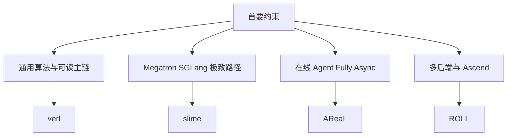

# D06 工业后训练框架对比

> **阶段**：S02–S05
> **文档编号**：D06
> **快照日期**：2026-07-27
> **证据基线**：verl `983cb0f`、slime `aaf5c20`、AReaL `b23fa6c`、ROLL `370cb24`
> **结论先行**：verl、slime、AReaL、ROLL 不是同一目标函数下的排行榜；它们分别优化通用可组合性、Megatron+SGLang 深集成、fully async 服务化和多 Strategy/异构硬件。
> **阅读导航**：[[posttraining_infra_mechanism_analysis|上一篇 D05]] · [[verl_end_to_end_iteration_analysis|下一篇 D07]]

---

## 1. 固定比较基线

| 框架 | commit | 本文角色 |
|---|---|---|
| verl | `983cb0f24443f87b3d161fad318445130a620b07` | 主 baseline，先贯通稳定同步链 |
| slime | `aaf5c2092b01219fa0d5c2d323741d409086ca32` | Megatron+SGLang 性能与新机制对照 |
| AReaL | `b23fa6cf9c8edfebcf055079ab78913128bc4579` | fully async、agent service、freshness 对照 |
| ROLL | `370cb24c1036ea9145365478fcc40612b2186fc8` | 多 Strategy、资源映射、Ascend 对照 |

“更快”只在同模型、同硬件、同并行、同序列、同有效样本数和同 freshness 下有意义。本文不做脱离条件的性能排名。

## 2. 一页机制矩阵

| 维度 | verl | slime | AReaL | ROLL |
|---|---|---|---|---|
| 控制面 | Ray PPO trainer 与 role worker | 轻量 train loop + Ray groups | controller/workflow + v2 services | pipeline + Cluster/schedulers |
| 训练后端 | FSDP/Megatron 等 | Megatron 主路径 | FSDP/Megatron/Archon | HF/FSDP2/Megatron |
| rollout | vLLM/SGLang 等 | SGLang 深集成 | SGLang/vLLM remote | vLLM/SGLang Strategy |
| 核心数据 | `DataProto` | `Sample` + DataSource/buffer | trajectory + workflow task | `DataProto` + remote storage |
| 权重面 | worker/rollout update | NCCL/tensor/disk/delta | AWEX/disk/colocate gateway | `ModelUpdateGroup` |
| 同步主线 | 成熟 | 成熟 | 可配为同步 | 成熟 |
| fully async | experimental 独立路径 | warm queue rollout path | 核心设计与 freshness manager | `async_pipeline` 与 agentic 分支 |
| Agentic | rollout interface/loop 扩展 | custom generate + agent harness | workflow + online agent service | env manager + tools + proxy |
| TIM 工具 | correction/bypass/metrics | rollout log-prob、routing replay | behave/proximal 分离 | train-infer corrections |
| NPU | 官方 Ascend 扩展列出 vLLM/SGLang + FSDP/FSDP2/Megatron/MindSpeed；固定 upstream commit 仍需逐后端核验 | 本快照非主路径 | 独立 Ascend 文档/分支 + vLLM-Ascend | 主树 platform 抽象与 vLLM-Ascend |

## 3. 四级支持证据

| 级别 | 定义 | 本文标记 |
|---|---|---|
| P1 | 配置、类、adapter 存在 | 接口 |
| P2 | 固定 commit 调用链与示例可达 | 功能 |
| P3 | 有一致性、恢复或 correctness 测试 | 正确性 |
| P4 | 目标规模且条件完整的性能证据 | 性能 |

重要结论：

- “有 NPU platform 类”通常只是 P1；
- “有 end-to-end example”可到 P2；
- “GPU/NPU 曲线相近”可作为局部 P3/P4，但不能外推所有模型；
- README 宣称属于 C 级来源，必须回到源码/测试。

## 4. 控制面与可修改性

### 4.1 verl

| 维度 | 摘要 |
|---|---|
| 优点 | `RayPPOTrainer` 主循环可读地串起 reward/advantage/actor update/weight refresh；`DataProto` 贯穿 role 边界；算法 registry 已含 GRPO、GSPO、SAPO、CISPO、REINFORCE 等十余种 estimator/policy-loss |
| 代价 | abstraction 层和配置面较大；stable 同步链与 experimental fully async 是两条架构路径；理解性能问题需要跨 trainer、worker、rollout backend |

详见 [[verl_architecture_overview_analysis|verl 架构总览]]（hybrid-controller、`fit` 主循环、`DataProto`）与 [[verl_rl_algorithms_analysis|verl RL 算法]]（registry 机制、config key→代码锚点）。

### 4.2 slime

优点：

- `train.py:49-93` 的主循环非常直接；
- 深押 Megatron+SGLang，可以暴露上游后端的高级能力；
- weight transport 与 custom rollout 的扩展面清晰。

代价：

- 单 rollout backend 的设计降低通用后端可替换性；
- fully async 当前主要改变 rollout producer，主 trainer 仍按 rollout id 消费；
- README 中生态项目能力不能自动算进 slime core。

### 4.3 AReaL

优点：

- freshness admission control 是一等对象；
- workflow/trajectory 与 agent service 边界清晰；
- v2 weight-update gateway 将 pair、version 与 transfer mode 显式化。

代价：

- 论文、legacy controller 和 v2 service 同时存在，阅读时必须分代；
- 服务化增加部署、鉴权、网络和故障恢复面；
- fully async correctness 更依赖 version/log-prob contract。

### 4.4 ROLL

优点：

- Strategy 将训练/推理操作统一到 worker interface；
- `device_mapping` 能表达 colocated 与 disaggregated；
- 主树内有 NPU platform、dtype 修正和 vLLM-Ascend worker 选择。

代价：

- 多后端 patch 与版本兼容矩阵较大；
- Strategy 屏蔽接口，不会自动屏蔽 kernel、collective、dtype 和性能差异；
- RLVR `async_pipeline` 与 Agentic async 的数据语义需分别读。

## 5. Async 语义对照

| 框架 | 可确认实现 | 不是 |
|---|---|---|
| verl | experimental fully async policy 拥有单独 main/queue/rollouter/trainer | stable `RayPPOTrainer.fit` 自动 fully async |
| slime | background asyncio worker 持续产组，queue 跨调用保温 | 无版本上限的任意 replay |
| AReaL | producer admission + version staleness + workflow executor | 单纯把 `asyncio` 包在 rollout 外 |
| ROLL | pipeline flag 控制 generate/model update 与 scheduler pause | 所有 agent env 都天然 on-policy |

因此对“异步程度”不应只打一个勾。至少分：

```text
phase overlap
producer warm queue
partial rollout
bounded version lag
independent training service
independent inference service
```

## 6. 算法扩展面

| 目标 | verl | slime | AReaL | ROLL |
|---|---|---|---|---|
| 新 loss | `core_algos.py` registry | Megatron loss/ppo utils | PPO actor/loss config | actor worker + strategy |
| 新 rollout | rollout class/agent loop | `--rollout-function-path` | `RolloutWorkflow`/agent | scheduler/env manager |
| 新 reward | reward manager/function | RM hub/custom function | workflow reward | reward worker |
| 新 weight transport | worker/rollout path | updater class | gateway adapter | update group/strategy |
| 新硬件 | worker/backend 适配 | 训练/serving 双栈 | platform + branch/image | platform + strategy |

对工业修改，建议先选“最小变更面”而非“功能最多”：

- loss 研究与通用 baseline：verl；
- Megatron+SGLang 大规模路径：slime；
- 在线 agent 与 bounded async：AReaL；
- 多后端、异构与 Ascend 主树实验：ROLL。

## 7. 正确性与运营检查

| 检查 | verl | slime | AReaL | ROLL |
|---|---|---|---|---|
| policy version 字段 | 部分路径需追 meta | rollout id/weight version | 一等字段 | global step/model update |
| TIM correction | helper 与 loss 接口 | log-prob/routing replay | 双 ratio 指标 | correction utility |
| fault injection | 部分 worker/test | health monitor/CI injection | controller/service recovery | scheduler/cluster 机制 |
| checkpoint queue state | 需按路径核验 | DataSource save/load | recovery/version hook | pipeline checkpoint |
| weight atomicity | backend-dependent | engine pause/flush/version compare | gateway last-version commit | all worker refs |

这张表表示源码中的机制入口，不表示完成了统一规模的故障注入验证。

## 8. 选型树



真实项目常用“主框架 + 对照框架”：

- 用 verl 建 correctness baseline；
- 用 slime/AReaL 验证 overlap 收益；
- 用 ROLL/AReaL Ascend 路径做 NPU gap analysis。

## 9. 当前证据边界

- 本文是源码静态审计，不是四框架同条件 benchmark。
- slime README 列出的外部生态项目不计入 core P2。
- [Ascend 的 verl 安装指南](https://ascend.github.io/docs/sources/_generated/sources/verl/get_start/install_guidance.html)是 2026-05-20 的当前扩展能力证据；它不自动证明固定 upstream commit 的每种组合都达到 P3/P4。
- AReaL NPU 支持文档明确指向维护分支；主分支的 platform 类不能替代该分支验证。
- ROLL NPU 主树有较多 P1/P2 证据，但目标模型的 P3/P4 仍需按官方 Ascend guide 和真实硬件复测。
- 所有快速变化结论在 2026-08-26 后引用前应重验。

## Related Pages

- [[posttraining_infra_mechanism_analysis|D05 后训练 Infra 核心机制]]
- [[verl_end_to_end_iteration_analysis|D07 verl 端到端训练迭代]]
- [[slime_architecture_analysis|D08 slime 架构]]
- [[areal_async_architecture_analysis|D09 AReaL 架构]]
- [[roll_strategy_and_ascend_analysis|D10 ROLL 与 Ascend]]
