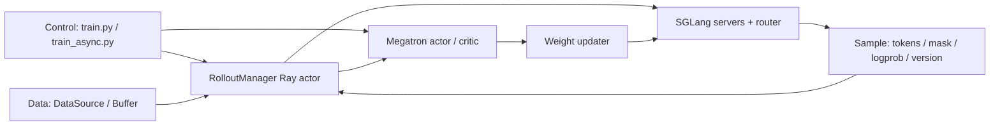

# slime 软件架构总览与端到端闭环

> **阶段**：S03
> **文档编号**：D08
> **源码基线**：slime `main@681b3adca54105d5ecd3fb822fa0dc58a427e0f9`
> **基线提交时间**：2026-08-12T16:50:12+07:00
> **核验日期**：2026-08-14
> **结论先行**：slime 的核心不是再造一个统一训练/推理抽象，而是让 Megatron 与 SGLang 保持原生能力，再用 Ray、`Sample`、`DataSource` 和版本化权重更新闭合 RL 回路。短控制链带来性能与可修改性；代价是后端替换成本高，而且正确性依赖数据契约、loss reducer 与权重提交协议共同成立。
> **系列入口**：[[slime/index]]
> **本轮变化**：相对旧页基线 `aaf5c209`，本页重验当前主分支，并扩展为独立 `slime/` 知识域；控制面、数据、rollout、训练、loss、权重、容错及横切专题均有单页实现分析。
> **阅读导航**：[[10_verl_end_to_end_iteration_analysis|上一篇 D07]] · [[21_areal_async_architecture_analysis|下一篇 D09]]

---

## 1. 中央判断：薄编排，深后端，显式正确性

项目自己把能力压缩成两件事：Megatron 高性能训练与 SGLang 灵活数据生成；training、rollout、reward/verifier、environment 与 Data Buffer 走同一条闭环，而不是拆成互不相干的产品。它同时有意只深度优化 SGLang rollout backend，避免最低公共能力抽象。[`README_zh.md:9-24`](https://github.com/THUDM/slime/blob/681b3adca54105d5ecd3fb822fa0dc58a427e0f9/README_zh.md#L9-L24)

这形成三个设计赌注：

| 赌注 | 为什么这样做 | 收益 | 代价 |
|---|---|---|---|
| Megatron/SGLang 参数原生透传 | 上游优化可以直接进入 RL 路径 | 少 wrapper、快跟进并行/kernel/serving 能力 | 版本与后端耦合更深 |
| `Sample`/`DataSource` 作为数据边界 | 自定义 agent/reward 不 fork trainer kernel | 数据生成灵活、调试入口统一 | 扩展必须维护 token/mask/logprob/version 契约 |
| 权重更新作为显式提交协议 | 生成不能看到半套新参数 | 可解释的 snapshot 边界 | pause、flush、转换与同步形成阻塞成本 |

前两项由 README 的 native pass-through 与单后端取舍直接给出；第三项可由 NCCL updater 的 `pause → flush → send → continue` 顺序验证。[`README_zh.md:36-50`](https://github.com/THUDM/slime/blob/681b3adca54105d5ecd3fb822fa0dc58a427e0f9/README_zh.md#L36-L50) [`update_weight_from_distributed.py:102-134`](https://github.com/THUDM/slime/blob/681b3adca54105d5ecd3fb822fa0dc58a427e0f9/slime/backends/megatron_utils/update_weight/update_weight_from_distributed.py#L102-L134)

## 2. 三平面与所有者



| 平面 | 主要 owner | 状态/消息 | 源码入口 |
|---|---|---|---|
| 控制面 | `train.py`、`train_async.py`、`RolloutManager` | rollout id、Ray future、eval/save/offload | [`train.py:9-93`](https://github.com/THUDM/slime/blob/681b3adca54105d5ecd3fb822fa0dc58a427e0f9/train.py#L9-L93) |
| 数据面 | `DataSource`、`Sample`、RolloutManager conversion | prompt group、tokens、reward、mask、logprob、routing、version | [`data_source.py:17-46`](https://github.com/THUDM/slime/blob/681b3adca54105d5ecd3fb822fa0dc58a427e0f9/slime/rollout/data_source.py#L17-L46) [`types.py:93-149`](https://github.com/THUDM/slime/blob/681b3adca54105d5ecd3fb822fa0dc58a427e0f9/slime/utils/types.py#L93-L149) |
| 计算面 | Megatron actor/critic、SGLang generation/RM | policy/value forward-backward、decode、reward | [`actor.py:592-653`](https://github.com/THUDM/slime/blob/681b3adca54105d5ecd3fb822fa0dc58a427e0f9/slime/backends/megatron_utils/actor.py#L592-L653) [`sglang_rollout.py:224-336`](https://github.com/THUDM/slime/blob/681b3adca54105d5ecd3fb822fa0dc58a427e0f9/slime/rollout/sglang_rollout.py#L224-L336) |
| 权重面 | updater + SGLang engine endpoints | weight version、NCCL/tensor/disk payload、cache commit | [`update_weight_from_distributed.py:23-48`](https://github.com/THUDM/slime/blob/681b3adca54105d5ecd3fb822fa0dc58a427e0f9/slime/backends/megatron_utils/update_weight/update_weight_from_distributed.py#L23-L48) |

这里没有 core `TransferQueue`。当前 trainer 数据桥是 per-DP Ray object ref；大字段先 CPU tensorize，再可选走 Ray NIXL tensor transport。[`rollout.py:871-938`](https://github.com/THUDM/slime/blob/681b3adca54105d5ecd3fb822fa0dc58a427e0f9/slime/ray/rollout.py#L871-L938)

## 3. 同步主链：每轮形成明确 barrier

`train.py` 的真实顺序是：创建 rollout manager 与 actor/critic，先推一次 actor 权重；每个 rollout id 上等待 `generate`，训练 actor/critic，save/offload，更新 rollout 权重，再做周期性 eval。[`train.py:13-33`](https://github.com/THUDM/slime/blob/681b3adca54105d5ecd3fb822fa0dc58a427e0f9/train.py#L13-L33) [`train.py:48-91`](https://github.com/THUDM/slime/blob/681b3adca54105d5ecd3fb822fa0dc58a427e0f9/train.py#L48-L91)

```text
rollout(N, weight v)
  -> convert/split
  -> train(N)
  -> publish weight v+1
  -> rollout(N+1, weight v+1)
```

`actor_model.async_train` 只是 Ray future 接口；外层紧接 `ray.get`，因此不能据函数名推断跨轮 fully async optimizer。[`actor_group.py:131-149`](https://github.com/THUDM/slime/blob/681b3adca54105d5ecd3fb822fa0dc58a427e0f9/slime/ray/actor_group.py#L131-L149) [`train.py:61-69`](https://github.com/THUDM/slime/blob/681b3adca54105d5ecd3fb822fa0dc58a427e0f9/train.py#L61-L69)

## 4. 异步主链：一拍 overlap，不是无界 policy lag

`train_async.py` 先启动 rollout N，拿到它后立即预启动 N+1，再训练 N；这消除了部分 generate/train phase bubble。但达到 `update_weights_interval` 时，它先等待下一轮 generation future 完成，再更新权重，源码注释明确说这是为了防止生成中途换权重。[`train_async.py:31-53`](https://github.com/THUDM/slime/blob/681b3adca54105d5ecd3fb822fa0dc58a427e0f9/train_async.py#L31-L53) [`train_async.py:66-70`](https://github.com/THUDM/slime/blob/681b3adca54105d5ecd3fb822fa0dc58a427e0f9/train_async.py#L66-L70)

因此当前异步语义应写成：

```text
generate(N+1, v)  ||  train(N, v)
                         |
                 wait generate(N+1)
                         |
                    publish(v+1)
```

这和 AReaL 的 version admission/freshness manager 不同：slime 当前默认路径没有把最大 head off-policyness 作为一等调度预算；它选择在 weight commit 前等待生成结束，以保持单次生成 snapshot 一致。fully-async rollout worker进一步让 producer 跨调用保温，但不移除这个外层更新屏障，详见 [[30_slime_rollout_optimization_analysis]]。

## 5. 资源布局：colocate、disaggregate 与 release

`_get_placement_group_layout` 在一个 Ray placement group 内表达四类布局：train-only、external rollout、colocate、train/rollout disaggregate；critic 默认复用 actor placement group。colocate 取 actor 与 rollout GPU 数的最大值，disaggregate 则相加。[`placement_group.py:100-137`](https://github.com/THUDM/slime/blob/681b3adca54105d5ecd3fb822fa0dc58a427e0f9/slime/ray/placement_group.py#L100-L137)

| 模式 | 适用目标 | 主要代价/约束 |
|---|---|---|
| colocate + offload | 卡少或希望 train/rollout 复用 GPU | sleep/wake、KV/weights onload，且 `train_async.py` 禁止 colocate |
| disaggregate | 并行 generate/train，独立调 TP/EP | GPU 总量更高，权重传输跨资源池 |
| external engine | serving 生命周期独立、跨集群 | 需要 disk/NCCL 可达性与版本提交协议 |
| `release_train` | 极端复用显存，训练 actor 按轮释放重建 | 仅 Megatron、无 critic/old actor，要求每轮 save 与 full+disk 更新 |

前三类来自 placement 逻辑与 async 入口约束；`release_train` 的限制在参数校验中被硬编码。[`train_async.py:9-12`](https://github.com/THUDM/slime/blob/681b3adca54105d5ecd3fb822fa0dc58a427e0f9/train_async.py#L9-L12) [`arguments.py:2038-2066`](https://github.com/THUDM/slime/blob/681b3adca54105d5ecd3fb822fa0dc58a427e0f9/slime/utils/arguments.py#L2038-L2066)

## 6. DataSource 与 Sample 是真正的扩展 ABI

标准 `RolloutDataSource` 从全局 dataset 取 prompt，每个 prompt deepcopy 成 `n_samples_per_prompt` 一组，并保存 epoch/sample offset；buffer 版本优先消费已回收 group，只有完整 group 才重新入队。[`data_source.py:50-118`](https://github.com/THUDM/slime/blob/681b3adca54105d5ecd3fb822fa0dc58a427e0f9/slime/rollout/data_source.py#L50-L118) [`data_source.py:123-160`](https://github.com/THUDM/slime/blob/681b3adca54105d5ecd3fb822fa0dc58a427e0f9/slime/rollout/data_source.py#L123-L160) [`data_source.py:168-212`](https://github.com/THUDM/slime/blob/681b3adca54105d5ecd3fb822fa0dc58a427e0f9/slime/rollout/data_source.py#L168-L212)

`Sample` 不只是文本容器。它同时携带：

- `rollout_id`：compact/subagent fanout 的统计单位；
- token、response length 与 loss mask；
- rollout log-prob、top-p nucleus ragged payload、MoE routed experts；
- `weight_versions` 与 status；
- session id、reward、训练/多模态元数据。

这些字段由 [`types.py:93-149`](https://github.com/THUDM/slime/blob/681b3adca54105d5ecd3fb822fa0dc58a427e0f9/slime/utils/types.py#L93-L149) 定义。`append_response_tokens` 进一步强制 trainable token 必须带同长度 log-prob，tool/environment token 自动置 loss mask 0，并在每次追加后校验元数据长度。[`types.py:253-314`](https://github.com/THUDM/slime/blob/681b3adca54105d5ecd3fb822fa0dc58a427e0f9/slime/utils/types.py#L253-L314) [`types.py:418-443`](https://github.com/THUDM/slime/blob/681b3adca54105d5ecd3fb822fa0dc58a427e0f9/slime/utils/types.py#L418-L443)

这解释了为什么“自定义 rollout function”很灵活但不是无契约：函数至少要产出 tokens、response length、reward、status；如果一条 rollout fanout 成多个训练 sample，所有 sibling 还必须共享 `rollout_id`。[`arguments.py:328-340`](https://github.com/THUDM/slime/blob/681b3adca54105d5ecd3fb822fa0dc58a427e0f9/slime/utils/arguments.py#L328-L340) [`rollout.py:941-970`](https://github.com/THUDM/slime/blob/681b3adca54105d5ecd3fb822fa0dc58a427e0f9/slime/ray/rollout.py#L941-L970)

## 7. RolloutManager：把生成输出变成可训练目标

RolloutManager 的职责不是只“启动 SGLang”：它动态加载 rollout/eval/reward postprocess/conversion 函数，管理 health monitor、debug dump、DataSource save/load，并把 samples 变成 per-DP 训练包。[`rollout.py:465-515`](https://github.com/THUDM/slime/blob/681b3adca54105d5ecd3fb822fa0dc58a427e0f9/slime/ray/rollout.py#L465-L515) [`rollout.py:590-639`](https://github.com/THUDM/slime/blob/681b3adca54105d5ecd3fb822fa0dc58a427e0f9/slime/ray/rollout.py#L590-L639)

转换分三步：

1. 在 flatten 前验证 nested compact group 的 `rollout_id`；
2. 做 group reward normalization、构造 token/mask/logprob/routing 等字段，并预计算整个 rollout 的 mask denominator；
3. 按 rollout id 切 training step，构造全局 micro-batch schedule，再为每个 DP rank 打包 object-store/NIXL ref。

对应源码分别是 [`rollout.py:671-747`](https://github.com/THUDM/slime/blob/681b3adca54105d5ecd3fb822fa0dc58a427e0f9/slime/ray/rollout.py#L671-L747)、[`rollout.py:749-866`](https://github.com/THUDM/slime/blob/681b3adca54105d5ecd3fb822fa0dc58a427e0f9/slime/ray/rollout.py#L749-L866) 与 [`rollout.py:871-938`](https://github.com/THUDM/slime/blob/681b3adca54105d5ecd3fb822fa0dc58a427e0f9/slime/ray/rollout.py#L871-L938)。这里“先见完整 rollout、再拆 micro-batch”是 loss 在动态 packing 下仍保持同一统计语义的关键，详见 [[31_slime_posttraining_stability_analysis]]。

## 8. 权重面：四种物理路径，一个提交语义

| 场景 | 物理路径 | 关键机制 |
|---|---|---|
| disaggregate 常规 | full + NCCL | TP/EP gather、HF layout conversion、分桶 broadcast |
| colocate | full + tensor/CUDA IPC | tensor handle 跨进程，按 bucket 等待 engine 消费 |
| external/shared FS | full + disk | 写完整 version 目录，engine 热加载 |
| 跨集群大模型 | delta + disk | CPU baseline diff、压缩/checksum、原子文件、host-local apply |

NCCL updater 描述了 PP source、TP/EP 分离与分桶发送。[`update_weight_from_distributed.py:23-27`](https://github.com/THUDM/slime/blob/681b3adca54105d5ecd3fb822fa0dc58a427e0f9/slime/backends/megatron_utils/update_weight/update_weight_from_distributed.py#L23-L27) tensor 路径在更新前 pause/flush，逐 bucket 等待 Ray refs，最后才 resume。[`update_weight_from_tensor.py:276-331`](https://github.com/THUDM/slime/blob/681b3adca54105d5ecd3fb822fa0dc58a427e0f9/slime/backends/megatron_utils/update_weight/update_weight_from_tensor.py#L276-L331) delta 路径用 version/base_version 元数据、checksum 与 `_atomic_write` 发布，再 pull、pause、flush、reload、resume。[`update_weight_from_disk_delta.py:127-190`](https://github.com/THUDM/slime/blob/681b3adca54105d5ecd3fb822fa0dc58a427e0f9/slime/backends/megatron_utils/update_weight/update_weight_from_disk_delta.py#L127-L190)

当前 multi-model serving 只有第一个 `update_weights=True` 的 model 会进入更新路径；reference/reward 等 frozen model 被排除，多 updatable model 尚未支持。[`rollout.py:555-584`](https://github.com/THUDM/slime/blob/681b3adca54105d5ecd3fb822fa0dc58a427e0f9/slime/ray/rollout.py#L555-L584)

## 9. 可修改性：最小入口与必须维护的契约

| 目标 | 最小修改入口 | 不能破坏的约束 |
|---|---|---|
| 新 agent/tool loop | `--custom-generate-function-path` 或 rollout function | policy/tool token mask、partial state、session/version |
| 新 reward/verifier | RM hub、group RM、sample hook | group 对齐、失败/超时语义、reward key |
| 新 buffer 策略 | `DataSource` / buffer filter | group 完整性、save/load offset |
| 新采样策略 | SGLang 参数或 rollout hook | 训练侧必须知道影响 behavior logprob 的变换 |
| 新 PPO/GRPO 变体 | `loss.py` / `ppo_utils.py` | DP/CP reducer、mask denominator、metrics 口径 |
| 新 weight transport | updater class | pause/flush/version/commit/recovery |
| 新推理 backend | server、rollout、weight updater 全链 | 不是一个小 adapter；SGLang 特有能力已渗入数据面 |

rollout hook 在 reward 之前执行，可同步或异步；custom rollout 的最小返回 contract 由参数帮助文本定义。[`arguments.py:477-493`](https://github.com/THUDM/slime/blob/681b3adca54105d5ecd3fb822fa0dc58a427e0f9/slime/utils/arguments.py#L477-L493) 单后端取舍见 [`README_zh.md:48-50`](https://github.com/THUDM/slime/blob/681b3adca54105d5ecd3fb822fa0dc58a427e0f9/README_zh.md#L48-L50)。

## 10. 当前能力边界

1. `train_async.py` 是 phase overlap，weight update 前仍有生成屏障；不要把它写成无限 staleness 的 fully async trainer。
2. fully-async rollout 是 warm producer/queue，不是 freshness controller；当前不支持 evaluation。
3. 训推 logprob 的严格 kernel 级对齐目前只声明支持 GLM-5 结构；其他模型仍应使用 mismatch metrics/TIS 与逐模型门禁。
4. `balance_by_flops` 更接近真实计算量，但源码明确不保证 token cap，配置过紧可能 OOM。
5. fault tolerance 聚焦 rollout engine；trainer rank failure、集群抢占与 full-job resume 仍需 checkpoint、Ray/调度器共同处理。

前四项分别由 [`train_async.py:66-70`](https://github.com/THUDM/slime/blob/681b3adca54105d5ecd3fb822fa0dc58a427e0f9/train_async.py#L66-L70)、[`fully_async_rollout.py:269-274`](https://github.com/THUDM/slime/blob/681b3adca54105d5ecd3fb822fa0dc58a427e0f9/slime/rollout/fully_async_rollout.py#L269-L274)、[`reproducibility.md:53-74`](https://github.com/THUDM/slime/blob/681b3adca54105d5ecd3fb822fa0dc58a427e0f9/docs/zh/advanced/reproducibility.md#L53-L74) 与 [`dp_schedule.py:65-76`](https://github.com/THUDM/slime/blob/681b3adca54105d5ecd3fb822fa0dc58a427e0f9/slime/utils/dp_schedule.py#L65-L76) 直接支持。fault tolerance 边界由 [`fault-tolerance.md:7-27`](https://github.com/THUDM/slime/blob/681b3adca54105d5ecd3fb822fa0dc58a427e0f9/docs/zh/advanced/fault-tolerance.md#L7-L27) 给出。

## 11. 建议阅读与验收

| 问题 | 下一页 | 最小验收 |
|---|---|---|
| 整轮代码怎样闭合 | [[10_slime_end_to_end_iteration_analysis]] | 逐阶段追踪 future、样本与权重版本 |
| Ray 控制面怎样落到物理 GPU | [[11_slime_ray_control_plane_analysis]] | placement、actor、server、manager 生命周期 |
| 数据 ABI 与训练输入怎样转换 | [[12_slime_sample_datasource_analysis]] | `Sample`、DataSource、fanout、DP transport |
| SGLang rollout 怎样实现 | [[13_slime_sglang_rollout_engine_analysis]] | engine、生成状态、并发、partial/streaming/fully-async |
| Megatron 训练怎样实现 | [[14_slime_megatron_training_analysis]] | model provider、角色切换、packed/CP、forward/backward |
| loss 与并行怎样保持统计语义 | [[15_slime_loss_parallelism_analysis]] | estimator、reducer、DP/CP schedule、metrics |
| 权重怎样原子提交给推理侧 | [[16_slime_weight_sync_analysis]] | NCCL、IPC、full/delta disk 与恢复边界 |
| 训推一致性怎样闭环 | [[17_slime_train_inference_consistency_analysis]] | snapshot version、token/logprob、sampling transform、MoE route 四层对齐 |
| 故障怎样定位和恢复 | [[18_slime_fault_tolerance_observability_analysis]] | health、retry、replay、trace、profile、CI |
| rollout 吞吐究竟从哪里来 | [[30_slime_rollout_optimization_analysis]] | 分离 generate/train/RM/weight-sync 时间，并报告有效 sample 成本 |
| 后训练为何不因并行/packing 漂移 | [[31_slime_posttraining_stability_analysis]] | compact fanout、DP/CP、mbs 重排下 loss/grad invariant |

## Related Pages

- [[slime/index|slime 独立知识域]]
- [[30_slime_rollout_optimization_analysis|slime Rollout 优化深潜]]
- [[17_slime_train_inference_consistency_analysis|slime 训推一致性深潜]]
- [[31_slime_posttraining_stability_analysis|slime 后训练稳定性深潜]]
- [[21_areal_async_architecture_analysis|D09 AReaL Fully Async]]
- [[30_rl_framework_comparison|D06 工业后训练框架对比]]
- [[02_engineering/04_posttrain_frameworks/12_rl_infra_efficiency_analysis|RL Infra 效率分析]]
