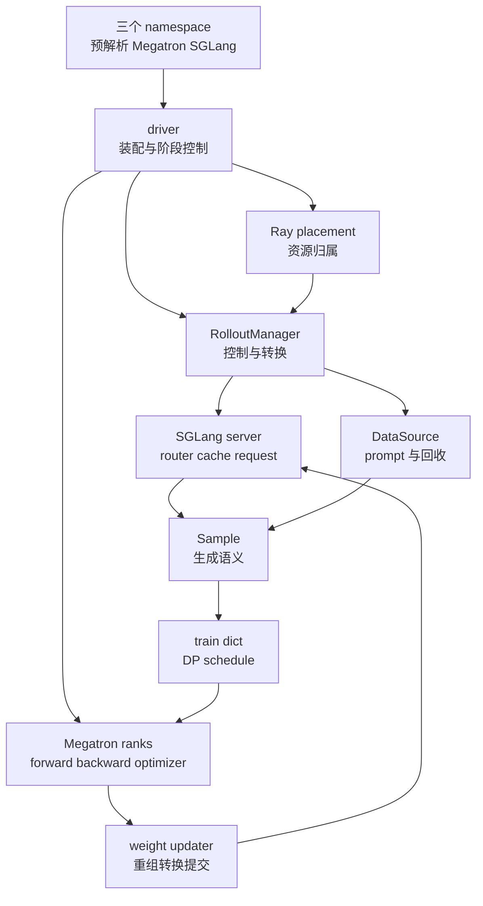

# slime 架构总览：用轻量编排连接训练与推理系统

> **源码基线**：`THUDM/slime@681b3adca54105d5ecd3fb822fa0dc58a427e0f9`（`main`，2026-08-12）
> **主题**：本页说明 slime 如何划分训练、生成与控制职责，随后对照跨组件协议、资源生命周期和后端适配边界。
> **适用范围**：架构总览；端到端时序、数据、训练与权重传输分别由专题页承接。
> **最近更新**：2026-09-10。核实控制面、配置与运行边界。

Megatron 与 SGLang 的价值恰好来自不同方向：前者拥有训练 rank、并行组、优化器与 checkpoint 生命周期，后者拥有 HTTP server、router、KV cache 与 serving topology 生命周期。slime 没有把二者压进统一 engine 接口，而是保留各自原生控制面，只在 RL 必须闭合的资源、数据、训练阶段和权重版本边界上加薄编排。这样能直接使用上游能力，代价是 SGLang/Megatron 语义会泄漏进控制与同步代码，新 backend 也不是换一个 adapter 就能接入。

本文把事实与分析判断分开：带 fixed-commit 定位符的是源码或项目文档事实；使用“设计分析”“由此可推断”的段落是根据实现形态和失败路径作出的解释，不代表作者原话。

## 1. 问题不是“缺一个 RL 引擎”，而是两套成熟系统采用了不同的运行方式

项目把目标能力概括为“高性能训练”和“灵活的数据生成”，并要求 Megatron training、SGLang rollout、reward/verifier、environment 与 Data Buffer 形成同一条闭环，而不是彼此割裂的服务。[`README_zh.md:9-16`](https://github.com/THUDM/slime/blob/681b3adca54105d5ecd3fb822fa0dc58a427e0f9/README_zh.md#L9-L16)

这两项能力不能简单合并成一个同构 worker。下表的两列原生语义来自实现，最后一列“桥”是由这些差异推导出的设计分析：

| 差异点 | Megatron 的处理方式 | SGLang 的处理方式 | slime 必须补齐的连接 |
|---|---|---|---|
| 生命周期 | 每个 distributed rank 是一个 Ray actor；rank group 初始化模型、优化器和并行组，可训练、保存、sleep/wake 或整组释放重建。[`slime/ray/actor_group.py:57-129`](https://github.com/THUDM/slime/blob/681b3adca54105d5ecd3fb822fa0dc58a427e0f9/slime/ray/actor_group.py#L57-L129) [`slime/backends/megatron_utils/actor.py:57-111`](https://github.com/THUDM/slime/blob/681b3adca54105d5ecd3fb822fa0dc58a427e0f9/slime/backends/megatron_utils/actor.py#L57-L111) [`slime/ray/actor_group.py:175-208`](https://github.com/THUDM/slime/blob/681b3adca54105d5ecd3fb822fa0dc58a427e0f9/slime/ray/actor_group.py#L175-L208) | Ray actor 内再启动 SGLang HTTP server 进程，等待健康检查并注册 router；运行中还要管理 cache、请求暂停和显存释放。[`slime/backends/sglang_utils/sglang_engine.py:48-81`](https://github.com/THUDM/slime/blob/681b3adca54105d5ecd3fb822fa0dc58a427e0f9/slime/backends/sglang_utils/sglang_engine.py#L48-L81) `slime/backends/sglang_utils/sglang_engine.py::SGLangEngine._init_normal / _register_to_router`；运行期见 `SGLangEngine.pause_generation / continue_generation / flush_cache / release_memory_occupation` | Ray driver 决定阶段顺序、资源共置与释放；weight updater（full+disk 则为 RayTrainGroup）驱动暂停、应用版本与恢复。 |
| 数据 | trainer 需要按 DP rank 和 micro-batch 切分的数据；train dict 以 `tokens`、`response_lengths`、`loss_masks`、`rewards` 为基本列，可附 `rollout_log_probs` 等 tensors。[`slime/ray/rollout.py:871-930`](https://github.com/THUDM/slime/blob/681b3adca54105d5ecd3fb822fa0dc58a427e0f9/slime/ray/rollout.py#L871-L930) | rollout 需要保留 prompt、响应、状态、session、logprob、top-p、routing 和 weight version 等请求语义。[`slime/utils/types.py:93-149`](https://github.com/THUDM/slime/blob/681b3adca54105d5ecd3fb822fa0dc58a427e0f9/slime/utils/types.py#L93-L149) | `Sample` 先保存完整生成语义，RolloutManager 再在完整 step 视野下压成 train dict。 |
| 拓扑 | actor world size 来自训练节点与每节点 GPU 数，内部继续使用 Megatron 的 DP/TP/PP/CP/EP 组。[`slime/backends/megatron_utils/arguments.py:187-201`](https://github.com/THUDM/slime/blob/681b3adca54105d5ecd3fb822fa0dc58a427e0f9/slime/backends/megatron_utils/arguments.py#L187-L201) | 每个 server group 独立表达 TP、PP、EP、MoE-DP、worker type 与 router；同一模型还可以有异构 prefill/decode groups。[`slime/ray/rollout.py:150-186`](https://github.com/THUDM/slime/blob/681b3adca54105d5ecd3fb822fa0dc58a427e0f9/slime/ray/rollout.py#L150-L186) [`docs/zh/advanced/sglang-config.md:17-21`](https://github.com/THUDM/slime/blob/681b3adca54105d5ecd3fb822fa0dc58a427e0f9/docs/zh/advanced/sglang-config.md#L17-L21) | 权重同步必须先从训练 shard 恢复逻辑参数，再映射为 serving 可加载的布局并送到各 engine。 |

> **设计分析**：这里的“不兼容”不是指两者不能协作，而是指它们没有可无损互换的生命周期、数据对象和拓扑单位。若强行规定一个 `Engine.start/generate/train/update` 公共接口，关键差异不会消失，只会变成大量 optional method、backend-specific field 和 escape hatch。

## 2. 为什么这么设计：约束如何逼出“薄编排、深后端”

### 2.1 接入 slime 后仍要能直接使用底层能力

slime 的参数入口不是先定义一份自有 schema 再翻译到两个后端。它先用 SGLang `ServerArgs.add_cli_args` 动态注册并加 `--sglang-` 前缀，再让 SGLang 与 Megatron 各自 `parse_known_args`，最后把预解析、SGLang、Megatron 三个 namespace 合并并分别调用验证器。[`slime/backends/sglang_utils/arguments.py:38-118`](https://github.com/THUDM/slime/blob/681b3adca54105d5ecd3fb822fa0dc58a427e0f9/slime/backends/sglang_utils/arguments.py#L38-L118) [`slime/utils/arguments.py:1600-1643`](https://github.com/THUDM/slime/blob/681b3adca54105d5ecd3fb822fa0dc58a427e0f9/slime/utils/arguments.py#L1600-L1643)

项目文档明确把这个选择解释为：Megatron 的并行、优化器、checkpoint 与模型参数继续原生可用，SGLang 的 serving 参数通过前缀继续可用；框架把自己的复杂度集中到 RL loop、dataflow、synchronization 与 correctness check。[`README_zh.md:36-50`](https://github.com/THUDM/slime/blob/681b3adca54105d5ecd3fb822fa0dc58a427e0f9/README_zh.md#L36-L50)

### 2.2 生成可扩展，但训练统计不能随之漂移

`Sample` 允许一次生成携带多轮、工具、状态和条件 behavior metadata；`DataSource` 的接口同时包含 get、add、save 与 load，说明它还管理回收与恢复，而非只做静态 dataset 读取。[`slime/utils/types.py:93-149`](https://github.com/THUDM/slime/blob/681b3adca54105d5ecd3fb822fa0dc58a427e0f9/slime/utils/types.py#L93-L149) [`slime/rollout/data_source.py:17-46`](https://github.com/THUDM/slime/blob/681b3adca54105d5ecd3fb822fa0dc58a427e0f9/slime/rollout/data_source.py#L17-L46)

另一方面，转换器在还能看到完整 rollout step 时补齐 `rollout_id`、验证 mask，并预计算 rollout-level denominator，之后才按 DP rank 分包。[`slime/ray/rollout.py:749-814`](https://github.com/THUDM/slime/blob/681b3adca54105d5ecd3fb822fa0dc58a427e0f9/slime/ray/rollout.py#L749-L814) 具体的数据身份、partial 和 fanout 契约由 [[12_slime_sample_datasource_analysis]] 负责；本页只强调其架构意义：**自由发生在 rollout 侧，确定性压缩发生在 trainer 边界。**

### 2.3 权重更新必须按版本提交，不能只是直接复制张量

默认 distributed updater 在每次更新时先让所有 rollout engines `pause_generation` 并 `flush_cache`，再发送参数，最后才 `continue_generation`；非 expert 参数走 TP gather，expert 参数还要经过 EP gather，二者都转换成 HF 命名/布局后分桶发送。[`slime/backends/megatron_utils/update_weight/update_weight_from_distributed.py:102-146`](https://github.com/THUDM/slime/blob/681b3adca54105d5ecd3fb822fa0dc58a427e0f9/slime/backends/megatron_utils/update_weight/update_weight_from_distributed.py#L102-L146) [`slime/backends/megatron_utils/update_weight/update_weight_from_distributed.py:153-181`](https://github.com/THUDM/slime/blob/681b3adca54105d5ecd3fb822fa0dc58a427e0f9/slime/backends/megatron_utils/update_weight/update_weight_from_distributed.py#L153-L181)

> **设计分析**：这段顺序揭示了桥接层的真正职责。transport 只回答“字节怎样过去”；pause、cache drain、layout conversion、version 与 resume 才回答“推理服务何时可以把新参数视为一个完整 snapshot”。因此权重面无法被约化成通用 `set_weights(tensors)`。

### 2.4 资源布局必须允许训练与推理错峰运行

同一个 placement group 可以表达 train-only、external rollout、colocate 与 train/rollout 分离：colocate 取两边 GPU 数的最大值，分离部署则相加。[`slime/ray/placement_group.py:100-137`](https://github.com/THUDM/slime/blob/681b3adca54105d5ecd3fb822fa0dc58a427e0f9/slime/ray/placement_group.py#L100-L137) 共置时 SGLang group 只有与 Megatron GPU 重叠才执行 offload/onload；分离时不需要释放 serving 显存。[`slime/ray/rollout.py:299-317`](https://github.com/THUDM/slime/blob/681b3adca54105d5ecd3fb822fa0dc58a427e0f9/slime/ray/rollout.py#L299-L317)

> **设计分析**：资源复用不是统一 worker 内部的一个布尔开关，而是 Ray placement、训练 actor 生命周期和 serving memory lifecycle 的组合约束。

## 3. 核心设计取舍：只统一训练闭环，不强求统一引擎

项目明确表示选择单一 SGLang rollout backend 是有意取舍：多 backend 公共层容易收缩到共同能力子集，从而遮住各 backend 最强的 serving、routing、caching、disaggregation 与 weight-sync 行为。[`README_zh.md:48-50`](https://github.com/THUDM/slime/blob/681b3adca54105d5ecd3fb822fa0dc58a427e0f9/README_zh.md#L48-L50)

> **设计分析**：从固定实现归纳，slime 实际统一的是四条跨系统协议，而不是一个 Engine 基类：

| 统一边界 | slime 规定什么及交界对象 | 后端仍然自己决定什么 |
|---|---|---|
| 阶段协议 | `rollout_id: int` 与 generate/train ObjectRefs 的等待、save/eval 和 weight commit 顺序 | Megatron 如何执行 forward/backward；SGLang 如何调度请求 |
| 数据协议 | `Sample` 列表到 train dict：`tokens: list[sequence]`、`loss_masks: list[response mask]`、`rewards: list[scalar]`，再形成逐 DP refs | agent/environment 内部状态；Megatron micro-batch 内核 |
| 资源协议 | `(pg, reordered_bundle_indices, reordered_gpu_ids)` 与 colocate/disaggregate/external 布局 | 两套后端内部进程、并行组、cache 与 allocator |
| 版本协议 | `get_updatable_engines_and_lock()` 六元组：engines、lock、num_new、gpu_counts、gpu_offsets、parallel_configs；决定暂停、传输、恢复目标 | 训练 shard 的物理布局；serving engine 的加载实现 |

### 3.1 为什么不设计统一的引擎抽象层

> **设计分析**：以下是由源码边界推导出的替代方案比较，不是项目作者逐项写下的决策记录。

| 直观替代方案 | 看似得到什么 | 在当前约束下会失去什么 |
|---|---|---|
| 自定义统一参数 schema | 配置表面整齐、backend 可枚举 | `ServerArgs` 与 Megatron 新参数不能自然透传；每次上游新增能力都要先更新 wrapper |
| `TrainerEngine` / `RolloutEngine` 公共生命周期 | 容易画出对称架构 | optimizer/checkpoint 与 router/cache/health/pause 并不对称，公共接口最终仍需后端专用状态 |
| 统一并行拓扑对象 | 可复用调度与权重 API | Megatron rank mesh 与 SGLang 多模型异构 server groups 的切分单位不同，权重仍需 gather、命名转换与重分发 |
| 一个全程通用 batch 对象 | 少一次对象转换 | 要么让 trainer 接受任意 Python/agent 状态，要么过早丢失 partial、fanout、session 与 behavior metadata |
| 多 rollout backend registry | 配置级切换推理引擎 | 必须把 router、abort、cache、offload、weight commit、trace 和 fault recovery 一并标准化；只抽象 `generate` 不能形成可训练闭环 |

因此，slime 的赌注不是“抽象越少越好”，而是**只抽象跨边界不变量**。原生引擎内部保持深，桥接协议保持显式；这用较窄的后端矩阵换取更短的能力落地路径。

## 4. 状态归属与职责边界：谁控制状态，谁只传消息

> **设计分析**：下图和表把调用点归纳成所有权边界；它们是对源码的架构解释，不是项目提供的正式接口分层。

<!-- Figure spec: TB ownership overview; driver controls placement, generation and training, Sample/train dict bridge their separate state. Arrows summarize collaboration rather than a direct source caller tree. -->

| 责任主体 | 负责的状态与决策 | 明确不负责什么 |
|---|---|---|
| driver `train.py` / `train_async.py` | placement 创建、角色装配、rollout/train/update/eval 的阶段顺序 | 请求级生成状态、模型前反向细节 [`train.py:13-30`](https://github.com/THUDM/slime/blob/681b3adca54105d5ecd3fb822fa0dc58a427e0f9/train.py#L13-L30) [`train.py:48-91`](https://github.com/THUDM/slime/blob/681b3adca54105d5ecd3fb822fa0dc58a427e0f9/train.py#L48-L91) |
| Ray control objects | GPU bundle、训练 rank actor、rollout server group、manager 与 future | RL loss 数学、SGLang 内部 scheduler [`slime/ray/placement_group.py:120-137`](https://github.com/THUDM/slime/blob/681b3adca54105d5ecd3fb822fa0dc58a427e0f9/slime/ray/placement_group.py#L120-L137) [`slime/ray/actor_group.py:115-149`](https://github.com/THUDM/slime/blob/681b3adca54105d5ecd3fb822fa0dc58a427e0f9/slime/ray/actor_group.py#L115-L149) |
| RolloutManager | server 启动等待、DataSource、动态 rollout/RM/converter hook、Sample 到 per-DP refs 的压缩 | optimizer state、Megatron 并行执行 [`slime/ray/rollout.py:465-505`](https://github.com/THUDM/slime/blob/681b3adca54105d5ecd3fb822fa0dc58a427e0f9/slime/ray/rollout.py#L465-L505) |
| SGLang | HTTP generation、router worker、cache、serving parallel topology | global RL step、训练 batch 与 optimizer [`slime/backends/sglang_utils/sglang_engine.py:48-81`](https://github.com/THUDM/slime/blob/681b3adca54105d5ecd3fb822fa0dc58a427e0f9/slime/backends/sglang_utils/sglang_engine.py#L48-L81) [`slime/ray/rollout.py:176-204`](https://github.com/THUDM/slime/blob/681b3adca54105d5ecd3fb822fa0dc58a427e0f9/slime/ray/rollout.py#L176-L204) |
| Megatron actor group | distributed ranks、模型角色、forward/backward、optimizer、checkpoint | prompt queue、HTTP 请求与 serving cache [`slime/backends/megatron_utils/actor.py:374-428`](https://github.com/THUDM/slime/blob/681b3adca54105d5ecd3fb822fa0dc58a427e0f9/slime/backends/megatron_utils/actor.py#L374-L428) |
| bridge contracts | `Sample → train dict`，如 `tokens: list[sequence]` / `loss_masks: list[response mask]`；权重交界为 names/dtypes/shapes metadata 与 tensor bytes | 取代任一后端的内部执行器 [`slime/ray/rollout.py:749-814`](https://github.com/THUDM/slime/blob/681b3adca54105d5ecd3fb822fa0dc58a427e0f9/slime/ray/rollout.py#L749-L814) [`slime/backends/megatron_utils/update_weight/update_weight_from_distributed.py:102-181`](https://github.com/THUDM/slime/blob/681b3adca54105d5ecd3fb822fa0dc58a427e0f9/slime/backends/megatron_utils/update_weight/update_weight_from_distributed.py#L102-L181) |

README 把 data buffer 画成 training 与 rollout 的桥；固定源码中它不是一个独立的全局 queue service，而是 `DataSource`、RolloutManager 内的数据转换和 per-DP Ray object refs 共同构成的逻辑数据边界。[`README_zh.md:89-93`](https://github.com/THUDM/slime/blob/681b3adca54105d5ecd3fb822fa0dc58a427e0f9/README_zh.md#L89-L93) [`slime/ray/rollout.py:895-938`](https://github.com/THUDM/slime/blob/681b3adca54105d5ecd3fb822fa0dc58a427e0f9/slime/ray/rollout.py#L895-L938)

## 5. 端到端闭环的阅读入口

启动先建立 RolloutManager，既是为了按 DataSource 长度派生 `num_rollout`，也为训练 actors 提供服务发现句柄；其后每个 rollout round 经过数据闭合、训练与权重发布。同步、one-stage async、fully-async 替换，以及 offload 的启动和逐轮时序统一由 [[10_slime_end_to_end_iteration_analysis|端到端迭代]] 负责。

数据边界仍保留一个独有观察：默认输出以 per-DP refs 进入 Ray object store，可选 NIXL tensor transport；trainer 取回 CPU 数据后搬到当前 CUDA device。`debug_rollout_only` 在转换前返回。因此 README 的 Data Buffer 在核心实现中是一条组合边界，并非独立全局 replay 服务。证据：`slime/ray/rollout.py::RolloutManager.generate / _split_train_data_by_dp`、`slime/backends/megatron_utils/actor.py::MegatronTrainRayActor._get_rollout_data`。

## 6. 约束与代价：底层系统细节会进入上层

### 6.1 参数透传不是零适配

SGLang 参数注册器仍要跳过 model path、TP、端口、node rank、memory saver 等由 slime 拥有的字段，并维护旧/新 SGLang 参数别名和跨选项互斥校验。[`slime/backends/sglang_utils/arguments.py:46-66`](https://github.com/THUDM/slime/blob/681b3adca54105d5ecd3fb822fa0dc58a427e0f9/slime/backends/sglang_utils/arguments.py#L46-L66) [`slime/backends/sglang_utils/arguments.py:144-186`](https://github.com/THUDM/slime/blob/681b3adca54105d5ecd3fb822fa0dc58a427e0f9/slime/backends/sglang_utils/arguments.py#L144-L186)

> **设计分析**：薄层减少了重复 schema，却把上游 CLI 变更直接变成集成面风险。这里的“native”应理解为能力可达，不应理解为完全没有 glue code。

### 6.1.1 router 前缀仍有未统一部分

例如 `--sglang-mem-fraction-static 0.7` 由 server 参数包装器映射到 `sglang_mem_fraction_static`，装配时成为 SGLang 的 `mem_fraction_static`。固定基线在这条 glue 上留了一处明确的在途标记：`add_sglang_router_arguments` 定义之上写着 ``# TODO: use all sglang router arguments with `--sglang-router` prefix``。[`slime/backends/sglang_utils/arguments.py:8`](https://github.com/THUDM/slime/blob/681b3adca54105d5ecd3fb822fa0dc58a427e0f9/slime/backends/sglang_utils/arguments.py#L8)

因此 router 参数面目前是混合的：`--sglang-router-ip`、`--sglang-router-port`、`--sglang-router-request-timeout-secs` 由 slime 逐条手写声明，其余则由 `RouterArgs.add_cli_args(parser, use_router_prefix=True, exclude_host_port=True)` 以 `--router-` 前缀批量注册。[`slime/backends/sglang_utils/arguments.py:13-31`](https://github.com/THUDM/slime/blob/681b3adca54105d5ecd3fb822fa0dc58a427e0f9/slime/backends/sglang_utils/arguments.py#L13-L31) 而 server 侧早已走自动路径：包装 `add_argument`、统一加 `--sglang-` 前缀、按 skip 列表跳过 slime 自有字段。[`slime/backends/sglang_utils/arguments.py:38-118`](https://github.com/THUDM/slime/blob/681b3adca54105d5ecd3fb822fa0dc58a427e0f9/slime/backends/sglang_utils/arguments.py#L38-L118)

> [!note] 推断
> 该 TODO 指向的方向，是把 router 参数也并入 server 参数那套自动前缀机制，让“上游加一个、这边手写一个”的 glue 收敛成“上游有什么就透传什么”。这与第 3 节的赌注一致——只抽象跨边界不变量，其余原样透传；也说明第 6.1 节那项成本是项目已识别、正在收窄的，而不是被接受为终态。**源码只写了这一行 TODO，没有陈述改法或时间**，上述解读由本页承担。
> 至于第 7 节列出的后端矩阵边界（`--train-backend` 只有 `megatron` 一个 choice、单一 SGLang rollout backend），固定基线中没有任何对应的 TODO、废弃标记或 RFC 引用，本页不对其走向作推测。

### 6.2 后端细节进入了控制面

`ServerGroup.start_engines` 直接创建 `SGLangEngine`，后者直接调用 SGLang `launch_server`、health endpoint、router 注册和 weight/cache HTTP endpoints。[`slime/ray/rollout.py:188-267`](https://github.com/THUDM/slime/blob/681b3adca54105d5ecd3fb822fa0dc58a427e0f9/slime/ray/rollout.py#L188-L267) `slime/backends/sglang_utils/sglang_engine.py::launch_server_process / _wait_server_healthy / SGLangEngine._register_to_router`。缓存与显存控制另见 `SGLangEngine.flush_cache / release_memory_occupation / resume_memory_occupation`

> **设计分析**：SGLang-specific 能力不是被封装在一个可替换 leaf adapter 里，而是贯穿参数、拓扑、生命周期、同步与观测边界。收益是特性不被削平；成本是替换 backend 要重做整条协议面。

### 6.3 两座桥都是性能与正确性热点

数据桥默认经历 Python `Sample`、CPU tensorize、Ray object store、trainer 取回再上 GPU；源码注释也明确把 CPU fetch 标为潜在性能瓶颈。[`slime/ray/rollout.py:930-938`](https://github.com/THUDM/slime/blob/681b3adca54105d5ecd3fb822fa0dc58a427e0f9/slime/ray/rollout.py#L930-L938) [`slime/backends/megatron_utils/actor.py:245-258`](https://github.com/THUDM/slime/blob/681b3adca54105d5ecd3fb822fa0dc58a427e0f9/slime/backends/megatron_utils/actor.py#L245-L258) 权重桥则承担 TP/EP gather、HF layout conversion、分桶 broadcast 和 serving barrier。[`slime/backends/megatron_utils/update_weight/update_weight_from_distributed.py:153-181`](https://github.com/THUDM/slime/blob/681b3adca54105d5ecd3fb822fa0dc58a427e0f9/slime/backends/megatron_utils/update_weight/update_weight_from_distributed.py#L153-L181) `--update-weight-buffer-size` 默认 `512 * 1024**2` bytes，即 512 MiB，约束分桶预算而非模型总大小（`slime/utils/arguments.py::get_slime_extra_args_provider`）。**由此可推断**，模型越大、训练与 serving 拓扑差异越大，这里的时间与临时内存成本越值得单独测量。

### 6.4 显式划分阶段便于保证正确性，也会造成空转

pause/flush/update/resume 阻止请求跨过半套参数；同步循环的 generate/train 串行 barrier 和异步循环的 commit 前等待，则会形成阶段等待。[`slime/backends/megatron_utils/update_weight/update_weight_from_distributed.py:102-134`](https://github.com/THUDM/slime/blob/681b3adca54105d5ecd3fb822fa0dc58a427e0f9/slime/backends/megatron_utils/update_weight/update_weight_from_distributed.py#L102-L134) [`train_async.py:66-70`](https://github.com/THUDM/slime/blob/681b3adca54105d5ecd3fb822fa0dc58a427e0f9/train_async.py#L66-L70)

> **设计分析**：slime 优先让 snapshot 边界显式且可调试，再通过 disaggregation、offload 和有限 overlap 优化 bubble；它没有用默认无界 staleness 换吞吐。这是一项正确性优先的成本选择，而不是异步能力缺失的同义词。

资源生命周期还有 `release_train`：offload 保留 trainer actor 与 CPU 状态，release 则杀掉训练 actors，并从 checkpoint 重建；它依赖 full+disk 更新，由 `RayTrainGroup` 保存跨重建版本，详见 [[11_slime_ray_control_plane_analysis#6.1 full+disk 的版本属于 RayTrainGroup|磁盘发布控制权]]。

`Lock` 也是 RolloutManager 创建的独立零 GPU Ray actor，并非 RolloutManager 内线程锁。多模型地址表通过 `args.sglang_model_routers: dict[name, (ip, port)]` 暴露给 custom rollout；“一模型一个 router”与“只更新首个 updatable model”同时成立。证据：`slime/ray/rollout.py::RolloutManager.__init__ / start_rollout_servers`、`slime/ray/utils.py::Lock`。

## 7. 能力边界与常见误读

| 误读 | 固定基线的实际边界 |
|---|---|
| “native”意味着任意 trainer/rollout backend 都能热插拔 | CLI 的 `--train-backend` 只有 `megatron` 一个 choice；README 也明确选择单一 SGLang rollout backend。[`slime/utils/arguments.py:1584-1597`](https://github.com/THUDM/slime/blob/681b3adca54105d5ecd3fb822fa0dc58a427e0f9/slime/utils/arguments.py#L1584-L1597) [`README_zh.md:48-50`](https://github.com/THUDM/slime/blob/681b3adca54105d5ecd3fb822fa0dc58a427e0f9/README_zh.md#L48-L50) |
| external rollout engine 是通用 engine adapter | external 路径仍创建零 GPU 的 `SGLangEngine` proxy，启动/连接 SGLang router 并按 SGLang topology 初始化。[`slime/backends/sglang_utils/external.py:195-250`](https://github.com/THUDM/slime/blob/681b3adca54105d5ecd3fb822fa0dc58a427e0f9/slime/backends/sglang_utils/external.py#L195-L250) |
| Data Buffer 是独立、持久、全局 replay service | 核心路径是 DataSource + manager conversion + Ray refs；抽象 DataSource 接口只规定取回、回收与状态保存，不能仅凭这个接口把它解释成完整 replay service。[`slime/rollout/data_source.py:17-46`](https://github.com/THUDM/slime/blob/681b3adca54105d5ecd3fb822fa0dc58a427e0f9/slime/rollout/data_source.py#L17-L46) |
| 多模型 serving 等于多 actor 模型同时热更新 | manager 当前只返回第一个 `update_weights=True` 的 server，注释明确说 multi-model weight update 尚未支持。[`slime/ray/rollout.py:555-584`](https://github.com/THUDM/slime/blob/681b3adca54105d5ecd3fb822fa0dc58a427e0f9/slime/ray/rollout.py#L555-L584) |
| colocate 与 async 可以任意叠加 | `train_async.py` 入口直接断言不支持 colocate；资源时分复用与 phase overlap 是不同部署选择。[`train_async.py:9-15`](https://github.com/THUDM/slime/blob/681b3adca54105d5ecd3fb822fa0dc58a427e0f9/train_async.py#L9-L15) |
| 新 backend 只需实现 `generate` | 数据 hook 可以替换生成逻辑，但完整 backend 还必须接住参数、server/router 生命周期、abort/cache、显存管理、权重提交、版本、健康与恢复。详见 [[19_slime_rollout_backend_extension_analysis]]。 |

> **设计分析**：判断某项扩展是否落在 slime 的舒适区，可以问两个问题：

1. 它是否只改变 rollout 数据如何产生、reward 如何计算或训练目标如何解释？若是，通常可停留在 `Sample`、DataSource、hook 或 loss 边界。
2. 它是否改变 server 生命周期、请求协议、并行拓扑或权重加载语义？若是，它已经越过薄编排层，需要一套完整 backend 适配，而不是新增一个参数或类名。

这正是架构选择的边界：**slime 对 RL 闭环是框架，对 Megatron 和 SGLang 内部则是编排者；它连接两套原生系统，但不假装二者是同一种 engine。**

## Related Pages

- [[10_slime_end_to_end_iteration_analysis]] — 沿同步与异步入口逐阶段核验 rollout、train、save 与 weight commit 的真实时序。
- [[11_slime_ray_control_plane_analysis]] — 下钻 placement group、actor group、server group 与 RolloutManager 的资源和生命周期所有权。
- [[12_slime_sample_datasource_analysis]] — 展开 `Sample`、DataSource、partial、fanout 与 train dict 的数据语义边界。
- [[13_slime_sglang_rollout_engine_analysis]] — 解释默认 SGLang backend 的 server、router、请求状态和生成调度。
- [[14_slime_megatron_training_analysis]] — 解释 train dict 如何进入 Megatron ranks、角色切换和原生 forward/backward。
- [[16_slime_weight_sync_analysis]] — 展开训练 topology 到 serving topology 的转换及四类权重提交路径。
- [[19_slime_rollout_backend_extension_analysis]] — 区分数据生成 hook、external SGLang 与完整 rollout backend 替换。
