# slime 软件架构分析：设计背景、软件分层与模块设计

> **源码基线**：`THUDM/slime@681b3adca54105d5ecd3fb822fa0dc58a427e0f9`（`main`，2026-08-12）
> **主题**：从大模型后训练面对的系统压力出发，说明 slime 的设计目标、软件分层与模块合同。沿一次生成、训练和权重发布解释模块协作，再展开各模块的内部设计、代码落点与使用场景。
> **适用范围**：既有架构总览；启动操作由快速开始页承接，数据调度、损失、权重传输等算法的完整变体由各专题页承接。
> **最近更新**：2026-09-10。补全背景、静态分层、代表性生命周期和逐模块概要设计。

## 1. 软件背景与设计原理

### 1.1 背景：后训练需要不断闭合训练与生成

在普通监督训练中，训练器可以不断读取一个相对稳定的数据集；在基于模型生成结果的强化学习中，当前策略先回答问题，reward 或 verifier 再评价回答，训练器据此更新策略。下一批数据应当由更新后的策略产生。因此，训练器不仅消费数据，还通过参数更新改变后续数据分布，生成系统也成为训练生命周期的一部分。

以数学问答为例：取两个 prompt，每题生成两个回答，得到四次逻辑 rollout；对回答评分，构造训练批次，执行一次或多次优化，再将策略参数交给生成服务。即使这个例子很小，也已经有四类不同对象：用户问题、带行为信息的生成轨迹、按训练并行方式组织的 batch，以及供 serving 加载的参数版本。把它们都称为“一个 batch”，会掩盖它们的身份、所有者和完成条件。

slime 面对的压力可以分成四项：

| 系统压力 | 在后训练中的具体表现 | 架构必须解决的问题 |
|---|---|---|
| 训练与推理有不同的最优执行方式 | 训练需要大批次前反向、优化器状态和多维并行；生成需要逐 token 解码、请求调度与 KV cache | 保留两个后端各自的执行能力，并定义交界合同 |
| 数据产生时间与形态不固定 | 不同回答长度不同；agent 会调用工具、等待环境、产生多个可训练片段 | 将生成工作流与训练批次分开，允许扩展但保持统计身份 |
| 两侧参数必须持续对齐 | Megatron 参数被训练拓扑切分，serving 拓扑可能不同；请求不能使用半套更新后的权重 | 在参数重组之外管理暂停、版本、加载与恢复 |
| GPU 容量和吞吐目标冲突 | 同卡复用节约资源，分离部署才容易重叠训练与生成；长尾请求又会拖住批次 | 分开表达放置、显存驻留、进程存续和阶段调度 |

项目 README 将目标表述为“高性能训练”与“灵活的数据生成”，并明确选择 Megatron + SGLang，集中优化这条后训练闭环。这是项目声明的定位。下面对替代设计、分层及成本的解释属于**依据实现重建的设计分析**，不代表项目有一份逐条对应的架构决策记录。源码证据以本页第 4 节的稳定符号路线为入口；外部框架内部实现不属于本页的核验范围。

### 1.2 设计目标、非目标与当前能力边界

slime 要提供的是可组合的 RL 生命周期：让模型、生成流程、reward、训练目标和部署布局在明确边界上组合。它不会自己实现一套替代 Megatron 的并行训练运行时，也不会自己接管 SGLang 内部的 token scheduler 或 KV 分配器。所谓“轻量”描述的是集成层的定位，不意味着权重同步、显存管理和数据转换没有复杂性。

| 范围 | 固定基线的能力 | 不能由此推出的保证 |
|---|---|---|
| 核心闭环 | 同步 `train.py` 与异步 `train_async.py`；Megatron trainer、SGLang rollout、reward、保存和评测 | 所有异步/共置/更新方式任意组合均可运行 |
| 数据与目标扩展 | DataSource、custom generate、rollout/eval hook、reward hook、SFT、OPD、PPO critic、agent 与 VLM 示例 | 任意 Python 字段均会传到 trainer；任意轨迹都具有正确 token mask |
| 部署扩展 | 共置或分离；SGLang YAML 多模型/异构 groups；外部 SGLang 服务；full/delta 权重更新 | 通用 serving backend 插件体系；多个可训练 serving 模型同时热更新 |
| 示例与可选优化 | fully-async、partial rollout、MTP、低精度、故障监测、trace/profile | 示例即稳定公共接口；开启选项就获得数值等价或端到端恢复 |
| 明确约束 | `--train-backend` 只有 `megatron`；async 入口拒绝 colocate；delta 要求 disk 且非 colocate | “native”意味着后端独立、零适配或无版本依赖 |

外部 rollout 仍由 SGLang proxy 连接 SGLang 协议。custom generate 可以调用自选 HTTP 服务，但它只替换数据产生过程；完整 serving 替换还涉及初始化、router、健康、显存、abort、cache 和权重发布。多轮 VLM 等示例中已发现的失败边界也不能被“支持 VLM”四个字覆盖，参见 [[26_slime_multimodal_vlm_path_analysis|多模态路径的适用范围]]。

### 1.3 设计原理：统一跨系统合同，保留后端原生能力

训练 rank、serving engine、生成任务并不是同一种 worker。训练侧的基本单位是拥有模型 shard、优化器与并行组的 rank；serving 侧的基本单位是可跨 GPU 或节点的 server；生成侧的基本单位则是一次可能访问多个服务的工作流。slime 将它们连接起来，而没有要求它们实现一个对称的 `Engine.train/generate` 接口。

| 设计边界 | 直观替代方案 | 当前选择及判断依据 | 付出的代价 |
|---|---|---|---|
| 配置入口 | 为两个后端复制一套封闭 schema | Megatron 参数原生解析，SGLang 参数加前缀注册，再合并校验；上游能力可从实际 parser 到达 | 上游参数变化、重名和保留字段仍需适配 |
| 数据边界 | 从一开始只传训练 tensor，或全程传任意 agent 对象 | 先保留 `Sample` 的生成语义，step 级转换后只向 trainer 交付确定的列和调度计划 | 要维护 mask、身份及可选字段合同，也有 CPU 转换成本 |
| 执行边界 | 把 HTTP 生成、优化器、cache 全写入同一种 actor | 迭代控制决定何时做，训练与 serving 适配各自落实生命周期 | 控制层需要知道后端专有状态，不是完全可替换的抽象 |
| 参数边界 | 训练后直接逐个复制 tensor | 权重发布负责重组、命名/布局转换、传输和 serving 可见性 | 临时内存、通信、磁盘和暂停窗口成为显式成本 |
| 资源边界 | 为每种共置/分离组合写一套独立训练循环 | 先分配 GPU，再按阶段切换驻留或销毁重建 actors | 配置组合必须受 guard 约束，资源配额不等于显存隔离 |

归纳起来，slime 统一了四条协议：**阶段协议**传递 driver 的 `rollout_id` 和任务完成信号；**数据协议**传递 `Sample`、train dict 与 per-DP refs；**资源协议**传递 placement group、bundle 顺序和物理 GPU 映射；**版本协议**传递待更新 engines、拓扑、锁和参数版本。它们共同约束一次更新，但没有共同的跨系统事务日志，不能把“顺序明确”解释成自动回滚或 exactly-once。

## 2. 软件分层与模块交互

### 2.1 静态分层：按职责和依赖划分，不按进程或目录划分

本页采用四层 slime 软件责任：**场景入口层 → 应用编排层 → 后训练合同层 → 后端适配层**。越向上越接近用户意图，越向下越接近具体执行协议。它是允许跨层调用的责任分层，不是每次调用都必须逐层穿过的封闭层栈；例如迭代控制可直接要求训练执行适配发布参数。

层内共有八个模块，后续逐一沿用相同名称。Ray、Megatron、SGLang、PyTorch 作为外部运行时单独画出；工具、环境和 reward 服务是侧接扩展；观测与恢复是横切能力。这样不会把一个框架、一段数据流和一种部署角色混列为“软件层”。

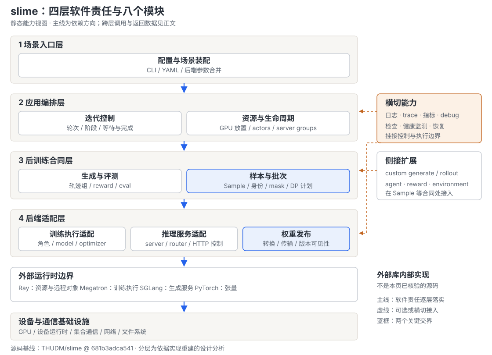

**读图要点**：横向框带固定模块所属层，主线箭头只表示主要依赖方向，具体跨层关系见下表；虚线表示侧接扩展或横切能力。它不表示训练必须先调用生成模块，也不表示 Sample 的传输方向。数据方向、远程调用和等待点在 2.2 单独展开。

| 层 / 模块 | 输入与输出合同 | 独立拥有的状态或决策 | 向下委托与不负责的事项 |
|---|---|---|---|
| 场景入口层 / 配置与场景装配 | CLI、模型/数据路径、hook 路径、可选 YAML → 已合并并验证的 args | 场景选择、参数命名空间和合法组合 | 委托后端 parser；不拥有运行中的模型或请求 |
| 应用编排层 / 迭代控制 | args、group/manager 句柄 → 完成的轮次、评测和保存动作 | driver 轮次、ObjectRef 等待、generate/train/update 的相对顺序 | 委托领域与适配模块；不决定请求级调度或损失计算 |
| 应用编排层 / 资源与生命周期 | GPU 数、布局、拓扑 → placement、rank actors、server groups | bundle 映射、actor 句柄集合、服务拓扑、重建入口 | 委托 Ray 放置与适配层初始化；不实现 GPU 显存硬隔离 |
| 后训练合同层 / 生成与评测 | prompt groups、采样/评测配置 → Sample groups、reward 和 metrics | 在途生成任务、采样参数、完成组和评测任务组织 | 委托 serving、custom generate、reward；不提交优化器更新 |
| 后训练合同层 / 样本与批次 | Sample 与训练并行配置 → train dict、DP 分区、microbatch 计划及 refs | 数据游标/回收、逻辑 rollout 身份、mask、step 级统计口径 | 委托 Ray 数据承载和训练端消费；不保存任意环境状态 |
| 后端适配层 / 训练执行适配 | rank 身份、checkpoint、batch → 模型更新、可选 critic values、保存结果 | rank-local model/optimizer、角色快照、数据设备布局 | 委托 Megatron schedule/optimizer；不拥有 serving cache |
| 后端适配层 / 推理服务适配 | server 配置、GPU/端口、HTTP 控制 → 可用服务与控制响应 | SGLang 进程句柄、服务地址、router 注册和 HTTP 协议转换 | 委托 SGLang 执行请求与加载权重；不决定全局 RL 轮次 |
| 后端适配层 / 权重发布 | 训练参数、目标 engines/拓扑 → serving 可用的参数版本 | 格式/传输分支、连接、分桶及发布时序；full+disk 版本由本地 group 保存 | 委托 tensor/collective/文件传输和服务加载；不提供通用回滚 |

这是逻辑责任划分，不是一模块一进程。`RolloutManager` 同时承载资源与生命周期、生成与评测、样本与批次的部分实现；`RayTrainGroup` 同时承载训练 actor 集合与 full+disk 发布协调。反过来，“样本与批次”横跨 `types.py`、DataSource、manager、DP scheduler 和训练数据消费代码。第 4 节用多对多映射保留这种真实关系。

### 2.2 动态实现：四次逻辑 rollout 如何变成下一版策略

选取**无 critic、无 offload、训练与推理分离、同步 driver、full+NCCL 发布**作为代表路径：两题、每题两个回答、`global_batch_size=4`，因此四次逻辑 rollout 进入一个 optimizer step。这里的 4 是说明合同的示例输入，不代表默认值；真实 GPU 数、模型并行配置和 microbatch 数仍由模型与资源决定。

初始化先创建资源，再创建 RolloutManager，然后创建训练 actors。manager 先存在，是因为轮数可能由 DataSource 长度推导，也因为训练 actor 需要向它登记 DP/CP/VPP 配置。训练模型加载完成后先发布一次初始权重，才能让 serving 参数和训练起点一致。下面将物理上共处 manager 的两个逻辑模块合并为一个参与者，以保持图可读。

<!-- Figure spec: representative sync lifecycle only. Loop submits generation and awaits its outer result, then rank training, then explicit weight publication. Numbered data example uses two prompts times two completions. External server/training kernels remain outside slime. -->
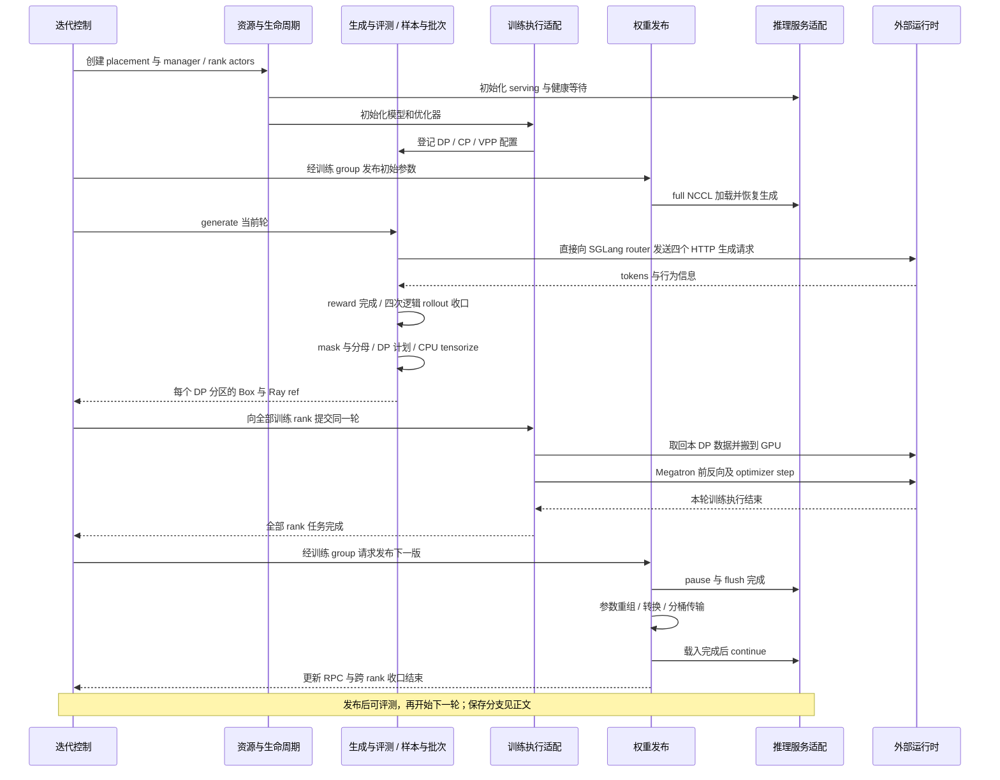

**读图要点**：这一轮有数据生成结束、训练任务结束、serving 发布结束三个不同信号。HTTP 已返回不代表 reward 和批次转换已完成；所有训练 rank 返回也不代表 serving 已使用新参数。图中的外部运行时返回仅表示 slime 等待的 API 边界，不证明依赖内部的 scheduler、kernel 或 collective 实现。

**源码调用流程。** 以下只保留主路径，省略的纯转发显式标为“经”；同一个调用者先后执行的动作列为兄弟节点。模块标记与静态表一致。

```text
train.py::__main__                                      [配置与场景装配]
├─ parse_args()
└─ train(args)                                          [迭代控制]
   ├─ create_placement_groups(args)                     [资源与生命周期]
   ├─ create_rollout_manager(args, pg)
   │  └─ RolloutManager.remote(args, pg)                 [远程 actor 构造]
   ├─ create_training_models(args, pgs, manager)
   │  └─ create_actor_model(...)                       [本地装配]
   │     ├─ allocate_train_group(...)                   [返回本地 RayTrainGroup]
   │     └─ RayTrainGroup.create()
   │        ├─ _allocate_gpus_for_actor()               [构造远程 rank actors]
   │        ├─ ray.get(actor.init.remote(...) 列表)     [训练执行适配]
   │        └─ set_rollout_manager(...)                [登记并行配置]
   ├─ RayTrainGroup.update_weights()                    [初始发布]
   ├─ 每轮 ray.get(manager.generate.remote(round_id))
   │  └─ RolloutManager.generate()                     [生成与评测 / 样本与批次]
   │     ├─ _get_rollout_data()                         [经 call_rollout_fn 调用所选 hook]
   │     ├─ _convert_samples_to_train_data()
   │     └─ _split_train_data_by_dp()                   [返回内层数据 refs]
   ├─ ray.get(group.async_train(round_id, refs))
   │  └─ MegatronTrainRayActor.train.remote(...)        [训练执行适配，各 rank]
   │     ├─ _get_rollout_data()
   │     └─ train_actor()
   │        └─ model.train()
   │           └─ train_one_step()                    [逐 step]
   │              ├─ get_forward_backward_func() 返回的 schedule [外部 Megatron]
   │              └─ optimizer.step()                 [有效 step 分支]
   ├─ [到达保存条件] group.save_model() / manager.save.remote(...)
   ├─ RayTrainGroup.update_weights()                    [权重发布，同步每轮]
   │  └─ ray.get(actor.update_weights.remote(...) 列表)
   │     └─ MegatronTrainRayActor.update_weights()
   │        └─ UpdateWeightFromDistributed.update_weights()
   │           ├─ pause_generation / flush_cache 的远程调用并等待
   │           ├─ _send_weights()
   │           └─ continue_generation 的远程调用并等待 / barrier
   ├─ [到达评测条件] ray.get(manager.eval.remote(...))
   └─ ray.get(manager.dispose.remote(...)) / finish_tracking(args)
```

`async_train` 名称表示“提交任务并返回每个 worker 的 refs”；同步 driver 随即 `ray.get` 等待，整个算法仍然同步。外层 `manager.generate` 的 ref 完成后，返回的是内层 DP 数据 refs，而不是 driver 取回了所有 tensor。真实保存时序在权重发布之前；按周期触发的异步保存还要区分提交与持久化，不能由上图末尾的概括得出“每轮先评测后保存”。完整条件分支见 [[10_slime_end_to_end_iteration_analysis|端到端迭代时序]]。

### 2.3 三条跨模块通路及完成边界

| 通路 | 传递的对象 | 谁使它对下一方可用 | 主要代价与边界 |
|---|---|---|---|
| 控制通路 | args、actor handle、ObjectRef、轮次与拓扑 | driver/group/manager 在相应 `ray.get` 或状态检查后推进 | RPC 提交不是完成；资源不足时 placement 可以持续等待 |
| 数据通路 | prompt → Sample → train dict → per-DP Box/ref → GPU batch | manager 在 reward/转换/计划完成后返回 refs；训练 rank 再取回数据 | CPU tensorize、对象承载、设备搬运；字段受传输白名单约束 |
| 权重通路 | rank-local shards → serving 格式参数或磁盘工件 → engine 版本 | updater 或 full+disk group 完成服务加载与恢复后返回 | gather/布局转换/传输/暂停；失败可能已有部分副作用 |

这三条通路协作但不共用一个总序号：driver `rollout_id` 是训练循环轮次，`Sample.rollout_id` 标识一次逻辑生成，weight version 标识发布代次。一次 agent 执行可以产生多个 Sample；一次 driver 轮次也可以包含多个 optimizer steps。将这三种身份混用，会让恢复、归一化和陈旧度分析同时失真。

## 3. 各软件模块的概要设计

### 3.1 配置与场景装配：将用户意图转成可执行合同

**职责与内部逻辑。** 根入口调用 `slime.utils.arguments.parse_args`。预解析先取出训练 backend 和 debug 开关，因为它们决定是否需要 SGLang parser；随后独立解析 SGLang 参数、解析 Megatron 加 slime 参数，合并 namespace，再执行 slime 和各后端的适用验证。输出的 args 既含领域选项，也含后端参数；它不是一份与后端无关的配置对象。

SGLang 包装器把原生选项改为 `--sglang-*`，但跳过由 slime 拥有的 model path、TP、端口、node rank、GPU 位置与 memory saver 等字段，避免两个配置源同时拥有物理部署。例如 `--sglang-mem-fraction-static 0.7` 解析为 `sglang_mem_fraction_static`，服务装配时再成为 SGLang 的 `mem_fraction_static`。actor/critic 的 Megatron YAML override 也不能覆盖 CLI 拥有的 GPU 分配字段。三类配置分别控制“运行哪个场景”“用什么后端能力”“怎样放置角色”，来源不同但最终必须一致。

<!-- Figure spec: parser assembly. Pre-parse selects SGLang participation, independent namespaces converge before validators. This is an interface selection graph, not a runtime lifecycle. -->
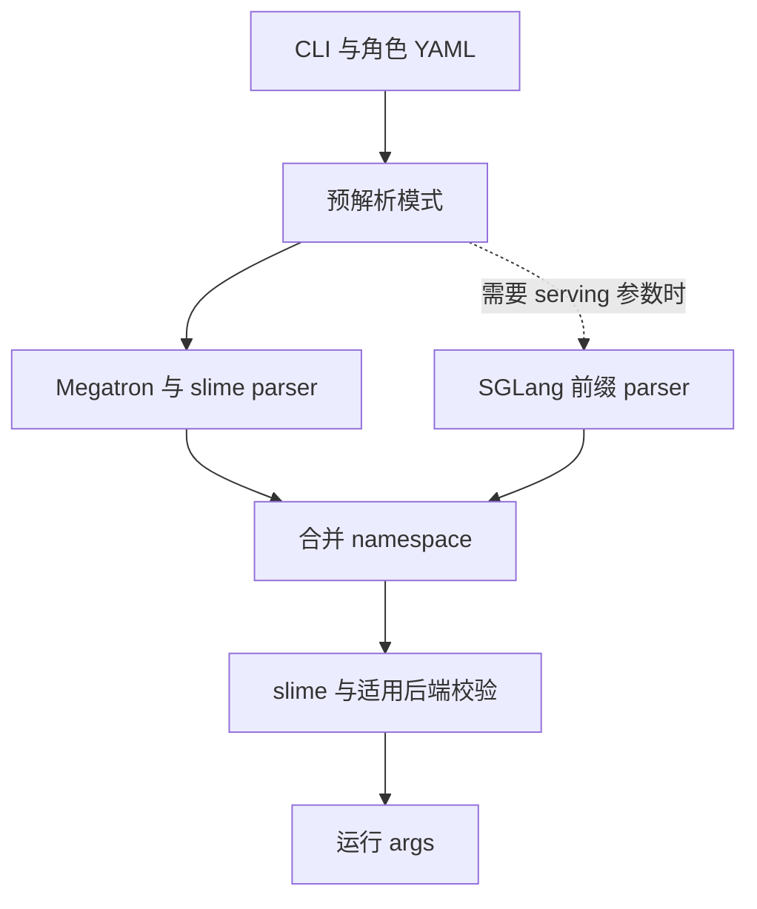

**设计分析。** 相比维护封闭的统一 schema，这种方式使上游参数更快可达；判据是新能力能否通过当前安装版本的 parser 进入实际构造器。代价是薄层必须保留 skip 列表、旧新别名与互斥条件。“原生透传”因此不等于没有适配，也不保证文档中的任意上游参数都可原样使用。

**约束与证据。** router 仍有混合前缀：手写 `--sglang-router-ip/port/request-timeout-secs`，另一些经 `RouterArgs.add_cli_args(..., use_router_prefix=True)` 注册成 `--router-*`。源文件的 TODO 只表达统一前缀的意图，没有确定改法或时间；不能据此推断后端矩阵也计划扩展。证据：`slime/utils/arguments.py::_pre_parse_mode / parse_args / _apply_megatron_role_overrides`、`slime/backends/sglang_utils/arguments.py::add_sglang_arguments / add_sglang_router_arguments / validate_args`。完整启动配置见 [[02_slime_quickstart_and_configuration_guide]]。

### 3.2 迭代控制：拥有阶段顺序，不拥有阶段内部算法

**职责与内部逻辑。** `train.py::train` 和 `train_async.py::train` 是 driver 本地函数。它们持有 manager 与训练 group 句柄，决定何时生成、训练、保存、更新、评测，等待各阶段的完成信号。driver 不逐 token 调用模型，也不逐 microbatch 算 loss；它接收批次引用并把同一轮交给 rank actors。

同步入口每轮收齐生成数据，再等待本轮训练结束，随后发布权重。异步入口先提交下一轮生成，再训练当前批；到更新间隔时等待已经提交的生成结束，然后发布。这个等待使权重切换具有明确边界，也限制了可以隐藏多少生成时间。`--update-weights-interval` 在同步主循环中不降低发布频率，在 async 主循环中才控制该发布分支。

<!-- Figure spec: same batch pair A/B under sync and one-stage async, without proportional timing. Nodes expose submission and waiting, not measured speedup. -->
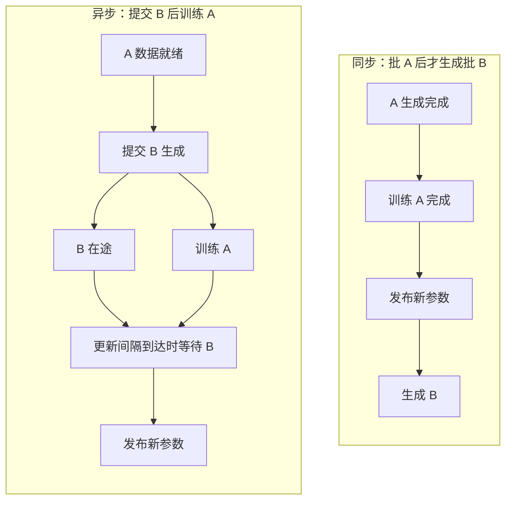

**设计分析。** 相比让 trainer 隐式触发下次生成，显式 driver 更容易检查旧数据由哪个参数版本产生，以及保存与评测落在哪个轮次。代价是同步 barrier 和 async 更新前等待都会形成空转；这不是免费获得吞吐的抽象。fully-async 示例通过替换 rollout function，在 async driver 内改变生成队列管理，不是第三套根入口。

**约束与证据。** async 的首个 guard 是禁止 colocate。offload 与 release_train 会改变阶段内资源操作，但不能随意调换权重 onload、发布和 KV onload 的次序。退出时 `RolloutManager.dispose` 仅停止监测并结束 tracking，不能据此宣称所有 Ray actor、server 进程与 placement group 均被主动销毁。证据：`train.py::train`、`train_async.py::train`、`slime/ray/rollout.py::RolloutManager.dispose`；完整时序和 fully-async 生命周期归 [[10_slime_end_to_end_iteration_analysis]]。

### 3.3 资源与生命周期：区分放置、驻留与进程存续

**职责与合同。** 输入是训练/rollout GPU 预算与布局；输出是 `(pg, reordered_bundle_indices, reordered_gpu_ids)`、本地 `RayTrainGroup` 和远程 rank/server actors。placement 先预留 GPU bundles，再通过 InfoActor 查询实际节点/GPU，将 bundle 索引和物理 GPU ID 分开保存。训练 rank 与 serving group 从这个共同映射取资源，不能将逻辑编号直接当成设备编号。

下面用训练需要 4 GPU、rollout 需要 4 GPU 的同一例子解释部署决策。这里只展示预算与集合关系；具体 bundle 排序、节点连续性和 heterogeneous group 校验归控制面专题。

<!-- Figure spec: resource-set example, four train and four rollout GPUs. Colocation has one shared set plus phase gate; disaggregation has two disjoint sets. No proportional timeline or hardware topology is claimed. -->
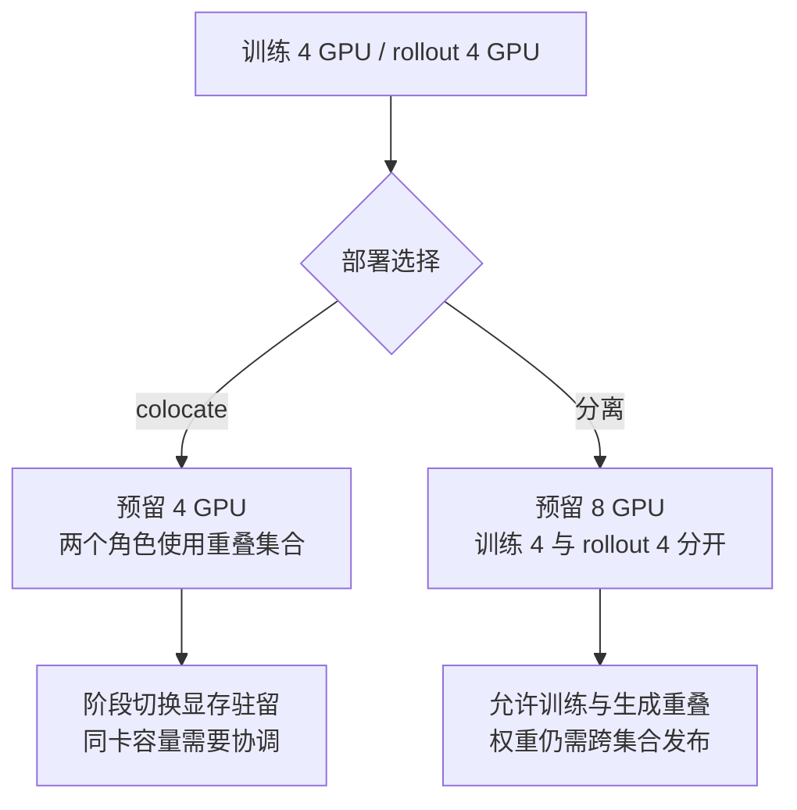

**内部构造。** `RayTrainGroup` 是 driver 中的普通 Python 对象；它保存 `_actor_handlers`，每个 handler 指向一个 Megatron 训练 rank actor。`ServerGroup` 保存 engine 槽位、GPU offset、并行 overrides、worker type 和初始化 futures；`start_engines` 只提交初始化，调用方还要等待这些 handles。`RolloutManager` 本身是零 GPU Ray actor，内部再创建独立的零 GPU `Lock` actor，后者不是线程锁。

**设计分析。** 相比把“分配一块 GPU”与“占满其显存”绑定，Ray 配额配合显式 offload 能让训练/推理使用同一物理设备；但 `0.4` 训练 actor 配额与 `0.2` serving actor 配额是调度记账，不是可用显存比例。显存峰值仍取决于后端模型、cache 和阶段顺序。

**生命周期分级。** offload 保留训练 actor 及 CPU 状态，并处理显存/通信组的释放恢复；`release_train` 则杀掉训练 actors，下一轮从保存状态重建。后者要求 full+disk，且跨重建的版本由本地 group 保存。SGLang group 只有 GPU 与训练侧重叠时才需要对应 offload；external serving 不从本训练任务的 GPU 池取相同资源。placement 等待会周期打印注册/可用 GPU 数，但没有有限超时。证据：`slime/ray/placement_group.py::_create_placement_group / _get_placement_group_layout / create_training_models`、`slime/ray/actor_group.py::RayTrainGroup.create / release`、`slime/ray/rollout.py::ServerGroup.start_engines / offload`。详见 [[11_slime_ray_control_plane_analysis]]。

### 3.4 生成与评测：把请求执行收口成可训练的轨迹组

**职责与合同。** 生成模块输入 prompt groups 与采样配置，输出带 reward、tokens、behavior logprobs、状态及可选 routing 信息的 Sample groups。`RolloutManager` 负责装载 rollout/eval hook 和调用边界；默认 `sglang_rollout` 负责组级任务、并发、生成、reward、过滤及剩余任务处理。底层 server 只回答请求，不知道当前训练轮需要收齐多少有效 prompt groups。默认生成函数直接向 router 的 `/generate` 发 HTTP 请求；SGLangEngine proxy 提供服务管理，不中转每个生成请求。

**内部逻辑。** `GenerateState` 保存采样参数、semaphore、pending tasks 和计数。一个 group 包含同一 prompt 的 `n_samples_per_prompt` 次生成；组内任务可以并发，组返回后才做需要整组的 reward 或动态过滤。默认循环以 `FIRST_COMPLETED` 接收完成任务，丢弃的组会释放预算以补采；收齐目标后执行 abort 收口，再排序返回。生成耗时差异因此由组级调度吸收，而不是要求 dataset 顺序恰好等于完成顺序。

<!-- Figure spec: two prompt groups P/Q, each with two generation attempts. The group is admitted only after its samples and reward finish; rejected P triggers replacement, accepted Q counts toward target. Expose long-tail pending abort rather than implying every pending request is preserved. -->
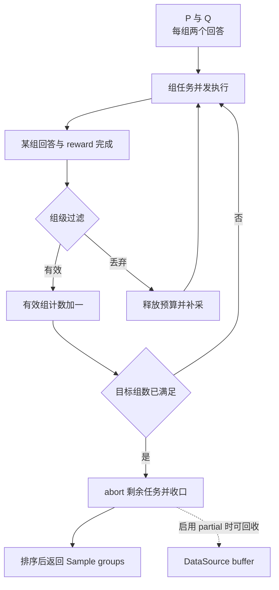

**设计分析。** 相比固定等一个完整请求列表全部结束，按完成组补采能应对动态过滤和长尾；保留组边界则使同题多回答的相对评价有确定输入。代价是 abort、partial 和 custom hook 必须共同维护状态，不能假定所有未使用结果都被自动回收；hook 抛错也不等于所有兄弟任务自动安全结束。

**评测与扩展。** eval 使用单独的 eval function 和 dataset 配置，不执行 train dict 分包；返回的是可聚合的评测数据。custom generate 只替换单次执行，rollout function 可以替换整个组调度；`--custom-rm-path` 替换 reward。session ID 可支撑 router affinity，但环境/工具自身的事务与重试需要扩展作者承担。证据：`slime/rollout/sglang_rollout.py::GenerateState / generate_and_rm / generate_and_rm_group / generate_rollout_async / generate_rollout`、`slime/ray/rollout.py::RolloutManager.eval`；评测细节见 [[27_slime_evaluation_path_analysis]]，agent 扩展见 [[24_slime_agent_workflow_examples_analysis]]。

### 3.5 样本与批次：在灵活生成与确定训练之间转换

**职责与状态。** `Sample` 保存一次执行的内容、行为与训练信号；DataSource 管理 prompt 游标、epoch 和回收入口；manager 在完整 step 的视野下转换并生成训练计划。README 中的 Data Buffer 对应这一组逻辑责任，核心实现没有另起一个全局 replay 服务。基础 `RolloutDataSource.add_samples` 会拒绝写入；支持回收的是 `RolloutDataSourceWithBuffer`。后者也不能只凭继承的 save/load 就被解释为完整持久 replay：基础保存字段是数据游标、索引和 metadata，未保存任意在途工作流。

**转换原则。** 一个 agent 执行若拆成 A、B 两片，它们保留相同的 `Sample.rollout_id`。转换器检查 response mask 长度，在分包前计算整次逻辑 rollout 的 `rollout_mask_sums`，再把这个分母复制给各片。后续 DP 或 microbatch 位置改变，不应改变这次执行作为一个训练计数单位的含义。`sample.index` 区分训练样本，driver round 则是另一种身份。

<!-- Figure spec: one rollout R split into two samples with mask totals 2 and 1. Aggregate denominator 3 before packaging and attach it to both fragments; denominator is not recomputed inside each microbatch. This is a small arithmetic example, not a DP placement algorithm. -->
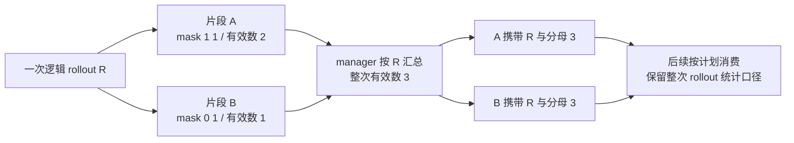

**内部数据路线。** 默认转换构造 `tokens`、`response_lengths`、`rewards`、`loss_masks`、`rollout_ids` 等列；`build_dp_schedule` 根据长度与逻辑身份生成 DP partitions 和各 rank 的 microbatch 索引。manager 按白名单提取分区字段、CPU tensorize，然后以 `Box(ray.put(...))` 返回。训练端取回本 DP 数据并将 tokens/masks 等搬到 GPU；可选 `nixl` tensor transport 改变承载方式，不会替代这些领域合同。

**设计分析。** 相比让每个训练 microbatch 自己推断原始生成关系，集中转换能在信息尚完整时固定统计口径；相比全程只用 tensor，`Sample` 又保留了工具、多模态、partial 和行为信息。代价是可选字段必须显式接线，例如 converter 可产生 `metadata`，默认 DP 白名单却不传它；自定义训练 metadata 不能仅靠赋值就生效。

**约束与证据。** mask 长度不等于 `response_length` 有显式 assert，top-p offsets 也有长度和尾偏移检查。CPU fetch 的潜在瓶颈由训练端注释直接指出。DP 调度、CP 切片与最终 loss 归约有不同所有者，不应在这里重写成“按长度平均分”这种简化算法。证据：`slime/utils/types.py::Sample`、`slime/rollout/data_source.py::RolloutDataSource / RolloutDataSourceWithBuffer`、`slime/ray/rollout.py::RolloutManager._convert_samples_to_train_data / _split_train_data_by_dp`、`slime/backends/megatron_utils/actor.py::MegatronTrainRayActor._get_rollout_data`。身份与 mask 归 [[12_slime_sample_datasource_analysis]]，DP 计划归 [[14_slime_megatron_training_analysis]]。

### 3.6 训练执行适配：把后训练语义交给原生 Megatron 执行

**职责与合同。** 每个 `MegatronTrainRayActor` 拥有本 rank 的模型 chunks、optimizer、scheduler 及角色相关状态。初始化构造并恢复模型，向 manager 交付 `dp_size/cp_size/vpp_size/microbatch_group_size_per_vp_stage`。输入是本轮所有 DP refs 和可选 critic values，输出是训练任务完成；critic 在最后 PP stage 返回 CPU values，actor 返回 `None`。这些返回值不能当作 HF 权重或完整训练状态。

**内部逻辑。** actor 训练先建立可反复读取的数据 iterator，按配置计算 ref、teacher 或行为策略 logprob，随后恢复 actor 参数、计算 advantages/returns，再执行训练。ref、old_actor、teacher 可以是同一训练 actor 内由 `TensorBackuper` 管理的快照，不一定各自占用一组常驻 GPU actors；PPO critic 则由独立 RayTrainGroup 表达。角色名字不能直接推导进程数量。

<!-- Figure spec: training adapter phases. Optional role forwards enrich the batch, actor parameters must be active before optimization; optimizer and schedule are explicitly external dependencies. -->
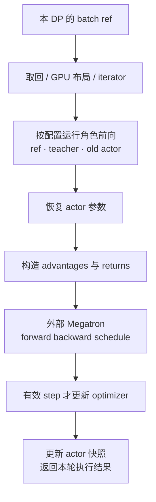

该图概括 RL actor 路径；实现会在计算 advantages 前恢复 actor，SFT 可跳过整段优势计算，某些配置也会复用训练前向的 logprob 而省掉单独前向。`model.train` 可在一轮里执行多个 `train_one_step`，后者将 loss closure、iterator、model 与 microbatch 数交给 Megatron schedule；有效 step 执行 optimizer，确认成功后推进学习率样本计数。这里的 token loss、CP/TP reduction 与并行 schedule 是下一层专题，不应由架构图替代算法证据。

**设计分析。** 相比在 slime 复制训练 kernel，适配层只补数据、角色、后训练信号和生命周期，使 Megatron 并行/优化器能力仍可达。代价是模型构造、角色切换、loss 与 offload 都需要理解 Megatron，新增后端不是实现一个 `train(batch)` 即可。

**约束与证据。** 无效梯度分支可能跳过更新；有效分支的 `optimizer.step` 若报告失败，代码有 assert，不能称作任何调用都产生新参数。sleep/wake 还涉及显存与 process groups，依赖方缓存的 WORLD 引用会影响可重建性。证据：`slime/backends/megatron_utils/actor.py::MegatronTrainRayActor.init / train / train_actor / train_critic / sleep / wake_up`、`slime/backends/megatron_utils/model.py::train / train_one_step`。训练过程归 [[14_slime_megatron_training_analysis]]，数值合同归 [[15_slime_loss_parallelism_analysis]]。

### 3.7 推理服务适配：把可部署 server 转成可控制的生成能力

**职责与合同。** `SGLangEngine` 接收 model path、并行参数、GPU/端口、router 地址，启动或连接 SGLang，并暴露健康、暂停/继续、cache flush、显存释放恢复和权重加载方法。它是 Ray 控制代理，常规路径内部还启动真正执行 HTTP serving 的子进程。`ServerGroup` 的初始化 future 完成与服务健康检查共同构成启动可用边界，创建 actor handle 本身不证明模型已加载。

**内部结构。** 同一模型可以有多个 server groups，分别配置 regular、prefill、decode 或 placeholder；多节点 engine 还有 node-0 控制入口。模型各自对应 router，地址表通过 `args.sglang_model_routers` 交给 custom rollout；heterogeneous group 还提供自己的 GPU 数、offset 与 TP/PP/EP/MoE-DP 配置，供权重侧理解目标布局。

<!-- Figure spec: serving control structure separates slime proxy and external SGLang child. Normal launch and external connection converge at HTTP control. Placeholder groups create no engine. -->
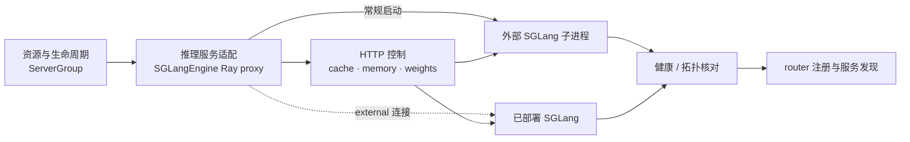

**设计分析。** 相比让 trainer 直接控制 HTTP 进程，proxy 将 Ray 资源身份与 HTTP 管理接口连接起来；相比仅抽象 `generate`，保留 SGLang 专有管理面才能支持 offload、PD 和热更新。代价是这些语义贯穿参数、拓扑与控制层，替换 serving backend 需要共同迁移整个协议面。

**约束与证据。** placeholder 不创建 engine；external 路径使用零 GPU 的 SGLang proxy，仍校验 SGLang server 参数，部分部署参数不能与 `sglang_config` 或旧 prefill 配置同时使用。多模型 serving 不等于多模型更新：manager 只返回第一个 `update_weights=True` 的 server。slime 源码能证明 HTTP 请求内容、健康等待和响应处理；SGLang 内部 KV 生命周期、调度公平性和硬件执行不在本页冻结依赖证据中。证据：`slime/backends/sglang_utils/sglang_engine.py::SGLangEngine.init / _init_external / _init_normal / _register_to_router / _make_request`、`slime/ray/rollout.py::ServerGroup.start_engines / RolloutManager._get_updatable_server`。参见 [[13_slime_sglang_rollout_engine_analysis]]、[[19_slime_rollout_backend_extension_analysis]]。

### 3.8 权重发布：让训练参数成为 serving 可用版本

**职责与合同。** 训练端持有的是分片参数，生成服务需要其自身模型实现可消费的名字、形状、dtype 与数据。权重发布负责把这两种表示连接起来，并确定何时可以恢复请求。manager 提供六元组：`engines, lock, num_new, gpu_counts, gpu_offsets, parallel_configs`；updater 用它连接新增 engine、理解目标拓扑和协调更新。只传一个 tensor 列表不足以表达这些信息。

**实现选择。** `MegatronTrainRayActor.init` 先按 mode/transport/colocate 选 updater：delta 选择 disk delta；full+disk 选择磁盘导出；共置 full 路径选择 tensor updater；分离 full+NCCL 选择 distributed updater。这个顺序也决定非法组合在哪个 guard 被拒绝。不同路径的共同目标是完整 serving 参数版本，内部 gather、量化、桶和重建方法并不相同。

| 路径 | 本轮训练完成后形成的中间物 | 谁协调 serving 加载 | 主要适用条件与代价 |
|---|---|---|---|
| 共置 full tensor | 转换后的命名参数与 tensor 载荷 | tensor updater 和 SGLang proxy | 共享 GPU 部署；临时缓冲、序列化/IPC 与显存切换 |
| 分离 full NCCL | TP/EP 等重组后的 HF 参数桶 | distributed updater 和 SGLang proxy | 独立训练/生成 GPU；通信组、gather、broadcast 与暂停 |
| full disk | 完整 HF checkpoint 版本目录 | 本地 `RayTrainGroup` | 共享或可拉取文件；导出、磁盘空间和加载时间 |
| delta disk | 发布的 delta 与主机本地重建 checkpoint | disk delta updater 与拉取/重建协议 | 非共置；前序版本、重建和文件传输合同，不能与 full 混为同一流程 |

下面只展开 2.2 选中的 full+NCCL 发布顺序；四类重布局/传输算法与共用参数算例由 [[16_slime_weight_sync_analysis|权重同步专题]]统一维护。本页不把它们压成一个错误的公共实现。

<!-- Figure spec: version v to v+1 transition for full NCCL. Paused server cannot resume on partial bucket state; error branch is explicit and has no rollback edge. -->
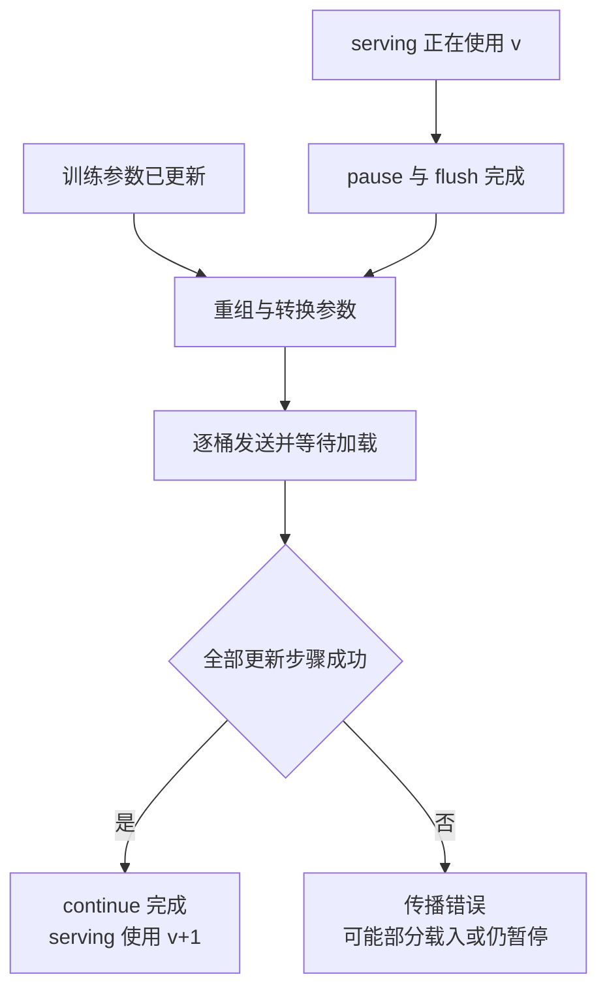

**设计分析。** 相比训练后无条件逐 tensor 覆盖，显式暂停和加载边界防止正常路径的请求跨越半套参数；但这只是成功路径的协调协议，不是拥有 rollback 的数据库事务。distributed updater 的版本计数在更新开始时推进，异常可能发生在版本已变、数据未完整加载之后，不能把一个计数值视为独立提交证据。

**磁盘特例。** full+disk 的跨轮版本由 `RayTrainGroup._disk_weight_version` 保存，训练 actor 负责导出，然后可被 release，group 再驱动 serving reload；可选本地磁盘 pull 在 pause 前执行。因而“权重发布”这一逻辑模块横跨 group 与 updater，不能统一说版本都存在 rank actor 中。暂停后失败没有通用回滚保证。

**成本与证据。** `--update-weight-buffer-size` 默认 512 MiB，是分桶预算而非模型大小或全流程内存上限；单参数转换、gather 等临时分配仍可能超过它。训练/serving 拓扑差异越大，重组成本越需要实测，这一成本判断是设计推断，不是本页 benchmark。证据：`slime/backends/megatron_utils/actor.py::MegatronTrainRayActor.init / update_weights`、`slime/backends/megatron_utils/update_weight/update_weight_from_distributed.py::UpdateWeightFromDistributed.update_weights / _send_weights`、`slime/ray/actor_group.py::RayTrainGroup.update_weights / _reload_rollout_weights_from_disk`。磁盘版本所有权另见 [[11_slime_ray_control_plane_analysis#3.2 调用流程|磁盘发布控制权 §3.2.3]]。

### 3.9 横切能力与外部依赖：观测到什么，就验证到什么边界

日志、指标、trace、debug dump 与故障监测分别附着在 driver、manager、训练 actor 和 server 边界。它们不是独立的“第九个业务模块”，也不拥有另一套训练循环。`debug_rollout_only` 在生成结果保存/记录后、train dict 转换前返回；`debug_train_only` 可用保存的 Sample 重放训练，或由 SFT hook 产生训练数据。二者隔离的是后训练通路，不能据此假设完全不需要另一框架的 Python 安装依赖。

恢复也按所有者分工：health monitor 发现 serving 状态异常，权重更新入口触发可更新 engines 恢复，新增 engines 再参与连接和发布。进程重新启动并不等于已加载最新 actor 参数。训练 checkpoint、DataSource 进度、在途请求和工具外部副作用各有边界，现有代码不能证明它们共同 exactly-once。与把重试全部塞进 HTTP helper 相比，这种设计保留了模型版本与资源上下文；代价是仍须由上层处理不可恢复异常。

训练端交给 Megatron 的是 model chunks、iterator、loss closure 与并行参数；serving 端交给 SGLang 的是 ServerArgs、请求和加载协议；Ray 承载资源与远程对象；PyTorch 承载 tensor 与 distributed API。本文核验 slime 发出了什么、等待什么以及如何处理结果，不把依赖内部行为当作已读源码。工程验证和性能观测路线由 [[18_slime_fault_tolerance_observability_analysis]] 承接。

## 4. 架构模块与代码目录的对应关系

下表是前文模块的**源码阅读路线**，不是新的目录式分层。每个符号均位于页头冻结的 slime 仓库；外部 API 只注明交付边界。一个文件可以出现在多行，因为目录封装和逻辑职责并非一一对应。

| 层 / 模块 | 主要物理位置 | 优先阅读的符号 | 跨文件或外部边界 |
|---|---|---|---|
| 场景入口层 / 配置与场景装配 | `train.py`、`train_async.py`、`slime/utils/arguments.py`、两后端 `arguments.py` | `parse_args`、`_pre_parse_mode`、`add_sglang_arguments`、`_apply_megatron_role_overrides` | 后端 parser 注册本身依赖当前安装版本；脚本 recipes 提供模型参数 |
| 应用编排层 / 迭代控制 | `train.py`、`train_async.py`、`slime/utils/misc.py` | 两入口的 `train`、`should_run_periodic_action` | 通过本地 group 与远程 manager 组合任务，等待点属于 driver |
| 应用编排层 / 资源与生命周期 | `slime/ray/placement_group.py`、`actor_group.py`、`rollout.py`、`utils.py` | `create_placement_groups`、`create_rollout_manager`、`create_training_models`、`RayTrainGroup.create/release`、`ServerGroup.start_engines`、`Lock` | Ray placement/actor API；ServerGroup 使用 SGLangEngine |
| 后训练合同层 / 生成与评测 | `slime/ray/rollout.py`、`slime/rollout/sglang_rollout.py`、`slime/rollout/rm_hub/` | `RolloutManager.generate/eval/_get_rollout_data`、`GenerateState`、`generate_and_rm_group`、`generate_rollout` | `call_rollout_fn` 适配 hook 输出；custom generate/reward/环境是扩展面 |
| 后训练合同层 / 样本与批次 | `slime/utils/types.py`、`slime/rollout/data_source.py`、`slime/ray/rollout.py`、`slime/utils/dp_schedule.py` | `Sample`、`RolloutDataSourceWithBuffer`、`RolloutManager._convert_samples_to_train_data/_split_train_data_by_dp`、`build_dp_schedule` | Ray refs 为数据载体；训练端另行取回并做设备/CP 处理 |
| 后端适配层 / 训练执行适配 | `slime/backends/megatron_utils/actor.py`、`model.py`、`data.py`、`loss.py`、`model_provider.py` | `MegatronTrainRayActor.init/train/train_actor/train_critic`、`train_one_step`、`initialize_model_and_optimizer` | 外部 Megatron model/schedule/optimizer，PyTorch tensor/distributed |
| 后端适配层 / 推理服务适配 | `slime/backends/sglang_utils/sglang_engine.py`、`external.py`，`slime/ray/rollout.py` | `SGLangEngine.init/_init_normal/_init_external`、`launch_server_process`、`ServerGroup.parallel_config` | SGLang server/router 是外部依赖；external 是连接路径 |
| 后端适配层 / 权重发布 | `slime/backends/megatron_utils/update_weight/`、`megatron_to_hf.py`、`slime/ray/actor_group.py` | `UpdateWeightFromDistributed.update_weights`、`MegatronTrainRayActor.update_weights`、`RayTrainGroup._reload_rollout_weights_from_disk` | 一端是训练 shard，另一端是 SGLang 加载与请求恢复 |

阅读时可以先打开根 driver 确认阶段调用者，再按问题进入模块：为什么进程没起来看资源与生命周期；为什么数据量或 mask 不对看样本与批次；为什么训练成功但生成仍旧看权重发布。不要从 `backends/` 目录名推断它涵盖了所有后端耦合，参数和 Ray 控制代码同样参与。

## 5. 当前软件的使用场景与架构选择

### 5.1 场景总表：哪些改变入口，哪些只替换合同实现

既有系列已将完整操作步骤分配给 02 与专题页，因此这里保留架构所需的入口、替换点与完成条件，随后展开三种主要生命周期。下列场景族从根入口、examples、工具与测试中归纳，不把每种模型 recipe 计作一套新架构。

| 场景族及状态 | 实际执行入口或选择点 | 架构变化和完成结果 | 操作与机制的权威入口 |
|---|---|---|---|
| 同步 RL，核心 | `train.py` | 生成、训练、发布串行；训练状态、按配置保存/评测 | [[02_slime_quickstart_and_configuration_guide]]、[[10_slime_end_to_end_iteration_analysis]] |
| 异步 RL / fully-async，核心入口加可选示例 | `train_async.py`；`examples/fully_async/` 的 rollout function | 分离部署重叠；队列生产方式可换，更新仍有完成边界 | [[10_slime_end_to_end_iteration_analysis]]、[[30_slime_rollout_optimization_analysis]] |
| SFT，可运行特定数据合同 | `train.py` + `slime.rollout.sft_rollout.generate_rollout` | 由离线 messages 生成 mask，跳过 serving/优势计算后训练 | [[28_slime_sft_path_and_loss_mask_analysis]] |
| 周期评测 / eval-only，核心同步入口 | `train.py` 的 eval 分支；`RolloutManager.eval` | 生成与指标聚合，不执行优化器 step；eval-only 仍经过启动及初始发布 | [[27_slime_evaluation_path_analysis]] |
| debug replay / 诊断，核心工程入口 | `train.py` debug flags、`tools/profile_rollout.py`、`tools/analyze_profile.py`、`tools/trace_timeline_viewer.py` | 保存/重放 Sample、输出 trace/profile；不等同完整闭环性能 | [[18_slime_fault_tolerance_observability_analysis]]、[[31_slime_posttraining_stability_analysis]] |
| PPO / OPD，可选训练目标 | 同一 driver + critic 或 teacher 配置；`examples/on_policy_distillation/` | 增加 values/teacher 信号；teacher 来源决定依赖合同 | [[14_slime_megatron_training_analysis]]、[[20_slime_on_policy_distillation_analysis]] |
| agent / tools / 多模型，可选 workflow | custom generate / rollout function；`examples/multi_agent/`、`examples/coding_agent_rl/` | 多轮交互转换为 Sample，可扩展到多片；外部工具完成不等于训练完成 | [[24_slime_agent_workflow_examples_analysis]]、[[19_slime_rollout_backend_extension_analysis]] |
| VLM / 多轮 VLM，可选且有已知示例缺陷 | `examples/geo3k_vlm/`、`examples/geo3k_vlm_multi_turn/` | 图像/视频输入与训练 tensor 两种表示；多轮 observation append 有已知失败路径 | [[26_slime_multimodal_vlm_path_analysis]] |
| external / PD / 异构 groups，可选部署 | 同一 driver + external 地址或 `--sglang-config` | 改变服务拓扑与资源来源，不改变训练 batch 合同 | [[11_slime_ray_control_plane_analysis]]、[[13_slime_sglang_rollout_engine_analysis]] |
| MTP / 低精度 / 模型适配，可选且受模型限制 | 同一 driver + 对应模型配置、provider 或转换器 | 改变训练/serving 实现与权重映射，不建立新 driver | [[21_slime_speculative_decoding_mtp_analysis]]、[[22_slime_low_precision_training_rollout_analysis]]、[[23_slime_model_architecture_extension_analysis]] |
| checkpoint 转换，离线工具 | `tools/convert_hf_to_torch_dist.py`、`tools/convert_torch_dist_to_hf.py` 及其他转换工具 | HF 与训练工件之间转换；输出文件完成，不是 serving 发布完成 | [[23_slime_model_architecture_extension_analysis]]、[[02_slime_quickstart_and_configuration_guide]] |

### 5.2 同步与异步 RL：入口决定阶段调度

**执行前提。** 在已安装匹配依赖、已启动并注册 GPU 的 Ray 环境中，从 slime 仓库根目录提交 driver。模型、checkpoint、数据、并行与 reward 参数应来自相应模型 recipe。以下大写尖括号是必须替换的参数组，模板用于展示真实执行入口，不是省略必填项也能运行的 quickstart；完整命令以 02 页为准。

```bash
python train.py <MODEL_CHECKPOINT_DATA_REWARD_AND_RESOURCE_ARGS>
python train_async.py <MODEL_CHECKPOINT_DATA_REWARD_AND_DISAGGREGATED_RESOURCE_ARGS>
```

同步源码调用树和软件逻辑见 2.2；异步沿用同一配置、资源、训练与服务模块，区别集中在根 `train` 的调度：

```text
train_async.py::train                                  [迭代控制]
├─ create_placement_groups / create_rollout_manager / create_training_models
├─ actor_model.update_weights()                       [初始发布]
├─ manager.generate.remote(start_rollout_id)           [提交首批]
└─ 每轮循环
   ├─ ray.get(已提交的 generate future)                [当前数据完成]
   ├─ [还有下一轮] manager.generate.remote(next_id)    [提前提交]
   ├─ ray.get(actor_model.async_train(...))            [训练执行适配]
   ├─ [保存条件] save_model / manager.save.remote(...)
   ├─ [更新条件] ray.get(下一批 future)                [生成先收口]
   ├─ [更新条件] actor_model.update_weights()          [权重发布]
   └─ [评测条件] manager.eval.remote(...) 并等待
```

软件逻辑的分叉与汇合见 3.2：批 B 在途时训练批 A，更新点需要两者收口。完成输出仍是训练状态与按配置保存/评测的结果。async 明确不支持 colocate；fully-async 修改生成合同内部的生产/消费关系，但仍由这个入口启动，不能用它绕过所有部署 guard。

### 5.3 SFT：复用后训练数据通路，生成模块产出离线标签

**执行前提与模板。** 数据的 `messages` 应是匹配 tokenizer/chat template 的对话，具有非空可训练 assistant token。真实 SFT hook 要求每个 prompt group 只有一个 Sample；模型、checkpoint、batch 和资源参数仍必须补齐。下列场景选项来自冻结的 ReTool SFT recipe 与 parser。

```bash
python train.py <MODEL_CHECKPOINT_BATCH_AND_RESOURCE_ARGS> \
  --prompt-data <MESSAGES_DATASET> --input-key messages \
  --rollout-function-path slime.rollout.sft_rollout.generate_rollout \
  --n-samples-per-prompt 1 \
  --loss-type sft_loss --disable-compute-advantages-and-returns \
  --calculate-per-token-loss --debug-train-only
```

```text
train.py::train                                         [迭代控制]
├─ create_rollout_manager(...)                          [debug 模式不启动 servers]
├─ create_training_models(...)                         [训练执行适配]
├─ manager.generate.remote(...)                        [生成与评测 / 样本与批次]
│  └─ 经 _get_rollout_data / call_rollout_fn
│     └─ sft_rollout.generate_rollout()
│        ├─ DataSource.get_samples()
│        └─ MultiTurnLossMaskGenerator.get_loss_mask()
├─ actor_model.async_train(...) 并等待
│  └─ 经 MegatronTrainRayActor.train / train_actor
│     └─ model.train()                                  [sft_loss]
└─ [保存条件] actor_model.save_model(...)
```

<!-- Figure spec: SFT uses offline conversation to token/mask batch and training; serving has no edge, and completion is training/checkpoint not generation. -->
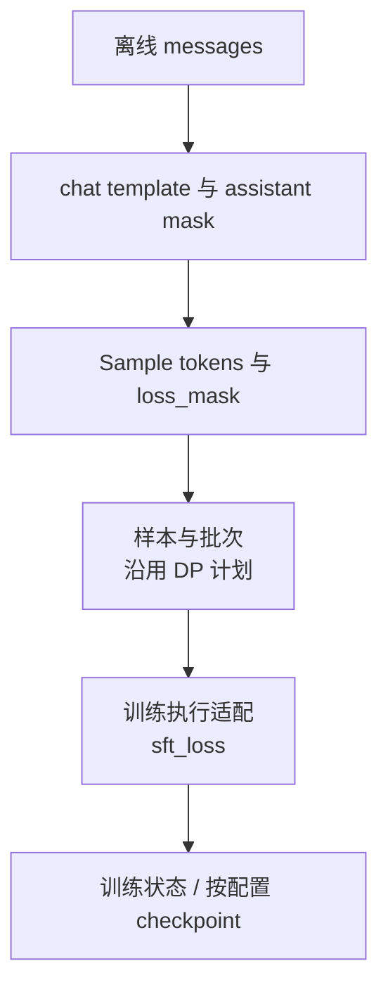

输出是训练状态和可选 checkpoint，权重更新调用在 debug-train-only 下直接返回。这里复用了 rollout 接口的“产出 Sample”合同，未要求接口必须进行在线生成。空 assistant 使 response length 为 0 时，冻结 SFT hook 的 `[-0:]` 会保留整段 mask，后续可能触发长度 assert；这个已知边界及 token mask 的完整原理见 [[28_slime_sft_path_and_loss_mask_analysis]]。

### 5.4 eval-only 与 debug：用可观察边界分离问题

**执行前提与模板。** eval-only 走同步 driver；需要正常模型/资源配置以及 eval dataset。`--num-rollout 0` 停止训练循环，`--eval-interval` 的非空值启用特例。不要将这个参数组合直接套给 async 入口，后者没有相同的零轮评测特例。

```bash
python train.py <MODEL_CHECKPOINT_RESOURCE_AND_EVAL_DATASET_ARGS> \
  --num-rollout 0 --eval-interval 1
```

```text
train.py::train                                         [迭代控制]
├─ create_rollout_manager / create_training_models      [资源与生命周期]
├─ actor_model.update_weights()                        [初始权重发布]
└─ ray.get(manager.eval.remote(rollout_id=0))
   └─ RolloutManager.eval()                            [生成与评测]
      ├─ call_rollout_fn(eval_generate_rollout, ..., evaluation=True)
      ├─ _save_debug_rollout_data(..., evaluation=True)
      └─ _log_eval_rollout_data(...)
```

<!-- Figure spec: eval-only still initializes and publishes but then branches to eval output instead of optimizer; debug route is described in prose, not falsely collapsed into eval. -->
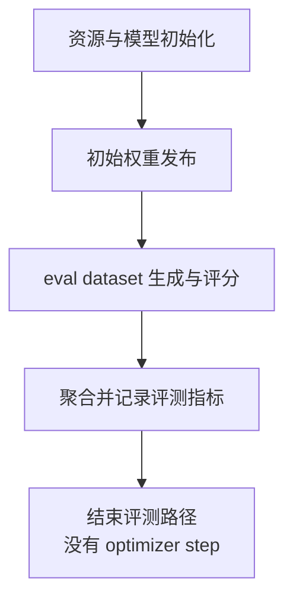

完成边界是评测输出生成并记录，不是产生新策略。eval-only 仍构造训练 actors 并进行初始权重发布，不能估算成只启动 serving 的低成本路径。评测字典字段的真正消费位置、异步队列隔离以及多 dataset 统计约束见 [[27_slime_evaluation_path_analysis]]。

debug 场景复用上述模块但选择另一个观察出口：rollout-only 在 Sample dump 后退出数据转换；train-only 可从 dump 重放，观察训练 loss、logprob 和梯度。一个出口通过，只证明该段数据与执行合同，不证明另一段已通过。对应参数、工件格式与诊断工具操作归 [[18_slime_fault_tolerance_observability_analysis]]。

## 6. 整体认识与下一步阅读

slime 的架构中心是两套原生执行系统之间的后训练合同。场景入口层决定配置，应用编排层决定时序与资源，后训练合同层固定生成身份、reward 和 batch 语义，后端适配层执行训练、控制服务并发布参数。外部 Ray、Megatron 和 SGLang 使这套合同落到进程、计算和请求上，但它们并不因此变成一种同构 engine。

理解一项新需求时，先判断它改变什么：改变问题、工具、reward 或轨迹，通常落在生成与评测、样本与批次；改变训练信号，落在训练执行适配及 loss；改变 server、并行拓扑或权重格式，则会跨越资源、推理服务适配与权重发布。前两类通常可以利用 hook，后一类需要核验整条后端协议。

代表性闭环中最关键的三个完成点仍是：**可训练数据已收口、所有训练 rank 已结束本轮执行、serving 已完成参数发布**。保存、恢复和评测再沿这些边界定位，而不能仅凭一个函数返回或一个版本号下结论。完整的参数配置、数值算法和部署变体继续由下列专题维护。

## Related Pages

- [[02_slime_quickstart_and_configuration_guide]] — 从可用环境、模型与数据配置开始运行闭环，补齐本页命令模板中的场景参数。
- [[10_slime_end_to_end_iteration_analysis]] — 按真实调用顺序展开同步、异步、offload 与保存/发布的完整时序。
- [[11_slime_ray_control_plane_analysis]] — 深入 GPU 放置、group、manager、server 与重建版本所有权。
- [[12_slime_sample_datasource_analysis]] — 深入生成身份、partial/fanout、loss mask 与训练数据字段合同。
- [[14_slime_megatron_training_analysis]] — 展开 DP 计划、角色前向和 Megatron 原生训练执行。
- [[16_slime_weight_sync_analysis]] — 分别复刻四类权重转换与传输路径，而不是把它们压成同一种更新。
- [[19_slime_rollout_backend_extension_analysis]] — 判断 custom generate、external SGLang 与完整 backend 替换的工作边界。
