# slime 软件架构分析：设计背景、软件分层与模块设计

> **源码基线**：`THUDM/slime@4c193f1f37509cca70f0e88807a9305b70f63f4e`（`main`，2026-09-03）
> **主题**：先说明 slime 面对的后训练系统压力、设计目标与当前能力边界，再给出四层八模块的静态视图、一次同步 RL 生命周期的动态协作与源码调用树。随后逐个模块说明职责、设计取舍与约束，列出架构到代码目录的对应关系。最后给出按执行入口分类的使用场景清单，并展开同步与异步 RL、SFT、eval-only 与 debug、两个独立服务入口。
> **适用范围**：slime 仓库级架构总览与场景索引；参数组与环境准备见快速开始页，迭代时序、控制面、数据、训练、损失、权重同步、容错观测等机制与完整配置由各专题页承接。
> **最近更新**：2026-09-17。覆盖 SGLang 部署模块拆分、`slime/observability/` 与 accelerator 抽象之后的模块落点，以及包含入口脚本、examples、工具、服务 main 与遗留路径的分类场景清单。

## 1. 软件背景与设计原理

### 1.1 背景：后训练需要不断闭合训练与生成

在普通监督训练中，训练器可以不断读取一个相对稳定的数据集；在基于模型生成结果的强化学习中，当前策略先回答问题，reward 或 verifier 再评价回答，训练器据此更新策略。下一批数据应当由更新后的策略产生。因此，训练器不仅消费数据，还通过参数更新改变后续数据分布，生成系统也成为训练生命周期的一部分。跨框架的 control、data、weight 三平面抽象见 [[01_posttraining_infra_mechanism_analysis|后训练 Infra 核心机制]]（该页的 slime 证据钉在早于本页的提交）。

以数学问答为例：取两个 prompt，每题生成两个回答，得到四次逻辑 rollout；对回答评分，构造训练批次，执行一次或多次优化，再将策略参数交给生成服务。即使这个例子很小，也已经有四类不同对象：用户问题、带行为信息的生成轨迹、按训练并行方式组织的 batch，以及供 serving 加载的参数版本。把它们都称为“一个 batch”，会掩盖它们的身份、所有者和完成条件。

slime 面对的压力可以分成四项：

| 系统压力 | 在后训练中的具体表现 | 架构必须解决的问题 |
|---|---|---|
| 训练与推理有不同的最优执行方式 | 训练需要大批次前反向、优化器状态和多维并行；生成需要逐 token 解码、请求调度与 KV cache | 保留两个后端各自的执行能力，并定义交界合同 |
| 数据产生时间与形态不固定 | 不同回答长度不同；agent 会调用工具、等待环境、产生多个可训练片段 | 将生成工作流与训练批次分开，允许扩展但保持统计身份 |
| 两侧参数必须持续对齐 | Megatron 参数被训练拓扑切分，serving 拓扑可能不同；请求不能使用半套更新后的权重 | 在参数重组之外管理暂停、版本、加载与恢复 |
| GPU 容量和吞吐目标冲突 | 同卡复用节约资源，分离部署才容易重叠训练与生成；长尾请求又会拖住批次 | 分开表达放置、显存驻留、进程存续和阶段调度 |

项目 README 将目标表述为“高性能训练”与“灵活的数据生成”，并明确选择 Megatron + SGLang，集中优化这条后训练闭环。这是项目声明的定位。下面对替代设计、分层及成本的解释属于**依据实现重建的设计分析**，不代表项目有一份逐条对应的架构决策记录。源码证据以第 4 节的代码映射为入口；外部框架内部实现不属于本页的核验范围。

### 1.2 设计目标、非目标与当前能力边界

slime 要提供的是可组合的 RL 生命周期：让模型、生成流程、reward、训练目标和部署布局在明确边界上组合。它不会自己实现一套替代 Megatron 的并行训练运行时，也不会自己接管 SGLang 内部的 token scheduler 或 KV 分配器。所谓“轻量”描述的是集成层的定位，不意味着权重同步、显存管理和数据转换没有复杂性。

| 范围 | 固定基线的能力 | 不能由此推出的保证 |
|---|---|---|
| 核心闭环 | 同步 `train.py` 与异步 `train_async.py`；Megatron trainer、SGLang rollout、reward、保存和评测 | 所有异步/共置/更新方式任意组合均可运行 |
| 数据与目标扩展 | DataSource、rollout function、custom generate（含流式 generate）、reward 与 sample hook、SFT、OPD、PPO critic、agent 与 VLM 示例、rollout buffer 插件 | 任意 Python 字段均会传到 trainer；任意轨迹都具有正确 token mask |
| 部署扩展 | 共置或分离；`--sglang-config` 多模型、PD/EPD、placeholder 与异构 groups；外部 SGLang 服务；full/delta 权重更新与 release-train；独立 Megatron teacher 评分服务 | 通用 serving backend 插件体系；多个可训练 serving 模型同时热更新 |
| 示例与可选优化 | fully-async、partial rollout、MTP、低精度、故障监测、确定性复现、trace/profile | 示例即稳定公共接口；开启选项就获得数值等价或端到端恢复 |
| 平台变体 | NVIDIA 为主线；ROCm 有独立 Dockerfile、脚本与 `torch.version.hip` 分支；GB10 只有单卡 smoke 脚本；MUSA 经 `slime/utils/accelerator` 选择后端，依赖仓外 `musa_patch`；Ascend NPU 只有钉在 slime v0.2.2 的 `docker/npu_patch/` 补丁集，不是主线；Docker 之外的 NVIDIA 安装由 `build_conda.sh` 按与 Dockerfile 相同的顺序打补丁 | 平台之间行为等价；没有配方的平台可以直接运行完整 recipe |
| 兼容与遗留 | `--prefill-num-servers`（实现自称 legacy 的 PD 旧入口）与 YAML `engine_groups` 别名仍被接受；`tools/convert_to_hf.py` 导入不存在的模块 | 旧入口与新配置同等维护；仓内每个工具都可运行 |
| 明确约束 | `--train-backend` 只有 `megatron`；async 入口拒绝 colocate；delta 要求 disk 且非 colocate；release-train 要求 full+disk 与 `--save` | “native”意味着后端独立、零适配或无版本依赖 |

外部 rollout 仍由 SGLang proxy 连接 SGLang 协议。custom generate 可以调用自选 HTTP 服务，但它只替换数据产生过程；完整 serving 替换还涉及初始化、router、健康、显存、abort、cache 和权重发布。多轮 VLM 等示例中已发现的失败边界也不能被“支持 VLM”四个字覆盖，参见 [[26_slime_multimodal_vlm_path_analysis|多模态路径的适用范围]]。

### 1.3 设计原理：统一跨系统合同，保留后端原生能力

训练 rank、serving engine、生成任务并不是同一种 worker。训练侧的基本单位是拥有模型 shard、优化器与并行组的 rank；serving 侧的基本单位是可跨 GPU 或节点的 server；生成侧的基本单位则是一次可能访问多个服务的工作流。slime 将它们连接起来，而没有要求它们实现一个对称的 `Engine.train/generate` 接口。

| 设计边界 | 直观替代方案 | 当前选择及判断依据 | 付出的代价 |
|---|---|---|---|
| 配置入口 | 为两个后端复制一套封闭 schema | Megatron 参数原生解析，SGLang 参数加前缀注册，再合并校验；上游能力可从实际 parser 到达 | 上游参数变化、重名和保留字段仍需适配 |
| 数据边界 | 从一开始只传训练 tensor，或全程传任意 agent 对象 | 先保留 `Sample` 的生成语义，step 级转换后只向 trainer 交付确定的列和调度计划 | 要维护 mask、身份及可选字段合同，也有 CPU 转换成本 |
| 执行边界 | 把 HTTP 生成、优化器、cache 全写入同一种 actor | 迭代控制决定何时做，训练与 serving 适配各自落实生命周期 | 控制层需要知道后端专有状态，不是完全可替换的抽象 |
| 参数边界 | 训练后直接逐个复制 tensor | 权重发布负责重组、命名/布局转换、传输和 serving 可见性 | 临时内存、通信、磁盘和暂停窗口成为显式成本 |
| 资源边界 | 为每种共置/分离组合写一套独立训练循环 | 先分配 GPU，再按阶段切换驻留或销毁重建 actors | 配置组合必须受 guard 约束，资源配额不等于显存隔离 |

归纳起来，slime 统一了四条协议：**阶段协议**传递 driver 的 `rollout_id` 和任务完成信号；**数据协议**传递 `Sample`、train dict 与 per-DP refs；**资源协议**传递 placement group、bundle 顺序和物理 GPU 映射；**版本协议**传递待更新 engines、拓扑、锁和参数版本。它们共同约束一次更新，但没有共同的跨系统事务日志，不能把“顺序明确”解释成自动回滚或 exactly-once。与其他框架的系统地图对照可读 [[01_verl_architecture_overview_analysis|verl 架构总览]]，四个工业框架的定位差异见 [[30_rl_framework_comparison|工业后训练框架对比]]（该页 slime 列的基线早于本页）。

## 2. 软件分层与模块交互

### 2.1 静态分层：按职责和依赖划分，不按进程或目录划分

本页采用四层 slime 软件责任：**场景入口层 → 应用编排层 → 后训练合同层 → 后端适配层**。越向上越接近用户意图，越向下越接近具体执行协议。它是允许跨层调用的责任分层，不是每次调用都必须逐层穿过的封闭层栈；例如迭代控制可直接要求训练执行适配发布参数。

层内共有八个模块，后续逐一沿用相同名称。Ray、Megatron、SGLang、PyTorch 作为外部运行时单独画出；工具、环境和 reward 服务是侧接扩展；观测（`slime/observability/`）、健康监测与恢复、加速器后端选择（`slime/utils/accelerator/`）是横切能力。这样不会把一个框架、一段数据流和一种部署角色混列为“软件层”。

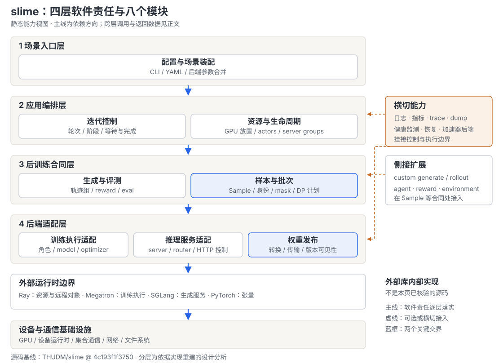

**读图要点**：横向框带固定模块所属层，主线箭头只表示主要依赖方向，具体跨层关系见下表；虚线表示侧接扩展或横切能力。它不表示训练必须先调用生成模块，也不表示 Sample 的传输方向。数据方向、远程调用和等待点在 2.2 单独展开。

| 层 / 模块 | 输入与输出合同 | 独立拥有的状态或决策 | 向下委托与不负责的事项 |
|---|---|---|---|
| 场景入口层 / 配置与场景装配 | CLI、模型/数据路径、hook 路径、可选 YAML → 已合并并验证的 args | 场景选择、参数命名空间和合法组合 | 委托后端 parser；不拥有运行中的模型或请求 |
| 应用编排层 / 迭代控制 | args、group/manager 句柄 → 完成的轮次、评测和保存动作 | driver 轮次、ObjectRef 等待、generate/train/update 的相对顺序 | 委托领域与适配模块；不决定请求级调度或损失计算 |
| 应用编排层 / 资源与生命周期 | GPU 数、布局、拓扑 → placement、rank actors、router 与 server groups | bundle 映射、actor 句柄集合、服务拓扑、重建入口 | 委托 Ray 放置与适配层初始化；不实现 GPU 显存硬隔离 |
| 后训练合同层 / 生成与评测 | prompt groups、采样/评测配置 → Sample groups、reward 和 metrics | 在途生成任务、采样参数、完成组和评测任务组织 | 委托 serving、custom generate、reward；不提交优化器更新 |
| 后训练合同层 / 样本与批次 | Sample 与训练并行配置 → train dict、DP 分区、microbatch 计划及 refs | 数据游标/回收、逻辑 rollout 身份、mask、step 级统计口径 | 委托 Ray 数据承载和训练端消费；不保存任意环境状态 |
| 后端适配层 / 训练执行适配 | rank 身份、checkpoint、batch → 模型更新、可选 critic values、保存结果 | rank-local model/optimizer、角色快照、数据设备布局 | 委托 Megatron schedule/optimizer；不拥有 serving cache |
| 后端适配层 / 推理服务适配 | server 配置、GPU/端口、HTTP 控制 → 可用服务与控制响应 | SGLang 进程句柄、服务地址、router 注册和 HTTP 协议转换 | 委托 SGLang 执行请求与加载权重；不决定全局 RL 轮次 |
| 后端适配层 / 权重发布 | 训练参数、目标 engines/拓扑 → serving 可用的参数版本 | 格式/传输分支、连接、分桶及发布时序；full+disk 版本由本地 group 保存 | 委托 tensor/collective/文件传输和服务加载；不提供通用回滚 |

这是逻辑责任划分，不是一模块一进程，也不是一模块一目录。`RolloutManager` 同时承载资源与生命周期、生成与评测、样本与批次的部分实现；`RayTrainGroup` 同时承载训练 actor 集合与 full+disk 发布协调；`slime/backends/sglang_utils/` 目录既放推理服务适配（engine proxy），也放资源与生命周期（router 启动、group 放置、PD/EPD 启动顺序）。反过来，“样本与批次”横跨 `slime/utils/types.py`、DataSource、manager、DP scheduler、`slime/observability/rollout_data_utils.py` 的张量化和训练数据消费代码。第 4 节用多对多映射保留这种真实关系。

### 2.2 动态实现：四次逻辑 rollout 如何变成下一版策略

选取**无 critic、无 offload、训练与推理分离、同步 driver、full+NCCL 发布**作为代表路径：两题、每题两个回答、`global_batch_size=4`，因此四次逻辑 rollout 进入一个 optimizer step。这里的 4 是说明合同的示例输入，不代表默认值；真实 GPU 数、模型并行配置和 microbatch 数仍由模型与资源决定。

初始化先创建资源，再创建 RolloutManager，然后创建训练 actors。manager 先存在，是因为轮数可能由 DataSource 长度推导，也因为训练 actor 需要向它登记 DP/CP/VPP 配置。serving 的启动和健康等待发生在 manager 构造内部；训练模型加载完成后先发布一次初始权重，才能让 serving 参数和训练起点一致。下面将物理上共处 manager 的两个逻辑模块合并为一个参与者，以保持图可读。

<!-- Figure spec: representative sync lifecycle only. Manager construction starts router and engines and waits for their init handles; rank actors register parallel config; initial publish connects new engines. Loop submits generation and awaits its outer result, then rank training, then explicit weight publication. External server/training kernels remain outside slime. -->
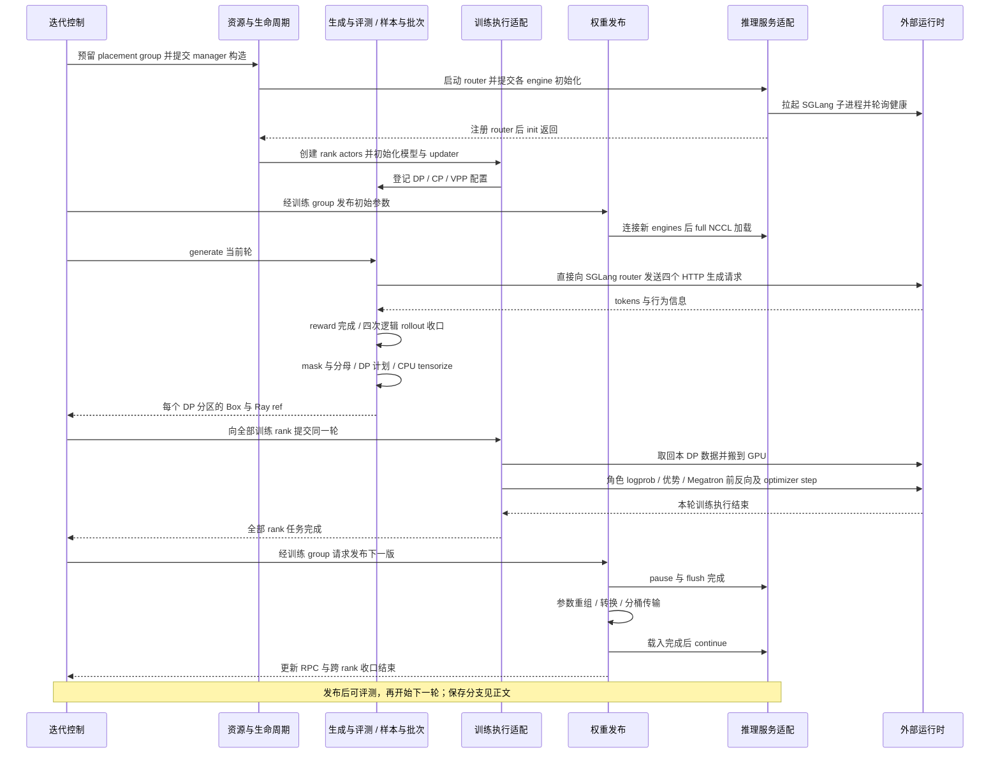
```mermaid
sequenceDiagram
    participant Ctrl as 迭代控制
    participant Resource as 资源与生命周期
    participant Domain as 生成与评测 / 样本与批次
    participant Train as 训练执行适配
    participant Weight as 权重发布
    participant Serve as 推理服务适配
    participant External as 外部运行时
    Ctrl->>Resource: 预留 placement group 并提交 manager 构造
    Resource->>Serve: 启动 router 并提交各 engine 初始化
    Serve->>External: 拉起 SGLang 子进程并轮询健康
    Serve-->>Resource: 注册 router 后 init 返回
    Resource->>Train: 创建 rank actors 并初始化模型与 updater
    Train->>Domain: 登记 DP / CP / VPP 配置
    Ctrl->>Weight: 经训练 group 发布初始参数
    Weight->>Serve: 连接新 engines 后 full NCCL 加载
    Ctrl->>Domain: generate 当前轮
    Domain->>External: 直接向 SGLang router 发送四个 HTTP 生成请求
    External-->>Domain: tokens 与行为信息
    Domain->>Domain: reward 完成 / 四次逻辑 rollout 收口
    Domain->>Domain: mask 与分母 / DP 计划 / CPU tensorize
    Domain-->>Ctrl: 每个 DP 分区的 Box 与 Ray ref
    Ctrl->>Train: 向全部训练 rank 提交同一轮
    Train->>External: 取回本 DP 数据并搬到 GPU
    Train->>External: 角色 logprob / 优势 / Megatron 前反向及 optimizer step
    External-->>Train: 本轮训练执行结束
    Train-->>Ctrl: 全部 rank 任务完成
    Ctrl->>Weight: 经训练 group 请求发布下一版
    Weight->>Serve: pause 与 flush 完成
    Weight->>Weight: 参数重组 / 转换 / 分桶传输
    Weight->>Serve: 载入完成后 continue
    Weight-->>Ctrl: 更新 RPC 与跨 rank 收口结束
    Note over Ctrl,Serve: 发布后可评测，再开始下一轮；保存分支见正文
```

**读图要点**：这一轮有 serving 可用、数据生成结束、训练任务结束、serving 发布结束四个不同信号。HTTP 已返回不代表 reward 和批次转换已完成；所有训练 rank 返回也不代表 serving 已使用新参数。图中的外部运行时返回仅表示 slime 等待的 API 边界，不证明依赖内部的 scheduler、kernel 或 collective 实现。

**源码调用流程。** 以下保留代表路径的语义跳转；同一个调用者先后执行的动作列为兄弟节点，方括号先写条件、再写所属模块或边界注记。offload、critic 与 release-train 分支只保留调用点，完整分支见 [[10_slime_end_to_end_iteration_analysis|端到端迭代时序]] 与 [[11_slime_ray_control_plane_analysis|Ray 控制面]]。

```text
train.py::__main__                                             [配置与场景装配]
├─ slime/utils/arguments.py::parse_args()
└─ train.py::train(args)                                       [迭代控制]
   ├─ create_placement_groups(args)                            [资源与生命周期]
   │  └─ _create_placement_group(num_gpus)                     [轮询 pg.ready，无超时；InfoActor 查物理 GPU]
   ├─ init_tracking(args)                                      [横切：观测]
   ├─ create_rollout_manager(args, pgs["rollout"])             [资源与生命周期]
   │  ├─ RolloutManager.options(...).remote(args, pg)          [提交远程构造，driver 不等待]
   │  │  └─ RolloutManager.__init__                            [manager actor 内]
   │  │     ├─ start_rollout_servers(args, pg)                 [资源与生命周期，slime/backends/sglang_utils/deployment.py]
   │  │     │  ├─ resolve_sglang_config(args)
   │  │     │  └─ 每个 model
   │  │     │     ├─ ModelConfig.resolve(args)                 [补 group 默认 GPU 数与 model_path，推断 update_weights]
   │  │     │     ├─ _start_router(...)                        [daemon 进程；sleep 3 s 后断言存活]
   │  │     │     ├─ ServerGroupPlacement.create(...)
   │  │     │     └─ ServerGroup.start_engines(port_cursors)   [只提交，返回 init handles]
   │  │     │        └─ SGLangEngine.init.remote(...)          [推理服务适配，engine actor 内]
   │  │     │           └─ SGLangEngine._init_normal(...)
   │  │     │              ├─ launch_server_process(ServerArgs(...))
   │  │     │              │  └─ _wait_server_healthy(...)     [node 0 轮询 /health_generate，无超时]
   │  │     │              └─ SGLangEngine._register_to_router(...)
   │  │     ├─ load_function(data source / rollout / eval …)   [生成与评测 / 样本与批次]
   │  │     ├─ ray.get(rollout_init_handles)                   [serving 可用边界]
   │  │     ├─ Lock.options(...).remote()
   │  │     └─ [use_fault_tolerance] RolloutHealthMonitor.start()  [横切：健康监测]
   │  └─ [num_rollout 未给] ray.get(manager.get_num_rollout_per_epoch.remote())
   ├─ create_training_models(args, pgs, manager)               [资源与生命周期]
   │  ├─ create_actor_model(args, pgs, manager)
   │  │  ├─ allocate_train_group(...)                          [本地 RayTrainGroup，每 actor 0.4 GPU 配额]
   │  │  └─ RayTrainGroup.create(rollout_manager=manager)
   │  │     ├─ _allocate_gpus_for_actor(...)                   [构造远程 rank actors]
   │  │     ├─ ray.get([actor.init.remote(...)])               [训练执行适配]
   │  │     │  └─ MegatronTrainRayActor.init
   │  │     │     ├─ initialize_model_and_optimizer(args, role)
   │  │     │     ├─ TensorBackuper.backup("actor")；[with_ref 等] load_other_checkpoint(...)
   │  │     │     └─ create_weight_updater(...)                [权重发布：按 mode/transport/colocate 选类]
   │  │     └─ RayTrainGroup.set_rollout_manager(manager)
   │  │        └─ ray.get([actor.set_rollout_manager.remote(manager)])
   │  │           └─ [rank 0] ray.get(manager.set_train_parallel_config.remote(...))
   │  ├─ [use_critic 且 num_rollout≠0] critic group 的 allocate_train_group / create
   │  └─ [rollout_global_dataset] ray.get(manager.load.remote(start_rollout_id - 1))
   ├─ [offload_rollout 且非 release_train] ray.get(manager.onload_weights.remote())  [资源与生命周期]
   ├─ RayTrainGroup.update_weights()                           [权重发布：初始发布]
   │  └─ ray.get([actor.update_weights.remote()])
   │     └─ MegatronTrainRayActor.update_weights
   │        ├─ [use_fault_tolerance 且 rank 0] ray.get(manager.recover_updatable_engines.remote())
   │        ├─ ray.get(manager.get_updatable_engines_and_lock.remote())  [六元组]
   │        ├─ [num_new_engines>0] UpdateWeightFromDistributed.connect_rollout_engines(...)
   │        ├─ [num_new_engines>0 且 rank 0] ray.get(manager.clear_updatable_num_new_engines.remote())
   │        └─ UpdateWeightFromDistributed.update_weights()
   │           ├─ [rank 0] ray.get(pause_generation) 与 ray.get(flush_cache)
   │           ├─ _send_weights(pbar)
   │           └─ [rank 0] ray.get(continue_generation)；gloo barrier
   ├─ [check_weight_update_equal] ray.get(manager.check_weights.remote(action="compare"))
   ├─ [offload_rollout] ray.get(manager.onload_kv.remote())       [资源与生命周期]
   ├─ [num_rollout==0 且 eval_interval 非空] ray.get(manager.eval.remote(rollout_id=0))
   ├─ for rollout_id in range(start_rollout_id, num_rollout)
   │  ├─ [eval_interval 非空、rollout_id==0、未 skip_eval_before_train] ray.get(manager.eval.remote(0))
   │  ├─ ray.get(manager.generate.remote(rollout_id))          [返回内层 per-DP Box refs]
   │  │  └─ RolloutManager.generate
   │  │     ├─ RolloutManager._get_rollout_data(rollout_id)    [生成与评测]
   │  │     │  └─ call_rollout_fn(generate_rollout, ...)       [默认 slime/rollout/sglang_rollout.py::generate_rollout]
   │  │     ├─ save_debug_rollout_data(...)；log_rollout_data(...)  [横切：观测]
   │  │     ├─ [debug_rollout_only] return
   │  │     ├─ RolloutManager._convert_samples_to_train_data(data)  [样本与批次]
   │  │     └─ RolloutManager._split_train_data_by_dp(data)    [样本与批次：build_dp_schedule 与 Box(ray.put)]
   │  ├─ [offload_rollout] ray.get(manager.offload.remote())    [资源与生命周期]
   │  ├─ [release_train] actor_model.create()                  [资源与生命周期：重建训练 actors]
   │  ├─ [use_critic] value_refs = critic_model.async_train(...)  [训练执行适配：critic 先提交]
   │  ├─ ray.get(actor_model.async_train(rollout_id, refs))    [训练执行适配；use_critic 时带 external_data=value_refs，critic-only 轮只等 value_refs]
   │  │  └─ MegatronTrainRayActor.train                        [各 rank]
   │  │     ├─ MegatronTrainRayActor._get_rollout_data(ref)
   │  │     └─ MegatronTrainRayActor.train_actor(rollout_id, rollout_data)
   │  │        ├─ get_data_iterator(rollout_data)
   │  │        ├─ [compute_advantages_and_returns] compute_log_prob(...)  [ref_、teacher_ 与当前策略，按复用条件]
   │  │        ├─ [compute_advantages_and_returns] compute_advantages_and_returns(args, rollout_data)
   │  │        ├─ slime/backends/megatron_utils/model.py::train(...)
   │  │        │  └─ 每个 step：train_one_step(...)
   │  │        │     ├─ get_forward_backward_func() 返回的 schedule  [外部 Megatron]
   │  │        │     └─ [valid_step] optimizer.step()；opt_param_scheduler.step(...)
   │  │        └─ TensorBackuper.backup("actor")
   │  ├─ [release_train 或保存条件] [actor_trains] actor_model.save_model(...)；[use_critic] critic_model.save_model(...)  [训练执行适配]
   │  ├─ [同上且 rollout_global_dataset] ray.get(manager.save.remote(rollout_id))  [样本与批次]
   │  ├─ offload_train(actor_trains)                           [非 offload_train 时 clear_memory]
   │  ├─ [offload_rollout 且非 release_train] ray.get(manager.onload_weights.remote())  [资源与生命周期]
   │  ├─ RayTrainGroup.update_weights()                        [权重发布：子树同初始发布；full+disk 且 release_train 时先 release 再 reload]
   │  ├─ [offload_rollout] ray.get(manager.onload_kv.remote())
   │  └─ [评测条件] ray.get(manager.eval.remote(rollout_id))   [生成与评测]
   ├─ ray.get(manager.dispose.remote())                        [横切：停止健康监测并结束 tracking]
   └─ finish_tracking(args)
```

`async_train` 名称表示“提交任务并返回每个 worker 的 refs”；同步 driver 随即 `ray.get` 等待，整个算法仍然同步。外层 `manager.generate` 的 ref 完成后，返回的是内层 DP 数据 refs，而不是 driver 取回了所有 tensor。driver 没有显式等待 serving 健康：`RolloutManager.__init__` 在 manager actor 内等待 init handles，driver 对 manager 的第一个被等待的方法调用会排在构造之后执行（Ray actor 的上游合同，本页未核验其内部）；在代表路径中，这个等待点是 rank 0 训练 actor 的 `set_train_parallel_config`。真实保存时序在权重发布之前；按周期触发的异步保存还要区分提交与持久化，不能由上图末尾的概括得出“每轮先评测后保存”。

### 2.3 三条跨模块通路及完成边界

| 通路 | 传递的对象 | 谁使它对下一方可用 | 主要代价与边界 |
|---|---|---|---|
| 控制通路 | args、actor handle、ObjectRef、轮次与拓扑 | driver/group/manager 在相应 `ray.get` 或状态检查后推进 | RPC 提交不是完成；资源不足时 placement 可以持续等待 |
| 数据通路 | prompt → Sample → train dict → per-DP Box/ref → GPU batch | manager 在 reward/转换/计划完成后返回 refs；训练 rank 再取回数据 | CPU tensorize、对象承载、设备搬运；字段受传输白名单约束 |
| 权重通路 | rank-local shards → serving 格式参数或磁盘工件 → engine 版本 | updater 或 full+disk group 完成服务加载与恢复后返回 | gather/布局转换/传输/暂停；失败可能已有部分副作用 |

这三条通路协作但不共用一个总序号：driver `rollout_id` 是训练循环轮次，`Sample.rollout_id` 标识一次逻辑生成，weight version 标识发布代次。一次 agent 执行可以产生多个 Sample；一次 driver 轮次也可以包含多个 optimizer steps。将这三种身份混用，会让恢复、归一化和陈旧度分析同时失真。

## 3. 各软件模块的概要设计

### 3.1 配置与场景装配：将用户意图转成可执行合同

**职责与内部逻辑。** 两个根入口都调用 `slime/utils/arguments.py::parse_args`。`_pre_parse_mode` 先用临时 parser 取出 `--train-backend`、`--debug-rollout-only`、`--debug-train-only` 与 `--load-debug-rollout-data`。其中只有 `debug_train_only` 或 `load_debug_rollout_data` 会跳过 SGLang 参数解析；`debug_rollout_only` 让 Megatron parser 跳过 HF 配置核验，并在最后跳过 Megatron 侧校验。随后独立解析带前缀的 SGLang 参数、解析 Megatron 加 slime 参数并合并 namespace，再依次执行 `slime_validate_args`、（非 rollout-only 时）`slime/backends/megatron_utils/arguments.py::validate_args` 与（非 train-only 时）`slime/backends/sglang_utils/arguments.py::validate_args`。最后这个 SGLang 侧校验是 slime 的包装：做新旧别名归一与 TP 推导，断言 `rollout_num_gpus_per_engine` 能被 SGLang PP 整除、`sglang_dp_size>1` 时必须开 `--sglang-enable-dp-attention`，给 IPv6 router 地址加方括号，并检查 PD、external 与 `--sglang-config` 的互斥。SGLang 自己的 `ServerArgs(**…)` 要到 engine actor 的 `SGLangEngine._init_normal` 才构造，时间在 placement 与 router 之后；external 路径不构造它，而是在 `SGLangEngine._init_external` 比对 `/server_info`。输出的 args 既含领域选项，也含后端参数；它不是一份与后端无关的配置对象。

SGLang 包装器把原生选项改为 `--sglang-*`，但跳过由 slime 拥有的 model path、TP、端口、node rank、GPU 位置与 memory saver 等字段，避免两个配置源同时拥有物理部署。例如 `--sglang-mem-fraction-static 0.7` 解析为 `sglang_mem_fraction_static`，服务装配时再成为 SGLang 的 `mem_fraction_static`。YAML 有两个不同的生效时刻：`--custom-config-path` 在 `slime_validate_args` 内覆盖 args；actor/critic 的 `--megatron-config-path` 则到创建训练 group 时才由 `parse_megatron_role_args` 应用，`_apply_megatron_role_overrides` 忽略 GPU 分配字段。三类配置分别控制“运行哪个场景”“用什么后端能力”“怎样放置角色”，来源不同但最终必须一致。

<!-- Figure spec: parser assembly. Pre-parse selects SGLang participation, independent namespaces converge before three validators; role YAML and native ServerArgs are later stages. This is an interface selection graph, not a runtime lifecycle. -->
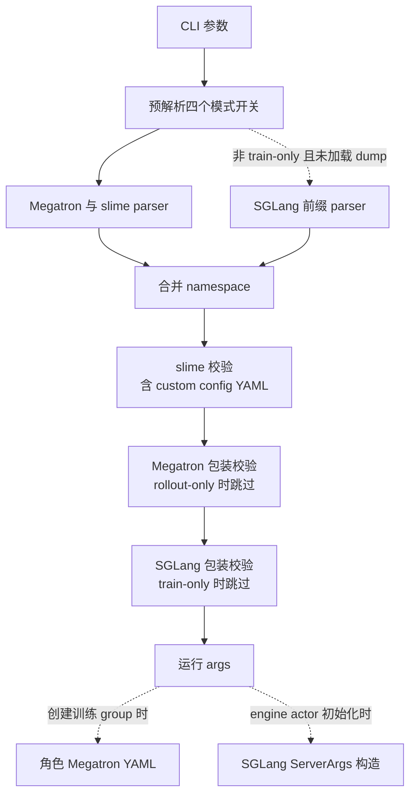
```mermaid
flowchart TB
    CLI["CLI 参数"] --> Pre["预解析四个模式开关"]
    Pre --> Meg["Megatron 与 slime parser"]
    Pre -.->|非 train-only 且未加载 dump| SG["SGLang 前缀 parser"]
    Meg --> Merge["合并 namespace"]
    SG --> Merge
    Merge --> V1["slime 校验<br/>含 custom config YAML"]
    V1 --> V2["Megatron 包装校验<br/>rollout-only 时跳过"]
    V2 --> V3["SGLang 包装校验<br/>train-only 时跳过"]
    V3 --> Args["运行 args"]
    Args -.->|创建训练 group 时| Role["角色 Megatron YAML"]
    Args -.->|engine actor 初始化时| SA["SGLang ServerArgs 构造"]
```

**设计分析。** 相比维护封闭的统一 schema，这种方式使上游参数更快可达；判据是新能力能否通过当前安装版本的 parser 进入实际构造器。代价是薄层必须保留 skip 列表、旧新别名与互斥条件。“原生透传”因此不等于没有适配，也不保证文档中的任意上游参数都可原样使用；SGLang 原生参数错误可能到 engine 初始化才暴露。

**约束与证据。** router 仍有混合前缀：手写 `--sglang-router-ip/port/request-timeout-secs`，另一些经 `RouterArgs.add_cli_args(..., use_router_prefix=True, exclude_host_port=True)` 注册成 `--router-*`。源文件的 TODO 只表达统一前缀的意图，没有确定改法或时间；不能据此推断后端矩阵也计划扩展。源码路线：`slime/utils/arguments.py::_pre_parse_mode / parse_args / slime_validate_args / parse_megatron_role_args / _apply_megatron_role_overrides`、`slime/backends/sglang_utils/arguments.py::add_sglang_arguments / add_sglang_router_arguments / validate_args`、`slime/backends/sglang_utils/sglang_engine.py::SGLangEngine._init_normal / _init_external`。参数组、校验时机与失败定位见 [[02_slime_quickstart_and_configuration_guide|快速开始与配置指南]]。

### 3.2 迭代控制：拥有阶段顺序，不拥有阶段内部算法

**职责与内部逻辑。** `train.py::train` 和 `train_async.py::train` 是 driver 本地函数。它们持有 manager 与训练 group 句柄，决定何时生成、训练、保存、更新、评测，等待各阶段的完成信号。driver 不逐 token 调用模型，也不逐 microbatch 算 loss；它接收批次引用并把同一轮交给 rank actors。

同步入口每轮收齐生成数据，再等待本轮训练结束，随后发布权重。异步入口先提交下一轮生成，再训练当前批；到更新间隔时等待已经提交的生成结束，然后发布，被收口的那一批留作下一轮的训练数据，它由发布前的参数生成。这个等待使权重切换具有明确边界，也限制了可以隐藏多少生成时间。决定发布频率的 `--update-weights-interval` 只由 `train_async.py::train` 读取，且 `--release-train` 会无视它、每轮发布；同步主循环每轮都发布；`slime/backends/megatron_utils/actor.py` 只在 `--keep-old-actor` 下读取它，按是否等于 1 决定快照队列方式。

<!-- Figure spec: same batch pair A/B under sync and one-stage async, without proportional timing. Nodes expose submission and waiting, not measured speedup. -->
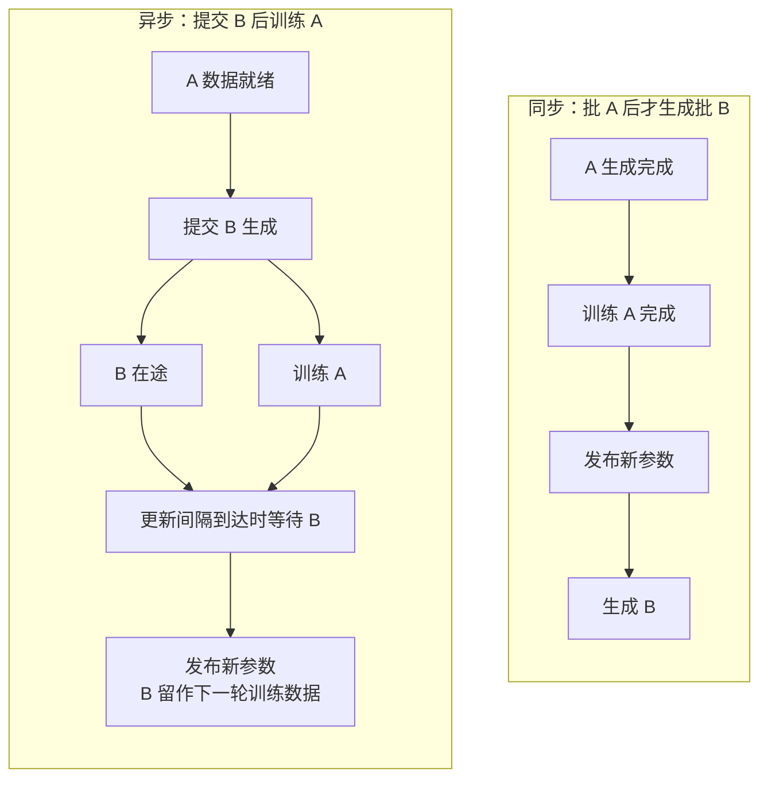
```mermaid
flowchart TB
    subgraph Sync["同步：批 A 后才生成批 B"]
        direction TB
        A["A 生成完成"] --> AT["训练 A 完成"] --> AW["发布新参数"] --> B["生成 B"]
    end
    subgraph Async["异步：提交 B 后训练 A"]
        direction TB
        Ready["A 数据就绪"] --> Submit["提交 B 生成"]
        Submit --> BT["B 在途"]
        Submit --> TrainA["训练 A"]
        BT --> Join["更新间隔到达时等待 B"]
        TrainA --> Join
        Join --> Publish["发布新参数<br/>B 留作下一轮训练数据"]
    end
```

**设计分析。** 相比让 trainer 隐式触发下次生成，显式 driver 更容易检查旧数据由哪个参数版本产生，以及保存与评测落在哪个轮次。代价是同步 barrier 和 async 更新前等待都会形成空转；这不是免费获得吞吐的抽象。fully-async 通过 `slime/rollout/fully_async_rollout.py::generate_rollout_fully_async` 替换 rollout function，在 async driver 内改变生成队列管理，不是第三套根入口；`examples/fully_async/` 只放启动脚本。`train_async.py` 顶部注释写的是 `examples/full_async`，该目录在仓内不存在。

**约束与证据。** async 的首个 guard 是禁止 colocate。offload 与 release_train 会改变阶段内资源操作，但不能随意调换权重 onload、发布和 KV onload 的次序。退出时 `RolloutManager.dispose` 仅停止监测并结束 tracking，不能据此宣称所有 Ray actor、server 进程与 placement group 均被主动销毁。异步批次与参数版本的差一拍关系属于 staleness 问题，理论背景见 [[25_on_policy_off_policy_staleness_analysis|on-policy 与 off-policy 陈旧度]]。源码路线：`train.py::train`、`train_async.py::train`、`slime/utils/misc.py::should_run_periodic_action`、`slime/ray/rollout.py::RolloutManager.dispose`；完整时序和 fully-async 生命周期归 [[10_slime_end_to_end_iteration_analysis|端到端迭代时序]]。

### 3.3 资源与生命周期：区分放置、驻留与进程存续

**职责与合同。** 输入是训练/rollout GPU 预算与布局；输出是按角色划分的 `(pg, reordered_bundle_indices, reordered_gpu_ids)`、本地 `RayTrainGroup`、远程 rank actors，以及 manager 内的 router 与 server groups。placement 先预留 GPU bundles，再通过 InfoActor 查询实际节点/GPU，将 bundle 索引和物理 GPU ID 分开保存。训练 rank 与 serving group 从这个共同映射取资源，不能将逻辑编号直接当成设备编号。

下面用训练需要 4 GPU、rollout 需要 4 GPU 的同一例子解释部署决策。这里只展示预算与集合关系；具体 bundle 排序、节点连续性和 heterogeneous group 校验归控制面专题。

<!-- Figure spec: resource-set example, four train and four rollout GPUs. Colocation has one shared set plus phase gate; disaggregation has two disjoint sets. No proportional timeline or hardware topology is claimed. -->
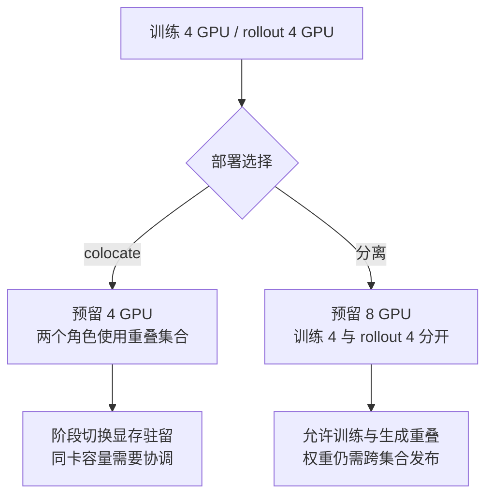
```mermaid
flowchart TB
    Need["训练 4 GPU / rollout 4 GPU"] --> Mode{"部署选择"}
    Mode -->|colocate| Shared["预留 4 GPU<br/>两个角色使用重叠集合"]
    Shared --> Gate["阶段切换显存驻留<br/>同卡容量需要协调"]
    Mode -->|分离| Split["预留 8 GPU<br/>训练 4 与 rollout 4 分开"]
    Split --> Overlap["允许训练与生成重叠<br/>权重仍需跨集合发布"]
```

**内部构造。** `RayTrainGroup` 是 driver 中的普通 Python 对象；它保存 `_actor_handlers`，每个 handler 指向一个 Megatron 训练 rank actor。serving 侧的部署代码位于 `slime/backends/sglang_utils/`：`deployment.py::start_rollout_servers` 按模型启动 router 并创建 groups，`engine_group.py::ServerGroupPlacement.create` 累计 engine 与 GPU 偏移，`ServerGroup` 保存 engine 槽位、GPU offset、并行 overrides、worker type 与是否需要 offload。`ServerGroup.start_engines` 创建 engine actor、分配端口并提交 `init`，把 init handles 返回给调用方，group 自己不保存这些 futures；PD 与 EPD 的启动顺序在 `disaggregation.py`，其中 EPD 先同步等待 encoder 组。所有 handles 由 `RolloutManager.__init__` 统一 `ray.get`。`RolloutManager` 本身是零 GPU Ray actor，内部再创建独立的零 GPU `Lock` actor，后者不是线程锁。训练 actor 的设备绑定与进程组后端经 `slime/utils/accelerator` 选择（默认 CUDA，MUSA 需显式环境），不再直接写死 `torch.cuda`。

**设计分析。** 相比把“分配一块 GPU”与“占满其显存”绑定，Ray 配额配合显式 offload 能让训练/推理使用同一物理设备；但 `0.4` 训练 actor 配额与 `0.2` serving actor 配额是调度记账，不是可用显存比例。显存峰值仍取决于后端模型、cache 和阶段顺序。

**生命周期分级。** offload 保留训练 actor 及 CPU 状态，并处理显存/通信组的释放恢复；`release_train` 则杀掉训练 actors，下一轮从保存状态重建。后者要求 full+disk 与 `--save`，且跨重建的版本由本地 group 保存。SGLang group 只有 GPU 与训练侧重叠时才需要对应 offload；external serving 不从本训练任务的 GPU 池取相同资源。placement 等待会周期打印注册/可用 GPU 数，但没有有限超时。源码路线：`slime/ray/placement_group.py::_create_placement_group / _get_placement_group_layout / create_rollout_manager / create_training_models`、`slime/ray/actor_group.py::RayTrainGroup.create / release`、`slime/backends/sglang_utils/deployment.py::start_rollout_servers / _start_router`、`slime/backends/sglang_utils/engine_group.py::ServerGroupPlacement.create / ServerGroup.start_engines / ServerGroup.offload / RolloutServer.recover`、`slime/backends/sglang_utils/disaggregation.py::start_epd_server_groups`、`slime/ray/train_actor.py::TrainRayActor.init`。详见 [[11_slime_ray_control_plane_analysis|Ray 控制面]]。

### 3.4 生成与评测：把请求执行收口成可训练的轨迹组

**职责与合同。** 生成模块输入 prompt groups 与采样配置，输出带 reward、tokens、behavior logprobs、状态及可选 routing 信息的 Sample groups。`RolloutManager` 负责装载 rollout/eval hook 和调用边界；默认 `sglang_rollout` 负责组级任务、并发、生成、reward、过滤及剩余任务处理。底层 server 只回答请求，不知道当前训练轮需要收齐多少有效 prompt groups。默认生成函数直接向 router 的 `/generate` 发 HTTP 请求；SGLangEngine proxy 提供服务管理，不中转每个生成请求。

**内部逻辑。** `GenerateState` 保存采样参数、semaphore、pending tasks 和计数。一个 group 包含同一 prompt 的 `n_samples_per_prompt` 次生成；组内任务可以并发，组返回后才做需要整组的 reward 或动态过滤。默认循环以 `FIRST_COMPLETED` 接收完成任务，被过滤丢弃的组释放一个名额，名额不足时再取一批补采；收齐目标后执行 abort 收口，再按 index 排序返回。一次 `abort` 依次做两步：先取消以请求级方式运行的在途 asyncio 任务（generate 函数声明了 `abort_mode = "request"`，如流式 `slime/rollout/sglang_streaming_rollout.py::generate_streaming`）；若仍有以服务端 abort 方式运行的生成（`active_server_generations` 非零），再向 router 查询 workers 并调用 `abort_servers_until_idle` 直到空闲。同一轮里两类任务可以并存，两步都会执行。生成耗时差异因此由组级调度吸收，而不是要求 dataset 顺序恰好等于完成顺序。

<!-- Figure spec: target is two valid groups. Group P is dropped by the dynamic filter and frees one slot, which triggers refill; Q and a refilled group are accepted. Expose long-tail pending abort rather than implying every pending request is preserved. -->
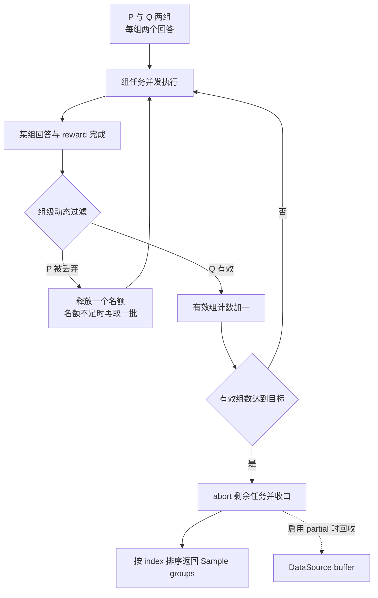
```mermaid
flowchart TB
    Groups["P 与 Q 两组<br/>每组两个回答"] --> Pending["组任务并发执行"]
    Pending --> Done["某组回答与 reward 完成"]
    Done --> Filter{"组级动态过滤"}
    Filter -->|P 被丢弃| Refill["释放一个名额<br/>名额不足时再取一批"]
    Refill --> Pending
    Filter -->|Q 有效| Keep["有效组计数加一"]
    Keep --> Target{"有效组数达到目标"}
    Target -->|否| Pending
    Target -->|是| Settle["abort 剩余任务并收口"]
    Settle --> Out["按 index 排序返回 Sample groups"]
    Settle -.->|启用 partial 时回收| Buffer["DataSource buffer"]
```

**设计分析。** 相比固定等一个完整请求列表全部结束，按完成组补采能应对动态过滤和长尾；保留组边界则使同题多回答的相对评价有确定输入。代价是 abort、partial 和 custom hook 必须共同维护状态，不能假定所有未使用结果都被自动回收；hook 抛错也不等于所有兄弟任务自动安全结束。按请求取消只保留断开前已收到的 chunk，SGLang 放在终止 chunk 上的 top-p 与路由专家元数据会随取消丢失（`generate_streaming` 文档字符串所述）。

**评测与扩展。** eval 使用单独的 eval function 和 dataset 配置，不执行 train dict 分包；返回的是可聚合的评测数据。custom generate 只替换单次执行，rollout function 可以替换整个组调度；`--custom-rm-path` 替换 reward。session ID 可支撑 router affinity，但环境/工具自身的事务与重试需要扩展作者承担。源码路线：`slime/rollout/base_types.py::call_rollout_fn`、`slime/rollout/sglang_rollout.py::GenerateState / generate_and_rm / generate_and_rm_group / generate_rollout_async / abort / generate_rollout`、`slime/backends/sglang_utils/server_control.py::abort_servers_until_idle`、`slime/ray/rollout.py::RolloutManager.eval`。请求执行与 abort 语义归 [[13_slime_sglang_rollout_engine_analysis|SGLang rollout 引擎]]，评测细节见 [[27_slime_evaluation_path_analysis|评测路径]]，agent 扩展见 [[24_slime_agent_workflow_examples_analysis|agent 工作流示例]]。

### 3.5 样本与批次：在灵活生成与确定训练之间转换

**职责与状态。** `Sample` 保存一次执行的内容、行为与训练信号；DataSource 管理 prompt 游标、epoch 和回收入口；manager 在完整 step 的视野下转换并生成训练计划。README 中的 Data Buffer 对应这一组逻辑责任，核心实现没有另起一个全局 replay 服务。基础 `RolloutDataSource.add_samples` 会拒绝写入；支持回收的是 `RolloutDataSourceWithBuffer`，它也是 `--data-source-path` 的默认值。后者也不能只凭继承的 save/load 就被解释为完整持久 replay：基础保存字段是数据游标、索引和 metadata，未保存任意在途工作流。

**转换原则。** 一个 agent 执行若拆成 A、B 两片，它们保留相同的 `Sample.rollout_id`。转换器检查 response mask 长度，在分包前计算整次逻辑 rollout 的 `rollout_mask_sums`，再把这个分母复制给各片。后续 DP 或 microbatch 位置改变，不应改变这次执行作为一个训练计数单位的含义。`sample.index` 区分训练样本，driver round 则是另一种身份。

<!-- Figure spec: one rollout R split into two samples with mask totals 2 and 1. Aggregate denominator 3 before packaging and attach it to both fragments; denominator is not recomputed inside each microbatch. This is a small arithmetic example, not a DP placement algorithm. -->
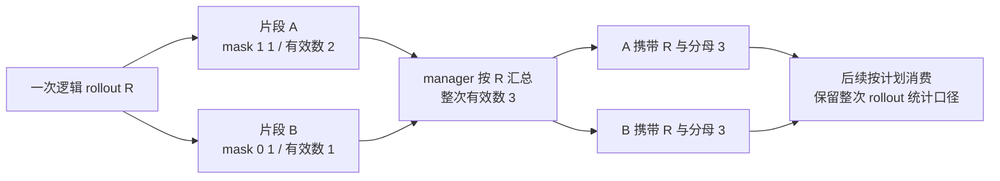
```mermaid
flowchart LR
    R["一次逻辑 rollout R"] --> A["片段 A<br/>mask 1 1 / 有效数 2"]
    R --> B["片段 B<br/>mask 0 1 / 有效数 1"]
    A --> Total["manager 按 R 汇总<br/>整次有效数 3"]
    B --> Total
    Total --> AP["A 携带 R 与分母 3"]
    Total --> BP["B 携带 R 与分母 3"]
    AP --> Train["后续按计划消费<br/>保留整次 rollout 统计口径"]
    BP --> Train
```

**内部数据路线。** 默认转换构造 `tokens`、`response_lengths`、`rewards`、`loss_masks`、`rollout_ids` 等列；`build_dp_schedule` 根据长度与逻辑身份生成 DP partitions 和各 rank 的 microbatch 索引。manager 按白名单提取分区字段，调用 `slime/observability/rollout_data_utils.py::tensorize_rollout_data_for_training` 在 CPU 上张量化，然后以 `Box(ray.put(...))` 返回。训练端取回本 DP 数据并将 tokens/masks 等搬到 GPU；可选 `nixl` tensor transport 改变承载方式，不会替代这些领域合同。

**设计分析。** 相比让每个训练 microbatch 自己推断原始生成关系，集中转换能在信息尚完整时固定统计口径；相比全程只用 tensor，`Sample` 又保留了工具、多模态、partial 和行为信息。代价是可选字段必须显式接线，例如 converter 可产生 `metadata`，默认 DP 白名单却不传它；自定义训练 metadata 不能仅靠赋值就生效。

**约束与证据。** mask 长度不等于 `response_length` 有显式 assert，top-p offsets 也有长度和尾偏移检查。CPU fetch 的潜在瓶颈由训练端注释直接指出。DP 调度、CP 切片与最终 loss 归约有不同所有者，不应在这里重写成“按长度平均分”这种简化算法。源码路线：`slime/utils/types.py::Sample`、`slime/rollout/data_source.py::RolloutDataSource / RolloutDataSourceWithBuffer`、`slime/ray/rollout.py::RolloutManager._convert_samples_to_train_data / _split_train_data_by_dp`、`slime/utils/dp_schedule.py::build_dp_schedule`、`slime/backends/megatron_utils/actor.py::MegatronTrainRayActor._get_rollout_data`。身份与 mask 归 [[12_slime_sample_datasource_analysis|Sample 与 DataSource]]，DP 计划归 [[14_slime_megatron_training_analysis|Megatron 训练执行]]。

### 3.6 训练执行适配：把后训练语义交给原生 Megatron 执行

**职责与合同。** 每个 `MegatronTrainRayActor` 拥有本 rank 的模型 chunks、optimizer、scheduler 及角色相关状态。初始化构造并恢复模型，向 manager 交付 `dp_size/cp_size/vpp_size/microbatch_group_size_per_vp_stage`。每个 rank 从本轮的 DP refs 中取回自己的分区，可附带 critic values，输出是训练任务完成；critic 在最后 PP stage 返回 CPU values，actor 返回 `None`。这些返回值不能当作 HF 权重或完整训练状态。

**内部逻辑。** actor 训练先建立可反复读取的数据 iterator，按配置用 `compute_log_prob` 计算 ref、teacher 或当前策略的 logprob，随后恢复 actor 参数、计算 advantages/returns，再执行训练。ref、old_actor、teacher 可以是同一训练 actor 内由 `TensorBackuper` 管理的快照，不一定各自占用一组常驻 GPU actors；PPO critic 则由独立 RayTrainGroup 表达。角色名字不能直接推导进程数量。

<!-- Figure spec: training adapter phases. Optional role forwards enrich the batch, actor parameters must be active before optimization; optimizer and schedule are explicitly external dependencies. -->
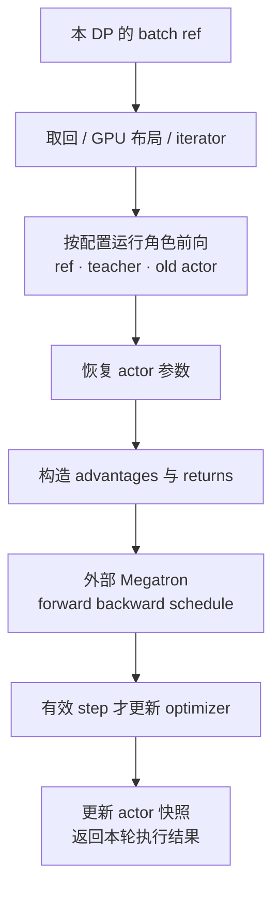
```mermaid
flowchart TB
    Ref["本 DP 的 batch ref"] --> Fetch["取回 / GPU 布局 / iterator"]
    Fetch --> Roles["按配置运行角色前向<br/>ref · teacher · old actor"]
    Roles --> Actor["恢复 actor 参数"]
    Actor --> Signal["构造 advantages 与 returns"]
    Signal --> Schedule["外部 Megatron<br/>forward backward schedule"]
    Schedule --> Optim["有效 step 才更新 optimizer"]
    Optim --> Backup["更新 actor 快照<br/>返回本轮执行结果"]
```

该图概括 RL actor 路径；实现会在计算 advantages 前恢复 actor，SFT 可跳过整段优势计算，某些配置也会复用训练前向的 logprob 而省掉单独前向。`model.train` 可在一轮里执行多个 `train_one_step`，后者将 loss closure、iterator、model 与 microbatch 数交给 Megatron schedule；有效 step 执行 optimizer，确认成功后推进学习率样本计数。这里的 token loss、CP/TP reduction 与并行 schedule 是下一层专题，不应由架构图替代算法证据。

**设计分析。** 相比在 slime 复制训练 kernel，适配层只补数据、角色、后训练信号和生命周期，使 Megatron 并行/优化器能力仍可达。代价是模型构造、角色切换、loss 与 offload 都需要理解 Megatron，新增后端不是实现一个 `train(batch)` 即可。训练端依赖的是镜像钉定的 `NVIDIA/Megatron-LM@1dcf0dafa884`，并由 `docker/Dockerfile` 叠加 `docker/patch/latest/megatron.patch` 与 `megatron-sglang-aligned.patch`；Megatron 自身的分层见 [[01_megatron_architecture_analysis|Megatron-LM 软件架构]]，该页分析基线 `85902ef5` 比镜像钉定版本新 1510 个提交，模块名可以对照，细节以钉定版本和补丁为准。

**约束与证据。** 无效梯度分支可能跳过更新；有效分支的 `optimizer.step` 若报告失败，代码有 assert，不能称作任何调用都产生新参数。`--num-rollout 0` 时 `setup_model_and_optimizer` 只构造模型并置 `no_load_optim`，optimizer 与 scheduler 为 `None`。sleep/wake 还涉及显存与 process groups，依赖方缓存的 WORLD 引用会影响可重建性。源码路线：`slime/backends/megatron_utils/actor.py::MegatronTrainRayActor.init / train / train_actor / compute_log_prob / train_critic / sleep / wake_up`、`slime/backends/megatron_utils/loss.py::compute_advantages_and_returns`、`slime/backends/megatron_utils/model.py::initialize_model_and_optimizer / setup_model_and_optimizer / train / train_one_step`。训练过程归 [[14_slime_megatron_training_analysis|Megatron 训练执行]]，数值合同归 [[15_slime_loss_parallelism_analysis|损失与并行归约]]。

### 3.7 推理服务适配：把可部署 server 转成可控制的生成能力

**职责与合同。** `SGLangEngine` 接收 model path、并行参数、GPU/端口、router 地址，启动或连接 SGLang，并暴露健康、暂停/继续、cache flush、显存释放恢复和权重加载方法。它是 Ray 控制代理，常规路径内部还启动真正执行 HTTP serving 的子进程。`init` 返回才是启动可用边界：常规路径的 `launch_server_process` 在 node 0 轮询 `/health_generate` 直到 200，没有超时，只在子进程退出时抛错，然后注册到 router；创建 actor handle 本身不证明模型已加载。

**内部结构。** 同一模型可以有多个 server groups，分别配置 regular、prefill、decode、encoder 或 placeholder（`slime/backends/sglang_utils/sglang_config.py::ServerGroupConfig.__post_init__` 的合法集合）。encoder 组用于 EPD：先启动并收集 URL，再作为 `encoder_urls` 注入 prefill/regular 组，它本身不注册 router。`--sglang-config` 的 help 与 `ServerGroup.worker_type` 字段注释只列出另外四种，以实现为准。多节点 engine 还有 node-0 控制入口。模型各自对应 router，地址表通过 `args.sglang_model_routers` 交给 custom rollout；heterogeneous group 还提供自己的 GPU 数、offset 与 TP/PP/EP/MoE-DP 配置，供权重侧理解目标布局。

<!-- Figure spec: serving control structure separates slime proxy and external SGLang child. Normal launch and external connection converge at HTTP control. Placeholder groups create no engine; encoder groups skip router registration. -->
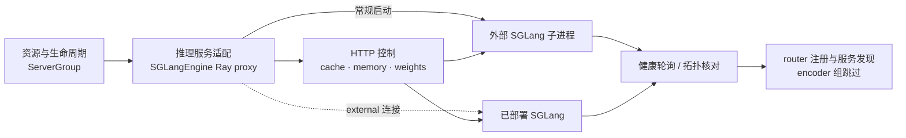
```mermaid
flowchart LR
    Group["资源与生命周期<br/>ServerGroup"] --> Proxy["推理服务适配<br/>SGLangEngine Ray proxy"]
    Proxy -->|常规启动| Child["外部 SGLang 子进程"]
    Proxy -.->|external 连接| Existing["已部署 SGLang"]
    Child --> Health["健康轮询 / 拓扑核对"]
    Existing --> Health
    Health --> Router["router 注册与服务发现<br/>encoder 组跳过"]
    Proxy --> Control["HTTP 控制<br/>cache · memory · weights"]
    Control --> Child
    Control --> Existing
```

**设计分析。** 相比让 trainer 直接控制 HTTP 进程，proxy 将 Ray 资源身份与 HTTP 管理接口连接起来；相比仅抽象 `generate`，保留 SGLang 专有管理面才能支持 offload、PD 和热更新。代价是这些语义贯穿参数、拓扑与控制层，替换 serving backend 需要共同迁移整个协议面。

**约束与证据。** placeholder 不创建 engine；external 路径使用零 GPU 的 SGLang proxy，仍校验 SGLang server 参数，不能与 `--sglang-config` 或 `--prefill-num-servers` 同时使用，其 `ExternalRolloutServer.recover` 只打警告、不参与故障恢复。多模型 serving 不等于多模型更新：manager 只返回第一个 `update_weights=True` 的 server。slime 源码能证明 HTTP 请求内容、健康等待和响应处理；SGLang 内部 KV 生命周期、调度公平性和硬件执行属于依赖侧，本页只记录接口交接，SGLang 本体见 [[02_engineering/03_infer_frameworks/sglang/index|SGLang]]。源码路线：`slime/backends/sglang_utils/sglang_engine.py::launch_server_process / _wait_server_healthy / SGLangEngine.init / _init_normal / _init_external / _register_to_router / _make_request`、`slime/backends/sglang_utils/external.py::start_external_rollout_servers / ExternalRolloutServer.recover`、`slime/backends/sglang_utils/disaggregation.py::start_epd_server_groups`、`slime/ray/rollout.py::RolloutManager._get_updatable_server`。参见 [[13_slime_sglang_rollout_engine_analysis|SGLang rollout 引擎]]、[[19_slime_rollout_backend_extension_analysis|rollout 后端扩展]]。

### 3.8 权重发布：让训练参数成为 serving 可用版本

**职责与合同。** 训练端持有的是分片参数，生成服务需要其自身模型实现可消费的名字、形状、dtype 与数据。权重发布负责把这两种表示连接起来，并确定何时可以恢复请求。manager 提供六元组：`engines, lock, num_new, gpu_counts, gpu_offsets, parallel_configs`；updater 用它连接新增 engine、理解目标拓扑和协调更新。只传一个 tensor 列表不足以表达这些信息。

**实现选择。** `MegatronTrainRayActor.init` 调用 `slime/backends/megatron_utils/update_weight/__init__.py::create_weight_updater`，按 mode/transport/colocate 选 updater：delta 选择 disk delta；full+disk 选择磁盘导出；共置 full 路径选择 tensor updater；分离 full+NCCL 选择 distributed updater。这个顺序也决定非法组合在哪个 guard 被拒绝（参数校验会更早以 `ValueError` 拒绝大部分组合）。每次发布前，若 `num_new_engines > 0`，actor 先 `connect_rollout_engines` 建立到新 engine 的通信组；初始发布总会走这一步。不同路径的共同目标是完整 serving 参数版本，内部 gather、量化、桶和重建方法并不相同。

| 路径 | 本轮训练完成后形成的中间物 | 谁协调 serving 加载 | 主要适用条件与代价 |
|---|---|---|---|
| 共置 full tensor | 转换后的命名参数与 tensor 载荷 | tensor updater 和 SGLang proxy | 共享 GPU 部署；临时缓冲、序列化/IPC 与显存切换 |
| 分离 full NCCL | TP/EP 等重组后的 HF 参数桶 | distributed updater 和 SGLang proxy | 独立训练/生成 GPU；通信组、gather、broadcast 与暂停 |
| full disk | 完整 HF checkpoint 版本目录 | 本地 `RayTrainGroup` | 共享或可拉取文件；导出、磁盘空间和加载时间 |
| delta disk | 发布的 delta 与主机本地重建 checkpoint | disk delta updater 与拉取/重建协议 | 非共置；前序版本、重建和文件传输合同，不能与 full 混为同一流程 |

下面只展开 2.2 选中的 full+NCCL 发布顺序；四类重布局/传输算法与共用参数算例由 [[16_slime_weight_sync_analysis|权重同步专题]]统一维护。本页不把它们压成一个错误的公共实现。

<!-- Figure spec: version v to v+1 transition for full NCCL. Paused server cannot resume on partial bucket state; error branch is explicit and has no rollback edge. -->
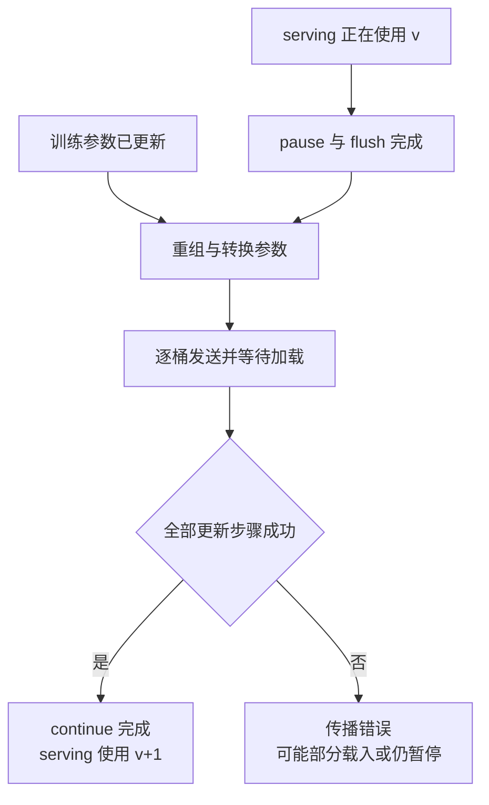
```mermaid
flowchart TB
    V["serving 正在使用 v"] --> Pause["pause 与 flush 完成"]
    Train["训练参数已更新"] --> Build["重组与转换参数"]
    Pause --> Build
    Build --> Send["逐桶发送并等待加载"]
    Send --> OK{"全部更新步骤成功"}
    OK -->|是| Resume["continue 完成<br/>serving 使用 v+1"]
    OK -->|否| Fail["传播错误<br/>可能部分载入或仍暂停"]
```

**设计分析。** 相比训练后无条件逐 tensor 覆盖，显式暂停和加载边界防止正常路径的请求跨越半套参数；但这只是成功路径的协调协议，不是拥有 rollback 的数据库事务。distributed updater 的版本计数在更新开始时推进，异常可能发生在版本已变、数据未完整加载之后，不能把一个计数值视为独立提交证据。

**磁盘特例。** full+disk 的跨轮版本由 `RayTrainGroup._disk_weight_version` 保存，训练 actor 负责导出，然后可被 release，group 再驱动 serving reload；可选本地磁盘 pull 在 pause 前执行。因而“权重发布”这一逻辑模块横跨 group 与 updater，不能统一说版本都存在 rank actor 中。暂停后失败没有通用回滚保证。

**依赖边界。** slime 这一侧能证明发出了哪些 HTTP 控制请求、等待了什么。服务端接口来源不同：`/pause_generation`、`/continue_generation`、`/init_weights_update_group`、`/update_weights_from_distributed` 在上游 `sgl-project/sglang@0b3bb0cbe318`（`v0.5.15.post1`）的 `python/sglang/srt/entrypoints/http_server.py` 中已有路由；`/pull_weights` 由仓内 `docker/patch/latest/sglang-pull_weights.patch` 新增；`docker/patch/latest/sglang.patch` 也改动了权重更新与控制相关的内部文件。逐接口的补丁归属与加载语义由权重同步专题标注，本页不把服务端内部当作已读实现。

**成本与证据。** `--update-weight-buffer-size` 默认 512 MiB，是分桶预算而非模型大小或全流程内存上限；单参数转换、gather 等临时分配仍可能超过它。训练/serving 拓扑差异越大，重组成本越需要实测，这一成本判断是设计推断，不是本页 benchmark。源码路线：`slime/backends/megatron_utils/update_weight/__init__.py::create_weight_updater`、`slime/backends/megatron_utils/actor.py::MegatronTrainRayActor.update_weights`、`slime/backends/megatron_utils/update_weight/update_weight_from_distributed.py::UpdateWeightFromDistributed.connect_rollout_engines / update_weights / _send_weights`、`slime/backends/megatron_utils/megatron_to_hf/__init__.py::convert_to_hf`、`slime/ray/actor_group.py::RayTrainGroup.update_weights / _reload_rollout_weights_from_disk`。磁盘版本所有权另见 [[11_slime_ray_control_plane_analysis|Ray 控制面]]中 full+disk 发布控制权的部分。

### 3.9 横切能力与外部依赖：观测到什么，就验证到什么边界

日志、指标、trace、debug dump 与故障监测分别附着在 driver、manager、训练 actor 和 server 边界。代码集中在 `slime/observability/`：`logging_utils` 管 tracking 生命周期，`rollout_metrics` 与 `train_metric_utils` 产出指标，`rollout_data_utils` 与 `train_data_utils` 负责 debug dump（前者还承担训练数据的 CPU 张量化），另有 `timer`、`trace_utils`、`profile_utils` 与 wandb/tensorboard 适配。它们不是独立的“第九个业务模块”，也不拥有另一套训练循环。`debug_rollout_only` 在生成结果保存/记录后、train dict 转换前返回；`debug_train_only` 可用保存的 Sample 重放训练，或由 SFT hook 产生训练数据，此时 `RolloutManager.eval` 直接返回。二者隔离的是后训练通路，不能据此假设完全不需要另一框架的 Python 安装依赖。

恢复也按所有者分工：`slime/utils/health_monitor.py::RolloutHealthMonitor` 发现 serving 状态异常，权重更新入口触发可更新 engines 恢复，新增 engines 再参与连接和发布。进程重新启动并不等于已加载最新 actor 参数。训练 checkpoint、DataSource 进度、在途请求和工具外部副作用各有边界，现有代码不能证明它们共同 exactly-once。与把重试全部塞进 HTTP helper 相比，这种设计保留了模型版本与资源上下文；代价是仍须由上层处理不可恢复异常。

设备后端选择也是横切能力：`slime/utils/accelerator/__init__.py::get_accelerator` 按注册表与 `SLIME_ACCELERATOR` 等环境选出 CUDA 或 MUSA 实现，训练 actor、Ray 工具函数和 `slime/backends/sglang_utils/__init__.py` 的导入钩子都经它取设备与进程组后端。MUSA 的补丁模块 `musa_patch` 不在仓内，仓内只能证明选择与导入顺序。

训练端交给 Megatron 的是 model chunks、iterator、loss closure 与并行参数；serving 端交给 SGLang 的是 ServerArgs、请求和加载协议；Ray 承载资源与远程对象；PyTorch 承载 tensor 与 distributed API。镜像把这些依赖固定为 `slimerl/sglang:v0.5.15.post1-cu129`、`NVIDIA/Megatron-LM@1dcf0dafa884` 与带 slime 版本标记的 `sglang_router` wheel，并由 `docker/Dockerfile` 在上游之上应用 `docker/patch/latest/` 下的补丁，因此实际运行行为是“上游 + 补丁”。本文核验 slime 发出了什么、等待什么以及如何处理结果，不把依赖内部行为当作已读源码。工程验证和性能观测路线由 [[18_slime_fault_tolerance_observability_analysis|容错与可观测性]] 承接。

## 4. 架构模块与代码目录的对应关系

下表是前文模块的**源码阅读路线**，不是新的目录式分层。每个符号均位于页头冻结的 slime 仓库；外部 API 只注明交付边界。一个文件或目录可以出现在多行，因为目录封装和逻辑职责并非一一对应。

| 层 / 模块 | 主要物理位置 | 优先阅读的符号 | 跨文件或外部边界 |
|---|---|---|---|
| 场景入口层 / 配置与场景装配 | `train.py`、`train_async.py`、`slime/utils/arguments.py`、`slime/backends/sglang_utils/arguments.py`、`slime/backends/megatron_utils/arguments.py` | `slime/utils/arguments.py::_pre_parse_mode / parse_args / slime_validate_args / parse_megatron_role_args`、`slime/backends/sglang_utils/arguments.py::add_sglang_arguments / validate_args` | 后端 parser 注册本身依赖当前安装版本；`scripts/models/*.sh` 提供模型参数组 |
| 应用编排层 / 迭代控制 | `train.py`、`train_async.py`、`slime/utils/misc.py` | `train.py::train`、`train_async.py::train`、`slime/utils/misc.py::should_run_periodic_action` | 通过本地 group 与远程 manager 组合任务，等待点属于 driver |
| 应用编排层 / 资源与生命周期 | `slime/ray/placement_group.py`、`slime/ray/actor_group.py`、`slime/ray/rollout.py`、`slime/ray/utils.py`、`slime/backends/sglang_utils/{deployment,engine_group,disaggregation,sglang_config}.py` | `slime/ray/placement_group.py::create_placement_groups / create_rollout_manager / create_training_models`、`slime/ray/actor_group.py::RayTrainGroup.create / release`、`slime/ray/rollout.py::RolloutManager.__init__`、`slime/backends/sglang_utils/deployment.py::start_rollout_servers`、`slime/backends/sglang_utils/engine_group.py::ServerGroup.start_engines`、`slime/ray/utils.py::Lock` | Ray placement/actor API；部署代码与 engine proxy 同在 `sglang_utils/` 目录 |
| 后训练合同层 / 生成与评测 | `slime/ray/rollout.py`、`slime/rollout/`（含 `rm_hub/`） | `slime/ray/rollout.py::RolloutManager.generate / eval / _get_rollout_data`、`slime/rollout/base_types.py::call_rollout_fn`、`slime/rollout/sglang_rollout.py::generate_rollout_async / abort`、`slime/rollout/fully_async_rollout.py::generate_rollout_fully_async`、`slime/rollout/sglang_streaming_rollout.py::generate_streaming` | custom generate/reward/环境是扩展面；HTTP 请求直达 router |
| 后训练合同层 / 样本与批次 | `slime/utils/types.py`、`slime/rollout/data_source.py`、`slime/ray/rollout.py`、`slime/utils/dp_schedule.py`、`slime/observability/rollout_data_utils.py` | `slime/utils/types.py::Sample`、`slime/rollout/data_source.py::RolloutDataSourceWithBuffer`、`slime/ray/rollout.py::RolloutManager._convert_samples_to_train_data / _split_train_data_by_dp`、`slime/utils/dp_schedule.py::build_dp_schedule`、`slime/observability/rollout_data_utils.py::tensorize_rollout_data_for_training` | Ray refs 为数据载体；训练端另行取回并做设备/CP 处理 |
| 后端适配层 / 训练执行适配 | `slime/backends/megatron_utils/{actor,model,data,loss,model_provider}.py`、`slime/ray/train_actor.py` | `slime/backends/megatron_utils/actor.py::MegatronTrainRayActor.init / train / train_actor / compute_log_prob / train_critic`、`slime/backends/megatron_utils/model.py::initialize_model_and_optimizer / train_one_step`、`slime/backends/megatron_utils/loss.py::compute_advantages_and_returns` | 外部 Megatron model/schedule/optimizer（钉定版本加补丁），PyTorch tensor/distributed |
| 后端适配层 / 推理服务适配 | `slime/backends/sglang_utils/sglang_engine.py`、`slime/backends/sglang_utils/external.py`、`slime/backends/sglang_utils/server_control.py`、`slime/backends/sglang_utils/engine_group.py` | `slime/backends/sglang_utils/sglang_engine.py::SGLangEngine.init / _init_normal / _init_external / launch_server_process`、`slime/backends/sglang_utils/external.py::start_external_rollout_servers`、`slime/backends/sglang_utils/engine_group.py::ServerGroup.parallel_config` | SGLang server/router 是外部依赖（上游加补丁）；external 是连接路径 |
| 后端适配层 / 权重发布 | `slime/backends/megatron_utils/update_weight/`、`slime/backends/megatron_utils/megatron_to_hf/`（目录）、`slime/ray/actor_group.py` | `slime/backends/megatron_utils/update_weight/__init__.py::create_weight_updater`、`slime/backends/megatron_utils/update_weight/update_weight_from_distributed.py::UpdateWeightFromDistributed.update_weights`、`slime/backends/megatron_utils/actor.py::MegatronTrainRayActor.update_weights`、`slime/ray/actor_group.py::RayTrainGroup._reload_rollout_weights_from_disk` | 一端是训练 shard，另一端是 SGLang 加载与请求恢复 |
| 横切能力 | `slime/observability/`、`slime/utils/health_monitor.py`、`slime/utils/accelerator/` | `slime/observability/logging_utils.py::init_tracking / finish_tracking`、`slime/utils/health_monitor.py::RolloutHealthMonitor`、`slime/utils/accelerator/__init__.py::get_accelerator` | 挂在各模块边界；MUSA 补丁在仓外 |

阅读时可以先打开根 driver 确认阶段调用者，再按问题进入模块：为什么进程没起来看资源与生命周期；为什么数据量或 mask 不对看样本与批次；为什么训练成功但生成仍旧看权重发布。不要从 `backends/` 目录名推断它涵盖了所有后端耦合，参数和 Ray 控制代码同样参与；也不要从 `observability/` 目录名推断其中没有数据通路代码。

## 5. 当前软件的使用场景与架构选择

### 5.1 场景清单：按执行入口分类

清单从根入口、`scripts/`、`examples/`、`slime_plugins/`、`tools/`、带 `__main__` 的服务模块、公开文档与 E2E 测试归纳。模型 recipe 不单独计作一套架构；同一 driver 下只替换合同实现或部署配置的场景合并为一行。完整操作与机制归各行右侧的权威页。

**训练驱动与训练目标**

| 场景（分类） | 执行入口与选择点 | 完成输出与主要限制 | 权威页 |
|---|---|---|---|
| 同步 RL（核心） | `python3 train.py`；配方 `scripts/run-*.sh`（如 `scripts/run-glm4-9B.sh`），模型参数组 `scripts/models/*.sh` | 每轮生成、训练、发布串行；训练状态与按配置保存/评测。卡片见 5.2 | [[02_slime_quickstart_and_configuration_guide\|快速开始]]、[[10_slime_end_to_end_iteration_analysis\|端到端迭代]] |
| 异步 RL（核心） | `python3 train_async.py`；入口断言拒绝 `--colocate`；E2E `tests/test_qwen3.5_0.8B_gsm8k_async_short.py` | 下一批生成与本批训练重叠，更新间隔处先收口生成。卡片见 5.2 | [[10_slime_end_to_end_iteration_analysis\|端到端迭代]] |
| fully-async（可选 rollout function） | `train_async.py` 加 `--rollout-function-path slime.rollout.fully_async_rollout.generate_rollout_fully_async`；脚本 `examples/fully_async/*.sh` | manager 内后台 `AsyncRolloutWorker` 线程持续生成，driver 每轮取完成组 | [[10_slime_end_to_end_iteration_analysis\|端到端迭代]]、[[30_slime_rollout_optimization_analysis\|rollout 优化]] |
| SFT（可选数据合同） | `python3 train_async.py` 加 `--rollout-function-path slime.rollout.sft_rollout.generate_rollout --debug-train-only --loss-type sft_loss`；4 个配方 `scripts/run-qwen3-4B-base-sft.sh`、`scripts/run-qwen3-235B-A22B-sft.sh`、`scripts/run-qwen3.5-35B-A3B-sft.sh`、`examples/retool/retool_qwen3_4b_sft.sh` | 不启动 SGLang；训练状态与 checkpoint。卡片见 5.3 | [[28_slime_sft_path_and_loss_mask_analysis\|SFT 路径]] |
| PPO / critic（可选训练目标） | 同一 driver 加 `--advantage-estimator ppo`，归一化时置 `use_critic` 并强制 `offload_train`；E2E `tests/test_qwen3_4B_ppo.py` | 额外 critic group 与 values；release-train 拒绝 critic | [[14_slime_megatron_training_analysis\|Megatron 训练执行]]、[[15_slime_loss_parallelism_analysis\|损失与并行归约]] |
| OPD（可选训练目标） | `examples/on_policy_distillation/run-qwen3-8B-opd.sh`（`--use-opd --opd-type sglang`，teacher 由 `python3 -m sglang.launch_server` 另起）；`run-qwen3-8B-opd-megatron.sh`（`--opd-type megatron --opd-teacher-load`） | teacher logprob 进入优势；sglang 模式依赖外部 teacher 服务 | [[20_slime_on_policy_distillation_analysis\|on-policy 蒸馏]] |
| 训推不一致修正（可选配置） | `examples/train_infer_mismatch_helper/run-qwen3-4b-mis.sh`，`--custom-config-path examples/train_infer_mismatch_helper/mis.yaml` 写入 `use_tis` 等属性 | 改变 importance 权重，不改变入口 | [[17_slime_train_inference_consistency_analysis\|训推一致性]] |
| 确定性复现（可选） | `scripts/run-qwen2.5-0.5B-reproducibility.sh`（Megatron 的 `--deterministic-mode` 与 `--sglang-enable-deterministic-inference`），`docs/en/advanced/reproducibility.md` | 结果取决于两侧内核与环境是否对齐 | [[17_slime_train_inference_consistency_analysis\|训推一致性]] |
| 周期评测、eval-only、多任务评测 | `train.py` 的 eval 分支；`--num-rollout 0 --eval-interval N`；`examples/eval_multi_task/multi_task.sh`（`--eval-config`） | 评测指标，不产生新策略；train-only 下 eval 静默跳过。卡片见 5.4 | [[27_slime_evaluation_path_analysis\|评测路径]] |

**生成工作流扩展**

| 场景（分类） | 执行入口与选择点 | 完成输出与主要限制 | 权威页 |
|---|---|---|---|
| 工具与多轮 agent（可选示例） | 均为 `train.py` 加 `--custom-generate-function-path`，部分加 `--custom-rm-path`：`examples/retool/retool_qwen3_4b_rl.sh`、`examples/search-r1/run_qwen2.5_3B.sh`、`examples/tau-bench/run_qwen3_4B.sh`、`examples/strands_sglang/strands_qwen3_8b.sh`、`examples/multi_agent/run-qwen3-30B-A3B-multi-agent.sh`、`examples/coding_agent_rl/run_qwen36_35b_a3b_swe_8nodes.sh` | search-r1 需另起检索服务（目录内 `local_search_server.py`、`google_search_server.py`、`local_dense_retriever/retrieval_server.py`）；coding agent 需 8 节点与外部沙箱；外部环境完成不等于训练完成 | [[24_slime_agent_workflow_examples_analysis\|agent 工作流示例]]、[[19_slime_rollout_backend_extension_analysis\|rollout 后端扩展]] |
| 流式 generate、partial rollout、动态过滤（可选生成方式） | `--custom-generate-function-path slime.rollout.sglang_streaming_rollout.generate_streaming`；`--partial-rollout`；`--dynamic-sampling-filter-path`；E2E `tests/test_qwen3_4B_streaming_partial_rollout.py` | 按请求取消只保留已收到的 chunk；未收齐的组可回收到 buffer | [[13_slime_sglang_rollout_engine_analysis\|SGLang rollout 引擎]]、[[30_slime_rollout_optimization_analysis\|rollout 优化]] |
| VLM（可选，多轮示例有已知缺陷） | `examples/geo3k_vlm/run_geo3k_qwen35.sh`；`examples/geo3k_vlm_multi_turn/run_geo3k_vlm_multi_turn.py`（Python 启动器经 `slime/utils/external_utils/command_utils.py::execute_train` 提交 `train.py`） | 图像输入与训练张量两种表示；多轮 observation 追加有已知失败路径；多模态页 §4.2 的发现：Qwen3.5-VL 在 CP=1 时会拒绝奇数长度的 packed 序列（`slime_plugins/models/qwen3_5_vl_utils.py::get_packed_cp_local_indices` 的整除检查） | [[26_slime_multimodal_vlm_path_analysis\|多模态路径]] |
| rollout buffer（可选插件，两个进程） | 服务 `slime_plugins/rollout_buffer/buffer.py`；训练侧 `slime_plugins/rollout_buffer/rollout_buffer_example.sh`（`train_async.py` 加 `--rollout-function-path slime_plugins.rollout_buffer.rollout_buffer_example.generate_rollout --rollout-buffer-url`） | 训练侧轮询 buffer 取有效组，`--fetch-trajectory-retry-times` 默认 -1 即无限重试。卡片见 5.5 | [[19_slime_rollout_backend_extension_analysis\|rollout 后端扩展]] |

**部署、发布与平台**

| 场景（分类） | 执行入口与选择点 | 完成输出与主要限制 | 权威页 |
|---|---|---|---|
| 共置、分离与 offload（部署选项） | 同一 driver 加 `--colocate`、`--offload-train`、`--offload-rollout`、`--release-train`；E2E `tests/test_release_train.py`（共置加 full+disk） | 改变 GPU 集合与驻留；async 不支持共置 | [[11_slime_ray_control_plane_analysis\|Ray 控制面]] |
| external、PD、EPD、多模型（部署选项） | `--rollout-external-engine-addrs`（`docs/en/advanced/external-rollout-engines.md`）；`--sglang-config` YAML（prefill、decode、encoder、placeholder，`update_weights: false` 表示冻结模型）；E2E `tests/test_qwen3_4B_external_pd.py`、`tests/test_glm4.7_30B_A3B_pd_mooncake.py` | 改变服务拓扑与资源来源，不改变训练 batch 合同；external 与 `--sglang-config` 互斥 | [[13_slime_sglang_rollout_engine_analysis\|SGLang rollout 引擎]]、[[19_slime_rollout_backend_extension_analysis\|rollout 后端扩展]] |
| 权重发布变体（发布选项） | `--update-weight-transport nccl` 或 `disk`；`--update-weight-mode delta`，示例 `examples/delta_weight_sync/run-glm4.7-30B-A3B-delta.sh` 需共享盘与 `--update-weight-local-checkpoint-dir` | 四条发布路径的完成边界不同 | [[16_slime_weight_sync_analysis\|权重同步]] |
| 容错（可选） | `--use-fault-tolerance`，`docs/en/advanced/fault-tolerance.md` | 坏 engine 在下一次 `update_weights` 前重建；不覆盖训练 rank 故障与整作业恢复，external engine 不参与 | [[18_slime_fault_tolerance_observability_analysis\|容错与可观测性]] |
| MTP、低精度、模型适配（可选且受模型限制） | `scripts/run-mimo-7B-rl-eagle.sh`（`--enable-mtp-training`）；`scripts/low_precision/*.sh`；`scripts/models/*.sh` | 改变训练/serving 实现与权重映射，不新增 driver | [[21_slime_speculative_decoding_mtp_analysis\|MTP 与投机解码]]、[[22_slime_low_precision_training_rollout_analysis\|低精度]]、[[23_slime_model_architecture_extension_analysis\|模型架构扩展]] |
| AMD ROCm（平台变体） | `scripts/run-qwen3-4B-amd.sh`（`HIP_VISIBLE_DEVICES`）、`docker/Dockerfile.rocm`、`docs/en/platform_support/amd_tutorial.md`；代码分支 `torch.version.hip`，如 `slime/backends/megatron_utils/model.py::initialize_model_and_optimizer` 换用 `ROCmFileSystemWriterAsync` | 与 NVIDIA 主线的差异没有统一 owner 页 | 暂无 owner 页；ROCm INT4 kernel 见 [[22_slime_low_precision_training_rollout_analysis\|低精度]] |
| GB10 与 MUSA（实验平台） | `scripts/run-qwen2.5-0.5B-gb10-smoke.sh` 注释自述只验证移植、不是训练配方，配 `docker/Dockerfile.gb10`；MUSA 没有脚本，`SLIME_ACCELERATOR=musa` 或 `MUSA_VISIBLE_DEVICES` 选中 `slime/utils/accelerator` 后端并导入仓外 `musa_patch` | 只有 smoke 与后端选择层证据 | 暂无 owner 页；设备绑定见 [[11_slime_ray_control_plane_analysis\|Ray 控制面]] |
| Ascend NPU（遗留平台） | `docker/npu_patch/README.md` 的版本表把整套补丁（`slime.patch`、`sglang.patch`、`megatron.patch`、`megatron-bridge.patch`、`mindspeed.patch`）钉在 slime v0.2.2 与对应的 SGLang/Megatron 提交上；`slime.patch` 仍改写 `slime/backends/fsdp_utils/update_weight_utils.py`，该目录在本基线已不存在 | 不能套用到本基线主线；仓内没有 NPU 的主线启动脚本 | 暂无 owner 页（待规划） |

**独立服务、工具与遗留路径**

| 场景（分类） | 执行入口与选择点 | 完成输出与主要限制 | 权威页 |
|---|---|---|---|
| Megatron teacher 评分服务（可选独立服务） | `slime/backends/megatron_utils/server/megatron_server.py::main` | HTTP `/generate` 返回 teacher logprob；强制 train-only、不训练参数。卡片见 5.5 | [[20_slime_on_policy_distillation_analysis\|on-policy 蒸馏]] |
| debug 与诊断（工程入口） | `--debug-rollout-only`、`--save-debug-rollout-data`、`--load-debug-rollout-data`（隐含 train-only）；`tools/profile_rollout.py`、`tools/analyze_profile.py`、`tools/trace_timeline_viewer.py`；E2E `tests/test_qwen2.5_0.5B_debug_rollout_then_train.py` | 只验证被隔离的一段。卡片见 5.4 | [[18_slime_fault_tolerance_observability_analysis\|容错与可观测性]]、[[31_slime_posttraining_stability_analysis\|训练稳定性诊断]] |
| checkpoint 转换（离线工具） | `tools/convert_hf_to_torch_dist.py`、`tools/convert_torch_dist_to_hf.py`、`tools/convert_torch_dist_to_hf_parallel.py`、`tools/convert_hf_to_fp8.py`、`tools/convert_hf_to_int4.py`、`tools/convert_hf_to_int4_direct.py`、`tools/fp8_cast_bf16.py`、`tools/convert_k2_thinking_int4_to_bf16.py` | 输出文件完成，不等于 serving 发布完成 | [[23_slime_model_architecture_extension_analysis\|模型架构扩展]]、[[02_slime_quickstart_and_configuration_guide\|快速开始]] |
| PD 旧入口（遗留） | `--prefill-num-servers` 经 `slime/backends/sglang_utils/sglang_config.py::SglangConfig.from_prefill_num_servers`，其 docstring 称之为 legacy flag；`scripts/run-glm5-744B-A40B.sh` 仍在用；YAML 的 `engine_groups` 键也按旧别名接受 | 只生成单模型 prefill 加 decode 两组；与 `--sglang-config`、external 互斥 | [[13_slime_sglang_rollout_engine_analysis\|SGLang rollout 引擎]] |
| 损坏工具与陈旧文档（stale） | `tools/convert_to_hf.py` 导入不存在的 `slime.backends.megatron_utils.update_weight_utils`，导入即失败；`slime_plugins/rollout_buffer/README.md` 引用的 `default_func.py` 与 `docs/en/models/qwen3-4B.md` 在仓内不存在；`train_async.py` 注释与 `encoder` worker type 的文档缺口见 3.2、3.7 | 以实现为准，不作为可运行路径 | [[23_slime_model_architecture_extension_analysis\|模型架构扩展]] |

### 5.2 同步与异步 RL：入口决定阶段调度

**执行前提。** 在已安装匹配依赖、已启动并注册 GPU 的 Ray 环境中提交 driver；仓内配方都用 `ray job submit --runtime-env-json ... -- python3 train.py` 的形式并把 Megatron 源码目录放进 `PYTHONPATH`。模型、checkpoint、数据、并行与 reward 参数应来自相应模型 recipe。以下大写尖括号是必须替换的参数组，模板展示真实执行入口，不是省略必填项也能运行的 quickstart；参数组的构成见 [[02_slime_quickstart_and_configuration_guide|快速开始与配置指南]]。

```bash
ray job submit --address="http://127.0.0.1:8265" \
  --runtime-env-json='<RUNTIME_ENV_WITH_MEGATRON_PYTHONPATH>' \
  -- python3 train.py <MODEL_CHECKPOINT_DATA_REWARD_AND_RESOURCE_ARGS>
ray job submit --address="http://127.0.0.1:8265" \
  --runtime-env-json='<RUNTIME_ENV_WITH_MEGATRON_PYTHONPATH>' \
  -- python3 train_async.py <MODEL_CHECKPOINT_DATA_REWARD_AND_DISAGGREGATED_RESOURCE_ARGS>
```

同步源码调用树和软件逻辑见 2.2；异步沿用同一配置、资源、训练与服务模块，区别集中在根 `train` 的调度：

```text
train_async.py::train(args)                                    [迭代控制]
├─ assert not args.colocate
├─ create_placement_groups(args)                               [资源与生命周期，子树同 2.2]
├─ init_tracking(args)                                         [横切：观测]
├─ create_rollout_manager(args, pgs["rollout"])                [资源与生命周期，子树同 2.2]
├─ create_training_models(args, pgs, manager)                  [资源与生命周期，子树同 2.2]
├─ actor_model.update_weights()                                [权重发布：初始发布]
├─ rollout_data_next_future = manager.generate.remote(start_rollout_id)  [生成与评测：提交首批，不等待]
├─ for rollout_id in range(start_rollout_id, num_rollout)
│  ├─ [rollout_data_next_future 非 None] rollout_data_curr_ref = ray.get(rollout_data_next_future)
│  ├─ [rollout_id + 1 < num_rollout] rollout_data_next_future = manager.generate.remote(rollout_id + 1)
│  ├─ [release_train] actor_model.create()                     [资源与生命周期]
│  ├─ ray.get(actor_model.async_train(rollout_id, rollout_data_curr_ref))  [训练执行适配]
│  ├─ [release_train 或保存条件] actor_model.save_model(...)   [训练执行适配]
│  ├─ [同上且 rollout_global_dataset] ray.get(manager.save.remote(rollout_id))  [样本与批次]
│  ├─ [release_train 或 (rollout_id+1) % update_weights_interval == 0]
│  │  ├─ rollout_data_curr_ref = ray.get(rollout_data_next_future)（非 None 时）  [生成先收口]
│  │  ├─ rollout_data_next_future = None                        [下一轮直接训练这一批]
│  │  └─ actor_model.update_weights()                          [权重发布]
│  └─ [评测条件] ray.get(manager.eval.remote(rollout_id))      [生成与评测]
├─ ray.get(manager.dispose.remote())                           [横切：停止健康监测并结束 tracking]
└─ finish_tracking(args)
```

软件逻辑的分叉与汇合见 3.2：批 B 在途时训练批 A，更新点需要两者收口。循环首的 `ray.get` 只在 future 非空时执行；上一轮走过更新分支后 future 已被置空，本轮直接训练更新前收口的那一批，而下一批在本轮开头才以新参数提交。async 明确不支持 colocate；fully-async 修改生成合同内部的生产/消费关系，但仍由这个入口启动，不能用它绕过所有部署 guard。

**完成与失败。** 完成输出是训练状态、按配置保存的 checkpoint 与评测指标。两个 driver 都没有 try/finally：任一 `ray.get` 抛出的 actor 异常直接终止 driver，`dispose` 与 `finish_tracking` 不再执行；已暂停的 serving、部分载入的权重或正在写入的 checkpoint 都没有回滚。placement 轮询与 `_wait_server_healthy` 都没有上限，资源不足或 server 卡在启动阶段时表现为长期等待，后者只有子进程退出才抛错。残留 actor 与进程随 Ray 作业结束而回收属于 Ray 的上游合同，本页未核验。

### 5.3 SFT：复用后训练数据通路，生成模块产出离线标签

**执行前提与模板。** 数据的 `messages` 应是匹配 tokenizer/chat template 的对话，具有非空可训练 assistant token。SFT hook 解包时要求每个 prompt group 只有一个 Sample，`--n-samples-per-prompt` 默认值 1 满足这一点，配方因此不写它；hook 还断言 `rollout_global_dataset`。仓内 4 个 SFT 配方（`scripts/run-qwen3-4B-base-sft.sh`、`scripts/run-qwen3-235B-A22B-sft.sh`、`scripts/run-qwen3.5-35B-A3B-sft.sh`、`examples/retool/retool_qwen3_4b_sft.sh`）都经 `ray job submit` 运行 `python3 train_async.py`；下列场景选项取自 `examples/retool/retool_qwen3_4b_sft.sh` 的 `SFT_ARGS`，逐项对应 `slime/utils/arguments.py` 中注册的参数。

```bash
ray job submit --address="http://127.0.0.1:8265" \
  --runtime-env-json='<RUNTIME_ENV_WITH_MEGATRON_PYTHONPATH>' \
  -- python3 train_async.py \
  --actor-num-nodes <NUM_NODES> --actor-num-gpus-per-node <GPUS_PER_NODE> \
  <MODEL_CHECKPOINT_PARALLEL_AND_OPTIMIZER_ARGS> \
  --rollout-function-path slime.rollout.sft_rollout.generate_rollout \
  --prompt-data <MESSAGES_DATASET> --input-key messages \
  --num-epoch <EPOCHS> --rollout-batch-size <BATCH> --global-batch-size <BATCH> \
  --loss-type sft_loss --calculate-per-token-loss \
  --disable-compute-advantages-and-returns --debug-train-only
```

`train.py` 加同样的选项在源码上也能运行（train-only 下两个 driver 都不启动 serving、`update_weights` 直接返回），但它不是仓内配方的入口；两者的差别只在 driver 调度：async 版本会提前提交下一轮的 SFT hook 调用。下列调用树以配方入口为准：

```text
train_async.py::train                                          [迭代控制]
├─ create_placement_groups(args)                               [资源与生命周期：train-only 只预留训练 GPU]
├─ create_rollout_manager(args, pgs["rollout"])                [资源与生命周期：train-only 不启动 servers]
├─ create_training_models(args, pgs, manager)                  [资源与生命周期]
├─ actor_model.update_weights()                                [权重发布：train-only 下 actor 直接返回]
├─ rollout_data_next_future = manager.generate.remote(start_rollout_id)  [生成与评测 / 样本与批次]
│  └─ RolloutManager.generate
│     ├─ RolloutManager._get_rollout_data
│     │  └─ call_rollout_fn(slime/rollout/sft_rollout.py::generate_rollout, ...)
│     │     ├─ data_buffer.get_samples(rollout_batch_size)
│     │     └─ 每个样本：MultiTurnLossMaskGenerator.get_loss_mask(messages, tools)
│     ├─ RolloutManager._convert_samples_to_train_data(data)
│     └─ RolloutManager._split_train_data_by_dp(data)
├─ for rollout_id in range(start_rollout_id, num_rollout)      [调度同 5.2 的异步树]
│  ├─ [future 非 None] rollout_data_curr_ref = ray.get(rollout_data_next_future)
│  ├─ [还有下一轮] rollout_data_next_future = manager.generate.remote(rollout_id + 1)
│  ├─ ray.get(actor_model.async_train(rollout_id, rollout_data_curr_ref))  [训练执行适配]
│  │  └─ MegatronTrainRayActor.train
│  │     └─ MegatronTrainRayActor.train_actor                  [关闭 compute_advantages_and_returns，跳过角色前向与优势]
│  │        └─ slime/backends/megatron_utils/model.py::train   [sft_loss]
│  ├─ [保存条件] actor_model.save_model(...)                   [训练执行适配]
│  ├─ [更新间隔] 收口已提交的 generate，再 actor_model.update_weights()  [train-only 下 actor 直接返回]
│  └─ [评测条件] ray.get(manager.eval.remote(rollout_id))      [train-only 下直接返回]
├─ ray.get(manager.dispose.remote())
└─ finish_tracking(args)
```

<!-- Figure spec: SFT uses offline conversation to token/mask batch and training; serving has no edge, and completion is training/checkpoint not generation. -->
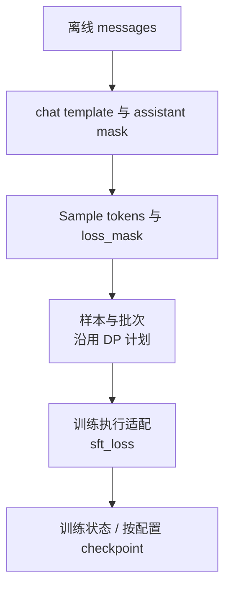
```mermaid
flowchart TB
    Messages["离线 messages"] --> Mask["chat template 与 assistant mask"]
    Mask --> Samples["Sample tokens 与 loss_mask"]
    Samples --> Batch["样本与批次<br/>沿用 DP 计划"]
    Batch --> Train["训练执行适配<br/>sft_loss"]
    Train --> Save["训练状态 / 按配置 checkpoint"]
```

输出是训练状态和可选 checkpoint，权重更新调用在 debug-train-only 下直接返回，配置了 eval 也不会执行评测。这里复用了 rollout 接口的“产出 Sample”合同，未要求接口必须进行在线生成。空 assistant 使 response length 为 0 时，SFT hook 的 `loss_mask[-response_length:]` 会保留整段 mask，后续可能触发长度 assert；这个已知边界及 token mask 的完整原理见 [[28_slime_sft_path_and_loss_mask_analysis|SFT 路径与 loss mask]]。

### 5.4 eval-only 与 debug：用可观察边界分离问题

**执行前提与模板。** eval-only 走同步 driver；需要正常模型/资源配置以及 eval dataset。`--num-rollout 0` 使训练循环为空，`--eval-interval` 的非空值启用零轮评测特例。不要将这个参数组合直接套给 async 入口，后者没有相同的零轮评测特例。

```bash
ray job submit --address="http://127.0.0.1:8265" \
  --runtime-env-json='<RUNTIME_ENV_WITH_MEGATRON_PYTHONPATH>' \
  -- python3 train.py <MODEL_CHECKPOINT_RESOURCE_AND_EVAL_DATASET_ARGS> \
  --num-rollout 0 --eval-interval 1
```

```text
train.py::train                                                [迭代控制]
├─ create_placement_groups / create_rollout_manager            [资源与生命周期：serving 照常启动]
├─ create_training_models(args, pgs, manager)                  [资源与生命周期]
│  ├─ create_actor_model(...)
│  │  └─ RayTrainGroup.create(...)
│  │     └─ MegatronTrainRayActor.init                         [训练执行适配]
│  │        └─ initialize_model_and_optimizer(args, role)
│  │           └─ setup_model_and_optimizer(args, role)        [num_rollout==0：置 no_load_optim，返回 model, None, None]
│  └─ [use_critic] 因 num_rollout==0 不创建 critic group
├─ actor_model.update_weights()                                [权重发布：初始发布]
├─ ray.get(manager.eval.remote(rollout_id=0))                  [生成与评测]
│  └─ RolloutManager.eval
│     ├─ [debug_train_only] return
│     ├─ call_rollout_fn(eval_generate_rollout, ..., evaluation=True)
│     ├─ save_debug_rollout_data(..., evaluation=True)          [横切：观测]
│     └─ log_eval_rollout_data(...)                             [横切：观测]
├─ for rollout_id in range(start_rollout_id, 0)                [空循环]
├─ ray.get(manager.dispose.remote())
└─ finish_tracking(args)
```

<!-- Figure spec: eval-only still initializes models and publishes but builds no optimizer or critic, then branches to eval output; debug route is described in prose, not falsely collapsed into eval. -->
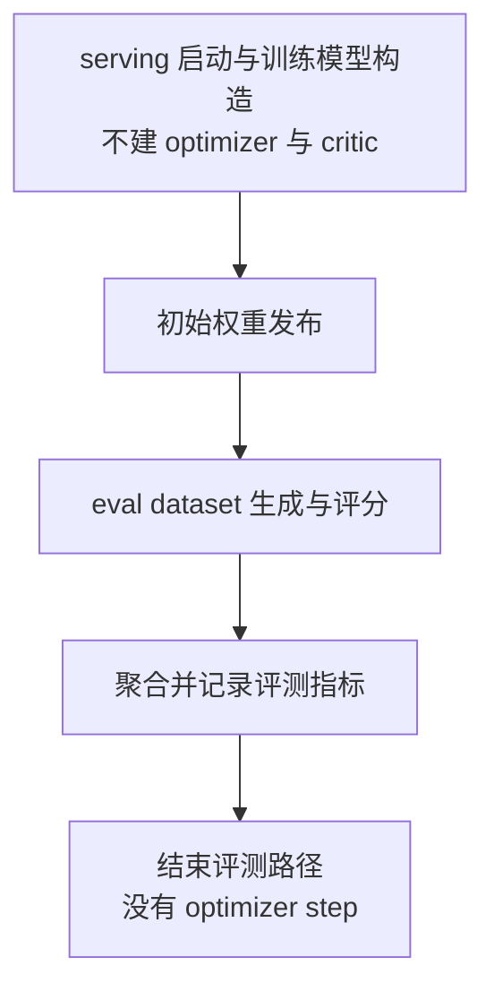
```mermaid
flowchart TB
    Init["serving 启动与训练模型构造<br/>不建 optimizer 与 critic"] --> Publish["初始权重发布"]
    Publish --> Eval["eval dataset 生成与评分"]
    Eval --> Metrics["聚合并记录评测指标"]
    Metrics --> Exit["结束评测路径<br/>没有 optimizer step"]
```

完成边界是评测输出生成并记录，不是产生新策略。eval-only 仍构造训练 actors、加载模型并进行初始权重发布，因此不能估算成只启动 serving 的路径；但它不再构造 optimizer 与 scheduler、不加载优化器状态，PPO 配置下也不创建 critic group，这部分显存与加载时间被省掉。评测失败直接终止 driver，没有部分结果的回收。评测字典字段的真正消费位置、异步队列隔离以及多 dataset 统计约束见 [[27_slime_evaluation_path_analysis|评测路径]]。

debug 场景复用上述模块但选择另一个观察出口：rollout-only 在 Sample dump 后退出数据转换；train-only 可从 dump 重放，观察训练 loss、logprob 和梯度，E2E `tests/test_qwen2.5_0.5B_debug_rollout_then_train.py` 按这两段先后运行。一个出口通过，只证明该段数据与执行合同，不证明另一段已通过。对应参数、工件格式与诊断工具操作归 [[18_slime_fault_tolerance_observability_analysis|容错与可观测性]]。

### 5.5 独立服务入口：Megatron teacher 服务与 rollout buffer

这两个入口不经 `train.py`/`train_async.py` 的主循环启动，因此单独列出启动方式与完成边界；协议与内部机制归各自权威页。

**Megatron teacher 评分服务。** 用 Megatron 的 TP/PP/CP 前向为 OPD 学生提供 teacher logprob，独立占用 GPU。仓内没有配套启动脚本或文档；`main` 复用通用 `parse_args` 并追加 `add_megatron_server_arguments`，模块启动时把仓库根加入 `sys.path`，下列按文件路径运行的模板是据此推出的（分析判断，未做运行期验证）。通用 parser 仍要求 `--rollout-batch-size`（`required=True`），`slime_validate_args` 还要求 `--num-rollout` 与 `--num-epoch` 至少给一个，所以即使服务不跑 rollout 也必须填。

```bash
python3 slime/backends/megatron_utils/server/megatron_server.py \
  <TEACHER_MODEL_CHECKPOINT_AND_PARALLEL_ARGS> \
  --rollout-batch-size <REQUIRED_BY_PARSER> --num-rollout <N_OR_USE_NUM_EPOCH> \
  --actor-num-nodes <NUM_NODES> --actor-num-gpus-per-node <GPUS_PER_NODE> \
  --teacher-port <PORT>
```

```text
slime/backends/megatron_utils/server/megatron_server.py::main  [配置与场景装配]
├─ slime/utils/arguments.py::parse_args(add_custom_arguments=add_megatron_server_arguments)
└─ launch(args)                                                [迭代控制：常驻服务循环]
   ├─ configure_megatron_server_args(args)                     [强制 debug_train_only，冻结全部参数，关闭 KL/OPD/critic]
   ├─ validate_megatron_server_args(args)
   ├─ create_placement_groups(args)                            [资源与生命周期：只预留训练 GPU]
   ├─ SampleManager.options(...).remote(args, pgs["rollout"])  [样本与批次：请求队列]
   ├─ create_training_models(args, pgs, sample_manager, actor_cls=TeacherLogpRayActor)  [训练执行适配]
   ├─ 每个 DP rank：run_megatron_dp_models_loop_worker.remote(...)  [不等待]
   ├─ [megatron_server_warmup] _run_warmup_via_private_http(...)
   ├─ _start_http_server(...)                                  [推理服务适配：/generate、/update_weights_from_disk、/healthz]
   └─ ray.get(futures)                                         [常驻，直到 worker 抛错]
```

服务可用的信号是 warmup 完成、HTTP 线程启动；`launch` 随后阻塞在 worker futures 上，没有正常退出路径。`validate_megatron_server_args` 拒绝可训练参数、非 train-only 与 KL/OPD/critic 配置，`--megatron-server-max-length` 非 0 时拒绝超长请求。请求协议、失败边界与学生侧接口见 [[20_slime_on_policy_distillation_analysis|on-policy 蒸馏]]。

**rollout buffer。** buffer 服务持有 agent 轨迹，由自带 generator 调用训练任务启动的 SGLang router 生成；训练侧 rollout function 轮询 buffer 取有效组。按插件 README，两个进程分别从插件目录启动：

```bash
cd slime_plugins/rollout_buffer && bash rollout_buffer_example.sh
cd slime_plugins/rollout_buffer && python buffer.py
```

```text
train_async.py::train                                          [迭代控制]
└─ manager.generate.remote(rollout_id)                         [首批与每轮提前提交，调度见 5.2]
   └─ RolloutManager.generate
      └─ RolloutManager._get_rollout_data
         └─ call_rollout_fn(slime_plugins/rollout_buffer/rollout_buffer_example.py::generate_rollout, ...)  [生成与评测]
            └─ run(generate_rollout_async(args, rollout_id, data_buffer))
               ├─ [首次调用] start_rollout(rollout_buffer_url, args, metadata)  [POST /start_rollout，buffer 后台运行 generator]
               ├─ [buffer 已够] return data_buffer.get_samples(rollout_batch_size)
               ├─ 重试循环：get_rollout_data(api_base_url)      [轮询 /get_rollout_data 直到够数；异常按重试次数重来]
               ├─ log_raw_info(...)
               ├─ select_rollout_data(...)
               ├─ 每条记录：MultiTurnLossMaskGenerator.get_loss_mask(messages)  [样本与批次]
               ├─ data_buffer.add_samples(sample_results)      [默认 RolloutDataSourceWithBuffer]
               └─ return data_buffer.get_samples(rollout_batch_size)
```

buffer 固定监听 `0.0.0.0:8889`，示例脚本以 `--rollout-buffer-url http://${MASTER_ADDR}:8889` 指向它；`get_rollout_data` 在 buffer 无数据时无限等待，外层重试默认也无限，因此 buffer 或 generator 异常时训练侧表现为挂起而非报错。脚本通过 `ray job submit` 提交的是相对路径 `train_async.py`，从插件目录执行时能否定位到入口取决于 Ray job 的工作目录语义，本页未做运行期验证。buffer 的分组、校验与 generator 契约见 [[19_slime_rollout_backend_extension_analysis|rollout 后端扩展]]。

## 6. 整体认识与下一步阅读

slime 的架构中心是两套原生执行系统之间的后训练合同。场景入口层决定配置，应用编排层决定时序与资源，后训练合同层固定生成身份、reward 和 batch 语义，后端适配层执行训练、控制服务并发布参数。外部 Ray、Megatron 和 SGLang（钉定版本加仓内补丁）使这套合同落到进程、计算和请求上，但它们并不因此变成一种同构 engine。

理解一项新需求时，先判断它改变什么：改变问题、工具、reward 或轨迹，通常落在生成与评测、样本与批次；改变训练信号，落在训练执行适配及 loss；改变 server、并行拓扑或权重格式，则会跨越资源、推理服务适配与权重发布。前两类通常可以利用 hook，后一类需要核验整条后端协议。场景选择上，先决定 driver（同步、异步或独立服务），再决定部署拓扑与发布路径，最后才是 rollout function、custom generate 与 reward 这些合同实现。

代表性闭环中最关键的完成点是：**serving 已可用、可训练数据已收口、所有训练 rank 已结束本轮执行、serving 已完成参数发布**。保存、恢复和评测再沿这些边界定位，而不能仅凭一个函数返回或一个版本号下结论。已知限制包括：driver 没有异常回滚、placement 与 server 健康等待没有上限、多模型只更新第一个可更新模型、平台变体没有统一 owner、PD 旧入口与部分工具和文档已经陈旧。完整的参数配置、数值算法和部署变体继续由下列专题维护。

## Related Pages

- [[02_slime_quickstart_and_configuration_guide]] — 从可用环境、模型与数据配置开始运行闭环，补齐本页命令模板中的参数组与校验时机。
- [[10_slime_end_to_end_iteration_analysis]] — 按真实调用顺序展开同步、异步、offload 与保存/发布的完整时序。
- [[11_slime_ray_control_plane_analysis]] — 深入 GPU 放置、group、manager、server 与重建版本所有权。
- [[16_slime_weight_sync_analysis]] — 分别复刻四类权重转换与传输路径，并标注各接口来自上游还是补丁。
- [[01_posttraining_infra_mechanism_analysis]] — 从 control、data、weight 三平面的跨框架视角理解本页的三条通路。
- [[01_megatron_architecture_analysis]] — 训练执行适配所委托的 Megatron-LM 分层（该页基线比 slime 镜像钉定版本新）。
- [[30_rl_framework_comparison]] — 把 slime 的 Megatron+SGLang 深集成定位与 verl、AReaL、ROLL 对照。
