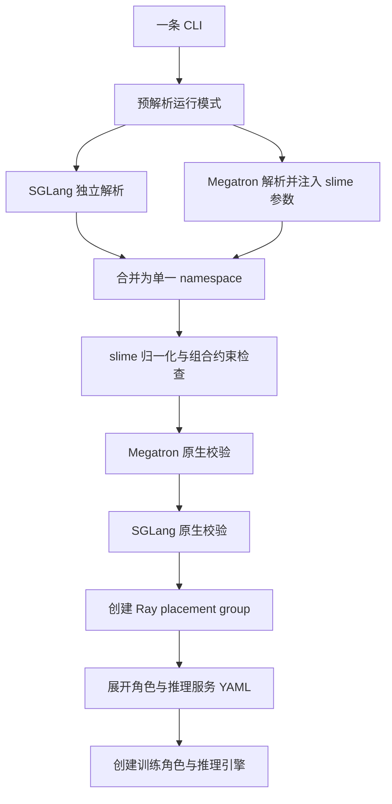

# slime 快速上手与配置指南——把 CLI 看作跨组件配置入口

> **源码基线**：slime `main@681b3adca54105d5ecd3fb822fa0dc58a427e0f9`
> **核验日期**：2026-08-18 · **类型**：Quickstart / Configuration Guide
> **结论先行**：slime 的参数不是彼此独立的“选项表”，而是 Ray、Megatron 与 SGLang 共同使用的一套系统配置。参数首先由三个解析器合并到同一个命名空间，再按资源、模型、批次与生命周期约束进行归一化；但角色 YAML、SGLang 拓扑和 Ray 实际可用资源要到对象创建时才完全展开。因此，CLI 能通过解析，不代表资源一定放得下、各角色一定能初始化、生命周期组合也一定可执行。

本页保留一条最短可运行路径，但重点是说明哪些配置必须成组核对：先确认模型定义、GPU 数量、并行拓扑、批次大小和生命周期彼此一致，再调整单个推理引擎的性能参数。

## 1. 最短可运行路径：先复用官方示例

### 1.1 前置条件

官方快速入门文档建议使用项目镜像，因为其中包含 Megatron、SGLang 依赖与项目所需的临时补丁；示例容器要求暴露全部 GPU、使用宿主机 IPC，并配置较大的共享内存。[`docs/zh/get_started/quick_start.md:5-48`](https://github.com/THUDM/slime/blob/681b3adca54105d5ecd3fb822fa0dc58a427e0f9/docs/zh/get_started/quick_start.md#L5-L48)

Megatron 路径同时需要两类模型文件：HF 目录提供 tokenizer 和 `config.json`，也是 SGLang 默认读取的模型目录；`torch_dist` checkpoint 则供 Megatron 的 actor/reference 加载。官方流程先用 `source` 加载对应的模型参数脚本，再运行 `convert_hf_to_torch_dist.py`。[`slime/backends/megatron_utils/arguments.py:173-180`](https://github.com/THUDM/slime/blob/681b3adca54105d5ecd3fb822fa0dc58a427e0f9/slime/backends/megatron_utils/arguments.py#L173-L180) [`slime/backends/sglang_utils/sglang_config.py:68-77`](https://github.com/THUDM/slime/blob/681b3adca54105d5ecd3fb822fa0dc58a427e0f9/slime/backends/sglang_utils/sglang_config.py#L68-L77) [`docs/zh/get_started/quick_start.md:67-105`](https://github.com/THUDM/slime/blob/681b3adca54105d5ecd3fb822fa0dc58a427e0f9/docs/zh/get_started/quick_start.md#L67-L105) [`docs/zh/get_started/quick_start.md:134-148`](https://github.com/THUDM/slime/blob/681b3adca54105d5ecd3fb822fa0dc58a427e0f9/docs/zh/get_started/quick_start.md#L134-L148)

```bash
# 容器内，下载模型和数据后
cd /root/slime
source scripts/models/glm4-9B.sh
PYTHONPATH=/root/Megatron-LM python tools/convert_hf_to_torch_dist.py \
  "${MODEL_ARGS[@]}" \
  --hf-checkpoint /root/GLM-Z1-9B-0414 \
  --save /root/GLM-Z1-9B-0414_torch_dist

# 修改 scripts/run-glm4-9B.sh 中的 model、checkpoint、train/eval data 路径
bash scripts/run-glm4-9B.sh
```

这份示例的运行前提可以直接从脚本读出：它加载 40 层 GLM 的模型参数，给 actor 和 rollout 各配置 4 张 GPU，再通过 Ray 作业调用 `train.py`；每轮使用 `32` 个 prompt、每个 prompt 生成 `8` 个 response，正好与 `global_batch_size=256` 对齐。[`scripts/models/glm4-9B.sh:1-23`](https://github.com/THUDM/slime/blob/681b3adca54105d5ecd3fb822fa0dc58a427e0f9/scripts/models/glm4-9B.sh#L1-L23) [`scripts/run-glm4-9B.sh:29-54`](https://github.com/THUDM/slime/blob/681b3adca54105d5ecd3fb822fa0dc58a427e0f9/scripts/run-glm4-9B.sh#L29-L54) [`scripts/run-glm4-9B.sh:122-150`](https://github.com/THUDM/slime/blob/681b3adca54105d5ecd3fb822fa0dc58a427e0f9/scripts/run-glm4-9B.sh#L122-L150)

> [!warning] 不要在共享开发机上盲跑示例脚本
> `run-glm4-9B.sh` 开头会强制停止 SGLang、Ray 和 Python 进程；先复制脚本并删除不属于你的清理命令。[`scripts/run-glm4-9B.sh:1-13`](https://github.com/THUDM/slime/blob/681b3adca54105d5ecd3fb822fa0dc58a427e0f9/scripts/run-glm4-9B.sh#L1-L13)

### 1.2 首次启动只需确认六组配置

| 配置类别 | 首次运行需要确认什么 | 官方示例中的配置 |
|---|---|---|
| 模型与架构 | `MODEL_ARGS` 与 HF `config.json` 是否描述同一模型 | `scripts/models/glm4-9B.sh` |
| 模型与检查点目录 | `hf_checkpoint`、`ref_load`、`load`、`save` 分别指向哪里 | HF 模型目录 + `torch_dist` 检查点目录 |
| 数据与奖励 | prompt 文件、输入/标签字段、对话模板和奖励函数 | DAPO math JSONL + `deepscaler` |
| GPU 资源 | actor 和 rollout 各用多少张卡，是否共置 | 各 4 张卡，分离部署 |
| 并行配置 | Megatron TP/PP/CP/EP，以及 SGLang 单个引擎的 GPU 数 | 训练 TP=2、CP=2；每个推理引擎 2 张卡 |
| 批次大小 | prompt 数、每个 prompt 的采样数与全局批次大小能否对齐 | `32 × 8 = 256` |

这些组在官方脚本中分别存在，而不是一个“大配置块”；这正是排错时应保留的边界。[`scripts/run-glm4-9B.sh:26-120`](https://github.com/THUDM/slime/blob/681b3adca54105d5ecd3fb822fa0dc58a427e0f9/scripts/run-glm4-9B.sh#L26-L120)

## 2. 参数解析不是终点：配置还要经过两阶段组装



### 2.1 第一阶段：把三个命名空间合并

`parse_args()` 先预读 `train_backend` 和三个 debug/replay 开关，由此决定是否跳过 SGLang；随后 SGLang 用独立 parser 的 `parse_known_args()` 收集 serving 参数，Megatron 再以 slime 的 extra-args provider 解析其原生参数和 slime 参数，最后把三个 namespace 合并。[`slime/utils/arguments.py:1584-1634`](https://github.com/THUDM/slime/blob/681b3adca54105d5ecd3fb822fa0dc58a427e0f9/slime/utils/arguments.py#L1584-L1634)

合并后依次调用 slime、Megatron、SGLang 校验；Megatron 的 HF 配置一致性检查甚至发生在 namespace 合并完成之前，而原生 Megatron `validate_args` 在 slime 归一化之后执行。[`slime/utils/arguments.py:1635-1643`](https://github.com/THUDM/slime/blob/681b3adca54105d5ecd3fb822fa0dc58a427e0f9/slime/utils/arguments.py#L1635-L1643) [`slime/backends/megatron_utils/arguments.py:187-202`](https://github.com/THUDM/slime/blob/681b3adca54105d5ecd3fb822fa0dc58a427e0f9/slime/backends/megatron_utils/arguments.py#L187-L202)

> **设计分析**：这里先完成跨组件参数归一化，再由各引擎检查自身约束，而不是由 slime 重写 Megatron 和 SGLang 的全部校验逻辑。这样可以直接使用底层引擎的新能力，代价是配置错误可能在不同阶段才暴露。

### 2.2 第二阶段：对象创建时才知道最终拓扑

`train.py` 在解析完成后依次创建 placement group、rollout manager、actor/critic；SGLang YAML 在 rollout server 创建时才读取，Megatron role YAML 在 actor/critic 创建前才应用。[`train.py:9-27`](https://github.com/THUDM/slime/blob/681b3adca54105d5ecd3fb822fa0dc58a427e0f9/train.py#L9-L27) [`slime/ray/rollout.py:1146-1164`](https://github.com/THUDM/slime/blob/681b3adca54105d5ecd3fb822fa0dc58a427e0f9/slime/ray/rollout.py#L1146-L1164) [`slime/ray/placement_group.py:163-208`](https://github.com/THUDM/slime/blob/681b3adca54105d5ecd3fb822fa0dc58a427e0f9/slime/ray/placement_group.py#L163-L208)

因此，完整配置不是 `argparse.Namespace` 本身，而是：

```text
公共 CLI
  + slime 派生默认值
  + Megatron actor 或 critic role override
  + SGLang model 或 server-group override
  + Ray 集群当下可提供的物理资源
```

## 3. 按相互依赖关系检查配置，而不是只看参数前缀

| 检查项 | 必须同时回答的问题 | 主要证据位置 |
|---|---|---|
| 模型一致性 | HF 配置、Megatron 结构参数、tokenizer 与 checkpoint 是否描述同一个模型？ | HF 字段逐项与 Megatron 参数比对，不一致时集中报错。[`slime/backends/megatron_utils/arguments.py:93-144`](https://github.com/THUDM/slime/blob/681b3adca54105d5ecd3fb822fa0dc58a427e0f9/slime/backends/megatron_utils/arguments.py#L93-L144) |
| Ray GPU 容量 | 物理上要申请多少 GPU，actor 与 rollout 使用独立资源还是重叠资源？ | GPU 数量由 actor 卡数、rollout 卡数以及调试、外部服务、共置模式共同决定。[`slime/ray/placement_group.py:100-137`](https://github.com/THUDM/slime/blob/681b3adca54105d5ecd3fb822fa0dc58a427e0f9/slime/ray/placement_group.py#L100-L137) |
| Megatron 并行拓扑 | 分给训练器的 GPU 如何划分 TP/PP/CP/EP，模型字段是否匹配？ | 参数解析器先把 `world_size` 设为 actor 总卡数，再调用 Megatron 原生校验器。[`slime/backends/megatron_utils/arguments.py:187-202`](https://github.com/THUDM/slime/blob/681b3adca54105d5ecd3fb822fa0dc58a427e0f9/slime/backends/megatron_utils/arguments.py#L187-L202) |
| SGLang 推理拓扑 | rollout GPU 如何分给不同引擎，以及如何设置 PP/TP、模型和服务组？ | PP 必须整除单个引擎的 GPU 数；有效 TP 由二者推导得到。[`slime/backends/sglang_utils/arguments.py:144-170`](https://github.com/THUDM/slime/blob/681b3adca54105d5ecd3fb822fa0dc58a427e0f9/slime/backends/sglang_utils/arguments.py#L144-L170) |
| 数据量与批次大小 | 一轮 rollout 产生多少逻辑样本，足够执行多少个优化器步骤？ | CLI 中的 rollout batch 表示 prompt 数，global batch 表示训练样本数。[`slime/utils/arguments.py:689-717`](https://github.com/THUDM/slime/blob/681b3adca54105d5ecd3fb822fa0dc58a427e0f9/slime/utils/arguments.py#L689-L717) |
| 运行生命周期 | 是否在同一批 GPU 上分时运行，是否使用外部服务、异步训练、释放训练进程或数据回放？ | 这些模式会改变是否启动推理引擎、是否卸载显存，以及使用哪种权重传输方式。[`slime/utils/arguments.py:1889-1958`](https://github.com/THUDM/slime/blob/681b3adca54105d5ecd3fb822fa0dc58a427e0f9/slime/utils/arguments.py#L1889-L1958) |

参数前缀只能说明它由哪个组件解析，依赖关系才说明它必须与哪些参数保持一致。例如 `rollout_num_gpus_per_engine` 是 slime/Ray 侧参数，却同时决定 SGLang 的默认 TP；`colocate` 看似只是资源开关，却会强制改变显存卸载流程。[`slime/utils/arguments.py:44-99`](https://github.com/THUDM/slime/blob/681b3adca54105d5ecd3fb822fa0dc58a427e0f9/slime/utils/arguments.py#L44-L99)

## 4. 四组最容易装错的耦合关系

### 4.1 资源容量不等于模型并行

令 actor 总卡数为

$$
A=N_{\mathrm{actor}}G_{\mathrm{actor}},
$$

rollout 总卡数为 $R$。本地分离部署申请 $A+R$ 个 Ray bundles；colocate 申请 $\max(A,R)$，并让 rollout 从相同 bundle 起点取卡。[`slime/ray/placement_group.py:100-128`](https://github.com/THUDM/slime/blob/681b3adca54105d5ecd3fb822fa0dc58a427e0f9/slime/ray/placement_group.py#L100-L128)

- `rollout_num_gpus` 的 parser 默认值是 `None`；只有 colocate 且未显式设置时，slime 才把它派生为 $A$。[`slime/utils/arguments.py:44-53`](https://github.com/THUDM/slime/blob/681b3adca54105d5ecd3fb822fa0dc58a427e0f9/slime/utils/arguments.py#L44-L53) [`slime/utils/arguments.py:1931-1946`](https://github.com/THUDM/slime/blob/681b3adca54105d5ecd3fb822fa0dc58a427e0f9/slime/utils/arguments.py#L1931-L1946)
- `--rollout-num-gpus 0` 不是“自动选择”，而是只保留 router、不启动本地 engine；代码为它生成空 server group 配置。[`slime/ray/rollout.py:1274-1298`](https://github.com/THUDM/slime/blob/681b3adca54105d5ecd3fb822fa0dc58a427e0f9/slime/ray/rollout.py#L1274-L1298)
- colocate 默认把 train 与 rollout offload 都打开；`release_train` 则关闭 train offload、保留 rollout offload。[`slime/utils/arguments.py:1929-1951`](https://github.com/THUDM/slime/blob/681b3adca54105d5ecd3fb822fa0dc58a427e0f9/slime/utils/arguments.py#L1929-L1951)
- `train_async.py` 直到进入 `train()` 才断言禁止 colocate，因此这组 CLI 可以完成解析与前置校验，随后才失败。[`train_async.py:9-20`](https://github.com/THUDM/slime/blob/681b3adca54105d5ecd3fb822fa0dc58a427e0f9/train_async.py#L9-L20)

> **设计分析**：非共置模式应把 `rollout_num_gpus` 当作必填项，尽管 argparse 没有设置 `required=True`。否则资源计算最终会执行 `A + None`；这是“参数解析成功、系统组装失败”的最小例子。

若 Ray 集群实际 GPU 不足，placement group 会一直等待，但每 30 秒记录已注册和可用的 GPU 数；“一直卡住”可能只是资源需求无法满足，不一定是代码死锁。[`slime/ray/placement_group.py:42-67`](https://github.com/THUDM/slime/blob/681b3adca54105d5ecd3fb822fa0dc58a427e0f9/slime/ray/placement_group.py#L42-L67)

### 4.2 HF、Megatron checkpoint 与默认值必须同源

Megatron parser 会从 `hf_checkpoint` 读取 `AutoConfig`，逐项检查 hidden size、层数、head、FFN、embedding tie、norm 与 RoPE 等字段；同时把 trainer `world_size` 固定为 actor 总卡数。[`slime/backends/megatron_utils/arguments.py:93-144`](https://github.com/THUDM/slime/blob/681b3adca54105d5ecd3fb822fa0dc58a427e0f9/slime/backends/megatron_utils/arguments.py#L93-L144) [`slime/backends/megatron_utils/arguments.py:187-202`](https://github.com/THUDM/slime/blob/681b3adca54105d5ecd3fb822fa0dc58a427e0f9/slime/backends/megatron_utils/arguments.py#L187-L202)

slime 还会把未指定的 tokenizer 回退到 `hf_checkpoint`，默认启用 distributed optimizer，并在未给 `seq_length` 时填 `4096`。[`slime/backends/megatron_utils/arguments.py:147-180`](https://github.com/THUDM/slime/blob/681b3adca54105d5ecd3fb822fa0dc58a427e0f9/slime/backends/megatron_utils/arguments.py#L147-L180) 如果 `load` 不是可恢复的 Megatron checkpoint，slime 会进入 finetune 路径、禁用 optimizer/RNG 恢复，并在不能直接加载 HF 时回退到 `ref_load`。[`slime/utils/arguments.py:1812-1833`](https://github.com/THUDM/slime/blob/681b3adca54105d5ecd3fb822fa0dc58a427e0f9/slime/utils/arguments.py#L1812-L1833)

> **设计分析**：`hf_checkpoint` 不只是 tokenizer 所在目录，也是训练侧与推理侧共同采用的模型定义基准。只替换 HF 目录、却继续使用旧的 `MODEL_ARGS` 或 `torch_dist`，会让同一个模型出现三份互不一致的描述。

### 4.3 批次参数必须满足产出与消耗的数量关系

普通非 fanout rollout 的目标关系是

$$
B_{\mathrm{rollout}}n_{\mathrm{sample/prompt}}
=B_{\mathrm{global}}N_{\mathrm{step/rollout}}.
$$

项目 quickstart 明确区分 optimizer step 与 train-to-inference weight sync，并给出上述产出—消耗关系。[`docs/zh/get_started/quick_start.md:151-172`](https://github.com/THUDM/slime/blob/681b3adca54105d5ecd3fb822fa0dc58a427e0f9/docs/zh/get_started/quick_start.md#L151-L172) 实现中只要设置 `num_steps_per_rollout`，就用整数除法派生 `global_batch_size`，若用户同时给了 global batch 则要求两者相等。[`slime/utils/arguments.py:1963-1971`](https://github.com/THUDM/slime/blob/681b3adca54105d5ecd3fb822fa0dc58a427e0f9/slime/utils/arguments.py#L1963-L1971)

算法也会改装配：默认 `advantage_estimator=grpo`，选择 `ppo` 才派生 `use_critic=True`，critic 卡数强制继承 actor；当每 prompt 只有一个 sample 时，GRPO 标准差归一化被自动关闭。[`slime/utils/arguments.py:941-955`](https://github.com/THUDM/slime/blob/681b3adca54105d5ecd3fb822fa0dc58a427e0f9/slime/utils/arguments.py#L941-L955) [`slime/utils/arguments.py:1901-1904`](https://github.com/THUDM/slime/blob/681b3adca54105d5ecd3fb822fa0dc58a427e0f9/slime/utils/arguments.py#L1901-L1904) [`slime/utils/arguments.py:1973-1975`](https://github.com/THUDM/slime/blob/681b3adca54105d5ecd3fb822fa0dc58a427e0f9/slime/utils/arguments.py#L1973-L1975)

动态 micro-batch 不是独立布尔开关：开启后必须提供 `max_tokens_per_gpu`，而 CP 下其语义接近 response length 除以 CP size。[`slime/utils/arguments.py:747-765`](https://github.com/THUDM/slime/blob/681b3adca54105d5ecd3fb822fa0dc58a427e0f9/slime/utils/arguments.py#L747-L765) [`slime/utils/arguments.py:1862-1869`](https://github.com/THUDM/slime/blob/681b3adca54105d5ecd3fb822fa0dc58a427e0f9/slime/utils/arguments.py#L1862-L1869)

### 4.4 生命周期开关必须形成可执行组合

`load_debug_rollout_data` 在预解析阶段就会让 SGLang parser 被跳过，并在归一化时强制 `debug_train_only=True`；`debug_rollout_only` 与 `debug_train_only` 互斥。[`slime/utils/arguments.py:1604-1613`](https://github.com/THUDM/slime/blob/681b3adca54105d5ecd3fb822fa0dc58a427e0f9/slime/utils/arguments.py#L1604-L1613) [`slime/utils/arguments.py:1889-1927`](https://github.com/THUDM/slime/blob/681b3adca54105d5ecd3fb822fa0dc58a427e0f9/slime/utils/arguments.py#L1889-L1927)

权重同步也有组合约束：磁盘传输需要共享目录；release-train 只支持 Megatron，不能同时使用 critic 或 old actor，并且要求配置保存目录、全量模式和磁盘传输；增量模式只支持磁盘传输、禁止共置，还要求 rollout 主机上存在本地 checkpoint 目录。[`slime/utils/arguments.py:2032-2067`](https://github.com/THUDM/slime/blob/681b3adca54105d5ecd3fb822fa0dc58a427e0f9/slime/utils/arguments.py#L2032-L2067)

## 5. 两种 YAML 只做有范围限制的延迟配置，不是另一套总配置

### 5.1 Megatron role YAML：只覆盖角色差异

`--megatron-config-path` 对公共 args 做 deepcopy，再应用 actor/critic overrides；`num_nodes` 与 `num_gpus_per_node` 被忽略，未知 key 只告警后仍写入，critic 还会强制关闭 actor-only 的 KL、OPD 和 custom advantage 行为。[`slime/utils/arguments.py:1646-1678`](https://github.com/THUDM/slime/blob/681b3adca54105d5ecd3fb822fa0dc58a427e0f9/slime/utils/arguments.py#L1646-L1678)

每个 role 最多一个条目，缺失 role 继承公共 args；但这些 override 是在 placement group 建好、全局 Megatron 校验结束后才应用。[`slime/utils/arguments.py:1681-1721`](https://github.com/THUDM/slime/blob/681b3adca54105d5ecd3fb822fa0dc58a427e0f9/slime/utils/arguments.py#L1681-L1721) [`slime/ray/placement_group.py:120-137`](https://github.com/THUDM/slime/blob/681b3adca54105d5ecd3fb822fa0dc58a427e0f9/slime/ray/placement_group.py#L120-L137) [`slime/ray/placement_group.py:163-208`](https://github.com/THUDM/slime/blob/681b3adca54105d5ecd3fb822fa0dc58a427e0f9/slime/ray/placement_group.py#L163-L208)

官方文档因此要求 actor/critic 保持相同 Megatron 并行拓扑，并警告不同拓扑可能在初始化或训练时失败；推荐 YAML 只放 lr、load/save 与 optimizer/scheduler 差异。[`docs/zh/advanced/megatron-config.md:111-118`](https://github.com/THUDM/slime/blob/681b3adca54105d5ecd3fb822fa0dc58a427e0f9/docs/zh/advanced/megatron-config.md#L111-L118)

> **设计分析**：role YAML 的正确心智模型是“角色参数补丁”，不是“第二个 Megatron launcher”。把 TP/PP/CP/EP 放进去，可能绕过公共阶段已经完成的拓扑校验。

### 5.2 SGLang YAML：只展开推理服务拓扑

SGLang YAML 允许多个 model，每个 model 有自己的 server groups；组内 `num_gpus_per_engine` 和 `model_path` 按 group → model → CLI 回退，`update_weights` 默认按有效 model path 是否等于 `hf_checkpoint` 推断。[`slime/backends/sglang_utils/sglang_config.py:44-112`](https://github.com/THUDM/slime/blob/681b3adca54105d5ecd3fb822fa0dc58a427e0f9/slime/backends/sglang_utils/sglang_config.py#L44-L112)

YAML 顶层结构、worker type 和正 GPU 数在加载时检查；所有 model/group 的 GPU 总数必须等于 `rollout_num_gpus`，但这条总量校验直到 rollout manager 创建 server 时才发生。[`slime/backends/sglang_utils/sglang_config.py:115-180`](https://github.com/THUDM/slime/blob/681b3adca54105d5ecd3fb822fa0dc58a427e0f9/slime/backends/sglang_utils/sglang_config.py#L115-L180) [`slime/ray/rollout.py:1274-1282`](https://github.com/THUDM/slime/blob/681b3adca54105d5ecd3fb822fa0dc58a427e0f9/slime/ray/rollout.py#L1274-L1282)

server group 真正映射到 reordered GPU ids 时还有一次边界检查，错误消息会报告 offset、engine size、engine 数与可用 slots。[`slime/ray/rollout.py:200-217`](https://github.com/THUDM/slime/blob/681b3adca54105d5ecd3fb822fa0dc58a427e0f9/slime/ray/rollout.py#L200-L217) [`slime/ray/rollout_validation.py:1-32`](https://github.com/THUDM/slime/blob/681b3adca54105d5ecd3fb822fa0dc58a427e0f9/slime/ray/rollout_validation.py#L1-L32)

> **设计分析**：SGLang YAML 描述“rollout GPU 内部如何长成服务”，Ray CLI 描述“先向集群拿多少卡”。两者必须对账，不能相互替代。

### 5.3 `custom_config_path`：留给插件私有参数

`custom_config_path` 的 help 将其定义为 custom function arguments；实现却会在 slime 校验函数靠后位置把 YAML 的任意 key 写回 args，已有 key 也允许覆盖。[`slime/utils/arguments.py:1570-1576`](https://github.com/THUDM/slime/blob/681b3adca54105d5ecd3fb822fa0dc58a427e0f9/slime/utils/arguments.py#L1570-L1576) [`slime/utils/arguments.py:2005-2011`](https://github.com/THUDM/slime/blob/681b3adca54105d5ecd3fb822fa0dc58a427e0f9/slime/utils/arguments.py#L2005-L2011)

> **设计分析**：应只在这里放插件私有 key。若用它覆盖前面已经通过 slime 校验的核心字段，同一次 `slime_validate_args` 不会从头重跑；后续虽还有 native validators，也不能补回所有 slime 组合检查。

## 6. 为什么仍然保留一个扁平 namespace

SGLang adapter 直接调用当前安装版本的 `ServerArgs.add_cli_args`，自动给未被 slime 接管的 flag 和 dest 添加 `sglang_` 前缀；模型路径、TP、端口、分布式地址等由 slime 负责装配的字段则被显式排除。[`slime/backends/sglang_utils/arguments.py:38-118`](https://github.com/THUDM/slime/blob/681b3adca54105d5ecd3fb822fa0dc58a427e0f9/slime/backends/sglang_utils/arguments.py#L38-L118) Megatron 侧同样使用原生 parser，并通过 extra-args provider 注入 slime 参数，而不是复制一份 Megatron schema。[`slime/backends/megatron_utils/arguments.py:187-202`](https://github.com/THUDM/slime/blob/681b3adca54105d5ecd3fb822fa0dc58a427e0f9/slime/backends/megatron_utils/arguments.py#L187-L202)

> **设计分析**：保留扁平命名空间，是为了尽量直接暴露底层引擎的能力。若 slime 另建一个只包含公共功能的统一配置对象，新加入的 SGLang kernel/cache 选项和 Megatron optimizer/parallel 参数都要等框架逐项适配；当前做法可以直接转发原生选项，同时在同一份参数中表达跨引擎依赖。代价是命名空间更宽、CLI 会受到版本差异影响，而且两个主解析器都允许未知参数继续通过，因此拼写错误未必会在参数解析阶段被拒绝。[`slime/utils/arguments.py:1609-1624`](https://github.com/THUDM/slime/blob/681b3adca54105d5ecd3fb822fa0dc58a427e0f9/slime/utils/arguments.py#L1609-L1624) [`slime/backends/sglang_utils/arguments.py:189-212`](https://github.com/THUDM/slime/blob/681b3adca54105d5ecd3fb822fa0dc58a427e0f9/slime/backends/sglang_utils/arguments.py#L189-L212)

因此新增 native 调优项时，优先使用原生 flag：Megatron flag 直接写，SGLang ServerArgs flag 加 `--sglang-` 前缀。只有资源归属、跨引擎生命周期或角色差异才应进入 slime CLI/YAML。

## 7. 失败发生在哪一层

| 现象 | 最可能的不一致 | 检查顺序 |
|---|---|---|
| CLI 运行后仍像使用默认值 | flag 拼错但被 `parse_known_args` / `ignore_unknown_args` 放过 | 对照启动日志中的最终 args，再查参数属于 Megatron、slime 还是 `--sglang-*` |
| `hf_validate_args failed` | HF config 与 `MODEL_ARGS` 不是同一模型 | 比对 layer/head/FFN/RoPE/embedding tie |
| Ray 一直等 placement group | $A+R$ 或 $\max(A,R)$ 超过已注册/可用 GPU | 看每 30 秒的 registered 与 available 数 |
| PP/TP divisibility assert | 每 engine 卡数不能被 SGLang PP 整除 | 先定 PP，再令 effective TP 等于每 engine 卡数除以 PP |
| `sglang_config total GPUs` assert | YAML group 总数与 `rollout_num_gpus` 不一致 | 先算 YAML 总量，再对 CLI |
| engine 创建时报 GPU placement | group offset、engine size 和可用 rollout slots 不一致 | 按错误消息逐项核对 group 展开结果 |
| async 一启动就 assert | `train_async.py` 与 colocate 生命周期冲突 | 改成资源分离，或回到同步 `train.py` |
| actor/critic 初始化或训练失败 | role YAML 改了公共并行拓扑 | 把 TP/PP/CP/EP 移回 CLI，只保留角色差异 |

前六类失败分别对应本页已核验的 parser、HF validator、Ray wait、SGLang validator、YAML total check 和 placement check；最后两类由 async 入口断言与官方 role-config 限制直接给出。[`slime/backends/megatron_utils/arguments.py:93-144`](https://github.com/THUDM/slime/blob/681b3adca54105d5ecd3fb822fa0dc58a427e0f9/slime/backends/megatron_utils/arguments.py#L93-L144) [`slime/ray/placement_group.py:42-67`](https://github.com/THUDM/slime/blob/681b3adca54105d5ecd3fb822fa0dc58a427e0f9/slime/ray/placement_group.py#L42-L67) [`slime/backends/sglang_utils/arguments.py:159-170`](https://github.com/THUDM/slime/blob/681b3adca54105d5ecd3fb822fa0dc58a427e0f9/slime/backends/sglang_utils/arguments.py#L159-L170) [`slime/ray/rollout.py:1274-1282`](https://github.com/THUDM/slime/blob/681b3adca54105d5ecd3fb822fa0dc58a427e0f9/slime/ray/rollout.py#L1274-L1282) [`train_async.py:9-20`](https://github.com/THUDM/slime/blob/681b3adca54105d5ecd3fb822fa0dc58a427e0f9/train_async.py#L9-L20) [`docs/zh/advanced/megatron-config.md:111-118`](https://github.com/THUDM/slime/blob/681b3adca54105d5ecd3fb822fa0dc58a427e0f9/docs/zh/advanced/megatron-config.md#L111-L118)

## 8. 提交作业前的配置检查

1. 固定 HF model、Megatron `torch_dist`、MODEL_ARGS 三者的同源版本。
2. 写出 $A$ 与 $R$；分离模式确认集群至少有 $A+R$ 张可用卡，colocate 确认至少有 $\max(A,R)$ 张。
3. 用 actor 总卡数验证 Megatron TP/PP/CP/EP；独立用每 engine 卡数验证 SGLang PP/TP。
4. 验证普通 rollout 的批次数量关系；带扇出或 agent 轨迹的数据改按逻辑 rollout id 检查，细节交给 [[12_slime_sample_datasource_analysis]]。
5. 只选一种 serving 生命周期：内部默认、SGLang YAML、external engines；`sglang_config`、external 和 legacy prefill 配置有互斥断言。[`slime/backends/sglang_utils/arguments.py:175-186`](https://github.com/THUDM/slime/blob/681b3adca54105d5ecd3fb822fa0dc58a427e0f9/slime/backends/sglang_utils/arguments.py#L175-L186)
6. role YAML 只放角色差异；custom config 只放插件私有 key。
7. 首次运行先缩短 `num_rollout`、response length 并减小数据规模，但不要改变并行拓扑和生命周期组合；这样冒烟测试覆盖的仍是最终系统形态。

## Related Pages

- [[01_slime_architecture_overview_analysis]] — 解释为何 slime 保留 Megatron 与 SGLang 的原生能力，而只做薄编排。
- [[10_slime_end_to_end_iteration_analysis]] — 配置装配完成后，同步与异步 iteration 如何移动权重版本边界。
- [[11_slime_ray_control_plane_analysis]] — 深入 placement group、actor group、rollout manager 与 engine 的资源所有权。
- [[12_slime_sample_datasource_analysis]] — 批次数量约束遇到部分 rollout、扇出与工具 token 后如何保持样本标识和训练语义。
- [[16_slime_weight_sync_analysis]] — 共置、NCCL、磁盘、增量更新与 release-train 为什么必须按生命周期成组配置。
- [[02_engineering/04_posttrain_frameworks/slime/index|slime 系列索引]] — 返回整个后训练框架分析系列的阅读地图。
