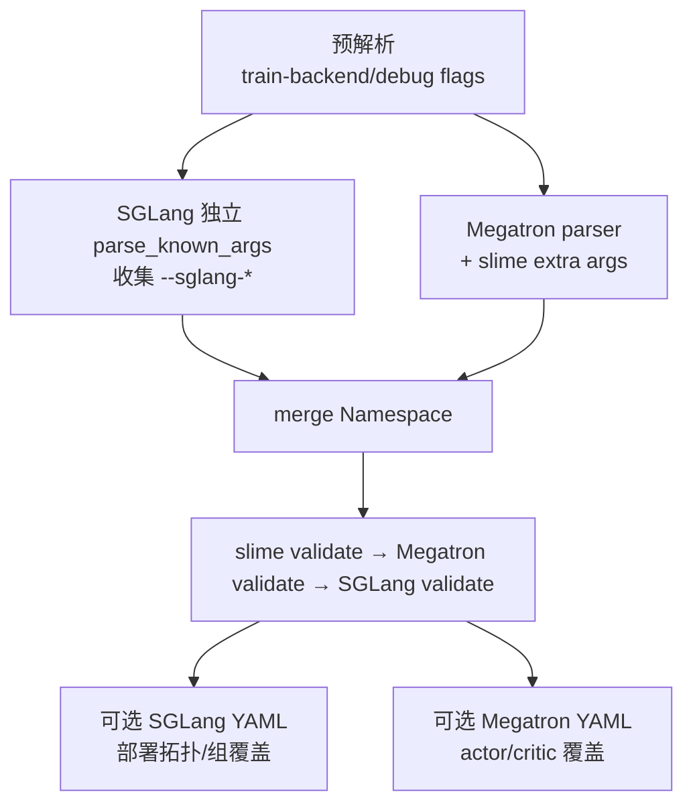

# slime 快速上手与配置实现指南

> **源码基线**：slime `main@681b3adca54105d5ecd3fb822fa0dc58a427e0f9`
> **核验日期**：2026-08-14 · **系列**：[[slime/index]]
> **结论先行**：slime 的“配置文件”不是单一 YAML，而是四层叠加：Megatron 原生 CLI 是公共基线，slime CLI 加 RL/资源语义，`--sglang-*` 由当前 SGLang 版本独立解析，两个可选 YAML 分别覆盖 SGLang 部署拓扑和 actor/critic 角色差异。理解这四层，才不会把 GPU placement、模型并行和 serving topology 混成一组参数。

## 1. 最小启动链

官方建议使用预装 Megatron/SGLang 及临时 patch 的 Docker 镜像；Megatron 路径通常还要先把 HF 权重转换成 `torch_dist` checkpoint。[`quick_start.md:5-48`](https://github.com/THUDM/slime/blob/681b3adca54105d5ecd3fb822fa0dc58a427e0f9/docs/zh/get_started/quick_start.md#L5-L48) [`quick_start.md:67-105`](https://github.com/THUDM/slime/blob/681b3adca54105d5ecd3fb822fa0dc58a427e0f9/docs/zh/get_started/quick_start.md#L67-L105)

```text
HF model/config/tokenizer
  ├─ hf-checkpoint ──────────────> SGLang 初始化 + tokenizer/config
  └─ convert_hf_to_torch_dist ──> ref-load / load ──> Megatron actor

python train.py ...        # 同步闭环
python train_async.py ...  # 一拍异步、训推分离
```

`train.py` 和 `train_async.py` 的 `__main__` 都只做 `parse_args()` 后进入主循环；所有运行模式都在同一参数对象上闭合。[`train.py:97-99`](https://github.com/THUDM/slime/blob/681b3adca54105d5ecd3fb822fa0dc58a427e0f9/train.py#L97-L99) [`train_async.py:79-81`](https://github.com/THUDM/slime/blob/681b3adca54105d5ecd3fb822fa0dc58a427e0f9/train_async.py#L79-L81)

## 2. 四层配置怎样合并



解析器先预读 backend/debug flags；需要 serving 时再让 SGLang 独立解析，之后由 Megatron parser 加载全部 Megatron 参数和 slime extra args，合并两个 namespace，最后依次做 slime、Megatron、SGLang 校验。[`arguments.py:1584-1643`](https://github.com/THUDM/slime/blob/681b3adca54105d5ecd3fb822fa0dc58a427e0f9/slime/utils/arguments.py#L1584-L1643)

| 层 | 典型参数 | 控制什么 |
|---|---|---|
| Megatron CLI | `tensor/pipeline/context/expert-model-parallel-size`、optimizer、checkpoint | 训练模型与并行执行 |
| slime CLI | actor/rollout GPU、batch 关系、algorithm、hook、weight sync | RL loop 与跨引擎控制 |
| SGLang CLI | `--sglang-*` | 当前安装版 SGLang 的 server args |
| YAML | `--sglang-config`、`--megatron-config-path` | 复杂 serving topology；actor/critic 差异 |

### 2.1 资源参数不等于并行参数

`actor_num_nodes × actor_num_gpus_per_node` 决定训练资源，`rollout_num_gpus` 决定 serving 资源，`rollout_num_gpus_per_engine` 决定单 engine 占卡数；`colocate` 才把两个集合压到同一 placement group。[`arguments.py:38-99`](https://github.com/THUDM/slime/blob/681b3adca54105d5ecd3fb822fa0dc58a427e0f9/slime/utils/arguments.py#L38-L99) TP/PP/CP/EP 则由 Megatron 参数决定“拿到的训练 GPU 内部怎样切模型”。

### 2.2 SGLang YAML 只管部署拓扑

`--sglang-config` 可定义多个模型、每模型独立 router、异构 server groups、prefill/decode/placeholder 和 per-group overrides；只有 `update_weights: true` 的模型接收训练权重。[`sglang-config.md:17-40`](https://github.com/THUDM/slime/blob/681b3adca54105d5ecd3fb822fa0dc58a427e0f9/docs/zh/advanced/sglang-config.md#L17-L40) 运行时还校验 YAML 总 GPU 数必须等于 `rollout_num_gpus`。[`rollout.py:1274-1298`](https://github.com/THUDM/slime/blob/681b3adca54105d5ecd3fb822fa0dc58a427e0f9/slime/ray/rollout.py#L1274-L1298)

### 2.3 Megatron YAML 只做角色覆盖

actor/critic 都先 deepcopy 公共 args，再应用相应 role 的 overrides；资源字段被忽略，critic 还会强制关闭 KL/OPD/custom advantage 等 actor-only 行为。[`arguments.py:1646-1678`](https://github.com/THUDM/slime/blob/681b3adca54105d5ecd3fb822fa0dc58a427e0f9/slime/utils/arguments.py#L1646-L1678) 每个 role 最多一个条目，缺失 role 继承公共参数。[`arguments.py:1681-1721`](https://github.com/THUDM/slime/blob/681b3adca54105d5ecd3fb822fa0dc58a427e0f9/slime/utils/arguments.py#L1681-L1721)

## 3. 一轮数据量的守恒式

默认 on-policy recipe 的核心约束是：

\[
B_{rollout}\times n_{sample/prompt}
=B_{global}\times N_{step/rollout}.
\]

左边是一次 rollout 产出的 response 数，右边是这一批数据支撑的 optimizer steps 消耗量。官方 quickstart 明确区分 optimizer update 和 training→inference weight sync，两者不是同一个“更新”。[`quick_start.md:151-172`](https://github.com/THUDM/slime/blob/681b3adca54105d5ecd3fb822fa0dc58a427e0f9/docs/zh/get_started/quick_start.md#L151-L172)

对于 compact/agent fanout，这个表面 sample 数不再等于逻辑 rollout 数，因此真正的 step 划分按 `rollout_id`，而不是按扁平 sample 个数；细节见 [[12_slime_sample_datasource_analysis]] 与 [[15_slime_loss_parallelism_analysis]]。

## 4. 从运行目标反推参数组

### 4.1 GRPO/GSPO/CISPO，无 critic

- `advantage_estimator` 选择算法；
- `n_samples_per_prompt > 1` 提供 group baseline；
- reward normalization 默认在 rollout manager 做；
- actor 单独负责 ref logprob（KL 非零时）、advantage 和 policy loss。

### 4.2 PPO，有 critic

- `--use-critic` 创建第二个 `RayTrainGroup`；
- critic 先前向 values、算 returns 并更新 value model，再把 CPU values 传给 actor；
- actor/critic 当前共享 train placement group，角色 YAML 适合覆盖 lr/checkpoint，而不适合拆不同并行拓扑。[`placement_group.py:186-224`](https://github.com/THUDM/slime/blob/681b3adca54105d5ecd3fb822fa0dc58a427e0f9/slime/ray/placement_group.py#L186-L224) [`megatron-config.md:111-118`](https://github.com/THUDM/slime/blob/681b3adca54105d5ecd3fb822fa0dc58a427e0f9/docs/zh/advanced/megatron-config.md#L111-L118)

### 4.3 训推一体与训推分离

| 模式 | 入口 | 关键设置 | 生命周期 |
|---|---|---|---|
| 分离同步 | `train.py` | 默认不 colocate | rollout 后可 offload serving；训练后更新权重 |
| 一体同步 | `train.py` | `--colocate`，隐含 offload | 同卡时分复用，走 tensor/IPC updater |
| 分离一拍异步 | `train_async.py` | 明确禁止 colocate | generate(N+1) 与 train(N) overlap |
| rollout-only | 任一入口 | `--debug-rollout-only` | 不初始化 Megatron |
| train-only replay | 任一入口 | `--load-debug-rollout-data` | 不初始化 SGLang，固定训练输入 |

`train_async.py` 入口直接断言不支持 colocation，因为训练与 rollout 要在时间上并发，不能同时占同一批 GPU。[`train_async.py:9-16`](https://github.com/THUDM/slime/blob/681b3adca54105d5ecd3fb822fa0dc58a427e0f9/train_async.py#L9-L16)

## 5. 扩展入口速查

| 需求 | 参数/接口 | 最小契约 |
|---|---|---|
| 替换整个 rollout | `rollout_function_path` | `(args, rollout_id, data_source, evaluation) -> RolloutFn*Output` |
| 只替换单 sample 生成 | `custom_generate_function_path` | async generate，返回 `Sample` 或 fanout samples |
| 自定义 prompt/buffer | `data_source_path` / `buffer_filter_path` | `get_samples/add_samples/save/load/__len__` |
| 自定义 reward | `custom_rm_path` / `custom_reward_post_process_path` | per-sample RM 或整批 reward 统计 |
| 生成后 hook | `rollout_sample_hook_path` | sync/async，`Sample -> Sample|None` |
| 自定义 advantage/loss/TIS | 对应 `custom_*_function_path` | 写回约定字段或返回 scalar/metrics |
| 自定义 train-data 转换 | `custom_convert_samples_to_train_data_path` | 保留训练侧所需 tokens/mask/ids/metadata |

默认 rollout 的最小 sample 字段是 tokens、response_length、reward、status。[`arguments.py:328-340`](https://github.com/THUDM/slime/blob/681b3adca54105d5ecd3fb822fa0dc58a427e0f9/slime/utils/arguments.py#L328-L340) 但开启 top-p replay、TIS、routing replay 或 compact fanout 后，实际契约更严格，不能只满足这四项；见 [[12_slime_sample_datasource_analysis]]。

## 6. 建议的源码阅读顺序

1. `train.py`：看每轮阶段和 offload/weight update 位置。
2. `ray/placement_group.py`：看资源集合与 actor/critic/rollout 创建。
3. `ray/rollout.py::RolloutManager`：看生成结果如何转成每 DP rank 的 Box。
4. `rollout/sglang_rollout.py` + `utils/types.py::Sample`：看生成语义和 metadata ABI。
5. `backends/megatron_utils/actor.py`：看 ref/teacher/actor/critic 的实际前后向。
6. `loss.py`、`cp_utils.py`、`dp_schedule.py`：看算法和并行不变量。
7. `update_weight/*`：看权重更新不是普通 RPC，而是提交协议。

## Related Pages

- [[slime/index]] — 知识地图
- [[10_slime_end_to_end_iteration_analysis]] — 一轮训练的实际时序
- [[11_slime_ray_control_plane_analysis]] — 参数如何落到 GPU placement 和 actor 生命周期
- [[18_slime_fault_tolerance_observability_analysis]] — rollout-only / train-only replay 的工程用法
