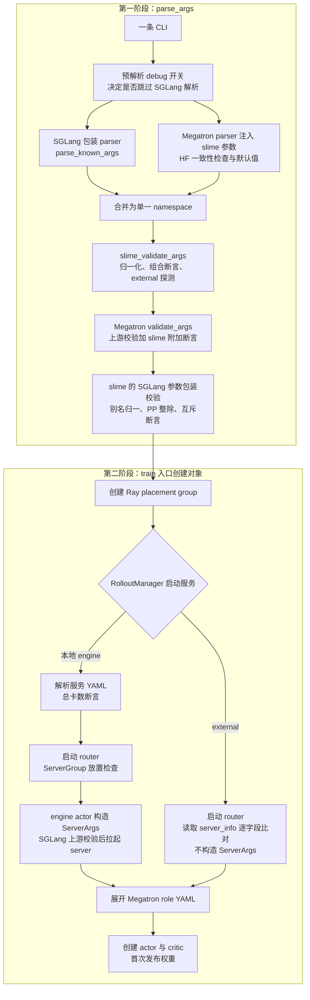

# slime 快速上手与配置指南——把 CLI 看作跨组件配置入口

> **源码基线**：`THUDM/slime@4c193f1f37509cca70f0e88807a9305b70f63f4e`（`main`，2026-09-03）
> **源码基线**：`NVIDIA/Megatron-LM@1dcf0dafa884ad52ffb243625717a3471643e087`（slime `docker/Dockerfile` 钉定，2026-02-14）
> **源码基线**：`sgl-project/sglang@0b3bb0cbe31873994c9f989fddfe2f87ca839fdd`（`v0.5.15.post1`，2026-07-13）
> **主题**：本页先给出官方同步示例、异步 / SFT / eval-only 的命令形态和多节点启动变量，再说明参数的两阶段组装、跨组件依赖检查、角色与服务 YAML 以及扁平命名空间。之后给出指标与 checkpoint 的落点，按启动阶段整理失败定位、结构性校验、flag 边界和官方 FAQ，最后是提交前检查与源码阅读路线。
> **适用范围**：slime CLI、Megatron role YAML 与 SGLang 服务 YAML 的使用方式和校验时机；逐轮时序、资源放置、指标含义与量化机制分别见端到端迭代、Ray 控制面、容错与可观测性、低精度专题页。
> **最近更新**：2026-09-17。本页覆盖同步、异步、SFT、eval-only 与多节点的启动形态，参数组装与校验时机，指标与 checkpoint 落点，以及分阶段的失败定位。

slime 的参数不是彼此独立的“选项表”，而是 Ray、Megatron 与 SGLang 共同使用的一套系统配置。参数首先由三个解析器合并到同一个命名空间，再按资源、模型、批次与生命周期约束进行归一化；但角色 YAML、SGLang 拓扑、SGLang 自身的 `ServerArgs` 校验和 Ray 实际可用资源要到对象创建时才完全展开。因此，CLI 能通过解析，不代表资源一定放得下、各角色一定能初始化、推理服务一定能启动。

本页保留一条最短可运行路径，但重点是说明哪些配置必须成组核对：先确认模型定义、GPU 数量、并行拓扑、批次大小和生命周期彼此一致，再调整单个推理引擎的性能参数。

## 1. 最短可运行路径：先复用官方示例

### 1.1 前置条件

官方快速入门建议使用项目镜像，因为其中包含 Megatron、SGLang 依赖与项目所需的补丁；示例容器以 `--gpus all --ipc=host --shm-size=16g` 启动，即暴露全部 GPU、使用宿主机 IPC 并配置较大的共享内存（`docs/zh/get_started/quick_start.md`「基础环境搭建」）。

Megatron 路径同时需要两类模型文件：HF 目录提供 tokenizer 和 `config.json`，也是 SGLang 默认读取的模型目录；`torch_dist` checkpoint 则供 Megatron 的 actor/reference 加载。官方流程先用 `source` 加载对应的模型参数脚本，再运行 `tools/convert_hf_to_torch_dist.py`。未显式给 tokenizer 时，slime 在 `_set_default_megatron_args` 中回退到 `--hf-checkpoint`；SGLang 侧 `_compute_server_args` 的 `model_path` 与 `ModelConfig.resolve` 的默认模型路径也都取 `--hf-checkpoint`。如果还不熟悉 Megatron 自身的 torchrun 训练闭环和 checkpoint 回读，可先读 [[02_megatron_training_quickstart|Megatron-LM 最小训练]]（该页基线 `85902ef5` 比 slime 镜像钉的 `1dcf0daf` 新）。

```bash
# 容器内，下载模型和数据后
cd /root/slime
source scripts/models/glm4-9B.sh
PYTHONPATH=/root/Megatron-LM python tools/convert_hf_to_torch_dist.py \
  "${MODEL_ARGS[@]}" \
  --hf-checkpoint /root/GLM-Z1-9B-0414 \
  --save /root/GLM-Z1-9B-0414_torch_dist

# 修改 scripts/run-glm4-9B.sh 中的 model、checkpoint、train/eval data 路径
bash scripts/run-glm4-9B.sh
```

这份示例的运行前提可以直接从脚本读出：`scripts/models/glm4-9B.sh` 加载 40 层 GLM 的模型参数，`scripts/run-glm4-9B.sh` 给 actor 和 rollout 各配置 4 张 GPU，再通过 `ray job submit` 调用 `train.py`；每轮使用 `32` 个 prompt、每个 prompt 生成 `8` 个 response，正好与 `--global-batch-size 256` 对齐。

> [!warning] 不要在共享开发机上盲跑示例脚本
> `scripts/run-glm4-9B.sh` 开头会 `pkill -9` SGLang、Ray 和 Python 进程；先复制脚本并删除不属于你的清理命令。

### 1.2 首次启动只需确认六组配置

| 配置类别 | 首次运行需要确认什么 | 官方示例中的配置 |
|---|---|---|
| 模型与架构 | `MODEL_ARGS` 与 HF `config.json` 是否描述同一模型 | `scripts/models/glm4-9B.sh` |
| 模型与检查点目录 | `hf_checkpoint`、`ref_load`、`load`、`save` 分别指向哪里 | HF 模型目录 + `torch_dist` 检查点目录 |
| 数据与奖励 | prompt 文件、输入/标签字段、对话模板和奖励函数 | DAPO math JSONL + `deepscaler` |
| GPU 资源 | actor 和 rollout 各用多少张卡，是否共置 | 各 4 张卡，分离部署 |
| 并行配置 | Megatron TP/PP/CP/EP，以及 SGLang 单个引擎的 GPU 数 | 训练 TP=2、CP=2；每个推理引擎 2 张卡 |
| 批次大小 | prompt 数、每个 prompt 的采样数与全局批次大小能否对齐 | `32 × 8 = 256` |

这些组在官方脚本里是 `CKPT_ARGS`、`ROLLOUT_ARGS`、`PERF_ARGS`、`SGLANG_ARGS` 等分开的数组，而不是一个“大配置块”；这正是排错时应保留的边界。

### 1.3 其他入口的命令形态

同步 RL 之外，仓内还有三种常用入口。它们复用同一套参数解析，差别在 driver 文件和几个生命周期开关：

```bash
# one-stage async：参数不变，只把入口换成 train_async.py
# 来源：docs/zh/examples/qwen3-4B.md「异步训练」；不能带 --colocate
ray job submit --address="http://127.0.0.1:8265" \
   --runtime-env-json="${RUNTIME_ENV_JSON}" \
   -- python3 train_async.py \
   --actor-num-nodes 1 --actor-num-gpus-per-node 4 --rollout-num-gpus 4 \
   --update-weights-interval 1 \
   ${MODEL_ARGS[@]} ${CKPT_ARGS[@]} ${ROLLOUT_ARGS[@]} ${OPTIMIZER_ARGS[@]} \
   ${GRPO_ARGS[@]} ${PERF_ARGS[@]} ${EVAL_ARGS[@]} ${SGLANG_ARGS[@]} ${MISC_ARGS[@]}

# SFT：scripts/run-qwen3-4B-base-sft.sh；不给 rollout GPU
ray job submit --address="http://127.0.0.1:8265" \
   --runtime-env-json="${RUNTIME_ENV_JSON}" \
   -- python3 train_async.py \
   --actor-num-nodes 1 --actor-num-gpus-per-node 8 \
   ${MODEL_ARGS[@]} ${CKPT_ARGS[@]} ${OPTIMIZER_ARGS[@]} ${PERF_ARGS[@]} ${MISC_ARGS[@]} \
   --rollout-function-path slime.rollout.sft_rollout.generate_rollout \
   --prompt-data /root/openhermes2_5.parquet --input-key messages --rollout-shuffle \
   --num-epoch 3 --rollout-batch-size 128 --global-batch-size 128 \
   --loss-type sft_loss --calculate-per-token-loss \
   --disable-compute-advantages-and-returns --debug-train-only

# eval-only：仓内没有 recipe，下面按 train.py::train 的 eval-only 分支改写同步脚本
# 末尾的 --num-rollout 0 覆盖 ROLLOUT_ARGS 里的 --num-rollout 3000；必须保留 --eval-interval
# PERF_ARGS 必须保留：其中的 TP=2、CP=2 与动态批次决定 Megatron 拓扑
ray job submit --address="http://127.0.0.1:8265" \
   --runtime-env-json="${RUNTIME_ENV_JSON}" \
   -- python3 train.py \
   --actor-num-nodes 1 --actor-num-gpus-per-node 4 --rollout-num-gpus 4 \
   ${MODEL_ARGS[@]} ${CKPT_ARGS[@]} ${ROLLOUT_ARGS[@]} ${EVAL_ARGS[@]} \
   ${PERF_ARGS[@]} ${SGLANG_ARGS[@]} ${MISC_ARGS[@]} \
   --num-rollout 0
```

| 入口 | 与同步 `train.py` 的差异 | 深入页 |
|---|---|---|
| one-stage async | `train_async.py::train` 第一行断言 `not args.colocate`，早于 placement group；`--update-weights-interval` 只在这个入口被读取。仓内调用 `train_async.py` 的可运行配置包括：`examples/fully_async/run-qwen2.5-0.5B-fully_async.sh` 与 `examples/fully_async/run-qwen3.5-9B-fully_async.sh`（把 `--rollout-function-path` 换成 `slime.rollout.fully_async_rollout.generate_rollout_fully_async`），`slime_plugins/rollout_buffer/rollout_buffer_example.sh`（换成 rollout buffer 插件的 `generate_rollout`），以及使用默认 rollout 函数的 E2E 测试 `tests/test_qwen3.5_0.8B_gsm8k_async_short.py` | [[10_slime_end_to_end_iteration_analysis|端到端迭代]] |
| SFT | 4 个 SFT recipe（`scripts/run-qwen3-4B-base-sft.sh`、`scripts/run-qwen3-235B-A22B-sft.sh`、`scripts/run-qwen3.5-35B-A3B-sft.sh`、`examples/retool/retool_qwen3_4b_sft.sh`）都是 `python3 train_async.py` 加 `--debug-train-only`。该开关让预解析跳过 SGLang parser，placement group 只申请 actor 卡，`RolloutManager.eval` 直接返回，所以评估是静默空操作。`train.py --debug-train-only` 在源码上也能运行，但不是 recipe 的写法 | [[28_slime_sft_path_and_loss_mask_analysis|SFT 与 loss mask]] |
| eval-only | 只有 `train.py::train` 有 `num_rollout == 0 and eval_interval is not None` 分支：仍创建 actor（`setup_model_and_optimizer` 在 `num_rollout == 0` 时不建 optimizer/scheduler，`create_training_models` 不建 critic），推送一次初始权重后以 `rollout_id=0` 评估一次。模板必须保留 `PERF_ARGS`：少了它，4 卡 actor 会静默退回 Megatron 默认的 TP=1、CP=1，即 DP=4，与目标拓扑不同。`OPTIMIZER_ARGS` 可以省，因为 eval-only 不构造 optimizer 与 scheduler；`GRPO_ARGS` 只影响 advantage 与 loss，eval-only 不训练，省掉还能避免 `--use-kl-loss` 额外加载 ref。`train_async.py::train` 没有这个分支，且会在循环前无条件提交 `generate.remote(start_rollout_id)`（按代码推导）；`--rollout-batch-size` 仍是必填 | [[27_slime_evaluation_path_analysis|评估路径]] |

### 1.4 多节点启动与网络环境变量

官方快速入门的多机流程是：node0 执行 `ray start --head --node-ip-address ${MASTER_ADDR}`，其他节点执行 `ray start --address=${MASTER_ADDR}:6379`，然后只在 node0 提交作业。`scripts/run-glm5.2-744B-A40B.sh` 把这一步脚本化，并给出 32 节点、256 卡、PD 分离 rollout 的完整网络配置：

```bash
# node0；所有节点都能访问同一个 $BASE_DIR，hostfile 每行一个 worker IP
export BASE_DIR=/shared/path
export MASTER_ADDR=<node0-ip>
export HOSTFILE=$BASE_DIR/hostfile
export SOCKET_IFNAME=eth0
bash scripts/run-glm5.2-744B-A40B.sh
```

| 变量或参数 | 脚本中的用法 | 消费方 |
|---|---|---|
| `BASE_DIR`、`MASTER_ADDR` | 未设置时脚本直接 `exit 1`；`MASTER_ADDR` 同时写进 Ray runtime env 与 `no_proxy` / `NO_PROXY` | 启动脚本、Ray |
| `HOSTFILE` | 设置时对每个非 master IP `ssh` 执行 `ray start --address=${MASTER_ADDR}:6379`；未设置时需手动让其他节点加入 Ray 集群 | 启动脚本 |
| `SOCKET_IFNAME` | 默认 `eth0`，同时写入 `GLOO_SOCKET_IFNAME`、`TP_SOCKET_IFNAME`、`NCCL_SOCKET_IFNAME` | Gloo、NCCL（依赖侧） |
| `NCCL_IB_QPS_PER_CONNECTION=2`、`NCCL_IB_TC=160`、`NCCL_IB_TIMEOUT=22`、`NCCL_NET_GDR_LEVEL=2`、`NCCL_P2P_LEVEL=NVL`、`NCCL_NVLS_ENABLE=0`、`NCCL_CUMEM_ENABLE=0` | 通过 `--runtime-env-json` 注入所有 Ray worker | NCCL（依赖侧） |
| `NVSHMEM_DISABLE_NCCL=1` | 同上；示例文档称 DeepEP 需要该设置 | NVSHMEM / DeepEP（依赖侧） |
| `SGLANG_DEEPEP_NUM_MAX_DISPATCH_TOKENS_PER_RANK=64` | 示例文档要求它覆盖最大 decode batch：decode 组 `cuda_graph_max_bs=12` × `speculative_num_draft_tokens=5` = 60，向上取整到 64；低于该值会在 decode 组 CUDA graph capture 时触发 DeepEP low-latency dispatch buffer 断言 | SGLang / DeepEP（依赖侧，文档说明，slime 源码未验证） |
| `MC_IB_PCI_RELAXED_ORDERING=1`、`--sglang-disaggregation-transfer-backend mooncake`、`--sglang-disaggregation-ib-device mlx5_100,…` | PD 传输走 RDMA/IB 上的 Mooncake | Mooncake（依赖侧） |

这个配方还把几条跨组件耦合放在同一处：`--colocate` 下 `rollout_num_gpus` 派生为 32×8=256，服务 YAML 的 1 个 prefill 组（64 卡）加 3 个 decode engine（192 卡）必须恰好等于 256；每个 engine 的节点数由 `_compute_server_args` 按“每 engine GPU 数 // `--num-gpus-per-node`”算出，其中每 engine GPU 数取该 server group 经 `ModelConfig.resolve` 补齐的 `num_gpus_per_engine`（YAML 中 group → model，缺省才回退 `--rollout-num-gpus-per-engine`）。这里 YAML 两组都写 64，默认 `--num-gpus-per-node 8` 时一个 engine 横跨 8 个节点。PD 分离的服务机制见 [[13_slime_sglang_rollout_engine_analysis|SGLang rollout 引擎]]，节点与 GPU 的放置见 [[11_slime_ray_control_plane_analysis|Ray 控制面]]。

## 2. 参数解析不是终点：配置还要经过两阶段组装


```mermaid
flowchart TB
    subgraph P1["第一阶段：parse_args"]
        CLI["一条 CLI"] --> PRE["预解析 debug 开关<br/>决定是否跳过 SGLang 解析"]
        PRE --> SGL["SGLang 包装 parser<br/>parse_known_args"]
        PRE --> MEG["Megatron parser 注入 slime 参数<br/>HF 一致性检查与默认值"]
        SGL --> NS["合并为单一 namespace"]
        MEG --> NS
        NS --> SV["slime_validate_args<br/>归一化、组合断言、external 探测"]
        SV --> MV["Megatron validate_args<br/>上游校验加 slime 附加断言"]
        MV --> GV["slime 的 SGLang 参数包装校验<br/>别名归一、PP 整除、互斥断言"]
    end
    subgraph P2["第二阶段：train 入口创建对象"]
        RAY["创建 Ray placement group"] --> MODE{RolloutManager 启动服务}
        MODE -->|本地 engine| YML["解析服务 YAML<br/>总卡数断言"]
        YML --> RT["启动 router<br/>ServerGroup 放置检查"]
        RT --> SA["engine actor 构造 ServerArgs<br/>SGLang 上游校验后拉起 server"]
        MODE -->|external| EX["启动 router<br/>读取 server_info 逐字段比对<br/>不构造 ServerArgs"]
        SA --> ROLE["展开 Megatron role YAML"]
        EX --> ROLE
        ROLE --> OBJ["创建 actor 与 critic<br/>首次发布权重"]
    end
    GV --> RAY
```

### 2.1 第一阶段：把三个命名空间合并

`slime/utils/arguments.py::parse_args` 先由 `_pre_parse_mode` 预读 `--train-backend`（choices 只剩 `megatron`）与 `--debug-rollout-only`、`--debug-train-only`、`--load-debug-rollout-data` 三个开关；其中只有 `debug_train_only` 或 `load_debug_rollout_data` 会让 SGLang parser 被跳过。随后 `sglang_parse_args` 用独立 parser 的 `parse_known_args()` 收集 serving 参数，`megatron_parse_args` 再以 slime 的 extra-args provider 解析 Megatron 原生参数和 slime 参数（Megatron `parse_args(ignore_unknown_args=True)` 走 `parse_known_args`），最后把预解析、SGLang、Megatron 三个 namespace 合并。

合并之前，`megatron_parse_args` 已经做完 HF 配置一致性检查、`--allgather-cp` 适用性检查（两者在 `debug_rollout_only` 时跳过），并把 trainer `world_size` 固定为 actor 总卡数、写入 slime 的 Megatron 默认值。合并之后依次执行三步：

1. `slime_validate_args`：slime 自己的归一化与组合断言；external 模式下还会在这里向外部 engine 发 HTTP 请求探测拓扑。
2. `slime/backends/megatron_utils/arguments.py::validate_args`（`debug_rollout_only` 时跳过）：先调用 Megatron 原生 `megatron/training/arguments.py::validate_args`，再追加 slime 的强制项——`variable_seq_lengths=True`，`allgather` MoE dispatcher 改为 `alltoall`，PP=1 时不得设置 `decoder_first/last_pipeline_num_layers`。
3. `slime/backends/sglang_utils/arguments.py::validate_args`（`debug_train_only` 时跳过）：这是 slime 的包装函数，不是 SGLang 的原生校验。它只把 `sglang_dp_size`/`sglang_data_parallel_size` 等四对别名互相同步，算出 `sglang_tp_size`，断言 PP 整除与 `--sglang-dp-size > 1` 需要 DP attention，包装 IPv6 router 地址，并检查 `--sglang-config`、`--prefill-num-servers` 与 external 两两互斥。

`--sglang-*` 值的 argparse `type` / `choices` 错误发生在第一阶段解析时；SGLang 自己对字段组合的校验要等到第二阶段 engine 启动才执行。

> **设计分析**：这里先完成跨组件参数归一化，再由各引擎检查自身约束，而不是由 slime 重写 Megatron 和 SGLang 的全部校验逻辑。这样可以直接使用底层引擎的新能力，代价是配置错误可能在不同阶段才暴露：Megatron 的原生校验仍在解析期，SGLang 的原生校验却推迟到 GPU 已被占用之后。

### 2.2 第二阶段：对象创建时才知道最终拓扑

`train.py::train` 与 `train_async.py::train` 在解析完成后依次执行：`create_placement_groups` 等待 GPU，`init_tracking` 初始化 W&B，`create_rollout_manager` 构造 `RolloutManager`，`create_training_models` 创建 actor/critic，最后 `actor_model.update_weights()` 首次发布权重。

服务侧的对象都在 `RolloutManager.__init__` 里展开。`slime/backends/sglang_utils/deployment.py::start_rollout_servers` 对本地 engine 先调用 `resolve_sglang_config` 读取服务 YAML 并做总卡数断言，再逐个 model 执行 `ModelConfig.resolve`、启动 router、用 `ServerGroup.start_engines` 检查 GPU 槽位并创建 engine actor，然后对每个 engine 发出 `init.remote`。在 engine actor 内，`SGLangEngine.init` 先用 `_compute_server_args` 组出参数字典，`_init_normal` 才执行 `ServerArgs(**server_args_dict)` 并调用 `launch_server_process`。此时 placement group 已拿到 GPU、router 已经启动、engine actor 已经放到 bundle 上。

- **SGLang 原生校验的位置**：`ServerArgs.__post_init__` 中的各 `_handle_*` 检查属于 SGLang 上游合同（本地核对 `sgl-project/sglang@0b3bb0cb` 的 `python/sglang/srt/server_args.py`）。镜像还叠加了修改该文件的补丁，例如 `docker/patch/latest/sglang-deterministic.patch` 把 `dsa` 加入 deterministic attention backend 的可选项。slime 源码只能证明构造发生在 `_init_normal`，不能证明安装版本会拒绝哪些组合。
- **报错何时可见**：异常抛在 engine actor 的 `init` 里，被 `RolloutManager.__init__` 中的 `ray.get(rollout_init_handles)` 收回，于是 RolloutManager 构造失败；driver 在之后第一次等待 RolloutManager 方法结果时才看到包装后的错误（Ray actor 构造失败的一般语义，分析判断）。`create_rollout_manager` 只有在未给 `--num-rollout`（要算 epoch 轮数）、开了 `--check-weight-update-equal` 或 `offload_rollout` 为真时才会等待 manager。代表性路径（给了 `--num-rollout`、非 colocate）上，第一次等待是 `RayTrainGroup.create` 在所有训练 actor 的 `init` 返回之后，rank 0 在 `TrainRayActor.set_rollout_manager` 里执行的 `ray.get(rollout_manager.set_train_parallel_config.remote(...))`；因此一个 `ServerArgs` 拼写错误要等 Megatron 模型全部加载完才会暴露（按代码推导）。
- **external 路径不构造 `ServerArgs`**：`start_external_rollout_servers` 只启动 router 并为每个外部 engine 创建一个不占 GPU 的 actor；`_init_external` 用 `get_server_info` 读取 `/server_info`（失败再试 `/get_server_info`），对 `_compute_server_args` 算出的字段逐项断言相等后注册到 router。
- **与 role YAML 的先后**：服务全部就绪后，`create_training_models` 才通过 `parse_megatron_role_args` 应用 Megatron role YAML。有一个例外：PPO（`use_critic`）同时开 `--use-wandb` 并给了 `--megatron-config-path` 时，driver 的 `init_tracking` → `slime/observability/wandb_utils.py::init_wandb_primary` → `_compute_config_for_logging` → `_get_role_args_for_logging` 会提前为 critic 调用一次 `parse_megatron_role_args`，所以 role YAML 的格式断言在 placement group 之后、RolloutManager 之前就会触发。

因此，完整配置不是 `argparse.Namespace` 本身，而是：

```text
公共 CLI
  + slime 派生默认值
  + Megatron actor 或 critic role override
  + SGLang model 或 server-group override
  + Ray 集群当下可提供的物理资源
```

## 3. 按相互依赖关系检查配置，而不是只看参数前缀

| 检查项 | 必须同时回答的问题 | 主要证据位置 |
|---|---|---|
| 模型一致性 | HF 配置、Megatron 结构参数、tokenizer 与 checkpoint 是否描述同一个模型？ | `_hf_validate_args` 把 HF 字段逐项与 Megatron 参数比对，不一致时汇总成一条 `hf_validate_args failed` |
| Ray GPU 容量 | 物理上要申请多少 GPU，actor 与 rollout 使用独立资源还是重叠资源？ | `_get_placement_group_layout` 按 debug、external、colocate 分支决定 bundle 数与 rollout 起点 |
| Megatron 并行拓扑 | 分给训练器的 GPU 如何划分 TP/PP/CP/EP，模型字段是否匹配？ | `megatron_parse_args` 先把 `world_size` 设为 actor 总卡数，再由 Megatron 原生 `validate_args` 检查 |
| SGLang 推理拓扑 | rollout GPU 如何分给不同引擎，以及如何设置 PP/TP、模型和服务组？ | slime 包装 `validate_args` 要求 PP 整除单个引擎的 GPU 数，有效 TP 由二者推导；字段组合由 engine 启动时的 `ServerArgs` 检查 |
| 数据量与批次大小 | 一轮 rollout 产生多少逻辑样本，足够执行多少个优化器步骤？ | CLI 中的 rollout batch 表示 prompt 数；global batch 在 `build_dp_schedule` 中按 rollout（逻辑轨迹，普通生成时一个 response 一个）计数，扇出时一个 rollout 可以包含多个训练样本 |
| 运行生命周期 | 是否在同一批 GPU 上分时运行，是否使用外部服务、异步训练、释放训练进程或数据回放？ | `slime_validate_args` 中 colocate、external、debug、release-train 与 delta 分支改变是否启动推理引擎、是否卸载显存，以及使用哪种权重传输方式 |

参数前缀只能说明它由哪个组件解析，依赖关系才说明它必须与哪些参数保持一致。例如 `--rollout-num-gpus-per-engine` 是 slime/Ray 侧参数，却同时决定 SGLang 的默认 TP；`--colocate` 看似只是资源开关，却会默认打开显存卸载（help 写的是“总是打开”，实现允许关掉，见 4.1）。

## 4. 四组最容易装错的耦合关系

### 4.1 资源容量不等于模型并行

令 actor 总卡数为

$$
A=N_{\mathrm{actor}}G_{\mathrm{actor}},
$$

rollout 总卡数为 $R$。`slime/ray/placement_group.py::_get_placement_group_layout` 按以下顺序决定申请多少个 Ray bundle：`debug_train_only` 申请 $A$；external 模式也只申请 $A$，rollout 在集群外；`debug_rollout_only` 申请 $R$；colocate 申请 $\max(A,R)$，rollout 与 actor 从同一个 bundle 起点取卡；其余本地分离部署申请 $A+R$，rollout 从第 $A$ 个 bundle 开始。`tests/test_placement_group.py::test_placement_group_layout` 覆盖了这些分支。

- `rollout_num_gpus` 的 parser 默认值是 `None`，slime 在两种情况下替用户派生。colocate（以及 `debug_rollout_only` 加 colocate）且未显式设置时，派生为 $A$。external 模式下，`slime_validate_args` 调用 `slime/backends/sglang_utils/external.py::apply_external_engine_info_to_args`，把它无条件覆盖为探测到的外部 engine GPU 总数，用户显式给的值会被替换；这一步发生在解析期，需要外部 engine 此时已可访问。
- `--rollout-num-gpus 0` 不是“自动选择”，而是只保留 router、不启动本地 engine：`resolve_sglang_config` 生成没有 server group 的空 model 配置，`slime/backends/sglang_utils/deployment.py::start_rollout_servers` 仍为它启动 router（`tests/utils/test_sglang_config.py::TestZeroGpuRolloutConfig::test_start_rollout_servers_zero_gpu_starts_router_without_engines`）。
- colocate 时，`offload_train` 与 `offload_rollout` 只在仍为 `None` 时被置为 True，所以 `--no-offload-train`、`--no-offload-rollout` 实际能生效。`--offload-train` / `--offload-rollout` 的 help 却写 “This will always be true when --colocate is set”，`--colocate` 的 help 写 “will also set --offload to true”——文档与实现冲突，以实现为准。有三处例外：colocate 加 `release_train` 时强制 `offload_train=False`、`offload_rollout=True`，并用日志说明忽略了哪个显式值；`use_critic` 最终无条件强制 `offload_train=True`；非 colocate 时两个值为 `None` 就落为 False。

> **设计分析**：非共置、非 external 模式应把 `--rollout-num-gpus` 当作必填项，尽管 argparse 没有设置 `required=True`。否则 `_get_placement_group_layout` 会执行 `A + None` 并抛出 `TypeError`；这是“参数解析成功、系统组装失败”的最小例子。

若 Ray 集群实际 GPU 不足，`_create_placement_group` 会无限等待，但每 30 秒记录一次“已注册 / 可用”的 GPU 数；“一直卡住”可能只是资源需求无法满足，不一定是代码死锁。

`--offload` 是组合别名：归一化时把 `offload_train/offload_rollout` 都置 True，再删除 `args.offload`；后续 colocate、debug、release-train 规则仍可能改写这些值。PPO 派生的 `use_critic=True` 最终强制 `offload_train=True`，因为 actor/critic 共享训练 GPU，并不是两个角色同时常驻；`offload_train` 为 True 时还会关闭 grad/param buffer 的 CPU 备份。证据：`slime/utils/arguments.py::slime_validate_args`。

### 4.2 HF、Megatron checkpoint 与默认值必须同源

`_hf_validate_args` 从 `hf_checkpoint` 读取 `AutoConfig`（多模态模型取 `text_config`），逐项比较 hidden size、attention head 数、层数、dense FFN（纯 MoE 且没有 dense 层时跳过）、MoE FFN 与 shared expert FFN、embedding tie、norm epsilon 和 RoPE theta（优先取 `rope_parameters` 里的值）；所有不一致汇总成一条 `AssertionError`。

`_set_default_megatron_args` 的写入分两类。强制项：`use_distributed_optimizer=True`（不是默认值，用户无法关闭）、`bf16 = not fp16`，以及持久化 checkpoint worker 等三项 checkpoint I/O 设置。缺省补值：`seq_length` 为空时填 `4096`，`max_position_embeddings` 为空时取 `seq_length`，给出 `vocab_size` 时推导 `padded_vocab_size`，未指定 tokenizer 时回退到 `hf_checkpoint`。

如果 `--load` 不是含 `latest_checkpointed_iteration.txt` 的 Megatron checkpoint，`slime_validate_args` 会进入 finetune 路径：设置 `no_load_optim`、`no_load_rng`，`--load` 不能按 HF 权重直接加载时回退到 `--ref-load`，`--ref-ckpt-step` 转为 `ckpt_step`，未给 `--start-rollout-id` 时从 0 开始。`--ref-load` 缺少该文件时只打印 info 日志，不会报错。

> **设计分析**：`hf_checkpoint` 不只是 tokenizer 所在目录，也是训练侧与推理侧共同采用的模型定义基准。只替换 HF 目录、却继续使用旧的 `MODEL_ARGS` 或 `torch_dist`，会让同一个模型出现三份互不一致的描述。

### 4.3 批次参数必须满足产出与消耗的数量关系

普通非 fanout rollout 的目标关系是

$$
B_{\mathrm{rollout}}n_{\mathrm{sample/prompt}}
=B_{\mathrm{global}}N_{\mathrm{step/rollout}}.
$$

官方 quickstart 区分了 optimizer step 与训练到推理的权重同步，并给出上述产出—消耗关系；但它写 `--num-steps-per-rollout` “默认为 1”，parser 的默认值其实是 `None`，两者冲突。实现中：

- 设置了 `--num-steps-per-rollout` 时，`slime_validate_args` 用整数除法派生 `global_batch_size`；用户同时给了 `--global-batch-size` 则要求两者相等。
- 两者都没给时，Megatron 原生 `validate_args` 把 `global_batch_size` 填为 `micro_batch_size × data_parallel_size`（`NVIDIA/Megatron-LM@1dcf0daf`），一轮 rollout 会被切成很多个 optimizer step（分析判断：按代码推导的后果）。
- 真正切步的是 `slime/utils/dp_schedule.py::build_dp_schedule`：`global_batch_size` 表示每步的 rollout 数（docstring 明确写 “NOT training samples”），步数取 `num_rollouts // global_batch_size`，尾部凑不满一步的 rollout 被丢弃，既不报错也不打日志，唯一的断言是 `num_steps >= 1`。例如 32×8=256 个 rollout 配 `--global-batch-size 100`，得到 $\lfloor 256/100\rfloor=2$ 步，末尾 56 个 rollout 不参与本轮训练。

扇出或 agent 轨迹让一个 rollout 产生多个训练样本时，同一 rollout 的样本保持在同一步，样本标识见 [[12_slime_sample_datasource_analysis|Sample 与 DataSource]]。

算法选择也会改变装配：默认 `advantage_estimator=grpo`，选择 `ppo` 才派生 `use_critic=True`，critic 卡数强制继承 actor；每个 prompt 只有一个 sample 时，GRPO 标准差归一化被自动关闭。`--kl-coef` 的 help 写“在 advantage 之前做 reward 整形”，但默认的 grpo（以及 gspo、cispo）估计器不使用 KL 数值整形，只有 `ppo` 与两种 REINFORCE++ 使用；估计器维度的完整说明见 [[15_slime_loss_parallelism_analysis|loss 归约]]。

动态 micro-batch 不是独立布尔开关：`--use-dynamic-batch-size` 必须配 `--max-tokens-per-gpu`，`--log-probs-max-tokens-per-gpu` 缺省时沿用它；`build_dp_schedule` 的每个 micro-batch 上限是 `max_tokens_per_gpu × cp_size`，所以 help 建议 CP 下把它设为约 `max_response_len // cp_size`。单条超过上限的样本会独占一个 micro-batch，并且仍可能超出上限。`--balance-by-flops` 要求开启动态批次，并隐式打开 `--balance-data`。

### 4.4 生命周期开关必须形成可执行组合

`--load-debug-rollout-data` 在预解析阶段就会让 SGLang parser 被跳过，并在归一化时强制 `debug_train_only=True`；`debug_rollout_only` 与 `debug_train_only` 互斥。

权重同步也有组合约束，全部在 `slime_validate_args` 末尾以 `ValueError` 检查：

- 磁盘传输需要 `--update-weight-disk-dir` 指向训练与推理共享的目录。
- `--release-train` 不能与 critic 或 `--keep-old-actor` 同时使用，要求 `--save`，并要求 `--update-weight-mode=full` 与 `--update-weight-transport=disk`；未设置 `save_interval` 时补为 1，而逐轮强制保存由 driver 的 `release_train or ...` 分支保证。
- 增量模式只支持磁盘传输、禁止共置，并要求设置 `--update-weight-local-checkpoint-dir`（只检查非空，不检查目录是否存在）。

各传输方式的数据面见 [[16_slime_weight_sync_analysis|权重同步]]。

### 4.5 长度、评估与发布频率

设置 `rollout_max_context_len` 后，未指定的 `rollout_max_prompt_len` 派生为前者减一；显式值也必须不超过 context 上限减一，保证至少有一个生成 token 可用于 loss。`eval_max_context_len` 缺省时取 `rollout_max_context_len`。`eval_interval` 非 None 时必须有解析后的 `eval_datasets`，这个属性由 `--eval-config` 或 `--eval-prompt-data` 生成，并不存在 `--eval-datasets` CLI。评估采样与 YAML 契约见 [[27_slime_evaluation_path_analysis|评估路径]]。

`--update-weights-interval` 类型 int、默认 1，由 slime parser 读取。它在异步入口控制发布周期，在同步入口仍可能影响 `keep_old_actor` 备份分支（`MegatronTrainRayActor.init` 与 `update_weights` 中的 `update_weights_interval == 1` 判断）；各入口和 `release_train` 的实际条件统一见 [[10_slime_end_to_end_iteration_analysis|端到端迭代]]。证据：`slime/utils/arguments.py::get_slime_extra_args_provider / slime_validate_args`。

## 5. 两种 YAML 只做有范围限制的延迟配置，不是另一套总配置

### 5.1 Megatron role YAML：只覆盖角色差异

`--megatron-config-path` 对公共 args 做 deepcopy，再应用 actor/critic overrides（`overrides` 与旧名 `args` 均可）：`num_nodes` 与 `num_gpus_per_node` 被忽略；未知 key 只告警后仍写入；YAML 中形如 `1e-5` 的字符串会按已有属性的类型转换。critic 强制 `kl_coef=0`、`use_opd=False`、`custom_advantage_function_path=None`、`untie_embeddings_and_output_weights=True`；仅在 YAML 未覆盖时置 `disable_param_buffers_cpu_backup=False`。这里没有强制清除 `use_kl_loss`。

`parse_megatron_role_args` 断言文件顶层必须是 `megatron` 列表，每个 role 最多一个条目，缺失 role 继承公共 args。这些 override 是在 placement group 建好、服务启动完、全局 Megatron 校验早已结束后才由 `create_actor_model` / `create_training_models` 应用；只要给了 `--megatron-config-path`，actor override 在非 PPO 场景也会生效（`tests/utils/test_megatron_role_config.py::TestMegatronRoleConfig::test_create_training_models_applies_actor_override_without_critic`），而 `num_rollout == 0` 时不创建 critic。

文档与实现有三处冲突，以实现为准：

- `--megatron-config-path` 的 help 称 “Legacy 'critic' configs are still accepted”，但没有顶层 `megatron` 列表的 `{critic: [...]}` 会被断言拒绝（`TestMegatronRoleConfig::test_requires_top_level_megatron_key`）。
- `docs/zh/advanced/megatron-config.md` 称资源由 `--actor-num-*` / `--critic-num-*` 决定，但 parser 没有 `--critic-num-*` flag，critic 卡数在 `slime_validate_args` 中直接取 actor 值。
- v0.3.1 及更早的该文档示例写了 `--use-critic`，parser 并没有这个 flag，会被 `parse_known_args` 静默忽略；当前文档已改为说明 `--advantage-estimator ppo` 自动启用 critic。

官方文档要求 actor/critic 保持相同 Megatron 并行拓扑，并警告不同拓扑可能在初始化或训练时失败；推荐 YAML 只放 lr、load/save 与 optimizer/scheduler 差异。

> **设计分析**：role YAML 的正确心智模型是“角色参数补丁”，不是“第二个 Megatron launcher”。把 TP/PP/CP/EP 放进去，可能绕过公共阶段已经完成的拓扑校验。

最小 role YAML 如下，通过 `--megatron-config-path roles.yaml` 读取；目录为用户填写值，两个角色仍继承公共 CLI 的并行拓扑。官方文档把该用法限定于 PPO 场景；实现只有 `use_critic` 时才实际创建 critic。critic 训练路径见 [[14_slime_megatron_training_analysis|Megatron 训练]]。

```yaml
megatron:
  - role: actor
    overrides:
      lr: 0.000001
      save: /checkpoints/actor
  - role: critic
    overrides:
      lr: 0.00001
      save: /checkpoints/critic
```

### 5.2 SGLang YAML：只展开推理服务拓扑

SGLang YAML 允许多个 model，每个 model 有自己的 server groups（旧名 `engine_groups` 仍被接受）和独立 router；组内 `num_gpus_per_engine` 和 `model_path` 按 group → model → CLI 回退，同一 model 内所有 group 的有效 `model_path` 必须相同，`update_weights` 默认按有效 model path 是否等于 `hf_checkpoint` 推断。

`--sglang-config` 与 `--prefill-num-servers`、external 的互斥在解析期检查，YAML 内容则全部在 RolloutManager 创建服务时才读取。`resolve_sglang_config` 依次断言顶层有 `sglang` 键、每个 group 的 `worker_type` 属于 `regular` / `prefill` / `decode` / `placeholder` / `encoder` 且 `num_gpus > 0`（`ServerGroupConfig.__post_init__`），最后断言所有 model/group 的 GPU 总数等于 `rollout_num_gpus`。

server group 真正映射到重排后的 GPU 编号时，`slime/backends/sglang_utils/engine_group.py::ServerGroup.start_engines` 还会做一次边界检查，越界时抛出 `ValueError`，错误消息列出 offset、每 engine GPU 数、engine 数、所需槽位与可用槽位。

> **设计分析**：SGLang YAML 描述“rollout GPU 内部如何长成服务”，Ray CLI 描述“先向集群拿多少卡”。两者必须对账，不能相互替代。

最小单模型服务 YAML 如下，通过 `--sglang-config serving.yaml --rollout-num-gpus 8` 使用；两台 4-GPU engines 的模型路径继承 `--hf-checkpoint`。

```yaml
sglang:
  - name: policy
    update_weights: true
    server_groups:
      - worker_type: regular
        num_gpus: 8
        num_gpus_per_engine: 4
```

`ModelConfig.resolve` 把 group/model/CLI 的 engine 大小与模型路径逐级补齐，并推断 `update_weights`；`_compute_server_args` 才注入 host/port、base GPU、node rank、TP/PP、memory saver 与有效 overrides：先写 slime 装配的字段，`--sglang-*` 只补充这些字段之外的 `ServerArgs` 字段，YAML `overrides` 最后写入，可以覆盖包括 TP、`model_path` 在内的任何字段。安装版本 `ServerArgs` 没有的键（包括拼错的 YAML override）只记一条 “not supported in the current sglang” 日志后被丢弃。YAML 并没有提前决定 Ray 的物理 GPU 编号。证据：`slime/backends/sglang_utils/sglang_config.py::ModelConfig.resolve`、`slime/backends/sglang_utils/sglang_engine.py::_compute_server_args`。

### 5.3 `custom_config_path`：留给插件私有参数

`--custom-config-path` 的 help 将其定义为 custom function arguments；实现却会在 `slime_validate_args` 靠后位置把 YAML 的任意 key 写回 args，已有 key 也允许覆盖，只打印一条提示。

> **设计分析**：应只在这里放插件私有 key。若用它覆盖前面已经通过 slime 校验的核心字段，同一次 `slime_validate_args` 不会从头重跑；后续虽还有 native validators，也不能补回所有 slime 组合检查。

## 6. 为什么仍然保留一个扁平 namespace

SGLang adapter 直接调用当前安装版本的 `ServerArgs.add_cli_args`：`slime/backends/sglang_utils/arguments.py::add_sglang_arguments` 临时替换 `parser.add_argument`，给未被 slime 接管的 flag 和 dest 添加 `sglang_` 前缀；模型路径、TP、端口、节点数、node rank、分布式地址、base GPU、NCCL 端口、memory saver、随机种子等由 slime 负责装配的字段则被跳过注册。Megatron 侧同样使用原生 parser，并通过 extra-args provider 注入 slime 参数，而不是复制一份 Megatron schema。

这种前缀机制有三个使用层面的后果：

- **别名随上游注册方式而来**。SGLang v0.5.15.post1 上游把 `pp_size` 注册为 `--pp-size`，别名 `--pipeline-parallel-size`，前缀后得到 `--sglang-pp-size` 与 `--sglang-pipeline-parallel-size` 两个等价写法，都写入 `sglang_pp_size`。`sglang_parse_args` 另用临时 parser 读取这两个写法，按 `--rollout-num-gpus-per-engine` 除以 PP 设置 `sglang_tensor_parallel_size` 默认值；包装 `validate_args` 再把 `sglang_pp_size` 与 `sglang_pipeline_parallel_size` 互相同步（dp、ep、moe_dp 同理），以兼容把长名当 dest 的旧版 SGLang；两个名字都没注册时只告警并跳过。
- **被跳过的字段没有 `--sglang-` 形式**。例如 `--sglang-tp-size` 不会被注册，写了也只会被 `parse_known_args` 放过；TP 只能通过每 engine 卡数与 PP 推导，或在服务 YAML `overrides` 中给出。
- **router 参数走另一套前缀**。`add_sglang_router_arguments` 注册 `--sglang-router-ip`、`--sglang-router-port`、`--sglang-router-request-timeout-secs`（默认 14400），其余 router 参数由镜像安装的 router 包 `RouterArgs.add_cli_args(use_router_prefix=True)` 注册；slime 把 router 默认值改为 `router_log_level=warn`、`router_balance_abs_threshold=10`、`router_balance_rel_threshold=1.2`。镜像安装的是 `zhuzilin/sgl-router` 的 v0.3.2-9daabcd wheel，具体 flag 名以该版本为准，本页未核对。

> **设计分析**：保留扁平命名空间，是为了尽量直接暴露底层引擎的能力。若 slime 另建一个只包含公共功能的统一配置对象，新加入的 SGLang kernel/cache 选项和 Megatron optimizer/parallel 参数都要等框架逐项适配；当前做法可以直接转发原生选项，同时在同一份参数中表达跨引擎依赖。代价是命名空间更宽、CLI 会受到版本差异影响，而且预解析、SGLang、Megatron 三个解析器都允许未知参数继续通过，因此拼写错误未必会在参数解析阶段被拒绝。

因此新增 native 调优项时，优先使用原生 flag：Megatron flag 直接写，SGLang ServerArgs flag 加 `--sglang-` 前缀。只有资源归属、跨引擎生命周期或角色差异才应进入 slime CLI/YAML。Megatron 侧 flag 如何从 dataclass 生成、`validate_args` 覆盖哪些检查，见 [[41_megatron_config_surface_analysis|Megatron-LM 配置面]]（该页基线 `85902ef5` 比 slime 镜像钉的 `1dcf0daf` 新）。

## 7. 指标与 checkpoint 的落点

### 7.1 W&B 与 TensorBoard

官方脚本把 W&B 参数放在注释掉的 `WANDB_ARGS` 里，打开后形如：

```bash
WANDB_ARGS=(
   --use-wandb
   --wandb-project slime-dev
   --wandb-group glm4-9B-grpo
   --wandb-key ${WANDB_KEY}
)
```

- **W&B 生命周期**：driver 在 placement group 建好后调用 `slime/observability/logging_utils.py::init_tracking`，`slime/observability/wandb_utils.py::init_wandb_primary` 创建主 run（非 offline 时用 `mode="shared"`），并把 `args.wandb_run_id` 改写为新 run 的 id；RolloutManager 与训练 actor 随后用 `init_tracking(args, primary=False)` 进入 `init_wandb_secondary`，按这个 id 加入同一个 run。所以用户传入的 `--wandb-run-id` 会被主 run 覆盖，不能用来续写旧 run（按代码推导）。
- **W&B 参数**：`--wandb-team` 是 entity；只在非 offline 且给了 `--wandb-key` 时才执行 `wandb.login`（配合 `--wandb-host`）；`--wandb-mode online|offline|disabled` 覆盖 `WANDB_MODE`；`--wandb-dir` 指定本地目录。
- **W&B 失败模式**：默认给 run 名加随机后缀，此时代码执行 `args.wandb_group + "_" + ...`，不给 `--wandb-group` 会在 driver 初始化时抛 `TypeError`（按代码推导），而这时 GPU 已经被占用；加 `--disable-wandb-random-suffix` 则直接用 group 作为 run 名。
- **TensorBoard**：`--use-tensorboard` 需要 `--tb-project-name`（`--tb-experiment-name` 缺省时取时间戳），或在运行环境中提供 `TENSORBOARD_DIR`；日志目录优先取 `TENSORBOARD_DIR`，否则为 `tensorboard_log/{project}/{experiment}`。两者都没有时，`slime/observability/tensorboard_utils.py::_TensorboardAdapter.__init__` 抛 `ValueError`。这个单例在第一次 `logging_utils.log` 写指标时才构造，所以错误出现在第一轮日志写入，而不是解析期。`scripts/run-minimax-m2.sh` 只加了 `--use-tensorboard`，因此依赖运行环境提供 `TENSORBOARD_DIR`。

其余日志开关——`--log-multi-turn`、`--log-passrate`、`--log-correct-samples`、`--log-reward-category`、`--custom-rollout-log-function-path`、`--custom-eval-rollout-log-function-path`、`--memory-snapshot-dir`——以及 `--wandb-always-use-train-step` 如何把 rollout 指标的 x 轴换成训练步，统一见 [[18_slime_fault_tolerance_observability_analysis#4.2 指标落点与 x 轴|指标落点与 x 轴]]；各指标前缀的含义也以该节为入口。

### 7.2 checkpoint 导入与导出路线

| 方向 | 入口 | 关键参数与边界 |
|---|---|---|
| HF BF16 → Megatron `torch_dist` | `tools/convert_hf_to_torch_dist.py` | 先 `source scripts/models/<model>.sh`，再传 `${MODEL_ARGS[@]} --hf-checkpoint --save`；大模型可用 `torchrun` 多卡或多机转换。GLM-5.2 示例文档说明 `torch_dist` 支持换布局加载，转换时的并行布局不必与训练一致，机制见 [[19_megatron_dist_checkpointing_analysis|Megatron 分布式 checkpoint]]（Megatron 页基线更新）。官方文档要求 Kimi-K2 转换前把 `config.json` 的 `model_type` 改为 `deepseek_v3` |
| HF FP8 → HF BF16 | `tools/fp8_cast_bf16.py --input-fp8-hf-path --output-bf16-hf-path` | 用于只发布 FP8 权重的模型，例如 `docs/zh/examples/deepseek-r1.md`；输出再转 `torch_dist` |
| Kimi-K2-Thinking INT4 → BF16 | `tools/convert_k2_thinking_int4_to_bf16.py --model-dir [--output-dir]` | 输出目录缺省为 `<model-dir>_bf16`；group size 从 `config.json` 读取 |
| HF BF16 → FP8 rollout checkpoint | `tools/convert_hf_to_fp8.py --model-dir --save-dir --strategy block\|channel\|tensor [--block-size] [--scale-fmt ue8m0]` | 结果作为 `--hf-checkpoint` 给 SGLang，训练侧仍用 BF16 `torch_dist`；block/tensor 写 `quant_method: fp8`，channel 写 compressed-tensors 配置 |
| HF BF16 → INT4 / W8A16 rollout checkpoint | `tools/convert_hf_to_int4.py --input-dir --output-dir --data-dir --quant-type W4A16\|W8A16`（llmcompressor GPTQ 校准）；`tools/convert_hf_to_int4_direct.py --model-dir --save-dir --group-size`（无校准） | 各工具的产出和哪条路径能消费，见 [[22_slime_low_precision_training_rollout_analysis#7.1 工具产出与消费路线|低精度训推]] |
| 训练中导出 HF | `--save-hf <含 {rollout_id} 的路径>` | 仅 actor 在每次 `MegatronTrainRayActor.save_model` 后调用 `slime/backends/megatron_utils/hf_checkpoint_saver.py::save_hf_model_to_path`：从 `--hf-checkpoint` 复制非权重文件，删除目标目录已有权重，再按 `--hf-checkpoint` 的量化配置写 safetensors。目标等于 `--hf-checkpoint` 或后者不是本地目录时抛 `ValueError`。路径模板没有 `{rollout_id}` 时不会报错，但每次保存都覆盖同一目录（按代码推导） |
| 离线 `torch_dist` → HF | `tools/convert_torch_dist_to_hf.py --input-dir .../iter_xxx --output-dir --origin-hf-dir`；并行版 `tools/convert_torch_dist_to_hf_parallel.py` 同接口，另有 `--load-max-workers` / `--save-max-workers` | `--model-name` 与 `--origin-hf-dir` 至少给一个；Megatron 对 embedding 做了 padding，需用 `--vocab-size` 去掉；输出目录已存在时要 `-f`；单进程版另有 `-a` 从原 HF 补缺失权重 |
| 续训 | `--load` 指向 `--save` 目录 | `--load` 目录含 `latest_checkpointed_iteration.txt` 时恢复 optimizer 与 RNG；Megatron 的 `ckpt_step` 可指定 iteration，`--ref-ckpt-step` 用于 ref。续训的共同切点见 [[18_slime_fault_tolerance_observability_analysis|容错与可观测性]] |
| 已损坏，勿用 | `tools/convert_to_hf.py` | 导入 `slime.backends.megatron_utils.update_weight_utils`，基线中不存在该模块（现为 `update_weight/` 包），运行即 `ImportError` |

## 8. 失败发生在哪一层

### 8.1 按启动阶段定位

| 阶段 | 现象 | 最可能的不一致 | 检查顺序 |
|---|---|---|---|
| 解析期 | CLI 运行后仍像使用默认值 | flag 拼错但被 `parse_known_args` / `ignore_unknown_args` 放过；包括未注册的 `--sglang-tp-size` 和旧文档里的 `--use-critic` | 对照启动日志中的最终 args，再查参数属于 Megatron、slime 还是 `--sglang-*` |
| 解析期 | argparse 报 required / invalid choice 后退出 | 缺 `--rollout-batch-size`；`--sglang-*` 值不符合安装版本 SGLang 的 type/choices | 按 argparse 报错补参数或改值 |
| 解析期 | `hf_validate_args failed` | HF config 与 `MODEL_ARGS` 不是同一模型 | 比对 layer/head/FFN/RoPE/embedding tie |
| 解析期 | 结构性 `AssertionError` / `ValueError` | 见 8.2 总表 | 按消息定位到 8.2 的行 |
| 解析期 | PP/TP divisibility assert | 每 engine 卡数不能被 SGLang PP 整除 | 先定 PP，再令 effective TP 等于每 engine 卡数除以 PP |
| 解析期 | `Failed to fetch SGLang server info` | external engine 在提交作业时还不可访问 | 先确认外部 engine 的 `/server_info` 可达，再提交 |
| 入口 | async 一启动就 assert | `train_async.py` 与 colocate 生命周期冲突 | 改成资源分离，或回到同步 `train.py` |
| 放置期 | Ray 一直等 placement group | $A+R$ 或 $\max(A,R)$ 超过已注册/可用 GPU | 看每 30 秒的 registered 与 available 数 |
| 放置期 | `_get_placement_group_layout` 抛 `TypeError` | 非 colocate、非 external 时没给 `--rollout-num-gpus` | 显式给出 rollout 卡数 |
| 放置期 | W&B 初始化 `TypeError` | 默认随机后缀下没给 `--wandb-group` | 补 `--wandb-group` 或加 `--disable-wandb-random-suffix` |
| 服务启动期 | `sglang_config total GPUs` assert | YAML group 总数与 `rollout_num_gpus` 不一致 | 先算 YAML 总量，再对 CLI |
| 服务启动期 | `different model_path values` assert | 同一 model 下的 group 覆盖了不同 `model_path` | 把不同模型拆成不同 model 条目 |
| 服务启动期 | `Invalid rollout server group GPU placement` | group offset、engine size 和可用 rollout slots 不一致 | 按错误消息逐项核对 group 展开结果 |
| 服务启动期 | **引擎启动时 `ServerArgs` 报错** | `--sglang-*` 值或 YAML `overrides` 通过了 argparse 与 slime 包装校验，却被安装版本 `ServerArgs.__post_init__` 拒绝（上游合同，镜像补丁可能改变可选值） | 报错来自 engine actor 的 `SGLangEngine._init_normal`，经 `RolloutManager.__init__` 的 `ray.get` 传回；代表性路径上要等训练 actor 加载完模型、rank 0 调用 `set_train_parallel_config` 时才可见（2.2）。用同一组 SGLang 参数单独启动一个 server 复现，再查 YAML overrides。external 路径不会出现这一行 |
| 服务启动期 | `Server process terminated unexpectedly.` | server 子进程在 `/health_generate` 就绪前退出，例如显存不足 | 看 SGLang 子进程日志，对照 8.4 的 IMA 与 OOM 条目 |
| 服务启动期 | external 字段比对 assert | 外部 engine 的 `/server_info` 与本地参数推导出的字段不同 | 按消息里的 `expect_value` / `actual_value` 调整外部 engine 或 `--sglang-*` |
| 服务启动期 | YAML override 没有生效 | 键名不是安装版本 `ServerArgs` 字段 | 查找 “not supported in the current sglang” 日志 |
| 训练对象创建期（PPO 加 `--use-wandb` 时提前到 driver 的 W&B 初始化） | `top-level 'megatron' list` assert | role YAML 仍是 legacy `critic` 格式 | 改成顶层 `megatron` 列表 |
| 训练对象创建或训练期 | actor/critic 初始化或训练失败 | role YAML 改了公共并行拓扑 | 把 TP/PP/CP/EP 移回 CLI，只保留角色差异 |
| 首轮日志 | TensorBoard `ValueError` | 没有 `--tb-project-name`，环境也没有 `TENSORBOARD_DIR` | 补其中之一 |

### 8.2 解析期结构性校验总表

第一行由 argparse 执行；随后到“磁盘传输、release-train、增量模式”一行为止，守卫都在 `slime/utils/arguments.py::slime_validate_args`，按源码中的检查顺序排列；最后几行是 Megatron 包装与 slime 的 SGLang 包装校验。带 “见” 的行由对应专题页负责机制。

| 前置条件 | 守卫位置 | 违反时行为 |
|---|---|---|
| 给出 `--rollout-batch-size` | `get_slime_extra_args_provider` 中 `add_data_arguments` 的 `required=True`，由 Megatron parser 执行 | argparse 打印缺参错误并退出 |
| `--rollout-temperature > 0` | 函数开头 | `ValueError`：temperature 0 是 greedy decoding，不是合法 RL policy（v0.3.2 起；`tests/test_megatron_argument_validation.py::test_slime_validate_args_rejects_non_positive_rollout_temperature`） |
| `--kl-coef ≠ 0` 或 `--use-kl-loss` 时 `--ref-load` 存在 | 函数开头 | 路径不存在抛 `FileNotFoundError`；未给 `--ref-load` 时 `os.path.exists(None)` 抛 `TypeError`（Python 合同）；缺 `latest_checkpointed_iteration.txt` 只打 info。`--use-kl-loss --kl-loss-coef 0` 仍会加载 ref（`create_actor_model` 的 `with_ref`），官方 glm4-9B 脚本就是这种写法 |
| `--use-opd` 的类型与 teacher 路径组合 | OPD 分支 | `ValueError` / `FileNotFoundError`，见 [[20_slime_on_policy_distillation_analysis|OPD]] |
| `--eval-interval` 需要评估数据集 | eval 检查 | `AssertionError: Evaluation datasets must be configured when eval_interval is set.` |
| `--save-interval` 需要 `--save` | save 检查 | `AssertionError: '--save' is required when save_interval is set.` |
| `--kl-coef` 与 `--kl-loss-coef` 不同时非零 | KL 检查 | `AssertionError: Only one of kl_coef and kl_loss_coef can be set`；判定的是“同时非零”，不是“同时出现” |
| `reinforce_plus_plus` / `reinforce_plus_plus_baseline` 需要 `--normalize-advantages` | 估计器检查 | `AssertionError`，消息提示加 `--normalize-advantages` |
| `--use-rollout-logprobs` 与 `--use-tis` 互斥；`--get-mismatch-metrics` 需要 `--custom-tis-function-path` | TIS 检查 | `AssertionError`，见 [[17_slime_train_inference_consistency_analysis|训推一致性]] |
| `--use-dynamic-batch-size` 需要 `--max-tokens-per-gpu`；`--balance-by-flops` 需要 `--use-dynamic-batch-size` | 批次检查 | `AssertionError` |
| `--save-debug-train-data` 与 `--save-debug-rollout-data` 路径不同 | dump 检查 | `ValueError`（v0.3.2 起；`test_slime_validate_args_rejects_equal_debug_data_paths`）；`--dump-details` 派生的两条路径天然不同 |
| external 地址可探测且至少有一个 engine | `apply_external_engine_info_to_args` | `RuntimeError`（`get_server_info` 两个端点都失败）或 `ValueError`（没有 engine） |
| `--debug-rollout-only` 与 `--debug-train-only`（含 `--load-debug-rollout-data` 隐含的后者）互斥 | debug 检查 | `AssertionError` |
| `over_sampling_batch_size ≥ rollout_batch_size`（未设时等于后者） | 动态采样检查 | `AssertionError` |
| 至少给 `--num-rollout` 或 `--num-epoch`；`--num-epoch` 需要全局数据集 | 轮次检查 | 两者都缺或 `--num-epoch` 配 `--disable-rollout-global-dataset` 时 `AssertionError`；两者都给时忽略 `--num-epoch` 并打日志；由 epoch 推出的 `num_rollout` 还要在 `create_rollout_manager` 中断言大于 0，数据条数少于 rollout batch 时触发 |
| `--enable-mtp-training` 需要 `--mtp-num-layers` | MTP 检查 | `AssertionError`，见 [[21_slime_speculative_decoding_mtp_analysis|投机解码与 MTP]] |
| `rollout_max_prompt_len ≤ rollout_max_context_len − 1` | 长度检查 | `AssertionError`，消息为 `must be smaller than args.rollout_max_context_len` |
| `--only-train-params-name-list` 与 `--freeze-params-name-list` 互斥 | 参数冻结检查 | `ValueError`，见 [[14_slime_megatron_training_analysis|Megatron 训练]] |
| 磁盘传输、release-train、增量模式的组合 | 函数末尾 | `ValueError`，条件见 4.4 |
| HF 结构与 `MODEL_ARGS` 一致 | `slime/backends/megatron_utils/arguments.py::_hf_validate_args` | `AssertionError: hf_validate_args failed: ...`，一次列出全部不一致字段 |
| `--allgather-cp` 且 CP>1 时只允许 DSA 架构 | `slime/backends/megatron_utils/arguments.py::_validate_allgather_cp_supported` | `ValueError`，见 [[14_slime_megatron_training_analysis|Megatron 训练]] |
| Megatron 原生约束（批次、并行尺寸等）；PP=1 时不得设 `--decoder-first/last-pipeline-num-layers` | `megatron/training/arguments.py::validate_args`（`NVIDIA/Megatron-LM@1dcf0daf`）与 `slime/backends/megatron_utils/arguments.py::validate_args` | `AssertionError` |
| `rollout_num_gpus_per_engine` 能被 SGLang PP 整除 | `slime/backends/sglang_utils/arguments.py::validate_args` | `AssertionError`，消息给出两个数 |
| `--sglang-dp-size > 1` 需要 `--sglang-enable-dp-attention` | 同上 | 无消息的 `AssertionError` |
| `--sglang-config`、`--prefill-num-servers`、`--rollout-external-engine-addrs` 两两互斥 | 同上 | `AssertionError` |

### 8.3 从 flag 定位解析与失败边界

| flag | 解析者 | 校验时机 | 失败信息或可观察行为 |
|---|---|---|---|
| `--eval-interval` | slime extra args（重置 Megatron 同名参数的默认值） | `slime_validate_args` | `Evaluation datasets must be configured when eval_interval is set.` |
| `--rollout-max-prompt-len` | slime | 归一化末段 | `must be smaller than args.rollout_max_context_len` |
| `--release-train` | slime | 归一化末尾 | `requires --save`；或 `requires --update-weight-mode=full and --update-weight-transport=disk` |
| `--sglang-config` | SGLang 包装 parser（`add_sglang_arguments` 注册） | 解析期只查互斥；YAML 内容在 RolloutManager 创建服务时 | `sglang_config total GPUs (...) != rollout_num_gpus (...)` |
| `--colocate` + `train_async.py` | slime | 进入 async `train` 的第一行 | `Colocation is not supported for async training.` |
| `--megatron-config-path` | slime + role YAML | 训练对象创建 | 缺顶层 `megatron` 列表或重复 role 时断言；未知 key 告警但仍写入，不保证拼写错误被拒绝；help 所说的 legacy `critic` 格式实际被拒绝 |
| `--sglang-*` | SGLang 包装 parser | argparse type/choices 在解析期；slime 包装 `validate_args` 只做别名与少数断言；`ServerArgs` 字段校验在 engine 启动时 | 透传安装版本 `ServerArgs` 的报错；slime 不承诺统一错误文案；external 路径改为字段比对 assert |
| `--sglang-pipeline-parallel-size` | SGLang 包装 parser（`--sglang-pp-size` 的别名） | 解析期 | 写入 `sglang_pp_size`，再由包装 `validate_args` 同步到长名 |
| `--use-wandb` | slime | driver 的 `init_tracking` | 未给 `--wandb-group` 且未关随机后缀时 `TypeError` |
| `--use-tensorboard` | slime | 第一次写指标 | 缺项目名与 `TENSORBOARD_DIR` 时 `ValueError` |
| `--save-hf` | slime | 每次保存 checkpoint | 目标等于 `--hf-checkpoint` 时 `ValueError` |

这张表描述本页涉及的组合，不是完整参数清单；稳定读取路径见第 10 节。

### 8.4 官方 FAQ 的 13 类现象

`docs/zh/get_started/qa.md`（英文版 `docs/en/get_started/qa.md`）列出 13 条常见问题。下表保留文档给的处理办法，并补上源码核对结果；数值稳定性、IMA 与 Ray 调试的系统方法见 [[31_slime_posttraining_stability_analysis|后训练稳定性]]。

| FAQ 现象 | 文档给的处理 | 源码核对与去向 |
|---|---|---|
| 训练输出乱码 | 检查 `--load` / `--ref-load` 是否是含 `latest_checkpointed_iteration.txt` 的目录；用 `--ckpt-step` 指定 iteration | `--load` 不合格时静默回退到 `--ref-load`，而 `--ref-load` 缺该文件只打 info（4.2） |
| 一直卡在 Ray 提交页 | 核对 colocate 与总卡数 | 文档写的 colocate 条件只有 $A$，实现是 $\max(A,R)$；external 只申请 $A$（4.1） |
| 训练 OOM，`max_tokens_per_gpu` 怎么设 | 先设为 `rollout_max_response_len / cp_size`，仅在 `--use-dynamic-batch-size` 下生效；仍 OOM 就开 CP | 每个 micro-batch 上限是 `max_tokens_per_gpu × cp_size`，超长单样本独占一个 micro-batch 并可能超限（4.3） |
| 多机时 transformers 找不到模型 | 设置 `--model-name` | `--model-name` 的 help 给出同样说明；它也决定导出 HF 时的权重命名（7.2） |
| 如何续训 | `--load` 设为 `--save` 的目录 | 走 Megatron checkpoint 恢复分支，保留 optimizer 与 RNG（7.2） |
| batch size 怎么算 | rollout batch × 每 prompt 采样数；`--num-steps-per-rollout` 等价于设置 global batch | 整除后尾部 rollout 静默丢弃（4.3） |
| 是否做 data packing | 默认 packing | `build_dp_schedule` 把每步样本装进 micro-batch（动态批次按 token 上限 first-fit），训练侧打包见 [[14_slime_megatron_training_analysis|Megatron 训练]] |
| `/get_model_info` 报 `NewConnectionError` | 单机多个 SGLang server 端口冲突，减少单机 server 数（例如 tp=8） | 基线的 `launch_server_process` 轮询 `/health_generate`，slime 源码不再请求 `/get_model_info`，该报错文本应来自旧版路径（分析判断）；端口由 `slime/backends/sglang_utils/engine_group.py::_allocate_rollout_engine_addr_and_ports_normal` 按节点游标分配 |
| grad norm 很高、训练崩溃 | 先确认数据与 chat template 和模型匹配，再看 debug 指南 | 诊断方法见后训练稳定性页 |
| SGLang 生成极慢、功率打满但无输出 | 检查 `--hf-checkpoint` 的 stop token，用 `--rollout-stop` 或 `--rollout-stop-token-ids` 补上 | 两个 flag 在 `add_rollout_arguments` 中注册 |
| SGLang 报 illegal memory access | 可能是 OOM，调小 `--sglang-mem-fraction-static` | 依赖侧行为；快速入门另建议 colocate 下设为约 0.8，因为 Megatron 要初始化后才能 offload |
| torch compile / inductor 报 `JSONDecodeError` | 在 Ray env_vars 中加 `TORCHINDUCTOR_FORCE_DISABLE_CACHES=1` | PyTorch 依赖侧，slime 不读取该变量 |
| grad 出现 NaN 或 Inf | 设 `--no-check-for-nan-in-loss-and-grad` 跳过对应训练步 | 这是 Megatron flag；设置后 slime 的 `train_one_step` 自行检查 `found_inf` 与 grad norm，是 NaN/Inf 就跳过 `optimizer.step()` 与 scheduler，该函数不记录跳过次数 |

## 9. 提交作业前的配置检查

1. 固定 HF model、Megatron `torch_dist`、`MODEL_ARGS` 三者的同源版本。
2. 写出 $A$ 与 $R$；分离模式确认集群至少有 $A+R$ 张可用卡，colocate 确认至少有 $\max(A,R)$ 张，external 模式确认外部 engine 在提交时已可访问。
3. 用 actor 总卡数验证 Megatron TP/PP/CP/EP；独立用每 engine 卡数验证 SGLang PP/TP。
4. 验证普通 rollout 的批次数量关系，并确认 rollout 总数能被 global batch 整除；带扇出或 agent 轨迹的数据改按 `Sample.rollout_id` 标记的逻辑执行检查，细节交给 [[12_slime_sample_datasource_analysis|Sample 与 DataSource]]。
5. 只选一种 serving 生命周期：内部默认、SGLang YAML、external engines；`--sglang-config`、external 和 legacy `--prefill-num-servers` 之间有解析期互斥断言（`slime/backends/sglang_utils/arguments.py::validate_args`）。
6. role YAML 只放角色差异，并使用顶层 `megatron` 列表；custom config 只放插件私有 key。
7. 打开 W&B 时同时给 `--wandb-group`；打开 TensorBoard 时给项目名或 `TENSORBOARD_DIR`；`--save-hf` 路径带 `{rollout_id}`。
8. 首次运行先缩短 `num_rollout`、response length 并减小数据规模，但不要改变并行拓扑和生命周期组合；这样冒烟测试覆盖的仍是最终系统形态。

## 10. 源码阅读路线

1. 入口与配方：`train.py::train` / `train_async.py::train` → `scripts/run-glm4-9B.sh`、`scripts/models/glm4-9B.sh`、`scripts/run-qwen3-4B-base-sft.sh`、`examples/fully_async/run-qwen2.5-0.5B-fully_async.sh`、`scripts/run-glm5.2-744B-A40B.sh` → 文档 `docs/zh/get_started/quick_start.md`、`docs/zh/get_started/qa.md`、`docs/zh/examples/qwen3-4B.md`、`docs/zh/examples/glm5.2-744B-A40B.md`、`docs/zh/advanced/megatron-config.md`。
2. 第一阶段解析：`slime/utils/arguments.py::_pre_parse_mode` / `parse_args` / `get_slime_extra_args_provider` → `slime/backends/sglang_utils/arguments.py::sglang_parse_args` / `add_sglang_arguments` / `add_sglang_router_arguments` → `slime/backends/megatron_utils/arguments.py::megatron_parse_args` / `_hf_validate_args` / `_validate_allgather_cp_supported` / `_set_default_megatron_args`。
3. 第一阶段校验：`slime/utils/arguments.py::slime_validate_args` → `slime/backends/sglang_utils/external.py::apply_external_engine_info_to_args` / `discover_external_engines` / `get_server_info` → `slime/backends/megatron_utils/arguments.py::validate_args`（内调 Megatron `megatron/training/arguments.py::validate_args`）→ `slime/backends/sglang_utils/arguments.py::validate_args`；测试 `tests/test_megatron_argument_validation.py::test_slime_validate_args_rejects_non_positive_rollout_temperature` / `test_slime_validate_args_rejects_equal_debug_data_paths` / `test_update_weight_disk_dir_required_for_disk_transport` / `test_allgather_cp_rejects_non_dsa_cp_models`，`tests/utils/test_sglang_arguments.py::test_validate_args_canonicalizes_moe_data_parallel_size`。
4. 放置：`slime/ray/placement_group.py::create_placement_groups` / `_get_placement_group_layout` / `_create_placement_group` → `tests/test_placement_group.py::test_placement_group_layout`。
5. 服务启动：`slime/ray/placement_group.py::create_rollout_manager` → `slime/ray/rollout.py::RolloutManager.__init__` → `slime/backends/sglang_utils/deployment.py::start_rollout_servers` / `_start_router` → `slime/backends/sglang_utils/sglang_config.py::resolve_sglang_config` / `SglangConfig.from_yaml` / `ServerGroupConfig.__post_init__` / `ModelConfig.resolve` → `slime/backends/sglang_utils/engine_group.py::ServerGroup.start_engines` → `slime/backends/sglang_utils/sglang_engine.py::SGLangEngine.init` / `_compute_server_args` / `SGLangEngine._init_normal` / `launch_server_process` / `_wait_server_healthy`；external 分支 `slime/backends/sglang_utils/external.py::start_external_rollout_servers` → `SGLangEngine._init_external`；依赖侧 `python/sglang/srt/server_args.py::ServerArgs.__post_init__`（`sgl-project/sglang@0b3bb0cb`）与 `docker/patch/latest/sglang-deterministic.patch`；测试 `tests/utils/test_sglang_config.py::TestZeroGpuRolloutConfig::test_start_rollout_servers_zero_gpu_starts_router_without_engines`。
6. 训练对象与 role YAML：`slime/ray/placement_group.py::create_training_models` / `create_actor_model` → `slime/utils/arguments.py::parse_megatron_role_args` / `_apply_megatron_role_overrides` → `slime/backends/megatron_utils/model.py::setup_model_and_optimizer`（eval-only 不建 optimizer）→ `tests/utils/test_megatron_role_config.py::TestMegatronRoleConfig::test_requires_top_level_megatron_key` / `test_create_training_models_applies_actor_override_without_critic`。
7. 批次切步：`slime/ray/rollout.py::RolloutManager._split_train_data_by_dp` → `slime/utils/dp_schedule.py::build_dp_schedule`。
8. 指标：`slime/observability/logging_utils.py::init_tracking` / `log` → `slime/observability/wandb_utils.py::init_wandb_primary` / `init_wandb_secondary` → `slime/observability/tensorboard_utils.py::_TensorboardAdapter.__init__`。
9. checkpoint 与数值：`slime/backends/megatron_utils/actor.py::MegatronTrainRayActor.save_model` → `slime/backends/megatron_utils/hf_checkpoint_saver.py::save_hf_model_to_path`；`slime/backends/megatron_utils/model.py::train_one_step`（NaN/Inf 跳步）；工具 `tools/convert_hf_to_torch_dist.py::get_args`、`tools/convert_torch_dist_to_hf.py`、`tools/convert_torch_dist_to_hf_parallel.py`、`tools/fp8_cast_bf16.py`、`tools/convert_k2_thinking_int4_to_bf16.py`、`tools/convert_hf_to_fp8.py::convert_fp8`、`tools/convert_hf_to_int4.py`、`tools/convert_hf_to_int4_direct.py`，以及已损坏的 `tools/convert_to_hf.py`。

## Related Pages

- [[01_slime_architecture_overview_analysis|slime 架构总览]] — 解释为何 slime 保留 Megatron 与 SGLang 的原生能力，而只做薄编排。
- [[10_slime_end_to_end_iteration_analysis|端到端迭代]] — 配置装配完成后，同步与异步 iteration 如何移动权重版本边界。
- [[11_slime_ray_control_plane_analysis|Ray 控制面]] — 深入 placement group、actor group、rollout manager 与 engine 的资源所有权。
- [[16_slime_weight_sync_analysis|权重同步]] — 共置、NCCL、磁盘、增量更新与 release-train 为什么必须按生命周期成组配置。
- [[41_megatron_config_surface_analysis|Megatron-LM 配置面]] — slime 直接复用的 Megatron parser 与 `validate_args` 如何从 dataclass 生成和校验（该页基线比 slime 镜像钉的 Megatron 新）。
- [[02_verl_quickstart_guide|verl 快速上手]] — 相邻框架用 Hydra override 组织数据、模型、actor、rollout、reference 与 trainer 六组配置，可与本页的 CLI 分组对照。
- [[02_engineering/04_posttrain_frameworks/slime/index|slime 系列索引]] — 返回整个后训练框架分析系列的阅读地图。
