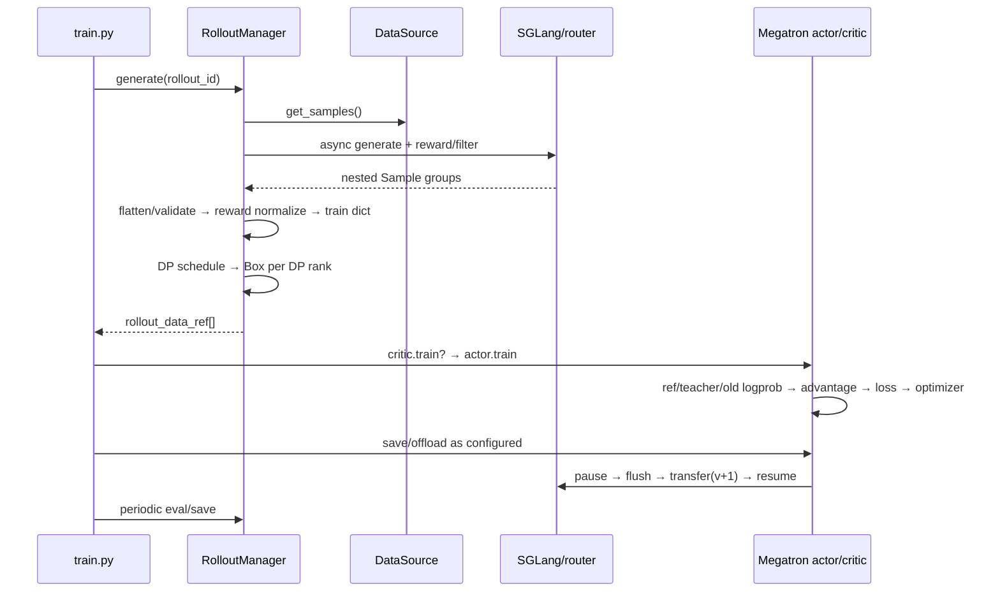

# slime 一轮 RL 迭代端到端实现分析

> **源码基线**：slime `main@681b3adca54105d5ecd3fb822fa0dc58a427e0f9`
> **核验日期**：2026-08-14 · **系列**：[[slime/index]]
> **结论先行**：slime 一轮迭代的真正事务边界不是 optimizer step，而是“采到一个自洽的 policy snapshot → 用它形成完整训练统计 → 更新 Megatron → 把新权重原子提交给 SGLang”。同步和一拍异步只改变阶段重叠，不改变这个提交边界。

## 1. 初始化：先 serving，再根据它完成训练侧装配

同步与异步入口都按同一顺序初始化：创建 placement group → 创建 `RolloutManager` 和 SGLang engines → 创建 actor/critic groups → 首次把 actor 权重推给 rollout。[`train.py:13-30`](https://github.com/THUDM/slime/blob/681b3adca54105d5ecd3fb822fa0dc58a427e0f9/train.py#L13-L30) RolloutManager 必须先初始化，因为它拥有 DataSource，`num_epoch` 模式下需要先由 dataset 长度计算每 epoch 的 rollout 数。[`placement_group.py:227-248`](https://github.com/THUDM/slime/blob/681b3adca54105d5ecd3fb822fa0dc58a427e0f9/slime/ray/placement_group.py#L227-L248)

训练 actor 初始化后把真实 DP/CP/VPP 配置写成 `train_parallel_config`；这份运行时拓扑随后交给 RolloutManager，后者才能构造正确的 DP schedule。[`actor.py:95-113`](https://github.com/THUDM/slime/blob/681b3adca54105d5ecd3fb822fa0dc58a427e0f9/slime/backends/megatron_utils/actor.py#L95-L113) [`actor_group.py:188-208`](https://github.com/THUDM/slime/blob/681b3adca54105d5ecd3fb822fa0dc58a427e0f9/slime/ray/actor_group.py#L188-L208)

## 2. 同步主链：九个阶段



### 阶段 1：取得 prompt groups

默认 DataSource 每次取 `rollout_batch_size` 个 prompt，每个 prompt deepcopy 成 `n_samples_per_prompt` 个 sample，并分配稳定的 group/sample index；buffer 版本会优先消费上轮回收的 partial groups。[`data_source.py:90-118`](https://github.com/THUDM/slime/blob/681b3adca54105d5ecd3fb822fa0dc58a427e0f9/slime/rollout/data_source.py#L90-L118) [`data_source.py:168-211`](https://github.com/THUDM/slime/blob/681b3adca54105d5ecd3fb822fa0dc58a427e0f9/slime/rollout/data_source.py#L168-L211)

### 阶段 2：并发生成、reward 与动态 admission

`GenerateState` 的 semaphore 容量是 per-server concurrency × engine 数；每个 prompt group 是一个外层 task，组内 samples 再并发生成，随后按 per-sample 或 group RM 打分。[`sglang_rollout.py:83-149`](https://github.com/THUDM/slime/blob/681b3adca54105d5ecd3fb822fa0dc58a427e0f9/slime/rollout/sglang_rollout.py#L83-L149) [`sglang_rollout.py:225-336`](https://github.com/THUDM/slime/blob/681b3adca54105d5ecd3fb822fa0dc58a427e0f9/slime/rollout/sglang_rollout.py#L225-L336)

外层 rollout loop 维持目标 accepted group 数；filter 丢弃一组时会继续补采，凑齐后 abort 剩余 in-flight 请求，partial 模式才把已有输出回收到 buffer。[`sglang_rollout.py:374-470`](https://github.com/THUDM/slime/blob/681b3adca54105d5ecd3fb822fa0dc58a427e0f9/slime/rollout/sglang_rollout.py#L374-L470)

### 阶段 3：从嵌套生成输出转成完整 step 视图

RolloutManager 先校验 compact fanout 的 sibling 是否共享 `rollout_id`，再逐层 flatten；这一步必须发生在 reward/reducer 之前，否则一条 agent rollout fanout N 个训练片段会被计数 N 次。[`rollout.py:671-701`](https://github.com/THUDM/slime/blob/681b3adca54105d5ecd3fb822fa0dc58a427e0f9/slime/ray/rollout.py#L671-L701) [`rollout.py:941-970`](https://github.com/THUDM/slime/blob/681b3adca54105d5ecd3fb822fa0dc58a427e0f9/slime/ray/rollout.py#L941-L970)

### 阶段 4：reward 统计与 train-data ABI

默认 GRPO/GSPO/CISPO/reinforce++ baseline 先按 group 做 reward mean/std normalization；随后把 Sample 转成 tokens、response lengths、rewards、loss masks、rollout ids、logprobs/top-p/routing/teacher metadata。[`rollout.py:722-747`](https://github.com/THUDM/slime/blob/681b3adca54105d5ecd3fb822fa0dc58a427e0f9/slime/ray/rollout.py#L722-L747) [`rollout.py:749-866`](https://github.com/THUDM/slime/blob/681b3adca54105d5ecd3fb822fa0dc58a427e0f9/slime/ray/rollout.py#L749-L866)

这里还在完整 step 上预计算每个 `rollout_id` 的 `rollout_mask_sums`。这是一个关键架构决定：只有此时能看见同一 rollout 的所有 fanout fragments；进入 micro-batch 后已无法局部恢复分母。[`rollout.py:799-814`](https://github.com/THUDM/slime/blob/681b3adca54105d5ecd3fb822fa0dc58a427e0f9/slime/ray/rollout.py#L799-L814)

### 阶段 5：DP/mbs 调度与数据运输

RolloutManager 调用 `build_dp_schedule`，按逻辑 rollout 划 step，再结合序列长度、dynamic batch、VPP group 约束得到每个 DP rank 的 partition/micro-batch indices；每 rank 只拿自己的字段子集，包装进 Ray `Box`，transport 可选 object store 或 NIXL。[`rollout.py:871-938`](https://github.com/THUDM/slime/blob/681b3adca54105d5ecd3fb822fa0dc58a427e0f9/slime/ray/rollout.py#L871-L938)

### 阶段 6：训练侧取数与设备/CP 变换

每个 Megatron actor 用自己的 DP rank 解包数据，提前把 tokens、loss masks、rollout denominators 搬到 GPU；rollout/teacher logprob 按 CP layout 切片。[`actor.py:245-299`](https://github.com/THUDM/slime/blob/681b3adca54105d5ecd3fb822fa0dc58a427e0f9/slime/backends/megatron_utils/actor.py#L245-L299) `DataIterator` 按预计算 micro-batch indices 取字段，VPP 每个 stage 使用独立 iterator cursor。[`data.py:201-245`](https://github.com/THUDM/slime/blob/681b3adca54105d5ecd3fb822fa0dc58a427e0f9/slime/backends/megatron_utils/data.py#L201-L245)

### 阶段 7：critic 与 actor 的内部顺序

PPO critic 先 forward values，算 advantages/returns，再执行 value-loss train，并只由 PP last stage 返回 CPU values。[`actor.py:396-422`](https://github.com/THUDM/slime/blob/681b3adca54105d5ecd3fb822fa0dc58a427e0f9/slime/backends/megatron_utils/actor.py#L396-L422)

actor 的顺序是 ref/teacher logprob → old actor/current actor logprob（可按严格条件复用 loss forward）→ 接收 critic values → 恢复 actor → 全 rollout advantage → policy train → 备份新 actor/ref。[`actor.py:424-503`](https://github.com/THUDM/slime/blob/681b3adca54105d5ecd3fb822fa0dc58a427e0f9/slime/backends/megatron_utils/actor.py#L424-L503) [`actor.py:514-564`](https://github.com/THUDM/slime/blob/681b3adca54105d5ecd3fb822fa0dc58a427e0f9/slime/backends/megatron_utils/actor.py#L514-L564)

### 阶段 8：checkpoint 与内存生命周期

主循环按 `save_interval`、epoch 边界和最终 step 决定保存；`release_train` 会强制同步保存后杀掉训练 actors，下轮再从 checkpoint 重建；普通 offload 则保留 actor，只暂停 GPU 内存并销毁/重建 process groups。[`train.py:71-88`](https://github.com/THUDM/slime/blob/681b3adca54105d5ecd3fb822fa0dc58a427e0f9/train.py#L71-L88) [`actor_group.py:151-186`](https://github.com/THUDM/slime/blob/681b3adca54105d5ecd3fb822fa0dc58a427e0f9/slime/ray/actor_group.py#L151-L186) [`actor.py:205-243`](https://github.com/THUDM/slime/blob/681b3adca54105d5ecd3fb822fa0dc58a427e0f9/slime/backends/megatron_utils/actor.py#L205-L243)

### 阶段 9：权重提交

actor updater 先恢复/重连必要 process groups，发现 engine crash 时先恢复 serving actor，然后执行 updater；默认 NCCL path 的事务序列是 pause generation → flush cache → 分 bucket 传完所有权重 → quant postprocess → continue generation。[`actor.py:592-653`](https://github.com/THUDM/slime/blob/681b3adca54105d5ecd3fb822fa0dc58a427e0f9/slime/backends/megatron_utils/actor.py#L592-L653) [`update_weight_from_distributed.py:102-146`](https://github.com/THUDM/slime/blob/681b3adca54105d5ecd3fb822fa0dc58a427e0f9/slime/backends/megatron_utils/update_weight/update_weight_from_distributed.py#L102-L146)

## 3. 五个常见疑问：batch、变长、GRPO、权重与 rollout payload

### 3.1 `rollout_batch_size`、global batch 和 micro-batch 分别是什么

先把三个单位拆开。设每轮取 $R$ 个 prompt，每个 prompt 生成 $G$ 条 completion：

| 参数/概念 | 单位 | 在一轮 rollout 中的含义 |
|---|---|---|
| `rollout_batch_size` | prompt | $R$；DataSource 一次取多少个题目 |
| `n_samples_per_prompt` | completion/prompt | $G$；每题采几条 |
| rollout 产出 | completion | 默认路径为 $RG$ 条逻辑 rollout |
| `global_batch_size` | logical rollout | 一个 optimizer step 在全部 DP ranks 上消费多少条逻辑 rollout；默认一 completion 对应一 logical rollout |
| `micro_batch_size` | sample/DP rank/forward-backward | 静态 packing 时单个 micro-batch 装几条；dynamic batch 开启后该值被忽略，改由 token budget 决定 |

参数帮助文本明确把 rollout batch 定义成 prompt 数、把训练 global batch 定义成 sample 数；若希望一轮 rollout 只做一次 optimizer step，应设置 `global_batch_size = rollout_batch_size * n_samples_per_prompt`。[`arguments.py:689-717`](https://github.com/THUDM/slime/blob/681b3adca54105d5ecd3fb822fa0dc58a427e0f9/slime/utils/arguments.py#L689-L717) 若配置 `num_steps_per_rollout=K`，slime 反推：

$$
B_{\mathrm{global}}=\frac{RG}{K}.
$$

源码使用整数除法并校验显式 global batch 是否相等。[`arguments.py:1963-1971`](https://github.com/THUDM/slime/blob/681b3adca54105d5ecd3fb822fa0dc58a427e0f9/slime/utils/arguments.py#L1963-L1971) 实际配置应保证 $RG$ 能整除 $B_{\mathrm{global}}$；scheduler 只形成完整 steps，不能组成一个 global batch 的尾部 logical rollouts 会被丢弃。对 compact/subagent fanout，step 边界按 `rollout_id` 而非物理 fragment 数计算；一个 logical rollout 可含多条训练 sample。[`dp_schedule.py:82-110`](https://github.com/THUDM/slime/blob/681b3adca54105d5ecd3fb822fa0dc58a427e0f9/slime/utils/dp_schedule.py#L82-L110)

**参数更新发生在每个 optimizer step，不是等整个 dataset 过完一轮。** `train_one_step` 先对该 step 的所有 micro-batches 执行 forward/backward，随后只调用一次 `optimizer.step()`；一个外层 rollout 若切成 $K$ 个 train steps，actor 参数就连续更新 $K$ 次。[`model.py:509-524`](https://github.com/THUDM/slime/blob/681b3adca54105d5ecd3fb822fa0dc58a427e0f9/slime/backends/megatron_utils/model.py#L509-L524) [`model.py:643-683`](https://github.com/THUDM/slime/blob/681b3adca54105d5ecd3fb822fa0dc58a427e0f9/slime/backends/megatron_utils/model.py#L643-L683) 但 serving 侧 SGLang 不会在这 $K$ 次中途逐次换权重：同步主循环等 actor 完成整轮 train 后才调用一次 `update_weights()`。[`train.py:48-85`](https://github.com/THUDM/slime/blob/681b3adca54105d5ecd3fb822fa0dc58a427e0f9/train.py#L48-L85) `num_epoch` 只是按 dataset 长度换算外层 rollout 次数，不是“每个 epoch 末才更新 actor”。[`arguments.py:615-623`](https://github.com/THUDM/slime/blob/681b3adca54105d5ecd3fb822fa0dc58a427e0f9/slime/utils/arguments.py#L615-L623)

### 3.2 轨迹长短不一，训练为什么仍能组成 batch

slime 没有把每条轨迹 padding 到同一个固定 $S$。它分两层处理变长：

1. **step 内先按长度装箱。** 静态模式按 sample 数切 micro-batch；dynamic 模式用 first-fit，使每个 bin 的 token 总数不超过 `max_tokens_per_gpu * cp_size`，再把 micro-batch 数对齐到 DP/VPP 约束。[`dp_schedule.py:55-79`](https://github.com/THUDM/slime/blob/681b3adca54105d5ecd3fb822fa0dc58a427e0f9/slime/utils/dp_schedule.py#L55-L79) [`dp_schedule.py:117-125`](https://github.com/THUDM/slime/blob/681b3adca54105d5ecd3fb822fa0dc58a427e0f9/slime/utils/dp_schedule.py#L117-L125)
2. **micro-batch 内做 packed sequence。** 多条变长 tokens 拼成一个 THD stream，`PackedSeqParams.cu_seqlens` 保存各序列边界，最终 tensor 是 `[1, T_padded]`；只在拼接尾部做 TP/CP 对齐 padding，而不是按 batch 内最长序列做矩形 padding。[`data.py:28-118`](https://github.com/THUDM/slime/blob/681b3adca54105d5ecd3fb822fa0dc58a427e0f9/slime/backends/megatron_utils/data.py#L28-L118)

next-token shift、response loss mask 和 CP slice 与 tokens 同步变换，因此 prompt tokens 与尾部对齐 padding 都不会误计入 policy loss。[`data.py:120-148`](https://github.com/THUDM/slime/blob/681b3adca54105d5ecd3fb822fa0dc58a427e0f9/slime/backends/megatron_utils/data.py#L120-L148) `balance_by_flops` 是另一条按估算 FLOPs 均衡的路径，源码明确提示它可能突破 token cap；显存紧张时不能把该选项当成硬 OOM 保护。[`arguments.py:730-743`](https://github.com/THUDM/slime/blob/681b3adca54105d5ecd3fb822fa0dc58a427e0f9/slime/utils/arguments.py#L730-L743)

### 3.3 GRPO 每题采多份后，batch 语义是否变化

不变化的是单位，变化的是数量。DataSource 对每个 prompt deepcopy $G$ 份：组内共享 `group_index`，每条 completion 有独立 `index`。[`data_source.py:107-118`](https://github.com/THUDM/slime/blob/681b3adca54105d5ecd3fb822fa0dc58a427e0f9/slime/rollout/data_source.py#L107-L118) 因而：

$$
N_{\mathrm{completion}}=R\times G.
$$

`rollout_batch_size` 仍是 $R$ 个 prompt，`global_batch_size` 仍按 logical rollout/completion 计，不会改成 prompt-group 数。GRPO 的 group mean/std 在完整 $R\times G$ 视图上先算完，再进入 step split；即使同一题的 siblings 后续落到不同 micro-batch，归一化 reward 已经固定。[`rollout.py:722-745`](https://github.com/THUDM/slime/blob/681b3adca54105d5ecd3fb822fa0dc58a427e0f9/slime/ray/rollout.py#L722-L745)

若想“一轮 rollout 恰好一次更新”，仍取 $B_{\mathrm{global}}=RG$；若想一轮 $K$ 次更新，则取 $B_{\mathrm{global}}=RG/K$。把 $B_{\mathrm{global}}$ 设成 $G$ 的倍数，可让默认顺序下的 step 更自然地覆盖完整 prompt groups，但这是**配置建议，不是当前 scheduler 的强不变量**：源码甚至提示 workload balance 可能把同一 prompt 的不同 responses 分到不同 train steps。[`arguments.py:719-727`](https://github.com/THUDM/slime/blob/681b3adca54105d5ecd3fb822fa0dc58a427e0f9/slime/utils/arguments.py#L719-L727)

### 3.4 权重更新有哪几条路径，耗时能否被掩盖

固定基线有四条 actor→rollout 路径：训推分离的 NCCL full、colocate tensor/CUDA IPC、full disk，以及 delta disk。选择条件、暂停/清 cache/版本提交协议和 delta 的字节级实现见 [[16_slime_weight_sync_analysis]]。

源码没有一个可跨模型和硬件复用的“同步占比”。actor 的 `update_weights` 有独立 timer，最终记录为 `perf/update_weights_time`；应在目标集群测量，而不是预填固定百分比。[`actor.py:591-653`](https://github.com/THUDM/slime/blob/681b3adca54105d5ecd3fb822fa0dc58a427e0f9/slime/backends/megatron_utils/actor.py#L591-L653) [`train_metric_utils.py:13-50`](https://github.com/THUDM/slime/blob/681b3adca54105d5ecd3fb822fa0dc58a427e0f9/slime/utils/train_metric_utils.py#L13-L50) full-disk 是例外：actor timer 只覆盖 checkpoint publish，RayTrainGroup 随后的 host pull/reload 在 timer 外，所以端到端占比必须另看外层 wall-clock。[`actor_group.py:162-173`](https://github.com/THUDM/slime/blob/681b3adca54105d5ecd3fb822fa0dc58a427e0f9/slime/ray/actor_group.py#L162-L173) 同步主链可用：

$$
\rho_{\mathrm{sync}}=
\frac{T_{\mathrm{update}}}
{T_{\mathrm{rollout}}+T_{\mathrm{train}}+T_{\mathrm{update}}}
$$

作为未重叠 wall-clock 的初始口径。默认 online commit 的 pause→flush→transfer/reload→resume 是 serving barrier，不能被 generation 掩盖；full-disk 的 host-local checkpoint pull 可在 pause 前与 generation overlap。[`actor_group.py:227-269`](https://github.com/THUDM/slime/blob/681b3adca54105d5ecd3fb822fa0dc58a427e0f9/slime/ray/actor_group.py#L227-L269) 一拍异步能重叠 rollout N+1 与 train N，但到权重提交前仍等待 generation future；`update_weights_interval > 1` 只是摊薄同步频率，同时增加 policy staleness。[`train_async.py:31-70`](https://github.com/THUDM/slime/blob/681b3adca54105d5ecd3fb822fa0dc58a427e0f9/train_async.py#L31-L70)

### 3.5 rollout 到底交给 train engine 什么

要区分“**SGLang `/generate` 的返回**”和“**Slime rollout 子系统的最终输出**”：SGLang 返回生成 token、每个已选 token 的 logprob 及可选 top-p/routed-expert/version metadata；Slime 随后执行 hooks 和 RM，把 reward、mask、identity 等组装为 train data。[`sglang_rollout.py:175-219`](https://github.com/THUDM/slime/blob/681b3adca54105d5ecd3fb822fa0dc58a427e0f9/slime/rollout/sglang_rollout.py#L175-L219) [`sglang_rollout.py:224-289`](https://github.com/THUDM/slime/blob/681b3adca54105d5ecd3fb822fa0dc58a427e0f9/slime/rollout/sglang_rollout.py#L224-L289)

| 类别 | 字段 | 是否总有 |
|---|---|---|
| 训练主体 | tokens、response length、reward/raw reward、loss mask、sample/rollout id | 是 |
| behavior policy | rollout logprob | 默认 SGLang 生成有；custom rollout 必须自行维护 |
| 精确采样重放 | top-p token ids/offsets | 仅 `rollout_top_p != 1` |
| MoE 路由重放 | routed experts | 仅请求并开启 routing replay |
| 蒸馏/多模态 | teacher logprob、multimodal train inputs | 对应功能开启时 |

这里持久化的 rollout logprob **不是** `[B, S, V]`，而是每个 response token 的已选 action 标量，单条 shape 为 `[R_i]`；完整词表 logits 只在 SGLang 内部生成以及 Megatron 当前 micro-batch 重算时短暂存在。字段长度约束见 [`types.py:253-302`](https://github.com/THUDM/slime/blob/681b3adca54105d5ecd3fb822fa0dc58a427e0f9/slime/utils/types.py#L253-L302) 和 [`types.py:418-425`](https://github.com/THUDM/slime/blob/681b3adca54105d5ecd3fb822fa0dc58a427e0f9/slime/utils/types.py#L418-L425)。routed experts 也不是默认字段，只有 Sample 提供时才进入 train data。[`rollout.py:828-852`](https://github.com/THUDM/slime/blob/681b3adca54105d5ecd3fb822fa0dc58a427e0f9/slime/ray/rollout.py#L828-L852)

数据物理路径默认是 RolloutManager 先转成 **CPU contiguous tensors**，再经 Ray object store；可选 Ray NIXL tensor transport。训练 actor 通过 Ray 在 CPU 取回后再 `.to(cuda)`，不是 NCCL 的 HBM→HBM rollout-data 通道。[`rollout.py:41-104`](https://github.com/THUDM/slime/blob/681b3adca54105d5ecd3fb822fa0dc58a427e0f9/slime/ray/rollout.py#L41-L104) [`actor.py:245-299`](https://github.com/THUDM/slime/blob/681b3adca54105d5ecd3fb822fa0dc58a427e0f9/slime/backends/megatron_utils/actor.py#L245-L299) 字段级大小和 reward/logprob 的细节分别见 [[12_slime_sample_datasource_analysis]] 与 [[13_slime_sglang_rollout_engine_analysis]]。

## 4. 一拍异步究竟重叠了什么

```text
time ─────────────────────────────────────────────>
rollout:  [ gen 0 ][      gen 1      ][ gen 2 ]
train:             [train 0][train 1]
commit:                     |v1|      |v2|
                            ↑ wait gen future before commit
```

异步入口先发起 rollout 0；取得结果后立刻发 rollout 1，再训练 0。它没有让 trainer 消费无限滞后的 replay buffer，也没有允许权重在请求中途切换；到 `update_weights_interval` 边界会先 `ray.get` 当前 generation future，再提交新权重。[`train_async.py:31-70`](https://github.com/THUDM/slime/blob/681b3adca54105d5ecd3fb822fa0dc58a427e0f9/train_async.py#L31-L70)

因此其语义是 **bounded one-stage pipeline**：吞吐收益来自 phase overlap，代价是 rollout N+1 通常仍由旧于 train N 完成后的 policy 生成。`update_weights_interval > 1` 会进一步增大 policy age，需要 [[17_slime_train_inference_consistency_analysis]] 中的 mismatch/TIS/OPSM 诊断。

## 5. 三个关键不变量

1. **单条生成权重快照不变**：权重提交前等待所有 generation future，updater 内再 pause/flush。
2. **逻辑 rollout 统计单位不变**：fanout、DP partition、micro-batch packing 之后仍按 `rollout_id` 和完整 denominator 聚合。
3. **训练步与 serving version 单调前进**：initial push 后，每个成功提交产生下一 version；disk/delta path 还把 version 写入目录/index，SGLang meta 回传给 Sample。

只满足 optimizer 正常 step 不足以说明这一轮正确；这三个不变量分别由控制面、数据/loss 面、权重面共同保证。

## Related Pages

- [[11_slime_ray_control_plane_analysis]] — 本页 RPC 背后的资源和 actor owner
- [[12_slime_sample_datasource_analysis]] — Sample 到 Box 的字段级转换
- [[14_slime_megatron_training_analysis]] — 阶段 6–8 深潜
- [[16_slime_weight_sync_analysis]] — 阶段 9 的四种实现
- [[30_slime_rollout_optimization_analysis]] — 同步、partial、fully async 的吞吐权衡
