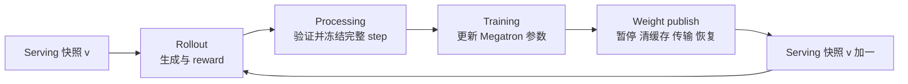
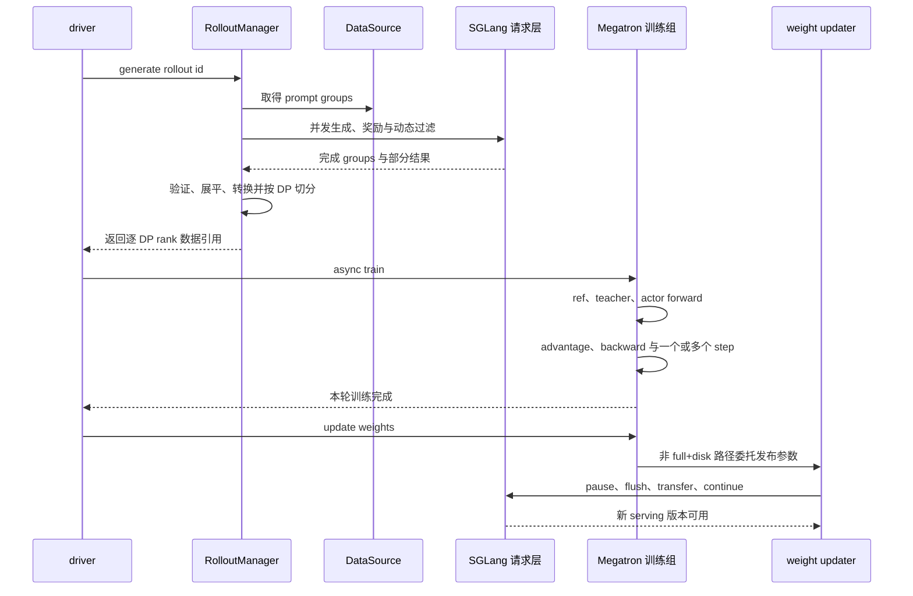
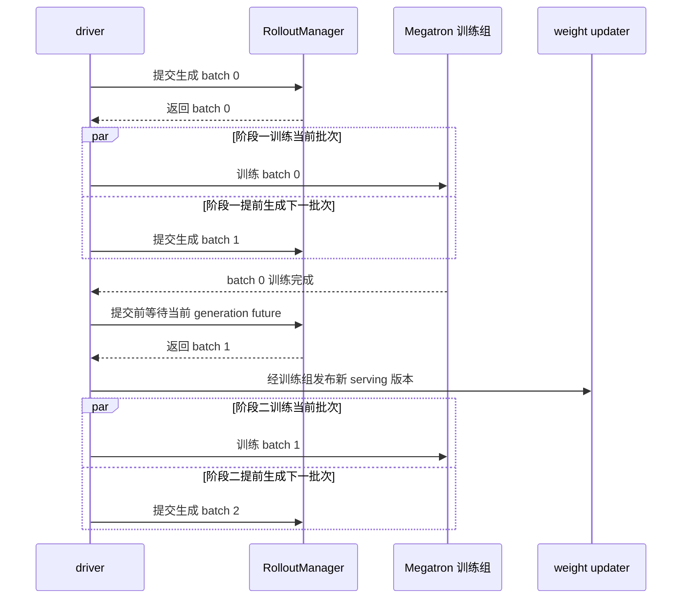

# slime 端到端迭代：带版本边界的四阶段事务

> **源码基线**：`THUDM/slime@681b3adca54105d5ecd3fb822fa0dc58a427e0f9`（`main`，2026-08-12）
> **主题**：本页解释 rollout 数据闭合、训练、权重发布之间的顺序，比较同步与异步入口及 fully-async rollout 替换。
> **适用范围**：端到端控制时序和资源交接；磁盘版本、数据归一化与评估细节由各自专题页负责。
> **最近更新**：2026-09-10。核实控制面、配置与运行边界。

slime 的一轮 iteration 不是“调用一次 optimizer”这么窄，而是一个带版本边界的阶段事务：**用已发布的 serving 权重采样 → 在完整 rollout 视图上冻结训练数据 → 更新训练权重 → 按受控发布协议切换下一 serving 版本**。同步、one-stage async 和 fully-async 改变的是阶段重叠位置与允许的 policy age；它们没有取消数据闭合点和权重提交点。代价是 barrier、等待、缓存清理与数据排队，但这些成本守住了三件更贵的事：不让请求看到半套权重、不让训练统计在切分后失真、协调生成、训练与发布的顺序；这不构成全局 exactly-once 保证。

本文只解释 iteration 的因果主线。Ray 对象职责、Sample 字段、SGLang 请求状态、Megatron 内核、loss 归一化、权重 transport 和训推一致性的字段级细节分别由 `11`–`17` 页负责；本页只在跨阶段边界处概括并链接。

## 1. 为什么每轮迭代必须按事务执行，而不能让各阶段自由运行

在线 RL 同时维护两份会变化的状态：训练侧参数与 serving 侧已发布版本。设 rollout $i$ 观察到的 serving 版本为 $v(i)$，其原始轨迹为 $R_i^{v(i)}$，处理后冻结的训练 batch 为 $B_i^{v(i)}$，则一轮的逻辑关系是：

$$
R_i^{v(i)}
\xrightarrow{\mathrm{process}}
B_i^{v(i)}
\xrightarrow{\mathrm{train}}
\theta_{k+1}
\xrightarrow{\mathrm{publish}}
S_{k+1}.
$$

这里故意没有写 $v(i)=k$：同步模式通常让二者紧邻，one-stage async 会让 rollout 提前一拍，`update_weights_interval > 1` 还会让多个 rollout 共用较旧的 serving 版本。`--update-weights-interval` 默认 1。同步 `train.py::train` 每轮无条件调用 `actor_model.update_weights()`，该参数不降低同步发布频率；在同步路径，它仍影响 `keep_old_actor` 的备份队列分支。异步 `train_async.py::train` 在间隔命中或 `release_train=True` 时发布，后者强制每轮发布。[`slime/utils/arguments.py:537-545`](https://github.com/THUDM/slime/blob/681b3adca54105d5ecd3fb822fa0dc58a427e0f9/slime/utils/arguments.py#L537-L545) [`train_async.py:66-70`](https://github.com/THUDM/slime/blob/681b3adca54105d5ecd3fb822fa0dc58a427e0f9/train_async.py#L66-L70)

因此 slime 守的不是“任何配置下都绝对零 off-policy”，而是下列分层不变量。下表是后文 fixed-commit 调用链的**设计抽象**，不是项目文档的原话：

| 不变量 | 必须成立的边界 | 允许的放宽 |
|---|---|---|
| **成功发布的完整性** | serving 对外只能是完整旧版本或完整新版本 | 可以降低发布频率，不能暴露分 bucket 更新中的半版本 |
| **batch 闭合性** | reward、mask、rollout identity 与分母在训练前冻结 | 可以让 batch 较旧，不能训练到一半再改变其语义 |
| **版本可追踪性** | 生成侧 metadata 能记录实际观察到的权重版本 | partial/async 可以跨版本，但必须选择保留、mask 或校正旧 token |
| **资源排他性** | colocate 时 rollout KV/weights 与训练状态按阶段占用显存 | 资源分离时可以重叠，colocate 不能假装有两份 GPU 容量 |
| **数据所有权** | 每个 prompt group 处于 DataSource、in-flight、completed queue 或 train batch 的一个受控位置 | 可以乱序完成，不能过量 drain 后丢弃已消费数据 |

`Sample` 会把 SGLang 返回的 `weight_version` 追加到 `weight_versions`，而不是只保留最后一个版本；partial continuation 因而能够暴露跨版本轨迹。[`slime/utils/types.py:397-416`](https://github.com/THUDM/slime/blob/681b3adca54105d5ecd3fb822fa0dc58a427e0f9/slime/utils/types.py#L397-L416) `mask_offpolicy_in_partial_rollout` 默认关闭，开启后才会在续生成前把旧 response mask 清零。[`slime/utils/arguments.py:456-474`](https://github.com/THUDM/slime/blob/681b3adca54105d5ecd3fb822fa0dc58a427e0f9/slime/utils/arguments.py#L456-L474) [`slime/rollout/sglang_rollout.py:224-248`](https://github.com/THUDM/slime/blob/681b3adca54105d5ecd3fb822fa0dc58a427e0f9/slime/rollout/sglang_rollout.py#L224-L248)

> **设计分析**：这说明 slime 中的“on-policy 边界”应理解为**可审计的策略版本边界**，而不是笼统地认为“rollout 永远来自当前 actor”。同步调度尽量缩短样本相对当前策略的滞后；异步执行、中断续生成和较大的更新间隔则有意用策略时效性换取吞吐，但仍要保证权重发布的完整性，并能解释 token 对应的策略版本。具体校正条件见 [[17_slime_train_inference_consistency_analysis]]。

## 2. 为什么这么设计：为什么默认不采用全流程无屏障的并发循环

直观替代方案是让 rollout、reward、训练和权重传输全部各自自由运行：哪个 sample 完成就立刻送 trainer，哪个 optimizer step 完成就立刻推一部分权重。它看似能消除所有空泡，但会同时破坏四个约束。这四条约束各自对应后文的一段机制：数据闭合点见第 3 节，真实调用链与状态机见第 4 节，三种执行模式把边界移到哪里见第 5 节。

### 2.1 单个样本到达时，全局统计还无法计算完整

GRPO 类 reward 处理需要同组视图：`RolloutManager._post_process_rewards` 在样本数等于 `rollout_batch_size × n_samples_per_prompt` 时 reshape 为 prompt 行，否则以 `(-1, rewards.shape[-1])` 将当前全部 reward 视为一组；因此标量 reward 到组内中心化的边界必须早于分包。compact fanout 的 loss denominator 需要同一 logical rollout 的全部 fragments，DP scheduler 还要按 global batch 划 step。这些值都在 converter/scheduler 中于切分前计算。[`slime/ray/rollout.py:749-814`](https://github.com/THUDM/slime/blob/681b3adca54105d5ecd3fb822fa0dc58a427e0f9/slime/ray/rollout.py#L749-L814) [`slime/utils/dp_schedule.py:127-150`](https://github.com/THUDM/slime/blob/681b3adca54105d5ecd3fb822fa0dc58a427e0f9/slime/utils/dp_schedule.py#L127-L150)

### 2.2 推理请求执行期间不能随意切换权重

异步 driver 在 publish 前显式等待 generation future，updater 又执行 pause/flush/barrier；两层同步分别控制“当前 batch future 是否闭合”与“engine 是否处于可提交状态”。[`train_async.py:66-70`](https://github.com/THUDM/slime/blob/681b3adca54105d5ecd3fb822fa0dc58a427e0f9/train_async.py#L66-L70) [`slime/backends/megatron_utils/update_weight/update_weight_from_distributed.py:102-134`](https://github.com/THUDM/slime/blob/681b3adca54105d5ecd3fb822fa0dc58a427e0f9/slime/backends/megatron_utils/update_weight/update_weight_from_distributed.py#L102-L134) 对默认 rollout，future 闭合还伴随 pending 收束；对 fully-async，它只说明目标 completed groups 已到齐，后台 worker 仍可能有 in-flight tasks，所以后者还依赖 pause 后的 ABORTED requeue 所有权协议。[`slime/rollout/sglang_rollout.py:450-470`](https://github.com/THUDM/slime/blob/681b3adca54105d5ecd3fb822fa0dc58a427e0f9/slime/rollout/sglang_rollout.py#L450-L470) [`slime/rollout/fully_async_rollout.py:17-23`](https://github.com/THUDM/slime/blob/681b3adca54105d5ecd3fb822fa0dc58a427e0f9/slime/rollout/fully_async_rollout.py#L17-L23)

### 2.3 共置模式下的显存不足以让训推同时常驻

同步模式通过 offload/onload 把 GPU 生命周期切成 rollout phase 与 train phase；async driver 禁止 colocate。[`train.py:53-88`](https://github.com/THUDM/slime/blob/681b3adca54105d5ecd3fb822fa0dc58a427e0f9/train.py#L53-L88) [`train_async.py:9-15`](https://github.com/THUDM/slime/blob/681b3adca54105d5ecd3fb822fa0dc58a427e0f9/train_async.py#L9-L15) 自由运行只有在资源真正分离、或另有更复杂的抢占/显存管理协议时才成立。

### 2.4 恢复必须把模型进度与数据游标对齐

周期保存时，同一个条件控制 actor/critic checkpoint 与 global DataSource state；恢复时训练模型返回统一的 start id，RolloutManager 再加载 `start_rollout_id - 1` 的数据状态。[`train.py:71-80`](https://github.com/THUDM/slime/blob/681b3adca54105d5ecd3fb822fa0dc58a427e0f9/train.py#L71-L80) [`slime/ray/placement_group.py:210-222`](https://github.com/THUDM/slime/blob/681b3adca54105d5ecd3fb822fa0dc58a427e0f9/slime/ray/placement_group.py#L210-L222) 一个没有 cycle commit id 的自由流需要另行解决 exactly-once、checkpoint cut 与队列快照；当前默认路径选择更小、更清楚的恢复边界。

## 3. 四阶段事务分别保护什么

<!-- Figure spec: LR lifecycle; serving version -> generated data -> processing -> training -> publication -> next serving. Shows success order, not distributed rollback. -->

### 3.1 Rollout：先固定采样数据，再允许 actor 更新

同步 driver 在每个 `rollout_id` 上先阻塞取得 `RolloutManager.generate` 的结果，之后才发起 critic/actor training；训练结束后才发布权重。[`train.py:48-85`](https://github.com/THUDM/slime/blob/681b3adca54105d5ecd3fb822fa0dc58a427e0f9/train.py#L48-L85) 默认 rollout 函数会持续补充 prompt groups，直到取得目标数量的有效 group；凑齐后 abort 剩余请求、等待 pending tasks 收束，并在 partial 模式下把未完成 groups 交回 DataSource。[`slime/rollout/sglang_rollout.py:400-470`](https://github.com/THUDM/slime/blob/681b3adca54105d5ecd3fb822fa0dc58a427e0f9/slime/rollout/sglang_rollout.py#L400-L470)

这个阶段边界保护两件事：进入本轮训练的数据已经有确定的 token、reward、mask 与 behavior metadata；未被选中的 in-flight 数据也有明确去向。生成并发、动态过滤和 partial 回收属于 [[13_slime_sglang_rollout_engine_analysis]] 与 [[12_slime_sample_datasource_analysis]]，iteration 只依赖它们最终交付一个**闭合的逻辑 batch**。

### 3.2 数据处理：为什么必须在 DP 切分前看到完整一轮数据

`RolloutManager.generate` 先取得、验证和展平 Sample，再形成包含 `tokens`、`response_lengths`、`loss_masks`、`rewards` 和可选 behavior tensors 的 train dict，最后生成 DP schedule 与逐 DP 引用。此时冻结的数据语义由 [[12_slime_sample_datasource_analysis|Sample 与 train dict]] 定义；`rollout_mask_sums` 的预计算与分母推导只在该页展开，DP 对齐和裁剪则见 [[14_slime_megatron_training_analysis|训练调度]]。

**设计分析**：这里必须先有完整样本视图再分包，后续 trainer 才能按固定统计口径消费。它是数据准备边界，不意味着 Python 对象获得不可变类型，也不承诺分布式故障时回滚。

### 3.3 训练：一轮 rollout 可以包含多个优化器步骤

控制面通过 `RayTrainGroup.async_train` 向所有 actor workers 广播同一 `rollout_id` 和各 rank 的 data ref。[`slime/ray/actor_group.py:131-149`](https://github.com/THUDM/slime/blob/681b3adca54105d5ecd3fb822fa0dc58a427e0f9/slime/ray/actor_group.py#L131-L149) actor 会先完成所需的 ref/teacher/current-policy forward 与 rollout-global advantage，再进入 policy train；训练结束后备份最新 actor 权重。`slime/backends/megatron_utils/actor.py::MegatronTrainRayActor.train_actor`

每个 train step 对其所有 micro-batches 做 forward/backward，梯度有效时调用一次 `optimizer.step()` 并推进 scheduler。[`slime/backends/megatron_utils/model.py:509-524`](https://github.com/THUDM/slime/blob/681b3adca54105d5ecd3fb822fa0dc58a427e0f9/slime/backends/megatron_utils/model.py#L509-L524) [`slime/backends/megatron_utils/model.py:643-683`](https://github.com/THUDM/slime/blob/681b3adca54105d5ecd3fb822fa0dc58a427e0f9/slime/backends/megatron_utils/model.py#L643-L683) 因而一个外层 rollout cycle 可以通过 `num_steps_per_rollout` 产生多次参数更新，同步 serving 在该轮训练后发布一次；异步发布频率另受 §5.2 的条件控制。Megatron 内部的数据搬运、并行执行和模型角色切换由 [[14_slime_megatron_training_analysis]] 展开。

### 3.4 权重发布：传输前后必须有完整的提交协议

默认分布式 updater 的顺序是：版本号加一，rank 0 暂停所有 rollout engines 并 flush cache，所有训练 ranks barrier，按 non-expert/expert chunks 发送全部权重，必要时做量化后处理，然后恢复 generation，再做一次 barrier。[`slime/backends/megatron_utils/update_weight/update_weight_from_distributed.py:102-146`](https://github.com/THUDM/slime/blob/681b3adca54105d5ecd3fb822fa0dc58a427e0f9/slime/backends/megatron_utils/update_weight/update_weight_from_distributed.py#L102-L146) 每个 chunk 的 metadata 携带相同 `weight_version`，tensor 广播完成后才返回 refs。[`slime/backends/megatron_utils/update_weight/update_weight_from_distributed.py:326-355`](https://github.com/THUDM/slime/blob/681b3adca54105d5ecd3fb822fa0dc58a427e0f9/slime/backends/megatron_utils/update_weight/update_weight_from_distributed.py#L326-L355)

full+disk 是控制责任的例外：版本由 `RayTrainGroup` 自持，并由它直接驱动 engine reload；完整链与失败边界见 [[11_slime_ray_control_plane_analysis#6.1 full+disk 的版本属于 RayTrainGroup|磁盘版本归属]]。其余 transport 的布局映射和更新协议见 [[16_slime_weight_sync_analysis|权重同步]]。成功路径的暂停、缓存清理与恢复不能被理解为跨 engine 故障事务；源码没有全局回滚保证。

> **设计分析**：pause 防止新请求进入提交窗口，flush 防止新权重复用旧权重产生的 KV/prefix cache，version 把“传输结束”升级成“所有 engine 已提交同一逻辑版本”。只优化传输带宽而绕过这三步，会把性能问题变成静默正确性问题。

## 4. 真实调用链与状态转换

固定基线的同步调用链可以压缩成：

<!-- Figure spec: sequence of default non-disk synchronization; driver, RolloutManager/DataSource, serving, training and updater. Arrows identify submit, materialize and publish completion, not timing duration. -->

入口在初始化时先创建 rollout manager，再创建训练模型，并在任何 rollout 前强制做一次 actor→serving 权重推送。[`train.py:13-27`](https://github.com/THUDM/slime/blob/681b3adca54105d5ecd3fb822fa0dc58a427e0f9/train.py#L13-L27) 这意味着 cycle 0 也不是从 SGLang 启动时碰巧加载的权重开始，而是从训练侧明确发布过的 snapshot 开始。 若启用 rollout offload，`create_rollout_manager` 已先卸载 serving；普通同步启动随后 `onload_weights`、首次 `update_weights`、`onload_kv`，使权重与 KV/CUDA graph 分阶段恢复。`release_train` 跳过 driver 的 `onload_weights`，由磁盘 reload 路径负责恢复权重。证据：`slime/ray/placement_group.py::create_rollout_manager`、`train.py::train`。

用状态机表达，一轮成功事务是：

| 源码状态或完成信号 | 责任主体 | 此时可见的状态 | 下一边界 |
|---|---|---|---|
| `Sample.weight_versions` | engines / Sample | 请求 metadata 记录观察到的版本 | `generate` 收集 samples |
| `_get_rollout_data` 返回 `data, metrics` | RolloutManager / DataSource | Sample 已收束，待转换 | `_convert_samples_to_train_data` |
| `_split_train_data_by_dp` 返回引用 | RolloutManager / Ray object store | train dict 与 DP schedule 已形成 | `async_train` 消费 |
| `ray.get(actor_model.async_train(...))` 返回 | trainer actors / driver | 本轮全部 rank 训练已完成 | save / 内存清理 / update |
| `update_weights` 返回 | weight updater 或 full+disk 的 RayTrainGroup | 成功路径已完成参数应用与恢复请求 | 下一次 generate / eval |

`rollout_id` 是外层 cycle 编号，不是 optimizer-step id，也不是必然等于 weight version。同步循环直接执行 `range(start_rollout_id, num_rollout)`；每个 cycle 可能有多个 train steps，而tensor/distributed/disk-delta updater 或 full+disk 的 RayTrainGroup 维护各自递增版本计数。[`train.py:48-85`](https://github.com/THUDM/slime/blob/681b3adca54105d5ecd3fb822fa0dc58a427e0f9/train.py#L48-L85) [`slime/backends/megatron_utils/update_weight/update_weight_from_distributed.py:23-47`](https://github.com/THUDM/slime/blob/681b3adca54105d5ecd3fb822fa0dc58a427e0f9/slime/backends/megatron_utils/update_weight/update_weight_from_distributed.py#L23-L47)

## 5. 同步、one-stage async 与完全异步：阶段边界分别移到哪里

### 5.1 同步：最清楚的四阶段串行事务

同步 driver 的顺序就是 rollout 完成 → 训练完成 → 可选保存 → 内存切换 → publish → 可选 eval。[`train.py:53-91`](https://github.com/THUDM/slime/blob/681b3adca54105d5ecd3fb822fa0dc58a427e0f9/train.py#L53-L91) 当 rollout 与 train colocate 时，参数归一化默认同时启用 train/rollout offload；同步主循环也会在 rollout 后 offload serving、训练后重新 onload serving weights/KV。[`slime/utils/arguments.py:1929-1951`](https://github.com/THUDM/slime/blob/681b3adca54105d5ecd3fb822fa0dc58a427e0f9/slime/utils/arguments.py#L1929-L1951) [`train.py:53-88`](https://github.com/THUDM/slime/blob/681b3adca54105d5ecd3fb822fa0dc58a427e0f9/train.py#L53-L88)

> **设计分析**：同步不是单纯“实现简单”。它还是显存时分复用协议：同一批 GPU 只有在 rollout 边界闭合后，才安全地把资源交给 Megatron；训练结束后再反向交回 serving。这个资源不变量解释了为什么 async driver 直接禁止 colocation。

### 5.1.1 一个 rollout round 与资源交接的具体例子

设 `rollout_batch_size=32`、`n_samples_per_prompt=8`、`global_batch_size=128`、`num_rollout=3`，普通无过滤裁剪的样本路径每轮交付 256 个响应，即 2 个训练 global batches；三轮共有 6 个训练 steps。同步入口除启动首推外还发布 3 次；若异步设置 `update_weights_interval=2` 且不启用 release-train，三轮只在 `rollout_id=1` 周期发布一次，末轮不会因为结束而自动补一次发布。这里的 `rollout_id`、optimizer step 与 weight version 因而不能互换。证据：`train.py::train`、`train_async.py::train`、`slime/utils/arguments.py::slime_validate_args`。

PPO 先发 critic 的 `async_train`，得到逐 rank `value_refs`；达到 `num_critic_only_steps` 后才把这些 refs 作为 actor 的 `external_data`，否则只等待 critic。启用 `offload_train` 的角色会在训练尾部自行 sleep；未启用时，同步 driver 的 `offload_train` 闭包调用本轮训练角色的 `clear_memory`。此动作不等于 kill actor。

`release_train` 则是第三种生命周期：每轮生成后 `actor_model.create()` 重建训练 actors，从上轮同步保存的 checkpoint 恢复；训练后强制保存。`RayTrainGroup.save_model` 将 `args.load` 改为 `args.save`，清除 `ckpt_step`、置 `finetune=False`，恢复 optimizer/RNG 加载选项；随后 full+disk 更新先导出 serving 权重、释放 actors，再重载 serving。控制面保存的版本跨 actor 重建延续，细节见 [[11_slime_ray_control_plane_analysis#6.1 full+disk 的版本属于 RayTrainGroup|磁盘发布与重建]]。

训练前评估与 `num_rollout=0` 纯评估只在同步入口实现。两入口的周期 eval 使用 `should_run_periodic_action`；异步中 eval 在已提交的下一次 `generate` 后排队，详细的参数、版本观察与输出边界见 [[27_slime_evaluation_path_analysis|评估路径]]。

### 5.2 one-stage async：把 rollout 边界提前一拍

`train_async.py` 先提交 rollout 0；拿到 batch 0 后立即提交 rollout 1，再用 batch 0 训练。到发布间隔或 `release_train=True` 时，它先 `ray.get` 当前 generation future，把 future 置空，再调用 `update_weights()`；源码注释明确说这是为了防止生成中途更新权重。[`train_async.py:31-70`](https://github.com/THUDM/slime/blob/681b3adca54105d5ecd3fb822fa0dc58a427e0f9/train_async.py#L31-L70)

边界没有消失，而是从“train 前等待本轮 rollout”移动为“publish 前 rendezvous 当前 rollout future”。代价是 batch 1 可能仍由训练 batch 0 之前的 serving snapshot 生成；若增大 `update_weights_interval`，这个 policy age 会继续上升。异步 driver 还显式断言 `not args.colocate`，说明其 overlap 假设建立在 rollout 与 train 使用分离资源之上。[`train_async.py:9-15`](https://github.com/THUDM/slime/blob/681b3adca54105d5ecd3fb822fa0dc58a427e0f9/train_async.py#L9-L15)

### 5.3 完全异步：把批次边界从请求集合移到完成队列

固定基线的默认 `rollout_function_path` 仍是同步收束式的 `sglang_rollout.generate_rollout`；fully-async 是叠加在 `train_async.py` 上的 rollout 函数替换，不是第三个 driver；官方示例要求同时选择该入口及 `slime.rollout.fully_async_rollout.generate_rollout_fully_async`。[`slime/utils/arguments.py:328-334`](https://github.com/THUDM/slime/blob/681b3adca54105d5ecd3fb822fa0dc58a427e0f9/slime/utils/arguments.py#L328-L334) [`examples/fully_async/README.md:42-50`](https://github.com/THUDM/slime/blob/681b3adca54105d5ecd3fb822fa0dc58a427e0f9/examples/fully_async/README.md#L42-L50)

它创建一个跨多次 rollout 调用共享的后台 thread + asyncio worker，持续从 DataSource 取 group，并把并发维持在 `sglang_server_concurrency × engine 数`。[`slime/rollout/fully_async_rollout.py:48-62`](https://github.com/THUDM/slime/blob/681b3adca54105d5ecd3fb822fa0dc58a427e0f9/slime/rollout/fully_async_rollout.py#L48-L62) worker 用 active-task 数和 completed-queue 大小做回压；任务完成后，ABORTED group 回到 DataSource，其余 group 进入 output queue。[`slime/rollout/fully_async_rollout.py:131-206`](https://github.com/THUDM/slime/blob/681b3adca54105d5ecd3fb822fa0dc58a427e0f9/slime/rollout/fully_async_rollout.py#L131-L206) 每次 rollout 调用只 drain 到 `rollout_batch_size`，多余完成组留给下一轮，并按 sample index 排序后返回。[`slime/rollout/fully_async_rollout.py:211-266`](https://github.com/THUDM/slime/blob/681b3adca54105d5ecd3fb822fa0dc58a427e0f9/slime/rollout/fully_async_rollout.py#L211-L266)

因此 fully-async 移动了两个边界：

1. **rollout 边界**不再等于“这一轮启动的请求全部收束”，而是“completed queue 中已有足够多的 group 可以冻结成 batch”；
2. **未完成数据的所有权**从当前 rollout 调用移到长期 worker；publish 窗口中暴露为 ABORTED 的 group 不能进入训练，必须回到 DataSource。模块注释明确说 worker 不拥有 pause/update signaling，只负责把这些 ABORTED groups 重定向回 buffer。[`slime/rollout/fully_async_rollout.py:1-23`](https://github.com/THUDM/slime/blob/681b3adca54105d5ecd3fb822fa0dc58a427e0f9/slime/rollout/fully_async_rollout.py#L1-L23)

它仍没有删除 processing 与 publish 边界：返回的 group 依旧由 RolloutManager 统一 converter/scheduler；权重更新仍走 pause/flush/version 协议。项目文档同时列出三个限制：不支持 eval、跨 rollout 只保证 best-effort ordering、ABORTED trajectory 尚未接上 partial continuation 而是重新排队从头开始。[`examples/fully_async/README.md:63-83`](https://github.com/THUDM/slime/blob/681b3adca54105d5ecd3fb822fa0dc58a427e0f9/examples/fully_async/README.md#L63-L83)

> **设计分析**：这个实现是“持续生成 + 离散 batch commit”，不是无界 replay service。completed queue 的回压、固定 drain 数和 ABORTED requeue 都是在重新建立被持续 worker 弱化的事务边界。

调试旁路也改变阶段是否存在：`load_debug_rollout_data` 从保存数据加载并可按比例抽样；`debug_rollout_only` 在记录 samples 后返回、不建立 train dict；`debug_train_only` 关闭 serving 生成与评估。证据：`RolloutManager._get_rollout_data`、`RolloutManager.generate`、`RolloutManager.eval`；这些路径不能用来证明实际 serving 权重已更新。

## 6. 约束与失败模式：边界写错时会怎样

| 错误 | 直接后果 | 源码中的防线 |
|---|---|---|
| generation future 未收束就 publish | 请求可能跨越更新窗口，行为策略来源不再明确 | async driver 在 publish 前 `ray.get` 当前 future [`train_async.py:66-70`](https://github.com/THUDM/slime/blob/681b3adca54105d5ecd3fb822fa0dc58a427e0f9/train_async.py#L66-L70) |
| 只传输权重，不 pause/flush | 新请求可能看见半版本；旧 KV/prefix cache 可能被新参数继续复用 | updater 强制 pause → flush → transfer → continue [`slime/backends/megatron_utils/update_weight/update_weight_from_distributed.py:102-134`](https://github.com/THUDM/slime/blob/681b3adca54105d5ecd3fb822fa0dc58a427e0f9/slime/backends/megatron_utils/update_weight/update_weight_from_distributed.py#L102-L134) |
| 某个 engine 未提交目标 version | 集群同时服务多个模型版本，policy metadata 与实际路由不一致 | disk CI path 逐 engine 比对版本并报错 [`slime/ray/actor_group.py:255-266`](https://github.com/THUDM/slime/blob/681b3adca54105d5ecd3fb822fa0dc58a427e0f9/slime/ray/actor_group.py#L255-L266) |
| 在 DP split 后才算 rollout denominator | fanout fragments 落到不同 micro-batches 时，各 rank 用局部分母，目标函数随 packing 改变 | converter 在完整 step 预计算并复制 denominator [`slime/ray/rollout.py:799-814`](https://github.com/THUDM/slime/blob/681b3adca54105d5ecd3fb822fa0dc58a427e0f9/slime/ray/rollout.py#L799-L814) |
| fully-async 一次 drain 超过本轮所需 | prompt 已从 DataSource 消费，额外完成组若被调用方丢弃就永久丢数据 | `get_completed_groups(limit=...)` 明确只弹所需数量 [`slime/rollout/fully_async_rollout.py:107-121`](https://github.com/THUDM/slime/blob/681b3adca54105d5ecd3fb822fa0dc58a427e0f9/slime/rollout/fully_async_rollout.py#L107-L121) |
| ABORTED group 直接交 trainer | response/reward 可能不完整，且 prompt 所有权从队列消失 | worker 检测任一 ABORTED sample 后整组 requeue [`slime/rollout/fully_async_rollout.py:186-206`](https://github.com/THUDM/slime/blob/681b3adca54105d5ecd3fb822fa0dc58a427e0f9/slime/rollout/fully_async_rollout.py#L186-L206) |
| 模型 checkpoint 与 DataSource cursor 不同批提交 | 恢复后会用新模型重复旧 prompt，或用旧模型跳过尚未训练的数据 | 保存和恢复都以 rollout id 对齐 [`train.py:71-80`](https://github.com/THUDM/slime/blob/681b3adca54105d5ecd3fb822fa0dc58a427e0f9/train.py#L71-L80) [`slime/ray/placement_group.py:216-222`](https://github.com/THUDM/slime/blob/681b3adca54105d5ecd3fb822fa0dc58a427e0f9/slime/ray/placement_group.py#L216-L222) |
| 连续 rollout 与 colocated training 同时占 GPU | serving KV/weights 与训练参数、梯度竞争同一显存，破坏阶段式资源账本 | async driver 直接拒绝 colocation [`train_async.py:9-15`](https://github.com/THUDM/slime/blob/681b3adca54105d5ecd3fb822fa0dc58a427e0f9/train_async.py#L9-L15) |

表中“旧 cache 会污染新版本”“cursor 错配导致重复/跳过”等后果是根据状态所有权推导的**设计分析**；源码事实是对应的 flush、统一 save/load 与断言确实存在。

## 7. 选择执行模式时真正要决定什么

| 模式 | 主要收益 | 明确代价 | 不能放宽的边界 |
|---|---|---|---|
| sync | 最短 policy age；支持 colocate 时分复用；恢复 cut 清楚 | rollout、train、publish 串行，空泡最大 | 完整 batch、资源交接、受控 publish |
| one-stage async | rollout $i+1$ 与 train $i$ 重叠 | 需要分离资源；batch 至少有一拍陈旧；publish 仍需等待 future | future rendezvous、processing、受控 publish |
| one-stage async + fully-async rollout 替换 | 长期并发池减少 rollout 批次边界的长尾等待 | 队列与重排逻辑更复杂；不支持评估；ABORTED 原对象重新入队，续用边界取决于 helper | 完成批次的收口条件、重新入队职责、受控权重发布 |

> **设计分析**：选择模式时不应只问“能重叠多少秒”，而应同时给出三个预算：GPU 是否真正分离、可接受的最大 policy age、故障后愿意重做多少在途数据。slime 的默认值偏向可解释事务；更激进的 overlap 通过 async driver 与 custom rollout function 显式启用，而不是悄悄改变默认闭环语义。

## 8. 发展趋势：ABORTED 轨迹的续生成尚未接通

固定基线在 fully-async 示例的 Limitations 一节留下一条明确的在途标记：``TODO: partial-rollout-style resume for `ABORTED` trajectories is not yet wired; for now the trajectory is re-queued and starts over.``[`examples/fully_async/README.md:82-83`](https://github.com/THUDM/slime/blob/681b3adca54105d5ecd3fb822fa0dc58a427e0f9/examples/fully_async/README.md#L82-L83)

它正好压在第 6 节那条约束上：含 ABORTED sample 的 group 不能交给训练，完成回调只能把整组写回 `data_buffer.add_samples`，注释写作 `# Aborted group → requeue, don't ship to training.`[`slime/rollout/fully_async_rollout.py:199-206`](https://github.com/THUDM/slime/blob/681b3adca54105d5ecd3fb822fa0dc58a427e0f9/slime/rollout/fully_async_rollout.py#L199-L206) 而第 3.1 节所述的默认同步 rollout 早已具备 partial 续生成：abort 后保存已生成前缀，下一轮从 DataSource 取回并只请求剩余 token。[`slime/rollout/sglang_rollout.py:400-470`](https://github.com/THUDM/slime/blob/681b3adca54105d5ecd3fb822fa0dc58a427e0f9/slime/rollout/sglang_rollout.py#L400-L470)

> [!note] 推断
> 两条路径的能力差正是这条 TODO 要抹平的：fully-async 目前为 publish 窗口付出的代价是“整条轨迹重来”，同步 partial 路径付出的则是“跨版本 token 需要 mask 或校正”。若它落地，第 7 节选择矩阵里的预算会发生迁移——从“故障后愿意重做多少在途数据”转向“可接受的最大 policy age”，第 5.3 节列出的三条 limitation 也会少一条。**源码只陈述了“尚未接通、目前重新排队从头开始”这一事实**，没有陈述改动方案、接口或时间；上述后果推演由本页承担，不代表项目路线图。

## Related Pages

- [[11_slime_ray_control_plane_analysis]] — 解释本页各阶段的 Ray 责任主体、placement group 与批量 RPC 为什么分层。
- [[12_slime_sample_datasource_analysis]] — 展开 Sample、DataSource、partial 回收和 train dict 的数据所有权契约。
- [[13_slime_sglang_rollout_engine_analysis]] — 展开 generation、reward、abort 与请求级状态机。
- [[14_slime_megatron_training_analysis]] — 展开冻结 batch 进入 Megatron 后的 actor/critic 执行顺序。
- [[16_slime_weight_sync_analysis]] — 展开 publish 阶段的 NCCL、CUDA IPC、full disk 与 delta disk 数据面。
- [[17_slime_train_inference_consistency_analysis]] — 解释版本相同仍可能失配，以及 async/partial 的 policy-age 校正。
- [[30_slime_rollout_optimization_analysis]] — 从容量账本与关键路径比较 sync、overlap、partial 和 fully-async 的吞吐收益。
