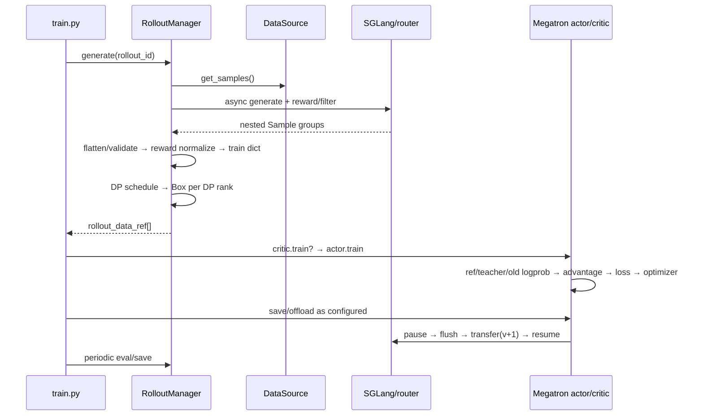

# slime 一轮 RL 迭代端到端实现分析

> **源码基线**：slime `main@681b3adca54105d5ecd3fb822fa0dc58a427e0f9`
> **核验日期**：2026-08-14 · **系列**：[[slime/index]]
> **结论先行**：slime 一轮迭代的真正事务边界不是 optimizer step，而是“采到一个自洽的 policy snapshot → 用它形成完整训练统计 → 更新 Megatron → 把新权重原子提交给 SGLang”。同步和一拍异步只改变阶段重叠，不改变这个提交边界。

## 1. 初始化：先 serving，再根据它完成训练侧装配

同步与异步入口都按同一顺序初始化：创建 placement group → 创建 `RolloutManager` 和 SGLang engines → 创建 actor/critic groups → 首次把 actor 权重推给 rollout。[`train.py:13-30`](https://github.com/THUDM/slime/blob/681b3adca54105d5ecd3fb822fa0dc58a427e0f9/train.py#L13-L30) RolloutManager 必须先初始化，因为它拥有 DataSource，`num_epoch` 模式下需要先由 dataset 长度计算每 epoch 的 rollout 数。[`placement_group.py:227-248`](https://github.com/THUDM/slime/blob/681b3adca54105d5ecd3fb822fa0dc58a427e0f9/slime/ray/placement_group.py#L227-L248)

训练 actor 初始化后把真实 DP/CP/VPP 配置写成 `train_parallel_config`；这份运行时拓扑随后交给 RolloutManager，后者才能构造正确的 DP schedule。[`actor.py:95-113`](https://github.com/THUDM/slime/blob/681b3adca54105d5ecd3fb822fa0dc58a427e0f9/slime/backends/megatron_utils/actor.py#L95-L113) [`actor_group.py:188-208`](https://github.com/THUDM/slime/blob/681b3adca54105d5ecd3fb822fa0dc58a427e0f9/slime/ray/actor_group.py#L188-L208)

## 2. 同步主链：九个阶段



### 阶段 1：取得 prompt groups

默认 DataSource 每次取 `rollout_batch_size` 个 prompt，每个 prompt deepcopy 成 `n_samples_per_prompt` 个 sample，并分配稳定的 group/sample index；buffer 版本会优先消费上轮回收的 partial groups。[`data_source.py:90-118`](https://github.com/THUDM/slime/blob/681b3adca54105d5ecd3fb822fa0dc58a427e0f9/slime/rollout/data_source.py#L90-L118) [`data_source.py:168-211`](https://github.com/THUDM/slime/blob/681b3adca54105d5ecd3fb822fa0dc58a427e0f9/slime/rollout/data_source.py#L168-L211)

### 阶段 2：并发生成、reward 与动态 admission

`GenerateState` 的 semaphore 容量是 per-server concurrency × engine 数；每个 prompt group 是一个外层 task，组内 samples 再并发生成，随后按 per-sample 或 group RM 打分。[`sglang_rollout.py:83-149`](https://github.com/THUDM/slime/blob/681b3adca54105d5ecd3fb822fa0dc58a427e0f9/slime/rollout/sglang_rollout.py#L83-L149) [`sglang_rollout.py:225-336`](https://github.com/THUDM/slime/blob/681b3adca54105d5ecd3fb822fa0dc58a427e0f9/slime/rollout/sglang_rollout.py#L225-L336)

外层 rollout loop 维持目标 accepted group 数；filter 丢弃一组时会继续补采，凑齐后 abort 剩余 in-flight 请求，partial 模式才把已有输出回收到 buffer。[`sglang_rollout.py:374-470`](https://github.com/THUDM/slime/blob/681b3adca54105d5ecd3fb822fa0dc58a427e0f9/slime/rollout/sglang_rollout.py#L374-L470)

### 阶段 3：从嵌套生成输出转成完整 step 视图

RolloutManager 先校验 compact fanout 的 sibling 是否共享 `rollout_id`，再逐层 flatten；这一步必须发生在 reward/reducer 之前，否则一条 agent rollout fanout N 个训练片段会被计数 N 次。[`rollout.py:671-701`](https://github.com/THUDM/slime/blob/681b3adca54105d5ecd3fb822fa0dc58a427e0f9/slime/ray/rollout.py#L671-L701) [`rollout.py:941-970`](https://github.com/THUDM/slime/blob/681b3adca54105d5ecd3fb822fa0dc58a427e0f9/slime/ray/rollout.py#L941-L970)

### 阶段 4：reward 统计与 train-data ABI

默认 GRPO/GSPO/CISPO/reinforce++ baseline 先按 group 做 reward mean/std normalization；随后把 Sample 转成 tokens、response lengths、rewards、loss masks、rollout ids、logprobs/top-p/routing/teacher metadata。[`rollout.py:722-747`](https://github.com/THUDM/slime/blob/681b3adca54105d5ecd3fb822fa0dc58a427e0f9/slime/ray/rollout.py#L722-L747) [`rollout.py:749-866`](https://github.com/THUDM/slime/blob/681b3adca54105d5ecd3fb822fa0dc58a427e0f9/slime/ray/rollout.py#L749-L866)

这里还在完整 step 上预计算每个 `rollout_id` 的 `rollout_mask_sums`。这是一个关键架构决定：只有此时能看见同一 rollout 的所有 fanout fragments；进入 micro-batch 后已无法局部恢复分母。[`rollout.py:799-814`](https://github.com/THUDM/slime/blob/681b3adca54105d5ecd3fb822fa0dc58a427e0f9/slime/ray/rollout.py#L799-L814)

### 阶段 5：DP/mbs 调度与数据运输

RolloutManager 调用 `build_dp_schedule`，按逻辑 rollout 划 step，再结合序列长度、dynamic batch、VPP group 约束得到每个 DP rank 的 partition/micro-batch indices；每 rank 只拿自己的字段子集，包装进 Ray `Box`，transport 可选 object store 或 NIXL。[`rollout.py:871-938`](https://github.com/THUDM/slime/blob/681b3adca54105d5ecd3fb822fa0dc58a427e0f9/slime/ray/rollout.py#L871-L938)

### 阶段 6：训练侧取数与设备/CP 变换

每个 Megatron actor 用自己的 DP rank 解包数据，提前把 tokens、loss masks、rollout denominators 搬到 GPU；rollout/teacher logprob 按 CP layout 切片。[`actor.py:245-299`](https://github.com/THUDM/slime/blob/681b3adca54105d5ecd3fb822fa0dc58a427e0f9/slime/backends/megatron_utils/actor.py#L245-L299) `DataIterator` 按预计算 micro-batch indices 取字段，VPP 每个 stage 使用独立 iterator cursor。[`data.py:201-245`](https://github.com/THUDM/slime/blob/681b3adca54105d5ecd3fb822fa0dc58a427e0f9/slime/backends/megatron_utils/data.py#L201-L245)

### 阶段 7：critic 与 actor 的内部顺序

PPO critic 先 forward values，算 advantages/returns，再执行 value-loss train，并只由 PP last stage 返回 CPU values。[`actor.py:396-422`](https://github.com/THUDM/slime/blob/681b3adca54105d5ecd3fb822fa0dc58a427e0f9/slime/backends/megatron_utils/actor.py#L396-L422)

actor 的顺序是 ref/teacher logprob → old actor/current actor logprob（可按严格条件复用 loss forward）→ 接收 critic values → 恢复 actor → 全 rollout advantage → policy train → 备份新 actor/ref。[`actor.py:424-503`](https://github.com/THUDM/slime/blob/681b3adca54105d5ecd3fb822fa0dc58a427e0f9/slime/backends/megatron_utils/actor.py#L424-L503) [`actor.py:514-564`](https://github.com/THUDM/slime/blob/681b3adca54105d5ecd3fb822fa0dc58a427e0f9/slime/backends/megatron_utils/actor.py#L514-L564)

### 阶段 8：checkpoint 与内存生命周期

主循环按 `save_interval`、epoch 边界和最终 step 决定保存；`release_train` 会强制同步保存后杀掉训练 actors，下轮再从 checkpoint 重建；普通 offload 则保留 actor，只暂停 GPU 内存并销毁/重建 process groups。[`train.py:71-88`](https://github.com/THUDM/slime/blob/681b3adca54105d5ecd3fb822fa0dc58a427e0f9/train.py#L71-L88) [`actor_group.py:151-186`](https://github.com/THUDM/slime/blob/681b3adca54105d5ecd3fb822fa0dc58a427e0f9/slime/ray/actor_group.py#L151-L186) [`actor.py:205-243`](https://github.com/THUDM/slime/blob/681b3adca54105d5ecd3fb822fa0dc58a427e0f9/slime/backends/megatron_utils/actor.py#L205-L243)

### 阶段 9：权重提交

actor updater 先恢复/重连必要 process groups，发现 engine crash 时先恢复 serving actor，然后执行 updater；默认 NCCL path 的事务序列是 pause generation → flush cache → 分 bucket 传完所有权重 → quant postprocess → continue generation。[`actor.py:592-653`](https://github.com/THUDM/slime/blob/681b3adca54105d5ecd3fb822fa0dc58a427e0f9/slime/backends/megatron_utils/actor.py#L592-L653) [`update_weight_from_distributed.py:102-146`](https://github.com/THUDM/slime/blob/681b3adca54105d5ecd3fb822fa0dc58a427e0f9/slime/backends/megatron_utils/update_weight/update_weight_from_distributed.py#L102-L146)

## 3. 一拍异步究竟重叠了什么

```text
time ─────────────────────────────────────────────>
rollout:  [ gen 0 ][      gen 1      ][ gen 2 ]
train:             [train 0][train 1]
commit:                     |v1|      |v2|
                            ↑ wait gen future before commit
```

异步入口先发起 rollout 0；取得结果后立刻发 rollout 1，再训练 0。它没有让 trainer 消费无限滞后的 replay buffer，也没有允许权重在请求中途切换；到 `update_weights_interval` 边界会先 `ray.get` 当前 generation future，再提交新权重。[`train_async.py:31-70`](https://github.com/THUDM/slime/blob/681b3adca54105d5ecd3fb822fa0dc58a427e0f9/train_async.py#L31-L70)

因此其语义是 **bounded one-stage pipeline**：吞吐收益来自 phase overlap，代价是 rollout N+1 通常仍由旧于 train N 完成后的 policy 生成。`update_weights_interval > 1` 会进一步增大 policy age，需要 [[17_slime_train_inference_consistency_analysis]] 中的 mismatch/TIS/OPSM 诊断。

## 4. 三个关键不变量

1. **单条生成权重快照不变**：权重提交前等待所有 generation future，updater 内再 pause/flush。
2. **逻辑 rollout 统计单位不变**：fanout、DP partition、micro-batch packing 之后仍按 `rollout_id` 和完整 denominator 聚合。
3. **训练步与 serving version 单调前进**：initial push 后，每个成功提交产生下一 version；disk/delta path 还把 version 写入目录/index，SGLang meta 回传给 Sample。

只满足 optimizer 正常 step 不足以说明这一轮正确；这三个不变量分别由控制面、数据/loss 面、权重面共同保证。

## Related Pages

- [[11_slime_ray_control_plane_analysis]] — 本页 RPC 背后的资源和 actor owner
- [[12_slime_sample_datasource_analysis]] — Sample 到 Box 的字段级转换
- [[14_slime_megatron_training_analysis]] — 阶段 6–8 深潜
- [[16_slime_weight_sync_analysis]] — 阶段 9 的四种实现
- [[30_slime_rollout_optimization_analysis]] — 同步、partial、fully async 的吞吐权衡
