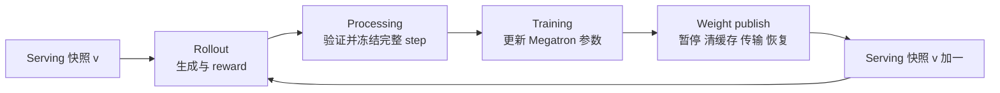
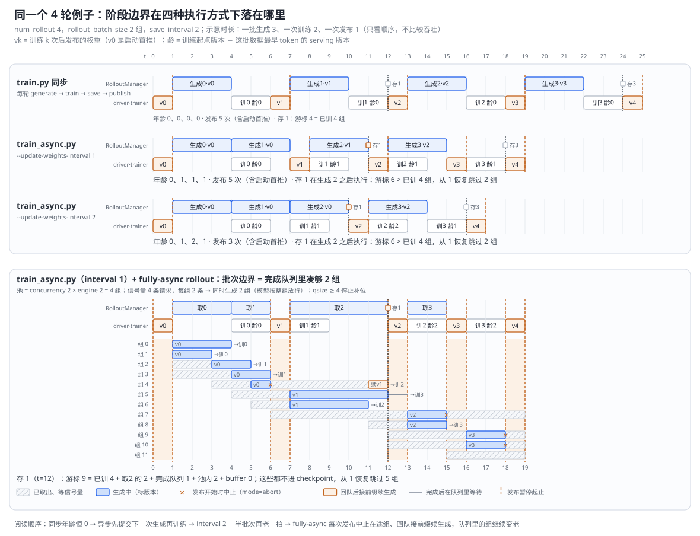
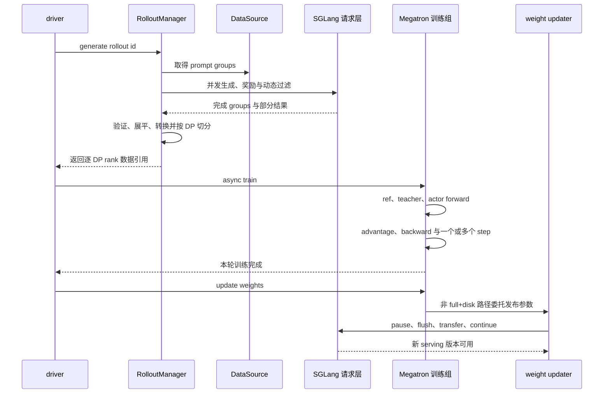

# slime 端到端迭代：带版本边界的四阶段事务

> **源码基线**：`THUDM/slime@4c193f1f37509cca70f0e88807a9305b70f63f4e`（`main`，2026-09-03）
> **主题**：本页先说明在线 RL 的一轮 iteration 为什么要按采样、数据冻结、训练、权重发布四个阶段执行，以及每个阶段保护什么；再用同一个 4 轮例子比较 `train.py`、`train_async.py` 两种发布间隔和 fully-async rollout 替换下的版本年龄、发布栅栏与积压；最后分析各入口的 checkpoint 切口、失败模式、模式选择和 ABORTED 续生成的演进。
> **适用范围**：端到端控制时序、策略版本与恢复切口；Ray 对象职责、Sample 与 DataSource 字段、SGLang 请求层、Megatron 训练、权重传输、训推一致性、同步保存的撕裂窗口各有专题页，本页只在跨阶段边界处概括并链接。
> **最近更新**：2026-09-17。本页覆盖四种执行方式的同例时序图、异步与 fully-async 入口的 checkpoint 切口，以及 ABORTED 组回队后续生成的实现边界。

slime 的一轮 iteration 不是"调用一次 optimizer"这么窄，而是一个带版本边界的阶段事务：**用已发布的 serving 权重采样 → 在完整 rollout 视图上冻结训练数据 → 更新训练权重 → 按受控发布协议切换下一个 serving 版本**。同步入口、one-stage async 入口和 fully-async rollout 替换改变的是阶段重叠的位置和允许的策略年龄，并没有取消数据闭合点与权重提交点。代价是 barrier、等待、缓存清理与数据排队；换来的是请求不看到半套权重、训练统计不在切分后失真、生成/训练/发布有明确先后。这不构成全局 exactly-once 保证：本页 §5 会说明，只有同步入口的 checkpoint 游标与模型进度对齐。

Ray 对象职责、Sample 字段、SGLang 请求状态、Megatron 内核、loss 归一化、权重 transport 和训推一致性的字段级细节分别由 [[11_slime_ray_control_plane_analysis|Ray 控制面]]、[[12_slime_sample_datasource_analysis|Sample 与 DataSource]]、[[13_slime_sglang_rollout_engine_analysis|SGLang rollout 引擎]]、[[14_slime_megatron_training_analysis|Megatron 训练]]、[[15_slime_loss_parallelism_analysis|loss 归约]]、[[16_slime_weight_sync_analysis|权重同步]] 和 [[17_slime_train_inference_consistency_analysis|训推一致性]] 负责。

## 1. 问题：训练侧与 serving 侧是两份会变化的状态

在线 RL 同时维护两份会变化的状态：训练侧参数与 serving 侧已发布版本。设 rollout $i$ 观察到的 serving 版本为 $v(i)$，其原始轨迹为 $R_i^{v(i)}$，处理后冻结的训练 batch 为 $B_i^{v(i)}$，一轮的逻辑关系是：

$$
R_i^{v(i)}
\xrightarrow{\mathrm{process}}
B_i^{v(i)}
\xrightarrow{\mathrm{train}}
\theta_{k+1}
\xrightarrow{\mathrm{publish}}
S_{k+1}.
$$

这里故意没有写 $v(i)=k$。本页把"训练 $k$ 次之后发布的权重"记作 $v_k$（$v_0$ 是启动时的首次推送），把一批数据的**策略年龄**定义为训练这批数据时的起点版本减去这批数据里最早 token 的 serving 版本。同步入口的年龄恒为 0；one-stage async 让 rollout 提前一拍；`--update-weights-interval > 1` 让多个 rollout 共用较旧的 serving 版本；fully-async 还会让一组数据跨过发布栅栏。版本年龄、off-policy 分布差与训推实现差不是同一件事，概念区分见 [[25_on_policy_off_policy_staleness_analysis|on-policy、off-policy 与 staleness]]。

`--update-weights-interval` 默认 1。driver 层只有 `train_async.py::train` 读它：间隔命中或 `release_train=True` 时发布，后者强制每轮发布。同步 `train.py::train` 每轮无条件调用 `actor_model.update_weights()`，这个参数不降低同步发布频率。它在两个入口里都还影响 `keep_old_actor` 的备份队列：`MegatronTrainRayActor.update_weights` 在 interval 为 1 时执行 rollout_actor → old_actor、actor → rollout_actor 的队列式备份，否则只把当前 actor 备份为 old_actor。参数帮助只写 "Interval for updating the weights"，没有说明同步入口不读它。

因此 slime 守的不是"任何配置下都零 off-policy"，而是下列分层不变量。表是本页对后文调用链的**设计抽象**，不是项目文档原话：

| 不变量 | 必须成立的边界 | 允许的放宽 |
|---|---|---|
| **成功发布的完整性** | serving 对外只能是完整旧版本或完整新版本 | 可以降低发布频率，不能暴露分 bucket 更新中的半版本 |
| **batch 闭合性** | reward、mask、rollout identity 与分母在训练前冻结 | 可以让 batch 较旧，不能训练到一半再改变其语义 |
| **版本可追踪性** | 生成侧 metadata 能记录实际观察到的权重版本 | partial / async 可以跨版本，但必须选择保留、mask 或校正旧 token |
| **资源排他性** | colocate 时 rollout KV/weights 与训练状态按阶段占用显存 | 资源分离时可以重叠，colocate 不能假装有两份 GPU 容量 |
| **数据所有权** | 被选中的 prompt group 要么进入 train batch，要么留在受控位置 | 默认 rollout 开 partial 时只回收组内有 ABORTED 且 `response_length>0` 的组，其余在途组与未被选中的多余完成组都丢弃；fully-async 只保证不过量 drain，完成队列、池与 buffer 不进 checkpoint（§5） |

`Sample._apply_meta_info` 在响应带 `finish_reason` 时把 SGLang 返回的 `weight_version` 追加到 `weight_versions`，而不是只保留最后一个版本，partial continuation 因而能暴露跨版本轨迹。`--mask-offpolicy-in-partial-rollout` 默认关闭；它只在同时开 `--partial-rollout` 时生效，由 `generate_and_rm` 在续生成前把已有 response 的 `loss_mask` 清零。

> **设计分析**：slime 中的"on-policy 边界"应理解为**可审计的策略版本边界**，而不是笼统的"rollout 永远来自当前 actor"。同步调度尽量缩短样本相对当前策略的滞后；异步执行、中断续生成和较大的更新间隔用策略时效性换吞吐，但仍保证发布完整，并能说明 token 对应的策略版本。TIS 比值怎样同时吸收训推失配与这段版本差、源码为什么没有单独的版本校正项，见 [[17_slime_train_inference_consistency_analysis|训推一致性]]。

## 2. 为什么不让各阶段自由运行

直观替代方案是让 rollout、reward、训练和权重传输各自自由运行：哪个 sample 完成就立刻送 trainer，哪个 optimizer step 完成就立刻推一部分权重。它看似能消除所有空泡，却同时破坏四个约束。数据闭合点见 §3，四种执行方式把边界移到哪里见 §4，保存切口见 §5。

### 2.1 单个样本到达时，全局统计还算不出来

GRPO 类 reward 处理需要同组视图：`RolloutManager._post_process_rewards` 在估计器为 grpo / gspo / cispo / reinforce_plus_plus_baseline 且开 reward 归一化时，若样本数等于 `rollout_batch_size × n_samples_per_prompt` 就 reshape 成 prompt 行，否则 `view(-1, rewards.shape[-1])` 把当前全部 reward 当作一组。compact fanout 的 loss 分母 `rollout_mask_sums` 需要同一 logical rollout 的全部 fragments（`RolloutManager._convert_samples_to_train_data` 在切分前预计算）；`build_dp_schedule` 按 `global_batch_size` 个 rollout 划 step，同一 rollout 的样本必须在同一个 step。这些值都必须在分包前从完整一轮数据算出。

### 2.2 推理请求执行期间不能随意切换权重

异步 driver 在发布前显式 `ray.get` 当前 generation future，源码注释说这是为了防止生成中途更新权重；默认分布式 updater 再执行 pause → flush → barrier → 传输 → continue。两层同步分别控制"当前 batch 的 future 是否闭合"和"engine 是否处于可提交状态"。发布路径本身还会调用 RolloutManager（`get_updatable_engines_and_lock`，开容错时还有 `recover_updatable_engines`），RolloutManager 是同步 actor，这些调用本来也会排在正在执行的 `generate` 之后（分析判断）。

对默认 rollout，future 闭合意味着本轮提交的请求都已收束；对 fully-async，它只说明完成队列里凑够了目标组数，后台 worker 仍有在途组（§4.4）。这些在途组在每次发布时都会被中止：所有 updater 都先调 `SGLangEngine.pause_generation`，请求体是 `{}`；SGLang v0.5.15.post1 的 `PauseGenerationReqInput.mode` 默认 `"abort"`，`TokenizerManager.pause_generation` 循环 `abort_request(abort_all=True)`，slime 的补丁不改这一段。在途请求以 `finish_reason=abort` 返回已生成的部分，`Sample._apply_meta_info` 把它标成 ABORTED，`AsyncRolloutWorker._make_done_cb` 把整组交回 buffer；pause 期间新到的请求在服务端等待 `continue_generation`，不被中止。所以在 `train_async.py` + fully-async 下，回队分支在每次 `update_weights` 时都会触发，证据链见 [[13_slime_sglang_rollout_engine_analysis#2.3 变体：同一协议的三条替换轴|ABORTED 回队可达条件]]。

### 2.3 共置模式下显存不足以让训推同时常驻

同步入口通过 offload/onload 把 GPU 生命周期切成 rollout 阶段与训练阶段；异步入口开头 `assert not args.colocate`。自由运行只有在资源真正分离、或另有抢占与显存管理协议时才成立。

### 2.4 恢复必须把模型进度与数据游标对齐

周期保存时，`train.py::train` 在同一个 `should_run_periodic_action` 条件下保存 actor（还要求本轮 `actor_trains`）、critic 与 global DataSource 游标；恢复时训练侧按加载到的 iteration 给出统一的 start id，RolloutManager 再加载 `start_rollout_id − 1` 的游标。这个对齐只在同步入口成立：`train_async.py` 的保存排在下一次生成之后执行，游标已经越过一批，fully-async 的完成队列与池更不在 checkpoint 里（§5）。一个没有周期提交 id 的自由流要另行解决 exactly-once、checkpoint 切口与队列快照；slime 的默认路径选择了更小的恢复边界，异步入口则接受了这条边界的偏移。

## 3. 四阶段事务分别保护什么

<!-- Figure spec: LR lifecycle; serving version -> generated data -> processing -> training -> publication -> next serving. Shows success order, not distributed rollback. -->

```mermaid
flowchart LR
    SV["Serving 快照 v"] --> RO["Rollout<br/>生成与 reward"]
    RO --> PR["Processing<br/>验证并冻结完整 step"]
    PR --> TR["Training<br/>更新 Megatron 参数"]
    TR --> PB["Weight publish<br/>暂停 清缓存 传输 恢复"]
    PB --> NV["Serving 快照 v 加一"]
    NV --> RO
```

### 3.1 Rollout：先固定采样数据，再允许 actor 更新

同步 driver 在每个 `rollout_id` 上先阻塞取得 `RolloutManager.generate` 的结果，之后才发起 critic/actor 训练，训练结束后才发布权重。默认 rollout 函数 `generate_rollout_async` 按 `over_sampling_batch_size`（缺省等于 `rollout_batch_size`）整波取 prompt group，持续补充直到取得目标数量的有效组；凑齐后调用 `abort`：取消按请求可取消的流式任务，只在还有服务端生成时向 router 的全部 worker 发 abort，再等 pending task 全部返回。开 `--partial-rollout` 时，只有组内有 ABORTED 且 `response_length>0` 的 Sample 的组被交回 DataSource buffer；其余在途组和超过目标数的完成组都不回收（源码注释承认未把全部未用样本放回）。

这个阶段边界保护两件事：进入本轮训练的数据已经有确定的 token、reward、mask 与 behavior metadata；被回收的在途数据有明确去向。生成并发、动态过滤和 partial 回收的细节属于 [[13_slime_sglang_rollout_engine_analysis|SGLang rollout 引擎]] 与 [[12_slime_sample_datasource_analysis|Sample 与 DataSource]]，iteration 只依赖它们交付一个**闭合的逻辑 batch**。

### 3.2 数据处理：为什么必须在 DP 切分前看到完整一轮数据

`RolloutManager.generate` 先经 `_get_rollout_data` 取得 Sample、校验 `rollout_id` 标注并展平，再由 `_convert_samples_to_train_data` 形成包含 `tokens`、`response_lengths`、`loss_masks`、`rewards` 和可选 behavior tensors 的 train dict，最后 `_split_train_data_by_dp` 生成 DP schedule 与逐 rank 引用。冻结的数据语义由 [[12_slime_sample_datasource_analysis|Sample 与 train dict]] 定义；`rollout_mask_sums` 的分母推导见 [[15_slime_loss_parallelism_analysis|loss 归约]]，DP 对齐和裁剪见 [[14_slime_megatron_training_analysis|Megatron 训练]]。

**设计分析**：先有完整样本视图再分包，trainer 才能按固定统计口径消费。它是数据准备边界，不意味着 Python 对象变成不可变类型，也不承诺分布式故障时回滚。

### 3.3 训练：一轮 rollout 可以包含多个优化器步骤

控制面通过 `RayTrainGroup.async_train` 向每个 trainer actor 发出同一 `rollout_id` 和同一份按 DP 切好的数据引用，每个 rank 在 `_get_rollout_data` 里按自己的 DP rank 取分片。`MegatronTrainRayActor.train` 按角色分派到 `train_actor` 或 `train_critic`，开 train offload 时在尾部 sleep；actor 在 `train_actor` 里先完成所需的 ref / teacher / 当前策略 forward 与整轮 advantage，再进入 policy 训练，训练结束后把最新 actor 权重备份到 `weights_backuper`。

`train_one_step` 对一个 step 的所有 micro-batch 做 forward/backward，梯度范数有效时调用一次 `optimizer.step()` 并按本 step 的 global batch 推进 scheduler。一个外层 rollout cycle 可以因此产生多次参数更新（step 数 = 本轮 rollout 数 ÷ `global_batch_size`），同步 serving 在该轮训练后发布一次，异步发布频率另受间隔控制。

### 3.4 权重发布：传输前后必须有完整的提交协议

`create_weight_updater` 按配置选择 updater：delta 模式走 `UpdateWeightFromDiskDelta`，disk 传输走 `UpdateWeightFromDisk`，colocate 走 `UpdateWeightFromTensor`，其余 full + nccl 走 `UpdateWeightFromDistributed`；初始版本号取 `update_weight_start_version`。默认分布式 updater 的顺序是：版本号加一；rank 0 暂停所有 rollout engine 并 flush cache（compressed-tensors 量化时还做加载前恢复）；所有训练 rank 过 gloo barrier；按 non-expert、expert 两遍分 bucket 发送，每遍之后 barrier；必要时做量化后处理；恢复生成，再 barrier 一次。每个 bucket 先经 Ray 把带相同 `weight_version` 的 metadata 发给各 engine，再从训练 rank 0 广播张量，全部完成后才释放 engine 锁。engine 侧如何记录版本由 SGLang 与镜像补丁决定，见 [[16_slime_weight_sync_analysis|权重同步]]。

full+disk 是控制责任的例外：`RayTrainGroup.update_weights` 自持 `_disk_weight_version`，在各 actor 写盘之后直接驱动 engine reload（`UpdateWeightFromDisk` 自己的版本号也同步递增）；`--ci-test` 时 `_reload_rollout_weights_from_disk` 逐 engine 比对版本、不一致抛 `RuntimeError`。完整链与失败边界见 [[11_slime_ray_control_plane_analysis|Ray 控制面]]。成功路径的暂停、清缓存与恢复不能理解为跨 engine 故障事务，源码没有全局回滚。

> **设计分析**：pause 不让请求跨过提交窗口——slime 发的 `{}` 落到上游默认的 abort 模式，在途请求被中止并带着已生成部分返回，暂停期间新到的请求在服务端等待恢复（§2.2）；flush 防止新权重复用旧权重产生的 KV/prefix cache；version 把"传输结束"升级成"engine 已应用同一逻辑版本"。只优化传输带宽而绕过这三步，会把性能问题变成静默正确性问题。

## 4. 同一个例子：四种执行方式下的时序

四种执行方式共用一个最小例子：`num_rollout=4`、`rollout_batch_size=2` 组、`save_interval=2`（在 rollout 1 和最后的 rollout 3 保存），资源分离；示意时长为一批默认 rollout 生成 3、一次训练 2、一次发布 1 个时刻。fully-async 另设 `sglang_server_concurrency=2`、2 个 engine、`n_samples_per_prompt=2`，每组生成时长按组号取自一张固定表。图中每个数字都由生成器按下文的控制流复现算出，时长只决定先后，不用于比较吞吐。

模型按源码的默认发布语义画：RolloutManager 按提交顺序一次执行一个方法（§5.2）；发布开始时 pause 以默认的 abort 模式中止所有在途组，它们回到 buffer，worker 下一次补位先把它们取回（`RolloutDataSourceWithBuffer.get_samples` 先取 buffer，不推进游标），重新排信号量后接着已生成的前缀续生成（§8），剩余时长不变。证据链见 [[13_slime_sglang_rollout_engine_analysis#2.3 变体：同一协议的三条替换轴|ABORTED 回队可达条件]]。上游的 `in_place` 模式会让请求留在调度器里、恢复后接着旧 KV 继续，但 slime 不发这个模式，图中不画。模型的三处简化（分析假设）：信号量按整组放行；中止回调与重新补位发生在发布开始的同一时刻；暂停期间不放行新组——源码里暂停期间发出的请求会先占信号量、再在服务端等待恢复（§2.2），推进量与先后顺序相同。

### 4.1 同步：最清楚的四阶段串行事务

`train.py::train` 的初始化顺序是：创建 placement group → `create_rollout_manager`（开 rollout offload 时在返回前卸载 serving）→ `create_training_models`（全局数据集开启时加载 `start_rollout_id − 1` 的游标）→ 开 rollout offload 且非 release-train 时 `onload_weights` → 强制做一次 `update_weights` → 可选 `check_weights` 比对 → `onload_kv`。所以 cycle 0 不是从 SGLang 启动时碰巧加载的权重开始，而是从训练侧明确发布过的 $v_0$ 开始，权重与 KV/CUDA graph 分阶段恢复。`release_train` 跳过 driver 的 `onload_weights`，由磁盘 reload 路径恢复权重。

主循环每轮是：可选训练前评估 → `generate` →（开 rollout offload 时）offload serving → 训练 → 周期保存 → `offload_train` 闭包 →（开 rollout offload 时）onload serving 权重 → `update_weights` → onload KV → 周期评估。例子里生成 $i$ 总在 $v_i$ 上执行、训练从 $v_i$ 起步，年龄依次为 0、0、0、0，发布 5 次（含启动首推）。与 verl 默认同步 global step 的对照见 [[10_verl_end_to_end_iteration_analysis|verl V1 同步迭代]]。

<!-- Figure spec: sequence of default non-disk synchronization; driver, RolloutManager/DataSource, serving, training and updater. Arrows identify submit, materialize and publish completion, not timing duration. -->

```mermaid
sequenceDiagram
    participant D as driver
    participant RM as RolloutManager
    participant DS as DataSource
    participant SG as SGLang 请求层
    participant TG as Megatron 训练组
    participant WU as weight updater
    D->>RM: generate rollout id
    RM->>DS: 取得 prompt groups
    RM->>SG: 并发生成、奖励与动态过滤
    SG-->>RM: 完成 groups 与部分结果
    RM->>RM: 验证、展平、转换并按 DP 切分
    RM-->>D: 返回逐 DP rank 数据引用
    D->>TG: async train
    TG->>TG: ref、teacher、actor forward
    TG->>TG: advantage、backward 与一个或多个 step
    TG-->>D: 本轮训练完成
    D->>TG: update weights
    TG->>WU: 非 full+disk 路径委托发布参数
    WU->>SG: pause、flush、transfer、continue
    SG-->>WU: 新 serving 版本可用
```

一轮成功事务的状态与完成信号：

| 源码状态或完成信号 | 责任主体 | 此时可见的状态 | 下一边界 |
|---|---|---|---|
| `Sample.weight_versions` | engines / Sample | 请求 metadata 记录观察到的版本 | `generate` 收集 samples |
| `_get_rollout_data` 返回 `data, metrics` | RolloutManager / DataSource | Sample 已收束，待转换 | `_convert_samples_to_train_data` |
| `_split_train_data_by_dp` 返回引用 | RolloutManager / Ray object store | train dict 与 DP schedule 已形成 | `async_train` 消费 |
| `ray.get(actor_model.async_train(...))` 返回 | trainer actors / driver | 本轮全部 rank 训练已完成 | save / 内存清理 / update |
| `update_weights` 返回 | weight updater 或 full+disk 的 RayTrainGroup | 成功路径已完成参数应用与恢复请求 | 下一次 generate / eval |

当 rollout 与训练 colocate 时，`slime_validate_args` 默认同时打开 train 与 rollout offload（release-train 例外：关闭 train offload、强制 rollout offload）；PPO（`use_critic`）无论是否 colocate 都强制 train offload。

> **设计分析**：同步不只是"实现简单"，它还是显存时分复用协议：同一批 GPU 只有在 rollout 边界闭合后才安全地交给 Megatron，训练结束后再交回 serving。这个资源不变量解释了为什么异步入口直接禁止 colocate。

### 4.2 train_async.py，interval 1：rollout 边界提前一拍

`train_async.py::train` 在首推之后先提交生成 0；每轮拿到当前批次后，立即提交生成 $i+1$，再用批次 $i$ 训练。到发布间隔时，它先 `ray.get` 下一次生成的 future、把 future 置空，再 `update_weights()`；下一轮直接使用这次取回的批次。于是生成 $i+1$ 总在 $v_i$ 上执行，训练却从 $v_{i+1}$ 起步：例子里年龄依次为 0、1、1、1，发布仍是 5 次。

边界没有消失，而是从"训练前等待本轮 rollout"移到"发布前汇合下一次 rollout 的 future"。发布轮里生成臂与训练臂同时出发，driver 在栅栏上补齐两臂之差，一轮约为 max(生成臂, 训练臂 + 保存) + 发布：例子里同步一轮是 3 + 2 + 1 = 6 个时刻，interval 1 则每 4 个时刻发布一次。周期公式、分段计时键与数值例子归 [[30_slime_rollout_optimization_analysis#3.3 训练闭环关键路径：同步相加，one-stage async 取较大臂|Rollout 优化的训练闭环关键路径]]。代价是除第一批外每批都晚一拍；异步入口还显式断言 `not args.colocate`，重叠假设建立在资源分离之上。训练前评估与 `num_rollout=0` 纯评估只在同步入口实现。verl 的 stable async 用 ReplayBuffer 和固定旧策略解决同一问题，对照见 [[17_verl_v1_async_trainer_analysis|verl stable async]]。

### 4.3 train_async.py，interval 2：一半批次再老一拍

间隔为 2 时只在 `(rollout_id + 1) % 2 == 0` 的轮次汇合 future 并发布，其余轮次不等待下一次生成就进入下一轮。例子里生成 2 仍在 $v_0$ 上执行、训练从 $v_2$ 起步，年龄依次为 0、1、2、1，发布只有 3 次。若 `num_rollout=3`，间隔 2 只在 rollout 1 发布，末轮不会因为循环结束而补发一次。`rollout_id`、optimizer step 与 weight version 因而不能互换：把例子放大到每组 8 条样本、`rollout_batch_size=32`、`global_batch_size=128`，每轮 256 条响应切成 2 个训练 step，4 轮共 8 个 step，而版本号只随发布递增。

### 4.4 fully-async rollout：批次边界移到完成队列

默认 `--rollout-function-path` 是 `slime.rollout.sglang_rollout.generate_rollout`。fully-async 不是第三个 driver，而是叠加在 `train_async.py` 上的 rollout 函数替换，`examples/fully_async/README.md` 要求同时选择这个入口与 `slime.rollout.fully_async_rollout.generate_rollout_fully_async`。

首次调用时 `_get_global_worker` 在 RolloutManager 进程里创建一个跨 rollout 调用共享的 `AsyncRolloutWorker`：daemon 线程里跑独立 asyncio 循环，每秒回收完成 task，只要池内组数小于池上限、完成队列长度也小于池上限，就 `data_buffer.get_samples(1)` 补一组。池上限是 `sglang_server_concurrency × engine 数`（README 写的是只按 `sglang_server_concurrency`，以代码为准）；`GenerateState` 的信号量是同一个数，但按 Sample 计。例子里池 4 组、信号量 4 条请求，每组 2 条样本；实际信号量按 Sample 先来先到放行，组与组可以交错，模型简化为整组放行，所以同时生成 2 组，另外 2 组已取出、在等信号量。完成回调 `_make_done_cb` 用 `getattr(s, "status", None)` 逐个检查组里的元素，含 ABORTED 成员的组交回 `data_buffer.add_samples`，其余组放入无界完成队列。这个检查只看组的直接元素：自定义生成函数扇出成 `list[Sample]` 时，组元素是列表而不是 Sample，`getattr` 取到 `None`，内层即使有 ABORTED 也不会回队，整组照常进入完成队列；而 `generate_and_rm` 在扇出成员有 ABORTED 时已跳过打分，这些 Sample 会带着空 reward 进入 RolloutManager 的处理（分析判断，按源码推导，未运行验证）。每次 rollout 调用只 `get_completed_groups(limit=目标 − 已收)`，凑够 `rollout_batch_size` 组、按 `sample.index` 排序后返回，余量留给下一轮。`_generate_rollout_async` 在执行期间每 0.05 秒取一次，所以完成组只有在没有 `generate` 执行的窗口里（driver 训练、保存或发布时）才会在队列里积压，qsize 闸门也只在这些窗口里合上；图里的消费按同一语义复现。

放进同一个例子，fully-async 移动了两个边界：

1. **在途数据的所有权**从当前 rollout 调用移到长期 worker，而发布会把它们打回 buffer。组 4 在 $v_0$ 上生成了 1 个时刻，$v_1$ 发布在 t=6 开始时被中止、回到 buffer，同一时刻被 worker 取回但不推进游标；它排在组 5、组 6 之后等信号量，t=11 才接着 $v_0$ 前缀用 $v_1$ 续生成，成为一条前缀 $v_0$、续段 $v_1$ 的跨版本轨迹。$v_3$ 发布中止 1 组，$v_4$ 发布开始时中止 2 组。
2. **rollout 边界**不再是"本轮请求全部收束"，而是"完成队列里凑够 2 组"。取 2 从 t=7 等到 t=12：组 6 在 t=11、组 4 与组 5 在 t=12 完成，取 2 拿走组 6 与组 4，组 5 留在队列里，下一轮才被训练 3 消费。

结果是即使 interval 为 1，四批训练的最大年龄依次为 0、1、2、2：训练 2 里的组 4 因为带着 $v_0$ 前缀续生成而年龄 2，训练 3 里的组 5 因为在队列里多等一轮而年龄 2。队列越长、池越大，被消费数据落后得越多；slime 没有 staleness 上限或准入检查（分析判断，源码中没有按版本丢弃或加权的逻辑）。verl experimental fully-async 用显式 policy version 与 staleness admission 处理同一问题，见 [[22_verl_fully_async_dynamic_schedule_deepdive|verl experimental fully-async]]；DORA 则让 rollout 集群同时服务多个版本、让长尾轨迹在旧版本里跑完，见 [[23_dora_multi_version_rollout_analysis|DORA 多版本 rollout]]。

它仍没有删除 processing 与 publish 边界：返回的组依旧经 RolloutManager 统一转换与调度，发布仍走 pause / flush / version 协议。README 的 Limitations 列出三条：不支持评估（`generate_rollout_fully_async` 在 `evaluation=True` 时抛 `ValueError`）、跨 rollout 只保证 best-effort 顺序、ABORTED 轨迹尚未接上 partial 式续跑（§8 说明代码与这句话的差距）。`tests/test_fully_async_rollout.py` 锁定三条队列契约：只取目标组数、完成回调不阻塞事件循环、队列满时停止补位。

> **设计分析**：这个实现是"持续生成 + 离散 batch 提交"，不是无界 replay service。完成队列的回压、固定 drain 数和 ABORTED 回队都在重建被持续 worker 弱化的事务边界；但版本年龄与 checkpoint 切口没有随之重建。

### 4.5 其余生命周期变体

- **PPO critic**：先发 critic 的 `async_train` 得到逐 rank `value_refs`；达到 `num_critic_only_steps` 后才把它们作为 actor 的 `external_data`，否则只等待 critic。PPO 会强制打开 train offload，训练角色在 `MegatronTrainRayActor.train` 尾部自行 sleep，因此同步 driver 的 `offload_train` 闭包实际只在无 critic 且未开 train offload 时调用 actor 的 `clear_memory`。这不等于 kill actor。
- **release-train**：每轮生成后 `actor_model.create()` 重建训练 actor，从上轮同步保存的 checkpoint 恢复，训练后强制保存。`RayTrainGroup.save_model` 把 `args.load` 改为 `args.save`，清除 `ckpt_step`、置 `finetune=False` 并恢复 optimizer/RNG 加载选项；随后 full+disk 更新先导出 serving 权重、释放 actor，再重载 serving，控制面版本号跨 actor 重建延续。参数校验要求 disk + full、`--save`，拒绝 critic 与 `keep_old_actor`，并把缺省的 `save_interval` 设为 1。细节见 [[11_slime_ray_control_plane_analysis|Ray 控制面]]。
- **评估**：两个入口的周期评估都用 `should_run_periodic_action`；异步入口里若本轮没有发布，已提交的下一次 `generate` 还在 RolloutManager 队列里，`eval` 排在它之后执行。参数、版本观察与输出边界见 [[27_slime_evaluation_path_analysis|评估路径]]。
- **调试旁路**：`--load-debug-rollout-data` 从保存的数据加载并可按比例抽样，同时自动打开 `debug_train_only`；`debug_train_only` 不启动 SGLang server，`eval` 直接返回；`debug_rollout_only` 在记录 samples 后返回、不建立 train dict，trainer actor 仍被创建但 `init` 早退。两个调试标志都让 `update_weights` 直接返回，这些路径不能证明 serving 权重已更新。

## 5. 保存与恢复切口：只有同步入口对齐

两个入口（fully-async 沿用 `train_async.py`）用的是同一段保存代码：周期命中时先保存 actor（本轮 `actor_trains` 时）与 critic 的 Megatron checkpoint，再 `ray.get(rollout_manager.save.remote(rollout_id))` 写 DataSource 状态。`RolloutDataSource.save` 只写 `sample_offset`、`epoch_id`、group/sample 计数与 metadata；`RolloutDataSourceWithBuffer` 没有覆盖 `save`，buffer 里的组不进 checkpoint。恢复时 `MegatronTrainRayActor.init` 令 `start_rollout_id = iteration + 1`，`create_training_models` 让 DataSource `load(start_rollout_id − 1)`。差别在于 `save` 在 RolloutManager 队列里排在什么后面。

### 5.1 同步入口：游标与模型进度一致

`train.py` 的 `save(i)` 在 RolloutManager 空闲时执行，此时只取过前 $i+1$ 批 prompt。例子里 rollout 1 保存时游标 4 = 已训 4 组，从 rollout 1 恢复后 `generate(2)` 正好取 prompt 4、5。仍存在的缺口是两次顺序写之间崩溃、缺游标文件时静默从 0 重来，以及 partial buffer 丢失，这些归 [[18_slime_fault_tolerance_observability_analysis|容错与可观测性]]。

### 5.2 train_async.py：保存的游标已经越过下一批

`train_async.py::train` 在训练 $i$ 之前就提交了 `generate.remote(i + 1)`，训练结束后才提交 `save.remote(i)`。RolloutManager 由 `create_rollout_manager` 以 `num_cpus`、`num_gpus`、`runtime_env`（NIXL 时加 `enable_tensor_transport`）创建，没有设置 `max_concurrency`，类里也没有 `async def` 方法；按 Ray 同步 actor 对同一调用方按提交顺序串行执行的契约推导，`save(i)` 要等 `generate(i+1)` 取完数、生成完才执行（这一步是由 Ray 契约推导的，未运行验证）。例子里 interval 1 的保存在 t=10 提交、t=11 执行，interval 2 在 t=9 提交、t=10 执行，两者保存的都是游标 6，而模型只训练了 4 组。

从这个 checkpoint 恢复：`start_rollout_id = 2`，`load(1)` 把游标放回 6，`generate(2)` 从 prompt 6 开始取，原本属于第 2 批的 prompt 4、5 从未被训练，跳过 2 组。有过滤器补采时，下一次生成可能多取几波，跳过的组数随之变大。最后一轮不提交下一次生成，所以 rollout 3 的保存是对齐的；只有中途保存受影响。另一个副作用是：`ray.get(save)` 让 driver 在保存处就等到下一次生成完成（interval 2 的 rollout 1 保存让 driver 从 t=9 等到 t=10）；保存轮即使不发布，这次等待也会发生。仓内的两条异步 E2E（`tests/test_qwen3.5_0.8B_gsm8k_async_short.py`、`tests/test_qwen2.5_0.5B_fully_async_short.py`）都不保存、不恢复，这条切口没有测试覆盖。

### 5.3 fully-async：队列与池都不在 checkpoint 里

fully-async 的 worker 线程在训练和保存期间继续从 DataSource 取数，与执行 `save` 的 actor 线程之间没有锁（分析判断：写入的字段可能来自两次取数之间）。例子里 rollout 1 的保存在 t=9 提交、t=12 才执行，driver 被挡了 3 个时刻；此时游标 9 = 已训 4 + 下一批 2 + 完成队列 1 + 池内 2 + buffer 0，池内 2 组还在等信号量、连请求都没发出。从 rollout 1 恢复会跳过 5 组：下一批已生成但未训练的数据、完成队列、池与 buffer 里的组都只在内存里。最后一轮的保存虽然不再提交生成，池内仍有 4 组，若以它为起点加大 `num_rollout` 续训，这 4 组同样丢失。发布时被中止、还在 buffer 里等待取回的组也一样不进 checkpoint；本例里它们都在同一时刻被取回，所以保存时 buffer 为空。

verl experimental fully-async 同样只保存 dataloader、不能无损恢复在途样本，对照见 [[23_verl_training_checkpoint_recovery_analysis|verl 训练 checkpoint 与恢复]]。

> **设计分析**：要让异步入口的游标与模型对齐，至少需要在提交下一次生成之前写游标，或把"已取出未训练"的组记入 checkpoint；fully-async 还需要完成队列与池的快照或可重放台账。源码没有这类机制，也没有文档声明这条切口；在它补上之前，异步续训应把恢复视为"跳过少量 prompt"的近似恢复。

## 6. 约束与失败模式：边界写错时会怎样

| 错误 | 直接后果 | 源码中的防线 |
|---|---|---|
| generation future 未收束就 publish | 请求可能跨越更新窗口，行为策略来源不再明确 | 异步 driver 在发布前 `ray.get` 下一次生成的 future（`train_async.py::train`） |
| 只传输权重，不 pause / flush | 新请求可能看见半版本；旧 KV/prefix cache 可能被新参数继续复用 | 分布式 updater 固定 pause → flush → transfer → continue（`UpdateWeightFromDistributed.update_weights`） |
| 某个 engine 未应用目标版本 | 集群同时服务多个模型版本，policy metadata 与实际路由不一致 | full+disk 在 `--ci-test` 时逐 engine 比对版本并抛 `RuntimeError`（`RayTrainGroup._reload_rollout_weights_from_disk`）；其余路径无运行期比对 |
| 在 DP 切分后才算 rollout 分母 | fanout fragments 落到不同 micro-batch 时各 rank 用局部分母，目标函数随 packing 改变 | converter 在完整 step 预计算并复制 `rollout_mask_sums`（`RolloutManager._convert_samples_to_train_data`） |
| fully-async 一次 drain 超过本轮所需 | prompt 已从 DataSource 消费，多余完成组若被调用方丢弃就永久丢数据 | `get_completed_groups(limit=...)` 只弹所需数量，`tests/test_fully_async_rollout.py` 锁定 |
| fully-async 组的请求持续返回 500 / 503 | `slime/utils/http_utils.py::_post` 重试 60 次后抛出，group task 以异常结束；`_make_done_cb` 只记日志就返回，这组既不回 buffer 也不进完成队列，prompt 已消费、就此丢失 | 无防线；条件见 [[13_slime_sglang_rollout_engine_analysis#2.3 变体：同一协议的三条替换轴|ABORTED 回队可达条件]] |
| ABORTED group 直接交 trainer | response/reward 可能不完整，prompt 所有权从队列消失 | 完成回调检测任一 ABORTED 成员就整组交回 buffer，默认发布语义下每次发布都会走到（§2.2）；扇出组的内层 Sample 不被检测，没有防线（§4.4） |
| 异步入口中途保存后续训 | 保存的游标已越过下一批，恢复时跳过这批 prompt；fully-async 还丢完成队列、池与 buffer | 无守卫、无测试（§5.2、§5.3） |
| 同步入口两次写之间崩溃 | 模型与游标不同批提交，恢复后游标静默从 0 开始或重复旧 prompt | 无原子 manifest；归容错页 |
| 连续 rollout 与 colocated training 同时占 GPU | serving KV/weights 与训练参数、梯度竞争同一显存 | 异步入口 `assert not args.colocate` |

"旧 cache 会污染新版本""cursor 错配导致重复或跳过"等后果是根据状态所有权推导的**设计分析**；源码事实是对应的 flush、save/load 顺序与断言确实存在或确实缺失。

## 7. 选择执行模式时真正要决定什么

| 模式 | 主要收益 | 明确代价 | 不能放宽的边界 |
|---|---|---|---|
| `train.py` 同步 | 年龄恒 0；支持 colocate 时分复用；保存切口与模型进度对齐 | rollout、训练、发布串行，空泡最大 | 完整 batch、资源交接、受控发布 |
| `train_async.py`，interval 1 | rollout $i+1$ 与训练 $i$ 重叠 | 需要分离资源；除首批外年龄 1；发布前仍要等 future；中途保存的游标越过一批 | future 汇合、processing、受控发布 |
| `train_async.py`，interval > 1 | 发布次数按间隔减少 | 年龄在 1 与间隔之间变化；末轮不补发 | 同上 |
| `train_async.py` + fully-async rollout | 长期并发池不等最慢在途组 | 每次发布中止在途组、回队续生成；年龄由队列与跨版本前缀决定、无上限检查；不支持评估；完成队列、池与 buffer 不进 checkpoint；回队后的续用取决于生成函数 | 完成批次的收口条件、回队职责、受控发布 |

> **设计分析**：选择模式时不应只问"能重叠多少秒"，而应同时给出三个预算：GPU 是否真正分离、可接受的最大策略年龄、故障后愿意丢失或重做多少在途数据。slime 的默认值偏向可解释事务；更激进的重叠通过异步入口与自定义 rollout 函数显式启用，而不是悄悄改变默认闭环语义。异步路径上游标切口的偏移，是第三个预算里最容易被忽略的一项。

## 8. 发展趋势：ABORTED 轨迹的续生成

`examples/fully_async/README.md` 的 Limitations 留下一条在途标记：partial-rollout 式的 ABORTED 续跑尚未接通，目前轨迹重新入队并从头开始。

代码比这句话走得更远。完成回调交回 buffer 的是原 Sample 对象，没有清空 `tokens`、`response` 与 `response_length`；下一次 `generate_and_rm` 跳过组内已 COMPLETED/TRUNCATED 的成员，对 ABORTED 成员调用默认 `generate` 时，`_prepare_prompt_ids` 在已有 `tokens` 的文本样本上直接复用它们，`max_new_tokens` 扣掉已有 `response_length`，新 token 追加在旧前缀之后。所以默认 `generate` 下，ABORTED 组回队后是**接着已追加的前缀续生成**，不是从头开始。被中止时还在 SGLang 等待队列里、没开始解码的请求带回空前缀，续生成等于从头开始，但它本来就没有已完成的工作可丢。README 与代码不一致，以代码为准。自定义生成函数是否续用前缀取决于各自实现；带图像的样本请求发送的是 `text=sample.prompt` 而非完整 ids，也不保证续用前缀。

与默认 partial 路径相比，真正没接通的是配套语义：`abort` 为续生成组写 `start_rollout_id` metadata，fully-async 回队时不写；`--mask-offpolicy-in-partial-rollout` 只在同时开 `--partial-rollout` 时清零旧前缀的 loss mask，fully-async 不开这个开关时跨版本前缀会以原 mask 进入训练。

> [!note] 推断
> 这条 TODO 若按 partial 语义落地，fully-async 在发布窗口付出的代价会从"跨版本前缀是否参与训练不受控"变成"可以选择 mask 或校正旧 token"，§7 选择矩阵里"故障后愿意重做多少在途数据"与"可接受的最大策略年龄"这两个预算会更清楚地分开。**源码只陈述了"尚未接通"**，没有给出改动方案、接口或时间；上述后果推演由本页承担，不代表项目路线图。

## 9. 源码阅读路线

按阅读顺序，均在 `THUDM/slime@4c193f1f`：

1. **入口与主循环**：`train.py::train`、`train_async.py::train`、`slime/utils/misc.py::should_run_periodic_action`；参数归一化 `slime/utils/arguments.py::slime_validate_args`（colocate 与 offload、`over_sampling_batch_size` 缺省、release-train 约束），`--update-weights-interval` 与 `--rollout-function-path` 的注册也在该文件。
2. **控制面对象与恢复起点**：`slime/ray/placement_group.py::create_rollout_manager`（actor options、首次 offload）、`slime/ray/placement_group.py::create_training_models`（start id 断言与 `load(start − 1)`）、`slime/ray/rollout.py::RolloutManager.generate`、`RolloutManager.save`、`RolloutManager.load`、`RolloutManager.eval`、`slime/backends/megatron_utils/actor.py::MegatronTrainRayActor.init`（`start_rollout_id = loaded_rollout_id + 1`）。
3. **默认 rollout 与数据源**：`slime/rollout/sglang_rollout.py::generate_rollout`、`generate_rollout_async`、`abort`、`generate_and_rm`、`generate_and_rm_group`、`generate`、`_prepare_prompt_ids`；`slime/rollout/data_source.py::RolloutDataSource.get_samples`、`RolloutDataSource.save`、`RolloutDataSource.load`、`RolloutDataSourceWithBuffer.add_samples`；`slime/utils/types.py::Sample._apply_meta_info`。
4. **fully-async**：`slime/rollout/fully_async_rollout.py::_get_global_worker`、`AsyncRolloutWorker._loop`、`AsyncRolloutWorker._make_done_cb`、`AsyncRolloutWorker.get_completed_groups`、`_generate_rollout_async`、`generate_rollout_fully_async`；`examples/fully_async/README.md`（Worker Internals 与 Limitations）；`tests/test_fully_async_rollout.py::test_rollout_takes_target_groups_and_leaves_surplus_queued`、`test_done_callback_never_blocks_event_loop_thread`、`test_loop_backpressure_stops_topping_up_when_queue_is_full`。
5. **数据处理**：`slime/ray/rollout.py::RolloutManager._get_rollout_data`、`RolloutManager._post_process_rewards`、`RolloutManager._convert_samples_to_train_data`、`RolloutManager._split_train_data_by_dp`、`slime/utils/dp_schedule.py::build_dp_schedule`、`slime/observability/rollout_data_utils.py::load_debug_rollout_data`。
6. **训练与保存**：`slime/ray/actor_group.py::RayTrainGroup.async_train`、`RayTrainGroup.save_model`、`slime/backends/megatron_utils/actor.py::MegatronTrainRayActor.train`、`MegatronTrainRayActor.train_actor`、`MegatronTrainRayActor.save_model`、`slime/backends/megatron_utils/model.py::train_one_step`。
7. **发布**：`slime/backends/megatron_utils/actor.py::MegatronTrainRayActor.update_weights`（调试早退、RolloutManager 调用、keep_old_actor 队列）、`slime/backends/megatron_utils/update_weight/__init__.py::create_weight_updater`、`slime/backends/megatron_utils/update_weight/update_weight_from_distributed.py::UpdateWeightFromDistributed.update_weights`、`update_weights_from_distributed`、`slime/ray/actor_group.py::RayTrainGroup.update_weights`、`RayTrainGroup._reload_rollout_weights_from_disk`。
8. **异步 E2E**：`tests/test_qwen3.5_0.8B_gsm8k_async_short.py`、`tests/test_qwen2.5_0.5B_fully_async_short.py`（都用 `train_async.py`，不保存、不恢复）。
9. **本页原理图模型**：`tools/figs/svg/slime_iteration_timeline_figures.mjs::simulate`，数值由 `tools/figs/svg/lib/slime_iteration_timeline_figures.test.mjs` 与正文对照锁定。

## Related Pages

- [[13_slime_sglang_rollout_engine_analysis]] — 展开生成、reward、abort 与请求级状态机，并负责发布暂停时 ABORTED 分支是否可达的结论。
- [[16_slime_weight_sync_analysis]] — 展开发布阶段的 NCCL、CUDA IPC、full disk 与 delta disk 数据面，以及 engine 侧版本记录依赖的补丁。
- [[18_slime_fault_tolerance_observability_analysis]] — 负责同步保存的共同恢复切点、撕裂窗口与 partial buffer 的丢失边界。
- [[17_slime_train_inference_consistency_analysis]] — 解释版本相同仍可能失配，以及 async/partial 下 TIS 比值为何也包含策略版本差。
- [[30_slime_rollout_optimization_analysis]] — 从容量账本与关键路径比较 sync、overlap、partial 和 fully-async 的吞吐收益。
- [[25_on_policy_off_policy_staleness_analysis]] — 区分执行异步、版本年龄、off-policy 与训推失配这几个本页用到的概念。
- [[23_verl_training_checkpoint_recovery_analysis]] — 对照 verl 如何对齐模型、数据游标与在途轨迹的 checkpoint 边界。
