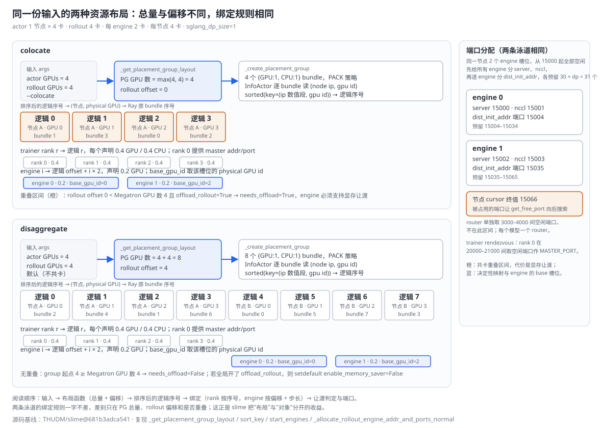
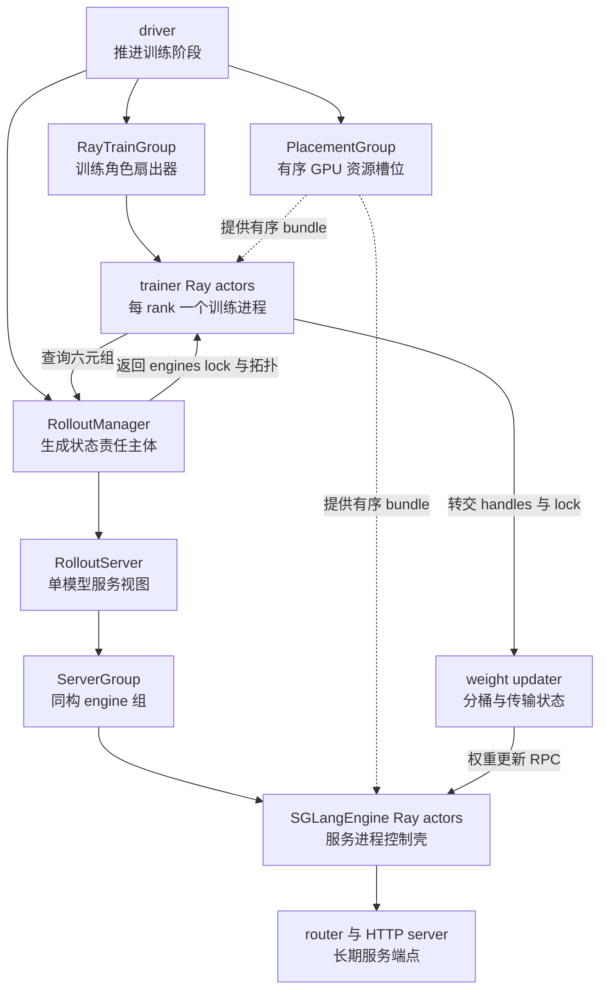
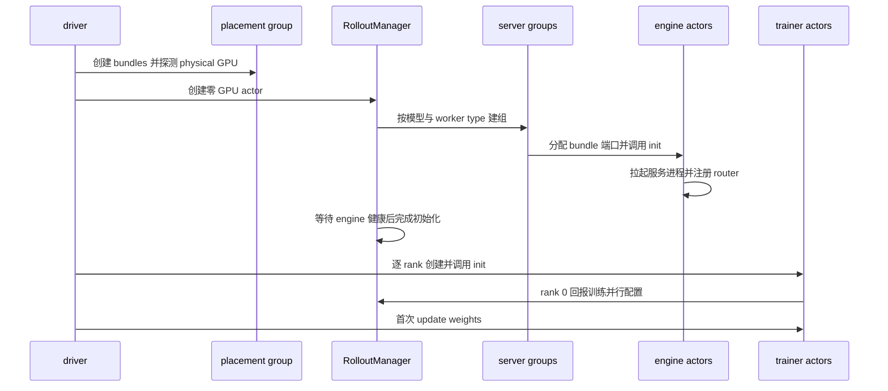

# slime Ray 控制面分析：按职责边界编排训练与推理

> **源码基线**：`THUDM/slime@681b3adca54105d5ecd3fb822fa0dc58a427e0f9`（`main`，2026-08-12）
> **主题**：Ray 控制面怎样把一次后训练任务落到 GPU 上：placement group 只产出 GPU 总量与 rollout 偏移，再按节点、GPU 排序出逻辑序号，trainer 按 rank、engine 按偏移绑定槽位；`RayTrainGroup`、`RolloutManager`、`RolloutServer`/`ServerGroup`、`SGLangEngine` actor 与 weight updater 各自持有哪部分状态；启动、每轮扇出与两条权重发布路径的控制链。核心代码在 `slime/ray/`。
> **适用范围**：Ray 控制面；逐轮时序见端到端页，生成请求与权重传输数据面见相应专题页。
> **最近更新**：2026-09-10。按特性分析画像重写，补最小实例、布局原理图、调用树与成本账本。

---

## 1. 特性概览

### 1.1 问题背景

一次 RL 后训练同时运行三类生命周期完全不同的进程：Megatron 要求每个 distributed rank 对应一个长期存活、持有模型与优化器的进程；SGLang 服务要长期监听请求、维护 KV cache，还可能按 prefill/decode/encoder 拆成不同拓扑；driver 只应推进"生成 → 训练 → 发布权重"的阶段。它们要么共用同一组 GPU 轮流驻留显存，要么分占两段连续 GPU，还可能接入不归本任务管理的外部服务。若让一个总协调器同时管资源映射、所有训练 rank、样本数据、服务子进程、KV cache 与权重分桶，任何一处服务重启都会牵动训练状态，共置与分离部署也无法只改资源布局而不改对象结构。控制面要解决的是：让资源位置、训练角色状态、生成控制状态和服务进程状态分别只有一个权威责任主体，并把它们之间的依赖写成显式的远程调用契约。

### 1.2 解决方法

slime 把 Ray 用作**进程容器、资源放置与 RPC 端点**，而不是并行算法或"每个概念一个 actor"。placement group 先按每卡一个 bundle 预留整组 GPU，并把 Ray 交回的 bundle 按节点、GPU 排序成稳定的逻辑序号；`RayTrainGroup` 是 driver 内的普通对象，按 rank 逐个创建 trainer actor 并向它们广播调用；`RolloutManager` 是一个不占 GPU 的 actor，持有 DataSource、rollout 函数、服务注册表、engine lock 与健康监控；`RolloutServer` 与 `ServerGroup` 只是它内部的 dataclass，分别描述"一个模型、一个 router"与"一组同构 engine"；`SGLangEngine` actor 是服务进程的控制壳，负责拉起或接入 SGLang HTTP server 并转发 RPC；权重发布由 trainer 内的 weight updater 驱动，只有 full+disk 这一条路径例外地由 `RayTrainGroup` 自持版本并直接驱动 engine reload。同一套绑定规则在 colocate 与 disaggregate 下一字不差，差别只在 placement group 的总量、偏移和是否重叠。

### 1.3 收益、开销和约束

| 维度 | 直接收益 | 必付成本或边界 |
|---|---|---|
| 资源布局 | 布局只产出"总量 + 偏移"，逻辑序号由排序得到，train/rollout/critic 复用同一张 placement group | placement group 就绪等待无上界，只每 30 s 打一行日志；每个 bundle 要临时起一个 `InfoActor` 探测节点与 GPU |
| 训练角色 | 每个 rank 一个 actor，Ray 能分别放置与杀掉，Megatron 的 SPMD 身份不被代理 | rank 0 提供 rendezvous，少一个 rank 整个 world 起不来；`release` 只能靠 checkpoint 复原 |
| 生成控制 | RolloutManager 独占跨轮生成状态，训练 rank 不必理解请求、数据恢复与服务故障 | 它是同步 actor，`generate()` 执行期间发给它的其他 RPC 排队；服务启动完成前它不返回 |
| 服务拓扑 | server/group 两层让"哪个模型、是否接收权重"与"几张卡、什么 worker type"分开配置 | 多 updatable model 未支持，只取第一个；异构 `nodes_per_engine` 直接报错 |
| 权重发布 | 版本与传输状态跟随实际执行者：updater 或 full+disk 的 `RayTrainGroup` | 每次发布跨 group → trainer → RolloutManager → updater/engine，多次 `ray.get` 屏障；无跨 engine 回滚 |
| 共卡 | GPU 声明 0.4/0.2 让 trainer 与 engine 能落到同一 bundle | 声明不是显存配额，真实让渡靠 sleep/wake、offload/onload 或 release |

### 1.4 术语约定

| 术语 | 含义 |
|---|---|
| driver | 运行 `train.py` / `train_async.py` 的进程；只持有 RolloutManager 句柄和训练组封装对象 |
| 逻辑序号 | slime 按 (节点 IP, GPU id) 排序后给 bundle 的位置；Ray 原生 bundle 序号只是被映射的对象 |
| physical GPU id | `ray.get_gpu_ids()` 交回的整数设备号；与 `get_physical_gpu_id()` 返回的 CUDA UUID 不是同一个东西 |
| rank | Megatron world 内的 distributed rank，由 trainer actor 进程承载 |
| engine / group / server | `SGLangEngine` actor 是可独立放置和恢复的服务控制进程；group 是同构 engine 的拓扑单元；server 是一个模型加一个 router |
| 六元组 | `RolloutManager.get_updatable_engines_and_lock()` 的返回：engines、lock、新 engine 数、逐 engine GPU 数、GPU 偏移、并行配置（每 engine 的 TP/PP/EP/MoE-DP，来自 `ServerGroup.parallel_config`） |
| 控制面 / 服务面 / 数据面 | 控制面决定放置、拓扑、阶段与生命周期；服务面是长期可寻址的请求端点；数据面移动 token、tensor 或权重字节 |
| GPU 声明 | Ray 调度用的资源数（如 0.4、0.2），只影响准入与放置 |

---

## 2. 控制面详细方案

### 2.1 最小实例：4 张训练卡加 4 张 rollout 卡的一次布局

取 actor 1 节点 × 4 卡、rollout 4 卡、每 engine 2 卡、每节点 4 卡、`sglang_dp_size=1`。同一份输入分别走 `--colocate` 与默认的分离布局，下图把布局函数、排序、绑定、显存让渡判定和端口分配放在两条泳道里，绑定规则两边完全相同。



| 步骤 | colocate | disaggregate |
|---|---|---|
| `_get_placement_group_layout` | GPU 数 = max(4, 4) = 4，rollout offset = 0 | GPU 数 = 4 + 4 = 8，rollout offset = 4 |
| 排序后的逻辑序号 | 节点 A 的 GPU 0–3 → 逻辑 0–3 | 节点 A 的 GPU 0–3 → 逻辑 0–3，节点 B 的 GPU 0–3 → 逻辑 4–7（假设 A 的 IP 更小） |
| trainer 绑定 | rank r → 逻辑 r，每个声明 0.4 GPU | 同左 |
| engine 绑定 | engine 0 → 逻辑 0，engine 1 → 逻辑 2；`base_gpu_id=0` 与 `base_gpu_id=2` | engine 0 → 逻辑 4，engine 1 → 逻辑 6；`base_gpu_id=0` 与 `base_gpu_id=2`（节点 B 上的 physical id），每个声明 0.2 GPU |
| `needs_offload` | rollout 起点 0 < Megatron GPU 数 4，且默认参数下 colocate 归一化把 `offload_rollout` 置真 → True | 起点 4 不小于 4 → False |
| 端口 | engine 0：server 15000、nccl 15001、dist 15004（预留 15004–15034）；engine 1：15002、15003、15035（预留 15035–15065）；cursor 15066 | 同左 |

#### 2.1.1 布局函数与六个分支的枚举依据

`_get_placement_group_layout` 只返回两个整数：placement group 的 GPU 总数与 rollout 区间的起点。它的六个分支按源码顺序判定，对应五种部署模式外加 external 下的 debug 子分支，这也是本页变体集合的枚举基础：

| 判定顺序 | 条件 | GPU 总数 | rollout offset | 资源含义 |
|---|---|---:|---:|---|
| 1 | `debug_train_only` | actor GPUs | 0 | 无本地 rollout engine |
| 2 | `rollout_external` 且 `debug_rollout_only` | actor GPUs | 0 | 只连外部服务，不建 trainer |
| 2 | `rollout_external` | actor GPUs | actor GPUs | serving 不占本任务的 rollout bundle |
| 3 | `debug_rollout_only` | rollout GPUs | 0 | 无 trainer actor；参数归一化已把 actor GPU 数改写为 rollout GPU 数 |
| 4 | `colocate` | `max(actor, rollout)` | 0 | 训练与 rollout 的前缀区间重叠 |
| 5 | 默认 | actor + rollout | actor GPUs | 两个连续且不重叠的区间 |

`tests/test_placement_group.py::test_placement_group_layout` 用 2 节点 × 8 卡、rollout 32 卡的参数钉住全部十个组合，包括 colocate 下 rollout 少于、等于、多于 actor，以及 rollout GPU 为零的路径。critic 不另建布局：`create_placement_groups` 在 `use_critic` 时把 actor 的 placement group 三元组直接赋给 critic。

#### 2.1.2 排序与绑定

`_create_placement_group` 为每张 GPU 申请一个 `{GPU:1, CPU:1}` bundle，策略为 `PACK`，然后轮询 `pg.ready()`：等待没有上界，每 30 秒记录一次集群已注册与可用的 GPU 数。就绪后它在每个 bundle 上起一个 `InfoActor` 读取节点 IP 与 physical GPU id，用完即 `ray.kill`。`sort_key` 先把节点标识按 IPv4 数字段解析，失败则 DNS 解析主机名，再失败就退回标识符逐字符的整数序列；GPU id 转整数作次级键。排序结果同时给出"逻辑序号 → Ray 原 bundle 序号"和"逻辑序号 → physical GPU id"两张映射，rollout 一侧只是这两张表从 `rollout_offset` 起的切片。

trainer 的绑定发生在 `RayTrainGroup._allocate_gpus_for_actor`：`world_size = num_nodes × num_gpus_per_node`，按 rank 循环创建 actor，每个以 `num_cpus=num_gpus=0.4` 落到 `reordered_bundle_indices[rank]`。engine 的绑定发生在 `ServerGroup.start_engines`：第 i 个 engine 的 `gpu_index = gpu_offset + i × min(per_engine, num_gpus_per_node)`，bundle 取 `reordered_bundle_indices[gpu_index]`，`base_gpu_id` 取 `reordered_gpu_ids[gpu_index]`，并以 `num_cpus=num_gpus=0.2`、`placement_group_capture_child_tasks=True` 创建 actor。engine 因此不需要自己推导"我在哪张卡"，SGLang 子进程的起始设备直接来自逻辑序号对应的 physical id。

`needs_offload` 在 `start_rollout_servers` 装配 group 时判定：`_compute_rollout_offset` 在 colocate 或两种 debug 模式下为 0，否则为 actor GPU 数；`_compute_megatron_num_gpus` 在 `debug_rollout_only` 下为 0，否则为 actor GPU 数；group 的绝对起点小于 Megatron GPU 数且 `offload_rollout` 为真才需要让渡。全局开了 `offload_rollout` 而该 group 不重叠时，源码用 `setdefault("enable_memory_saver", False)` 关闭 memory saver，不覆盖用户显式的 group override。

#### 2.1.3 端口与地址

`_allocate_rollout_engine_addr_and_ports_normal` 按节点维护 cursor，并对同一节点上的 engine 先分完 server 与 NCCL 端口，再逐个分配 `dist_init_addr`。注释写的是 dp attention 需要 `4 + dp_size` 个端口，**实际调用**是 `get_port(30 + args.sglang_dp_size)`，以计算为准；`get_free_port` 从 cursor 起向后找到第一个连续 `consecutive` 个都空闲的端口，所以上表是"从 15000 起全部空闲"这一前提下的算法结果，不是固定配置。prefill worker 额外分配一个 bootstrap 端口。engine 跨节点时只有 engine 的首节点分配 `dist_init_addr`，并把它写给该 engine 覆盖的所有 node actor；上层只暴露 node-0 的 handle。router 使用 3000–4000 间随机起点的空闲端口，Prometheus 用 4000–5000，不在这个区间内。

#### 2.1.4 训练 world 的建立

先纠正一个常见误读：SPMD 是 **single program, multiple data**，多个进程执行同一套程序、各自处理不同数据或模型分片，不是"single process"。上例的 4 个 trainer actor 就是 4 个 OS 进程，各承载一个 distributed rank。`RayTrainGroup` 创建 rank 0 后立刻 `ray.get` 它的 master addr/port（rank 0 在 20000–21000 间随机起点取空闲端口），其余 rank 用同一组参数创建。每个 `TrainRayActor.__init__` 写入 `MASTER_ADDR`、`MASTER_PORT`、`WORLD_SIZE`、`RANK`，并用 `get_local_gpu_id()` 求 `LOCAL_RANK`：`CUDA_VISIBLE_DEVICES` 未设置时它就是 `ray.get_gpu_ids()[0]`，即 physical GPU id；已设置时取该 id 在 `CUDA_VISIBLE_DEVICES` 中的位置。训练组注入了整组 `RAY_EXPERIMENTAL_NOSET_*_VISIBLE_DEVICES=1`，Ray 不再改写可见设备，但任务环境继承下来的 `CUDA_VISIBLE_DEVICES` 仍会走第二个分支。`init()` 再调用 `torch.distributed.init_process_group()` 与 `init_gloo_group()`，至此 Ray actor 的进程身份才变成 Megatron 可用的 rank；NVIDIA 环境随后尝试用 pynvml 按 `RANK % num_gpus_per_node` 设置 NUMA CPU affinity，ROCm 跳过，缺少 pynvml 或失败只记日志。

| 观察粒度 | 在上例中是什么 | 负责什么 |
|---|---|---|
| 逻辑训练角色 | 一个 `RayTrainGroup`（actor；PPO 时再加一个 critic） | 保存全部 rank handles，统一发起训练、保存、权重更新 |
| 训练进程 | 4 个 `TrainRayActor` | 各承载一个 rank 的长期状态，绑定一个 bundle |
| 分布式计算组 | 4 个 actor 加入的同一个 `torch.distributed` world | Megatron 的 collective、流水线通信、参数与梯度同步 |
| 并行拓扑 | 例如 TP=2、PP=2、DP=1 | 由 Megatron 在 world 内建立；Ray 不知道哪个 rank 是 TP rank 还是 PP rank |

### 2.2 从最小实例到整套控制面

上面的布局只回答"谁落到哪张卡"。完整控制面还要回答四类状态分别归谁，以及组件之间怎样委托。调用另一个对象的方法只是**委托**；持有可恢复状态并决定其生命周期，才是真正负责这部分状态。

| 不变量 | 长期责任主体 | 若交给一个总对象的具体风险 |
|---|---|---|
| 资源位置 | placement group 及其有序 bundle/GPU 映射 | 逻辑 rank、physical GPU 与 colocate 区间在各模块重复推导 |
| 角色状态 | 每个 trainer actor 的模型、optimizer、并行进程组 | 一个进程无法代替 Megatron 的逐 rank SPMD 身份 |
| 生成状态 | RolloutManager 的 DataSource、rollout 函数、服务注册表、健康监控 | 训练 rank 被迫理解请求、数据恢复与服务故障 |
| 服务状态 | router 后的 SGLang 进程、KV cache、权重版本 | driver 或 RolloutManager 变成实际推理执行器，故障与资源占用耦合 |

> **设计分析**：本节各组件的"为什么"是根据对象边界、调用方向和失败路径作出的推断，不代表项目作者原话；源码事实与推断分开陈述。

#### 2.2.1 placement group：只预留与排序，不管理 actor

**职责。** 输入布局函数的两个整数，输出一张就绪的 placement group 与两张有序映射；整个任务存活，被 trainer 与 engine 的 scheduling strategy 引用，从不发业务调用。

**为什么不让各模块自己算位置。** 被否掉的方案是让 `RayTrainGroup` 与 `ServerGroup` 分别根据参数推导自己占哪些卡。Ray 交回的 bundle 顺序不保证与物理拓扑一致，两处各自推导就会得到两套"第 k 张卡"的定义，colocate 下 trainer 与 engine 是否落在同一张卡将变成巧合。把排序集中在一处，rollout 一侧只做切片，是让"逻辑序号"成为唯一坐标系的代价最低的方式。这是推断；源码事实是排序只在 `_create_placement_group` 发生一次，其它模块只读映射。

**代价与边界。** 就绪等待无上界；每个 bundle 一次 `InfoActor` 创建与销毁；`_create_placement_group(0)` 返回空三元组，rollout GPU 为零时没有本地 engine。

#### 2.2.2 RayTrainGroup 与 trainer actor：角色对象在 driver，rank 状态在进程

**职责。** `RayTrainGroup` 持有一个角色（actor 或 critic）的全部 rank handles、角色参数与 full+disk 版本计数，向所有 rank 广播 `init/train/save/update_weights/sleep/wake_up/clear_memory`。trainer actor 持有 rank-local 的模型、optimizer、scheduler、`TensorBackuper` 备份与 weight updater。trainer 的实现由 `actor_cls` 选择：`create_actor_model` 透传调用方给的类，未给时 `_allocate_gpus_for_actor` 取 `MegatronTrainRayActor`；`torch_memory_saver` 的注入另以 `train_backend == "megatron"` 为条件。本页只展开 Megatron 后端，其他 `actor_cls` 沿用同一套 rank 绑定与 rendezvous 契约。

**为什么不是一个 actor 管全部 GPU。** 反事实方案是一个训练角色只建一个 Ray actor，由它在内部 spawn 全部 rank 进程。那样 Ray 只能放置和恢复这个总进程，无法把每个 rank 绑到排好序的 bundle，总进程还要自己传递 rendezvous 信息，等于在 Ray 下面再实现一层进程管理。反方向也不成立：`RayTrainGroup` 没有独立执行循环和资源需求，做成 actor 只会给本地聚合加上序列化与 RPC。是否需要 Ray actor，取决于是否需要**独立进程、资源放置、故障边界或远程串行状态**。

**怎样产生结果。** `create()` 在 handles 非空时直接返回，属于幂等创建；否则把自持的磁盘版本写回 `args.update_weight_start_version`，重建 rank，`ray.get` 全部 `init`，再恢复 RolloutManager 绑定。`init` 返回各 rank 的起始 rollout id，`create_training_models` 断言它们只有一个取值，并在用户未指定时写入 `args.start_rollout_id`。绑定 RolloutManager 时只有 rank 0 把 `train_parallel_config`（DP、CP、VPP 尺寸与 VPP microbatch 分组）回报给 RolloutManager。`create_actor_model` 在创建前应用角色 YAML；critic 使用 `parse_megatron_role_args` 或 `deepcopy(args)`，无 YAML 时把 `disable_param_buffers_cpu_backup` 置回 `False`，避免 critic 的备份设置污染 actor。

trainer 进程的环境在创建时注入：`NCCL_CUMEM_ENABLE` 环境未设置时为 `0`（与 SGLang 保持一致）、`NVTE_FP8_BLOCK_SCALING_FP32_SCALES` 默认 `1`、整组 `RAY_EXPERIMENTAL_NOSET_*`、用户的 `--train-env-vars`；Megatron 后端开 `offload_train` 时搜索 `torch_memory_saver` 的预加载动态库并设置 `LD_PRELOAD`、`TMS_INIT_ENABLE`、`TMS_INIT_ENABLE_CPU_BACKUP`，找不到直接 `FileNotFoundError`；actor 角色在 `--use-routing-replay` 下得到 `ENABLE_ROUTING_REPLAY=1`，critic 不注入。`--use-rollout-routing-replay` 在参数归一化时同时开启 `--use-routing-replay`，两个开关的含义见 [[17_slime_train_inference_consistency_analysis|routing replay]]。所有 actor 都叠加 `RAY_DEFAULT_ENV_VARS`：`RAY_USE_UVLOOP=0` 与 slime JIT kernel 头文件目录。

**代价与边界。** `release()` 直接 `ray.kill(actor, no_restart=True)` 并固定等待 5 秒，比 `sleep/wake` 释放得彻底但只能靠 checkpoint 复原；`save_model` 在 release 模式下把 `args.load` 改为 `args.save`、清空 `ckpt_step`、`finetune=False`、按 `no_save_optim` 设 `no_load_optim`、`no_load_rng=False`，保证重建后从已保存训练状态恢复。共享发布目录是 serving 权重通道，`args.save` 是恢复 optimizer 等训练状态的 checkpoint，两者不能混淆。

#### 2.2.3 RolloutManager：生成侧的唯一控制主体

**职责。** 单个 `num_cpus=1, num_gpus=0` 的 Ray actor。`__init__` 先 `start_rollout_servers` 拉起 router、group 与 engine 并拿到未完成的 `engine.init` 句柄，再加载 DataSource、rollout/eval 函数与转换 hooks，然后 `ray.get` 全部 init 句柄，最后创建指标跟踪、`Lock` actor，并在开 `use_fault_tolerance` 时为每个 group 起一个健康监控线程。它对外提供 `generate/eval/save/load`、显存生命周期 `offload/onload/onload_weights/onload_kv`、发现接口 `get_updatable_engines_and_lock` 与恢复接口 `recover_updatable_engines`。

**为什么先于 trainer 创建。** driver 在 `num_rollout` 未给时要用它的 DataSource 算 `len(data_source) // rollout_batch_size`，再乘 `num_epoch` 并断言大于零；trainer 初始化又要把 RolloutManager 句柄下发给各 rank。**是否等待 engine 健康后才建 trainer**，取决于 driver 在创建 trainer 前是否向 RolloutManager 发了同步调用：`num_rollout` 未给、`check_weight_update_equal`、`offload_rollout` 任一成立时，driver 在 `create_rollout_manager` 内 `ray.get`，而按 Ray 的 actor 语义这些调用都排在 `__init__` 之后，于是 trainer 创建与 engine 拉起串行；否则两者可以重叠，但 rank 0 回报并行配置的调用仍排在 `__init__` 之后。colocate 归一化在 `offload_rollout` 未显式给出时把它置真，只有显式 `--no-offload-rollout` 且非 release 模式才保持为假，所以默认参数下的共卡部署总是串行。参数帮助文本写的是 colocate 下"always be true"，与实现的 `is None` 判定不一致，本页以实现为准。

**代价与边界。** `Lock` 是显式 `@ray.remote` 的 actor：`acquire()` 非阻塞返回 bool，调用方必须轮询；`release()` 对未持锁状态断言。RolloutManager 是同步 actor，`generate()` 执行期间发给它的后续 RPC 不会并行进入其可变状态。`recover_updatable_engines` 在尚未 `generate` 过（`rollout_id == -1`）或没有 updatable model 时直接返回。`rollout_data_transport=nixl` 时 RolloutManager 与 trainer 都打开 `enable_tensor_transport`。

#### 2.2.4 RolloutServer 与 ServerGroup：模型级配置与同构拓扑不是一回事

**职责。** 两者都是 dataclass，不是 actor。`RolloutServer` 对应一个模型、一个 router、若干 group 与 `update_weights` 标记，聚合 `recover/offload/onload`，暴露 node-0 engine handles 及与之按位置对应的 GPU 数、GPU 偏移、并行配置三张列表。`ServerGroup` 统一 `worker_type`、每 engine GPU 数、rank/GPU 偏移、SGLang overrides 与 `needs_offload`，负责创建 engine actor 并向组内 node-0 engine 扇出显存生命周期 RPC。

**为什么分两层。** 官方配置文档规定"每模型一个 router"、"模型内 group 可异构"、"权重更新按模型选择"（`docs/en/advanced/sglang-config.md`）。server 回答"哪个模型、哪个 router、是否接收训练权重"，group 回答"这批 engine 是 prefill、decode、regular、encoder 还是 placeholder，用几张卡，是否与训练重叠"。`worker_type` 的合法集合由 `ServerGroupConfig.__post_init__` 断言为这五种；placeholder 只推进 GPU offset 而不创建 engine，证明 group 首先是拓扑单元。`engine_gpu_offsets` 会把 placeholder 占的槽位算进去，所以 updater 拿到的偏移与真实 bundle 对齐。把两层都做成 actor 只会为本地聚合增加序列化，这也是 group/manager/server/engine 四个名字不能互换的原因：group 聚合同类句柄，manager 持有跨轮生成状态，server 建立模型级服务边界，engine 对应可独立放置与恢复的控制进程。

**代价与边界。** `RolloutServer.nodes_per_engine` 遇到异构或空的有效集合抛 `ValueError`；`validate_server_group_gpu_indices` 在 `gpu_offset + num_engines × per_engine_on_node` 超过可用槽位时抛 `ValueError`；`_resolve_sglang_config` 断言 YAML 内 GPU 总数等于 `--rollout-num-gpus`。`ServerGroup.engines` 只取 `all_engines[::nodes_per_engine]`，多节点 engine 的非首节点 actor 不对上层暴露。

#### 2.2.5 SGLangEngine actor 与 router：服务进程的控制壳

**职责。** `SGLangEngine` 由 `ray.remote(SGLangEngine)` 动态包装，持有 rank、worker type、`base_gpu_id`、overrides 与子进程句柄。`init` 先由 `_compute_server_args` 算出 SGLang `ServerArgs`，再按 `args.rollout_external` 选择两条活跃路径，这是本组件变体集合的枚举依据：**normal** 路径 `launch_server_process` 用 spawn 起 HTTP server，node-0 轮询 `/health_generate`（每 2 秒一次，进程退出则抛异常）直到 200，再 `POST /workers` 注册到 router；`encoder_only` 的 server 改由 SGLang 的 `encode_server.launch_server_process(wait_for_server=True)` 拉起，健康等待在依赖内部，本页只按其参数契约陈述；**external** 路径读取已存在服务的 `/server_info` 并逐字段核对，然后只做注册。encoder 类型不注册 router；prefill 注册时必须带 `disaggregation_bootstrap_port`，缺失即 `RuntimeError`。`_make_request` 在 `node_rank != 0` 时直接返回，所以对非首节点 actor 的 RPC 是空操作。

**为什么 engine 是控制壳而不是 decoding engine 本体。** 连续批处理、KV cache 调度与 token 生成都发生在 SGLang 服务进程树内；Ray actor 只负责放置、启动、RPC 与故障隔离。让 actor 进程自己跑推理，会把 SGLang 的重启与 Ray actor 的重启绑成一件事，也无法接入外部已存在的服务。external 路径正是这条边界的证据：外部 engine 的 actor 以 `num_gpus=0` 创建、`base_gpu_id=0`、不进 placement group，仍能走同一套注册与 RPC。

**router。** `_start_router` 对首模型可复用用户给的 `--sglang-router-ip/port`，后续模型总是新建；它显式 `disable_health_check=True` 并关闭 circuit breaker（注释说明是为了避免 RDMA 传输超时把 decode worker 误判为死亡），启动为 daemon 子进程后固定等待 3 秒并断言 `is_alive()`。slime 自己的 `RolloutHealthMonitor` 才负责本仓的恢复控制，不能把 router 健康检查当成同一机制。

**代价与边界。** 每个 engine 进程占 0.2 GPU 声明与一组端口；normal 路径的健康等待没有超时上界；SGLang 内部的行为本页只按其 HTTP 接口契约陈述，未读其源码。

#### 2.2.6 weight updater 与版本归属：调用发起方不等于状态责任方

**变体枚举。** `MegatronTrainRayActor.init` 按 `--update-weight-mode`（`full`/`delta`）、`--update-weight-transport`（`nccl`/`disk`）与 `colocate` 选择实现：`delta` 必须 disk 且非 colocate，用 `UpdateWeightFromDiskDelta`；transport 为 disk 用 `UpdateWeightFromDisk`；colocate 用 `UpdateWeightFromTensor`；否则断言 `full` + `nccl`，用 `UpdateWeightFromDistributed`。updater 的 `weight_version` 以 `args.update_weight_start_version` 为种子；该属性不是 CLI 参数，由 `RayTrainGroup.create` 在重建前写入。`RayTrainGroup.update_weights` 只在 actor 角色且 `full` + `disk` 时进入自持版本的分支；其余组合（包括 delta）只 `ray.get` 全部 trainer 的 `update_weights`。delta 模式的发布协议按源码注释为"每台主机 `/pull_weights` 应用增量、engine 再 `update_weights_from_disk`"，本页未展开其实现，归 [[16_slime_weight_sync_analysis|权重同步]]。

**tensor/distributed：trainer 查询，updater 执行。** 每个 trainer 在 `update_weights` 内先（开了 `use_fault_tolerance` 时由 rank 0）请 RolloutManager 恢复 updatable engine 并 gloo barrier，再查询六元组；`num_new_engines > 0` 或"启用 PPO（`use_critic`）且 offload_train 且非 colocate"的重连条件成立时调用 updater 的 `connect_rollout_engines`，随后 rank 0 让 RolloutManager 清零 `num_new_engines`；没有 engine 且无需重连时直接跳过。distributed 每个 bucket 的 Ray 载荷是 `names/dtypes/shapes/group_name/weight_version/load_format`，tensor 字节另走 NCCL broadcast；metadata RPC 创建不等于传输结束，helper 等每个 broadcast handle 后返回 engine refs，上层还要等 engine 完成。RolloutManager 只返回第一个 `update_weights=True` 的模型，"多模型 serving"不等于"多模型联合权重发布"。

**full+disk：版本属于 RayTrainGroup。** `_disk_weight_version` 初值取 `args.update_weight_start_version`（属性缺失时 0）。每次调用先取下一版本与 `weight_v000001` 这类目录名，等待全部 trainer 写出 HF 权重，成功后推进计数；开 `release_train` 时随即 `release()` 杀掉训练 actor，再由 group 自己 `_reload_rollout_weights_from_disk`，不依赖已经消失的 updater。完整调用树见 §3.2.3。

**为什么版本跟随执行者。** 若把版本统一交给 RolloutManager，release 模式下 trainer 消失后仍需要一个活着的对象推进版本并驱动 reload，而 RolloutManager 并不知道权重何时写盘完成；若统一交给 updater，full+disk 下 updater 随 actor 一起被 kill。让"谁驱动 engine 完成发布，谁持有版本"是唯一不需要额外同步状态的选择。这是推断；源码事实是两处版本各自推进且 seed 相同。

**代价与边界。** full+disk 路径取六元组后只使用 engines，**没有** acquire 其中的 lock；CI 检测到版本不一致抛 `RuntimeError`，源码没有 `finally` 恢复或跨 engine 回滚，失败可留下已更新的部分 engine、暂停状态或发布目录。

### 2.3 并发模型与整体开销

slime 里至少有四种"并发"，不能只用一个 actor 数量来理解：

| 并发层次 | Ray/slime 如何实现 | 等待点与边界 |
|---|---|---|
| 资源成组调度 | placement group 先按每卡一个 bundle 预留整组 GPU/CPU，再把各 actor 绑到指定 bundle | 资源组未 ready 时不创建后续训练 world；这是 gang scheduling，不是训练计算 |
| 不同 actor 间的并行 | `RayTrainGroup.async_train()` 对每个 rank 分别 `train.remote()`，先收集全部 `ObjectRef` | driver 随后 `ray.get(refs)`，把"一轮所有 rank 完成"设为阶段屏障 |
| 同一 actor 内的方法顺序 | trainer 与 RolloutManager 都是同步 actor，方法调用排队执行；这不概括异步或配置了并发组的 Ray actor | RolloutManager 正在 `generate()` 时，后续 RPC 不能假定会并行进入其可变状态 |
| rank 之间的计算同步 | 每个 trainer 进入 `train()` 后由 Megatron/PyTorch distributed 执行 TP/PP/DP/CP/EP 通信 | collective、pipeline send/recv 和 optimizer 语义由 Megatron 保证，Ray 既不拆 batch 也不做 all-reduce |

Ray 官方语义区分"不同 actor 可并行"和"同一同步 actor 的方法按调用顺序串行"；placement group 是资源的原子预留与放置约束，不是执行线程池（[Ray Actors](https://docs.ray.io/en/latest/ray-core/actors.html)、[Ray Placement Groups](https://docs.ray.io/en/latest/ray-core/scheduling/placement-group.html)，按其文档契约引用）。异步训练的重叠也发生在**不同 actor 集合**之间：`train_async.py` 保留下一轮 `generate.remote()` 的 future，同时让 trainer 训练当前轮，并在发布权重前先 `ray.get` 掉未完成的生成；它不是让同一个 trainer 并发执行两轮 `train()`。

**成本账本。** 下表把控制面为分层付出的代价按维度列出；括号内是上例（4 trainer、2 engine）的计数，均为源码调用计数而非实测时间。

| 维度 | 成本 | 来源 |
|---|---|---|
| 启动串行化 | placement group 就绪 → 逐 bundle `InfoActor`（4 或 8 次创建与 kill）→ router 固定 3 s → engine 健康轮询（2 s 一次，无上界）→ 共卡时 trainer 才开始创建 | §2.1.2、§2.2.3、§2.2.5 |
| 每轮阶段屏障 | 生成一次 `ray.get`；训练一次 `ray.get`（4 个 ref）；权重发布至少一次 `ray.get`（4 个 ref） | §2.3 表、[[10_slime_end_to_end_iteration_analysis\|端到端迭代]] |
| 一次 tensor/distributed 发布的控制 RPC | 每个 trainer 各查一次六元组（4 次），新 engine 出现时再做一次 connect 与一次清零 | §2.2.6 |
| 一次 full+disk 发布的控制 RPC | trainer 写盘（4 次）+ 可选 onload_weights + 六元组 1 次 + 逐 engine 的 pull（可选）、pause、flush、update、get_version（仅 CI）、continue（必做 4 步、可选 2 步，每步 2 次），每步一个 `ray.get` 屏障 | §3.2.3 |
| release 模式 | 每轮 kill 全部 trainer 并固定等待 5 s，再重建并等 `init`；Megatron 从 checkpoint 重载 | §2.2.2 |
| 端口与进程 | 每个 engine 2 个端口加 31 个预留端口，router 与 Prometheus 各一个；开 `use_fault_tolerance` 时每个 group 一个健康监控线程 | §2.1.3、§2.2.3 |
| 实现复杂度 | 句柄、锁、GPU 偏移、版本号与六元组是解耦的必要状态，不是可删样板 | §2.2 |

**总体代价与运行包络。** 控制面为每个阶段增加与 trainer 数、engine 数线性相关的 RPC 以及若干 `ray.get` 屏障；这些开销全部发生在阶段边界，不进入 Megatron 前反向或 SGLang 请求处理的关键路径。它换来的是 colocate、disaggregate、external、release 四种部署只改变布局与生命周期参数而不改变对象结构。本页没有测量这些 RPC 的墙钟耗时；固定等待（router 3 s、release 5 s）是源码常数，其余等待随集群状态变化。

---

## 3. 代码实现分析

### 3.1 对象与所有权视图

<!-- Figure spec: responsibility graph; driver owns PG/TG/RolloutManager, trainer queries six-part engine discovery response, then hands handles to updater. Discovery does not carry weight bytes. -->


图展示 tensor/distributed 的发现与委托路径；full+disk 的控制权见 §3.2.3。实线表示创建、持有或主要委托，虚线只表示资源约束；placement group 不调用训练或推理。下表回答"这些对象在哪个进程里被创建"，GPU 数是 Ray 调度声明。

| 对象 | 是否 Ray actor | GPU 声明 | 创建者 | 创建位置 |
|---|---|---:|---|---|
| `InfoActor` | 是，临时 | 1 | driver | `placement_group.py::_create_placement_group` |
| `RayTrainGroup` | 否 | 无 | driver | `placement_group.py::allocate_train_group` |
| `MegatronTrainRayActor` | 是，逐 rank | 0.4 | RayTrainGroup | `actor_group.py::RayTrainGroup._allocate_gpus_for_actor` |
| `RolloutManager` | 是 | 0 | driver | `placement_group.py::create_rollout_manager` |
| `RolloutServer` / `ServerGroup` | 否，dataclass | 无 | RolloutManager | `rollout.py::start_rollout_servers` |
| 内部 `SGLangEngine` | 是 | 0.2 | ServerGroup | `rollout.py::ServerGroup.start_engines` |
| 外部 `SGLangEngine` | 是 | 0 | RolloutManager | `sglang_utils/external.py::start_external_rollout_servers` |
| `Lock` | 是 | 0 | RolloutManager | `rollout.py::RolloutManager.__init__` |
| weight updater | 否 | 无 | trainer actor | `backends/megatron_utils/actor.py::MegatronTrainRayActor.init` |

`slime/ray/ray_actor.py::RayActor` 只是共享地址与空闲端口查询、master address 返回方法的基类，不会自行创建远程进程。

### 3.2 调用流程

#### 3.2.1 启动：先确定资源布局，再初始化各组件状态



下面的树从 `train.py` 走到首次权重发布；方括号是条件分支，`train_async.py` 的差别只在开头多一条 `assert not args.colocate` 和主循环。

```text
train.train(args)
+-- create_placement_groups
|   +-- _get_placement_group_layout --> (num_gpus, rollout_offset)
|   `-- _create_placement_group
|       +-- placement_group(bundles, PACK) ; poll pg.ready()
|       +-- InfoActor.get_ip_and_gpu_id x num_gpus ; ray.kill
|       `-- sorted(sort_key) --> reordered_bundle_indices, reordered_gpu_ids
+-- create_rollout_manager
|   +-- RolloutManager.remote(args, pg)            [num_gpus=0]
|   |   +-- start_rollout_servers
|   |   |   +-- [rollout_external] start_external_rollout_servers
|   |   |   `-- per model: _start_router ; per group: ServerGroup.start_engines
|   |   |       +-- SGLangEngine.remote(...)          [0.2 GPU, bundle=reordered[gpu_index]]
|   |   |       +-- _allocate_rollout_engine_addr_and_ports_normal
|   |   |       `-- engine.init.remote(...)           [不等待]
|   |   +-- load DataSource / rollout fns
|   |   +-- ray.get(rollout_init_handles)             [engine 健康]
|   |   `-- Lock.remote ; [use_fault_tolerance] RolloutHealthMonitor x groups
|   +-- [num_rollout is None] ray.get(get_num_rollout_per_epoch)
|   +-- [check_weight_update_equal] check_weights snapshot / reset_tensors
|   `-- [offload_rollout] ray.get(offload)
+-- create_training_models
|   +-- create_actor_model --> RayTrainGroup.create
|   |   +-- _allocate_gpus_for_actor: TrainRayActor.remote x world_size  [0.4 GPU]
|   |   +-- ray.get(actor.init ...)  --> start_rollout_ids
|   |   `-- set_rollout_manager --> rank 0: RolloutManager.set_train_parallel_config
|   +-- [use_critic] allocate_train_group(role=critic) ; create
|   `-- assert len(set(start_rollout_ids)) == 1 ; [rollout_global_dataset] RolloutManager.load
+-- [offload_rollout and not release_train] RolloutManager.onload_weights
+-- actor_model.update_weights                      --> §3.2.2 / §3.2.3
+-- [check_weight_update_equal] RolloutManager.check_weights(compare)
`-- [offload_rollout] RolloutManager.onload_kv
```

每轮的生成、训练与发布顺序只有一个说明入口：[[10_slime_end_to_end_iteration_analysis|端到端迭代]]。本页只保留一条跨角色契约：`RayTrainGroup.async_train(rollout_id, rollout_data_ref, external_data)` 收到列表时断言长度等于 worker 数并逐 rank 传入，收到单个 dict 或 `None` 时广播；critic 的 ref 返回 `{"values": [...]}`，非最后 PP stage 返回空 dict，actor 的 ref 返回 `None`。driver 把 critic 的 ref 直接作为 actor 的 `external_data`，由 Ray 形成数据依赖，而不是让 `RayTrainGroup` 聚合 values；实际消费见 [[14_slime_megatron_training_analysis|Megatron 训练]]。

#### 3.2.2 tensor/distributed 发布：trainer 查询，updater 执行

```text
RayTrainGroup.update_weights                       [driver 内对象；非 full+disk]
`-- ray.get([trainer.update_weights.remote() x ranks])
    `-- MegatronTrainRayActor.update_weights        [每个 rank]
        +-- [use_fault_tolerance] rank 0: RolloutManager.recover_updatable_engines ; gloo barrier
        +-- RolloutManager.get_updatable_engines_and_lock --> 六元组
        +-- [no engines and no reconnect] return
        +-- [reconnect] self.wake_up ; [offload_train] reload_process_groups
        +-- [num_new_engines > 0 or reconnect] weight_updater.connect_rollout_engines
        |   `-- gloo barrier ; rank 0: RolloutManager.clear_updatable_num_new_engines
        +-- weight_updater.update_weights           --> 传输与提交见权重同步页
        |   +-- rank 0: engine.pause_generation / flush_cache
        |   +-- per bucket: Lock.acquire 轮询 ; engine.update_weights_from_distributed.remote(metadata) ; NCCL broadcast ; ray.get(refs) ; Lock.release
        |   `-- rank 0: engine.continue_generation
        `-- [reconnect] self.sleep ; [offload_train] destroy_process_groups
```

完成边界是 updater 内最后一次对 engine refs 的 `ray.get` 与 `continue_generation` 返回；六元组 RPC 返回只证明"发现完成"。分工是 driver 决定何时调用、RolloutManager 发现目标、trainer 持有源分片、updater 驱动发布。

#### 3.2.3 full+disk 的版本属于 RayTrainGroup

```text
RayTrainGroup.update_weights [driver 内对象，actor 角色且 full+disk]
├─ trainer.update_weights.remote [全部 ranks；ray.get 等写盘完成]
├─ self._disk_weight_version = weight_version
├─ self.release [仅 release_train；kill actors 后等待 5 s]
└─ self._reload_rollout_weights_from_disk
   ├─ RolloutManager.onload_weights.remote [仅 offload_rollout；等待]
   ├─ RolloutManager.get_updatable_engines_and_lock.remote [只取 engines]
   ├─ [no engines] 删除版本目录（除非 keep_files）并返回
   ├─ engine.pull_weights.remote [仅 update_weight_local_checkpoint_dir；先于 pause]
   ├─ engine.pause_generation.remote [全部等待]
   ├─ engine.flush_cache.remote [全部等待]
   ├─ engine.update_weights_from_disk.remote [model_path, weight_version；全部等待]
   ├─ engine.get_weight_version.remote [仅 CI；逐 engine 比较，不一致 RuntimeError]
   ├─ 删除版本目录 [除非 keep_files]
   └─ engine.continue_generation.remote [全部等待]
```

存在本地 checkpoint 目录时，所有 engine 先把发布版本拉到主机本地盘再从该路径 reload，拉取发生在 pause 之前并与生成重叠。完成边界是 `_reload_rollout_weights_from_disk` 最后一次 `ray.get` 返回；计数推进和目录写出都早于这一点，不能单凭 `_disk_weight_version` 证明整个集群已恢复服务。非 keep-files 路径在恢复生成前删除共享发布目录。`release_train` 重建时 `create()` 把版本种子交给新的训练 actor。

### 3.3 源码阅读路线

1. 入口与布局：`train.py::train` / `train_async.py::train` → `slime/ray/placement_group.py::_get_placement_group_layout` / `_create_placement_group` / `sort_key` / `create_placement_groups` → `tests/test_placement_group.py::test_placement_group_layout`。
2. 训练角色：`slime/ray/placement_group.py::allocate_train_group` / `create_actor_model` / `create_training_models` → `slime/ray/actor_group.py::RayTrainGroup.__init__` / `_allocate_gpus_for_actor` / `create` / `async_train` / `save_model` / `release` → `slime/ray/train_actor.py::get_local_gpu_id` / `TrainRayActor.__init__` / `TrainRayActor.init` / `TrainRayActor.set_rollout_manager` → `slime/backends/megatron_utils/actor.py::MegatronTrainRayActor.init`。
3. 生成控制：`slime/ray/placement_group.py::create_rollout_manager` → `slime/ray/rollout.py::RolloutManager.__init__` / `get_num_rollout_per_epoch` / `_get_updatable_server` / `get_updatable_engines_and_lock` / `recover_updatable_engines` / `offload` → `slime/ray/utils.py::Lock` / `RAY_DEFAULT_ENV_VARS` / `add_default_ray_env_vars` / `get_physical_gpu_id`。
4. 服务拓扑：`slime/ray/rollout.py::start_rollout_servers` / `_resolve_sglang_config` / `_compute_rollout_offset` / `_compute_megatron_num_gpus` / `_start_router` / `_allocate_rollout_engine_addr_and_ports_normal` → `RolloutServer` / `ServerGroup.start_engines` / `ServerGroup.engines` / `RolloutServer.engine_gpu_offsets` / `RolloutServer.nodes_per_engine` / `RolloutServer.recover` → `slime/ray/rollout_validation.py::validate_server_group_gpu_indices` → `slime/backends/sglang_utils/sglang_config.py::ServerGroupConfig.__post_init__` / `ModelConfig.resolve` / `SglangConfig.from_yaml`。
5. 服务进程：`slime/backends/sglang_utils/sglang_engine.py::SGLangEngine.init` / `_init_normal` / `_init_external` / `_register_to_router` / `_make_request` / `launch_server_process` / `_wait_server_healthy` → `slime/backends/sglang_utils/external.py::start_external_rollout_servers` / `get_server_info` → `slime/utils/misc.py::get_free_port`。
6. 权重发布控制：`slime/backends/megatron_utils/actor.py::MegatronTrainRayActor.update_weights` → `slime/ray/actor_group.py::RayTrainGroup.update_weights` / `_full_disk_weight_update_enabled` / `_reload_rollout_weights_from_disk` → `slime/backends/megatron_utils/update_weight/update_weight_from_distributed.py::UpdateWeightFromDistributed.connect_rollout_engines` / `update_weights` / `_update_bucket_weights_from_distributed` / `update_weights_from_distributed`。
7. 参数归一化与守卫：`slime/utils/arguments.py` 中 `colocate` / `release_train` / `use_critic` 对 `offload_train` / `offload_rollout` / `rollout_num_gpus` 的改写，`--release-train` 与 `--update-weight-mode=delta` 的 `ValueError`。

---

## 4. 配套机制

### 4.1 资源复用与生命周期：共享 GPU 不等于共享对象

slime 有两条独立的 GPU 复用轴：colocate 让 train 与 rollout 的逻辑 GPU 区间重叠；PPO 则令 critic 与 actor 指向同一张 train placement group。官方文档明确说 actor/critic 是两个独立训练 process group，只是轮流占用同一组 GPU，并为此强制 `offload_train`（`docs/en/get_started/usage.md` PPO 小节）；参数归一化把 critic 的节点数与每节点 GPU 数直接取自 actor。ref、Megatron OPD teacher 与 old actor 也不是各自一组 Ray actor：它们由 actor trainer 内的 `TensorBackuper` 以不同 tag 保存与切换，critic 因为有独立可训练状态才建立第二个 `RayTrainGroup`。group 边界对应独立训练角色，而不等于每个模型身份都起一组进程。

训练 actor 的 0.4 与 engine 的 0.2 只是 Ray 用于资源准入的声明，不代表显存配额；实际显存让渡由下表的四种动作完成，它们分别改变服务显存、训练驻留、actor 存活或故障实例，恢复成本不同。

| 动作 | 对象是否仍存在 | 调用链与责任主体 | 语义 |
|---|---|---|---|
| rollout `offload/onload` | engine actor 与服务进程仍在 | RolloutManager → server → group → node-0 engine | 只对 `needs_offload` 的 group 释放/恢复指定显存占用；`offload` 先暂停健康监控 |
| train `sleep/wake` | trainer actor 仍在 | group → trainer actor | 暂停/恢复训练 GPU 状态与进程组 |
| train `release/create` | trainer actor 被 kill/重建 | `RayTrainGroup` | 以 checkpoint 换取更彻底的资源释放；固定等待 5 s |
| rollout `recover` | 死 engine actor 被替换 | RolloutManager → updatable server → group | 并发重建 `all_engines` 中为 `None` 的槽位，`needs_offload` 的新 engine 先 release 再 resume weights；trainer 随后按 `num_new_engines` 让 updater 重连 |

固定基线的恢复入口只选择 updatable model；冻结模型的完整恢复边界由 [[18_slime_fault_tolerance_observability_analysis|容错与可观测性]] 讨论，本页不把"有 health monitor"误写成"所有模型都会自动恢复"。

### 4.2 多模型、EPD 与外部引擎的启动依赖

`_resolve_sglang_config` 按优先级选择配置来源：`--sglang-config` YAML（断言 GPU 总数等于 `--rollout-num-gpus`）→ rollout GPU 为零时的空模型 → 旧的 `--prefill-num-servers` 转成 prefill/decode 两组 → 默认单个 regular group。`ModelConfig.resolve` 在未显式给出 `update_weights` 时按 `model_path` 是否等于 `--hf-checkpoint` 推断，并要求同一模型内所有 group 的 `model_path` 一致。

EPD 拓扑分两阶段：encoder group 先同步启动并 `ray.get` 其 init，再收集 URL；随后 prefill 与 regular group 以 `setdefault` 注入 `language_only=True` 与 `encoder_urls`，其 init 句柄留给 RolloutManager 稍后统一等待。否则 LLM 初始化拿不到远程编码目标。EPD 数据面见 [[26_slime_multimodal_vlm_path_analysis|多模态路径]]。

external 路径（`--rollout-external-engine-addrs` 非空即 `rollout_external`）不建 placement group 切片：`start_external_rollout_servers` 为每个地址创建一个 `num_gpus=0` 的 engine actor，按 `/server_info` 推导 GPU 数与并行配置并累加偏移，同样先起 router 再注册。完整 backend 替换边界见 [[19_slime_rollout_backend_extension_analysis|rollout backend 扩展]]。

---

## 5. 约束、适用场景与趋势

### 5.1 硬约束与失败边界

| 前提 | 源码边界 | 破坏后的行为 |
|---|---|---|
| 训练 world 由 rank 0 提供 master addr/port，其余 rank 用同一组参数加入 | `actor_group.py::RayTrainGroup._allocate_gpus_for_actor` | 少一个 rank 整个 world 起不来；Ray 不会补位，`init_process_group` 按 `--distributed-timeout-minutes` 超时 |
| 异步入口要求训练与 rollout 分离资源 | `train_async.py::train` 开头 `assert not args.colocate` | 断言失败 |
| `--release-train` 必须 full+disk | `arguments.py` 参数校验 | `ValueError` |
| `--update-weight-mode=delta` 必须 disk、非 colocate、带本地 checkpoint 目录 | `arguments.py` 参数校验；`MegatronTrainRayActor.init` 再次断言 | `ValueError` / `AssertionError` |
| YAML 内 GPU 总数等于 `--rollout-num-gpus` | `rollout.py::_resolve_sglang_config` | `AssertionError` |
| group 的槽位需求不超过可用 bundle | `rollout_validation.py::validate_server_group_gpu_indices` | `ValueError`，提示对齐三个参数 |
| 有效 group 的 `nodes_per_engine` 一致 | `rollout.py::RolloutServer.nodes_per_engine` | `ValueError` |
| `worker_type` 属于五种合法值且 `num_gpus > 0` | `sglang_config.py::ServerGroupConfig.__post_init__` | `AssertionError` |
| prefill worker 注册 router 时带 bootstrap 端口 | `sglang_engine.py::SGLangEngine._register_to_router` | `RuntimeError` |
| router 子进程在 3 s 后仍存活 | `rollout.py::_start_router` | `AssertionError` |
| Megatron offload 需要 `torch_memory_saver` 预加载库 | `actor_group.py::RayTrainGroup._allocate_gpus_for_actor` | `FileNotFoundError` |
| `Lock.release` 只能在持锁时调用 | `utils.py::Lock.release` | `AssertionError` |
| CI 下 disk reload 后各 engine 版本一致 | `actor_group.py::RayTrainGroup._reload_rollout_weights_from_disk` | `RuntimeError`，无回滚 |
| 多 updatable model 未支持 | `rollout.py::RolloutManager._get_updatable_server` docstring | 静默只取第一个，没有运行时守卫 |

placement group 就绪与 engine 健康两处等待没有超时守卫：前者每 30 s 打日志，后者每 2 s 重试并只在子进程退出时抛异常。

### 5.2 常见误读

| 误读 | 固定基线的实际行为 |
|---|---|
| placement group 是一组训练 actor | 它只预留和排序资源；actor 后续绑定 bundle |
| `RayTrainGroup` 自己是 Ray actor | 它是 driver 内的 Python 封装对象，内部才持有一组 actor 句柄 |
| `RolloutServer` 就是监听 HTTP 的 server | 它是 RolloutManager 内模型级 dataclass；HTTP server 是 engine actor 拉起的子进程 |
| 一个 `ServerGroup` 等于一个 engine | group 可含多个同构 engine；多节点 engine 的上层控制只暴露 node-0 handle |
| `SGLangEngine` 执行全部 decoding | 它是进程控制与 RPC 壳，实际 forward/KV/token 服务在 SGLang 进程树 |
| Ray actor 就是训练并行 | Ray 负责进程放置与 RPC；Megatron collective 在 trainer actor 内初始化和执行 |
| RolloutManager 拿着 engine handles，所以拥有权重同步 | 它拥有服务注册与 lock；tensor/distributed 的版本与传输状态在 trainer 内的 updater；full+disk 的版本由 `RayTrainGroup` 自持并直接驱动 reload |
| `offload`、`sleep`、`release`、`recover` 都是"释放 GPU" | 它们分别改变服务显存、训练驻留、actor 存活或故障实例，恢复成本不同 |
| `LOCAL_RANK` 是 Ray 分配的相对序号 | 训练进程禁用了 Ray 的可见设备改写；`CUDA_VISIBLE_DEVICES` 未设置时 `LOCAL_RANK` 是 physical GPU id，已设置时是该 id 在其中的位置 |

### 5.3 何时使用

| 场景 | 建议 | 原因 |
|---|---|---|
| 单机或小集群，训练与生成不需要重叠 | `--colocate` | 一张 placement group，`offload_train/offload_rollout` 未显式给出时自动打开，显存轮流驻留 |
| 生成与训练要阶段重叠 | 分离布局 + `train_async.py` | 异步入口断言非 colocate；两段 GPU 各自常驻 |
| 复用已部署的 SGLang 服务 | `--rollout-external-engine-addrs` | 不占本任务 rollout bundle，仍走同一套 router 注册与 RPC |
| 训练进程需要彻底释放显存 | `--release-train` + full+disk | 每轮 kill 并重建 trainer，代价是 5 s 等待与 checkpoint 重载 |
| 多模型 serving（ref/reward 冻结） | `--sglang-config` 多模型 YAML | 每模型一个 router；只有一个模型接收训练权重 |

### 5.4 当前演进方向

固定基线在 `slime/ray/` 下留了三处与本页职责边界直接相关的在途标记：

| 位置 | 注释原文 | 落在本页哪条边界上 |
|---|---|---|
| `slime/ray/train_actor.py::TrainRayActor.__init__` | `# TODO: currently this doesn't work as ray has already set torch.cuda.device_count().` 其下 `CUDA_VISIBLE_DEVICES` 与 `LOCAL_RANK` 两行赋值被注释掉，改用 `get_local_gpu_id()` | §2.1.4 的"Ray actor 进程身份 → distributed rank"那一跳：设备可见性已被 Ray 占住，slime 只能绕开 |
| `slime/ray/rollout.py::_allocate_rollout_engine_addr_and_ports_normal` | `# TODO: currently when restarting engines, we will set port for all engines on this node starting with this rank.` 注释举例重启 gpu 3 上的 engine 会连带重设该节点上 3–7 号 engine 的端口 | §4.1 `recover` 的粒度：故障隔离目前只到"节点内的一段 rank 后缀"，不是单个 engine |
| `slime/ray/placement_group.py::create_training_models` | `# TODO how to decide rollout start id when critic is involved? For now we just require user to specify it via args.` | §2.2 的状态归属：actor 与 critic 两个训练组各自返回 start id，恢复游标该归谁尚未收敛 |

> [!note] 推断
> 三条指向同一类未完成的事：**Ray actor 的进程身份与它所代表的资源、角色身份还没有完全对齐**——设备可见性归 Ray，端口归节点，恢复游标归"哪个训练组"。§2.2.2 那条判据（是否需要独立进程、资源放置、故障边界或远程串行状态）解释了为什么这三处会同时落在这条缝上。源码只写了"目前如此"，没有陈述改法、接口或时间；这层归纳由本页承担，不代表项目路线图。

---

## 6. 配置契约

slime 域没有配置 coverage ledger；下表只列本页控制路径直接读取的 CLI 参数，按用途分组，默认值取自 `slime/utils/arguments.py`。其余参数与脚本、YAML 的对应关系归 [[02_slime_quickstart_and_configuration_guide|配置指南]]。

### 资源与布局

| 参数 | 默认 | 契约 |
|---|---|---|
| `--actor-num-nodes` / `--actor-num-gpus-per-node` | 1 / 8 | 训练 world 大小与 placement group 前缀区间；critic 直接沿用 |
| `--rollout-num-gpus` | None | 本地 rollout GPU 数；colocate 下未给时取 actor GPU 数，为 0 时不建本地 engine |
| `--rollout-num-gpus-per-engine` | 1 | 每 engine GPU 数（SGLang tp_size），可被 YAML 逐 group 覆盖 |
| `--num-gpus-per-node` | 8 | rollout 一侧的每节点 GPU 数；决定端口分配与多节点 engine 的判定 |
| `--colocate` | False | 训练与 rollout 前缀区间重叠；`offload_train/offload_rollout` 未显式给出时置真；release 模式强制 `offload_train=False`、`offload_rollout=True` |
| `--sglang-config` | None | 多模型、多 group 拓扑 YAML；GPU 总数必须等于 `--rollout-num-gpus` |
| `--rollout-external-engine-addrs` | None | 非空即进入 external 路径，不为 rollout 预留 bundle |

### 生命周期与权重发布

| 参数 | 默认 | 契约 |
|---|---|---|
| `--offload-train` / `--offload-rollout` | None → False | 显存让渡开关；colocate、`--offload`、PPO 会改写 |
| `--release-train` | False | 每轮 kill 并重建 trainer；要求 full+disk |
| `--update-weight-mode` | `full` | `full` 或 `delta`；`delta` 只支持 disk 且非 colocate |
| `--update-weight-transport` | `nccl` | `nccl` 或 `disk`；与 mode、colocate 共同决定 updater 实现 |
| `--update-weight-disk-dir` / `--update-weight-disk-keep-files` / `--update-weight-local-checkpoint-dir` | None / False / None | full+disk 的发布目录、是否保留版本目录、主机本地拉取目录 |
| `--use-fault-tolerance` | False | 每 group 一个健康监控线程；发布前由 rank 0 触发 updatable engine 恢复 |
| `args.update_weight_start_version` | 属性缺失按 0 | 不是 CLI 参数：`RayTrainGroup.create` 在重建前写入自持版本，updater 与 group 都以它为种子 |
| `--use-rollout-routing-replay` | False | 归一化时同时打开 `--use-routing-replay`，actor 进程注入 `ENABLE_ROUTING_REPLAY=1` |

### 服务与网络

| 参数 | 默认 | 契约 |
|---|---|---|
| `--sglang-router-ip` / `--sglang-router-port` | None | 首模型可复用的 router 地址；未给时自动分配 |
| `--distributed-backend` / `--distributed-timeout-minutes` | `nccl` / 10 | trainer 的 `init_process_group` 参数 |
| `--train-env-vars` | `{}` | 追加到 trainer 进程的环境变量 |

## Related Pages

- [[10_slime_end_to_end_iteration_analysis]] — 把本文的对象所有权放回同步与异步 iteration 的版本边界。
- [[12_slime_sample_datasource_analysis]] — 深入 RolloutManager 所有的 DataSource、Sample 与 train-data conversion 契约。
- [[13_slime_sglang_rollout_engine_analysis]] — 深入 router 后的请求调度、生成状态与 SGLang 数据面。
- [[14_slime_megatron_training_analysis]] — 深入 trainer actor 内的 Megatron 初始化、数据迭代与 forward/backward。
- [[16_slime_weight_sync_analysis]] — 深入 weight updater 的提交协议、拓扑变换与 transport 数据面。
- [[18_slime_fault_tolerance_observability_analysis]] — 深入 health monitor、engine recover 与分层故障域。
- [[02_engineering/04_posttrain_frameworks/slime/index|slime 知识地图]] — 返回本域全部页面的入口。
