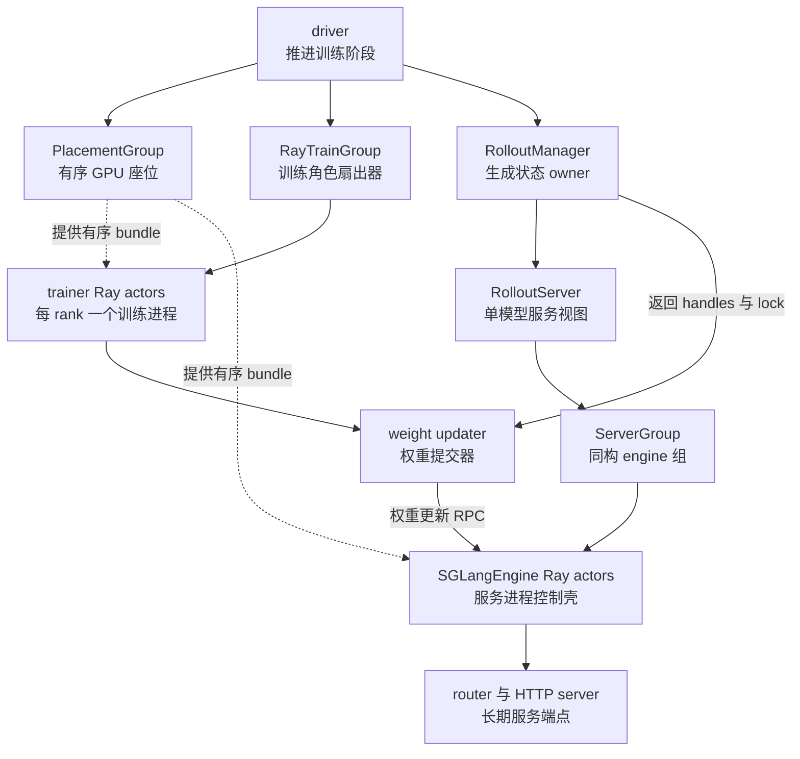
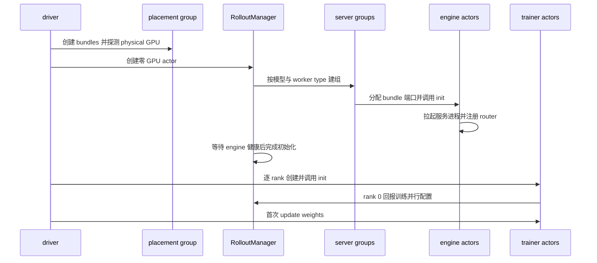
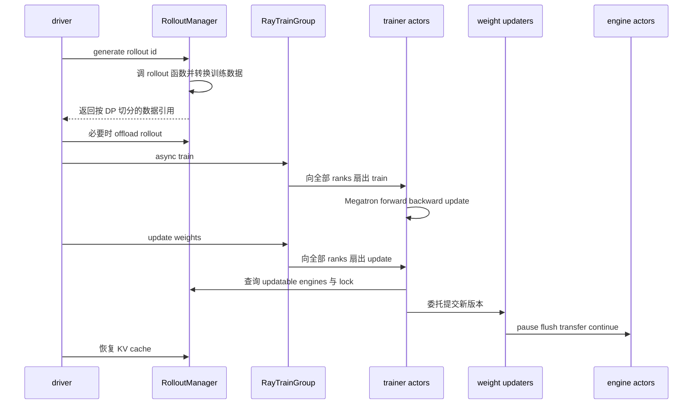

# slime Ray 控制面分析：用不同所有权边界编排训练与推理

> **源码基线**：slime `main@681b3adca54105d5ecd3fb822fa0dc58a427e0f9`
> **文档与测试基线**：同一提交下 `docs/en/` 与 `tests/`
> **核验日期**：2026-08-18 · **系列**：[[02_engineering/04_posttrain_frameworks/slime/index|slime 源码分析]]
> **结论先行**：slime 没有把分布式后训练塞进一个“总协调器”，也没有让每个名词都变成 Ray actor。它按资源、角色、模型服务、同构 engine 组、进程和权重传输的不同所有权拆层：placement group 冻结 GPU 座位，`RayTrainGroup` 扇出训练角色，`RolloutManager` 持有生成控制状态，`RolloutServer`/`ServerGroup` 描述服务拓扑，`SGLangEngine` actor 管服务进程，trainer actor 执行训练，而其内部 weight updater 负责权重提交。分层多了委托链与 RPC，但避免了把不同生命周期、故障域和并行语义绑成一个对象。

本文把带 fixed-commit 定位符的源码/官方文档事实与“设计分析”分开；后者是根据对象边界、调用方向和失败路径作出的推断，不代表项目作者原话。

## 1. 问题不是“怎么调用 Ray”，而是谁应拥有什么

训练 rank、rollout 服务和 driver 面临的是三套互不相同的约束：Megatron 要一个 rank 对应一个长期分布式进程并持有模型/optimizer；SGLang 要长期监听请求、持有 KV cache，并可能按 prefill/decode/encoder 拆拓扑；driver 则只应推进阶段，不应吞下所有服务内部状态。源码因此先创建资源布局，再创建零 GPU 的 Manager，最后创建训练 ranks；同步主循环只持有 Manager handle 与两个训练 group wrapper。[`train.py:13-27`](https://github.com/THUDM/slime/blob/681b3adca54105d5ecd3fb822fa0dc58a427e0f9/train.py#L13-L27) [`placement_group.py:227-253`](https://github.com/THUDM/slime/blob/681b3adca54105d5ecd3fb822fa0dc58a427e0f9/slime/ray/placement_group.py#L227-L253)

这逼出四个不能混为一谈的所有权：

| 不变量 | 应由谁长期掌握 | 若交给一个总对象的具体风险 |
|---|---|---|
| 资源位置 | placement group 及其有序 bundle/GPU 映射 | 逻辑 rank、physical GPU 与 colocate 区间在各模块重复推导 |
| 角色状态 | 每个 trainer actor 的模型、optimizer、并行进程组 | 一个进程无法代替 Megatron 的逐 rank SPMD 身份 |
| 生成状态 | Manager 的 DataSource、rollout 函数、服务注册表、健康监控 | 训练 rank 被迫理解请求、数据恢复与服务故障 |
| 服务状态 | router 后的 SGLang 进程、KV cache、权重版本 | driver 或 Manager 变成实际推理执行器，故障与资源占用耦合 |

`MegatronTrainRayActor.init` 在各 rank 内初始化模型、optimizer 和训练并行配置；`RolloutManager.__init__` 则加载 DataSource、rollout/eval 函数和转换 hooks，并创建 engine lock。两者的状态根本不同。[`actor.py:79-129`](https://github.com/THUDM/slime/blob/681b3adca54105d5ecd3fb822fa0dc58a427e0f9/slime/backends/megatron_utils/actor.py#L79-L129) [`rollout.py:468-515`](https://github.com/THUDM/slime/blob/681b3adca54105d5ecd3fb822fa0dc58a427e0f9/slime/ray/rollout.py#L468-L515)

> **设计分析**：这里的关键不是“多建几个类”，而是让资源座位、控制状态、服务存活和计算状态分别只有一个权威 owner。调用另一个对象的方法是**委托**；持有可恢复状态并决定其生命周期才是**所有权**。

## 2. 九个概念不在同一抽象层

本文用三种 plane 区分职责：**控制面**决定放置、拓扑、阶段和生命周期；**服务面**提供长期可寻址的请求端点；**数据面**执行训练/推理并移动 token、tensor 或权重字节。一个对象可以位于交界处，但应指出其主要职责。

图中实线表示创建、持有或主要委托，虚线只表示资源约束；placement group 不调用训练或推理。对象的准确身份如下。

| 概念 | 身份与所有内容 | 何时存在/参与，向谁发调用 | 主要 plane |
|---|---|---|---|
| placement group | Ray 原生资源对象；slime 另保存重排后的 bundle indices 与 physical GPU ids | 最先创建，整个任务存活；被训练 actor 与 engine actor 的 scheduling strategy 引用，不发业务调用 | 控制面 |
| `RayTrainGroup` | driver 内普通 Python wrapper；持有一个 actor 或 critic 角色的全部 rank handles 与角色参数 | training models 创建后存在；向所有 trainer actors 扇出 `init/train/save/update/sleep/wake` | 控制面 |
| `RolloutManager` | 单个 `num_gpus=0` Ray actor；持有 DataSource、rollout hooks、servers、engine lock、monitor | 服务启动前创建并贯穿任务；向 server 聚合对象委托 lifecycle，向 rollout 函数委托生成 | 控制面 |
| `RolloutServer` | Manager 内普通 dataclass；一个模型、一个 router、若干 groups 与 `update_weights` 标记 | 模型服务装配时创建；聚合 `recover/offload/onload`，暴露 engine handles | 控制面中的服务视图 |
| `ServerGroup` | `RolloutServer` 内普通 dataclass；同构 engines、worker type、offset、并行覆盖、offload 标记 | 拓扑装配与恢复时参与；创建 engine actors，向组内 node-0 engines 扇出显存生命周期 RPC | 控制面中的拓扑单元 |
| `SGLangEngine` | 动态 `ray.remote` 包装的 Ray actor；持有 rank、端口、base GPU id、服务参数和子进程句柄 | group 启动/恢复时创建；spawn 或接入 SGLang server，并接收权重、cache、pause/continue RPC | 控制面到服务面的适配器 |
| Ray actor | 本页不是一个额外组件，而是远程进程/handle 形态；Manager、trainer、engine 都用它，但职责由实例决定 | 需要进程隔离、GPU 绑定或远程 RPC 时才使用；`RolloutServer`/`ServerGroup` 并不是 actors | 不是 plane；是运行时原语 |
| trainer actor | 每个 Megatron world rank 一个 `MegatronTrainRayActor`；持有 rank-local 模型、optimizer、scheduler、backups 与 updater | 训练模型创建后存在或在 release 模式重建；执行 train，并向 Manager 查询 engines、向 updater 委托同步 | 数据面，带控制端点 |
| weight updater | trainer actor 内的普通对象；持有传输实现、版本、bucket/连接状态和 engine handles | trainer 初始化时按 mode/transport 选择；权重提交时 pause/flush、传输、continue | 控制/数据交界 |

这些身份由创建点而不是名称决定：`RayTrainGroup` 在循环中逐 rank 创建 `TrainRayActor`；`ServerGroup.start_engines` 才把 `SGLangEngine` 包成 Ray actor；`RolloutServer` 和 `ServerGroup` 的定义只是 dataclass。[`actor_group.py:57-129`](https://github.com/THUDM/slime/blob/681b3adca54105d5ecd3fb822fa0dc58a427e0f9/slime/ray/actor_group.py#L57-L129) [`rollout.py:144-219`](https://github.com/THUDM/slime/blob/681b3adca54105d5ecd3fb822fa0dc58a427e0f9/slime/ray/rollout.py#L144-L219) [`rollout.py:320-338`](https://github.com/THUDM/slime/blob/681b3adca54105d5ecd3fb822fa0dc58a427e0f9/slime/ray/rollout.py#L320-L338)

`SGLangEngine` 也不是 token decoding engine 本体：普通路径在 actor 内 spawn SGLang HTTP server process，等待健康后才注册到 router；external 路径只核验已存在服务参数并注册。[`sglang_engine.py:48-81`](https://github.com/THUDM/slime/blob/681b3adca54105d5ecd3fb822fa0dc58a427e0f9/slime/backends/sglang_utils/sglang_engine.py#L48-L81) [`sglang_engine.py:122-192`](https://github.com/THUDM/slime/blob/681b3adca54105d5ecd3fb822fa0dc58a427e0f9/slime/backends/sglang_utils/sglang_engine.py#L122-L192)

## 3. 启动时间线：先冻结座位，再让各 owner 建立状态

### 3.1 Placement group 只定义座位，不拥有乘客

每张 GPU 对应一个 `{GPU:1, CPU:1}` bundle；Ray 排出的 bundle index 不被假定为 physical 拓扑顺序，因此临时 `InfoActor` 读取 node/GPU id，slime 再按 node、GPU 排序，得到 logical index 到 bundle/GPU 的稳定映射。[`placement_group.py:42-97`](https://github.com/THUDM/slime/blob/681b3adca54105d5ecd3fb822fa0dc58a427e0f9/slime/ray/placement_group.py#L42-L97)

布局函数返回的是“资源池总量 + rollout 起点”，下游才把逻辑位置兑现为具体 actor：

| 模式 | placement group GPU 数 | rollout offset | 资源含义 |
|---|---:|---:|---|
| train-only | actor GPUs | 0 | 无本地 rollout engine |
| rollout-only | rollout GPUs | 0 | 无 trainer actor |
| colocate | `max(actor, rollout)` | 0 | 训练与 rollout 的前缀 GPU 区间重叠 |
| disaggregate | actor + rollout GPUs | actor GPUs | 两个连续且不重叠的区间 |
| external rollout | actor GPUs | actor GPUs | serving 不占本任务的本地 rollout bundles |

源码分支和单测同时钉住这些返回值，包括 colocate 下 rollout GPU 少于、等于或多于 actor，以及 rollout GPU 为零的路径。[`placement_group.py:100-137`](https://github.com/THUDM/slime/blob/681b3adca54105d5ecd3fb822fa0dc58a427e0f9/slime/ray/placement_group.py#L100-L137) [`tests/test_placement_group.py:30-50`](https://github.com/THUDM/slime/blob/681b3adca54105d5ecd3fb822fa0dc58a427e0f9/tests/test_placement_group.py#L30-L50)

### 3.2 Manager 先于 trainer 存在，因为它拥有生成侧装配状态

driver 先创建 Manager，是因为 `num_rollout_per_epoch` 可能要从其 DataSource 计算；Manager 内部先启动 routers/groups/engines 并等待 pending `engine.init` refs，再创建 tracking、lock 和 monitors。之后 `create_training_models` 才建立 actor/critic groups，并在 rank 初始化后把 Manager handle 下发给 trainer actors。[`placement_group.py:227-253`](https://github.com/THUDM/slime/blob/681b3adca54105d5ecd3fb822fa0dc58a427e0f9/slime/ray/placement_group.py#L227-L253) [`rollout.py:474-515`](https://github.com/THUDM/slime/blob/681b3adca54105d5ecd3fb822fa0dc58a427e0f9/slime/ray/rollout.py#L474-L515) [`actor_group.py:188-215`](https://github.com/THUDM/slime/blob/681b3adca54105d5ecd3fb822fa0dc58a427e0f9/slime/ray/actor_group.py#L188-L215)

### 3.3 Server 与 group 分开，是因为“模型身份”和“同构拓扑”不是一回事

一个 `RolloutServer` 对应一个模型和一个 router，但可含多个 `ServerGroup`；group 才统一 `worker_type`、GPU 数、engine 大小和 SGLang overrides。官方配置文档也明确规定“每模型一个 router”“模型内 groups 可异构”“权重更新按模型选择”。[`docs/en/advanced/sglang-config.md:17-21`](https://github.com/THUDM/slime/blob/681b3adca54105d5ecd3fb822fa0dc58a427e0f9/docs/en/advanced/sglang-config.md#L17-L21) [`rollout.py:1132-1212`](https://github.com/THUDM/slime/blob/681b3adca54105d5ecd3fb822fa0dc58a427e0f9/slime/ray/rollout.py#L1132-L1212)

因此 server 适合回答“哪个模型、哪个 router、是否接收训练权重”，group 适合回答“这一批 engines 是 prefill、decode、regular、encoder 还是 placeholder，用几张卡，是否与训练重叠”。placeholder 甚至只推进 GPU offset 而不创建 engine，证明 group 首先是拓扑单元，不是服务进程的别名。[`sglang_config.py:11-40`](https://github.com/THUDM/slime/blob/681b3adca54105d5ecd3fb822fa0dc58a427e0f9/slime/backends/sglang_utils/sglang_config.py#L11-L40) [`rollout.py:188-217`](https://github.com/THUDM/slime/blob/681b3adca54105d5ecd3fb822fa0dc58a427e0f9/slime/ray/rollout.py#L188-L217)

## 4. 每轮时间线：driver 定阶段，owner 执行自己的事务

同步路径的真实顺序是生成 → 必要时释放 rollout 显存 → critic/actor 训练 → 保存/释放训练内存 → 恢复 rollout weights → 提交新权重 → 恢复 KV cache。driver 决定顺序，但不接管任何 rank-local optimizer、DataSource 或 KV cache。[`train.py:48-91`](https://github.com/THUDM/slime/blob/681b3adca54105d5ecd3fb822fa0dc58a427e0f9/train.py#L48-L91)

`RolloutManager.generate` 设置 rollout id、恢复 health monitoring、调用 rollout 函数、记录与转换 samples，最后做 DP split；训练计算则由 group 对每个 rank 调 `train.remote`，trainer actor 在本进程取数据后分派 actor/critic 路径。[`rollout.py:590-604`](https://github.com/THUDM/slime/blob/681b3adca54105d5ecd3fb822fa0dc58a427e0f9/slime/ray/rollout.py#L590-L604) [`actor_group.py:131-149`](https://github.com/THUDM/slime/blob/681b3adca54105d5ecd3fb822fa0dc58a427e0f9/slime/ray/actor_group.py#L131-L149) [`actor.py:374-422`](https://github.com/THUDM/slime/blob/681b3adca54105d5ecd3fb822fa0dc58a427e0f9/slime/backends/megatron_utils/actor.py#L374-L422)

异步入口没有删除版本边界，而是先发下一轮 `generate.remote` 使其与当前训练重叠；到更新间隔时，它先等待 pending generation 完成，再执行权重更新，且入口直接拒绝 colocate。[`train_async.py:9-11`](https://github.com/THUDM/slime/blob/681b3adca54105d5ecd3fb822fa0dc58a427e0f9/train_async.py#L9-L11) [`train_async.py:31-70`](https://github.com/THUDM/slime/blob/681b3adca54105d5ecd3fb822fa0dc58a427e0f9/train_async.py#L31-L70)

## 5. 权重更新最能说明“调用者不等于 owner”

权重同步的完整机制归 [[16_slime_weight_sync_analysis]]；本页只追踪控制权如何穿过对象边界：

1. driver 调 `RayTrainGroup.update_weights()`，group 只负责把 RPC 扇出到所有 trainer ranks；它不拥有参数 bucket 或 engine cache。[`actor_group.py:162-174`](https://github.com/THUDM/slime/blob/681b3adca54105d5ecd3fb822fa0dc58a427e0f9/slime/ray/actor_group.py#L162-L174)
2. 每个 actor trainer 初始化时根据 delta/full、disk/NCCL、colocate 选择 updater 实现；updater 是 trainer actor 内对象，拥有 weight version 与传输连接状态。[`actor.py:151-182`](https://github.com/THUDM/slime/blob/681b3adca54105d5ecd3fb822fa0dc58a427e0f9/slime/backends/megatron_utils/actor.py#L151-L182)
3. trainer actor 向 Manager 查询第一个可更新模型的 engine handles、lock、GPU offsets 和并行配置；Manager 拥有“哪些服务可更新”的注册事实，但不发送参数。[`rollout.py:555-584`](https://github.com/THUDM/slime/blob/681b3adca54105d5ecd3fb822fa0dc58a427e0f9/slime/ray/rollout.py#L555-L584) [`actor.py:592-629`](https://github.com/THUDM/slime/blob/681b3adca54105d5ecd3fb822fa0dc58a427e0f9/slime/backends/megatron_utils/actor.py#L592-L629)
4. updater 驱动 pause → flush → 传输 → continue；distributed 路径的 metadata 走 Ray，tensor bytes 走 NCCL，engine actor 执行接收侧 RPC。[`update_weight_from_distributed.py:102-134`](https://github.com/THUDM/slime/blob/681b3adca54105d5ecd3fb822fa0dc58a427e0f9/slime/backends/megatron_utils/update_weight/update_weight_from_distributed.py#L102-L134) [`update_weight_from_distributed.py:326-353`](https://github.com/THUDM/slime/blob/681b3adca54105d5ecd3fb822fa0dc58a427e0f9/slime/backends/megatron_utils/update_weight/update_weight_from_distributed.py#L326-L353)

> **设计分析**：driver 拥有“何时提交”的阶段权，Manager 拥有“提交给谁”的服务注册，trainer actor 拥有源模型状态，updater 拥有“如何提交”的协议状态，engine 拥有目标服务的应用入口。这条链比 Manager 直接搬权重更长，却把版本时序、服务发现、训练 shard 和传输协议分到了真正持有相应信息的位置。

固定基线还存在一个明确边界：Manager 只返回第一个 `update_weights=True` 的模型，源码注明多 updatable models 尚未支持。因此“多模型 serving”并不意味着“多模型联合权重提交”。[`rollout.py:555-584`](https://github.com/THUDM/slime/blob/681b3adca54105d5ecd3fb822fa0dc58a427e0f9/slime/ray/rollout.py#L555-L584)

## 6. 资源复用与生命周期：共享座位不等于共享对象

slime 有两条独立的 GPU 复用轴：colocate 让 train 与 rollout 的逻辑 GPU 区间重叠；PPO 则令 critic 与 actor 指向同一个 train placement group。官方文档明确说 actor/critic 是两个独立训练 process groups，只是轮流占用同一组 GPU。[`placement_group.py:120-137`](https://github.com/THUDM/slime/blob/681b3adca54105d5ecd3fb822fa0dc58a427e0f9/slime/ray/placement_group.py#L120-L137) [`docs/en/get_started/usage.md:241-246`](https://github.com/THUDM/slime/blob/681b3adca54105d5ecd3fb822fa0dc58a427e0f9/docs/en/get_started/usage.md#L241-L246)

ref、Megatron OPD teacher 与 old actor 也不是各自一组 Ray actors：它们由 actor trainer 内的 `TensorBackuper` 以不同 tag 保存/切换；critic 因为有独立可训练状态才建立第二个 `RayTrainGroup`。这再次说明 group 边界对应独立训练角色，而不等于每个模型身份都起一组进程。[`actor.py:120-143`](https://github.com/THUDM/slime/blob/681b3adca54105d5ecd3fb822fa0dc58a427e0f9/slime/backends/megatron_utils/actor.py#L120-L143) [`placement_group.py:186-224`](https://github.com/THUDM/slime/blob/681b3adca54105d5ecd3fb822fa0dc58a427e0f9/slime/ray/placement_group.py#L186-L224)

训练 actor 以 0.4 fractional GPU 资源声明绑定到每个含 1 GPU 的 bundle。这个数值是 Ray admission/scheduling 声明，不是 40% 显存配额；实际显存让渡由 sleep/wake、release 或 rollout memory occupation API 完成。[`placement_group.py:140-160`](https://github.com/THUDM/slime/blob/681b3adca54105d5ecd3fb822fa0dc58a427e0f9/slime/ray/placement_group.py#L140-L160) [`actor_group.py:107-126`](https://github.com/THUDM/slime/blob/681b3adca54105d5ecd3fb822fa0dc58a427e0f9/slime/ray/actor_group.py#L107-L126)

| 动作 | 对象是否仍存在 | 谁拥有动作 | 语义 |
|---|---|---|---|
| rollout `offload/onload` | engine actor 与服务进程仍在 | Manager → server → group → engine | 只对 `needs_offload` groups 释放/恢复指定显存占用 |
| train `sleep/wake` | trainer actor 仍在 | group → trainer actor | 暂停/恢复训练 GPU 状态与进程组 |
| train `release/create` | trainer actor 被 kill/重建 | `RayTrainGroup` | 以 checkpoint 换取更彻底的资源释放 |
| rollout `recover` | 死 engine actor 被替换 | Manager → server → group | 重建可更新模型的缺失服务控制 actor，供 updater 重连 |

`ServerGroup.offload/onload` 会跳过 `needs_offload=False` 的组。固定基线的恢复入口只选择可更新模型：Manager 调该 server 的 `recover` 并重建 dead engines；trainer 随后根据 `num_new_engines` 让 updater 重连。冻结模型的完整恢复边界由故障专题页讨论，本页不把“有 health monitor”误写成“所有模型都会自动恢复”。[`rollout.py:299-317`](https://github.com/THUDM/slime/blob/681b3adca54105d5ecd3fb822fa0dc58a427e0f9/slime/ray/rollout.py#L299-L317) [`rollout.py:384-425`](https://github.com/THUDM/slime/blob/681b3adca54105d5ecd3fb822fa0dc58a427e0f9/slime/ray/rollout.py#L384-L425) [`rollout.py:641-658`](https://github.com/THUDM/slime/blob/681b3adca54105d5ecd3fb822fa0dc58a427e0f9/slime/ray/rollout.py#L641-L658) [`actor.py:622-632`](https://github.com/THUDM/slime/blob/681b3adca54105d5ecd3fb822fa0dc58a427e0f9/slime/backends/megatron_utils/actor.py#L622-L632)

## 7. 为什么不选两个直观替代方案

### 7.1 一个巨型 coordinator

> **设计分析**：若 driver 或 Manager 同时拥有资源映射、所有训练 ranks、DataSource、服务子进程、KV cache 与权重 buckets，它必须同时遵守 Ray 调度、Megatron collectives、SGLang 生命周期和 rollout 数据恢复语义。任何服务重启都会触碰训练状态，任何训练 rank 阻塞也会阻塞服务管理；colocate 与 disaggregate 也很难只换资源布局而不换对象结构。当前分层让 driver 只推进阶段，让 Manager 只掌握生成控制状态，计算仍留在原生后端。

代价是跨 owner 操作需要显式协议：例如权重更新要经过 group → trainer → Manager → updater → engine，故障恢复要经过 Manager → server → group → engine。代码中的 handles、lock、offsets 和版本号正是这项解耦成本，而不是可以随意删除的样板。

### 7.2 每个“子系统”只做成一个 Ray actor

> **设计分析**：这同样失配。把整个训练角色做成一个 Ray actor 会抹掉逐 GPU rank 的 placement 与 SPMD rendezvous；源码必须逐 rank 创建 actors，并由 rank 0 提供 master address/port。[`actor_group.py:115-129`](https://github.com/THUDM/slime/blob/681b3adca54105d5ecd3fb822fa0dc58a427e0f9/slime/ray/actor_group.py#L115-L129) 反过来，把 `RolloutServer`、每个 `ServerGroup` 也做成独立 actors，只会为普通拓扑聚合增加序列化和 RPC；真正需要进程隔离与 GPU 绑定的是每个 trainer/engine 进程，engine 还需要独立故障检测，所以只有它们和 Manager 使用 Ray actor。

这也解释了为什么 `group/manager/server/engine` 不能互换：group 聚合同类 handles，Manager 持有跨轮生成状态，server 建立模型级服务边界，engine 对应可独立放置和恢复的服务控制进程。名称相似不代表相同生命周期。

## 8. 常见误读与边界

| 误读 | 固定基线的实际行为 |
|---|---|
| placement group 是一组训练 actors | 它只预留和排序 resources；actors 后续绑定 bundles |
| `RayTrainGroup` 自己是 Ray actor | 它是 driver 内 wrapper，内部才持有一组 actor handles |
| `RolloutServer` 就是监听 HTTP 的 server | 它是 Manager 内模型级 dataclass；HTTP server 是 engine actor 拉起的子进程 |
| 一个 `ServerGroup` 等于一个 engine | group 可含多个同构 engines；多节点 engine 的上层控制还只暴露 node-0 handles |
| `SGLangEngine` 执行全部 decoding | 它是进程控制与 RPC 壳，实际 forward/KV/token 服务在 SGLang 进程树 |
| Ray actor 就是训练并行 | Ray 负责进程放置与 RPC；Megatron collectives 在 trainer actors 内初始化和执行 |
| Manager 拿着 engine handles，所以拥有权重同步 | Manager 拥有服务注册与 lock；trainer 内 updater 拥有传输/版本状态并驱动提交 |
| `offload`、`sleep`、`release`、`recover` 都是“释放 GPU” | 它们分别改变服务显存、训练驻留、actor 存活或故障实例，恢复成本不同 |

本页不展开 rollout 请求、Sample 转换、Megatron forward/backward 或权重 tensor 拆分；它只界定这些机制由谁拥有、何时被调用。对应细节分别由下列权威页承接。

## Related Pages

- [[10_slime_end_to_end_iteration_analysis]] — 把本文的对象所有权放回同步与异步 iteration 的版本边界。
- [[12_slime_sample_datasource_analysis]] — 深入 Manager 所有的 DataSource、Sample 与 train-data conversion 契约。
- [[13_slime_sglang_rollout_engine_analysis]] — 深入 router 后的请求调度、生成状态与 SGLang 数据面。
- [[14_slime_megatron_training_analysis]] — 深入 trainer actor 内的 Megatron 初始化、数据迭代与 forward/backward。
- [[16_slime_weight_sync_analysis]] — 深入 weight updater 的提交协议、拓扑变换与 transport 数据面。
- [[18_slime_fault_tolerance_observability_analysis]] — 深入 health monitor、engine recover 与分层故障域。
