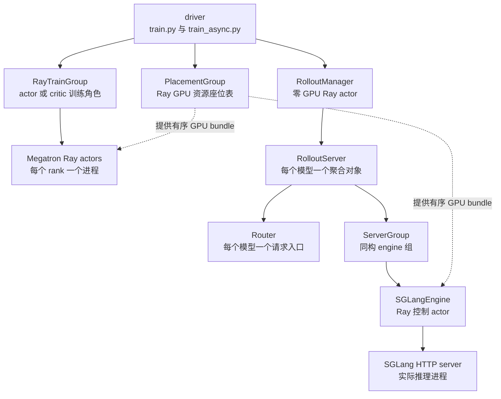

# slime Ray 控制面与资源生命周期实现分析

> **源码基线**：slime `main@681b3adca54105d5ecd3fb822fa0dc58a427e0f9`
> **核验日期**：2026-08-18 · **系列**：[[slime/index]]
> **结论先行**：slime 的 Ray 层不是通用 workflow engine，而是一层很薄但责任明确的控制面：placement group 固定物理 GPU 顺序，`RayTrainGroup` 把 Megatron SPMD ranks 包成一个逻辑 actor/critic，`RolloutServer/ServerGroup` 把 SGLang 拓扑包成可恢复服务，`RolloutManager` 则拥有 DataSource、生成函数、train-data conversion 和 engine lock。计算仍在 Megatron/SGLang 内部完成。

## 1. 控制对象层级

这些名称并不处于同一抽象层：`PlacementGroup` 是 Ray 的**资源对象**，`RayTrainGroup` 是 driver 中的**训练角色 wrapper**，`RolloutManager` 是不占 GPU 的**生成控制 Ray actor**，`RolloutServer` 与 `ServerGroup` 是 Manager 内部的**普通 Python 聚合对象**，只有最下层 `SGLangEngine` 才被动态包装成 Ray actor 并负责拉起原生 SGLang 服务进程。因而这里的 `group` 不是一种统一组件，只表示“按某种边界聚合若干同类对象”。[`actor_group.py:13-55`](https://github.com/THUDM/slime/blob/681b3adca54105d5ecd3fb822fa0dc58a427e0f9/slime/ray/actor_group.py#L13-L55) [`rollout.py:144-165`](https://github.com/THUDM/slime/blob/681b3adca54105d5ecd3fb822fa0dc58a427e0f9/slime/ray/rollout.py#L144-L165) [`rollout.py:188-297`](https://github.com/THUDM/slime/blob/681b3adca54105d5ecd3fb822fa0dc58a427e0f9/slime/ray/rollout.py#L188-L297) [`rollout.py:320-338`](https://github.com/THUDM/slime/blob/681b3adca54105d5ecd3fb822fa0dc58a427e0f9/slime/ray/rollout.py#L320-L338) [`rollout.py:464-515`](https://github.com/THUDM/slime/blob/681b3adca54105d5ecd3fb822fa0dc58a427e0f9/slime/ray/rollout.py#L464-L515) [`sglang_engine.py:48-81`](https://github.com/THUDM/slime/blob/681b3adca54105d5ecd3fb822fa0dc58a427e0f9/slime/backends/sglang_utils/sglang_engine.py#L48-L81)

图中的实线表示控制对象的创建或聚合关系，虚线表示 placement group 只提供资源位置，并不拥有或调用计算对象。driver 直接持有 `RayTrainGroup` wrapper 和 `RolloutManager` Ray handle；Manager 再持有按模型组织的 servers、groups 与 engine handles。[`placement_group.py:140-183`](https://github.com/THUDM/slime/blob/681b3adca54105d5ecd3fb822fa0dc58a427e0f9/slime/ray/placement_group.py#L140-L183) [`placement_group.py:227-237`](https://github.com/THUDM/slime/blob/681b3adca54105d5ecd3fb822fa0dc58a427e0f9/slime/ray/placement_group.py#L227-L237)

### 1.1 对象身份、所有状态与职责边界

| 对象 | 实际身份与所有位置 | 主要管理内容 | 不负责什么 |
|---|---|---|---|
| `PlacementGroup` | Ray 原生资源对象；`pgs` 为 actor、critic、rollout 保存其不同资源视图 | GPU bundles、稳定的 bundle/physical GPU 顺序、训练与 rollout 的资源区间 | 不加载模型，不发起训练或生成 |
| `RayTrainGroup` | driver 内普通 Python wrapper；一个 actor 或 critic 角色各有一个 | 全部 Megatron rank actor handles、角色参数、训练/保存/权重更新/offload/release 的 fan-out | 不实现 TP/PP/CP/EP collective；这些由 rank 进程内的 Megatron 完成 |
| `RolloutManager` | 单个零 GPU Ray actor | `DataSource`、train/eval rollout 函数、数据转换 hooks、全部模型服务、engine update lock、health monitors | 不执行 token decoding，也不是通用 workflow engine |
| `RolloutServer` | Manager 内普通 dataclass；每个 `ModelConfig` 对应一个 | 一个模型的 router 地址、一个或多个 `ServerGroup`、该模型是否接收训练权重 | 本身不是监听 HTTP 的 SGLang 进程 |
| `ServerGroup` | `RolloutServer` 内普通 dataclass | 同构 engines 的 handles、worker type、GPU/engine offsets、并行参数覆盖、是否需要 offload | 不混装不同模型；同一模型的异构 prefill/decode 等拓扑拆成多个 group |
| `SGLangEngine` | 被 `ray.remote` 动态包装的控制 actor | physical GPU 起点、端口、SGLang server 参数、服务进程启动与注册、权重和显存生命周期 | 主要是进程控制壳；实际 forward、KV cache 和 token decoding 在其拉起的 SGLang 进程树中执行 |

三种容易混淆的 `group` 因而分别回答三个问题：Placement group 回答“**进程放在哪些 GPU 上**”，`RayTrainGroup` 回答“**哪些 ranks 合起来构成一个训练角色**”，`ServerGroup` 回答“**哪些同配置 engines 合起来构成一个 serving 拓扑分区**”。`ServerGroup` 支持 `regular`、`prefill`、`decode`、`encoder` 和 `placeholder`；后者只占据逻辑 GPU offset，不创建 engine。[`sglang_config.py:11-40`](https://github.com/THUDM/slime/blob/681b3adca54105d5ecd3fb822fa0dc58a427e0f9/slime/backends/sglang_utils/sglang_config.py#L11-L40)

一个 `RolloutServer` 严格对应一个模型部署和一个 router，但可包含多种 `ServerGroup`，例如 prefill 使用 TP=2、decode 使用 TP=4；多模型配置则创建多个 `RolloutServer`。每个 group 的 `all_engines` 保存所有节点级 Ray actor，`engines` 在多节点 engine 中只暴露 node-0 handles，供上层控制与权重更新使用。[`rollout.py:167-186`](https://github.com/THUDM/slime/blob/681b3adca54105d5ecd3fb822fa0dc58a427e0f9/slime/ray/rollout.py#L167-L186) [`rollout.py:1132-1171`](https://github.com/THUDM/slime/blob/681b3adca54105d5ecd3fb822fa0dc58a427e0f9/slime/ray/rollout.py#L1132-L1171) [`rollout.py:1260-1271`](https://github.com/THUDM/slime/blob/681b3adca54105d5ecd3fb822fa0dc58a427e0f9/slime/ray/rollout.py#L1260-L1271)

### 1.2 一轮任务中何时参与

| 阶段 | 主要调用链 | 各对象此时的职责 |
|---|---|---|
| 启动与放置 | `create_placement_groups` → `create_rollout_manager` → `create_training_models` | Placement group 先固定资源；Manager 创建每模型 router/server/groups；groups 创建 engines 并等待服务健康；`RayTrainGroup` 最后创建全部 Megatron ranks |
| Rollout / eval | driver → `RolloutManager.generate/eval` → rollout function → router → engines | Manager 取数并编排生成、日志与数据转换；router 分发请求；SGLang 进程执行实际推理；同步主循环中训练 group 尚不计算，异步模式则可并发 |
| 训练 | driver → `RayTrainGroup.async_train` → 全部 rank `train` | `RayTrainGroup` 扇出 RPC，Megatron ranks 执行训练；启用 `offload_rollout` 且 GPU 与训练重叠时，Manager 经 server/group/engine 链提前释放 rollout 显存 |
| 权重提交 | `RayTrainGroup.update_weights` → train actor → Manager 获取 updatable engines 与 lock → engines | 训练侧发起提交；Manager 只选择首个 `update_weights=True` 模型并提供 handles/lock；engine 接收并装载新权重 |
| 恢复与显存切换 | Manager → `RolloutServer` → `ServerGroup` → `SGLangEngine` | server 聚合跨 group 操作；只有 `needs_offload=True` 的 group 释放/恢复显存；故障恢复只重建缺失 engine |

同步主循环的实际顺序是：先生成 rollout data，必要时 offload rollout，再训练 actor/critic，然后更新 SGLang 权重并恢复 KV cache；异步主循环则允许下一轮生成与当前轮训练重叠，但明确禁止 colocate。[`train.py:13-33`](https://github.com/THUDM/slime/blob/681b3adca54105d5ecd3fb822fa0dc58a427e0f9/train.py#L13-L33) [`train.py:48-91`](https://github.com/THUDM/slime/blob/681b3adca54105d5ecd3fb822fa0dc58a427e0f9/train.py#L48-L91) [`train_async.py:9-40`](https://github.com/THUDM/slime/blob/681b3adca54105d5ecd3fb822fa0dc58a427e0f9/train_async.py#L9-L40)

## 2. Placement group：先冻结资源，再建立逻辑顺序

`_create_placement_group` 为每张卡建立 `{GPU:1, CPU:1}` bundle，使用 `PACK` 放置；等待资源时不是静默阻塞，而是每 30 秒报告集群已注册/可用 GPU 数。[`placement_group.py:42-68`](https://github.com/THUDM/slime/blob/681b3adca54105d5ecd3fb822fa0dc58a427e0f9/slime/ray/placement_group.py#L42-L68)

Ray 的 bundle index 不保证等于 node/GPU 拓扑顺序。slime 临时启动 `InfoActor` 读取每 bundle 的 node IP 与 physical GPU id，再按 node、GPU 排序，得到稳定的 logical index→bundle/GPU 映射。[`placement_group.py:69-97`](https://github.com/THUDM/slime/blob/681b3adca54105d5ecd3fb822fa0dc58a427e0f9/slime/ray/placement_group.py#L69-L97) 这是后续 TP engine 切片、colocated IPC 和 expert routing 正确性的前提，而不只是日志美化。

### 2.1 四种资源布局

| 模式 | placement group GPU 数 | rollout offset | 含义 |
|---|---:|---:|---|
| train-only | actor GPUs | 0 | 不启动 local SGLang |
| rollout-only | rollout GPUs | 0 | 不启动 Megatron |
| colocate | `max(actor, rollout)` | 0 | 同一逻辑 GPU 区间，重叠部分时分复用 |
| disaggregate | actor + rollout GPUs | actor GPUs | 两个连续区间，可并行运行 |
| external rollout | actor GPUs（普通训练） | actor GPUs | serving 不由当前任务占本地 GPU |

对应分支由 `_get_placement_group_layout` 明确定义。[`placement_group.py:100-117`](https://github.com/THUDM/slime/blob/681b3adca54105d5ecd3fb822fa0dc58a427e0f9/slime/ray/placement_group.py#L100-L117)

这个函数返回的二元组不是“只定义了分组数量”，也不是“已经完成了全部 GPU 分配”，而是两者之间的一份 **布局描述**：

1. `num_gpus` 决定同一个 Ray placement group 创建多少个 `{GPU:1, CPU:1}` bundles，因此已经决定本任务向 Ray 预留的 GPU 总量；
2. `rollout_offset` 决定 rollout 可见的有序 bundle/GPU 列表从哪里开始切片：offset 为 0 表示从 actor 同一逻辑区间开始，offset 为 actor GPU 数表示从训练区间之后开始；
3. 它不决定每个 Megatron rank 或每个 SGLang engine 最终绑定哪个具体 bundle。真正的物理放置发生在 `_create_placement_group`、`RayTrainGroup` 和 rollout engine 创建阶段。

`create_placement_groups` 先据此创建 bundles、探测并重排 physical GPU，再让 actor 使用完整有序表的前若干项，让 rollout 使用从 `rollout_offset` 开始的切片。[`placement_group.py:42-97`](https://github.com/THUDM/slime/blob/681b3adca54105d5ecd3fb822fa0dc58a427e0f9/slime/ray/placement_group.py#L42-L97) [`placement_group.py:120-137`](https://github.com/THUDM/slime/blob/681b3adca54105d5ecd3fb822fa0dc58a427e0f9/slime/ray/placement_group.py#L120-L137) 所以 layout 同时定义 **资源池总大小 + rollout 逻辑起点**；下游才把逻辑索引落实为具体进程的 GPU 绑定。

### 2.2 两条 GPU 复用轴必须分开看

slime 有两种彼此独立的“共享 GPU”：

| 共享关系 | 由什么触发 | 是否依赖 `colocate` |
|---|---|---|
| Actor ↔ Critic | `advantage_estimator=ppo` 创建 critic，并令 `pgs["critic"] = pgs["actor"]` | 否；PPO 即使训推分离也共享训练卡 |
| Train ↔ SGLang rollout | `colocate=True` 令 rollout offset 为 0 | 是；非 colocate 时 rollout 从 actor 区间之后开始 |

PPO 参数后处理先把 `use_critic` 设为 true，并强制 critic 与 actor 使用相同 GPU 数；placement 层再把两者指向同一个 actor placement group。[`arguments.py:1901-1904`](https://github.com/THUDM/slime/blob/681b3adca54105d5ecd3fb822fa0dc58a427e0f9/slime/utils/arguments.py#L1901-L1904) [`placement_group.py:123-135`](https://github.com/THUDM/slime/blob/681b3adca54105d5ecd3fb822fa0dc58a427e0f9/slime/ray/placement_group.py#L123-L135) 但 Actor/Critic 仍是两组独立 Ray processes，各自有模型参数、optimizer 和 checkpoint；“复用”只表示它们绑定同一批 physical GPU slots，不表示二者是同一个模型。

每个训练 Ray actor 以 0.4 的 fractional GPU resource 放入一个含 1 GPU 的 bundle，使 Actor 和 Critic processes 能同时被 Ray 调度到同一卡；这个 0.4 只是 Ray admission/scheduling 数值，**不是 40% 显存上限，也不会自动隔离显存**。[`placement_group.py:140-160`](https://github.com/THUDM/slime/blob/681b3adca54105d5ecd3fb822fa0dc58a427e0f9/slime/ray/placement_group.py#L140-L160) [`actor_group.py:107-126`](https://github.com/THUDM/slime/blob/681b3adca54105d5ecd3fb822fa0dc58a427e0f9/slime/ray/actor_group.py#L107-L126)

因此 PPO 还会强制 `offload_train=True`。真正的角色切换由 driver 时序控制：Critic 先 wake → 预测旧 values → 算 GAE/returns → 训练 → sleep；Actor 等 values 返回后再 wake → policy train → sleep。`offload_train` 不是决定“现在轮到谁”的调度器，而是这条顺序得以在同一 GPU 上执行的 **显存驻留机制**：每个 role 的 `train()` 前 resume，完成后 pause 并销毁 process groups，进程本身仍存在。[`arguments.py:1948-1958`](https://github.com/THUDM/slime/blob/681b3adca54105d5ecd3fb822fa0dc58a427e0f9/slime/utils/arguments.py#L1948-L1958) [`train.py:61-69`](https://github.com/THUDM/slime/blob/681b3adca54105d5ecd3fb822fa0dc58a427e0f9/train.py#L61-L69) [`actor.py:374-422`](https://github.com/THUDM/slime/blob/681b3adca54105d5ecd3fb822fa0dc58a427e0f9/slime/backends/megatron_utils/actor.py#L374-L422)

## 3. RayTrainGroup：把 N 个 SPMD rank 封成一个逻辑角色

`RayTrainGroup` 为每个 world rank 启一个 GPU Ray actor：rank 0 先公布 master address/port，后续 ranks 用相同 rendezvous；每 actor 申请 0.4 GPU 的 Ray 资源量但绑定到一个 GPU bundle，从而允许与其他轻量 actor/process 控制对象共享 bundle 声明。[`actor_group.py:57-129`](https://github.com/THUDM/slime/blob/681b3adca54105d5ecd3fb822fa0dc58a427e0f9/slime/ray/actor_group.py#L57-L129)

底层 `TrainRayActor` 设置 MASTER/WORLD/RANK/LOCAL_RANK，初始化 NCCL 与额外 Gloo group，并尽量设置 GPU→CPU NUMA affinity。[`train_actor.py:28-92`](https://github.com/THUDM/slime/blob/681b3adca54105d5ecd3fb822fa0dc58a427e0f9/slime/ray/train_actor.py#L28-L92)

| wrapper 方法 | fanout 行为 | 返回值 |
|---|---|---|
| `create()` | 全 ranks `init(args, role, ...)` | 每 rank 恢复的 start rollout id |
| `async_train()` | 全 ranks `train(...)` | actor→None；critic PP-last→values dict |
| `save_model()` | 全 ranks save | 同步结果；release 模式改写下轮 load args |
| `update_weights()` | 全 ranks 进入 updater | 等待完整提交；full-disk 由 group 续接 reload |
| `offload/onload()` | 全 ranks sleep/wake | 释放/恢复 Megatron GPU state |
| `release()` | kill actors | 真正释放 Ray actor，而非仅 offload |

这些行为见 [`actor_group.py:131-215`](https://github.com/THUDM/slime/blob/681b3adca54105d5ecd3fb822fa0dc58a427e0f9/slime/ray/actor_group.py#L131-L215)。

### 3.1 为什么 actor/ref/teacher 不是三个 Ray groups

ref、OPD teacher、old actor 由单个 `MegatronTrainRayActor` 内的 `TensorBackuper` 保存成不同 tag，训练前通过 restore 切换；只有 critic 是独立可训练模型，因此需要第二个 group。[`actor.py:120-143`](https://github.com/THUDM/slime/blob/681b3adca54105d5ecd3fb822fa0dc58a427e0f9/slime/backends/megatron_utils/actor.py#L120-L143) 这样减少了长期占用的模型进程，但模型切换会带来 CPU backup/restore 成本。

## 4. RolloutServer：一个模型一个 router，组内可异构

`SglangConfig` 的 `ModelConfig` 表示一个模型部署；同模型 server groups 必须共享 model path，`update_weights` 未显式设置时由是否等于 actor HF checkpoint 自动推断。[`sglang_config.py:44-100`](https://github.com/THUDM/slime/blob/681b3adca54105d5ecd3fb822fa0dc58a427e0f9/slime/backends/sglang_utils/sglang_config.py#L44-L100)

`ServerGroup` 是同构 engine 组，保存 worker type、GPU/engine、rank/GPU offsets、SGLang overrides 和是否与 Megatron 重叠；`RolloutServer` 聚合一个模型的多个 group，并暴露 node-0 engine handles、per-engine GPU offsets/parallel config。[`rollout.py:145-186`](https://github.com/THUDM/slime/blob/681b3adca54105d5ecd3fb822fa0dc58a427e0f9/slime/ray/rollout.py#L145-L186) [`rollout.py:320-382`](https://github.com/THUDM/slime/blob/681b3adca54105d5ecd3fb822fa0dc58a427e0f9/slime/ray/rollout.py#L320-L382)

创建 engine 时，控制面用 `gpu_offset` 映射到稳定 physical GPU，给每个 SGLang Ray actor 分配端口与 placement bundle，再并行发起 `engine.init()`。[`rollout.py:188-297`](https://github.com/THUDM/slime/blob/681b3adca54105d5ecd3fb822fa0dc58a427e0f9/slime/ray/rollout.py#L188-L297) `SGLangEngine` actor 自己再 spawn 原生 SGLang HTTP server process，健康后注册到 router；external 模式则只核对已存在 server args 并注册，不创建进程。[`sglang_engine.py:122-192`](https://github.com/THUDM/slime/blob/681b3adca54105d5ecd3fb822fa0dc58a427e0f9/slime/backends/sglang_utils/sglang_engine.py#L122-L192)

## 5. RolloutManager：生成控制面的唯一 owner

RolloutManager 初始化时完成五件事：启动所有 rollout servers、实例化 DataSource、动态加载 train/eval rollout 函数、加载 reward/train-data hooks、建立全局 engine update lock；可选 health monitor 也由它拥有。[`rollout.py:465-515`](https://github.com/THUDM/slime/blob/681b3adca54105d5ecd3fb822fa0dc58a427e0f9/slime/ray/rollout.py#L465-L515)

`generate()` 的控制链是：health resume → rollout function → debug dump/log → Sample→train dict → DP split/Box；debug rollout-only 在 conversion 前返回。[`rollout.py:590-604`](https://github.com/THUDM/slime/blob/681b3adca54105d5ecd3fb822fa0dc58a427e0f9/slime/ray/rollout.py#L590-L604)

它还决定谁能接收权重：只返回第一个 `update_weights=True` 模型的 engines；源码明确注明多 updatable models 的权重更新尚未支持。[`rollout.py:555-584`](https://github.com/THUDM/slime/blob/681b3adca54105d5ecd3fb822fa0dc58a427e0f9/slime/ray/rollout.py#L555-L584) 因而“多模型 serving”不等于“多 actor 联合训练”。

## 6. Offload、release、recover 是三个不同动作

| 动作 | 对象仍存在？ | GPU state | 典型用途 |
|---|---|---|---|
| rollout `offload` | 是 | 仅对与训练重叠 groups 释放 memory occupation | colocate 时给 Megatron 让卡 |
| train `sleep` | 是 | TMS pause，清内存并销毁 process groups | 保留 actor、降低重建成本 |
| train `release` | 否 | kill Ray actors | 极限节省资源，以 checkpoint 重建 |
| rollout `recover` | 死 engine 重建 | 新 engine 先 offload/onload weights | 服务进程故障恢复 |

ServerGroup 只有 `needs_offload=True` 才执行 release/resume memory occupation，所以 mixed topology 的 rollout-only groups 不会被无谓 offload。[`rollout.py:299-317`](https://github.com/THUDM/slime/blob/681b3adca54105d5ecd3fb822fa0dc58a427e0f9/slime/ray/rollout.py#L299-L317) recover 会并行重启所有缺失 engines，并区分 updatable 与 frozen model 的权重恢复路径。[`rollout.py:384-425`](https://github.com/THUDM/slime/blob/681b3adca54105d5ecd3fb822fa0dc58a427e0f9/slime/ray/rollout.py#L384-L425)

## 7. 设计取舍

- **优点**：控制链短，原生 engine 清晰可见；GPU physical ordering 和 lifecycle 显式；复杂 SGLang topology 不污染训练 loop。
- **代价**：driver/Ray wrapper 依赖很多跨层 args；actor/critic 资源独立性有限；第一个 updatable model 的限制说明多策略训练仍需扩展提交面。
- **不要误解**：Ray actor 不是训练并行本身。Megatron TP/PP/CP/EP collective 在每个 actor process 内由 Megatron 创建；Ray 只负责把进程放到正确 GPU 并发 RPC。

## Related Pages

- [[10_slime_end_to_end_iteration_analysis]] — 控制对象在一轮中的交互
- [[13_slime_sglang_rollout_engine_analysis]] — RolloutManager 下方的生成数据面
- [[14_slime_megatron_training_analysis]] — RayTrainGroup 下方的计算面
- [[16_slime_weight_sync_analysis]] — engine lock 与 updatable server 的消费者
- [[18_slime_fault_tolerance_observability_analysis]] — recover/health monitor 深潜
