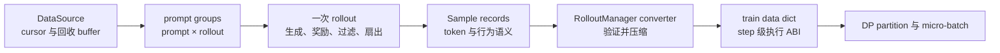
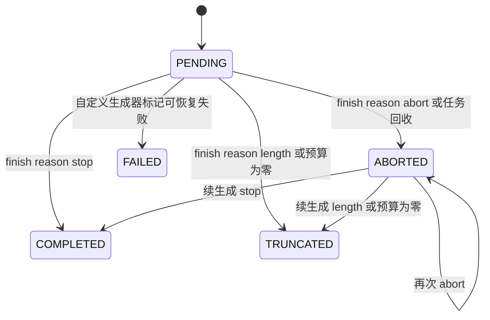
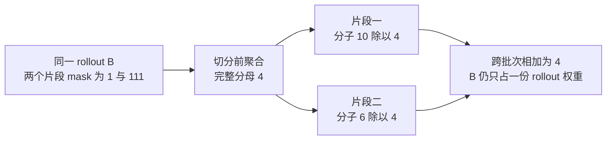
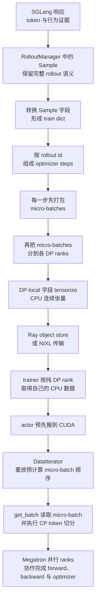

# slime Sample、DataSource 与训练数据契约分析

> **源码基线**：`THUDM/slime@681b3adca54105d5ecd3fb822fa0dc58a427e0f9`（`main`，2026-08-12）
> **主题**：Sample 的身份、状态与 token 对齐字段，DataSource 的读取、回收和恢复，以及训练字典的转换与完整 mask 分母。
> **适用范围**：数据语义与数据侧接口；DP 调度归训练后端页，多模态与 SFT 各有专页。
> **最近更新**：2026-09-10。依据冻结源码复核并补全本页机制。

slime 的数据层不只是“读取 prompt 再转成张量”的加载流程，而是一道跨系统的数据边界：rollout 侧会产生多轮交互、工具调用、中断续生成、动态过滤和一对多扇出，Megatron 侧则只接受可切分、可打包、统计口径稳定的训练批次。slime 因而把数据拆成三层：`Sample` 保存一次生成的完整信息，`DataSource` 管理 prompt 分组的取得、回收和恢复，RolloutManager 再把 Sample 压缩成训练输入字典。这个分层牺牲了一部分静态类型和零拷贝能力，换来的是扩展 rollout 时不必修改训练器，同时仍能保证 token mask、行为策略元数据、rollout 标识和恢复顺序正确。

本文把“源码明确行为”和“设计分析”分开：带 fixed-commit 定位符的是源码或项目文档事实；使用“由此可推断”“可以理解为”的段落是根据约束与失败路径作出的分析判断，不代表作者原话。

## 1. 为什么需要独立的数据契约

rollout 与训练看到的“一个样本”并不是同一种对象：

| 数据矛盾 | rollout 侧需要保留什么 | 训练器侧需要什么 |
|---|---|---|
| 数据形态 | 文本、token、图像、工具观察、reward、状态、trace | token ids、response length、mask、reward 和可选 behavior tensors |
| 生命周期 | pending、abort、续生成、完成、过滤、回收 | 一个训练 step 内稳定且可重复切分的 batch |
| 一对多关系 | 一个 prompt 可采多条 response；一次 agent 逻辑执行又可拆成多个训练片段 | 全局批次大小必须按逻辑 rollout 计数，不能随片段数膨胀 |
| 策略来源 | 中断前后的 token 可能由不同权重版本生成 | loss 必须知道哪些 token 可训练，校正或重放还要知道生成侧元数据 |
| 并行形态 | Python 对象和嵌套列表便于异步任务组合 | DP/CP/PP 需要确定的 partition、micro-batch schedule 和 dtype |

项目的 agent 文档也直接描述了这一边界：agent runtime 可以使用字符串、消息、工具调用或环境事件，但训练目标仍应保存模型实际采样的 token ids，并用 `loss_mask` 区分模型输出与模板/工具/环境文本。[`docs/en/get_started/agent.md:19-27`](https://github.com/THUDM/slime/blob/681b3adca54105d5ecd3fb822fa0dc58a427e0f9/docs/en/get_started/agent.md#L19-L27)

### 1.1 四个不能破坏的不变量

1. **token 对齐不变量**：response token、`loss_mask`、selected-token logprob，以及启用时的 top-p/路由元数据必须描述相同位置。
2. **标识不变量**：prompt 分组、物理 Sample、逻辑 rollout 是三种不同标识；扇出后仍要知道哪些训练片段属于同一次逻辑执行。
3. **生命周期不变量**：中断样本要携带已生成上下文和游标进入下一轮，而不能假装成全新 prompt。
4. **统计不变量**：DP/micro-batch 拆分不能让“一次 rollout 产生几个 fragments”改变 loss 分母或训练 step 数。

前三个不变量由 `Sample`/`DataSource` 保留，第四个在 Sample 转训练 dict 时显式固化。源码把同一 `rollout_id` 的 samples 放进同一个训练 step，并把 global batch size 定义为 rollout 数而不是 training-sample 数。[`slime/utils/dp_schedule.py:82-110`](https://github.com/THUDM/slime/blob/681b3adca54105d5ecd3fb822fa0dc58a427e0f9/slime/utils/dp_schedule.py#L82-L110) [`slime/utils/dp_schedule.py:127-154`](https://github.com/THUDM/slime/blob/681b3adca54105d5ecd3fb822fa0dc58a427e0f9/slime/utils/dp_schedule.py#L127-L154)

> **设计分析**：如果从一开始只传 trainer dict，工具状态、partial 状态和自定义字段就必须不断侵入训练 ABI；如果一直把任意 Python dict 传到底，trainer 又无法可靠地验证 shape、身份和统计口径。三层模型本质上是在“rollout 可扩展性”和“训练执行确定性”之间设置一次受控压缩点。

## 2. 为什么这么设计：三层模型击败了哪些更直观的做法

先把取舍摆在机制前面。当前设计明确选择了这些代价：

- 用可扩展 `Sample` 保留语义，代价是部分字段只能运行时验证；
- 用小型 `DataSource` 接口隔离来源与回收，代价是高级队列策略要由插件实现；
- 在 rollout/train 边界一次性压缩，代价是条件字段持续增多时 converter 会变宽；
- 用嵌套结构和 `rollout_id` 表达扇出关系，代价是自定义生成函数必须主动维护片段标识和重叠 token mask；
- 用 partial 回收已生成前缀，代价是在算力利用率与严格 on-policy 之间增加配置选择。

判据只有一条：**任何让“生成侧语义”与“训练侧执行契约”共用同一个对象的方案，都会把一次 rollout 侧扩展变成一次训练 ABI 变更**。下表每一行都是一个更简单、更好解释的做法，固定基线一个都没有采用。

| 直观替代 | 看似省下什么 | 在本基线的约束下会失去什么 |
|---|---|---|
| rollout 直接产出训练字典，取消 `Sample` 中间层 | 少一次转换，字段静态可查 | `status`、`metadata`、`session_id`、`weight_versions` 这类只在生成侧有意义的字段无处安放；partial 回收与版本审计要么挤进训练 ABI，要么直接丢失。[`slime/utils/types.py:107-149`](https://github.com/THUDM/slime/blob/681b3adca54105d5ecd3fb822fa0dc58a427e0f9/slime/utils/types.py#L107-L149) [`slime/utils/types.py:397-416`](https://github.com/THUDM/slime/blob/681b3adca54105d5ecd3fb822fa0dc58a427e0f9/slime/utils/types.py#L397-L416) |
| 让任意 Python dict 一路传到 trainer | 扩展零成本 | token/mask/logprob/top-p/routing 的等长关系失去单一写入口与逐次校验，错位只能推迟到 Megatron 内部才暴露。[`slime/utils/types.py:253-302`](https://github.com/THUDM/slime/blob/681b3adca54105d5ecd3fb822fa0dc58a427e0f9/slime/utils/types.py#L253-L302) [`slime/utils/types.py:418-443`](https://github.com/THUDM/slime/blob/681b3adca54105d5ecd3fb822fa0dc58a427e0f9/slime/utils/types.py#L418-L443) |
| 由 DataSource 直接产出 optimizer step 或 DP 分片 | 少一层调度 | rollout 分母只有在完整 step 视野下才算得出；先切分，同组 fragments 落到不同 micro-batch 后就无法重建。[`slime/ray/rollout.py:799-814`](https://github.com/THUDM/slime/blob/681b3adca54105d5ecd3fb822fa0dc58a427e0f9/slime/ray/rollout.py#L799-L814) [`slime/utils/dp_schedule.py:127-165`](https://github.com/THUDM/slime/blob/681b3adca54105d5ecd3fb822fa0dc58a427e0f9/slime/utils/dp_schedule.py#L127-L165) |
| 中断样本当作新 prompt 重发 | 不需要回收队列 | 已生成前缀作废；且写回时“每组仍须等于 `n_samples_per_prompt`”的断言会被破坏，reward 的分组假设随之失效。[`slime/rollout/data_source.py:205-211`](https://github.com/THUDM/slime/blob/681b3adca54105d5ecd3fb822fa0dc58a427e0f9/slime/rollout/data_source.py#L205-L211) |
| 把 buffer 当通用经验回放池 | 直接复用现成 RL 组件 | 固定实现只有分组 FIFO 与过滤，没有容量上限、优先级、按时效准入或自动淘汰。[`slime/rollout/data_source.py:168-211`](https://github.com/THUDM/slime/blob/681b3adca54105d5ecd3fb822fa0dc58a427e0f9/slime/rollout/data_source.py#L168-L211) |

> [!note] 推断
> 这张表是本页依据源码边界与失败路径重建的设计权衡。**源码未陈述该取舍**——`slime/utils/types.py`、`slime/rollout/data_source.py` 与 `slime/ray/rollout.py` 中没有对应的 rationale 注释或设计文档引用。每一行“会失去什么”都能落到所引 `file:line` 上的断言、字段或调用点，但“当初权衡过并否掉了它”这层意思由本页承担，不代表作者原话。

后文按这条主线展开：三层模型的形状见第 3 节，三层各自的机制见第 4–9 节，边界与检查清单见第 11 节。

## 3. 三层模型：语义、生命周期、执行



三层各自只回答一类问题：

- `Sample`：**这条可训练轨迹是什么、从哪里来、哪些 token 有效**；
- `DataSource`：**下一批 prompt group 从哪里取，中断 group 放回哪里，恢复到哪个位置**；
- train dict：**这一训练 step 要给各 DP rank 发送哪些规则化字段**。

默认 rollout 返回 `prompt × rollout` 结构的 `list[list[Sample]]`；自定义 agent 生成函数还可以让一次逻辑 rollout 返回多个训练片段。`RolloutFnTrainOutput` 把样本与额外指标分开，同时兼容旧函数直接返回样本。[`slime/rollout/base_types.py:7-25`](https://github.com/THUDM/slime/blob/681b3adca54105d5ecd3fb822fa0dc58a427e0f9/slime/rollout/base_types.py#L7-L25)

## 4. Sample：为什么它是完整生成记录，而不只是数据加载器中的一行

### 4.1 三种标识不能混用

| 字段 | 表示什么 | 主要用途 |
|---|---|---|
| `group_index` | 原始 prompt group | group reward/GRPO 等按 prompt 的分组语义 |
| `index` | DataSource 分配的物理 Sample 序号 | 排序、审计、默认一执行一 Sample 时的唯一性 |
| `rollout_id` | 一次逻辑执行 | 扇出片段的训练步分组与 rollout 级 loss 归一化 |

`rollout round` 是一次 `generate` 返回的整批；`Sample.rollout_id` 则区分批内逻辑执行，这两个粒度不能混用。`Sample` 注释明确：默认路径中“一次逻辑执行 = 一个训练样本”；compact/subagent 路径若把一次逻辑执行拆成多个样本，则所有同组片段必须共享 `rollout_id`。[`slime/utils/types.py:93-106`](https://github.com/THUDM/slime/blob/681b3adca54105d5ecd3fb822fa0dc58a427e0f9/slime/utils/types.py#L93-L106)

一个容易误读的细节是：固定基线的默认 `RolloutDataSource` 实际只写 `group_index` 和 `index`，没有写 `rollout_id`；converter 会为所有 `rollout_id=None` 的 samples 分配不与显式 id 冲突的临时唯一 id。[`slime/rollout/data_source.py:107-118`](https://github.com/THUDM/slime/blob/681b3adca54105d5ecd3fb822fa0dc58a427e0f9/slime/rollout/data_source.py#L107-L118) [`slime/ray/rollout.py:761-780`](https://github.com/THUDM/slime/blob/681b3adca54105d5ecd3fb822fa0dc58a427e0f9/slime/ray/rollout.py#L761-L780)

> [!note] 文档/注释与实现的细微差异
> `_validate_rollout_id_annotated` 上游调用处的注释说默认 rollout id “inherit from the data source”，但该基线的默认 DataSource 并未赋值；真正兜底发生在 converter。两者在默认一 Sample 路径上统计结果相同，但解释源码时应以实际赋值点为准。[`slime/ray/rollout.py:690-699`](https://github.com/THUDM/slime/blob/681b3adca54105d5ecd3fb822fa0dc58a427e0f9/slime/ray/rollout.py#L690-L699)

### 4.2 字段不是平铺配置，而是五类语义

| 语义 | 关键字段 | 没有它会丢失什么 |
|---|---|---|
| 内容 | `prompt`、`tokens`、`response`、`response_length` | rollout 上下文和 trainer token span |
| 目标 | `reward`、`loss_mask`、`remove_sample`、`train_metadata` | 哪些 token/哪种 loss 参与优化 |
| 行为策略 | `rollout_log_probs`、top-p ids/offsets、routed experts、`weight_versions` | off-policy 校正、采样/routing 重放和版本审计 |
| 生命周期 | `status`、`metadata`、`session_id` | 部分结果回收、终止原因、路由亲和与外部环境状态 |
| 模态/扩展 | multimodal inputs、custom generate/RM path、动态未知字段 | 数据集特有输入和插件兼容性 |

字段定义与状态枚举见 [`slime/utils/types.py:107-149`](https://github.com/THUDM/slime/blob/681b3adca54105d5ecd3fb822fa0dc58a427e0f9/slime/utils/types.py#L107-L149)。`to_dict/from_dict` 不只做序列化：它把 enum 和嵌套统计对象展平，又把未知键恢复为动态属性，因此 Sample 能跨 Ray/落盘边界并为新字段保留向后兼容空间。[`slime/utils/types.py:222-244`](https://github.com/THUDM/slime/blob/681b3adca54105d5ecd3fb822fa0dc58a427e0f9/slime/utils/types.py#L222-L244) 对应单测把“字段静默丢失会让状态和生成统计在到达 trainer 前消失”作为显式风险。[`tests/test_sample.py:1-15`](https://github.com/THUDM/slime/blob/681b3adca54105d5ecd3fb822fa0dc58a427e0f9/tests/test_sample.py#L1-L15)

### 4.3 状态、统计与逐样本覆盖

`append_response_tokens` 仅在 `update_terminal_info=True` 且响应含 `finish_reason` 时更新终止信息：`length → TRUNCATED`、`abort → ABORTED`、`stop → COMPLETED`；未知类型没有兜底状态赋值。`FAILED` 表示工具/API/解析等可恢复或非关键失败，是扩展生成器可使用的状态，并不是 SGLang finish reason 的第四种自动映射。默认 `generate` 只接受 `PENDING` 或 `ABORTED`，扩展重试必须明确重置或处理状态。



图中 FAILED 是扩展边界；没有画出自动 FAILED 重试边，因为默认生成入口不接受它。`Sample.effective_response_length` 返回 mask 的和；无 mask 才回退到 `response_length`。`get_reward_value` 无 `reward_key` 时返回整个 reward，有该键时直接索引 reward 字典，不替缺失键兜底。

`SpecInfo` 累加 accepted/draft/verify/completion 计数，accept rate 是 accepted/draft，accept length 是 completion/verify；分母为零返回 0。`PrefixCacheInfo` 累加 cached tokens 与 prompt tokens，其比值是 prefix cache hit rate。这些累计字段避免 partial continuation 的最后一次响应覆盖前几次统计。

每条 Sample 的 `session_id` 在缺失时分配 UUID；只有 `router_policy=consistent_hashing` 才作为 `X-SMG-Routing-Key` HTTP header 发出。这里只能证明 slime 提供路由键，具体散列与 engine 亲和策略由外部 SGLang Model Gateway 实现。`generate_function_path` 的非空值覆盖全局 `custom_generate_function_path`；`async_rm` 同样优先使用逐样本 `custom_rm_path`，再考虑全局配置。多任务评估对这些字段的设置见 [[27_slime_evaluation_path_analysis]]。

三项多模态字段是原始 `multimodal_inputs`、处理后的 `multimodal_train_inputs` 与复用标识 `multimodal_train_input_id`；字段存在不代表默认训练路径已支持任意模态，其处理器与模型边界见 [[26_slime_multimodal_vlm_path_analysis]]。

源码阅读：`slime/utils/types.py::Sample.Status`、`Sample.SpecInfo`、`Sample.PrefixCacheInfo`、`Sample.append_response_tokens`、`Sample.effective_response_length`；`slime/rollout/sglang_rollout.py::generate`、`generate_and_rm`、`generate_and_rm_group`；`slime/rollout/rm_hub/__init__.py::async_rm`。

`types.py` 中还有三个邻接 schema：`RolloutBatch` 是训练路径的 dict 类型别名，不是带运行时字段检查的 dataclass；`ParamInfo` 是 frozen 参数描述，保存 name/dtype/shape/attrs/size/src_rank，属于权重同步接口，见 [[16_slime_weight_sync_analysis]]；`MultimodalTypes` 列出 image/video/audio 名称与占位符，名称登记不等同于某个模型或 rollout 函数完整支持该模态。证据：`slime/utils/types.py::RolloutBatch`、`ParamInfo`、`MultimodalTypes`。

### 4.4 `append_response_tokens` 是 token 对齐的单一写入口

模型生成、工具观察和 partial continuation 都会追加 response，但三者不能用同样的训练语义：

| 追加内容 | `trainable` | logprob | `loss_mask` | 原因 |
|---|---:|---|---|---|
| 模型新生成 token | `True` | 必须与 token 等长 | 1 | 它来自 behavior policy，既可训练也能计算 policy ratio |
| 工具/环境 token | `False` | 调用方不得传；内部填 0 | 0 | 它是外部观察，不是 policy 采样动作 |
| 中断后新生成的 token | `True` | 只传新 token 的 logprob | 1 | 旧前缀已在 Sample 中，新元数据追加到原记录 |

实现会同步追加 `tokens`、`response_length`、`loss_mask` 和 logprob；trainable token 缺 logprob、non-trainable token 携带 logprob都会立即报错。[`slime/utils/types.py:253-302`](https://github.com/THUDM/slime/blob/681b3adca54105d5ecd3fb822fa0dc58a427e0f9/slime/utils/types.py#L253-L302) top-p ragged offsets按新增 span 合并，工具 token 在已有 top-p replay 时得到空 span；routed-expert metadata 则用 `routed_experts_start_len` 对齐旧前缀后拼接。[`slime/utils/types.py:304-395`](https://github.com/THUDM/slime/blob/681b3adca54105d5ecd3fb822fa0dc58a427e0f9/slime/utils/types.py#L304-L395)

`_extract_rollout_top_p_token_data` 在读取 top-p 元数据时还要求 ids/offsets 同时存在、offsets 非空且从 0 开始、末 offset 等于 ids 数，以及显式传入 token 数时 offsets 长度等于 token 数加 1；否则抛 `ValueError`。两个都缺失才返回 `None`。每次 append 最后重新验证 mask/logprob 等于 `response_length`，top-p offsets 数为 `response_length+1` 且末 offset 等于 ids 数。[`slime/utils/types.py:418-443`](https://github.com/THUDM/slime/blob/681b3adca54105d5ecd3fb822fa0dc58a427e0f9/slime/utils/types.py#L418-L443)

> **设计分析**：工具 token 填零 logprob 的目的不是伪造“概率为 1”，而是让 token-aligned 数组保持等长；真正阻止它进入目标函数的是 `loss_mask=0`。如果直接删掉工具 token，后续模型 token 的上下文就与生成时不同；如果把它设为可训练，模型会被要求模仿环境返回，策略动作与观察的边界会被破坏。

## 5. DataSource：为什么接口同时有 get、add、save、load

抽象接口只有 `get_samples`、`add_samples`、`save`、`load` 和 `__len__`。[`slime/rollout/data_source.py:17-46`](https://github.com/THUDM/slime/blob/681b3adca54105d5ecd3fb822fa0dc58a427e0f9/slime/rollout/data_source.py#L17-L46) 这不是普通 map-style dataset 接口，因为它既要生产新 group，也要接收未完成 group，并在 checkpoint 后恢复生产顺序。

### 5.1 默认 DataSource 管理读取顺序，不保存整个数据集

`RolloutDataSource` 维护 `epoch_id`、prompt offset、group/sample counter；每个 prompt 深拷贝出 `n_samples_per_prompt` 条 Sample，并在跨 epoch 时按 epoch seed 重新 shuffle。[`slime/rollout/data_source.py:50-118`](https://github.com/THUDM/slime/blob/681b3adca54105d5ecd3fb822fa0dc58a427e0f9/slime/rollout/data_source.py#L50-L118)

save/load 只保存游标、epoch、两个计数器与元数据，恢复时按 epoch 重新执行相同的随机打乱，而不是把整个数据集写入 checkpoint。[`slime/rollout/data_source.py:123-160`](https://github.com/THUDM/slime/blob/681b3adca54105d5ecd3fb822fa0dc58a427e0f9/slime/rollout/data_source.py#L123-L160)

> **设计分析**：checkpoint 的真正目标是恢复“下一条是谁”和身份计数，不是复制静态输入数据。这样 checkpoint 小，但正确性依赖原 dataset 与 shuffle 算法仍可重建；若外部在线数据源不可重放，自定义 DataSource 就必须在 `save/load` 中保存更强的游标或队列状态。

默认构造 `Dataset` 的参数映射如下；这些参数决定输入行如何变成 Sample，不能把它们理解成训练 batch 配置。

| Dataset 参数 | args 来源 | 作用 |
|---|---|---|
| `path`、`prompt_key`、`label_key` | `prompt_data`、`input_key`、`label_key` | 数据路径、prompt 与监督/奖励标签字段 |
| `metadata_key`、`tool_key` | 同名参数 | 读取元数据；工具定义保存到 metadata 中 |
| `tokenizer`、`processor` | 由 `hf_checkpoint` 加载 | 模板、编码与多模态预处理依赖 |
| `max_length`、`multimodal_keys` | `rollout_max_prompt_len`、`multimodal_keys` | prompt 长度过滤与模态列映射 |
| `apply_chat_template`、`apply_chat_template_kwargs` | 同名参数 | 是否渲染对话及模板选项 |
| `seed` | `rollout_seed` | 重建 shuffle 顺序的种子 |

只有 `rollout_global_dataset=True` 且 `prompt_data` 非空时才构造 Dataset；否则 `get_samples` 创建空 `Sample()`，仍分配 group/sample 标识，实际输入由自定义 rollout 填充。`save/load` 在 global dataset 关闭时直接返回；load 路径为空也返回，状态文件不存在则记录日志后返回。启用 `dump_details` 时，构造阶段额外保存 tokenizer，以及存在时的 processor 到该目录，供后续重放解释相同 token。

源码阅读：`slime/rollout/data_source.py::RolloutDataSource.__init__`、`get_samples`、`save`、`load`；`slime/utils/data.py::Dataset.__init__`。

### 5.2 Buffer 是回收队列，不是通用经验回放池

`RolloutDataSourceWithBuffer` 先从 buffer 取 group，不足时才从 dataset 补；默认 `pop_first` 是 FIFO。过滤器实际调用签名是 `buffer_filter(args, None, buffer, num_samples)`，第二个 rollout id 参数在此固定为 `None`；返回选中 groups 的同时，需要像 `pop_first` 一样从原 buffer 移除已取项，否则下次会重复取回。写回时要求 group 仍为 `n_samples_per_prompt` 大小，说明回收单位是 prompt group，不是任意单条 token span。[`slime/rollout/data_source.py:168-211`](https://github.com/THUDM/slime/blob/681b3adca54105d5ecd3fb822fa0dc58a427e0f9/slime/rollout/data_source.py#L168-L211) [`slime/rollout/data_source.py:225-229`](https://github.com/THUDM/slime/blob/681b3adca54105d5ecd3fb822fa0dc58a427e0f9/slime/rollout/data_source.py#L225-L229)

项目 quick start 同样把 partial 的目的描述为回收动态采样中被提前 abort 的半生成样本，并说明可用 `buffer_filter_path` 替换 FIFO 策略。[`docs/en/get_started/quick_start.md:372-390`](https://github.com/THUDM/slime/blob/681b3adca54105d5ecd3fb822fa0dc58a427e0f9/docs/en/get_started/quick_start.md#L372-L390)

固定实现没有容量上限、优先级、基于时效性的准入、按行为策略版本采样或自动淘汰，因此不能把它等同于经验回放池。需要这些能力时，应由自定义 DataSource 或过滤器显式实现；官方定制文档也把 `get/add/save/load` 暴露为完整替换点。[`docs/en/get_started/customization.md:382-400`](https://github.com/THUDM/slime/blob/681b3adca54105d5ecd3fb822fa0dc58a427e0f9/docs/en/get_started/customization.md#L382-L400)

## 6. 中断后的续生成：旧 token、新 token 和元数据如何处理

partial 的问题背景是动态采样已凑够目标 batch 后，仍有长尾请求在运行。直接丢弃会浪费已经生成的 token；等待全部完成又把 step latency 绑定到最慢请求。slime 选择 abort 剩余请求、保存完整 Sample group，下轮优先续生成。[`slime/rollout/sglang_rollout.py:400-451`](https://github.com/THUDM/slime/blob/681b3adca54105d5ecd3fb822fa0dc58a427e0f9/slime/rollout/sglang_rollout.py#L400-L451)


abort 会等待 pending tasks 返回，把含 response 的 Sample 写入首次 `start_rollout_id`，再把 group 交回 DataSource；同步 wrapper 在下一轮从 `get_samples` 取回并调用同一生成路径。[`slime/rollout/sglang_rollout.py:339-371`](https://github.com/THUDM/slime/blob/681b3adca54105d5ecd3fb822fa0dc58a427e0f9/slime/rollout/sglang_rollout.py#L339-L371) [`slime/rollout/sglang_rollout.py:627-649`](https://github.com/THUDM/slime/blob/681b3adca54105d5ecd3fb822fa0dc58a427e0f9/slime/rollout/sglang_rollout.py#L627-L649)

恢复时 `_prepare_prompt_ids` 只有在已有 tokens，且已有 `multimodal_train_inputs` 或没有实际多模态输入时才复用 `sample.tokens`；剩余生成预算的减法发生在 `generate`，即 `max_new_tokens -= sample.response_length`；SGLang 只返回新生成 token 及其 logprob，`append_response_tokens` 再把它们追加到旧 Sample。[`slime/rollout/sglang_rollout.py:42-61`](https://github.com/THUDM/slime/blob/681b3adca54105d5ecd3fb822fa0dc58a427e0f9/slime/rollout/sglang_rollout.py#L42-L61) [`slime/rollout/sglang_rollout.py:152-219`](https://github.com/THUDM/slime/blob/681b3adca54105d5ecd3fb822fa0dc58a427e0f9/slime/rollout/sglang_rollout.py#L152-L219)

### 6.1 旧 token 是否参与训练：由一个开关决定

- **默认** `mask_offpolicy_in_partial_rollout=False`：旧 `loss_mask` 保持原值，新模型 token 追加 1；因此旧、新模型 token 都参与训练。旧 token 的 logprob、top-p 和路由元数据会保留，新 token 的元数据继续追加。最终 Sample 看起来像一条连续 response，但 `weight_versions` 等字段仍会记录它跨过了权重更新边界。
- **开启** `--mask-offpolicy-in-partial-rollout`：恢复生成前把已有 response 的 mask 全设为 0，只训练本轮新生成 token；旧 token 仍保留在 `tokens` 中作为上下文，不能删除。该参数的 help 也明确说明“only on-policy generated tokens will be used in training”。[`slime/utils/arguments.py:456-474`](https://github.com/THUDM/slime/blob/681b3adca54105d5ecd3fb822fa0dc58a427e0f9/slime/utils/arguments.py#L456-L474) [`slime/rollout/sglang_rollout.py:224-240`](https://github.com/THUDM/slime/blob/681b3adca54105d5ecd3fb822fa0dc58a427e0f9/slime/rollout/sglang_rollout.py#L224-L240)

所以“恢复后只用新 token 训练”和“新旧 token 都训练”都可能成立，区别就在该开关。无论哪种模式，生成内容与元数据都不会用新 response 覆盖旧 response，而是按 token 区间合并；变化的只是旧区间的 loss 权重。

### 6.2 为什么不能让它真的“像从未中断”

在 token 序列层面，旧前缀 + 新后缀确实组成一条连续轨迹；但若两轮之间发布了新权重，它就不是单一 behavior policy 采出的同质 trajectory。源码把每次响应中的 `weight_version` 追加到列表，而不是只保留最后版本。[`slime/utils/types.py:397-416`](https://github.com/THUDM/slime/blob/681b3adca54105d5ecd3fb822fa0dc58a427e0f9/slime/utils/types.py#L397-L416)

> **设计分析**：默认保留旧 mask 优先回收算力，mask-offpolicy 模式优先严格 on-policy。两者都不是免费午餐：前者可能增加策略陈旧度，后者让旧 token 只消耗上下文长度、不贡献梯度。正确选择取决于更新频率、off-policy 校正能力和长尾浪费占比。

## 7. 嵌套输出与 compact 扇出：格式是什么、解决什么问题

默认输出与 fanout 输出可以写成：

```text
默认：
prompt group
└── 一次 rollout
    └── Sample

compact / agent 扇出：
prompt group
└── 一次 rollout
    ├── Sample fragment A
    ├── Sample fragment B
    └── Sample fragment C
```

对应 Python shape 是：

- 默认：`list[list[Sample]]`，即 `prompt × rollout`；
- 扇出输出：`list[list[list[Sample]]]`，即 `prompt × rollout × 训练片段`。

这种格式用于“一次逻辑执行产生多个可训练片段”的场景，例如 subagent 分支、多 agent 轨迹、上下文压缩前后的片段。官方定制文档允许自定义生成函数返回 `list[Sample]`，要求同组片段共享 `rollout_id`，并建议一条总 reward 拆成 $K$ 段时按 `reward / K` 分配，避免奖励被重复放大。[`docs/en/get_started/customization.md:87-117`](https://github.com/THUDM/slime/blob/681b3adca54105d5ecd3fb822fa0dc58a427e0f9/docs/en/get_started/customization.md#L87-L117)

RolloutManager 在展平前递归验证：只有嵌套深度至少为 2、且叶节点含多个 Sample 的 compact 路径，才要求每个同组片段的 `rollout_id` 非空且相同；默认的旧数据结构仍保持兼容。[`slime/ray/rollout.py:941-970`](https://github.com/THUDM/slime/blob/681b3adca54105d5ecd3fb822fa0dc58a427e0f9/slime/ray/rollout.py#L941-L970)

嵌套结构只是进入转换器前临时保存片段关系。展平后层级消失，后续只能靠 `rollout_id` 把同组片段放进同一个训练步，并按一次 rollout 计数。它的用途就是：**把树状或分支执行转换成线性训练片段，同时不改变训练统计单位**。对应的端到端测试覆盖了自定义生成扇出 → id 验证 → 按 rollout 切分训练步 → 计算 rollout 分母的完整链路。[`tests/test_qwen2.5_0.5B_fanout_short.py:1-21`](https://github.com/THUDM/slime/blob/681b3adca54105d5ecd3fb822fa0dc58a427e0f9/tests/test_qwen2.5_0.5B_fanout_short.py#L1-L21)

> [!warning] 扇出不表示同一个 token 可以重复计入训练
> 每个 fragment 自己携带 token span、mask 和 reward；共享 `rollout_id` 只定义 step grouping 与归一化单位。若 fragments 的 token span 重叠，是否重复贡献梯度由生成函数的 mask 决定，框架不会自动去重。

## 8. Sample → 训练输入字典：为何必须在展平后做一次受控压缩

默认 converter 先处理 reward，再生成 step-global dict，核心字段包括：

```text
tokens / response_lengths / rewards / raw_reward / truncated
sample_indices / rollout_ids / rollout_mask_sums / loss_masks
rollout_log_probs / top-p ids+offsets / routed_experts
teacher_log_probs / multimodal_train_inputs / source_names
round_number / metadata
```

`round_number` 由首条 Sample 的 metadata 中是否有该键决定是否批量取出；`metadata` 则由首条 `train_metadata` 是否非空决定是否批量加入。它们都隐含整批字段兼容的要求。尤其要区分两次转换：converter 会创建 `metadata`，但固定基线 `_split_train_data_by_dp` 的字段白名单没有 `metadata`，因此默认 Ray train bundle 不携带这一项；不能仅凭 converter 的存在宣称 trainer 收到了它。

`_post_process_rewards` 对 GRPO/GSPO/CISPO/REINFORCE++ baseline 的归一化先比较 reward 数与 `n_samples_per_prompt × rollout_batch_size`；相等才按每 prompt 的采样数 reshape，不等则把全部 rewards 当作一个分组。它不会使用 rollout id 自动恢复原 prompt 分组。不规则扇出需要自定义 reward postprocess 保留所需分组语义。

字段构造和条件分支见 `slime/ray/rollout.py::RolloutManager._convert_samples_to_train_data`。这里有三个重要设计选择：

1. 未提供 mask 时默认 response 全可训练；`remove_sample` 把整条 response mask 清零，但不删除 Sample，从而保持 schedule shape。[`slime/ray/rollout.py:783-797`](https://github.com/THUDM/slime/blob/681b3adca54105d5ecd3fb822fa0dc58a427e0f9/slime/ray/rollout.py#L783-L797)
2. behavior 字段是条件 ABI：selected-token logprob、ragged top-p、routed experts、teacher logprob 只在相应功能启用且 Sample 提供时进入训练侧，不传整个词表分布。
3. 在还能看到完整训练步时预先计算 rollout 分母；否则同组片段被分到不同 micro-batch 后，局部批次无法知道完整分母。

### 8.1 `rollout_mask_sums` 如何保证扇出后的统计口径不变

对逻辑 rollout $g$，设其第 $i$ 个 fragment 的第 $t$ 个 response mask 为 $m_{it}$，完整可训练 token 分母是：

$$
d_g=\sum_{i\in g}\sum_t m_{it}.
$$

转换器给每个同组片段都附上相同的 $d_g$。即使打包过程把这些片段分到不同 DP rank 或 micro-batch，各处的分子最终仍使用同一个完整分母归一化，而不是把一次逻辑执行当成多个独立样本。[`slime/ray/rollout.py:799-814`](https://github.com/THUDM/slime/blob/681b3adca54105d5ecd3fb822fa0dc58a427e0f9/slime/ray/rollout.py#L799-L814) DP 调度以同一标识维持训练步边界，具体规则归 [[14_slime_megatron_training_analysis#4. 从训练输入字典到 Megatron 批次：格式转换与取数的职责边界]]。[`slime/utils/dp_schedule.py:127-165`](https://github.com/THUDM/slime/blob/681b3adca54105d5ecd3fb822fa0dc58a427e0f9/slime/utils/dp_schedule.py#L127-L165)

例如 rollout A 的 mask 是 `[1,1]`，rollout B 的两个片段分别是 `[1]`、`[1,1,1]`，则 `rollout_mask_sums=[2,4,4]`。B 的局部 loss 分子为 10 和 6 时，两份贡献为 `10/4 + 6/4 = 4`；分别使用局部长度会得到 `10/1 + 6/3 = 12`，等于把同一次执行多投了一票。



此图的身份、mask 和分母都是 converter 输出契约；后续数值归约的三种目标与缩放见 [[15_slime_loss_parallelism_analysis]]。

### 8.2 训练输入字典是执行接口，不是长期保存完整语义的对象

DP split 根据 total lengths 与 rollout ids 建 schedule，再只把 partition 中的逐 Sample 字段放进各 rank 的 `rollout_data`；`raw_reward` 和 `total_lengths` 为日志与 train-side split 保留完整 step view。[`slime/ray/rollout.py:871-930`](https://github.com/THUDM/slime/blob/681b3adca54105d5ecd3fb822fa0dc58a427e0f9/slime/ray/rollout.py#L871-L930)

这一步之后，没有进入输入字典的自由元数据将不再自动可见。因此，自定义转换器不只是“换一种序列化格式”，它还接管了 loss、调度、日志和扩展字段所依赖的执行约定。项目文档列出的默认转换结果也明确区分了 token、mask、行为策略信息和训练元数据。[`docs/en/get_started/customization.md:323-350`](https://github.com/THUDM/slime/blob/681b3adca54105d5ecd3fb822fa0dc58a427e0f9/docs/en/get_started/customization.md#L323-L350)

## 9. 数据如何进入训练器：为何默认先经过 CPU/Ray

固定基线的数据路径是：



`_split_train_data_by_dp` 先封装每个 rank 的字段，再调用 `_tensorize_rollout_data_for_training` 把 token、mask、logprob、top-p、routing 等固定为相应的 CPU dtype 和连续内存布局；这不是 converter 在 DP 划分之前完成的步骤。[`slime/ray/rollout.py:41-104`](https://github.com/THUDM/slime/blob/681b3adca54105d5ecd3fb822fa0dc58a427e0f9/slime/ray/rollout.py#L41-L104) 默认通过 Ray object store 传输，也可选用 NIXL 的 Ray 张量传输；actor 端注释明确说明先经 Ray 把数据取到 CPU，再搬到当前 CUDA 设备。[`slime/utils/arguments.py:558-566`](https://github.com/THUDM/slime/blob/681b3adca54105d5ecd3fb822fa0dc58a427e0f9/slime/utils/arguments.py#L558-L566) [`slime/backends/megatron_utils/actor.py:245-299`](https://github.com/THUDM/slime/blob/681b3adca54105d5ecd3fb822fa0dc58a427e0f9/slime/backends/megatron_utils/actor.py#L245-L299)

> **设计分析**：这不是最低拷贝路径，但它把 rollout service 的 Python/HTTP 世界与 Megatron 的 GPU/并行世界隔开，并让 DP 分区在跨 actor 传输前完成。权重同步的 NCCL/CUDA IPC 数据面不能类推到 rollout data；两者的对象大小、生命周期和目标拓扑不同。

### 9.1 DataSource 产出当前 rollout 的 prompt groups，不划分训练步

`get_samples(B)` 取 B 个 prompt，每个复制出 `n_samples_per_prompt` 条 Sample；默认一条 Sample 对应一次生成，因此一个 rollout round 的执行数为两者乘积。DataSource 不读取 `global_batch_size`，训练 step 数及尾部裁剪属于 [[14_slime_megatron_training_analysis#4.1 先按 rollout 标识组成完整训练步]]。

### 9.2 切分顺序是 optimizer step → micro-batch → DP rank

RolloutManager 调用 scheduler 后再封装 DP refs；动态路径可拆分 bins 补齐，静态路径不对齐直接 `AssertionError`。对齐、裁剪与 Karmarkar-Karp 的规范说明及数值例子统一见 [[14_slime_megatron_training_analysis#4.2 micro-batch 对齐：动态拆分与静态拒绝]]。

### 9.3 只按 DP rank 分不同样本，不是每张训练卡各取一份

每个纯 DP rank 一个 bundle；同一 DP 副本中的模型并行 ranks 取得同一 partition，训练侧的 rank 映射见 [[14_slime_megatron_training_analysis#4.4 只按 DP rank 分不同样本，不是每张训练卡各取一份]]。

### 9.4 与 Megatron 数据加载器的关系：不走离线 Dataset，但复用训练内核

在线数据使用 slime `DataIterator`，不再进入 Megatron 的离线 Dataset/DataLoader；接口与并行执行边界见 [[14_slime_megatron_training_analysis#4.5 与 Megatron 数据加载器的关系：不走离线 Dataset，但复用训练内核]]。

## 10. 三个完整例子

### 10.1 普通单轮 rollout

1. DataSource 为同一 prompt 深拷贝 $n$ 条 Samples，分配同一 `group_index` 和不同 `index`。
2. SGLang 为每条 Sample 生成 response；append 同步写 token、mask、selected-token logprob 和终止状态。
3. RolloutManager 展平数据后，为缺失的 `rollout_id` 分配互不冲突的临时 id。
4. converter 生成 train dict，scheduler 按逻辑 rollout 数组成一个或多个 optimizer steps。
5. 每一步先组 micro-batches，再把相同数量的 micro-batches 分给各 DP ranks；RolloutManager 为每个 DP rank 写一个 Ray object。
6. 所有 trainer actors 收到同一组 references，并按自己的纯 DP rank 选择其中一份；TP/PP/CP/EP ranks 不从 DataSource 各取新样本。
7. slime `DataIterator` 按预计算索引依次供给 micro-batches，Megatron pipeline 执行 forward/backward，并在每个 optimizer step 末更新一次参数。

这里 prompt 分组是 reward 的分组单位，但默认每次逻辑生成各算一个 rollout；不能用 `group_index` 代替 `rollout_id`。

以一行 JSONL `{"text":"1+1?","label":"2","metadata":{"source_name":"math"}}` 为例，令 `input_key=text`、`label_key=label`、`n_samples_per_prompt=1`，且关闭 reward 归一化。Dataset 先产生 `Sample(prompt="1+1?", label="2", metadata={"source_name":"math"})`，DataSource 再赋 `group_index=0,index=0`。假设 tokenizer 的 prompt ids 为 `[11,12]`，生成 ids 为 `[21,22]`、reward 为 1（ids 是解释性示例，不是实际词表），converter 得到：

```text
tokens=[[11,12,21,22]], response_lengths=[2], rewards=[1], raw_reward=[1]
sample_indices=[0], rollout_ids=[0], truncated=[0]
loss_masks=[[1,1]], rollout_mask_sums=[2]
rollout_log_probs=[[logprob21,logprob22]], source_names=["math"]
```

其 token-aligned 字段随后 tensorize；原始 prompt 字符串与 label 不在默认训练字典中。多轮监督消息的示例与 mask 生成见 [[28_slime_sft_path_and_loss_mask_analysis]]。

### 10.2 中断后继续

假设 round 7 生成旧 token `A B` 后 abort，round 8 续生成 `C D`：

| 模式 | 最终 tokens | 最终 loss mask | 训练哪些 token |
|---|---|---|---|
| 默认 | prompt + `A B C D` | `1 1 1 1` | 旧、新模型 token均训练 |
| mask old policy | prompt + `A B C D` | `0 0 1 1` | 旧 token 只作上下文，只训练新 token |

两种模式都会保留旧 response 和旧元数据，并按 token 区间合入新元数据；既不是只保存新 response，也不是用新元数据覆盖整条旧记录。

### 10.3 Agent compact 扇出

一次逻辑执行产生 `subagent`、`pre-compaction`、`final` 三个片段：自定义生成函数返回三条 Sample，各自拥有自己的 token、mask 和 reward，但共享一个 `rollout_id`。嵌套结构在展平前表明它们属于同一组；展平后，调度器与归约器依靠该 id 保持“一次逻辑执行”的训练步数和分母不变。官方 coding-agent 文档也用 subagent、wipe、final 三类片段说明这一模式。[`docs/en/get_started/agent.md:67-73`](https://github.com/THUDM/slime/blob/681b3adca54105d5ecd3fb822fa0dc58a427e0f9/docs/en/get_started/agent.md#L67-L73)

## 11. 约束、边界与扩展检查清单

### 11.1 常见误读

| 误读 | 实际情况 |
|---|---|
| DataSource 就是 PyTorch Dataset | 它还负责 group 回收和 checkpoint 状态，默认 dataset 只是其中一个输入实现 |
| 中断恢复后只训练新 token | 只有开启 `mask_offpolicy_in_partial_rollout` 才是；默认新旧可训练 token 都保留 |
| 新元数据会整体覆盖旧元数据 | top-p、routing 和 logprob 按 token 区间合并，版本与统计信息有各自的累积规则 |
| 扇出的第三层只是返回格式 | 它在展平前表达片段的从属关系，之后由共享 `rollout_id` 保持统计语义 |
| `rollout_id` 等于 prompt 分组 | prompt 分组使用 `group_index`；同一个 prompt 的多次采样对应不同 rollout |
| tool token 的 0 logprob 会进入 policy loss | 等长 0 是占位，`loss_mask=0` 才是排除机制 |
| DataSource 已经把数据切成多个 train steps | DataSource 只产出 prompt groups；optimizer step、micro-batch 与 DP schedule 都由 RolloutManager 生成 |
| 每个训练 global rank 都得到不同样本 | 只有 DP rank 分不同 partition；同一 DP 副本内的 TP/PP/CP/EP ranks 共享样本身份，再执行各自并行分工 |
| 在线 rollout 仍由 Megatron Dataset/DataLoader 加载 | 在线路径使用 slime `DataIterator`；Megatron 接管的是 forward/backward、并行通信和 optimizer，而不是 prompt/rollout 读取 |

### 11.2 自定义 DataSource/rollout/converter 的检查清单

1. prompt group size 是否仍满足 reward postprocess 的分组假设？
2. 扇出的同组片段是否都有同一个非空 `rollout_id`？
3. fragment 的 token span 若重叠，mask 是否避免无意重复训练？
4. 每次 append 是否保持 token/mask/logprob/top-p/routing 对齐？
5. 工具、模板和环境 token 是否为 `loss_mask=0`？
6. partial 恢复时，是接受旧 policy token 训练，还是显式 mask；是否记录了版本边界？
7. `save/load` 是否足以重建外部数据源的顺序与回收队列？
8. custom converter 是否仍提供 schedule、loss、日志和所启用校正机制需要的字段？
9. `global_batch_size` 是否整除逻辑 rollout 数，且每一步能为每个 DP rank 提供至少一个可调度 Sample？
10. 静态或动态 micro-batch 计划是否满足 DP/PP/VPP 对齐，并保持 compact 同组 fragments 位于同一 optimizer step？

## 12. 发展趋势：待收窄的是默认实现的表示，不是三层边界

固定基线在本页覆盖的两个模块里留下三组可锚定的在途标记，逐条读过上下文如下。

| 位置 | 注释原文 | 指向什么 |
|---|---|---|
| [`slime/rollout/data_source.py:49`](https://github.com/THUDM/slime/blob/681b3adca54105d5ecd3fb822fa0dc58a427e0f9/slime/rollout/data_source.py#L49) | `# TODO may further refactor data-loading part later`，直接压在 `class RolloutDataSource(DataSource)` 的定义行之上 | 第 5 节那个默认实现被标为待重构；抽象基类 `DataSource` 的 `get/add/save/load` 上没有任何标记 |
| [`slime/rollout/data_source.py:58`](https://github.com/THUDM/slime/blob/681b3adca54105d5ecd3fb822fa0dc58a427e0f9/slime/rollout/data_source.py#L58) · [`slime/rollout/data_source.py:213`](https://github.com/THUDM/slime/blob/681b3adca54105d5ecd3fb822fa0dc58a427e0f9/slime/rollout/data_source.py#L213) · [`slime/rollout/data_source.py:217`](https://github.com/THUDM/slime/blob/681b3adca54105d5ecd3fb822fa0dc58a427e0f9/slime/rollout/data_source.py#L217) | 三处 `# TODO remove` 分别压在 `RolloutDataSource.__init__` 的 `self.metadata = {}`、以及 `RolloutDataSourceWithBuffer` 的 `update_metadata()` 与 `get_metadata()` 之上 | 默认 DataSource 上那条 key-value metadata 旁路正在被移除 |
| [`slime/ray/rollout.py:784`](https://github.com/THUDM/slime/blob/681b3adca54105d5ecd3fb822fa0dc58a427e0f9/slime/ray/rollout.py#L784) | `# TODO: compress the loss mask` | 第 8 节的 `loss_masks` 目前是逐 token 的 Python list，尚无压缩表示 |

> [!note] 推断
> 三组标记方向一致：**语义边界保留，实现表示收窄**——待删的是默认实现里的旁路字段与未压缩表示，而不是 `Sample` / `DataSource` / train dict 这三层本身。因此第 11.2 节那份检查清单里，风险最高的一项是依赖 `update_metadata`/`get_metadata` 传递状态的自定义 DataSource：它挂靠的正是被标为待删的通道。**源码只写了“待重构”“待删除”“待压缩”**，没有陈述替代方案、接口或时间；上述归纳由本页承担，不代表项目路线图。

## Related Pages

- [[13_slime_sglang_rollout_engine_analysis]] — Sample 的生成、abort、续生成和动态采样在 rollout engine 侧如何执行。
- [[14_slime_megatron_training_analysis]] — train dict 如何进入 Megatron actor、DataIterator 和 forward/backward。
- [[15_slime_loss_parallelism_analysis]] — `rollout_id` 与 `rollout_mask_sums` 如何定义 rollout-level loss 统计。
- [[17_slime_train_inference_consistency_analysis]] — logprob、top-p、routing 与权重版本为什么属于行为策略元数据。
- [[18_slime_fault_tolerance_observability_analysis]] — DataSource cursor、debug dump 和 replay 分别覆盖哪些恢复边界。
- [[24_slime_agent_workflow_examples_analysis]] — agent 树状执行如何产生 compact 扇出片段。
- [[31_slime_posttraining_stability_analysis]] — 数据身份、mask 或版本边界破坏为何会表现成静默训练漂移。
