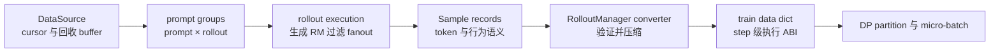
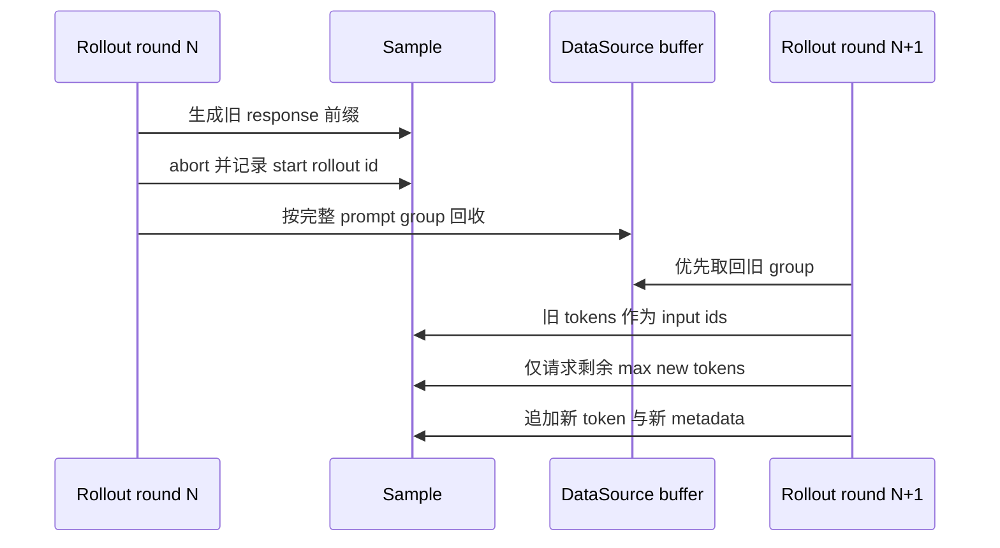

# slime Sample、DataSource 与训练数据契约分析

> **源码基线**：slime `main@681b3adca54105d5ecd3fb822fa0dc58a427e0f9`
> **文档基线**：同一提交下 `docs/en/get_started/{usage,quick_start,customization,agent}.md`
> **核验日期**：2026-08-18 · **系列**：[[02_engineering/04_posttrain_frameworks/slime/index|slime 源码分析]]
> **结论先行**：slime 的数据层不是一个“把 prompt 读出来再转成 tensor”的 loader，而是一道跨系统语义边界：rollout 一侧会产生多轮、工具调用、中断续生成、动态过滤和一对多 fanout，Megatron 一侧只接受可切分、可打包、统计口径稳定的训练 batch。slime 因而把数据拆成三层：`Sample` 保存一次生成的完整语义，`DataSource` 管理 prompt group 的取得、回收和恢复，RolloutManager 再把 Sample 压成训练 dict。这个分层牺牲了一部分静态类型和零拷贝能力，换来的是扩展 rollout 时不必改 trainer，同时仍能守住 token mask、behavior metadata、rollout identity 和恢复顺序。

本文把“源码明确行为”和“设计分析”分开：带 fixed-commit 定位符的是源码或项目文档事实；使用“由此可推断”“可以理解为”的段落是根据约束与失败路径作出的分析判断，不代表作者原话。

## 1. 为什么需要独立的数据契约

rollout 与训练看到的“一个样本”并不是同一种对象：

| 冲突 | rollout 侧需要保留什么 | trainer 侧需要什么 |
|---|---|---|
| 数据形态 | 文本、token、图像、工具观察、reward、状态、trace | token ids、response length、mask、reward 和可选 behavior tensors |
| 生命周期 | pending、abort、续生成、完成、过滤、回收 | 一个训练 step 内稳定且可重复切分的 batch |
| 一对多关系 | 一个 prompt 可采多条 response；一次 agent execution 又可拆成多个 fragments | global batch size 必须按逻辑 rollout 计数，不能按 fragment 数膨胀 |
| 策略来源 | partial 前后 token 可能由不同权重版本生成 | loss 必须知道哪些 token 可训练，校正/重放还要知道生成侧 metadata |
| 并行形态 | Python 对象和嵌套列表便于异步任务组合 | DP/CP/PP 需要确定的 partition、micro-batch schedule 和 dtype |

项目的 agent 文档也直接描述了这一边界：agent runtime 可以使用字符串、消息、工具调用或环境事件，但训练目标仍应保存模型实际采样的 token ids，并用 `loss_mask` 区分模型输出与模板/工具/环境文本。[`docs/en/get_started/agent.md:19-27`](https://github.com/THUDM/slime/blob/681b3adca54105d5ecd3fb822fa0dc58a427e0f9/docs/en/get_started/agent.md#L19-L27)

### 1.1 四个不能破坏的不变量

1. **token 对齐不变量**：response token、`loss_mask`、selected-token logprob，以及开启时的 top-p/routing metadata 必须描述相同位置。
2. **身份不变量**：prompt group、物理 Sample、逻辑 rollout execution 是三个不同身份；fanout 后仍要知道哪些 fragments 属于同一次 execution。
3. **生命周期不变量**：中断样本要携带已生成上下文和游标进入下一轮，而不能假装成全新 prompt。
4. **统计不变量**：DP/micro-batch 拆分不能让“一次 rollout 产生几个 fragments”改变 loss 分母或训练 step 数。

前三个不变量由 `Sample`/`DataSource` 保留，第四个在 Sample 转训练 dict 时显式固化。源码把同一 `rollout_id` 的 samples 放进同一个训练 step，并把 global batch size 定义为 rollout 数而不是 training-sample 数。[`dp_schedule.py:82-110`](https://github.com/THUDM/slime/blob/681b3adca54105d5ecd3fb822fa0dc58a427e0f9/slime/utils/dp_schedule.py#L82-L110) [`dp_schedule.py:127-154`](https://github.com/THUDM/slime/blob/681b3adca54105d5ecd3fb822fa0dc58a427e0f9/slime/utils/dp_schedule.py#L127-L154)

> **设计分析**：如果从一开始只传 trainer dict，工具状态、partial 状态和自定义字段就必须不断侵入训练 ABI；如果一直把任意 Python dict 传到底，trainer 又无法可靠地验证 shape、身份和统计口径。三层模型本质上是在“rollout 可扩展性”和“训练执行确定性”之间设置一次受控压缩点。

## 2. 三层模型：语义、生命周期、执行



三层各自只回答一类问题：

- `Sample`：**这条可训练轨迹是什么、从哪里来、哪些 token 有效**；
- `DataSource`：**下一批 prompt group 从哪里取，中断 group 放回哪里，恢复到哪个位置**；
- train dict：**这一训练 step 要给各 DP rank 发送哪些规则化字段**。

默认 rollout 返回 `prompt × rollout` 的 `list[list[Sample]]`；自定义 agent generation 还可以让一个 rollout execution 返回多个 training fragments。`RolloutFnTrainOutput` 把 samples 与额外 metrics 分开，同时兼容旧函数直接返回 samples。[`base_types.py:7-25`](https://github.com/THUDM/slime/blob/681b3adca54105d5ecd3fb822fa0dc58a427e0f9/slime/rollout/base_types.py#L7-L25)

## 3. Sample：为什么它是语义记录，而不是 dataloader row

### 3.1 三种 identity 不能混用

| 字段 | 表示什么 | 主要用途 |
|---|---|---|
| `group_index` | 原始 prompt group | group reward/GRPO 等按 prompt 的分组语义 |
| `index` | DataSource 分配的物理 Sample 序号 | 排序、审计、默认一执行一 Sample 时的唯一性 |
| `rollout_id` | 一次逻辑 rollout execution | fanout fragments 的 step grouping 与 rollout-level loss 归一化 |

`Sample` 注释明确：默认路径“一次 execution = 一个 training sample”，compact/subagent 路径若把一次 execution 拆成多个 samples，则所有 siblings 必须共享 `rollout_id`。[`types.py:93-106`](https://github.com/THUDM/slime/blob/681b3adca54105d5ecd3fb822fa0dc58a427e0f9/slime/utils/types.py#L93-L106)

一个容易误读的细节是：固定基线的默认 `RolloutDataSource` 实际只写 `group_index` 和 `index`，没有写 `rollout_id`；converter 会为所有 `rollout_id=None` 的 samples 分配不与显式 id 冲突的临时唯一 id。[`data_source.py:107-118`](https://github.com/THUDM/slime/blob/681b3adca54105d5ecd3fb822fa0dc58a427e0f9/slime/rollout/data_source.py#L107-L118) [`rollout.py:761-780`](https://github.com/THUDM/slime/blob/681b3adca54105d5ecd3fb822fa0dc58a427e0f9/slime/ray/rollout.py#L761-L780)

> [!note] 文档/注释与实现的细微差异
> `_validate_rollout_id_annotated` 上游调用处的注释说默认 rollout id “inherit from the data source”，但该基线的默认 DataSource 并未赋值；真正兜底发生在 converter。两者在默认一 Sample 路径上统计结果相同，但解释源码时应以实际赋值点为准。[`rollout.py:690-699`](https://github.com/THUDM/slime/blob/681b3adca54105d5ecd3fb822fa0dc58a427e0f9/slime/ray/rollout.py#L690-L699)

### 3.2 字段不是平铺配置，而是五类语义

| 语义 | 关键字段 | 没有它会丢失什么 |
|---|---|---|
| 内容 | `prompt`、`tokens`、`response`、`response_length` | rollout 上下文和 trainer token span |
| 目标 | `reward`、`loss_mask`、`remove_sample`、`train_metadata` | 哪些 token/哪种 loss 参与优化 |
| 行为策略 | `rollout_log_probs`、top-p ids/offsets、routed experts、`weight_versions` | off-policy 校正、采样/routing 重放和版本审计 |
| 生命周期 | `status`、`metadata`、`session_id` | partial 回收、终止原因、路由亲和与外部环境状态 |
| 模态/扩展 | multimodal inputs、custom generate/RM path、动态未知字段 | 数据集特有输入和插件兼容性 |

字段定义与状态枚举见 [`types.py:107-149`](https://github.com/THUDM/slime/blob/681b3adca54105d5ecd3fb822fa0dc58a427e0f9/slime/utils/types.py#L107-L149)。`to_dict/from_dict` 不只做序列化：它把 enum 和嵌套统计对象展平，又把未知键恢复为动态属性，因此 Sample 能跨 Ray/落盘边界并为新字段保留向后兼容空间。[`types.py:222-244`](https://github.com/THUDM/slime/blob/681b3adca54105d5ecd3fb822fa0dc58a427e0f9/slime/utils/types.py#L222-L244) 对应单测把“字段静默丢失会让状态和生成统计在到达 trainer 前消失”作为显式风险。[`tests/test_sample.py:1-15`](https://github.com/THUDM/slime/blob/681b3adca54105d5ecd3fb822fa0dc58a427e0f9/tests/test_sample.py#L1-L15)

### 3.3 `append_response_tokens` 是 token 对齐的单一写入口

模型生成、工具观察和 partial continuation 都会追加 response，但三者不能用同样的训练语义：

| 追加内容 | `trainable` | logprob | `loss_mask` | 原因 |
|---|---:|---|---|---|
| 模型新生成 token | `True` | 必须与 token 等长 | 1 | 它来自 behavior policy，既可训练也能计算 policy ratio |
| 工具/环境 token | `False` | 调用方不得传；内部填 0 | 0 | 它是外部观察，不是 policy 采样动作 |
| partial 后新生成 token | `True` | 只传新 token 的 logprob | 1 | 旧前缀已在 Sample 中，新 metadata 追加到原记录 |

实现会同步追加 `tokens`、`response_length`、`loss_mask` 和 logprob；trainable token 缺 logprob、non-trainable token 携带 logprob都会立即报错。[`types.py:253-302`](https://github.com/THUDM/slime/blob/681b3adca54105d5ecd3fb822fa0dc58a427e0f9/slime/utils/types.py#L253-L302) top-p ragged offsets按新增 span 合并，工具 token 在已有 top-p replay 时得到空 span；routed-expert metadata 则用 `routed_experts_start_len` 对齐旧前缀后拼接。[`types.py:304-395`](https://github.com/THUDM/slime/blob/681b3adca54105d5ecd3fb822fa0dc58a427e0f9/slime/utils/types.py#L304-L395)

每次 append 最后重新验证 mask/logprob 等于 `response_length`，top-p offsets 数为 `response_length+1` 且末 offset 等于 ids 数。[`types.py:418-443`](https://github.com/THUDM/slime/blob/681b3adca54105d5ecd3fb822fa0dc58a427e0f9/slime/utils/types.py#L418-L443)

> **设计分析**：工具 token 填零 logprob 的目的不是伪造“概率为 1”，而是让 token-aligned 数组保持等长；真正阻止它进入目标函数的是 `loss_mask=0`。如果直接删掉工具 token，后续模型 token 的上下文就与生成时不同；如果把它设为可训练，模型会被要求模仿环境返回，策略动作与观察的边界会被破坏。

## 4. DataSource：为什么接口同时有 get、add、save、load

抽象接口只有 `get_samples`、`add_samples`、`save`、`load` 和 `__len__`。[`data_source.py:17-46`](https://github.com/THUDM/slime/blob/681b3adca54105d5ecd3fb822fa0dc58a427e0f9/slime/rollout/data_source.py#L17-L46) 这不是普通 map-style dataset 接口，因为它既要生产新 group，也要接收未完成 group，并在 checkpoint 后恢复生产顺序。

### 4.1 默认 DataSource 管“顺序”，不保存整个 dataset

`RolloutDataSource` 维护 `epoch_id`、prompt offset、group/sample counter；每个 prompt 深拷贝出 `n_samples_per_prompt` 条 Sample，并在跨 epoch 时按 epoch seed 重新 shuffle。[`data_source.py:50-118`](https://github.com/THUDM/slime/blob/681b3adca54105d5ecd3fb822fa0dc58a427e0f9/slime/rollout/data_source.py#L50-L118)

save/load 只保存 cursor、epoch、两个计数器与 metadata，恢复时按 epoch 重新执行相同 shuffle，而不是把整个 dataset 写进 checkpoint。[`data_source.py:123-160`](https://github.com/THUDM/slime/blob/681b3adca54105d5ecd3fb822fa0dc58a427e0f9/slime/rollout/data_source.py#L123-L160)

> **设计分析**：checkpoint 的真正目标是恢复“下一条是谁”和身份计数，不是复制静态输入数据。这样 checkpoint 小，但正确性依赖原 dataset 与 shuffle 算法仍可重建；若外部在线数据源不可重放，自定义 DataSource 就必须在 `save/load` 中保存更强的游标或队列状态。

### 4.2 Buffer 是回收队列，不是通用 replay buffer

`RolloutDataSourceWithBuffer` 先从 buffer 取 group，不足时才从 dataset 补；默认 `pop_first` 是 FIFO。写回时要求 group 仍为 `n_samples_per_prompt` 大小，说明回收单位是 prompt group，不是任意单条 token span。[`data_source.py:168-211`](https://github.com/THUDM/slime/blob/681b3adca54105d5ecd3fb822fa0dc58a427e0f9/slime/rollout/data_source.py#L168-L211) [`data_source.py:225-229`](https://github.com/THUDM/slime/blob/681b3adca54105d5ecd3fb822fa0dc58a427e0f9/slime/rollout/data_source.py#L225-L229)

项目 quick start 同样把 partial 的目的描述为回收动态采样中被提前 abort 的半生成样本，并说明可用 `buffer_filter_path` 替换 FIFO 策略。[`docs/en/get_started/quick_start.md:372-390`](https://github.com/THUDM/slime/blob/681b3adca54105d5ecd3fb822fa0dc58a427e0f9/docs/en/get_started/quick_start.md#L372-L390)

固定实现没有 capacity、priority、freshness admission、behavior-version sampling policy 或自动淘汰，因此不能把它等同于经验回放池。需要这些语义时，应由 custom DataSource/filter 显式实现；官方 customization 文档也把 `get/add/save/load` 暴露为完整替换点。[`docs/en/get_started/customization.md:382-400`](https://github.com/THUDM/slime/blob/681b3adca54105d5ecd3fb822fa0dc58a427e0f9/docs/en/get_started/customization.md#L382-L400)

## 5. Partial rollout：旧 token、新 token 和 metadata 到底如何处理

partial 的问题背景是动态采样已凑够目标 batch 后，仍有长尾请求在运行。直接丢弃会浪费已经生成的 token；等待全部完成又把 step latency 绑定到最慢请求。slime 选择 abort 剩余请求、保存完整 Sample group，下轮优先续生成。[`sglang_rollout.py:400-451`](https://github.com/THUDM/slime/blob/681b3adca54105d5ecd3fb822fa0dc58a427e0f9/slime/rollout/sglang_rollout.py#L400-L451)



abort 会等待 pending tasks 返回，把含 response 的 Sample 写入首次 `start_rollout_id`，再把 group 交回 DataSource；同步 wrapper 在下一轮从 `get_samples` 取回并调用同一生成路径。[`sglang_rollout.py:339-371`](https://github.com/THUDM/slime/blob/681b3adca54105d5ecd3fb822fa0dc58a427e0f9/slime/rollout/sglang_rollout.py#L339-L371) [`sglang_rollout.py:627-649`](https://github.com/THUDM/slime/blob/681b3adca54105d5ecd3fb822fa0dc58a427e0f9/slime/rollout/sglang_rollout.py#L627-L649)

恢复时 `_prepare_prompt_ids` 优先复用已有 `sample.tokens`，并把 `max_new_tokens` 减去旧 `response_length`；SGLang 只返回新生成 token 及其 logprob，`append_response_tokens` 再把它们追加到旧 Sample。[`sglang_rollout.py:42-61`](https://github.com/THUDM/slime/blob/681b3adca54105d5ecd3fb822fa0dc58a427e0f9/slime/rollout/sglang_rollout.py#L42-L61) [`sglang_rollout.py:152-219`](https://github.com/THUDM/slime/blob/681b3adca54105d5ecd3fb822fa0dc58a427e0f9/slime/rollout/sglang_rollout.py#L152-L219)

### 5.1 旧 token 是否参与训练：由一个开关决定

- **默认** `mask_offpolicy_in_partial_rollout=False`：旧 `loss_mask` 保持原值，新模型 token 追加 1；因此旧、新模型 token 都是训练 token。旧 token 的 logprob/top-p/routing metadata 保留，新 token metadata 追加，最终 Sample 看起来像一条连续 response，但 `weight_versions` 等字段仍可暴露它跨过了更新边界。
- **开启** `--mask-offpolicy-in-partial-rollout`：恢复生成前把已有 response 的 mask 全设为 0，只训练本轮新生成 token；旧 token 仍保留在 `tokens` 中作为上下文，不能删除。该参数的 help 也明确说明“only on-policy generated tokens will be used in training”。[`arguments.py:456-474`](https://github.com/THUDM/slime/blob/681b3adca54105d5ecd3fb822fa0dc58a427e0f9/slime/utils/arguments.py#L456-L474) [`sglang_rollout.py:224-240`](https://github.com/THUDM/slime/blob/681b3adca54105d5ecd3fb822fa0dc58a427e0f9/slime/rollout/sglang_rollout.py#L224-L240)

所以“恢复后只按新数据训练”和“新旧 token 都训练”都可能成立，区别就在该开关。无论哪种模式，content 与 metadata 都不是用新 response 覆盖旧 response，而是按 token span 合并；变化的是旧 span 的 loss 权重。

### 5.2 为什么不能让它真的“像从未中断”

在 token 序列层面，旧前缀 + 新后缀确实组成一条连续轨迹；但若两轮之间发布了新权重，它就不是单一 behavior policy 采出的同质 trajectory。源码把每次响应中的 `weight_version` 追加到列表，而不是只保留最后版本。[`types.py:397-416`](https://github.com/THUDM/slime/blob/681b3adca54105d5ecd3fb822fa0dc58a427e0f9/slime/utils/types.py#L397-L416)

> **设计分析**：默认保留旧 mask 优先回收算力，mask-offpolicy 模式优先严格 on-policy。两者都不是免费午餐：前者可能增加策略陈旧度，后者让旧 token 只消耗上下文长度、不贡献梯度。正确选择取决于更新频率、off-policy 校正能力和长尾浪费占比。

## 6. Nested output 与 compact fanout：格式是什么、解决什么问题

默认输出与 fanout 输出可以写成：

```text
默认：
prompt group
└── rollout execution
    └── Sample

compact / agent fanout：
prompt group
└── rollout execution
    ├── Sample fragment A
    ├── Sample fragment B
    └── Sample fragment C
```

对应 Python shape 是：

- 默认：`list[list[Sample]]`，即 `prompt × rollout`；
- fanout：`list[list[list[Sample]]]`，即 `prompt × rollout × train-fragments`。

这种格式服务于“一次逻辑 execution 产生多个可训练片段”的场景，例如 subagent 分支、multi-agent 轨迹、context compaction 前后的片段。官方 customization 文档允许 custom generate 返回 `list[Sample]`，要求 siblings 共享 `rollout_id`，并建议一条总 reward 拆成 $K$ 段时按 `reward / K` 分配，避免奖励被放大。[`docs/en/get_started/customization.md:87-117`](https://github.com/THUDM/slime/blob/681b3adca54105d5ecd3fb822fa0dc58a427e0f9/docs/en/get_started/customization.md#L87-L117)

RolloutManager 在 flatten 前递归验证：只有深度至少为 2、且 leaf 含多个 Sample 的 compact 路径，才要求每个 sibling 的 `rollout_id` 非空且相同；默认旧 shape 保持兼容。[`rollout.py:941-970`](https://github.com/THUDM/slime/blob/681b3adca54105d5ecd3fb822fa0dc58a427e0f9/slime/ray/rollout.py#L941-L970)

嵌套结构只是进入 converter 前的临时“关系编码”。flatten 后层级消失，后续只能靠 `rollout_id` 把 siblings 放进同一个 step并按一次 rollout 计数。这就是它的使用场景：**把树状/分支 execution 投影成线性训练 fragments，同时不改变训练统计单位**。对应 E2E 测试明确覆盖 custom generate fanout → id 验证 → rollout-aware step split → rollout denominator 的完整链。[`tests/test_qwen2.5_0.5B_fanout_short.py:1-21`](https://github.com/THUDM/slime/blob/681b3adca54105d5ecd3fb822fa0dc58a427e0f9/tests/test_qwen2.5_0.5B_fanout_short.py#L1-L21)

> [!warning] fanout 不是“同一 token 训练多次”的许可证
> 每个 fragment 自己携带 token span、mask 和 reward；共享 `rollout_id` 只定义 step grouping 与归一化单位。若 fragments 的 token span 重叠，是否重复贡献梯度由生成函数的 mask 决定，框架不会自动去重。

## 7. Sample → train dict：为何必须在 flatten 后做一次受控压缩

默认 converter 先处理 reward，再生成 step-global dict，核心字段包括：

```text
tokens / response_lengths / rewards / raw_reward / truncated
sample_indices / rollout_ids / rollout_mask_sums / loss_masks
rollout_log_probs / top-p ids+offsets / routed_experts
teacher_log_probs / multimodal_train_inputs / source_names
```

字段构造和条件分支见 [`rollout.py:749-866`](https://github.com/THUDM/slime/blob/681b3adca54105d5ecd3fb822fa0dc58a427e0f9/slime/ray/rollout.py#L749-L866)。这里有三个重要设计选择：

1. 未提供 mask 时默认 response 全可训练；`remove_sample` 把整条 response mask 清零，但不删除 Sample，从而保持 schedule shape。[`rollout.py:783-797`](https://github.com/THUDM/slime/blob/681b3adca54105d5ecd3fb822fa0dc58a427e0f9/slime/ray/rollout.py#L783-L797)
2. behavior 字段是条件 ABI：selected-token logprob、ragged top-p、routed experts、teacher logprob 只在相应功能启用且 Sample 提供时进入训练侧，不传整个词表分布。
3. 在还能看到完整 step 时预计算 rollout denominator；否则 siblings 被分到不同 micro-batch 后，局部 batch 无法知道完整分母。

### 7.1 `rollout_mask_sums` 如何守住 fanout 的统计口径

对逻辑 rollout $g$，设其第 $i$ 个 fragment 的第 $t$ 个 response mask 为 $m_{it}$，完整可训练 token 分母是：

$$
d_g=\sum_{i\in g}\sum_t m_{it}.
$$

converter 给每个 sibling 都附上相同的 $d_g$。即使 packing 将 fragments 分到不同 DP rank 或 micro-batch，各处 numerator 最终仍以同一完整 denominator 归一化，而不是把一次 execution 当成多个独立 samples。[`rollout.py:799-814`](https://github.com/THUDM/slime/blob/681b3adca54105d5ecd3fb822fa0dc58a427e0f9/slime/ray/rollout.py#L799-L814) DP scheduler 也按 `rollout_id` 先组成 step，再 pack 和分配 micro-batches。[`dp_schedule.py:127-165`](https://github.com/THUDM/slime/blob/681b3adca54105d5ecd3fb822fa0dc58a427e0f9/slime/utils/dp_schedule.py#L127-L165)

### 7.2 train dict 是 execution ABI，不是持久语义对象

DP split 根据 total lengths 与 rollout ids 建 schedule，再只把 partition 中的逐 Sample 字段放进各 rank 的 `rollout_data`；`raw_reward` 和 `total_lengths` 为日志与 train-side split 保留完整 step view。[`rollout.py:871-930`](https://github.com/THUDM/slime/blob/681b3adca54105d5ecd3fb822fa0dc58a427e0f9/slime/ray/rollout.py#L871-L930)

这一步之后，未进入 dict 的自由 metadata 不再自动可见。因此自定义 converter 不是“换一种序列化格式”那么简单，它接管了 loss、schedule、日志和扩展字段所依赖的执行契约。项目文档列出的默认 converter 输出也把 token、mask、behavior 和训练 metadata 明确分开。[`docs/en/get_started/customization.md:323-350`](https://github.com/THUDM/slime/blob/681b3adca54105d5ecd3fb822fa0dc58a427e0f9/docs/en/get_started/customization.md#L323-L350)

## 8. 数据如何进入 trainer：为何默认先走 CPU/Ray

固定基线的数据路径是：

```text
SGLang HTTP response
  → RolloutManager 中的 Python Sample
  → train dict 与 DP partition
  → CPU contiguous tensors
  → Ray object store 或可选 NIXL transport
  → Megatron actor 在 CPU 取回
  → actor 显式搬到 CUDA 并按 CP 切分
```

converter 为 tokens、mask、logprob、top-p、routing 等字段固定 CPU dtype/contiguous 形态。[`rollout.py:41-104`](https://github.com/THUDM/slime/blob/681b3adca54105d5ecd3fb822fa0dc58a427e0f9/slime/ray/rollout.py#L41-L104) 默认 transport 是 Ray object store，NIXL 是可选 Ray tensor transport；actor 端注释也明确先通过 Ray 在 CPU fetch，再搬到当前 CUDA device。[`arguments.py:558-566`](https://github.com/THUDM/slime/blob/681b3adca54105d5ecd3fb822fa0dc58a427e0f9/slime/utils/arguments.py#L558-L566) [`actor.py:245-299`](https://github.com/THUDM/slime/blob/681b3adca54105d5ecd3fb822fa0dc58a427e0f9/slime/backends/megatron_utils/actor.py#L245-L299)

> **设计分析**：这不是最低拷贝路径，但它把 rollout service 的 Python/HTTP 世界与 Megatron 的 GPU/并行世界隔开，并让 DP 分区在跨 actor 传输前完成。权重同步的 NCCL/CUDA IPC 数据面不能类推到 rollout data；两者的对象大小、生命周期和目标拓扑不同。

## 9. 三个完整例子

### 9.1 普通单轮 rollout

1. DataSource 为同一 prompt 深拷贝 $n$ 条 Samples，分配同一 `group_index` 和不同 `index`。
2. SGLang 为每条 Sample 生成 response；append 同步写 token、mask、selected-token logprob 和终止状态。
3. RolloutManager flatten 后为缺失的 `rollout_id` 分配互不冲突的临时 id。
4. converter 生成 train dict，scheduler 按逻辑 rollout 数组成训练 step。

这里 prompt group 是 reward 分组单位，但默认每次生成 execution 各算一个 rollout；不能用 `group_index` 代替 `rollout_id`。

### 9.2 中断后继续

假设 round 7 生成旧 token `A B` 后 abort，round 8 续生成 `C D`：

| 模式 | 最终 tokens | 最终 loss mask | 训练哪些 token |
|---|---|---|---|
| 默认 | prompt + `A B C D` | `1 1 1 1` | 旧、新模型 token均训练 |
| mask old policy | prompt + `A B C D` | `0 0 1 1` | 旧 token 只作上下文，只训练新 token |

两种模式都保留旧 response 和旧 metadata，并把新 metadata 按 span 合入；不是只保存新 response，也不是用新 metadata 覆盖整条旧记录。

### 9.3 Agent compact fanout

一次 execution 产生 `subagent`、`pre-compaction`、`final` 三个 fragments：custom generate 返回三条 Sample，三者各有自己的 tokens/mask/reward，但共享一个 `rollout_id`。嵌套结构在 flatten 前证明它们是 siblings；flatten 后 scheduler 与 reducer靠 id 保持“一次 execution”的 step 数和 denominator。官方 coding-agent 文档也用 subagent、wipe、final 三类 segment 说明这一模式。[`docs/en/get_started/agent.md:67-73`](https://github.com/THUDM/slime/blob/681b3adca54105d5ecd3fb822fa0dc58a427e0f9/docs/en/get_started/agent.md#L67-L73)

## 10. 设计取舍、边界与扩展检查

### 10.1 当前设计选择了什么

- 用可扩展 `Sample` 保留语义，代价是部分字段只能运行时验证；
- 用小型 `DataSource` 接口隔离来源与回收，代价是高级队列策略要由插件实现；
- 在 rollout/train 边界一次性压缩，代价是条件字段持续增多时 converter 会变宽；
- 用嵌套 shape + `rollout_id` 表达 fanout，代价是 custom generate 必须主动维护身份与重叠 token mask；
- 用 partial 回收已生成前缀，代价是在算力利用率与严格 on-policy 之间增加配置选择。

### 10.2 常见误读

| 误读 | 实际情况 |
|---|---|
| DataSource 就是 PyTorch Dataset | 它还负责 group 回收和 checkpoint 状态，默认 dataset 只是其中一个输入实现 |
| partial 恢复后只训练新 token | 只有开启 `mask_offpolicy_in_partial_rollout` 才是；默认新旧可训练 token 都保留 |
| partial metadata 用新值整体覆盖 | top-p/routing/logprob 按 token span 合并，版本与统计信息有各自累积规则 |
| fanout 的第三层只是返回格式 | 它在 flatten 前表达 execution 关系，之后由共享 `rollout_id` 接管统计语义 |
| `rollout_id` 等于 prompt group | prompt group 用 `group_index`；一次 prompt 的多次采样是不同 executions |
| tool token 的 0 logprob 会进入 policy loss | 等长 0 是占位，`loss_mask=0` 才是排除机制 |
| buffer 是现成的 replay buffer | 默认只有 group FIFO/filter，没有 replay freshness、priority 或 eviction 语义 |

### 10.3 自定义 DataSource/rollout/converter 的检查清单

1. prompt group size 是否仍满足 reward postprocess 的分组假设？
2. fanout siblings 是否都有同一非空 `rollout_id`？
3. fragment 的 token span 若重叠，mask 是否避免无意重复训练？
4. 每次 append 是否保持 token/mask/logprob/top-p/routing 对齐？
5. 工具、模板和环境 token 是否为 `loss_mask=0`？
6. partial 恢复时，是接受旧 policy token 训练，还是显式 mask；是否记录了版本边界？
7. `save/load` 是否足以重建外部数据源的顺序与回收队列？
8. custom converter 是否仍提供 schedule、loss、日志和所启用校正机制需要的字段？

## Related Pages

- [[13_slime_sglang_rollout_engine_analysis]] — Sample 的生成、abort、续生成和动态采样在 rollout engine 侧如何执行。
- [[14_slime_megatron_training_analysis]] — train dict 如何进入 Megatron actor、DataIterator 和 forward/backward。
- [[15_slime_loss_parallelism_analysis]] — `rollout_id` 与 `rollout_mask_sums` 如何定义 rollout-level loss 统计。
- [[17_slime_train_inference_consistency_analysis]] — logprob、top-p、routing 与 weight version 为什么是条件 behavior metadata。
- [[18_slime_fault_tolerance_observability_analysis]] — DataSource cursor、debug dump 和 replay 分别覆盖哪些恢复边界。
- [[24_slime_agent_workflow_examples_analysis]] — agent 树状执行如何产生 compact fanout fragments。
- [[31_slime_posttraining_stability_analysis]] — 数据身份、mask 或版本边界破坏为何会表现成静默训练漂移。
