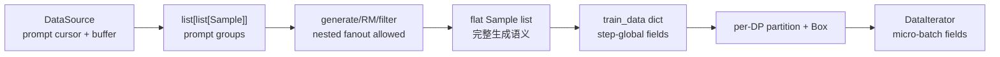

# slime Sample、DataSource 与训练数据契约分析

> **源码基线**：slime `main@681b3adca54105d5ecd3fb822fa0dc58a427e0f9`
> **核验日期**：2026-08-14 · **系列**：[[slime/index]]
> **结论先行**：`Sample` 是 slime 的语义主键，`DataSource` 是生产/回收接口，RolloutManager 的 train dict 是执行 ABI。三者不是同一个抽象：Sample 保留多轮、tool、sampling、version 等生成语义；DataSource 决定 prompt/group 生命周期；train dict 则把完整 step 压成 Megatron 可调度字段。稳定性依赖这次压缩没有丢失 rollout identity、mask 和 behavior metadata。

## 1. 三层数据模型



默认 rollout function 返回 prompt×sample 的 `list[list[Sample]]`；custom agent rollout 可再加一层，让一次生成 fanout 多个 prefix-chained training samples。`RolloutFnTrainOutput` 把 samples 和额外 metrics 显式分开，同时兼容旧函数直接返回 samples 的行为。[`base_types.py:7-25`](https://github.com/THUDM/slime/blob/681b3adca54105d5ecd3fb822fa0dc58a427e0f9/slime/rollout/base_types.py#L7-L25)

## 2. Sample：生成与训练之间的语义 ABI

### 2.1 字段分组

| 语义 | 关键字段 | 消费者 |
|---|---|---|
| identity | `group_index`、`index`、`rollout_id`、`session_id` | group reward、reducer、router affinity |
| prompt/response | prompt、tokens、response、response_length、status | SGLang、trainer packing |
| objective | reward、loss_mask、remove_sample、train_metadata | reward postprocess、loss |
| behavior policy | rollout_log_probs、top-p ids/offsets、routed_experts、weight_versions | mismatch/TIS/top-p/routing replay |
| multimodal | raw inputs、processed train inputs | SGLang processor、Megatron model |
| agent/runtime | custom generate/RM path、metadata、trace carrier | hooks、tool/env、observability |

字段定义见 [`types.py:94-149`](https://github.com/THUDM/slime/blob/681b3adca54105d5ecd3fb822fa0dc58a427e0f9/slime/utils/types.py#L94-L149)。`rollout_id` 和 `index` 不能混为一谈：默认一执行一 sample 时可回退到 index；compact fanout 必须让 siblings 共享 rollout id，才能按逻辑轨迹平均。[`types.py:99-106`](https://github.com/THUDM/slime/blob/681b3adca54105d5ecd3fb822fa0dc58a427e0f9/slime/utils/types.py#L99-L106)

### 2.2 `append_response_tokens` 是一致性关口

生成函数不应手工同时修改 tokens、length、mask、logprob。统一 append 方法保证：

- trainable token 必须有同长 rollout logprob；
- tool/environment token 不允许传 logprob，自动填 0 且 loss mask 为 0；
- partial append 保留旧 response，再合并 top-p/routing metadata；
- 每次 append 后检查 response length、mask、logprob、ragged top-p offsets 同长。

对应实现见 [`types.py:253-314`](https://github.com/THUDM/slime/blob/681b3adca54105d5ecd3fb822fa0dc58a427e0f9/slime/utils/types.py#L253-L314) 和 [`types.py:418-443`](https://github.com/THUDM/slime/blob/681b3adca54105d5ecd3fb822fa0dc58a427e0f9/slime/utils/types.py#L418-L443)。

SGLang meta 中的 routed experts 按 token×layer×top-k reshape，partial append 必须声明 start length 并与已有 rows 对齐；finish reason 更新 status，weight version 追加到审计列表。[`types.py:352-416`](https://github.com/THUDM/slime/blob/681b3adca54105d5ecd3fb822fa0dc58a427e0f9/slime/utils/types.py#L352-L416)

## 3. DataSource：prompt cursor、group expansion 与回收

抽象接口只有五项：`get_samples`、`add_samples`、`save`、`load`、`__len__`。[`data_source.py:17-46`](https://github.com/THUDM/slime/blob/681b3adca54105d5ecd3fb822fa0dc58a427e0f9/slime/rollout/data_source.py#L17-L46) 这使 rollout function 不关心数据来自 JSONL、在线环境还是外部 buffer。

### 3.1 默认全局 dataset

`RolloutDataSource` 加载 tokenizer/processor 和 prompt dataset，保存 epoch、sample/group index 与 offset；取数越过尾部时增加 epoch、可按 epoch seed reshuffle，再为每个 prompt deepcopy `n_samples_per_prompt` 份。[`data_source.py:50-118`](https://github.com/THUDM/slime/blob/681b3adca54105d5ecd3fb822fa0dc58a427e0f9/slime/rollout/data_source.py#L50-L118)

save/load 只保存 cursor/indices/metadata，不保存整个 dataset；恢复后按 epoch 重新 shuffle，从而延续同一 prompt 顺序。[`data_source.py:123-160`](https://github.com/THUDM/slime/blob/681b3adca54105d5ecd3fb822fa0dc58a427e0f9/slime/rollout/data_source.py#L123-L160)

### 3.2 Buffer 版本

`RolloutDataSourceWithBuffer` 先从 buffer 选 groups，不足再从 dataset 补；写回时要求每个 group 长度仍等于 `n_samples_per_prompt`，默认 FIFO `pop_first`，也可替换 filter。[`data_source.py:168-229`](https://github.com/THUDM/slime/blob/681b3adca54105d5ecd3fb822fa0dc58a427e0f9/slime/rollout/data_source.py#L168-L229)

它主要承接 partial/aborted group 和 fully-async worker 的回收，不等价于通用 replay buffer：默认没有 freshness admission、priority、capacity/eviction 或 behavior version sampling policy。这些语义若需要，应由 custom DataSource/filter 明确实现。

## 4. Nested output 与 compact fanout

默认 shape 是 `prompt × rollout`；fanout shape 是 `prompt × rollout × train-fragments`。RolloutManager 在 flatten 前递归验证：只有深度≥2 的 compact leaf 且含多个 Sample 时，才要求每个 sibling 有非空、相同 rollout id；默认旧路径保持兼容。[`rollout.py:941-970`](https://github.com/THUDM/slime/blob/681b3adca54105d5ecd3fb822fa0dc58a427e0f9/slime/ray/rollout.py#L941-L970)

这是一个“结构→统计”的桥：嵌套层级告诉框架哪些训练 fragments 来自同一次逻辑 execution；flatten 后只能依赖 rollout id 保留关系。

## 5. Sample → train_data：哪些字段被压缩

RolloutManager 先做 reward postprocess，再构造 step-global dict：

```text
tokens / response_lengths / rewards / raw_reward / truncated
sample_indices / rollout_ids / rollout_mask_sums / loss_masks
rollout_log_probs / top_p ids+offsets / routed_experts
teacher_log_probs / multimodal_train_inputs / source_names
```

实现和条件字段见 [`rollout.py:749-866`](https://github.com/THUDM/slime/blob/681b3adca54105d5ecd3fb822fa0dc58a427e0f9/slime/ray/rollout.py#L749-L866)。未提供 loss mask 时默认为所有 response token 可训练；`remove_sample` 会把整条 response mask 清零，但样本仍保留在 batch 中，以维持 schedule 形状。[`rollout.py:783-797`](https://github.com/THUDM/slime/blob/681b3adca54105d5ecd3fb822fa0dc58a427e0f9/slime/ray/rollout.py#L783-L797)

### 5.1 为什么要在这里算 `rollout_mask_sums`

对逻辑 rollout \(g\)，训练目标使用完整 denominator：

\[
d_g=\sum_{i\in g}\sum_t m_{it}.
\]

每个 sibling 都携带相同 \(d_g\)，即使 later packing 把它们拆到不同 DP rank/mbs，各处 numerator 累加后仍只得到一次 rollout mean。预计算见 [`rollout.py:799-814`](https://github.com/THUDM/slime/blob/681b3adca54105d5ecd3fb822fa0dc58a427e0f9/slime/ray/rollout.py#L799-L814)。

### 5.2 behavior metadata 是条件 ABI

- `rollout_top_p != 1` 时每条 sample 必须携带 offsets 长度=response+1、末 offset=ids 数；否则立即 assert。[`rollout.py:832-846`](https://github.com/THUDM/slime/blob/681b3adca54105d5ecd3fb822fa0dc58a427e0f9/slime/ray/rollout.py#L832-L846)
- 开启 rollout routing replay 时 routed expert shape 在 conversion 前验证。[`rollout.py:848-852`](https://github.com/THUDM/slime/blob/681b3adca54105d5ecd3fb822fa0dc58a427e0f9/slime/ray/rollout.py#L848-L852)
- TIS/OPD/teacher 等只有 source sample 提供相应字段才进入训练侧；自定义 rollout 不能假设默认 converter 会凭空重建它们。

## 6. train_data → per-DP Box → micro-batch

DP split 先用 total sequence lengths 和 rollout ids 建 schedule，再为每 rank 拷贝 partition 内的 per-sample fields；step-global fields（如 full raw reward/total lengths）只存一份。最终 `torch.Tensor` 字段用 Ray object store 或 NIXL transport 包成 `Box`。[`rollout.py:871-938`](https://github.com/THUDM/slime/blob/681b3adca54105d5ecd3fb822fa0dc58a427e0f9/slime/ray/rollout.py#L871-L938)

训练 actor 解包自己 DP rank 的 partition，并按 CP 切 response-side logprobs；随后 `DataIterator` 只按 schedule index 取当前 micro-batch 需要的 fields。[`actor.py:245-299`](https://github.com/THUDM/slime/blob/681b3adca54105d5ecd3fb822fa0dc58a427e0f9/slime/backends/megatron_utils/actor.py#L245-L299) [`data.py:201-245`](https://github.com/THUDM/slime/blob/681b3adca54105d5ecd3fb822fa0dc58a427e0f9/slime/backends/megatron_utils/data.py#L201-L245)

## 7. 扩展 DataSource/rollout 的检查清单

1. group size 是否仍符合 reward normalization 假设？
2. fanout siblings 是否共享 rollout id？
3. 每次 append 是否同步维护 token/mask/logprob/top-p/routing length？
4. tool/env token 是否 mask=0？
5. partial continuation 是否保留或显式屏蔽旧 policy token？
6. save/load 是否同时恢复 cursor、shuffle epoch 和自定义 buffer metadata？
7. custom converter 是否仍提供 schedule/loss 所需字段和完整 rollout denominator？

## Related Pages

- [[13_slime_sglang_rollout_engine_analysis]] — Sample 如何被生成和回收
- [[15_slime_loss_parallelism_analysis]] — rollout id/denominator 如何进入 loss
- [[17_slime_train_inference_consistency_analysis]] — behavior metadata 的一致性用途
- [[31_slime_posttraining_stability_analysis]] — 数据契约破坏为何表现为静默漂移
