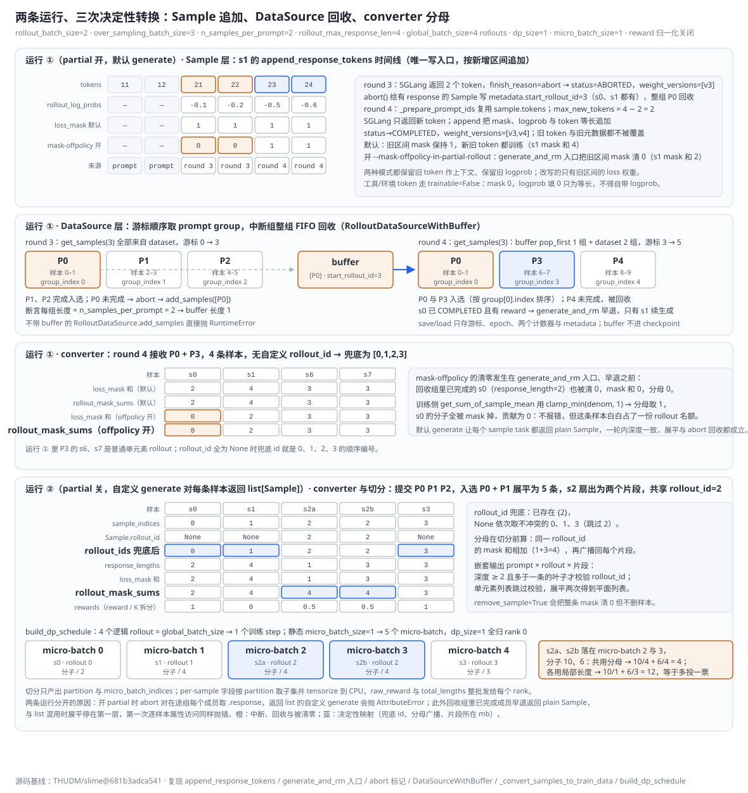
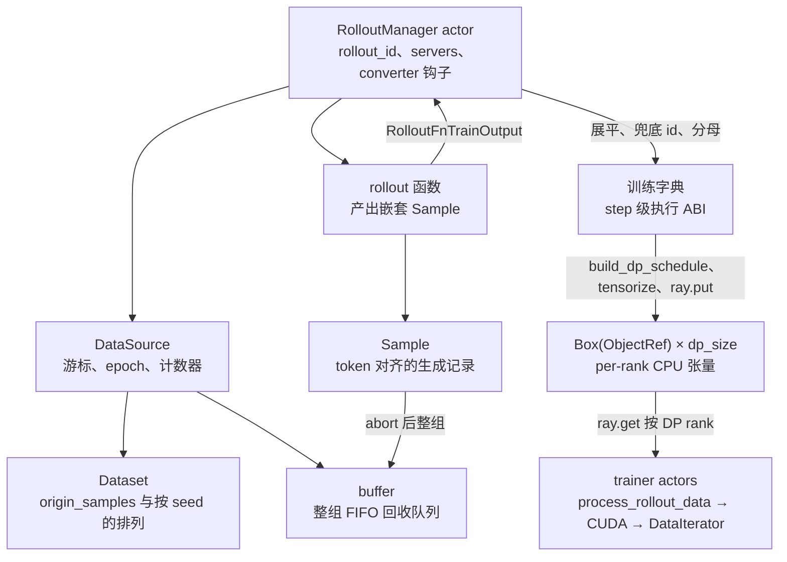

# slime Sample、DataSource 与训练数据契约分析

> **源码基线**：`THUDM/slime@681b3adca54105d5ecd3fb822fa0dc58a427e0f9`（`main`，2026-08-12）
> **主题**：rollout 侧的生成记录怎样变成 Megatron 能切分的训练批次：`Sample` 用一个写入口保持 token、mask、logprob 与版本对齐；`DataSource` 按游标取 prompt group、整组回收中断样本并只保存游标；`RolloutManager` 在展平后一次性压缩成训练字典，预先算出每个逻辑 rollout 的完整 mask 分母，再按 rollout 分步、切 micro-batch、tensorize 后经 Ray 交给 trainer。核心代码在 `slime/utils/types.py`、`slime/rollout/data_source.py`、`slime/ray/rollout.py`。
> **适用范围**：数据语义与数据侧接口；请求并发与 abort 归 13，micro-batch 对齐与 DP 分发归 14，loss 归约归 15，多模态、评估与 SFT 各有专页。
> **最近更新**：2026-09-10。按特性分析画像重写，补最小实例、三层原理图、调用树与成本账本。

---

## 1. 特性概览

### 1.1 问题背景

rollout 与训练看到的"一个样本"不是同一种对象。rollout 侧会产生多轮交互、工具观察、被中断后续生成的前缀、动态过滤淘汰的整组、以及一次 agent 执行拆成多个训练片段的一对多扇出；它需要 Python 对象与嵌套列表来组合异步任务，还要记住 pending、abort、续生成等生命周期。Megatron 侧只接受在一个训练 step 内稳定、可重复切分、统计口径固定的批次：token ids、response 长度、mask、reward 和按需附带的行为策略张量，并且 DP、CP、PP 需要确定的 partition、micro-batch 顺序与 dtype。如果让两侧共用一个对象，rollout 每加一种状态就要改一次训练 ABI；如果让任意字典一路传到底，token、mask、logprob 与 top-p、路由元数据的等长关系就失去单一写入口，错位只能推迟到 Megatron 内部才暴露。四条不变量必须有人负责：token 对齐（response token、`loss_mask`、logprob 及启用时的 top-p、路由元数据描述相同位置）、标识（prompt 分组、物理 Sample、逻辑 rollout 三种身份不混用）、生命周期（中断样本带着已生成上下文与游标进入下一轮）、统计（一次 rollout 拆成几个片段都不改变 loss 分母与训练 step 数）。

### 1.2 解决方法

slime 把数据拆成三层，各设一个受控写入点。`Sample` 是一次生成的完整记录，`append_response_tokens` 是它唯一的追加入口：模型 token、工具 token 与中断后的新 token 都按同一新增区间同步写 `tokens`、`response_length`、`loss_mask`、logprob、top-p offsets、routed experts、版本与终止状态，长度不等立即 `ValueError`。`DataSource` 只回答"下一批 prompt group 从哪取、中断组放回哪、恢复到哪个位置"：默认实现按游标顺序读 `Dataset`，跨 epoch 按种子重排；带 buffer 的子类先从回收队列整组 FIFO 取回，checkpoint 只存游标与计数器。`RolloutManager` 在 rollout 函数返回后展平嵌套输出、为缺失的 `rollout_id` 分配不冲突的临时 id、把 Sample 压成训练字典，并在还能看到完整训练步时算出每个逻辑 rollout 的 mask 总和广播回每条样本；随后按 rollout 分步、切 micro-batch、按 DP rank 取子集、tensorize 到 CPU 并放入 Ray object store，trainer 各按自己的 DP rank 取一份搬到 CUDA。三层前两层保住前三条不变量，第四条在转换器里固化。

### 1.3 收益、开销和约束

| 维度 | 直接收益 | 必付成本或边界 |
|---|---|---|
| 扩展 rollout | 新状态、工具字段、自定义元数据都留在 `Sample`，训练器不改 | 部分字段只能运行时校验；`from_dict` 把未知键恢复成动态属性，拼写错误不会报错 |
| token 对齐 | 单一写入口保证 mask、logprob、top-p、路由与 token 等长 | 每次 append 都做全量长度校验；工具 token 必须填 0 logprob 占位 |
| 取数与恢复 | checkpoint 只有游标、epoch 与两个计数器，恢复靠重放 shuffle | 依赖原数据集与 shuffle 算法可重建；buffer 内容不进 checkpoint |
| 中断回收 | 已生成前缀不作废，下轮只请求剩余预算 | 旧 token 要么带着陈旧策略进入训练，要么只占上下文；多一次 HTTP 往返 |
| 扇出统计 | 共享 `rollout_id` 的片段按一次 rollout 计数与归一化 | 自定义生成函数必须自己维护片段 id、重叠 token 的 mask 与 reward 拆分 |
| 一次压缩 | 训练字典是 step 级执行 ABI，schedule、loss、日志都只依赖它 | 条件字段持续增多时转换器变宽；`loss_masks` 仍是逐 token Python list |
| 传输 | DP 分区在跨 actor 之前完成，trainer 只取自己的一份 | 默认走 Ray object store 的 CPU 张量，不是零拷贝；`raw_reward`、`total_lengths` 整批发给每个 rank |

### 1.4 术语约定

| 术语 | 含义 |
|---|---|
| prompt group | 同一 prompt 深拷贝出的 `n_samples_per_prompt` 条 Sample；`group_index` 相同，是 reward 分组与 buffer 回收的单位 |
| 物理 Sample / `index` | DataSource 递增分配的样本序号，用于排序、审计与默认路径的唯一性 |
| 逻辑 rollout / `rollout_id` | 一次逻辑执行；默认 DataSource 不赋值，由 converter 兜底；compact 扇出的片段必须共享同一个非空值 |
| rollout round | 一次 `RolloutManager.generate(rollout_id)` 产出的整批；与 `Sample.rollout_id` 不是同一粒度 |
| 片段 | compact / subagent 路径中一次逻辑执行拆出的一条可训练 Sample |
| 行为策略元数据 | `rollout_log_probs`、top-p ragged ids/offsets、`rollout_routed_experts`、`weight_versions` |
| 训练字典 | `_convert_samples_to_train_data` 的输出，键为字段名、值为逐样本列表 |
| partition | 某个 DP rank 拥有的样本在展平批次中的位置列表 |

---

## 2. 数据契约详细方案

### 2.1 最小实例：一条被中断的 Sample 与一次 compact 扇出

取 `rollout_batch_size=2`、`over_sampling_batch_size=3`、`n_samples_per_prompt=2`、`rollout_max_response_len=4`、`num_steps_per_rollout=1`（故 global_batch_size = 4 个逻辑 rollout）、训练侧 `dp_size=1`、静态 `micro_batch_size=1`，reward 归一化关闭。prompt 统一记为 token `[11,12]`，生成 id 只作示意。实例分成两条各自能在冻结基线上执行的运行：运行 ① 开 `partial_rollout`、用默认 `generate`，看一条被中断的 Sample 怎样回收与续生成；运行 ② 关 partial、用对每条样本都返回 `list[Sample]` 的自定义生成函数，看一次 compact 扇出怎样被兜底 id、分母与切分处理。两条运行不能合成一轮：开 partial 时 `abort` 会对在途组每个成员取 `.response`，返回 list 的自定义函数一旦在途就抛 `AttributeError`；即便不看 abort，一轮内 sample task 的返回值也必须同深度（§5.1），而回收组里已完成成员的早退返回 plain `Sample`。下图把三层各自的决定性转换放在四条泳道里。



**运行 ①。** round 3 取 P0、P1、P2 三组（样本 0–5）；P1、P2 完成入选，P0 中 s0 已 COMPLETED 但 s1 尚未完成，整组被 abort 回收。round 4 先从 buffer 取回 P0，再从数据集补 P3、P4（样本 6–9）；P0 与 P3 入选，P4 未完成再被回收。

| 步骤 | 输入 | 决定性转换 | 输出 |
|---|---|---|---|
| Sample 追加 | s1 在 round 3 得到 token `21 22`、finish_reason=abort | `append_response_tokens` 同步追加 tokens、mask `1 1`、logprob，状态 ABORTED，`weight_versions=[v3]` | abort 给 s0、s1 都写 `start_rollout_id=3`（两者都有 response），整组回收 |
| DataSource | round 3 `get_samples(3)`、abort、round 4 `get_samples(3)` | 游标 0 → 3；`add_samples([P0])` 断言组长为 2；round 4 先 `pop_first` 取 1 组，游标再 3 → 5 | round 4 候选 P0、P3、P4 |
| 续生成 | round 4 取回 s1，`_prepare_prompt_ids` 复用 `sample.tokens` | `max_new_tokens = 4 − 2 = 2`；SGLang 只返回 `23 24`，再 append | tokens `11 12 21 22 23 24`，默认 mask `1 1 1 1`，开 mask-offpolicy 为 `0 0 1 1`，`weight_versions=[v3,v4]` |
| 早退 | s0 已 COMPLETED 且有 reward | `generate_and_rm` 先按开关清零已有 mask，再因状态早退，不发请求 | 默认模式 s0 mask 不变；mask-offpolicy 下 s0 的 mask 也被清成 `0 0` |
| converter | s0、s1、s6、s7 四条，`rollout_id` 全为 None | 兜底 id 顺序编号；逐样本 mask 和默认 `[2,4,3,3]`、mask-offpolicy `[0,2,3,3]` | `rollout_ids=[0,1,2,3]`；`rollout_mask_sums` 默认 `[2,4,3,3]`，mask-offpolicy `[0,2,3,3]` |

mask-offpolicy 的清零发生在 `generate_and_rm` 入口、早退之前，因此回收组里已完成的 s0 也失去全部可训练 token，分母为 0。训练侧 `get_sum_of_sample_mean` 对分母做 `clamp_min(denom, 1)`，s0 的分子全被 mask 掉，贡献为 0，不报错，但这条样本白占了一份 rollout 名额；分母与归约的数值语义归 [[15_slime_loss_parallelism_analysis]]。

**运行 ②。** 一轮按 `over_sampling_batch_size=3` 提交 P0（s0、s1）、P1（s2、s3）、P2；P0、P1 先完成入选，P2 在 abort 时被放弃（partial 关，不回收）。自定义生成函数对 s2 返回两个片段 s2a、s2b 并把 `rollout_id` 置为 `s2.index = 2`，对其余样本返回单元素列表。嵌套输出为 prompt × rollout × 片段，`_validate_rollout_id_annotated` 只校验深度 ≥ 2 且多于一条的叶子，单元素列表跳过；展平两次得到 s0、s1、s2a、s2b、s3。

| 步骤 | 输入 | 决定性转换 | 输出 |
|---|---|---|---|
| 兜底 id | `Sample.rollout_id` 为 `[None, None, 2, 2, None]` | 已存在 `{2}`，None 依次取不冲突的 0、1、3（跳过 2） | `rollout_ids=[0,1,2,2,3]` |
| 分母 | 逐样本 mask 和 `[2,4,1,3,3]` | 同一 `rollout_id` 相加再广播 | `rollout_mask_sums=[2,4,4,4,3]` |
| 分步与切分 | 4 个逻辑 rollout，5 条样本 | `4 // 4 = 1` 个 step；静态 mbs=1 → 5 个 micro-batch，dp_size=1 全归 rank 0 | s2a、s2b 落在 micro-batch 2 与 3，各自除以 4 |

s2a、s2b 的局部分子若为 10 与 6，共用分母得 `10/4 + 6/4 = 4`；各用局部长度会得 `10/1 + 6/3 = 12`，等于把同一次执行多投一票。这是第四条不变量在数值上的含义，也是分母必须在切分前算出的原因：切分后两个片段已在不同 micro-batch，局部批次看不见完整分母。

#### 2.1.1 Sample 层：一个写入口、三种追加

`append_response_tokens` 先把 tokens 与 logprob 转成 Python 列表并校验等长；可训练 token 缺 logprob、不可训练 token 自带 logprob 都抛 `ValueError`，后者由方法内部填 0。随后同步追加 `tokens`、`response_length` 与 `loss_mask`（首次追加时先为旧前缀补全 1），logprob 列表缺失时同样为旧前缀补 0；再由 `_apply_meta_info` 合并 top-p 与路由元数据，只有在 `update_terminal_info=True` 且响应含 `finish_reason` 时才累加 prefix-cache 统计（spec 统计还要求 `sglang_speculative_algorithm` 为真）、追加 `weight_version` 并把 `length`、`abort`、`stop` 映射为 TRUNCATED、ABORTED、COMPLETED；未知类型没有兜底赋值。最后 `_validate_response_metadata_lengths` 复查 mask、logprob 等于 `response_length`，top-p offsets 等于 `response_length + 1` 且末 offset 等于 ids 数。三种追加共用这一入口：

| 追加内容 | `trainable` | logprob | `loss_mask` | 原因 |
|---|---:|---|---|---|
| 模型新生成 token | `True` | 必须与 token 等长 | 1 | 来自 behavior policy，既可训练也能计算 policy ratio |
| 工具 / 环境 token | `False` | 调用方不得传，内部填 0 | 0 | 它是外部观察，不是策略动作；填 0 只为等长，排除靠 mask |
| 中断后的新 token | `True` | 只传新 token 的 logprob | 1 | 旧前缀已在 Sample 中，新元数据按区间追加到原记录 |

#### 2.1.2 DataSource 层：游标取数与整组回收

`RolloutDataSource.get_samples(n)` 从 `sample_offset` 顺序切 n 条 prompt；越过末尾时先取尾部、`epoch_id += 1`、按需重排、再从头补足并把 `sample_offset` 设为余数。每条 prompt 深拷贝 `n_samples_per_prompt` 份，写入递增的 `group_index` 与 `index`，`rollout_id` 保持 None。`RolloutDataSourceWithBuffer.get_samples` 先调 `buffer_filter(args, None, buffer, n)`（默认 `pop_first`：切前 n 组并从 buffer 删除），不足再向父类要；`add_samples` 逐组断言长度等于 `n_samples_per_prompt` 后整组入队。不带 buffer 的父类 `add_samples` 直接抛 `RuntimeError`，因此只有默认的带 buffer 实现能承接 partial 回收。

#### 2.1.3 converter：兜底 id 与切分前的分母

`_get_rollout_data` 先在嵌套输出上运行 `_validate_rollout_id_annotated`，再用 `while isinstance(data[0], list)` 展平。`_convert_samples_to_train_data` 先做 reward 后处理，然后遍历 `rollout_id`：已存在的值放入集合，None 从 0 起取第一个不冲突的整数并登记。`loss_mask` 为 None 时置为全 1，长度不等断言失败；`remove_sample=True` 把整条 mask 清 0 但不删样本，schedule 形状不变。分母按 `rollout_id` 累加逐样本 mask 和，再按位置广播为 `rollout_mask_sums`。其余字段按条件加入，见 §2.2.6。

#### 2.1.4 切分、tensorize 与传输

`_split_train_data_by_dp` 用 `tokens` 长度得到 `total_lengths`，调用 `build_dp_schedule` 得到每 rank 的 partition、micro-batch 索引、每步 micro-batch 数与每步 rollout 数；对每个 rank 只按白名单字段取 partition 子集，`raw_reward` 与 `total_lengths` 整批附带，再由 `_tensorize_rollout_data_for_training` 把 token、mask、logprob、top-p、routed experts、teacher logprob、多模态张量固定为 CPU 连续张量（`rollout_mask_sums` 变成一个 float32 张量），最后 `ray.put` 成 `Box`；`rollout_data_transport=nixl` 时以 `_tensor_transport="nixl"` 放入，其他值抛 `ValueError`。trainer 侧 `process_rollout_data` 按 DP rank 取回自己那份，把 `total_lengths` 切成本地视图、保留整批 `raw_reward` 并另存 `local_raw_reward`，actor 再把 tokens、mask、分母、多模态张量搬到 CUDA，logprob 按 CP 切片。

### 2.2 从最小实例到整套数据层

下面每个组件的"为何"是本页依据源码边界与失败路径重建的设计权衡：`types.py`、`data_source.py` 与 `rollout.py` 中没有对应的 rationale 注释或设计文档引用，"当初权衡过并否掉了它"这层意思由本页承担，不代表作者原话；"怎样"与"代价"则是源码事实。

#### 2.2.1 Sample：三种标识与五类字段

**职责。** 一条可训练轨迹是什么、从哪来、哪些 token 有效。`group_index` 标 prompt 分组，`index` 标物理样本，`rollout_id` 标逻辑执行；三者语义不同。默认 DataSource 只写前两者，`rollout_id` 由 converter 兜底。`types.py` 的字段注释说下游"回退到 `index`"、`_get_rollout_data` 的注释说默认路径"从 data source 继承"，`dp_schedule.py` 的 docstring 也写 `rollout_indices[i] = samples[i].index`；固定基线的实际赋值点只有 converter 的临时 id，三处说明与实现的这一出入在默认一执行一 Sample 路径上统计结果相同，解释源码时以赋值点为准。

**为何。** 若 rollout 直接产出训练字典，`status`、`metadata`、`session_id`、`weight_versions` 这类只在生成侧有意义的字段无处安放，partial 回收与版本审计要么挤进训练 ABI 要么丢失；若任意字典一路传到 trainer，等长关系失去单一写入口。判据是：任何让生成侧语义与训练侧执行契约共用同一对象的方案，都会把一次 rollout 扩展变成一次训练 ABI 变更。

**怎样。** 字段分五类：内容（`prompt`、`tokens`、`response`、`response_length`）、目标（`reward`、`loss_mask`、`remove_sample`、`train_metadata`）、行为策略（logprob、top-p ids/offsets、routed experts、`weight_versions`）、生命周期（`status`、`metadata`、`session_id`、`non_generation_time`）、模态与扩展（`multimodal_inputs`、`multimodal_train_inputs`、`multimodal_train_input_id`、`generate_function_path`、`custom_rm_path`、动态未知键）。`to_dict` 把状态枚举与两个统计 dataclass 展平，`from_dict` 只把已声明字段传给构造器，其余键 `setattr` 回对象，因此 Sample 能跨 Ray 与落盘边界并保留向后兼容空间；`tests/test_sample.py` 把"字段静默丢失会让状态与统计在到达 trainer 前消失"列为显式风险。`FAILED` 表示工具、API 或解析等可恢复失败，供扩展生成器使用，不是 SGLang finish reason 的第四种映射；默认 `generate` 只接受 PENDING 或 ABORTED。`effective_response_length` 返回 mask 之和，无 mask 时回退到 `response_length`；`get_reward_value` 在有 `reward_key` 时直接索引 reward 字典、不为缺失键兜底。`SpecInfo` 累加 accepted/draft/verify/completion 计数，accept rate 是 accepted/draft，accept length 是 completion/verify，分母为零返回 0；`PrefixCacheInfo` 累加 cached 与 prompt token 数，其比值是 prefix cache hit rate；累计设计是为了 partial 的最后一次响应不覆盖前几次统计。状态迁移只有四条自动边：PENDING 或 ABORTED 经 `stop`→COMPLETED、`length`→TRUNCATED、`abort`→ABORTED；FAILED 没有自动边。`session_id` 与路由亲和归 [[13_slime_sglang_rollout_engine_analysis]]；`generate_function_path`、`custom_rm_path` 的逐样本覆盖由评估配置写入，见 [[27_slime_evaluation_path_analysis]]。同文件的 `RolloutBatch` 只是 dict 类型别名，`ParamInfo` 属于权重同步接口（见 [[16_slime_weight_sync_analysis]]），`MultimodalTypes` 只登记 image/video/audio 名称与占位符，登记不等于默认训练路径支持该模态（见 [[26_slime_multimodal_vlm_path_analysis]]）。

**代价。** 类型检查推迟到运行时；未知键静默变成属性；`weight_versions` 是逐次响应追加的列表而不是单值，读它的代码要处理多版本。

#### 2.2.2 元数据合并：top-p 与路由为何也走同一入口

**职责。** 让 ragged 的 top-p 候选与 `[rows, num_layers, topk]` 的路由记录随 token 一起对齐。

**怎样。** `_extract_rollout_top_p_token_data` 接受两组键名别名，要求 ids 与 offsets 同时存在、offsets 非空且从 0 起、末 offset 等于 ids 数、显式给出 token 数时 offsets 长度等于其加 1，否则 `ValueError`；两者都缺才返回 None。已有 top-p 记录时 `_merge_rollout_top_p_token_data` 把新 offsets 加上旧末值后拼接；工具 token 追加且已有 top-p 时 `_pad_rollout_top_p_offsets` 为它们补空区间。routed experts 按 `routed_experts_start_len` 对齐：期望行数为 `len(tokens) − 1 − start_len`，元素数不等抛错；`start_len=0` 整体替换，否则截取旧记录前 `start_len` 行再拼接，旧记录缺失或不够长同样抛错。

**为何不删掉工具 token 或把它设成可训练。** 删掉会让后续模型 token 的上下文与生成时不同；设为可训练会要求模型模仿环境返回。填 0 logprob 与空 top-p 区间只是保持等长，真正阻止它进入目标函数的是 `loss_mask=0`。

**代价。** 每次 append 都要 `torch.as_tensor` 与拼接；路由记录解码需要 `args.num_layers`、`args.moe_router_topk`，缺 `args` 直接报错。两个开关的组合约束归 [[17_slime_train_inference_consistency_analysis]]。

#### 2.2.3 DataSource 接口与默认 Dataset

**职责。** 抽象基类只有 `get_samples`、`add_samples`、`save`、`load`、`__len__`。这不是 map-style dataset：它既生产新 group，也接收未完成 group，还要在 checkpoint 后恢复生产顺序。

**为何。** checkpoint 的目标是恢复"下一条是谁"和身份计数，不是复制静态输入；`save` 只写 `sample_offset`、`epoch_id`、两个计数器与 `metadata` 到 `{save}/rollout/global_dataset_state_dict_{rollout_id}.pt`，`load` 读回后按 `epoch_id` 重放 shuffle。这样 checkpoint 小，代价是正确性依赖原数据集与 `seed + epoch` 的打乱可重建；不可重放的在线数据源必须在自定义 `save/load` 里保存更强的游标或队列状态。`load` 在 `args.load` 为空时直接返回，状态文件不存在则记录日志后返回。

**怎样。** 只有 `rollout_global_dataset=True` 且 `prompt_data` 非空时才构造 `Dataset`；否则 `get_samples` 产出空 `Sample()`，仍分配 group/sample 标识，实际输入由自定义 rollout 填充，`save/load` 直接返回。开启 `dump_details` 时构造阶段把 tokenizer（及存在时的 processor）保存到该目录，供重放解释相同 token。`Dataset` 支持 `.jsonl` 与 `.parquet`，路径末尾 `@[start:end]` 取行切片；`_build_messages` 在 `apply_chat_template` 或给出 `multimodal_keys` 时把字符串 prompt 包成对话，按占位符切分文本并逐个消费媒体列表，数量不匹配断言失败；`tool_key` 命中时把工具定义写入 `metadata["tools"]` 并传给 chat template；`filter_long_prompt` 对列表形式 prompt 只告警不过滤，有 processor 时文本样本与多模态样本分别计长再恢复原顺序。参数映射如下，它们决定输入行如何变成 Sample，不是训练 batch 配置。

| Dataset 参数 | args 来源 | 作用 |
|---|---|---|
| `path`、`prompt_key`、`label_key` | `prompt_data`、`input_key`、`label_key` | 数据路径、prompt 与监督 / 奖励标签字段 |
| `metadata_key`、`tool_key` | 同名参数 | 读取元数据；工具定义保存到 metadata |
| `tokenizer`、`processor` | 由 `hf_checkpoint` 加载 | 模板、编码与多模态预处理 |
| `max_length`、`multimodal_keys` | `rollout_max_prompt_len`、`multimodal_keys` | prompt 长度过滤与模态列映射 |
| `apply_chat_template`、`apply_chat_template_kwargs` | 同名参数 | 是否渲染对话及模板选项 |
| `seed` | `rollout_seed` | 重建 shuffle 顺序的种子 |

**代价。** 每条 Sample 都是深拷贝；`get_samples` 对 n 大于数据集长度的跨 epoch 请求没有守卫，尾部切片会少于请求数；`get_num_rollout_per_epoch` 是 `len(dataset) // rollout_batch_size`，`num_epoch` 也据此换算 `num_rollout`。

#### 2.2.4 Buffer：回收队列，不是经验回放池

**职责。** 承接被 abort 的完整 prompt group，下轮优先取回。

**为何。** 动态采样凑够目标后，长尾请求直接丢弃会浪费已生成 token，等待全部完成又把 step 延迟绑定到最慢请求。若把中断样本当新 prompt 重发，前缀作废，而且写回时"每组等于 `n_samples_per_prompt`"的断言会被破坏，reward 的分组假设随之失效。项目 quick start 把 partial 的目的描述为回收动态采样中提前 abort 的半生成样本，并说明可用 `buffer_filter_path` 替换 FIFO。

**怎样。** 过滤器签名是 `buffer_filter(args, rollout_id, buffer, num_samples)`，默认实现里第二个参数固定传 `None`；自定义过滤器必须像 `pop_first` 一样从 buffer 删除已取项，否则下次重复取回。回收单位是 prompt group，不是单条 token span。

**代价与边界。** 固定实现没有容量上限、优先级、按时效准入、按策略版本采样或自动淘汰，因此不能等同于经验回放池；需要这些能力时由自定义 DataSource 或过滤器实现，官方定制文档把 `get/add/save/load` 暴露为完整替换点。`update_metadata` / `get_metadata` 提供的 key-value 旁路已被源码标记为待删（§5.4）。

#### 2.2.5 嵌套输出与 compact 扇出：变体集与验证

**枚举依据。** rollout 函数输出形状只有两种，判定点在 `_validate_rollout_id_annotated` 的深度检查与 `generate_and_rm` 对返回值 `isinstance(sample, list)` 的分派：默认 `list[list[Sample]]`（prompt × rollout，叶子在深度 1，跳过验证，保持兼容）；compact 扇出 `list[list[list[Sample]]]`（prompt × rollout × 片段，叶子在深度 ≥ 2）。后者要求同组片段的 `rollout_id` 全非空且相同，否则断言失败。`RolloutFnTrainOutput` 把样本与指标分开，`call_rollout_fn` 把旧式直接返回样本的函数包成该类型。

```text
默认：prompt group → 一次 rollout → Sample
compact / agent 扇出：prompt group → 一次 rollout → 片段 A、片段 B、片段 C（共享 rollout_id）
```

**为何用嵌套加共享 id，而不是让每个片段独立成 rollout。** 被否的直观做法是把每个片段当作独立 rollout：那样一次执行拆成 $K$ 段就占 $K$ 份分母与训练步配额，§2.1 运行 ② 的 `10/1 + 6/3 = 12` 对 `4` 就是这个偏差；判据是训练统计单位必须等于逻辑执行数。嵌套只在展平前临时表达片段从属关系，展平后层级消失，后续只能靠 `rollout_id` 把同组片段放进同一训练步并按一次 rollout 计数。它把树状或分支执行转换成线性训练片段，同时不改变训练统计单位。官方定制文档（`docs/en/get_started/customization.md` 的 "Returning multiple training samples for one prompt"）允许 `custom_generate` 返回 `list[Sample]`，要求同组片段共享 `rollout_id`，并建议一条总 reward 拆成 $K$ 段时按 `reward / K` 分配；agent 路线图（`docs/en/get_started/agent.md`）同样要求训练目标保持 token 化、用 `loss_mask` 区分模型输出与模板、工具、环境文本，并以 coding-agent 例子的 subagent、wipe、final 三类片段说明扇出；`tests/test_qwen2.5_0.5B_fanout_short.py` 端到端覆盖了扇出 → id 验证 → 按 rollout 分步 → rollout 分母的完整链路，其辅助模块同时给出按 `group_index` 重新分组的 reward 后处理，因为默认后处理在每组样本数不齐时会退化（§2.2.6）。

> [!warning] 扇出不表示同一个 token 可以重复计入训练
> 每个片段自带 token span、mask 与 reward；共享 `rollout_id` 只定义 step 分组与归一化单位。片段 token span 重叠时是否重复贡献梯度由生成函数的 mask 决定，框架不会自动去重。

#### 2.2.6 converter 与 reward 后处理：一次受控压缩

**职责。** 把展平后的 Sample 压成 step 级执行 ABI。核心字段固定为 `tokens`、`response_lengths`、`rewards`、`raw_reward`、`truncated`、`sample_indices`、`rollout_ids`、`loss_masks`、`rollout_mask_sums`；条件字段包括任一样本 metadata 含 `raw_reward` 时的逐样本覆盖（混合来源批次）、首条样本 metadata 含 `round_number` 时的整批取出、首条样本有 `rollout_log_probs` 时的整批 logprob、`rollout_top_p != 1.0` 时对全部样本断言并加入的 top-p ids/offsets、首条样本有 routed experts 时的整批路由（开 `use_rollout_routing_replay` 时先经 `_validate_rollout_routed_experts_for_replay` 拒绝形状错误、空行或 MoE 层全零的捕获）、首条样本 `train_metadata` 不为 None（空 dict 也算）时的 `metadata`、任一样本有 `multimodal_train_inputs` 时的多模态、首条样本有 `teacher_log_probs` 时的教师 logprob，以及 `source_names`（`metadata` 默认是空 dict 而非 None，所以总会加入；`get_source` 先取动态属性 `sample.source`，再取 `metadata["source_name"]`，都缺记为 `unknown`）。"首条样本决定整批"隐含整批字段兼容的要求。

**为何在此处压缩。** 若由 DataSource 直接产出 optimizer step 或 DP 分片，rollout 分母只有在完整 step 视野下才算得出，先切分后同组片段落到不同 micro-batch 就无法重建；若把 buffer 当通用回放池，则需要它不具备的容量与优先级语义。三个设计选择：未提供 mask 时默认 response 全可训练；行为字段是条件 ABI，只在功能启用且 Sample 提供时进入训练侧，不传整个词表分布；分母在切分前预先计算。

**reward 后处理。** `_post_process_rewards` 有自定义函数时全权交给它；否则在 GRPO / GSPO / CISPO / REINFORCE++ baseline 且 `rewards_normalization` 开启时，先比较 reward 数与 `n_samples_per_prompt × rollout_batch_size`，相等才按每 prompt 采样数 reshape 并按组去均值（GRPO / GSPO / CISPO 再按 `grpo_std_normalization` 除以标准差加 `1e-6`），不等则把全部 reward 视为一个分组。它不会用 `rollout_id` 或 `group_index` 恢复原分组，因此不规则扇出需要自定义 reward 后处理保留分组语义。

**边界。** converter 会创建 `metadata`，但 `_split_train_data_by_dp` 的白名单没有它，默认 Ray bundle 不携带这一项；白名单里的 `prompt` 则没有生产者，属于空转键。`custom_convert_samples_to_train_data_path` 接管整个转换时，也接管了 schedule、loss、日志与所启用校正机制依赖的执行约定，不只是换一种序列化格式。

#### 2.2.7 切分与传输：先分区，再跨 actor

**职责。** 在跨进程前完成 DP 分区，让 trainer 只取自己的一份。`build_dp_schedule` 先按 `rollout_id` 分组、按 `global_batch_size` 个 rollout 切 step，尾部不足一步的 rollout 丢弃；每步再打包 micro-batch 并分发到各 rank。本页只使用它按 rollout 分步这一层；动态 / 静态打包、`dp_size × mb_group` 对齐、Karmarkar-Karp 分发与只按 DP rank 取不同样本的规则归 [[14_slime_megatron_training_analysis#2.2 从最小实例到整个训练后端|14 页 §2.2.3 调度层：build_dp_schedule 先按 rollout 组步，再打包、对齐、分发]]、[[14_slime_megatron_training_analysis#2.1 最小实例：四个逻辑 rollout、五条样本进入一次 optimizer step|14 页 §2.1.1 调度层：先固定统计单位，再考虑物理装箱]] 与 [[14_slime_megatron_training_analysis#2.2 从最小实例到整个训练后端|14 页 §2.2.3 调度层：build_dp_schedule 先按 rollout 组步，再打包、对齐、分发]]。

**为何先经 CPU 与 Ray。** 这不是最低拷贝路径，但它把 rollout service 的 Python/HTTP 世界与 Megatron 的 GPU 并行世界隔开，并让 DP 分区在跨 actor 之前完成；权重同步的 NCCL / CUDA IPC 数据面不能类推到 rollout 数据，两者对象大小、生命周期与目标拓扑不同。

**依赖边界。** `ray.put` 与 `_tensor_transport="nixl"` 之后的对象传输发生在 Ray 内部；本页只能证明 slime 侧的两处交接：`create_rollout_manager` 在 `nixl` 下给 RolloutManager actor 加 `enable_tensor_transport=True`，`_split_train_data_by_dp` 以 `_tensor_transport="nixl"` 调用 `ray.put`；`--rollout-data-transport` 的 help 也只说明 NIXL 用于传输这些张量。Ray 如何序列化、何时拉取，属于 Ray 的发布契约，本页不叙述。接收侧 `process_rollout_data` 与 `DataIterator` 的位置见 §4.1；trainer 内的 `tests/test_process_rollout_data.py` 锁定 `total_lengths` 本地化、`raw_reward` 保持全局并另出 `local_raw_reward` 三条契约。

### 2.3 变体：同一实例在两种 mask 模式与两种输出形状下

| 变体 | 选择条件 | 用 §2.1 实例回放 | 应对的压力 | 上限或代价 |
|---|---|---|---|---|
| partial 默认 | `partial_rollout` 开、`mask_offpolicy_in_partial_rollout` 关 | 运行 ①：s1 mask `1 1 1 1`，分母 4；旧 token 由 v3 生成却进入 v4 步训练；s0 不受影响 | 回收算力，长尾不作废 | 策略陈旧度上升，需 off-policy 校正 |
| partial 开 mask-offpolicy | 两个开关都开 | 运行 ①：`generate_and_rm` 入口把回收组每个成员的旧区间 mask 清 0，s1 为 `0 0 1 1`（分母 2），已完成的 s0 为 `0 0`（分母 0，reducer 钳到 1） | 严格 on-policy | 旧 token 只消耗上下文长度不贡献梯度；回收组里已完成的兄弟样本整条失效 |
| 默认输出形状 | 生成函数返回单个 Sample | 运行 ①：s0、s1、s6、s7 各占一个 rollout，id 由 converter 兜底为 0、1、2、3 | 一执行一样本 | 无 |
| compact 扇出 | 生成函数对每条样本返回 `list[Sample]` | 运行 ②：s2a、s2b 共享 id 2，分母 4，同一 step；其余单元素列表 | 子 agent、压缩前后片段 | 生成函数自管 id、mask 重叠与 reward 拆分；不能与 `partial_rollout` 同用（abort 对 list 取 `.response`），一轮内也不能与 plain Sample 返回值混用 |
| 传输 object-store / nixl | `--rollout-data-transport` | 同一份 per-rank dict，仅 `ray.put` 参数不同 | 大张量传输 | NIXL 行为在 Ray 内部，本页不证 |

默认形状的一条最短路径：一行 JSONL `{"text":"1+1?","label":"2","metadata":{"source_name":"math"}}`，`input_key=text`、`label_key=label`、`n_samples_per_prompt=1`，Dataset 产出 `Sample(prompt="1+1?", label="2", metadata={"source_name":"math"})`，DataSource 赋 `group_index=0, index=0`；设 prompt ids `[11,12]`、生成 `[21,22]`、reward 1，converter 得到 `tokens=[[11,12,21,22]]`、`response_lengths=[2]`、`rewards=[1]`、`raw_reward=[1]`、`sample_indices=[0]`、`rollout_ids=[0]`、`truncated=[0]`、`loss_masks=[[1,1]]`、`rollout_mask_sums=[2]`、`rollout_log_probs=[[…]]`、`source_names=["math"]`；原始 prompt 字符串与 label 不在默认训练字典中。多轮监督消息的示例与 mask 生成见 [[28_slime_sft_path_and_loss_mask_analysis]]。

两种 mask 模式下，生成内容与元数据都不会用新 response 覆盖旧 response，变化的只是旧区间的 loss 权重；`weight_versions=[v3,v4]` 都会记录它跨过了权重更新边界，因此在 token 序列层面连续的轨迹不是单一 behavior policy 采出的同质 trajectory。正确选择取决于更新频率、off-policy 校正能力与长尾浪费占比。

### 2.4 整体开销

| 维度 | 来源 | 评估状态 |
|---|---|---|
| CPU 与内存 | 每条 Sample 深拷贝；`loss_masks` 逐 token Python list；每 rank 一份 dict 且 `raw_reward`、`total_lengths` 重复 `dp_size` 份 | 源码可见，未测量 |
| 传输 | tensorize 后 `ray.put`；trainer `ray.get` 到 CPU 再搬 CUDA，actor 注释自承"不确定是否成为瓶颈" | 源码注释，未测量 |
| 延迟 | partial 多一次 HTTP 往返与一次 mask 重置；converter 对全批做条件字段断言 | 源码可见 |
| 同步 | 数据路径本身无集合通信；trainer 端 `ray.get` 阻塞到 bundle 就位 | 源码可见 |
| 兼容性 | `from_dict` 容忍未知键；`call_rollout_fn` 包装旧式返回；白名单缺 `metadata`、多 `prompt` | 源码可见 |
| 实现复杂度 | 条件字段随功能增多而变宽；三处注释与实际 `rollout_id` 赋值点不一致 | 源码可见 |

**总体代价与运行包络。** 数据层的成本全部落在 rollout 结束与训练开始之间的阶段边界，不进入 Megatron 前反向；换来的是 rollout 侧任意扩展都不改训练 ABI，以及扇出与中断下统计口径不变。失败边界集中在长度与形状断言：等长校验、组长断言、`rollout_id` 断言、`num_steps ≥ 1` 与每步样本数 ≥ `dp_size`（§5.1）。本页未运行 slime 训练，所有耗时判断均为源码推断。

---

## 3. 代码实现分析

### 3.1 对象与所有权视图

<!-- Figure spec: ownership graph; RolloutManager actor owns DataSource, rollout fn, converter; DataSource owns Dataset cursor and buffer; Samples are produced by rollout fn and recycled into buffer; train dict becomes per-rank Box refs consumed by trainer actors. -->


| 对象 | 所在进程 | 拥有的状态 | 生命周期 |
|---|---|---|---|
| `RolloutManager` | 独立 Ray actor（`num_gpus=0`） | 当前 `rollout_id`、DataSource、rollout / eval 函数、reward 后处理与转换钩子、`train_parallel_config` | 训练全程 |
| `RolloutDataSourceWithBuffer` | RolloutManager 进程 | `sample_offset`、`epoch_id`、`sample_group_index`、`sample_index`、`metadata`、`buffer`、`buffer_filter` | 训练全程；游标随 checkpoint 存取 |
| `Dataset` | 同上 | `origin_samples`、当前排列 `samples`、`epoch_id`、`seed` | 构造一次，按 epoch 重排 |
| `Sample` | rollout 协程创建，可经 `to_dict` 跨进程 | 见 §2.2.1 五类字段 | 一轮内；回收后跨轮 |
| 训练字典 | RolloutManager 进程 | 逐样本列表 | 一轮内 |
| `Box` refs | Ray object store | per-rank CPU 张量与 schedule | 直到 trainer 消费并释放 |

### 3.2 调用流程

#### 3.2.1 一轮数据从 driver 到 micro-batch

```text
train.py::train
`-- ray.get(rollout_manager.generate.remote(rollout_id))          [RolloutManager actor 内同步执行]
    |-- RolloutManager._get_rollout_data
    |   |-- [load_debug_rollout_data] torch.load → Sample.from_dict；可选头尾对半子采样
    |   `-- call_rollout_fn(generate_rollout, ..., evaluation=False)
    |       |-- slime/rollout/sglang_rollout.py::generate_rollout → run(generate_rollout_async)
    |       |   |-- data_source.get_samples(over_sampling_batch_size)
    |       |   |   |-- RolloutDataSourceWithBuffer._get_samples_from_buffer → buffer_filter/pop_first
    |       |   |   `-- RolloutDataSource.get_samples → 切游标、跨 epoch 重排、deepcopy × n_samples_per_prompt
    |       |   |-- generate_and_rm_group → generate_and_rm → generate → Sample.append_response_tokens
    |       |   |-- abort → 带 response 的 Sample 写 start_rollout_id → aborted_samples
    |       |   `-- data_source.add_samples(aborted_samples)                    [partial 开启时]
    |       |-- _validate_rollout_id_annotated(data)                            [深度 ≥ 2 叶子校验]
    |       `-- 展平 while isinstance(data[0], list)
    |-- _save_debug_rollout_data → Sample.to_dict → torch.save                 [save_debug_rollout_data 设定时]
    |-- _log_rollout_data
    |-- [debug_rollout_only] return None
    |-- _convert_samples_to_train_data
    |   |-- _post_process_rewards（自定义 → 否则 reshape 规则）
    |   |-- rollout_id 兜底 → loss_masks → rollout_mask_sums → 条件字段
    `-- _split_train_data_by_dp
        |-- build_dp_schedule(total_lengths, global_batch_size, rollout_indices=rollout_ids)
        |-- 每 rank：白名单取子集 + raw_reward/total_lengths 整批 + schedule → _tensorize_rollout_data_for_training
        `-- Box(ray.put(rollout_data[, _tensor_transport="nixl"]))
train.py::train
`-- actor_model.async_train(rollout_id, rollout_data_ref) → MegatronTrainRayActor.train
    |-- _get_rollout_data → slime/utils/data.py::process_rollout_data → ray.get(ref[dp_rank].inner)
    |   `-- total_lengths 本地化、local_raw_reward；tokens/loss_masks/rollout_mask_sums/多模态 .to(cuda)；logprob 按 CP 切片
    `-- get_data_iterator → DataIterator.get_next(keys) 按 micro_batch_indices 取子集 → get_batch  [归 14]
```

完成边界是 trainer 进程内 `DataIterator` 按预计算顺序交出 micro-batch；此后 forward / backward 与 loss 归约归 [[14_slime_megatron_training_analysis]] 与 [[15_slime_loss_parallelism_analysis]]。

#### 3.2.2 partial 回收与续生成

```text
generate_rollout_async（round N）
|-- abort(args, rollout_id)
|   |-- state.aborted = True → abort_servers_until_idle(worker urls)                  [归 13]
|   `-- while state.pendings: asyncio.wait(FIRST_COMPLETED)
|       `-- [partial_rollout] for sample in group: 有 response 且无 start_rollout_id → metadata["start_rollout_id"] = N
`-- generate_rollout → data_source.add_samples(aborted_samples) → 逐组断言长度 → buffer.append
generate_rollout_async（round N+1）
`-- data_source.get_samples → pop_first 取回 → generate_and_rm
    |-- [partial_rollout and mask_offpolicy_in_partial_rollout and response_length > 0] loss_mask = [0] * response_length
    |-- [status in (COMPLETED, TRUNCATED)] 断言 response 存在（非 group_rm 时断言 reward 存在）→ 直接返回
    `-- generate
        |-- _prepare_prompt_ids：有 tokens 且（有 multimodal_train_inputs 或无原始多模态）→ 复用 sample.tokens
        |-- max_new_tokens -= response_length；< 0 断言失败；== 0 → TRUNCATED 不发请求
        `-- append_response_tokens(新 token, 新 logprob, meta_info)
```

#### 3.2.3 游标的保存与恢复

```text
train.py::train（保存点）
`-- ray.get(rollout_manager.save.remote(rollout_id)) → RolloutDataSource.save
    `-- [rollout_global_dataset] torch.save({sample_offset, epoch_id, sample_group_index, sample_index, metadata})
恢复
`-- rollout_manager.load(rollout_id) → RolloutDataSource.load
    |-- [not rollout_global_dataset or args.load is None or 文件不存在] return
    `-- 读回四个游标与 metadata → [rollout_shuffle and dataset] dataset.shuffle(epoch_id)
```

### 3.3 源码阅读路线

1. Sample 契约：`slime/utils/types.py::Sample` / `Sample.Status` / `Sample.SpecInfo` / `Sample.PrefixCacheInfo` / `Sample.to_dict` / `Sample.from_dict` / `Sample.get_reward_value` / `Sample.effective_response_length` / `Sample.append_response_tokens` / `Sample._apply_meta_info` / `Sample._validate_response_metadata_lengths` / `_extract_rollout_top_p_token_data` / `_merge_rollout_top_p_token_data` / `_pad_rollout_top_p_offsets` → `tests/test_sample.py`。
2. 输出形状：`slime/rollout/base_types.py::RolloutFnTrainOutput` / `RolloutFnEvalOutput` / `call_rollout_fn` → `slime/ray/rollout.py::_validate_rollout_id_annotated` → `slime/rollout/_fanout_test_helpers.py::compact_generate` / `grpo_normalize_by_group_index` → `tests/test_qwen2.5_0.5B_fanout_short.py`。
3. 取数与回收：`slime/rollout/data_source.py::DataSource` / `RolloutDataSource.__init__` / `get_samples` / `add_samples` / `save` / `load` / `RolloutDataSourceWithBuffer.get_samples` / `_get_samples_from_buffer` / `add_samples` / `pop_first` → `slime/utils/data.py::read_file` / `_parse_generalized_path` / `_build_messages` / `filter_long_prompt` / `Dataset.__init__` / `Dataset.shuffle` → `tests/test_filter_long_prompt.py`。
4. 转换：`slime/ray/rollout.py::RolloutManager.__init__` / `generate` / `_get_rollout_data` / `_save_debug_rollout_data` / `_post_process_rewards` / `_convert_samples_to_train_data` / `_validate_rollout_routed_experts_for_replay` → `slime/utils/data.py::get_source`。
5. 切分与传输：`slime/ray/rollout.py::RolloutManager.set_train_parallel_config` / `_split_train_data_by_dp` / `_tensorize_rollout_data_for_training` / `_cpu_tensor` / `_ROLLOUT_DATA_TENSOR_DTYPES` → `slime/utils/dp_schedule.py::build_dp_schedule` / `_pack_step_into_mbs` → `tests/test_dp_schedule.py`。
6. 接收：`slime/utils/data.py::process_rollout_data` → `slime/backends/megatron_utils/actor.py::MegatronTrainRayActor._get_rollout_data` / `train` → `slime/backends/megatron_utils/data.py::DataIterator` / `get_data_iterator` → `tests/test_process_rollout_data.py`。
7. 参数归一化：`slime/utils/arguments.py` 中 `global_batch_size` 由 `rollout_batch_size × n_samples_per_prompt // num_steps_per_rollout` 换算并断言相等、`over_sampling_batch_size` 缺省与下界断言、`n_samples_per_prompt == 1` 时关闭 `grpo_std_normalization`、`num_epoch` 要求 global dataset、`rollout_max_prompt_len` 的缺省与上界断言、`dump_details` 展开为两个 debug 路径模板。

---

## 4. 配套机制

### 4.1 与训练侧的接口

trainer 收到的是 per-rank dict：`partition` 保留每条本地样本在展平批次中的位置，供 debug dump 与 logprob 捕获使用；`micro_batch_indices` 是本地索引的列表，`DataIterator.get_next(keys)` 按它取子集，每个 VPP stage 一个迭代器。`raw_reward` 整批下发是因为 `log_passrate` 要按 `[rollout_batch_size, n_samples_per_prompt]` 重排，只有全批才成立；与本 rank 逐样本字段配对的指标必须用 `local_raw_reward`，否则会把别的样本的 reward 配到本地数据上，这正是 `tests/test_process_rollout_data.py` 锁定的回归。在线路径使用 slime `DataIterator`，不进入 Megatron 的离线 Dataset / DataLoader；接口与并行执行边界见 [[14_slime_megatron_training_analysis#2.2 从最小实例到整个训练后端|14 页 §2.2.4 打包层：DataIterator 与 get_batch 的 THD 流与 CP 切片]]。

### 4.2 调试转储与重放

`save_debug_rollout_data` 设定时，每轮把展平后的 Sample 以 `to_dict` 写入 `torch.save`，评估轮加 `eval_` 前缀；`load_debug_rollout_data` 设定时跳过生成，直接 `from_dict` 读回，`load_debug_rollout_data_subsample` 按比例取头尾各半。`dump_details` 会展开为 rollout 与 train 两个 debug 路径模板，并让 DataSource 构造时保存 tokenizer / processor。重放的恢复边界与 trace 见 [[18_slime_fault_tolerance_observability_analysis]]。

### 4.3 评估路径的 Sample 差异

`eval_rollout_single_dataset` 为每个评估数据集单独构造并缓存 `Dataset`，每条 prompt 复制 `n_samples_per_eval_prompt` 份，只写 `index`、注入数据集配置的 metadata、`custom_rm_path` 与 `generate_function_path`，不经 DataSource、不写 `group_index`、不进入 converter；返回 `RolloutFnEvalOutput`，其中 `rewards` 按 `eval_reward_key` 或 `reward_key` 取值。多数据集配置与指标见 [[27_slime_evaluation_path_analysis]]；离线对话如何变成带 assistant mask 的 Sample 见 [[28_slime_sft_path_and_loss_mask_analysis]]。

---

## 5. 约束、适用场景与趋势

### 5.1 硬约束与失败边界

| 前提 | 源码边界 | 破坏后的行为 |
|---|---|---|
| logprob 与 token 等长；可训练 token 带 logprob；不可训练 token 不带 | `types.py::Sample.append_response_tokens` | `ValueError` |
| 已有 response 却无 `rollout_log_probs` 时不能再追加可训练 logprob | 同上 | `ValueError` |
| mask、logprob 长度等于 `response_length`；top-p offsets 长度为其加 1 且末值等于 ids 数 | `types.py::Sample._validate_response_metadata_lengths` | `ValueError` |
| top-p ids 与 offsets 同时给出、从 0 起、长度匹配 | `types.py::_extract_rollout_top_p_token_data` | `ValueError` |
| routed experts 元素数等于 `(len(tokens) − 1 − start_len) × num_layers × topk`；续传需已有记录 | `types.py::Sample._apply_meta_info` | `ValueError` |
| 回收的每组长度等于 `n_samples_per_prompt` | `data_source.py::RolloutDataSourceWithBuffer.add_samples` | `AssertionError` |
| 不带 buffer 的 DataSource 不接收回收 | `data_source.py::RolloutDataSource.add_samples` | `RuntimeError` |
| compact 叶子（深度 ≥ 2 且多于一条）的 `rollout_id` 全非空且相同 | `rollout.py::_validate_rollout_id_annotated` | `AssertionError` |
| `loss_mask` 长度等于 `response_length` | `rollout.py::RolloutManager._convert_samples_to_train_data` | `AssertionError` |
| `rollout_top_p != 1.0` 时每条样本都带合法 top-p 记录 | 同上 | `AssertionError` |
| R3 路由捕获形状为 `(*, num_layers, topk)`、非空且 MoE 层非全零 | `rollout.py::_validate_rollout_routed_experts_for_replay` | `ValueError` |
| 逻辑 rollout 数 ≥ `global_batch_size`；每步样本数 ≥ `dp_size` | `dp_schedule.py::build_dp_schedule` | `AssertionError` |
| 静态 micro-batch 数是 `dp_size × mb_group` 的倍数 | 同上（动态路径改为拆 bin） | `AssertionError`；规则归 14 |
| `rollout_data_transport` 取 `object-store` 或 `nixl` | `rollout.py::RolloutManager._split_train_data_by_dp` | `ValueError` |
| `global_batch_size` 与 `rollout_batch_size × n_samples_per_prompt // num_steps_per_rollout` 一致；`over_sampling_batch_size ≥ rollout_batch_size` | `arguments.py` 参数校验 | `AssertionError` |
| 多模态占位符数与媒体数一致 | `data.py::_build_messages` | `AssertionError` |
| 一轮内所有 sample task 返回值同深度 | `rollout.py::RolloutManager._get_rollout_data`（只看 `data[0]` 展平） | 无守卫：plain Sample 与 `list[Sample]` 混用时展平停在第一层，展平后第一次逐样本属性访问抛 `AttributeError`（默认路径最早在 `_log_rollout_data → compute_metrics_from_samples` 取 `effective_response_length`，其后才到 converter） |
| `partial_rollout` 不与返回 `list[Sample]` 的自定义生成函数同用 | `sglang_rollout.py::abort`（对在途组每个成员取 `.response`） | 无守卫：只要 partial 开启，abort 收集在途组时对 list 元素取 `.response` 抛 `AttributeError`，与深度是否一致无关；`tests/test_qwen2.5_0.5B_fanout_short.py` 因此从不开 partial |
| mask-offpolicy 只影响未完成成员 | `sglang_rollout.py::generate_and_rm`（清零在早退之前） | 无守卫：回收组里已完成成员的 mask 也被清 0，分母 0 由 `cp_utils.py::get_sum_of_sample_mean` 钳到 1，该样本贡献 0 |
| 未知 finish_reason 类型 | `types.py::Sample._apply_meta_info` | 无守卫，状态保持原值 |
| `get_samples` 跨 epoch 请求超过数据集长度 | `data_source.py::RolloutDataSource.get_samples` | 无守卫，返回少于请求数 |

### 5.2 常见误读

| 误读 | 固定基线的实际行为 |
|---|---|
| DataSource 就是 PyTorch Dataset | 它还负责 group 回收与 checkpoint 游标，默认 `Dataset` 只是其中一个输入实现 |
| 中断恢复后只训练新 token | 只有开 `mask_offpolicy_in_partial_rollout` 才是；默认新旧可训练 token 都保留 |
| 新元数据会整体覆盖旧元数据 | top-p、routing 与 logprob 按 token 区间合并，版本与统计有各自的累积规则 |
| 扇出的第三层只是返回格式 | 它在展平前表达片段从属关系，之后由共享 `rollout_id` 保持统计语义 |
| `rollout_id` 等于 prompt 分组 | prompt 分组用 `group_index`；同一 prompt 的多次采样对应不同 rollout |
| 默认 DataSource 已给出 `rollout_id` | 它只写 `group_index` 与 `index`；兜底在 converter，三处注释与此不一致 |
| tool token 的 0 logprob 会进入 policy loss | 等长 0 是占位，`loss_mask=0` 才是排除机制 |
| DataSource 已把数据切成多个训练步 | 它只产出 prompt group；optimizer step、micro-batch 与 DP schedule 都由 RolloutManager 生成 |
| 每个训练 global rank 都得到不同样本 | 只有 DP rank 分不同 partition；同一 DP 副本内的 TP/PP/CP/EP ranks 共享样本身份 |
| 在线 rollout 仍由 Megatron Dataset/DataLoader 加载 | 在线路径使用 slime `DataIterator`；Megatron 接管 forward/backward、并行通信与 optimizer |
| mask-offpolicy 只改被中断样本的 mask | 它在 `generate_and_rm` 入口对回收组每个有 response 的成员生效，已完成的兄弟样本也被清零 |
| converter 产出的 `metadata` 一定到达 trainer | DP 切分白名单没有 `metadata`，默认 bundle 不携带 |
| 默认 reward 归一化会按 `group_index` 分组 | 它只按 reward 总数是否等于 `n × rollout_batch_size` 决定 reshape，不等则视为一个分组 |

### 5.3 何时使用与自定义检查清单

| 场景 | 建议 | 原因 |
|---|---|---|
| 单轮 RL、规则 reward | 默认三层，不改任何钩子 | 一执行一样本，兜底 id 与默认 reshape 都成立 |
| 长 response 且动态采样浪费大 | `--partial-rollout`，按更新频率决定是否加 `--mask-offpolicy-in-partial-rollout` | 回收前缀；两种 mask 模式的取舍见 §2.3 |
| agent 多片段训练 | `custom_generate` 返回 `list[Sample]` 并共享 `rollout_id`，配自定义 reward 后处理 | 默认 reshape 在每组样本数不齐时退化 |
| 在线或不可重放的数据源 | 自定义 DataSource，在 `save/load` 里保存更强的游标或队列 | 默认只存游标与计数器 |
| 训练侧需要额外逐样本字段 | 写入 `train_metadata` 并自定义 converter 与切分白名单 | 默认白名单不传 `metadata` |

自定义 DataSource / rollout / converter 前逐项核对：prompt group 大小是否仍满足 reward 后处理的分组假设；扇出的同组片段是否都有同一个非空 `rollout_id`；片段 token span 重叠时 mask 是否避免重复训练；每次 append 是否保持 token / mask / logprob / top-p / routing 对齐；工具、模板与环境 token 是否为 `loss_mask=0`；partial 恢复时是接受旧策略 token 训练还是显式 mask，是否记录了版本边界；`save/load` 是否足以重建外部数据源的顺序与回收队列；自定义 converter 是否仍提供 schedule、loss、日志与所启用校正机制需要的字段；`global_batch_size` 是否整除逻辑 rollout 数且每步能为每个 DP rank 提供至少一条样本；静态或动态 micro-batch 计划是否满足 DP/PP/VPP 对齐并保持同组片段位于同一 optimizer step。

### 5.4 当前演进方向

固定基线在本页覆盖的模块里留下四组可锚定的在途标记：

| 位置 | 注释原文 | 指向什么 |
|---|---|---|
| `slime/rollout/data_source.py::RolloutDataSource`（类定义行上方） | `# TODO may further refactor data-loading part later`；`__init__` 内另有 `# TODO move (during the refactor)`，`get_samples` 内有 `# TODO further improve code` | 默认实现被标为待重构；抽象基类 `DataSource` 上没有任何标记 |
| `slime/rollout/data_source.py::RolloutDataSource.__init__` 的 `self.metadata = {}` 及 `RolloutDataSourceWithBuffer.update_metadata` / `get_metadata` | 三处 `# TODO remove` | 默认 DataSource 上的 key-value metadata 旁路正在被移除 |
| `slime/ray/rollout.py::RolloutManager._convert_samples_to_train_data` | `# TODO: compress the loss mask` | `loss_masks` 仍是逐 token Python list，尚无压缩表示 |
| `slime/ray/rollout.py::RolloutManager._save_debug_rollout_data` 与 `MegatronTrainRayActor._get_rollout_data` | `# TODO to be refactored (originally Buffer._set_data)`、`# TODO may improve the format`、`# TODO: this is ugly, move to somewhere else?` | 调试转储格式与"先经 Ray 到 CPU 再搬 CUDA"的落点都被自承为临时安排 |

> [!note] 推断
> 四组标记方向一致：**语义边界保留，实现表示收窄**。待删或待改的是默认实现里的旁路字段、未压缩表示、转储格式与搬运落点，而不是 `Sample` / `DataSource` / 训练字典三层本身。因此 §5.3 清单里风险最高的一项是依赖 `update_metadata` / `get_metadata` 传递状态的自定义 DataSource，它挂靠的正是被标为待删的通道。源码只写了"待重构""待删除""待压缩"，没有陈述替代方案、接口或时间；这层归纳由本页承担，不代表项目路线图。§2.2.1 提到的三处注释与实际 `rollout_id` 赋值点的出入，同样只是源码事实，本页不推断哪一方会被改。

---

## 6. 配置契约

slime 域没有配置 coverage ledger；下表只列本页数据路径直接读取的 CLI 参数，按用途分组，默认值取自 `slime/utils/arguments.py`。其余参数与脚本、YAML 的对应关系归 [[02_slime_quickstart_and_configuration_guide|配置指南]]。

### 数据来源与 Dataset 构造

| 参数 | 默认 | 契约 |
|---|---|---|
| `--prompt-data` | None | jsonl / parquet 路径，支持 `@[start:end]` 行切片；与 `rollout_global_dataset` 同时成立才构造 `Dataset` |
| `--disable-rollout-global-dataset` | 开启 global dataset | 关闭后 `get_samples` 产出空 `Sample()`，`save/load` 直接返回，`num_epoch` 不可用 |
| `--data-source-path` | `slime.rollout.data_source.RolloutDataSourceWithBuffer` | 可替换为任意实现 `get/add/save/load/__len__` 的类 |
| `--input-key` / `--label-key` / `--metadata-key` / `--tool-key` | `input` / None / `metadata` / `tools` | 行内字段名；tools 写入 `metadata["tools"]` |
| `--apply-chat-template` / `--apply-chat-template-kwargs` | False / `{}` | 把 prompt 渲染为字符串；给出 `multimodal_keys` 时即使不渲染也按对话解析 |
| `--multimodal-keys` | None | 模态名到数据列的 JSON 映射 |
| `--rollout-max-prompt-len` | None → `rollout_max_context_len − 1` | 构造时过滤长 prompt；列表形式 prompt 不过滤 |
| `--rollout-shuffle` / `--rollout-seed` | False / 42 | 按 `seed + epoch` 重排；恢复时重放 |

### 批次与身份

| 参数 | 默认 | 契约 |
|---|---|---|
| `--rollout-batch-size` | 必填 | 每轮入选的 prompt group 数 |
| `--n-samples-per-prompt` | 1 | 每 group 的 Sample 数；为 1 时自动关闭 `grpo_std_normalization` |
| `--global-batch-size` / `--num-steps-per-rollout` | None / None | 后者给出时前者被换算为 `rollout_batch_size × n // steps` 并断言一致；单位是逻辑 rollout |
| `--num-epoch` / `--num-rollout` | None / None | 至少设一个；`num_epoch` 需 global dataset，按 `len(dataset) // rollout_batch_size` 换算 |
| `--reward-key` | None | reward 为 dict 时的取值键 |
| `--disable-rewards-normalization` | 归一化开启 | 关闭后 `rewards` 等于 `raw_reward`；§2.1 的实例即按关闭状态给出 |

### partial 与过滤

| 参数 | 默认 | 契约 |
|---|---|---|
| `--partial-rollout` | False | abort 时把带 response 的整组写 `start_rollout_id` 后回收 |
| `--mask-offpolicy-in-partial-rollout` | False | 续生成前把旧区间 mask 清 0 |
| `--buffer-filter-path` | None → `pop_first` | 签名 `(args, rollout_id, buffer, num_samples)`；须自行从 buffer 删除已取项 |
| `--over-sampling-batch-size` | None → `rollout_batch_size` | 每次向 DataSource 取的 group 数；须 ≥ `rollout_batch_size` |
| `--rollout-sample-filter-path` | None | 原地修改入选样本的 `remove_sample` |

### 转换与传输

| 参数 | 默认 | 契约 |
|---|---|---|
| `--custom-reward-post-process-path` | None | 接管 `(raw_rewards, rewards)` 的生成 |
| `--custom-convert-samples-to-train-data-path` | None | 接管整个训练字典的生成，包括 `rollout_mask_sums` |
| `--rollout-data-transport` | `object-store` | 或 `nixl`；决定 `ray.put` 的 `_tensor_transport` |
| `--rollout-top-p` / `--use-rollout-routing-replay` | 1.0 / False | 非 1.0 时 top-p 记录成为必备字段；开启时路由记录经 R3 校验 |
| `--save-debug-rollout-data` / `--load-debug-rollout-data` / `--load-debug-rollout-data-subsample` / `--dump-details` | None | 转储与重放模板；`dump_details` 展开为两个模板并保存 tokenizer |

## Related Pages

- [[13_slime_sglang_rollout_engine_analysis]] — Sample 的生成、abort、续生成与动态采样在请求层如何执行。
- [[14_slime_megatron_training_analysis]] — 训练字典如何进入 Megatron actor、micro-batch 对齐与 DataIterator。
- [[15_slime_loss_parallelism_analysis]] — `rollout_id` 与 `rollout_mask_sums` 如何定义 rollout 级 loss 统计。
- [[17_slime_train_inference_consistency_analysis]] — logprob、top-p、routing 与权重版本为什么属于行为策略元数据。
- [[18_slime_fault_tolerance_observability_analysis]] — DataSource 游标、debug dump 与 replay 分别覆盖哪些恢复边界。
- [[24_slime_agent_workflow_examples_analysis]] — agent 树状执行如何产生 compact 扇出片段。
- [[31_slime_posttraining_stability_analysis]] — 数据身份、mask 或版本边界破坏为何表现成静默训练漂移。
