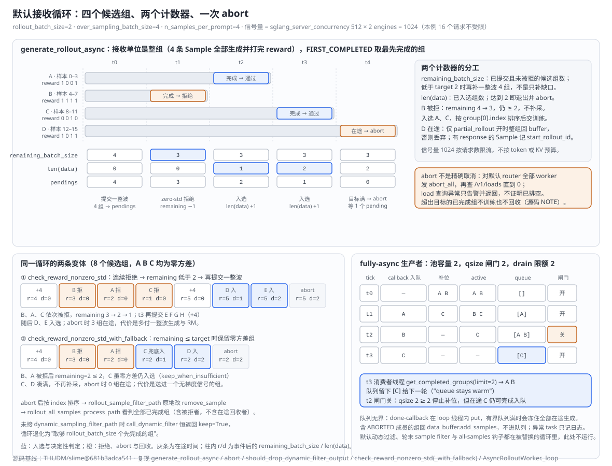
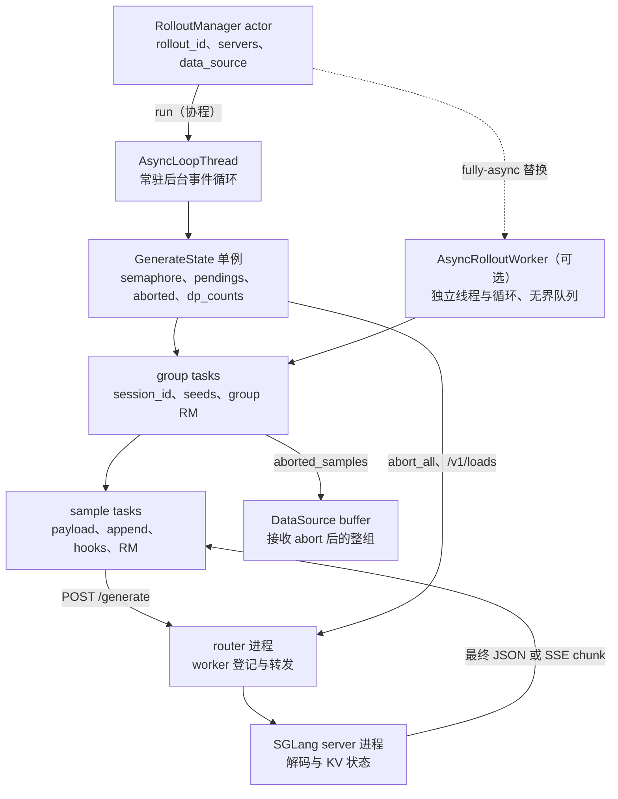

# slime SGLang Rollout Engine：用推理服务执行解码，在请求层保存轨迹状态

> **源码基线**：`THUDM/slime@681b3adca54105d5ecd3fb822fa0dc58a427e0f9`（`main`，2026-08-12）
> **主题**：rollout 请求数据面怎样把成千条 Sample 交给 SGLang HTTP 服务并发解码，同时把标识、行为策略证据、中断前缀、取消结果与恢复边界留在 slime 一侧：`GenerateState` 单例持有信号量、pending 任务与 abort 标志；group task 与 sample task 组装 payload、追加响应、执行 hook 与 RM；接收循环用 over-sampling、FIRST_COMPLETED 与动态过滤凑满训练批次后一次性 abort 排空；流式内层调用与 fully-async 后台生产者是同一协议的两个变体。核心代码在 `slime/rollout/` 与 `slime/backends/sglang_utils/`。
> **适用范围**：请求数据面；Sample 与 DataSource 契约归 12，Ray 资源放置与服务对象所有权归 11，driver 时序归 10，引擎恢复归 18，权重发布归 16。
> **最近更新**：2026-09-10。按特性分析画像重写，补最小实例、接收循环原理图、调用树与成本账本。

---

## 1. 特性概览

### 1.1 问题背景

一轮 rollout 要同时满足五个约束。吞吐上，几十个 prompt group、每组多条 Sample 要并发交给高吞吐推理引擎，客户端还得限制同时占用 `/generate` 的请求数；标识上，DataSource 已分配的分组与样本序号之外，多轮请求还需要稳定的会话键维持路由亲和；策略证据上，请求不能只拿回文本，训练侧需要 selected-token logprob，按需还要 top-p 候选与 routed experts；可取消上，动态采样一旦凑齐训练批次，剩余长尾请求必须停止，而"发过 abort"不等于服务已空闲；可恢复上，被中断的请求状态要能进入下一轮，引擎故障时服务容量要能重建。如果 slime 自己在进程内跑一个逐 token 的推理循环，它就得接管 SGLang 的执行线程、KV 生命周期、健康与拓扑变体，并把 trainer 与 rollout 的生命周期绑死在推理 runtime 上；如果做一个只暴露公共能力的抽象引擎接口，SGLang 每加一种路由策略、并行参数或元数据端点都要先在 slime 里重新建模。

### 1.2 解决方法

slime 把 SGLang 作为独立 HTTP 服务运行，稳定边界放在三处：HTTP 请求、服务生命周期与 `Sample.append_response_tokens`。请求层是一个 `GenerateState` 单例加两级 asyncio 任务：单例持有 tokenizer、采样参数模板、容量为 `sglang_server_concurrency × engine 数` 的信号量、当前轮的 pending 任务集合、`remaining_batch_size` 与 `aborted` 标志，以及按 `sglang_dp_size` 均衡的计数；group task 为组内每条 Sample 分配 `session_id` 与确定性种子后并发派生 sample task；sample task 在信号量内发一次 `/generate`（默认要求 logprob，按开关要求 routed experts 与 top-p 候选），把返回的 token 与元数据追加进 Sample，出信号量后执行 sample hook 与逐样本 RM。接收循环以整组为单位：先向 DataSource 取一整波 `over_sampling_batch_size` 组提交，`FIRST_COMPLETED` 取最先完成的组交给动态过滤，被拒则 `remaining_batch_size` 减一，低于目标再补一整波；入选达到 `rollout_batch_size` 后对默认 router 的全部 worker 发 `abort_all` 并等到 `/v1/loads` 归零，再等本地 pending 任务返回，开 partial 时把在途整组交回 DataSource。SGLang 的参数与路由能力通过 `ServerArgs` / `RouterArgs` 的受控透传暴露，不另设抽象引擎接口。流式生成只替换内层 HTTP 调用；fully-async 用后台线程内的独立事件循环跨轮维持一个 group 池。

### 1.3 收益、开销和约束

| 维度 | 直接收益 | 必付成本或边界 |
|---|---|---|
| 服务化 | 逐 token 调度、KV 状态与 SGLang 原生能力留在 SGLang 进程 | 多一层 HTTP、进程生命周期与跨层状态协议；prompt、最终元数据或 SSE chunk 仍经 HTTP，省掉的是中心逐步 token 传输 |
| 整组接收 | reward 与过滤器可依赖同一 prompt 的全部候选 | 一组要等最慢成员；`FIRST_COMPLETED` 只在组间生效 |
| over-sampling | 动态过滤后仍得到固定大小批次，不必等整波最慢任务 | 多付生成与 RM 成本；补采按整波而非缺口；超出目标的已完成组不训练也不回收 |
| 信号量限流 | 客户端准入上限与 engine 数线性挂钩 | 按请求数而非 token 或 KV 预算限流，异长请求仍形成长尾 |
| 一次性 abort | 下阶段的 offload、权重更新或下一轮不会被旧请求跨越 | 粗粒度 `abort_all`；只查默认 router；load 查询异常时只告警返回，不证明已排空 |
| 受控透传 | SGLang 新参数无需 slime 建模即可用 | slime 直接依赖 SGLang 参数字段与端点兼容性；不存在的键被静默丢弃 |
| 变体 | streaming 把 partial 持久性提前到每个 chunk；fully-async 让下一步不等最慢在途样本 | streaming 每 chunk 重建全量；fully-async 放弃默认动态过滤与轮末钩子，跨轮顺序 best effort |

### 1.4 术语约定

| 术语 | 含义 |
|---|---|
| group task / sample task | `generate_and_rm_group` 与 `generate_and_rm` 的 asyncio 任务；前者是接收循环的等待单位 |
| `remaining_batch_size` | 已提交且尚未被拒的候选组数；决定何时再补一整波 |
| `len(data)` | 已入选组数；达到 `rollout_batch_size` 即退出循环 |
| 候选波次 | 一次 `data_source(over_sampling_batch_size)` 提交的整批 group |
| 排空 | `abort_servers_until_idle` 对每个 worker 发 `abort_all` 并轮询 `/v1/loads` 直到请求数为 0 |
| partial 回收点 | 非流式：服务端最终返回；流式：最后一个已消费 SSE chunk |
| 池 / 闸门 | fully-async 中同时在途的 group 上限与阻止补位的 `qsize` 阈值，二者数值相同但语义不同 |
| 受控透传 | `--sglang-*` 与 `--router-*` 直接映射到 `ServerArgs` / `RouterArgs`，但 model path、端口、rank、并行度、memory saver 等由 slime 计算或保留 |

---

## 2. 请求数据面详细方案

### 2.1 最小实例：四个候选组得到两个训练组

取 `rollout_batch_size=2`、`over_sampling_batch_size=4`、`n_samples_per_prompt=4`，rollout 4 卡、每 engine 2 卡，`sglang_server_concurrency` 取默认 512，信号量容量 512 × 2 = 1024，本例 16 个请求不受限。动态过滤用 `check_reward_nonzero_std`，`partial_rollout` 开启。首波读入 A、B、C、D 四组（样本 0–3、4–7、8–11、12–15），建立 4 个 group task、16 个 sample task。假设完成顺序为 B、A、C，D 仍在途。



| 时刻 | 事件 | `remaining_batch_size` | `len(data)` | pendings |
|---|---|---:|---:|---:|
| t0 | 提交一整波 4 组 | 4 | 0 | 4 |
| t1 | B 完成，reward `1 1 1 1` 零方差 → 拒绝 | 4 → 3 | 0 | 3 |
| t2 | A 完成，reward `1 0 0 1` → 入选 | 3 | 1 | 2 |
| t3 | C 完成 → 入选，达到目标 | 3 | 2 | 1 |
| t4 | abort：`abort_all` → `/v1/loads` 归零 → 等 1 个 pending 返回 | 3 | 2 | 0 |

B 被拒后 remaining 仍 ≥ 2，因此不补采；若连续拒绝使它低于 2，循环会再提交一整波 4 组，而不是只补缺口。入选的 A、C 按 `group[0].index` 排序后交给 RolloutManager；D 只有在 partial 开启时才整组回 DataSource，其中有 response 的 Sample 记下 `start_rollout_id`。此例的代价是多做一组生成与 RM，收益是无需等待 D 自然完成。

#### 2.1.1 一条 Sample 请求携带什么、拿回什么

`generate` 先断言状态为 PENDING 或 ABORTED，由 `_prepare_prompt_ids` 决定 input ids：已有 `tokens` 且（已有 `multimodal_train_inputs` 或没有原始多模态输入）时复用 `sample.tokens`，有 processor 与媒体且不能复用时重新处理 prompt，否则 tokenizer 编码。随后 `max_new_tokens -= response_length`，负数断言失败，恰好为零直接标 TRUNCATED 不发请求。payload 固定带 `return_logprob=True`；`--use-rollout-routing-replay` 加 `return_routed_experts`；`rollout_top_p != 1.0` 时采样参数已在单例构造期加入 `custom_params.return_top_p_token_ids=True`。普通文本发 `input_ids`；只要 `images` 非空就发 `text=sample.prompt` 与 `image_data`，而非完整历史 ids，因此多模态 partial 请求不保证续传旧 response。`router_policy=consistent_hashing` 时以 `X-SMG-Routing-Key` 头携带 `session_id`。响应从 `meta_info.output_token_logprobs` 每项的第 0、1 位取 logprob 与 token id，`text` 只作可读文本，字段缺失时两者置空，再交 `append_response_tokens` 校验并追加。最小文本 payload 形如 `{"input_ids": [101, 102], "sampling_params": {"max_new_tokens": 8, "temperature": 1.0, "top_p": 1.0}, "return_logprob": true}`（数字示意）。

#### 2.1.2 接收循环的两个计数器

外层 `while len(data) < target` 内先 `while remaining_batch_size < target` 补波次；`asyncio.wait(FIRST_COMPLETED)` 返回后逐个取组：断言组长等于 `n_samples_per_prompt`，记入 `all_data`，调用过滤器；`should_drop_dynamic_filter_output` 在 `keep=False` 且（未设 `keep_when_insufficient` 或 remaining 大于 target）时拒绝并把 remaining 减一，被拒原因累计到 `rollout/dynamic_filter/drop_<reason>` 指标，无 reason 的拒绝不产生指标；通过且 `len(data) < target` 才入选，否则直接放弃，紧邻注释写明未存回 buffer。未配置过滤器时 `call_dynamic_filter` 恒返回 keep。

#### 2.1.3 abort 与排空

`abort` 断言此前未 abort，置 `aborted=True`，向默认 router 的 `/workers` 取全部 worker url，对每个 url 并发执行 `abort_server_until_idle`：POST `/abort_request` 带 `abort_all=True`（POST 失败只告警，仍继续查负载），再 GET `/v1/loads?include=core` 用 `num_requests_from_load` 汇总请求数，为 0 返回，否则每 3 s 重试且没有次数上限；load 查询抛异常时只告警并返回。随后 `while state.pendings` 等待本地 group task 全部返回；开 partial 时把每个返回组中有 response 且无 `start_rollout_id` 的 Sample 标上本轮 id，整组收入 `aborted_samples`。在信号量内等待时若发现 `aborted`，sample task 直接把 Sample 标 ABORTED 返回；group task 在 `aborted` 时也跳过 group RM。

#### 2.1.4 收尾与回收

`assert len(data) == rollout_batch_size` 后按首样本 `index` 排序，`state.reset()` 清空 remaining、pendings 与 aborted；`--rollout-sample-filter-path` 原地处理入选组，`--rollout-all-samples-process-path` 收到全部已完成组（含被拒者，不含随后回收的在途组）与 DataSource 取数 callable；返回 `RolloutFnTrainOutput(samples, metrics)` 与 `aborted_samples`，同步 wrapper `generate_rollout` 把后者交给 `data_source.add_samples`。下轮 buffer 优先取回这些组，已 COMPLETED / TRUNCATED 的成员被 `generate_and_rm` 跳过（非 group RM 时断言其 reward 已存在），未完成者续生成；旧 token 的 mask 归属由 [[12_slime_sample_datasource_analysis]] 定义。

### 2.2 从最小实例到整套请求层

#### 2.2.1 GenerateState：进程级单例

**职责。** 持有跨请求共享的 tokenizer、processor、采样参数模板、信号量、`group_sampling_seeds`（开 `--sglang-enable-deterministic-inference` 时为 `rollout_seed + i`）、`dp_counts`，以及本轮的 `remaining_batch_size`、`pendings`、`aborted`。

**为何是单例而不是每轮新建（本页推断，源码未陈述）。** 判据在可替换点的签名：`generate`、`generate_and_rm`、`generate_and_rm_group`、`generate_streaming` 与 `AsyncRolloutWorker.__init__` 都通过 `GenerateState(args)` 取状态，而自定义生成函数的签名只有 `(args, sample, sampling_params)`；单例让任何内层替换函数不加参数就能拿到同一份信号量与采样模板，按轮新建的对象则要穿过每个插件签名。`SingletonMeta` 以类为键缓存实例，构造参数只在第一次生效。代价是它是 RolloutManager 进程内的全局状态：`reset()` 只清三个轮内字段，评估与训练共用同一个 `aborted` 标志与信号量，`generate_rollout_async` 结束时的 `reset()` 正是为了不影响下一轮或 eval。

**怎样均衡。** `dp_rank_context` 在计数最小的 dp rank 中随机选一个、进入时加一、退出时减一并断言非负；它只是客户端侧的计数，SGLang 内部的 dp attention 调度不在此处。信号量容量 $C_{\mathrm{client}} = C_{\mathrm{server}} N_{\mathrm{engine}}$，其中 $N_{\mathrm{engine}}$ 由 `get_rollout_num_engines` 得到（优先 `rollout_num_engines`，否则 `rollout_num_gpus // rollout_num_gpus_per_engine`）；`init_http_client` 用同一乘积作为 httpx 连接池上限，超时为无限，且不走系统代理。开 `--use-distributed-post` 时 POST 经每节点若干 Ray actor 分发，失败回落本地。

#### 2.2.2 group task 与 sample task

**职责。** group task 为缺失 `session_id` 的 Sample 生成 UUID（partial 续生成因此沿用原 id），为组内第 i 条 Sample 复制采样参数并按需写 `sampling_seed`，`asyncio.gather` 保持各 task 产出的形状（单 Sample 或 `list[Sample]`），最后在 `--group-rm` 下对整组调用 `batched_async_rm`；gather 出来的组若含扇出 list，会原样传给批量 RM，非自定义分支再逐元素调用 `async_rm`，因此 group RM 不会自动解开 agent 嵌套扇出。sample task 先在 partial 且 mask-offpolicy 下清零已有 mask，再跳过已完成成员，然后进入信号量：`sample.generate_function_path` 优先于全局 `custom_generate_function_path`，调用前探测签名里是否有 `evaluation` 形参；无自定义函数则走 `generate`。出信号量后执行 `apply_rollout_sample_hooks`，非 group RM 时给缺 reward 的 Sample 打分，ABORTED 成员跳过。

**为何 RM 在信号量之外（本页推断）。** 信号量保护的是 engine 的请求容量；RM 可能是远程服务或规则计算，占着信号量会压低生成并发。代价是 RM 有自己的并发形态：`remote_rm` 用连接上限 64、总超时 120 s 的共享 aiohttp session，最多 10 次尝试，等待 `min(2**attempt, 30) + random()`，耗尽抛异常。

**分派链。** `async_rm` 优先级为 Sample 自带 `custom_rm_path` → 全局 `--custom-rm-path` → `metadata.rm_type` → `--rm-type`；规则分派支持 `remote_rm / deepscaler / dapo / math / f1 / gpqa / ifbench / random`，未知或空类型抛 `NotImplementedError`；`boxed_` 前缀先抽取 boxed answer 再按余下名字调用，remote 路径仍发送原 Sample 的 `prompt / response / label`，不写回局部抽取结果。`batched_async_rm` 有全局自定义 RM 时一次传整个 list（要求实现批量接口），否则 gather 各 Sample。custom generate 返回 list 时只把其中缺 reward 的成员交给批量 RM，任一成员 ABORTED 则整组跳过。hook 按路径顺序对每个 Sample 叶子执行，同步或异步皆可，只传签名接受的 `rollout_id` 与 `evaluation`，返回 `None` 保留原对象，非 Sample 返回值抛 `TypeError`，列表嵌套形状保持不变。

#### 2.2.3 动态过滤与 over-sampling：整组接收

**职责。** 决定一个已生成、已打分的完整组是否进入训练候选集，并维持固定大小批次。

**为何整组（本页推断）。** 过滤器与 group RM 可能依赖同一 prompt 的全部候选（零方差判定就是如此）；`FIRST_COMPLETED` 把准入条件从"等待整波"改成"收到组完成事件"，长尾组不阻塞已完成组。默认过滤器用 float64 标准差大于 `1e-6` 判保留，拒绝原因为 `zero_std_<reward 四舍五入一位>`；`_with_fallback` 变体置 `keep_when_insufficient=True`，在 remaining ≤ target 时保留零方差组以免再补一波。quick start 以 `rollout_batch_size=32`、`n=8`、`over_sampling_batch_size=64` 描述同一机制：每次直接采 64 个 prompt，pending 低于 32 时再采 64。

**代价。** 补采粒度是整波：连续拒绝使 remaining 从 4 降到 3、2、1 后，一次再补 4 组，而不是只补缺口，随后 remaining 为 5；`with_fallback` 省下这一波，代价是把一个无梯度信号的组送进训练。两条变体的逐步计数见原理图下半部。超出目标的已完成组既不训练也不回收，是源码自承的缺口（§5.4）。

#### 2.2.4 abort：粗粒度排空而非精确取消

**职责。** 保证下一阶段（offload、权重更新、下一轮）开始前 engine 内没有本轮请求。

**为何必须排空而不只发信号。** 若旧请求仍在 engine 内执行，它会跨越服务生命周期边界；`abort_server_until_idle` 用 `/v1/loads` 的请求数作为空闲证据。**依赖边界**：`/abort_request`、`/v1/loads` 与 `X-SMG-Routing-Key` 的语义属于 SGLang 与 SGLang Model Gateway 的发布接口，slime 源码只证明它发出了这些调用并解析返回；项目博客说明 `/abort_request` 是与 AReaL 团队合作为动态采样加入 SGLang 的端点，用于立即终止在途请求并回收部分生成内容。

**代价。** 只查询 `args.sglang_router_ip/port` 指向的默认 router；custom multi-model rollout 若向 `args.sglang_model_routers` 中的其他 router 发请求，默认 abort 不会替它排空，必须显式确认取消协议（本页推断）。

#### 2.2.5 router 与 server 进程：受控透传

**职责。** router 给每个模型提供单一请求入口、登记 worker 并按策略转发；`SGLangEngine` actor 计算 server args、拉起原生 HTTP server、等 `/health_generate` 可用、把 node-0 worker 注册到 router。

**怎样透传。** router 侧 `RouterArgs.add_cli_args(parser, use_router_prefix=True, exclude_host_port=True)` 注入 `--router-*`；server 侧临时包装 `parser.add_argument`，把 `ServerArgs.add_cli_args` 暴露的参数改写为 `--sglang-*`，跳过 `skipped_args` 列出的十五项由 slime 生命周期与拓扑负责的字段（`model_path`、`config`、`trust_remote_code`、`random_seed`、`enable_memory_saver`、`tp_size`、`port`、`nnodes`、`node_rank`、`dist_init_addr`、`gpu_id_step`、`base_gpu_id`、`nccl_port`、`skip_server_warmup`、`enable_return_routed_experts`）。`_compute_server_args` 先写 slime 决定的基础项（含 `enable_memory_saver=args.offload_rollout`、`skip_server_warmup=True`、`enable_draft_weights_cpu_backup=True`、`enable_metrics=True`，PD / encoder worker 的专用项），再遍历当前 `ServerArgs` 字段把存在的 `args.sglang_*` 填入（decode worker 跳过 `enable_hierarchical_cache`），最后用 per-group YAML `overrides` 覆盖；当前 SGLang 版本不存在的键记录后丢弃，`enable_memory_saver` 开启且未指定 prefill CUDA graph 后端时置 `disabled`。

**为何不做能力受限的公共引擎接口。** 那样 SGLang 新增的路由策略、并行参数、PD / EPD 或元数据端点都要先在抽象层重新建模；项目博客把"保持 SGLang native、把复杂度留在核心库"写成方向。代价是 slime 直接依赖 SGLang 参数字段与端点兼容性。router 与 server 由谁创建、`RolloutServer` / `ServerGroup` 与 `SGLangEngine` 的所有权归 [[11_slime_ray_control_plane_analysis]]。

### 2.3 变体：同一协议的三条替换轴

**枚举依据。** 请求层有三个互不重叠的替换点，分别由三个参数选择：`--custom-generate-function-path` 替换 sample task 内层调用（`generate_and_rm` 的分派分支）；`--rollout-function-path` 替换整轮函数（`RolloutManager.__init__` 加载）；`--sglang-config` / `--prefill-num-servers` 改变服务拓扑（`_resolve_sglang_config` 四支：YAML、`rollout_num_gpus == 0` 的 router-only 空模型、旧 PD 参数、默认单 regular 组）。输入侧还有一条兄弟轴 `--data-source-path`（`RolloutManager.__init__` 加载），归 [[12_slime_sample_datasource_analysis]]。仓内实现如下。

| 替换轴 | 仓内实现 | 用 §2.1 实例回放 | 应对的压力 | 上限或代价 |
|---|---|---|---|---|
| 内层调用 | `sglang_streaming_rollout.generate_streaming` | D 的每个 SSE chunk 都落到 Sample；abort 时 D 停在最后已观测 chunk，无终止原因则标 ABORTED | partial 持久性从"等服务端最终返回"提前到"每个 chunk" | 假设 chunk 在单次调用内累计；每 chunk 从快照重建再追加；直接用模块级客户端，`--use-distributed-post` 对它不生效 |
| 整轮函数 | `fully_async_rollout.generate_rollout_fully_async` | 池容量 2：A 完成入队，补 C；B 完成后队列 `[A B]` 达闸门停止补位；C 仍完成入队；消费者 drain 2 取 A、B，`[C]` 留待下轮 | 下一步不等最慢在途样本 | 无默认动态过滤与轮末钩子；跨轮顺序 best effort；拒绝 evaluation |
| 整轮函数 | `sft_rollout.generate_rollout` | 从数据构造监督样本，不发请求 | SFT | 归 [[28_slime_sft_path_and_loss_mask_analysis]] |
| 整轮函数 | `forge_load.generate_rollout` / `sleep_rollout.sleep` | 读伪造 dump 保留服务生命周期 / 初始化后无限等待供压测 | 调试与压测 | 归 [[19_slime_rollout_backend_extension_analysis]] |
| RM 侧 | OPD 的默认 rollout + 自定义 RM | 学生采样后调用 teacher，不是另一种 engine | 蒸馏 | 归 [[20_slime_on_policy_distillation_analysis]] |
| 服务拓扑 | YAML 多模型多 group / 旧 PD 参数 | 一模型一 router；PD 下 prefill GPU 数 = server 数 × 每 engine GPU 数，余下给 decode，余数不大于零断言 | 多模型、PD / EPD | group 值优先于 model 值再回落全局；`--sglang-dp-size` 是 engine 内并行不是 engine 数 |

#### 2.3.1 流式内层调用

`generate_streaming` 复用 `_prepare_prompt_ids`、预算扣减与 payload 组装，只多 `stream=True`，并直接用模块级 httpx 客户端 `stream("POST")`。它先快照调用前的 tokens、response、长度、logprob、top-p 与 mask；每个 `data:` 行解析 JSON，取 `meta_info.output_token_logprobs` 的累计列表，把 Sample 重置为快照后再 `append_response_tokens` 一次，`update_terminal_info` 仅在 chunk 带 `finish_reason` 时为真；每个 chunk 后检查 `state.aborted`，为真即退出循环。结束时若已 abort 且无终止原因，标 ABORTED。外层信号量、dp 均衡、abort 编排与 buffer 交接仍由默认路径拥有。文件头明确假设 SGLang 的 SSE 输出在单次调用内累计，若服务端切到 incremental output，重建逻辑必须改；`tests/test_qwen3_4B_streaming_partial_rollout.py` 以 over-sampling 2 倍加 partial 逼迫每步 abort 来覆盖这一路径。代价：每个 chunk 重做一次全量追加与校验，长响应下工作量随累计长度增长（源码可见，未测量）。

#### 2.3.2 fully-async 后台生产者

官方用法是 `train_async.py` 的 one-stage async 叠加 `--rollout-function-path slime.rollout.fully_async_rollout.generate_rollout_fully_async`；driver 的 future 等待与更新时序见 [[10_slime_end_to_end_iteration_analysis]]。首次调用创建进程级 `AsyncRolloutWorker`：daemon 线程内 `asyncio.run` 一个独立事件循环，跨轮保存 active tasks 与输出队列；池上限为 `sglang_server_concurrency × engine 数`，组内 Sample 仍受默认信号量约束，因此"池大小"与"在途 HTTP 数"不是同一计数单位。循环每秒执行：回收已完成 task 并记录异常；只要 `active < 池` 且 `qsize < 池` 就 `data_buffer.get_samples(1)` 补位；队列本身无界，因为 done-callback 在事件循环线程内 `put`，有界队列满时会冻住全部在途生成。callback 把 `(gid, group)` 入队；含 ABORTED 成员的组交回 `data_buffer.add_samples`——冻结树里唯一写 `GenerateState.aborted` 的是 `sglang_rollout.abort`，fully-async 从不调用它，所以用默认 `generate` 时这条分支实际到不了，只有自定义生成函数自行标 ABORTED 才会触发；非 list 返回值丢弃并告警，异常 task 只记日志不回填。消费者每轮只 `get_completed_groups(limit=target − collected)`，余量留给下轮，按首样本 `index` 排序返回；`tests/test_fully_async_rollout.py` 锁定"只取 target 个、callback 不阻塞、闸门存在"三条契约。该入口断言 global dataset、拒绝 evaluation（应另配 `--eval-function-path`，见 [[27_slime_evaluation_path_analysis]]）；README 声明 partial 式续跑未接通，ABORTED 轨迹被原对象回填后从头重做——但源码并未统一清空 tokens，因此"必定从零重做"或"所有插件都可无损续跑"都不能写作框架保证。driver 的 generation future 完成只证明本轮批次已备好，不证明后台池为空；worker 不拥有 pause / 权重更新信令，也没有版本年龄上限。

### 2.4 并发模型与整体开销

请求层有四层并发：driver 对 `RolloutManager.generate` 的一次同步 RPC；RolloutManager 进程内 `slime/utils/async_utils.py::run` 把协程投递到常驻后台事件循环线程并阻塞等待；该循环上的 group task 与 sample task；信号量与 `dp_counts` 之下的 SGLang 服务端批处理。fully-async 再加一个独立线程与事件循环。

| 维度 | 来源 | 评估状态 |
|---|---|---|
| 网络 | 每条 Sample 至少一次 HTTP；`post` 失败最多重试 60 次、间隔 1 s；abort 每 worker 一次 POST 加轮询 GET | 源码常数 |
| 延迟 | 一组等最慢成员；目标满后 abort 排空每 3 s 轮询；partial 多一次往返 | 源码可见，未测量 |
| 吞吐上限 | 信号量按请求数限流；SGLang 内部批处理不在 slime 控制 | 源码可见 |
| 浪费 | 被拒组与超目标组的生成与 RM 成本；补采整波 | 源码可见 |
| 同步 | `asyncio.wait(FIRST_COMPLETED)`；abort 等 pendings；fully-async 每秒轮询 | 源码可见 |
| 兼容性 | 透传依赖 SGLang 字段名；streaming 依赖累计 SSE；`call_rollout_fn` 包装旧式返回 | 源码可见 |
| 实现复杂度 | 单例全局状态、两级任务、三条替换轴 | 源码可见 |

**总体代价与运行包络。** 请求层的成本集中在每条请求的 HTTP 往返与轮末的 abort 排空，都在 SGLang 解码之外；它换来的是 SGLang 原生能力零建模可用、批次大小固定、中断可回收。失败边界集中在断言：状态、预算、组长、入选数与 abort 幂等（§5.1）。本页未运行 slime 训练或 SGLang 服务，所有等待时长均为源码常数。

---

## 3. 代码实现分析

### 3.1 对象与所有权视图

<!-- Figure spec: ownership graph; RolloutManager actor runs generate_rollout on a background loop thread; GenerateState singleton owns semaphore/pendings/aborted; group and sample tasks own per-request state; router and server processes are outside; DataSource buffer receives aborted groups. -->


| 对象 | 所在进程 / 线程 | 拥有的状态 | 生命周期 |
|---|---|---|---|
| `RolloutManager` | Ray actor | 当前 `rollout_id`、servers、DataSource、rollout / eval 函数 | 训练全程 |
| `AsyncLoopThread` | RolloutManager 进程的 daemon 线程 | 事件循环 | 首次 `run` 创建，进程级 |
| `GenerateState` | 同上，单例 | 信号量、采样模板、种子、`dp_counts`、`remaining_batch_size`、`pendings`、`aborted` | 进程级；三个轮内字段每轮 `reset` |
| group task / sample task | 事件循环上的 asyncio 任务 | 组内 Sample 引用、局部采样参数 | 一轮内 |
| router / server | 独立进程 | worker 表 / KV 与请求队列 | 服务生命周期，归 11 |
| `AsyncRolloutWorker` | 独立 daemon 线程与事件循环 | active tasks、无界输出队列 | 进程级，`atexit` 停止 |

五层职责与"明确不负责什么"：RolloutManager 启动服务、持有 DataSource 与 rollout 函数、划定一轮 `rollout_id`、完成后转换训练数据，不执行 token decoding 也不决定 SGLang 内部 batch；router 给每模型一个入口并转发，不拥有 Sample、reward 或训练批次；`RolloutServer` 表示一个模型及其 router 并标记是否接收权重，本身不是 HTTP 进程也不是 Ray actor；`ServerGroup` 聚合同构 worker、创建 engine actor 并执行显存卸载恢复，不跨模型混合标识也不做请求级限流；engine / worker 控制进程与转发 RPC，不决定某条 Sample 是否进入训练；request 层拥有 session、payload、追加、hook 与 RM，不拥有 engine 资源与跨轮恢复策略。一个模型可含 `regular`、`prefill`、`decode`、`encoder`、`placeholder` 五类 group，多模型时各自独立 router 并写入 `args.sglang_model_routers`，自定义函数用 `get_model_url(args, name)` 取地址。

### 3.2 调用流程

#### 3.2.1 一轮默认路径

```text
RolloutManager.generate(rollout_id)
`-- _get_rollout_data → call_rollout_fn(generate_rollout, args, rollout_id, data_source, evaluation=False)
    `-- slime/rollout/sglang_rollout.py::generate_rollout
        |-- assert rollout_global_dataset；[evaluation] run(eval_rollout) → 返回
        |-- run(generate_rollout_async(args, rollout_id, data_source.get_samples))     [后台事件循环线程]
        |   |-- GenerateState(args)（首次构造：tokenizer、processor、semaphore、sampling_params、dp_counts）
        |   |-- load_function(dynamic_sampling_filter_path)；MetricGatherer()
        |   |-- while len(data) < rollout_batch_size:
        |   |   |-- while remaining_batch_size < target: data_source(over_sampling_batch_size) → submit_generate_tasks
        |   |   |   `-- asyncio.create_task(generate_and_rm_group)
        |   |   |       |-- [aborted] return group
        |   |   |       |-- session_id 缺失 → uuid4；[deterministic] sampling_seed = group_sampling_seeds[idx]
        |   |   |       |-- gather(generate_and_rm × n)
        |   |   |       |   |-- [partial and mask_offpolicy and response_length > 0] loss_mask = 0…
        |   |   |       |   |-- [COMPLETED/TRUNCATED] 断言 response（非 group_rm 断言 reward）→ return
        |   |   |       |   |-- async with semaphore: [aborted] → ABORTED；dp_rank_context
        |   |   |       |   |   `-- custom_generate（探测 evaluation 形参）| generate
        |   |   |       |   |       |-- _prepare_prompt_ids → max_new_tokens −= response_length（< 0 断言；== 0 → TRUNCATED）
        |   |   |       |   |       |-- payload（return_logprob；[routing replay] return_routed_experts；images → text+image_data）
        |   |   |       |   |       |-- post(router /generate, headers=X-SMG-Routing-Key?)   [http_utils::_post，最多 60 次重试]
        |   |   |       |   |       `-- Sample.append_response_tokens(tokens, log_probs, meta_info, text)
        |   |   |       |   |-- apply_rollout_sample_hooks
        |   |   |       |   `-- [not group_rm] async_rm | batched_async_rm（list 返回值只对缺 reward 者）
        |   |   |       `-- [not aborted and group_rm] batched_async_rm(group)
        |   |   `-- asyncio.wait(pendings, FIRST_COMPLETED) → 断言组长 → all_data → call_dynamic_filter
        |   |       |-- should_drop → remaining_batch_size −= 1
        |   |       `-- [len(data) < target] data.append（否则放弃，NOTE 未回存）
        |   |-- abort(args, rollout_id)
        |   |   |-- assert not aborted；aborted = True
        |   |   |-- get(router /workers) → abort_servers_until_idle(urls)
        |   |   |   `-- 每 url：post /abort_request{abort_all} → get /v1/loads?include=core → 0 返回 | 3 s 重试 | 异常告警返回
        |   |   `-- while pendings: wait(FIRST_COMPLETED) → [partial] 标 start_rollout_id → aborted_samples
        |   |-- assert len(data) == rollout_batch_size → sorted(by index) → state.reset()
        |   |-- [rollout_sample_filter_path] filter(args, data)；[rollout_all_samples_process_path] process(args, all_samples, data_source)
        |   `-- return RolloutFnTrainOutput(data, metric_gatherer.collect()), aborted_samples
        `-- [aborted_samples] data_source.add_samples(aborted_samples)
```

完成边界是 `RolloutFnTrainOutput` 回到 RolloutManager 并且回收组已入 buffer；此后的展平、转换与切分归 [[12_slime_sample_datasource_analysis]]。

#### 3.2.2 流式内层调用

```text
generate_and_rm → custom_generate = slime/rollout/sglang_streaming_rollout.py::generate_streaming
|-- 断言状态；_prepare_prompt_ids；预算扣减；payload += stream=True
|-- 快照 base_tokens / base_response / base_response_length / base_log_probs / base_top_p / base_loss_mask
`-- async with http_utils._http_client.stream("POST", url): for line in aiter_lines()
    |-- 跳过非 data: 行与 [DONE]；json.loads 失败告警跳过
    |-- last_meta_info = meta；call_tokens/call_log_probs = 累计 output_token_logprobs
    |-- 重置为快照 → append_response_tokens(call_tokens, call_log_probs, meta, update_terminal_info=bool(finish_reason))
    `-- [state.aborted] break
`-- [aborted and no finish_reason] status = ABORTED
```

#### 3.2.3 fully-async 生产者与消费者

```text
generate_rollout_fully_async(args, rollout_id, data_buffer, evaluation)
|-- [evaluation] raise ValueError
`-- run(_generate_rollout_async)
    |-- assert rollout_global_dataset；_get_global_worker → AsyncRolloutWorker(concurrency = server_concurrency × engines).start()
    |   `-- Thread(_thread_main) → asyncio.run(_loop)
    |       `-- while running: reap done（异常告警）→ while active < cap and qsize < cap: data_buffer.get_samples(1)
    |           `-- create_task(generate_and_rm_group).add_done_callback(_make_done_cb)
    |               |-- 异常 → 日志；非 list → 告警丢弃
    |               |-- [任一 ABORTED] data_buffer.add_samples([group])
    |               `-- output_queue.put((gid, group))
    |-- while len(collected) < target: get_completed_groups(limit = target − len(collected))；空则 sleep 0.05；每 30 s 日志
    `-- sorted(by 首个非空 index) → list[list[Sample]]
```

### 3.3 源码阅读路线

1. 单例与请求：`slime/rollout/sglang_rollout.py::GenerateState.__init__` / `dp_rank_context` / `reset` / `submit_generate_tasks` / `_prepare_prompt_ids` / `get_model_url` / `generate` → `slime/utils/http_utils.py::get_rollout_num_engines` / `init_http_client` / `_post` / `post` / `get` / `_init_ray_distributed_post`。
2. 任务与分派：`slime/rollout/sglang_rollout.py::generate_and_rm` / `generate_and_rm_group` → `slime/rollout/sample_hooks.py::apply_rollout_sample_hooks` / `_apply_to_sample` / `_accepted_kwargs` / `set_current_rollout_id` → `slime/rollout/rm_hub/__init__.py::async_rm` / `batched_async_rm` / `remote_rm` / `_get_shared_session` → `tests/test_rollout_sample_hooks.py`。
3. 接收与排空：`slime/rollout/sglang_rollout.py::generate_rollout_async` / `abort` / `generate_rollout` → `slime/rollout/filter_hub/base_types.py::DynamicFilterOutput` / `should_drop_dynamic_filter_output` / `call_dynamic_filter` / `MetricGatherer` → `slime/rollout/filter_hub/dynamic_sampling_filters.py::check_reward_nonzero_std` / `check_reward_nonzero_std_with_fallback` → `slime/backends/sglang_utils/server_control.py::abort_server_until_idle` / `abort_servers_until_idle` / `num_requests_from_load`。
4. 流式变体：`slime/rollout/sglang_streaming_rollout.py::generate_streaming` → `tests/test_qwen3_4B_streaming_partial_rollout.py`。
5. fully-async：`slime/rollout/fully_async_rollout.py::AsyncRolloutWorker.__init__` / `start` / `stop` / `get_completed_groups` / `_loop` / `_make_done_cb` / `_get_global_worker` / `_generate_rollout_async` / `generate_rollout_fully_async` → `tests/test_fully_async_rollout.py` / `tests/test_qwen2.5_0.5B_fully_async_short.py` / `examples/fully_async/README.md`。
6. 服务与透传：`slime/backends/sglang_utils/arguments.py::add_sglang_router_arguments` / `add_sglang_arguments` / `validate_args` → `slime/backends/sglang_utils/sglang_engine.py::SGLangEngine.init` / `_init_normal` / `_register_to_router` / `launch_server_process` / `_wait_server_healthy` / `_compute_server_args` / `_EXTERNAL_ENGINE_SKIP_CHECK_FIELDS` → `slime/backends/sglang_utils/sglang_config.py::SglangConfig.from_yaml` / `from_prefill_num_servers` / `ModelConfig.resolve` → `slime/ray/rollout.py::_resolve_sglang_config` / `_start_router` / `start_rollout_servers`。
7. 评估入口：`slime/rollout/sglang_rollout.py::eval_rollout` / `eval_rollout_single_dataset` → `slime/utils/eval_config.py`。
8. 并发容器：`slime/utils/async_utils.py::AsyncLoopThread` / `run` → `slime/utils/misc.py::SingletonMeta`。

---

## 4. 配套机制

### 4.1 引擎恢复与请求回收的边界

partial 回收保存的是已返回客户端的 Sample 状态，权重 commit 发布的是新的 serving 权重，两者不能共用"提交点"一词。开 `--use-fault-tolerance` 时每个 server group 一个健康监控线程，`health_generate` 失败即 `shutdown` 并 `ray.kill` 整个逻辑 engine、在 `all_engines` 留下 `None`；重建推迟到训练侧权重更新前由 rank 0 触发 `recover_updatable_engines`。恢复服务容量不保证重放丢失请求，当前请求是否可回收取决于已保存的 partial 状态。规范恢复链、初始轮跳过与 external 限制见 [[18_slime_fault_tolerance_observability_analysis#2.2 从最小实例到整个容错与取证体系|引擎恢复 §2.2.2]]；恢复后如何在版本边界内接收下一次权重见 [[16_slime_weight_sync_analysis]]。

### 4.2 部署参数与 server group 拓扑

`start_rollout_servers` 在 managed 模式下先解析配置：`--sglang-config` 读多模型 YAML（总 GPU 数必须等于 `--rollout-num-gpus`）；否则 `--prefill-num-servers` 构造 prefill / decode 两组；否则单 regular 组；`rollout_num_gpus == 0` 时只起 router 不起本地 server。YAML 里 group 的 `num_gpus_per_engine` 优先于 model 值再回落全局值，`overrides` 用原生 `ServerArgs` 字段名；`update_weights` 未显式给出时按 `model_path` 是否等于 `hf_checkpoint` 推断。`--sglang-config` 与 `--prefill-num-servers`、`--rollout-external-engine-addrs` 两两互斥。encoder 的启动顺序与图片通路归 [[26_slime_multimodal_vlm_path_analysis]]，GPU 偏移、端口与 `needs_offload` 归 [[11_slime_ray_control_plane_analysis]]。

### 4.3 评估入口的差异

`eval_rollout` 断言非 group RM，对每个评估数据集并发运行 `eval_rollout_single_dataset`：按数据集配置与 `hf_checkpoint` 等键缓存 `Dataset`，采样参数中 `stop`、`stop_token_ids`、`skip_special_tokens` 回落到对应的 `rollout_*` 全局值，`no_stop_trim` 回落到常量 `True`，温度、top-p、top-k 与最大长度直接取数据集配置（其自身的回落规则在 `slime/utils/eval_config.py`），每条 prompt 复制 `n_samples_per_eval_prompt` 份并直接 `generate_and_rm(evaluation=True)`，不经 group task、不经 GenerateState 的 `submit_generate_tasks`、不做动态过滤与 abort；结果按 `index` 排序，`rewards` 按 `eval_reward_key` 或 `reward_key` 取值。它与训练轮共用同一个 `GenerateState` 信号量。多数据集配置与指标归 [[27_slime_evaluation_path_analysis]]。

---

## 5. 约束、适用场景与趋势

### 5.1 硬约束与失败边界

| 前提 | 源码边界 | 破坏后的行为 |
|---|---|---|
| 默认 rollout 函数需要 global dataset | `sglang_rollout.py::generate_rollout` / `generate_rollout_async` | `AssertionError` |
| 进入 `generate` 的 Sample 状态为 PENDING 或 ABORTED | `sglang_rollout.py::generate` | `AssertionError` |
| 已有 response 长度不超过 `rollout_max_response_len` | 同上（`max_new_tokens ≥ 0`） | `AssertionError`；恰好为 0 时标 TRUNCATED 不发请求 |
| 完成的组长度等于 `n_samples_per_prompt` | `sglang_rollout.py::generate_rollout_async` | `AssertionError` |
| 循环结束时入选数等于 `rollout_batch_size` | 同上 | `AssertionError` |
| 一轮内 `abort` 只调用一次 | `sglang_rollout.py::abort` | `AssertionError` |
| 已完成成员在非 group RM 下必须已有 reward | `sglang_rollout.py::generate_and_rm` | `AssertionError` |
| `dp_counts` 非负 | `sglang_rollout.py::GenerateState.dp_rank_context` | `AssertionError` |
| hook 返回 Sample 或 None；hook 输入为 Sample 或 list | `sample_hooks.py::_apply_to_sample` / `apply_rollout_sample_hooks` | `TypeError` |
| `rm_type` 属于支持集合且非空 | `rm_hub/__init__.py::async_rm` | `NotImplementedError` |
| remote RM 在 10 次尝试内成功 | `rm_hub/__init__.py::remote_rm` | 抛出最后一次异常 |
| HTTP POST 在 60 次重试内成功 | `http_utils.py::_post` | 抛出最后一次异常 |
| 流式路径要求 HTTP 客户端已初始化 | `sglang_streaming_rollout.py::generate_streaming` | `AssertionError` |
| fully-async 不支持 evaluation | `fully_async_rollout.py::generate_rollout_fully_async` | `ValueError` |
| eval 不支持 group RM | `sglang_rollout.py::eval_rollout` / `eval_rollout_single_dataset` | `AssertionError` |
| `over_sampling_batch_size ≥ rollout_batch_size` | `arguments.py` 参数校验 | `AssertionError` |
| YAML GPU 总数等于 `rollout_num_gpus`；PD 下 decode GPU 数大于 0 | `rollout.py::_resolve_sglang_config` / `sglang_config.py::from_prefill_num_servers` | `AssertionError` |
| `--sglang-config`、`--prefill-num-servers`、external 两两互斥 | `sglang_utils/arguments.py::validate_args` | `AssertionError` |
| abort 后服务端确实空闲 | `server_control.py::_abort_server_once` / `abort_server_until_idle` | 无守卫：abort POST 失败只告警；load 查询异常只告警返回；负载持续大于 0 时 `while True` 无次数上限，本轮阻塞 |
| 超出目标的已完成组被回收 | `sglang_rollout.py::generate_rollout_async` | 无守卫：直接放弃，源码 NOTE 自承 |

### 5.2 常见误读

| 误读 | 固定基线的实际行为 |
|---|---|
| 路由器负责全部 rollout 调度 | 路由器只管 worker 登记与转发；分组接收、动态过滤、RM 与 partial 回收在 slime 请求层 |
| 服务化意味着没有 token 经过控制面 | prompt 与最终 response 元数据经 HTTP，streaming 还传累计 chunk；省掉的是中心逐 decode-step 调度 |
| abort 是精确取消某个剩余 task | 对默认 router 全部 worker 发 `abort_all`，是轮次收尾的粗粒度排空 |
| abort 正常返回即证明服务端已排空 | load 查询异常时只告警返回；正常路径才以请求数归零为证据 |
| streaming 天然兼容任意 SGLang stream 模式 | 实现假设 chunk 在单次调用内累计；incremental output 需改重建逻辑 |
| health check 失败会原地继续请求 | monitor kill engine 并留下 `None`，重建推迟到权重更新前 |
| 信号量是 SGLang 的批次调度器 | 它只是客户端按请求数的准入上限，不按 token 长度或 KV 估算容量 |
| 补采只补缺口 | 每次补一整波 `over_sampling_batch_size` 组 |
| 被拒或超目标的组会回到 buffer | 只有 abort 时在途的组在 partial 下回收；已完成而未入选的组直接放弃 |
| fully-async 仍运行默认动态过滤 | 它替换了整个 `generate_rollout_async`，只复用 `generate_and_rm_group` 下的生成、hook 与 RM |
| `--use-routing-replay` 与 `--use-rollout-routing-replay` 是同一个开关 | 后者才让请求携带 `return_routed_experts`；组合约束归 17 |
| `session_id` 就是训练身份或随机种子 | 它是 serving affinity 键，UUID 不充当采样种子；训练身份是 `group_index`、`index`、`rollout_id`，归 12 |

### 5.3 何时使用

| 场景 | 建议 | 原因 |
|---|---|---|
| 单轮或多轮生成、规则 RM | 默认路径，不设过滤器 | 循环退化为取够先完成的组 |
| DAPO 式动态采样 | `--over-sampling-batch-size` 大于目标 + `check_reward_nonzero_std`，浪费大时加 `--partial-rollout` | 固定批次；回收在途前缀 |
| 补采代价过高 | 换 `check_reward_nonzero_std_with_fallback` | 省一波，代价是送进零方差组 |
| 长响应且 abort 频繁 | `--custom-generate-function-path slime.rollout.sglang_streaming_rollout.generate_streaming` | partial 状态在每个 chunk 即落到 Sample |
| 长尾 agent 轨迹阻塞训练 | `train_async.py` + fully-async rollout 函数 | 后台池跨轮在途；接受无默认过滤与 best-effort 顺序 |
| 多模型、PD / EPD 拓扑 | `--sglang-config` YAML | 每模型一 router，per-group overrides |

### 5.4 当前演进方向

本节只写有源码注释或 README 可锚定的在途改动，整节标为推断。

> [!note] 推断：锚点是源码原文，方向判断是本页的重建
> **一、router 参数前缀尚未统一。** `add_sglang_router_arguments` 定义上方挂着 ``# TODO: use all sglang router arguments with `--sglang-router` prefix``，而函数体只手写 `--sglang-router-ip/port/request-timeout-secs` 三个参数，原生 router 参数经 `RouterArgs.add_cli_args(use_router_prefix=True)` 落在 `--router-*` 命名空间。由此可推断 §2.2.5 的透传边界会继续朝"更少手写、更多直接透传"移动，`--router-*` 拼写不宜当作长期 CLI 契约。
> **二、超额采样的丢弃语义被源码自己标注为未完成。** 接收循环在候选已满时直接放弃该组，紧邻注释为 `# NOTE: here we have not stored all the unused samples back to the data buffer.`。已付出生成与 RM 成本的多余组既不训练也不回收，任何假设它们会被后续轮次复用的容量估算目前都不成立。
> **三、fully-async 的续跑未接通。** `examples/fully_async/README.md` 的 Limitations 写明 partial 式续跑尚未接线，ABORTED 轨迹被重新入队并从头开始；源码回填的是原对象且未清空 tokens，两者之间的落差本页只记录不裁决。
> **四、流式重建依赖 SGLang 的累计输出。** 文件头写明若服务端切到 `--incremental-streaming-output`，delta 处理必须改变；这是对 SGLang 发布行为的依赖声明，不是 slime 可单方面保证的契约。

---

## 6. 配置契约

slime 域没有配置 coverage ledger；下表只列本页请求路径直接读取的 CLI 参数，按用途分组，默认值取自 `slime/utils/arguments.py` 与 `slime/backends/sglang_utils/arguments.py`。其余参数归 [[02_slime_quickstart_and_configuration_guide|配置指南]]。

### 并发与采样

| 参数 | 默认 | 契约 |
|---|---|---|
| `--sglang-server-concurrency` | 512 | 乘 engine 数得到信号量容量、httpx 连接上限与 fully-async 池上限 |
| `--rollout-temperature` / `--rollout-top-p` / `--rollout-top-k` | 1.0 / 1.0 / −1 | 采样模板；top-p 非 1.0 时请求 top-p 候选 |
| `--rollout-max-response-len` | None | `max_new_tokens`；续生成时扣除已有长度 |
| `--rollout-stop` / `--rollout-stop-token-ids` / `--rollout-skip-special-tokens` | None / None / False | 透传采样参数；模板固定 `no_stop_trim=True`、`spaces_between_special_tokens=False` |
| `--rollout-seed` / `--sglang-enable-deterministic-inference` | 42 / 透传（依赖所装 SGLang 的 `ServerArgs` 是否有该字段，读取用 `getattr` 缺省 False） | 后者开启时组内第 i 条样本用 `rollout_seed + i` |
| `--use-distributed-post` | False | POST 经每节点 Ray actor 分发，失败回落本地 |

### 接收、过滤与回收

| 参数 | 默认 | 契约 |
|---|---|---|
| `--rollout-batch-size` / `--over-sampling-batch-size` | 必填 / None → 等于前者 | 目标组数与每波候选组数；后者须 ≥ 前者 |
| `--dynamic-sampling-filter-path` | None | 签名 `(args, samples, **kwargs) -> DynamicFilterOutput`；bool 返回值被包装 |
| `--partial-rollout` / `--mask-offpolicy-in-partial-rollout` | False / False | abort 时回收在途整组；续生成前清零旧 mask |
| `--rollout-sample-filter-path` / `--rollout-all-samples-process-path` | None / None | 轮末原地过滤入选组 / 处理全部已完成组 |
| `--rollout-sample-hook-path` | `[]`（可重复） | 生成后、RM 前逐 Sample 执行，签名 `hook(args, sample, *, rollout_id=None, evaluation=False)` |

### 奖励

| 参数 | 默认 | 契约 |
|---|---|---|
| `--rm-type` / `--rm-url` | None / None | 规则或远程 RM 类型；`remote_rm` 需要 url |
| `--custom-rm-path` | None | 逐样本或（group RM 下）批量接口 |
| `--group-rm` | False | 组内生成全部结束后统一评分；eval 不支持 |
| `--reward-key` / `--eval-reward-key` | None / 回落前者 | reward 为 dict 时的取值键 |

### 服务与替换点

| 参数 | 默认 | 契约 |
|---|---|---|
| `--sglang-router-ip` / `--sglang-router-port` / `--sglang-router-request-timeout-secs` | None / None / 14400 | 默认 router 地址与超时；其余 router 参数为 `--router-*` |
| `--router-policy` | 透传 | `consistent_hashing` 时请求携带 `X-SMG-Routing-Key` |
| `--sglang-*` | 透传 | 映射到当前 SGLang `ServerArgs`；不存在的键被丢弃 |
| `--sglang-config` / `--prefill-num-servers` | None / None | 多模型多 group YAML / 旧 PD 参数；两两互斥且与 external 互斥 |
| `--rollout-function-path` / `--eval-function-path` | `slime.rollout.sglang_rollout.generate_rollout` / 回落前者 | 整轮函数替换轴 |
| `--custom-generate-function-path` | None | 内层调用替换轴，签名 `(args, sample, sampling_params[, evaluation]) -> Sample \| list[Sample]` |
| `--use-rollout-routing-replay` | False | 请求携带 `return_routed_experts` 且 server 开 `enable_return_routed_experts` |

## Related Pages

- [[11_slime_ray_control_plane_analysis]] — `RolloutManager`、server、group 与 engine 的 Ray / 普通对象所有权由该页统一定义。
- [[12_slime_sample_datasource_analysis]] — Sample identity、metadata append、partial buffer 与训练数据契约的权威说明。
- [[16_slime_weight_sync_analysis]] — engine 恢复后如何在版本边界内接收下一次权重提交。
- [[17_slime_train_inference_consistency_analysis]] — selected-token logprob、top-p、routing 与 weight version 为何必须随请求保存。
- [[18_slime_fault_tolerance_observability_analysis]] — health monitor、debug dump、请求恢复与集群恢复的故障域划分。
- [[19_slime_rollout_backend_extension_analysis]] — external engine、custom generate 与替换 backend 分别改变哪一层协议。
- [[30_slime_rollout_optimization_analysis]] — 并发上限、oversampling、长尾和有效样本吞吐如何共同决定容量。
