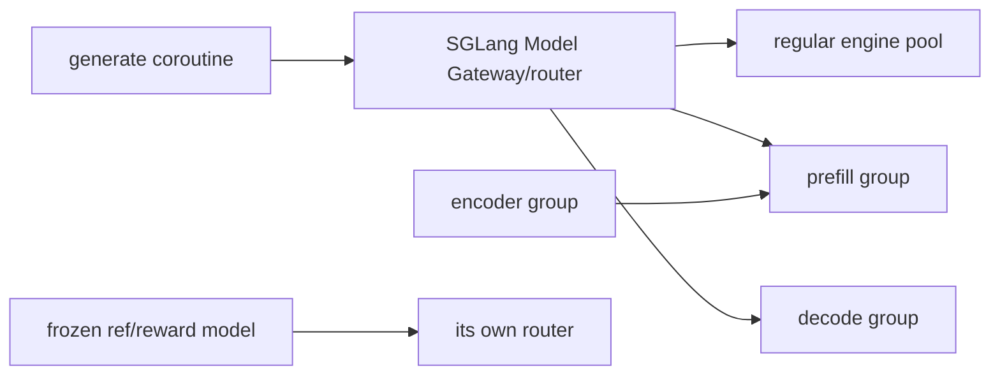

# slime SGLang Rollout Engine 与生成管线实现分析

> **源码基线**：slime `main@681b3adca54105d5ecd3fb822fa0dc58a427e0f9`
> **核验日期**：2026-08-18 · **系列**：[[slime/index]]
> **结论先行**：slime 的 rollout 不是一个 `model.generate()` 调用，而是三层并发：SGLang server/router 在引擎内批处理，请求层用全局 semaphore 限流，rollout 层按 first-completed 补采并执行 reward/admission。partial、streaming 和 fully-async 都复用同一 `Sample`/RM 契约，但分别改变“中途状态何时落盘”和“producer 是否跨轮存活”。

## 1. Serving 拓扑：router 与 engine group

每个 `ModelConfig` 有独立 router；一个模型可包含 regular、prefill、decode、encoder、placeholder groups，各 group 可覆盖 TP/PP/EP/MoE-DP 等 SGLang 参数。[`sglang_config.py:11-41`](https://github.com/THUDM/slime/blob/681b3adca54105d5ecd3fb822fa0dc58a427e0f9/slime/backends/sglang_utils/sglang_config.py#L11-L41) [`rollout.py:176-186`](https://github.com/THUDM/slime/blob/681b3adca54105d5ecd3fb822fa0dc58a427e0f9/slime/ray/rollout.py#L176-L186)

启动时非 EPD groups 可并行 init；EPD 必须先同步启动 encoder、收集 URLs，再注入 language-only prefill/regular groups。[`rollout.py:1132-1258`](https://github.com/THUDM/slime/blob/681b3adca54105d5ecd3fb822fa0dc58a427e0f9/slime/ray/rollout.py#L1132-L1258) 最终 `args.sglang_model_routers` 暴露 model name→router 地址，custom rollout 可按模型路由。[`rollout.py:1260-1269`](https://github.com/THUDM/slime/blob/681b3adca54105d5ecd3fb822fa0dc58a427e0f9/slime/ray/rollout.py#L1260-L1269)

## 2. `GenerateState`：一次进程内的 rollout runtime

singleton state 持有 tokenizer/processor、sampling params、全局 semaphore、deterministic group seeds、SGLang DP rank 负载计数，以及当前轮 pending tasks/abort flag。[`sglang_rollout.py:83-149`](https://github.com/THUDM/slime/blob/681b3adca54105d5ecd3fb822fa0dc58a427e0f9/slime/rollout/sglang_rollout.py#L83-L149)

semaphore 容量为：

$$
C_{\mathrm{request}}=C_{\mathrm{server}}\times N_{\mathrm{engine}}.
$$

它限制同时占用 HTTP generate 的 samples；这与 SGLang 自己的 continuous batching 并不冲突，而是防止客户端无限提交导致排队、内存和超时失控。SGLang DP rank context 每次挑当前计数最小的 rank，随机打破并列，退出时归还计数。[`sglang_rollout.py:94-129`](https://github.com/THUDM/slime/blob/681b3adca54105d5ecd3fb822fa0dc58a427e0f9/slime/rollout/sglang_rollout.py#L94-L129)

## 3. 单 sample 请求路径

`generate()` 的顺序：

1. 由 tokenizer/processor 准备 prompt ids，多模态时保存训练所需 processor tensors；
2. continuation 将 `max_new_tokens` 减去已有 response length；
3. 请求 `return_logprob`，按需请求 top-p nucleus ids 和 routed experts；
4. session id + consistent hashing 时写 router header；
5. HTTP 返回后统一调用 `append_response_tokens`，写入 tokens/text/logprob/meta/version/status。

证据见 [`sglang_rollout.py:42-80`](https://github.com/THUDM/slime/blob/681b3adca54105d5ecd3fb822fa0dc58a427e0f9/slime/rollout/sglang_rollout.py#L42-L80) 与 [`sglang_rollout.py:152-221`](https://github.com/THUDM/slime/blob/681b3adca54105d5ecd3fb822fa0dc58a427e0f9/slime/rollout/sglang_rollout.py#L152-L221)。

这条路径故意保存 behavior logprob，而不是只保存 response：PPO/TIS/mismatch/top-p replay 都需要知道实际采样分布。

### 3.1 为什么 rollout logprob 不是 `[B,S,V]`

SGLang HTTP meta 的 `output_token_logprobs` 逐 token 返回 `(selected_logprob, selected_token_id, ...)`；slime 只抽取每个已生成 token 的 id 和对应标量 logprob，再 append 到 Sample。[`sglang_rollout.py:202-219`](https://github.com/THUDM/slime/blob/681b3adca54105d5ecd3fb822fa0dc58a427e0f9/slime/rollout/sglang_rollout.py#L202-L219) 因而单条持久化 shape 是 `[response_length]`，batch 是 ragged 的 `list[Tensor[R_i]]`，没有词表维 $V$。

例如 $B=512$、每条 response 为 $4096$ token 时，float32 selected-token logprob 约为 $512\times4096\times4=8\ \mathrm{MiB}$；若错误地按 $V=150000$ 的全量 float32 logits 保存，则约为 $1.26\ \mathrm{TB}$。后者既不经 HTTP 返回，也不进入 Sample。PPO/GRPO 的 ratio 只需要已执行 action 的 $\log\pi(a_t\mid s_t)$，不需要保存所有未选 token 的概率。

训练时为了求当前 policy logprob，Megatron 确实会短暂 materialize 当前 micro-batch 的 vocab-parallel logits，但它是 TP-sharded、可按 token chunk 计算并最终约化为 `[T]` selected-token logprob；详见 [[14_slime_megatron_training_analysis]]。

## 4. Group、reward 与 custom generation

`generate_and_rm` 在 semaphore 内选择 per-sample `generate_function_path` 或全局 custom generate；生成后执行 sample hooks，再根据 `group_rm` 决定 per-sample RM 还是等组齐后 batched/group RM。[`sglang_rollout.py:225-289`](https://github.com/THUDM/slime/blob/681b3adca54105d5ecd3fb822fa0dc58a427e0f9/slime/rollout/sglang_rollout.py#L225-L289)

这里的“rollout 返回 reward”是 **Slime rollout 子系统的最终 Sample 带 reward**，不是 SGLang `/generate` 自己做了奖励推理。默认路径先生成，再执行 hooks；只有 Sample 的 reward 仍为空时才调用 `async_rm`，custom generate 因而可以预先填 reward。[`sglang_rollout.py:244-289`](https://github.com/THUDM/slime/blob/681b3adca54105d5ecd3fb822fa0dc58a427e0f9/slime/rollout/sglang_rollout.py#L244-L289)

RM 来源可以是远程 reward service、自定义函数，或 math/DAPO/DeepScaler/F1/GPQA/IFBench 等内置 rule/verifier；`group_rm` 则把整组交给 batched RM。[`rm_hub/__init__.py:34-109`](https://github.com/THUDM/slime/blob/681b3adca54105d5ecd3fb822fa0dc58a427e0f9/slime/rollout/rm_hub/__init__.py#L34-L109) `Sample.reward` 允许 scalar 或 dict，`reward_key` 从 dict 选择进入训练的标量。[`types.py:118-128`](https://github.com/THUDM/slime/blob/681b3adca54105d5ecd3fb822fa0dc58a427e0f9/slime/utils/types.py#L118-L128) [`types.py:246-247`](https://github.com/THUDM/slime/blob/681b3adca54105d5ecd3fb822fa0dc58a427e0f9/slime/utils/types.py#L246-L247)

格式奖、正确性/verifier 奖、工具调用奖等**不会被核心框架自动发现并求和**。需要在 custom/remote/group RM 内明确组合成 scalar，或返回 dict 后用 `reward_key` 选主目标，再按需用 custom reward postprocess 改写。官方示例中 Search-R1 把格式、检索和答案正确性合成一个分数，ReTool 则先调用数学 verifier，再按工具调用次数修正其中的 `score`。[`qa_em_format.py:156-208`](https://github.com/THUDM/slime/blob/681b3adca54105d5ecd3fb822fa0dc58a427e0f9/examples/search-r1/qa_em_format.py#L156-L208) [`generate_with_retool.py:407-432`](https://github.com/THUDM/slime/blob/681b3adca54105d5ecd3fb822fa0dc58a427e0f9/examples/retool/generate_with_retool.py#L407-L432)

组函数给每个 sample 分配 session id，确定性推理时给组内第 i 个样本固定 seed；custom generate 可返回一个 Sample 或 `list[Sample]`，所以同一 group 可以变成 agent fanout 的嵌套 shape。[`sglang_rollout.py:297-336`](https://github.com/THUDM/slime/blob/681b3adca54105d5ecd3fb822fa0dc58a427e0f9/slime/rollout/sglang_rollout.py#L297-L336)

## 5. First-completed、oversampling 与动态过滤

外层 `generate_rollout_async` 并不是一次性 `gather` 全部请求：它持续让 `remaining_batch_size` 至少覆盖目标 accepted groups，等待 `FIRST_COMPLETED`，每完成一组就执行 dynamic filter，丢弃则继续补采，保留则计入 data。[`sglang_rollout.py:374-444`](https://github.com/THUDM/slime/blob/681b3adca54105d5ecd3fb822fa0dc58a427e0f9/slime/rollout/sglang_rollout.py#L374-L444)

### 5.1 三个数量分别数什么

设 `--rollout-batch-size B`、`--n-samples-per-prompt K`、`--over-sampling-batch-size M`：

- $B$ 是最终 accepted prompt groups 数，决定本轮必须留下多少题；
- $K$ 是每组 response 数，决定每题有多少条候选轨迹；
- $M$ 是每次 DataSource 取 prompt groups 并提交生成的补采粒度，不是最终训练 batch，也不是 response 数。

参数后处理令 $M$ 默认等于 $B$，并强制 $M\ge B$。[`arguments.py:1977-1983`](https://github.com/THUDM/slime/blob/681b3adca54105d5ecd3fb822fa0dc58a427e0f9/slime/utils/arguments.py#L1977-L1983) 每次调用 `data_source(M)` 后，DataSource 才把每个 prompt 扩成 $K$ 个 samples，因此一波提交的是 $M$ 组、最多 $M\times K$ 条 response tasks。[`data_source.py:90-118`](https://github.com/THUDM/slime/blob/681b3adca54105d5ecd3fb822fa0dc58a427e0f9/slime/rollout/data_source.py#L90-L118) [`sglang_rollout.py:400-414`](https://github.com/THUDM/slime/blob/681b3adca54105d5ecd3fb822fa0dc58a427e0f9/slime/rollout/sglang_rollout.py#L400-L414)

例如 $B=32$、$K=8$、$M=64$，一波最多提交 512 条 response；若 group filter 通过率约 50%，期望从 64 组中留下 32 组，即 256 条 response 进入训练。$M>B$ 的价值是提前准备“会被 filter 丢弃或尚未完成”的候选容量，减少再次取 prompt、重新发请求和等待新一轮尾延迟；代价是通过率高时会多做生成/RM，凑齐 $B$ 后未完成请求还会被 abort。

### 5.2 filter 判断的是生成后的 group，不是生成前的 prompt

`--dynamic-sampling-filter-path` 在 group 的 $K$ 条 response 全部生成并完成 reward 后才被调用。内置 `check_reward_nonzero_std` 读取组内 rewards，只保留标准差大于 `1e-6` 的组：全对或全错时，组内相对 reward 全相同，GRPO 的相对优势没有区分度；保留这类组通常只消耗训练算力。[`sglang_rollout.py:413-436`](https://github.com/THUDM/slime/blob/681b3adca54105d5ecd3fb822fa0dc58a427e0f9/slime/rollout/sglang_rollout.py#L413-L436) [`dynamic_sampling_filters.py:9-15`](https://github.com/THUDM/slime/blob/681b3adca54105d5ecd3fb822fa0dc58a427e0f9/slime/rollout/filter_hub/dynamic_sampling_filters.py#L9-L15)

filter 的标准返回值包含：

| 字段 | 语义 |
|---|---|
| `keep` | 是否接受整组进入最终 $B$ 组训练数据 |
| `reason` | 丢弃原因；进入 `rollout/dynamic_filter/drop_*` 指标 |
| `keep_when_insufficient` | 原本拒绝，但若剩余候选已不足以凑齐 $B$，则兜底保留 |

fallback 版本把最后一项设为 true。严格 filter 优先保证数据有学习信号，却可能反复补采；fallback 优先避免再起一波采样，却会让少量零方差组进入训练。这是明确的“数据质量—rollout 延迟/成本”交换，而不是两个等价实现。[`base_types.py:5-37`](https://github.com/THUDM/slime/blob/681b3adca54105d5ecd3fb822fa0dc58a427e0f9/slime/rollout/filter_hub/base_types.py#L5-L37) [`dynamic_sampling_filters.py:18-23`](https://github.com/THUDM/slime/blob/681b3adca54105d5ecd3fb822fa0dc58a427e0f9/slime/rollout/filter_hub/dynamic_sampling_filters.py#L18-L23)

这套设计同时实现两个目标：

- 不让最慢 group 阻塞已完成 group 的 admission；
- DAPO 类 filter 丢弃 all-correct/all-wrong group 后仍能凑齐固定训练 batch。

但吞吐必须按 attempted→accepted 计算。动态过滤提升信息密度，却可能增加生成 token 总成本并改变训练 prompt 分布；[[30_slime_rollout_optimization_analysis]] 专门分析这一点。

## 6. Partial rollout 与 streaming

凑齐目标后，普通路径 abort 仍在飞的请求。`partial_rollout` 会等待 pending tasks 收敛，把已有 response 的 group 标记 `start_rollout_id` 后交回 DataSource；下轮 continuation 会扣除已有 response length。[`sglang_rollout.py:339-371`](https://github.com/THUDM/slime/blob/681b3adca54105d5ecd3fb822fa0dc58a427e0f9/slime/rollout/sglang_rollout.py#L339-L371) [`sglang_rollout.py:152-173`](https://github.com/THUDM/slime/blob/681b3adca54105d5ecd3fb822fa0dc58a427e0f9/slime/rollout/sglang_rollout.py#L152-L173)

如果 partial trajectory 跨过权重更新，旧段是 off-policy。`mask_offpolicy_in_partial_rollout` 在续写前把已有 response mask 清零，只训练新段。[`sglang_rollout.py:225-240`](https://github.com/THUDM/slime/blob/681b3adca54105d5ecd3fb822fa0dc58a427e0f9/slime/rollout/sglang_rollout.py#L225-L240)

普通 HTTP 返回只在最终 JSON 写入 Sample；streaming 版本消费 SSE 的累计 chunks，每个 chunk 都从 base snapshot 重建 Sample 并 append 当前累计输出，所以中途 abort 时最后观察到的 tokens/logprobs/text 已经存在。[`sglang_streaming_rollout.py:1-24`](https://github.com/THUDM/slime/blob/681b3adca54105d5ecd3fb822fa0dc58a427e0f9/slime/rollout/sglang_streaming_rollout.py#L1-L24) [`sglang_streaming_rollout.py:93-167`](https://github.com/THUDM/slime/blob/681b3adca54105d5ecd3fb822fa0dc58a427e0f9/slime/rollout/sglang_streaming_rollout.py#L93-L167)

## 7. Fully-async worker：跨 rollout 调用保温

fully-async 不是替换 SGLang engine，而是在客户端建立进程级 singleton：后台 thread + asyncio loop 持续从 DataSource 取 group、调用同一 `generate_and_rm_group`，完成 group 进入 output queue，ABORTED group 放回 buffer。[`fully_async_rollout.py:48-78`](https://github.com/THUDM/slime/blob/681b3adca54105d5ecd3fb822fa0dc58a427e0f9/slime/rollout/fully_async_rollout.py#L48-L78) [`fully_async_rollout.py:186-208`](https://github.com/THUDM/slime/blob/681b3adca54105d5ecd3fb822fa0dc58a427e0f9/slime/rollout/fully_async_rollout.py#L186-L208)

output queue 物理上故意无界，因为 callback 在 event-loop thread，bounded blocking put 会冻结所有 in-flight tasks；逻辑 backpressure 位于 producer top-up：当已完成 queue 达到一个完整并发池时停止取新 prompt。[`fully_async_rollout.py:80-90`](https://github.com/THUDM/slime/blob/681b3adca54105d5ecd3fb822fa0dc58a427e0f9/slime/rollout/fully_async_rollout.py#L80-L90) [`fully_async_rollout.py:131-174`](https://github.com/THUDM/slime/blob/681b3adca54105d5ecd3fb822fa0dc58a427e0f9/slime/rollout/fully_async_rollout.py#L131-L174)

每轮只 drain 尚缺的 group，surplus 留给下一轮，返回前按 sample index 排序；因此 queue warm 是明确的数据保留契约，不是“多生成再丢掉”。[`fully_async_rollout.py:211-266`](https://github.com/THUDM/slime/blob/681b3adca54105d5ecd3fb822fa0dc58a427e0f9/slime/rollout/fully_async_rollout.py#L211-L266)

## 8. 三种 async 不要混淆

| 机制 | 并发边界 | 是否跨训练轮存活 | policy freshness 影响 |
|---|---|---|---|
| request coroutine | 单次 rollout 内 | 否 | 同一外层 snapshot |
| `train_async.py` | rollout N+1 与 train N | future 跨阶段 | 一拍 policy lag；提交前 barrier |
| fully-async worker | producer queue 跨 rollout 调用 | 是 | surplus 可能更旧，需 version/TIS 管理 |

## 9. 当前边界

- fully-async entry 明确不支持 evaluation。[`fully_async_rollout.py:269-274`](https://github.com/THUDM/slime/blob/681b3adca54105d5ecd3fb822fa0dc58a427e0f9/slime/rollout/fully_async_rollout.py#L269-L274)
- 多模型 serving 已支持，但训练权重只更新第一个 updatable model。[`rollout.py:555-584`](https://github.com/THUDM/slime/blob/681b3adca54105d5ecd3fb822fa0dc58a427e0f9/slime/ray/rollout.py#L555-L584)
- buffer 默认 FIFO，没有版本 admission 或最大 staleness budget；fully async 的长期稳定运行需要在 DataSource/filter 或 loss correction 层补充策略。

## Related Pages

- [[12_slime_sample_datasource_analysis]] — partial/fully async 回收的数据契约
- [[19_slime_rollout_backend_extension_analysis]] — 区分 custom rollout、external SGLang 与完整 backend 替换
- [[17_slime_train_inference_consistency_analysis]] — behavior logprob、version、top-p/routing replay
- [[30_slime_rollout_optimization_analysis]] — 吞吐机制、有效样本成本和调参顺序
- [[31_slime_posttraining_stability_analysis]] — async selection/freshness 的稳定性边界
