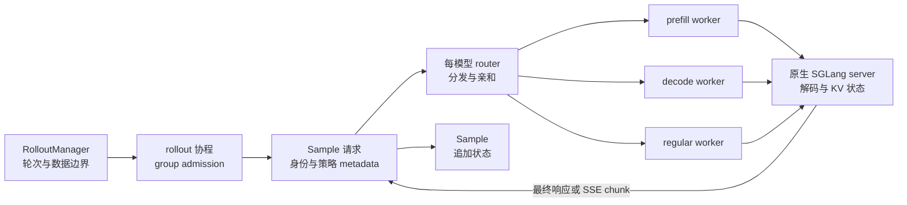

# slime SGLang Rollout Engine：把解码 server 化，把轨迹状态留在请求层

> **源码基线**：slime `main@681b3adca54105d5ecd3fb822fa0dc58a427e0f9`
> **项目文档基线**：同一提交下 `docs/en/{blogs/introducing_slime,get_started/usage}.md`
> **核验日期**：2026-08-18 · **系列**：[[02_engineering/04_posttrain_frameworks/slime/index|slime 源码分析]]
> **结论先行**：rollout 的核心矛盾不是“怎样调用一次 `generate`”，而是怎样让大量请求交给高吞吐推理引擎并发执行，同时仍在 slime 一侧保住 Sample 身份、行为策略 metadata、partial 前缀、取消结果和恢复边界。slime 的选择是把 SGLang 作为独立 HTTP 服务运行：router 与原生 server 负责请求分发和 token decoding，`RolloutManager` 与请求协程负责 rollout 语义和 admission。代价是多了一层 HTTP、进程生命周期和跨层状态协议，但避免把逐 token 调度、KV 状态和原生 SGLang 能力重新搬进一个中心 Python scheduler。

本文只分析 rollout 请求状态和 serving 数据面。`Sample` 字段、DataSource 回收语义以 [[12_slime_sample_datasource_analysis]] 为权威页；Ray placement、`RolloutServer`/`ServerGroup`/engine 的对象所有权以 [[11_slime_ray_control_plane_analysis]] 为权威页。下文把源码事实写成 fixed-commit 定位符，把动机与替代方案明确标为“设计分析”。

## 1. 并发 serving 真正要守住什么

高并发生成同时受五个约束：

1. **吞吐约束**：一次 rollout 会并发提交多个 prompt group，每组又有多条 Sample；客户端还要限制同时占用 `/generate` 的请求数。`GenerateState` 用 semaphore、pending task 集合和 per-DP-rank 计数保存这一轮的并发状态。[`sglang_rollout.py:83-149`](https://github.com/THUDM/slime/blob/681b3adca54105d5ecd3fb822fa0dc58a427e0f9/slime/rollout/sglang_rollout.py#L83-L149)
2. **身份约束**：DataSource 已为 Sample 分配 group/sample 身份；请求层再为组内每条 Sample 分配稳定 `session_id`，consistent-hashing router 可用它维持多轮路由亲和。[`data_source.py:90-118`](https://github.com/THUDM/slime/blob/681b3adca54105d5ecd3fb822fa0dc58a427e0f9/slime/rollout/data_source.py#L90-L118) [`sglang_rollout.py:297-325`](https://github.com/THUDM/slime/blob/681b3adca54105d5ecd3fb822fa0dc58a427e0f9/slime/rollout/sglang_rollout.py#L297-L325)
3. **策略证据约束**：请求不能只拿回文本；默认 payload 要求 selected-token logprob，按需要求 top-p nucleus 与 routed-expert metadata，返回后统一追加进 Sample。[`sglang_rollout.py:175-219`](https://github.com/THUDM/slime/blob/681b3adca54105d5ecd3fb822fa0dc58a427e0f9/slime/rollout/sglang_rollout.py#L175-L219)
4. **可取消约束**：动态采样一旦凑齐训练 batch，剩余长尾请求必须停止；但“发过 abort”不等于服务已空闲，控制面还要等 server load 归零并收敛本地 pending tasks。[`server_control.py:32-67`](https://github.com/THUDM/slime/blob/681b3adca54105d5ecd3fb822fa0dc58a427e0f9/slime/backends/sglang_utils/server_control.py#L32-L67) [`sglang_rollout.py:339-371`](https://github.com/THUDM/slime/blob/681b3adca54105d5ecd3fb822fa0dc58a427e0f9/slime/rollout/sglang_rollout.py#L339-L371)
5. **可恢复约束**：engine 故障与请求中断是两个故障域。health monitor 只负责检查、关闭并 kill actor，再把 engine 槽位置为 `None`；后续重建由训练侧权重更新依次调用 `RolloutManager.recover_updatable_engines` 和 `RolloutServer.recover` 完成。partial rollout 则把已观测到的 Sample 前缀交回 DataSource。两者不能由一个“全局重试”模糊处理。[`health_monitor.py:145-177`](https://github.com/THUDM/slime/blob/681b3adca54105d5ecd3fb822fa0dc58a427e0f9/slime/utils/health_monitor.py#L145-L177) [`actor.py:596-608`](https://github.com/THUDM/slime/blob/681b3adca54105d5ecd3fb822fa0dc58a427e0f9/slime/backends/megatron_utils/actor.py#L596-L608) [`rollout.py:641-652`](https://github.com/THUDM/slime/blob/681b3adca54105d5ecd3fb822fa0dc58a427e0f9/slime/ray/rollout.py#L641-L652) [`rollout.py:384-425`](https://github.com/THUDM/slime/blob/681b3adca54105d5ecd3fb822fa0dc58a427e0f9/slime/ray/rollout.py#L384-L425) [`sglang_rollout.py:627-649`](https://github.com/THUDM/slime/blob/681b3adca54105d5ecd3fb822fa0dc58a427e0f9/slime/rollout/sglang_rollout.py#L627-L649)

默认客户端并发上限是：

$$
C_{\mathrm{client}}=C_{\mathrm{server}}N_{\mathrm{engine}},
$$

其中 $C_{\mathrm{server}}$ 是 `sglang_server_concurrency`，$N_{\mathrm{engine}}$ 由 rollout engine 数得到。[`sglang_rollout.py:88-105`](https://github.com/THUDM/slime/blob/681b3adca54105d5ecd3fb822fa0dc58a427e0f9/slime/rollout/sglang_rollout.py#L88-L105) [`http_utils.py:201-210`](https://github.com/THUDM/slime/blob/681b3adca54105d5ecd3fb822fa0dc58a427e0f9/slime/utils/http_utils.py#L201-L210) 这个 semaphore 只是客户端 admission 上限，不是 SGLang 内部 batch scheduler，也不按 token 长度或 KV 占用估算容量。

## 2. 为什么 engine 必须是服务，而不是进程内循环

这不是概念图硬套源码：`SGLangEngine` Ray actor 实际 spawn 原生 SGLang HTTP server process，等待 `/health_generate` 可用，再把 node-0 worker 注册到 router；推理请求则由 rollout 协程直接 POST router 的 `/generate`。[`sglang_engine.py:48-102`](https://github.com/THUDM/slime/blob/681b3adca54105d5ecd3fb822fa0dc58a427e0f9/slime/backends/sglang_utils/sglang_engine.py#L48-L102) [`sglang_engine.py:189-216`](https://github.com/THUDM/slime/blob/681b3adca54105d5ecd3fb822fa0dc58a427e0f9/slime/backends/sglang_utils/sglang_engine.py#L189-L216) [`sglang_rollout.py:152-204`](https://github.com/THUDM/slime/blob/681b3adca54105d5ecd3fb822fa0dc58a427e0f9/slime/rollout/sglang_rollout.py#L152-L204)

> **设计分析：为什么不是进程内 inference loop？**
> 进程内循环会迫使 slime 自己管理 SGLang 的执行线程、KV 生命周期、服务健康与拓扑变体，并把 trainer/rollout 生命周期与推理 runtime 更紧地绑在一起。当前实现只控制 server process、端点和权重/显存操作，实际 token decoding 留给原生 SGLang；项目文档也把“保持 SGLang native、把复杂度留在核心库”写成明确方向。[`sglang_engine.py:218-260`](https://github.com/THUDM/slime/blob/681b3adca54105d5ecd3fb822fa0dc58a427e0f9/slime/backends/sglang_utils/sglang_engine.py#L218-L260) [`docs/en/blogs/introducing_slime.md:71-99`](https://github.com/THUDM/slime/blob/681b3adca54105d5ecd3fb822fa0dc58a427e0f9/docs/en/blogs/introducing_slime.md#L71-L99)

> **设计分析：为什么不是 slime 中央逐 token scheduler？**
> 默认路径对一条 Sample 发一次 HTTP 请求，server 完成解码后返回结果；即使 streaming，也只是消费 server 发出的累计 SSE chunk。源码中没有由 `RolloutManager` 每步取 logits、选 token、再送回 engine 的回路。[`sglang_rollout.py:175-219`](https://github.com/THUDM/slime/blob/681b3adca54105d5ecd3fb822fa0dc58a427e0f9/slime/rollout/sglang_rollout.py#L175-L219) [`sglang_streaming_rollout.py:110-159`](https://github.com/THUDM/slime/blob/681b3adca54105d5ecd3fb822fa0dc58a427e0f9/slime/rollout/sglang_streaming_rollout.py#L110-L159) 由此可推断，server 化避免了把每个 decode step、KV 状态和调度决策经过中心 Python/Ray 对象传输；但 prompt、最终 token metadata 或 SSE chunk 仍经过 HTTP，所以这里不是“零 token transport”，而是**没有中心逐步 token transport**。

## 3. 五层职责：谁调度什么

| 层 | 只负责什么 | 明确不负责什么 | 源码锚点 |
|---|---|---|---|
| `RolloutManager` | 启动服务、持有 DataSource/rollout function、划定一轮 `rollout_id`，完成后转换训练数据 | 不执行 token decoding，也不决定 SGLang 内部 batch | [`rollout.py:465-505`](https://github.com/THUDM/slime/blob/681b3adca54105d5ecd3fb822fa0dc58a427e0f9/slime/ray/rollout.py#L465-L505) [`rollout.py:590-604`](https://github.com/THUDM/slime/blob/681b3adca54105d5ecd3fb822fa0dc58a427e0f9/slime/ray/rollout.py#L590-L604) |
| router | 给每个模型提供单一请求入口，登记 worker，并按 router policy 转发请求 | 不拥有 Sample、reward 或训练 batch | [`rollout.py:1062-1113`](https://github.com/THUDM/slime/blob/681b3adca54105d5ecd3fb822fa0dc58a427e0f9/slime/ray/rollout.py#L1062-L1113) [`sglang_engine.py:194-216`](https://github.com/THUDM/slime/blob/681b3adca54105d5ecd3fb822fa0dc58a427e0f9/slime/backends/sglang_utils/sglang_engine.py#L194-L216) |
| `RolloutServer` | 表示一个模型及其 router，聚合一个或多个 server groups，并标记是否接收训练权重 | 本身不是 HTTP 进程，也不是 Ray actor | [`rollout.py:320-374`](https://github.com/THUDM/slime/blob/681b3adca54105d5ecd3fb822fa0dc58a427e0f9/slime/ray/rollout.py#L320-L374) |
| `ServerGroup` | 聚合同构 worker type、并行配置和故障域；创建 engine actors，并对该组执行 offload/recover | 不跨模型混合身份，不做请求级 admission | [`rollout.py:145-186`](https://github.com/THUDM/slime/blob/681b3adca54105d5ecd3fb822fa0dc58a427e0f9/slime/ray/rollout.py#L145-L186) [`rollout.py:188-317`](https://github.com/THUDM/slime/blob/681b3adca54105d5ecd3fb822fa0dc58a427e0f9/slime/ray/rollout.py#L188-L317) |
| engine/worker | `SGLangEngine` 控制 actor 计算 server args、拉起/注册/停止原生 server；原生 server 执行推理 | 不决定某条 Sample 是否进入训练 | [`sglang_engine.py:105-192`](https://github.com/THUDM/slime/blob/681b3adca54105d5ecd3fb822fa0dc58a427e0f9/slime/backends/sglang_utils/sglang_engine.py#L105-L192) |
| request | group task 为 Sample 建 session；sample task 组装 payload、等待响应、追加 token/metadata，再执行 hook 与 RM | 不拥有 engine 资源与跨轮恢复策略 | [`sglang_rollout.py:225-336`](https://github.com/THUDM/slime/blob/681b3adca54105d5ecd3fb822fa0dc58a427e0f9/slime/rollout/sglang_rollout.py#L225-L336) |

一个模型一个 router，但一个模型可含 `regular`、`prefill`、`decode`、`encoder` 或 `placeholder` groups；多模型时 `start_rollout_servers` 为各模型建立独立 router，并把地址写入 `args.sglang_model_routers`。[`rollout.py:1132-1171`](https://github.com/THUDM/slime/blob/681b3adca54105d5ecd3fb822fa0dc58a427e0f9/slime/ray/rollout.py#L1132-L1171) [`rollout.py:1214-1269`](https://github.com/THUDM/slime/blob/681b3adca54105d5ecd3fb822fa0dc58a427e0f9/slime/ray/rollout.py#L1214-L1269) 这些对象为何分别是普通对象、Ray actor 或进程，见 [[11_slime_ray_control_plane_analysis]]；本页只使用它们解释请求数据面。

## 4. 一条真实请求怎样穿过系统

### 4.1 轮次入口：先创建候选容量，再等待最先完成者

`RolloutManager.generate` 设置当前 `rollout_id` 并调用可替换 rollout function；默认同步 wrapper 进入 `generate_rollout_async`，最后才把 abort 后的 partial groups 放回 DataSource。[`rollout.py:590-604`](https://github.com/THUDM/slime/blob/681b3adca54105d5ecd3fb822fa0dc58a427e0f9/slime/ray/rollout.py#L590-L604) [`sglang_rollout.py:627-649`](https://github.com/THUDM/slime/blob/681b3adca54105d5ecd3fb822fa0dc58a427e0f9/slime/rollout/sglang_rollout.py#L627-L649)

外层循环先从 DataSource 取得 `over_sampling_batch_size` 个 prompt groups，为每组创建一个 `generate_and_rm_group` task；组内再为每条 Sample 创建 `generate_and_rm` task。它不是等待一整波 `gather` 后再筛选，而是对 group tasks 使用 `FIRST_COMPLETED`。[`sglang_rollout.py:131-149`](https://github.com/THUDM/slime/blob/681b3adca54105d5ecd3fb822fa0dc58a427e0f9/slime/rollout/sglang_rollout.py#L131-L149) [`sglang_rollout.py:400-416`](https://github.com/THUDM/slime/blob/681b3adca54105d5ecd3fb822fa0dc58a427e0f9/slime/rollout/sglang_rollout.py#L400-L416)

### 4.2 请求身份与路由亲和

组函数只在 `session_id` 缺失时生成 UUID，因此 partial continuation 会沿用原 id；若 router policy 是 `consistent_hashing`，请求以 `X-SMG-Routing-Key` 传递该 id。[`sglang_rollout.py:312-325`](https://github.com/THUDM/slime/blob/681b3adca54105d5ecd3fb822fa0dc58a427e0f9/slime/rollout/sglang_rollout.py#L312-L325) [`sglang_rollout.py:193-203`](https://github.com/THUDM/slime/blob/681b3adca54105d5ecd3fb822fa0dc58a427e0f9/slime/rollout/sglang_rollout.py#L193-L203) 这层 id 是 serving affinity，不替代 `group_index`、`index` 和 `rollout_id`；三类训练身份的语义见 [[12_slime_sample_datasource_analysis]]。

### 4.3 一次 HTTP 交换携带哪些策略证据

若 Sample 已有 partial 前缀，`_prepare_prompt_ids` 复用完整 `sample.tokens`；请求再从 `max_new_tokens` 扣掉已有 response 长度。普通文本请求发送 `input_ids`，多模态首轮可发送 text 与编码后的 image data；payload 总是要求 logprob，并按 routing replay 开关要求 routed experts。[`sglang_rollout.py:42-61`](https://github.com/THUDM/slime/blob/681b3adca54105d5ecd3fb822fa0dc58a427e0f9/slime/rollout/sglang_rollout.py#L42-L61) [`sglang_rollout.py:164-191`](https://github.com/THUDM/slime/blob/681b3adca54105d5ecd3fb822fa0dc58a427e0f9/slime/rollout/sglang_rollout.py#L164-L191)

响应只提取已选 token id 与对应标量 logprob，然后调用 `append_response_tokens`；后者把 token、mask、logprob、top-p/routing metadata 和终止状态按同一新增 span 校验并追加。[`sglang_rollout.py:202-219`](https://github.com/THUDM/slime/blob/681b3adca54105d5ecd3fb822fa0dc58a427e0f9/slime/rollout/sglang_rollout.py#L202-L219) [`types.py:253-314`](https://github.com/THUDM/slime/blob/681b3adca54105d5ecd3fb822fa0dc58a427e0f9/slime/utils/types.py#L253-L314) [`types.py:397-443`](https://github.com/THUDM/slime/blob/681b3adca54105d5ecd3fb822fa0dc58a427e0f9/slime/utils/types.py#L397-L443) 这解释了为何请求层不能只返回字符串：训练侧所需的是“动作及其 behavior evidence”，而不是文本副作用。

### 4.4 group 完成后才做 admission

每条 Sample 在 semaphore 内完成 generation，随后在 semaphore 外执行 hooks 与 per-sample RM；group RM 则等组内 tasks 全部结束后执行。[`sglang_rollout.py:242-289`](https://github.com/THUDM/slime/blob/681b3adca54105d5ecd3fb822fa0dc58a427e0f9/slime/rollout/sglang_rollout.py#L242-L289) [`sglang_rollout.py:327-336`](https://github.com/THUDM/slime/blob/681b3adca54105d5ecd3fb822fa0dc58a427e0f9/slime/rollout/sglang_rollout.py#L327-L336) 因而 dynamic filter 判断的是“已生成且已有 reward 的完整 group”，不是预先过滤 prompt。

每个 first-completed group 都进入 `all_data`，filter 可接受、拒绝或在候选不足时兜底接受；拒绝会减少剩余候选容量，外层循环据此继续补采，直到保留 `rollout_batch_size` 个 groups。[`sglang_rollout.py:413-443`](https://github.com/THUDM/slime/blob/681b3adca54105d5ecd3fb822fa0dc58a427e0f9/slime/rollout/sglang_rollout.py#L413-L443) [`base_types.py:5-37`](https://github.com/THUDM/slime/blob/681b3adca54105d5ecd3fb822fa0dc58a427e0f9/slime/rollout/filter_hub/base_types.py#L5-L37)

> **设计分析**：first-completed 把 admission 从“整批 barrier”改成“group 完成事件”，使长尾 group 不阻塞已完成 group；oversampling 则用额外生成成本换取动态过滤后的固定训练 batch。它仍保持 group 原子性，因为 reward/filter 可能依赖同 prompt 的全部候选。

## 5. Partial、streaming 与 abort 是一套状态协议

凑齐目标 group 后，外层循环无条件调用 `abort`。取消不是单个 asyncio task 的本地操作，而是：从默认 router 查询全部 workers → 对每个 worker 调 `/abort_request` 且 `abort_all=True` → 查询 `/v1/loads` 直到请求数归零 → 等待所有本地 group tasks 返回。[`sglang_rollout.py:339-355`](https://github.com/THUDM/slime/blob/681b3adca54105d5ecd3fb822fa0dc58a427e0f9/slime/rollout/sglang_rollout.py#L339-L355) [`server_control.py:32-67`](https://github.com/THUDM/slime/blob/681b3adca54105d5ecd3fb822fa0dc58a427e0f9/slime/backends/sglang_utils/server_control.py#L32-L67)

这条路径必须“排空”而不只“发信号”，因为下一阶段可能 offload、更新权重或开始下一轮；若旧请求仍在 engine 内执行，就会跨越服务生命周期边界。源码对 abort 后轮询 load 的做法直接实现了这个不变量。[`server_control.py:43-63`](https://github.com/THUDM/slime/blob/681b3adca54105d5ecd3fb822fa0dc58a427e0f9/slime/backends/sglang_utils/server_control.py#L43-L63)

### 5.1 非流式 partial：以 server 最终返回为提交点

普通请求等待最终 JSON，收到后一次性 append。若开启 partial rollout，abort 会收集 pending task 返回的整组结果；它只给其中已有 response 且尚无记录的 Sample 写入 `start_rollout_id`，但不会按 response 过滤 group，而是把整个 group 加入 `aborted_samples`。同步 wrapper 随后把这些 groups 交给 DataSource，buffer 也按整组追加。[`sglang_rollout.py:202-219`](https://github.com/THUDM/slime/blob/681b3adca54105d5ecd3fb822fa0dc58a427e0f9/slime/rollout/sglang_rollout.py#L202-L219) [`sglang_rollout.py:359-365`](https://github.com/THUDM/slime/blob/681b3adca54105d5ecd3fb822fa0dc58a427e0f9/slime/rollout/sglang_rollout.py#L359-L365) [`sglang_rollout.py:646-649`](https://github.com/THUDM/slime/blob/681b3adca54105d5ecd3fb822fa0dc58a427e0f9/slime/rollout/sglang_rollout.py#L646-L649) [`data_source.py:198-211`](https://github.com/THUDM/slime/blob/681b3adca54105d5ecd3fb822fa0dc58a427e0f9/slime/rollout/data_source.py#L198-L211)

下轮请求复用已有 `sample.tokens` 并只请求剩余 token 数；是否把旧 policy span 的 loss mask 清零由 `mask_offpolicy_in_partial_rollout` 决定。[`sglang_rollout.py:42-61`](https://github.com/THUDM/slime/blob/681b3adca54105d5ecd3fb822fa0dc58a427e0f9/slime/rollout/sglang_rollout.py#L42-L61) [`sglang_rollout.py:225-240`](https://github.com/THUDM/slime/blob/681b3adca54105d5ecd3fb822fa0dc58a427e0f9/slime/rollout/sglang_rollout.py#L225-L240) 旧、新 span 如何合并属于 Sample 契约，见 [[12_slime_sample_datasource_analysis]]。

### 5.2 流式 partial：以最后观察到的 SSE chunk 为提交点

streaming 版本只替换内层 HTTP 调用，外层 semaphore、group admission、abort 和 buffer handoff 仍复用默认路径。[`sglang_streaming_rollout.py:1-24`](https://github.com/THUDM/slime/blob/681b3adca54105d5ecd3fb822fa0dc58a427e0f9/slime/rollout/sglang_streaming_rollout.py#L1-L24) 它先快照调用前 Sample；由于当前 SSE 输出在单次调用内是累计值，每个 chunk 都把 Sample 重建为“旧前缀 + 当前累计 chunk”，再调用统一 append，避免把前一 chunk 重复追加。[`sglang_streaming_rollout.py:93-156`](https://github.com/THUDM/slime/blob/681b3adca54105d5ecd3fb822fa0dc58a427e0f9/slime/rollout/sglang_streaming_rollout.py#L93-L156)

当全局 abort flag 出现时，stream reader 在最后已观测 chunk 处退出；若尚无终止原因则把 Sample 标为 `ABORTED`。[`sglang_streaming_rollout.py:158-167`](https://github.com/THUDM/slime/blob/681b3adca54105d5ecd3fb822fa0dc58a427e0f9/slime/rollout/sglang_streaming_rollout.py#L158-L167) 因而 streaming 的价值不只是“早显示文本”，而是把 partial durability 从“等待 server 最终 abort 响应”提前到“每个已消费 chunk”。

## 6. 健康检查与恢复：重建 engine，不伪装成请求重放

`RolloutManager` 为每个 local server group 创建一个 monitor；monitor 启动时暂停，`generate/eval` 开始时 resume，rollout offload 时 pause，避免把已释放显存的 engine 判成故障。[`rollout.py:508-515`](https://github.com/THUDM/slime/blob/681b3adca54105d5ecd3fb822fa0dc58a427e0f9/slime/ray/rollout.py#L508-L515) [`rollout.py:590-625`](https://github.com/THUDM/slime/blob/681b3adca54105d5ecd3fb822fa0dc58a427e0f9/slime/ray/rollout.py#L590-L625) [`health_monitor.py:10-20`](https://github.com/THUDM/slime/blob/681b3adca54105d5ecd3fb822fa0dc58a427e0f9/slime/utils/health_monitor.py#L10-L20)

monitor 对 node-0 engine 调 `/health_generate`；超时或异常时，它关闭并 kill 组成同一个多节点 engine 的全部 actor，并把对应 `all_engines` 槽位置为 `None`。[`health_monitor.py:137-177`](https://github.com/THUDM/slime/blob/681b3adca54105d5ecd3fb822fa0dc58a427e0f9/slime/utils/health_monitor.py#L137-L177) 这里的恢复单位是 engine，而不是单个 Ray actor，也不是整个 rollout 集群。

真正重建发生在下一次训练侧权重更新前：actor 先调用 `recover_updatable_engines`，Manager 暂停 health monitor，`RolloutServer.recover` 只为 `None` 槽重建 actors/server processes；随后权重更新流程取得新 engine handles 并继续同步。[`actor.py:591-608`](https://github.com/THUDM/slime/blob/681b3adca54105d5ecd3fb822fa0dc58a427e0f9/slime/backends/megatron_utils/actor.py#L591-L608) [`rollout.py:641-652`](https://github.com/THUDM/slime/blob/681b3adca54105d5ecd3fb822fa0dc58a427e0f9/slime/ray/rollout.py#L641-L652) [`rollout.py:384-425`](https://github.com/THUDM/slime/blob/681b3adca54105d5ecd3fb822fa0dc58a427e0f9/slime/ray/rollout.py#L384-L425)

> **设计分析**：这条链只恢复 serving capacity 与下一版权重，不自动重放故障时的请求。可回收请求必须已经以 partial Sample 进入 DataSource；进程级故障若来不及产出可用响应，则由更上层的数据补采/重试策略承担。把 engine restart 与 Sample replay 分开，避免“服务恢复成功”被误当成“轨迹已恢复”。更完整的故障域划分见 [[18_slime_fault_tolerance_observability_analysis]]。

external rollout engine 是明确边界：其 `recover()` 只记录“不支持 fault tolerance”，生命周期属于外部部署系统。[`external.py:150-170`](https://github.com/THUDM/slime/blob/681b3adca54105d5ecd3fb822fa0dc58a427e0f9/slime/backends/sglang_utils/external.py#L150-L170)

## 7. 原生能力透传：薄适配，而不是最低公分母 engine API

slime 没有手写一份固定的 SGLang 参数子集。router 侧直接调用 `RouterArgs.add_cli_args` 并加 `router` 前缀；server 侧临时包装 argparse，把 `ServerArgs.add_cli_args` 暴露的参数统一改写为 `--sglang-*`，只跳过由 slime 生命周期与拓扑负责的字段。[`arguments.py:8-44`](https://github.com/THUDM/slime/blob/681b3adca54105d5ecd3fb822fa0dc58a427e0f9/slime/backends/sglang_utils/arguments.py#L8-L44) [`arguments.py:46-118`](https://github.com/THUDM/slime/blob/681b3adca54105d5ecd3fb822fa0dc58a427e0f9/slime/backends/sglang_utils/arguments.py#L46-L118)

启动 engine 时，`_compute_server_args` 遍历当前 SGLang `ServerArgs` dataclass 字段，把存在的 `args.sglang_*` 填入 native args；per-group YAML overrides 最后覆盖基础值，当前版本不存在的键会被记录并丢弃。[`sglang_engine.py:592-636`](https://github.com/THUDM/slime/blob/681b3adca54105d5ecd3fb822fa0dc58a427e0f9/slime/backends/sglang_utils/sglang_engine.py#L592-L636) 这是一种**受控透传**，不是无条件透传：model path、端口、rank、TP 和 memory saver 等关键项由 slime 计算或保留，PD/EPD worker 也会注入专用参数。[`sglang_engine.py:523-587`](https://github.com/THUDM/slime/blob/681b3adca54105d5ecd3fb822fa0dc58a427e0f9/slime/backends/sglang_utils/sglang_engine.py#L523-L587)

> **设计分析**：若定义一个最低公分母 `InferenceEngine.generate()` 抽象，SGLang 新 router policy、并行参数、PD/EPD 或 metadata endpoint 都要先在 slime 抽象层重新建模。当前做法把稳定边界放在 HTTP 请求、server lifecycle 与 Sample append 上，原生能力尽量通过 `RouterArgs`、`ServerArgs`、配置 overrides 和自定义 generate 透出；代价是 slime 会直接依赖 SGLang 参数字段和端点兼容性。

## 8. 边界、代价与常见误读

| 误读或边界 | 固定基线的实际行为 |
|---|---|
| router 是 rollout scheduler 的全部 | router 管 worker 注册与请求转发；group admission、dynamic filter、RM 和 partial 回收仍在 slime 请求层。[`sglang_engine.py:194-216`](https://github.com/THUDM/slime/blob/681b3adca54105d5ecd3fb822fa0dc58a427e0f9/slime/backends/sglang_utils/sglang_engine.py#L194-L216) [`sglang_rollout.py:374-470`](https://github.com/THUDM/slime/blob/681b3adca54105d5ecd3fb822fa0dc58a427e0f9/slime/rollout/sglang_rollout.py#L374-L470) |
| server 化意味着没有 token 经过控制面 | prompt 与最终 response metadata 经 HTTP；streaming 还传累计 chunks。省掉的是中心逐 decode-step 调度，不是全部数据传输。[`sglang_streaming_rollout.py:71-84`](https://github.com/THUDM/slime/blob/681b3adca54105d5ecd3fb822fa0dc58a427e0f9/slime/rollout/sglang_streaming_rollout.py#L71-L84) [`sglang_streaming_rollout.py:116-156`](https://github.com/THUDM/slime/blob/681b3adca54105d5ecd3fb822fa0dc58a427e0f9/slime/rollout/sglang_streaming_rollout.py#L116-L156) |
| abort 是精确取消某个剩余 task | stock path 枚举默认 router 全部 workers，并对每个 worker发送 `abort_all=True`；它是轮次收尾的粗粒度 drain。[`sglang_rollout.py:339-349`](https://github.com/THUDM/slime/blob/681b3adca54105d5ecd3fb822fa0dc58a427e0f9/slime/rollout/sglang_rollout.py#L339-L349) [`server_control.py:32-40`](https://github.com/THUDM/slime/blob/681b3adca54105d5ecd3fb822fa0dc58a427e0f9/slime/backends/sglang_utils/server_control.py#L32-L40) |
| streaming 天然兼容任意 SGLang stream 模式 | 该实现明确假设 chunk 在单次调用内累计；若 server 改成 incremental output，重建逻辑必须改变。[`sglang_streaming_rollout.py:20-24`](https://github.com/THUDM/slime/blob/681b3adca54105d5ecd3fb822fa0dc58a427e0f9/slime/rollout/sglang_streaming_rollout.py#L20-L24) |
| health check 失败会原地继续请求 | monitor kill engine 并留下 `None`；重建推迟到权重更新前。当前请求是否可回收取决于已保存的 partial 状态。[`health_monitor.py:145-177`](https://github.com/THUDM/slime/blob/681b3adca54105d5ecd3fb822fa0dc58a427e0f9/slime/utils/health_monitor.py#L145-L177) [`actor.py:591-608`](https://github.com/THUDM/slime/blob/681b3adca54105d5ecd3fb822fa0dc58a427e0f9/slime/backends/megatron_utils/actor.py#L591-L608) |

还有两个实现代价：第一，客户端 semaphore 是按请求数而非 token/KV 预算限流，异长请求仍会产生长尾；第二，stock abort 只查询 `args.sglang_router_ip/port` 指向的默认 router，而 custom multi-model rollout 可向 `args.sglang_model_routers` 中的其他 router 发请求。[`sglang_rollout.py:64-80`](https://github.com/THUDM/slime/blob/681b3adca54105d5ecd3fb822fa0dc58a427e0f9/slime/rollout/sglang_rollout.py#L64-L80) [`sglang_rollout.py:339-349`](https://github.com/THUDM/slime/blob/681b3adca54105d5ecd3fb822fa0dc58a427e0f9/slime/rollout/sglang_rollout.py#L339-L349) **由此可推断**，自定义多模型生成若制造额外 in-flight 请求，必须显式确认其取消协议，不能假设默认 abort 会替它排空所有模型 router。

## Related Pages

- [[11_slime_ray_control_plane_analysis]] — `RolloutManager`、server、group 与 engine 的 Ray/普通对象所有权由该页统一定义。
- [[12_slime_sample_datasource_analysis]] — Sample identity、metadata append、partial buffer 与训练数据契约的权威说明。
- [[16_slime_weight_sync_analysis]] — engine 恢复后如何在版本边界内接收下一次权重提交。
- [[17_slime_train_inference_consistency_analysis]] — selected-token logprob、top-p、routing 与 weight version 为何必须随请求保存。
- [[18_slime_fault_tolerance_observability_analysis]] — health monitor、debug dump、请求恢复与集群恢复的故障域划分。
- [[19_slime_rollout_backend_extension_analysis]] — external engine、custom generate 与替换 backend 分别改变哪一层协议。
- [[30_slime_rollout_optimization_analysis]] — 并发上限、oversampling、长尾和有效样本吞吐如何共同决定容量。
