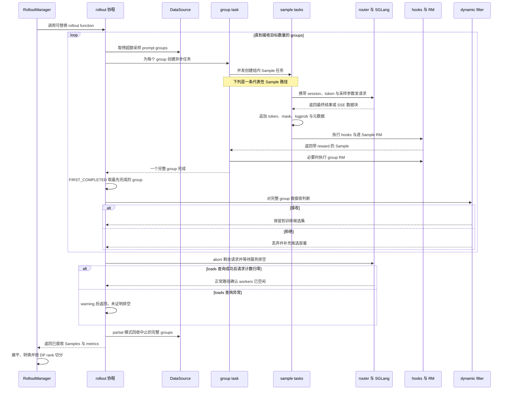
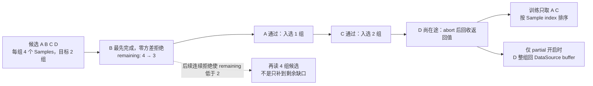
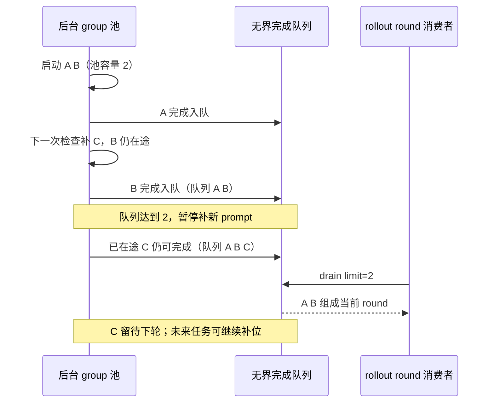

# slime SGLang Rollout Engine：用推理服务执行解码，在请求层保存轨迹状态

> **源码基线**：`THUDM/slime@681b3adca54105d5ecd3fb822fa0dc58a427e0f9`（`main`，2026-08-12）
> **主题**：请求分组、HTTP payload、奖励分派与 partial 回收；进一步说明持续后台队列和服务配置。
> **适用范围**：请求数据面；DataSource 契约归 12，driver 时序归 10，恢复归 18。
> **最近更新**：2026-09-10。按固定源码核实接口、边界与诊断证据。

rollout 的核心矛盾不是“怎样调用一次 `generate`”，而是怎样让大量请求交给高吞吐推理引擎并发执行，同时仍在 slime 一侧保留 Sample 标识、行为策略元数据、中断前缀、取消结果和恢复边界。slime 选择把 SGLang 作为独立 HTTP 服务运行：路由器与原生服务进程负责请求分发和 token 解码，`RolloutManager` 与请求协程负责 rollout 语义和并发限流。代价是多了一层 HTTP、进程生命周期和跨层状态协议，但不必把逐 token 调度、KV 状态和 SGLang 原生能力重新实现到一个中央 Python 调度器中。

本文只分析 rollout 请求状态和推理请求数据路径。`Sample` 字段、DataSource 回收语义见 [[12_slime_sample_datasource_analysis]]；Ray 资源放置，以及 `RolloutServer`、`ServerGroup`、推理引擎分别负责什么，见 [[11_slime_ray_control_plane_analysis]]。下文用固定提交定位符标注源码事实，并把动机与替代方案明确标为“设计分析”。

## 1. 并发推理真正要保证什么

高并发生成同时受五个约束：

1. **吞吐约束**：一次 rollout 会并发提交多个 prompt group，每组又有多条 Sample；客户端还要限制同时占用 `/generate` 的请求数。`GenerateState` 用 semaphore、pending task 集合和 per-DP-rank 计数保存这一轮的并发状态。[`slime/rollout/sglang_rollout.py:83-149`](https://github.com/THUDM/slime/blob/681b3adca54105d5ecd3fb822fa0dc58a427e0f9/slime/rollout/sglang_rollout.py#L83-L149)
2. **标识约束**：DataSource 已为 Sample 分配分组和样本标识；请求层再为组内每条 Sample 分配稳定的 `session_id`，一致性哈希路由器可用它维持多轮路由亲和。[`slime/rollout/data_source.py:90-118`](https://github.com/THUDM/slime/blob/681b3adca54105d5ecd3fb822fa0dc58a427e0f9/slime/rollout/data_source.py#L90-L118) [`slime/rollout/sglang_rollout.py:297-325`](https://github.com/THUDM/slime/blob/681b3adca54105d5ecd3fb822fa0dc58a427e0f9/slime/rollout/sglang_rollout.py#L297-L325)
3. **策略证据约束**：请求不能只拿回文本；默认 payload 要求 selected-token logprob，按需要求 top-p nucleus 与 routed-expert metadata，返回后统一追加进 Sample。top-p 的请求配置在 `slime/rollout/sglang_rollout.py::GenerateState.__init__`，响应追加在 `generate`。[`slime/rollout/sglang_rollout.py:175-219`](https://github.com/THUDM/slime/blob/681b3adca54105d5ecd3fb822fa0dc58a427e0f9/slime/rollout/sglang_rollout.py#L175-L219)
4. **可取消约束**：动态采样一旦凑齐训练 batch，剩余长尾请求必须停止；但“发过 abort”不等于服务已空闲，正常路径还要查 server load 并收敛本地 pending tasks；load 查询异常会提前返回，因此不能把成功 return 当成排空证明。[`slime/backends/sglang_utils/server_control.py:32-67`](https://github.com/THUDM/slime/blob/681b3adca54105d5ecd3fb822fa0dc58a427e0f9/slime/backends/sglang_utils/server_control.py#L32-L67) [`slime/rollout/sglang_rollout.py:339-371`](https://github.com/THUDM/slime/blob/681b3adca54105d5ecd3fb822fa0dc58a427e0f9/slime/rollout/sglang_rollout.py#L339-L371)
5. **可恢复约束**：partial 保存已返回的请求状态，engine recovery 重建服务容量；规范链见 [[18_slime_fault_tolerance_observability_analysis]]，不能由一个全局重试概括。

默认客户端并发上限是：

$$
C_{\mathrm{client}}=C_{\mathrm{server}}N_{\mathrm{engine}},
$$

其中 $C_{\mathrm{server}}$ 是 `sglang_server_concurrency`，$N_{\mathrm{engine}}$ 由 rollout 引擎数量得到。[`slime/rollout/sglang_rollout.py:88-105`](https://github.com/THUDM/slime/blob/681b3adca54105d5ecd3fb822fa0dc58a427e0f9/slime/rollout/sglang_rollout.py#L88-L105) [`slime/utils/http_utils.py:201-210`](https://github.com/THUDM/slime/blob/681b3adca54105d5ecd3fb822fa0dc58a427e0f9/slime/utils/http_utils.py#L201-L210) 这个信号量只是客户端的准入并发上限，不是 SGLang 内部的批次调度器，也不会按 token 长度或 KV 占用估算容量。

## 2. 为什么这么设计：推理引擎必须作为服务运行，而不是进程内循环

这不是概念图硬套源码：`SGLangEngine` Ray actor 实际 spawn 原生 SGLang HTTP server process，等待 `/health_generate` 可用，再把 node-0 worker 注册到 router；推理请求则由 rollout 协程直接 POST router 的 `/generate`。[`slime/backends/sglang_utils/sglang_engine.py:48-102`](https://github.com/THUDM/slime/blob/681b3adca54105d5ecd3fb822fa0dc58a427e0f9/slime/backends/sglang_utils/sglang_engine.py#L48-L102) [`slime/backends/sglang_utils/sglang_engine.py:189-216`](https://github.com/THUDM/slime/blob/681b3adca54105d5ecd3fb822fa0dc58a427e0f9/slime/backends/sglang_utils/sglang_engine.py#L189-L216) [`slime/rollout/sglang_rollout.py:152-204`](https://github.com/THUDM/slime/blob/681b3adca54105d5ecd3fb822fa0dc58a427e0f9/slime/rollout/sglang_rollout.py#L152-L204)

> **设计分析：为什么不是进程内 inference loop？**
> 进程内循环会迫使 slime 自己管理 SGLang 的执行线程、KV 生命周期、服务健康与拓扑变体，并把 trainer/rollout 生命周期与推理 runtime 更紧地绑在一起。当前实现只控制 server process、端点和权重/显存操作，实际 token decoding 留给原生 SGLang；项目文档也把“保持 SGLang native、把复杂度留在核心库”写成明确方向。[`slime/backends/sglang_utils/sglang_engine.py:218-260`](https://github.com/THUDM/slime/blob/681b3adca54105d5ecd3fb822fa0dc58a427e0f9/slime/backends/sglang_utils/sglang_engine.py#L218-L260) [`docs/en/blogs/introducing_slime.md:71-99`](https://github.com/THUDM/slime/blob/681b3adca54105d5ecd3fb822fa0dc58a427e0f9/docs/en/blogs/introducing_slime.md#L71-L99)

> **设计分析：为什么不是 slime 中央逐 token scheduler？**
> 默认路径对一条 Sample 发一次 HTTP 请求，server 完成解码后返回结果；即使 streaming，也只是消费 server 发出的累计 SSE chunk。源码中没有由 `RolloutManager` 每步取 logits、选 token、再送回 engine 的回路。[`slime/rollout/sglang_rollout.py:175-219`](https://github.com/THUDM/slime/blob/681b3adca54105d5ecd3fb822fa0dc58a427e0f9/slime/rollout/sglang_rollout.py#L175-L219) [`slime/rollout/sglang_streaming_rollout.py:110-159`](https://github.com/THUDM/slime/blob/681b3adca54105d5ecd3fb822fa0dc58a427e0f9/slime/rollout/sglang_streaming_rollout.py#L110-L159) 由此可推断，server 化避免了把每个 decode step、KV 状态和调度决策经过中心 Python/Ray 对象传输；但 prompt、最终 token metadata 或 SSE chunk 仍经过 HTTP，所以这里不是“零 token transport”，而是**没有中心逐步 token transport**。

## 3. 五层职责：谁调度什么

| 层 | 只负责什么 | 明确不负责什么 | 源码锚点 |
|---|---|---|---|
| `RolloutManager` | 启动服务、持有 DataSource/rollout function、划定一轮 `rollout_id`，完成后转换训练数据 | 不执行 token decoding，也不决定 SGLang 内部 batch | [`slime/ray/rollout.py:465-505`](https://github.com/THUDM/slime/blob/681b3adca54105d5ecd3fb822fa0dc58a427e0f9/slime/ray/rollout.py#L465-L505) [`slime/ray/rollout.py:590-604`](https://github.com/THUDM/slime/blob/681b3adca54105d5ecd3fb822fa0dc58a427e0f9/slime/ray/rollout.py#L590-L604) |
| router | 给每个模型提供单一请求入口，登记 worker，并按 router policy 转发请求 | 不拥有 Sample、reward 或训练 batch | [`slime/ray/rollout.py:1062-1113`](https://github.com/THUDM/slime/blob/681b3adca54105d5ecd3fb822fa0dc58a427e0f9/slime/ray/rollout.py#L1062-L1113) [`slime/backends/sglang_utils/sglang_engine.py:194-216`](https://github.com/THUDM/slime/blob/681b3adca54105d5ecd3fb822fa0dc58a427e0f9/slime/backends/sglang_utils/sglang_engine.py#L194-L216) |
| `RolloutServer` | 表示一个模型及其 router，聚合一个或多个 server groups，并标记是否接收训练权重 | 本身不是 HTTP 进程，也不是 Ray actor | [`slime/ray/rollout.py:320-374`](https://github.com/THUDM/slime/blob/681b3adca54105d5ecd3fb822fa0dc58a427e0f9/slime/ray/rollout.py#L320-L374) |
| `ServerGroup` | 聚合同构 worker type、并行配置和故障域；创建推理 engine actor，并对该组执行显存卸载/恢复 | 不跨模型混合标识，不做请求级并发限流 | [`slime/ray/rollout.py:145-186`](https://github.com/THUDM/slime/blob/681b3adca54105d5ecd3fb822fa0dc58a427e0f9/slime/ray/rollout.py#L145-L186) `slime/ray/rollout.py::ServerGroup.start_engines/offload/onload` |
| engine/worker | `SGLangEngine` 控制 actor 计算 server args、拉起/注册/停止原生 server；原生 server 执行推理 | 不决定某条 Sample 是否进入训练 | [`slime/backends/sglang_utils/sglang_engine.py:105-192`](https://github.com/THUDM/slime/blob/681b3adca54105d5ecd3fb822fa0dc58a427e0f9/slime/backends/sglang_utils/sglang_engine.py#L105-L192) |
| request | group task 为 Sample 建 session；sample task 组装 payload、等待响应、追加 token/metadata，再执行 hook 与 RM | 不拥有 engine 资源与跨轮恢复策略 | `slime/rollout/sglang_rollout.py::generate_and_rm/generate_and_rm_group` |

一个模型一个 router，但一个模型可含 `regular`、`prefill`、`decode`、`encoder` 或 `placeholder` groups；多模型时 `start_rollout_servers` 为各模型建立独立 router，并把地址写入 `args.sglang_model_routers`。[`slime/ray/rollout.py:1132-1171`](https://github.com/THUDM/slime/blob/681b3adca54105d5ecd3fb822fa0dc58a427e0f9/slime/ray/rollout.py#L1132-L1171) [`slime/ray/rollout.py:1214-1269`](https://github.com/THUDM/slime/blob/681b3adca54105d5ecd3fb822fa0dc58a427e0f9/slime/ray/rollout.py#L1214-L1269) 这些对象为何分别是普通对象、Ray actor 或进程，见 [[11_slime_ray_control_plane_analysis]]；本页只使用它们解释请求数据面。

## 4. 一条真实请求怎样穿过系统

图中只展开一条代表性 Sample；真实执行是“多个 group tasks 并发，每个 group 内又有多个 sample tasks 并发”。`FIRST_COMPLETED` 作用在 group 层，reward 与动态过滤完成后才决定该组是否进入训练，因此 router 的请求转发、SGLang 的 token 调度和 slime 的训练样本接收是三层不同决策。

### 4.1 轮次入口：先创建候选容量，再等待最先完成者

`RolloutManager.generate` 设置当前 `rollout_id` 并调用可替换 rollout function；默认同步 wrapper 进入 `generate_rollout_async`，最后才把 abort 后的 partial groups 放回 DataSource。[`slime/ray/rollout.py:590-604`](https://github.com/THUDM/slime/blob/681b3adca54105d5ecd3fb822fa0dc58a427e0f9/slime/ray/rollout.py#L590-L604) [`slime/rollout/sglang_rollout.py:627-649`](https://github.com/THUDM/slime/blob/681b3adca54105d5ecd3fb822fa0dc58a427e0f9/slime/rollout/sglang_rollout.py#L627-L649)

外层循环先从 DataSource 取得 `over_sampling_batch_size` 个 prompt groups，为每组创建一个 `generate_and_rm_group` task；组内再为每条 Sample 创建 `generate_and_rm` task。它不是等待一整波 `gather` 后再筛选，而是对 group tasks 使用 `FIRST_COMPLETED`。[`slime/rollout/sglang_rollout.py:131-149`](https://github.com/THUDM/slime/blob/681b3adca54105d5ecd3fb822fa0dc58a427e0f9/slime/rollout/sglang_rollout.py#L131-L149) [`slime/rollout/sglang_rollout.py:400-416`](https://github.com/THUDM/slime/blob/681b3adca54105d5ecd3fb822fa0dc58a427e0f9/slime/rollout/sglang_rollout.py#L400-L416)

### 4.2 请求身份与路由亲和

组函数只在 `session_id` 缺失时生成 UUID，因此 partial continuation 会沿用原 id；若 router policy 是 `consistent_hashing`，请求以 `X-SMG-Routing-Key` 传递该 id。[`slime/rollout/sglang_rollout.py:312-325`](https://github.com/THUDM/slime/blob/681b3adca54105d5ecd3fb822fa0dc58a427e0f9/slime/rollout/sglang_rollout.py#L312-L325) [`slime/rollout/sglang_rollout.py:193-203`](https://github.com/THUDM/slime/blob/681b3adca54105d5ecd3fb822fa0dc58a427e0f9/slime/rollout/sglang_rollout.py#L193-L203) 这层 id 是 serving affinity，不替代 `group_index`、`index` 和 `rollout_id`；三类训练身份的语义见 [[12_slime_sample_datasource_analysis]]。

### 4.3 一次 HTTP 交换携带哪些策略证据

`_prepare_prompt_ids` 只在 `sample.tokens` 非空，且已有 `multimodal_train_inputs` 或无原始多模态输入时复用完整 tokens；否则有 processor 与媒体时重新处理 prompt，没有可复用条件时退回 tokenizer。请求再从 `max_new_tokens` 扣掉已有 response 长度。普通文本请求发送 `input_ids`；只要 images 非空，默认 helper 就发送 `text=sample.prompt` 与 image data，而非完整历史 input_ids。因此上述本地复用判定不保证多模态 partial 请求携带旧 response；payload 总是要求 logprob，并按 routing replay 开关要求 routed experts。[`slime/rollout/sglang_rollout.py:42-61`](https://github.com/THUDM/slime/blob/681b3adca54105d5ecd3fb822fa0dc58a427e0f9/slime/rollout/sglang_rollout.py#L42-L61) [`slime/rollout/sglang_rollout.py:164-191`](https://github.com/THUDM/slime/blob/681b3adca54105d5ecd3fb822fa0dc58a427e0f9/slime/rollout/sglang_rollout.py#L164-L191)

响应只提取已选 token id 与对应标量 logprob，然后调用 `append_response_tokens`；后者把 token、mask、logprob、top-p/routing metadata 和终止状态按同一新增 span 校验并追加。[`slime/rollout/sglang_rollout.py:202-219`](https://github.com/THUDM/slime/blob/681b3adca54105d5ecd3fb822fa0dc58a427e0f9/slime/rollout/sglang_rollout.py#L202-L219) [`slime/utils/types.py:253-314`](https://github.com/THUDM/slime/blob/681b3adca54105d5ecd3fb822fa0dc58a427e0f9/slime/utils/types.py#L253-L314) [`slime/utils/types.py:397-443`](https://github.com/THUDM/slime/blob/681b3adca54105d5ecd3fb822fa0dc58a427e0f9/slime/utils/types.py#L397-L443) 这解释了为何请求层不能只返回字符串：训练侧所需的是“动作及其 behavior evidence”，而不是文本副作用。

请求体的最小文本形状是 `{"input_ids": [101, 102], "sampling_params": {"max_new_tokens": 8, "temperature": 1.0, "top_p": 1.0}, "return_logprob": true}`（数字仅作示意）。响应从 `meta_info.output_token_logprobs` 每项的第 0、1 项分别取 logprob 与 token id，`text` 只作为可读文本；字段缺失时两者置空，再进入统一 append 校验。`--use-rollout-routing-replay` 才请求 `return_routed_experts`；它与训练侧 `--use-routing-replay` 是不同开关，组合约束归 [[17_slime_train_inference_consistency_analysis]]。`GenerateState.__init__` 在 `rollout_top_p != 1.0` 时给 sampling params 加 `custom_params.return_top_p_token_ids=True`。

续生成先从预算扣已有 `response_length`：负数断言失败，恰好为零则直接标为 `TRUNCATED`，不发 HTTP。回收组中已 `COMPLETED/TRUNCATED` 的成员由 `generate_and_rm` 跳过，且非 group RM 时要求其 reward 已存在。启用 `--sglang-enable-deterministic-inference` 后，第 i 个组内样本使用 `--rollout-seed + i`（seed 默认 42）；各 group 重用这组 seed，UUID session id 不充当随机种子。多模态 text/image payload 的 processor 边界见 [[26_slime_multimodal_vlm_path_analysis]]。

### 4.4 同组样本完成后才做接收判断

每条 Sample 在 semaphore 内完成 generation，随后在 semaphore 外执行 hooks 与 per-sample RM；group RM 则等组内 tasks 全部结束后执行。[`slime/rollout/sglang_rollout.py:242-289`](https://github.com/THUDM/slime/blob/681b3adca54105d5ecd3fb822fa0dc58a427e0f9/slime/rollout/sglang_rollout.py#L242-L289) [`slime/rollout/sglang_rollout.py:327-336`](https://github.com/THUDM/slime/blob/681b3adca54105d5ecd3fb822fa0dc58a427e0f9/slime/rollout/sglang_rollout.py#L327-L336) 因而 dynamic filter 判断的是“已生成且已有 reward 的完整 group”，不是预先过滤 prompt。

每个 first-completed group 都进入 `all_data`，filter 可接受、拒绝或在候选不足时兜底接受；拒绝会减少剩余候选容量，外层循环据此继续补采，直到保留 `rollout_batch_size` 个 groups。[`slime/rollout/sglang_rollout.py:413-443`](https://github.com/THUDM/slime/blob/681b3adca54105d5ecd3fb822fa0dc58a427e0f9/slime/rollout/sglang_rollout.py#L413-L443) [`slime/rollout/filter_hub/base_types.py:5-37`](https://github.com/THUDM/slime/blob/681b3adca54105d5ecd3fb822fa0dc58a427e0f9/slime/rollout/filter_hub/base_types.py#L5-L37)

> **设计分析**：优先接收已完成分组，把准入条件从“等待整个批次”改成“收到分组完成事件”，使长尾分组不会阻塞已经完成的分组；超额采样则用额外生成成本，换取动态过滤后仍能得到固定大小的训练批次。它仍保持分组原子性，因为 reward 和过滤器可能依赖同一个 prompt 的全部候选。

### 4.5 生成、hook、RM 与过滤各自接受什么

生成分派先用 `sample.generate_function_path`，否则用 `args.custom_generate_function_path`；调用者探测显式 `evaluation` 形参后才传该关键字。生成离开 semaphore 后，`apply_rollout_sample_hooks` 对每个 Sample 叶子按路径顺序执行同步或异步 hook，保持 list 嵌套形状；`None` 保留原对象，非 Sample 返回值报 TypeError。额外参数只传给可接受的签名，包含 `evaluation` 与当前 rollout round 的 `rollout_id`。

RM 优先级是 Sample 自带 `custom_rm_path` → 全局 `--custom-rm-path` → `metadata.rm_type` → `--rm-type`。规则分派支持 `remote_rm/deepscaler/dapo/math/f1/gpqa/ifbench/random`，未知或空类型抛 `NotImplementedError`。`boxed_` 前缀先抽取 boxed answer，再按余下名字调用规则；remote 路径仍发送原 Sample 的 `prompt/response/label`，不会把局部抽取结果写回 Sample。`remote_rm` 独立使用连接上限 64、总超时 120 秒的 session，最多 10 次尝试，等待为 `min(2**attempt, 30) + random.random()`，耗尽抛异常。

已有 reward 不重复评分；ABORTED 样本跳过 per-sample RM；custom generate 返回 list 时只把其中缺 reward 的成员交给 `batched_async_rm`。后者有全局 custom RM 时一次传整个 list，要求调用方实现批量接口；否则 gather 各 Sample 的 `async_rm`。开启 `--group-rm` 则等组内生成结束再评分，不自动解开 agent 嵌套 fanout。

动态过滤在完整 group 上执行。`check_reward_nonzero_std` 用 float64 标准差大于 `1e-6` 判保留；拒绝原因生成 `rollout/dynamic_filter/drop_zero_std_{reward}`（reward 四舍五入到一位）。fallback 通过 `keep_when_insufficient` 在 remaining candidates 不超过目标时保留被拒组。无 reason 的拒绝不产生 drop 指标。凑满并 abort、排序、reset 后，`--rollout-sample-filter-path` 原地处理入选 groups；`--rollout-all-samples-process-path` 获得已完成的全部 groups 和取数据 callable，包含动态过滤拒绝者，但不包含尚未完成且随后回收的 partial groups。

### 4.6 四组候选如何得到两组训练数据

取 `over_sampling_batch_size=4`、`rollout_batch_size=2`、`n_samples_per_prompt=4`。首次读入 A/B/C/D 四个 group，建立四个 group task、十六个 sample task；实际 HTTP 在途数仍受 semaphore 限制。假设 B 先完成但零方差被拒，remaining 从 4 降为 3；A、C 随后通过，入选达到 2，D 进入 abort 收尾。只有 partial 开启时，D 返回的整组才交给 buffer；若 D 已与 C 同一批完成却排在目标满后，则当前实现不会自动回填它。若连续拒绝使 remaining 低于 2，则一次再补四组，而非只补缺的一组。此例的代价是多做生成/RM，收益是无需等待 D 自然完成。

<!-- Figure spec: Four groups of four samples, target two groups. B rejection then A/C acceptance; D remains in flight and is only buffered with partial. Separate dotted replenishment branch after repeated rejection. -->

图中假设完成顺序为 B、A、C，D 尚未完成。接收对象始终是整组，凑满后只回收尚在途任务返回的 partial groups；图中的补采虚线是另一条拒绝分支，不与 A/C 已通过分支同时发生。

### 4.7 Fully-async：在异步 driver 上保持后台 group 池

官方使用方式先选 `train_async.py` 的 one-stage async，再设置 `--rollout-function-path slime.rollout.fully_async_rollout.generate_rollout_fully_async`；它们是叠加关系。driver 的 future 等待和更新时序见 [[10_slime_end_to_end_iteration_analysis]]，这里解释替换后的生产者。

首次调用创建进程级 `AsyncRolloutWorker`：daemon thread 内运行独立 asyncio loop，跨 rollout round 保存 active tasks 和输出队列。group task 池上限为 `sglang_server_concurrency × get_rollout_num_engines(args)`；组内 Sample 又受默认 semaphore 约束，因此“group 池大小”和“在途 HTTP 数”不是同一计数单位。每秒清理完成 task 并补位；完成队列达到一个池的容量时暂停补新 prompt。队列本身无界，目的是避免 done callback 的阻塞 `put` 冻住 event loop；已有任务还能继续完成，所以这不是严格的队列硬上限。

完成 callback 将 `(gid, group)` 入队；含 ABORTED 成员的组回到 `data_buffer.add_samples`，异常 task 只记录错误而不自动回填。每轮只 drain `target - collected` 个 group，余量留给下轮，并按 Sample index 排序后返回。driver 的 generation future 完成仅证明本轮 batch 已备好，不证明后台在途池为空；worker 不拥有 pause/weight-update 信令，也没有版本年龄上限。

以池容量 2、本轮目标 2 组为例，下面展示一次允许的完成顺序；它与上一节默认路径不同，不执行默认动态过滤。

<!-- Figure spec: Independent background worker, unbounded queue, round consumer. Pool capacity2: A completes, C replenishes, B completes to queue2, C finishes to queue3; drain2 retains C. Expose soft gate and no round barrier. -->

该例中队列达到 3，说明 qsize gate 约束补位而非强制完成队列容量；一次 round 返回也不构成后台 drain 或权重提交屏障。

该入口断言 global dataset，拒绝 evaluation；跨 round 顺序只有 best effort。README 还声明 partial-style resume 未接通；源码回填的是原对象，并未统一清空 tokens，故不能把“必定从零重做”或“所有插件都可无损续跑”写作框架保证。默认动态过滤及轮末 sample/all-samples hooks 位于被替换的 `generate_rollout_async` 中，fully-async 不会自动调用它们；仍复用的只有 `generate_and_rm_group` 下的生成、sample hook 与 RM。评估应另配 `--eval-function-path`，见 [[27_slime_evaluation_path_analysis]]。

## 5. 部分结果、流式返回与中止共同构成一套状态协议

凑齐目标 group 后，外层循环无条件调用 `abort`。取消不是单个 asyncio task 的本地操作，而是：从默认 router 查询全部 workers → 对每个 worker 调 `/abort_request` 且 `abort_all=True` → 查询 `/v1/loads` 直到请求数归零 → 等待所有本地 group tasks 返回。[`slime/rollout/sglang_rollout.py:339-355`](https://github.com/THUDM/slime/blob/681b3adca54105d5ecd3fb822fa0dc58a427e0f9/slime/rollout/sglang_rollout.py#L339-L355) [`slime/backends/sglang_utils/server_control.py:32-67`](https://github.com/THUDM/slime/blob/681b3adca54105d5ecd3fb822fa0dc58a427e0f9/slime/backends/sglang_utils/server_control.py#L32-L67)

这条路径必须“排空”而不只“发信号”，因为下一阶段可能 offload、更新权重或开始下一轮；若旧请求仍在 engine 内执行，就会跨越服务生命周期边界。正常返回的 load 查询用于检查这个不变量；但 `abort_server_until_idle` 在 load 查询异常时只告警并直接 return，因此返回本身不能证明服务端已排空。[`slime/backends/sglang_utils/server_control.py:43-63`](https://github.com/THUDM/slime/blob/681b3adca54105d5ecd3fb822fa0dc58a427e0f9/slime/backends/sglang_utils/server_control.py#L43-L63)

### 5.1 非流式部分结果：以服务端最终返回为 partial 回收点

普通请求等待最终 JSON，收到后一次性 append。若开启 partial rollout，abort 会收集 pending task 返回的整组结果；它只给其中已有 response 且尚无记录的 Sample 写入 `start_rollout_id`，但不会按 response 过滤 group，而是把整个 group 加入 `aborted_samples`。同步 wrapper 随后把这些 groups 交给 DataSource，buffer 也按整组追加。[`slime/rollout/sglang_rollout.py:202-219`](https://github.com/THUDM/slime/blob/681b3adca54105d5ecd3fb822fa0dc58a427e0f9/slime/rollout/sglang_rollout.py#L202-L219) [`slime/rollout/sglang_rollout.py:359-365`](https://github.com/THUDM/slime/blob/681b3adca54105d5ecd3fb822fa0dc58a427e0f9/slime/rollout/sglang_rollout.py#L359-L365) [`slime/rollout/sglang_rollout.py:646-649`](https://github.com/THUDM/slime/blob/681b3adca54105d5ecd3fb822fa0dc58a427e0f9/slime/rollout/sglang_rollout.py#L646-L649) [`slime/rollout/data_source.py:198-211`](https://github.com/THUDM/slime/blob/681b3adca54105d5ecd3fb822fa0dc58a427e0f9/slime/rollout/data_source.py#L198-L211)

普通文本 partial 下轮复用已有 `sample.tokens` 并只请求剩余 token 数；多模态的本地复用条件与实际 text/image payload 边界见 §4.3，不能推广成所有媒体请求都续传完整历史。是否把旧 policy span 的 loss mask 清零由 `mask_offpolicy_in_partial_rollout` 决定。[`slime/rollout/sglang_rollout.py:42-61`](https://github.com/THUDM/slime/blob/681b3adca54105d5ecd3fb822fa0dc58a427e0f9/slime/rollout/sglang_rollout.py#L42-L61) [`slime/rollout/sglang_rollout.py:225-240`](https://github.com/THUDM/slime/blob/681b3adca54105d5ecd3fb822fa0dc58a427e0f9/slime/rollout/sglang_rollout.py#L225-L240) 旧、新 span 如何合并属于 Sample 契约，见 [[12_slime_sample_datasource_analysis]]。

### 5.2 流式部分结果：以最后收到的 SSE 数据块为 partial 回收点

流式版本只替换内层 HTTP 调用，外层信号量、分组接收、请求中止和缓冲区交接仍复用默认路径。[`slime/rollout/sglang_streaming_rollout.py:1-24`](https://github.com/THUDM/slime/blob/681b3adca54105d5ecd3fb822fa0dc58a427e0f9/slime/rollout/sglang_streaming_rollout.py#L1-L24) 它先保存调用前的 Sample 快照；由于当前 SSE 输出在单次调用内是累计值，每个数据块都把 Sample 重建为“旧前缀 + 当前累计结果”，再调用统一追加接口，避免重复加入前一个数据块。[`slime/rollout/sglang_streaming_rollout.py:93-156`](https://github.com/THUDM/slime/blob/681b3adca54105d5ecd3fb822fa0dc58a427e0f9/slime/rollout/sglang_streaming_rollout.py#L93-L156)

当全局 abort flag 出现时，stream reader 在最后已观测 chunk 处退出；若尚无终止原因则把 Sample 标为 `ABORTED`。[`slime/rollout/sglang_streaming_rollout.py:158-167`](https://github.com/THUDM/slime/blob/681b3adca54105d5ecd3fb822fa0dc58a427e0f9/slime/rollout/sglang_streaming_rollout.py#L158-L167) 因而 streaming 的价值不只是“早显示文本”，而是把 partial durability 从“等待 server 最终 abort 响应”提前到“每个已消费 chunk”。

## 6. 请求回收与引擎恢复的边界

partial 回收保存的是已经返回客户端的 Sample 状态，权重 commit 发布的是新的 serving 权重，两者不能共用“提交点”一词。健康检查会标死整个逻辑 engine，真正重建延后到训练侧权重更新前；规范恢复链、初始 round 跳过及 external 限制见 [[18_slime_fault_tolerance_observability_analysis#3. 推理引擎的局部恢复：检测、清理、重建、重新加载当前版本|引擎恢复]]。恢复服务容量不保证重放丢失请求。

## 7. 原生能力透传：只做必要适配，不设计能力受限的公共引擎接口

slime 没有手写一份固定的 SGLang 参数子集。router 侧直接调用 `RouterArgs.add_cli_args` 并加 `router` 前缀；server 侧临时包装 argparse，把 `ServerArgs.add_cli_args` 暴露的参数统一改写为 `--sglang-*`，只跳过由 slime 生命周期与拓扑负责的字段。[`slime/backends/sglang_utils/arguments.py:8-44`](https://github.com/THUDM/slime/blob/681b3adca54105d5ecd3fb822fa0dc58a427e0f9/slime/backends/sglang_utils/arguments.py#L8-L44) [`slime/backends/sglang_utils/arguments.py:46-118`](https://github.com/THUDM/slime/blob/681b3adca54105d5ecd3fb822fa0dc58a427e0f9/slime/backends/sglang_utils/arguments.py#L46-L118)

启动 engine 时，`_compute_server_args` 遍历当前 SGLang `ServerArgs` dataclass 字段，把存在的 `args.sglang_*` 填入 native args；per-group YAML overrides 最后覆盖基础值，当前版本不存在的键会被记录并丢弃。[`slime/backends/sglang_utils/sglang_engine.py:592-636`](https://github.com/THUDM/slime/blob/681b3adca54105d5ecd3fb822fa0dc58a427e0f9/slime/backends/sglang_utils/sglang_engine.py#L592-L636) 这是一种**受控透传**，不是无条件透传：model path、端口、rank、TP 和 memory saver 等关键项由 slime 计算或保留，PD/EPD worker 也会注入专用参数。[`slime/backends/sglang_utils/sglang_engine.py:523-587`](https://github.com/THUDM/slime/blob/681b3adca54105d5ecd3fb822fa0dc58a427e0f9/slime/backends/sglang_utils/sglang_engine.py#L523-L587)

> **设计分析**：若定义一个只保留公共能力的 `InferenceEngine.generate()` 抽象，SGLang 新增的路由策略、并行参数、PD/EPD 或元数据端点都要先在 slime 抽象层重新建模。当前做法把稳定边界放在 HTTP 请求、服务生命周期和 Sample 追加操作上，原生能力尽量通过 `RouterArgs`、`ServerArgs`、配置覆盖和自定义生成函数暴露；代价是 slime 会直接依赖 SGLang 参数字段和端点兼容性。

### 7.1 部署参数与仓内替换函数

部署入口 `start_rollout_servers` 在 managed 模式分为三支：`--sglang-config` 读取多模型 YAML；否则非空 `--prefill-num-servers` 构造 prefill/decode 两组；否则构造 regular 默认组。旧 PD 参数的 prefill GPU 数是 server 数乘 `--rollout-num-gpus-per-engine`，剩余 GPU 分给 decode，剩余不大于零时断言。YAML 中 group 的 GPU/engine 值优先于 model 值，再回落全局值；`overrides` 使用原生 ServerArgs 字段名。`--sglang-dp-size` 是 engine 内并行配置，不能当成独立 engine 数。encoder 的启动与图片通路归 [[26_slime_multimodal_vlm_path_analysis]]。

| 整轮函数 | 改变的工作 | 机制归属 |
|---|---|---|
| `slime.rollout.sft_rollout.generate_rollout` | 从数据构造监督样本 | [[28_slime_sft_path_and_loss_mask_analysis]] |
| `slime.rollout.forge_load.generate_rollout` | 读伪造 dump，保留 serving 生命周期 | [[19_slime_rollout_backend_extension_analysis]] |
| `slime.rollout.sleep_rollout.sleep` | 初始化后停在无限等待，供压测 | [[19_slime_rollout_backend_extension_analysis]] |
| OPD 的默认 rollout + 自定义 RM | 学生采样后调用 teacher，不是另一种 engine | [[20_slime_on_policy_distillation_analysis]] |

紧凑阅读路线：`slime/rollout/sglang_rollout.py::GenerateState/generate/generate_and_rm/generate_and_rm_group/generate_rollout_async/abort` → `slime/rollout/sample_hooks.py::apply_rollout_sample_hooks` 与 `slime/rollout/rm_hub/__init__.py::async_rm/batched_async_rm/remote_rm` → `slime/rollout/filter_hub/base_types.py::should_drop_dynamic_filter_output/MetricGatherer` → `slime/rollout/fully_async_rollout.py::AsyncRolloutWorker._loop/_make_done_cb/_generate_rollout_async`。服务配置读 `slime/backends/sglang_utils/sglang_config.py::SglangConfig.from_yaml/from_prefill_num_servers`；取消负路径读 `slime/backends/sglang_utils/server_control.py::abort_server_until_idle`。

## 8. 约束、边界、代价与常见误读

| 误读或边界 | 固定基线的实际行为 |
|---|---|
| 路由器负责全部 rollout 调度 | 路由器只管理 worker 注册与请求转发；分组接收、动态过滤、RM 和部分结果回收仍由 slime 请求层处理。[`slime/backends/sglang_utils/sglang_engine.py:194-216`](https://github.com/THUDM/slime/blob/681b3adca54105d5ecd3fb822fa0dc58a427e0f9/slime/backends/sglang_utils/sglang_engine.py#L194-L216) [`slime/rollout/sglang_rollout.py:374-470`](https://github.com/THUDM/slime/blob/681b3adca54105d5ecd3fb822fa0dc58a427e0f9/slime/rollout/sglang_rollout.py#L374-L470) |
| server 化意味着没有 token 经过控制面 | prompt 与最终 response metadata 经 HTTP；streaming 还传累计 chunks。省掉的是中心逐 decode-step 调度，不是全部数据传输。[`slime/rollout/sglang_streaming_rollout.py:71-84`](https://github.com/THUDM/slime/blob/681b3adca54105d5ecd3fb822fa0dc58a427e0f9/slime/rollout/sglang_streaming_rollout.py#L71-L84) [`slime/rollout/sglang_streaming_rollout.py:116-156`](https://github.com/THUDM/slime/blob/681b3adca54105d5ecd3fb822fa0dc58a427e0f9/slime/rollout/sglang_streaming_rollout.py#L116-L156) |
| abort 是精确取消某个剩余 task | stock path 枚举默认 router 全部 workers，并对每个 worker发送 `abort_all=True`；它是轮次收尾的粗粒度 drain。[`slime/rollout/sglang_rollout.py:339-349`](https://github.com/THUDM/slime/blob/681b3adca54105d5ecd3fb822fa0dc58a427e0f9/slime/rollout/sglang_rollout.py#L339-L349) [`slime/backends/sglang_utils/server_control.py:32-40`](https://github.com/THUDM/slime/blob/681b3adca54105d5ecd3fb822fa0dc58a427e0f9/slime/backends/sglang_utils/server_control.py#L32-L40) |
| streaming 天然兼容任意 SGLang stream 模式 | 该实现明确假设 chunk 在单次调用内累计；若 server 改成 incremental output，重建逻辑必须改变。[`slime/rollout/sglang_streaming_rollout.py:20-24`](https://github.com/THUDM/slime/blob/681b3adca54105d5ecd3fb822fa0dc58a427e0f9/slime/rollout/sglang_streaming_rollout.py#L20-L24) |
| health check 失败会原地继续请求 | monitor kill engine 并留下 `None`；重建推迟到权重更新前。当前请求是否可回收取决于已保存的 partial 状态。[`slime/utils/health_monitor.py:145-177`](https://github.com/THUDM/slime/blob/681b3adca54105d5ecd3fb822fa0dc58a427e0f9/slime/utils/health_monitor.py#L145-L177) [`slime/backends/megatron_utils/actor.py:591-608`](https://github.com/THUDM/slime/blob/681b3adca54105d5ecd3fb822fa0dc58a427e0f9/slime/backends/megatron_utils/actor.py#L591-L608) |

还有两个实现代价：第一，客户端 semaphore 是按请求数而非 token/KV 预算限流，异长请求仍会产生长尾；第二，stock abort 只查询 `args.sglang_router_ip/port` 指向的默认 router，而 custom multi-model rollout 可向 `args.sglang_model_routers` 中的其他 router 发请求。[`slime/rollout/sglang_rollout.py:64-80`](https://github.com/THUDM/slime/blob/681b3adca54105d5ecd3fb822fa0dc58a427e0f9/slime/rollout/sglang_rollout.py#L64-L80) [`slime/rollout/sglang_rollout.py:339-349`](https://github.com/THUDM/slime/blob/681b3adca54105d5ecd3fb822fa0dc58a427e0f9/slime/rollout/sglang_rollout.py#L339-L349) **由此可推断**，自定义多模型生成若制造额外 in-flight 请求，必须显式确认其取消协议，不能假设默认 abort 会替它排空所有模型 router。

## 9. 发展趋势

本节离开“固定基线是什么”，因此只写有源码注释可锚定的在途改动，整节标为推断。

> [!note] 推断：锚点是源码注释原文，方向判断是本页的重建
> **一、router 参数前缀尚未统一，第 7 节的“受控透传”边界仍在移动。** `add_sglang_router_arguments` 的函数定义上方挂着 ``# TODO: use all sglang router arguments with `--sglang-router` prefix``；而函数体只手写了 `--sglang-router-ip/port/request-timeout-secs` 三个 slime 自有参数，原生 router 参数由 `RouterArgs.add_cli_args(parser, use_router_prefix=True, exclude_host_port=True)` 注入到 `--router-*` 命名空间。[`slime/backends/sglang_utils/arguments.py:8`](https://github.com/THUDM/slime/blob/681b3adca54105d5ecd3fb822fa0dc58a427e0f9/slime/backends/sglang_utils/arguments.py#L8) [`slime/backends/sglang_utils/arguments.py:31`](https://github.com/THUDM/slime/blob/681b3adca54105d5ecd3fb822fa0dc58a427e0f9/slime/backends/sglang_utils/arguments.py#L31) 源码只声明了目标（全部收敛到 `--sglang-router` 前缀），没有给出时间点。**由此可推断**，第 7 节描述的边界会继续朝“更少手写参数、更多直接透传”移动，因此不宜把当前的 `--router-*` 拼写当作稳定 CLI 契约写进长期脚本。
>
> **二、超额采样的丢弃语义被源码自己标注为未完成。** 准入循环在候选已满（`len(data) < target_data_size` 不成立）时直接放弃该分组，紧邻的注释写明 `# NOTE: here we have not stored all the unused samples back to the data buffer.`。[`slime/rollout/sglang_rollout.py:439`](https://github.com/THUDM/slime/blob/681b3adca54105d5ecd3fb822fa0dc58a427e0f9/slime/rollout/sglang_rollout.py#L439) 也就是说，已经付出完整生成与 reward 计算成本的多余分组，既不进入本轮训练，也不回到 DataSource。**由此可推断**，这正是第 4.4 节那条取舍（用额外生成成本换固定大小训练批次）当前承压的地方：以 `NOTE` 形式留在准入路径上的缺口通常预示后续会补上回收路径，但固定基线尚未实现，任何假设“多余分组会被后续轮次复用”的容量估算目前都不成立。

## Related Pages

- [[11_slime_ray_control_plane_analysis]] — `RolloutManager`、server、group 与 engine 的 Ray/普通对象所有权由该页统一定义。
- [[12_slime_sample_datasource_analysis]] — Sample identity、metadata append、partial buffer 与训练数据契约的权威说明。
- [[16_slime_weight_sync_analysis]] — engine 恢复后如何在版本边界内接收下一次权重提交。
- [[17_slime_train_inference_consistency_analysis]] — selected-token logprob、top-p、routing 与 weight version 为何必须随请求保存。
- [[18_slime_fault_tolerance_observability_analysis]] — health monitor、debug dump、请求恢复与集群恢复的故障域划分。
- [[19_slime_rollout_backend_extension_analysis]] — external engine、custom generate 与替换 backend 分别改变哪一层协议。
- [[30_slime_rollout_optimization_analysis]] — 并发上限、oversampling、长尾和有效样本吞吐如何共同决定容量。
