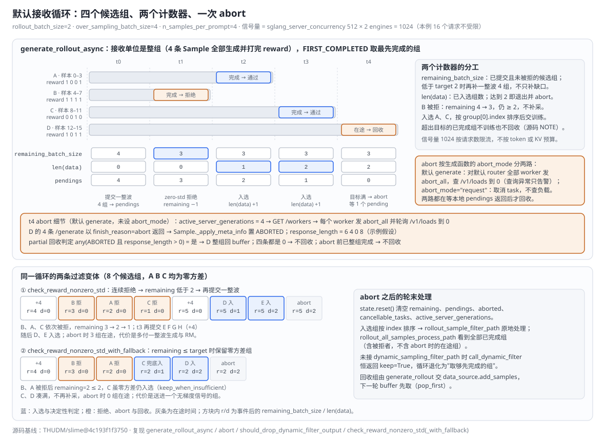
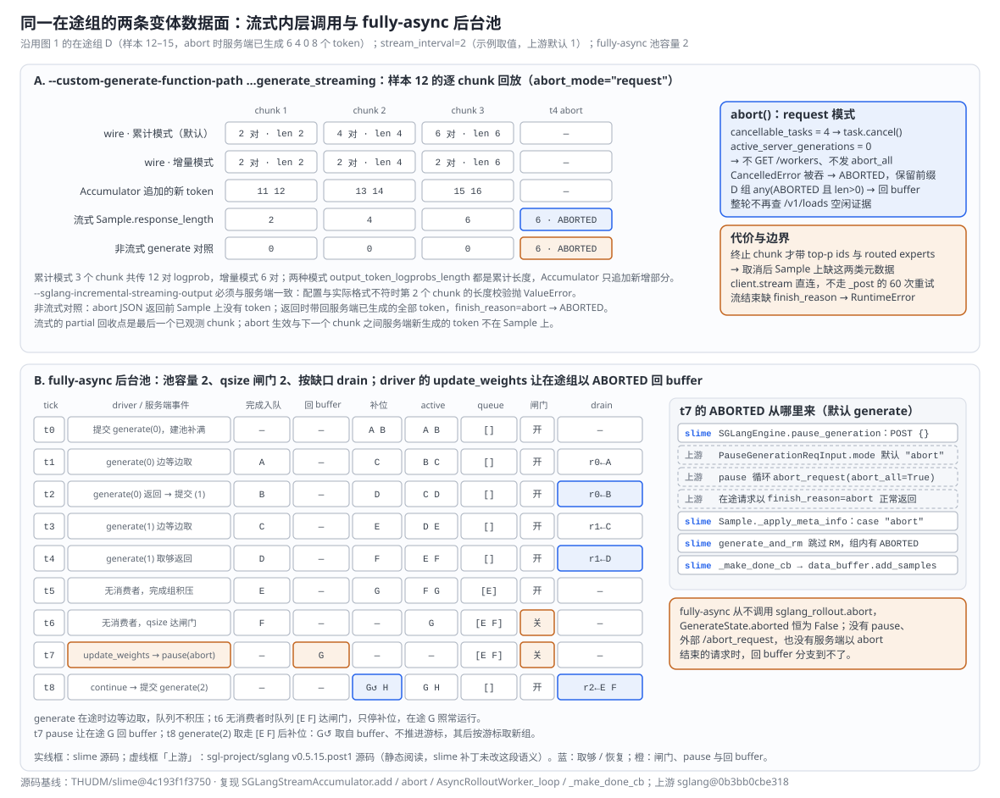
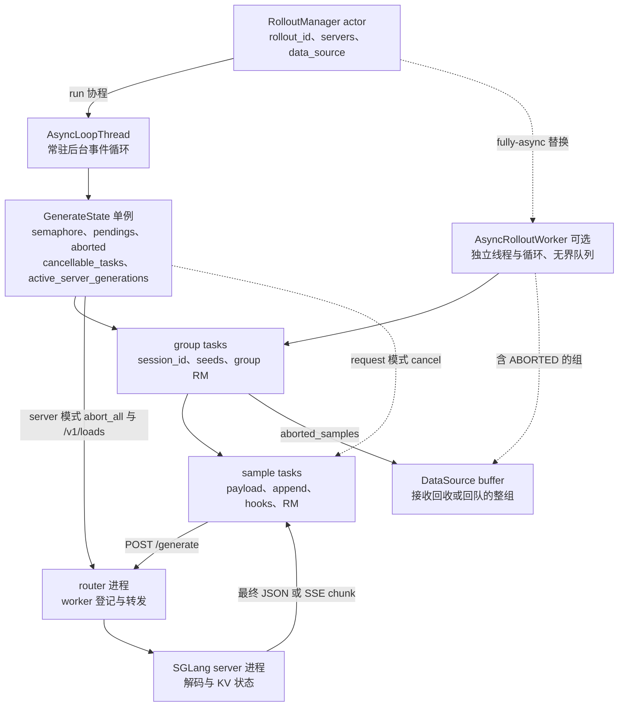

# slime SGLang Rollout Engine：用推理服务执行解码，在请求层保存轨迹状态

> **源码基线**：`THUDM/slime@4c193f1f37509cca70f0e88807a9305b70f63f4e`（`main`，2026-09-03）
> **源码基线**：`sgl-project/sglang@0b3bb0cbe31873994c9f989fddfe2f87ca839fdd`（`v0.5.15.post1`，2026-07-13；上游源码，仅用于依赖侧静态阅读）
> **主题**：slime 默认 rollout 的请求数据面：`GenerateState` 与 group / sample 两级任务、over-sampling 接收循环与动态过滤、abort 的两种取消模式与 partial 回收、router / server 参数透传。随后是同一协议的变体：流式内层调用、fully-async 后台生产者及其 ABORTED 回队条件；最后是引擎恢复与请求回收的边界、部署参数与 PD 拓扑、评估入口、规则奖励打分器、约束与配置契约。核心代码在 `slime/rollout/` 与 `slime/backends/sglang_utils/`。
> **适用范围**：rollout 请求数据面与 rollout 函数变体；Sample 与 DataSource 契约、Ray 资源放置与服务对象所有权、driver 时序、引擎恢复、权重发布分别在 slime 域的对应专页。
> **最近更新**：2026-09-17。覆盖默认接收循环、两种 abort 模式与回收判定、流式与 fully-async 两条变体的同例回放、ABORTED 回队的可达条件与规则打分器语义。

---

## 1. 特性概览

### 1.1 问题背景

一轮 rollout 要同时满足五个约束。吞吐上，几十个 prompt group、每组多条 Sample 要并发交给高吞吐推理引擎，客户端还得限制同时占用 `/generate` 的请求数；标识上，DataSource 已分配的分组与样本序号之外，多轮请求还需要稳定的会话键维持路由亲和；策略证据上，请求不能只拿回文本，训练侧需要 selected-token logprob，按需还要 top-p 候选与 routed experts；可取消上，动态采样一旦凑齐训练批次，剩余长尾请求必须停止，而"发过 abort"不等于服务已空闲；可恢复上，被中断的请求状态要能进入下一轮，引擎故障时服务容量要能重建。如果 slime 自己在进程内跑一个逐 token 的推理循环，它就得接管 SGLang 的执行线程、KV 生命周期、健康与拓扑变体，并把 trainer 与 rollout 的生命周期绑死在推理 runtime 上；如果做一个只暴露公共能力的抽象引擎接口，SGLang 每加一种路由策略、并行参数或元数据端点都要先在 slime 里重新建模。

### 1.2 解决方法

slime 把 SGLang 作为独立 HTTP 服务运行，稳定边界放在三处：HTTP 请求、服务生命周期与 `Sample.append_response_tokens`。请求层是一个 `GenerateState` 单例加两级 asyncio 任务：单例持有 tokenizer、采样参数模板、容量为 `sglang_server_concurrency × engine 数` 的信号量、当前轮的 pending 任务集合、`remaining_batch_size` 与 `aborted` 标志、两类在途生成的登记（`cancellable_tasks` 与 `active_server_generations`），以及按 `sglang_dp_size` 均衡的计数；group task 为组内每条 Sample 分配 `session_id` 与确定性种子后并发派生 sample task；sample task 在信号量内调用一次生成函数（默认 `generate` 发 `/generate`，默认要求 logprob，按开关要求 routed experts 与 top-p 候选），把返回的 token 与元数据追加进 Sample，出信号量后执行 sample hook 与逐样本 RM。接收循环以整组为单位：先向 DataSource 取一整波 `over_sampling_batch_size` 组提交，`FIRST_COMPLETED` 取最先完成的组交给动态过滤，被拒则 `remaining_batch_size` 减一，低于目标再补一整波；入选达到 `rollout_batch_size` 后进入 abort。abort 按生成函数的 `abort_mode` 属性分两路：声明 `abort_mode = "request"` 的函数由 slime 直接取消本地 task；其余函数（含默认 `generate`）对默认 router 的全部 worker 发 `abort_all` 并等到 `/v1/loads` 归零。随后等本地 pending 任务返回，开 partial 时把"至少一条 Sample 已 ABORTED 且有 response"的在途整组交回 DataSource。SGLang 的参数与路由能力通过 `ServerArgs` / `RouterArgs` 的受控透传暴露，不另设抽象引擎接口。流式生成只替换内层 HTTP 调用；fully-async 用后台线程内的独立事件循环跨轮维持一个 group 池。

### 1.3 收益、开销和约束

| 维度 | 直接收益 | 必付成本或边界 |
|---|---|---|
| 服务化 | 逐 token 调度、KV 状态与 SGLang 原生能力留在 SGLang 进程 | 多一层 HTTP、进程生命周期与跨层状态协议；prompt、最终元数据或 SSE chunk 仍经 HTTP，省掉的是中心逐步 token 传输 |
| 整组接收 | reward 与过滤器可依赖同一 prompt 的全部候选 | 一组要等最慢成员；`FIRST_COMPLETED` 只在组间生效 |
| over-sampling | 动态过滤后仍得到固定大小批次，不必等整波最慢任务 | 多付生成与 RM 成本；补采按整波而非缺口；超出目标的已完成组不训练也不回收 |
| 信号量限流 | 客户端准入上限与 engine 数线性挂钩 | 按请求数而非 token 或 KV 预算限流，异长请求仍形成长尾 |
| 轮末 abort | 下阶段的 offload、权重更新或下一轮不会被本轮旧请求跨越 | server 模式是粗粒度 `abort_all`，只查默认 router，load 查询异常时只告警返回；request 模式不查负载，没有服务端空闲证据 |
| partial 回收 | 在途组已付出的生成在下一轮续上 | 只回收含"已 ABORTED 且有 response"成员的组；全员无 token 或恰好已完成的在途组被放弃 |
| 受控透传 | SGLang 新参数（含补丁新增字段）无需 slime 建模即可用 | slime 直接依赖 SGLang 参数字段与端点兼容性；当前版本不存在的键被记录后丢弃 |
| 变体 | streaming 把 partial 回收点提前到每个已观测 chunk；fully-async 让下一步不等最慢在途样本 | streaming 取消时丢终止 chunk 上的 top-p / routed experts，且不经 `_post` 重试；fully-async 放弃默认动态过滤与轮末钩子，跨轮顺序 best effort，权重更新时在途组回队 |

### 1.4 术语约定

| 术语 | 含义 |
|---|---|
| group task / sample task | `generate_and_rm_group` 与 `generate_and_rm` 的 asyncio 任务；前者是接收循环的等待单位 |
| `remaining_batch_size` | 已提交且尚未被拒的候选组数；决定何时再补一整波 |
| `len(data)` | 已入选组数；达到 `rollout_batch_size` 即退出循环 |
| 候选波次 | 一次 `data_source(over_sampling_batch_size)` 提交的整批 group |
| `abort_mode` | 生成函数上的属性；等于 `"request"` 时该函数的调用登记进 `cancellable_tasks`，否则计入 `active_server_generations` |
| 排空（server 模式） | `abort_servers_until_idle` 对每个 worker 发 `abort_all` 并轮询 `/v1/loads` 直到请求数为 0 |
| 请求级取消（request 模式） | `abort` 对登记的 task 调用 `cancel()`，被取消的 Sample 标 ABORTED 并保留已写入的前缀 |
| partial 回收点 | 非流式：服务端以 `finish_reason=abort` 返回的 JSON；流式：最后一个已消费 SSE chunk |
| 池 / 闸门 | fully-async 中同时在途的 group 上限与阻止补位的 `qsize` 阈值，二者数值相同但语义不同 |
| 受控透传 | `--sglang-*` 与 `--router-*` 直接映射到 `ServerArgs` / `RouterArgs`，但 model path、端口、rank、并行度、memory saver 等由 slime 计算或保留 |

---

## 2. 请求数据面详细方案

### 2.1 最小实例：四个候选组得到两个训练组

取 `rollout_batch_size=2`、`over_sampling_batch_size=4`、`n_samples_per_prompt=4`，rollout 4 卡、每 engine 2 卡，`sglang_server_concurrency` 取默认 512，信号量容量 512 × 2 = 1024，本例 16 个请求不受限。动态过滤用 `check_reward_nonzero_std`，`partial_rollout` 开启，生成函数是默认 `generate`。首波读入 A、B、C、D 四组（样本 0–3、4–7、8–11、12–15），建立 4 个 group task、16 个 sample task。假设完成顺序为 B、A、C，D 仍在途。



| 时刻 | 事件 | `remaining_batch_size` | `len(data)` | pendings |
|---|---|---:|---:|---:|
| t0 | 提交一整波 4 组 | 4 | 0 | 4 |
| t1 | B 完成，reward `1 1 1 1` 零方差 → 拒绝 | 4 → 3 | 0 | 3 |
| t2 | A 完成，reward `1 0 0 1` → 入选 | 3 | 1 | 2 |
| t3 | C 完成 → 入选，达到目标 | 3 | 2 | 1 |
| t4 | abort：`abort_all` → `/v1/loads` 归零 → 等 1 个 pending 返回，D 回 buffer | 3 | 2 | 0 |

B 被拒后 remaining 仍 ≥ 2，因此不补采；若连续拒绝使它低于 2，循环会再提交一整波 4 组，而不是只补缺口。入选的 A、C 按 `group[0].index` 排序后交给 RolloutManager。D 的 4 条请求此刻都在默认 `generate` 里，`active_server_generations = 4`，所以 abort 走 server 模式；假设 abort 生效时四条请求在服务端已生成 6、4、0、8 个 token，它们以 `finish_reason=abort` 返回，四条都变成 ABORTED（样本 14 没有 token 也是 ABORTED）。组内至少一条 ABORTED 且 `response_length > 0`，partial 开启时 D 整组回 DataSource，其中有 response 的 Sample 记下 `start_rollout_id`。若四条都还没拿到 token，或 D 恰好在 abort 前整组完成，这一组都不回 buffer。此例的代价是多做一组生成与 RM，收益是无需等待 D 自然完成。

#### 2.1.1 一条 Sample 请求携带什么、拿回什么

`generate` 先断言状态为 PENDING 或 ABORTED，由 `_prepare_prompt_ids` 决定 input ids：已有 `tokens` 且（已有 `multimodal_train_inputs` 或没有原始多模态输入）时复用 `sample.tokens`，有 processor 与媒体且不能复用时重新处理 prompt，否则 tokenizer 编码。随后 `max_new_tokens -= response_length`，负数断言失败，恰好为零直接标 TRUNCATED 不发请求。payload 固定带 `return_logprob=True`；`--use-rollout-routing-replay` 加 `return_routed_experts`；`rollout_top_p != 1.0` 时采样参数已在单例构造期加入 `custom_params.return_top_p_token_ids=True`。普通文本发 `input_ids`；只要 `images` 非空就发 `text=sample.prompt` 与 `image_data`，而非完整历史 ids，因此多模态 partial 请求不保证续传旧 response。`sample.tokens` 为空时先写入 prompt ids。`router_policy=consistent_hashing` 时以 `X-SMG-Routing-Key` 头携带 `session_id`。响应从 `meta_info.output_token_logprobs` 每项的第 0、1 位取 logprob 与 token id，`text` 追加到 `response`，字段缺失时 token 与 logprob 置空，再交 `append_response_tokens` 校验并追加。meta_info 带 `finish_reason` 时，`Sample._apply_meta_info` 把 `stop`、`length`、`abort` 分别映射为 COMPLETED、TRUNCATED、ABORTED，同时追加 `weight_version`（存在时）、prefix cache 统计与投机解码统计；这条映射决定了 §2.3.3 的可达性。最小文本 payload 形如 `{"input_ids": [101, 102], "sampling_params": {"max_new_tokens": 8, "temperature": 1.0, "top_p": 1.0}, "return_logprob": true}`（数字示意）。

#### 2.1.2 接收循环的两个计数器

外层 `while len(data) < target` 内先 `while remaining_batch_size < target` 补波次；`asyncio.wait(FIRST_COMPLETED)` 返回后逐个取组：断言组长等于 `n_samples_per_prompt`，记入 `all_data`，调用过滤器；`should_drop_dynamic_filter_output` 在 `keep=False` 且（未设 `keep_when_insufficient` 或 remaining 大于 target）时拒绝并把 remaining 减一，被拒原因累计到 `rollout/dynamic_filter/drop_<reason>` 指标，无 reason 的拒绝不产生指标；通过且 `len(data) < target` 才入选，否则直接放弃，紧邻注释写明未存回 buffer。未配置过滤器时 `call_dynamic_filter` 恒返回 keep。

#### 2.1.3 abort：两路取消，再等本地任务

`abort` 断言此前未 abort 并置 `aborted=True`，然后分两路收尾。

- **请求级取消。** 生成函数带 `abort_mode = "request"` 时，`generate_and_rm` 经 `_run_request_abortable_generate` 把当前 task 登记进 `cancellable_tasks`。`abort` 先把这些 task 移出集合，再逐个 `cancel()`；被取消的 task 捕获 `CancelledError` 后发现自己已不在集合里（说明取消来自本次 abort），就把 Sample 标 ABORTED 并正常返回；仍在集合里时照常向上抛出，与 abort 无关的取消不会被吞掉。
- **服务端排空。** 其余生成函数经 `_run_server_abort_generate` 计入 `active_server_generations`，包括默认 `generate` 和所有没有声明该属性的自定义生成函数（如 `examples/coding_agent_rl/generate.py::generate`）。计数大于 0 时才向默认 router 的 `/workers` 取 worker url，并发执行 `abort_server_until_idle`：经 `http_utils.post` 发 `/abort_request` 带 `abort_all=True`（`post` 走 `_post`，对不可达的 worker 最多尝试 60 次、间隔 1 s，约一分钟后才抛出并被告警吞掉，随后仍继续查负载），再 GET `/v1/loads?include=core` 用 `num_requests_from_load` 汇总请求数，为 0 返回，否则每 3 s 重试且没有次数上限；load 查询抛异常时只告警并返回。计数为 0（本轮全是请求级函数）时整段跳过。

之后 `gather` 被取消的 task，再 `while state.pendings` 等本地 group task 全部返回。开 partial 时只处理组内至少一条 Sample 为 ABORTED 且 `response_length > 0` 的组：给其中有 response 且无 `start_rollout_id` 的 Sample 标本轮 id，整组收入 `aborted_samples`。v0.3.2 及更早版本在 partial 下回收全部在途组（包括 abort 期间恰好完成的组），4c1ab402 起改为这里的判定。在信号量内等待时若发现 `aborted`，sample task 直接把 Sample 标 ABORTED 返回；group task 在 `aborted` 时也跳过 group RM。

#### 2.1.4 收尾与回收

`assert len(data) == rollout_batch_size` 后按首样本 `index` 排序，`state.reset()` 清空 remaining、pendings、aborted、`cancellable_tasks` 与 `active_server_generations`；`--rollout-sample-filter-path` 原地处理入选组，`--rollout-all-samples-process-path` 收到全部已完成组（含被拒者，不含 abort 时的在途组）与 DataSource 取数 callable；返回 `RolloutFnTrainOutput(samples, metrics)` 与 `aborted_samples`，同步 wrapper `generate_rollout` 把后者交给 `data_source.add_samples`。下轮 `RolloutDataSourceWithBuffer.get_samples` 先按 `pop_first` 取回这些组，已 COMPLETED / TRUNCATED 的成员被 `generate_and_rm` 跳过（非 group RM 时断言其 reward 已存在），ABORTED 成员续生成；开 `--mask-offpolicy-in-partial-rollout` 时续生成前旧 token 的 mask 清零，mask 与身份归属由 [[12_slime_sample_datasource_analysis|Sample 与 DataSource 契约]] 定义。`tests/test_streaming_rollout.py::test_partial_abort_buffers_and_resumes_only_aborted_siblings` 锁定这一段：混合组（一条 COMPLETED、一条有前缀的 ABORTED）回收并只续生成 ABORTED 那条，旧 token mask 为 0；只有已完成成员的组、只有零长度 ABORTED 成员的组都不回收。

### 2.2 从最小实例到整套请求层

#### 2.2.1 GenerateState：进程级单例

**职责。** 持有跨请求共享的 tokenizer、processor、采样参数模板、信号量、`group_sampling_seeds`（开 `--sglang-enable-deterministic-inference` 时为 `rollout_seed + i`）、`dp_counts`，以及本轮的 `remaining_batch_size`、`pendings`、`aborted`、`cancellable_tasks`、`active_server_generations`。

**为何是单例而不是每轮新建（本页推断，源码未陈述）。** 判据在可替换点的签名：`generate`、`generate_and_rm`、`generate_and_rm_group`、`generate_streaming` 与 `AsyncRolloutWorker.__init__` 都通过 `GenerateState(args)` 取状态，而自定义生成函数的签名只有 `(args, sample, sampling_params)`；单例让任何内层替换函数不加参数就能拿到同一份信号量与采样模板，按轮新建的对象则要穿过每个插件签名。`SingletonMeta` 以类为键缓存实例，构造参数只在第一次生效。代价是它是 RolloutManager 进程内的全局状态：`reset()` 只清五个轮内字段，评估与训练共用同一个 `aborted` 标志与信号量，`generate_rollout_async` 结束时的 `reset()` 正是为了不影响下一轮或 eval。

**怎样均衡。** `dp_rank_context` 在计数最小的 dp rank 中随机选一个、进入时加一、退出时减一并断言非负；它只是客户端侧的计数，SGLang 内部的 dp attention 调度不在此处。信号量容量 $C_{\mathrm{client}} = C_{\mathrm{server}} N_{\mathrm{engine}}$，其中 $N_{\mathrm{engine}}$ 由 `get_rollout_num_engines` 得到（优先 external 模式写入的 `rollout_num_engines`，否则 `max(1, rollout_num_gpus // rollout_num_gpus_per_engine)`，`rollout_num_gpus ≤ 0` 时为 0）。`RolloutManager.__init__`（非 `--debug-train-only`）调用 `init_http_client`，用同一乘积作为 httpx 连接池上限，超时为无限，且不走系统代理；乘积为 0 时直接返回不建客户端。因此非 external 的 `rollout_num_gpus == 0`（只起 router）下，信号量容量为 0、模块级 HTTP 客户端为 None，默认 `generate` 路径不可用（源码可见；分析判断：sample task 会停在信号量上）。开 `--use-distributed-post` 时 `_init_ray_distributed_post` 在每个存活节点上建 `num_gpus_per_node` 个 `lifetime="detached"`、`num_cpus=0.001` 的 Ray actor，每个 actor 的 `max_concurrency` 为总并发除以 actor 数向上取整；POST 轮转分发，失败回落本地。

#### 2.2.2 group task 与 sample task

**职责。** group task 为缺失 `session_id` 的 Sample 生成 UUID（partial 续生成因此沿用原 id），为组内第 i 条 Sample 复制采样参数并按需写 `sampling_seed`，`asyncio.gather` 保持各 task 产出的形状（单 Sample 或 `list[Sample]`），最后在 `--group-rm` 下对整组调用 `batched_async_rm`；gather 出来的组若含扇出 list，会原样传给批量 RM，非自定义分支再逐元素调用 `async_rm`，因此 group RM 不会自动解开 agent 嵌套扇出。sample task 先在 partial 且 mask-offpolicy 下清零已有 mask，再跳过已完成成员，然后进入信号量：生成函数取 `sample.generate_function_path or args.custom_generate_function_path`，都为空时用 `generate`；自定义函数签名里有 `evaluation` 形参才透传；函数的 `abort_mode == "request"` 时用 `_run_request_abortable_generate` 包装，否则用 `_run_server_abort_generate` 包装（§2.1.3）。出信号量后执行 `apply_rollout_sample_hooks`，非 group RM 时给缺 reward 的 Sample 打分，ABORTED 成员跳过。

**hook 收到的 `rollout_id`。** `apply_rollout_sample_hooks` 用 `kwargs.setdefault("rollout_id", _current_rollout_id)`，这个模块全局值由 `RolloutManager.generate` 与 `RolloutManager.eval` 在入口处 `set_current_rollout_id` 写入。默认循环里二者一致；fully-async 下后台 task 完成时读到的是最近一次 generate 或 eval 调用写入的值，不是这组从 buffer 取出时所在的轮次（源码可见，分析判断）。

**为何 RM 在信号量之外（本页推断）。** 信号量保护的是 engine 的请求容量；RM 可能是远程服务或规则计算，占着信号量会压低生成并发。代价是 RM 有自己的并发形态：`remote_rm` 用连接上限 64、总超时 120 s 的共享 aiohttp session，最多 10 次尝试，等待 `min(2**attempt, 30) + random()`，耗尽抛异常。

**分派链。** `async_rm` 优先级为 Sample 自带 `custom_rm_path` → 全局 `--custom-rm-path` → `metadata.rm_type` → `--rm-type`；规则分派支持 `remote_rm / deepscaler / dapo / math / f1 / gpqa / ifbench / random`，未知或空类型抛 `NotImplementedError`；`boxed_` 前缀先抽取 boxed answer（抽不到用空串）再按余下名字调用，remote 路径仍发送原 Sample 的 `prompt / response / label`，不写回局部抽取结果。各打分器的返回值与副作用见 §4.4。`batched_async_rm` 有全局自定义 RM 时一次传整个 list（要求实现批量接口），否则 gather 各 Sample。custom generate 返回 list 时只把其中缺 reward 的成员交给批量 RM，任一成员 ABORTED 则整组跳过。hook 按路径顺序对每个 Sample 叶子执行，同步或异步皆可，只传签名接受的 `rollout_id` 与 `evaluation`，返回 `None` 保留原对象，非 Sample 返回值抛 `TypeError`，列表嵌套形状保持不变。

#### 2.2.3 动态过滤与 over-sampling：整组接收

**职责。** 决定一个已生成、已打分的完整组是否进入训练候选集，并维持固定大小批次。

**为何整组（本页推断）。** 过滤器与 group RM 可能依赖同一 prompt 的全部候选（零方差判定就是如此）；`FIRST_COMPLETED` 把准入条件从"等待整波"改成"收到组完成事件"，长尾组不阻塞已完成组。`--dynamic-sampling-filter-path` 默认 None，不设就不过滤；仓内提供的 `check_reward_nonzero_std` 经 `Sample.get_reward_value` 取 reward（有 `--reward-key` 时按键取），用 float64 标准差大于 `1e-6` 判保留，拒绝原因为 `zero_std_<reward 四舍五入一位>`；`_with_fallback` 变体置 `keep_when_insufficient=True`，在 remaining ≤ target 时保留零方差组以免再补一波。`docs/en/get_started/quick_start.md` 的 Dynamic Sampling 一节以 `rollout_batch_size=32`、`n=8`、`over_sampling_batch_size=64` 描述同一机制：每次直接采 64 个 prompt，pending 低于 32 时再采 64。文档与实现有两处出入，以源码为准：文档说 `over_sampling_batch_size` 要大于 `rollout_batch_size`，`slime/utils/arguments.py::slime_validate_args` 只断言大于等于，未设时默认等于后者；文档贴出的过滤函数用 `torch.float` 与 `> 0.0`，实现用 float64 与 `> 1e-6`。

**代价。** 补采粒度是整波：连续拒绝使 remaining 从 4 降到 3、2、1 后，一次再补 4 组，而不是只补缺口，随后 remaining 为 5；`with_fallback` 省下这一波，代价是把一个无梯度信号的组送进训练。两条变体的逐步计数见原理图下半部。超出目标的已完成组既不训练也不回收，是源码自承的缺口（§5.4）。

#### 2.2.4 abort：服务端排空与请求级取消

**职责。** 保证下一阶段（offload、权重更新、下一轮）开始前本轮请求不再跨越边界，并把在途组可续上的状态留在 Sample 上。

**为何默认要排空而不只发信号。** 若旧请求仍在 engine 内执行，它会跨越服务生命周期边界；`abort_server_until_idle` 用 `/v1/loads` 的请求数作为空闲证据。项目博客 `docs/en/blogs/introducing_slime.md` 说明 `/abort_request` 是与 AReaL 团队合作为动态采样加入 SGLang 的端点，用于立即终止在途请求并回收部分生成内容。

**为何还有请求级取消。** 流式生成的 docstring 写明两点：每个 chunk 已落到 Sample，partial 状态不依赖 `/abort_request` 返回已收集的文本；这个生成函数选择请求级 abort，逐个取消自己的流式 HTTP 请求而不用 server-wide abort。被放弃的备选是"所有生成函数统一走 `abort_all`"，判据是空闲证据能证明什么（本页推断）：对流式函数，服务端 abort 返回的内容 Sample 上已经有了；对把请求发往自研服务的 custom generate，排空 SGLang worker 证明不了自研服务已停算，扩展侧边界见 [[19_slime_rollout_backend_extension_analysis|rollout backend 扩展]]。代价是 request 模式不查负载，服务端是否随连接关闭而停算不再有 slime 侧证据。

**依赖边界。** slime 源码证明的是：发出哪些请求、何时计数与取消、怎样解析返回并迁移 Sample 状态。其余分三类标注。

- **上游 SGLang v0.5.15.post1（源码静态阅读，未运行）。** `/abort_request` 进入 `TokenizerManager.abort_request`，再由 `Scheduler.abort_request` 处理：等待队列里的请求直接弹出并回送 `AbortReq`，运行中的请求置 `to_finish=FINISH_ABORT()`（源码注释说仍会再跑一次 decode forward）。两类结束的 `finish_reason` 都是 `{"type": "abort"}` 且不带 400、500、503 状态码，`TokenizerManager._handle_abort_finish_reason` 放行，非流式请求因此以正常 JSON 返回已生成的 token。流式响应在 `generate_request` 里挂了 `create_abort_task` 后台任务，在响应结束后等 2 s 按 rid abort；客户端主动断开时该后台任务是否执行取决于 Starlette `StreamingResponse` 的契约，本页未核。
- **slime 补丁。** `docker/patch/latest/sglang.patch` 不改 `/abort_request` 与 pause 的语义，改的是 PD 路径的中止与回退（§4.2）。镜像由 `docker/Dockerfile` 在 `ENABLE_SGLANG_PATCH=1` 时按 `sglang.patch`、`sglang-top_p.patch`、`sglang-release_hicache.patch`、`sglang-pull_weights.patch`、`sglang-deterministic.patch` 顺序应用。
- **router。** `/workers`、`X-SMG-Routing-Key` 与负载均衡属于 router；镜像装的是 `docker/Dockerfile` 从 `zhuzilin/sgl-router` 下载的 `sglang_router-0.3.2` wheel，并断言版本字符串含 `slime`，这份 fork 的源码本机不可读，行为按 SGLang 源码树内 `sgl-model-gateway` 的契约理解（§2.2.5）。

**代价与边界。** server 模式只查询 `args.sglang_router_ip/port` 指向的默认 router；custom multi-model rollout 若向 `args.sglang_model_routers` 中的其他 router 发请求，默认 abort 不会替它排空，必须显式确认取消协议（本页推断）。agent adapter 另有一条按 rid 的取消路径：`slime/agent/adapters/common.py::_abort_sglang_request` 先 GET `/workers`，对每个 worker POST `/abort_request {"rid": …}`（`/workers` 返回 404 时把 URL 当作单个 worker，每个请求 5 s 超时；单个 worker 的失败静默吞掉，只有查 `/workers` 出错、响应不是 dict 等整体失败才告警），它服务于单个 turn 超时或客户端取消，不参与本页的轮末 abort，机制与依赖侧契约见 [[24_slime_agent_workflow_examples_analysis#4.4 中止在途生成：经 router 的 worker 列表扇出|Agent 工作流 §4.4]]。

#### 2.2.5 router 与 server 进程：受控透传

**职责。** router 给每个模型提供单一请求入口、登记 worker 并按策略转发；`SGLangEngine` actor 计算 server args、拉起原生 HTTP server、等 `/health_generate` 可用、把 node-0 worker 注册到 router。

**怎样透传。** router 侧 `add_sglang_router_arguments` 调 `RouterArgs.add_cli_args(parser, use_router_prefix=True, exclude_host_port=True)` 注入 `--router-*`，并把 `router_log_level` 默认改为 `warn`；`add_sglang_arguments` 再把 `router_balance_abs_threshold` 默认改为 10、`router_balance_rel_threshold` 改为 1.2。SGLang 源码树内 `sgl-model-gateway` 的 `RouterArgs` 默认值是 64 与 1.5，`cache_aware` 策略在"最大负载减最小负载大于 abs 阈值"且"最大负载大于最小负载乘 rel 阈值"时改按最短队列选 worker；按这份契约，slime 的默认值让负载失衡更早触发均衡（分析判断；镜像实际装的是上面提到的 fork wheel，未核）。`slime/backends/sglang_utils/deployment.py::_start_router` 从 CLI 构造 `RouterArgs` 后固定写入 host、port、随机 prometheus 端口与 `request_timeout_secs`，PD 模型置 `pd_disaggregation=True`，总是置 `disable_circuit_breaker=True`（注释：RDMA 传输超时是暂时性的，不应把 decode worker 标死），字段存在时置 `disable_health_check=True`（注释：健康检查归 `RolloutHealthMonitor`）；第二个及以后的模型强制新起 router。server 侧临时包装 `parser.add_argument`，把 `ServerArgs.add_cli_args` 暴露的参数改写为 `--sglang-*`，跳过 `skipped_args` 列出的十五项由 slime 生命周期与拓扑负责的字段（`model_path`、`config`、`trust_remote_code`、`random_seed`、`enable_memory_saver`、`tp_size`、`port`、`nnodes`、`node_rank`、`dist_init_addr`、`gpu_id_step`、`base_gpu_id`、`nccl_port`、`skip_server_warmup`、`enable_return_routed_experts`）。`_compute_server_args` 先写 slime 决定的基础项（含 `enable_memory_saver=args.offload_rollout`、`skip_server_warmup=True`、`enable_draft_weights_cpu_backup=True`、`enable_metrics=True`；prefill worker 写 `disaggregation_mode=prefill`、`load_balance_method=follow_bootstrap_room` 与 bootstrap 端口，decode worker 写 `prefill_round_robin_balance=True`，encoder worker 写 `encoder_only=True`），再遍历当前 `ServerArgs` 字段把存在的 `args.sglang_*` 填入（decode worker 跳过 `enable_hierarchical_cache`），最后用 per-group YAML `overrides` 覆盖；当前 SGLang 版本不存在的键记录后丢弃，`enable_memory_saver` 开启且未指定 prefill CUDA graph 后端时置 `disabled`。

透传面随镜像而变：补丁给 `ServerArgs` 新增的字段也自动成为 `--sglang-*` 参数，例如 `sglang-release_hicache.patch` 新增的 `release_hicache`（`--sglang-release-hicache`，在 `release_memory_occupation` 释放 KV 时一并释放 hierarchical cache 的 host 内存，并让重复的 release / resume 标签变成空操作）只存在于打过补丁的镜像；`ENABLE_SGLANG_PATCH=0` 的镜像上传这个参数会在解析期报未知参数（分析判断，未运行）。external engine 的一致性检查只比对 slime 计算的基础项（`_compute_server_args` 在透传之前就生成 `external_engine_need_check_fields`，再减去 `_EXTERNAL_ENGINE_SKIP_CHECK_FIELDS`），透传字段不在其中。

**为何不做能力受限的公共引擎接口。** 那样 SGLang 新增的路由策略、并行参数、PD / EPD 或元数据端点都要先在抽象层重新建模；项目博客把"保持 SGLang native、把复杂度留在核心库"写成方向。代价是 slime 直接依赖 SGLang 参数字段与端点兼容性。router 与 server 由谁创建、`RolloutServer` / `ServerGroup` 与 `SGLangEngine` 的所有权归 [[11_slime_ray_control_plane_analysis|Ray 控制面]]。SGLang 本身的源码分析入口见 [[02_engineering/03_infer_frameworks/sglang/index|SGLang]]（当前以编译 pass 为主，本页用到的 HTTP、abort 与 pause 行为不在其中）。

### 2.3 变体：同一协议的三条替换轴

**枚举依据。** 请求层有三个互不重叠的替换点，分别由三个参数选择：`--custom-generate-function-path`（或 Sample 自带的 `generate_function_path`）替换 sample task 内层调用（`generate_and_rm` 的分派分支），这条轴上的函数再由自身的 `abort_mode` 属性选择 abort 路径；`--rollout-function-path` 替换整轮函数（`RolloutManager.__init__` 加载）；`--sglang-config` / `--prefill-num-servers` 改变服务拓扑（`slime/backends/sglang_utils/sglang_config.py::resolve_sglang_config` 四支：YAML、`rollout_num_gpus == 0` 的 router-only 空模型、旧 PD 参数、默认单 regular 组）。输入侧还有一条兄弟轴 `--data-source-path`（`RolloutManager.__init__` 加载，默认 `RolloutDataSourceWithBuffer`），归 [[12_slime_sample_datasource_analysis|Sample 与 DataSource 契约]]。仓内实现如下；两条会改变数据面的变体用图 1 的在途组 D 回放在下图。



| 替换轴 | 仓内实现 | 用 §2.1 实例回放 | 应对的压力 | 上限或代价 |
|---|---|---|---|---|
| 内层调用 | `sglang_streaming_rollout.generate_streaming`（`abort_mode = "request"`） | D 的每个 SSE chunk 只把新增 token 追加到 Sample；abort 时直接取消 D 的 4 个 task，Sample 停在最后已观测 chunk 并标 ABORTED | partial 回收点从"服务端 abort 后返回"提前到"每个 chunk" | 支持累计与增量两种流式格式，但配置须与服务端一致；取消时丢终止 chunk 上的 top-p 与 routed experts；直接用模块级客户端，`--use-distributed-post` 与 `_post` 重试都不生效 |
| 整轮函数 | `fully_async_rollout.generate_rollout_fully_async` | 池容量 2：`generate(0)`、`generate(1)` 在途时边等边取，A–D 完成即被取走；`generate(1)` 返回后到更新结束前没有消费者，E、F 完成后队列 `[E F]` 达闸门停止补位；pause 让在途 G 以 ABORTED 回 buffer；`generate(2)` 取走 E、F 后补位先从 buffer 取回 G | 下一步不等最慢在途样本 | 无默认动态过滤与轮末钩子；跨轮顺序 best effort；拒绝 evaluation |
| 整轮函数 | `sft_rollout.generate_rollout` | 从数据构造监督样本，不发请求 | SFT | 归 [[28_slime_sft_path_and_loss_mask_analysis|SFT 路径与 loss mask]] |
| 整轮函数 | `forge_load.generate_rollout` / `sleep_rollout.sleep` | 读伪造 dump 保留服务生命周期 / 初始化后无限等待供压测 | 调试与压测 | 归 [[19_slime_rollout_backend_extension_analysis|rollout backend 扩展]] |
| RM 侧 | OPD 的默认 rollout + 自定义 RM | 学生采样后调用 teacher，不是另一种 engine | 蒸馏 | 归 [[20_slime_on_policy_distillation_analysis|on-policy 蒸馏]] |
| 服务拓扑 | YAML 多模型多 group / 旧 PD 参数 | 一模型一 router；PD 下 prefill GPU 数 = server 数 × 每 engine GPU 数，余下给 decode，余数不大于零断言 | 多模型、PD / EPD | group 值优先于 model 值再回落全局；`--sglang-dp-size` 是 engine 内并行不是 engine 数 |

#### 2.3.1 流式内层调用

**用 D 组回放。** 沿用 §2.1：D 的 4 条样本改由 `--custom-generate-function-path slime.rollout.sglang_streaming_rollout.generate_streaming` 生成，SGLang 以 `--sglang-stream-interval 2` 每 2 个 token 发一个 chunk（示例取值，上游 `ServerArgs.stream_interval` 默认 1），假设 abort 生效前样本 12 已收到 3 个 chunk。

1. **线上格式。** 上游 `TokenizerManager.add_logprob_to_meta_info` 每次都写 `output_token_logprobs_length = 已生成总数`。默认累计模式下，每个 chunk 的 `output_token_logprobs` 是到目前为止的全表，三个 chunk 分别带 2、4、6 对；开 `--sglang-incremental-streaming-output`（上游 `incremental_streaming_output`，默认 False）时只带本段，三个 chunk 各 2 对。3 个 chunk 共传 12 对 logprob，增量模式 6 对。
2. **追加规则。** `SGLangStreamAccumulator.add` 先校验长度：累计模式要求本 chunk 的对数等于 `output_token_logprobs_length`，增量模式要求此前累计长度加本 chunk 对数等于它，且长度不许回退；通过后累计模式取 `chunk_tokens[已处理长度:]`、增量模式取整个 chunk，作为新 token。两种模式追加的都是 `11 12`、`13 14`、`15 16`，Sample 的 `response_length` 依次为 2、4、6。只有当终止 chunk 带的 top-p 元数据覆盖整段响应（offsets 长度为总长加一，而不是本段加一）时，`replace_call_state` 才为真：先把 Sample 重置为调用前快照，再一次性追加本次调用的全部 token，保证 top-p offsets 与 token 对齐。
3. **abort。** 4 个 D task 都登记在 `cancellable_tasks`，`active_server_generations = 0`，所以 `abort` 只 `cancel()`，不 GET `/workers`、不发 `abort_all`、不查 `/v1/loads`（`cancellable_tasks = 4`）。`CancelledError` 在 `aiter_lines` 的等待点抛出，`finally` 用 `SGLangStreamAccumulator.response_text` 写回响应文本，外层包装把 Sample 标 ABORTED。样本 12 保留 6 个 token，D 组满足回收判定。
4. **与非流式对照。** 默认 `generate` 在 abort JSON 返回前 Sample 上没有 token；返回时带回服务端截至中止生成的全部 token，经 `finish_reason=abort` 变 ABORTED。流式的回收点是最后一个已消费 chunk，abort 生效与下一个 chunk 之间服务端新生成的 token 不在 Sample 上。

**实现细节。** `generate_streaming` 复用 `_prepare_prompt_ids`、预算扣减与 payload 组装，只多 `stream=True`，直接用 `http_utils._http_client.stream("POST")` 并 `raise_for_status()`。它先快照调用前的 tokens、response、长度、logprob、top-p ids 与 offsets、routed experts 与 mask；逐行跳过非 `data:` 行与 `[DONE]`，JSON 解析失败告警跳过；每次追加时 `update_terminal_info` 仅在 chunk 带 `finish_reason` 时为真，文本在循环外一次性物化（累计模式优先用服务端给的全文，缺文本时解码 token；增量模式拼接各段，缺段时解码）。循环中每个 chunk 后检查 `state.aborted`，为真即退出（直接调用或 server 模式包装时才会走到）。结束时已 abort 且无终止原因则标 ABORTED；未 abort 却没有 `finish_reason` 就抛 `RuntimeError`，意外断流不会被当作完成。

**代价与边界。**

- **元数据。** `sglang-top_p.patch` 只在 `finish_reason` 已确定的响应上写 `top_p_token_ids` / `top_p_token_offsets`；docstring 说 routed experts 回放数据同样在终止 chunk 上。请求级取消收不到终止 chunk，续生成的 Sample 缺这两类元数据；docstring 建议需要它们时改用 server 模式。重放侧后果归 [[17_slime_train_inference_consistency_analysis|训推一致性]]。
- **重试与失败。** 流式调用不经 `_post`，没有 60 次重试；一次 HTTP 错误或长度校验 `ValueError` 就让 sample task 抛出，group task 结果在接收循环 `task.result()` 处抛出，整轮失败。
- **格式配置。** `--sglang-incremental-streaming-output` 走透传，不在 external engine 的一致性检查里；配置与服务端实际格式不符时，第 2 个 chunk 的长度校验抛 `ValueError`（`tests/test_streaming_rollout.py::test_stream_accumulator_rejects_output_incompatible_with_configured_mode` 覆盖一个方向），错配以失败暴露而非静默写错。
- **线上开销。** 累计模式下一次请求在线上传输的 logprob 对总数随响应长度按平方增长，增量模式线性增长（按上游 meta_info 写法推导，未测量）；客户端追加始终只处理新增部分。
- **服务端停算。** request 模式没有 `/v1/loads` 证据；上游流式响应的后台 abort 任务见 §2.2.4。

**验证。** `tests/test_streaming_rollout.py`（CPU，4c1ab402 起进入 PR CI）覆盖：两种格式的合并与长度校验、`stream_interval` 为 1、20、64 时元数据保持、终止 chunk 上 base64 编码的 top-p 与 routed experts、意外断流 `RuntimeError`、server 模式 abort 保留最后前缀、请求级取消关闭连接并保留前缀、无关取消照常上抛、partial 只回收含 ABORTED 前缀的组；`test_streaming_generate_selects_request_abort` 锁定 `abort_mode`。`tests/test_qwen3_4B_streaming_partial_rollout.py` 是 8 卡端到端冒烟：`over_sampling_batch_size=8`、`rollout_batch_size=4` 加 partial 与 mask-offpolicy，逼迫每步 abort。

#### 2.3.2 fully-async 后台生产者

官方用法是 `train_async.py` 的 one-stage async 叠加 `--rollout-function-path slime.rollout.fully_async_rollout.generate_rollout_fully_async`；driver 的 future 等待与更新时序见 [[10_slime_end_to_end_iteration_analysis|端到端迭代]]。首次调用创建进程级 `AsyncRolloutWorker`：daemon 线程内 `asyncio.run` 一个独立事件循环，跨轮保存 active tasks 与输出队列；池上限为 `sglang_server_concurrency × engine 数`（`examples/fully_async/README.md` 写的是 `args.sglang_server_concurrency`，漏了 engine 数，以源码为准），组内 Sample 仍受默认信号量约束，因此"池大小"与"在途 HTTP 数"不是同一计数单位。循环每秒执行：回收已完成 task 并记录异常；只要 `active < 池` 且 `qsize < 池` 就 `data_buffer.get_samples(1)` 补位；队列本身无界，因为 done-callback 在事件循环线程内 `put`，有界队列满时会冻住全部在途生成。callback 把 `(gid, group)` 入队；含 ABORTED 成员的组交回 `data_buffer.add_samples` 后直接返回，不进队列；非 list 返回值丢弃并告警，异常 task 只记日志不回填。回调只检查组的直接元素：custom generate 扇出时组是 `list[list[Sample]]`，元素是 list，`getattr(s, "status", None)` 恒为 None，所以含 ABORTED 子样本的扇出组不回队，而是进入输出队列交给训练，且 `generate_and_rm` 对含 ABORTED 的 list 返回值已跳过 RM（源码可见，分析判断，未运行）。消费者每轮只 `get_completed_groups(limit=target − collected)`，余量留给下轮，按首个非空 `index` 排序返回；`tests/test_fully_async_rollout.py` 锁定"只取 target 个、callback 不阻塞、闸门存在"三条契约。该入口断言 global dataset、拒绝 evaluation（应另配 `--eval-function-path`，见 [[27_slime_evaluation_path_analysis|评估路径]]）。

**用图 2 的 tick 表回放（池容量 2，`--update-weights-interval` 取默认 1）。** `_generate_rollout_async` 先 `_get_global_worker` 建池，再每 0.05 s `get_completed_groups` 按缺口取，所以只要有 `generate` 调用在途，完成组几乎立刻被取走，队列不积压。t0 提交 `generate(0)`，补满 A、B；t1 A 完成即被取走、补 C；t2 B 完成被取走，`generate(0)` 凑够两组返回，driver 立刻提交 `generate(1)`，补 D；t3、t4 C、D 依次完成并被 `generate(1)` 取走，`generate(1)` 返回，补 E、F。`train_async.py::train` 在第 0 步训练与保存之后，更新分支先 `ray.get(generate(1))` 再 `update_weights`，更新结束进入下一轮才提交 `generate(2)`，这段时间没有消费者：t5 E 完成入队、补 G；t6 F 完成，队列 `[E F]` 达闸门，停止补位，在途 G 照常运行。t7 driver 调 `update_weights`，pause 让在途 G 以 ABORTED 回 buffer；闸门仍关，G 暂不补回。t8 `continue_generation` 后提交 `generate(2)`，它取走 E、F（`[E F]` 留待下轮的组由旧权重生成，在更新之后才被训练）；补位先从 buffer 取回 G，`RolloutDataSourceWithBuffer.get_samples` 取自 buffer 时不推进 DataSource 游标，再按游标取新组 H；G 按已有 token 续生成。闸门只会在没有 `generate` 在途的 driver 间隙里关上；t7 这条分支何时成立见 §2.3.3。

driver 的 generation future 完成只证明本轮批次已备好，不证明后台池为空；worker 不拥有 pause / 权重更新信令，也没有版本年龄上限，续生成的样本前缀来自旧权重、后缀来自新权重，`_apply_meta_info` 在每次带 `finish_reason` 的响应上追加 `weight_version`（上游 abort 回送路径的 meta_info 含该字段），这类跨版本样本进入训练后的处理归 [[17_slime_train_inference_consistency_analysis|训推一致性]]。README 的 Limitations 写"ABORTED 轨迹重新入队并从头开始"；默认 `generate` 下源码实际是续生成：回填的是原 Sample 对象，`_prepare_prompt_ids` 复用 `sample.tokens`，`max_new_tokens` 扣除已有长度。自定义生成函数是否续跑取决于它自己怎样处理已有 tokens，不能写作框架保证。

#### 2.3.3 ABORTED 回队分支何时可达

`AsyncRolloutWorker._make_done_cb` 的回队分支只看组内是否有 ABORTED 成员。fully-async 从不调用 `sglang_rollout.abort`，`GenerateState.aborted` 在该路径上恒为 False，所以信号量内"发现 aborted 即标 ABORTED"的分支不会走。默认 `generate` 下 ABORTED 只能来自 §2.1.1 的 `Sample._apply_meta_info` `case "abort"`，也就是服务端以 `finish_reason.type == "abort"` 结束了请求。下表按触发源列出条件；标签中 **slime** 为本基线源码，**上游** 为 SGLang v0.5.15.post1 源码（静态阅读，未运行），**补丁** 为 `docker/patch/latest/*.patch`。

| 触发源 | 默认 `generate` 下是否可达 | 证据链 |
|---|---|---|
| `train_async.py` + fully-async，driver 按 `--update-weights-interval`（默认 1）调 `update_weights` | **可达**，是官方示例里的常态 | **slime**：`train_async.py::train` 在更新前只 `ray.get` 下一轮 generate future（注释"sync generate before update weights"），fully-async 消费者取够即返回，后台池不停；`UpdateWeightFromTensor.update_weights`、`UpdateWeightFromDistributed.update_weights`、`UpdateWeightFromDiskDelta._reload_engines` 与全量磁盘路径的 `RayTrainGroup._reload_rollout_weights_from_disk` 都先调 `SGLangEngine.pause_generation`，请求体为 `{}`。**上游**：`PauseGenerationReqInput.mode` 默认 `"abort"`；`TokenizerManager.pause_generation` 循环 `abort_request(abort_all=True)`，直到 `model_update_lock` 无读者；在途请求按 §2.2.4 以 `finish_reason=abort` 正常返回；pause 期间新到的 `/generate` 在 `is_pause_cond` 上等待，不被中止。**补丁**：五个 SGLang 补丁都不改 `PauseGenerationReqInput` 与 `pause_generation`（逐个检索确认）。**slime**：`_apply_meta_info` → ABORTED → `generate_and_rm` 跳过 RM → `_make_done_cb` 回 buffer |
| 其他客户端对同一 worker 发 `/abort_request`（`abort_all` 或命中该 rid）或 `/pause_generation` | **可达** | **上游**同上。仓内 agent adapter 的按 rid abort 只针对它自己发出的请求（§2.2.4） |
| PD 部署中 bootstrap / KV transfer 超时 | **可能**（分析判断，未运行） | **补丁**：`sglang.patch` 给 prefill bootstrap / inflight 队列与 decode prealloc / transfer 队列加了 `SGLANG_DISAGGREGATION_TRANSFER_TIMEOUT`（默认 600 s）超时，prefill 侧与 decode prealloc 侧以 `prepare_abort(…, status_code=504)` 结束请求（decode transfer 超时只 abort KV receiver）。**上游**：`_handle_abort_finish_reason` 在非流式下只对 400、500、503 抛错，504 会以普通 `finish_reason=abort` 返回。PD 模式下 router 怎样合并 prefill 与 decode 的响应在 fork wheel 内，不可读 |
| 服务端以 500 / 503 结束请求（如上游 `ScheduleBatch.retract_decode` 显存不足时中止最后一个请求，状态码 500） | **不可达** | **上游**：非流式请求得到 HTTP 错误。**slime**：`_post` 每隔 1 s 原样重发同一 payload，之后某次成功就按正常响应完成；连续 60 次失败才抛出，fully-async 中 task 异常只记日志，这一组既不回队也不进队列而丢失。流式生成函数则会收到带 `finish_reason=abort` 的终止 chunk 并变 ABORTED，回队可达 |
| 以上都没有：不更新权重（如 `--update-weights-interval` 大于轮数）、没有外部 abort、不是 PD | **不可达** | **slime**：`aborted` 恒为 False，服务端也不会返回 abort |
| 自定义生成函数自行把 Sample 标 ABORTED | **可达**，与服务端无关；扇出为 `list[list[Sample]]` 的组除外 | **slime**：回调只检查组的直接元素的状态，扇出组的元素是 list（§2.3.2） |

默认 rollout 函数下，同步 `train.py` 与 one-stage async 都不走这条回队分支：更新发生在 `generate` 返回之后，默认循环已在 §2.1.3 中止并等完本轮请求，pause 时没有本轮在途请求；`case "abort"` 在那里只出现在轮末 abort 本身，驱动的是 partial 回收而不是回队。`train.py` 叠加 fully-async 在代码里没有被禁止（只有 README 要求用 `train_async.py`）；那样组合时每步 `update_weights` 同样会让后台池的在途组回队（分析判断，未运行）。

### 2.4 并发模型与整体开销

请求层有四层并发：driver 对 `RolloutManager.generate` 的一次同步 RPC；RolloutManager 进程内 `slime/utils/async_utils.py::run` 把协程投递到常驻后台事件循环线程并阻塞等待；该循环上的 group task 与 sample task；信号量与 `dp_counts` 之下的 SGLang 服务端批处理。fully-async 再加一个独立线程与事件循环。

| 维度 | 来源 | 评估状态 |
|---|---|---|
| 网络 | 每条 Sample 至少一次 HTTP；非流式 `post` 失败最多重试 60 次、间隔 1 s，流式调用不重试；server 模式 abort 每 worker 一次 POST（不可达时经 `_post` 重试约一分钟才告警）加轮询 GET，request 模式没有 abort 请求 | 源码常数 |
| 线上负载 | 流式累计模式每个 chunk 重发到目前为止的全部 logprob 对，增量模式只发新增 | 按上游 meta_info 写法推导，未测量 |
| 延迟 | 一组等最慢成员；server 模式目标满后排空每 3 s 轮询；partial 多一次往返 | 源码可见，未测量 |
| 吞吐上限 | 信号量按请求数限流；SGLang 内部批处理不在 slime 控制 | 源码可见 |
| 浪费 | 被拒组与超目标组的生成与 RM 成本；补采整波；不满足回收判定的在途组 | 源码可见 |
| 同步 | `asyncio.wait(FIRST_COMPLETED)`；abort 先取消或排空再等 pendings；fully-async 每秒轮询；权重更新的 pause 让在途组回队 | 源码可见 |
| 兼容性 | 透传依赖 SGLang 字段名与所装补丁；流式格式配置须与服务端一致；`call_rollout_fn` 包装旧式返回 | 源码可见 |
| 实现复杂度 | 单例全局状态、两级任务、两种 abort 模式、三条替换轴 | 源码可见 |

**总体代价与运行包络。** 请求层的成本集中在每条请求的 HTTP 往返与轮末 abort，都在 SGLang 解码之外；它换来的是 SGLang 原生能力零建模可用、批次大小固定、中断可回收。可回收的范围比"在途即回收"窄：只有已经拿到 token 并以 ABORTED 结束的组能续上。失败边界集中在断言与未设守卫的等待：状态、预算、组长、入选数与 abort 幂等有断言（§5.1），server 模式排空与流式断流没有重试上限的对称保护。本页未运行 slime 训练或 SGLang 服务，所有等待时长均为源码常数。

---

## 3. 代码实现分析

### 3.1 对象与所有权视图

<!-- Figure spec: ownership graph; RolloutManager actor runs generate_rollout on a background loop thread; GenerateState singleton owns semaphore/pendings/aborted and the two in-flight registries; group and sample tasks own per-request state; router and server processes are outside; DataSource buffer receives recycled groups from the default loop and ABORTED groups from fully-async. -->

```mermaid
flowchart TB
    RM[RolloutManager actor<br/>rollout_id、servers、data_source]
    AL[AsyncLoopThread<br/>常驻后台事件循环]
    GS[GenerateState 单例<br/>semaphore、pendings、aborted<br/>cancellable_tasks、active_server_generations]
    GT[group tasks<br/>session_id、seeds、group RM]
    ST[sample tasks<br/>payload、append、hooks、RM]
    RT[router 进程<br/>worker 登记与转发]
    SV[SGLang server 进程<br/>解码与 KV 状态]
    DS[DataSource buffer<br/>接收回收或回队的整组]
    AW[AsyncRolloutWorker 可选<br/>独立线程与循环、无界队列]
    RM -->|run 协程| AL --> GS
    GS --> GT --> ST
    ST -->|POST /generate| RT --> SV
    SV -->|最终 JSON 或 SSE chunk| ST
    GS -->|server 模式 abort_all 与 /v1/loads| RT
    GS -.->|request 模式 cancel| ST
    GT -->|aborted_samples| DS
    RM -.->|fully-async 替换| AW --> GT
    AW -.->|含 ABORTED 的组| DS
```

| 对象 | 所在进程 / 线程 | 拥有的状态 | 生命周期 |
|---|---|---|---|
| `RolloutManager` | Ray actor | 当前 `rollout_id`、servers、DataSource、rollout / eval 函数 | 训练全程 |
| `AsyncLoopThread` | RolloutManager 进程的 daemon 线程 | 事件循环 | 首次 `run` 创建，进程级 |
| `GenerateState` | 同上，单例 | 信号量、采样模板、种子、`dp_counts`、`remaining_batch_size`、`pendings`、`aborted`、`cancellable_tasks`、`active_server_generations` | 进程级；五个轮内字段每轮 `reset` |
| group task / sample task | 事件循环上的 asyncio 任务 | 组内 Sample 引用、局部采样参数 | 一轮内 |
| router / server | 独立进程 | worker 表 / KV 与请求队列 | 服务生命周期，归 [[11_slime_ray_control_plane_analysis\|Ray 控制面]] |
| `AsyncRolloutWorker` | 独立 daemon 线程与事件循环 | active tasks、无界输出队列 | 进程级，`atexit` 停止 |

五层职责与"明确不负责什么"：RolloutManager 启动服务、持有 DataSource 与 rollout 函数、划定一轮 `rollout_id`、完成后转换训练数据，不执行 token decoding 也不决定 SGLang 内部 batch；router 给每模型一个入口并转发，不拥有 Sample、reward 或训练批次；`RolloutServer`（`slime/backends/sglang_utils/engine_group.py`）表示一个模型及其 router 并标记是否接收权重，本身不是 HTTP 进程也不是 Ray actor；同文件的 `ServerGroup` 聚合同构 worker、创建 engine actor 并执行显存卸载恢复，不跨模型混合标识也不做请求级限流；engine / worker 控制进程与转发 RPC，不决定某条 Sample 是否进入训练；request 层拥有 session、payload、追加、hook、RM 与取消登记，不拥有 engine 资源与跨轮恢复策略。一个模型可含 `regular`、`prefill`、`decode`、`encoder`、`placeholder` 五类 group，多模型时各自独立 router 并写入 `args.sglang_model_routers`，自定义函数用 `get_model_url(args, name)` 取地址。

### 3.2 调用流程

#### 3.2.1 一轮默认路径

```text
RolloutManager.generate(rollout_id)
|-- set_current_rollout_id(rollout_id)
`-- _get_rollout_data → call_rollout_fn(generate_rollout, args, rollout_id, data_source, evaluation=False)
    `-- slime/rollout/sglang_rollout.py::generate_rollout
        |-- assert rollout_global_dataset；[evaluation] run(eval_rollout) → 返回
        |-- run(generate_rollout_async(args, rollout_id, data_source.get_samples))     [后台事件循环线程]
        |   |-- GenerateState(args)（首次构造：tokenizer、processor、semaphore、sampling_params、dp_counts）
        |   |-- load_function(dynamic_sampling_filter_path)；MetricGatherer()
        |   |-- while len(data) < rollout_batch_size:
        |   |   |-- while remaining_batch_size < target: data_source(over_sampling_batch_size) → submit_generate_tasks
        |   |   |   `-- asyncio.create_task(generate_and_rm_group)
        |   |   |       |-- [aborted] return group
        |   |   |       |-- session_id 缺失 → uuid4；[deterministic] sampling_seed = group_sampling_seeds[idx]
        |   |   |       |-- gather(generate_and_rm × n)
        |   |   |       |   |-- [partial and mask_offpolicy and response_length > 0] loss_mask = 0…
        |   |   |       |   |-- [COMPLETED/TRUNCATED] 断言 response（非 group_rm 断言 reward）→ return
        |   |   |       |   |-- async with semaphore: [aborted] → ABORTED；dp_rank_context
        |   |   |       |   |   |-- generate_func = sample.generate_function_path or custom_generate_function_path → load_function | generate
        |   |   |       |   |   |-- [abort_mode == "request"] _run_request_abortable_generate     [登记 cancellable_tasks]
        |   |   |       |   |   `-- 否则 _run_server_abort_generate                               [active_server_generations ±1]
        |   |   |       |   |       `-- generate
        |   |   |       |   |           |-- _prepare_prompt_ids → max_new_tokens −= response_length（< 0 断言；== 0 → TRUNCATED）
        |   |   |       |   |           |-- payload（return_logprob；[routing replay] return_routed_experts；images → text+image_data）
        |   |   |       |   |           |-- post(router /generate, headers=X-SMG-Routing-Key?)   [http_utils::_post，最多 60 次重试]
        |   |   |       |   |           `-- Sample.append_response_tokens → _apply_meta_info（finish_reason → 状态）
        |   |   |       |   |-- apply_rollout_sample_hooks（rollout_id 默认取 _current_rollout_id）
        |   |   |       |   `-- [not group_rm and not ABORTED] async_rm | batched_async_rm（list 返回值只对缺 reward 者）
        |   |   |       `-- [not aborted and group_rm] batched_async_rm(group)
        |   |   `-- asyncio.wait(pendings, FIRST_COMPLETED) → 断言组长 → all_data → call_dynamic_filter
        |   |       |-- should_drop → remaining_batch_size −= 1
        |   |       `-- [len(data) < target] data.append（否则放弃，NOTE 未回存）
        |   |-- abort(args, rollout_id)
        |   |   |-- assert not aborted；aborted = True
        |   |   |-- cancellable_tasks 移出集合 → task.cancel()
        |   |   |-- [active_server_generations > 0] get(router /workers) → abort_servers_until_idle(urls)
        |   |   |   `-- 每 url：post /abort_request{abort_all} → get /v1/loads?include=core → 0 返回 | 3 s 重试 | 异常告警返回
        |   |   |-- gather(被取消的 task, return_exceptions=True)
        |   |   `-- while pendings: wait(FIRST_COMPLETED) → [partial 且组内有 ABORTED ∧ response_length > 0] 标 start_rollout_id → aborted_samples
        |   |-- assert len(data) == rollout_batch_size → sorted(by index) → state.reset()
        |   |-- [rollout_sample_filter_path] filter(args, data)；[rollout_all_samples_process_path] process(args, all_samples, data_source)
        |   `-- return RolloutFnTrainOutput(data, metric_gatherer.collect()), aborted_samples
        `-- [aborted_samples] data_source.add_samples(aborted_samples)
```

完成边界是 `RolloutFnTrainOutput` 回到 RolloutManager 并且回收组已入 buffer；此后的展平、转换与切分归 [[12_slime_sample_datasource_analysis|Sample 与 DataSource 契约]]。

#### 3.2.2 流式内层调用

```text
generate_and_rm → _run_request_abortable_generate → slime/rollout/sglang_streaming_rollout.py::generate_streaming
|-- 断言状态；_prepare_prompt_ids；预算扣减（== 0 → TRUNCATED）；payload += stream=True
|-- 快照 base_tokens / base_response / base_response_length / base_log_probs / base_top_p_* / base_routed_experts / base_loss_mask
|-- SGLangStreamAccumulator(output_mode = incremental if sglang_incremental_streaming_output else cumulative)
|-- try: async with http_utils._http_client.stream("POST", router /generate) → raise_for_status
|   `-- async for line in aiter_lines()：跳过非 data: 行与 [DONE]；json.loads 失败告警跳过
|       |-- update = stream.add(chunk)                     [长度校验；只取新增 token；整段 top-p → replace_call_state]
|       |-- [update.replace_call_state] 重置为快照
|       |-- append_response_tokens(update.tokens, update.log_probs, meta, text=None, update_terminal_info=bool(finish_reason))
|       `-- [state.aborted] break
|-- finally: sample.response = base_response + stream.response_text(decode)
|-- [aborted and no finish_reason] → ABORTED
`-- [no finish_reason] → RuntimeError
abort 的 task.cancel() → 等待点抛 CancelledError → finally 写文本 → _run_request_abortable_generate 标 ABORTED
```

#### 3.2.3 fully-async 生产者与消费者

```text
generate_rollout_fully_async(args, rollout_id, data_buffer, evaluation)
|-- [evaluation] raise ValueError
`-- run(_generate_rollout_async)
    |-- assert rollout_global_dataset；_get_global_worker → AsyncRolloutWorker(concurrency = server_concurrency × engines).start()
    |   `-- Thread(_thread_main) → asyncio.run(_loop)
    |       `-- while running: reap done（异常告警）→ while active < cap and qsize < cap: data_buffer.get_samples(1)
    |           `-- create_task(generate_and_rm_group).add_done_callback(_make_done_cb)
    |               |-- 异常 → 日志；非 list → 告警丢弃
    |               |-- [任一 ABORTED] data_buffer.add_samples([group]) → return
    |               `-- output_queue.put((gid, group))
    |-- while len(collected) < target: get_completed_groups(limit = target − len(collected))；空则 sleep 0.05；每 30 s 日志
    `-- sorted(by 首个非空 index) → list[list[Sample]]
```

### 3.3 源码阅读路线

1. 单例与请求：`slime/ray/rollout.py::RolloutManager.__init__` / `generate` → `slime/rollout/sglang_rollout.py::GenerateState.__init__` / `dp_rank_context` / `reset` / `submit_generate_tasks` / `_prepare_prompt_ids` / `get_model_url` / `generate` → `slime/utils/types.py::Sample.append_response_tokens` / `_apply_meta_info` → `slime/utils/http_utils.py::get_rollout_num_engines` / `init_http_client` / `_post` / `post` / `get` / `_init_ray_distributed_post`。
2. 任务、取消登记与 hook：`slime/rollout/sglang_rollout.py::generate_and_rm` / `_run_request_abortable_generate` / `_run_server_abort_generate` / `generate_and_rm_group` → `slime/rollout/sample_hooks.py::set_current_rollout_id` / `apply_rollout_sample_hooks` / `_apply_to_sample` / `_accepted_kwargs` → `tests/test_rollout_sample_hooks.py` / `tests/plugin_contracts/test_plugin_generate_contracts.py`。
3. 接收、abort 与回收：`slime/rollout/sglang_rollout.py::generate_rollout_async` / `abort` / `generate_rollout` → `slime/rollout/filter_hub/base_types.py::DynamicFilterOutput` / `should_drop_dynamic_filter_output` / `call_dynamic_filter` / `MetricGatherer` → `slime/rollout/filter_hub/dynamic_sampling_filters.py::check_reward_nonzero_std` / `check_reward_nonzero_std_with_fallback` → `slime/backends/sglang_utils/server_control.py::abort_servers_until_idle` / `abort_server_until_idle` / `_abort_server_once` / `num_requests_from_load` → `slime/rollout/data_source.py::RolloutDataSourceWithBuffer.get_samples` / `add_samples` → `tests/test_streaming_rollout.py::test_partial_abort_buffers_and_resumes_only_aborted_siblings`。
4. 奖励：`slime/rollout/rm_hub/__init__.py::async_rm` / `batched_async_rm` / `remote_rm` / `_get_shared_session` → `slime/rollout/rm_hub/deepscaler.py::get_deepscaler_rule_based_reward` / `slime/rollout/rm_hub/math_dapo_utils.py::compute_score` / `slime/rollout/rm_hub/math_utils.py::grade_answer_verl` / `slime/rollout/rm_hub/f1.py::f1_score` / `slime/rollout/rm_hub/gpqa.py::compute_gpqa_reward` / `slime/rollout/rm_hub/ifbench.py::compute_ifbench_reward` / `_ensure_ifbench_repo` / `_ensure_ifbench_dependencies` → `tests/test_rm_deepscaler.py` / `tests/test_rm_math_dapo.py` / `tests/test_rm_math.py` / `tests/test_rm_f1.py` / `tests/test_rm_gpqa.py`。
5. 流式变体：`slime/rollout/sglang_streaming_rollout.py::generate_streaming` → `slime/rollout/streaming_utils.py::SGLangStreamAccumulator.add` / `response_text` / `_has_full_response_top_p_metadata` → `tests/test_streaming_rollout.py::test_merge_stream_chunks` / `test_generate_streaming_preserves_metadata_across_stream_intervals` / `test_stream_cancellation_closes_request_and_keeps_prefix` / `test_streaming_generator_fails_closed_on_unexpected_eof` → `tests/test_qwen3_4B_streaming_partial_rollout.py`。
6. fully-async 与 pause：`slime/rollout/fully_async_rollout.py::AsyncRolloutWorker.__init__` / `start` / `stop` / `get_completed_groups` / `_loop` / `_make_done_cb` / `_get_global_worker` / `_generate_rollout_async` / `generate_rollout_fully_async` → `train_async.py::train` → `slime/backends/megatron_utils/update_weight/update_weight_from_tensor.py::UpdateWeightFromTensor.update_weights` / `slime/backends/megatron_utils/update_weight/update_weight_from_distributed.py::UpdateWeightFromDistributed.update_weights` / `slime/backends/megatron_utils/update_weight/update_weight_from_disk_delta.py::UpdateWeightFromDiskDelta._reload_engines` / `slime/ray/actor_group.py::RayTrainGroup._reload_rollout_weights_from_disk` → `slime/backends/sglang_utils/sglang_engine.py::SGLangEngine.pause_generation` / `continue_generation` → `tests/test_fully_async_rollout.py` / `tests/test_qwen2.5_0.5B_fully_async_short.py` / `examples/fully_async/README.md`。
7. 服务与透传：`slime/backends/sglang_utils/arguments.py::add_sglang_router_arguments` / `add_sglang_arguments` / `validate_args` → `slime/backends/sglang_utils/deployment.py::start_rollout_servers` / `_start_router` → `slime/backends/sglang_utils/sglang_config.py::resolve_sglang_config` / `SglangConfig.from_yaml` / `SglangConfig.from_prefill_num_servers` / `ModelConfig.resolve` → `slime/backends/sglang_utils/engine_group.py::ServerGroup.start_engines` / `RolloutServer` → `slime/backends/sglang_utils/disaggregation.py::start_pd_server_groups` / `start_epd_server_groups` → `slime/backends/sglang_utils/sglang_engine.py::SGLangEngine.init` / `_init_normal` / `_register_to_router` / `launch_server_process` / `_wait_server_healthy` / `_compute_server_args` / `_EXTERNAL_ENGINE_SKIP_CHECK_FIELDS` → `docker/Dockerfile`（router wheel、`ENABLE_SGLANG_PATCH`、补丁顺序）。
8. 评估入口：`slime/rollout/sglang_rollout.py::eval_rollout` / `eval_rollout_single_dataset` → `slime/utils/eval_config.py::EvalDatasetConfig`。
9. 并发容器：`slime/utils/async_utils.py::AsyncLoopThread` / `run` → `slime/utils/misc.py::SingletonMeta`。
10. 依赖侧（`sgl-project/sglang@0b3bb0cbe318`，静态阅读）：`python/sglang/srt/entrypoints/http_server.py::abort_request` / `pause_generation` / `generate_request` → `python/sglang/srt/managers/io_struct.py::PauseGenerationReqInput` → `python/sglang/srt/managers/tokenizer_manager.py::TokenizerManager.abort_request` / `pause_generation` / `_handle_abort_finish_reason` / `_wait_one_response` / `create_abort_task` / `add_logprob_to_meta_info` → `python/sglang/srt/managers/scheduler.py::Scheduler.abort_request` / `pause_generation` → `python/sglang/srt/managers/schedule_batch.py::FINISH_ABORT` / `ScheduleBatch.retract_decode` → `python/sglang/srt/server_args.py::ServerArgs.stream_interval` / `incremental_streaming_output` → `sgl-model-gateway/bindings/python/src/sglang_router/router_args.py::RouterArgs` → `sgl-model-gateway/src/policies/cache_aware.rs`。补丁侧（slime 仓）：`docker/patch/latest/sglang.patch`（PD 超时与 abort、decode retract 下限）/ `docker/patch/latest/sglang-top_p.patch`（终止响应写 top-p ids）/ `docker/patch/latest/sglang-release_hicache.patch`（`release_hicache`）。

---

## 4. 配套机制

### 4.1 引擎恢复与请求回收的边界

partial 回收保存的是已返回客户端的 Sample 状态，权重 commit 发布的是新的 serving 权重，两者不能共用"提交点"一词。开 `--use-fault-tolerance` 时每个 server group 一个健康监控线程，`health_generate` 失败即 `shutdown` 并 `ray.kill` 整个逻辑 engine、在 `all_engines` 留下 `None`；重建推迟到训练侧权重更新前由 rank 0 触发 `recover_updatable_engines`。恢复服务容量不保证重放丢失请求，当前请求是否可回收取决于已保存的 partial 状态。规范恢复链、初始轮跳过与 external 限制见 [[18_slime_fault_tolerance_observability_analysis#2.2 从最小实例到整个容错与取证体系|引擎恢复 §2.2.2]]；恢复后如何在版本边界内接收下一次权重见 [[16_slime_weight_sync_analysis|权重同步]]。

### 4.2 部署参数与 server group 拓扑

`slime/backends/sglang_utils/deployment.py::start_rollout_servers` 在 managed 模式下先经 `resolve_sglang_config` 解析配置：`--sglang-config` 读多模型 YAML（总 GPU 数必须等于 `--rollout-num-gpus`）；`rollout_num_gpus == 0` 时只起 router 不起本地 server；否则 `--prefill-num-servers` 构造 prefill / decode 两组；否则单 regular 组。每个模型先 `_start_router`，再按拓扑分派：含 encoder 的模型走 `start_epd_server_groups`（先起 encoder 并收集 URL，再给 prefill / regular 组注入 `language_only` 与 `encoder_urls`），含 prefill / decode 的走 `start_pd_server_groups`，其余逐组 `ServerGroup.start_engines`。YAML 里 group 的 `num_gpus_per_engine` 优先于 model 值再回落全局值，`overrides` 用原生 `ServerArgs` 字段名（连字符键会被规范成下划线并告警）；`update_weights` 未显式给出时按 `model_path` 是否等于 `hf_checkpoint` 推断。`--sglang-config` 与 `--prefill-num-servers`、`--rollout-external-engine-addrs` 两两互斥。encoder 的启动顺序与图片通路归 [[26_slime_multimodal_vlm_path_analysis|多模态 VLM 路径]]，GPU 偏移、端口、bootstrap 端口与 `needs_offload` 归 [[11_slime_ray_control_plane_analysis|Ray 控制面]]，external PD 的发现与权重同步限制归 [[19_slime_rollout_backend_extension_analysis|rollout backend 扩展]]。

PD 部署依赖补丁中的中止与回退改动，本页的请求层行为在这里受影响：`sglang.patch` 让 prefill 侧 abort 同时 abort KV sender，给 PD 的 bootstrap 与 transfer 队列加 `SGLANG_DISAGGREGATION_TRANSFER_TIMEOUT` 超时（§2.3.3），让 decode 模式的 `retract_decode` 可以退到零个请求而不是保留最后一个，在 `/v1/loads` 增加 `inflight` 段（slime 的排空只查 `include=core`），并由 `SchedulerReqTimeStats.convert_to_output_meta_info` 在响应 meta_info 里输出 `pd_prefill_bootstrap_duration`、`pd_decode_prealloc_duration`、`pd_transfer_speed_gb_s` 等 PD 阶段计时。KV 在 prefill 与 decode 之间的传输后端（仓内门禁用 Mooncake）属于推理服务侧设计，原理见 [[mooncake_analysis|Mooncake]]；仓内 PD 门禁是 `tests/test_glm4.7_30B_A3B_pd_mooncake.py`、`tests/test_qwen3.6_35B_A3B_pd_mooncake.py` 与 `tests/test_qwen3_4B_external_pd.py`，使用说明在 `docs/en/advanced/pd-disaggregation.md`。

### 4.3 评估入口的差异

`eval_rollout` 断言非 group RM，对每个评估数据集并发运行 `eval_rollout_single_dataset`：按数据集配置与 `hf_checkpoint` 等键缓存 `Dataset`，采样参数中 `stop`、`stop_token_ids`、`skip_special_tokens` 回落到对应的 `rollout_*` 全局值，`no_stop_trim` 回落到常量 `True`，温度、top-p、top-k 与最大长度直接取数据集配置（其自身的回落规则在 `slime/utils/eval_config.py`），每条 prompt 复制 `n_samples_per_eval_prompt` 份并直接 `generate_and_rm(evaluation=True)`，不经 group task、不经 GenerateState 的 `submit_generate_tasks`、不做动态过滤与 abort；结果按 `index` 排序，`rewards` 按 `eval_reward_key` 或 `reward_key` 取值。它与训练轮共用同一个 `GenerateState` 信号量。多数据集配置与指标归 [[27_slime_evaluation_path_analysis|评估路径]]。

### 4.4 规则奖励打分器的语义

`--rm-type`（或 `metadata.rm_type`）选中的规则打分器在 `async_rm` 里同步调用，运行在 rollout 事件循环线程上。下表只列仓内实现；返回值类型直接决定是否需要 `--reward-key`。

| `rm_type` | 实现 | 返回值 | 语义与边界 | 测试 |
|---|---|---|---|---|
| `deepscaler` | `slime/rollout/rm_hub/deepscaler.py::get_deepscaler_rule_based_reward` | 0 / 1 | 响应里既没有 `</think>` 也没有 `###Response` 时直接返回 0；否则取最后一个 `</think>` 之后的文本，或 `split("###Response")[1]`，即第一个与第二个 `###Response` 之间的文本（只有一个标记时是其后全部），从中抽 `\boxed` 答案，抽不到或 label 为空返回 0；label 含 `\boxed` 时也先抽取；mathd 或 sympy 任一判等返回 1 | `tests/test_rm_deepscaler.py` |
| `dapo` | `slime/rollout/rm_hub/math_dapo_utils.py::compute_score` | dict `{"score": ±1.0, "acc", "pred"}` | 只看响应末尾 300 字符；经 `async_rm` 调用时 `strict_box_verify=False`，按 `Answer: …` 正则取最后一个答案，label 按 `int(float(·))` 归一（源码注释：dapo 答案都是整数）；答错是 −1 而不是 0。reward 是 dict，`Sample.get_reward_value` 与评估取值都按 `reward_key` 索引，必须配 `--reward-key score`；不配时下游把 dict 当数值使用会出错（分析判断，未运行） | `tests/test_rm_math_dapo.py::test_compute_score_correct_returns_dict_with_reward_one` / `test_compute_score_only_uses_last_300_chars` |
| `math` | `slime/rollout/rm_hub/math_utils.py::grade_answer_verl` | 1 / 0 | 抽响应里的 `\boxed` 答案，label 含 `\boxed` 时也抽取；label 为空或抽不到返回 0；mathd 或 sympy 判等 | `tests/test_rm_math.py` |
| `f1` | `slime/rollout/rm_hub/f1.py::f1_score` 的第 0 项 | [0, 1] 浮点 | 小写、去标点与冠词后按 token 计 F1；任一侧归一后是 `yes` / `no` / `noanswer` 且两侧不等时为 0 | `tests/test_rm_f1.py` |
| `gpqa` | `slime/rollout/rm_hub/gpqa.py::compute_gpqa_reward` | 1.0 / 0.0 | 读 `metadata` 的 `choices`、`valid_letters`、`correct_letter`；去掉最后一个 `</think>` 之前的内容后按正则抽选项字母，抽不到时回落为"标准答案文本出现在响应里" | `tests/test_rm_gpqa.py` |
| `ifbench` | `slime/rollout/rm_hub/ifbench.py::compute_ifbench_reward` | 1.0 / 0.0 | `async_rm` 首次选中时才导入该模块；模块导入时若仓库根目录的上级目录没有 `IFBench`，就 `git clone https://github.com/allenai/IFBench.git` 到那里并加入 `sys.path` 与 `PYTHONPATH`（clone 失败时的 `ImportError` 提示让用户克隆到仓库根目录，与代码实际查找的上级目录不一致，以代码为准）；`import evaluation_lib` 失败时 `pip install -r examples/eval_multi_task/requirements_ifbench.txt` 并写 `.deps_installed` 哨兵。这些副作用发生在 RolloutManager 进程的事件循环线程里，需要出网与写权限。无 metadata 返回 0，全部指令都遵循才得 1 | 无仓内单测 |
| `random` | `slime/rollout/rm_hub/__init__.py::async_rm` | 0 / 1 | `random.randint(0, 1)`，用于调试 | — |
| `remote_rm` | `slime/rollout/rm_hub/__init__.py::remote_rm` | 服务返回的 JSON 原样 | POST `{prompt, response, label}` 到 `--rm-url`，重试与超时见 §2.2.2；返回 dict 时同样需要 `--reward-key` | — |

`boxed_<type>` 前缀先用 `math_utils.extract_answer` 抽出 boxed 内容（抽不到用空串）再交给余下的类型。同时存在 `custom_rm_path` 时这张表不生效。

---

## 5. 约束、适用场景与趋势

### 5.1 硬约束与失败边界

| 前提 | 源码边界 | 破坏后的行为 |
|---|---|---|
| 默认 rollout 函数需要 global dataset | `slime/rollout/sglang_rollout.py::generate_rollout` / `generate_rollout_async` | `AssertionError` |
| 进入 `generate` / `generate_streaming` 的 Sample 状态为 PENDING 或 ABORTED | `slime/rollout/sglang_rollout.py::generate`、`slime/rollout/sglang_streaming_rollout.py::generate_streaming` | `AssertionError` |
| 已有 response 长度不超过 `rollout_max_response_len` | 同上（`max_new_tokens ≥ 0`） | `AssertionError`；恰好为 0 时标 TRUNCATED 不发请求 |
| 完成的组长度等于 `n_samples_per_prompt` | `slime/rollout/sglang_rollout.py::generate_rollout_async` | `AssertionError` |
| 循环结束时入选数等于 `rollout_batch_size` | 同上 | `AssertionError` |
| 一轮内 `abort` 只调用一次 | `slime/rollout/sglang_rollout.py::abort` | `AssertionError` |
| 已完成成员在非 group RM 下必须已有 reward | `slime/rollout/sglang_rollout.py::generate_and_rm` | `AssertionError` |
| `dp_counts` 非负 | `slime/rollout/sglang_rollout.py::GenerateState.dp_rank_context` | `AssertionError` |
| hook 返回 Sample 或 None；hook 输入为 Sample 或 list | `slime/rollout/sample_hooks.py::_apply_to_sample` / `apply_rollout_sample_hooks` | `TypeError` |
| `rm_type` 属于支持集合且非空 | `slime/rollout/rm_hub/__init__.py::async_rm` | `NotImplementedError` |
| remote RM 在 10 次尝试内成功 | `slime/rollout/rm_hub/__init__.py::remote_rm` | 抛出最后一次异常 |
| 非流式 HTTP POST 在 60 次重试内成功 | `slime/utils/http_utils.py::_post` | 抛出最后一次异常 |
| 流式路径要求 HTTP 客户端已初始化 | `slime/rollout/sglang_streaming_rollout.py::generate_streaming` | `AssertionError` |
| 流式 chunk 带 `output_token_logprobs_length` 且与配置的格式一致、长度不回退 | `slime/rollout/streaming_utils.py::SGLangStreamAccumulator.add` | `ValueError` |
| 未 abort 的流式响应必须以 `finish_reason` 结束 | `slime/rollout/sglang_streaming_rollout.py::generate_streaming` | `RuntimeError` |
| fully-async 不支持 evaluation | `slime/rollout/fully_async_rollout.py::generate_rollout_fully_async` | `ValueError` |
| eval 不支持 group RM | `slime/rollout/sglang_rollout.py::eval_rollout` / `eval_rollout_single_dataset` | `AssertionError` |
| `over_sampling_batch_size ≥ rollout_batch_size` | `slime/utils/arguments.py::slime_validate_args` | `AssertionError` |
| `--rollout-temperature > 0` | `slime/utils/arguments.py::slime_validate_args` | 解析期 `ValueError`（温度 0 是贪心解码，不是有效的 RL 策略） |
| `sglang_dp_size > 1` 时开 `--sglang-enable-dp-attention`；`sglang_pp_size > 1` 时每 engine GPU 数能被它整除 | `slime/backends/sglang_utils/arguments.py::validate_args` | `AssertionError` |
| YAML GPU 总数等于 `rollout_num_gpus`；PD 下 decode GPU 数大于 0 | `slime/backends/sglang_utils/sglang_config.py::resolve_sglang_config` / `SglangConfig.from_prefill_num_servers` | `AssertionError` |
| `--sglang-config`、`--prefill-num-servers`、external 两两互斥 | `slime/backends/sglang_utils/arguments.py::validate_args` | `AssertionError` |
| 非 external 时 `rollout_num_gpus > 0` 才能用默认生成路径 | `slime/utils/http_utils.py::get_rollout_num_engines` / `init_http_client` | 无守卫：信号量容量 0、HTTP 客户端为 None |
| server 模式 abort 后服务端确实空闲 | `slime/backends/sglang_utils/server_control.py::_abort_server_once` / `abort_server_until_idle` | 无守卫：abort POST 失败只告警；load 查询异常只告警返回；负载持续大于 0 时 `while True` 无次数上限，本轮阻塞 |
| request 模式 abort 后服务端停算 | `slime/rollout/sglang_rollout.py::abort` | 无守卫：只取消本地 task，不查负载（上游后台 abort 任务见 §2.2.4） |
| 在途组被回收 | `slime/rollout/sglang_rollout.py::abort` | 无守卫：组内没有"ABORTED 且有 response"的成员时直接跳过，不回 buffer |
| 超出目标的已完成组被回收 | `slime/rollout/sglang_rollout.py::generate_rollout_async` | 无守卫：直接放弃，源码 NOTE 自承 |
| partial 回收与扇出组兼容 | `slime/rollout/sglang_rollout.py::abort`、`slime/rollout/fully_async_rollout.py::AsyncRolloutWorker._make_done_cb` | 无守卫（分析判断，未运行）：默认循环开 partial 时，回收判定对扇出组的元素取 `.status` 会抛 `AttributeError`；fully-async 中含 ABORTED 子样本的扇出组不回队而进入训练 |

### 5.2 常见误读

| 误读 | 固定基线的实际行为 |
|---|---|
| 路由器负责全部 rollout 调度 | 路由器只管 worker 登记与转发；分组接收、动态过滤、RM 与 partial 回收在 slime 请求层 |
| 服务化意味着没有 token 经过控制面 | prompt 与最终 response 元数据经 HTTP，streaming 还传 chunk；省掉的是中心逐 decode-step 调度 |
| abort 是精确取消某个剩余 task | 默认生成函数走 server 模式，对默认 router 全部 worker 发 `abort_all`，是轮次收尾的粗粒度排空；只有 `abort_mode = "request"` 的函数按 task 取消 |
| abort 正常返回即证明服务端已排空 | server 模式下 load 查询异常时只告警返回，正常路径才以请求数归零为证据；request 模式根本不查负载 |
| partial 开启后所有在途组都会回到 buffer | 只回收至少一条 ABORTED 且 `response_length > 0` 的组；全员无 token 或恰好整组完成的在途组被放弃 |
| streaming 只支持 SGLang 累计输出 | 累计与增量两种格式都支持，但 `--sglang-incremental-streaming-output` 必须与服务端一致，不一致时抛 `ValueError` |
| streaming 与非流式保存的元数据相同 | 请求级取消收不到终止 chunk，top-p ids 与 routed experts 缺失 |
| fully-async 用默认 `generate` 时 ABORTED 回队分支到不了 | 权重更新的 pause 默认以 abort 模式结束在途请求，回队分支在官方用法里常态可达；条件见 §2.3.3 |
| health check 失败会原地继续请求 | monitor kill engine 并留下 `None`，重建推迟到权重更新前 |
| 信号量是 SGLang 的批次调度器 | 它只是客户端按请求数的准入上限，不按 token 长度或 KV 估算容量 |
| 补采只补缺口 | 每次补一整波 `over_sampling_batch_size` 组 |
| 被拒或超目标的组会回到 buffer | 只有 abort 时满足回收判定的在途组在 partial 下回收；已完成而未入选的组直接放弃 |
| fully-async 仍运行默认动态过滤 | 它替换了整个 `generate_rollout_async`，只复用 `generate_and_rm_group` 下的生成、hook 与 RM |
| `--use-routing-replay` 与 `--use-rollout-routing-replay` 是同一个开关 | 后者才让请求携带 `return_routed_experts`；组合约束归 [[17_slime_train_inference_consistency_analysis\|训推一致性]] |
| `session_id` 就是训练身份或随机种子 | 它是 serving affinity 键，UUID 不充当采样种子；训练身份是 `group_index`、`index`、`rollout_id`，归 [[12_slime_sample_datasource_analysis\|Sample 与 DataSource 契约]] |
| `dapo` 打分器返回数值 reward | 返回 `{score, acc, pred}` 字典，必须配 `--reward-key score` |

### 5.3 何时使用

| 场景 | 建议 | 原因 |
|---|---|---|
| 单轮或多轮生成、规则 RM | 默认路径，不设过滤器 | 循环退化为取够先完成的组 |
| DAPO 式动态采样 | `--over-sampling-batch-size` 大于目标 + `check_reward_nonzero_std`，浪费大时加 `--partial-rollout` | 固定批次；回收已拿到 token 的在途组 |
| 补采代价过高 | 换 `check_reward_nonzero_std_with_fallback` | 省一波，代价是送进零方差组 |
| 长响应且 abort 频繁，不依赖 top-p / routing 回放 | `--custom-generate-function-path slime.rollout.sglang_streaming_rollout.generate_streaming` | partial 状态在每个 chunk 即落到 Sample，abort 不排空服务端 |
| 需要 top-p 或 routing 回放且要 partial | 默认 `generate` | 服务端 abort 的 JSON 带终止元数据 |
| 长尾 agent 轨迹阻塞训练 | `train_async.py` + fully-async rollout 函数 | 后台池跨轮在途；接受无默认过滤、best-effort 顺序与更新时回队 |
| 多模型、PD / EPD 拓扑 | `--sglang-config` YAML | 每模型一 router，per-group overrides |

### 5.4 当前演进方向

本节只写有源码注释或 README 可锚定的在途改动，整节标为推断。

> [!note] 推断：锚点是源码原文，方向判断是本页的重建
> **一、router 参数前缀尚未统一。** `add_sglang_router_arguments` 定义上方挂着 ``# TODO: use all sglang router arguments with `--sglang-router` prefix``，而函数体只手写 `--sglang-router-ip/port/request-timeout-secs` 三个参数，原生 router 参数经 `RouterArgs.add_cli_args(use_router_prefix=True)` 落在 `--router-*` 命名空间。由此可推断 §2.2.5 的透传边界会继续朝"更少手写、更多直接透传"移动，`--router-*` 拼写不宜当作长期 CLI 契约。
> **二、超额采样的丢弃语义被源码自己标注为未完成。** 接收循环在候选已满时直接放弃该组，紧邻注释为 `# NOTE: here we have not stored all the unused samples back to the data buffer.`。已付出生成与 RM 成本的多余组既不训练也不回收，任何假设它们会被后续轮次复用的容量估算目前都不成立。
> **三、fully-async 的续跑说明与实现不一致。** `examples/fully_async/README.md` 的 Limitations 写明 partial 式续跑尚未接线，ABORTED 轨迹重新入队并从头开始；默认 `generate` 下源码回填原对象、复用已有 tokens 续生成（§2.3.2），README 尚未跟上。
> **四、取消粒度正在下沉到生成函数。** `abort_mode` 属性与 `SGLangStreamAccumulator` 让生成函数自己声明取消方式并兼容两种流式格式；流式 docstring 同时承认终止 chunk 元数据会随请求级取消丢失。由此可推断后续若要让流式与 top-p / routing 回放共存，改动点在终止元数据的发送时机或取消协议，而不在接收循环。

---

## 6. 配置契约

slime 域没有配置 coverage ledger；下表只列本页请求路径直接读取的 CLI 参数，按用途分组，默认值取自 `slime/utils/arguments.py`、`slime/backends/sglang_utils/arguments.py`，透传参数的上游默认值取自 SGLang v0.5.15.post1 源码。其余参数归 [[02_slime_quickstart_and_configuration_guide|配置指南]]。

### 并发与采样

| 参数 | 默认 | 契约 |
|---|---|---|
| `--sglang-server-concurrency` | 512 | 乘 engine 数得到信号量容量、httpx 连接上限与 fully-async 池上限 |
| `--rollout-temperature` / `--rollout-top-p` / `--rollout-top-k` | 1.0 / 1.0 / −1 | 采样模板；温度必须大于 0，否则解析期 `ValueError`；top-p 非 1.0 时请求 top-p 候选 |
| `--rollout-max-response-len` | None | `max_new_tokens`；续生成时扣除已有长度 |
| `--rollout-stop` / `--rollout-stop-token-ids` / `--rollout-skip-special-tokens` | None / None / False | 透传采样参数；模板固定 `no_stop_trim=True`、`spaces_between_special_tokens=False` |
| `--rollout-seed` / `--sglang-enable-deterministic-inference` | 42 / 透传（依赖所装 SGLang 的 `ServerArgs` 是否有该字段，读取用 `getattr` 缺省 False） | 后者开启时组内第 i 条样本用 `rollout_seed + i` |
| `--use-distributed-post` | False | POST 经每节点 Ray actor 分发，失败回落本地；流式路径不经过它 |

### 接收、过滤与回收

| 参数 | 默认 | 契约 |
|---|---|---|
| `--rollout-batch-size` / `--over-sampling-batch-size` | 必填 / None → 等于前者 | 目标组数与每波候选组数；后者须 ≥ 前者 |
| `--dynamic-sampling-filter-path` | None | 签名 `(args, samples, **kwargs) -> DynamicFilterOutput`；bool 返回值被包装 |
| `--partial-rollout` / `--mask-offpolicy-in-partial-rollout` | False / False | abort 时回收含"ABORTED 且有 response"成员的在途整组；续生成前清零旧 mask |
| `--data-source-path` | `slime.rollout.data_source.RolloutDataSourceWithBuffer` | 回收与回队依赖带 buffer 的实现；只读父类的 `add_samples` 抛 `RuntimeError` |
| `--rollout-sample-filter-path` / `--rollout-all-samples-process-path` | None / None | 轮末原地过滤入选组 / 处理全部已完成组 |
| `--rollout-sample-hook-path` | `[]`（可重复） | 生成后、RM 前逐 Sample 执行，签名 `hook(args, sample, *, rollout_id=None, evaluation=False)`；`rollout_id` 缺省取模块全局值 |

### 奖励

| 参数 | 默认 | 契约 |
|---|---|---|
| `--rm-type` / `--rm-url` | None / None | 规则或远程 RM 类型，各类型语义见 §4.4；`remote_rm` 需要 url |
| `--custom-rm-path` | None | 逐样本或（group RM 下）批量接口 |
| `--group-rm` | False | 组内生成全部结束后统一评分；eval 不支持 |
| `--reward-key` / `--eval-reward-key` | None / 回落前者 | reward 为 dict 时的取值键；`dapo` 需 `score` |

### 服务与替换点

| 参数 | 默认 | 契约 |
|---|---|---|
| `--sglang-router-ip` / `--sglang-router-port` / `--sglang-router-request-timeout-secs` | None / None / 14400 | 默认 router 地址与超时；其余 router 参数为 `--router-*` |
| `--router-policy` | 透传（上游 `RouterArgs.policy` 为 `cache_aware`） | `consistent_hashing` 时请求携带 `X-SMG-Routing-Key` |
| `--router-balance-abs-threshold` / `--router-balance-rel-threshold` | slime 改为 10 / 1.2（上游 64 / 1.5） | `cache_aware` 策略判定负载失衡的两个阈值，二者同时超过才按最短队列选 worker |
| `--router-log-level` | slime 改为 `warn` | router 日志级别；调试转发与重试时调低 |
| `--sglang-*` | 透传 | 映射到当前 SGLang `ServerArgs`（含补丁新增字段，如 `--sglang-release-hicache`）；不存在的键被丢弃 |
| `--sglang-stream-interval` / `--sglang-incremental-streaming-output` | 透传（上游 1 / False） | 流式 chunk 粒度与格式；后者必须与服务端实际格式一致 |
| `--sglang-config` / `--prefill-num-servers` | None / None | 多模型多 group YAML / 旧 PD 参数；两两互斥且与 external 互斥 |
| `--rollout-function-path` / `--eval-function-path` | `slime.rollout.sglang_rollout.generate_rollout` / 回落前者 | 整轮函数替换轴 |
| `--custom-generate-function-path` | None | 内层调用替换轴，签名 `(args, sample, sampling_params[, evaluation]) -> Sample \| list[Sample]`；函数上设 `abort_mode = "request"` 时走请求级取消，否则走 server 模式 abort |
| `--update-weights-interval` | 1 | 只由 `train_async.py` 读取；fully-async 下每次更新都会让在途组回队 |
| `--use-rollout-routing-replay` | False | 请求携带 `return_routed_experts` 且 server 开 `enable_return_routed_experts` |

## Related Pages

- [[11_slime_ray_control_plane_analysis]] — `RolloutManager`、server、group 与 engine 的 Ray / 普通对象所有权与端口分配由该页统一定义。
- [[12_slime_sample_datasource_analysis]] — Sample identity、metadata append、partial buffer 与训练数据契约的权威说明。
- [[17_slime_train_inference_consistency_analysis]] — selected-token logprob、top-p、routing 与 weight version 为何必须随请求保存，以及取消丢失终止元数据的重放后果。
- [[30_slime_rollout_optimization_analysis]] — 并发上限、oversampling、长尾和有效样本吞吐如何共同决定容量。
- [[14_verl_rollout_runtime_analysis]] — verl 的 rollout runtime 同样处理 abort / resume、sleep 与 PD，可对照两种框架把取消与服务状态放在哪一层。
- [[12_rl_infra_efficiency_analysis]] — 长尾 rollout 与 rollout-as-a-service 的行业方案，是 over-sampling、partial 与 fully-async 所应对压力的背景。
- [[02_engineering/03_infer_frameworks/sglang/index|SGLang]] — SGLang 推理框架的源码分析入口，本页依赖侧行为的上游项目。
