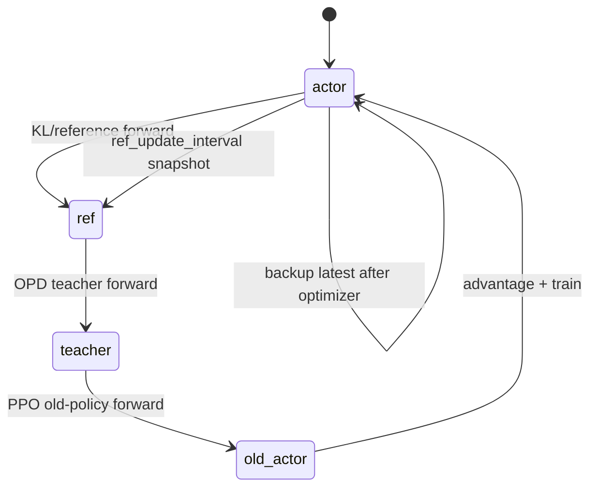

# slime Megatron 训练后端实现分析

> **源码基线**：slime `main@681b3adca54105d5ecd3fb822fa0dc58a427e0f9`
> **核验日期**：2026-08-18 · **系列**：[[slime/index]]
> **结论先行**：slime 没有包装掉 Megatron 的模型/并行/optimizer，而是把一份 rollout step 翻译成 Megatron pipeline 能消费的 packed micro-batches。单个 actor process 通过 CPU weight backups 在 actor/ref/teacher/old_actor 间切换；critic 则是同一 Megatron model provider 换成 scalar value head 的独立训练 group。训练主链的难点不在 `optimizer.step()`，而在 forward-only logprob、全 rollout advantage、packed CP data 与 policy loss 必须按同一 token/rollout 口径衔接。

## 1. 初始化：原生 Megatron model + slime role

每个训练 Ray actor 先初始化 torch.distributed/Gloo，再调用 Megatron `init(args)`，串行读取 HF config/tokenizer，随后创建 model、optimizer、scheduler 并加载 checkpoint。[`actor.py:57-97`](https://github.com/THUDM/slime/blob/681b3adca54105d5ecd3fb822fa0dc58a427e0f9/slime/backends/megatron_utils/actor.py#L57-L97)

`setup_model_and_optimizer` 直接调用 Megatron `get_model`、`get_megatron_optimizer`，把 args 中所有 `OptimizerConfig` 同名字段透传；stateless Adam 是对 Megatron optimizer 构造期的定点替换。[`model.py:270-318`](https://github.com/THUDM/slime/blob/681b3adca54105d5ecd3fb822fa0dc58a427e0f9/slime/backends/megatron_utils/model.py#L270-L318) `initialize_model_and_optimizer` 再加载 checkpoint；critic output head 缺失或 shape 不匹配时重新初始化并刷新 optimizer master params。[`model.py:974-1013`](https://github.com/THUDM/slime/blob/681b3adca54105d5ecd3fb822fa0dc58a427e0f9/slime/backends/megatron_utils/model.py#L974-L1013)

### 1.1 Model provider 的扩展边界

默认 provider 根据 dense/MoE、Transformer Engine、本地 spec、MTP 等参数构建 Megatron GPTModel；custom model provider 可完全替换构造函数，critic 仍由 wrapper 在 post-process stage 替换为单输出 value head。[`model_provider.py:92-181`](https://github.com/THUDM/slime/blob/681b3adca54105d5ecd3fb822fa0dc58a427e0f9/slime/backends/megatron_utils/model_provider.py#L92-L181)

这说明模型 plugin 的最稳边界是 **Megatron model provider/spec**，而不是在 Ray control plane 新增 model class。

## 2. 一个 actor，多个权重角色



actor 初始化时备份当前权重为 `actor` tag；按配置加载 `ref`、`teacher`、`old_actor`，并可建立 `rollout_actor` queue。[`actor.py:120-143`](https://github.com/THUDM/slime/blob/681b3adca54105d5ecd3fb822fa0dc58a427e0f9/slime/backends/megatron_utils/actor.py#L120-L143) `_switch_model` 只允许恢复已存在 tag，避免误用不存在的逻辑角色。[`actor.py:301-305`](https://github.com/THUDM/slime/blob/681b3adca54105d5ecd3fb822fa0dc58a427e0f9/slime/backends/megatron_utils/actor.py#L301-L305)

优点是 ref/teacher 不需要额外长期 GPU model；代价是每轮可能有多次 CPU↔GPU/参数 restore，且这些模型必须与 actor 结构兼容。

## 3. 训练数据进入 Megatron

### 3.1 DP-local 解包

RolloutManager 已为每个 DP rank 准备 partition；actor 只取对应 Box，把 tokens/loss masks/rollout denominators 搬到 GPU，并按 CP layout 切 rollout/teacher logprob。[`actor.py:245-299`](https://github.com/THUDM/slime/blob/681b3adca54105d5ecd3fb822fa0dc58a427e0f9/slime/backends/megatron_utils/actor.py#L245-L299)

### 3.2 Packed sequence 与 CP

`get_batch` 保留原始 per-sample tokens，再按 CP 模式切片，拼成一个 THD token stream，padding 到 TP×multiplier；`PackedSeqParams.cu_seqlens` 让 attention 仍知道每条序列边界。[`data.py:28-118`](https://github.com/THUDM/slime/blob/681b3adca54105d5ecd3fb822fa0dc58a427e0f9/slime/backends/megatron_utils/data.py#L28-L118)

response loss mask 先左 pad `prompt_length-1`、右 pad 1，以对齐 next-token logits，再按同一 CP layout 切片并断言 shape 与 tokens 相同。[`data.py:120-148`](https://github.com/THUDM/slime/blob/681b3adca54105d5ecd3fb822fa0dc58a427e0f9/slime/backends/megatron_utils/data.py#L120-L148)

因此 data packing 不改变目标语义的前提是：sequence boundary、next-token shift 和 response mask 三者同时变换，不能只拼 tokens。

### 3.3 Dynamic batching：固定的是 token budget，不是序列条数

在进入 `get_batch` 前，RolloutManager 已经用每条 sample 的 total length 构建 schedule。静态模式按 `micro_batch_size` 条数切分；`use_dynamic_batch_size` 模式忽略这个条数，用 first-fit 将变长 samples 装进不超过 `max_tokens_per_gpu * cp_size` 的 bins。[`dp_schedule.py:55-79`](https://github.com/THUDM/slime/blob/681b3adca54105d5ecd3fb822fa0dc58a427e0f9/slime/utils/dp_schedule.py#L55-L79) [`dp_schedule.py:117-120`](https://github.com/THUDM/slime/blob/681b3adca54105d5ecd3fb822fa0dc58a427e0f9/slime/utils/dp_schedule.py#L117-L120)

随后 scheduler 把 micro-batch 数补齐到 DP×VPP group 的倍数，再按 strided round-robin 或 workload balancing 分发给 DP ranks，保证各 rank/VPP stage 执行相同数量的 pipeline micro-batches。[`dp_schedule.py:122-125`](https://github.com/THUDM/slime/blob/681b3adca54105d5ecd3fb822fa0dc58a427e0f9/slime/utils/dp_schedule.py#L122-L125) [`dp_schedule.py:167-207`](https://github.com/THUDM/slime/blob/681b3adca54105d5ecd3fb822fa0dc58a427e0f9/slime/utils/dp_schedule.py#L167-L207) 因此 train engine 不要求输入先变成固定 `[B,S]`；它要求的是每个 step 的逻辑 rollout 数正确、每个 micro-batch 的 packed token workload 可执行。

## 4. Forward-only 是训练流程的一等阶段

actor/ref/teacher/critic values 都通过 `forward_only` 复用 Megatron pipeline schedule，而不是在 driver 上另起 HF model。它把 model 切到 eval、reset iterators，调用 `get_batch`，再由回调提取 logprob/entropy 或 values。[`model.py:345-417`](https://github.com/THUDM/slime/blob/681b3adca54105d5ecd3fb822fa0dc58a427e0f9/slime/backends/megatron_utils/model.py#L345-L417)

`compute_log_prob` 默认开启 rollout top-p replay，使训练侧重算的 logprob 与实际 nucleus distribution 对齐。[`actor.py:356-372`](https://github.com/THUDM/slime/blob/681b3adca54105d5ecd3fb822fa0dc58a427e0f9/slime/backends/megatron_utils/actor.py#L356-L372)

### 4.1 全词表 logits 在哪里，为什么没有被长期存下来

从 rollout 传来的 behavior logprob 已经是单条 `[R_i]` selected-token scalar。训练侧重算 current/ref/teacher logprob 时，LM head 的 `parallel_output=True` 让最后一维按 TP 切分；每个 TP rank 短暂持有的主要张量近似为 `[T, V_{\mathrm{local}}]`，其中 $V_{\mathrm{local}}\approx V/\mathrm{TP}$，而不是每卡复制完整 `[B,S,V]`。[`model_provider.py:200-209`](https://github.com/THUDM/slime/blob/681b3adca54105d5ecd3fb822fa0dc58a427e0f9/slime/backends/megatron_utils/model_provider.py#L200-L209)

vocab-parallel logprob kernel 对每行执行 TP all-reduce max/sum，只 all-reduce 已选 target logit 的标量，最后输出 `[T,1]` logprob；softmax 复用 normalized-logits storage，避免同时保留三份 full-vocab buffer。[`ppo_utils.py:187-229`](https://github.com/THUDM/slime/blob/681b3adca54105d5ecd3fb822fa0dc58a427e0f9/slime/utils/ppo_utils.py#L187-L229) [`ppo_utils.py:273-296`](https://github.com/THUDM/slime/blob/681b3adca54105d5ecd3fb822fa0dc58a427e0f9/slime/utils/ppo_utils.py#L273-L296)

这不表示 vocab logits 的峰值显存“免费”：反向仍需保存各 chunk 的局部 softmax，合计量级仍是 $O(TV_{\mathrm{local}})$。slime 的控制手段是 TP shard、packed/dynamic token budget，以及 `log_probs_chunk_size` 按 token 维分块；chunk 实现限制单次 softmax 的临时峰值，最终只拼接 `[T]` logprob/entropy，但不会把反向所需的词表级状态降成 $O(T)$。[`arguments.py:238-245`](https://github.com/THUDM/slime/blob/681b3adca54105d5ecd3fb822fa0dc58a427e0f9/slime/utils/arguments.py#L238-L245) [`ppo_utils.py:718-769`](https://github.com/THUDM/slime/blob/681b3adca54105d5ecd3fb822fa0dc58a427e0f9/slime/utils/ppo_utils.py#L718-L769) 当 entropy 只用于指标、`entropy_coef=0` 时，代码还避免为 entropy backward 长期保存额外 full-vocab tensors。[`loss.py:545-551`](https://github.com/THUDM/slime/blob/681b3adca54105d5ecd3fb822fa0dc58a427e0f9/slime/backends/megatron_utils/loss.py#L545-L551) [`ppo_utils.py:277-295`](https://github.com/THUDM/slime/blob/681b3adca54105d5ecd3fb822fa0dc58a427e0f9/slime/utils/ppo_utils.py#L277-L295)

## 5. Critic 路径

critic 采用独立 `RayTrainGroup`，但 model provider 只把 LM head 换成输出 1 的 value head。[`model_provider.py:96-114`](https://github.com/THUDM/slime/blob/681b3adca54105d5ecd3fb822fa0dc58a427e0f9/slime/backends/megatron_utils/model_provider.py#L96-L114)

Critic 不是 reward model。reward model/verifier 在 completion 完成后回答“这条答案最终得多少分”；Critic 则对每个生成位置的 prefix 状态 $s_t$ 预测“从这里继续按当前策略生成，未来累计 shaped reward 的期望是多少”。Actor 的 LM head 输出词表分布并选择 token，Critic 的 scalar head 输出一个 value；二者结构可共享 GPT 骨架，但参数、optimizer 与训练目标独立。

源码对 response token 做 causal shift：第 $t$ 个 response token $a_t$ 与它前一个位置的 hidden/output 对齐。因此 `values[t]` 对应的是生成 $a_t$ **之前**的状态 $s_t$；`values[t+1]` 对应已经生成 $a_t$、准备生成下一 token 的状态 $s_{t+1}$。最后一个 token 后没有可 bootstrap 的下一状态，GAE 把 terminal next value 设为 0。[`loss.py:97-167`](https://github.com/THUDM/slime/blob/681b3adca54105d5ecd3fb822fa0dc58a427e0f9/slime/backends/megatron_utils/loss.py#L97-L167) [`ppo_utils.py:586-607`](https://github.com/THUDM/slime/blob/681b3adca54105d5ecd3fb822fa0dc58a427e0f9/slime/utils/ppo_utils.py#L586-L607)

每轮 critic：

1. forward current values；
2. 用 rewards/values/KL 算 advantage/returns；
3. 把 loss type 改为 value loss并训练；
4. 仅 PP last stage 把旧 values 搬 CPU 返回 actor。

实现见 [`actor.py:396-422`](https://github.com/THUDM/slime/blob/681b3adca54105d5ecd3fb822fa0dc58a427e0f9/slime/backends/megatron_utils/actor.py#L396-L422)。actor/critic 并行配置当前必须一致，否则同一 rollout_data schedule 和 value 回传无法安全拼接。

这里回传给 Actor 的是 Critic **训练前 forward 得到的 old values**。这些 values 一方面参与构造 Critic 本轮的 fixed returns target，另一方面作为 Actor 计算 advantage 的 baseline；若改成 Critic 更新后的当前值，target 与 baseline 会在同一批数据上边训练边移动，Actor/Critic 也不再共享同一份行为时刻统计。[`actor.py:396-421`](https://github.com/THUDM/slime/blob/681b3adca54105d5ecd3fb822fa0dc58a427e0f9/slime/backends/megatron_utils/actor.py#L396-L421)

PPO 下 Actor 与 Critic 是两个独立 Ray groups，却复用同一批 placement-group GPU slots。driver 的调用顺序决定先 Critic 后 Actor；强制开启的 `offload_train` 则负责让非活动模型释放 GPU state。换言之，**driver 顺序是控制流开关，offload 是显存交接手段**，不是靠 `offload_train` 自己判断当前该训练哪个角色。[`arguments.py:1901-1904`](https://github.com/THUDM/slime/blob/681b3adca54105d5ecd3fb822fa0dc58a427e0f9/slime/utils/arguments.py#L1901-L1904) [`arguments.py:1953-1958`](https://github.com/THUDM/slime/blob/681b3adca54105d5ecd3fb822fa0dc58a427e0f9/slime/utils/arguments.py#L1953-L1958) [`actor.py:374-394`](https://github.com/THUDM/slime/blob/681b3adca54105d5ecd3fb822fa0dc58a427e0f9/slime/backends/megatron_utils/actor.py#L374-L394)

## 6. Actor 路径：为什么顺序不能交换

```text
optional routing metadata fill
  → ref logprob
  → teacher logprob
  → old/current actor logprob
  → attach critic values
  → restore actor
  → compute full-rollout advantages/returns
  → custom rollout_data postprocess
  → policy forward/backward + optimizer
  → debug dump / backup actor / optional ref refresh
```

ref/teacher/old-policy 都必须在 actor optimizer step 前计算；advantage 必须在完整 rollout 上算，因为 whitening 和 sequence estimator 需要跨 micro-batch统计。源码明确在 train 前完成这部分。[`actor.py:424-503`](https://github.com/THUDM/slime/blob/681b3adca54105d5ecd3fb822fa0dc58a427e0f9/slime/backends/megatron_utils/actor.py#L424-L503)

logprob 的额外 forward 只有在严格条件下可省：单 training step、policy loss、无 KL/mismatch/critic/old actor/OPD 等，并满足 routing 条件；否则单独重算。[`actor.py:460-489`](https://github.com/THUDM/slime/blob/681b3adca54105d5ecd3fb822fa0dc58a427e0f9/slime/backends/megatron_utils/actor.py#L460-L489) 这是一项性能优化，不是默认假设 old logprob 永远等于当前 loss forward。

## 7. `train_one_step`：Megatron pipeline 的实际闭环

每个 step 先清 grad，构造 forward closure：取 packed batch → 调 model → 把 `loss_function(args,batch,num_mbs,step_global_batch_size)` 作为 pipeline loss callback。Megatron 的 `get_forward_backward_func` 决定 PP schedule 并执行所有 micro-batches。[`model.py:509-654`](https://github.com/THUDM/slime/blob/681b3adca54105d5ecd3fb822fa0dc58a427e0f9/slime/backends/megatron_utils/model.py#L509-L654)

随后检查 inf/NaN grad，成功时 optimizer step，并让 scheduler 按 **实际逻辑 rollout 数** 而非静态 sample 数递增；PP last stage 再按 DP×CP 规则 reduce metrics。[`model.py:656-699`](https://github.com/THUDM/slime/blob/681b3adca54105d5ecd3fb822fa0dc58a427e0f9/slime/backends/megatron_utils/model.py#L656-L699)

外层 `train` 让 model 进入 train mode、配置 DDP overlap hooks，再按 `num_microbatches/global_batch_sizes` 序列执行多个 optimizer steps。[`model.py:707-760`](https://github.com/THUDM/slime/blob/681b3adca54105d5ecd3fb822fa0dc58a427e0f9/slime/backends/megatron_utils/model.py#L707-L760)

## 8. Routing replay 的状态机

MoE routing replay 不是单一开关。actor 可先把 SGLang 返回的每 token/layer/top-k experts 写入 Megatron `RoutingReplay` buffers；ref/teacher 可 fallthrough，old actor forward 可 record 或 replay，backward 切到 `replay_backward`，训练结束清理状态。[`actor.py:307-354`](https://github.com/THUDM/slime/blob/681b3adca54105d5ecd3fb822fa0dc58a427e0f9/slime/backends/megatron_utils/actor.py#L307-L354) [`actor.py:430-489`](https://github.com/THUDM/slime/blob/681b3adca54105d5ecd3fb822fa0dc58a427e0f9/slime/backends/megatron_utils/actor.py#L430-L489)

它解决的是同权重下 MoE route 分歧带来的 logprob/gradient path 差异，不能替代权重 version barrier。

## 9. Checkpoint、offload 与 release

save 时若 distributed optimizer overlap param gather，会临时关闭 forward pre-hook，checkpoint 后恢复；actor wrapper还支持 async save、HF export。[`model.py:943-971`](https://github.com/THUDM/slime/blob/681b3adca54105d5ecd3fb822fa0dc58a427e0f9/slime/backends/megatron_utils/model.py#L943-L971) [`actor.py:567-589`](https://github.com/THUDM/slime/blob/681b3adca54105d5ecd3fb822fa0dc58a427e0f9/slime/backends/megatron_utils/actor.py#L567-L589)

`offload_train` 通过 TMS pause/resume 保留 actor/critic Ray 对象但释放 GPU state，wake 时重建 process groups；它不同于 actor process 内通过 `_switch_model` 在 actor/ref/teacher 权重 tags 间 restore，也不同于 `release_train` 的保存后 kill actors、下轮重新 init。[`actor.py:205-243`](https://github.com/THUDM/slime/blob/681b3adca54105d5ecd3fb822fa0dc58a427e0f9/slime/backends/megatron_utils/actor.py#L205-L243) [`actor_group.py:151-208`](https://github.com/THUDM/slime/blob/681b3adca54105d5ecd3fb822fa0dc58a427e0f9/slime/ray/actor_group.py#L151-L208)

## Related Pages

- [[15_slime_loss_parallelism_analysis]] — loss callback、advantage 和 reducer 数学
- [[16_slime_weight_sync_analysis]] — actor backup 后怎样提交到 SGLang
- [[17_slime_train_inference_consistency_analysis]] — top-p/routing/old-policy 重算的正确性含义
- [[31_slime_posttraining_stability_analysis]] — grad/loss/metric 的稳定性门禁
