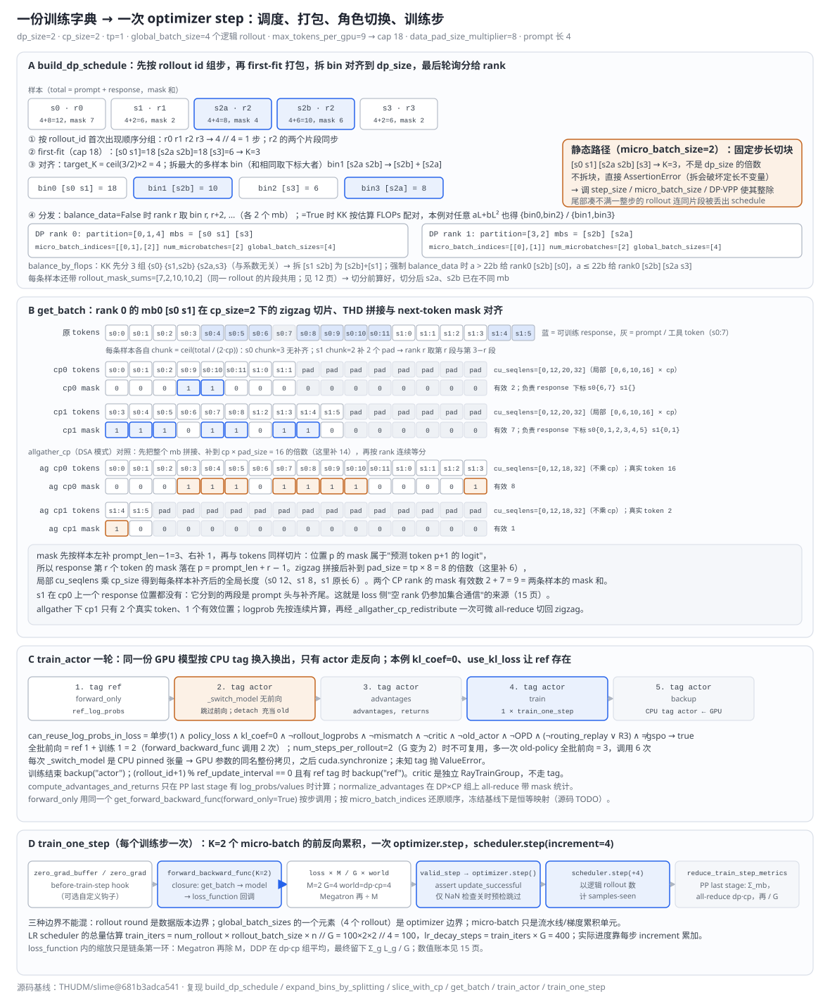
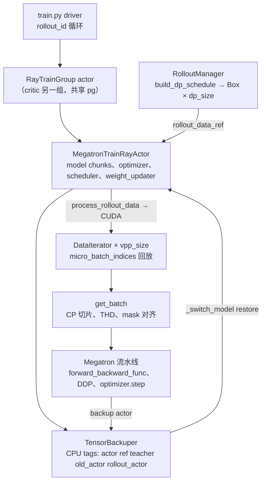

# slime Megatron 训练后端分析

> **源码基线**：`THUDM/slime@681b3adca54105d5ecd3fb822fa0dc58a427e0f9`（`main`，2026-08-12）
> **主题**：一份 rollout 训练字典怎样变成一次 Megatron optimizer step：`build_dp_schedule` 先按逻辑 rollout 组步、first-fit 打包、拆 bin 对齐并分给 DP rank；trainer 用轻量 `DataIterator` 回放计划，`get_batch` 把 micro-batch 切成 zigzag CP 片、拼成 THD 流并对齐 next-token mask；actor 一轮内按 CPU tag 切换 ref、teacher、old_actor 只做前向，再在训练边界内算 advantage；`train_one_step` 跑完全部 micro-batch 的前反向后做一次 optimizer step，并以逻辑 rollout 数推进 LR scheduler。核心代码在 `slime/backends/megatron_utils/{actor,model,data,cp_utils,checkpoint}.py` 与 `slime/utils/dp_schedule.py`。
> **适用范围**：Megatron 训练执行与数据落地；Sample 与训练字典的语义归 12，loss 目标函数与归约数值归 15，权重同步归 16，logprob 一致性归 17。
> **最近更新**：2026-09-11。按特性分析画像重写，补最小实例、四泳道原理图、调用树与成本账本。

---

## 1. 特性概览

### 1.1 问题背景

rollout 交付的是长度不一、带样本标识、mask 与可选行为策略字段的训练字典（见 [[12_slime_sample_datasource_analysis]]）；Megatron 需要的却是每个 VPP stage 按相同 schedule 推进的 micro-batch 序列、每个 micro-batch 先变成 THD packed token 流与 `PackedSeqParams`，再交给流水线 forward/backward，并且 optimizer 只在整步反向完成后推进一次。两边之间必须有人守住四条训练侧不变量：rollout 身份先于打包固定，否则 compact 扇出的片段会改变 step 大小与训练进度；各 DP rank 与 VPP stage 执行相同数量的 micro-batch，否则流水线失步；token、序列边界与 next-token mask 一起变换，否则 packed attention 或 loss 位置会串样本；optimizer 只在完整流水线反向后推进，否则 micro-batch 会被误当成独立更新。此外 RL 还要在一轮里给同一批 token 算 ref、teacher、old-policy 的对照 logprob，而这些角色都不需要各自的 optimizer。

### 1.2 解决方法

slime 没有另写通用 RL trainer，而是在 Megatron 外围加一层 actor 适配。进入内核前的工作全部在还能看到完整 step 的地方完成：`RolloutManager` 调 `build_dp_schedule` 按 `rollout_id` 首次出现顺序把样本聚成逻辑 rollout，每 `global_batch_size` 个 rollout 组成一个训练步，每步先 first-fit（或静态切块）打成 micro-batch，再把 micro-batch 数对齐到 `dp_size × mb_group` 的倍数，最后轮询或按估算 FLOPs 分给 DP rank；每个 rank 收到 `partition`、`micro_batch_indices`、`num_microbatches`、`global_batch_sizes`。trainer 侧 `DataIterator` 只按 `micro_batch_indices` 取子集，`get_batch` 再做 CP 切片、THD 拼接、补齐与 mask 对齐。角色方面，`TensorBackuper` 给同一份 GPU 模型维护 `actor`、`ref`、`teacher`、`old_actor` 等 CPU pinned 副本，`_switch_model` 整份换入后走同一个 `get_forward_backward_func(forward_only=True)`；只有 critic 是独立的 `RayTrainGroup`。进入内核后继续使用 Megatron 原生 `get_model`、DDP、流水线 schedule、`get_megatron_optimizer` 与 `OptimizerParamScheduler`，slime 只提供 data closure 与 loss 回调，并把该步的逻辑 rollout 数 `step_global_batch_size` 同时交给 loss 缩放与 scheduler 的 `increment`。

### 1.3 收益、开销和约束

| 维度 | 直接收益 | 必付成本或边界 |
|---|---|---|
| 训练内核 | 复用 Megatron 的 TP/PP/CP/EP、distributed optimizer、overlap hooks 与模型专属能力 | 与特定 Megatron 版本及镜像补丁耦合；官方 quick start 自承镜像可能含临时 patch |
| 调度 | step、micro-batch、DP partition 在 `RolloutManager` 算一次，所有 rank 回放同一计划 | 计划经 Ray object store 的 CPU 张量送达，actor 注释自承"不确定是否成为瓶颈" |
| 动态打包 | first-fit 逼近 `max_tokens_per_gpu × cp_size`，对齐靠拆 bin 而非补样本 | 拆出的 bin 不均匀；`balance_by_flops` 不保证 token cap；静态路径不对齐直接断言 |
| CP 切片 | zigzag 两段让每个 CP rank 的因果注意力负载接近；mask 与 token 同一规则切分 | 每条样本各自补齐到 `2·cp·chunk`，短样本可能在某个 rank 上没有 response 位置 |
| 角色共享 | ref/teacher/old_actor 不占第二份 GPU 显存与 process group | 每次切换是一次 CPU↔GPU 整份拷贝加 `cuda.synchronize`；每个 tag 一份 pinned host memory |
| 前向复用 | 单步、`kl_coef = 0` 等条件下跳过独立 old-policy 前向 | 多步、critic、GSPO、mismatch 指标等任一条件都要多一次全批前向 |
| 卸载 | `sleep`/`wake_up` 让 colocate 或 PPO 下训练与 rollout 分时用卡 | 销毁并重建 process group；PP>2 需额外 barrier 预热 WORLD |
| 进度计数 | `step_global_batch_size` 同时驱动 loss 缩放、指标分母与 LR increment | 扇出下 `train_iters` 只是估算，schedule 可能提前或推迟到达平台 |

### 1.4 术语约定

| 术语 | 含义 |
|---|---|
| 训练步 / `step_global_batch_size` | `global_batch_sizes` 的一个元素，即一次 optimizer step 覆盖的逻辑 rollout 数 G；不是样本数也不是 token 数 |
| micro-batch / K / M | 一步内打包出的 bin；K 是全步总数，M = K / dp_size 是每 rank 的 `num_microbatches` |
| `align_to` | `dp_size × (mb_group if vpp_size > 1 else 1)`，K 必须是它的倍数 |
| `partition` | 某 DP rank 拥有的样本在展平批次中的全局位置；`micro_batch_indices` 是 partition 内的局部下标 |
| tag | `TensorBackuper` 里一份 CPU pinned 参数副本的名字：`actor`、`ref`、`teacher`、`old_actor`、`rollout_actor` |
| zigzag CP | 每条样本补齐后切成 `2·cp` 段，rank r 取第 r 段与第 `2cp−1−r` 段 |
| THD | Megatron packed sequence 布局，一条 `[1, T]` token 流加 `cu_seqlens` 描述各样本边界 |
| `forward_only` | 用同一流水线函数只做前向并在 PP last stage 收集非 loss 输出 |
| `valid_step` | `check_for_nan_in_loss_and_grad` 为假时由 slime 预检梯度，inf/nan 则跳过本步；为真时恒为真，`optimizer.step` 报告失败即断言 |

---

## 2. 训练后端详细方案

### 2.1 最小实例：四个逻辑 rollout、五条样本进入一次 optimizer step

取 `dp_size=2`、`cp_size=2`、`tp=1`、无 VPP，`--use-dynamic-batch-size` 且 `max_tokens_per_gpu=9`（cap = 9 × 2 = 18），`data_pad_size_multiplier=8`，`rollout_batch_size=2`、`n_samples_per_prompt=2`、`num_steps_per_rollout=1`（故 `global_batch_size=4` 个逻辑 rollout）。rollout 交来五条样本，prompt 一律 4 个 token：s0（r0，response 8，其中下标 3 是工具 token、mask 0）、s1（r1，response 2）、s2a 与 s2b（同属 r2 的 compact 扇出，response 4 与 6）、s3（r3，response 2）。converter 已按 12 页规则给出 `rollout_ids=[0,1,2,2,3]` 与 `rollout_mask_sums=[7,2,10,10,2]`。本例开 `--use-kl-loss` 但 `kl_coef=0`，于是 ref tag 存在而 reward 不做 KL 整形。下图把四次决定性转换放进四条泳道。



| 步骤 | 输入 | 决定性转换 | 输出 |
|---|---|---|---|
| 组步 | `rollout_ids=[0,1,2,2,3]`，`global_batch_size=4` | 按首次出现聚成 r0 r1 r2 r3，`4 // 4 = 1` 步；r2 的两个片段同步 | 一步五条样本，长度 `[12,6,8,10,6]` |
| 打包 | 长度与 cap 18 | first-fit：`[s0 s1]=18 [s2a s2b]=18 [s3]=6 → K=3` | 三个 bin |
| 对齐 | K=3，`align_to=2` | `target_K = ceil(3/2)×2 = 4`；拆和最大的多样本 bin，和相同取下标大者 → bin1 `[s2a s2b]` 按长度降序分成 `[s2b]` 与 `[s2a]` | bins `[s0 s1] [s2b] [s3] [s2a]`，K=4 |
| 分发 | `balance_data=False` | rank r 取 bin r、r+2 | rank 0 `partition=[0,1,4]`、`micro_batch_indices=[[0,1],[2]]`；rank 1 `partition=[3,2]`、`[[0],[1]]`；`num_microbatches=[2]`、`global_batch_sizes=[4]` |
| 打包 mb0 | rank 0 的 `[s0 s1]`，cp0 | s0 chunk 3 无补齐，取段 0 与 3；s1 chunk 2 补 2 个 pad；拼成 10 个 token 再补到 16 | cp0 tokens `s0:0 s0:1 s0:2 s0:9 s0:10 s0:11 s1:0 s1:1` + 8 pad，`cu_seqlens=[0,12,20,32]` |
| 对齐 mask | s0 mask `1 1 1 0 1 1 1 1`、s1 mask `1 1` | 左补 `prompt_len−1=3`、右补 1，再同规则切片 | cp0 有效 2（s0 的 response 下标 `{6,7}`，s1 无），cp1 有效 7（s0 的 `{0,1,2,3,4,5}` 含一个 0，s1 的 `{0,1}`）；2 + 7 = 9 |
| 角色 | ref tag 存在，单步，`kl_coef=0` | ref 前向存 `ref_log_probs`；`can_reuse_log_probs_in_loss=True` → 不做 old-policy 前向 | 全批前向 2 次（ref 1 + 训练 1）；若 `num_steps_per_rollout=2`（此时 G 变为 2、共 2 步），可复用条件失效，多一次 old-policy 全批前向共 3 次，按 `forward_backward_func` 调用计则从 2 次变为 6 次 |
| 训练步 | K=2 个 mb/rank，G=4 | 清梯度 → `forward_backward_func` 累积 2 个 mb → `optimizer.step()` → `scheduler.step(increment=4)` | `train_iters = 100×2×2 // 4 = 100`，`lr_decay_steps = 400`（`num_rollout=100`） |

同一份数据若走静态路径（`micro_batch_size=2`），切块得 `[s0 s1] [s2a s2b] [s3]`，K=3 不是 2 的倍数，`build_dp_schedule` 直接抛 `AssertionError` 并要求调整 step size、micro batch 或 DP/VPP，而不是拆块，因为拆块会破坏"静态 micro-batch 定长"的不变量。

#### 2.1.1 调度层：先固定统计单位，再考虑物理装箱

组步发生在打包之前，所以无论 r2 拆成几个片段，它只占一个 rollout 名额，训练步数与 `step_global_batch_size` 都不受扇出影响；尾部凑不满一整步的 rollout 连同片段被丢出 schedule，不足一步立即断言，每步样本数少于 `dp_size` 也断言。拆 bin 是唯一的对齐手段：`expand_bins_by_splitting` 每次取和最大的多样本 bin（Python 元组比较使和相同时取下标大者），`_split_bin_by_tokens` 按长度降序把样本逐个放进当前较轻的一半（两半相等时放左半），两半都是原 bin 的真子集，因此新 bin 不会大于原 bin；所有 bin 都成单样本仍凑不够时断言。s2a 与 s2b 在本例落到同一 rank 的两个 micro-batch，这正是 12 页预先算 `rollout_mask_sums` 的原因：切分后局部批次看不见完整分母。

#### 2.1.2 打包层：token、边界与 mask 同一规则变换

`get_batch` 先保留原始 token 列表为 `unconcat_tokens`（CP 下算 logprob 要用完整 token），再对每条样本单独 `slice_with_cp`：chunk 大小为 `ceil(total / (2·cp))`，补齐到 `2·cp·chunk` 后取两段；拼接后把总长补到 `tp × data_pad_size_multiplier` 的倍数，局部 `cu_seqlens` 乘 `cp_size`。源码注释说 THD 要求 `cu_seqlens` 是原始长度，实际乘回的是每条样本补齐后的全局长度：本例 s0 为 12，s1 为 8 而非原长 6。mask 不能直接切：response 第 r 个 token 由位置 `prompt_len + r − 1` 的 logit 预测，所以先左补 `prompt_len − 1`、右补 1 把 mask 对齐到 token 流位置，再做相同切片，最后断言 mask 与 tokens 同形。本例 s1 在 cp0 上没有任何 response 位置，因为 cp0 分到的两段是 prompt 头与补齐后的尾部。这是 CP 上"空 rank"的来源，loss 侧对它的处理见 [[15_slime_loss_parallelism_analysis#2.2 从最小实例到整套 loss 层|CP 分子可加 §2.2.4]]。

#### 2.1.3 角色层：一份 GPU 模型、多份 CPU tag

actor 初始化时 `backup("actor")`，随后按 `with_ref`、`with_opd_teacher`、`keep_old_actor` 依次用 `load_other_checkpoint` 把别的 checkpoint 装进同一份模型并各存一个 tag。一轮里 `train_actor` 先切 `ref` 做 `forward_only` 得 `ref_log_probs`，再切 `teacher`，再切 `old_actor`（或 `actor`），只有 `can_reuse_log_probs_in_loss` 不成立时才再做一次 old-policy 前向；接收 critic 的 `values`；切回 `actor` 算 advantage；训练；`backup("actor")`。本例的可复用条件全部满足，少做一次全批前向。

#### 2.1.4 步层：一次 optimizer step 的三个边界

`train` 对 `num_microbatches` 的每个元素调一次 `train_one_step`；每步清 grad buffer 与 optimizer grad，`forward_backward_func` 跑完本 rank 全部 M 个 micro-batch（不是每个 micro-batch 单独 step），`valid_step` 为真才 `optimizer.step()` 并 `assert update_successful`（NaN 检查关闭时由 slime 预检梯度，开启时恒为真），然后 `opt_param_scheduler.step(increment=step_global_batch_size)`。因此 rollout round 是数据版本边界，`global_batch_sizes` 的一个元素是 optimizer 边界，micro-batch 只是流水线与梯度累积的执行单元。

### 2.2 从最小实例到整个训练后端

下面各组件的"为何"是本页依据源码形态与失败路径重建的设计理由（标"本页推断"），"怎样"与"代价"以冻结基线的实现为准；Megatron 内部的 schedule、DDP 平均与 optimizer 语义按其公开契约叙述，slime 源码只证明自己传了什么、断言了什么。

#### 2.2.1 初始化：Megatron 模型、优化器、scheduler 与 checkpoint 分派

**职责。** `MegatronTrainRayActor.init` 在 `debug_rollout_only` 下直接返回 0；否则 `monkey_patch_torch_dist`、按环境变量注册可销毁的默认 process group、`init(args)`（`mpu.initialize_model_parallel`、随机种子、tokenizer、`init_num_microbatches_calculator`），逐 GPU 串行读 HF config 与 tokenizer 以避免并发写缓存，再调 `initialize_model_and_optimizer`。后者由 `setup_model_and_optimizer` 用 Megatron `get_model` 构建 model chunks，把 `OptimizerConfig` 的同名字段从 args 复制过去，`get_megatron_optimizer` 建优化器，`get_optimizer_param_scheduler` 建 scheduler；然后 `load_checkpoint` 分派：目录存在且非空是断言前提，含 `latest_checkpointed_iteration.txt` 或目录名匹配 `iter_XXXXXXX` 走 Megatron 原生加载，否则走 HF→Megatron 权重加载并在混合精度下 `optimizer.reload_model_params()`，iteration 记 0。

**为何。** 复制一套 Megatron 模型与优化器构造会让 slime 追着 Megatron 的每个并行特性改；只做参数映射与分派，Megatron 的优化继续留在其所有者手中（本页推断；被否方案是"统一 trainer"，判据是要不要重新实现 PP/VPP、CP、distributed optimizer 与 overlap hooks）。`init_num_microbatches_calculator` 的源码注释写明"我们不用它，只为通过 Megatron 校验"，真实的每步 `num_microbatches` 来自上游 schedule。

**怎样。** scheduler 以样本数计：`train_iters = num_rollout × rollout_batch_size × n_samples_per_prompt // global_batch_size`，`lr_decay_iters` 缺省等于它，`lr_decay_steps = lr_decay_iters × global_batch_size`，warmup 按 `lr_warmup_fraction × lr_decay_steps` 或 `lr_warmup_iters × global_batch_size`。源码注释说明扇出、过滤或自定义 step splitter 会让实际总步数漂移，schedule 仍按每步 `increment` 记录真实进度，最坏是提前或推迟到达平台。`--use-stateless-adam` 在构造期间临时把 Megatron 的 `Adam`（及 `CPUAdam`、distrib optimizer 的 `Adam`）替换成 `StatelessAdam`，并关闭 distributed optimizer 的状态初始化；它每步以零阶矩起算，不持久化 `exp_avg`/`exp_avg_sq`，`load_state_dict` 也清空 state。critic 若从 actor checkpoint 加载而 `output_layer` 形状不符或缺失，`_critic_output_layer_needs_reinit` 读 dist-checkpoint 元数据后重初始化 value head。trainer 最后把 `train_parallel_config`（`dp_size` 取 `with_context_parallel=False`、`cp_size`、`vpp_size`、`microbatch_group_size_per_vp_stage`）经 rank 0 送给 `RolloutManager`。

**代价与边界。** `setup_model_and_optimizer` 断言 `not moe_use_upcycling` 且 `load` 或 `pretrained_checkpoint` 之一存在；stateless Adam 断言 `optimizer == adam` 与 `no_save_optim`；`init` 断言 numpy 1.x。checkpoint 模块启动时猴补 `ShardedTensor` 的元数据校验以加速大模型加载，注释自承 hacky。

#### 2.2.2 角色与 CPU tag：ref、teacher、old_actor 共享一份 GPU 模型

**职责。** 非 critic worker 建 `TensorBackuper.create(single_tag=None)` 得到普通实现：每个 tag 一份按参数名索引的 CPU pinned 张量，`backup` 首次分配 `empty_like(pin_memory=True)` 再 `copy_(non_blocking)` 并 `cuda.synchronize`，`restore` 断言每个参数名都有备份后整份拷回，`copy` 在两个 tag 间搬。`_switch_model` 对未知 tag 抛 `ValueError`。`load_other_checkpoint` 暂存 `load/no_load_optim/no_load_rng/finetune/ckpt_step`，用目标路径替换 `load`，关闭 optimizer/RNG 加载、开 finetune，ref 与 teacher 可各自指定 `ckpt_step`，加载成功后恢复原 args、`backup(tag)` 并把 active tag 设为该 tag；恢复语句不在 `finally` 中，加载异常会中止此路径。因此未开 offload 时，初始化结束后 GPU 上是最后装载的那份权重；weight updater 构造时拿到的 `weights_getter` 指向 CPU `actor` tag。

**为何。** 为 ref、teacher、old_actor 各建常驻 trainer 会复制 process group、模型显存与调度对象，却没有对应的 optimizer 工作；它们只需为同一 token batch 提供对照 logprob，所以用传输时间换显存（本页推断；判据是该角色是否需要独立的可训练状态）。critic 有独立目标与 optimizer state，因此是唯一独立的 `RayTrainGroup`，与 actor 共享同一 placement group 区域（`pgs["critic"] = pgs["actor"]`），参数经 `parse_megatron_role_args` 或 deepcopy 得到。

**怎样。** 一轮顺序见 §2.1.3。`keep_old_actor` 且 `update_weights_interval == 1` 时初始化额外 `backup("rollout_actor")`；`update_weights` 之后按队列轮转 `copy(rollout_actor → old_actor)` 再 `backup("rollout_actor")`，interval 非 1 时直接 `backup("old_actor")`。它维护的是训练侧对照快照，`old_actor` 不等于当前 GPU 模型。`(rollout_id + 1) % ref_update_interval == 0` 且有 ref tag 时刷新 ref。PPO 的 driver 先发 critic 的 `async_train`，把每 worker 的 value ref 作为 `external_data` 传给 actor；`train_critic` 先 `forward_only(get_values)`，算 advantage，原地把 `loss_type` 设为 `value_loss` 再 `train`，PP last stage 把 `values` 搬回 CPU 返回。`num_critic_only_steps` 之前的轮只训练 critic。

**代价与边界。** 每个 tag 占一份 pinned host memory；每次切换是一次全模型 H2D 拷贝加同步；参数校验强制 PPO 开 `offload_train`；`offload_train` 会同时置 `disable_grad_buffers_cpu_backup` 与 `disable_param_buffers_cpu_backup`，但 critic 的角色参数把后者改回假（`create_training_models` 与 `_apply_megatron_role_overrides`），critic 仍保留 param buffer 的 CPU 备份。官方文档把 actor/critic 不同拓扑标为当前不支持。

#### 2.2.3 调度层：build_dp_schedule 先按 rollout 组步，再打包、对齐、分发

**职责。** 纯 Python 函数，输入 `total_lengths`、`rollout_indices`、`global_batch_size` 与 `train_parallel_config`，输出 `partitions`、`micro_batch_indices`、`num_microbatches`、`global_batch_sizes`。模块 docstring 把策略写成"pack first, distribute second"，并列出四条被 `tests/test_dp_schedule.py` 断言的不变量：各 rank 每步 `num_microbatches` 相同；动态路径（不开 `balance_by_flops`）每个 mb ≤ `max_tokens_per_gpu × cp_size`，唯一例外是单条超 cap 样本独占一个 mb；各 rank 样本并集等于裁剪后保留的样本且每条只放一次；每 rank 的 `micro_batch_indices` 展平恰为 `range(num_samples_rank)`。

**为何。** 若让每个 Megatron rank 独立读 rollout 数据，就要在所有 rank 上重复解释 `rollout_id`、变长打包、compact 扇出与动态过滤，还要证明各 PP rank 的 micro-batch 次序一致；在仍拥有全局视图的 `RolloutManager` 算一次再按 DP 身份取数，牺牲 CPU/Ray 传输换来语义与执行边界分离（本页推断；判据是 rollout 语义解释是否需要全局视图）。同一 DP 副本内的 TP、PP、CP、EP rank 取同一个 `rollout_data_ref[dp_rank]`，CP 之后才在 `get_batch` 内切同一序列，EP 在前向时按路由分发 token，都不是各自领新样本。

**怎样。** 打包变体的枚举依据是 `_pack_step_into_mbs` 的分支：`use_dynamic_batch_size` 且 `balance_by_flops` 时先用总 token / cap 上取整定 bin 数，再按 `calculate_fwd_flops` 估算的工作量做 Karmarkar-Karp（`equal_size=False`），注释写明不保证 token cap；仅动态时 `first_fit_pack`；否则按 `micro_batch_size` 固定步长切块。分发变体的依据是 `args.balance_data`：开时对每个 mb 的估算 FLOPs 做 `get_seqlen_balanced_partitions(..., equal_size=True)`，该函数用最大差分法：按负载排序建状态，每次弹出差值最大的两个状态并把重端与轻端反向配对合并，直到剩一个，等大小约束保证每 rank 相同数量的 mb；关时 rank r 取 bin r、r+dp、r+2dp。本例 4 个 bin 的工作量是 `f(12)+f(6)`、`f(10)`、`f(6)`、`f(8)`；对任意 `f(L)=aL+bL²`（a、b 非负且不全为 0），排序与差值关系不变，KK 都给出 rank 0 `{bin0,bin2}`、rank 1 `{bin1,bin3}`，与轮询相同。`balance_by_flops` 会同时置 `balance_data=True`，并要求 `use_dynamic_batch_size`。参数 `--num-steps-per-rollout` 在校验时反算 `global_batch_size` 并断言一致，不改变"逻辑 rollout"这一计数单位。

**代价与边界。** 断言：`num_steps ≥ 1`、每步样本数 ≥ `dp_size`、动态路径拆到全单样本仍不足、静态路径 K 不对齐。KK 均衡的是估算计算量而非 wall time。`--balance-data` 的 help 仍写着"可能把同一 prompt 的不同 response 放进不同训练步"，与冻结基线不符：分步在打包之前按 rollout 完成，KK 只在每步内部把 micro-batch 分给 rank。单条超 cap 样本不截断，独占一个超 cap mb，官方 quick start 同样如此说明。

#### 2.2.4 打包层：DataIterator 与 get_batch 的 THD 流与 CP 切片

**职责。** `process_rollout_data` 断言 ref 数等于 `dp_size`，`ray.get` 本 rank 那份，把全局 `total_lengths` 存进 `Timer().seq_lens` 供性能日志后按 `partition` 投影，并为本地样本派生 `local_raw_reward`。`_get_rollout_data` 再把 `tokens`（long）、`loss_masks`（int）、`rollout_mask_sums`（float32）与多模态张量预搬到当前 CUDA 设备，`rollout_log_probs` 与 `teacher_log_probs` 先按 CP 规则 `slice_log_prob_with_cp` 再搬。`get_data_iterator` 为每个 VPP stage 建一个共享同一 `micro_batch_indices` 但各自计 offset 的 `DataIterator`；`get_next(keys)` 对每个键取子集，缺失键给 `None`。`get_batch` 的两个分支由 `allgather_cp` 选择：默认 zigzag 分支逐样本切片（§2.1.2）；`allgather_cp` 分支先把整个 micro-batch 拼成一条全局流、补到 `cp_size × pad_size` 的倍数后按 `cp_rank` 连续等分，mask 同样先拼再切。用 §2.1 的 mb0 回放：两条样本拼成 18 个 token，补到 `2 × 8 = 16` 的倍数 32，`cu_seqlens=[0,12,18,32]` 不乘 cp；cp0 拿 `s0:0–11` 与 `s1:0–3`（有效 mask 8），cp1 拿 `s1:4–5` 与 14 个 pad（有效 mask 1）。有效 mask 总数与 zigzag 相同，都是 9，但两个 rank 的真实 token 数是 16 对 2。这是 CP 布局的兄弟轴，源码注释称之为 DSA 模式，logprob 侧还需 `_allgather_cp_redistribute` 把连续片重排回 zigzag 布局；两分支的 loss 归约差异归 15 页。多模态输入按键在样本维拼接，路由重放的 `rollout_routed_experts` 由 `prepare_routed_experts_for_routing_replay` 按同一 pad 与切片规则对齐（归 [[17_slime_train_inference_consistency_analysis]]）。

**为何。** 在线路径不走 Megatron 的 GPT Dataset / DataLoader：训练侧只需按预计算下标回放，不需要再解释 RL 语义；THD 打包让变长样本共享一次前向而不必 padding 到最长（本页推断；判据是变长 RL 样本在 batch 维 padding 的浪费）。zigzag 两段是 Megatron THD CP 的既定布局，slime 只是按它切片与对齐 mask，这一点属于依赖契约而非 slime 源码证明。

**代价与边界。** 补齐到 `tp × data_pad_size_multiplier`（默认 128）的倍数在小 micro-batch 上浪费明显；`pad_token_id` 固定为 0 并带注释"应该没问题？"；`get_batch` 断言 `tokens` 在 keys 中且 mask 与 tokens 同形。`_get_rollout_data` 在设备搬运处挂着 `# TODO: this is ugly, move to somewhere else?`（本页推断：指取数与搬运混在一处）。

#### 2.2.5 前向层：forward_only、logprob 与 can_reuse_log_probs_in_loss

**职责。** `forward_only(f, ...)` 重置迭代器，设 eval 模式，可选执行 `custom_megatron_before_log_prob_hook_path`，对每个训练步调 `get_forward_backward_func(forward_only=True)`，回调 `f` 是 `get_log_probs_and_entropy` 或 `get_values`；`rollout_top_p != 1.0` 时把 top-p 记录键并入 batch keys 并传给回调作 keep-mask。PP last stage 把各 mb 输出按键拼接，动态批次下再按 `micro_batch_indices` 还原原始顺序；`build_dp_schedule` 让每 rank 的 `micro_batch_indices` 展平恰为 `range(n)`，所以这一还原在冻结基线是恒等映射。`get_log_probs_and_entropy` 对整条 `[T, V]` logits 一次计算：先按 CP 布局构造 shifted target，需要时构造 `[T, vocab_local]` 的 top-p keep-mask（只作用于 logprob，entropy 用未掩码 logits），`calculate_log_probs_and_entropy` 支持按 `log_probs_chunk_size` 分块并在 TP 组上做 vocab-parallel softmax，`entropy_coef == 0` 时不保存 entropy 的反向激活；最后按 CP 布局抽出每条样本的 response 片。

**为何。** 对照 logprob 与训练前向共用同一模型与并行拓扑，数值路径一致，这是 17 页讨论一致性的前提；用推理引擎另算会引入第二套数值实现（本页推断）。`can_reuse_log_probs_in_loss` 的判据是"该步尚未更新参数"：单步、policy loss、`kl_coef == 0`、不用 rollout logprob、不算 mismatch 指标、无 critic、无 old_actor、无 OPD、非 GSPO、路由重放关闭或用 R3 时，训练前向的 detached logprob 就是 old logprob；多步后参数已变，就不能沿用。`get_mismatch_metrics` 即便开 `use_rollout_logprobs` 也会多一次前向（参数校验有日志提示）。

**代价与边界。** 每个额外角色一次全批前向；`get_log_probs_and_entropy` 断言 logits 为 float32 且 batch 维为 1；`rollout_top_p != 1.0` 却缺 top-p 记录抛 `ValueError`；动态批次的结果重排挂着两条 TODO（§5.4）。

#### 2.2.6 advantage 位于训练边界内

**职责。** `compute_advantages_and_returns` 只在 PP last stage 有 `log_probs` 或 `values` 时工作：`kl_coef == 0` 或无 logprob 时 KL 取零，否则 `compute_approx_kl(k1/k2/k3/low_var_kl)`；自定义 `custom_advantage_function_path` 接管并原地写 `advantages`/`returns`；否则按 `advantage_estimator` 分派 grpo/gspo/cispo（reward 逐 token 广播）、ppo（KL 乘 `-kl_coef`，cp_rank 0 把 reward 加到末位置后做 GAE）、reinforce_plus_plus（折扣回报）与 reinforce_plus_plus_baseline；`use_opd` 再减 `opd_kl_coef × (student − teacher)`；`normalize_advantages` 在 DP-with-CP 组上做带 mask 的白化，CP 下先按 token 归属切 mask，且注释强调即便某 CP rank 没有 response token 也必须参加集合通信。随后 `rollout_data_postprocess_path` 钩子可改写整份 rollout_data（含 loss mask），`log_rollout_data` 用同一 `rollout_mask_sums` 归约后经 DP-with-CP 的 gloo 组 gather 报告。

**为何。** 放进 rollout 服务会迫使推理侧拥有 ref/teacher/critic/current 的 Megatron 数值路径与训练侧并行归一化域，也容易在 DP/CP 切分前后形成两套统计实现；训练边界内所有信号齐备且参数尚未更新（本页推断，与旧版设计分析一致）。`--disable-compute-advantages-and-returns` 可整体关闭，供 SFT 或自定义 loss 使用，所以这是默认所有权而非硬编码。估计器的数值语义与白化的分母归 [[15_slime_loss_parallelism_analysis#2.2 从最小实例到整套 loss 层|15 页 §2.2.1 的估计器一节]]。

**代价与边界。** `--advantage-estimator` 的 argparse `choices` 先拒绝未知值，绕过解析改写 args 时 `compute_advantages_and_returns` 才抛 `NotImplementedError`；OPD 缺 `teacher_log_probs` 抛 `ValueError`；REINFORCE++ 系列参数校验强制 `normalize_advantages`；白化全局 mask 和为 0 抛 `ValueError`。

#### 2.2.7 训练步：train、train_one_step 与 optimizer 边界

**职责。** `train` 断言 `num_microbatches` 与 `global_batch_sizes` 等长，重置迭代器，设 train 模式，把 `optimizer.scale_loss` 装为 `grad_scale_func`，`overlap_grad_reduce` 时断言 `no_sync_func` 为空后装 DDP 的 `no_sync`（`align_grad_reduce` 再装 `start_grad_sync`），`overlap_param_gather` 且 `align_param_gather` 时装 `start_param_sync`，`finalize_model_grads_func` 用 Megatron 的 `finalize_model_grads`。`reset_optimizer_states` 把每个 chained optimizer 的 `step`、`exp_avg`、`exp_avg_sq` 清零；`manual_gc` 调 `gc.disable(); gc.collect()` 关闭自动 GC 以对齐各 rank 的回收时机；slime 此后不再打开它，回收只发生在 `clear_memory` 等显式 `gc.collect()` 处，`manual_gc_interval` 只被断言非负。使用 distributed optimizer 且 `overlap_param_gather` 时，第一步前禁用 forward pre-hook 并暂时摘掉 `param_sync_func`，第 0 步成功后再启用，训练结束再关闭。每步调用 `train_one_step`（§2.1.4），MTP 训练时按 `1 / num_microbatches` 缩放 tracker 中的 MTP loss；主 rank 记录 `train/<key>`、`grad_norm`、每个 param group 的 lr、该步 `global_batch_size` 与 `train/step = rollout_id × num_steps_per_rollout + step_id`，CI 模式下断言 `ppo_kl`、`kl_loss` 与 logprob 差异阈值。`train_one_step` 在 `check_for_nan_in_loss_and_grad` 为假时自行 `prepare_grads` 并检查 `grad_norm` 的 inf/nan 决定 `valid_step`；无效步跳过更新但仍清梯度。

**为何。** 让 Megatron 的流水线函数拥有 micro-batch 循环，slime 只在 closure 里取数、打包、返回 loss 回调，PP/VPP schedule、梯度通信与 DDP hook 都不必重写（本页推断，判据同 §2.2.1）。`opt_param_scheduler.step(increment=step_global_batch_size)` 的源码注释说明用每步真实 rollout 数让 scheduler 的 samples-seen 计数贴近现实；它与 loss 缩放共用同一个 G，二者的耦合归 15 页。

**代价与边界。** `optimizer.step` 返回失败直接断言；`overlap_grad_reduce` 与自定义 `no_sync_func` 互斥；`return_schedule_plan`（combined 1F1B）不能与 MTP 训练同开。梯度累积的数值缩放链（loss 预缩放、Megatron 除 M、DDP 平均）在本页只到"交给 Megatron"为止，账本见 [[15_slime_loss_parallelism_analysis#2.2 从最小实例到整套 loss 层|15 页缩放链 §2.2.5]]。

#### 2.2.8 sleep、wake_up 与两种 checkpoint

**职责。** `sleep` 断言 `offload_train`，清理显存与主机内存，actor 在有 critic 且非 colocate 时先让支持该接口的 weight updater `disconnect_rollout_engines`，再 `destroy_process_groups` 并 `torch_memory_saver.pause()`；`wake_up` 反向恢复，PP > 2 时在恢复后先做一次 `dist.barrier` 预热 WORLD（注释解释 Megatron 打补丁的批量 P2P 用默认组，PP=4 时前两个 stage 先进入 `batch_isend_irecv` 会触发 NCCL 首次初始化要求所有 rank 到场），actor 再 `_switch_model("actor")`。`train` 只在 `offload_train` 开启时包一层 wake → 训练 → `del rollout_data` → sleep；critic 初始化后若开 offload 立即 sleep。`save_model` 在 offload 下先 wake，`async_save` 时先阻塞 finalize 上一次异步保存，`save` 在关闭 forward pre-hook 的窗口内调 Megatron `save_checkpoint`，`force_sync` 才再次阻塞等待本次；`save_hf` 仅 actor 执行，`save_hf_model_direct_to_path` 断言输出目录不等于 `hf_checkpoint` 且后者是本地目录，rank 0 清除已有 HF 权重、复制资产并广播模型名与量化配置，再用 `HfWeightIteratorDirect` 转换权重、各节点 writer 按 chunk 写 safetensors 并汇总索引；它不保存 optimizer。

**为何。** 角色 backup 只保存可按 tag 恢复的参数与缓冲区，`sleep`/`wake_up` 则暂停整个训练 GPU 状态并销毁通信组，两者解决的是不同问题：前者是角色切换，后者是让 rollout 引擎分时用卡（[[16_slime_weight_sync_analysis]] 讨论 colocate 下的完整生命周期）。被否方案是 sleep 时保留 process group：wake 更快，但 `reloadable_process_group` 的注释说明销毁 WORLD 才会让 PyTorch 关闭全部已注册的 NCCL 通信器并释放其显存；判据是分时共卡时 rollout 引擎需要这块显存（本页推断）。销毁也有代价：`wake_up` 的注释说明 PyTorch 要求组上首个 NCCL 操作所有 rank 都到场，而 PP=4 重建后只有前两个 stage 先进入批量 P2P，所以 PP > 2 时先做一次 barrier。`release_train` 是另一条兄弟轴：不卸载而是释放并重建 Megatron actor，参数校验禁止它与 critic、`keep_old_actor` 同用，归 11 页。

**代价与边界。** 每轮销毁与重建 process group。默认（环境变量 `SLIME_DESTROY_WORLD_PROCESS_GROUP` 未设，或取 `0`、`false`、`no` 以外的值，大小写不敏感）连 NCCL WORLD 一起销毁并在 wake 时重建，外部代码缓存的原始 `dist.group.WORLD` 引用因此失效；源码注释要求这类引用会跨过 sleep/wake 时把它设为 0（`false`、`no` 同效）保留 WORLD，代价是 WORLD 的 NCCL 通信器不在 sleep 时释放（本页推断）。HF 保存对已有目录先清除后重写，没有目录级事务回滚。

### 2.3 变体：同一实例在五条选择轴上

| 选择轴 | 枚举依据 | 变体 | 本例的表现 | 压力与上限 |
|---|---|---|---|---|
| 打包 | `_pack_step_into_mbs` 三个分支 | first-fit（默认动态）/ 静态切块 / `balance_by_flops` KK | first-fit 得 K=3 再拆成 4；静态 K=3 直接断言；`balance_by_flops` 先定 `ceil(42/18)=3` 个 bin，KK（`equal_size=False`）对任意正系数的 `aL+bL²` 都分出 `{s0}`、`{s1,s2b}`、`{s2a,s3}`，再把 `{s1,s2b}` 拆成 `[s2b]` 与 `[s1]` 凑到 4；随后被强制打开的 `balance_data` 在 a > 22b 时给 rank 0 `[s2b] [s0]`、rank 1 `[s2a s3] [s1]`，a ≤ 22b 时给 rank 0 `[s2b] [s2a s3]`、rank 1 `[s0] [s1]`。真实模型的 a/b 约为隐藏维度量级，落在前一侧（本页推断）；本例最大 bin 14 个 token 未超 cap，但此路径不保证 cap | 变长样本的 GPU 利用率；上限是 `max_tokens_per_gpu × cp_size` 与 OOM |
| 分发 | `args.balance_data` | 轮询 / Karmarkar-Karp（`equal_size=True`） | 轮询把 r2 的两个片段都给 rank 1；KK 对任意 `aL+bL²` 工作量也配出同样的 `{bin0,bin2}` / `{bin1,bin3}` | rank 间 wall time 差；均衡对象是估算计算量，只在一步之内调配 |
| CP 布局 | `args.allgather_cp` | zigzag 逐样本两段 / 全局拼接后连续等分 | zigzag 下两个 rank 各 16 位、有效 mask 2 与 7；allgather 下 cp0 为 s0 全部加 s1 前 4 位（有效 8），cp1 只有 2 个真实 token（有效 1），logprob 经 `_allgather_cp_redistribute` 一次可微 all-reduce 切回 zigzag，loss 侧另加无条件零项防止反向死锁 | zigzag 让因果注意力负载接近均衡；allgather 服务需要连续序列的 DSA 类注意力，代价是本例这种 rank 间真实 token 失衡与额外 all-reduce（未测量） |
| old logprob 来源 | `train_actor` 的条件链 | 复用训练前向 / 独立 old-policy 前向 / `use_rollout_logprobs` | 本例复用，一轮 2 次全批前向（2 次 `forward_backward_func` 调用）；两步时 3 次全批前向、6 次调用 | 多一次全批前向的时间；`use_rollout_logprobs` 与 `use_tis` 互斥 |
| 角色集合 | `init` 的 `with_ref`、`with_opd_teacher`、`keep_old_actor`、`use_critic` | actor 单独 / +ref / +teacher / +old_actor(+rollout_actor) / PPO 独立 critic | 本例 actor+ref；PPO 时 critic 先训练并回传 values，actor 强制 offload | 每个 tag 一份 pinned 内存与一次切换；critic 与 actor 共用同一批 GPU（同一 placement group，每个 actor 声明 `num_gpus=0.4`），多出一份模型与 optimizer 状态，靠强制 `offload_train` 分时占用 |

训练后端本身的兄弟轴是 `--train-backend`：`_pre_parse_mode` 把它限定为 `choices=["megatron"]`，`slime/backends/` 下也只有 `megatron_utils` 与 `sglang_utils`，冻结基线没有第二个训练后端；真正的替换点是 `actor_cls`（归 [[11_slime_ray_control_plane_analysis]]）。Megatron teacher 以 tag 装入同一模型槽，必须与 actor 同架构；异构 teacher 走 `--opd-type sglang`（归 [[20_slime_on_policy_distillation_analysis]]）。角色 YAML 覆盖见 §4.1。

### 2.4 整体开销

| 维度 | 来源 | 评估状态 |
|---|---|---|
| 计算 | 每个对照角色一次全批前向；多步时额外 old-policy 前向；`get_log_probs_and_entropy` 对整条 `[T, V]` 做一次 softmax | 源码可见，未测量 |
| 内存 | 每个 tag 一份 pinned host 副本；THD 补齐到 `tp × 128` 倍数；entropy 反向激活仅在 `entropy_coef ≠ 0` 时保存 | 源码可见 |
| 传输 | 每轮全模型 CPU→GPU 拷贝若干次；schedule 与样本经 Ray object store 的 CPU 张量到达 | 源码注释自承潜在瓶颈，未测量 |
| 同步 | 每步 `optimizer.step` 内的 DP 通信（Megatron）；`sleep`/`wake_up` 销毁重建 process group；PP>2 额外 barrier；`cuda.synchronize` 每次 backup/restore | 源码可见 |
| 兼容性 | 与 Megatron 版本及镜像补丁耦合；`ShardedTensor` 校验猴补；actor/critic 需同拓扑 | 源码与官方文档 |
| 实现复杂度 | 取数与搬运混在一处、动态批次结果重排、`is_megatron_main_rank` 判定方式均带 TODO | 源码可见 |

**总体代价与运行包络。** 训练后端把 RL 特有的角色顺序、数据 ABI 与 loss 接点留在适配层，换来 Megatron 原生并行与优化器不被改写；代价集中在角色切换的拷贝、对照前向与卸载时的通信组重建。失败边界是一组早断言：schedule 的四条（步数、每步样本数、对齐、拆分）、`get_batch` 的形状断言、`optimizer.step` 成功断言、stateless Adam 与 HF 保存的路径断言（§5.1）。本页未运行 slime 训练，所有耗时判断均为源码推断。

---

## 3. 代码实现分析

### 3.1 对象与所有权视图

<!-- Figure spec: ownership graph; driver owns RayTrainGroup(s); each MegatronTrainRayActor owns Megatron model chunks, optimizer, scheduler, TensorBackuper tags, weight updater; RolloutManager computes schedule and hands per-rank Box refs; DataIterator per VPP stage reads the local dict; Megatron pipeline executes closures. -->


| 对象 | 所在进程 | 拥有的状态 | 生命周期 |
|---|---|---|---|
| `RayTrainGroup` | driver | actor handles、`master_addr/port`、release/disk 权重版本 | 训练全程 |
| `MegatronTrainRayActor` | 每 GPU 一个 Ray actor | `args`、`model`、`optimizer`、`opt_param_scheduler`、`weights_backuper`、`_active_model_tag`、`weight_updater`、`train_parallel_config`、`prof` | 训练全程；`release_train` 下按轮重建 |
| `TensorBackuper` | 同上 | 每 tag 一份 pinned CPU dict | 训练全程 |
| Megatron 全局 | 同上 | `mpu` 并行组、`get_args()`、microbatch calculator、RNG tracker | `sleep` 销毁通信组，`wake_up` 重建 |
| per-rank rollout dict | 从 Ray object store 取到 CPU 再搬 CUDA | `partition`、逐样本字段、`micro_batch_indices`、`num_microbatches`、`global_batch_sizes`、`total_lengths`（全量→本地）、`raw_reward`（全量）+`local_raw_reward` | 一轮内 |
| `DataIterator` | 同上 | `rollout_data` 引用与 `offset` | 一轮内，多次 `reset` |
| 训练步 closure | 流水线回调 | `batch`（含 `unconcat_tokens`、`packed_seq_params`、`full_loss_masks`）与 loss 回调的 partial | 一个 micro-batch 内 |

### 3.2 调用流程

#### 3.2.1 一轮训练：从 driver 到 optimizer step

```text
train.py::train
|-- actor_trains = (not use_critic) or rollout_id >= num_critic_only_steps
|-- [use_critic] critic_model.async_train(rollout_id, ref) → value_refs；[¬actor_trains] ray.get(value_refs) 后本轮不训练 actor
`-- [actor_trains] ray.get(actor_model.async_train(rollout_id, rollout_data_ref[, external_data=value_refs]))
    `-- RayTrainGroup.async_train → 每个 worker actor.train.remote(...)
        `-- MegatronTrainRayActor.train
            |-- [offload_train] wake_up → memory_saver.resume、reload_process_groups、[PP>2] barrier、_switch_model("actor")
            |-- _get_rollout_data → slime/utils/data.py::process_rollout_data（ray.get 本 dp_rank）→ 张量搬 CUDA、logprob 按 CP 切片
            |-- [critic] train_critic：forward_only(get_values) → compute_advantages_and_returns → loss_type=value_loss → train → values 回 CPU
            `-- train_actor
                |-- get_data_iterator（每 VPP stage 一个）
                |-- [use_rollout_routing_replay] fill_routing_replay                                   [归 17]
                |-- [compute_advantages_and_returns]
                |   |-- ["ref" in tags] _switch_model("ref") → compute_log_prob(store_prefix="ref_")
                |   |-- ["teacher" in tags] _switch_model("teacher") → compute_log_prob("teacher_")
                |   |-- _switch_model("old_actor" | "actor") → [¬can_reuse ∧ (¬use_rollout_logprobs ∨ mismatch)] compute_log_prob("")
                |   |-- [use_critic ∧ PP last] rollout_data["values"] ← external_data
                |   |-- [_active_model_tag ≠ actor] _switch_model("actor")
                |   `-- loss.py::compute_advantages_and_returns（PP last stage）
                |-- [rollout_data_postprocess_path] hook(args, rollout_id, rollout_data)
                |-- data.py::log_rollout_data → gather_log_data（DP-with-CP gloo）
                |-- [save_debug_train_data ∧ 无 log_probs] enable_log_prob_capture
                |-- model.py::train
                |   |-- config.grad_scale_func / no_sync_func / grad_sync_func / param_sync_func / finalize_model_grads_func
                |   |-- [reset_optimizer_states] 清 step、exp_avg、exp_avg_sq
                |   `-- for step_id: train_one_step
                |       |-- zero_grad_buffer、optimizer.zero_grad、[before_train_step hook]
                |       |-- get_forward_backward_func()(forward_step, K=num_microbatches[step_id], forward_only=False)
                |       |   `-- forward_step → data.py::get_batch → model(**kwargs) → partial(loss.py::loss_function, ...)   [归 15]
                |       |-- [valid_step] optimizer.step() → assert → opt_param_scheduler.step(increment=global_batch_sizes[step_id])
                |       `-- [PP last] cp_utils.py::reduce_train_step_metrics
                |-- [capture] drain_captured_log_probs → 按 partition 回填 rollout_data["log_probs"]
                |-- train_dump_utils.save_debug_train_data
                |-- weights_backuper.backup("actor")；[ref_update_interval 到期] backup("ref")
                `-- log_perf_data(extra_metrics=weight_updater.pop_metrics())
            `-- [offload_train] del rollout_data → sleep
```

完成边界是 `optimizer.step` 成功并 `backup("actor")`：新参数已在 GPU 与 CPU `actor` tag 上可见，但尚未发布给 rollout 引擎；发布归 [[16_slime_weight_sync_analysis]]。

#### 3.2.2 计划与批次：从 build_dp_schedule 到 forward_step 的 batch

```text
slime/ray/rollout.py::RolloutManager._split_train_data_by_dp                        [RolloutManager 进程；归 12 的接口]
`-- slime/utils/dp_schedule.py::build_dp_schedule(total_lengths, global_batch_size, rollout_indices)
    |-- 按 rollout id 分组 → num_steps = len(rollout_ids) // global_batch_size（assert ≥ 1）
    `-- 每步：assert len(samples) ≥ dp_size
        |-- _pack_step_into_mbs → seqlen_balancing.py::first_fit_pack | 静态切块 | get_seqlen_balanced_partitions(KK, equal_size=False)
        |-- target_K 对齐 → [动态] expand_bins_by_splitting → _split_bin_by_tokens；[静态] raise AssertionError
        |-- [balance_data] get_seqlen_balanced_partitions(mbs FLOPs, dp_size, equal_size=True) → karmarkar_karp | 轮询 range(r, K, dp)
        `-- partitions[r] / micro_batch_indices[r] 累加
trainer 进程
`-- model.py::train_one_step.forward_step | forward_only.forward_step
    `-- data.py::get_batch(data_iterator, keys, data_pad_size_multiplier, allgather_cp)
        |-- DataIterator.get_next(keys) → 按 micro_batch_indices[offset] 取子集，offset += 1
        |-- unconcat_tokens ← tokens
        |-- [allgather_cp] 全局拼接 → 补到 cp·pad_size → chunk(cp)[cp_rank]；cu_seqlens 全局
        |-- [zigzag] 每样本 cp_utils.py::slice_with_cp → 拼接 → 补到 pad_size → cu_seqlens × cp_size
        |-- PackedSeqParams(thd)，tokens.unsqueeze(0)
        |-- mask：F.pad(prompt_len−1, 1) → 同规则切片 → 拼接补齐 → assert 同形 → full_loss_masks
        `-- 多模态张量按键拼接
```

#### 3.2.3 初始化、角色装载与保存

```text
RayTrainGroup.create → actor.init(args, role, with_ref, with_opd_teacher)
|-- [debug_rollout_only] return 0
|-- monkey_patch_torch_dist → slime/ray/train_actor.py::TrainRayActor.init（cuda.set_device、dist.init_process_group、init_gloo_group、NUMA 亲和）
|-- [SLIME_DESTROY_WORLD_PROCESS_GROUP 不是 0/false/no] reloadable_process_group.py::register_default_process_group
|-- initialize.py::init(args)
|-- 逐 GPU 串行读 AutoConfig / AutoTokenizer（gloo barrier）
|-- model.py::initialize_model_and_optimizer
|   |-- setup_model_and_optimizer：get_model(provider) → OptimizerConfig ← args → [stateless] _patch_megatron_adam → get_megatron_optimizer → get_optimizer_param_scheduler
|   |-- _critic_output_layer_needs_reinit（读 dist-ckpt 元数据）
|   `-- checkpoint.py::load_checkpoint → [tracker 文件 | iter_XXXXXXX] Megatron load | _load_checkpoint_hf（iteration 0）
|-- train_parallel_config（dp 不含 cp、cp、vpp、mb_group）
|-- [critic] [offload_train] sleep → return start_rollout_id
|-- TensorBackuper.create(single_tag=None) → backup("actor")
|-- [with_ref] load_other_checkpoint("ref", ref_load)；[with_opd_teacher] ("teacher", opd_teacher_load)
|-- [keep_old_actor] load_other_checkpoint("old_actor", load)；[interval==1] backup("rollout_actor")
|-- weight_updater 四路选择                                                                     [归 16]
`-- [offload_train] _switch_model("actor") → sleep
save_model(rollout_id, force_sync)
|-- [offload_train] wake_up
|-- [async_save] maybe_finalize_async_save(blocking=True)
|-- model.py::save → [should_disable_forward_pre_hook] disable_forward_pre_hook → megatron save_checkpoint → [同条件] enable_forward_pre_hook
|-- [force_sync ∧ async_save] maybe_finalize_async_save(blocking=True)
|-- [save_hf ∧ actor] hf_checkpoint_saver.py::save_hf_model_to_path → save_hf_model_direct_to_path
`-- [offload_train] sleep
```

### 3.3 源码阅读路线

1. actor 生命周期：`slime/ray/train_actor.py::TrainRayActor.__init__` / `init` / `set_rollout_manager` → `slime/backends/megatron_utils/actor.py::MegatronTrainRayActor.init` / `sleep` / `wake_up` / `_get_rollout_data` / `_switch_model` / `compute_log_prob` / `train` / `train_critic` / `train_actor` / `save_model` / `load_other_checkpoint` → `slime/utils/reloadable_process_group.py::register_default_process_group` / `destroy_process_groups` / `reload_process_groups` → `slime/utils/tensor_backper.py::TensorBackuper.create` / `_TensorBackuperNormal.backup` / `restore` / `copy` / `_TensorBackuperNoop`。
2. 模型与优化器：`slime/backends/megatron_utils/model.py::setup_model_and_optimizer` / `get_optimizer_param_scheduler` / `_patch_megatron_adam` / `_critic_output_layer_needs_reinit` / `initialize_model_and_optimizer` → `slime/backends/megatron_utils/stateless_adam.py::StatelessAdam` → `slime/backends/megatron_utils/model_provider.py::_get_model_provider_func` / `LinearForLastLayer` → `tests/test_stateless_adam.py`。
3. checkpoint：`slime/backends/megatron_utils/checkpoint.py::load_checkpoint` / `_is_megatron_checkpoint` / `_load_checkpoint_hf` → `model.py::save` → `slime/backends/megatron_utils/hf_checkpoint_saver.py::save_hf_model_direct_to_path` / `_finalize_distributed_shards` / `_clear_existing_hf_weights`。
4. 初始化与并行组：`slime/backends/megatron_utils/initialize.py::init` / `_initialize_distributed` / `_set_random_seed` / `is_megatron_main_rank` → `slime/utils/distributed_utils.py::init_gloo_group` / `get_gloo_group` / `distributed_masked_whiten`。
5. 调度：`slime/utils/dp_schedule.py::build_dp_schedule` / `_pack_step_into_mbs` → `slime/utils/seqlen_balancing.py::first_fit_pack` / `_split_bin_by_tokens` / `expand_bins_by_splitting` / `karmarkar_karp` / `get_seqlen_balanced_partitions` → `slime/utils/flops_utils.py::calculate_fwd_flops` → `tests/test_dp_schedule.py`。
6. 取数与打包：`slime/utils/data.py::process_rollout_data` → `slime/backends/megatron_utils/data.py::DataIterator` / `get_data_iterator` / `get_batch` / `log_rollout_data` / `gather_log_data` / `tensors_to_cpu` / `tensors_to_gpu` → `slime/backends/megatron_utils/cp_utils.py::slice_with_cp` / `get_logits_and_tokens_offset_with_cp` / `slice_log_prob_with_cp` / `prepare_routed_experts_for_routing_replay` → `tests/test_process_rollout_data.py`。
7. 前向与训练步：`model.py::forward_only` / `train_one_step` / `train` / `should_disable_forward_pre_hook` → `slime/backends/megatron_utils/loss.py::get_log_probs_and_entropy` / `_build_shifted_tokens` / `_build_topp_keep_mask` / `_extract_per_sample` / `_allgather_cp_redistribute` / `get_values` / `compute_advantages_and_returns` / `enable_log_prob_capture` / `drain_captured_log_probs` → `slime/utils/ppo_utils.py::calculate_log_probs_and_entropy` / `_VocabParallelLogProbEntropy`。
8. 角色与参数：`slime/ray/placement_group.py::create_placement_groups` / `create_actor_model` / `create_training_models` → `slime/utils/arguments.py::_apply_megatron_role_overrides` / `parse_megatron_role_args` / `slime_validate_args`（`use_critic`、`offload_train`、`num_steps_per_rollout`、`balance_by_flops` 的归一化）→ `tests/utils/test_megatron_role_config.py` → `train.py::train`。

---

## 4. 配套机制

### 4.1 Role YAML 只改角色参数，不接管资源

`parse_megatron_role_args` 要求 YAML 顶层有 `megatron` 列表，每个 role 至多一条，缺失角色继承 CLI；`_apply_megatron_role_overrides` 深拷贝共享 args 后应用 `overrides`（兼容旧键 `args`），忽略 `num_nodes` 与 `num_gpus_per_node`，对科学计数法字符串按原属性类型强转，未知键仍设置但告警；critic 强制 `kl_coef=0`、`use_opd=False`、`custom_advantage_function_path=None`、`untie_embeddings_and_output_weights=True`，且未显式覆盖时 `disable_param_buffers_cpu_backup=False`。单测覆盖 actor/critic 独立覆盖、critic 强制项（`kl_coef == 0`、`use_opd is False`、`custom_advantage_function_path is None`、`untie_embeddings_and_output_weights`）、缺失角色继承、缺顶层键报错与无 critic 时 actor 覆盖生效。官方文档把边界说得更窄：主要服务 PPO actor/critic，资源仍由 CLI 控制，actor 与 critic 当前必须相同 Megatron 并行拓扑并共享 train placement group。

### 4.2 钩子与自定义入口

训练后端在固定基线暴露六个函数路径：`custom_megatron_init_path`（`init` 末尾）、`custom_megatron_before_log_prob_hook_path`（每次 `forward_only` 前，带 `store_prefix`）、`custom_megatron_before_train_step_hook_path`（每步清梯度后）、`rollout_data_postprocess_path`（advantage 之后、日志之前，可改 loss mask）、`custom_advantage_function_path`（替换内置估计器）、`custom_model_provider_path`（替换模型构造，critic 仍换 value head）。`loss_type=custom_loss` 与 `custom_pg_loss_reducer_function_path` 属于 loss 回调内部的扩展点，签名与归约契约归 [[15_slime_loss_parallelism_analysis#4.1 自定义 loss 与 pg reducer|15 页]]。官方 customization 文档把 custom loss 定位为新 RL 目标、多目标或正则项，而不是替换 trainer。

### 4.3 调试转储与 logprob 捕获

`save_debug_train_data` 设定时，若本轮没有独立算出 `log_probs`（复用或 `use_rollout_logprobs`），`train_actor` 在训练前 `enable_log_prob_capture`，`policy_loss_function` 内 `_maybe_capture_log_probs` 按 batch 里的 `partition`（仅此时加入训练 keys）记录每条样本首次出现的 CP-local logprob，训练后 `drain_captured_log_probs` 并按本 rank `partition` 回填；`train_dump_utils.save_debug_train_data` 再把各 DP shard 的 CP 切片字段还原成完整 response 后写一个文件。转储格式与恢复边界归 [[18_slime_fault_tolerance_observability_analysis]]。

### 4.4 路由重放接点

`use_rollout_routing_replay` 时 `fill_routing_replay` 要求 rollout dict 带 `rollout_routed_experts`，逐 micro-batch 用 `prepare_routed_experts_for_routing_replay` 对齐到训练 token 布局，再按每个 VPP stage 的层偏移把 MoE 层的路由记录进 `RoutingReplay`，断言记录数等于全部 replay 对象；`ROUTING_REPLAY_STAGE` 环境变量在 ref/teacher 前向设 `fallthrough`、old-policy 前向设 `replay_forward` 或 `record`、训练设 `replay_backward`。机制与一致性归 [[17_slime_train_inference_consistency_analysis]]。

---

## 5. 约束、适用场景与趋势

### 5.1 硬约束与失败边界

| 前提 | 源码边界 | 破坏后的行为 |
|---|---|---|
| 逻辑 rollout 数 ≥ `global_batch_size` | `dp_schedule.py::build_dp_schedule` | `AssertionError`（"need at least one rollout per step"） |
| 每步样本数 ≥ `dp_size` | 同上 | `AssertionError` |
| 动态路径拆到全单样本后仍能凑够 `target_K` | 同上（`expand_bins_by_splitting` 之后） | `AssertionError` |
| 静态路径 K 是 `dp_size × mb_group` 的倍数 | 同上 | `AssertionError`，提示调 step size / micro batch / DP·VPP |
| 动态路径需 `max_tokens_per_gpu` | `build_dp_schedule` 与 `arguments.py` 校验 | `AssertionError` |
| `balance_by_flops` 需 `use_dynamic_batch_size` | `arguments.py` 校验 | `AssertionError` |
| `num_microbatches` 与 `global_batch_sizes` 等长 | `model.py::train` | `AssertionError` |
| `tokens` 在 batch keys 中；mask 与 tokens 同形 | `data.py::get_batch` | `AssertionError` |
| `optimizer.step` 成功 | `model.py::train_one_step` | `AssertionError` |
| `overlap_grad_reduce` 时 `no_sync_func` 为空 | `model.py::train` | `AssertionError` |
| combined 1F1B（`return_schedule_plan`）不与 MTP 训练同开 | `model.py::train_one_step.forward_step` | `AssertionError` |
| `load` 目录存在且非空 | `checkpoint.py::load_checkpoint` | `AssertionError` |
| `load` 或 `pretrained_checkpoint` 之一存在；不用 `moe_use_upcycling` | `model.py::setup_model_and_optimizer` | `AssertionError` |
| stateless Adam 需 `optimizer == adam` 且 `no_save_optim` | 同上 | `AssertionError` |
| 切换的 tag 已备份 | `actor.py::_switch_model`；`_TensorBackuperNormal.restore` | `ValueError`；参数名缺失时 `AssertionError` |
| `sleep`/`wake_up` 需 `offload_train` | `actor.py::sleep` / `wake_up` | `AssertionError` |
| HF 保存目录 ≠ `hf_checkpoint`，且后者为本地目录 | `hf_checkpoint_saver.py::save_hf_model_direct_to_path` | `ValueError` |
| `rollout_top_p != 1.0` 时 batch 带 top-p 记录 | `loss.py::get_rollout_top_p_logprob_kwargs` | `ValueError` |
| R3 时 rollout dict 带 `rollout_routed_experts`，记录数等于 replay 对象数 | `actor.py::fill_routing_replay` | `ValueError`；`AssertionError` |
| 支持的 `advantage_estimator` | CLI `choices` 先拒绝；绕过解析改写 args 时才到 `loss.py::compute_advantages_and_returns` | argparse 报错；`NotImplementedError` |
| numpy 1.x | `initialize.py::init` | `AssertionError` |
| PPO 下 `offload_train`、critic GPU 数等于 actor | `arguments.py::slime_validate_args` | 无守卫，强制改写 |
| actor 与 critic 相同 Megatron 拓扑 | 官方 `megatron-config.md` 声明 | 无守卫，文档标"当前不支持，可能在初始化或训练时失败" |
| `load_other_checkpoint` 加载失败 | `actor.py::load_other_checkpoint`（恢复不在 `finally`） | 无守卫，args 停留在临时值，此路径中止 |
| 动态批次的 forward_only 结果顺序 | `build_dp_schedule` 让每 rank 的 `micro_batch_indices` 展平恰为 `range(n)`，`tests/test_dp_schedule.py::assert_invariants` 断言 | 冻结基线下 `forward_only` 的还原是恒等映射；换成非连续下标的调度时，这段还原才真正起作用 |
| 关闭 advantage 计算时 GPU 上是 actor 权重 | `actor.py::train_actor` 只在 `compute_advantages_and_returns` 分支内切回 actor | 无守卫：未开 `offload_train`、且初始化最后装载的是 ref 或 teacher（未开 `keep_old_actor`）时，GPU 上仍是那份权重，训练直接在它上面进行；只有 actor 的 `load` 与 ref/teacher 的 checkpoint 不同时才有实际影响（源码路径推断，未运行验证） |

### 5.2 常见误读

| 误读 | 固定基线的实际行为 |
|---|---|
| ref/teacher 是独立 GPU trainer | 它们是 actor 模型的 CPU tag，切换即整份拷回；只有 critic 是独立可训练 group |
| 在线 rollout 进入 Megatron Dataset / DataLoader | `RolloutManager` 算好 step、DP、micro-batch 计划，trainer 用 `DataIterator` 回放；Megatron 从流水线调度接管 |
| 角色切换只是改一个字符串 | `_switch_model` 真实 restore 参数并同步；每轮训练后再 backup actor，有带宽与 host memory 代价 |
| 动态 batching 的 token cap 永远是硬上限 | `balance_by_flops` 分支明确不保证 cap；单条超 cap 样本独占超 cap mb |
| 静态路径会自动拆块凑对齐 | 静态路径不拆，K 不对齐直接断言；最后一块可以短于 `micro_batch_size` |
| 每张训练卡各取一份不同样本 | 只有 DP rank 分不同 partition；同一 DP 副本内的 TP/PP/CP/EP rank 共享样本身份，CP 在 `get_batch` 内切同一序列 |
| 每轮都多做一次 old-policy 前向 | 单步、`kl_coef = 0`（`use_kl_loss` 不影响）、无 critic/old_actor/OPD/GSPO/mismatch 且不用 rollout logprob 时复用训练前向的 detached logprob |
| actor/critic YAML 可自由选不同拓扑 | 官方文档标为当前不支持；资源键在 YAML 里被忽略 |
| advantage 放哪里只是代码风格 | 默认在信号齐备、参数未更新、PP last stage 计算；改位置须重证统计域与版本边界 |
| `old_actor` 就是当前 GPU 模型 | 它是 `keep_old_actor` 下按 `update_weights_interval` 轮转的训练侧对照快照 |
| `sleep` 只是清显存 | 它销毁 process group 并暂停 memory saver 管理的全部训练状态；与角色 backup 是两件事 |
| `train_iters` 精确等于总步数 | 它是按 `num_rollout × rollout_batch_size × n // global_batch_size` 的估算，只用于 LR decay 长度 |

### 5.3 何时使用与检查清单

| 场景 | 建议 | 原因 |
|---|---|---|
| 变长 response 的 GRPO | `--use-dynamic-batch-size --max-tokens-per-gpu`，CP 时把 cap 设为 `max_response_len // cp_size` 量级 | first-fit 逼近 cap；对齐靠拆 bin，不需要 step size 整除 |
| 长度差异极大、注意力主导 | 加 `--balance-by-flops` | 用 `coeff·L + L²` 估算均衡 mb，代价是可能超 cap |
| rank 间明显不均衡 | `--balance-data` | KK 按估算 FLOPs 配对 mb，只改一步之内的 rank 分配；help 里"拆到不同训练步"的提醒与冻结基线不符 |
| 需要 KL 正则或 OPD | `--use-kl-loss` / `--kl-coef` / `--use-opd --opd-type megatron` | ref/teacher 以 tag 形式存在，只多前向不多显存；Megatron teacher 须与 actor 同架构，异构 teacher 走 `--opd-type sglang` |
| PPO | `--advantage-estimator ppo`，接受强制 `offload_train` | critic 独立 group 且与 actor 分时用卡 |
| 每步重置动量 | `--use-stateless-adam --no-save-optim` | 避免保存无意义的矩；不能期待 checkpoint 恢复动量 |

改动训练后端前逐项核对：`global_batch_size` 是否整除逻辑 rollout 数且每步能给每个 DP rank 至少一条样本；静态或动态 micro-batch 计划是否满足 `dp_size × mb_group` 对齐；同 rollout 的片段是否仍在同一 step；`max_tokens_per_gpu × cp_size` 是否考虑单条超长样本独占 mb；新增角色是否真的需要 optimizer（否则应是 tag）；新钩子改 loss mask 后 `rollout_mask_sums` 是否仍与统计口径一致（归 15）；改变 `step_global_batch_size` 语义时 loss 缩放、指标分母与 LR increment 是否同步；`offload_train` 下新增的通信组是否能被销毁重建；HF 保存目录是否与 `hf_checkpoint` 不同。

### 5.4 当前演进方向

| 位置 | 注释原文 | 指向什么 |
|---|---|---|
| `actor.py::MegatronTrainRayActor._get_rollout_data` | `# Fetch data through ray on CPU, not sure if this will be performance bottleneck.`；`# TODO: this is ugly, move to somewhere else?` | 取数（Ray/CPU）与设备搬运（CUDA）写在同一函数；NIXL 传输是替换点（归 12） |
| `model.py::forward_only` 动态批次分支 | `# TODO: This is ugly... Find a better way to make the data have the same order.`；`# TODO: move this out of the loop.` | 冻结基线下这段还原是恒等映射；TODO 指向的是把重排移出循环或删掉（本页推断），不是现存的顺序错误 |
| `checkpoint.py` 模块顶部 | `# TODO: may need to copy those 2 functions and do refactoring.`；`# TODO: find a less hacky way to do this.` | 对 Megatron 加载/保存与 `ShardedTensor` 校验的猴补被标为临时 |
| `initialize.py::is_megatron_main_rank` | `# TODO shall we use a simpler method to determine which rank to init wandb?` | 主 rank 判定（DP-with-CP 0、TP 0、PP last）可能改变日志归属 |
| `data.py::get_batch` | `# use 0 as the pad token id should be fine?` | pad token 固定为 0 尚未被确认 |

> [!note] 推断
> 五处标记方向一致：**边界不动，落点收窄**。待搬的是搬运落点、重排位置与猴补，而不是"RolloutManager 算计划、trainer 回放、Megatron 执行"这条分工。若 forward_only 的重排被移出循环，§3.2.1 调用树里 `DataIterator` 与结果收集的接口会变，四条不变量不变。源码只写了"ugly""hacky""not sure"，没有给出替代方案或时间；这层归纳由本页承担，不代表项目路线图。

---

## 6. 配置契约

slime 域没有配置 coverage ledger；下表只列本页训练路径直接读取的 slime 参数，按用途分组，默认值取自 `slime/utils/arguments.py`；Megatron 原生参数（TP/PP/CP/EP、优化器、lr schedule 等）沿用 Megatron 定义，只列被 slime 重置默认值的项。其余参数与脚本的对应归 [[02_slime_quickstart_and_configuration_guide|配置指南]]。

### 批次与调度

| 参数 | 默认 | 契约 |
|---|---|---|
| `--global-batch-size` / `--num-steps-per-rollout` | None / None | 单位是逻辑 rollout；后者给出时前者换算为 `rollout_batch_size × n // steps` 并断言一致 |
| `--micro-batch-size` | 1 | 仅静态路径使用；开动态时忽略 |
| `--use-dynamic-batch-size` / `--max-tokens-per-gpu` | False / None | first-fit 的 cap 为 `max_tokens_per_gpu × cp_size`；开动态必须给 cap |
| `--log-probs-max-tokens-per-gpu` | None → 同 `max_tokens_per_gpu` | 冻结基线只在参数校验里补默认值，Megatron 路径没有读者；ref/teacher/old 前向复用训练的 `micro_batch_indices`，打包仍按 `max_tokens_per_gpu` |
| `--balance-data` | False | KK 按估算 FLOPs 把 mb 分给 DP rank；`balance_by_flops` 会强制打开 |
| `--balance-by-flops` | False | 用 FLOPs 估算做 mb 打包，不保证 cap；要求动态批次 |
| `--data-pad-size-multiplier` | 128 | THD 流补到 `tp × 此值` 的倍数 |
| `--allgather-cp` | False | CP 布局改为全局拼接后连续等分（DSA 模式） |

### 角色与 checkpoint

| 参数 | 默认 | 契约 |
|---|---|---|
| `--ref-load` / `--ref-ckpt-step` | None / None | `kl_coef ≠ 0` 或 `use_kl_loss` 时必须存在；装入 `ref` tag |
| `--ref-update-interval` | None | 每隔多少轮把 actor 备份为 ref；None 不更新 |
| `--keep-old-actor` / `--update-weights-interval` | False / 1 | 装入 `old_actor`；interval 为 1 时额外维护 `rollout_actor` 队列 |
| `--use-opd --opd-type megatron --opd-teacher-load` | False | teacher 装入同一模型的 `teacher` tag（归 20） |
| `--advantage-estimator ppo` | `grpo` | 派生 `use_critic=True`，critic GPU 数等于 actor，强制 `offload_train` |
| `--num-critic-only-steps` | 0 | 前若干轮只训练 critic |
| `--megatron-config-path` | None | 角色 YAML 覆盖；资源键被忽略 |
| `--load` / `--save` / `--save-interval` / `--async-save` / `--no-save-optim` | None / None / None / False / False（slime 以 `reset_arg` 重置或新增） | `load` 不是 Megatron 目录时置 `no_load_optim`、`no_load_rng`、`finetune`，给了 `ref_ckpt_step` 就写入 `ckpt_step`，`start_rollout_id` 缺省为 0；也不是可加载的 HF 目录时改用 `ref_load`；`save_interval` 要求 `save` |
| `--save-hf` | None | `save_hf.format(rollout_id)`，仅 actor，不含 optimizer |
| `--use-stateless-adam` / `--reset-optimizer-states` | False / False | 前者替换 Adam 构造并要求 `no_save_optim`；后者每轮训练前清零动量 |
| `--offload-train` / `--colocate` / `--offload` | None / False / False | colocate 缺省开 `offload_train`（`release_train` 除外）；开后置 `disable_grad_buffers_cpu_backup` 与 `disable_param_buffers_cpu_backup`，critic 的后者被角色参数改回假 |
| `--distributed-timeout-minutes` | 10 | process group 超时；重建默认组时沿用 |

### 前向、advantage 与训练步

| 参数 | 默认 | 契约 |
|---|---|---|
| `--disable-compute-advantages-and-returns` | 计算 | 关闭后跳过 ref/teacher/old 前向与 advantage，供 SFT 或自定义 loss |
| `--use-rollout-logprobs` | False | 用 rollout logprob 作 old logprob；与 `use_tis` 互斥 |
| `--get-mismatch-metrics` | False | 需 `custom_tis_function_path`；即便用 rollout logprob 也多一次前向 |
| `--log-probs-chunk-size` | -1 | logprob 计算分块大小 |
| `--rollout-temperature` / `--rollout-top-p` | 1.0 / 1.0 | 前者在 logprob 前缩放 logits；后者非 1 时 top-p 记录成为必备字段 |
| `--use-routing-replay` / `--use-rollout-routing-replay` | False / False | 控制 `ROUTING_REPLAY_STAGE` 与 `fill_routing_replay` |
| `--calculate-per-token-loss` | False | 改变 loss 缩放与指标分母（归 15） |
| `--lr` / `--clip-grad` / `--seed` | 1e-6 / 1.0 / 1234 | slime 重置的 Megatron 默认值 |
| `--enable-mtp-training` | False | 训练前向传 `mtp_labels`，按 `1/num_microbatches` 缩放 MTP loss（归 21） |

### 钩子与调试

| 参数 | 默认 | 契约 |
|---|---|---|
| `--custom-megatron-init-path` | None | `init` 末尾调用 |
| `--custom-megatron-before-log-prob-hook-path` | None | 每次 `forward_only` 前调用，签名 `(args, model, store_prefix)` |
| `--custom-megatron-before-train-step-hook-path` | None | 每步清梯度后调用，签名 `(args, rollout_id, step_id, model, optimizer, opt_param_scheduler)` |
| `--rollout-data-postprocess-path` | None | advantage 之后调用，可改 loss mask |
| `--custom-advantage-function-path` | None | 替换内置估计器，原地写 `advantages` / `returns` |
| `--custom-model-provider-path` | None | 替换模型构造；critic 仍换单输出 head |
| `--save-debug-train-data` | None | 触发 logprob 捕获与训练侧转储 |
| `--manual-gc` / `--manual-gc-interval` | Megatron 默认 | `train` 首次调用时 `gc.disable()` 且此后不再打开，回收只在显式 `gc.collect()` 处；`manual_gc_interval` 只被断言非负 |

## Related Pages

- [[12_slime_sample_datasource_analysis]] — 本页输入的训练字典如何从 Sample 压缩而来，以及 `rollout_mask_sums` 为何在切分前算好。
- [[15_slime_loss_parallelism_analysis]] — loss 回调、归约器与 `step_global_batch_size` 如何在 DP/CP/micro-batch 切分下保持目标函数不变。
- [[16_slime_weight_sync_analysis]] — optimizer step 之后新参数如何发布给 rollout 引擎，以及 colocate 下 sleep/wake 与权重传输的关系。
- [[17_slime_train_inference_consistency_analysis]] — ref/old/current logprob、top-p keep-mask 与路由重放为何影响训练侧前向。
- [[20_slime_on_policy_distillation_analysis]] — teacher 以 tag 形式进入同一模型时的信号流与版本边界。
- [[23_slime_model_architecture_extension_analysis]] — custom model provider 与 HF↔Megatron 权重映射的扩展边界。
