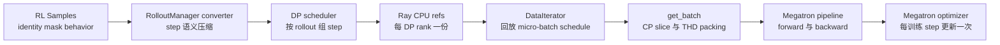
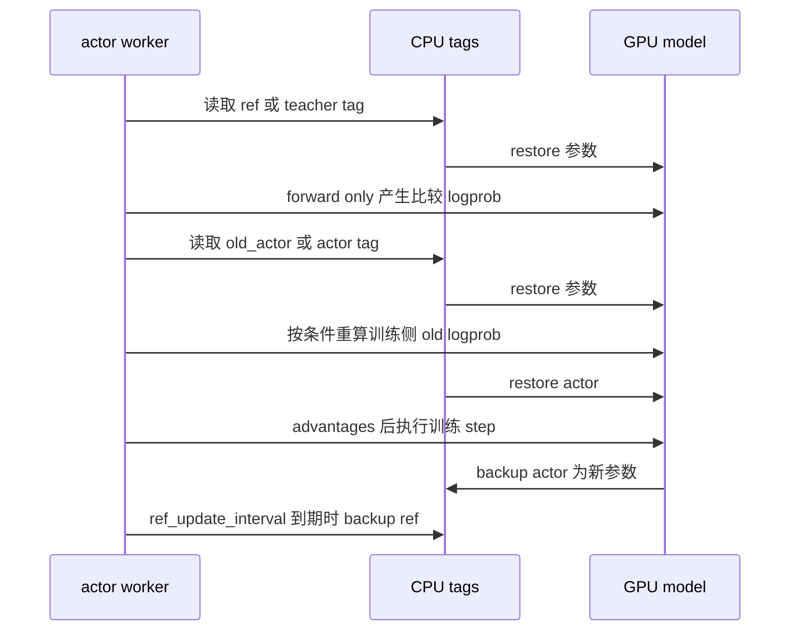
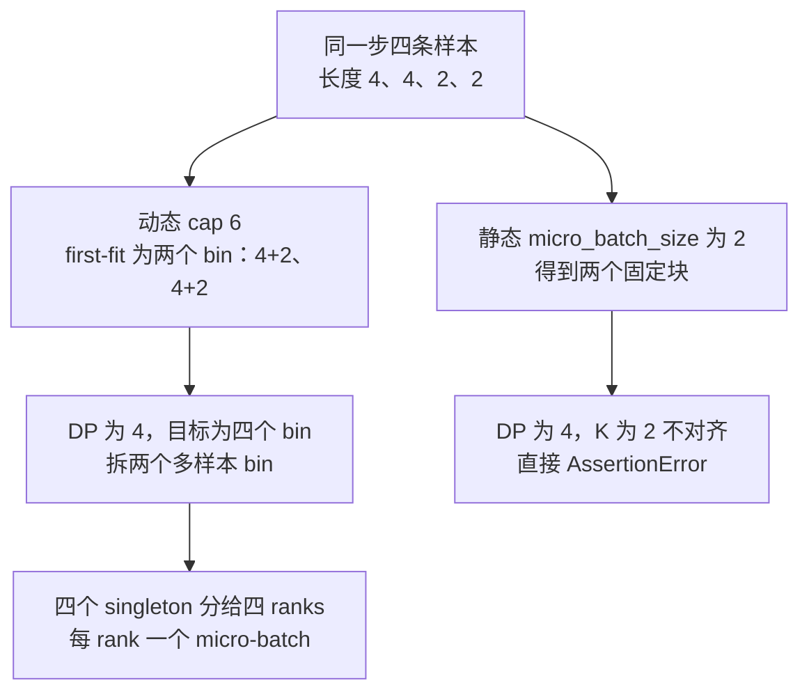

# slime Megatron 训练后端：让 RL 样本进入原生并行训练流程

> **源码基线**：`THUDM/slime@681b3adca54105d5ecd3fb822fa0dc58a427e0f9`（`main`，2026-08-12）
> **主题**：Megatron 训练适配层的角色切换、DP 调度和批次读取，随后说明 advantage、优化器与 checkpoint 生命周期。
> **适用范围**：Megatron 训练执行；Sample 语义归数据页，目标函数及并行归一化归 loss 页。
> **最近更新**：2026-09-10。依据冻结源码复核并补全本页机制。

rollout 交付的是长度不一、带样本标识、mask 和可选行为策略字段的 RL Sample；Megatron 需要的却是已经排好 DP/VPP micro-batch、可进行 CP 打包，并能进入流水线前向/反向传播和优化器步骤的数据。slime 没有另写一个“通用 RL 训练器”，而是在 Megatron 外围增加一层 actor 适配：进入训练内核前完成数据压缩、调度和角色切换，进入内核后继续使用 Megatron 原生模型、DDP、流水线调度、优化器和学习率调度器。代价是适配层必须显式保证全局 rollout 统计、拓扑一致性和 CPU/GPU 生命周期正确，而且仍会与特定 Megatron 能力及补丁产生版本耦合。

本文只讨论这道适配边界和训练执行职责。Sample/DataSource 的数据语义见 [[12_slime_sample_datasource_analysis]]，loss 公式与并行归一化见 [[15_slime_loss_parallelism_analysis]]，训练权重如何提交给推理侧见 [[16_slime_weight_sync_analysis]]。带固定提交定位符的是源码、官方文档或测试事实；“设计分析”明确表示由实现形态推导的判断。

## 1. 根本矛盾：一轮 RL 更新不等同于一个 Megatron micro-batch

RolloutManager 的默认转换器从 `Sample` 提取 token、response length、reward、sample/rollout identity 与 mask，并按功能条件附加 rollout logprob、top-p、routing 或 teacher logprob；它产出的是一个完整 rollout step 的语义字典，还不是模型 forward 的 batch。`slime/ray/rollout.py::RolloutManager._convert_samples_to_train_data`

Megatron 侧的要求不同：每个 VPP stage 要按相同 schedule 推进 `DataIterator`，每个 micro-batch 要先变成 THD packed token stream 与 `PackedSeqParams`，然后才能交给 pipeline schedule；训练 closure 最终还要把 batch、logits 和 loss callback 接到同一次 forward/backward 中。[`slime/backends/megatron_utils/data.py:28-63`](https://github.com/THUDM/slime/blob/681b3adca54105d5ecd3fb822fa0dc58a427e0f9/slime/backends/megatron_utils/data.py#L28-L63) [`slime/backends/megatron_utils/model.py:560-654`](https://github.com/THUDM/slime/blob/681b3adca54105d5ecd3fb822fa0dc58a427e0f9/slime/backends/megatron_utils/model.py#L560-L654)

因此适配层必须同时守住以下训练侧不变量：

| 不变量 | 若破坏会怎样 | 实现证据 |
|---|---|---|
| rollout identity 先于 batch packing 固定 | fanout fragments 会改变 step 大小和训练进度 | scheduler 先按 `rollout_id` 聚成 step，再取固定数量的逻辑 rollouts。[`slime/utils/dp_schedule.py:127-150`](https://github.com/THUDM/slime/blob/681b3adca54105d5ecd3fb822fa0dc58a427e0f9/slime/utils/dp_schedule.py#L127-L150) |
| 各 DP/VPP 执行相同数量的 micro-batches | pipeline stage 或 rank 会失步 | micro-batch 数对齐到 DP 与 VPP group 的倍数，静态模式不满足时直接报错。[`slime/utils/dp_schedule.py:117-125`](https://github.com/THUDM/slime/blob/681b3adca54105d5ecd3fb822fa0dc58a427e0f9/slime/utils/dp_schedule.py#L117-L125) [`slime/utils/dp_schedule.py:167-189`](https://github.com/THUDM/slime/blob/681b3adca54105d5ecd3fb822fa0dc58a427e0f9/slime/utils/dp_schedule.py#L167-L189) |
| token、sequence boundary 与 next-token mask 一起变换 | packed attention 或 loss 位置会串样本 | `get_batch` 同时构造 `cu_seqlens`、CP token slice，并用左 `prompt_length-1`、右 1 的 padding 对齐 mask。[`slime/backends/megatron_utils/data.py:66-118`](https://github.com/THUDM/slime/blob/681b3adca54105d5ecd3fb822fa0dc58a427e0f9/slime/backends/megatron_utils/data.py#L66-L118) [`slime/backends/megatron_utils/data.py:120-148`](https://github.com/THUDM/slime/blob/681b3adca54105d5ecd3fb822fa0dc58a427e0f9/slime/backends/megatron_utils/data.py#L120-L148) |
| optimizer 只在完整 pipeline backward 后推进 | micro-batch 会被误当成独立更新 | `train_one_step` 先运行 Megatron forward/backward schedule，再做一次 optimizer 与 LR scheduler step。[`slime/backends/megatron_utils/model.py:643-683`](https://github.com/THUDM/slime/blob/681b3adca54105d5ecd3fb822fa0dc58a427e0f9/slime/backends/megatron_utils/model.py#L643-L683) |



## 2. 为什么这么设计：增加封装层，而不是重写训练内核

初始化并没有复制 Megatron 的模型和优化器实现：slime 调用 Megatron `get_model` 构建 model chunks，把同名参数装进 `OptimizerConfig`，再调用 `get_megatron_optimizer` 和 Megatron scheduler。[`slime/backends/megatron_utils/model.py:270-318`](https://github.com/THUDM/slime/blob/681b3adca54105d5ecd3fb822fa0dc58a427e0f9/slime/backends/megatron_utils/model.py#L270-L318) 执行阶段也直接取 `get_forward_backward_func()`，只提供 data closure 与 loss callback；PP/VPP schedule、梯度通信和 DDP hook 仍由 Megatron 控制。[`slime/backends/megatron_utils/model.py:643-654`](https://github.com/THUDM/slime/blob/681b3adca54105d5ecd3fb822fa0dc58a427e0f9/slime/backends/megatron_utils/model.py#L643-L654) [`slime/backends/megatron_utils/model.py:745-769`](https://github.com/THUDM/slime/blob/681b3adca54105d5ecd3fb822fa0dc58a427e0f9/slime/backends/megatron_utils/model.py#L745-L769)

> **设计分析**：另写一个“统一 trainer”看似能让 RL 代码更整齐，却必须重新实现或抽象 Megatron 的 PP/VPP、CP、distributed optimizer、overlap hooks 和模型专属能力；最低公分母接口会持续泄漏这些原生语义。slime 把自己限制为边界 adapter，因而只承担 RL 特有的角色顺序、数据 ABI 和 loss 接点，Megatron 的优化继续留在其所有者手中。

“wrapper”也不等于“兼容任意原版 Megatron”。官方 quick start 明确提醒镜像可能包含临时 SGLang/Megatron patches，因此固定提交下的适配层仍依赖配套环境。[`docs/en/get_started/quick_start.md:1-9`](https://github.com/THUDM/slime/blob/681b3adca54105d5ecd3fb822fa0dc58a427e0f9/docs/en/get_started/quick_start.md#L1-L9)

## 3. 角色状态归属：哪些角色复用进程，哪些保留独立优化器

actor worker 初始化一套 Megatron model、optimizer 与 scheduler；非 critic worker 随后创建 `TensorBackuper`，先保存 `actor`，再按配置把 ref、Megatron teacher 和 old actor checkpoint 依次加载到同一 model 并保存为 tag。[`slime/backends/megatron_utils/actor.py:95-140`](https://github.com/THUDM/slime/blob/681b3adca54105d5ecd3fb822fa0dc58a427e0f9/slime/backends/megatron_utils/actor.py#L95-L140) 普通 backuper 为每个 tag 分配 pinned CPU tensor，backup/restore 都是同名参数的 CPU↔当前 model copy；恢复不存在的 tag 会先被 actor 拒绝。[`slime/utils/tensor_backper.py:42-74`](https://github.com/THUDM/slime/blob/681b3adca54105d5ecd3fb822fa0dc58a427e0f9/slime/utils/tensor_backper.py#L42-L74) [`slime/backends/megatron_utils/actor.py:301-305`](https://github.com/THUDM/slime/blob/681b3adca54105d5ecd3fb822fa0dc58a427e0f9/slime/backends/megatron_utils/actor.py#L301-L305)

| 角色 | 责任主体与所持状态 | 这样安排的原因 |
|---|---|---|
| actor | actor `RayTrainGroup` 内的 model + optimizer + scheduler | 唯一执行 policy backward 与参数更新的角色。[`slime/backends/megatron_utils/actor.py:514-533`](https://github.com/THUDM/slime/blob/681b3adca54105d5ecd3fb822fa0dc58a427e0f9/slime/backends/megatron_utils/actor.py#L514-L533) |
| ref / teacher / old actor | actor worker 内同一 model 的只读 CPU tags；切换后只做 forward，再恢复 actor | 三者只需为同一 token batch 提供比较信号，不需要各自 optimizer；执行顺序见 actor 主链。[`slime/backends/megatron_utils/actor.py:433-503`](https://github.com/THUDM/slime/blob/681b3adca54105d5ecd3fb822fa0dc58a427e0f9/slime/backends/megatron_utils/actor.py#L433-L503) |
| critic | 独立 `RayTrainGroup`、独立 model/optimizer；post-process stage 把 LM head 换成单输出 value head | critic 路径先计算 values，再调用 `compute_advantages_and_returns` 生成训练 targets，随后原地设置 `args.loss_type="value_loss"` 并调用 train；其 value 随后以 CPU tensor 返回 actor。[`slime/ray/placement_group.py:186-208`](https://github.com/THUDM/slime/blob/681b3adca54105d5ecd3fb822fa0dc58a427e0f9/slime/ray/placement_group.py#L186-L208) [`slime/backends/megatron_utils/model_provider.py:92-114`](https://github.com/THUDM/slime/blob/681b3adca54105d5ecd3fb822fa0dc58a427e0f9/slime/backends/megatron_utils/model_provider.py#L92-L114) [`slime/backends/megatron_utils/actor.py:396-421`](https://github.com/THUDM/slime/blob/681b3adca54105d5ecd3fb822fa0dc58a427e0f9/slime/backends/megatron_utils/actor.py#L396-L421) |

PPO 的 actor 与 critic group 复用同一个 placement-group GPU 区域；driver 先发起 critic train，取得每 worker 的 value refs，再把它们作为 `external_data` 传给 actor train。[`slime/ray/placement_group.py:121-137`](https://github.com/THUDM/slime/blob/681b3adca54105d5ecd3fb822fa0dc58a427e0f9/slime/ray/placement_group.py#L121-L137) [`train.py:61-69`](https://github.com/THUDM/slime/blob/681b3adca54105d5ecd3fb822fa0dc58a427e0f9/train.py#L61-L69) Critic 路径在初始化后不创建角色 backuper，而是在启用 offload 时立即 sleep；全局参数校验也强制 PPO 开启 `offload_train`。[`slime/backends/megatron_utils/actor.py:113-129`](https://github.com/THUDM/slime/blob/681b3adca54105d5ecd3fb822fa0dc58a427e0f9/slime/backends/megatron_utils/actor.py#L113-L129) [`slime/utils/arguments.py:1901-1904`](https://github.com/THUDM/slime/blob/681b3adca54105d5ecd3fb822fa0dc58a427e0f9/slime/utils/arguments.py#L1901-L1904) [`slime/utils/arguments.py:1953-1958`](https://github.com/THUDM/slime/blob/681b3adca54105d5ecd3fb822fa0dc58a427e0f9/slime/utils/arguments.py#L1953-L1958)

> **设计分析**：为 ref、teacher、old actor 各建一个常驻 trainer 会复制 process groups、模型显存和调度对象，却没有对应的 optimizer 工作；共享 model 槽位加只读 CPU tags 用传输时间换显存。critic 不能采用同样办法，因为它有独立目标和 optimizer state，所以 slime 只在这个真正需要训练所有权分离的角色上建立独立 group。

### 3.1 CPU 参数备份与整组显存卸载不是一回事

角色 backup 只保存可按 tag 恢复的参数/缓冲区；`sleep/wake_up` 则由 memory saver 暂停/恢复整个训练 GPU state，并销毁/重建 process groups，actor wake 后还会恢复 `actor` tag。存在 critic 且非 colocate 时，actor 的 `sleep` 还会先调用支持该接口的 weight updater 的 `disconnect_rollout_engines`，再销毁 process groups，避免保留与 rollout 的通信连接；该行为不是 critic worker 自己调用 updater。[`slime/backends/megatron_utils/actor.py:204-243`](https://github.com/THUDM/slime/blob/681b3adca54105d5ecd3fb822fa0dc58a427e0f9/slime/backends/megatron_utils/actor.py#L204-L243) actor 的 `train` 只在 `offload_train` 开启时包围一次 wake→训练→sleep；没有共置或 critic 压力时默认不走这一生命周期。[`slime/backends/megatron_utils/actor.py:374-394`](https://github.com/THUDM/slime/blob/681b3adca54105d5ecd3fb822fa0dc58a427e0f9/slime/backends/megatron_utils/actor.py#L374-L394) [`slime/utils/arguments.py:1929-1958`](https://github.com/THUDM/slime/blob/681b3adca54105d5ecd3fb822fa0dc58a427e0f9/slime/utils/arguments.py#L1929-L1958)

### 3.2 tag 切换与 checkpoint 临时装载

`load_other_checkpoint` 暂存 `load/no_load_optim/no_load_rng/finetune/ckpt_step`，用目标目录替换 load，并关闭 optimizer/RNG 加载、启用 finetune；ref 与 teacher 可各自指定 checkpoint step。装载成功后恢复原 args，把当前参数备份到目标 tag，并更新 active tag。恢复语句不在 `finally` 中，加载异常会中止此路径，不能宣称它有异常回滚保证。



`keep_old_actor` 开启且 `update_weights_interval=1` 时初始化额外保存 `rollout_actor`；权重更新后的队列轮转先复制 `rollout_actor → old_actor`，再保存当前 model 到 `rollout_actor`。interval 非 1 时直接 backup `old_actor`。这维护的是训练侧比较快照，不能把 `old_actor` 等同于当前 GPU model。actor 每轮训练完成都更新 `actor`；只有 ref tag 存在且 `(rollout_id+1) % ref_update_interval == 0` 时才刷新 ref。

源码阅读：`slime/backends/megatron_utils/actor.py::MegatronTrainRayActor.load_other_checkpoint`、`train_actor`、`update_weights`、`sleep`。

## 4. 从训练输入字典到 Megatron 批次：格式转换与取数的职责边界

数据不是到 actor 才临时决定如何切。RolloutManager 在还能看到完整 step 时完成以下工作：

1. converter 把 Sample 压成训练字段并固定 `rollout_id`、mask 与条件 metadata；自定义 converter 可以整体替换默认转换。`slime/ray/rollout.py::RolloutManager._convert_samples_to_train_data`
2. scheduler 先按逻辑 rollout 组成 optimizer steps，再把变长 samples pack 成 micro-batches；dynamic 模式按 token budget first-fit，静态模式按固定 sample 数切分。[`slime/utils/dp_schedule.py:55-79`](https://github.com/THUDM/slime/blob/681b3adca54105d5ecd3fb822fa0dc58a427e0f9/slime/utils/dp_schedule.py#L55-L79) [`slime/utils/dp_schedule.py:146-165`](https://github.com/THUDM/slime/blob/681b3adca54105d5ecd3fb822fa0dc58a427e0f9/slime/utils/dp_schedule.py#L146-L165)
3. 每个 DP rank 得到 `partition`、`micro_batch_indices`、`num_microbatches` 与 `global_batch_sizes`；逐样本字段只发送本 partition，完整 `raw_reward/total_lengths` 保留给 train-side 处理，最后 tensorize 并写入 Ray object store 或可选 NIXL transport。[`slime/ray/rollout.py:871-938`](https://github.com/THUDM/slime/blob/681b3adca54105d5ecd3fb822fa0dc58a427e0f9/slime/ray/rollout.py#L871-L938)

actor 端只 fetch 自己的 DP ref：`process_rollout_data` 用 `dp_rank` 做 Ray `get`，把全局 lengths 投影到本 partition；`_get_rollout_data` 再把 tokens/masks 搬到当前 CUDA device，并按 CP 规则切 rollout/teacher logprob。[`slime/utils/data.py:305-330`](https://github.com/THUDM/slime/blob/681b3adca54105d5ecd3fb822fa0dc58a427e0f9/slime/utils/data.py#L305-L330) [`slime/backends/megatron_utils/actor.py:245-299`](https://github.com/THUDM/slime/blob/681b3adca54105d5ecd3fb822fa0dc58a427e0f9/slime/backends/megatron_utils/actor.py#L245-L299)

`DataIterator` 不再解释 RL 语义，只按预计算的 `micro_batch_indices` 对请求字段取子集；VPP 有几个 stage，就创建几个拥有独立 offset 的 iterator。[`slime/backends/megatron_utils/data.py:201-245`](https://github.com/THUDM/slime/blob/681b3adca54105d5ecd3fb822fa0dc58a427e0f9/slime/backends/megatron_utils/data.py#L201-L245) 这条边界很重要：scheduler 决定“谁与谁同一步、同一 micro-batch”，Megatron adapter 决定“这些字段如何 pack/CP slice”，pipeline 内核只执行已确定的计划。

这条在线路径不调用 Megatron 常规的 GPT Dataset/DataLoader。初始化代码虽然调用 `init_num_microbatches_calculator`，却明确注明它只用于通过 Megatron 校验；真实的 step 划分、每个 DP rank 的 partition 和 `num_microbatches` 都由 RolloutManager 的 schedule 提供。[`slime/backends/megatron_utils/initialize.py:77-86`](https://github.com/THUDM/slime/blob/681b3adca54105d5ecd3fb822fa0dc58a427e0f9/slime/backends/megatron_utils/initialize.py#L77-L86) 因而“复用 Megatron 训练后端”不等于“复用 Megatron 离线数据加载”：前者指 pipeline schedule、模型并行、梯度同步和 optimizer，后者已由 Sample → train dict → slime `DataIterator` 路径替代；数据量与 DP rank 的具体映射见下文；Sample 与 converter 契约见 [[12_slime_sample_datasource_analysis]]。

> **设计分析**：默认 CPU/Ray 路径不是最低拷贝方案，但它使 rollout Python 对象、DP partition 与 Megatron GPU topology 解耦。源码自己把 CPU fetch 标为潜在性能瓶颈，故 NIXL 是传输替换点；这不改变上游 step/schedule 语义，也不应与第 16 页的权重传输协议混为一谈。[`slime/backends/megatron_utils/actor.py:245-253`](https://github.com/THUDM/slime/blob/681b3adca54105d5ecd3fb822fa0dc58a427e0f9/slime/backends/megatron_utils/actor.py#L245-L253) [`slime/utils/arguments.py:558-565`](https://github.com/THUDM/slime/blob/681b3adca54105d5ecd3fb822fa0dc58a427e0f9/slime/utils/arguments.py#L558-L565)

### 4.1 先按 rollout 标识组成完整训练步

`build_dp_schedule` 按 rollout id 首次出现顺序分组，再每 `global_batch_size` 个逻辑执行组成一整步；同一 rollout 的多个 fragments 不会跨步。训练步数为 distinct rollout 数的整数除法，尾部不足一整步的 rollouts 连同其 fragments 被丢出 schedule；不足一步立即断言，每步物理 samples 少于 DP 大小也断言。默认 `rollout_batch_size=32`、每 prompt 采 8 条时共有 256 个执行；global batch 64 得到 4 个 steps。`--num-steps-per-rollout` 则在参数校验中反算 global batch，不改变这套计数单位。

### 4.2 micro-batch 对齐：动态拆分与静态拒绝

静态路径以 `micro_batch_size` 固定步长切 samples；动态 first-fit 依次将样本放入首个仍有空间的 bin，cap 为 `max_tokens_per_gpu × cp_size`。单条超 cap 的样本独占一个 bin，不截断。`balance_by_flops` 是另一条动态打包路径：先用总 tokens/cap 的上取整决定 bin 数，再按估算 FLOPs 均衡；此分支明确不保证各 bin 的 token cap。

每步 micro-batch 总数 K 要成为 `align_to = dp_size × (mb_group if vpp_size>1 else 1)` 的倍数。动态路径把目标 K 向上取整，再反复拆最大的多样本 bin；拆分内部按长度降序向较轻的一半放样本。所有 bin 都成单样本仍不能补齐时断言。静态路径不进行拆分：只要 K 不对齐就直接抛 `AssertionError`，提示调整 step size、micro batch 与 DP/VPP 配置；源码并未对样本数整除另设无条件断言，最后一个静态块可以短于设定大小，只要最终 K 对齐。



这个例子展示同一输入下两条路径的差异：动态拆分不复制样本且每个新 bin 不大于原 bin；静态路径拒绝改写固定块。静态成功例：上一节 64 samples/step、DP=4、micro batch=2、无 VPP 时共 32 个 micro-batches，每 rank 为 8 个、16 条 Sample。

### 4.3 Karmarkar-Karp 平衡的是 rank 工作量

打包以后，`balance_data=False` 用轮询把第 r、r+D、r+2D 个 micro-batches 交给 rank r。开启 `balance_data` 时先按每条样本估计 forward FLOPs、汇总为各 micro-batch 工作量，再调用 `get_seqlen_balanced_partitions(..., equal_size=True)`。该函数实际采用 Karmarkar-Karp：按负载排序构造状态，每次优先合并负载差最大的两个状态，重端与轻端反向配对，直到只剩一个分区状态；等大小约束保证每个 rank 得到相同数量的 micro-batches。它均衡的是估算计算量，不承诺 wall time 最优，也不改写已打包的 micro-batch 内容。

例如不均衡开关关闭、DP=2、静态 micro batch=1、全局长度 `[4,5,6,7]`、每步 4 个独立 rollout 时，rank 0 的 bundle 是以下形态（省略其他逐样本字段）：

```text
partition=[0,2]
tokens=[tokens_of_sample_0,tokens_of_sample_2]
response_lengths=[response_length_0,response_length_2]
micro_batch_indices=[[0],[1]], num_microbatches=[2], global_batch_sizes=[4]
total_lengths=[4,5,6,7], raw_reward=[reward0,reward1,reward2,reward3]
```

`partition` 是全局 sample 位置；micro-batch indices 是本 partition 内的局部位置。`total_lengths/raw_reward` 暂留全量，`process_rollout_data` 再投影 lengths。源码阅读：`slime/utils/dp_schedule.py::build_dp_schedule`、`_pack_step_into_mbs`；`slime/utils/seqlen_balancing.py::first_fit_pack`、`expand_bins_by_splitting`、`karmarkar_karp`；`slime/ray/rollout.py::RolloutManager._split_train_data_by_dp`。验证入口为 `tests/test_dp_schedule.py`，包含动态对齐、fanout 和尾部裁剪用例；静态拒绝由 `build_dp_schedule` 的显式 `AssertionError` 分支核实。

### 4.4 只按 DP rank 分不同样本，不是每张训练卡各取一份

RolloutManager 从 trainer rank 回报的 `train_parallel_config` 中取得纯 DP 大小与 CP/VPP 信息；其中 DP 使用 `with_context_parallel=False`，因此 CP 不被误算成独立数据副本。[`slime/backends/megatron_utils/actor.py:99-111`](https://github.com/THUDM/slime/blob/681b3adca54105d5ecd3fb822fa0dc58a427e0f9/slime/backends/megatron_utils/actor.py#L99-L111) `_split_train_data_by_dp()` 只创建 `dp_size` 个 Ray objects：每个对象包含该 DP rank 的 `partition`、本地逐 Sample 字段、`micro_batch_indices`，以及所有 ranks 共同使用的 `num_microbatches/global_batch_sizes`。[`slime/ray/rollout.py:871-938`](https://github.com/THUDM/slime/blob/681b3adca54105d5ecd3fb822fa0dc58a427e0f9/slime/ray/rollout.py#L871-L938)

driver 会把这组 references 广播给所有 trainer actors；每个 actor 再用自己的 `mpu.get_data_parallel_rank(with_context_parallel=False)` 选择 `rollout_data_ref[dp_rank]`。因此 TP、PP、CP 或 EP ranks 只要属于同一个 DP 副本，进入训练器前看到的都是同一个 DP partition，而不是各自从 DataSource 领取新样本。[`slime/ray/actor_group.py:131-149`](https://github.com/THUDM/slime/blob/681b3adca54105d5ecd3fb822fa0dc58a427e0f9/slime/ray/actor_group.py#L131-L149) [`slime/backends/megatron_utils/actor.py:245-253`](https://github.com/THUDM/slime/blob/681b3adca54105d5ecd3fb822fa0dc58a427e0f9/slime/backends/megatron_utils/actor.py#L245-L253) [`slime/utils/data.py:305-330`](https://github.com/THUDM/slime/blob/681b3adca54105d5ecd3fb822fa0dc58a427e0f9/slime/utils/data.py#L305-L330)

| 并行 rank | 数据关系 | 后续分工 |
|---|---|---|
| DP | 不同 DP rank 得到互不重复的 schedule partition | 对不同 Sample 计算梯度，随后做数据并行归约 |
| TP | 同一 DP rank 下使用相同 micro-batch 身份 | 分担同一层内的张量计算 |
| PP/VPP | 使用同一个 step 与 micro-batch 次序 | 分担不同模型 stage，依靠一致的 micro-batch 数推进流水线 |
| CP | 先取得相同 DP partition，再在 `get_batch()` 中按 `cp_rank` 切同一序列 | 分担上下文区间；不是从 DataSource 获取不同 Sample |
| EP | 输入 schedule 仍由 DP rank 决定 | forward 时再按路由结果把 token 发给不同专家 rank |

CP 的实际切片发生在训练侧 `get_batch()`：它读取同一 local micro-batch 后，按 `cp_size/cp_rank` 切 token，并构造 packed-sequence 参数。[`slime/backends/megatron_utils/data.py:28-52`](https://github.com/THUDM/slime/blob/681b3adca54105d5ecd3fb822fa0dc58a427e0f9/slime/backends/megatron_utils/data.py#L28-L52) [`slime/backends/megatron_utils/data.py:55-118`](https://github.com/THUDM/slime/blob/681b3adca54105d5ecd3fb822fa0dc58a427e0f9/slime/backends/megatron_utils/data.py#L55-L118)

### 4.5 与 Megatron 数据加载器的关系：不走离线 Dataset，但复用训练内核

在线 rollout 数据不经过 Megatron 常规的 GPT Dataset/DataLoader。slime 自己构造轻量 `DataIterator`：它只按预计算的 `micro_batch_indices` 从 DP-local `rollout_data` 取下一批字段，VPP 每个 stage 使用独立 iterator offset。[`slime/backends/megatron_utils/data.py:201-245`](https://github.com/THUDM/slime/blob/681b3adca54105d5ecd3fb822fa0dc58a427e0f9/slime/backends/megatron_utils/data.py#L201-L245) 初始化阶段仍调用 Megatron 的 microbatch calculator，但源码明确注明这只是为了通过 Megatron 校验，实际的每步 `num_microbatches` 来自上游 DP schedule。[`slime/backends/megatron_utils/initialize.py:77-86`](https://github.com/THUDM/slime/blob/681b3adca54105d5ecd3fb822fa0dc58a427e0f9/slime/backends/megatron_utils/initialize.py#L77-L86)

边界并不是“不使用 Megatron”，而是**不使用 Megatron 的离线数据装载路径**：slime 决定在线 Sample 属于哪个 step、DP rank 和 micro-batch；Megatron 的 `forward_backward_func()` 再消费这个 iterator，执行 TP/PP/CP/EP forward/backward、梯度同步和 optimizer step。`slime/backends/megatron_utils/model.py::train_one_step` `slime/backends/megatron_utils/model.py::train`

> **设计分析**：若直接让每个 Megatron rank 独立读取 rollout Dataset，就必须在所有 ranks 上重复解释 `rollout_id`、变长打包、compact 扇出与动态过滤，并额外证明各 PP ranks 的 micro-batch 次序完全一致。slime 选择在仍拥有全局 Sample 视图的 RolloutManager 中只计算一次 schedule，再让 ranks 按 DP 身份取数；这牺牲了部分 CPU/Ray 传输效率，却把 RL 数据语义与 Megatron 并行执行边界分开。

## 5. 为什么 logprob 与 advantage 位于训练边界内

actor 的默认顺序是先构造同一 `DataIterator`，再依次做可选 ref forward、teacher forward、old/current actor forward，接收 critic values，恢复 actor，最后计算 advantages/returns 并训练。[`slime/backends/megatron_utils/actor.py:424-503`](https://github.com/THUDM/slime/blob/681b3adca54105d5ecd3fb822fa0dc58a427e0f9/slime/backends/megatron_utils/actor.py#L424-L503) 这些 forward-only 阶段并没有绕开 Megatron：它们 reset iterator、切到 eval，仍调用同一个 pipeline `get_forward_backward_func`，只把 `forward_only=True` 并在 PP last stage 收集结果。[`slime/backends/megatron_utils/model.py:345-381`](https://github.com/THUDM/slime/blob/681b3adca54105d5ecd3fb822fa0dc58a427e0f9/slime/backends/megatron_utils/model.py#L345-L381) [`slime/backends/megatron_utils/model.py:447-505`](https://github.com/THUDM/slime/blob/681b3adca54105d5ecd3fb822fa0dc58a427e0f9/slime/backends/megatron_utils/model.py#L447-L505)

不是每轮都多做一次 old-policy forward。`can_reuse_log_probs_in_loss` 同时要求：本 bundle 仅一个 optimizer step、policy loss、`kl_coef=0`、不用 rollout logprobs、不记录 mismatch、不启用 critic/old actor/OPD、非 GSPO，且 routing replay 关闭或使用 rollout 路由重放。满足时跳过独立 forward；loss 内使用训练 forward 的 detached logprob 作为 old logprob。少做一次 forward 的依据是该步尚未更新参数；有多个 optimizer steps 就不能沿用这一判断。证据：`slime/backends/megatron_utils/actor.py::MegatronTrainRayActor.train_actor` 与 `slime/backends/megatron_utils/loss.py::policy_loss_function`。

优势计算只在 PP last stage 读取 rewards、current/rollout logprob、ref logprob、critic values、mask 与 lengths；如启用 normalization，它还在 DP+CP group 上做 masked statistics。自定义 advantage hook 也在这里接管并原地写回 `advantages/returns`。[`slime/backends/megatron_utils/loss.py:704-741`](https://github.com/THUDM/slime/blob/681b3adca54105d5ecd3fb822fa0dc58a427e0f9/slime/backends/megatron_utils/loss.py#L704-L741) [`slime/backends/megatron_utils/loss.py:758-780`](https://github.com/THUDM/slime/blob/681b3adca54105d5ecd3fb822fa0dc58a427e0f9/slime/backends/megatron_utils/loss.py#L758-L780)

> **设计分析**：把 advantage 一律放进 rollout service 会迫使推理侧拥有 ref/teacher/critic/current-policy 的 Megatron 数值路径和训练并行归一化域；由 rollout 计算也容易在后续 DP/CP 切分前后形成两套统计实现。slime 默认把 reward 与 behavior metadata 带到训练边界，再在所有依赖信号齐备、actor 尚未 optimizer step 时计算 advantage。对于 SFT 或完全自定义目标，参数仍允许关闭默认 advantage 计算，因此这是默认所有权，不是不可突破的硬编码。[`slime/utils/arguments.py:958-977`](https://github.com/THUDM/slime/blob/681b3adca54105d5ecd3fb822fa0dc58a427e0f9/slime/utils/arguments.py#L958-L977)

## 6. Forward/backward 与 optimizer 的真实边界

一个 rollout data bundle 可以包含多个训练 steps。外层 `train` reset iterators、启用 train mode 和 Megatron DDP overlap hooks，再对 `num_microbatches/global_batch_sizes` 的每个元素调用一次 `train_one_step`。[`slime/backends/megatron_utils/model.py:707-769`](https://github.com/THUDM/slime/blob/681b3adca54105d5ecd3fb822fa0dc58a427e0f9/slime/backends/megatron_utils/model.py#L707-L769) [`slime/backends/megatron_utils/model.py:813-838`](https://github.com/THUDM/slime/blob/681b3adca54105d5ecd3fb822fa0dc58a427e0f9/slime/backends/megatron_utils/model.py#L813-L838)

每个 `train_one_step` 的闭环是：

1. 清 Megatron model grad buffer 与 optimizer grad；可选 before-train-step hook 在这里运行。[`slime/backends/megatron_utils/model.py:547-558`](https://github.com/THUDM/slime/blob/681b3adca54105d5ecd3fb822fa0dc58a427e0f9/slime/backends/megatron_utils/model.py#L547-L558)
2. closure 从 `DataIterator` 取一个已排定 micro-batch，经 `get_batch` packing 后调用 model，并把 slime `loss_function` 作为 Megatron loss callback 返回。[`slime/backends/megatron_utils/model.py:560-641`](https://github.com/THUDM/slime/blob/681b3adca54105d5ecd3fb822fa0dc58a427e0f9/slime/backends/megatron_utils/model.py#L560-L641)
3. Megatron pipeline schedule 执行全部 micro-batches 的 forward/backward；不是每个 micro-batch 单独 step。[`slime/backends/megatron_utils/model.py:643-654`](https://github.com/THUDM/slime/blob/681b3adca54105d5ecd3fb822fa0dc58a427e0f9/slime/backends/megatron_utils/model.py#L643-L654)
4. 梯度有效时才调用一次 optimizer step，并让 LR scheduler 按该 step 的逻辑 rollout 数 `step_global_batch_size` 前进；之后再次清 grad。[`slime/backends/megatron_utils/model.py:656-688`](https://github.com/THUDM/slime/blob/681b3adca54105d5ecd3fb822fa0dc58a427e0f9/slime/backends/megatron_utils/model.py#L656-L688)

所以三种边界不能混同：rollout round 是数据版本边界，`global_batch_sizes` 中一个元素是 optimizer 边界，micro-batch 只是 pipeline/梯度累积的执行单元。loss 的归一化如何跨这些边界保持目标函数不变，留给 [[15_slime_loss_parallelism_analysis]]。

### 6.1 Optimizer 状态与两种 checkpoint

`--use-stateless-adam` 在 `setup_model_and_optimizer` 中临时替换 Megatron Adam 构造器，且明确断言 `optimizer=adam`、`no_save_optim=True`；其含义是每步不持久保留一阶/二阶矩，而非不执行优化器。因而不能把普通 Adam 的跨步动量或 checkpoint 恢复保证套到它上面。

`checkpoint.load_checkpoint` 先断言 load 目录存在且非空，再以 tracker 文件或 `iter_XXXXXXX` 目录名识别 Megatron checkpoint；否则走 HF→Megatron 权重加载，并在混合精度且有 optimizer 时 reload model params，返回 iteration 0。Megatron 原生 checkpoint 的 shard/RNG/optimizer 恢复细节交给依赖库，本页只确认 slime 的分派与参数边界。

`actor.save_model` 在 offload 模式先 wake；存在旧异步 save 时先阻塞 finalize，再由 `model.save` 暂停 forward pre-hooks 并调用 Megatron `save_checkpoint`。`force_sync=True` 才对本次 async save 再阻塞等待。`save_hf` 仅 actor 执行：`hf_checkpoint_saver.save_hf_model_to_path` 使用 `HfWeightIteratorDirect` 转换权重，各节点 writer 按 chunk 轮转写 safetensors，汇总 shard 元数据生成索引，最后 barrier。它不保存 optimizer；输出目录必须不同于原 `hf_checkpoint`，并要求原目录在本地可读。已有同名 HF 权重会被清除后重写，不提供目录级事务回滚。

源码阅读：`slime/backends/megatron_utils/model.py::setup_model_and_optimizer`、`save`；`slime/backends/megatron_utils/checkpoint.py::load_checkpoint`、`_load_checkpoint_hf`；`slime/backends/megatron_utils/actor.py::MegatronTrainRayActor.save_model`；`slime/backends/megatron_utils/hf_checkpoint_saver.py::save_hf_model_direct_to_path`、`_finalize_distributed_shards`。

## 7. 两条扩展缝：role YAML 与 loss hook

### 7.1 Role YAML 只改变角色参数，不接管资源编排

`parse_megatron_role_args` 先深拷贝共享 CLI args，再应用某个 `actor` 或 `critic` entry 的 overrides；缺失角色继承基线，`num_nodes/num_gpus_per_node` 即使写入 YAML 也会被忽略。critic 还会强制关闭 actor-only 的 KL/OPD/custom advantage 设置。[`slime/utils/arguments.py:1646-1678`](https://github.com/THUDM/slime/blob/681b3adca54105d5ecd3fb822fa0dc58a427e0f9/slime/utils/arguments.py#L1646-L1678) [`slime/utils/arguments.py:1681-1721`](https://github.com/THUDM/slime/blob/681b3adca54105d5ecd3fb822fa0dc58a427e0f9/slime/utils/arguments.py#L1681-L1721) 单测覆盖 actor/critic 独立 override、critic 强制项与缺失角色继承。[`tests/utils/test_megatron_role_config.py:40-90`](https://github.com/THUDM/slime/blob/681b3adca54105d5ecd3fb822fa0dc58a427e0f9/tests/utils/test_megatron_role_config.py#L40-L90)

官方文档把当前边界说得更窄：YAML 主要服务 PPO actor/critic；资源仍由 CLI 控制，actor/critic 当前必须保持相同 Megatron parallel topology，并共享 train placement group。[`docs/en/advanced/megatron-config.md:3-22`](https://github.com/THUDM/slime/blob/681b3adca54105d5ecd3fb822fa0dc58a427e0f9/docs/en/advanced/megatron-config.md#L3-L22) [`docs/en/advanced/megatron-config.md:111-118`](https://github.com/THUDM/slime/blob/681b3adca54105d5ecd3fb822fa0dc58a427e0f9/docs/en/advanced/megatron-config.md#L111-L118)

### 7.2 自定义 loss 可以替换目标函数，但仍在 Megatron 回调中执行

当 `loss_type=custom_loss` 时，dispatcher 动态加载 `custom_loss_function_path`，并以与内置 loss 相同的 `(args, batch, logits, sum_of_sample_mean)` 形态调用；外层仍负责 micro-batch/parallel rescale 与 Megatron 集成。[`slime/backends/megatron_utils/loss.py:1283-1325`](https://github.com/THUDM/slime/blob/681b3adca54105d5ecd3fb822fa0dc58a427e0f9/slime/backends/megatron_utils/loss.py#L1283-L1325) [`slime/backends/megatron_utils/loss.py:1327-1383`](https://github.com/THUDM/slime/blob/681b3adca54105d5ecd3fb822fa0dc58a427e0f9/slime/backends/megatron_utils/loss.py#L1327-L1383) 官方 customization 文档也把它定位为新 RL 目标、多目标或正则项的扩展点，而不是替换 trainer。[`docs/en/get_started/customization.md:254-264`](https://github.com/THUDM/slime/blob/681b3adca54105d5ecd3fb822fa0dc58a427e0f9/docs/en/get_started/customization.md#L254-L264)

> **设计分析**：角色 YAML 是“构造哪套 Megatron 参数”的外层扩展点，自定义 loss 是“流水线输出如何变成标量目标”的内层扩展点。前者不能暗中改变 Ray 资源归属，后者不能绕过流水线和优化器边界；这两个窄扩展点比重写通用训练器更能保留 Megatron 原生能力。若扩展需要改变 Sample 字段或归约统计口径，则应分别使用转换器、advantage 或归约器扩展点，而不是把额外语义藏进模型前向传播；具体数学约束见第 15 页。[`slime/utils/arguments.py:1379-1386`](https://github.com/THUDM/slime/blob/681b3adca54105d5ecd3fb822fa0dc58a427e0f9/slime/utils/arguments.py#L1379-L1386) [`slime/utils/arguments.py:1085-1088`](https://github.com/THUDM/slime/blob/681b3adca54105d5ecd3fb822fa0dc58a427e0f9/slime/utils/arguments.py#L1085-L1088)

## 8. 约束、边界、代价与常见误读

| 误读或失败模式 | 固定基线的实际边界 |
|---|---|
| ref/teacher 是独立 GPU trainer | 它们默认是 actor model 的 CPU tags；只有 critic 拥有独立可训练 group。[`slime/backends/megatron_utils/actor.py:115-140`](https://github.com/THUDM/slime/blob/681b3adca54105d5ecd3fb822fa0dc58a427e0f9/slime/backends/megatron_utils/actor.py#L115-L140) |
| 在线 rollout 会进入 Megatron Dataset/DataLoader | slime 在 RolloutManager 中完成 step/DP/micro-batch schedule，trainer 使用轻量 `DataIterator`；Megatron 从 forward/backward 调度开始接管执行，而不是重新读取数据集。[`slime/backends/megatron_utils/data.py:201-245`](https://github.com/THUDM/slime/blob/681b3adca54105d5ecd3fb822fa0dc58a427e0f9/slime/backends/megatron_utils/data.py#L201-L245) |
| 角色切换只是改一个字符串 | `_switch_model` 会真实 restore 参数；每轮 actor 训练后又更新 CPU actor backup，因此切换有 CPU/GPU 带宽和 host memory 代价。[`slime/backends/megatron_utils/actor.py:301-305`](https://github.com/THUDM/slime/blob/681b3adca54105d5ecd3fb822fa0dc58a427e0f9/slime/backends/megatron_utils/actor.py#L301-L305) [`slime/backends/megatron_utils/actor.py:545-562`](https://github.com/THUDM/slime/blob/681b3adca54105d5ecd3fb822fa0dc58a427e0f9/slime/backends/megatron_utils/actor.py#L545-L562) |
| dynamic batching 的 token cap 永远是硬上限 | `balance_by_flops` 分支明确不保证 `max_per_bin`，紧 cap 仍可能 OOM。[`slime/utils/dp_schedule.py:65-76`](https://github.com/THUDM/slime/blob/681b3adca54105d5ecd3fb822fa0dc58a427e0f9/slime/utils/dp_schedule.py#L65-L76) |
| actor/critic YAML 可以自由选择不同拓扑 | 官方文档明确标为当前不支持；共享 data schedule 与 placement 所有权要求它们保持相同拓扑。[`docs/en/advanced/megatron-config.md:111-118`](https://github.com/THUDM/slime/blob/681b3adca54105d5ecd3fb822fa0dc58a427e0f9/docs/en/advanced/megatron-config.md#L111-L118) |
| advantage 放哪里只是代码风格 | 默认 placement 发生在 ref/teacher/critic 信号齐备之后、actor optimizer 之前，并且只在 PP last stage 执行；改变位置必须重新证明统计域与版本边界。[`slime/backends/megatron_utils/actor.py:491-525`](https://github.com/THUDM/slime/blob/681b3adca54105d5ecd3fb822fa0dc58a427e0f9/slime/backends/megatron_utils/actor.py#L491-L525) [`slime/backends/megatron_utils/loss.py:729-741`](https://github.com/THUDM/slime/blob/681b3adca54105d5ecd3fb822fa0dc58a427e0f9/slime/backends/megatron_utils/loss.py#L729-L741) |

由此可推断，这套设计最适合“训练角色共享 Megatron 模型拓扑、只读角色可顺序执行、rollout data 能先压成稳定 ABI”的场景。若 teacher 架构不兼容同一 model slot、actor/critic 必须不同拓扑并发、或 CPU role swap 成为主瓶颈，就需要把角色外置或扩展资源/协议，而不是继续把更多状态塞进当前 actor wrapper。

## 9. 发展趋势

本节离开“固定基线是什么”，因此只写有源码注释可锚定的在途改动，整节标为推断。

> [!note] 推断：锚点是源码注释原文，方向判断是本页的重建
> **一、训练输入的取数函数被作者自己标为待搬迁。** `_get_rollout_data` 开头写着 `# Fetch data through ray on CPU, not sure if this will be performance bottleneck.`，其后把 `tokens`/`loss_masks` 预搬到当前 CUDA device 的那几行又单独挂了 `# TODO: this is ugly, move to somewhere else?`。[`slime/backends/megatron_utils/actor.py:246`](https://github.com/THUDM/slime/blob/681b3adca54105d5ecd3fb822fa0dc58a427e0f9/slime/backends/megatron_utils/actor.py#L246) [`slime/backends/megatron_utils/actor.py:254`](https://github.com/THUDM/slime/blob/681b3adca54105d5ecd3fb822fa0dc58a427e0f9/slime/backends/megatron_utils/actor.py#L254) 两条注释指向同一处职责混杂：取数（Ray/CPU）与设备搬运（CUDA）目前写在同一个函数里。**由此可推断**，除第 4 节已指出的 NIXL 传输替换点之外，还有一个更小的重构在途——把 device placement 从 fetch 函数中拆出；它不改变 step/schedule 语义，但会移动本页第 4 节引用的行号。
>
> **二、dynamic batching 的结果重排被明确标为临时实现。** forward-only 结果在 PP last stage 汇总后，动态批次分支要用 `micro_batch_indices` 把乱序结果还原成原始顺序，源码在该分支上连挂两条 TODO：`# TODO: This is ugly... Find a better way to make the data have the same order.` 与 `# TODO: move this out of the loop.`。[`slime/backends/megatron_utils/model.py:498-499`](https://github.com/THUDM/slime/blob/681b3adca54105d5ecd3fb822fa0dc58a427e0f9/slime/backends/megatron_utils/model.py#L498-L499) **由此可推断**，第 4 节声明的那条边界（scheduler 决定顺序、trainer 只回放已定计划）在 forward-only 路径上尚未做干净：还原顺序所需的知识同时存在于 scheduler 与结果收集处。这处若被重构，第 1 节的四条不变量不变，但 `DataIterator` 与 forward-only 结果收集之间的接口会变。

## Related Pages

- [[12_slime_sample_datasource_analysis]] — 本页输入的 train dict 如何从 Sample 语义、身份和 mask 压缩而来，以及完整 mask 分母如何固定。
- [[15_slime_loss_parallelism_analysis]] — loss callback、advantage 与 DP/CP/PP reducer 如何保持目标函数口径。
- [[16_slime_weight_sync_analysis]] — actor optimizer 完成后，权重如何跨训练/推理拓扑提交；本页不展开 transport。
- [[17_slime_train_inference_consistency_analysis]] — ref/current logprob、top-p 与 routing replay 为何影响训练侧重算。
- [[20_slime_on_policy_distillation_analysis]] — teacher signal 如何进入同一 Sample/actor 训练 ABI，以及何时使用外部 teacher。
- [[23_slime_model_architecture_extension_analysis]] — custom model provider 与 Megatron/HF 架构映射的扩展边界。
