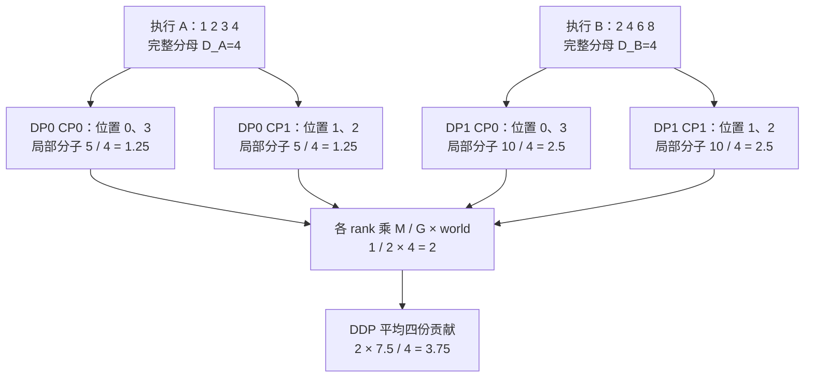

# slime Loss 与并行归一化：让估计量不随物理切分改写

> **源码基线**：`THUDM/slime@681b3adca54105d5ecd3fb822fa0dc58a427e0f9`（`main`，2026-08-12）
> **主题**：从 reward 到 token 目标函数，再解释 rollout 归约、CP 重建与 Megatron 梯度缩放，最后说明校正 mask 的 loss 接口。
> **适用范围**：loss 与统计归约；DP 调度归训练后端页，TIS/MIS 算法归训推一致性页。
> **最近更新**：2026-09-10。依据冻结源码复核并补全本页机制。

slime 的关键设计不是多实现几种 RL loss，而是把“估计什么”与“在哪块 GPU 上计算”拆开：prompt 分组决定 reward 的相对基线，token 级目标函数产生逐 token 项，逻辑 rollout 决定默认 loss 权重，DP/CP/PP/VPP 只决定这些项如何分布到不同设备。代价是系统必须在切分前保存完整分母，并在 Megatron 的 micro-batch、集合通信与梯度缩放规则中精确抵消每个重复因子；否则程序可能照常运行，实际优化的却已是另一个目标函数。

本文只讨论估计量与归约器的统计语义。`Sample`、prompt 分组和 `rollout_id` 的标识来源见 [[12_slime_sample_datasource_analysis]]；Megatron actor、DataIterator、前向/反向传播与优化器生命周期见 [[14_slime_megatron_training_analysis]]。下文带固定提交定位符的是源码、官方文档或测试事实；“设计分析”表示根据实现和失败路径作出的推断。

## 1. 根本冲突：统计单位与物理单位不是一回事

设 prompt 分组为 $p$，逻辑 rollout 为 $g$，rollout 产生的训练片段为 $i\in g$，response 位置为 $t$。记逐 token 目标项为 $\ell_{it}$，训练 mask 为 $m_{it}\in\{0,1\}$，则

$$
N_i=\sum_t m_{it}\ell_{it},\qquad
D_i=\sum_t m_{it},\qquad
D_g=\sum_{i\in g}D_i.
$$

这些是统计对象；DP rank、CP 切片、micro-batch、PP/VPP 阶段是执行划分。loss 只消费已经固定的分组与执行计划，DP 对齐、裁剪及 rank 分配规则统一见 [[14_slime_megatron_training_analysis#4. 从训练输入字典到 Megatron 批次：格式转换与取数的职责边界]]。

这条链要求以下 loss 侧不变量：

| 不变量 | 要保持不变的量 | 破坏后的结果 |
|---|---|---|
| 分组不变量 | 同一 prompt 的 reward 基线 | advantage 会混入其他 prompt 或受到扇出数量影响 |
| mask 不变量 | 基础 mask 定义分母；rejection 可显式删去分子项而保留原分母 | 工具、padding 或被拒绝的 token 会错误改变权重 |
| rollout 不变量 | 一次逻辑执行无论产出几个片段都只占一份权重 | compact 扇出越多，梯度越大 |
| 拓扑不变量 | 改变 DP/CP/mbs/PP/VPP 不应改变同一批数据的目标与梯度 | loss 随 GPU 数、数据打包或流水线配置漂移 |

## 2. 为什么这么设计：必须把 loss 与归约器分开

目标函数回答“每个动作应产生什么梯度信号”，归约器回答“token、Sample、rollout 分别占多少权重”。若每个目标函数内部直接调用 `.mean()`，同一 PPO 公式就会因 response 长度、compact 片段数、micro-batch 打包和 CP 切片数而悄悄改变统计口径；每增加一种 loss 还要重写同一套并行归一化逻辑。

固定基线的 `loss_function` 先用完整训练步的 `rollout_mask_sums` 构造归约器，再分派 policy、value、SFT 或自定义目标函数，最后统一接入 Megatron 缩放。[`slime/backends/megatron_utils/loss.py:1283-1365`](https://github.com/THUDM/slime/blob/681b3adca54105d5ecd3fb822fa0dc58a427e0f9/slime/backends/megatron_utils/loss.py#L1283-L1365) `--custom-loss-function-path` 因此是“更换目标函数、继承现有归约器”的主要扩展点；官方文档把它定位为新 RL 目标、多目标或自定义正则项。[`docs/en/get_started/customization.md:254-264`](https://github.com/THUDM/slime/blob/681b3adca54105d5ecd3fb822fa0dc58a427e0f9/docs/en/get_started/customization.md#L254-L264)

另一个较窄的 `custom_pg_loss_reducer` 只替换 pg loss 的 reducer，clip fraction、PPO KL、entropy 等仍走默认 reducer；官方用例是 Dr.GRPO 常量分母。[`docs/en/get_started/customization.md:281-299`](https://github.com/THUDM/slime/blob/681b3adca54105d5ecd3fb822fa0dc58a427e0f9/docs/en/get_started/customization.md#L281-L299) 源码传给它的只有 lengths、masks 与 per-token 开关，没有 `rollout_ids` 或 `rollout_mask_sums`。[`slime/backends/megatron_utils/loss.py:1094-1105`](https://github.com/THUDM/slime/blob/681b3adca54105d5ecd3fb822fa0dc58a427e0f9/slime/backends/megatron_utils/loss.py#L1094-L1105)

> **设计分析**：这个较窄的扩展点适合有意定义新的 policy-gradient 统计口径，不适合“自己重写一遍默认的 compact rollout 均值”；它看不到恢复 $D_g$ 所需的完整分组标识与分母。若只改变目标函数、仍要保持默认 rollout 统计，更稳妥的做法是让 custom loss 使用传入的归约函数。无论使用哪种扩展点，只要忽略归约器，DP/CP 代码仍可能正常运行，但框架不再能保证拓扑变化前后的结果一致。

## 3. 四层统计口径：prompt 分组、token、Sample 与 rollout

### 3.1 Prompt 分组只定义 reward 的相对基线

对 GRPO、GSPO、CISPO 与 REINFORCE++ baseline，默认 reward postprocess 先按 `n_samples_per_prompt` reshape，再减组均值；前三者可选再除组内标准差。[`slime/ray/rollout.py:722-747`](https://github.com/THUDM/slime/blob/681b3adca54105d5ecd3fb822fa0dc58a427e0f9/slime/ray/rollout.py#L722-L747)

$$
\begin{aligned}
\widetilde r_{pi} &= r_{pi}-\overline r_p, \\
\widehat r_{pi} &= \frac{r_{pi}-\overline r_p}{s_p+10^{-6}}.
\end{aligned}
$$

这里的统计单位是 prompt 分组，分子是样本 reward 与组均值之差，分母是组标准差；它保证难度与奖励尺度只在同一 prompt 的候选之间比较。它不是最终的 loss 归约器：后续仍要把 reward/advantage 展开到 token，再按 Sample 或 rollout 聚合。

固定基线有一个重要边界：若 reward 数量不等于 `n_samples_per_prompt * rollout_batch_size`，回退逻辑会把一维 reward 重塑为一个包含全部元素的分组，而不会根据 `rollout_id` 重建 prompt 分组。[`slime/ray/rollout.py:731-745`](https://github.com/THUDM/slime/blob/681b3adca54105d5ecd3fb822fa0dc58a427e0f9/slime/ray/rollout.py#L731-L745) **设计分析**：不规则扇出若仍需要按 prompt 分组的估计量，应通过自定义 reward 后处理显式恢复分组，不能期待 loss 归约器事后修正 advantage 的基线。

### 3.2 Advantage/return 把 sample reward 变成 token 信号

训练侧只在 PP last stage 计算 advantages/returns；GRPO/GSPO/CISPO 把 scalar reward 展开成与 token KL 同形状的 returns，PPO 在 token KL reward 上把终局 scalar reward加到末位置后做 GAE，REINFORCE++ 则构造 discounted returns 或 group-baseline advantages。`slime/backends/megatron_utils/loss.py::compute_advantages_and_returns` GRPO 的直接展开与 REINFORCE++ 的 full-response 重建、mask 和末有效 token 注奖分别见 [`slime/utils/ppo_utils.py:361-368`](https://github.com/THUDM/slime/blob/681b3adca54105d5ecd3fb822fa0dc58a427e0f9/slime/utils/ppo_utils.py#L361-L368) 与 [`slime/utils/ppo_utils.py:396-443`](https://github.com/THUDM/slime/blob/681b3adca54105d5ecd3fb822fa0dc58a427e0f9/slime/utils/ppo_utils.py#L396-L443)。

PPO 保留的核心递推是：

$$
\begin{aligned}
\delta_t
&=r_t+\gamma V_{\mathrm{old}}(s_{t+1})-V_{\mathrm{old}}(s_t), \\
A_t^{\mathrm{GAE}}
&=\delta_t+\gamma\lambda A_{t+1}^{\mathrm{GAE}}, \\
\widehat R_t
&=A_t^{\mathrm{GAE}}+V_{\mathrm{old}}(s_t).
\end{aligned}
$$

源码在 `torch.no_grad()` 中重建完整 response；CP 开启时先 all-gather values/rewards，按 batch 最长 response padding 后计算 GAE，再切回本地 token slice。默认 `get_advantages_and_returns_batch(..., chunked=True)` 调用 `chunked_gae`：先构造 next-values 与 deltas，再以 `gamma × lambd` 做分块 discounted scan，默认 chunk size 128；`vanilla_gae` 仅在 `chunked=False` 时逐位置反向循环，是递推对照实现。两者都需要未来 token，不能让 CP slices 独立计算。源码阅读：`slime/utils/ppo_utils.py::get_advantages_and_returns_batch`、`chunked_gae`、`chunked_discounted_returns`、`vanilla_gae`。

基线后变更：`045310b2b490dc6ca22ddbc60cf29b21fc3b42aa`（2026-08-21）将 PPO 分支对 `kl` 的原地 reward 改写改为创建 `token_level_rewards`，保留 raw KL 以修正 `rollout/kl` 日志。本页仍以冻结基线解释执行，不把该修复算入当前行为。

若开启 advantage 归一化，源码会按 CP 的 token 归属切分完整 mask，再在 DP-with-CP 组上聚合带 mask 的统计量；即便某个 CP rank 没有 response token，也必须参加集合通信。[`slime/backends/megatron_utils/loss.py:818-878`](https://github.com/THUDM/slime/blob/681b3adca54105d5ecd3fb822fa0dc58a427e0f9/slime/backends/megatron_utils/loss.py#L818-L878) 这样既保证全局白化的统计口径，也避免部分 rank 缺席导致通信无法完成；官方分布式测试覆盖了 DP/CP 组合下的结果不变性。[`tests/test_advantage_whiten_cp.py:63-132`](https://github.com/THUDM/slime/blob/681b3adca54105d5ecd3fb822fa0dc58a427e0f9/tests/test_advantage_whiten_cp.py#L63-L132)

### 3.3 Token 级目标函数与归约器负责不同层次

以 policy objective 为例，先在每个 response token 上得到概率比与 clipped surrogate：

$$
\begin{aligned}
\rho_t(\theta)
&=\exp\!\left(\log\pi_\theta(a_t\mid s_t)-\log\pi_{\mathrm{old}}(a_t\mid s_t)\right), \\
\ell_{\mathrm{PPO},t}
&=\max\!\left(
-\rho_t A_t,
-\operatorname{clip}(\rho_t,1-\epsilon,1+\epsilon_{\mathrm{high}})A_t
\right).
\end{aligned}
$$

源码用 `old_log_prob - new_log_prob` 表示 PPO KL，再以 `exp(-ppo_kl)` 得到 ratio；CISPO 则截断 stop-gradient ratio、让梯度经过 current logprob。[`slime/utils/ppo_utils.py:124-171`](https://github.com/THUDM/slime/blob/681b3adca54105d5ecd3fb822fa0dc58a427e0f9/slime/utils/ppo_utils.py#L124-L171) GSPO 的 sequence-level log-ratio 必须先看到 full logprobs：源码在 CP 上 all-gather，按完整 mask 求 sequence mean，再把同一值展开回各本地 token。[`slime/backends/megatron_utils/loss.py:991-1038`](https://github.com/THUDM/slime/blob/681b3adca54105d5ecd3fb822fa0dc58a427e0f9/slime/backends/megatron_utils/loss.py#L991-L1038) [`slime/utils/ppo_utils.py:95-121`](https://github.com/THUDM/slime/blob/681b3adca54105d5ecd3fb822fa0dc58a427e0f9/slime/utils/ppo_utils.py#L95-L121)

`eps_clip_c` 还可启用 dual-clip：先取上式的 clipped surrogate，对负 advantage 再取它与 `-eps_clip_c × advantage` 的较小值，正 advantage 保持原式。`compute_policy_loss` 明确断言 `eps_clip_c > 1`；`pg_clipfrac` 仍记录初次 ratio clipping 的比较，不额外统计 dual-clip 命中率。证据：`slime/utils/ppo_utils.py::compute_policy_loss`。

各内置目标函数的“局部项”和“统计归约器”分工如下：

| 目标函数 | 统计单位与分子 | mask / 分母 | 重建或聚合位置 | 保证的不变量 |
|---|---|---|---|---|
| PPO / CISPO policy | token surrogate；GSPO 先形成 sequence ratio、再回到 token 项 | response `loss_masks`；交给统一 reducer | GSPO/OPSM 在 objective 前 CP all-gather；scalar 在 reducer 后形成 | CP 切分不改变 sequence ratio，packing 不改变 rollout 权重 |
| value | token 上 clipped 与 unclipped squared error 的最大值 | 同一 reducer 的 mask 与分母 | current values 与 returns 对齐后约化 | critic target 不因长度或 fanout 被重复加权 |
| SFT | response token 的负 logprob | 同一 reducer 的 mask 与分母 | response-aligned logprob 后约化 | prompt/padding/tool token 不进入 NLL |
| entropy / explicit KL / clip metrics | 各自逐 token项 | 默认复用 objective reducer | policy loss 内与 pg loss并列聚合 | 指标、正则项与主梯度处于同一统计空间 |
| custom loss | 由扩展实现定义 | 收到已经绑定默认 mask、完整 rollout 分母与 token/rollout 模式的归约函数 | `loss_function` 外层仍做 Megatron 缩放 | 新目标可复用现有的拓扑不变性 |

value loss 与 SFT 都显式接收同一个 reducer；前者约化 clipped squared error，后者约化 response NLL。[`slime/backends/megatron_utils/loss.py:1176-1230`](https://github.com/THUDM/slime/blob/681b3adca54105d5ecd3fb822fa0dc58a427e0f9/slime/backends/megatron_utils/loss.py#L1176-L1230) [`slime/backends/megatron_utils/loss.py:1233-1280`](https://github.com/THUDM/slime/blob/681b3adca54105d5ecd3fb822fa0dc58a427e0f9/slime/backends/megatron_utils/loss.py#L1233-L1280) Policy loss 对 pg loss、clip fraction、PPO KL、entropy、显式 KL 与 mismatch metrics 分别调用 reducer，而不是让 tensor `.mean()` 决定口径。[`slime/backends/megatron_utils/loss.py:1094-1173`](https://github.com/THUDM/slime/blob/681b3adca54105d5ecd3fb822fa0dc58a427e0f9/slime/backends/megatron_utils/loss.py#L1094-L1173)

## 4. 三种均值不是实现细节，而是三个不同估计量

令 $I$ 为 physical training samples 数，$G$ 为 logical rollouts 数。三种常见口径分别是：

$$
\begin{aligned}
L_{\mathrm{token}}
&=\frac{\sum_i N_i}{\sum_i \max(1,D_i)}, \\
L_{\mathrm{sample}}
&=\frac{1}{I}\sum_i\frac{N_i}{\max(1,D_i)}, \\
L_{\mathrm{rollout}}
&=\frac{1}{G}\sum_g
\frac{\sum_{i\in g}N_i}{\max(1,D_g)}.
\end{aligned}
$$

| 归约方式 | 谁占一个统计权重 | 长序列的影响 | 扇出的影响 | 固定基线中的位置 |
|---|---|---|---|---|
| token mean | 每个有效 token | 长 response 权重大 | fragments 只要 token 不重叠就按总 token 计 | `--calculate-per-token-loss` 路径 |
| sample mean | 每个 Sample 实例 | 每条 Sample 等权 | 一个 rollout 拆成 $K$ 段后会获得 $K$ 份权重 | 辅助函数在 `sample_denoms=None` 时的兼容/回退语义 |
| rollout mean | 每个逻辑 rollout | rollout 内按 token 加权、不同 rollout 等权 | 同组片段合并成一份权重 | 支持 compact 数据的默认训练路径 |

`get_sum_of_sample_mean` 在 `sample_denoms=None` 时按每个 sample 自己的 mask sum 约化；传入预计算的 `rollout_mask_sums` 时，同一 rollout 的 siblings 共用 $D_g$；per-token 模式则只返回 masked token sum，交给外层 token count 归一化。[`slime/backends/megatron_utils/cp_utils.py:47-124`](https://github.com/THUDM/slime/blob/681b3adca54105d5ecd3fb822fa0dc58a427e0f9/slime/backends/megatron_utils/cp_utils.py#L47-L124) live `loss_function` 总是把 `batch["rollout_mask_sums"]` 传入该 helper；token denominator 的实现是逐 sample 的 `max(mask_sum, 1)` 之和，因此全 mask sample 虽贡献零 numerator，仍贡献 1 到 token normalizer。[`slime/backends/megatron_utils/loss.py:1317-1325`](https://github.com/THUDM/slime/blob/681b3adca54105d5ecd3fb822fa0dc58a427e0f9/slime/backends/megatron_utils/loss.py#L1317-L1325)

> [!contradiction] 官方文档中的“per-sample default”只在一 rollout 一 sample 时精确成立
> 官方 usage 把默认写成 `mean(sum(sample_i) / len(sample_i))`，per-token 开关写成全 token mean。[`docs/en/get_started/usage.md:195-207`](https://github.com/THUDM/slime/blob/681b3adca54105d5ecd3fb822fa0dc58a427e0f9/docs/en/get_started/usage.md#L195-L207) 但固定提交的 live loss 路径已传入 whole-rollout denominators；普通路径中一 rollout 一 sample 时两者相同，compact fanout 时应以源码的 rollout mean 为准。

### 4.1 一个能看出三种目标差异的例子

rollout A 有一个两 token sample，token loss 为 $[1,3]$；rollout B fanout 成两个 fragments，token loss 分别为 $[10]$ 与 $[2,2,2]$，mask 都是 1：

$$
L_{\mathrm{token}}=\frac{20}{6}=\frac{10}{3},\qquad
L_{\mathrm{sample}}=\frac{2+10+2}{3}=\frac{14}{3},\qquad
L_{\mathrm{rollout}}=\frac{2+4}{2}=3.
$$

sample mean 把 rollout B 的两个 fragments 当成两票；token mean 让 B 的四个 tokens 对 A 的两个 tokens 占两倍权重；rollout mean 先在 B 内恢复一次 token mean，再让 A、B 各一票。三者都可合法，但不能因一次 data packing 或 agent compaction 被动互换。

## 5. 为什么 compact 扇出必须携带 `rollout_mask_sums`

loss 接收每个 fragment 对应的完整 rollout 分母，并将本地 masked numerator 除以它；不在 micro-batch 内重算 sibling 数量。分母的生成原理与两个 fragments 的完整数值例子统一见 [[12_slime_sample_datasource_analysis#8.1 `rollout_mask_sums` 如何保证扇出后的统计口径不变]]。loss 侧的契约测试为 `tests/test_cp_utils.py`：完整 reducer 与跨 micro-batch partial sums 一致，而局部分母会破坏此性质。

## 6. 统计量在 DP、CP、PP、VPP 中在哪里还原

| 物理维度 | 切掉了什么 | 还原/聚合位置 | 必须满足的约束 | 保护的统计语义 |
|---|---|---|---|---|
| DP | samples / fragments | 每 rank 贡献 partial numerator；Megatron 梯度同步与 step scaling 汇总 | 各 rank 每 step 的 micro-batch 数相同；每个 retained sample 只放一次 | 不假设各 DP rank sample 数相同 |
| CP | 单 sample 的 token 序列 | 普通 token objective 用本地 mask slice做 additive contribution；GAE、GSPO、OPSM 等 sequence statistic 先 all-gather；whitening 做 DP+CP all-reduce | 空 token rank 仍参与必要 collective | 改 CP size 不改变 sequence estimator、loss 或 metrics |
| PP | 模型层与 loss 所在 stage | advantages 在 last stage 构造；Megatron pipeline 完成所有 micro-batches 后 optimizer step | 所有流水 stage/rank schedule 对齐 | 中间 stage 不重复构造统计量，pipeline 不失步 |
| VPP | 每 rank 的 model chunks / stage iterators | 每个 VPP stage 使用独立 offset 的 DataIterator；scheduler 将 mbs 数对齐到 VPP group 倍数 | `num_microbatches` 是 microbatch group size 的倍数 | interleaved schedule 不改变 sample 覆盖或重复计数 |

训练调度器保证各 rank 的样本覆盖与 micro-batch 次序，具体约束见 [[14_slime_megatron_training_analysis#4.2 micro-batch 对齐：动态拆分与静态拒绝]]；此处只使用它提供的可加分片。

CP 的 token/mask 变换不只是切分输入：`get_batch` 保存原始 token，按 CP 规则切分 token，并先把 response mask 对齐到 next-token 位置，再做相同切分。[`slime/backends/megatron_utils/data.py:35-52`](https://github.com/THUDM/slime/blob/681b3adca54105d5ecd3fb822fa0dc58a427e0f9/slime/backends/megatron_utils/data.py#L35-L52) [`slime/backends/megatron_utils/data.py:63-148`](https://github.com/THUDM/slime/blob/681b3adca54105d5ecd3fb822fa0dc58a427e0f9/slime/backends/megatron_utils/data.py#L63-L148) 归约器的 CP 分支再从完整 response mask 中取出本 rank 按 zigzag 规则负责的两段，因此所有 CP rank 的分子相加应与 CP=1 相同；官方测试直接验证了这条等式。[`slime/backends/megatron_utils/cp_utils.py:91-124`](https://github.com/THUDM/slime/blob/681b3adca54105d5ecd3fb822fa0dc58a427e0f9/slime/backends/megatron_utils/cp_utils.py#L91-L124) [`tests/test_cp_utils.py:129-176`](https://github.com/THUDM/slime/blob/681b3adca54105d5ecd3fb822fa0dc58a427e0f9/tests/test_cp_utils.py#L129-L176)

PP/VPP 的步数一致性在 loss 前由训练调度完成，见 [[14_slime_megatron_training_analysis#4.2 micro-batch 对齐：动态拆分与静态拒绝]]。

零连接梯度有两个层次：policy/value/SFT 各自遇到 `log_probs.numel()==0`（value 路径检查 values）仍加 `0 * logits.sum()`，不依赖 allgather-CP 开关；外层 `loss_function` 在 `allgather_cp=True` 且 CP>1 时又无条件加同一零项，确保即使该 rank 没有贡献 token，autograd 仍走完 gather backward，避免其他 ranks 等待 reduce-scatter。这个零项保持梯度值不变，修补的是图的连通性。源码阅读：`slime/backends/megatron_utils/loss.py::policy_loss_function`、`value_loss_function`、`sft_loss_function`、`loss_function`。

## 7. `step_global_batch_size`：逻辑 rollout 均值的最后一个分母

训练端收到的 `global_batch_sizes` 以逻辑 rollout 计数；其组步与尾部裁剪规则见 [[14_slime_megatron_training_analysis#4.1 先按 rollout 标识组成完整训练步]]。

这个每步值到训练侧叫 `step_global_batch_size`，同时参与三件事：

1. per-rollout loss 的梯度缩放分母；
2. per-rollout metrics 的报告分母；
3. optimizer 成功后 LR scheduler 的 `increment`。

loss closure 将本 rank 的 rollout-mean partial sum乘 `num_microbatches / step_global_batch_size * world_size_DP×CP`；Megatron 再消去 micro-batch 因子，DDP 对 DP+CP world 做平均，最终留下 $G^{-1}\sum_g L_g$。[`slime/backends/megatron_utils/loss.py:1352-1365`](https://github.com/THUDM/slime/blob/681b3adca54105d5ecd3fb822fa0dc58a427e0f9/slime/backends/megatron_utils/loss.py#L1352-L1365) CPU backward 测试把这套因子逐步展开，并验证相同样本在不同 DP/CP 分解下梯度不变；测试也明确声明真实 Megatron schedule 变化仍需 GPU 集成套件兜底。[`tests/test_loss_cp_invariance.py:17-52`](https://github.com/THUDM/slime/blob/681b3adca54105d5ecd3fb822fa0dc58a427e0f9/tests/test_loss_cp_invariance.py#L17-L52)

训练 metrics 对 per-token 模式 all-reduce token count并抵消 CP 对 full mask count 的重复；per-rollout 模式则直接用 rollout side 的 `step_global_batch_size` 常量。[`slime/backends/megatron_utils/cp_utils.py:127-168`](https://github.com/THUDM/slime/blob/681b3adca54105d5ecd3fb822fa0dc58a427e0f9/slime/backends/megatron_utils/cp_utils.py#L127-L168) optimizer 成功后 scheduler 也以这个值前进，而不是以 physical samples、micro-batches 或 tokens 前进。[`slime/backends/megatron_utils/model.py:676-697`](https://github.com/THUDM/slime/blob/681b3adca54105d5ecd3fb822fa0dc58a427e0f9/slime/backends/megatron_utils/model.py#L676-L697)

> **设计分析**：`step_global_batch_size` 既是统计分母，也是衡量训练进度的计数基准。若只修正 loss、却不修正学习率调度器的步进量，compact 扇出的梯度虽然正确，学习率仍会按错误的数据量推进；反之亦然。

### 7.1 一个 CP2 × DP2 的归约账本

取每 DP rank 一个逻辑执行、一个 micro-batch，无 rejection；两个执行各有 4 个有效 response token。把各位置的逐 token loss 依次设为 A=[1,2,3,4]、B=[2,4,6,8]，目标为 `(2.5+5)/2=3.75`。以下假定 CP 切片已选出图示位置，只重放 reducer 与缩放，不把它当成所有 prompt 长度下的具体 token offset 算法。

<!-- Figure spec: TB CP2 DP2 reducer arithmetic. Full denominators4 remain on each slice; A split1,4 versus2,3 ->1.25 each, B split2,8 versus4,6 ->2.5 each. M=1 G=2 world4 gives factor2; DDP average4 yields3.75. Wrong local denominator2 doubles result. -->

这里 M=1，Megatron micro-batch 归一没有额外改变；一般 M 会与上节的训练调度因子抵消。若各 CP 片段把分母错误改成本地 token 数 2，最终会得到 7.5，梯度尺度翻倍。算例按 `loss_function` 的源码缩放式代入，CPU invariance 测试验证的正是此类跨分解不变性，不声称本轮执行了分布式训练。

## 8. Mask 改变时，分子与分母不能凭直觉一起重算

校正 hook 的 loss 接口为 `(args, pg_loss, train_log_probs, rollout_log_probs, loss_masks, total_lengths, response_lengths)`，返回加权的逐 token pg loss、modified response masks 与指标。具体权重、rejection、配置与例子统一见 [[17_slime_train_inference_consistency_analysis#11.2 TIS/MIS 校正机制]]。

`policy_loss_function` 用 modified masks 重建默认 reducer，却继续传入原始 `rollout_mask_sums`。这个新 reducer 用于 pg loss、pg clip fraction、PPO KL、entropy、显式 KL，以及 train/rollout logprob abs diff 等主路径报告项；不是仅替 pg loss 更换 mask。自定义 pg reducer 是明确的例外：它可以只改变 pg loss 的统计口径。只有 `ois` 及 hook 返回的 mismatch/TIS/RS 指标保留原 reducer，防止被拒 token 从指标统计中消失。

原始 mask 定义基础分母，rejection mask 决定保留哪些分子项。per-token 模式的外层 token count 也在调用 hook 前基于原始 masks 计算，因此拒绝样本不会自动把目标改成 survivor mean。源码阅读：`slime/backends/megatron_utils/loss.py::policy_loss_function`、`loss_function`。

## 9. 约束与失败签名：这套不变性在什么前提下成立，被破坏时怎么看出来

这一拍要回答三件事：前提、代价、框架故意不做什么。**三条前提**在前面各节已分别给出：（1）完整分母必须在展平之后、DP 切分和 micro-batch 打包**之前**保存，切分之后仅凭本地张量无法恢复 $D_g$（第 5 节及数据页）；（2）每个 DP rank 在同一 step 内的 micro-batch 数必须相同且对齐 VPP 分组倍数，静态模式不满足时直接报错（第 6 节）；（3）`step_global_batch_size` 必须同时充当 loss 分母、metrics 分母和 LR scheduler 的步进量，只改其一就会与另一者错配（第 7 节）。**代价**是每个 sample 都要携带一份属于整个 rollout 的冗余分母，并在 Megatron 的 micro-batch 缩放、DDP 平均与 CP 重复因子中逐个抵消。**框架故意不做**的三件事是：不从物理批次反推统计分组；不向 `custom_pg_loss_reducer` 暴露 `rollout_ids` 与 `rollout_mask_sums`，因此它无法自行重建 rollout 均值（第 2 节）；不按 rejection 之后的 token 数重算基础分母（第 8 节）。下表是这些前提被破坏时的可观测签名。

| 观测到的症状 | 最可能被破坏的统计口径 | 源码/测试给出的诊断锚点 |
|---|---|---|
| 同一次 agent 逻辑执行多切几个片段，loss 或 grad norm 近似随片段数上升 | sample mean 冒充 rollout mean，或局部重算 $D_g$ | 跨 micro-batch 分母回归测试。[`tests/test_cp_utils.py:79-126`](https://github.com/THUDM/slime/blob/681b3adca54105d5ecd3fb822fa0dc58a427e0f9/tests/test_cp_utils.py#L79-L126) |
| 只改 `max_tokens_per_gpu`、dynamic packing 或 micro-batch size，训练曲线系统性换尺度 | reducer 在 mbs 内做 mean，或 `num_microbatches` 因子未抵消 | 官方文档声明 dynamic batching 不应改变 per-sample/per-token loss。[`docs/en/get_started/quick_start.md:228-236`](https://github.com/THUDM/slime/blob/681b3adca54105d5ecd3fb822fa0dc58a427e0f9/docs/en/get_started/quick_start.md#L228-L236) |
| 改 CP size 后 loss、reported KL 或 grad norm变化 | CP slice 各自归一，sequence statistic 未重建，或 CP duplication factor错误 | CP reducer与分布式 report 测试。`tests/test_metric_report.py::test_train_one_step_per_rollout_mean_report_invariant_to_cp` |
| prompt-heavy / fully masked batch 偶发 collective hang | 空 CP rank跳过 whitening或 allgather backward | 无条件 collective 与 zero-connected loss 路径。[`slime/backends/megatron_utils/loss.py:858-878`](https://github.com/THUDM/slime/blob/681b3adca54105d5ecd3fb822fa0dc58a427e0f9/slime/backends/megatron_utils/loss.py#L858-L878) [`slime/backends/megatron_utils/loss.py:1344-1350`](https://github.com/THUDM/slime/blob/681b3adca54105d5ecd3fb822fa0dc58a427e0f9/slime/backends/megatron_utils/loss.py#L1344-L1350) |
| PP/VPP 在某 step 卡住，或静态 schedule 构造即 assertion | DP ranks 的 mbs 数不同，或 VPP group未对齐 | scheduler alignment 断言。[`slime/utils/dp_schedule.py:167-189`](https://github.com/THUDM/slime/blob/681b3adca54105d5ecd3fb822fa0dc58a427e0f9/slime/utils/dp_schedule.py#L167-L189) |
| rejection 越强，survivor token 的平均权重反而越大；truncate 指标趋近 0 | 用 post-rejection token count同时重算 base denominator 与指标 | pre/post mask reducer 分离。[`slime/backends/megatron_utils/loss.py:1049-1092`](https://github.com/THUDM/slime/blob/681b3adca54105d5ecd3fb822fa0dc58a427e0f9/slime/backends/megatron_utils/loss.py#L1049-L1092) |
| compact 后 LR schedule 比预期更快或更慢 | scheduler increment 用 physical samples 代替 logical rollout count | `step_global_batch_size` 同时进入 loss 与 scheduler。[`slime/backends/megatron_utils/model.py:676-697`](https://github.com/THUDM/slime/blob/681b3adca54105d5ecd3fb822fa0dc58a427e0f9/slime/backends/megatron_utils/model.py#L676-L697) |
| 不规则 batch 的 group-normalized rewards集体偏移 | prompt group reshape fallback 把所有 rewards当成一组 | reward postprocess fallback。[`slime/ray/rollout.py:731-745`](https://github.com/THUDM/slime/blob/681b3adca54105d5ecd3fb822fa0dc58a427e0f9/slime/ray/rollout.py#L731-L745) |

还有两个容易误判为 normalization bug 的执行边界：dynamic `balance_by_flops` 不保证 `max_tokens_per_gpu * cp_size` 的 token cap，tight-memory 配置可能 OOM；单个超长 sample 也允许独占一个超 cap micro-batch。[`slime/utils/dp_schedule.py:65-79`](https://github.com/THUDM/slime/blob/681b3adca54105d5ecd3fb822fa0dc58a427e0f9/slime/utils/dp_schedule.py#L65-L79) 官方 quick start同样说明超长 sample 不会截断而是独立成 batch。[`docs/en/get_started/quick_start.md:228-233`](https://github.com/THUDM/slime/blob/681b3adca54105d5ecd3fb822fa0dc58a427e0f9/docs/en/get_started/quick_start.md#L228-L233)

## 10. 发展趋势

本节离开“固定基线是什么”，因此只写有源码注释可锚定的在途改动，整节标为推断。

> [!note] 推断：锚点是源码注释原文，方向判断是本页的重建
> **一、advantage 归一化该不该是默认口径，源码自己没有结论。** `normalize_advantages` 分支正上方挂着 `# TODO: OpenRLHF always does advantages normalization but veRL doesn't seem to do it.`。[`slime/backends/megatron_utils/loss.py:818`](https://github.com/THUDM/slime/blob/681b3adca54105d5ecd3fb822fa0dc58a427e0f9/slime/backends/megatron_utils/loss.py#L818) 这是一条被显式记录下来、在同类框架之间尚未收敛的统计口径分歧，而不是一个已经论证过的默认值。**由此可推断**，第 3.2 节那条“若开启 advantage 归一化”的分支，其默认值或归一化域仍可能变动；跨框架对比实验应把这一项当作必须显式记录的配置，不能假定两边默认一致。（它与 REINFORCE++ 系列强制要求归一化并不冲突：后者是参数校验的硬约束，前者是默认值之争。）
>
> **二、CP 的 logits/token 偏移抽象被标为待重写。** 既非 `cp_size == 1`、也非 `allgather_cp` 的那条 zigzag CP 分支，在调用 `get_logits_and_tokens_offset_with_cp` 之前挂着 `# TODO: this is super ugly... do better abstraction.`。[`slime/backends/megatron_utils/loss.py:169`](https://github.com/THUDM/slime/blob/681b3adca54105d5ecd3fb822fa0dc58a427e0f9/slime/backends/megatron_utils/loss.py#L169) **由此可推断**，第 6 节依赖的那条数学契约（CP 分子可加、分母来自完整 response mask）不会因重构而改变，但实现这条契约的偏移计算代码是明确的重构候选；一旦落地，本页第 6、9 节引用的 `loss.py`/`cp_utils.py` 行号会失效，届时应重新核对源码，而不是照搬本页的定位符。

## 11. 修改目标函数或归一化方式前的检查清单

1. 统计单位究竟是 token、physical sample、prompt group 还是 logical rollout？
2. numerator 使用 original mask、rejection mask，还是两者乘积？denominator 应跟哪一个？
3. 完整 denominator 在 flatten、DP partition 或 mbs split 前是否已保存？
4. 需要 sequence statistic 时，CP 在何处 all-gather；只需可加 numerator 时，是否避免了多余重建？
5. `step_global_batch_size` 是否仍表示该 optimizer step 的 logical rollout 数，并同时驱动 loss、metrics 与 LR scheduler？
6. custom loss 是否使用框架提供的 reducer；custom pg reducer 是否有意改变主 loss 与其他 metrics 的相对口径？
7. DP/CP 组合、mbs packing、compact fanout 数改变时，固定数据的 loss、report 与 grad norm是否保持预期不变？

## Related Pages

- [[12_slime_sample_datasource_analysis]] — 定义 prompt 分组、Sample 实例、逻辑 rollout 与 compact 扇出的标识来源。
- [[14_slime_megatron_training_analysis]] — 展开 DataIterator、pipeline forward/backward、optimizer 与 scheduler 的执行所有权。
- [[17_slime_train_inference_consistency_analysis]] — 解释 current、old、rollout logprob 与 TIS/GSPO 所依赖的 behavior-policy 一致性。
- [[24_slime_agent_workflow_examples_analysis]] — 展示 agent 树状执行为何会产生多个 training fragments。
- [[31_slime_posttraining_stability_analysis]] — 从系统稳定性视角串联 denominator、mask、版本与观测信号。
