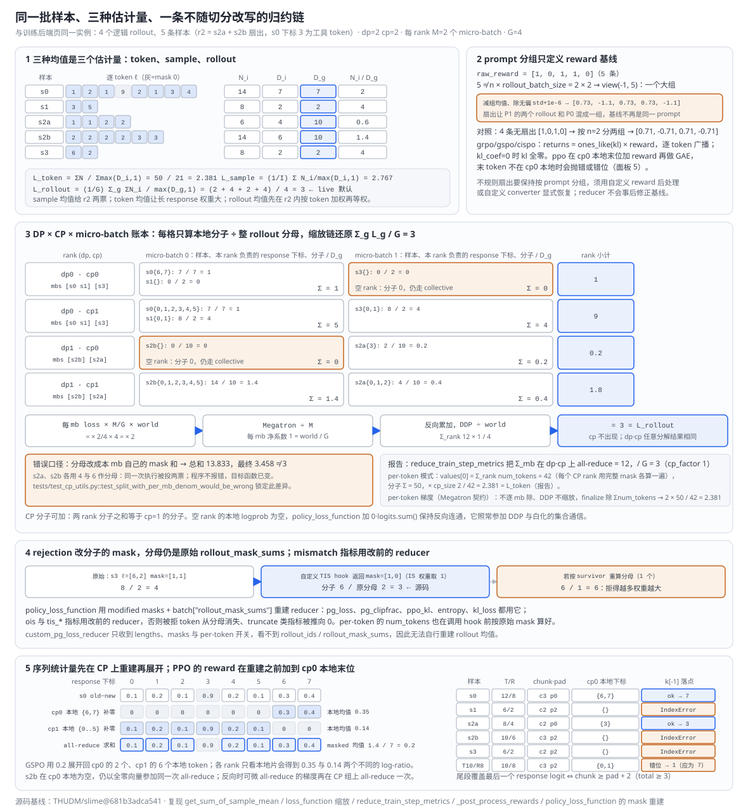
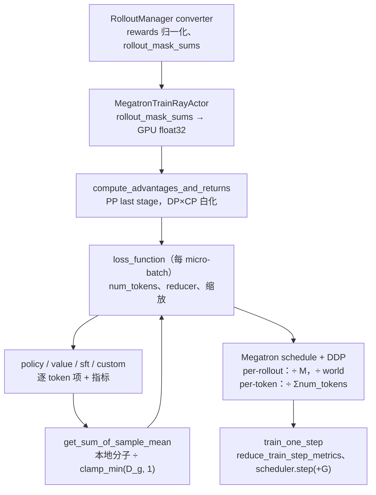

# slime Loss 与并行归一化分析

> **源码基线**：`THUDM/slime@681b3adca54105d5ecd3fb822fa0dc58a427e0f9`（`main`，2026-08-12）
> **主题**："估计什么"与"在哪块 GPU 上算"怎样被拆开：prompt 分组只定义 reward 基线，token 目标函数产生逐 token 项，`get_sum_of_sample_mean` 用切分前算好的整 rollout 分母把它们归约成 rollout 均值，`loss_function` 的预缩放、Megatron 除 micro-batch 数与 DDP 平均逐项抵消重复因子，`step_global_batch_size` 同时充当 loss 分母、指标分母与 LR 步进；校正 mask 只改分子。核心代码在 `slime/backends/megatron_utils/{loss,cp_utils}.py` 与 `slime/utils/ppo_utils.py`。
> **适用范围**：估计量与归约器的统计语义；DP 调度、CP 切片与训练步归 14，Sample 与 `rollout_mask_sums` 的来源归 12，TIS/MIS 的权重算法归 17。
> **最近更新**：2026-09-11。按特性分析画像重写，与 14 页共用同一最小实例，补归约账本原理图、调用树与成本账本。

---

## 1. 特性概览

### 1.1 问题背景

RL 的 loss 有四个候选统计单位：token、物理样本、prompt 分组、逻辑 rollout；而执行时同一批数据又被 DP rank、CP 切片、micro-batch 与 PP/VPP stage 切成许多物理份。如果每个目标函数内部直接调 `.mean()`，同一条 PPO 公式就会因 response 长度、compact 片段数、动态打包与 CP 切片数悄悄改变口径，而且每加一种 loss 都要重写一遍并行归一化；如果在 micro-batch 内重算分母，一次逻辑执行拆到两个 micro-batch 后就被投两票。程序在这两种情况下都照常运行，只是优化的已是另一个目标函数。因此 loss 层必须守住四条不变量：分组不变量（同一 prompt 的 reward 基线只在同 prompt 候选之间比较）、mask 不变量（基础 mask 定义分母，rejection 只能删分子项）、rollout 不变量（一次逻辑执行不管拆成几个片段只占一份权重）、拓扑不变量（改 DP/CP/micro-batch/PP/VPP 不改同一批数据的目标与梯度）。

### 1.2 解决方法

slime 把目标函数与归约器拆开。reward 后处理按 `n_samples_per_prompt` reshape 减组均值（可选除组标准差），advantage 估计器把标量 reward 展成逐 token 信号；policy、value、SFT 与自定义 loss 都只产生逐 token 项，然后交给同一个归约函数。`loss_function` 在每个 micro-batch 用整步算好的 `rollout_mask_sums` 构造 `get_sum_of_sample_mean`：每条样本的本地分子除以它所属 rollout 的完整 mask 和，同一 rollout 的片段落在哪个 micro-batch、哪个 CP rank 都不影响分母；CP 下只对本 rank 负责的 response 位置求分子，分子在 CP 上可加。随后 loss 乘 `num_microbatches / step_global_batch_size × dp·cp world`，Megatron 再除 micro-batch 数，DDP 在 DP-with-CP 组平均，链条末端恰好剩下 rollout 均值的均值；per-token 模式改为乘 `cp_size`；按 Megatron 的公开实现，该模式下流水线不逐 micro-batch 相除，而是在梯度终结时除以 DP-with-CP 上汇总的 token 数。`step_global_batch_size` 同时进入 loss 缩放、`reduce_train_step_metrics` 的报告分母与 LR scheduler 的 `increment`。校正 hook 返回修改后的 mask 时，`policy_loss_function` 用它重建分子 reducer，但分母仍是原始 `rollout_mask_sums`，mismatch 指标保留改前的 reducer。

### 1.3 收益、开销和约束

| 维度 | 直接收益 | 必付成本或边界 |
|---|---|---|
| 目标函数扩展 | 新 loss 只写逐 token 项，继承现有归约与拓扑不变性 | `custom_pg_loss_reducer` 看不到 `rollout_ids` 与 `rollout_mask_sums`，无法自行重建 rollout 均值 |
| compact 扇出 | 片段共享分母，一次执行一票 | 每条样本冗余携带一份整 rollout 分母；分母必须在展平后、切分前算好 |
| CP | 分子可加，改 CP size 不改 loss、指标与梯度 | GSPO、OPSM、GAE、REINFORCE++ 的序列统计量要先 all-gather；空 rank 也必须参加集合通信 |
| DP 与 micro-batch | 不假设各 rank 样本数相同，报告用 `(sum, count)` 加权 | 预缩放、Megatron 除 M、DDP 平均三层因子必须逐个抵消，任一层改动都要重验 |
| 进度计数 | loss、指标、LR 三处共用 G，扇出不改学习率推进 | 只修其一即错配 |
| 校正 mask | rejection 不会把目标改成 survivor mean | 两个 reducer 并存，指标口径要看清用的是哪一个 |
| reward 分组 | 默认按 `n_samples_per_prompt` reshape，无需 `group_index` | 样本数不等于 `n × rollout_batch_size` 时回落成一个大组 |

### 1.4 术语与符号

设 prompt 分组为 $p$，逻辑 rollout 为 $g$，训练片段为 $i\in g$，response 位置为 $t$，逐 token 目标项为 $\ell_{it}$，训练 mask 为 $m_{it}\in\{0,1\}$：

$$
N_i=\sum_t m_{it}\ell_{it},\qquad
D_i=\sum_t m_{it},\qquad
D_g=\sum_{i\in g}D_i .
$$

| 术语 | 含义 |
|---|---|
| $G$ / `step_global_batch_size` | 一个训练步的逻辑 rollout 数，也是 `global_batch_sizes` 的元素 |
| $I$ | 一步内的物理训练样本数 |
| `rollout_mask_sums[i]` | 样本 i 所属 rollout 的 $D_g$，converter 在展平后算好并广播到每条样本（归 12） |
| 分子 / 分母 | 分子是本地 $\sum m\ell$，分母是 `clamp_min(D_g, 1)`；per-token 模式只返回分子 |
| M / world | 每 rank 的 `num_microbatches`；`get_data_parallel_world_size(with_context_parallel=True)` = dp × cp |
| 原 reducer / 改后 reducer | 用 `loss_masks` 与用 hook 返回的 `modified_response_masks` 构造的 `sum_of_sample_mean`，分母同为 `rollout_mask_sums` |

---

## 2. 归约方案详细分析

### 2.1 最小实例：四个 rollout、五条样本的三种均值与一条归约链

沿用 [[14_slime_megatron_training_analysis#2.1 最小实例：四个逻辑 rollout、五条样本进入一次 optimizer step|14 页的实例]]：`dp_size=2`、`cp_size=2`、`global_batch_size=4`，样本 s0（r0，response 8，下标 3 为工具 token）、s1（r1，2）、s2a 与 s2b（同属 r2，4 与 6）、s3（r3，2）；调度把 rank 0 分到 `[s0 s1]`、`[s3]` 两个 micro-batch，rank 1 分到 `[s2b]`、`[s2a]`，故 M=2、G=4、world=4。把逐 token 目标项取为 s0 `[1,2,1,9,2,1,3,4]`（下标 3 的 9 被 mask 掉）、s1 `[3,5]`、s2a `[1,1,2,2]`、s2b `[2,2,2,2,3,3]`、s3 `[6,2]`，则 $N=[14,8,6,14,8]$、$D=[7,2,4,6,2]$、$D_g$ 广播后为 `rollout_mask_sums=[7,2,10,10,2]`。下图五个面板依次是三种估计量、reward 分组、DP×CP×micro-batch 账本、rejection，以及序列统计量的 CP 重建与 PPO reward 落点。



| 步骤 | 输入 | 决定性转换 | 输出 |
|---|---|---|---|
| 三种估计量 | $N$、$D$、$D_g$ | token：$\sum N / \sum \max(D_i,1)$；sample：$\frac1I\sum N_i/\max(D_i,1)$；rollout：$\frac1G\sum_g \sum_{i\in g}N_i/\max(D_g,1)$ | `L_token = 50/21 ≈ 2.381`，`L_sample ≈ 2.767`，`L_rollout = (2 + 4 + 2 + 4)/4 = 3` |
| reward 分组 | `raw_reward=[1,0,1,1,0]`，`n=2`、`rollout_batch_size=2` | 5 ≠ 2 × 2 → `view(-1, 5)`：一个大组，减均值 0.6、除无偏 std | `[0.73, -1.10, 0.73, 0.73, -1.10]`；4 条无扇出 `[1,0,1,0]` 才按 n=2 分两组得 `[0.71, -0.71, 0.71, -0.71]` |
| 本地分子 | rank 0 cp0 的 mb0 `[s0 s1]` | cp0 只负责 s0 的 response 下标 `{6,7}`，s1 无 | `s0: 7/7 = 1`，`s1: 0/2 = 0`，mb 小计 1 |
| 本地分子 | rank 1 cp1 的 mb0 `[s2b]` 与 mb1 `[s2a]` | 两个片段都除以 $D_{r2}=10$ | `s2b: 14/10 = 1.4`，`s2a: 4/10 = 0.4`；cp0 上 s2b 为空，s2a 只负责下标 `{3}` 得 `2/10 = 0.2` |
| rank 小计 | 四个 (dp, cp) rank | Σ 各 mb 的 reducer 输出 | `[1, 9, 0.2, 1.8]`，总和 12 = Σ rollout 均值 |
| 缩放链 | 每 mb loss、M=2、G=4、world=4 | × `2/4 × 4 = 2` → Megatron ÷ 2 → 每 mb 净系数 1 → 反向累加 → DDP ÷ 4 | `12 / 4 = 3 = L_rollout`，与 cp 无关 |
| 错误口径 | 分母改成本 mb 自己的 mask 和 | s2a、s2b 各用 4 与 6 | 总和 13.833，最终 `3.458 ≠ 3` |
| 报告 | per-rollout：Σ_mb → all-reduce dp·cp = 12 → / G；per-token：`values[0]` = Σ 各 rank `num_tokens` = 42 | cp_factor 分别为 1 与 `cp_size` | `3` 与 `50 × 2 / 42 ≈ 2.381 = L_token` |
| per-token 梯度 | 每 rank 的 loss 是本地 token 分子之和 × `cp_size` | 按 Megatron 的公开实现，该模式下流水线不逐 micro-batch 相除、DDP 不缩放梯度，`finalize_model_grads` 在 dp·cp 上汇总 `num_tokens` 后整体相除 | 梯度 `2 × 50 / 42 ≈ 2.381`，与 L_token 相同 |
| rejection | s3 `ℓ=[6,2]`，自定义 `--custom-tis-function-path` 返回 mask `[1,0]`，IS 权重取 1 | 分子改为 6，分母仍为 2 | `6/2 = 3`（源码）；若按 survivor 重算分母得 `6/1 = 6` |

#### 2.1.1 三种估计量

sample 均值给 r2 的两个片段两票（1.5 与 2.333 各占五分之一），token 均值让 s0 的 7 个有效 token 占 21 个中的三分之一，rollout 均值先在 r2 内按 token 加权（(6+14)/10 = 2）再与 r0、r1、r3 等权。三者都可合法，但不能因一次数据打包或 agent compaction 被动互换；默认 converter 产出 `rollout_mask_sums`，live 路径把它传给 reducer，即 rollout 均值；自定义 converter 若不产出这个键，DP 切分会跳过它，`DataIterator` 给出 `None`，reducer 静默退回 sample 均值，而缩放仍除以 G（§5.1）。

#### 2.1.2 prompt 分组与 advantage

reward 归一化的分组单位是 prompt，不是 rollout：默认按 `n_samples_per_prompt` reshape。扇出让样本数变成 5，reshape 回落成一个大组，P1 的两个 rollout 与 P0 混成一组，基线不再是同一 prompt。grpo/gspo/cispo 的 `returns` 是 reward 逐 token 广播（`kl_coef=0` 时 KL 全零），advantage 就是 returns 的拷贝。这一步与后面的 loss 归约器互不修正：归约器只决定权重，不重建基线。

#### 2.1.3 DP × CP × micro-batch 账本

每格只算"本 rank 负责的 response 位置"的分子，分母恒为该样本所属 rollout 的 $D_g$。四个 rank 的小计之和等于全批的 Σ rollout 均值 12，因为分子在 micro-batch 与 CP 两个维度上都可加，而分母不随切分改变。缩放链的每个因子都有归属：`num_microbatches / step_global_batch_size × world` 由 slime 在 `loss_function` 里乘，`÷ num_microbatches` 由 Megatron 的流水线在收到三元组 `(loss, 1, log)` 时执行，`÷ world` 由 DDP 在 DP-with-CP 组平均时执行；三者相乘为 `1/G`。dp1 cp0 在 mb0 上没有任何 response 位置：s2b 长 10、chunk 为 3，cp0 分到的两段是 prompt 头 `[0,3)` 与尾段 `[9,12)`，尾段只含最后一个 token 与补齐位，不含预测 response 的 logit 位置。它的分子为 0，`policy_loss_function` 在本地 logprob 为空时加 `0 × logits.sum()` 保持反向连通，它仍要参加 DDP 与后续集合通信。

#### 2.1.4 rejection

hook 把 s3 的第二个 token 拒掉后，源码用修改后的 mask 重建 reducer，但分母还是 `rollout_mask_sums` 里的 2，所以 s3 的贡献从 4 变成 3；若按 survivor token 数重算分母，会得到 6，拒得越多权重越大。这就是"原始 mask 定义分母，rejection 只删分子项"的数值含义。

### 2.2 从最小实例到整套 loss 层

以下各组件的"为何"是本页依据源码形态与失败路径重建的理由（标"本页推断"）；Megatron 的 `÷ num_microbatches` 与 DDP 平均按其公开契约叙述，slime 的 CPU 测试把这两步显式写成假设并注明真实 schedule 变动需 GPU 集成套件兜底。

#### 2.2.1 reward 后处理与 advantage/return 估计器

**职责。** `RolloutManager._post_process_rewards` 在 grpo/gspo/cispo/reinforce_plus_plus_baseline 且 `rewards_normalization` 开启时：

$$
\begin{aligned}
\widetilde r_{pi} &= r_{pi}-\overline r_p, \\
\widehat r_{pi} &= \frac{r_{pi}-\overline r_p}{s_p+10^{-6}},
\end{aligned}
$$

reshape 规则是 reward 数等于 `n_samples_per_prompt × rollout_batch_size` 时按 n 分组，否则 `view(-1, len)` 视为一组；grpo/gspo/cispo 且 `grpo_std_normalization` 时再除组标准差（`n_samples_per_prompt == 1` 会自动关闭）。训练侧 `compute_advantages_and_returns` 只在 PP last stage 执行：`kl_coef == 0` 或无 logprob 时 KL 取零，否则 `compute_approx_kl` 按 `kl_loss_type`（k1 为 log-ratio，k2 为其平方一半，k3/low_var_kl 为 `exp(-r) - 1 + r`，后者再 clamp 到 ±10）；估计器分派：grpo/gspo/cispo 把标量 reward 广播到每个 token；ppo 把 CP 本地的 KL 乘 `-kl_coef`，在 `cp_rank == 0` 上把 reward 加到本地张量的最后一位（`k[-1] += reward`，发生在 gather 之前），再做 GAE；reinforce_plus_plus 在完整 response 上构造 `-kl_coef × KL` 并把 reward 加到最后一个有效 token，按 `gamma` 做折扣回报；reinforce_plus_plus_baseline 把已减组基线的 reward 广播并减 `kl_coef × KL`。`use_opd` 再从 advantage 中减 `opd_kl_coef × (student − teacher)` 并记录 `opd_reverse_kl`（归 [[20_slime_on_policy_distillation_analysis]]）。

PPO 的 GAE 递推是

$$
\begin{aligned}
\delta_t &= r_t+\gamma V_{\mathrm{old}}(s_{t+1})-V_{\mathrm{old}}(s_t), \\
A_t^{\mathrm{GAE}} &= \delta_t+\gamma\lambda A_{t+1}^{\mathrm{GAE}}, \\
\widehat R_t &= A_t^{\mathrm{GAE}}+V_{\mathrm{old}}(s_t),
\end{aligned}
$$

`get_advantages_and_returns_batch` 在 `torch.no_grad()` 中先把 CP 下的 values 与 rewards `all_gather_with_cp` 成完整 response，按批内最长 response 补零后调用 `chunked_gae`：先构造 next-values 与 `deltas`，再以 `gamma × lambd` 做块大小 128 的分块折扣扫描（`chunked_discounted_returns` 把反向递推改写成反转序列上的前向扫描，块内用一次矩阵乘法、块间串行传递尾项），最后切回本地 CP 片；`vanilla_gae` 只在 `chunked=False` 时逐位置反向循环，是对照实现，`tests/test_chunked_gae.py` 锁定两者一致。`normalize_advantages` 时按 CP 的 token 归属切完整 mask，在 DP-with-CP 组上 `distributed_masked_whiten`（全局均值、方差带 Bessel 修正，全局 mask 和为 0 抛 `ValueError`）；`tests/test_advantage_whiten_cp.py` 验证 DP/CP 组合下的不变性。

**为何。** prompt 分组解决的是"难度与奖励尺度只在同 prompt 候选之间比较"，它是 reward 的相对基线，不是 loss 权重；两者若合在一处，改 `n_samples_per_prompt` 就会同时改基线与权重（本页推断）。GAE 需要未来 token，CP 切片不能独立计算，所以先 gather 再切回，这是序列统计量与可加分子的分界。

**代价与边界。** reshape 回落是硬边界：不规则扇出若仍要按 prompt 分组，须用 `--custom-reward-post-process-path` 或自定义 converter 显式恢复；REINFORCE++ 系列参数校验强制 `normalize_advantages`；`kl_coef` 与 `kl_loss_coef` 不能同时非零；ppo 分支在冻结基线对 `kl` 原地改写，基线后的 `045310b2b490dc6ca22ddbc60cf29b21fc3b42aa`（2026-08-21）改为创建 `token_level_rewards` 以保留原始 KL 修正 `rollout/kl` 日志，本页仍按冻结基线叙述。PPO 的 reward 注入依赖 zigzag 几何：cp0 本地张量的最后一位只有在尾段覆盖最后一个 response logit 时才是真正的末 token，条件是 `chunk ≥ pad + 2`（total ≥ 3 时成立；total 为 2 的样本末 logit 落在 cp0 的头段）。本例 s0 与 s2a 满足；s1、s2b、s3 在 cp0 本地为空，`k[-1]` 会抛 `IndexError`；total 10、response 8 的样本在 cp0 本地只有下标 `{0,1}`，reward 落在下标 1 而非 7，静默错位（源码推导，未运行；§5.1）。

#### 2.2.2 token 目标函数：policy、value、SFT、custom

**职责。** `policy_loss_function` 先用 `get_log_probs_and_entropy` 从 logits 算出当前 logprob 与 entropy（top-p keep-mask 只作用于 logprob），old logprob 取 `rollout_log_probs`（`use_rollout_logprobs`）或 batch 的 `log_probs`，两者都没有时用当前 logprob 的 detach（对应 14 页的 `can_reuse_log_probs_in_loss`）。policy 目标是

$$
\begin{aligned}
\rho_t(\theta) &= \exp\!\left(\log\pi_\theta(a_t\mid s_t)-\log\pi_{\mathrm{old}}(a_t\mid s_t)\right), \\
\ell_{\mathrm{PPO},t} &= \max\!\left(-\rho_t A_t,\;-\operatorname{clip}(\rho_t,1-\epsilon,1+\epsilon_{\mathrm{high}})A_t\right),
\end{aligned}
$$

源码以 `ppo_kl = old − new` 表示，`ratio = exp(-ppo_kl)`；`eps_clip_c` 启用 dual-clip：对负 advantage 再取与 `-eps_clip_c × A` 的较小值，正 advantage 保持原式，`compute_policy_loss` 断言 `eps_clip_c > 1`，`pg_clipfrac` 只记初次 clipping。CISPO 截断 stop-gradient 的 ratio，让梯度经 `log_probs` 流过（`-sg(clip(ρ)) × A × log π`），参数校验提醒 canonical 设置是 `eps_clip ≥ 1`。GSPO 与 OPSM 需要完整序列：先对当前与 old logprob 做 `all_gather_with_cp`，GSPO 用完整 mask 求序列均值 log-ratio 再 `expand_as` 到本地 token；OPSM 对 `advantage < 0 ∧ seq_kl > opsm_delta` 的序列置 mask 0。之后 `pg_loss` 乘 OPSM mask，经可选的 TIS hook（§2.2.7），再进入归约：`pg_loss` 用 `pg_loss_reducer`（默认即 `sum_of_sample_mean`），`pg_clipfrac`、`ppo_kl`、`entropy` 用 `sum_of_sample_mean`；`loss = pg_loss − entropy_coef × entropy_loss`，`use_kl_loss` 时加 `kl_loss_coef × compute_approx_kl(new, ref)`（`use_unbiased_kl` 乘 `exp(new − old)` 作重要性比）。`value_loss_function` 对 clipped 与 unclipped 平方误差取最大后归约，`values_clipfrac` 同样归约；`sft_loss_function` 归约 response 的负 logprob。三者在 `log_probs.numel() == 0`（value 看 `values`）时加 `0 × logits.sum()`（value 加 `0 × values.sum()`）保持图连通。

**为何。** 目标函数回答"每个动作该产生什么梯度信号"，归约器回答"token、样本、rollout 各占多少权重"；分开后每种 loss 都只写逐 token 项，并行归一化写一遍（本页推断；被否方案是每个目标函数内部 `.mean()`，判据是口径是否随长度、片段数、打包与 CP 漂移）。零连接项不改梯度值，只修补 autograd 图，让没有贡献 token 的 rank 仍走完 gather 的反向。

**代价与边界。** GSPO/OPSM 对每条样本的当前与 old logprob 各做一次 `all_gather_with_cp`，前向每条样本两次 CP all-reduce，反向对需要梯度的重建张量再各一次（`torch.distributed.nn` 的依赖语义）；`entropy_coef == 0` 时 entropy 只算值不留反向激活；`recompute_loss_function` 用 `torch.utils.checkpoint` 重算整个 loss 函数省显存换算力。

| 目标函数 | 统计单位与分子 | mask / 分母 | 重建或聚合位置 | 保证的不变量 |
|---|---|---|---|---|
| PPO / CISPO policy | token surrogate；GSPO 先形成 sequence ratio 再回到 token 项 | response `loss_masks`；交给统一 reducer | GSPO/OPSM 在 objective 前 CP all-gather；scalar 在 reducer 后形成 | CP 切分不改变 sequence ratio，packing 不改变 rollout 权重 |
| value | token 上 clipped 与 unclipped 平方误差的最大值 | 同一 reducer 的 mask 与分母 | current values 与 returns 对齐后归约 | critic target 不因长度或扇出被重复加权 |
| SFT | response token 的负 logprob | 同一 reducer | response 对齐的 logprob 后归约 | prompt/padding/tool token 不进入 NLL |
| entropy / 显式 KL / clip 指标 | 各自逐 token 项 | 默认复用 objective reducer | policy loss 内与 pg loss 并列聚合 | 指标、正则项与主梯度处于同一统计空间 |
| custom loss | 由扩展实现定义 | 收到已绑定默认 mask、整 rollout 分母与 token/rollout 模式的归约函数 | `loss_function` 外层仍做 Megatron 缩放 | 新目标可复用现有拓扑不变性 |

#### 2.2.3 归约器 get_sum_of_sample_mean 与 rollout_mask_sums

**职责。** `get_sum_of_sample_mean(total_lengths, response_lengths, loss_masks, sample_denoms, calculate_per_token_loss)` 返回一个闭包。`sample_denoms=None` 时退化为每条样本自己的 `mask.sum()`（docstring 称之为 legacy per-sample mean，`log_correct_samples` 的 correct-only 熵统计仍用它）；live 路径传入 `rollout_mask_sums`。`cp_size == 1` 时闭包把 `x` 按 `response_lengths` 切开，逐样本 `(x_i × mask_i).sum() / clamp_min(denom_i, 1)` 求和；`cp_size > 1` 时先用 `get_logits_and_tokens_offset_with_cp` 算出本 rank 负责的两段 response 下标，把完整 mask 切成对应片，再按片长切 `x`。`calculate_per_token_loss` 时返回只求分子的 `sum_of_token`。

**为何。** 分母必须在展平后、DP 切分与 micro-batch 打包之前算好：切分后每个 micro-batch 只看得到自己那部分片段，局部分母会让跨 micro-batch 的 rollout 得到两份权重（§2.1.3 的 13.833 对 12）。docstring 直接把这一点写成设计原因，`tests/test_cp_utils.py::test_split_with_per_mb_denom_would_be_wrong` 锁定它。`clamp_min(denom, 1)` 让全 mask 样本贡献 0 而不报错，这与 12 页 mask-offpolicy 清零已完成兄弟样本的边界相接。

**代价与边界。** reducer 是 Python 闭包逐样本循环；分母作为 float32 张量随每条样本传输；`sample_denoms=None` 的兼容语义在扇出下等于 sample 均值，不是 rollout 均值。

#### 2.2.4 CP 上的分子可加与序列统计量重建

**职责。** `get_logits_and_tokens_offset_with_cp` 给出本 rank 两段 chunk 的 logits 与 token 区间（区间为空时置 `(0, 0)` 以保持梯度流）；`slice_log_prob_with_cp` 用同一偏移把完整 response 的 logprob 切成本地片，`all_gather_with_cp` 反向：把本地两段放回完整 response 的正确位置、其余补零，再在 CP 组上做可微的 `dist.nn.all_reduce`。`allgather_cp` 布局下 logprob 先按连续片计算，再由 `_allgather_cp_redistribute` 经一次可微 all-reduce 重建完整 response 并切回 zigzag 片，之后的归约与 zigzag 路径一致。`loss_function` 在 `allgather_cp` 且 `cp_size > 1` 时无条件加 `0 × logits.sum()`，注释解释某些 CP rank 可能没有贡献 token，没有这一项其注意力路径不走反向、CP gather 的 reduce-scatter 不被调用，其他 rank 会死锁。

**回放。** 取 s0 的逐 token `old − new` 差 `[0.1,0.2,0.1,0.9,0.2,0.1,0.3,0.4]`（下标 3 被 mask，示意值）。cp0 本地只有下标 `{6,7}` 的 `[0.3,0.4]`，cp1 有下标 `{0..5}`；`all_gather_with_cp` 让各自补零成长 8 的整条 response，CP all-reduce 求和后两边都得到完整向量。GSPO 按完整 mask 求序列均值 `1.4/7 = 0.2`，再 `expand_as` 回 cp0 的 2 个与 cp1 的 6 个本地 token；若各 rank 只看本地片，会得到 `0.35` 与 `0.14` 两个不同的序列均值 log-ratio（即 GSPO 的 `ppo_kl`，ratio 本身是 `exp(-ppo_kl)`）。s2b 在 cp0 本地为空，仍以全零向量参加同一次 all-reduce。反向时 `dist.nn.all_reduce` 的梯度按 PyTorch 可微集合通信的公开语义再在 CP 组上 all-reduce 一次；`zero(...)` 以 `requires_grad=True` 构造补零段，本地为空的 rank 因此也留在计算图里（本页推断）。当前与 old logprob 各走一遍，所以每条样本前向两次 all-reduce。图中面板 5 画的就是这组数。

**为何。** 普通 token 目标的分子可加，所以 CP 只需各算本地片再让 DDP 求和；GAE、GSPO、OPSM、REINFORCE++ 折扣回报是序列统计量，必须先重建完整序列。区分这两类可以避免为每个 micro-batch 无条件 gather（本页推断，判据是统计量是否依赖跨切片的位置关系）。

**代价与边界。** 每条样本、每个需要完整序列的张量一次 CP all-reduce，反向再一次；`slice_log_prob_with_cp` 断言 logprob 长度等于 response 长度；`all_gather_with_cp` 断言重建长度等于 response 长度。官方 CPU 测试 `tests/test_cp_utils.py::test_cp_chunking_preserves_per_rollout_mean_report` 验证两个 CP rank 的 reducer 输出之和等于 cp=1。

#### 2.2.5 loss_function 的缩放链与 Megatron 边界

**职责。** `loss_function(args, batch, num_microbatches, step_global_batch_size, logits)` 先算 `num_tokens = Σ clamp_min(mask.sum(), 1)`（完整 mask，与 CP 无关；全 mask 样本贡献 0 分子却仍给 token 分母贡献 1），构造 reducer，按 `loss_type` 分派 `policy_loss` / `value_loss` / `sft_loss` / `custom_loss`（`load_function(custom_loss_function_path)`，未知类型抛 `ValueError`），可选 `recompute_loss_function`。缩放：非 per-token 时 `loss × num_microbatches / step_global_batch_size × get_data_parallel_world_size(with_context_parallel=True)`，返回三元组 `(loss, 1, log)`；per-token 时 `loss × cp_size`，返回 `(loss, num_tokens, log)`。`log` 的 `values[0]` 在 per-token 模式放 `num_tokens`，否则放 0 占位，由 `train_one_step` 用常量 G 替代。

**为何。** 非 per-token 模式下，Megatron 收到三元组后会 `÷ clamp(num_tokens, 1)` 再 `÷ num_microbatches`，DDP 以 `1 / dp_cp_world` 缩放梯度；slime 的预乘正好抵消这两层，让最终梯度等于 $\frac1G\sum_g L_g$，其中不含 cp，因此任何 (dp, cp) 分解结果相同。这两步 Megatron 行为是 `tests/test_loss_cp_invariance.py` 顶部注明的依赖契约：测试用 `nn.Linear` 与手工 all-reduce 复现四步，在 (1,1)、(2,1)、(1,2)、(2,2)、(1,4)、(4,1) 六种分解下断言梯度都等于 1249.875，并声明若 Megatron 改掉 `÷ num_microbatches` 该测试抓不到，要靠 GPU 集成套件。per-token 模式走 Megatron 的另一条契约（依据其公开实现，本页未钉 Megatron 版本）：流水线不再逐 micro-batch 相除，DDP 不缩放梯度，`finalize_model_grads` 在 DP-with-CP 组上汇总 `num_tokens` 后整体除一次。每个 CP rank 都按完整 mask 计入 `num_tokens`，slime 的 `× cp_size` 正好抵消这份重复，本例得 `2 × 50 / 42 ≈ 2.381 = L_token`。slime 的 CPU 梯度测试只覆盖非 per-token 路径，per-token 只有报告口径被 `test_metric_report*` 锁定。`loss_function` 里 `# Here we need to divide by cp_size ...` 的注释与代码的乘法相反，以代码为准。

**代价与边界。** 三层因子任一改动都要重验；自定义 loss 若忽略传入的 reducer 自行 `.mean()`，缩放链仍会运行但结果不再是任何一种命名的估计量。

#### 2.2.6 step_global_batch_size 与指标报告

**职责。** `train_one_step` 收到 `global_batch_sizes[step_id]`，同时用于 loss 预缩放分母、`reduce_train_step_metrics` 的报告分母与 `opt_param_scheduler.step(increment=...)`。`reduce_train_step_metrics` 把各 micro-batch 的 `values` 逐元素相加、在 DP-with-CP 组 all-reduce，per-token 模式除 all-reduce 后的 `values[0]` 并乘 `cp_factor = cp_size`，per-rollout 模式除常量 G 且 `cp_factor = 1`。rollout 侧 `log_rollout_data` 对 `log_probs`、`ref_log_probs`、`returns`、`advantages`、`values`、`teacher_log_probs` 等用同一 `rollout_mask_sums` 归约，再经 `rollout_log_metric_contribution` 变成 `(cp_size × Σ, num_rollouts / dp_size)`，`gather_and_reduce_log_dict` 对元组做 `Σsum / Σcount`，落在 `sum_DP_full / num_rollouts`，与训练侧单步报告同一空间；非元组值按 `Σ / dp_size` 取平均。

**为何。** 只修正 loss 而不修正 scheduler，扇出下梯度正确但学习率仍按错误数据量推进；反之亦然（旧版设计分析，保留）。`(sum, count)` 元组让报告不再假设各 DP rank 样本数相同，源码注释点明这是为不均匀 DP 分区做的准备。

**代价与边界。** `tests/test_metric_report.py` 在六种 rank/mb 分布下断言 per-rollout 报告恒为 8.0、per-token 报告恒为 78/12，并验证 rollout 侧与训练侧单步报告一致；`tests/test_metric_report_dist.py` 用真实 `torch.distributed` 覆盖 dp×cp 矩阵。

#### 2.2.7 校正 mask 与两个 reducer

**职责。** `get_mismatch_metrics` 或 `use_tis` 时，`policy_loss_function` 先保存原 reducer 为 `sum_of_sample_mean_for_mismatch_metrics`，断言 batch 带 `rollout_log_probs`，计算 `ois = exp(-ppo_kl)`，把 `(args, pg_loss, train_log_probs, rollout_log_probs, loss_masks, total_lengths, response_lengths)` 交给 `custom_tis_function_path` 或内置 `vanilla_tis_function`，hook 返回加权的 `pg_loss`、`modified_response_masks` 与指标；随后用 `modified_response_masks + batch["rollout_mask_sums"]` 重建 `sum_of_sample_mean`，`pg_loss`、`pg_clipfrac`、`ppo_kl`、`entropy`、`kl_loss`、`train_rollout_logprob_abs_diff` 与 `opd_reverse_kl` 都用它；`ois` 与 hook 返回的 `tis`、`tis_clipfrac`、`tis_abs` 等用改前的 reducer。`opsm_clipfrac` 两个都不用：`compute_opsm_mask` 逐样本累加 `mask.sum() / clamp_min(loss_mask.sum(), 1)` 后原样报告，再被 `reduce_train_step_metrics` 除以 G，按片段计数，扇出下可以超过 1（本页推断）。内置 `vanilla_tis_function` 把 `exp(old − rollout)` clamp 到 `[tis_clip_low, tis_clip]` 作权重且不改 mask；同文件的 `icepop_function`（只能经 `custom_tis_function_path` 指定）把区间外的权重置 0。`custom_pg_loss_reducer_function_path` 是另一个较窄的替换点：签名 `(total_lengths, response_lengths, loss_masks, calculate_per_token_loss)`，只替换 `pg_loss` 的 reducer，官方用例是 Dr.GRPO 常量分母。

**为何。** 源码注释写明 mismatch/TIS/RS 指标常定义在拒绝前的有效 token 上，若用改后的 mask 聚合，被拒 token 从分母消失、`truncate_fraction` 类指标会被推向 0；分母沿用 `rollout_mask_sums` 则让 pg loss 与其余报告项处于同一 rollout 均值空间。`custom_pg_loss_reducer` 看不到 `rollout_ids` 与 `rollout_mask_sums`，因此适合有意定义新的 policy-gradient 口径，不适合"自己重写默认的 rollout 均值"（本页推断，与旧版一致）。权重与拒绝规则的算法归 [[17_slime_train_inference_consistency_analysis#2.2 从最小实例到整个一致性体系|17 页 §2.2.9]]。

**代价与边界。** `use_rollout_logprobs` 与 `use_tis` 互斥；`get_mismatch_metrics` 要求 `custom_tis_function_path`；per-token 模式的 `num_tokens` 在调用 hook 前按原始 mask 算好，rejection 不会自动把目标改成 survivor mean。

### 2.3 变体：估计器、归约口径与 CP 布局

| 选择轴 | 枚举依据 | 变体 | 本例的表现 | 压力与上限 |
|---|---|---|---|---|
| advantage 估计器 | `compute_advantages_and_returns` 的分派与 `--advantage-estimator` 的 choices | grpo / gspo / cispo / ppo / reinforce_plus_plus / reinforce_plus_plus_baseline / custom | grpo 把 `[0.73, -1.10, …]` 广播到每个 token；ppo 需 critic values 与 GAE，reward 在 gather 之前加到 cp0 本地末位，本例 s1、s2b、s3 在 cp0 为空会抛错（§5.1） | 是否需要 critic、是否需要完整序列 |
| 归约口径 | `calculate_per_token_loss` 与 `sample_denoms` 是否为 None | rollout 均值（live 默认）/ token 均值 / sample 均值（legacy，仅 correct-only 熵统计） | 3 / 2.381 / 2.767 | 扇出与长 response 的权重分配 |
| policy 目标 | `policy_loss_function` 的 `advantage_estimator` 分支（gspo 换序列 KL，cispo 换目标）、`eps_clip_c`、`use_opsm` | PPO clip / dual-clip / GSPO / CISPO / +OPSM | 本例只看归约，目标项已给定；GSPO/OPSM 的序列重建见 §2.2.4 回放 | 序列统计量需要 CP all-gather |
| KL 位置 | `kl_coef` vs `use_kl_loss` | reward 整形（advantage 前）/ loss 正则项（`kl_loss_coef`） | 本例 `kl_coef=0`、`use_kl_loss` 开：KL 只进 loss；`kl_loss_coef` 取默认 0 时该项数值为 0，只计算并报告 `kl_loss` | 两者互斥 |
| CP 布局 | `allgather_cp` | zigzag 本地片 / 连续片 + `_allgather_cp_redistribute` | zigzag 下 dp1 cp0 在 mb0 为空 rank | 空 rank 必须参加集合通信 |
| pg 归约替换 | `custom_pg_loss_reducer_function_path` | 默认 reducer / 自定义（如 Dr.GRPO 常量分母） | 只改 pg_loss，其余指标不变 | 看不到 rollout 身份 |
| 校正 hook | `use_tis` / `get_mismatch_metrics` / `custom_tis_function_path` | 无 / vanilla TIS / icepop / 自定义 MIS | s3 的 `6/2 = 3` | 两个 reducer 并存 |

兄弟轴：DP 调度与 micro-batch 打包决定分子落在哪个 rank 与 micro-batch，归 [[14_slime_megatron_training_analysis#2.2 从最小实例到整个训练后端|14 页调度层 §2.2.3]]；`rollout_mask_sums` 的生成与自定义 converter 归 12 页。

### 2.4 整体开销

| 维度 | 来源 | 评估状态 |
|---|---|---|
| 计算 | `get_log_probs_and_entropy` 一次全 `[T, V]` softmax；GSPO/OPSM/GAE 的完整序列重建；`recompute_loss_function` 的重算 | 源码可见，未测量 |
| 内存 | 每条样本一份 float32 分母；entropy 反向激活仅在 `entropy_coef ≠ 0` 保存；top-p keep-mask `[T, vocab_local]` 布尔张量 | 源码可见 |
| 通信 | GSPO/OPSM/GAE/REINFORCE++ 对每条样本、每个需要完整序列的张量一次 CP all-reduce（反向再一次）；allgather 布局下 `_allgather_cp_redistribute` 每个键一次；`reduce_train_step_metrics` 一次 DP-with-CP all-reduce；报告一次 gloo gather | 源码可见 |
| 同步 | 空 rank 也参加 whitening 与 gather 反向；`log_rollout_data` 的 `clone().detach()` 避免原地修改 | 源码可见 |
| 兼容性 | 依赖 Megatron 的两条缩放契约：非 per-token 时对三元组 `÷ num_tokens`、`÷ num_microbatches`，DDP 按 `1/world` 缩放；per-token 时 DDP 不缩放，`finalize_model_grads` 除以 dp·cp 上汇总的 `num_tokens` | 依赖契约；CPU 测试只显式假设前者，Megatron 版本未钉 |
| 实现复杂度 | 两个 reducer 并存；`values[0]` 占位约定；zigzag 偏移抽象被标为待重写 | 源码可见 |

**总体代价与运行包络。** 归约层的成本是冗余分母与几次小型集合通信，换来目标函数与物理切分解耦；它成立的前提是完整分母在切分前保存、各 rank 每步 micro-batch 数相同且对齐 VPP 倍数（归 14）、`step_global_batch_size` 三处同源。框架故意不做三件事：不从物理批次反推统计分组；不向 `custom_pg_loss_reducer` 暴露 rollout 身份；不按 rejection 后的 token 数重算基础分母。本页未运行分布式训练，账本数值是按源码缩放式代入的 CPU 复现。

---

## 3. 代码实现分析

### 3.1 对象与所有权视图

<!-- Figure spec: ownership graph; converter owns rollout_mask_sums; actor promotes them to GPU; loss_function builds reducer per micro-batch; objective functions return per-token terms; Megatron and DDP own the two downstream scalings; train_one_step owns the report denominator and scheduler increment. -->


| 对象 | 所在进程 | 拥有的状态 | 生命周期 |
|---|---|---|---|
| `rollout_mask_sums` | converter 产生，每 rank 一份 | 每条样本所属 rollout 的 $D_g$ | 一轮内 |
| `rollout_data["advantages"/"returns"/"kl"]` | 训练进程，PP last stage | 逐样本 CP-local 张量 | 一轮内 |
| reducer 闭包 | 每 micro-batch 内 | 捕获 `total_lengths`、`response_lengths`、mask 片与分母 | 一个 micro-batch |
| `_LOG_PROB_CAPTURE` | 模块全局 | 按 rollout 位置捕获的 CP-local logprob（仅调试转储） | 一次 `train` 调用 |
| `losses_reduced` | 流水线返回 | 每 micro-batch 的 `{"keys", "values"}` | 一个训练步 |

### 3.2 调用流程

#### 3.2.1 loss 回调：从 forward_step 到 Megatron 缩放

```text
model.py::train_one_step.forward_step → partial(loss.py::loss_function, args, batch, num_microbatches, step_global_batch_size)
`-- Megatron 流水线在前向后调用 loss_function(logits)
    |-- num_tokens = Σ clamp_min(loss_mask.sum(), 1)
    |-- cp_utils.py::get_sum_of_sample_mean(total_lengths, response_lengths, loss_masks, rollout_mask_sums, calculate_per_token_loss)
    |   `-- [cp>1] get_logits_and_tokens_offset_with_cp → 切 mask 片；返回 sum_of_sample_mean | sum_of_token
    |-- match loss_type
    |   |-- policy_loss_function
    |   |   |-- get_log_probs_and_entropy(logits, unconcat_tokens, …, top-p kwargs) → _maybe_capture_log_probs
    |   |   |-- [use_opsm ∨ gspo] all_gather_with_cp(new)、all_gather_with_cp(old) → compute_opsm_mask / compute_gspo_kl
    |   |   |-- ppo_utils.py::compute_cispo_loss | compute_policy_loss(eps_clip, eps_clip_high, eps_clip_c)
    |   |   |-- [mismatch ∨ use_tis] tis_func(**tis_kwargs) → pg_loss, modified_response_masks, tis_metrics
    |   |   |   `-- get_sum_of_sample_mean(…, modified_response_masks, rollout_mask_sums)  # 分母不变
    |   |   |-- pg_loss_reducer ← custom_pg_loss_reducer_function_path | sum_of_sample_mean
    |   |   |-- loss = pg_loss − entropy_coef·entropy [+ kl_loss_coef·compute_approx_kl(new, ref[, importance_ratio])]
    |   |   `-- [numel()==0] loss += 0·logits.sum()；reported_loss（ois/tis_* 用原 reducer）
    |   |-- value_loss_function → get_values → max(clipped², unclipped²) → reducer
    |   |-- sft_loss_function → −reducer(log_probs)
    |   `-- custom_loss → load_function(custom_loss_function_path)(args, batch, logits, sum_of_sample_mean)
    |-- [recompute_loss_function] torch.utils.checkpoint 包裹
    |-- [allgather_cp ∧ cp>1] loss += 0·logits.sum()
    |-- [¬per_token] loss × num_microbatches / step_global_batch_size × dp_cp_world；[per_token] loss × cp_size
    `-- return (loss, num_tokens | 1, {"keys", "values": [num_tokens | 0, …]})
Megatron（依赖契约）
|-- [¬per_token] ÷ clamp(num_tokens=1, 1) → ÷ num_microbatches → backward → DDP 在 dp·cp 组 × 1/world
`-- [per_token] 不逐 mb 相除 → backward → DDP 不缩放 → finalize_model_grads：dp·cp 上 all-reduce num_tokens 后 × 1/Σnum_tokens
model.py::train_one_step
`-- [PP last] cp_utils.py::reduce_train_step_metrics(losses_reduced, per_token, step_global_batch_size, cp_size, dp_with_cp_group)
```

#### 3.2.2 advantage 与 reward 后处理

```text
slime/ray/rollout.py::RolloutManager._post_process_rewards（RolloutManager 进程）
`-- [custom_reward_post_process_func] | [grpo/gspo/cispo/r++baseline ∧ rewards_normalization] reshape(n) | view(-1, len) → −mean [→ ÷(std+1e-6)]
actor.py::train_actor → loss.py::compute_advantages_and_returns（PP last stage）
|-- kl ← zeros | ppo_utils.py::compute_approx_kl(log_probs, ref_log_probs, kl_loss_type)
|-- [custom_advantage_function_path] custom_adv_fn(args, rollout_data)
|-- [grpo/gspo/cispo] get_grpo_returns（reward 广播）
|-- [ppo] k *= −kl_coef；[cp_rank==0] k[-1] += reward → get_advantages_and_returns_batch → [cp>1] all_gather_with_cp → chunked_gae → slice_log_prob_with_cp
|-- [reinforce_plus_plus] get_reinforce_plus_plus_returns → chunked_discounted_returns；[r++baseline] get_reinforce_plus_plus_baseline_advantages
|-- [use_opd] apply_opd_kl_to_advantages
`-- [normalize_advantages] 切 CP mask → distributed_utils.py::distributed_masked_whiten(dp_cp_group)
```

#### 3.2.3 报告：训练侧与 rollout 侧同一空间

```text
train_one_step → reduce_train_step_metrics：Σ_mb values → all_reduce(dp·cp) → [per_token] ×cp / values[0]；[per_rollout] / G
train_actor → data.py::log_rollout_data（TP 0、PP last）
`-- 每个 token 级键：get_sum_of_sample_mean(…, rollout_mask_sums)(cat) → rollout_log_metric_contribution(cp_size, Σ global_batch_sizes, dp_size) → (sum, count)
    `-- gather_log_data → cp_utils.py::gather_and_reduce_log_dict(dp_size(with cp), src, gloo group) → Σsum/Σcount | Σ/dp_size
```

### 3.3 源码阅读路线

1. 归约器与 CP 偏移：`slime/backends/megatron_utils/cp_utils.py::get_sum_of_sample_mean` / `get_logits_and_tokens_offset_with_cp` / `slice_log_prob_with_cp` / `all_gather_with_cp` / `reduce_train_step_metrics` / `rollout_log_metric_contribution` / `gather_and_reduce_log_dict` → `tests/test_cp_utils.py` / `tests/test_metric_report.py` / `tests/test_metric_report_dist.py`。
2. loss 分派与缩放：`slime/backends/megatron_utils/loss.py::loss_function` / `policy_loss_function` / `value_loss_function` / `sft_loss_function` / `vanilla_tis_function` / `icepop_function` / `_maybe_capture_log_probs` → `tests/test_loss_cp_invariance.py` / `tests/_cp_dist_helpers.py`。
3. logprob 与 entropy：`loss.py::get_log_probs_and_entropy` / `_build_shifted_tokens` / `_build_topp_keep_mask` / `_extract_per_sample` / `_allgather_cp_redistribute` / `get_values` → `slime/utils/ppo_utils.py::calculate_log_probs_and_entropy` / `_VocabParallelLogProbEntropy`。
4. 目标函数：`ppo_utils.py::compute_policy_loss` / `compute_cispo_loss` / `compute_gspo_kl` / `compute_opsm_mask` / `compute_approx_kl`。
5. advantage：`loss.py::compute_advantages_and_returns` / `apply_opd_kl_to_advantages` → `ppo_utils.py::get_grpo_returns` / `get_advantages_and_returns_batch` / `chunked_gae` / `chunked_discounted_returns` / `vanilla_gae` / `get_reinforce_plus_plus_returns` / `get_reinforce_plus_plus_baseline_advantages` → `slime/utils/distributed_utils.py::distributed_masked_whiten` → `tests/test_chunked_gae.py` / `tests/test_advantage_whiten_cp.py`。
6. reward 与分母来源：`slime/ray/rollout.py::RolloutManager._post_process_rewards` / `_convert_samples_to_train_data`（`rollout_mask_sums` 段）→ 归 12。
7. 消费者：`slime/backends/megatron_utils/model.py::train_one_step` / `train` → `slime/backends/megatron_utils/data.py::log_rollout_data` / `gather_log_data`；参数：`slime/utils/arguments.py` 的 `advantage_estimator` choices、`loss_type` choices、`kl_coef` 与 `kl_loss_coef` 互斥断言、REINFORCE++ 强制 `normalize_advantages`、`use_rollout_logprobs` 与 `use_tis` 互斥、`get_mismatch_metrics` 要求 `custom_tis_function_path`、CISPO 的 `eps_clip` 提示。

---

## 4. 配套机制

### 4.1 自定义 loss 与 pg reducer

`--loss-type custom_loss` 让 `loss_function` 以与内置 loss 相同的 `(args, batch, logits, sum_of_sample_mean)` 形态调用 `custom_loss_function_path`，外层仍做 Megatron 缩放；它是"更换目标函数、继承现有归约器"的主要扩展点，官方 customization 文档把它定位为新 RL 目标、多目标或自定义正则项。`--custom-pg-loss-reducer-function-path` 只替换 `pg_loss` 的 reducer，`pg_clipfrac`、`ppo_kl`、`entropy_loss` 等仍用默认，官方用例是 Dr.GRPO 常量分母；它收到的 mask 在有校正 hook 时是 `modified_response_masks`。两者若忽略传入的归约函数，DP/CP 代码仍能运行，但框架不再保证拓扑变化前后一致。

### 4.2 测试矩阵：不变性在哪些维度被锁定

| 测试 | 锁定的性质 |
|---|---|
| `tests/test_cp_utils.py` | `sample_denoms=None` 等于 sample 均值；整 rollout 分母把兄弟样本并成一票；跨 micro-batch 拆分后分段之和等于整体；局部分母会破坏该等式；CP 两片之和等于 cp=1 |
| `tests/test_metric_report.py` | 六种 rank/mb 分布下 per-rollout 报告恒为 8.0、per-token 报告恒为 78/12；rollout 侧与训练侧单步报告一致；训练侧报告对 CP 不变 |
| `tests/test_metric_report_dist.py` | 真实 `torch.distributed` 下 dp×cp 矩阵的训练侧与 rollout 侧报告 |
| `tests/test_loss_cp_invariance.py` | 复现预缩放、Megatron 除 M、反向、DDP 平均四步，六种 (dp, cp) 分解的梯度都等于 1249.875 |
| `tests/test_advantage_whiten_cp.py` | DP/CP 组合下白化后的 advantage 不变 |
| `tests/test_chunked_gae.py` | 分块 GAE 与串行实现一致 |

### 4.3 训练侧 logging 与 CI 断言

`train_one_step` 在 PP last stage 用 `reduce_train_step_metrics` 得到 `loss`、`pg_loss`、`entropy_loss`、`pg_clipfrac`、`ppo_kl`、可选 `kl_loss`、`train_rollout_logprob_abs_diff`、`ois`、`tis*`、`opsm_clipfrac`、`opd_reverse_kl`（policy）或 `value_loss`、`value_clipfrac`（value）；`train` 的主 rank 加 `grad_norm`、各 param group 的 lr、该步 `global_batch_size`。CI 模式下断言每轮第 0 个训练步（`step_id == 0`）`ppo_kl < 1e-8`，全程第一个训练步（`accumulated_step_id == 0`）且非 R3 时 `kl_loss < 1e-8`，`train_rollout_logprob_abs_diff` 低于阈值。`opsm_clipfrac` 按片段累加后除以 G，口径与其余指标不同（§2.2.7）。可观测信号与稳定性诊断归 [[31_slime_posttraining_stability_analysis]]。

---

## 5. 约束、适用场景与趋势

### 5.1 硬约束与失败边界

| 前提 | 源码边界 | 破坏后的行为 |
|---|---|---|
| `loss_type` 取 policy_loss / value_loss / sft_loss / custom_loss | `loss.py::loss_function` | `ValueError` |
| 支持的 `advantage_estimator` | `loss.py::compute_advantages_and_returns` | `NotImplementedError` |
| dual-clip 需 `eps_clip_c > 1` | `ppo_utils.py::compute_policy_loss` | `AssertionError` |
| TIS/mismatch 时 batch 带 `rollout_log_probs` | `loss.py::policy_loss_function` | `AssertionError` |
| OPD 需 `teacher_log_probs` | `loss.py::apply_opd_kl_to_advantages` | `ValueError` |
| 白化时全局 mask 和 > 0 | `distributed_utils.py::distributed_masked_whiten` | `ValueError` |
| REINFORCE++ 每条序列非全 mask | `ppo_utils.py::get_reinforce_plus_plus_returns` | `AssertionError` |
| logprob 长度等于 response 长度；CP 重建长度等于 response 长度 | `cp_utils.py::slice_log_prob_with_cp` / `all_gather_with_cp` | `AssertionError` |
| `values` 数量与 `keys` 数量加一相等 | `cp_utils.py::reduce_train_step_metrics` | `AssertionError` |
| `kl_coef` 与 `kl_loss_coef` 不同时非零；REINFORCE++ 系列开 `normalize_advantages`；`use_rollout_logprobs` 与 `use_tis` 互斥；`get_mismatch_metrics` 有 `custom_tis_function_path` | `arguments.py::slime_validate_args` | `AssertionError` |
| 完整分母在切分前保存 | `rollout.py::_convert_samples_to_train_data`（归 12） | 无守卫：局部分母使跨 mb 的 rollout 被投多票，`test_split_with_per_mb_denom_would_be_wrong` 记录该差异 |
| 各 DP rank 每步 micro-batch 数相同并对齐 VPP | `dp_schedule.py::build_dp_schedule`（归 14） | `AssertionError`（静态）或拆 bin（动态） |
| `step_global_batch_size` 三处同源 | `model.py::train_one_step` | 无守卫：改其一即 loss、指标与 LR 错配 |
| reward 数等于 `n × rollout_batch_size` | `rollout.py::_post_process_rewards` | 无守卫：回落成一个大组 |
| PPO 的 reward 落在真正的末 token | `loss.py::compute_advantages_and_returns` 在 gather 之前对 cp0 本地 KL 张量做 `k[-1] += reward` | 无守卫：cp0 尾段不覆盖最后一个 response logit（`chunk < pad + 2`）时，本地为空则 `IndexError`，非空则 reward 静默错位；本例 s1、s2b、s3 属前者，total 10、response 8 的样本属后者（源码推导，未运行） |
| 自定义 converter 产出 `rollout_mask_sums` | `_split_train_data_by_dp` 缺键即跳过；`get_sum_of_sample_mean` 收到 `None` 退回每样本自身的 mask 和 | 无守卫：扇出下目标变为 sample 均值，一次执行投 K 票，缩放仍除以 G |
| 空 CP rank 参加白化与 gather 反向 | `loss.py::compute_advantages_and_returns` / `loss_function` 的零项 | 无守卫；源码注释说明跳过会使其他 rank 死锁 |
| 自定义 loss 使用传入 reducer | `loss_function` 只传递，不检查 | 无守卫：结果不再是任一命名估计量 |

### 5.2 常见误读

| 误读 | 固定基线的实际行为 |
|---|---|
| 默认 loss 是 per-sample mean | 官方 usage 这样写，但 live 路径传入整 rollout 分母；一 rollout 一样本时两者相同，扇出时以 rollout 均值为准 |
| `.mean()` 与 reducer 只是写法差异 | reducer 携带 mask、分母与 CP 片选择；`.mean()` 会让口径随长度、片段数与切片数漂移 |
| micro-batch 内可以重算分母 | 分母必须来自整步；跨 mb 的 rollout 用局部分母会得到不同的数（13.833 对 12） |
| 改 CP size 会改变 loss | 分子可加、分母固定，CP 只在序列统计量处需要重建；测试锁定 cp 不变 |
| `calculate_per_token_loss` 只改报告 | 它同时改 loss 缩放（`× cp_size` 而非 `× M/G × world`）、返回的 normalizer 与报告分母 |
| rejection 会把目标改成 survivor mean | 分母仍是原始 `rollout_mask_sums`；per-token 的 `num_tokens` 也在 hook 前算好 |
| `custom_pg_loss_reducer` 能重建 rollout 均值 | 它只收到 lengths、masks 与 per-token 开关 |
| reward 归一化按 `group_index` 分组 | 只按 reward 总数是否等于 `n × rollout_batch_size` 决定 reshape |
| `kl_coef` 与 `kl_loss_coef` 是同一件事 | 前者在 advantage 前整形 reward，后者在 loss 中加正则项；两者互斥 |
| `step_global_batch_size` 是样本数 | 它是逻辑 rollout 数；扇出下不等于样本数 |

> [!contradiction] 官方文档中的"per-sample default"只在一 rollout 一 sample 时精确成立
> 官方 usage 把默认写成 `mean(sum(sample_i) / len(sample_i))`，per-token 开关写成全 token mean。固定基线的 live loss 路径已传入整 rollout 分母；普通路径中一 rollout 一 sample 时两者相同，compact 扇出时应以源码的 rollout 均值为准。

### 5.3 观测症状与检查清单

| 观测到的症状 | 最可能被破坏的口径 | 诊断锚点 |
|---|---|---|
| 同一次 agent 逻辑执行多切几个片段，loss 或 grad norm 近似随片段数上升 | sample 均值冒充 rollout 均值，或局部重算 $D_g$ | `tests/test_cp_utils.py::test_split_across_mbs_recovers_full_per_rollout_mean` |
| 只改 `max_tokens_per_gpu`、动态打包或 micro-batch size，训练曲线系统性换尺度 | reducer 在 mb 内做 mean，或 `num_microbatches` 因子未抵消 | 官方 quick start 声明动态 batching 不应改变 per-sample/per-token loss |
| 改 CP size 后 loss、KL 或 grad norm 变化 | CP 片各自归一，序列统计量未重建，或 `cp_factor` 错 | `tests/test_metric_report.py::test_train_one_step_per_rollout_mean_report_invariant_to_cp` |
| prompt-heavy 或全 mask batch 偶发 collective hang | 空 CP rank 跳过白化或 gather 反向 | 无条件 collective 与零连接项 |
| PP/VPP 某步卡住或静态 schedule 构造即断言 | DP rank 的 mb 数不同或 VPP 未对齐 | `build_dp_schedule` 断言（归 14） |
| rejection 越强 survivor token 权重越大；truncate 指标趋近 0 | 用 post-rejection token 数重算分母与指标 | `policy_loss_function` 的两个 reducer |
| compact 后 LR schedule 比预期更快或更慢 | scheduler increment 用样本数代替 rollout 数 | `train_one_step` 的 `increment=step_global_batch_size` |
| 不规则 batch 的组归一 reward 集体偏移 | reshape 回落把所有 reward 当成一组 | `_post_process_rewards` |

还有两个容易误判为归一化 bug 的执行边界：`balance_by_flops` 不保证 `max_tokens_per_gpu × cp_size` 的 cap，紧内存配置可能 OOM；单条超长样本独占一个超 cap micro-batch，官方 quick start 同样说明超长样本不截断而独立成 batch（归 14）。

修改目标函数或归一化方式前逐项核对：统计单位是 token、物理样本、prompt 分组还是逻辑 rollout；分子用原始 mask、rejection mask 还是两者乘积，分母跟哪一个；完整分母是否在展平、DP 切分与 mb 打包前保存；需要序列统计量时 CP 在何处 all-gather，只需可加分子时是否避免了多余重建；`step_global_batch_size` 是否仍表示该步的逻辑 rollout 数并同时驱动 loss、指标与 LR；custom loss 是否使用框架提供的 reducer，custom pg reducer 是否有意改变主 loss 与其他指标的相对口径；DP/CP 组合、mb 打包、扇出数改变时固定数据的 loss、报告与 grad norm 是否保持不变。

### 5.4 当前演进方向

| 位置 | 注释原文 | 指向什么 |
|---|---|---|
| `loss.py::compute_advantages_and_returns` 的 `normalize_advantages` 分支上方 | `# TODO: OpenRLHF always does advantages normalization but veRL doesn't seem to do it.` | advantage 白化该不该是默认口径在同类框架间未收敛；REINFORCE++ 强制归一是校验硬约束，与此不冲突 |
| `loss.py::get_responses` 的 zigzag 分支 | `# TODO: this is super ugly... do better abstraction.` | CP 偏移计算是明确的重构候选；分子可加、分母来自完整 mask 的契约不变 |
| `loss.py::compute_advantages_and_returns` 的 grpo 分支 | `# TODO: is the copy necessary?` | `advantages = [r for r in returns]` 的拷贝可能被移除 |
| `model.py::train` 的 CI 断言 | `# TODO: figure out why KL is not exactly zero when using PPO loss with KL clipping ...` | 首步 `ppo_kl` 的 1e-8 阈值来自未解释的微小非零 |

> [!note] 推断
> 四处标记都不触及"分母切分前算好、分子可加、三处共用 G"这条契约；变动的会是白化默认值、CP 偏移的实现形态与两处小实现。跨框架对比实验应把 `normalize_advantages` 当作必须显式记录的配置。源码只写了 TODO，没有给出方向或时间；这层归纳由本页承担。

---

## 6. 配置契约

slime 域没有配置 coverage ledger；下表只列本页 loss 路径直接读取的参数，按用途分组，默认值取自 `slime/utils/arguments.py`。其余参数归 [[02_slime_quickstart_and_configuration_guide|配置指南]]。

### 估计器与 reward

| 参数 | 默认 | 契约 |
|---|---|---|
| `--advantage-estimator` | `grpo` | grpo / gspo / cispo / reinforce_plus_plus / reinforce_plus_plus_baseline / ppo；ppo 派生 `use_critic` |
| `--disable-rewards-normalization` / `--disable-grpo-std-normalization` | 开 / 开 | 前者关闭组归一；后者关闭除组标准差，`n_samples_per_prompt == 1` 时自动关闭 |
| `--custom-reward-post-process-path` | None | 接管 `(raw_rewards, rewards)`，不规则扇出恢复分组的途径之一；自定义 converter 会在它之前整体接管（归 12） |
| `--custom-advantage-function-path` | None | 替换估计器，原地写 `advantages` / `returns` |
| `--normalize-advantages` | False | DP-with-CP 组白化；REINFORCE++ 系列强制开 |
| `--gamma` / `--lambd` | 1.0 / 1.0 | GAE 与折扣回报参数 |
| `--kl-coef` / `--kl-loss-type` | 0.0 / `k1` | reward 整形的 KL 系数与估计器（k1 / k2 / k3 / low_var_kl）；它非零或开 `use_kl_loss` 时 `ref_load` 必须存在 |
| `--use-opd` / `--opd-kl-coef` | False / 1.0 | 从 advantage 中减 teacher 反向 KL（归 20） |

### policy 目标与正则

| 参数 | 默认 | 契约 |
|---|---|---|
| `--eps-clip` / `--eps-clip-high` / `--eps-clip-c` | 0.2 / None → `eps_clip` / None | PPO clip 区间；`eps_clip_c` 启用 dual-clip 且须 > 1 |
| `--value-clip` | 0.2 | value loss 的 clip |
| `--entropy-coef` | 0.0 | 非零时保存 entropy 反向激活 |
| `--use-kl-loss` / `--kl-loss-coef` / `--use-unbiased-kl` | False / 0.0 / False | loss 内 KL 正则；`kl_coef` 与 `kl_loss_coef` 互斥；unbiased 乘重要性比 |
| `--use-opsm` / `--opsm-delta` | False / 1e-4 | 负 advantage 且序列 KL 超阈值的序列置 0 |
| `--use-rollout-logprobs` | False | old logprob 用 rollout 记录；与 `use_tis` 互斥 |
| `--use-tis` / `--tis-clip` / `--tis-clip-low` / `--custom-tis-function-path` / `--get-mismatch-metrics` | False / 2.0 / 0 / None / False | 校正 hook 与阈值；mismatch 需自定义 hook（归 17） |

### 归约与缩放

| 参数 | 默认 | 契约 |
|---|---|---|
| `--calculate-per-token-loss` | False | token 均值：loss `× cp_size`，normalizer 为 `num_tokens`，报告分母为 all-reduce 后的 token 数 |
| `--loss-type` / `--custom-loss-function-path` | `policy_loss` / None | policy_loss / sft_loss / custom_loss（CLI choices）；value_loss 由 critic 路径原地设置 |
| `--custom-pg-loss-reducer-function-path` | None | 只替换 pg_loss 的 reducer |
| `--recompute-loss-function` | False | 用 checkpoint 重算 loss 函数 |
| `--log-probs-chunk-size` | -1 | logprob 计算分块 |
| `--global-batch-size` / `--num-steps-per-rollout` | None / None | 决定每步的 `step_global_batch_size`（归 12、14） |
| `--allgather-cp` | False | 改变 CP 布局，logprob 经重排回 zigzag 后归约不变 |

## Related Pages

- [[12_slime_sample_datasource_analysis]] — prompt 分组、`rollout_id` 与 `rollout_mask_sums` 的标识与分母来源。
- [[14_slime_megatron_training_analysis]] — DP 调度、CP 切片、`train_one_step` 与 LR scheduler 的执行所有权。
- [[17_slime_train_inference_consistency_analysis]] — current、old、rollout logprob 与 TIS/MIS 权重所依赖的行为策略一致性。
- [[24_slime_agent_workflow_examples_analysis]] — agent 树状执行为何产生多个训练片段。
- [[31_slime_posttraining_stability_analysis]] — 从系统稳定性视角串联分母、mask、版本与观测信号。
