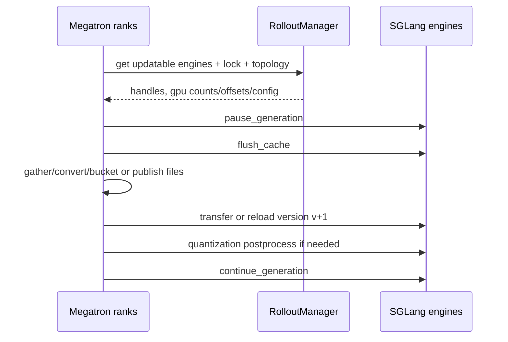
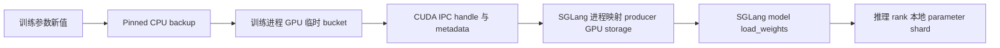
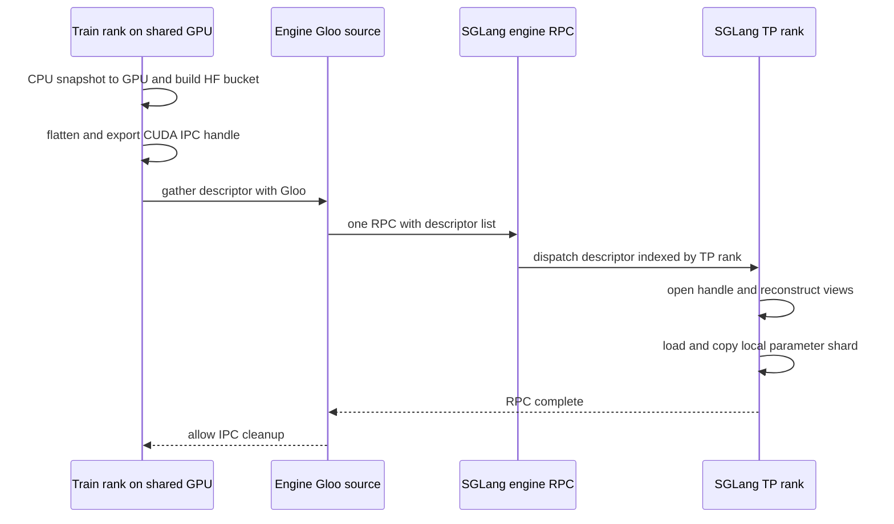

# slime Megatron→SGLang 权重同步：用服务提交协议跨越异构分片

> **源码基线**：slime `main@681b3adca54105d5ecd3fb822fa0dc58a427e0f9`；其 stable 环境固定 SGLang `v0.5.15.post1@0b3bb0cbe31873994c9f989fddfe2f87ca839fdd`。[`build_conda.sh:25-33`](https://github.com/THUDM/slime/blob/681b3adca54105d5ecd3fb822fa0dc58a427e0f9/build_conda.sh#L25-L33)
> **核验日期**：2026-08-18 · **系列**：[[02_engineering/04_posttrain_frameworks/slime/index|slime 源码分析]]
> **结论先行**：slime 要同时解决三个不能由一次 parameter broadcast 解决的冲突：训练与推理的 shard topology/owner 不同，并发 serving 不能观察到半个新版本或沿用旧权重生成的 KV，colocate 又强迫两个独立进程分时交接 HBM。它因而把同步实现成一个带版本的服务提交协议：选定快照 → 还原 topology-neutral HF 参数 → pause/flush → 完整传输 → 量化后处理与版本确认 → resume。NCCL、tensor/CUDA IPC、full disk 与 delta disk 只是这个事务的不同数据面；MoE rank-local expert routing 则是严格准入下的重组优化，不是另一套一致性协议。

fixed-commit 定位符表示源码事实；下文用“设计分析”标出的动机、因果与取舍是依据状态转移和失败路径的推断，不代表作者原话。

## 1. 问题背景：同一组逻辑权重，两套所有权与一条在线边界

### 1.1 topology 错配使“直接复制 shard”没有统一语义

Megatron 中参数可按 TP 维度、PP 层段与 EP expert 集合分散在不同 owner；默认 direct iterator 实际执行 PP/EP broadcast 和 TP all-gather，说明训练 local shard 不是可直接装入任意推理 rank 的稳定 ABI。[`hf_weight_iterator_direct.py:62-123`](https://github.com/THUDM/slime/blob/681b3adca54105d5ecd3fb822fa0dc58a427e0f9/slime/backends/megatron_utils/update_weight/hf_weight_iterator_direct.py#L62-L123) SGLang 则在 layer loader 中根据自己的 `tp_rank` 从逻辑完整权重切出本地 shard。[SGLang `linear.py:384-427`](https://github.com/sgl-project/sglang/blob/0b3bb0cbe31873994c9f989fddfe2f87ca839fdd/python/sglang/srt/layers/linear.py#L384-L427)

> **设计分析**：两边分片数、分片维度、layer/expert owner 和参数名都可不同。因此同步的第一个本质不是“选什么网络库”，而是在两套 topology 之间建立不依赖物理 owner 的逻辑参数语义。

### 1.2 并发 serving 不能观察“正在提交”的模型

权重以 bucket 为单位逐步加载，SGLang 自身也在失败分支明确警告 model runner 可已被“partially updated”，应丢弃整套权重。[`update_weight_from_distributed.py:136-146`](https://github.com/THUDM/slime/blob/681b3adca54105d5ecd3fb822fa0dc58a427e0f9/slime/backends/megatron_utils/update_weight/update_weight_from_distributed.py#L136-L146) [SGLang `model_runner.py:2100-2125`](https://github.com/sgl-project/sglang/blob/0b3bb0cbe31873994c9f989fddfe2f87ca839fdd/python/sglang/srt/model_executor/model_runner.py#L2100-L2125) SGLang 的 pause 协议还明确区分：`in_place` 会在 resume 后继续使用旧 KV，`retract` 则允许 flush 并在 resume 后重算；slime 不传 mode，因而使用 SGLang 的默认 `abort`。[SGLang `io_struct.py:1464-1483`](https://github.com/sgl-project/sglang/blob/0b3bb0cbe31873994c9f989fddfe2f87ca839fdd/python/sglang/srt/managers/io_struct.py#L1464-L1483) [`sglang_engine.py:440-451`](https://github.com/THUDM/slime/blob/681b3adca54105d5ecd3fb822fa0dc58a427e0f9/slime/backends/sglang_utils/sglang_engine.py#L440-L451)

> **设计分析**：若不先停止新生成，一个 forward 可能跨过多个已更新/未更新 layer；若只换权重而不清 KV，后续 decode 将把旧参数计算的 cache 与新参数混用。因此“每个 bucket RPC 成功”不等于“服务已提交”，只有 pause 窗口内全部完成并 flush 后的 resume 才是对外 commit point。

### 1.3 colocate 把通信问题变成显存所有权交接

colocate 让 actor 与 rollout 从 GPU offset 0 复用同一批 placement-group slots，但它们仍是不同进程、不同 parameter storage；默认配置同时打开 train/rollout offload。[`placement_group.py:100-117`](https://github.com/THUDM/slime/blob/681b3adca54105d5ecd3fb822fa0dc58a427e0f9/slime/ray/placement_group.py#L100-L117) [`arguments.py:1929-1944`](https://github.com/THUDM/slime/blob/681b3adca54105d5ecd3fb822fa0dc58a427e0f9/slime/utils/arguments.py#L1929-L1944) 因此 CPU snapshot、训练进程的临时 GPU bucket、CUDA IPC handle 与 SGLang 持久参数各自有不同的 owner/lifetime，不能简化成“同卡零拷贝共享参数”。[`actor.py:617-653`](https://github.com/THUDM/slime/blob/681b3adca54105d5ecd3fb822fa0dc58a427e0f9/slime/backends/megatron_utils/actor.py#L617-L653) [`update_weight_from_tensor.py:299-320`](https://github.com/THUDM/slime/blob/681b3adca54105d5ecd3fb822fa0dc58a427e0f9/slime/backends/megatron_utils/update_weight/update_weight_from_tensor.py#L299-L320)

## 2. 提交事务的六个不变量

| 不变量 | 源码落点 | 破坏后的后果 |
|---|---|---|
| 1. **快照选择** | actor 在一轮 train 完成后先把最新 local actor weights 备份到 CPU，driver 再调用 update。[`actor.py:545-564`](https://github.com/THUDM/slime/blob/681b3adca54105d5ecd3fb822fa0dc58a427e0f9/slime/backends/megatron_utils/actor.py#L545-L564) [`train.py:69-85`](https://github.com/THUDM/slime/blob/681b3adca54105d5ecd3fb822fa0dc58a427e0f9/train.py#L69-L85) | 不同 rank 若选到不同 step 的 local shard，即使传输无误也会组成不存在的混合模型。【设计分析】 |
| 2. **topology-neutral 转换** | PP/EP/TP collective 还原逻辑参数，Megatron→HF converter 处理名称/融合布局，SGLang loader 再按 infer topology 切片。[`hf_weight_iterator_direct.py:62-123`](https://github.com/THUDM/slime/blob/681b3adca54105d5ecd3fb822fa0dc58a427e0f9/slime/backends/megatron_utils/update_weight/hf_weight_iterator_direct.py#L62-L123) [SGLang `linear.py:384-427`](https://github.com/sgl-project/sglang/blob/0b3bb0cbe31873994c9f989fddfe2f87ca839fdd/python/sglang/srt/layers/linear.py#L384-L427) | 直接把 train shard 写给 infer shard 会导致 shape、offset、layer/expert owner 或融合顺序错位。【设计分析】 |
| 3. **pause + flush** | 在线 updater 先 pause 所有 engine、flush cache，然后才进入权重加载。[`update_weight_from_distributed.py:103-123`](https://github.com/THUDM/slime/blob/681b3adca54105d5ecd3fb822fa0dc58a427e0f9/slime/backends/megatron_utils/update_weight/update_weight_from_distributed.py#L103-L123) SGLang flush 会 reset radix/KV pools，且非 idle 时拒绝成功。[SGLang `scheduler.py:3740-3765`](https://github.com/sgl-project/sglang/blob/0b3bb0cbe31873994c9f989fddfe2f87ca839fdd/python/sglang/srt/managers/scheduler.py#L3740-L3765) | 服务可向请求暴露半版本，或让新权重消费旧 KV。【设计分析】 |
| 4. **完整传输** | NCCL 在 non-expert/expert pass 后各 barrier；IPC 每 bucket 等所有 consumer RPC 返回才释放 backing storage；full disk 写完和 publish hook 后均 barrier。[`update_weight_from_distributed.py:136-146`](https://github.com/THUDM/slime/blob/681b3adca54105d5ecd3fb822fa0dc58a427e0f9/slime/backends/megatron_utils/update_weight/update_weight_from_distributed.py#L136-L146) [`update_weight_from_tensor.py:299-320`](https://github.com/THUDM/slime/blob/681b3adca54105d5ecd3fb822fa0dc58a427e0f9/slime/backends/megatron_utils/update_weight/update_weight_from_tensor.py#L299-L320) [`update_weight_from_disk.py:65-95`](https://github.com/THUDM/slime/blob/681b3adca54105d5ecd3fb822fa0dc58a427e0f9/slime/backends/megatron_utils/update_weight/update_weight_from_disk.py#L65-L95) | 少一个 bucket、提前释放 IPC storage 或读到未 publish 完的文件，都会留下部分更新模型。 |
| 5. **后处理 + 版本确认** | compressed-tensors 路径在 load 前 restore、load 后 requantize；SGLang 只在所有 worker update 成功后更新 `weight_version`。[`update_weight_from_distributed.py:109-132`](https://github.com/THUDM/slime/blob/681b3adca54105d5ecd3fb822fa0dc58a427e0f9/slime/backends/megatron_utils/update_weight/update_weight_from_distributed.py#L109-L132) [SGLang `tokenizer_control_mixin.py:395-484`](https://github.com/sgl-project/sglang/blob/0b3bb0cbe31873994c9f989fddfe2f87ca839fdd/python/sglang/srt/managers/tokenizer_control_mixin.py#L395-L484) | RPC 成功但格式未完成的权重不可 serving；无版本标记则 rollout 与故障恢复无法证明当前模型身份。【设计分析】 |
| 6. **确认后 resume** | quantization postprocess 和 consumer completion 全部发生在 `continue_generation` 之前，随后再用 Gloo barrier 对齐 trainer ranks。[`update_weight_from_tensor.py:312-331`](https://github.com/THUDM/slime/blob/681b3adca54105d5ecd3fb822fa0dc58a427e0f9/slime/backends/megatron_utils/update_weight/update_weight_from_tensor.py#L312-L331) | 提前 resume 等于把未提交状态公开给新请求。【设计分析】 |

> [!note] “版本确认”的强度并不完全相同
> online NCCL/tensor 路径的确认是“所有 engine RPC 成功返回后，SGLang 才写入 version”；固定基线中显式逐 engine 读回 `get_weight_version` 只在 full-disk 的 CI 分支执行。[`actor_group.py:244-269`](https://github.com/THUDM/slime/blob/681b3adca54105d5ecd3fb822fa0dc58a427e0f9/slime/ray/actor_group.py#L244-L269) 因此不应把“带了 version 字段”误写成所有 transport 都做了独立读后校验。

六个不变量将不同 transport 统一为同一条状态机：

actor 每次提交前可先恢复 crash 的 updatable engines，必要时重连 NCCL/process groups；拿到的 per-engine GPU counts/offsets/parallel config 同时服务异构 TP 和 colocated expert routing。[`actor.py:592-636`](https://github.com/THUDM/slime/blob/681b3adca54105d5ecd3fb822fa0dc58a427e0f9/slime/backends/megatron_utils/actor.py#L592-L636)

RolloutManager 只把第一个 `update_weights=True` model 暴露给 updater，冻结 ref/reward models 自动排除；当前多 updatable model 尚不支持。[`rollout.py:555-584`](https://github.com/THUDM/slime/blob/681b3adca54105d5ecd3fb822fa0dc58a427e0f9/slime/ray/rollout.py#L555-L584)

## 3. Transport 选择：数据面不同，事务语义相同

actor 初始化按 `update_weight_mode × transport × colocate` 选择实现：[`actor.py:151-182`](https://github.com/THUDM/slime/blob/681b3adca54105d5ecd3fb822fa0dc58a427e0f9/slime/backends/megatron_utils/actor.py#L151-L182)

| mode | transport/topology | updater | 主要载体 |
|---|---|---|---|
| full | NCCL、训推分离 | `UpdateWeightFromDistributed` | Megatron rank→SGLang engine NCCL group |
| full | colocate | `UpdateWeightFromTensor` | GPU bucket→CUDA IPC handle/metadata→Gloo/Ray 控制面→SGLang GPU copy；可混合远端 NCCL |
| full | disk | `UpdateWeightFromDisk` | versioned HF checkpoint + SGLang disk reload |
| delta | disk、非 colocate | `UpdateWeightFromDiskDelta` | changed bytes + checksum/index + host-local base apply |

delta 被显式限制为 disk 且不支持 colocate；其他未知组合立即 assert，而不是静默回退。[`actor.py:154-174`](https://github.com/THUDM/slime/blob/681b3adca54105d5ecd3fb822fa0dc58a427e0f9/slime/backends/megatron_utils/actor.py#L154-L174)

### 3.1 四个直觉方案为什么不够

| 直觉方案 | 为什么看似可行 | 失败点，以及 slime 的选择 |
|---|---|---|
| **对当前 parameter 做一次 broadcast** | API 最小，无需 HF 中间形态 | 它默认发送端/接收端的名称、shape、切分和顺序相同，也没有解决 pause、KV flush、postprocess 与 version。slime 先转换逻辑 HF tensor，再在提交窗口中逐 bucket 传输。[`update_weight_from_distributed.py:102-146`](https://github.com/THUDM/slime/blob/681b3adca54105d5ecd3fb822fa0dc58a427e0f9/slime/backends/megatron_utils/update_weight/update_weight_from_distributed.py#L102-L146) |
| **固化 train-shard→infer-shard 直连映射** | 可省掉完整逻辑 tensor 重组 | TP/PP/EP 组合、融合布局和 quant loader 一变就要改映射；通用路径用 topology-neutral HF ABI 隔离两边。只有 expert 在两侧 expert-TP=1 等严格条件下才走定向路由特例。[`expert_routing.py:295-380`](https://github.com/THUDM/slime/blob/681b3adca54105d5ecd3fb822fa0dc58a427e0f9/slime/backends/megatron_utils/update_weight/expert_routing.py#L295-L380) |
| **在所有 ranks 物化全模型** | 之后任意目标都能本地切片 | 这把 topology 复杂度换成全模型 HBM 峰值与无谓的 expert 复制。slime 按 `update_weight_buffer_size` 以逻辑完整参数的 bucket 流式处理，合格 MoE 再定向路由。[`hf_weight_iterator_direct.py:126-160`](https://github.com/THUDM/slime/blob/681b3adca54105d5ecd3fb822fa0dc58a427e0f9/slime/backends/megatron_utils/update_weight/hf_weight_iterator_direct.py#L126-L160) |
| **直接把文件写到 shared FS 就让 engine reload** | 文件系统天然解耦训推 | reader 可看到半个版本，delta 还可应用到错 base。full path 用 version directory、writing/publish barriers；delta 用 `.tmp`→`os.replace`、`base_version`、checksum 和 host lock。[`update_weight_from_disk.py:65-95`](https://github.com/THUDM/slime/blob/681b3adca54105d5ecd3fb822fa0dc58a427e0f9/slime/backends/megatron_utils/update_weight/update_weight_from_disk.py#L65-L95) [`update_weight_from_disk_delta.py:150-177`](https://github.com/THUDM/slime/blob/681b3adca54105d5ecd3fb822fa0dc58a427e0f9/slime/backends/megatron_utils/update_weight/update_weight_from_disk_delta.py#L150-L177) [`update_weight_from_disk_delta.py:297-303`](https://github.com/THUDM/slime/blob/681b3adca54105d5ecd3fb822fa0dc58a427e0f9/slime/backends/megatron_utils/update_weight/update_weight_from_disk_delta.py#L297-L303) |

> **设计分析**：这四种反例说明“传得到”只解决 data movement，不解决 snapshot identity、布局语义、serving isolation 和 commit visibility。所以下文 NCCL/IPC/disk 应读作同一事务的 transport 实现，而不是四套彼此无关的同步算法。

## 4. Megatron shard → HF/SGLang tensor

### 4.1 不是“每个参数只在一个 train rank 聚合”

默认 direct iterator 的真实过程是：参数物理 owner 先从最新 CPU backup 把自己的 Megatron local shard 搬到 GPU；PP group 把所属层广播到需要参与转换的 ranks，普通 expert path 还按 EP group 广播；最后相关 TP group 批量异步 all-gather，并沿 `partition_dim` 拼成 Megatron 语义上的完整参数。[`hf_weight_iterator_direct.py:62-123`](https://github.com/THUDM/slime/blob/681b3adca54105d5ecd3fb822fa0dc58a427e0f9/slime/backends/megatron_utils/update_weight/hf_weight_iterator_direct.py#L62-L123) [`common.py:60-127`](https://github.com/THUDM/slime/blob/681b3adca54105d5ecd3fb822fa0dc58a427e0f9/slime/backends/megatron_utils/update_weight/common.py#L60-L127)

因此应区分两件事：

- **重组参与者**：相关训练 ranks 都参与 PP/EP/TP collective，tensor path 中不保证“一个参数只在一个 train rank 上完成聚合”。
- **传输 source**：NCCL 分离路径为每个 train PP stage 选一个 source rank 向 infer group 广播；共卡路径则让与每个 SGLang worker 同 GPU slot 的 train rank 提供自己的 IPC bucket，Gloo source 只集中描述符并发起一次 Ray RPC，不集中参数字节。

转换器随后把 Megatron 参数名、融合布局和 shape 变成 SGLang 模型 loader 能理解的 HF named tensors；迭代器按 `update_weight_buffer_size` 以**完整参数重组后的大小**分桶，所以峰值是 bucket 级而非整模型级。[`hf_weight_iterator_direct.py:24-59`](https://github.com/THUDM/slime/blob/681b3adca54105d5ecd3fb822fa0dc58a427e0f9/slime/backends/megatron_utils/update_weight/hf_weight_iterator_direct.py#L24-L59) [`hf_weight_iterator_direct.py:126-160`](https://github.com/THUDM/slime/blob/681b3adca54105d5ecd3fb822fa0dc58a427e0f9/slime/backends/megatron_utils/update_weight/hf_weight_iterator_direct.py#L126-L160)

### 4.2 “完整 HF 参数”只是 topology-neutral 中间表示

“先汇聚为完整 HF 参数”描述的是传给 loader 的**逻辑 tensor shape**，并不表示每个 SGLang rank 的持久模型都复制一份全参数。以 column-parallel linear 为例，SGLang 收到完整 `loaded_weight` 后，用自己的 `tp_rank` 计算 `start_idx`，在并行维上 `narrow` 出本 rank shard，再写入本地 parameter storage；只有 replicated 参数才在多个 ranks 上相同。[SGLang `linear.py:384-437`](https://github.com/sgl-project/sglang/blob/0b3bb0cbe31873994c9f989fddfe2f87ca839fdd/python/sglang/srt/layers/linear.py#L384-L437)

这层 HF 中间表示把“训练如何切”与“推理如何切”解耦：train TP=8 可以对接 infer TP=4，反之亦然，前提不是两个 TP 相等，而是完整 tensor 的目标并行维能被 infer topology 合法切分，模型 conversion 与 SGLang loader 对名称、融合布局、dtype/量化格式有共同理解。SGLang 也有 `use_presharded_weights` 分支，说明“推理引擎只能加载完整 HF 参数”并非普遍原理。[SGLang `linear.py:402-427`](https://github.com/sgl-project/sglang/blob/0b3bb0cbe31873994c9f989fddfe2f87ca839fdd/python/sglang/srt/layers/linear.py#L402-L427) **设计分析**：slime 默认通用在线路径选择完整逻辑 tensor，是为了避免为每一对 train/infer topology 编写专用重分片协议。

| topology 轴 | 通用路径怎样消除差异 | 仍然存在的约束 |
|---|---|---|
| train DP/CP | 权重在这些维度通常复制，不决定 HF 参数 shape | 只选一份语义一致的最新 actor snapshot |
| train TP → infer TP | train TP all-gather 成完整逻辑 tensor，SGLang loader 再按 infer TP 切片 | 目标维度可整除或 loader 明确支持 padding/特殊布局 |
| train PP → infer PP | train PP stage 各负责自己层，转换后按 HF layer name 交给目标 loader | layer ownership、名称映射和 engine rank ordering 必须一致 |
| train EP → infer EP | 通用路径可先恢复逐 expert tensor再加载；满足条件时走 rank-local expert routing | expert 数量/布局、EP rank 映射与 EPLB 等动态布局功能受限 |
| 量化/融合格式 | conversion 生成 loader 认识的名称与 tensor | 不是任意 dtype、任意 quant schema 都可互转 |

**设计分析**：所以答案是“支持**通过完整逻辑参数中间表示解耦的多种 topology 组合**”，不是数学意义上的任意 topology 转换。模型维度不可切、转换器不支持该架构、infer 并行布局需要额外语义，或共卡 engine 的 GPU interval 超出 train world 时都会失败或走别的 updater；MoE 定向路由还有更严格的优化准入条件。

## 5. NCCL 分离路径

### 5.1 建组

每个 PP source（DP=0、TP=0）创建一个 group，world size = 所有 SGLang engine GPU 数之和 + 训练 source rank；异构 engine TP 通过 cumulative rank offsets 加入同一 group。[`update_weight_from_distributed.py:57-100`](https://github.com/THUDM/slime/blob/681b3adca54105d5ecd3fb822fa0dc58a427e0f9/slime/backends/megatron_utils/update_weight/update_weight_from_distributed.py#L57-L100) [`update_weight_from_distributed.py:268-314`](https://github.com/THUDM/slime/blob/681b3adca54105d5ecd3fb822fa0dc58a427e0f9/slime/backends/megatron_utils/update_weight/update_weight_from_distributed.py#L268-L314)

这个临时 NCCL group 是**某个训练 PP source rank + 所有目标 SGLang ranks** 的权重数据面。它不把训练 TP/PP/DP group 与 SGLang TP/EP group 合并，也不参与 forward/backward：两边保留原有 topology，只在更新窗口按一套临时 global rank 编号完成 broadcast，提交结束后可销毁/重建。训练侧先重组 topology-neutral tensor，因而 group 本身只负责运输，不负责从 train TP 直接变换成 infer TP。

### 5.2 提交

rank 0 pause/flush 后，所有 trainer ranks 过 Gloo barrier；再依次发送 non-expert、barrier、expert、barrier；全部完成后做量化 postprocess并 resume。[`update_weight_from_distributed.py:102-146`](https://github.com/THUDM/slime/blob/681b3adca54105d5ecd3fb822fa0dc58a427e0f9/slime/backends/megatron_utils/update_weight/update_weight_from_distributed.py#L102-L146)

每 bucket 先获取 Ray engine lock，metadata 走 Ray RPC，tensor data 由 NCCL async broadcast，等待 engine RPC 完成后才清 bucket、释放 lock。锁的目的明确是防并发 broadcast deadlock。[`update_weight_from_distributed.py:240-265`](https://github.com/THUDM/slime/blob/681b3adca54105d5ecd3fb822fa0dc58a427e0f9/slime/backends/megatron_utils/update_weight/update_weight_from_distributed.py#L240-L265) [`update_weight_from_distributed.py:326-355`](https://github.com/THUDM/slime/blob/681b3adca54105d5ecd3fb822fa0dc58a427e0f9/slime/backends/megatron_utils/update_weight/update_weight_from_distributed.py#L326-L355)

## 6. Colocated tensor/IPC 路径

### 6.1 “共卡”是同一物理 GPU 上的分时驻留

`colocate` 让 actor 与 rollout 使用从 offset 0 开始的同一批 placement-group GPU slots，而不是把 Megatron 与 SGLang 放进同一进程或共享同一组 parameter objects。[`placement_group.py:100-117`](https://github.com/THUDM/slime/blob/681b3adca54105d5ecd3fb822fa0dc58a427e0f9/slime/ray/placement_group.py#L100-L117) 默认配置同时打开 `offload_train` 与 `offload_rollout`：rollout 完成后 SGLang 释放权重/KV/CUDA graph 的 HBM 占用，训练结束后 actor 保存最新 CPU snapshot 并 pause 自己的 GPU memory/process groups；然后只恢复 SGLang weights，提交新参数，最后恢复 KV/cache。[`arguments.py:1929-1944`](https://github.com/THUDM/slime/blob/681b3adca54105d5ecd3fb822fa0dc58a427e0f9/slime/utils/arguments.py#L1929-L1944) [`train.py:49-88`](https://github.com/THUDM/slime/blob/681b3adca54105d5ecd3fb822fa0dc58a427e0f9/train.py#L49-L88)

训练新值确实先备份到 pinned CPU tensor：`TensorBackuper.backup("actor")` 为每个 local Megatron parameter 分配 CPU pinned buffer 并异步 `copy_`，训练结束后刷新该 snapshot。[`tensor_backper.py:42-74`](https://github.com/THUDM/slime/blob/681b3adca54105d5ecd3fb822fa0dc58a427e0f9/slime/utils/tensor_backper.py#L42-L74) [`actor.py:545-552`](https://github.com/THUDM/slime/blob/681b3adca54105d5ecd3fb822fa0dc58a427e0f9/slime/backends/megatron_utils/actor.py#L545-L552) 但这个 CPU backup 是**显存交接的稳定训练快照**，不是 CUDA IPC 的共享介质。更新时 actor 临时恢复 process groups，在 memory saver disable 区间把当前 bucket 从 CPU 搬回 train GPU、重组/转换；更新结束又销毁 groups 并保持训练侧 offload。[`actor.py:617-652`](https://github.com/THUDM/slime/blob/681b3adca54105d5ecd3fb822fa0dc58a427e0f9/slime/backends/megatron_utils/actor.py#L617-L652)

因此一次共卡更新的完整数据路径是：

从整轮生命周期看存在一次 `device→host→device`，但最后一个 `device` 仍是 **train process 的临时 bucket**；随后 CUDA IPC 让 infer process 映射这个 GPU allocation，SGLang 再把对应视图 `copy_` 进自己的持久 parameter storage，属于 GPU→GPU，不是 infer engine 从 CPU bucket 读取。

### 6.2 CUDA IPC 究竟传了什么

CUDA IPC 是 CUDA 为同机不同进程暴露 device allocation 的机制：producer 导出可跨进程传递的 handle，consumer 打开 handle 后得到指向同一块 GPU backing storage 的本进程映射。slime 先把一个 chunk 的 named tensors 拼成新的 flattened CUDA bucket，并附带 name、shape、dtype、byte offsets 等 metadata；这里特意不复用 producer bucket，避免 RPC 返回而 consumer 的异步 copy 尚未完成时被下一桶覆盖。[`update_weight_from_tensor.py:29-47`](https://github.com/THUDM/slime/blob/681b3adca54105d5ecd3fb822fa0dc58a427e0f9/slime/backends/megatron_utils/update_weight/update_weight_from_tensor.py#L29-L47) [SGLang `tensor_bucket.py:19-105`](https://github.com/sgl-project/sglang/blob/0b3bb0cbe31873994c9f989fddfe2f87ca839fdd/python/sglang/srt/weight_sync/tensor_bucket.py#L19-L105)

`MultiprocessingSerializer.serialize`、Gloo `gather_object` 与 Ray/HTTP 承载的是这个 CUDA tensor 的进程间重建描述及 metadata，并不把 bucket payload 复制进 Ray Object Store 或 Gloo host buffer。每个 engine 对应一个 colocated Gloo group，group source 收齐各 TP slots 的**描述符列表**后只发起一次 engine RPC；SGLang `tp_rank` 从列表取自己的元素、反序列化并打开 IPC handle。[`update_weight_from_tensor.py:359-424`](https://github.com/THUDM/slime/blob/681b3adca54105d5ecd3fb822fa0dc58a427e0f9/slime/backends/megatron_utils/update_weight/update_weight_from_tensor.py#L359-L424) [SGLang `tp_worker.py:165-174`](https://github.com/sgl-project/sglang/blob/0b3bb0cbe31873994c9f989fddfe2f87ca839fdd/python/sglang/srt/managers/tp_worker.py#L165-L174)

SGLang 端按 metadata 从 flattened storage 重建零拷贝 views，再调用标准 `model.load_weights`；标准 layer loader 才执行 topology-aware slice 和写入 SGLang 自身参数。因此 IPC bucket 只是短生命周期的跨进程 source，不会成为推理期长期共享的 train parameter storage。[SGLang `model_runner.py:2158-2220`](https://github.com/sgl-project/sglang/blob/0b3bb0cbe31873994c9f989fddfe2f87ca839fdd/python/sglang/srt/model_executor/model_runner.py#L2158-L2220) [SGLang `tensor_bucket.py:90-105`](https://github.com/sgl-project/sglang/blob/0b3bb0cbe31873994c9f989fddfe2f87ca839fdd/python/sglang/srt/weight_sync/tensor_bucket.py#L90-L105) slime 的 wrapper 也明确写明 HTTP 只 post metadata，真实权重直接从 GPU copy，且 model 必须已在 GPU。[`sglang_engine.py:262-285`](https://github.com/THUDM/slime/blob/681b3adca54105d5ecd3fb822fa0dc58a427e0f9/slime/backends/sglang_utils/sglang_engine.py#L262-L285)

提交循环必须 `ray.get` 等所有 SGLang consumers 返回后，才删除 long-lived tensors 并执行 `ipc_collect/empty_cache`；最后 barrier 后再清一次。这个 lifetime barrier 是正确性条件，不只是显存优化。[`update_weight_from_tensor.py:276-331`](https://github.com/THUDM/slime/blob/681b3adca54105d5ecd3fb822fa0dc58a427e0f9/slime/backends/megatron_utils/update_weight/update_weight_from_tensor.py#L276-L331)

### 6.3 Rank-local expert update：MoE 为什么是例外

当所有 engines 都 colocated 且 Megatron/SGLang MoE topology 满足条件时，expert routing planner 把专家直接发送到目标 SGLang ranks，dense params 继续常规 buckets；存在 distributed engines、异构/不合格 topology 时自动禁用。[`expert_routing.py:295-380`](https://github.com/THUDM/slime/blob/681b3adca54105d5ecd3fb822fa0dc58a427e0f9/slime/backends/megatron_utils/update_weight/expert_routing.py#L295-L380)

关键原因是 EP 与 TP 切分的语义不同：TP 切的是**一个 tensor 的维度**，通常必须先重组该 tensor；EP 切的是**expert 集合**。当 train expert-TP=1 且 infer MoE-TP=1 时，一个 expert 的 `linear_fc1/linear_fc2` tensor 在其 Megatron owner 上已经完整，不必让所有 ranks 先拥有全部 experts。planner 通过 `all_gather_object` 找到每个 expert parameter 的物理 owner，根据 `expert_id // experts_per_ep_rank` 算目标 infer EP shard，并为每个 source→targets bundle 生成受 `update_weight_buffer_size` 限制的 P2P batch。[`expert_routing.py:164-218`](https://github.com/THUDM/slime/blob/681b3adca54105d5ecd3fb822fa0dc58a427e0f9/slime/backends/megatron_utils/update_weight/expert_routing.py#L164-L218) [`expert_routing.py:221-287`](https://github.com/THUDM/slime/blob/681b3adca54105d5ecd3fb822fa0dc58a427e0f9/slime/backends/megatron_utils/update_weight/expert_routing.py#L221-L287)

数据面由 source rank 从 CPU snapshot 把该 expert tensor 搬进 staging buffer，通过 NCCL batched `isend/irecv` 只发到目标 train ranks；目标 rank 本地转 HF，然后沿上面的同卡 CUDA IPC 交给对应 SGLang EP worker。[`update_weight_from_tensor.py:193-274`](https://github.com/THUDM/slime/blob/681b3adca54105d5ecd3fb822fa0dc58a427e0f9/slime/backends/megatron_utils/update_weight/update_weight_from_tensor.py#L193-L274)

例如 8 个 experts，train EP=4、infer EP=2：每个 train EP owner 各持 2 个完整 experts；infer EP rank 0 需要 experts 0–3，rank 1 需要 experts 4–7。slime 可把四个 owners 的 expert tensors 定向送到两个目标 ranks，而不先在每个 rank 汇聚 8 个 experts。这既支持 EP 数量变化，也可把同一 EP shard 复制到多个 engine 或 MoE-DP replica targets。[`expert_routing.py:140-161`](https://github.com/THUDM/slime/blob/681b3adca54105d5ecd3fb822fa0dc58a427e0f9/slime/backends/megatron_utils/update_weight/expert_routing.py#L140-L161)

优化的限制是源码契约的一部分：infer PP 必须为 1、infer EP>1、两侧 expert TP/MoE-TP 都为 1；禁用 EPLB、redundant experts、非 trivial expert placement 和 elastic expert backup；expert 数必须整除 infer EP，metadata 必须覆盖每层每个 expert 的 FC1/FC2；所有 engines 必须 colocated，且 GPU offsets/order 可解释为 `MoE-DP × EP`。任何一项不满足就回退通用完整 HF bucket 路径，而不是冒险套用错误映射。[`expert_routing.py:110-137`](https://github.com/THUDM/slime/blob/681b3adca54105d5ecd3fb822fa0dc58a427e0f9/slime/backends/megatron_utils/update_weight/expert_routing.py#L110-L137) [`expert_routing.py:164-194`](https://github.com/THUDM/slime/blob/681b3adca54105d5ecd3fb822fa0dc58a427e0f9/slime/backends/megatron_utils/update_weight/expert_routing.py#L164-L194)

这条例外只优化正则识别的 routed expert FC1/FC2；dense attention、router/gate、shared experts 或其他未匹配参数仍走通用重组。[`expert_routing.py:19-35`](https://github.com/THUDM/slime/blob/681b3adca54105d5ecd3fb822fa0dc58a427e0f9/slime/backends/megatron_utils/update_weight/expert_routing.py#L19-L35) **设计分析**：它减少的是“无谓地让每个 rank materialize 全部 experts”，不是取消 HF naming/conversion，也不是让 SGLang 永久引用训练进程的 expert storage。

## 7. Full disk 路径

每次 version++ 后写 `weight_vNNNNNN` 完整 HF checkpoint：rank 0 清旧目录，所有 writing ranks各自 mkdir/write，Gloo barrier 后运行可选 post-write hook，再 barrier。hook 用于对象存储型 shared filesystem 的显式 publish/read-after-write。[`update_weight_from_disk.py:17-95`](https://github.com/THUDM/slime/blob/681b3adca54105d5ecd3fb822fa0dc58a427e0f9/slime/backends/megatron_utils/update_weight/update_weight_from_disk.py#L17-L95)

真正的 SGLang reload 由 `RayTrainGroup` 接管：可先 pull 到 host-local NVMe（这段可与 generation overlap），然后 pause/flush/reload；CI 模式逐 engine 核对 version，成功后清临时目录并 resume。[`actor_group.py:227-269`](https://github.com/THUDM/slime/blob/681b3adca54105d5ecd3fb822fa0dc58a427e0f9/slime/ray/actor_group.py#L227-L269)

**设计分析**：full disk 的优点是跨环境/异构 GPU、external serving 友好，且 `release_train` 后仍有完整提交物；代价是写放大和 shared filesystem latency。

## 8. Delta disk 路径

### 8.1 baseline 如何建立

第一次调用只捕获 baseline，不发布；baseline优先来自 SGLang host materialize 的 HF checkpoint，以保证 snapshot 与 engine base 一致，缺失 tensor才回退到当前 gathered weights。[`update_weight_from_disk_delta.py:82-125`](https://github.com/THUDM/slime/blob/681b3adca54105d5ecd3fb822fa0dc58a427e0f9/slime/backends/megatron_utils/update_weight/update_weight_from_disk_delta.py#L82-L125)

这里有两个同步发生的“base”：trainer 持有上一版本的 CPU byte snapshot；每个 SGLang host 的 local checkpoint 也 materialize version 0。后续 version $v$ 只能基于 $v-1$ 生成和应用，所以它不是任意两个 checkpoint 之间的 stateless diff。[`update_weight_from_disk_delta.py:82-125`](https://github.com/THUDM/slime/blob/681b3adca54105d5ecd3fb822fa0dc58a427e0f9/slime/backends/megatron_utils/update_weight/update_weight_from_disk_delta.py#L82-L125) [`update_weight_from_disk_delta.py:157-167`](https://github.com/THUDM/slime/blob/681b3adca54105d5ecd3fb822fa0dc58a427e0f9/slime/backends/megatron_utils/update_weight/update_weight_from_disk_delta.py#L157-L167)

### 8.2 delta 权重 diff 到底怎样生成

trainer 仍先把 Megatron TP/EP shards gather/convert 成逐 tensor HF 视图，再把新 tensor contiguous 后按 `uint8` 展平。对旧 snapshot $w^{(8)}(v-1)$ 与新权重 $w^{(8)}(v)$，支持两种编码：

$$
d^{\mathrm{xor}}(v)=w^{(8)}(v)\oplus w^{(8)}(v-1).
$$

- `xor`：保存逐字节 XOR；未变化字节为 0，zstd 很容易压缩，但同一 delta 只能对正确 base 应用一次。[`update_weight_from_disk_delta.py:223-243`](https://github.com/THUDM/slime/blob/681b3adca54105d5ecd3fb822fa0dc58a427e0f9/slime/backends/megatron_utils/update_weight/update_weight_from_disk_delta.py#L223-L243)
- `overwrite`：先找 `new != old` 的 byte positions，再编码“changed count + uint32 positions + new byte values”；体积通常更大，但重复写相同位置是幂等的。[`disk_delta.py:21-25`](https://github.com/THUDM/slime/blob/681b3adca54105d5ecd3fb822fa0dc58a427e0f9/slime/utils/disk_delta.py#L21-L25)

GPU→CPU copy 使用 pinned buffer pool，并与 CPU thread-pool 的 diff/zstd level-1/checksum 流水；整个 tensor 未变化就不写入 delta shard。每轮完成后，新 byte array 替换 snapshot，成为下一版 base。[`update_weight_from_disk_delta.py:199-273`](https://github.com/THUDM/slime/blob/681b3adca54105d5ecd3fb822fa0dc58a427e0f9/slime/backends/megatron_utils/update_weight/update_weight_from_disk_delta.py#L199-L273)

之后写 canonical safetensors shards，index 记录 `version/base_version/encoding/checksum`；SGLang host 解压后在 local checkpoint 的 mmap region 原位 XOR 或 overwrite，校验新 tensor checksum，再走普通 disk reload。[`update_weight_from_disk_delta.py:127-190`](https://github.com/THUDM/slime/blob/681b3adca54105d5ecd3fb822fa0dc58a427e0f9/slime/backends/megatron_utils/update_weight/update_weight_from_disk_delta.py#L127-L190) [`sglang-pull_weights.patch:426-545`](https://github.com/THUDM/slime/blob/681b3adca54105d5ecd3fb822fa0dc58a427e0f9/docker/patch/latest/sglang-pull_weights.patch#L426-L545)

### 8.3 为什么 push/pull 变小，哪些成本没有变小

所谓“减少 push/pull”准确地说，是减少 **trainer 发布到 shared filesystem 的 bytes** 和 **每个 serving host 拉取的 network/storage bytes**：不变 tensor 完全省略，变化 tensor 只传压缩后的 byte diff；`pull_weights(version)` 这个 Ray RPC 本身只是控制面，真正 payload 是 host 读取 version directory 并在本地 base 上 apply。[`sglang-pull_weights.patch:197-215`](https://github.com/THUDM/slime/blob/681b3adca54105d5ecd3fb822fa0dc58a427e0f9/docker/patch/latest/sglang-pull_weights.patch#L197-L215)

它**不会**减少以下成本：Megatron→HF 的全 tensor gather/convert、GPU→CPU 的全量扫描、trainer 上一版完整 CPU snapshot、每个 host 的完整 local checkpoint，以及 apply 后 SGLang 把完整模型重新装入 serving HBM。[`update_weight_from_disk_delta.py:192-273`](https://github.com/THUDM/slime/blob/681b3adca54105d5ecd3fb822fa0dc58a427e0f9/slime/backends/megatron_utils/update_weight/update_weight_from_disk_delta.py#L192-L273) [`sglang-pull_weights.patch:426-545`](https://github.com/THUDM/slime/blob/681b3adca54105d5ecd3fb822fa0dc58a427e0f9/docker/patch/latest/sglang-pull_weights.patch#L426-L545) **设计分析**：delta 优化的是跨 host 的 wire/storage I/O，不是把模型在 HBM 中变成稀疏增量更新。

固定基线也没有按 density 自动回退 full checkpoint：updater 在初始化时已由 mode/transport 固定选择，delta 每轮都执行 byte diff/compress。[`actor.py:151-174`](https://github.com/THUDM/slime/blob/681b3adca54105d5ecd3fb822fa0dc58a427e0f9/slime/backends/megatron_utils/actor.py#L151-L174) **设计分析**：若更新后几乎每个 byte 都改变，zstd 后 wire bytes 可能接近甚至因 metadata 略高于 full；必须看框架已经记录的 density/wire 指标再决定是否使用。

文件先写 `.tmp`、flush+fsync，再 `os.replace`，防 reader 看见半文件。[`update_weight_from_disk_delta.py:297-303`](https://github.com/THUDM/slime/blob/681b3adca54105d5ecd3fb822fa0dc58a427e0f9/slime/backends/megatron_utils/update_weight/update_weight_from_disk_delta.py#L297-L303) 它还记录 changed density 与 wire bytes，让“delta 是否真的更省”可观测。[`update_weight_from_disk_delta.py:275-294`](https://github.com/THUDM/slime/blob/681b3adca54105d5ecd3fb822fa0dc58a427e0f9/slime/backends/megatron_utils/update_weight/update_weight_from_disk_delta.py#L275-L294)

`xor` 必须对正确 base 恰好应用一次；`overwrite` 则是幂等编码。[`disk_delta.py:21-25`](https://github.com/THUDM/slime/blob/681b3adca54105d5ecd3fb822fa0dc58a427e0f9/slime/utils/disk_delta.py#L21-L25) engine apply 还会拒绝 out-of-order `base_version` 并校验逐 tensor checksum。[`sglang-pull_weights.patch:426-545`](https://github.com/THUDM/slime/blob/681b3adca54105d5ecd3fb822fa0dc58a427e0f9/docker/patch/latest/sglang-pull_weights.patch#L426-L545) **设计分析**：base/version/checksum/host lock 是 delta 正确性的必要部分，不能把它理解为普通增量 checkpoint。

## 9. 同步时长、关键路径与 overlap

没有一个脱离模型大小、TP/EP、网络、shared FS 和量化方式的固定同步占比。`actor.update_weights` 被 timer 包裹，日志键为 `perf/update_weights_time`；delta 还额外上报 `perf/update_weights_density` 与 `perf/update_weights_wire_bytes`。[`actor.py:591-653`](https://github.com/THUDM/slime/blob/681b3adca54105d5ecd3fb822fa0dc58a427e0f9/slime/backends/megatron_utils/actor.py#L591-L653) [`train_metric_utils.py:13-50`](https://github.com/THUDM/slime/blob/681b3adca54105d5ecd3fb822fa0dc58a427e0f9/slime/utils/train_metric_utils.py#L13-L50) 但 full-disk path 的 actor RPC 只负责 publish，RayTrainGroup 在 RPC 返回后另做 host pull/reload；这部分不在该 timer 内，必须用 driver/outer-iteration wall-clock 补测。[`actor_group.py:162-173`](https://github.com/THUDM/slime/blob/681b3adca54105d5ecd3fb822fa0dc58a427e0f9/slime/ray/actor_group.py#L162-L173)

同步主链可先用以下 wall-clock 口径评估：

$$
\rho_{\mathrm{sync}}=
\frac{T_{\mathrm{update}}}
{T_{\mathrm{rollout}}+T_{\mathrm{train}}+T_{\mathrm{update}}}.
$$

上线前只能做带假设的下界估算：令实际跨通道字节数为 $D_{\mathrm{wire}}$、有效带宽为 $\mathrm{BW}_{\mathrm{eff}}$，则 $T_{\mathrm{transport}}\gtrsim D_{\mathrm{wire}}/\mathrm{BW}_{\mathrm{eff}}$。full path 的 $D_{\mathrm{wire}}$ 至少是一个模型权重体量的量级，delta path 则应直接使用 `perf/update_weights_wire_bytes`；实际时间还要加 shard gather/conversion、barrier、cache flush、host apply、engine reload 和量化后处理，因此这个公式只能做容量规划下界，不能替代 timer。

若启用一拍异步，则分母应改成实测 outer-iteration wall time，不能再把 rollout 与 train 简单相加。另一个日志细节是：actor 在本轮 train 末尾 flush perf metrics，而 driver 随后才调用 weight update，因此刚产生的 actor-side `update_weights_time` 通常在下一次 actor perf flush 才出现。[`actor.py:514-564`](https://github.com/THUDM/slime/blob/681b3adca54105d5ecd3fb822fa0dc58a427e0f9/slime/backends/megatron_utils/actor.py#L514-L564) [`train.py:53-85`](https://github.com/THUDM/slime/blob/681b3adca54105d5ecd3fb822fa0dc58a427e0f9/train.py#L53-L85)

| 阶段 | 能否 overlap | 固定基线的边界 |
|---|---|---|
| rollout N+1 与 train N | 可以 | `train_async.py` 先发下一轮 generate，再训练当前轮；更新前显式等 generation 完成。[`train_async.py:31-70`](https://github.com/THUDM/slime/blob/681b3adca54105d5ecd3fb822fa0dc58a427e0f9/train_async.py#L31-L70) |
| full/delta disk 的 host pull/apply | 部分可以 | full path 在 pause 前预拉到 local checkpoint；delta 也先 pull/apply 再 pause/reload。[`actor_group.py:236-245`](https://github.com/THUDM/slime/blob/681b3adca54105d5ecd3fb822fa0dc58a427e0f9/slime/ray/actor_group.py#L236-L245) [`update_weight_from_disk_delta.py:170-189`](https://github.com/THUDM/slime/blob/681b3adca54105d5ecd3fb822fa0dc58a427e0f9/slime/backends/megatron_utils/update_weight/update_weight_from_disk_delta.py#L170-L189) |
| pause→flush→online transfer/reload→resume | 不可以 | serving commit barrier；否则不能保证请求只观察一个已提交 version。【设计分析】 |
| `update_weights_interval > 1` | 属于频率摊薄，不是单次掩盖 | async loop 只在 interval 边界调用 update；这减少平均同步次数，但增加 behavior-policy staleness。[`train_async.py:66-70`](https://github.com/THUDM/slime/blob/681b3adca54105d5ecd3fb822fa0dc58a427e0f9/train_async.py#L66-L70) |

**设计分析**：同步路径的优先优化顺序应是先用 timer 拆出占比，再看 NCCL bucket/拓扑或 disk wire/density，最后才调大 update interval，因为后者改变的是 on-policy 新鲜度，不只是性能。

## 10. 量化权重的额外阶段

compressed-tensors INT4/FP4 在加载前先 restore original weights、加载后再 quantize postprocess，因此在线 updater 必须把这两个动作包在同一次 pause/resume 事务中。[`update_weight_from_distributed.py:109-134`](https://github.com/THUDM/slime/blob/681b3adca54105d5ecd3fb822fa0dc58a427e0f9/slime/backends/megatron_utils/update_weight/update_weight_from_distributed.py#L109-L134)

项目调试文档记录了一个具体静默失败：量化 ignore list 错误会让 MoE gate 这类非 Linear 2D tensor 被转成 SGLang 不识别的量化名称并跳过，最终 gate 权重全零。[`docs/zh/developer_guide/debug.md:59-65`](https://github.com/THUDM/slime/blob/681b3adca54105d5ecd3fb822fa0dc58a427e0f9/docs/zh/developer_guide/debug.md#L59-L65) 初始化提交之后，`check_weight_update_equal` 可立即触发 engine-side weight compare。[`train.py:26-33`](https://github.com/THUDM/slime/blob/681b3adca54105d5ecd3fb822fa0dc58a427e0f9/train.py#L26-L33) **设计分析**：这类错误说明 update RPC 成功只证明 transport/load 调用返回，不能替代参数等值检查和首轮 rollout/logprob 对齐。

## 11. 选择矩阵与失败信号

以下是基于前述机制的**设计选择**，不是源码自动调优器；固定基线只按配置选择 updater，delta 也不会根据 density 自动回退 full。[`actor.py:151-174`](https://github.com/THUDM/slime/blob/681b3adca54105d5ecd3fb822fa0dc58a427e0f9/slime/backends/megatron_utils/actor.py#L151-L174)

| 场景 | 首选 | 为什么匹配 | 不应选择/重点失败信号 |
|---|---|---|---|
| 同集群、训推分离、GPU 网络充足 | NCCL full | 不落盘，逻辑 HF buckets 直接 broadcast | engine rank ordering 或 group 建立不稳定时不选；关注建组失败、engine lock 长等待、任一 bucket RPC 失败。[`update_weight_from_distributed.py:240-265`](https://github.com/THUDM/slime/blob/681b3adca54105d5ecd3fb822fa0dc58a427e0f9/slime/backends/megatron_utils/update_weight/update_weight_from_distributed.py#L240-L265) |
| colocate，且共享 GPU slots 可解释 | tensor/IPC | 控制面只传 descriptor，payload 走同机 GPU storage；可混合 extra rollout GPUs 的 NCCL path | GPU offset/order 不可靠、consumer 生命周期不可控时不选；关注 RPC 未返回、IPC backing storage 过早释放与 pause 窗口 HBM 峰值。[`update_weight_from_tensor.py:299-356`](https://github.com/THUDM/slime/blob/681b3adca54105d5ecd3fb822fa0dc58a427e0f9/slime/backends/megatron_utils/update_weight/update_weight_from_tensor.py#L299-L356) |
| external/异构 serving，shared FS 或对象存储发布可靠 | full disk | 训练与 serving 环境只通过 versioned HF checkpoint 耦合，host pull 可放在 pause 前 | shared FS 可见性弱或写放大不可接受时不选；关注 post-write hook、reload latency 与 CI version mismatch。[`update_weight_from_disk.py:65-95`](https://github.com/THUDM/slime/blob/681b3adca54105d5ecd3fb822fa0dc58a427e0f9/slime/backends/megatron_utils/update_weight/update_weight_from_disk.py#L65-L95) [`actor_group.py:236-269`](https://github.com/THUDM/slime/blob/681b3adca54105d5ecd3fb822fa0dc58a427e0f9/slime/ray/actor_group.py#L236-L269) |
| 跨 host wire/storage 是瓶颈，且 byte diff 可压缩 | delta disk | 省略未变化 tensor，只发布压缩 byte diff 并在 host-local base 上 apply | base 不能严格串行、local full checkpoint 空间不足或 density 高时不选；关注 out-of-order base、checksum mismatch、`perf/update_weights_density` 与 wire bytes。[`sglang-pull_weights.patch:426-545`](https://github.com/THUDM/slime/blob/681b3adca54105d5ecd3fb822fa0dc58a427e0f9/docker/patch/latest/sglang-pull_weights.patch#L426-L545) [`update_weight_from_disk_delta.py:275-294`](https://github.com/THUDM/slime/blob/681b3adca54105d5ecd3fb822fa0dc58a427e0f9/slime/backends/megatron_utils/update_weight/update_weight_from_disk_delta.py#L275-L294) |

无论选哪一种，验收都应围绕六个不变量而不是“RPC 有没有返回”：确认所有 engine 版本、首批 rollout 的 weight-version metadata、权重抽查/等值检查、cache flush 成功以及 update wall time。固定基线已提供 version getter、可选初始 weight compare 和 update timer，delta 另有 density/wire 指标。[`sglang_engine.py:337-343`](https://github.com/THUDM/slime/blob/681b3adca54105d5ecd3fb822fa0dc58a427e0f9/slime/backends/sglang_utils/sglang_engine.py#L337-L343) [`train.py:26-33`](https://github.com/THUDM/slime/blob/681b3adca54105d5ecd3fb822fa0dc58a427e0f9/train.py#L26-L33) [`actor.py:591-653`](https://github.com/THUDM/slime/blob/681b3adca54105d5ecd3fb822fa0dc58a427e0f9/slime/backends/megatron_utils/actor.py#L591-L653)

## Related Pages

- [[10_slime_end_to_end_iteration_analysis]] — 权重提交在一轮事务中的位置
- [[11_slime_ray_control_plane_analysis]] — engine handles/lock/topology 的 owner
- [[19_slime_rollout_backend_extension_analysis]] — 新 backend 必须重建的权重提交契约
- [[22_slime_low_precision_training_rollout_analysis]] — FP8/INT4 的量化提交阶段
- [[17_slime_train_inference_consistency_analysis]] — version、pause/flush 和量化一致性
- [[30_slime_rollout_optimization_analysis]] — 权重同步与 generation overlap 的性能权衡
