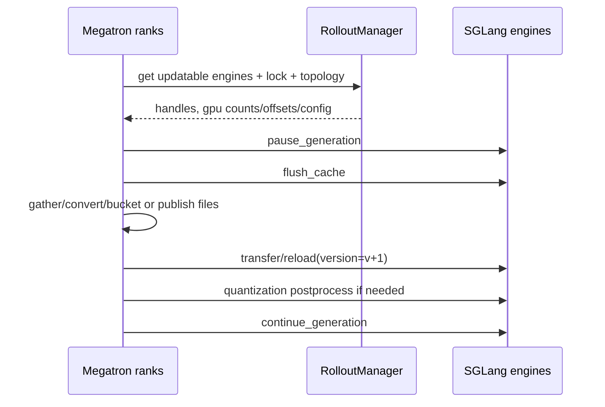

# slime Megatron→SGLang 权重同步实现分析

> **源码基线**：slime `main@681b3adca54105d5ecd3fb822fa0dc58a427e0f9`
> **核验日期**：2026-08-14 · **系列**：[[slime/index]]
> **结论先行**：slime 的权重同步是一个带版本的服务提交协议，不是简单的 parameter broadcast。共同语义是：选定训练快照 → Megatron shard 还原并转 HF/SGLang 名称 → 暂停新生成并清 KV/cache → 完整传输或落盘 → 量化后处理/版本确认 → 恢复生成。NCCL、colocated tensor IPC、full disk、delta disk 只是载体不同；任何一条路径若省掉 pause、flush、barrier、version 或 atomic publish，都会允许半套权重或旧 KV 泄漏。

## 1. Updater 选择矩阵

actor 初始化按 `update_weight_mode × transport × colocate` 选择实现：[ `actor.py:151-182`](https://github.com/THUDM/slime/blob/681b3adca54105d5ecd3fb822fa0dc58a427e0f9/slime/backends/megatron_utils/actor.py#L151-L182)

| mode | transport/topology | updater | 主要载体 |
|---|---|---|---|
| full | NCCL、训推分离 | `UpdateWeightFromDistributed` | Megatron rank→SGLang engine NCCL group |
| full | colocate | `UpdateWeightFromTensor` | GPU tensor→CPU serialize→Gloo gather→Ray/CUDA IPC；可混合远端 NCCL |
| full | disk | `UpdateWeightFromDisk` | versioned HF checkpoint + SGLang disk reload |
| delta | disk、非 colocate | `UpdateWeightFromDiskDelta` | changed bytes + checksum/index + host-local base apply |

delta 被显式限制为 disk 且不支持 colocate；其他未知组合立即 assert，而不是静默回退。[`actor.py:154-174`](https://github.com/THUDM/slime/blob/681b3adca54105d5ecd3fb822fa0dc58a427e0f9/slime/backends/megatron_utils/actor.py#L154-L174)

## 2. 共同控制协议

actor 每次提交前可先恢复 crash 的 updatable engines，必要时重连 NCCL/process groups；拿到的 per-engine GPU counts/offsets/parallel config 同时服务异构 TP 和 colocated expert routing。[`actor.py:592-636`](https://github.com/THUDM/slime/blob/681b3adca54105d5ecd3fb822fa0dc58a427e0f9/slime/backends/megatron_utils/actor.py#L592-L636)

RolloutManager 只把第一个 `update_weights=True` model 暴露给 updater，冻结 ref/reward models 自动排除；当前多 updatable model 尚不支持。[`rollout.py:555-584`](https://github.com/THUDM/slime/blob/681b3adca54105d5ecd3fb822fa0dc58a427e0f9/slime/ray/rollout.py#L555-L584)

## 3. Megatron shard → HF/SGLang tensor

两类在线 updater 都要解决三种 shard：

1. TP/non-expert：all-gather 参数，按模型 conversion 变成 HF 名称/shape；
2. EP/expert：先 TP gather，再按 EP group 批量 all-gather/convert；
3. PP：每个 PP source rank建立独立 `slime-pp_{pp_rank}` 更新组，负责自己层段。

NCCL path 的 non-expert/expert 分批逻辑见 [`update_weight_from_distributed.py:153-239`](https://github.com/THUDM/slime/blob/681b3adca54105d5ecd3fb822fa0dc58a427e0f9/slime/backends/megatron_utils/update_weight/update_weight_from_distributed.py#L153-L239)。buffer size 限制 conversion 后 bucket，避免一次 materialize 全模型 HF 权重。

tensor path 用 `HfWeightIterator` 提供“像 HF named_parameters 一样”的 chunk 视图；默认 direct iterator 预计算 local param info buckets。[`hf_weight_iterator_base.py:7-31`](https://github.com/THUDM/slime/blob/681b3adca54105d5ecd3fb822fa0dc58a427e0f9/slime/backends/megatron_utils/update_weight/hf_weight_iterator_base.py#L7-L31)

## 4. NCCL 分离路径

### 4.1 建组

每个 PP source（DP=0、TP=0）创建一个 group，world size = 所有 SGLang engine GPU 数之和 + 训练 source rank；异构 engine TP 通过 cumulative rank offsets 加入同一 group。[`update_weight_from_distributed.py:57-100`](https://github.com/THUDM/slime/blob/681b3adca54105d5ecd3fb822fa0dc58a427e0f9/slime/backends/megatron_utils/update_weight/update_weight_from_distributed.py#L57-L100) [`update_weight_from_distributed.py:268-314`](https://github.com/THUDM/slime/blob/681b3adca54105d5ecd3fb822fa0dc58a427e0f9/slime/backends/megatron_utils/update_weight/update_weight_from_distributed.py#L268-L314)

### 4.2 提交

rank 0 pause/flush 后，所有 trainer ranks 过 Gloo barrier；再依次发送 non-expert、barrier、expert、barrier；全部完成后做量化 postprocess并 resume。[`update_weight_from_distributed.py:102-146`](https://github.com/THUDM/slime/blob/681b3adca54105d5ecd3fb822fa0dc58a427e0f9/slime/backends/megatron_utils/update_weight/update_weight_from_distributed.py#L102-L146)

每 bucket 先获取 Ray engine lock，metadata 走 Ray RPC，tensor data 由 NCCL async broadcast，等待 engine RPC 完成后才清 bucket、释放 lock。锁的目的明确是防并发 broadcast deadlock。[`update_weight_from_distributed.py:240-265`](https://github.com/THUDM/slime/blob/681b3adca54105d5ecd3fb822fa0dc58a427e0f9/slime/backends/megatron_utils/update_weight/update_weight_from_distributed.py#L240-L265) [`update_weight_from_distributed.py:326-355`](https://github.com/THUDM/slime/blob/681b3adca54105d5ecd3fb822fa0dc58a427e0f9/slime/backends/megatron_utils/update_weight/update_weight_from_distributed.py#L326-L355)

## 5. Colocated tensor/IPC 路径

同卡路径不能让 SGLang 与 Megatron 同时长期占满 GPU。`UpdateWeightFromTensor` 根据 engine GPU offsets 判断哪些 engines 完全落在 actor GPU 范围，分别建立 colocated Gloo gather group；若还有 rollout-only 远端 engines，同一个 updater 可同时使用 NCCL 分发。[`update_weight_from_tensor.py:95-180`](https://github.com/THUDM/slime/blob/681b3adca54105d5ecd3fb822fa0dc58a427e0f9/slime/backends/megatron_utils/update_weight/update_weight_from_tensor.py#L95-L180)

每个 HF chunk 的 colocated path 将 flattened tensor bucket 序列化，各 local ranks 用 Gloo `gather_object` 收到 engine source rank，再通过 Ray 调 `update_weights_from_tensor`;缺少某 dtype bucket 的 rank显式发送 empty bucket，保持集合形状一致。[`update_weight_from_tensor.py:359-424`](https://github.com/THUDM/slime/blob/681b3adca54105d5ecd3fb822fa0dc58a427e0f9/slime/backends/megatron_utils/update_weight/update_weight_from_tensor.py#L359-L424)

提交循环每 chunk 等 SGLang consumer 返回后才 `ipc_collect/empty_cache`，防止 producer 提前释放 CUDA IPC backing storage；最后 barrier 后再清一次，全部完成才 resume generation。[`update_weight_from_tensor.py:276-331`](https://github.com/THUDM/slime/blob/681b3adca54105d5ecd3fb822fa0dc58a427e0f9/slime/backends/megatron_utils/update_weight/update_weight_from_tensor.py#L276-L331)

### 5.1 Rank-local expert update

当所有 engines 都 colocated 且 Megatron/SGLang MoE topology满足条件时，expert routing planner把专家直接发送到目标 SGLang ranks，dense params继续常规 buckets；存在 distributed engines、异构/不合格 topology 时自动禁用。[`expert_routing.py:295-380`](https://github.com/THUDM/slime/blob/681b3adca54105d5ecd3fb822fa0dc58a427e0f9/slime/backends/megatron_utils/update_weight/expert_routing.py#L295-L380)

这优化了无谓的全量 expert 汇聚/再分发，但正确性依赖 engine GPU ordering、EP/MoE-DP topology 和 expert id mapping 全部一致。

## 6. Full disk 路径

每次 version++ 后写 `weight_vNNNNNN` 完整 HF checkpoint：rank 0 清旧目录，所有 writing ranks各自 mkdir/write，Gloo barrier 后运行可选 post-write hook，再 barrier。hook 用于对象存储型 shared filesystem 的显式 publish/read-after-write。[`update_weight_from_disk.py:17-95`](https://github.com/THUDM/slime/blob/681b3adca54105d5ecd3fb822fa0dc58a427e0f9/slime/backends/megatron_utils/update_weight/update_weight_from_disk.py#L17-L95)

真正的 SGLang reload 由 `RayTrainGroup` 接管：可先 pull 到 host-local NVMe（这段可与 generation overlap），然后 pause/flush/reload；CI 模式逐 engine 核对 version，成功后清临时目录并 resume。[`actor_group.py:227-269`](https://github.com/THUDM/slime/blob/681b3adca54105d5ecd3fb822fa0dc58a427e0f9/slime/ray/actor_group.py#L227-L269)

full disk 的优点是跨环境/异构 GPU、external serving 友好，且 `release_train` 后仍有完整提交物；代价是写放大和 shared filesystem latency。

## 7. Delta disk 路径

第一次调用只捕获 baseline，不发布；baseline优先来自 SGLang host materialize 的 HF checkpoint，以保证 snapshot 与 engine base 一致，缺失 tensor才回退到当前 gathered weights。[`update_weight_from_disk_delta.py:82-125`](https://github.com/THUDM/slime/blob/681b3adca54105d5ecd3fb822fa0dc58a427e0f9/slime/backends/megatron_utils/update_weight/update_weight_from_disk_delta.py#L82-L125)

后续每轮：diff/compress changed tensors → 写 canonical safetensors shards → index 记录 `version/base_version/encoding/checksum` → host pull/apply → pause/flush → ordinary disk reload → resume。[`update_weight_from_disk_delta.py:127-190`](https://github.com/THUDM/slime/blob/681b3adca54105d5ecd3fb822fa0dc58a427e0f9/slime/backends/megatron_utils/update_weight/update_weight_from_disk_delta.py#L127-L190)

文件先写 `.tmp`、flush+fsync，再 `os.replace`，防 reader 看见半文件。[`update_weight_from_disk_delta.py:297-303`](https://github.com/THUDM/slime/blob/681b3adca54105d5ecd3fb822fa0dc58a427e0f9/slime/backends/megatron_utils/update_weight/update_weight_from_disk_delta.py#L297-L303) 它还记录 changed density 与 wire bytes，让“delta 是否真的更省”可观测。[`update_weight_from_disk_delta.py:275-294`](https://github.com/THUDM/slime/blob/681b3adca54105d5ecd3fb822fa0dc58a427e0f9/slime/backends/megatron_utils/update_weight/update_weight_from_disk_delta.py#L275-L294)

`xor` delta 最小但必须对正确 base 恰好应用一次；`overwrite` 更大但幂等。base_version/checksum/host lock 是 delta 正确性的必要部分，不能把它理解为普通增量 checkpoint。

## 8. 量化权重的额外阶段

compressed-tensors INT4/FP4 在加载前先 restore original weights、加载后再 quantize postprocess，因此在线 updater必须把这两个动作包在同一次 pause/resume 事务中。[`update_weight_from_distributed.py:109-134`](https://github.com/THUDM/slime/blob/681b3adca54105d5ecd3fb822fa0dc58a427e0f9/slime/backends/megatron_utils/update_weight/update_weight_from_distributed.py#L109-L134)

量化 ignore list 错误可能让 MoE gate 等非 Linear 2D tensor被转成 SGLang不识别的名字而静默跳过；`check_weight_update_equal` 和首轮 rollout/logprob 对齐是必要门禁，而不是仅看 update RPC 成功。

## 9. 选择建议

| 场景 | 首选 | 原因 | 主要风险 |
|---|---|---|---|
| 同集群训推分离 | NCCL full | 低落盘、直接 GPU broadcast | 建组/锁/异构 TP 复杂 |
| colocate | tensor/IPC | 避免远端网络，支持混合 extra rollout GPUs | IPC lifetime、GPU ordering |
| external/异构 serving | full disk | 环境隔离、可用 shared FS | 全量写放大 |
| 大模型低密度更新/跨环境 | delta disk | 降 wire bytes，可 host-local apply | base/version/checksum 协议最严格 |

## Related Pages

- [[10_slime_end_to_end_iteration_analysis]] — 权重提交在一轮事务中的位置
- [[11_slime_ray_control_plane_analysis]] — engine handles/lock/topology 的 owner
- [[19_slime_rollout_backend_extension_analysis]] — 新 backend 必须重建的权重提交契约
- [[22_slime_low_precision_training_rollout_analysis]] — FP8/INT4 的量化提交阶段
- [[17_slime_train_inference_consistency_analysis]] — version、pause/flush 和量化一致性
- [[30_slime_rollout_optimization_analysis]] — 权重同步与 generation overlap 的性能权衡
