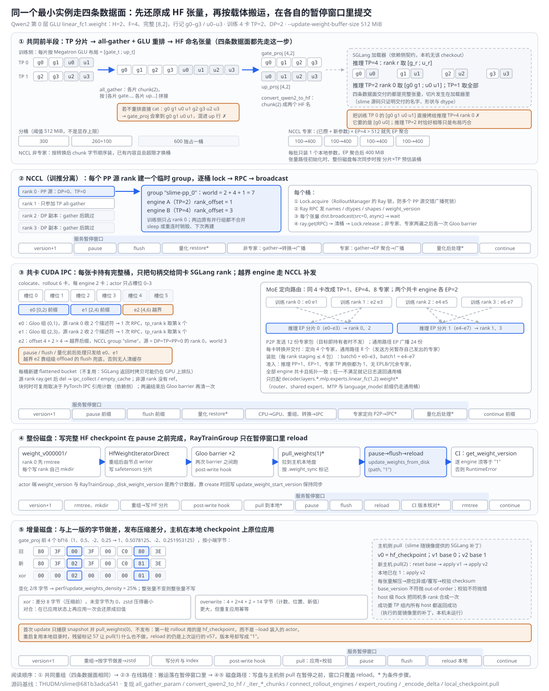
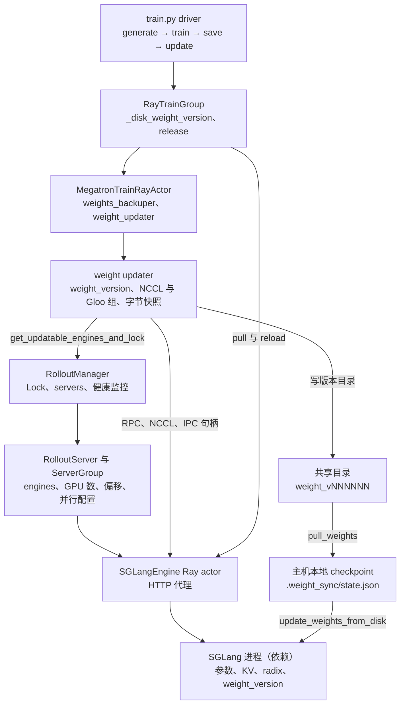

# slime Megatron→SGLang 权重同步分析

> **源码基线**：`THUDM/slime@681b3adca54105d5ecd3fb822fa0dc58a427e0f9`（`main`，2026-08-12）
> **主题**：optimizer step 之后的新参数怎样变成 SGLang 正在服务的新版本：`MegatronTrainRayActor.init` 按 mode × transport × colocate 选定四种 updater 之一；共同前半段把 Megatron 分片还原成与拓扑无关的 HF 张量并分桶，后半段分成 NCCL 广播、共卡 CUDA IPC（含 MoE 定向路由与越界 engine 的 NCCL 补发）、整份 HF checkpoint 落盘、字节级增量落盘四条数据面，每条都在 pause/flush 与 continue 之间提交并带上版本号。核心代码在 `slime/backends/megatron_utils/update_weight/`、`actor.py::MegatronTrainRayActor.update_weights` 与 `slime/ray/actor_group.py::RayTrainGroup`。
> **适用范围**：权重从训练侧到 serving 侧的重组、搬运与提交；CPU tag 与 sleep/wake 归 14，full+disk 的版本计数器与 reload 编排归 11，engine 健康检测与重建归 18，训推数值一致性归 17，低精度格式归 22。
> **最近更新**：2026-09-11。按特性分析画像重写，补最小实例、四数据面原理图、调用树与成本账本。

---

## 1. 特性概览

### 1.1 问题背景

训练侧每轮结束时，新参数以 Megatron 的 TP/PP/EP 分片散落在各训练 rank 上，并被 `TensorBackuper` 备份成 CPU `actor` tag；rollout 侧是另一组 SGLang 进程，按自己的 TP/EP 拓扑持有参数、正在服务请求，还持有用旧参数算出的 KV 与 radix 前缀缓存。把前者变成后者要同时守住四条不变量：一次提交只用同一个训练边界的完整快照，否则不同 rank 拿到不同 step 的分片，传输再准确也拼出一个不存在的模型；交付给 loader 的必须是它认识的名字、形状与行序，而训练分片既不是推理分片也不是 HF 张量（§2.1.1 的 fc1 就是反例）；并发请求看不到一半新一半旧的模型，也不能在新权重上复用旧 KV；共置时训练进程与 serving 进程分时占用同一块 HBM，谁拥有哪块显存必须明确。"把参数广播出去"只解决了搬运，另外三条都没有碰到。

### 1.2 解决方法

slime 把同步做成带版本号的提交。driver 在训练与保存之后调用 `RayTrainGroup.update_weights`，actor 先按需恢复坏掉的 engine 并重连，再调用 updater。四种 updater 共用一个前半段：从 CPU `actor` tag（或 GPU 参数）出发，经 PP/EP 广播与 TP all-gather 还原每个参数的完整逻辑张量，用 `convert_to_hf` 转成 HF 名字与布局，按 `--update-weight-buffer-size` 分桶。后半段分四条：训推分离时每个 PP 源 rank 建一个临时 NCCL group，逐桶在 Ray 锁下先发元数据 RPC 再广播；共卡时每张训练卡把完整桶拍平成 CUDA IPC 句柄，由同 engine 的 Gloo 源收齐描述符后发一次 RPC，满足条件的 MoE 专家改走 rank 间定向 P2P，越出 actor 区间的 engine 由全局源 rank 走 NCCL 补发；整份磁盘把完整 HF checkpoint 写到共享目录，由 `RayTrainGroup` 在暂停窗口里让 engine reload；增量磁盘把每个 HF 张量与上一版的 CPU 字节快照做差、zstd 压缩后发布，每台 serving host 通过镜像里 SGLang 补丁提供的 `/pull_weights` 在本地 checkpoint 上原位应用再 reload。在线两条的搬运落在 pause/flush 与 continue 之间；磁盘两条把写盘与主机侧应用挪到 pause 之前，窗口只覆盖 reload。

### 1.3 收益、开销和约束

| 维度 | 直接收益 | 必付成本或边界 |
|---|---|---|
| 拓扑解耦 | 训练 TP=2 可对接推理 TP=1/2/4；转换器与 loader 之间只约定 HF 名字、形状、dtype | 每个桶都在训练 GPU 上物化完整参数；只支持 `convert_to_hf` 覆盖的模型族 |
| NCCL | 不落盘，GPU 直连广播；异构 engine 按累计偏移加入同一 group | 多个 PP 源串行持锁；每桶一次 RPC 往返；整个搬运在暂停窗口里 |
| 共卡 IPC | 跨进程只传句柄与元数据，payload 走同卡显存 | 每张卡临时持有完整桶；pause/flush 只覆盖共卡前缀；非源 rank 的释放依赖 PyTorch IPC 引用计数 |
| MoE 定向路由 | 本例 P2P 12 份专家包、每卡转换并交付 4 个专家，对比通用路径 24 份、8 个 | 准入条件苛刻，任一不满足记日志退回通用桶 |
| 整份磁盘 | 训推只经共享目录与 HTTP 耦合，支持 external、异构 GPU、`release_train` | 每次写完整 checkpoint；共享文件系统可见性要靠 hook 补齐 |
| 增量磁盘 | 只发布变化字节，未变张量不写；主机侧原位应用 | 训练侧仍全量重组、全量 D2H 与逐字节比较；每台 host 需完整本地 checkpoint；版本链必须严格串行 |
| 提交语义 | 版本号随每次 RPC 或 reload 交给 engine；整份磁盘在 CI 下逐 engine 读回 | 其余路径没有读回核对；RPC 成功不等于数值正确（§4.2） |

### 1.4 术语约定

| 术语 | 含义 |
|---|---|
| HF 张量 / 桶 | `convert_to_hf` 产出的 `(HF 名, 完整逻辑张量)`；桶是一次搬运的若干 HF 张量，按 `--update-weight-buffer-size` 切分 |
| PP 源 rank | NCCL 与增量路径中每个 PP stage 上 `DP(含 CP)=0、TP=0` 的 rank，唯一负责转换与发送 |
| Gloo 源 | 共卡路径里每个 engine 对应一组训练 rank（即它占用的 GPU 槽位），组内首个 rank 收集描述符并发 RPC |
| 共卡前缀 / 越界后缀 | 共卡 updater 把 `gpu_offset + gpu_count` 不超过 actor GPU 数的前若干个 engine 当前缀，其余是后缀 |
| weight_version | updater 或 `RayTrainGroup` 维护的整数计数器，以字符串随 RPC 或 reload 交给 SGLang |
| base_version / 已应用标记 | 增量版本 N 声明建立在 N−1 之上；主机本地 checkpoint 在 `.weight_sync/state.json` 里记录已应用到的版本 |

---

## 2. 权重同步详细方案

### 2.1 最小实例：一个 GLU fc1 走四条数据面

取 Qwen2 结构第 0 层的 `decoder.layers.0.mlp.linear_fc1.weight`：hidden H=2，FFN F=4，完整形状 [8,2]，行记作 gate g0–g3 与 up u0–u3。训练侧 4 张卡 TP=2、DP=2（PP=1、EP=1）；Megatron 的 GLU 布局让 TP rank t 的分片是 [gate_t ; up_t]，即 TP 0 持有 `g0 g1 u0 u1`、TP 1 持有 `g2 g3 u2 u3`。四条数据面各配最小拓扑：训推分离时两个 engine 分别 TP=2 与 TP=4；共卡时 rollout 6 卡、每 engine 2 卡，actor 只占槽位 0–3；MoE 变体把同样 4 张卡改成 TP=1、EP=4、8 个专家，两个共卡 engine 各 EP=2；增量路径只看 gate_proj 的前 4 个 bf16 元素。下图顶部是四条数据面共用的前半段，下面四条泳道各画一条数据面与它的服务暂停窗口。



| 步骤 | 输入 | 决定性转换 | 输出 |
|---|---|---|---|
| 重组 | TP 0 `g0 g1 u0 u1`、TP 1 `g2 g3 u2 u3` | `all_gather_param`：各片 `chunk(2)`，按 [各片 gate…, 各片 up…] 拼接 | `g0 g1 g2 g3 u0 u1 u2 u3`；若直接首尾相接，gate_proj 会拿到 `g0 g1 u0 u1` |
| 转换 | 完整 [8,2] | `convert_qwen2_to_hf` 再 `chunk(2)` | `gate_proj` 为 `g0 g1 g2 g3`，`up_proj` 为 `u0 u1 u2 u3` |
| 加载（依赖侧） | 完整 gate/up | SGLang loader 按本 rank 的 `tp_rank` 截取 | 推理 TP=4 的 rank 0 取 `g0 u0`；把训练 TP 0 的分片直接拷过去是错的，推理 TP=2 时两边恰好相等只是布局巧合 |
| 分桶 | 转换后 chunk 300、260、100 MiB，阈值 512 | 已有内容且会超限才换桶 | `[300] [260+100]`；单个 600 MiB 独占一桶；专家参数每个 100 MiB、EP=4 时每批只装 1 个，EP 聚合后 400 MiB |
| NCCL | 两个 engine TP=2、TP=4 | `slime-pp_0` 的 world = 2 + 4 + 1 = 7，rank_offset 1 与 3 | rank 0 逐桶持锁广播；rank 1–3 只参加 TP all-gather |
| 共卡 IPC | e0 [0,2)、e1 [2,4)、e2 [4,6)，actor 4 卡 | 前缀判定 `offset + count ≤ 4` | e0、e1 走 IPC（Gloo 组 {0,1}、{2,3}，源 rank 0、2）；e2 越界，走 NCCL group `slime`，world 3 |
| MoE 路由 | 训练 rank r 持有 e(2r)、e(2r+1)；推理 EP 分片 0 为 e0–e3、分片 1 为 e4–e7 | 目标 rank = engine 偏移 + `dp_rank × EP + ep_rank` | 分片 0 → rank 0、2，分片 1 → rank 1、3；P2P 12 份，装批 `batch0 = e0–e3`、`batch1 = e4–e7` |
| 整份磁盘 | 版本 1 | 写 `weight_v000001/` → barrier、hook、barrier → pause → flush → reload | engine 版本 `"1"`；CI 下逐 engine 读回核对 |
| 增量磁盘 | 旧 `80 3F 00 3F 00 C0 80 3E`，新 `80 3F 02 3F 00 C0 81 3E` | 逐字节 xor | 变化 2/8 字节，`perf/update_weights_density` 为 25%；xor 差分 8 字节、overwrite 编码 14 字节（均为压缩前） |

#### 2.1.1 共同前半段：训练分片不是 loader 能装的形状

TP 分片是 Megatron 为自己的矩阵乘切出来的：GLU 的 fc1 在每片内部把 gate 与 up 各放一半，所以把两片首尾相接得到的是交错行序。`all_gather_param` 先把每片对半切开，把所有 gate 半片放前、up 半片放后，才得到 HF 语义下的 `[gate; up]`；`convert_qwen2_to_hf` 再对半切成两个 HF 名字。此后的切分归 loader：SGLang 的列并行加载器拿到完整张量后按自己的 `tp_rank` 截取（依赖侧契约，见 §2.2.8），推理 TP=4 的 rank 0 要的是 `g0 u0`。训练分片与推理分片的对应关系因此随两边的 TP 与层类型而变，没有一种"直接拷贝分片"能在所有组合上成立；推理 TP=2 时两边恰好都是 `g0 g1 u0 u1`，那是布局巧合而不是接口。完整逻辑张量是训练侧唯一不依赖推理拓扑的交付物，slime 用它避免为每一对训练/推理拓扑写专用的重分片协议（本页推断），代价是每个桶都要在训练 GPU 上物化一次完整参数。`linear_fc2.weight` 还有一条特判：`partition_dim` 为 0 时改成 1 再拼接，源码注释写明是在绕开 Megatron grouped MoE 的缺陷。

#### 2.1.2 分桶：阈值约束的是桶，不是显存

三种装桶规则都是"已有内容且会超限才换桶"，所以单个超阈值的 chunk 独占一桶，阈值不是显存上限。它们度量的对象不同：NCCL 与增量路径的非专家桶按转换后 HF chunk 的字节累计（本例 300 | 260+100，600 独占）；专家桶按 TP 聚合后的本地参数字节乘 EP world size 判断，超限就先做 EP all-gather 再转换（本例每批 1 个 100 MiB 参数，聚合后 400 MiB）；张量路径与整份磁盘在构造 `HfWeightIteratorDirect` 时按"分片字节 × TP（专家用专家 TP）"预估完整参数大小装好 `ParamInfo` 桶：张量 updater 在初始化时构造一次、此后每次同步复用；整份磁盘的 `save_hf_model_direct_to_path` 每次同步都重新构造，于是每次都重做 PP/EP 的 `all_gather_object` 与全 world 的元数据核对。按桶流式处理让峰值停在桶级而不是整模型级；在每个 rank 上物化全模型会把拓扑复杂度换成全模型 HBM 峰值（本页推断）。临时 gather 缓冲、转换副本与量化辅助张量都不计入阈值。

#### 2.1.3 四条数据面的暂停窗口

在线两条（NCCL、共卡 IPC）的顺序是：version+1 → rank 0 对 engine 发 `pause_generation` 与 `flush_cache`（compressed-tensors 时再发一次 restore）→ Gloo barrier → 逐桶重组、转换、搬运 → 量化后处理 → `continue_generation` → barrier，搬运整体落在暂停窗口里。整份磁盘由 actor 写完 checkpoint 并跑完 hook 才返回，`RayTrainGroup` 随后可选地 pull 到主机本地盘，再 pause → flush → reload →（CI）核对版本 → 删目录 → continue；增量磁盘由 actor 自己完成做差、写盘、hook、`pull_weights`（主机侧应用与校验），然后 pause → flush → reload 本地目录 → continue。两条磁盘路径把最重的字节搬运移到暂停之前，窗口只覆盖 reload。

#### 2.1.4 MoE 专家为什么可以不先全量聚合

TP 切的是单个张量的维度，必须先拼回完整张量；EP 切的是专家集合，训练专家 TP 与推理 MoE-TP 都为 1 时，每个专家的 fc1/fc2 在它的训练持有者上已经完整。规划器用 Gloo `all_gather_object` 找出每个专家名的最低持有 rank，按 `expert // (专家数 / 推理 EP)` 算出推理 EP 分片，再把分片映射到每个共卡 engine、每个 MoE-DP 副本上的训练 rank（engine 偏移 + `dp_rank × EP + ep_rank`），所以训推 EP 数不同、同一分片要复制到多个 engine 都能表达。本例 e0–e3 送到 rank 0 与 2、e4–e7 送到 rank 1 与 3；持有者本身就是目标时不发送，于是 e0、e1 各发 1 份，e2–e5 各发 2 份，e6、e7 各发 1 份，共 12 份；通用路径的 EP 广播让 8 个专家各到另外 3 个 rank，共 24 份，每张卡物化 8 个专家；定向路由下每个目标 rank 只转换并交付 4 个，作为发送方的 rank 另要暂存自己发出的专家。装批按包大小降序首次适配，约束是每个参与 rank 的 staging 字节不超过阈值：阈值取 4 包时，e4 因 rank 2 会超限另开 batch1，e6、e7 在两个候选里选总量更小的 batch1，得到 `batch0 = e0–e3`、`batch1 = e4–e7`；`tests/test_expert_routing.py` 锁定了按专家边界拆批与单包超阈值抛错两条规则。

#### 2.1.5 增量：字节差分与版本链

`_encode_delta` 把每个 HF 张量 `contiguous().view(uint8)` 展平后与上一版的 CPU 快照比较。本例 bf16 值 0.5 → 0.5078125、0.25 → 0.251953125 只改了两个低位尾数字节：xor 编码写 `new ^ old`，8 字节里 6 个为 0，zstd（固定 level 1）压得最小，但它是对合，在已应用的状态上再应用一次会还原成旧值；overwrite 编码写"变化计数（u4）+ 位置（u4）+ 新值"，本例 4 + 2×4 + 2 = 14 字节，重复应用幂等。整张量没有变化就不写入分片。这里同时存在两个 base：trainer 手里上一版的 CPU 字节快照，与每台 host 本地 checkpoint 里已应用的版本，所以版本 N 只能基于 N−1 生成和应用，不是任意两个 checkpoint 之间的无状态 diff。版本链从 v0 开始：v0 就是 `--hf-checkpoint`，第一次调用只捕获快照并让每台 host `pull_weights(0)` 物化本地 base，不发布、也不递增版本；此后 v1 声明 base 0、v2 声明 base 1。新 host 执行 `pull(2)` 时从 2 往回找最近的完整版本，找到 v0 就用 model path 重置本地目录，再依次应用 v1、v2；已在 1 的 host 只应用 v2。

### 2.2 从最小实例到整个同步系统

下面各组件的"为何"是本页依据源码形态与失败路径重建的理由（标"本页推断"），源码或文档写出的理由单独注明；"怎样"与"代价"以冻结基线为准。SGLang 进程内部的行为不在本机可读范围内，统一在 §2.2.8 说明依赖边界。

#### 2.2.1 入口：updater 选择、恢复与连接

**职责。** `MegatronTrainRayActor.init` 在 actor（非 critic）上构造 updater：`update_weight_mode == "delta"` 时断言非 colocate、transport 为 disk，选 `UpdateWeightFromDiskDelta`；否则 transport 为 disk 选 `UpdateWeightFromDisk`；否则 colocate 选 `UpdateWeightFromTensor`；剩下的必须是 full + nccl，选 `UpdateWeightFromDistributed`，其他组合以 `unsupported weight sync mode/transport` 断言失败。updater 拿到的 `weights_getter` 指向 CPU `actor` tag，初始 `weight_version` 取内部属性 `update_weight_start_version`（缺省 0）。`update_weights` 在 debug 模式下直接返回；开 `--use-fault-tolerance` 时 rank 0 请求 `RolloutManager.recover_updatable_engines`，所有 rank 过 Gloo barrier；然后取 `get_updatable_engines_and_lock` 的六元组（engines、Ray `Lock`、新建 engine 数、每 engine GPU 数、GPU 偏移、并行配置）；`offload_train ∧ use_critic ∧ ¬colocate` 时整轮 wake/sleep 并重连，其余 offload 情形只重建 process group；没有可更新 engine 且不需要重连就记日志返回；有新 engine 或需要重连时调用 `connect_rollout_engines`、barrier，rank 0 清零新 engine 计数；最后在 `torch_memory_saver.disable()` 区间里调用 `weight_updater.update_weights()`，`keep_old_actor` 时再按 `update_weights_interval` 轮转 `rollout_actor → old_actor`（归 14）。

**为何。** 选择在构造时一次定死，避免运行中切换 updater 时新旧 group、快照、版本号并存（本页推断）。delta 的两条限制，源码各有原话：只配 disk，是因为 actor 注释说每个 engine 的 `/pull_weights` 要把发布的增量应用到它跨越的每台 host 的本地 checkpoint，再走普通 `update_weights_from_disk`；不配 colocate，是因为参数校验说共卡传的只是 CUDA IPC 句柄，快照、做差、编码"纯属开销"。未知组合断言失败而不是回退到"最接近"的 updater。

**代价与边界。** 参数校验先于 actor 抛 `ValueError`：disk 需要 `--update-weight-disk-dir`，delta 需要 disk、非 colocate、`--update-weight-local-checkpoint-dir`，`--release-train` 需要 full + disk。`RolloutManager._get_updatable_server` 只返回第一个 `update_weights=True` 的模型，docstring 自承多模型权重更新尚未支持，冻结的 ref/reward 模型不进入这条路径。基线之后的提交 `7e4ac3be9b9c4dea6c2e5b0718a5475bfdc6fa68` 把选择逻辑抽成 `update_weight/__init__.py::create_weight_updater`，本页仍按基线的 `actor.py` 分支解释。

#### 2.2.2 拓扑无关重组：两套迭代器

**职责。** `HfWeightIteratorDirect` 服务张量路径与整份磁盘（`hf_checkpoint_saver.save_hf_model_direct_to_path` 也直接构造它）。构造时 `_get_megatron_local_param_infos` 收集本地参数名、形状、dtype 与 TP 属性，沿 PP 组 `all_gather_object` 交换（重复名取最小 `src_rank`，处理 MTP 的虚拟 PP），再沿 EP 组补上其他 EP rank 的专家，按名字排序后经 Gloo 在全 world 核对名字、形状、dtype。`get_hf_weight_chunks` 对每个桶调用 `_get_megatron_full_params`：持有者把本地分片搬上 GPU、其余 rank 分配空张量，PP 组内按 `src_rank` 广播，专家再沿 EP 组广播，最后 `all_gather_params_async` 先对整桶发起全部异步 TP all-gather、统一 wait、再拼接；结果是每个训练 rank 都持有该桶全部完整参数，再各自 `convert_to_hf`。NCCL 与增量路径用另一套：`_iter_non_expert_chunks` 逐参数同步 `all_gather_param`，只有 PP 源转换并装桶，其余 rank（包括 DP 副本）做完 TP all-gather 就跳过；`_iter_expert_chunks` 攒批后由 `_ep_gather_and_convert` 做 EP all-gather，名字列表先 `all_gather_object` 并断言各 EP rank 数量一致。

**为何。** 在线 NCCL 只需要一个发送者，没必要让每张卡都物化全部参数；共卡 IPC 恰好相反，每张卡都要把完整桶交给同卡 SGLang rank，所以张量路径让所有 rank 都拿到完整桶（本页推断，判据是谁需要完整张量）。

**代价与边界。** 守卫只在 NCCL 与增量用的 `all_gather_param` 里：断言参数带 `tensor_model_parallel`，`partition_stride` 只接受 1 或 fc1 的 2。直接迭代器用 `getattr` 给缺失属性填默认值（非 TP、stride 1），`all_gather_params_async` 也不检查 stride，所以张量与整份磁盘路径上缺属性的分片参数会以本地分片原样交付，非 fc1 的 stride-2 参数会被普通拼接，都不报错（§5.1）；反过来，各 rank 参数名、形状、dtype 一致的核对只在直接迭代器里。buffer 只同步名字含 `expert_bias` 的一类，其余被跳过（两处 `TODO shall we handle (almost) all buffers`）。`convert_to_hf` 按模型名分派到 qwen2、qwen3moe、deepseekv3、glm4 等转换器，不认识的模型抛 `ValueError`；视觉塔（`model.visual.`）原样透传，其余先去 vocab padding 再按 `quantization_config` 量化。完整逻辑张量解耦的是下表这些维度，不是任意拓扑转换：

| 拓扑维度 | 通用路径怎样消除差异 | 仍然存在的约束 |
|---|---|---|
| 训练 DP/CP | 权重在这些维度上复制，不影响 HF 形状 | 只选一份语义一致的快照（PP 源或 `src_rank`） |
| 训练 TP → 推理 TP | TP all-gather 成完整张量，loader 再按推理 TP 截取 | 目标维度可整除，或 loader 明确支持 padding 与特殊布局 |
| 训练 PP → 推理 PP | 各 stage 的层按全局层号改名后交给 loader | 层归属、名字映射与推理 engine 的 rank 顺序一致 |
| 训练 EP → 推理 EP | 恢复逐专家张量后加载；合格时走 rank 内定向路由 | 专家数与布局、EP rank 映射；EPLB 等动态布局不支持定向路由 |
| 量化与融合格式 | 转换器产出 loader 认识的名字与张量 | 不是任意 dtype 与量化方案都能互转 |

#### 2.2.3 NCCL 分离数据面

**职责。** `connect_rollout_engines` 在每个 PP 源上建 group `slime-pp_{pp_rank}`：主机取本机 IP 与空闲端口，world = 所有 engine GPU 数之和 + 1，engine i 以 `rank_offset = 前面 engine 的 GPU 累计数 + 1` 加入（异构 TP 的 prefill 与 decode 各占不同数量的 rank），重连时先销毁旧 group。每个桶 `_update_bucket_weights_from_distributed`：自旋获取 `rollout_engine_lock`（0.1 秒重试），对每个 engine 发 `update_weights_from_distributed` RPC（names、dtypes、shapes、group 名、版本号字符串），同时每个张量 `dist.broadcast(src=0, async_op=True)` 并逐个 wait，`ray.get` 等 RPC 返回后清桶、释放锁。

**为何。** 这个临时 group 只是"一个训练源 + 全部推理 rank"的数据面，不合并两边原有的并行组，也不参与 forward/backward；训练侧已经还原出完整张量，group 只负责运输（本页推断）。锁的理由源码写明是防止广播死锁：多个 PP 源各有自己的 group，却指向同一批 engine，交错广播会让 engine 同时卡在两个集合通信里。

**代价与边界。** PP 源之间串行；每桶一次 RPC 往返；sleep 时（有 critic 且非 colocate）`disconnect_rollout_engines` 销毁 group，下次再建。

#### 2.2.4 共卡 CUDA IPC 数据面

**职责。** `UpdateWeightFromTensor.connect_rollout_engines` 从头扫描 engine，`gpu_offset + gpu_count` 超出 actor GPU 数（`actor_num_nodes × actor_num_gpus_per_node`）就停止，前面的 engine 是共卡前缀，后面的全部是越界后缀；Gloo 组只在首次连接时按真实偏移建（组成员就是 engine 占用槽位上的训练 rank，源是组内首个 rank），偏移缺省时按紧密排列推断。每个桶 `_send_to_colocated_engine`：按 dtype 分组（`FlattenedTensorBucket` 支持多 dtype 时合成一组）拍平成一个新的 CUDA 张量加 name/shape/dtype/偏移元数据，经 `MultiprocessingSerializer` 序列化成字符串，`gather_object` 送到 Gloo 源；源对每个桶位发一次 `update_weights_from_tensor`（`load_format="flattened_bucket"`、版本号），某个 rank 缺该桶位时用空桶补齐；SGLang 的 TP rank k 取列表第 k 个描述符（依赖侧）。越界后缀由 `DP=TP=PP=0` 的全局源 rank 建 NCCL group `slime`，逐桶 RPC + 广播补发，但不持 Ray 锁（只有一个源，不会交错）。每个桶在 `ray.get` 后 `del`、`torch.cuda.ipc_collect()`、`empty_cache()`；定向路由每批 `ray.get` 之后都过一次 Gloo barrier；两遍都结束后再过一次 Gloo barrier 并再清一次。

**为何。** 共卡时两个进程在同一张卡上，句柄比字节便宜得多：Gloo 与 Ray 只搬描述符，payload 从训练进程的 GPU 张量直接拷进 SGLang 参数。每桶新建拍平张量而不复用，源码注释给了原因：SGLang 把 GPU 拷贝排进队列后就返回 HTTP/Ray 响应，并不保证设备同步，立即覆写同一块生产者缓冲会与消费者的拷贝竞争。CPU `actor` tag 在这里是显存交接的稳定快照，不是 IPC 介质：一次更新的数据路径是 pinned CPU 快照 → 训练进程 GPU 临时桶 → IPC 句柄 → SGLang 映射同一块显存 → `load_weights` 拷入本 rank 参数分片，整轮看有一次 D2H2D，但最后一段是 GPU→GPU（本页推断，依据 `weights_getter` 与 memory saver 区间）。共卡本身是分时驻留：actor 与 rollout 从槽位 0 起复用同一批 placement group 资源，colocate 缺省同时开 `offload_train` 与 `offload_rollout`（生命周期归 [[14_slime_megatron_training_analysis]]）。

**代价与边界。** slime 的 wrapper `SGLangEngine.update_weights_from_tensor` 注明 HTTP 只 post 元数据、真实权重直接从 GPU 拷贝，模型必须已在 GPU 上；`train.py` 在 `offload_rollout ∧ ¬release_train` 时先 `onload_weights` 再更新，与这条前提相合（本页推断）。每张卡在暂停窗口里临时持有完整桶；只有 Gloo 源的 `ray.get` 真正等到消费者返回，非源 rank 手里没有 ref，删除后的块能否被复用取决于 PyTorch CUDA IPC 的引用计数与 `ipc_collect`（依赖侧，源码注释只说释放"消费者已关闭句柄"的条目）。空桶的 rank 仍须进入 `gather_object`，因为那是组内集合通信（`tests/test_empty_colocated_weight_bucket.py`）。前缀判定遇到第一个越界 engine 就结束，要求共卡 engine 排在前面。越界后缀不在 pause/flush/量化前后处理的名单里（§5.1）。

#### 2.2.5 MoE rank 内定向路由

**职责。** `configure_expert_routing` 在每次 `connect_rollout_engines` 时决定是否启用：存在越界 engine、没有共卡 engine、各 engine 的 SGLang 并行配置不一致、准入条件不满足（推理 PP=1、推理 EP>1、未开 EPLB、无冗余专家、专家初始位置 trivial、未开 elastic expert backup、训练专家 TP=1、每个 engine 的 GPU 数等于 `EP × MoE-DP`），或规划中抛 `AttributeError/TypeError/ValueError`（专家数不能整除推理 EP、元数据没覆盖每层每个专家的 fc1/fc2、单个专家包超过阈值、engine 越出训练 world）时，rank 0 记一条 "Disable rank-local expert update" 日志并返回通用桶表；没有 `ParamInfo` 桶表或桶里没有匹配的 routed expert 时静默返回。启用时稠密参数重新装桶，专家按层组织成传输组。更新时 `_update_expert_weights` 先 Gloo barrier、再 WORLD barrier（注释：子集批量 P2P 之前先初始化 WORLD），逐批 `_prepare_expert_weight_batch`：源 rank 从 CPU tag 拷进按 `(dtype, shape)` 跨层复用的 staging 缓冲并 `isend` 给每个非自身目标，目标 `irecv`，`batch_isend_irecv` 后 wait，目标 rank 本地 `convert_to_hf`，再走 §2.2.4 的 IPC 交给同卡 SGLang EP rank；每批 `ray.get` 之后都有 Gloo barrier 与 `cuda.synchronize`。

**为何。** 见 §2.1.4：EP 切的是专家集合，满足条件时每个专家在持有者上已经完整，通用路径的"每张卡物化全部专家"是纯开销。

**代价与边界。** 正则只匹配 `module.module.decoder.layers.*.mlp.experts.linear_fc{1,2}.weight*`：router/gate、shared expert、dense 层、MTP 层与带 `language_model.` 前缀的 VLM 专家仍走通用桶。它减少的是物化与交付量，不取消 HF 命名转换，也不让 SGLang 长期引用训练进程的显存。

#### 2.2.6 整份磁盘数据面

**职责。** `UpdateWeightFromDisk.update_weights`：version+1，目录 `update_weight_disk_dir/weight_v{06d}`；rank 0 `rmtree` 旧目录后 Gloo barrier，每个写 rank 自己 `mkdir`（注释：非 POSIX 共享文件系统在提交前不一定让别的 rank 看到这次 mkdir），`save_hf_model_to_path` 用 `HfWeightIteratorDirect` 重组、按 chunk 轮流交给各节点的 writer rank 写 safetensors 分片并汇总 index，barrier，所有 rank 各自调用可选的 post-write hook（签名 `hook(args, version_dir, rollout_engines)`，注释：对象存储挂载没有跨 host 的读后写一致性），再 barrier。reload 由 `RayTrainGroup.update_weights` 接管：它按自己的计数器 +1 定出版本目录，actor RPC 返回后记下该版本，`release_train` 时杀掉训练 actor，然后 `_reload_rollout_weights_from_disk`：`offload_rollout` 时先 `onload_weights`，取可更新 engine（没有就按 keep-files 决定是否删目录后返回），设了本地目录就先 `pull_weights(version)`，再 pause → flush → `update_weights_from_disk(model_path, weight_version)` →（`ci_test`）逐 engine `get_weight_version`，不等就抛 `RuntimeError` → 除非 `--update-weight-disk-keep-files` 否则删目录 → continue。

**为何。** 写盘由训练侧完成、reload 由 driver 侧的 `RayTrainGroup` 编排，注释给了原因：训练侧生命周期要能决定 reload 时 Megatron actor 是否还活着，`release_train` 正是先杀 actor 再 reload。直接把文件写进共享目录就让 engine reload，reader 可能看到半个版本；所以整份用独立版本目录加两道 barrier 与 hook，增量再加原子替换、base_version、checksum 与 host 锁（本页推断）。整份 checkpoint 让训推只经共享目录与 HTTP 耦合，external engine、不同型号或厂家的 GPU 都能接，前提是 SGLang 支持对应硬件与模型格式（官方 external engine 文档）。

**代价与边界。** actor 端 `weight_version` 与 `RayTrainGroup._disk_weight_version` 是两个计数器，`create` 时把后者写回 `update_weight_start_version`，新 actor 从同一处起算（版本归属与调用树归 [[11_slime_ray_control_plane_analysis#3.2 调用流程|控制面页 §3.2.3]]）。每次写完整权重，写放大随同步频率线性增长；共享目录必须对训练端与 engine 路径相同；`release_train` 下训练 actor 在 reload 前已被释放，reload 仍能从版本目录或主机本地副本完成，但版本目录在 reload 后被删除，除非 `--update-weight-disk-keep-files`。

#### 2.2.7 增量磁盘数据面

**职责。** `UpdateWeightFromDiskDelta` 继承 NCCL updater 的两个 chunk 迭代器但不建 group（注释：主机侧应用由 host 级 flock 串行化，用不到 NCCL 那把锁）。首次调用 `_capture_baseline`：rank 0 清空整个 delta 目录（注释：上一次运行的版本会应用到错误的 base 上），跑 hook，异步发 `pull_weights(target_version=0)`；所有 PP 源从 `--hf-checkpoint` 的 safetensors 按名字读字节作快照，缺失的张量回退为当前 gathered 值并告警（docstring：以 hf_checkpoint 为种子，是为了在 Megatron→HF 往返裁掉 embed/lm_head 的 vocab padding 行时仍保证快照等于 engine 的 base）。此后每次：version+1；`_encode_delta` 在 PP 源上开 `max(4, min(2×NUM_WORKERS, 32 GiB / 最大张量字节))` 个 pinned 缓冲做 D2H 暂存（memlock 不足时退回可分页 `.cpu()`），主循环把张量拷进缓冲后提交线程池，工作线程做 xor 或 overwrite、zstd level 1、新状态 checksum，在途任务上限 `2 × NUM_WORKERS` 形成反压，每个结果把新字节写回快照作为下一版的 base；`_write_delta_files` 只给有变化的 rank 编号 `model-{offset:05d}-of-{total:05d}.safetensors`，以 `.tmp` → flush → fsync → `os.replace` 原子写入，rank 0 写 index（version、base_version、delta_encoding、`compression_format: zstd`、checksum_format、weight_map）；`_reload_engines` 跑 hook，rank 0 依次 `pull_weights(version)` → pause → flush → `update_weights_from_disk(local_checkpoint_dir, version)` → continue；`_record_metrics` all-reduce 变化字节、总字节与写出字节，记 `perf/update_weights_density` 与 `perf/update_weights_wire_bytes`。主机侧的 `/pull_weights` 由 slime 随镜像提供的 SGLang 补丁（`docker/patch/latest/sglang-pull_weights.patch`）实现：每个 scheduler rank 都调用 `local_checkpoint.pull`，host 级 flock 与已应用标记让同机多 rank 只做一次；从目标版本往回找最近的完整版本（找不到就用 model path 重置本地目录，完整版本按文件大小核对拷贝），再逐版应用：base_version 不等于本地标记就抛 out-of-order，逐张量解压、在 mmap 区域原位 xor 或按位置覆写、校验 checksum，不符就抛错；成功要 TP 组内所有 host 都返回成功。

**为何。** 官方 delta 文档把场景写成跨集群或跨数据中心的训推解耦，那里每次写整份权重是主要开销；只有一次同步改变的字节占比不高时增量才划算（本页推断）。版本目录自描述（index 有无 `delta_encoding`），同一个 `/pull_weights` 同时服务整份与增量，reload 走原生路径，权重加载代码从不接触增量格式。`pull_weights` 这个 RPC 本身只是控制面，真正的 payload 是 host 读取版本目录并在本地 base 上应用。

**代价与边界。** 训练侧的重组、D2H 与逐字节比较都是全量的，还常驻一份完整字节快照（普通 numpy 数组；参数帮助写的 "pinned-CPU snapshot" 实际只有暂存缓冲是 pinned）；每台 host 要有完整本地 checkpoint；没有按 density 自动回退整份的逻辑。trainer 不清理旧版本目录，一次运行内版本持续累积，新 host 要从 v0 回放整条链；官方文档说整份版本会重置链条、旧增量"可以被清理"，这是 `pull` 的能力，增量 updater 本身只发布增量版本，也不做清理。

#### 2.2.8 提交协议与 SGLang 依赖边界

**职责。** 把上面的数据面收束成六个可以各自失败的动作：①快照：driver 在训练与保存之后才调用更新，actor 在训练末尾已 `backup("actor")`；②拓扑无关：先还原完整 HF 张量；③暂停与清缓存：`pause_generation`、`flush_cache`；④完整搬运：每遍或每批之后的 barrier、IPC 源的 `ray.get`、磁盘的版本目录与 barrier；⑤量化后处理与版本号：compressed-tensors 的 restore 与 post-process，版本号随 RPC 或 reload 交给 engine；⑥确认后才 continue。slime 侧能证明的是它发了什么：`pause_generation` 与 `continue_generation` POST 空 JSON；`flush_cache` 是 GET，非 200 时每秒重试、最多 60 次后抛 `TimeoutError`，注释说有在途请求时 flush 不会返回 200；更新 RPC 带 `weight_version` 字符串，逐桶 RPC 显式传 `flush_cache=False`。

**为何。** 若不先停止生成，一次 forward 可能跨过一半新层一半旧层；只换权重不清 KV，后续 decode 会把旧参数算出的缓存与新参数混用；所以"每个桶的 RPC 成功"不等于"服务已提交"，全部完成并 flush 后的 continue 才是对外提交点（本页推断）。源码逐点写了单个组合为什么被禁止，但没有在任何一处写下"同步应组织成带版本的提交事务"；这六个动作是本页据状态转移与失败路径重建的组织方式。

**依赖边界。** 以下 SGLang 行为沿用旧版对 `sgl-project/sglang@0b3bb0cbe31873994c9f989fddfe2f87ca839fdd`（`v0.5.15.post1`）的引用，本机没有这份 checkout，本轮未复核，只作为公开实现的描述，链接里的行号是旧版记录的定位：pause 请求区分三种 mode，`in_place` 在 resume 后继续使用旧 KV，`retract` 允许 flush 并在 resume 后重算，slime 不传 mode 即用缺省的 `abort`（[`managers/io_struct.py`](https://github.com/sgl-project/sglang/blob/0b3bb0cbe31873994c9f989fddfe2f87ca839fdd/python/sglang/srt/managers/io_struct.py#L1464-L1483)）；flush 会重置 radix 与 KV 池，非空闲时拒绝（[`managers/scheduler.py`](https://github.com/sgl-project/sglang/blob/0b3bb0cbe31873994c9f989fddfe2f87ca839fdd/python/sglang/srt/managers/scheduler.py#L3740-L3765)）；只有所有 worker 更新成功才写入 `weight_version`（[`managers/tokenizer_control_mixin.py`](https://github.com/sgl-project/sglang/blob/0b3bb0cbe31873994c9f989fddfe2f87ca839fdd/python/sglang/srt/managers/tokenizer_control_mixin.py#L395-L484)）；更新失败分支警告 model runner 可能已被部分更新、应丢弃整套权重（[`model_executor/model_runner.py`](https://github.com/sgl-project/sglang/blob/0b3bb0cbe31873994c9f989fddfe2f87ca839fdd/python/sglang/srt/model_executor/model_runner.py#L2100-L2125)）；列并行 loader 按 `tp_rank` 截取完整张量，另有 `use_presharded_weights` 分支，所以"推理引擎只能加载完整张量"并非普遍原理（[`layers/linear.py`](https://github.com/sgl-project/sglang/blob/0b3bb0cbe31873994c9f989fddfe2f87ca839fdd/python/sglang/srt/layers/linear.py#L384-L437)）；IPC 桶按元数据重建零拷贝视图后调用标准 `load_weights`（[`weight_sync/tensor_bucket.py`](https://github.com/sgl-project/sglang/blob/0b3bb0cbe31873994c9f989fddfe2f87ca839fdd/python/sglang/srt/weight_sync/tensor_bucket.py#L19-L105)、[`model_executor/model_runner.py`](https://github.com/sgl-project/sglang/blob/0b3bb0cbe31873994c9f989fddfe2f87ca839fdd/python/sglang/srt/model_executor/model_runner.py#L2158-L2220)），TP rank 从描述符列表里取自己的一项（[`managers/tp_worker.py`](https://github.com/sgl-project/sglang/blob/0b3bb0cbe31873994c9f989fddfe2f87ca839fdd/python/sglang/srt/managers/tp_worker.py#L165-L174)）。slime 源码无法证明 SGLang 何时真正完成 GPU 拷贝、flush 是否覆盖所有缓存层，以及版本号与 serving 权重的原子对应。

**代价与边界。** 版本确认的强度因路径而异：只有整份磁盘在 `ci_test` 下逐 engine 读回 `get_weight_version`；在线路径与增量路径都没有读回核对，也没有逐次等值检查（§4.1）。

### 2.3 变体：同一实例在五条选择轴上

| 选择轴 | 枚举依据 | 变体 | 本例的表现 | 压力与上限 |
|---|---|---|---|---|
| updater | `MegatronTrainRayActor.init` 的 `update_weight_mode` × `update_weight_transport` × `colocate` 分支 | NCCL / 张量 IPC / 整份磁盘 / 增量磁盘 | 分别见泳道 ②–⑤ | 网络与共享存储的带宽；delta 只配 disk 且非 colocate |
| 共卡前缀 | `UpdateWeightFromTensor.connect_rollout_engines` 的 `offset + count` 判定 | 全部共卡 / 前缀共卡 + 越界 NCCL | e0、e1 走 IPC，e2 走 NCCL `slime`（world 3） | 越界 engine 不被 pause/flush |
| 专家传输 | `configure_expert_routing` 的准入 | 通用桶 / rank 内定向 P2P | 定向 12 份、每卡交付 4 个专家；通用 24 份、8 个 | 准入条件；单包必须不超过阈值 |
| 增量编码 | `--update-weight-delta-encoding` 的 choices | xor / overwrite | 8 与 14 字节（压缩前） | wire 大小对幂等性 |
| 磁盘读取点 | `--update-weight-local-checkpoint-dir` 是否设置 | 直接读共享目录 / 先 pull 到主机本地盘 | 整份可选，增量必需 | 官方 external engine 文档：本地目录让共享文件系统每台 host 只读一次，而不是每个 rank 读一次 |

同一关注点的兄弟轴：多模型只更新第一个 `update_weights=True` 的 server，冻结模型在 offload 后从 CPU 备份恢复；external engine 由 `--rollout-external-engine-addrs` 接入，权重同步方式仍由上面的轴决定，官方文档建议不能建 NCCL group 时用 disk；`--release-train` 强制 full + disk，因为 reload 时训练 actor 已被释放（归 [[11_slime_ray_control_plane_analysis]]）；新的 rollout backend 必须实现同一组 engine 端点才能接入这些 updater（归 [[19_slime_rollout_backend_extension_analysis]]）；训练侧只有 Megatron 一个后端。

### 2.4 整体开销

| 维度 | 来源 | 评估状态 |
|---|---|---|
| 计算 | 每次同步全量 TP/PP/EP 重组与 HF 转换；增量额外逐字节比较、zstd、checksum | 源码可见，未测量 |
| 显存 | 每个桶在训练 GPU 上物化完整参数；共卡时每张卡临时持有完整桶；专家 staging 按阈值封顶 | 源码可见 |
| 主机内存与存储 | 增量的整份字节快照与 pinned 暂存池；每台 host 的完整本地 checkpoint；增量目录版本累积 | 源码可见 |
| 网络与 I/O | NCCL 广播完整桶；整份磁盘写完整 checkpoint；增量只写变化张量的压缩差分 | `perf/update_weights_wire_bytes` 可观测 |
| 同步 | 每桶 Ray 锁与 RPC 往返；Gloo barrier；在线路径整个搬运在暂停窗口里；整份磁盘每次同步重建桶表（PP/EP `all_gather_object` 与全 world 核对） | 源码可见 |
| 兼容性 | 模型族受 `convert_to_hf` 限制；`/pull_weights` 依赖镜像里的 SGLang 补丁；compressed-tensors 需要额外前后处理 | 源码与文档 |

`actor.update_weights` 被 timer 包裹，写成 `perf/update_weights_time`；整份磁盘的 reload 发生在 actor RPC 返回之后的 `RayTrainGroup` 里，不在这个 timer 内，要用 driver 侧外层墙钟补测。同步占比可按

$$
\rho_{\mathrm{sync}}=
\frac{T_{\mathrm{update}}}
{T_{\mathrm{rollout}}+T_{\mathrm{train}}+T_{\mathrm{update}}}
$$

估算；上线前只能做下界 $T_{\mathrm{transport}}\gtrsim D_{\mathrm{wire}}/\mathrm{BW}_{\mathrm{eff}}$：整份路径的 $D_{\mathrm{wire}}$ 至少是一份模型权重的量级，增量路径直接看 `perf/update_weights_wire_bytes`，实际时间还要加重组、barrier、flush、主机应用、reload 与量化后处理。one-stage async 下分母应换成实测的外层迭代墙钟。actor 在本轮训练末尾就 flush 了 perf 指标，driver 随后才调用更新，所以刚产生的 `update_weights_time` 通常出现在下一次 perf flush 里。

**总体代价与运行包络。** 同步用完整逻辑张量隔开"训练如何切"与"推理如何切"，代价是每次都在训练侧做一次全量重组；四条数据面只在"搬运落在暂停窗口里还是之前"和"跨进程搬字节还是搬句柄"上取舍。增量优化的是跨 host 的 wire 与存储 I/O，不减少重组、全量扫描、快照、主机完整 checkpoint 与 reload 进 HBM 的成本；若几乎每个字节都变，压缩后的差分加元数据可能接近甚至超过整份。失败边界见 §5.1。本页未运行 slime 训练或 SGLang 服务，所有耗时与体量判断都是源码推断或本例的字节计算。

---

## 3. 代码实现分析

### 3.1 对象与所有权视图

<!-- Figure spec: ownership graph; driver → RayTrainGroup → MegatronTrainRayActor → updater; updater reaches RolloutManager for engines and lock, sends RPC/NCCL/IPC handles to SGLangEngine proxies; disk paths write the shared directory, hosts pull into local checkpoints; SGLang process is a dependency node. -->


| 对象 | 所在进程 | 拥有的状态 | 生命周期 |
|---|---|---|---|
| `RayTrainGroup` | driver | actor handles、`_disk_weight_version`、整份磁盘的 reload 编排 | 训练全程 |
| `MegatronTrainRayActor` | 每 GPU 一个 Ray actor | `weights_backuper`（CPU `actor` tag）、`weight_updater` | 训练全程；`release_train` 下按轮重建 |
| updater | 同上 | `weight_version`；NCCL group 或 Gloo 组与 IPC engine 映射；定向路由计划；增量的字节快照 | 随 actor；group 在重连或 sleep 时重建 |
| `RolloutManager` | 单个 Ray actor | `rollout_engine_lock`、servers、健康监控 | 训练全程 |
| `RolloutServer` / `ServerGroup` | RolloutManager 内 | engine handles、GPU 数、偏移、并行配置、`num_new_engines`、`needs_offload` | 训练全程；死 engine 槽位置 `None` 后重建 |
| `SGLangEngine` | 每 engine 一个 Ray actor | HTTP 地址、node rank、serving 子进程 | engine 生命周期 |
| 共享目录与主机本地 checkpoint | 文件系统 | 版本目录；`.weight_sync/state.json` 已应用标记 | 跨进程，也跨运行保留 |

### 3.2 调用流程

#### 3.2.1 在线提交：NCCL 与共卡 IPC

```text
train.py::train（初始化后一次，此后每轮 save 之后一次）
`-- RayTrainGroup.update_weights → [非整份磁盘] ray.get(actor.update_weights.remote() × world)
    `-- MegatronTrainRayActor.update_weights
        |-- [use_fault_tolerance] rank 0: RolloutManager.recover_updatable_engines → RolloutServer.recover   [归 18]
        |-- RolloutManager.get_updatable_engines_and_lock → (engines, Lock, num_new, counts, offsets, configs)
        |-- [num_new > 0 ∨ 需重连] updater.connect_rollout_engines(...)
        |   |-- NCCL：[PP 源] connect_rollout_engines_from_distributed → init_weights_update_group × engines + init_process_group(rank 0)
        |   `-- 张量：前缀/后缀划分 → [后缀] NCCL "slime" → [首次] dist.new_group(gloo) × 前缀 → configure_expert_routing
        `-- [offload_train] torch_memory_saver.disable() 区间：updater.update_weights()
            |-- weight_version += 1；rank 0：pause_generation → flush_cache → [compressed-tensors] post_process_weights(restore)
            |-- Gloo barrier
            |-- NCCL：_send_weights
            |   |-- _iter_non_expert_chunks：all_gather_param → [PP 源] convert_to_hf → 装桶
            |   |-- _iter_expert_chunks：all_gather_param → 攒批 → _ep_gather_and_convert
            |   `-- 每桶 _update_bucket_weights_from_distributed：Lock.acquire → RPC + dist.broadcast → ray.get → Lock.release；每遍后 barrier
            |-- 张量：HfWeightIteratorDirect.get_hf_weight_chunks → _get_megatron_full_params → convert_to_hf
            |   |-- 每桶 _send_hf_params：_send_to_colocated_engine（拍平、序列化、gather_object、源发 update_weights_from_tensor）+ [后缀] update_weights_from_distributed
            |   |-- ray.get → del → ipc_collect / empty_cache
            |   `-- [定向路由] _update_expert_weights：barrier ×2 → 每批 _prepare_expert_weight_batch（batch_isend_irecv）→ _send_hf_params → barrier
            |-- Gloo barrier → ipc_collect
            `-- rank 0：[compressed-tensors] post_process_weights(post_process) → continue_generation → barrier
        `-- [keep_old_actor] 轮转 rollout_actor → old_actor                                               [归 14]
```

完成边界是 rank 0 的 `continue_generation` 返回且最后一次 Gloo barrier 通过；此后新请求由新版本服务，SGLang 端的原子性属于依赖侧。

#### 3.2.2 磁盘提交：整份与增量

```text
RayTrainGroup.update_weights
|-- [整份] version = _disk_weight_version + 1
|   |-- ray.get(actor.update_weights) → UpdateWeightFromDisk.update_weights
|   |   `-- rank 0 rmtree → barrier → mkdir → save_hf_model_to_path(HfWeightIteratorDirect) → barrier → post-write hook → barrier
|   |-- [release_train] release()（ray.kill，no_restart）
|   `-- _reload_rollout_weights_from_disk
|       |-- [offload_rollout] onload_weights → get_updatable_engines_and_lock
|       |-- [本地目录] engine.pull_weights(version) → 补丁 local_checkpoint.pull
|       |-- pause → flush → update_weights_from_disk(model_path, version)
|       |-- [ci_test] get_weight_version × engines，不等 → RuntimeError
|       `-- [¬keep_files] rmtree → continue_generation
`-- [增量] ray.get(actor.update_weights) → UpdateWeightFromDiskDelta.update_weights
    |-- [首次] _capture_baseline：rmtree(delta_dir) → hook → pull_weights(0) ∥ 读 hf_checkpoint 字节作快照 → return
    `-- version += 1
        |-- _publish：_encode_delta（_iter_hf_tensors → pinned D2H → 线程池 diff/zstd/checksum → 快照前移）→ barrier → _write_delta_files（_atomic_write 分片与 index）
        |-- _reload_engines：hook → barrier → rank 0：pull_weights(version) → pause → flush → update_weights_from_disk(local_dir, version) → continue → barrier
        `-- _record_metrics：all_reduce → perf/update_weights_density、perf/update_weights_wire_bytes
主机侧（SGLang 补丁）：/pull_weights → SchedulerWeightUpdaterManager.pull_weights → local_checkpoint.pull
|-- [target > 0] pre-read hook
`-- flock → 读已应用标记 → 往回找完整版本 → [需要] _reset_checkpoint → 逐版 _apply_delta（base 校验、解压、原位应用、checksum）→ 写标记 → TP 组 all_gather_object 汇总成败
```

### 3.3 源码阅读路线

1. 入口与选择：`slime/backends/megatron_utils/actor.py::MegatronTrainRayActor.init` / `update_weights` → `slime/ray/rollout.py::RolloutManager.get_updatable_engines_and_lock` / `_get_updatable_server` / `clear_updatable_num_new_engines` → `RolloutServer.engine_gpu_counts` / `engine_gpu_offsets` / `engine_parallel_configs` → `slime/utils/arguments.py::slime_validate_args` → `train.py::train` / `train_async.py::train`。
2. 重组：`update_weight/hf_weight_iterator_base.py::HfWeightIteratorBase.create` → `hf_weight_iterator_direct.py::HfWeightIteratorDirect.get_hf_weight_chunks` / `_get_megatron_full_params` / `_get_megatron_local_param_infos` / `pack_param_info_buckets` → `update_weight/common.py::all_gather_param` / `all_gather_params_async` / `named_params_and_buffers` → `megatron_to_hf/__init__.py::convert_to_hf` → `megatron_to_hf/qwen2.py::convert_qwen2_to_hf`。
3. NCCL：`update_weight_from_distributed.py::UpdateWeightFromDistributed.connect_rollout_engines` / `update_weights` / `_send_weights` / `_iter_non_expert_chunks` / `_iter_expert_chunks` / `_ep_gather_and_convert` / `_update_bucket_weights_from_distributed` → `connect_rollout_engines_from_distributed` / `update_weights_from_distributed` / `post_process_weights`。
4. 共卡：`update_weight_from_tensor.py::UpdateWeightFromTensor.connect_rollout_engines` / `update_weights` / `_send_hf_params` / `_send_to_colocated_engine` / `_build_flattened_tensor_data` → `slime/backends/megatron_utils/sglang.py`（`FlattenedTensorBucket`、`MultiprocessingSerializer`）→ `tests/test_empty_colocated_weight_bucket.py`。
5. 定向路由：`update_weight/expert_routing.py::configure_expert_routing` / `_can_route_experts` / `_get_expert_target_ranks` / `_build_expert_params` / `_resolve_expert_source_ranks` / `_build_expert_transfer_plan` / `_pack_expert_transfer_batches` → `UpdateWeightFromTensor._update_expert_weights` / `_prepare_expert_weight_batch` → `tests/test_expert_routing.py`。
6. 整份磁盘：`update_weight_from_disk.py::UpdateWeightFromDisk.update_weights` → `hf_checkpoint_saver.py::save_hf_model_to_path` / `save_hf_model_direct_to_path` → `slime/ray/actor_group.py::RayTrainGroup.update_weights` / `_reload_rollout_weights_from_disk` / `create` → `tests/test_full_disk_weight_update.py`。
7. 增量：`update_weight_from_disk_delta.py::UpdateWeightFromDiskDelta.update_weights` / `_capture_baseline` / `_encode_delta` / `_write_delta_files` / `_reload_engines` / `_record_metrics` / `_atomic_write` → `slime/utils/disk_delta.py::overwrite_encode` / `checksum` / `make_tensor_reader` → `docker/patch/latest/sglang-pull_weights.patch`（`weight_sync/local_checkpoint.py::pull` / `_reset_checkpoint` / `_apply_delta`）→ `docs/zh/advanced/delta-weight-sync.md`。
8. engine 端代理：`slime/backends/sglang_utils/sglang_engine.py::SGLangEngine.pause_generation` / `flush_cache` / `continue_generation` / `update_weights_from_tensor` / `update_weights_from_distributed` / `init_weights_update_group` / `update_weights_from_disk` / `pull_weights` / `post_process_weights` / `get_weight_version` / `check_weights`。

---

## 4. 配套机制

### 4.1 权重等值检查

`--check-weight-update-equal` 时，`create_rollout_manager` 在 engine 启动后对全部 engine 发 `check_weights("snapshot")` 与 `check_weights("reset_tensors")`，`train.py` 与 `train_async.py` 在第一次 `actor_model.update_weights()` 之后发 `check_weights("compare")`；动作由 SGLang 的 `/weights_checker` 执行（依赖侧）。它比较的是首次推送后的权重与 engine 启动时从 hf_checkpoint 加载的快照，回答的是"首次推送是否完整、正确地覆盖了每个张量"，只在 actor 初始权重等于 hf_checkpoint 时有意义。`RolloutManager.check_weights` 作用于所有 server 的 engine，冻结模型不接收推送；续训（`--load` 指向不同权重）或增量模式（首次调用不推送）下这项检查的前提也不成立（本页推断，未运行验证）。它不会在后续轮次或恢复后的 engine 上重做。

### 4.2 量化前后处理与静默失败

compressed-tensors 时，在线两条路径在加载前调用 `post_process_weights(restore_weights_before_load=True)`、全部加载后调用 `post_process_quantization=True`，二者都在同一个暂停窗口里；量化本身在训练侧 `convert_to_hf` 的 `quantize_params` 里按 `quantization_config` 完成。调试文档记录了一个静默失败：`config.json` 的 `quantization_config.ignore` 若漏掉 MoE 路由权重 `mlp.gate.weight`，训练侧会把这个非 Linear 的 2D 张量量化成 SGLang 不以该名加载的量化名，`load_weights` 时被跳过，gate 权重全零；修法是把 `re:.*mlp\\.gate\\..*` 加入 ignore list，embedding 等其他非 Linear 2D 权重同理。RPC 成功只说明搬运与加载调用返回，不能替代等值检查与首轮 rollout/logprob 对齐（归 [[17_slime_train_inference_consistency_analysis]] 与 [[22_slime_low_precision_training_rollout_analysis]]）。

### 4.3 与异步训练的关系

| 阶段 | 能否与其他阶段重叠 | 固定基线的边界 |
|---|---|---|
| rollout N+1 与 train N | 可以 | `train_async.py` 先发下一轮 generate 再训练当前轮；更新前 `ray.get` 等 generation 完成，注释"防止在生成中途更新权重" |
| 磁盘路径的写盘与主机 pull | 与在途生成可以 | 两条都在 pause 之前；标准的同步与 one-stage 循环在更新时并无在途生成，这份重叠要在跨越更新边界仍在生成的 rollout 函数里才兑现（如 [[13_slime_sglang_rollout_engine_analysis]] 的 fully-async，本页推断） |
| pause → 搬运或 reload → continue | 不可以 | 提交窗口 |
| `--update-weights-interval > 1` | 频率摊薄 | 只有 `train_async.py` 按 interval 调用更新；`train.py` 每轮都更新，interval 只影响 `keep_old_actor` 的轮转；摊薄同步次数的代价是行为策略更旧 |

优化顺序：先用 timer 拆出占比，再看桶与拓扑或 wire 与 density，最后才调大 interval，因为后者改变的是 on-policy 新鲜度，不只是性能（本页推断）。

### 4.4 恢复后的重连

engine 被健康监控杀掉、在下一次 `update_weights` 之前重建后，`num_new_engines > 0` 触发 `connect_rollout_engines`：NCCL 与越界后缀重建 group，张量路径的 Gloo 组不重建（注释：划分在重连间固定），定向路由重新规划；新 engine 从 hf_checkpoint 启动，靠这次完整推送回到当前版本。增量路径下同一台 host 的本地 checkpoint 仍在，新 engine 下一次 pull 只应用新版本；换到新 host 时从 v0 回放整条链。健康检测、重建与 CI 故障注入归 [[18_slime_fault_tolerance_observability_analysis]]。

---

## 5. 约束、适用场景与趋势

### 5.1 硬约束与失败边界

| 前提 | 源码边界 | 破坏后的行为 |
|---|---|---|
| mode、transport、colocate 组合合法 | `arguments.py::slime_validate_args`；`actor.py::MegatronTrainRayActor.init` | `ValueError`；绕过校验时 `AssertionError`（`unsupported weight sync mode/transport`） |
| disk 有 `--update-weight-disk-dir`；delta 有 `--update-weight-local-checkpoint-dir` | `slime_validate_args` | `ValueError` |
| `--release-train` 配 full + disk 与 `--save`，不配 critic 与 `keep_old_actor` | 同上 | `ValueError` |
| 各 rank 参数名、形状、dtype 一致（张量与整份磁盘路径） | `hf_weight_iterator_direct.py::_get_megatron_local_param_infos` | `AssertionError`；NCCL 与增量路径没有这项核对 |
| 参数带 `tensor_model_parallel`，`partition_stride` 为 1（fc1 可为 2） | NCCL 与增量：`common.py::all_gather_param`；张量与整份磁盘：`_get_megatron_local_param_infos` 填默认值、`all_gather_params_async` 不查 stride | 前者 `AssertionError`；后者无守卫：缺属性的分片参数以本地分片交付，非 fc1 的 stride-2 参数被普通拼接 |
| 各 EP rank 的专家批次名字数相同 | `UpdateWeightFromDistributed._ep_gather_and_convert` | `AssertionError` |
| 模型族被转换器覆盖 | `megatron_to_hf/__init__.py::_convert_to_hf_core` | `ValueError: Unsupported model` |
| flush 在 60 次重试内成功 | `SGLangEngine.flush_cache` | `TimeoutError` |
| 整份磁盘 CI 下版本一致 | `RayTrainGroup._reload_rollout_weights_from_disk` | `RuntimeError` |
| 增量主机侧 base 连续、checksum 一致、整份拷贝大小一致 | 补丁 `local_checkpoint._apply_delta` / `_reset_checkpoint` | `RuntimeError`，`/pull_weights` 返回失败，slime 侧 HTTP 抛错 |
| 定向路由准入与规划 | `configure_expert_routing` | 无异常：记日志退回通用桶 |
| 共卡 engine 连续排在前面 | `UpdateWeightFromTensor.connect_rollout_engines` | 无守卫：第一个越界之后全部当作越界后缀 |
| 越界 engine 被暂停与清缓存 | `UpdateWeightFromTensor.update_weights` 只对共卡前缀发 pause、flush、量化前后处理与 continue；逐桶 RPC 传 `flush_cache=False` | 无守卫：它所在的 server group 被判 `needs_offload`（组起点落在 actor 区间内，本例即如此）时，offload 路径的 `release_memory_occupation` 会先 flush；单独成组且起点越界时，radix/前缀缓存跨版本保留，compressed-tensors 的前后处理也缺失（SGLang 是否另行清理未核实；源码路径推断，未运行验证） |
| offload 下 updater 读到的参数有效 | `actor.py::update_weights` 只在 `offload_train ∧ use_critic ∧ ¬colocate` 时 wake；`common.py::named_params_and_buffers` 的 `translate_gpu_to_cpu` 没有调用方 | 无守卫：NCCL、整份磁盘、增量 updater 直接读 GPU 参数，在其余 offload 组合（colocate 配 disk transport 且非 `release_train`、非 colocate 手动开 `offload_train` 而无 critic）里参数已被 `torch_memory_saver.pause()`；张量 updater 读 CPU tag 不受影响；作为对照，`save_model` 在 `save_hf_model_to_path` 之前会显式 wake（后果属依赖行为，未运行验证） |
| 主机本地 checkpoint 属于本次运行 | 补丁 `local_checkpoint.pull` 以 `.weight_sync/state.json` 的已应用版本为下限；`_capture_baseline` 只清共享 delta 目录 | 无守卫：重启后本地目录若保留上次运行的标记（如 57），版本号从 1 重新计数，`pull(1)` 什么也不做，engine reload 的仍是上次运行 v57 的内容，版本号却写成 "1"；增量模式到 v58 时 checksum 不符才报错，整份模式到 v58 整份重置后恢复（源码路径推断，未运行验证） |
| 首次推送覆盖 actor 初始权重 | `UpdateWeightFromDiskDelta.update_weights` 首次只 `_capture_baseline` | 无守卫：增量模式第一轮 rollout 用 engine 启动时的 hf_checkpoint 权重，`--load` 指向不同权重时这一轮是离策略的；开 `--check-weight-update-equal` 时 engine 启动后已被 `reset_tensors`，首次调用又不 reload，第一轮与等值比较面对的是重置后的权重（`reset_tensors` 的语义属依赖侧） |
| 快照与主机 base 字节对齐 | `_capture_baseline` 按名读 hf_checkpoint | 同名张量字节长度与转换结果不同，xor 在工作线程里报错、收集结果时抛出（本页推断） |
| 增量确实划算 | 没有按 density 的回退 | 无守卫：看 `perf/update_weights_density` 与 wire bytes 决定 |
| 非源 rank 的 IPC 块在消费者读完前不被复用 | `_send_to_colocated_engine` 只在源 rank 返回 ref | 依赖 PyTorch CUDA IPC 引用计数，slime 没有显式等待 |

### 5.2 常见误读

| 误读 | 固定基线的实际行为 |
|---|---|
| 权重同步就是一次 broadcast | 广播只解决搬运；名字、行序、暂停、缓存、量化后处理与版本号各有归属 |
| 把训练分片直接拷给推理分片更快 | 对应关系随 TP 与层类型变；fc1 在推理 TP=4 下就错位，TP 相等时一致只是巧合 |
| 完整 HF 张量意味着每个 SGLang rank 都存全参数 | 那是交付形状；loader 按 `tp_rank` 截取后只写本 rank 分片（依赖侧契约） |
| 每个参数只在一个训练 rank 上聚合 | NCCL 路径所有 rank 都做 TP all-gather，只有 PP 源转换发送；张量路径每个 rank 都物化完整桶 |
| 共卡是零拷贝共享参数 | 共享的是临时桶的显存，SGLang 仍拷进自己的参数；CPU 快照是交接介质不是 IPC 介质 |
| 阈值是显存上限 | 单个超阈值 chunk 独占一桶，临时副本不计入 |
| delta 让 HBM 里只更新变化部分 | 主机应用后仍整模型 reload；省下的是跨 host 的 wire 与存储 |
| delta 首次同步就把 actor 权重推过去 | 首次只捕获快照 |
| delta 也能配 NCCL 做同机验证 | external engine 文档的选型表写了 `delta + nccl`，冻结基线的参数校验直接拒绝 |
| 所有路径都读回校验了版本 | 只有整份磁盘在 CI 下读回 |
| `--update-weights-interval` 在同步训练里降低更新频率 | `train.py` 每轮都更新 |
| 定向路由覆盖全部 MoE 参数 | 只匹配 decoder 层 routed expert 的 fc1/fc2 |

### 5.3 何时使用与检查清单

| 场景 | 首选 | 为什么匹配 | 不应选择或重点失败信号 |
|---|---|---|---|
| 同集群、训推分离、GPU 网络充足 | NCCL full | 不落盘，逻辑 HF 桶直接广播 | engine rank 排序或建组不稳定时不选；看建组失败、Lock 长等待、单桶 RPC 失败 |
| colocate，共享槽位可解释 | 张量 IPC | 控制面只传描述符，payload 走同卡显存；MoE 合格时定向路由 | 有越界 engine 时核对它的缓存是否被 flush；看 RPC 未返回与暂停窗口里的 HBM 峰值 |
| external 或异构 GPU，共享目录可靠 | full disk | 训推只经版本化 HF checkpoint 耦合，pull 可放在 pause 前 | 可见性弱时配 hook；看 reload 延迟与 CI 版本不一致；重启前清理本地目录 |
| 跨 host 的 wire 或存储是瓶颈，字节差分可压缩 | delta disk | 省略未变张量，只发布压缩差分 | base 不能严格串行、本地盘不足或 density 高时不选；看 out-of-order、checksum、density 与 wire bytes；重启前清理 `.weight_sync` |

改动同步路径前逐项核对：新模型是否被 `convert_to_hf` 覆盖且 buffer 不止 `expert_bias`；阈值是否让单个最大参数独占一桶也放得下；colocate 下是否存在越界 engine、它的缓存由谁清；offload 组合下 updater 读的是 CPU tag 还是 GPU 参数；定向路由的日志是 Enabled 还是 Disable；量化模型的 ignore list 是否覆盖所有非 Linear 权重；磁盘路径的共享目录对训推两侧是否同路径可见、本地目录是否属于本次运行；验收是否同时看了 engine 版本、首批 rollout 的 `weight_versions`、首轮等值检查、flush 成功与 `perf/update_weights_time`。

### 5.4 当前演进方向

| 位置 | 注释原文 | 指向什么 |
|---|---|---|
| `common.py::all_gather_param` / `all_gather_params_async` | `# TODO: here we did an extra copy during concat, maybe merge this with convert_to_hf is better?`；`# TODO: check only GLU is used.` | TP 拼接与 HF 转换之间多一次拷贝，是合并候选；fc1 的重排默认它是 GLU |
| 同上 | `# this is bug in megatron's grouped moe.` | `linear_fc2.weight` 的 `partition_dim` 修正在绕开上游缺陷 |
| `common.py::_named_params_and_buffers_global` / `_vanilla` | `# TODO shall we handle (almost) all buffers` | 只同步 `expert_bias` 一类 buffer，依赖其他 buffer 的模型落在边界外 |
| `megatron_to_hf/__init__.py` | `# TODO unify w/ convert_to_hf`；`# TODO optimize code details` | 转换入口与后处理尚未统一 |
| 基线后提交 `7e4ac3be9b9c` | 选择逻辑抽成 `create_weight_updater` | updater 选择从 actor 移到独立工厂 |

> [!note] 推断
> 这些标记方向一致：**完整逻辑张量这个中间表示不动，拷贝次数与覆盖范围在收窄**。合并 concat 与转换优化的是暂停窗口里的拷贝与 HBM 峰值，不改变 §2.2.8 的六个动作；buffer 覆盖扩大后，"RPC 返回即同步完整"才更接近成立。源码只写了 TODO 与 bug 说明，没有给出替代方案或时间；这层归纳由本页承担，不代表项目路线图。

---

## 6. 配置契约

slime 域没有配置 coverage ledger；下表只列本页路径直接读取的参数，默认值取自 `slime/utils/arguments.py`，SGLang 服务参数经 `--sglang-*` 透传；其余参数与脚本的对应归 [[02_slime_quickstart_and_configuration_guide|配置指南]]。

### 选择与传输

| 参数 | 默认 | 契约 |
|---|---|---|
| `--update-weight-mode` | `full` | choices full / delta；delta 只配 disk、非 colocate，且需要本地目录 |
| `--update-weight-transport` | `nccl` | choices nccl / disk；disk 需要共享目录 |
| `--colocate` | False | transport 为 nccl 时选张量 IPC updater（disk 优先于 colocate）；缺省开 `offload_train` 与 `offload_rollout`（`release_train` 时只开后者） |
| `--release-train` | False | 需 full + disk 与 `--save`；不配 critic 与 `keep_old_actor`；reload 前释放训练 actor |

### 磁盘与增量

| 参数 | 默认 | 契约 |
|---|---|---|
| `--update-weight-disk-dir` | None | 训推共享目录；full 每次写一个 `weight_vNNNNNN`，delta 每次写一个差分目录 |
| `--update-weight-disk-keep-files` | False | 只对 full disk：保留版本目录 |
| `--update-weight-local-checkpoint-dir` | None | 主机本地完整 checkpoint；delta 必需，full 可选；跨运行保留已应用标记 |
| `--update-weight-delta-encoding` | `xor` | xor（最小、须恰好应用一次）/ overwrite（更大、幂等） |
| `--update-weight-delta-checksum` | `xxh3-128` | xxh3-128 / blake3 / adler32；帮助说明这是摘要属性的选择而不是速度选择 |
| `--custom-update-weight-post-write-path` | None | 每个训练 rank 写完后调用，`hook(args, version_dir, rollout_engines)` |
| `--sglang-custom-pull-weights-pre-read-hook` | None | 补丁新增的 SGLang 服务参数，主机侧读版本目录前调用 `hook(source_dir, target_version)` |

### 分桶、频率与检查

| 参数 | 默认 | 契约 |
|---|---|---|
| `--update-weight-buffer-size` | 512 MiB | 分桶阈值，不是显存上限；专家按 × EP 判断；也是定向路由每 rank 的 staging 上限 |
| `--update-weights-interval` | 1 | 只有 `train_async.py` 据此调用更新；也决定 `keep_old_actor` 的轮转方式 |
| `--check-weight-update-equal` | False | 启动时 snapshot 与 reset，首次推送后 compare |
| `--use-fault-tolerance` | False | 每次更新前先恢复坏 engine（归 18） |
| `--sglang-ep-size` / `--sglang-moe-dp-size` / `--sglang-pp-size` / `--sglang-enable-eplb` 等 | SGLang 默认 | 决定 MoE 定向路由的准入 |

## Related Pages

- [[10_slime_end_to_end_iteration_analysis]] — 权重提交在一轮 generate → train → save → update 中的位置。
- [[11_slime_ray_control_plane_analysis]] — engine 句柄、锁、GPU 偏移与 `release_train` 由哪个对象负责。
- [[14_slime_megatron_training_analysis]] — CPU `actor` tag、sleep/wake 与 `keep_old_actor` 轮转怎样提供本页的快照。
- [[17_slime_train_inference_consistency_analysis]] — 版本、暂停与量化都对齐之后仍需要的数值一致性证据。
- [[18_slime_fault_tolerance_observability_analysis]] — engine 重建后为何必须重新进入本页的连接与提交。
- [[22_slime_low_precision_training_rollout_analysis]] — FP8/INT4 量化格式与本页的量化前后处理阶段。
- [[30_slime_rollout_optimization_analysis]] — 同步时长与 generation overlap 的性能权衡。
