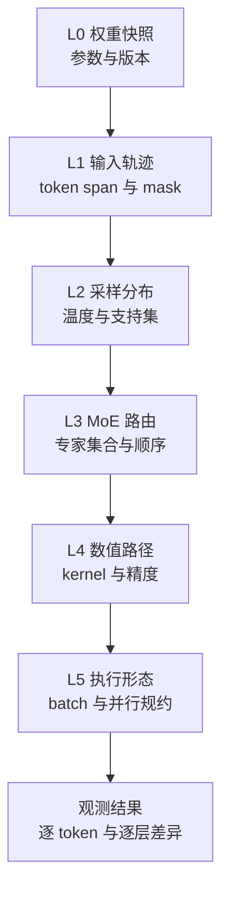

# slime 训推一致性分析：相同权重只是诊断起点

> **源码基线**：slime `main@681b3adca54105d5ecd3fb822fa0dc58a427e0f9`
> **文档与测试基线**：同一提交下 `docs/zh/advanced/reproducibility.md`、`docs/zh/developer_guide/{debug,ci}.md` 与 `tests/`
> **核验日期**：2026-08-18 · **系列**：[[02_engineering/04_posttrain_frameworks/slime/index|slime 源码分析]]
> **结论先行**：训推一致性不是“权重同步成功”这一个布尔条件，而是一条逐层收紧的证据链。即使训练侧与 rollout 侧的参数逐元素相等，二者仍可能使用不同的输入 token、采样候选集、MoE 专家及其顺序、kernel/精度，以及不同的批次和并行规约路径。slime 因而同时提供行为策略元数据、输入回放、路由重放、对齐钩子、逐层数据导出和分级 CI；代价是更多元数据、额外前向计算与磁盘写入、受限的 kernel/拓扑，以及只在特定 GLM-5 软件栈上成立的严格门禁。
> **叙事顺序**：本页按五拍组织——背景 → 为什么这么设计（含被否掉的替代）→ 实现思路与细节 → 约束 → 发展趋势。
> **最近更新**：2026-08-27。按五拍重排章节顺序；机制正文与既有引用未改——既有引用**未**重新核验，故上方**核验日期**不变；本次新增的引用均已在该基线下逐条打开核对。

本文把三类结论分开：**源码事实**和**项目文档事实**都带 fixed-commit 定位符；标为“分析判断”的内容是根据实现约束和失败路径作出的推断，不代表项目作者原话。

## 1. 背景：为什么权重相等仍不能证明行为相等

对已生成 token $y_t$，最直接的比较量是

$$
\delta_t=
\left\lvert
\log p_{\mathrm{train}}(y_t\mid h_t)
-
\log p_{\mathrm{rollout}}(y_t\mid h_t)
\right\rvert.
$$

这里的历史 $h_t$、条件分布、专家路径和浮点执行路径必须同时有可比语义；只比较参数张量并没有固定其中任何一项。源码确实提供 `--check-weight-update-equal`：rollout 初始化时先 snapshot/reset，首次 push 后再 compare，但这个检查只回答“训练权重是否正确到达推理引擎”。[`placement_group.py:246-248`](https://github.com/THUDM/slime/blob/681b3adca54105d5ecd3fb822fa0dc58a427e0f9/slime/ray/placement_group.py#L246-L248) [`train.py:26-30`](https://github.com/THUDM/slime/blob/681b3adca54105d5ecd3fb822fa0dc58a427e0f9/train.py#L26-L30)

### 1.1 六层诊断模型

| 层 | 要守住的不变量 | 主要比较或重放钩子 | 常见症状 | 为什么上一层通过仍不够 |
|---|---|---|---|---|
| L0 权重快照 | 一次比较使用同一完整参数版本 | 权重比较、引擎版本、`weight_versions` | 乱码、突变、整段大偏差 | 相同参数仍可能使用不同 token |
| L1 输入轨迹 | prompt/response token、位置和 mask 一一对应 | 按 Sample 对齐 rollout/训练数据导出结果 | 首个错位点后全段偏差 | token 相同不代表采样候选集相同 |
| L2 采样分布 | temperature 与 token 支持集一致 | selected-token logprob、top-p ids/offsets | 偏差随截断或温度系统漂移 | 同支持集仍可能选不同专家 |
| L3 MoE 路由 | 每 token、每层的 expert id 与 top-k 顺序一致 | routed-expert metadata、R3、ordered-top-k capture | 只在 MoE 层起跳或稀疏爆点 | 同专家不代表 expert 内数值路径相同 |
| L4 数值路径 | attention/GEMM/norm/KV/量化路径语义一致 | alignment hooks、layer/module dump | 小误差逐层放大 | 同算子族仍会被 batch/分片改变规约树 |
| L5 执行形态 | batch shape、TP/PP/CP/EP 下结果满足目标不变性 | debug replay、parallel check、端到端 gate | 改 batch 或并行度才出现漂移 | 这是完整执行图层，不能由局部 kernel 证明 |

> **分析判断**：这是一条“先排除离散错误，再定位连续数值误差”的顺序。token、支持集和 expert id 一旦不同，后续 hidden state 已不再是在比较同一计算；此时先调 deterministic kernel，只会让两条不同轨迹各自稳定地重复。

## 2. 为什么这么设计：一致性被做成可分层开关的证据链，而不是一个 bitwise 总开关

先把取舍摆在机制前面。“让训推一致”有几个更直观的做法，固定基线一个都没有当作默认路径，判据只有一条：**要对齐的不是“更准的数值”，而是另一台引擎的同一条数值路径；而这条路径只有被拆成可以单独打开、单独失败的层，才可能被定位。**

| 直觉方案 | 为什么看似可行 | 固定基线为什么不这么走 |
|---|---|---|
| **让训练侧算得更“准”**：把 LM head 之类抬到 FP32 | 训练侧本就有更高精度路径，改一个 dtype 即可 | 官方文档在列举 GLM-5 支持项时把判据直接写进括号：MoE router 用 fp32，但 LM head 在训练与 rollout 两侧都保持 bf16——带来对齐的是**精度匹配**，不是精度更高。[`reproducibility.md:61`](https://github.com/THUDM/slime/blob/681b3adca54105d5ecd3fb822fa0dc58a427e0f9/docs/zh/advanced/reproducibility.md#L61) |
| **把整个训练栈改成 bitwise 确定** | 一次覆盖所有层，不必分层排查 | 对齐被实现成**可选装的替换层**，而不是新的默认训练路径：DeepGEMM 对齐模块的 docstring 自称 “an opt-in numerical-alignment hook”，只替换被选中的 Transformer Engine linear；而且只对齐 forward（SGLang 式 block-FP8），backward 仍走显式 BF16 GEMM 与解析式 norm 梯度。[`deepgemm_forward.py:1-8`](https://github.com/THUDM/slime/blob/681b3adca54105d5ecd3fb822fa0dc58a427e0f9/slime/backends/megatron_utils/alignment/deepgemm_forward.py#L1-L8) |
| **一上来就在目标拓扑上全开** | 省掉逐层定界 | 第一版实现反而主动**缩小**范围以排除混杂变量：它要求 tensor parallel size 为 1，使每个目标是一整块矩阵，对上 SGLang 的 dense-TP1 执行，从而把 row-parallel 部分和舍入排除在外（源码写作 “as a confounder”）。[`deepgemm_forward.py:10-12`](https://github.com/THUDM/slime/blob/681b3adca54105d5ecd3fb822fa0dc58a427e0f9/slime/backends/megatron_utils/alignment/deepgemm_forward.py#L10-L12) 同样的窄化出现在 router 覆写上：只覆盖由 DeepEP alignment bridge 注册的、非 grouped 的 router，其余训练路径保留 Megatron 原语义。[`routing_replay.py:56-68`](https://github.com/THUDM/slime/blob/681b3adca54105d5ecd3fb822fa0dc58a427e0f9/slime/utils/routing_replay.py#L56-L68) |
| **直接用重要性校正把差异抹平** | 已经有 TIS / rollout logprob，不必先证明一致 | 参数校验直接禁止把两种“替换 old policy”的做法叠在一起：`use_rollout_logprobs` 与 `use_tis` 不能同时开启。校正因此是最后一步，而不是替代诊断的开关（见第 11.1 节）。[`arguments.py:1849-1850`](https://github.com/THUDM/slime/blob/681b3adca54105d5ecd3fb822fa0dc58a427e0f9/slime/utils/arguments.py#L1849-L1850) |
| **把每步完整词表 logits 存下来做精确重放** | 重放最彻底，什么都能复原 | `Sample` 只保存选中 token 的 `rollout_log_probs`、ragged 的 top-p nucleus ids/offsets 和 routed experts；字段注释写明第 $i$ 个 response token 的候选集是 `rollout_top_p_token_ids[offsets[i]:offsets[i + 1]]`。[`types.py:121-126`](https://github.com/THUDM/slime/blob/681b3adca54105d5ecd3fb822fa0dc58a427e0f9/slime/utils/types.py#L121-L126) 它保存的是**重建 behavior 分布所必需的最小集合**，代价是这套元数据只覆盖 top-p、不覆盖 top-k（见第 5 节末的警告框）。 |

源码还明确划出一条职责边界：共享的对齐环境变量被集中到一个模块，而集群相关的连通性设置（`PYTHONPATH`、`MASTER_ADDR`、网卡名、代理、IBGDA handler）被写明 “intentionally not here”，交给 launcher 负责。[`env.py:1-7`](https://github.com/THUDM/slime/blob/681b3adca54105d5ecd3fb822fa0dc58a427e0f9/slime/backends/megatron_utils/alignment/env.py#L1-L7) 也就是说“可复现”被切成两半：数值语义归框架，部署环境归调用方——这解释了为什么第 9 节要把三种确定性分开讲。

> [!note] 推断
> 上面每一条取舍都能在源码或官方文档里找到原话，**但源码没有在任何一处写下“因此一致性应组织成 L0→L5 六层”这句总结**。第 1.1 节的六层模型，以及本页此后按层推进的顺序，是据实现形态与失败路径重建的组织方式，不代表项目作者原话。它之所以站得住，是因为每一层恰好对应源码中一个可以**单独开关、单独失败**的机制：`--check-weight-update-equal`（L0）、rollout/train dump 与 `--load-debug-rollout-data`（L1）、top-p 元数据与训练侧重算（L2）、R3 与 ordered-top-k capture（L3）、alignment hooks 与 layerwise dumper（L4）、`parallel_check` 与端到端 gate（L5）。若其中某一层将来被合并进另一层，这条分层就需要重画。

## 3. L0 权重快照：必要，但只证明参数提交

**问题背景与不变量。** rollout 不能读到缺 bucket 或跨版本的参数快照。disk 更新路径会 pause generation、flush cache、reload，并在 CI 模式逐 engine 比较加载后的 `weight_version`，成功后才恢复生成。[`actor_group.py:227-266`](https://github.com/THUDM/slime/blob/681b3adca54105d5ecd3fb822fa0dc58a427e0f9/slime/ray/actor_group.py#L227-L266) Sample 又把 SGLang 返回的 `weight_version` 追加到列表，使 partial 或多段 response 能暴露跨版本边界。[`types.py:397-416`](https://github.com/THUDM/slime/blob/681b3adca54105d5ecd3fb822fa0dc58a427e0f9/slime/utils/types.py#L397-L416)

**证据钩子与症状。** 先执行 weight compare，再检查 engine version 和每条 Sample 的 `weight_versions`。失败通常表现为生成突然失真、所有 token 的 logprob 都大幅偏离，或一次轨迹出现多个版本。

**为什么仍不够。** 参数相等只固定函数的参数，没有固定函数输入。聊天模板、tokenizer、partial 前缀、位置或 response span 任何一项不同，后续比较都不是同一个 $h_t$。

> **边界**：本页只把权重相等当作 L0 门槛；pause/flush、拓扑转换和 transport 的完整提交协议由 [[16_slime_weight_sync_analysis]] 负责。

## 4. L1 输入轨迹：先证明两侧在算同一个 token

**问题背景与不变量。** rollout 是文本、工具观察和异步请求的世界，训练侧则按 response span、mask 和并行 schedule 重组 tensor。`Sample.append_response_tokens` 要求新 token 与 logprob 等长；可训练 token 缺 logprob、不可训练 token 携带 logprob 都会报错，工具 token 只填 0 占位并以 `loss_mask=0` 排除训练。[`types.py:253-302`](https://github.com/THUDM/slime/blob/681b3adca54105d5ecd3fb822fa0dc58a427e0f9/slime/utils/types.py#L253-L302) 每次追加还会校验 mask、rollout logprob 与 top-p offsets 的长度关系。[`types.py:418-443`](https://github.com/THUDM/slime/blob/681b3adca54105d5ecd3fb822fa0dc58a427e0f9/slime/utils/types.py#L418-L443)

**证据钩子与症状。** rollout dump 保存 `Sample.to_dict()` 后的完整 samples；train dump 的 version-2 payload 用 `rollout_position` 优先、`sample_index` 次之恢复全局顺序，并保留 DP/micro-batch layout。[`rollout.py:703-720`](https://github.com/THUDM/slime/blob/681b3adca54105d5ecd3fb822fa0dc58a427e0f9/slime/ray/rollout.py#L703-L720) [`train_dump_utils.py:112-188`](https://github.com/THUDM/slime/blob/681b3adca54105d5ecd3fb822fa0dc58a427e0f9/slime/backends/megatron_utils/train_dump_utils.py#L112-L188) 比较时应先 join sample，再核对 tokens、response length、loss mask 和位置；典型症状是从首个 token 错位处开始整段差异，而不是孤立的小数误差。

**为什么 L0 通过仍不够。** 同一权重对不同 token 序列给出不同 logits 是正常行为；因此 weight compare 不能替代输入 dump 对账。

### 4.1 调试回放固定的是训练输入，不是生成时的随机过程

`--load-debug-rollout-data` 直接反序列化已保存 Sample，并跳过新的 rollout；可选 subsample 也只是从 dump 取首尾子集。[`rollout.py:671-684`](https://github.com/THUDM/slime/blob/681b3adca54105d5ecd3fb822fa0dc58a427e0f9/slime/ray/rollout.py#L671-L684) 官方 debug 文档把它的用途明确写成“固定训练部分输入，去除 rollout 随机性”，并区分 rollout-only 与 train-only。[`debug.md:26-49`](https://github.com/THUDM/slime/blob/681b3adca54105d5ecd3fb822fa0dc58a427e0f9/docs/zh/developer_guide/debug.md#L26-L49)

> **分析判断**：这类回放适合回答“同一批 Sample 更换并行度或 kernel 后是否仍得到相同训练行为”，但不能回答“重新采样能否产生同一 response”；后者还需要固定采样随机种子，并使用确定性的推理 kernel。

## 5. L2 采样分布：相同 token 也可能来自不同支持集

**问题背景与不变量。** rollout 对 logits 使用 temperature、top-p 和 top-k。若第 $t$ 步保留集合为 $S_t$，behavior distribution 可写成

$$
q_t(v)=
\frac{
\exp\!\left(z_{t,v}/T\right)\mathbf{1}[v\in S_t]
}{
\sum_{u\in S_t}\exp\!\left(z_{t,u}/T\right)
}.
$$

训练侧即使对同一已采样 token 重算 full-softmax，也没有在重建这个 $q_t$。SGLang 请求传入 temperature/top-p/top-k 并要求返回 selected-token logprob；top-p 非 1 时还请求每 token 的 nucleus ids。[`sglang_rollout.py:94-107`](https://github.com/THUDM/slime/blob/681b3adca54105d5ecd3fb822fa0dc58a427e0f9/slime/rollout/sglang_rollout.py#L94-L107) [`sglang_rollout.py:175-182`](https://github.com/THUDM/slime/blob/681b3adca54105d5ecd3fb822fa0dc58a427e0f9/slime/rollout/sglang_rollout.py#L175-L182)

**源码事实：行为策略元数据是完成重放所需的最小数据。** `Sample` 保存选中 token 的 `rollout_log_probs`、不等长的 top-p ids/offsets 和路由专家，而不是保存每一步的完整词表 logits。[`types.py:114-128`](https://github.com/THUDM/slime/blob/681b3adca54105d5ecd3fb822fa0dc58a427e0f9/slime/utils/types.py#L114-L128) 转换器只在字段存在或功能已开启时，才把这些条件字段送入训练器；启用 top-p 却缺少相应数据时，会在转换或 loss 入口报错，不会静默退回完整 softmax。[`rollout.py:828-852`](https://github.com/THUDM/slime/blob/681b3adca54105d5ecd3fb822fa0dc58a427e0f9/slime/ray/rollout.py#L828-L852) [`loss.py:83-94`](https://github.com/THUDM/slime/blob/681b3adca54105d5ecd3fb822fa0dc58a427e0f9/slime/backends/megatron_utils/loss.py#L83-L94)

训练重算先按 rollout temperature 缩放 logits，再依据 ragged nucleus 为 response row 建 keep mask；该 mask 覆盖 CP 本地、CP all-gather 与 TP vocab shard 情形。[`loss.py:349-429`](https://github.com/THUDM/slime/blob/681b3adca54105d5ecd3fb822fa0dc58a427e0f9/slime/backends/megatron_utils/loss.py#L349-L429) [`loss.py:513-589`](https://github.com/THUDM/slime/blob/681b3adca54105d5ecd3fb822fa0dc58a427e0f9/slime/backends/megatron_utils/loss.py#L513-L589)

**证据钩子与症状。** 先核对 sampling params，再比较逐 token rollout/train logprob；训练 loss 会报告 `train_rollout_logprob_abs_diff`。[`loss.py:1136-1151`](https://github.com/THUDM/slime/blob/681b3adca54105d5ecd3fb822fa0dc58a427e0f9/slime/backends/megatron_utils/loss.py#L1136-L1151) 若偏差只在 temperature 或 top-p 打开后系统出现，应先查支持集 replay，而不是直接归因于权重或 kernel。

**为什么 L1 通过仍不够。** 同一 token 可以同时属于 full-softmax 和 nucleus，但它在两个归一化域中的概率不同；token ids 相等不等于 behavior distribution 相等。

> [!warning] 文档/接口能力与实现闭环不同
> CLI 和 SGLang 请求都支持 `rollout_top_k`，但固定基线的通用 `Sample` 字段与训练重放只实现 top-p nucleus ids/offsets，没有 top-k 支持集 payload。[`arguments.py:343-353`](https://github.com/THUDM/slime/blob/681b3adca54105d5ecd3fb822fa0dc58a427e0f9/slime/utils/arguments.py#L343-L353) [`types.py:121-126`](https://github.com/THUDM/slime/blob/681b3adca54105d5ecd3fb822fa0dc58a427e0f9/slime/utils/types.py#L121-L126) 因此“能用 top-k 采样”不能写成“训练侧已能 exact replay top-k distribution”。

## 6. L3 MoE 路由：专家集合相同还不够，顺序也会进入数值语义

**问题背景与不变量。** MoE 的离散路径要求每个 response token、每个 MoE layer 的 top-k expert id 对齐。SGLang 可返回 `[token, layer, topk]` 路由；Sample 在 partial append 时按 `routed_experts_start_len` 拼接，并检查 token 行数、层数与 router top-k。[`types.py:352-395`](https://github.com/THUDM/slime/blob/681b3adca54105d5ecd3fb822fa0dc58a427e0f9/slime/utils/types.py#L352-L395) RolloutManager 还会拒绝维度错误、空 capture，以及 MoE 层全零的可疑 PP capture，避免把缺失数据误当成 expert 0。[`rollout.py:107-140`](https://github.com/THUDM/slime/blob/681b3adca54105d5ecd3fb822fa0dc58a427e0f9/slime/ray/rollout.py#L107-L140)

**源码事实：R3 强制重放离散路由。** actor 把 rollout 路由按 PP/VP 本地层写入各 `RoutingReplay`，再在 old-actor forward 和 backward 分别消费；每个 router 的 forward/backward 消费次数不等于记录数会报错。[`actor.py:307-354`](https://github.com/THUDM/slime/blob/681b3adca54105d5ecd3fb822fa0dc58a427e0f9/slime/backends/megatron_utils/actor.py#L307-L354) [`routing_replay.py:78-140`](https://github.com/THUDM/slime/blob/681b3adca54105d5ecd3fb822fa0dc58a427e0f9/slime/utils/routing_replay.py#L78-L140)

**源码事实：严格 GLM-5 对齐不依赖 R3。** alignment bridge 只对已注册、非 grouped router 使用与 SGLang 一致的 `torch.topk(sorted=False)`；注释明确指出，即使 expert set 相同，top-k column 顺序也会改变 DeepEP owner 的 BF16 累加顺序。[`routing_replay.py:49-75`](https://github.com/THUDM/slime/blob/681b3adca54105d5ecd3fb822fa0dc58a427e0f9/slime/utils/routing_replay.py#L49-L75) 维护的 GLM-5 e2e gate 显式断言没有启用 rollout routing replay，以验证真实 router 与 experts 都参与训练。[`test_glm52_6layer_deterministic_e2e.py:417-434`](https://github.com/THUDM/slime/blob/681b3adca54105d5ecd3fb822fa0dc58a427e0f9/tests/test_glm52_6layer_deterministic_e2e.py#L417-L434)

**证据钩子与症状。** 先比较 expert set，再比较 top-k 顺序，最后看第一处分叉是否落在 MoE 层。典型症状是 dense 层一致、进入首个 MoE 层后出现稀疏大偏差，或 expert id 相同但 combine 输出已有细小误差。

**为什么 L2 通过仍不够。** 相同采样支持集只约束 LM head 的输出分布定义；隐藏层中的 router 仍可能因微小数值差异跨过 top-k 边界，选择另一条计算图。

> **分析判断**：R3 是强诊断/校正手段，不是“原生训推路由相等”的证据。它能把离散 expert id 固定下来，却也会掩盖 router 本身为何分叉；因此应同时保留“自然路由 gate”和“强制 replay 定界”两种测试。

## 7. L4 kernel 与精度：路由相同后，数值仍可能逐层偏离

**问题背景与不变量。** dense/MoE GEMM、attention、RMSNorm、LM head、KV cache 和量化链都可能改变舍入与规约顺序。官方文档把严格 train/rollout logprob alignment 限定为 **GLM-5 结构**，要求 deterministic SGLang、batch-invariant DeepGEMM/DeepEP 和专用 Megatron patch；支持范围包括 DSA、block-FP8 forward、BF16 backward、FP32 router、匹配精度的 BF16 LM head 和 BF16/FP8 KV cache。[`reproducibility.md:53-69`](https://github.com/THUDM/slime/blob/681b3adca54105d5ecd3fb822fa0dc58a427e0f9/docs/zh/advanced/reproducibility.md#L53-L69)

**源码事实：alignment utilities 是显式替换层。** shared env 固定 CUBLAS/NCCL/Transformer Engine 行为，开启 DeepGEMM batch invariance、DeepEP/DSA 配置，并指示 Megatron 借用 SGLang 的 RMS、router、RoPE 与 sparse MLA 路径。[`env.py:19-56`](https://github.com/THUDM/slime/blob/681b3adca54105d5ecd3fb822fa0dc58a427e0f9/slime/backends/megatron_utils/alignment/env.py#L19-L56) combined hook 再安装 global batch-invariant ops、各 RMSNorm、dense/MoE forward、router GEMM、DeepEP bridge 与可选 layerwise dump。[`deepgemm_forward.py:1110-1147`](https://github.com/THUDM/slime/blob/681b3adca54105d5ecd3fb822fa0dc58a427e0f9/slime/backends/megatron_utils/alignment/deepgemm_forward.py#L1110-L1147)

DeepGEMM 对齐 forward 还复制 SGLang 的 block-FP8 量化路径；Blackwell 分支必须复现 quantize→requantize 的有损链，单次量化不会 bit-match rollout。[`deepgemm_forward.py:460-502`](https://github.com/THUDM/slime/blob/681b3adca54105d5ecd3fb822fa0dc58a427e0f9/slime/backends/megatron_utils/alignment/deepgemm_forward.py#L460-L502)

**证据钩子与症状。** layerwise dumper 记录 input ids、packed sequence offsets 和选定 decoder/module 输出；缺 input 或缺选定层会立即失败。[`layerwise_alignment.py:41-113`](https://github.com/THUDM/slime/blob/681b3adca54105d5ecd3fb822fa0dc58a427e0f9/slime/backends/megatron_utils/alignment/layerwise_alignment.py#L41-L113) 第一处分叉若稳定落在 attention、norm、GEMM 或 KV 边界，才有资格继续做 kernel/precision 二分。

**为什么 L3 通过仍不够。** route ids 只决定调用哪些 experts，不决定 expert GEMM 的量化、输入 dtype、累加次序或 combine 精度；相同专家仍可产生不同 hidden states。

## 8. L5 批次与并行执行：同名 kernel 也可能采用不同的规约顺序

**问题背景与不变量。** rollout 的 continuous batching、SGLang TP/DP/EP 与训练的 dynamic micro-batch、TP/PP/CP/EP 会改变 shape、分片和 collective 顺序。strict alignment 的 global batch-invariant hook 之所以不仅设置 DeepGEMM，是因为 Megatron 与 SGLang 分属不同进程，RMS reduction、BMM、FP32 matmul 和 log-softmax 仍可能走普通 batch-shaped kernel。[`deepgemm_forward.py:690-711`](https://github.com/THUDM/slime/blob/681b3adca54105d5ecd3fb822fa0dc58a427e0f9/slime/backends/megatron_utils/alignment/deepgemm_forward.py#L690-L711)

pipeline 也不是透明维度：每个 PP stage 的首个本地 layer 没有本地前序 residual sum，因此对齐 hook 必须在每个 PP 边界替换 standalone RMSNorm，而不能只处理 global layer 0。[`deepgemm_forward.py:736-752`](https://github.com/THUDM/slime/blob/681b3adca54105d5ecd3fb822fa0dc58a427e0f9/slime/backends/megatron_utils/alignment/deepgemm_forward.py#L736-L752) 最初的 dense DeepGEMM probe 甚至明确限制 TP=1，以排除 row-parallel partial-sum rounding 这个混杂变量。[`deepgemm_forward.py:1-12`](https://github.com/THUDM/slime/blob/681b3adca54105d5ecd3fb822fa0dc58a427e0f9/slime/backends/megatron_utils/alignment/deepgemm_forward.py#L1-L12) [`deepgemm_forward.py:580-588`](https://github.com/THUDM/slime/blob/681b3adca54105d5ecd3fb822fa0dc58a427e0f9/slime/backends/megatron_utils/alignment/deepgemm_forward.py#L580-L588)

**证据钩子与症状。** 固定 rollout dump，改变训练并行配置与 dynamic batching，再比较 grad norm 或逐层输出。当前 `parallel_check` 覆盖 DP、TP2/PP2/CP2 组合以及 TP4、PP4、CP4，并复用同一 rollout dump。[`test_qwen3_0.6B_parallel_check.py:12-21`](https://github.com/THUDM/slime/blob/681b3adca54105d5ecd3fb822fa0dc58a427e0f9/tests/test_qwen3_0.6B_parallel_check.py#L12-L21) [`test_qwen3_0.6B_parallel_check.py:104-142`](https://github.com/THUDM/slime/blob/681b3adca54105d5ecd3fb822fa0dc58a427e0f9/tests/test_qwen3_0.6B_parallel_check.py#L104-L142) 失败若只随 batch size、packing 或某一并行维度出现，应优先查 shape-dependent kernel 和 collective，而不是重做权重同步。

**为什么 L4 通过仍不够。** “两侧都调用某种 GEMM/attention”没有固定输入分块和 reduction tree。除非算子本身满足 batch invariance，或端到端测试覆盖目标拓扑，否则局部 kernel 对齐不能推出完整并行执行对齐。

## 9. 确定性推理能保证到什么范围

**项目文档事实。** reproducibility 文档把 SGLang deterministic inference 与 Megatron deterministic mode 组合成 bitwise experiment reproduction recipe，要求使用 FlashInfer、卸载 FlashAttention 3，并设置 NCCL、Transformer Engine 与 CUBLAS 环境变量。[`reproducibility.md:3-26`](https://github.com/THUDM/slime/blob/681b3adca54105d5ecd3fb822fa0dc58a427e0f9/docs/zh/advanced/reproducibility.md#L3-L26)

**源码事实。** rollout 开启 deterministic inference 后，为同一 prompt group 中第 $i$ 条 sample 设置 `rollout_seed+i`；训练端 deterministic mode 则固定 cudnn 选择并要求 PyTorch 使用确定性算法，缺确定性实现时不是 warn-only。[`sglang_rollout.py:109-112`](https://github.com/THUDM/slime/blob/681b3adca54105d5ecd3fb822fa0dc58a427e0f9/slime/rollout/sglang_rollout.py#L109-L112) [`sglang_rollout.py:317-327`](https://github.com/THUDM/slime/blob/681b3adca54105d5ecd3fb822fa0dc58a427e0f9/slime/rollout/sglang_rollout.py#L317-L327) [`initialize.py:88-93`](https://github.com/THUDM/slime/blob/681b3adca54105d5ecd3fb822fa0dc58a427e0f9/slime/backends/megatron_utils/initialize.py#L88-L93)

> [!important] 不能把三种确定性混成一个开关
> 1. **rollout 自身可复现**：固定请求、seed 与 SGLang deterministic stack，重复生成稳定；
> 2. **training 自身可复现**：固定训练输入与 Megatron deterministic stack，重复执行稳定；
> 3. **train/rollout cross-engine alignment**：两套引擎对同一 token 的 logprob 或 hidden state 对齐。
>
> 前两项各自成立不能自动推出第三项。固定基线把第三项的严格支持明确限定在 GLM-5 专用 alignment stack，而不是所有模型/backend 的普遍保证。[`reproducibility.md:53-78`](https://github.com/THUDM/slime/blob/681b3adca54105d5ecd3fb822fa0dc58a427e0f9/docs/zh/advanced/reproducibility.md#L53-L78)

## 10. CI 如何把“看起来一致”变成分级证据

固定 workflow 的 CPU matrix 注册了 Sample、rollout validation、train dump、layerwise comparison 等契约测试；GPU matrix则单独注册并行检查和 GLM-5 两级 gate。[`.github/workflows/pr-test.yml.j2:65-112`](https://github.com/THUDM/slime/blob/681b3adca54105d5ecd3fb822fa0dc58a427e0f9/.github/workflows/pr-test.yml.j2#L65-L112)

| 门禁 | 固定了什么 | 断言 | 能证明什么 | 不能证明什么 |
|---|---|---|---|---|
| CPU 接口测试 | Sample/top-p/routing 数据形状与比较工具 | 异常输入会失败、比较逻辑正确 | 元数据约定与诊断工具不会静默失真 | 真实 GPU kernel 一致 |
| parallel check | 同一 rollout dump，不同 DP/TP/PP/CP | grad norm 近似相等 | 目标 Qwen 配置下并行训练结果不过度漂移 | 逐 token、逐位训推对齐 |
| GLM-5 e2e | 真实 weight update、DSA、FP8 DeepGEMM、DeepEP EP8 | mean train/rollout logprob abs diff 小于 `1e-6` | 该固定 recipe 的最终 behavior gate | 其他模型、拓扑、backend |
| GLM-5 layerwise | 同一短序列，decoder layer 0–5 | 所有匹配 hidden element 最大误差为 0 | 首六层边界 bitwise 对齐 | 长生成最终分布与训练更新 |

GLM-5 e2e 的 fixture 是单机 EP8、3 dense + 3 MoE layer，配置明确开启 deterministic SGLang、FP8 KV、DeepEP 和 alignment hooks。[`test_glm52_6layer_deterministic_e2e.py:178-257`](https://github.com/THUDM/slime/blob/681b3adca54105d5ecd3fb822fa0dc58a427e0f9/tests/test_glm52_6layer_deterministic_e2e.py#L178-L257) 测试在 actor 内执行阈值断言，layerwise 变体再用 `max-hidden-diff 0` 比较 0–5 层。[`test_glm52_6layer_deterministic_e2e.py:305-387`](https://github.com/THUDM/slime/blob/681b3adca54105d5ecd3fb822fa0dc58a427e0f9/tests/test_glm52_6layer_deterministic_e2e.py#L305-L387)

> [!note] CI 文档描述与实际门禁粒度
> CI 文档把 `run-ci-precision` 概括为“不同并行设置下的数值一致性”；固定 workflow 中该 job 实际只注册 `test_qwen3_0.6B_parallel_check.py`。[`ci.md:84-94`](https://github.com/THUDM/slime/blob/681b3adca54105d5ecd3fb822fa0dc58a427e0f9/docs/zh/developer_guide/ci.md#L84-L94) [`.github/workflows/pr-test.yml.j2:48-53`](https://github.com/THUDM/slime/blob/681b3adca54105d5ecd3fb822fa0dc58a427e0f9/.github/workflows/pr-test.yml.j2#L48-L53) 该测试最终比较 grad norm，容差为 `rel_tol=abs_tol=0.01`，所以它是并行训练近似一致门禁，不是 bitwise logprob gate。[`model.py:917-936`](https://github.com/THUDM/slime/blob/681b3adca54105d5ecd3fb822fa0dc58a427e0f9/slime/backends/megatron_utils/model.py#L917-L936)

## 11. 约束：更强确定性的成本与退化边界

下表中带定位符的是实现明确行为；其余成本是由 payload 形状、执行次数和受限配置直接推导的**分析判断**。

| 强化手段 | 得到的诊断能力 | 代价或限制 |
|---|---|---|
| 保存 rollout/train dump | 固定输入并逐 sample 对账 | CPU/磁盘 I/O、存储与敏感数据治理成本 |
| 行为策略元数据 | 重建选中 token 的概率、top-p 候选集与路由 | 每个 token 都要传输元数据；top-p/routing 数据量随序列长度、层数和 top-k 增长 |
| mismatch 重算 | 直接观测 train/rollout logprob 差 | 某些配置需额外训练侧 forward；实现会明确记录这一点 [`arguments.py:1849-1860`](https://github.com/THUDM/slime/blob/681b3adca54105d5ecd3fb822fa0dc58a427e0f9/slime/utils/arguments.py#L1849-L1860) |
| R3 routing replay | 隔离 MoE 离散路由差异 | 保存/搬运 per-token、per-layer expert ids，并不能证明自然 router 对齐 |
| 确定性算法 | 多次运行结果稳定，无法确定执行时立即暴露错误 | 禁止没有确定性实现的算子，限制可选 kernel；当前示例还要求使用 FlashInfer/移除 FA3 |
| GLM-5 alignment stack | layerwise zero 与低于 `1e-6` 的 e2e gate | 模型结构、patch、DeepGEMM/DeepEP、KV dtype 和部分拓扑受限；dense probe 起步为 TP1 |

> **分析判断**：确定性越强，吞吐优化器可自由选择的算法、batch shape 与通信路径越少；但固定基线没有给出一项可泛化到所有模型的统一性能税，因此不应在这里编造百分比。工程上更稳妥的是分级启用：日常记录轻量 behavior 指标，异常时先 replay 固定输入，再在可复现的小模型/短序列上打开 layerwise 与严格 kernel stack。

### 11.1 无法严格对齐时，校正不是证明

slime 可以用 rollout logprob 作为 behavior old policy，或重算 train old logprob 后做 mismatch/TIS；参数校验禁止 `use_rollout_logprobs` 与 `use_tis` 同时开启。[`arguments.py:1050-1082`](https://github.com/THUDM/slime/blob/681b3adca54105d5ecd3fb822fa0dc58a427e0f9/slime/utils/arguments.py#L1050-L1082) [`arguments.py:1849-1859`](https://github.com/THUDM/slime/blob/681b3adca54105d5ecd3fb822fa0dc58a427e0f9/slime/utils/arguments.py#L1849-L1859)

> **分析判断**：importance correction 能降低已测量的 behavior mismatch 对目标函数的偏差，却不能修复错 token、缺 metadata、混权重版本或错误 expert capture。校正后的 loss 是否正确属于 [[15_slime_loss_parallelism_analysis]]；本页只负责证明被比较的两条概率路径语义可比。

## 12. 最小排查流程

这是一条逐层排除链：上层身份或版本没有通过时，不应直接下钻 kernel，更不能先用 importance correction 掩盖输入契约错误。

1. **权重**：先跑 `check_weight_update_equal`，再查 engine version 与 Sample `weight_versions`；失败就停在 L0。
2. **输入**：保存 rollout/train dump，按 `rollout_position` 或 `sample_index` join，逐项比较 tokens、response span 和 mask。
3. **采样**：核对 temperature、top-p/top-k；top-p 非 1 时确认 ids/offsets 完整，再看逐 token logprob 差。
4. **路由**：MoE 先比 expert set，再比 top-k order；必要时用 R3 固定路由来判断差异是否来自 router。
5. **kernel/精度**：从第一处 layerwise 分叉二分到 attention、norm、GEMM、KV 或量化边界。
6. **并行执行**：用同一 dump 改变 batch/packing/TP/PP/CP/EP，只在目标拓扑上声明通过。
7. **校正**：前六层已确定 mismatch 来源与规模后，才选择 rollout logprob、TIS 或 rejection；不要用算法修正掩盖契约错误。

官方 debug 指南同样建议从首步 rollout/ref logprob、推一训一 KL 和固定输入的 rollout-only/train-only 开始，而不是直接把异常归因于 RL loss。[`debug.md:3-24`](https://github.com/THUDM/slime/blob/681b3adca54105d5ecd3fb822fa0dc58a427e0f9/docs/zh/developer_guide/debug.md#L3-L24) [`debug.md:26-55`](https://github.com/THUDM/slime/blob/681b3adca54105d5ecd3fb822fa0dc58a427e0f9/docs/zh/developer_guide/debug.md#L26-L55)

## 13. 发展趋势

本节离开“固定基线是什么”，因此只写有源码注释可锚定的在途改动，整节标为推断。

> [!note] 推断：锚点是源码注释原文，方向判断是本页的重建
> **“权重相等就该 KL 为零”这条直觉，在固定基线自己的 CI 里留着两处未定性的残差。** 其一，rollout 侧首轮 `log_probs` 与 `ref_log_probs` 的严格相等断言被注释掉、改成 `< 1e-8` 的容差，并挂着 `# TODO: figure out why there is a small numerical difference in log_probs and ref_log_probs in CI test, and whether it's expected or not.`。[`data.py:361-363`](https://github.com/THUDM/slime/blob/681b3adca54105d5ecd3fb822fa0dc58a427e0f9/slime/backends/megatron_utils/data.py#L361-L363) 其二，PPO 配合 KL clipping 时首步 `ppo_kl` 同样不严格为零，断言上方写着 `# TODO: figure out why KL is not exactly zero when using PPO loss with KL clipping, and whether this is expected behavior or a bug.`。[`model.py:903-904`](https://github.com/THUDM/slime/blob/681b3adca54105d5ecd3fb822fa0dc58a427e0f9/slime/backends/megatron_utils/model.py#L903-L904)
>
> 值得对照的是：同样两处代码里另有一条**已经**被解释清楚的不相等——R3 为 actor 前向重放 rollout 路由，而 reference 前向有意走自然路由，因此初始 actor/ref KL 本就不应逐位为零；源码把这条原因单独写成注释，并据此放宽断言。[`data.py:350-353`](https://github.com/THUDM/slime/blob/681b3adca54105d5ecd3fb822fa0dc58a427e0f9/slime/backends/megatron_utils/data.py#L350-L353) [`model.py:905-907`](https://github.com/THUDM/slime/blob/681b3adca54105d5ecd3fb822fa0dc58a427e0f9/slime/backends/megatron_utils/model.py#L905-L907)
>
> **由此可推断**：两条 TODO 的存在方式（注释掉严格断言、保留容差、写明“不知道是否符合预期”）说明项目自己仍把“零残差”当作尚未达成、而非已经放弃的目标；后续要么它们被归因并收紧断言，要么被改写成显式的容差契约。在此之前，把这里的 `1e-8` 读成“本应为零的舍入噪声”会误判：本页第 1 节那句“权重相等不能证明行为相等”在这里不是方法论主张，而是项目 CI 中两条尚未定性的实测残差。

## Related Pages

- [[12_slime_sample_datasource_analysis]] — 行为策略元数据、token mask、中断续写与调试数据导出所依赖的 Sample 语义边界。
- [[15_slime_loss_parallelism_analysis]] — logprob mismatch、TIS 与 reducer 的统计口径和目标函数语义。
- [[16_slime_weight_sync_analysis]] — L0 权重快照背后的 pause/flush、拓扑转换与提交协议。
- [[31_slime_posttraining_stability_analysis]] — 训推 mismatch 如何与版本陈旧、数值异常和训练失稳共同进入稳定性诊断。
- [[22_slime_low_precision_training_rollout_analysis]] — 训练权重、rollout 权重与 KV cache 三条精度轴的完整实现边界。
- [[07_training_reliability/10_determinism_and_numerical_reliability_analysis|确定性与数值可靠性]] — batch invariance、浮点规约与跨引擎数值可靠性的通用背景。
