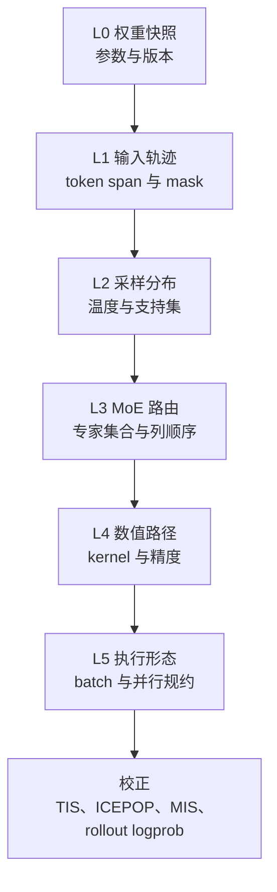
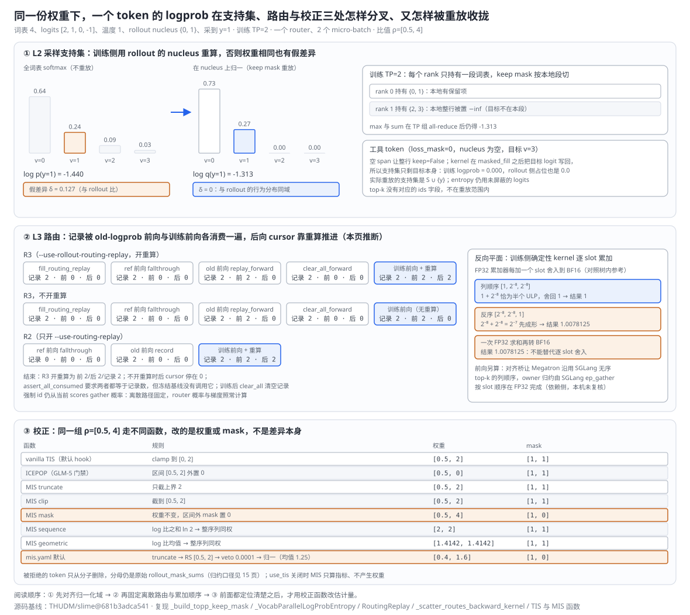
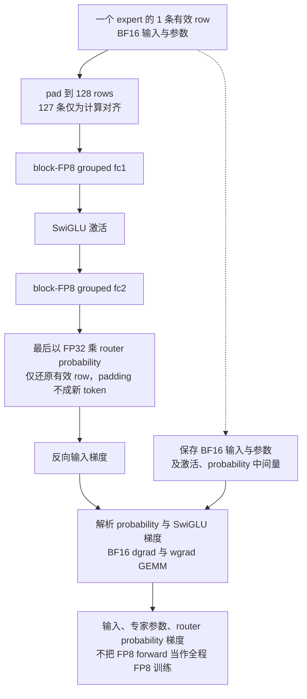
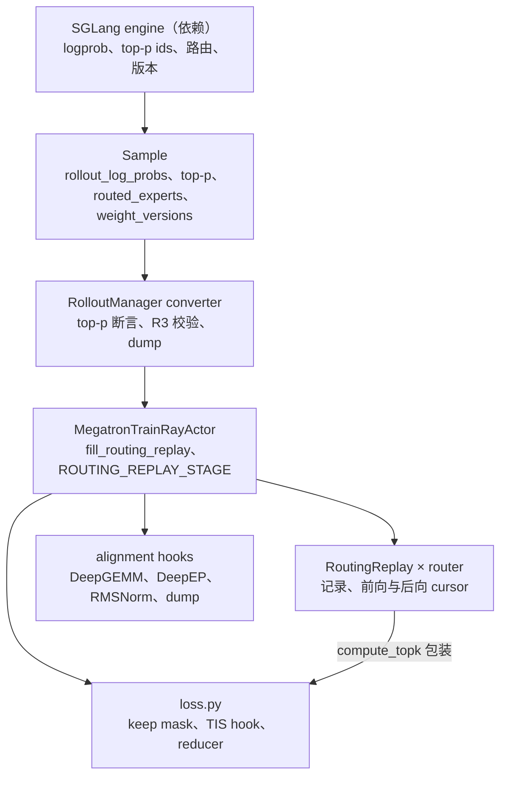
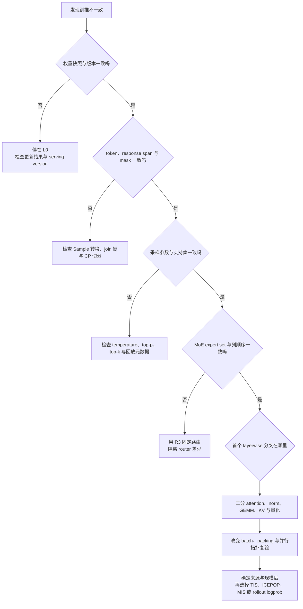

# slime 训推一致性分析

> **源码基线**：`THUDM/slime@681b3adca54105d5ecd3fb822fa0dc58a427e0f9`（`main`，2026-08-12）
> **主题**：同一个已生成 token 在 rollout 与训练两侧的 logprob 为什么会不同，slime 又用哪些钩子逐层定位或消掉差异：权重快照与版本、输入轨迹与两类 dump、行为策略元数据与 top-p keep-mask 重放、MoE 路由重放与有序 top-k、DeepGEMM/DeepEP 对齐替换层与确定性 route kernel、批次与并行不变性，最后才是 TIS、ICEPOP 与示例 MIS 等校正。核心代码在 `slime/utils/{types,routing_replay}.py`、`slime/backends/megatron_utils/{loss,actor}.py` 与 `slime/backends/megatron_utils/alignment/`。
> **适用范围**：训推数值一致性的证据链与校正；权重传输归 16，loss 缩放与 reducer 归 15，Sample 字段与 dump 格式归 12 与 18，低精度格式归 22。
> **最近更新**：2026-09-11。按特性分析画像重写，补最小实例、三面板原理图、调用树与成本账本。

---

## 1. 特性概览

### 1.1 问题背景

对已生成 token $y_t$，最直接的比较量是

$$
\delta_t=
\left\lvert
\log p_{\mathrm{train}}(y_t\mid h_t)
-
\log p_{\mathrm{rollout}}(y_t\mid h_t)
\right\rvert.
$$

两侧参数逐元素相等，只固定了函数的参数：两侧仍可能喂给模型不同的 token、位置与 mask，在不同的归一化域里取概率（温度与 top-p 截断后的支持集），在 MoE 层选到不同的专家或以不同列顺序累加，用不同的 kernel、量化链与精度，在不同的 batch 形状与并行规约下执行。任何一层不同，$\delta_t$ 就不为零，而且上一层的差异会让下一层的比较失去意义：token 错位之后再比较 hidden state，比较的已经不是同一个计算。所以要守住的不变量按层叠加：同一个完整参数版本；同一段 token、位置与 mask；同一个采样支持集与温度；同一组专家及其列顺序；同一条数值路径；在目标拓扑上满足的 batch 与并行不变性。

### 1.2 解决方法

slime 没有一个"训推一致"总开关，而是给每一层一个可以单独打开、单独失败的钩子。L0：`--check-weight-update-equal` 与每条 Sample 的 `weight_versions`；L1：`Sample.append_response_tokens` 的长度守卫、rollout 与 train 两类 dump、`--load-debug-rollout-data` 回放；L2：SGLang 请求返回选中 token 的 logprob，`rollout_top_p != 1` 时再返回每步的 nucleus ids，训练侧按 rollout 温度缩放 logits，再用 keep mask 在同一个支持集上重算；L3：`--use-routing-replay` 与 `--use-rollout-routing-replay` 把训练侧或 rollout 侧选出的专家 id 回放给训练前向与重算，GLM-5 对齐路径另外让 router 按 SGLang 的无序 top-k 列顺序出专家；L4：`alignment/` 下一组显式替换层把 Megatron 的 dense/MoE GEMM、RMSNorm、router 与 DeepEP 合并换成 SGLang 同款的 block-FP8 与批不变算子，确定性 Triton kernel 固定 route 梯度的写者与累加顺序，逐层 dump 用来二分；L5：全局批不变算子、每个 PP 边界的 RMSNorm 与并行检查测试。前面各层查清差异的来源与规模之后，才用 rollout logprob 作 old policy，或用 TIS、ICEPOP、示例 MIS 与拒绝采样去校正目标函数。源码逐项实现了这些钩子，但没有一处写下"一致性应组织成 L0→L5 六层"；分层是本页按实现形态与失败路径重建的组织方式（本页推断），每层对应一个能单独开关、单独失败的机制。



### 1.3 收益、开销和约束

| 层 | 直接收益 | 必付成本或边界 |
|---|---|---|
| L0 权重 | 首次推送后逐张量等值检查；每条 Sample 带版本号 | 等值检查只做一次，只证明参数到达 |
| L1 输入 | 两类 dump 可按 rollout 位置 join；固定输入去掉 rollout 随机性 | 磁盘与存储；回放不能重现在线采样 |
| L2 采样 | 在 rollout 的 nucleus 上重算，消掉截断带来的假差异（本例 0.127） | 每个 token 多一段 ragged ids；训练侧多一份屏蔽副本、一遍 softmax 与两次 TP all-reduce；依赖镜像里的 SGLang top-p 补丁；top-k 不重放 |
| L3 路由 | R3 固定离散专家，隔离 router 差异 | 每 token 每层 top-k 个 id 的存储与搬运；会掩盖 router 为何分叉 |
| L4 数值 | GLM-5 路径上逐层 bitwise、e2e 差 ≤ 9.999e-7 | 只支持特定结构与软件栈；TP=1、专家 TP=1 等拓扑限制 |
| L5 执行形态 | 并行检查覆盖 DP 与 TP/PP/CP | 只比较 grad norm，容差 0.01 |
| 校正 | 已知 mismatch 下降低目标函数偏差 | 改变估计量；修不了错 token、缺元数据或混版本 |

### 1.4 术语与符号

top-p 采样时，第 $t$ 步保留集合为 $S_t$，rollout 的行为分布是温度缩放后在 $S_t$ 上的重新归一化：

$$
q_t(v)=
\frac{
\exp\!\left(z_{t,v}/T\right)\mathbf{1}[v\in S_t]
}{
\sum_{u\in S_t}\exp\!\left(z_{t,u}/T\right)
}.
$$

| 术语 | 含义 |
|---|---|
| 行为策略 | 真正生成 response 的 rollout 分布 $q_t$；训练侧重算要落在它的定义域上 |
| keep mask | 训练侧 `[T, vocab_local]` 布尔矩阵，S 外置 −inf，目标 logit 写回 |
| R2 / R3 | `--use-routing-replay`（训练侧自己记录再回放）与 `--use-rollout-routing-replay`（回放 rollout 返回的专家 id） |
| stage 与 cursor | 环境变量 `ROUTING_REPLAY_STAGE` 决定本次 router 调用记录、透传还是回放；每个 router 有前向与反向两个 cursor |
| TIS / ICEPOP / MIS | 截断、区间外置零与示例里的多级重要性采样；RS 是基于同一比值的拒绝，veto 是整序列否决 |
| pre-RS reducer | 用原始 `loss_masks` 构造、只用于 mismatch 指标聚合的 reducer |

---

## 2. 训推一致性详细方案

### 2.1 最小实例：一个 token 的 logprob 穿过支持集、路由与校正

取词表只有 4 个 token 的一个位置：两侧同一份权重下的 logits 为 z = [2, 1, 0, −1]，rollout 温度 1，top-p 截出的 nucleus 为 S = {0, 1}，采到 y = 1；训练侧 TP=2，词表分片为 rank 0 持有 {0, 1}、rank 1 持有 {2, 3}。同一条 response 里还有一个工具 token，loss_mask 为 0、nucleus 为空。MoE 部分只看一个 router 与一步训练里的两个 micro-batch，以及某个 token 的 3 个 route 梯度 1、2⁻⁸、2⁻⁸；校正部分看同一序列两个 token 的比值 ρ = exp(train_old − rollout) = [0.5, 4]。下图的三个面板按这个顺序回放。



| 层 | 比较对象 | 决定性操作 | 本例结果 |
|---|---|---|---|
| L2 不重放 | 全词表 softmax | $z_y-\mathrm{logsumexp}(z)$ | −1.440，与 rollout 的 −1.313 差 0.127 |
| L2 重放 | S ∪ {y} | keep mask 把 S 外置 −inf、目标 logit 写回 | −1.313，δ = 0 |
| L2 TP=2 | rank 1 本地整行被屏蔽 | max 与 sum 在 TP 组 all-reduce | 仍为 −1.313 |
| L2 工具 token | 空 nucleus | 写回后支持集只剩目标 | 训练 0.000，rollout 占位 0.0，loss_mask 0 |
| L3 R3 | 两个 micro-batch 的 rollout 专家 id | 记录 2 条 → old logprob 前向取 2 次 → 清前向 cursor → 训练前向取 2 次、重算取 2 次 | 前 2 / 后 2 / 记录 2；不开重算时后向 cursor 停在 0（本页推断） |
| L3 反向 route 梯度 | 同一组 3 个 route 梯度 | 训练侧确定性 kernel 每加一个 slot 舍入到 BF16 | 列顺序 [1, 2⁻⁸, 2⁻⁸] 得 1；反序与一次 FP32 求和都得 1.0078125 |
| 校正 vanilla | ρ = [0.5, 4] | clamp 到 [0, 2] | 权重 [0.5, 2]，mask 不变 |
| 校正 ICEPOP | 同上 | 区间 [0.5, 2] 外置 0 | 权重 [0.5, 0]，mask 不变 |
| 校正 mis.yaml | 同上 | truncate 2 → RS [0.5, 2] → veto → 按 token 均值 1.25 归一 | 权重 [0.4, 1.6]，mask [1, 0] |

#### 2.1.1 同一个 token，两种归一化域

rollout 在 S 上重新归一化后采样；slime 随镜像提供的 SGLang 补丁 `docker/patch/latest/sglang-top_p.patch` 在请求要 logprob 与 nucleus ids、且没设 `SGLANG_RETURN_ORIGINAL_LOGPROB` 时，用 `renorm_logprob_over_top_p` 把选中 token 的 logprob 在 nucleus ∪ {采到的 token} 上重新归一（补丁文本可读，运行镜像是否打了补丁属依赖侧）。训练侧若直接对全词表做 softmax，本例 y=1 的概率从 nucleus 上的 0.27 降到全词表的 0.24、log 值差 0.127，这 0.127 与权重、kernel 都无关，完全来自归一化域。keep mask 让训练侧也只在 S 上归一。实现上有两处容易忽略的细节：`_VocabParallelLogProbEntropy.forward` 在 `masked_fill(~keep, -inf)` 之后把目标位置的 logit 写回，所以真正的支持集是 S ∪ {y}，与补丁在 rollout 侧 force-keep 采到的 token 对称；工具 token 的 span 为空，写回后只剩目标自身，训练侧 logprob 为 0，与 `append_response_tokens` 给工具 token 填的 0.0 占位一致，不会产生 NaN。TP 分片下 rank 1 本地没有任何保留项，整行 −inf，但 max 与 sum 在 TP 组 all-reduce 之后仍得到同一个值。entropy 始终用未屏蔽的 logits 计算。

#### 2.1.2 路由：谁消费记录，列顺序为何也要一致

R3 下 `fill_routing_replay` 把每个 micro-batch、每个本地 MoE 层的 rollout 专家 id 写进对应 router 的 `RoutingReplay`；ref 前向把 stage 设成 `fallthrough`，只算不取；old logprob 前向用 `replay_forward` 取完两条，随后 `clear_all_forward` 把前向 cursor 归零；训练时 actor 把 stage 设成 `replay_backward`，`train_one_step` 的前向闭包临时改成 `replay_forward` 取记录、返回前恢复，按普通 `model(**forward_kwargs)` 分支推算，后向 cursor 只在反向重算再次调用 router 时前进：本例开重算时两个 cursor 都停在 2，不开重算时后向 cursor 停在 0（本页推断；维护的 R3 用例都开 `--recompute-granularity full`，Megatron 内部的其他调度分支未核实）。R2 只开 `--use-routing-replay` 时，old logprob 前向改用 `record` 记下训练侧自然选择，训练再按同样的方式消费。回放只固定离散 id：`probs = scores.gather(1, top_indices)` 仍从当前 scores 取概率，router 的概率计算与梯度照常进行。列顺序是另一层，要分前向与反向两个平面。前向是训推对齐的平面：SGLang 的确定性 DeepSeek/GLM top-k 用 `torch.topk(..., sorted=False)`，Megatron 默认 `sorted=True`，专家集合相同而列顺序不同；对齐桥用 `register_ordered_topk_capture` 让 Megatron 沿用 SGLang 的列顺序，`_patch_sglang_deepep_layer` 里的 `setup_ordered_metadata` 把有序 id 交给 DeepEP 的 `token_indices`，`_SGLangEPGatherWithBF16Backward.forward` 再调用 SGLang 的 `ep_gather` 做 owner 归约。docstring 称它是"ordered FP32 gather"，单测参考也按 slot 顺序在 FP32 里累加再转 BF16（kernel 本身属依赖侧），而 `routing_replay.py` 的注释说列顺序改变的是"BF16 accumulation"，两处说法不一致，本页以 docstring 与单测为准。反向是训练侧确定性的平面，rollout 不跑反向：确定性 route kernel 每加一个 slot 就把 FP32 累加器舍入到 BF16，复现树内 CPU 参考逐 slot 的 BF16 原位加法。本例按列顺序 1 + 2⁻⁸ 恰好半个 ULP、舍回 1，最终得 1；反序时 2⁻⁸ + 2⁻⁸ 先凑成 2⁻⁷，最终得 1.0078125；一次 FP32 求和再转 BF16 也得 1.0078125。所以 kernel 注释强调不能换成一次 FP32 求和。

#### 2.1.3 校正：同一组比值，四种函数

vanilla TIS 把比值 clamp 到 `[tis_clip_low, tis_clip]` 后乘进逐 token 的 pg loss，mask 原样返回：本例 [0.5, 2]，两个 token 都保留。ICEPOP 把区间外的权重置零：本例 [0.5, 0]，mask 仍不变，第二个 token 的贡献通过权重而不是 mask 消失。示例 MIS 先按 token、sequence 或 geometric 计算 log 比（sequence 为 ln 0.5 + ln 4 = ln 2，整序列同权 2；geometric 为均值，整序列同权 1.414），限制到 [−20, 20] 再取 exp，然后 truncate 只截上界、clip 截两端、mask 保留权重但把区间外 mask 置零；`mis.yaml` 默认是 truncate 上界 2、RS 用同一 log 比与界 [0.5, 2]、veto 阈值 1e-4、token 级 batch 归一：权重 [0.5, 2] 按均值 1.25 归一成 [0.4, 1.6]，RS 把第二个 token 的 mask 置零；均值按原始 `loss_masks` 计算，被拒的 token 也算在内。被拒绝的 token 只从分子删除，分母仍是原始 `rollout_mask_sums`（[[15_slime_loss_parallelism_analysis]]）。

### 2.2 从最小实例到整个一致性体系

各组件的"为何"是本页依据源码形态与失败路径重建的理由（标"本页推断"），源码与官方文档写出的理由单独注明；SGLang、DeepGEMM、DeepEP 内部行为不在本机可读范围内，按其公开契约叙述并标为依赖侧。

#### 2.2.1 L0 权重快照与版本

**职责。** `--check-weight-update-equal` 时，`create_rollout_manager` 在 engine 启动后对所有 engine 发 `check_weights("snapshot")` 与 `check_weights("reset_tensors")`，`train.py` 在第一次 `actor_model.update_weights()` 之后发 `check_weights("compare")`。每条 Sample 在请求结束（`meta_info` 带 `finish_reason`）时把 SGLang 返回的 `weight_version` 追加到 `weight_versions`，partial 或多段 response 因此能暴露跨版本边界。

**为何。** 参数不相等时，后面所有层的比较都没有意义，这一层必须先过（本页推断）。但参数相等只固定了函数的参数，没有固定输入。

**代价与边界。** 等值检查只在首次推送后做一次，比较对象是 engine 启动时从 hf_checkpoint 加载的快照，所以只在 actor 初始权重等于 hf_checkpoint 时成立；它回答的是"权重是否正确到达推理引擎"。pause、flush、拓扑转换与版本号的完整提交协议归 [[16_slime_weight_sync_analysis]]。症状通常是生成突然失真、所有 token 的 logprob 都大幅偏离，或一条轨迹出现多个版本。

#### 2.2.2 L1 输入轨迹：Sample 守卫、两类 dump 与回放

**职责。** `Sample.append_response_tokens` 要求 logprob 与 token 等长；可训练 token 缺 logprob、不可训练 token 带 logprob 都抛 `ValueError`；工具 token 填 0.0 占位、loss_mask 为 0、top-p span 补空；每次追加后校验 mask、rollout logprob 与 top-p offsets 的长度（offsets 长度必须是 response 长度 + 1，末值等于 ids 总数）。rollout dump 在 `_save_debug_rollout_data` 把 `Sample.to_dict()` 与 `rollout_id` 写进 `.pt`；train dump 由最后一个 PP stage、TP rank 0 执行，所有 CP rank 参加 response 字段的 gather，CP0 再按 DP 收到一个 writer，version-2 payload 以 `partition`（rollout 位置）优先、`sample_index` 次之恢复全局顺序（debug 文档写"按 `sample_index` 排序"，以代码为准），另存 DP 与 micro-batch 布局。`--load-debug-rollout-data` 直接反序列化保存的 Sample，跳过 SGLang 参数解析并强制 `debug_train_only`，可选 subsample 只取首尾子集。

**为何。** 同一权重对不同 token 序列给出不同 logits 是正常行为；weight compare 替代不了输入对账。官方 debug 文档把回放的用途写成"固定训练部分输入，去除 rollout 的随机性"，并区分 rollout-only 与 train-only 两种分离调试。

**代价与边界。** 比较时先按 rollout 位置 join，再核对 tokens、response 长度、loss mask 与位置；典型症状是从首个错位 token 开始整段偏差，而不是孤立的小误差。回放适合回答"同一批 Sample 换并行度或 kernel 后训练行为是否一致"，回答不了"重新采样能否得到同一 response"，后者还需要固定采样种子与确定性推理 kernel（本页推断）。dump 格式与恢复边界归 [[18_slime_fault_tolerance_observability_analysis]]。

#### 2.2.3 L2 行为策略元数据与 top-p 重放

**职责。** `sglang_rollout.GenerateState` 把 `rollout_temperature`、`rollout_top_p`、`rollout_top_k` 放进采样参数，每个请求 `return_logprob=True`，`rollout_top_p != 1` 时加 `custom_params={"return_top_p_token_ids": True}`。`Sample` 只保存选中 token 的 `rollout_log_probs`、ragged 的 `rollout_top_p_token_ids`/`offsets`（第 i 个 response token 的候选集是 `ids[offsets[i]:offsets[i+1]]`）与 `rollout_routed_experts`，不存每步完整词表。converter 在 `rollout_top_p != 1` 时逐条断言 ids 与 offsets 完整才放进训练字典，loss 入口 `get_rollout_top_p_logprob_kwargs` 缺字段抛 `ValueError`，不会静默退回全词表。训练侧 `get_log_probs_and_entropy` 先按 rollout 温度缩放 logits，`_build_topp_keep_mask` 按 zigzag CP、allgather CP 与 CP=1 三种布局找出每条 response 行、按 TP 词表段填 keep mask（`tests/test_logprob_response_spans.py` 锁定三种布局）；`actor.compute_log_prob` 对 ref、teacher 与 old 三种前向都传 `use_rollout_top_p_replay=True`，所以 KL 等对照量也在同一支持集上。loss 报告 `train_rollout_logprob_abs_diff`：开 `use_rollout_logprobs` 时比较当前 logprob 与 rollout，否则比较训练侧 old logprob（复用时即训练前向的 detached 值）与 rollout。

**为何。** 保存完整 logits 能彻底重放，但每步一个词表大小的向量太贵；选中 token 的 logprob 加 nucleus ids 是重建行为分布所需的最小集合（本页推断）。同一个 token 可以同时在全词表与 nucleus 里，但它在两个归一化域里的概率不同，token id 相等不等于行为分布相等。目标 logit 为什么要写回，补丁注释给了原因：SGLang 用 flashinfer kernel 采样，`renorm_logprob_over_top_p` 用 torch 重算 nucleus，两者在边界上可能不一致，采到的 token 若落在重算的 nucleus 之外就得到 −inf、下游变成 NaN；rollout 侧 force-keep 与训练侧写回目标因此对称。

**代价与边界。** 训练侧每次前向多一份 `~keep` 布尔矩阵与屏蔽后的 FP32 `[T, V_local]` 副本；带 entropy 时（`policy_loss_function` 总是带）entropy 用未屏蔽 logits、logprob 用屏蔽 logits，softmax 跑两遍，多两次 TP all-reduce（MAX 与 SUM）；`_fill_topp_mask_rows` 在 Python 里逐 response token 过滤候选 id、建一个小张量再做一次索引写，ref、teacher、old 与训练前向各做一遍（均未测量）。补丁的重归一只在请求要 nucleus ids 且没设 `SGLANG_RETURN_ORIGINAL_LOGPROB` 时生效，两种偏离的后果不同：SGLang 没打补丁时不返回 nucleus ids，`_extract_rollout_top_p_token_data` 让 Sample 的 ids 留空，`rollout_top_p != 1` 时 converter 断言失败；设了这个变量时补丁仍返回 ids、只跳过 `renorm_logprob_over_top_p`，rollout logprob 仍是未截断分布，重放反而静默制造它本想消掉的差异。CLI 与 SGLang 请求都支持 `rollout_top_k`，但 `Sample` 与训练重放只实现 top-p，没有 top-k 支持集字段；"能用 top-k 采样"不能写成"训练侧已能精确重放 top-k 分布"。偏差若只在 temperature 或 top-p 打开后系统出现，应先查支持集重放，而不是归因于权重或 kernel。

#### 2.2.4 L3 MoE 路由重放与有序 top-k

**职责。** SGLang 可返回 `[token, layer, topk]` 路由（请求带 `return_routed_experts`）；Sample 在 partial 追加时按 `routed_experts_start_len` 拼接并检查元素数等于 `(len(tokens) − 1 − start) × num_layers × moe_router_topk`；converter 在 R3 下调用 `_validate_rollout_routed_experts_for_replay`，拒绝维度错误、空 capture，以及 MoE 层全零的 PP capture（只在 top-k > 1 时检查；注释：多半是 SGLang 的 PP stage 没有汇总各自的路由，拒绝"到处回放 expert 0"）。`fill_routing_replay` 经 `cp_utils.prepare_routed_experts_for_routing_replay` 把路由对齐到训练布局：断言每条样本的路由行数等于 token 数减一，补 1 行后按 CP 布局对齐：zigzag 逐样本切片后拼接，再补齐到 TP × `data_pad_size_multiplier` 的倍数；allgather 先拼接、补齐到 CP × TP × `data_pad_size_multiplier` 的倍数再等分；sequence parallel 时再按 TP rank 取本段。镜像里的 Megatron 补丁把 `compute_topk` 包进 `get_routing_replay_compute_topk`，并在 router 上 `register_routing_replay`；`RayTrainGroup` 只给 actor 设 `ENABLE_ROUTING_REPLAY=1`（注释：critic 不能做路由重放）。`RoutingReplay.record` 把 id 存成 pinned CPU 张量（非连续视图先压实），取用时搬到 GPU 并转 int32；每次取值断言 token 数与 top-k 形状一致。四个 stage 的使用时机：

| stage | router 行为 | actor 中的使用时机 |
|---|---|---|
| `fallthrough` | 自然计算 top-k，不新增记录 | ref 与 teacher 前向 |
| `record` | 自然计算并把 id 记进该 router 的队列 | 仅 R2 的 old logprob 前向 |
| `replay_forward` | 按前向 cursor 取 id，从当前 scores gather 概率 | R3 的 old logprob 前向；训练前向闭包 |
| `replay_backward` | 按后向 cursor 取 id | 训练期间的环境值，供反向重算时的 router 调用读取 |

`--use-rollout-routing-replay` 在参数校验中强制打开 `--use-routing-replay`，两者不能都简称成同一个功能。严格的 GLM-5 对齐不依赖 R3：DeepEP 对齐桥用 `register_ordered_topk_capture` 注册 router，只对这些非分组 router 改用 `torch.topk(sorted=False)`，注释说明即使专家集合相同，列顺序也会改变 owner 归约的"BF16 累加"（与 gather docstring 的 FP32 说法不一致，见 §2.1.2）；其他训练路径保留 Megatron 原语义。维护的 GLM-5 门禁由 `test_glm52_alignment_gate_trains_all_main_model_parameters_without_r3` 断言参数里没有 R3。

**为何。** R3 是强诊断与校正手段，能把离散专家 id 固定下来，但也会掩盖 router 本身为何分叉；自然路由门禁与强制回放两类测试需要同时保留（本页推断）。同一支持集只约束了 LM head 的分布定义，隐藏层的 router 仍可能因微小数值差跨过 top-k 边界。

**代价与边界。** `RoutingReplay.assert_all_consumed` 要求两个 cursor 都等于记录数，但冻结基线没有任何调用方；不开重算时后向 cursor 本就不前进（本页推断）。超出记录的取值会索引失败。rollout 路由的独立 logprob 前向后清前向 cursor，训练结束 `clear_all` 清空记录（lazy 资源接口在冻结基线里没有注册方）。R2 与 `--use-rollout-logprobs` 同开而不开 `--get-mismatch-metrics` 时，`train_actor` 跳过 old logprob 前向，没有任何记录，训练前向的 `replay_forward` 在空列表上取值而抛 `IndexError`，参数校验没有拦截（源码路径推断，未运行验证）。R3 时 CI 的初始 actor/ref KL 检查被放宽，因为 actor 回放 rollout 路由而 ref 走自然路由。典型症状是 dense 层一致、进入首个 MoE 层后出现稀疏大偏差，或专家 id 相同而 combine 输出已有细小误差。

#### 2.2.5 L4 对齐替换层：DeepGEMM、DeepEP、RMSNorm 与逐层 dump

**职责。** `alignment/env.py::alignment_env` 集中了训推两侧必须共享的数值环境（CUBLAS workspace、NCCL 算法、禁止非确定 TE 算法、DeepGEMM 批不变、DeepEP 低延迟与 DSA 配置，以及让 Megatron 借用 SGLang 的 fused residual RMSNorm、FP8 indexer、router GEMM、RoPE 与 sparse MLA），docstring 写明集群连通性设置（`PYTHONPATH`、`MASTER_ADDR`、网卡、代理、IBGDA）"有意不放在这里"，由 launcher 负责。`deepgemm_forward.py::_enable_deepgemm_all_forward` 经 `--custom-megatron-before-log-prob-hook-path` 与 `--custom-megatron-before-train-step-hook-path` 安装：全局批不变算子、每个 PP 边界的首层 RMSNorm、absorbed KV 与 final RMSNorm；`--megatron-deepgemm-forward-layers` 选中的 dense 层走 SGLang 式 block-FP8 forward 与 SwiGLU；`--megatron-deepgemm-moe-forward-layers` 选中的 MoE 层把整个 `TEGroupedMLP` 换成 block-FP8 grouped fc1 → SwiGLU → block-FP8 grouped fc2 → FP32 乘 router 概率，反向是分组 BF16 dgrad/wgrad 加解析 SwiGLU 与概率梯度；`MEGATRON_USE_SGLANG_ROUTER_GEMM=1` 时再装 router GEMM，`deterministic_mode` 且 `moe_enable_deepep` 时装有序 DeepEP gather；设了 `SLIME_LAYERWISE_ALIGNMENT_DUMP_DIR` 就注册逐层 dump。层号用 `layer_number − 1`，PP 各 rank 的本地层从 0 起编号也不会误选。

<!-- Figure spec: TB paired forward/backward paths for one expert row. Forward quantized grouped fc1, SwiGLU, quantized fc2 then router probability FP32. Backward saved BF16 inputs/weights and incoming gradient drive BF16 dgrad/wgrad and analytic activation/probability derivatives, not differentiating integer quantization. -->


**为何。** 把训练栈整个改成 bitwise 确定需要替换所有算子；对齐被做成可选装的替换层，DeepGEMM 模块 docstring 自称 "an opt-in numerical-alignment hook"，只替换选中的 TE linear，只对齐 forward，backward 仍是显式 BF16 GEMM 与解析式 norm 梯度。第一版还主动缩小范围：要求 TP=1，让每个目标是一整块矩阵，对上 SGLang 的 dense-TP1 执行，把 row-parallel 部分和的舍入作为混杂变量排除。把概率乘法挪到 fc2 之后，是因为 SGLang 在那里乘，分别包两个 linear 表达不了这条边界（模块 docstring）。精度要"匹配"而不是"更高"：官方文档写 LM head 在两侧都保持 bf16，对齐来自精度一致而不是 fp32；同一条目里 MoE router 用 fp32（GLM-5 门禁传 `--moe-router-dtype fp32` 与 `--sglang-enable-fp32-moe-router`）。路由 id 相同只固定专家 rows 的归属，不决定专家 GEMM 的量化、累加顺序或 combine 精度，所以 L3 通过之后仍会有小误差逐层放大，这一层要靠替换算子与逐层 dump 二分（本页推断）。

**代价与边界。** 这一层的数值替换发生在 DeepGEMM、DeepEP 与 SGLang kernel 内部，最小实例不回放它，上面的流程图只画结构（依赖侧）。dense 路径在 TP≠1 时抛 `RuntimeError`；MoE 包装要求 TP=1、专家 TP=1、bias-free SiLU gated `TEGroupedMLP`、BF16 参数、hidden 与 MoE FFN 维度是 128 的倍数，拒绝与 Megatron FP8、QAT、SwiGLU clamp、`moe_apply_probs_on_input` 或已单独包装的 expert linear 叠加。forward 把各专家的 rows 补齐到对齐倍数，意味着额外 padding 与重排存储；`SLIME_DEEPGEMM_MOE_EXPERTS_PER_GROUP` 控制 forward 分组（批不变时默认取较小的组），`SLIME_DEEPGEMM_MOE_GROUPED_BF16_BACKWARD` 控制分组反向，另两个环境项限制反向分组与 padding 字节。Blackwell 上 block-FP8 权重必须复现 SGLang 的 quant → requant 有损链，单次量化对不上 rollout。`_configure_batch_invariant` 优先用 SGLang wrapper 的 setter、退回 DeepGEMM 自身 setter，都没有或读回未生效就抛错。逐层 dump 记录 input ids、packed 序列偏移与选中层/模块输出，缺 input 或缺层立即失败。slime 只验证调用、布局与 API 可用性，DeepGEMM、DeepEP、SGLang 的内部实现与兼容补丁是依赖边界。

#### 2.2.6 L4 确定性 route kernels

**职责。** `deterministic_route_kernels.py` 不重新选专家，只把 token → route 的复制与反向梯度还原做成确定性操作：`scatter_routes_forward` 把 token 行写到唯一的 expert-major route 行，负值 slot 表示无效；`scatter_routes_backward` 每个 token 一个程序，按 top-k 列顺序累加，每次加完舍入到 BF16；`ordered_route_grad` 把 token 梯度乘 FP32 top-k 权重写回唯一 route 行；`compact_route_positions` 用有效 slot 的前缀和生成紧凑的 `(token, slot)` 索引，并用异步断言核对实际 route 数与 metadata handle 的预期数量，避免 `nonzero` 的数据相关输出大小回传 CPU。例如 token A 的两个 slot 映射到 route 2 与 0、token B 的第二个 slot 无效，前向得到 route 行 A、B、A，反向 A 按 slot 顺序先加 route 2 的梯度再加 route 0 的梯度，B 的无效 slot 贡献零。

**为何。** 模块 docstring：只把启动频繁的张量索引换成等价的逐点拷贝或每 token 一程序的有序归约，不用 atomic，每个可见输出元素只有一个写者；逐次 BF16 舍入是为了复现参考实现逐 slot 原位 BF16 加的可见边界（§2.1.2 的 1 与 1.0078125）。

**代价与边界。** 没有独立 CLI 开关：进入 DeepEP 对齐桥后 CUDA 张量直接用这些 kernel，CPU 走索引循环的参考路径。公共校验要求 CUDA、连续 BF16 二维值与连续整数二维映射，ordered grad 另要求 FP32 权重；"每个输出元素唯一写者"是上游 route 映射的不变量，校验函数不扫描 destination 是否重复。

#### 2.2.7 L5 批次与并行执行

**职责。** `enable_sglang_global_batch_invariant_ops` 在 `SGLANG_DEEPGEMM_BATCH_INVARIANT` 开启时调用 SGLang 的 `enable_batch_invariant_mode` 并读回确认；`enable_sglang_layer0_input_rmsnorm` 在每个 PP stage 的首个本地层替换独立 RMSNorm。`tests/test_qwen3_0.6B_parallel_check.py` 先在 DP8 下保存 rollout dump 与 grad norm，再用同一 dump 依次跑 DP2、TP2×PP2×CP2、TP4、PP4、CP4，默认与 per-token 两种 loss 口径各一遍；`train` 在 `--ci-load-grad-norm` 时以 `math.isclose(rel_tol=0.01, abs_tol=0.01)` 比较 grad norm。

**为何。** 注释给了原因：Megatron actor 与 SGLang worker 是不同进程，DeepGEMM 进程内的批不变开关不够，RMS 归约、BMM、FP32 matmul 与 log-softmax 仍会走普通的 batch 形状相关 kernel；PP>1 时 stage 1 的首层不是全局第 0 层，只检查全局第 0 层会漏掉（规范 PP8 布局里 stage 1 从全局层 2 开始）。

**代价与边界。** 两侧都"调用某种 GEMM 或 attention"并不固定输入分块与规约树；除非算子本身批不变，或端到端测试覆盖了目标拓扑，局部 kernel 对齐推不出完整并行执行对齐。失败若只随 batch 大小、packing 或某一并行维度出现，应先查形状相关的 kernel 与集合通信，而不是重做权重同步。

#### 2.2.8 确定性与 CI 门禁

**职责。** 官方 reproducibility 文档把 SGLang 确定性推理与 Megatron deterministic mode 组合成逐位复现的配方：卸载 FlashAttention 3、SGLang 用 flashinfer、设置 NCCL、TE 与 CUBLAS 环境变量。rollout 开启确定性推理后，同一 prompt 组第 i 条 sample 用 `rollout_seed + i`；训练端 `--deterministic-mode` 固定 cudnn 并以 `warn_only=False` 调用 `torch.use_deterministic_algorithms`。CI 分两层：GitHub 托管的 `cpu-unittest` 对每个 PR 运行注册的契约测试，与本页相关的是 Sample、top-p 布局（`test_logprob_response_spans.py`）、logprob 与 entropy（`test_ppo_logprob_entropy.py`）、train dump 与逐层比较；R3 校验（`test_rollout_routing_replay_validation.py`）与 DeepGEMM MoE 对齐（`test_deepgemm_moe_forward.py`）的单测没有注册，只在带 `run-ci-changed` label 且它们本次被改动时运行；GPU 端到端 job 由 label 触发，R3 端到端（Qwen3-30B-A3B 与 Moonlight-16B-A3B）在 `run-ci-megatron` 里。

| 门禁 | 固定了什么 | 断言 | 能证明什么 | 不能证明什么 |
|---|---|---|---|---|
| CPU 契约测试 | Sample、top-p 布局、logprob 与 entropy、train dump 与逐层比较工具 | 异常输入失败、比较逻辑正确 | 元数据约定与诊断工具不会静默失真 | 真实 GPU kernel 一致；R3 校验与 MoE 对齐单测默认不跑 |
| parallel check | 同一 rollout dump，不同 DP/TP/PP/CP，两种 loss 口径 | grad norm 相对与绝对容差 0.01 | 目标 Qwen 配置下并行训练结果不过度漂移 | 逐 token、逐位训推对齐 |
| GLM-5 e2e | 真实权重更新、DSA、FP8 DeepGEMM、DeepEP EP8、ICEPOP | `train_rollout_logprob_abs_diff` ≤ 9.999e-7（文档的 < 1e-6） | 该固定 recipe 的最终行为门禁 | 其他模型、拓扑、后端 |
| GLM-5 layerwise | 同一短序列，decoder 层 0–5 | 所有匹配 hidden 元素最大误差为 0 | 前六层边界 bitwise 对齐 | 长生成的最终分布与训练更新 |

**为何。** 三种确定性不能混成一个开关：rollout 自身可复现、training 自身可复现、train/rollout 跨引擎对齐；前两项各自成立推不出第三项，冻结基线把第三项的严格支持限定在 GLM-5 专用对齐栈（官方文档）。

**代价与边界。** GLM-5 e2e 的 fixture 是单机 EP8、3 dense + 3 MoE 的 6 层 GLM-5.2 结构：colocate、`--update-weight-transport nccl`（共卡即张量 IPC）、2 GiB 桶、stateless Adam、`--use-tis` 配 `icepop_function`（clip 0.5 与 2.0）、确定性 SGLang、FP8-E4M3 KV、flex dispatcher 与 DeepEP、`--freeze-indexer`，对齐 hook 覆盖 dense 层 0–5 与 MoE 层 3–5，阈值（测试传 `9.999e-7`）经 `--ci-train-rollout-logprob-abs-diff-threshold` 在 actor 内以 `<=` 断言（该参数默认 0.1）。官方文档称已验证的 DeepEP 对齐参考结果在 1e-7 量级，SGLang rollout 用 DeepEP low-latency、Megatron 训练用 DeepEP normal，第二次小 payload normal dispatch 保留每个 top-k route，token owner 按 slot 顺序做 FP32 加权归约，这条路径不支持普通 Megatron all-to-all；主模型参数（含 router 与专家）都执行 backward。layerwise 变体用 `slime.utils.compare_glm52_layerwise --max-hidden-diff 0` 比较 0–5 层。CI 文档把 `run-ci-precision` 概括为"不同并行设置下的数值一致性"，而 workflow 里该 job 只注册了 parallel check，它是并行训练的近似一致门禁，不是逐位的 logprob 门禁。

#### 2.2.9 TIS/MIS 校正机制

**职责。** `policy_loss_function` 在 `get_mismatch_metrics` 或 `use_tis` 时进入校正 hook：断言 batch 带 `rollout_log_probs`，计算 `ois = exp(-ppo_kl)`，把 pg loss、训练侧 logprob（`batch["log_probs"]`，没有时用训练前向的 detached 值）、rollout logprob、`loss_masks` 与长度交给 `custom_tis_function_path` 指向的函数或默认 `vanilla_tis_function`。TIS 修正的是训练侧旧策略与 rollout 行为策略的采样分布差，它与 PPO 的当前/旧策略 ratio 是两个量。`vanilla_tis_function` 逐 token 计算 `exp(train_old − rollout)`，clamp 到 `[tis_clip_low, tis_clip]` 后乘进 pg loss，原 mask 原样返回，报告 `tis`、`tis_abs` 与 `tis_clipfrac`；`icepop_function` 把区间外置零，同样返回原 mask，只能经自定义路径加载。示例 `compute_mis_weights` 把加权与拒绝分开：按 level 计算 log 比（token 为逐 token 值，sequence 为完整 mask 下的和，geometric 为均值），限制到 [−20, 20] 取 exp，按 mode 截断、截两端或置零 mask；可选 RS 用同一或独立 level 的比值再置零 mask，veto 在任一有效 token 的原始比值低于阈值时拒绝整条序列；`use_tis=False` 时算完 perplexity 与 KL 类指标就提前返回，所以 `use_rs=True` 单独启动不了拒绝。CP wrapper `compute_mis_weights_with_cp` 先 all-gather 每条 response 的两套 logprob，按完整 mask 计算，再切回本 rank 的权重与指标，返回的 mask 仍是完整 response 形态，交给通用 reducer 取本地片段。hook 返回后，`policy_loss_function` 用修改后的 mask 重建分子 reducer，分母仍是原始 `rollout_mask_sums`；mismatch 与 TIS 指标用改前的 reducer 聚合。

**为何。** 源码注释给了保留两个 reducer 的原因：mismatch、TIS、RS 指标通常定义在拒绝前的有效 token 上，若用改后的 mask 聚合，被拒 token 从分母消失，`truncate_fraction` 一类指标会被推向 0。参数校验直接禁止把两种"替换 old policy"的做法叠加：`use_rollout_logprobs` 与 `use_tis` 不能同开；校正因此是最后一步，不是替代诊断的开关。`train_async.py` 的一步异步、partial 续写或 `--update-weights-interval > 1` 时，rollout logprob 来自更旧的权重版本，而 old logprob 由当前 actor 重算，TIS 的比值因此也包含这段策略版本差；源码没有单独校正版本差的项（本页推断）。

**代价与边界。** `tis_batch_normalize` 只在该次调用收到的序列上求权重均值，没有 DP all-reduce，是 micro-batch 作用域；它只实现 token 与 sequence 两支，与 geometric 同用抛 `ValueError`。`get_mismatch_metrics` 要求 `custom_tis_function_path`；与 `use_rollout_logprobs` 同开时训练侧仍会多做一次 logprob 前向（校验会打印提示）。核心 parser 只有下表几项，其余 MIS 选项通过 `--custom-config-path examples/train_infer_mismatch_helper/mis.yaml` 写成 args 上的同名属性；YAML 在部分核心断言之后应用、可覆盖已有属性，源码没有在加载后重跑整套校验，所以"核心 parser 禁止某组合"不等于 YAML 写回后仍被检查。

| 核心 CLI | 默认 | 固定基线的作用 |
|---|---|---|
| `--use-tis` | false | policy loss 开启校正 hook |
| `--tis-clip` / `--tis-clip-low` | 2.0 / 0 | vanilla 与 ICEPOP 的上下界 |
| `--custom-tis-function-path` | None | 替换 vanilla，例如 `loss.icepop_function` 或 `examples.train_infer_mismatch_helper.mis.compute_mis_weights_with_cp` |
| `--get-mismatch-metrics` | false | 也进入 hook，要求自定义路径；与 rollout logprob 同用时额外重算训练 logprob |
| `--use-rollout-logprobs` | false | 直接用 rollout logprob 作 PPO old logprob；与 `use_tis` 互斥 |

| MIS 属性 | 示例 YAML 值 | 规则 |
|---|---|---|
| `tis_level` / `rs_level` | token / token | token、sequence、geometric |
| `tis_mode` | truncate | truncate、clip、mask；README 的参数说明漏了 mask，以实现为准 |
| `tis_lower_bound` / `tis_upper_bound` | 0.5 / 2.0 | 下界为 None 时取上界的倒数；truncate 不用下界；clip 与 mask 断言下界小于上界 |
| `tis_batch_normalize` | true | 该次调用的权重均值归一；只支持 token 与 sequence |
| `use_rs`、`rs_lower_bound`、`rs_upper_bound` | true、null、null | IS 之后附加拒绝，界缺省回退到 IS 的界 |
| `rs_veto_threshold` | 1.0e-4 | 任一有效 token 比值低于它就拒绝整条序列；只在 `use_rs` 分支里执行，README 称它独立于 IS/RS 设置，与实现不符 |

| 日志键 | 实际统计内容 |
|---|---|
| `train/tis`、`train/tis_abs`、`train/tis_clipfrac` | vanilla 或 ICEPOP 的原始比值、距 1 的绝对差、被改动的比例 |
| `train/mis_tis_weight_before_bound`、`train/mis_tis_weight_after_bound` | MIS 限界前后的权重 |
| `train/mis_tis_truncate_fraction` 及 clip、mask 模式的 `mis_tis_clip_fraction_low/high`、`mis_tis_mask_fraction_low/high` | 各模式越界比例 |
| `train/mis_rs_mask_fraction_low/high`、`train/mis_rs_catastrophic_token_fraction`、`train/mis_rs_catastrophic_seq_fraction`、`train/mis_batch_norm_factor`、`train/mis_is_ratio_mean_final` | RS 拒绝比例、veto 命中的 token 与序列比例、batch 归一的均值、最终权重均值 |
| `train/mis_kl`、`train/mis_k3_kl`、`train/mis_training_ppl`、`train/mis_rollout_ppl` 等 | MIS hook 的概率差与两端 perplexity，不要求 use_tis |
| `train/train_rollout_logprob_abs_diff` | 主 policy 路径的 logprob 绝对差，用重建后的主 reducer 聚合，与 hook 的 pre-RS 指标范围不同 |

示例 README 用 `--tis-mode`、`--tis-level` 等 `--tis-*` 与 `--mis-*` 描述这些选项、提到 `--use-rollout-correction`，冻结的核心 parser 都没有注册；它把指标写成 `mismatch_*` 与 `mis_mean_is_weight_before_clip`、`mis_ratio_mean_after_mis`、`mis_truncate_fraction`、`mis_catastrophic_*`，CP wrapper 实际输出的是 `mis_tis_weight_before_bound`、`mis_is_ratio_mean_after_tis_rs`、`mis_tis_truncate_fraction`、`mis_rs_catastrophic_*`。权重截断与拒绝改变的是估计量，不能反过来证明跨引擎逐位相等。

### 2.3 变体：同一实例在六条选择轴上

| 选择轴 | 枚举依据 | 变体 | 本例的表现 | 压力与上限 |
|---|---|---|---|---|
| old logprob 来源 | `train_actor` 的条件链与 `policy_loss_function` 的 `use_rollout_logprobs` | 训练重算 / 复用训练前向 / rollout logprob | 三者都进入 `train_rollout_logprob_abs_diff`，比较对象不同 | 多一次全批前向；与 `use_tis` 互斥 |
| 校正函数 | `custom_tis_function_path` 缺省与否 | vanilla / ICEPOP / 示例 MIS | [0.5, 2]、[0.5, 0]、[0.4, 1.6] 加 mask [1, 0] | 改估计量的方式不同 |
| MIS level 与 mode | `compute_log_ratio` 与 `tis_mode` 分支 | token、sequence、geometric × truncate、clip、mask | sequence 同权 2，geometric 同权 1.414 | geometric 不能配 batch 归一 |
| 路由重放 | `--use-routing-replay`、`--use-rollout-routing-replay` | 无 / R2 / R3 | R3 前 2 / 后 2 / 记录 2 | 存储、搬运与掩盖 router 分叉；R2 配 `--use-rollout-logprobs` 且不开 mismatch 指标时 `IndexError` |
| 支持集重放 | `rollout_top_p != 1.0` | 关 / 开 | 假差异 0.127 → 0 | top-k 不在范围内 |
| 数值对齐 | 两个 layer 列表、`MEGATRON_USE_SGLANG_ROUTER_GEMM`、`deterministic_mode ∧ moe_enable_deepep` | dense block-FP8 / MoE grouped / router GEMM / 有序 DeepEP | 反向 kernel 的列顺序决定 1 与 1.0078125；前向由 SGLang 有序归约（依赖侧） | 只在 GLM-5 栈上有严格门禁 |

兄弟轴：训练端确定性（`--deterministic-mode`）与 rollout 端确定性（`--sglang-enable-deterministic-inference` 与 `rollout_seed`）是独立开关；逐层 dump 由环境变量 `SLIME_LAYERWISE_ALIGNMENT_DUMP_DIR` 与 `SLIME_LAYERWISE_ALIGNMENT_MODULE_SUFFIXES` 控制；训练稳定性层面的 mismatch 处理归 [[31_slime_posttraining_stability_analysis]]。

### 2.4 整体开销

| 强化手段 | 得到的诊断能力 | 代价或限制 |
|---|---|---|
| rollout 与 train dump | 固定输入并逐 sample 对账 | CPU、磁盘 I/O、存储与敏感数据治理 |
| 行为策略元数据 | 重建选中 token 的概率、top-p 候选集与路由 | 每个 token 都要传元数据；top-p 与路由数据量随序列长度、层数和 top-k 增长；训练侧 keep mask 的屏蔽副本、第二遍 softmax 与逐 token 的 Python 构建（未测量） |
| mismatch 重算 | 直接观测 train/rollout logprob 差 | 某些配置多一次训练侧前向，校验会打印提示 |
| R3 | 隔离 MoE 离散路由差异 | per-token、per-layer 专家 id 的保存与 pinned 搬运；证明不了自然 router 对齐 |
| 确定性算法 | 多次运行结果稳定，没有确定性实现的算子立即报错 | 限制可选 kernel；示例要求 flashinfer、移除 FA3 |
| GLM-5 对齐栈 | 逐层零误差与 ≤ 9.999e-7 的 e2e 门禁 | 模型结构、补丁、DeepGEMM/DeepEP、KV dtype 与拓扑受限；专家 rows 的 padding 与重排 |

**总体代价与运行包络。** 确定性越强，吞吐优化器可选的算法、batch 形状与通信路径越少，但固定基线没有给出一项能推广到所有模型的统一性能代价，这里不编造百分比（本页推断）。工程上更稳妥的是分级启用：日常只记轻量的行为指标，异常时先回放固定输入，再在可复现的小模型与短序列上打开逐层 dump 与严格 kernel 栈；校正放在最后。本页未运行 slime 训练或 SGLang 服务，文中数值是按冻结源码复现的 CPU 计算。

---

## 3. 代码实现分析

### 3.1 对象与所有权视图

<!-- Figure spec: ownership; SGLang engine (dependency) returns logprob, top-p ids, routed experts, weight_version into Sample; RolloutManager converter validates and packs; actor fills RoutingReplay, sets stage, runs forward_only with keep mask; alignment hooks patch Megatron modules; policy_loss_function runs correction hook and reducers. -->


| 对象 | 所在进程 | 拥有的状态 | 生命周期 |
|---|---|---|---|
| `Sample` | RolloutManager 与 rollout 函数 | 行为策略元数据、`weight_versions`、loss_mask | 一轮 rollout；可 dump |
| converter（`RolloutManager._convert_samples_to_train_data`） | RolloutManager | 训练字典里的条件字段 | 一轮 |
| `RoutingReplay` | 每个训练 rank，按 router 一个实例 | pinned 记录列表、两个 cursor（lazy 资源接口无注册方） | 一轮训练；`clear_all` 清空 |
| 环境变量 `ROUTING_REPLAY_STAGE` | 训练 rank | 当前 router 调用的消费方式 | actor 按阶段改写；训练前向闭包临时覆盖 |
| 对齐 hook | 训练 rank 的 Megatron 模块 | 被替换的 forward、workspace、有序 top-k 捕获 | 首次安装后常驻，重复安装有标记防护 |
| 逐层 dumper | 每个 model chunk | 当前 pass 的 input ids、层与模块输出 | 每个 pass 写一个文件 |

### 3.2 调用流程

#### 3.2.1 一次 logprob 比较：从请求到指标

```text
slime/rollout/sglang_rollout.py::generate
|-- payload：sampling_params（temperature、top_p、top_k、[custom_params.return_top_p_token_ids]）、return_logprob、[return_routed_experts]
|-- [确定性推理] sampling_seed = rollout_seed + i
`-- Sample.append_response_tokens(tokens, log_probs, meta_info)
    |-- 长度与可训练性守卫 → loss_mask、rollout_log_probs
    `-- _apply_meta_info：top-p ids/offsets 合并或补空、routed_experts 按 start_len 拼接、[结束] weight_versions.append
RolloutManager._convert_samples_to_train_data
|-- [rollout_top_p != 1] 逐条断言 offsets 与 ids → rollout_top_p_token_ids / offsets
`-- [R3] _validate_rollout_routed_experts_for_replay → rollout_routed_experts
MegatronTrainRayActor.train_actor
|-- [R3] fill_routing_replay → RoutingReplay.record × (micro-batch × 本地 MoE 层)
|-- ref / teacher：ROUTING_REPLAY_STAGE=fallthrough → compute_log_prob(use_rollout_top_p_replay=True)
|-- old：[¬可复用] stage=replay_forward 或 record → compute_log_prob → [R3] clear_all_forward
`-- 训练：stage=replay_backward → model.train → train_one_step.forward_step（临时 replay_forward）→ loss_function
    `-- loss.py::policy_loss_function
        |-- get_log_probs_and_entropy：温度缩放 → _build_topp_keep_mask → calculate_log_probs_and_entropy
        |   `-- _VocabParallelLogProbEntropy.forward：masked_fill(−inf) → 目标 logit 写回 → TP all-reduce
        |-- [get_mismatch_metrics ∨ use_tis] tis_func → 重建分子 reducer（分母仍为 rollout_mask_sums）
        `-- train_rollout_logprob_abs_diff、[hook] pre-RS 指标
model.py::train（CI）→ train_rollout_logprob_abs_diff ≤ 阈值；[ci_load_grad_norm] grad norm 容差 0.01
```

#### 3.2.2 对齐 hook 的安装

```text
--custom-megatron-before-log-prob-hook-path → deepgemm_forward.enable_deepgemm_all_forward
--custom-megatron-before-train-step-hook-path → enable_deepgemm_all_forward_before_train_step
`-- _enable_deepgemm_all_forward
    |-- enable_sglang_global_batch_invariant_ops
    |-- enable_sglang_layer0_input_rmsnorm / absorbed_kv_rmsnorm / final_rmsnorm
    |-- [dense 层] enable_deepgemm_forward（TP=1）→ enable_sglang_swiglu_forward
    |-- [MoE 层] deepgemm_moe_forward.enable_deepgemm_moe_forward → install_deepgemm_moe_forward（_validate_parallelism、_validate_te_grouped_mlp）
    |-- [MoE 层 ∧ MEGATRON_USE_SGLANG_ROUTER_GEMM=1] enable_sglang_router_gemm
    |-- [MoE 层] enable_sglang_deepep_moe_alignment（¬deterministic_mode ∨ ¬moe_enable_deepep 时直接返回）→ _patch_sglang_deepep_layer → register_ordered_topk_capture、setup_ordered_metadata
    `-- [SLIME_LAYERWISE_ALIGNMENT_DUMP_DIR] layerwise_alignment.enable_megatron_layerwise_dump
```

### 3.3 源码阅读路线

1. 元数据：`slime/rollout/sglang_rollout.py::GenerateState` / `generate` → `slime/utils/types.py::Sample.append_response_tokens` / `_apply_meta_info` / `_validate_response_metadata_lengths` → `slime/ray/rollout.py::RolloutManager._convert_samples_to_train_data` / `_validate_rollout_routed_experts_for_replay` / `_save_debug_rollout_data` → `tests/test_sample.py`、`tests/test_rollout_routing_replay_validation.py`。
2. 支持集重放：`slime/backends/megatron_utils/loss.py::get_rollout_top_p_logprob_kwargs` / `get_log_probs_and_entropy` / `_build_topp_keep_mask` / `_fill_topp_mask_rows` → `slime/utils/ppo_utils.py::calculate_log_probs_and_entropy` / `_VocabParallelLogProbEntropy` → `actor.py::MegatronTrainRayActor.compute_log_prob` → `tests/test_logprob_response_spans.py`、`tests/test_ppo_logprob_entropy.py`；rollout 侧重归一见 `docker/patch/latest/sglang-top_p.patch`（`renorm_logprob_over_top_p`）。
3. 路由重放：`slime/utils/routing_replay.py::RoutingReplay` / `get_routing_replay_compute_topk` / `_compute_topk_for_current_router` / `register_ordered_topk_capture` → `docker/patch/latest/megatron.patch`（`compute_topk` 包装与 `register_routing_replay`）→ `actor.py::MegatronTrainRayActor.fill_routing_replay` / `train_actor` → `cp_utils.py::prepare_routed_experts_for_routing_replay` → `model.py::train_one_step` → `slime/ray/actor_group.py::RayTrainGroup._allocate_gpus_for_actor`（`ENABLE_ROUTING_REPLAY`）。
4. 对齐替换层：`slime/backends/megatron_utils/alignment/env.py::alignment_env` → `deepgemm_forward.py::_enable_deepgemm_all_forward` / `enable_deepgemm_forward` / `_deepgemm_linear` / `enable_sglang_global_batch_invariant_ops` / `enable_sglang_layer0_input_rmsnorm` → `deepgemm_moe_forward.py::enable_deepgemm_moe_forward` / `install_deepgemm_moe_forward` / `_validate_parallelism` / `_validate_te_grouped_mlp` / `_configure_batch_invariant` / `_experts_per_forward_group` / `_deepgemm_grouped_moe_forward` / `enable_sglang_deepep_moe_alignment` / `_patch_sglang_deepep_layer` / `_SGLangEPGatherWithBF16Backward` / `_scatter_deepep_routes_with_padding` / `_DeepEPScatterWithDeterministicBackward` / `_ordered_route_backward` → `deterministic_route_kernels.py::scatter_routes_forward` / `scatter_routes_backward` / `ordered_route_grad` / `compact_route_positions` → `layerwise_alignment.py::enable_megatron_layerwise_dump` → `slime/utils/compare_glm52_layerwise.py` → `tests/test_deepgemm_moe_forward.py`。
5. 校正：`loss.py::policy_loss_function` / `vanilla_tis_function` / `icepop_function` → `examples/train_infer_mismatch_helper/mis.py::compute_mis_weights` / `compute_mis_weights_with_cp` / `truncate` / `clip` / `mask` / `calculate_veto_mask` / `add_ppl_metrics` → `examples/train_infer_mismatch_helper/mis.yaml` → `slime/utils/arguments.py::get_slime_extra_args_provider` / `slime_validate_args`。
6. 门禁：`slime/backends/megatron_utils/data.py::log_rollout_data`（CI 初始 KL 检查）→ `model.py::train`（阈值与 grad norm）→ `tests/test_glm52_6layer_deterministic_e2e.py` / `test_glm52_layerwise_zero_e2e.py` / `test_qwen3_0.6B_parallel_check.py` → `.github/workflows/pr-test.yml.j2` → `docs/zh/advanced/reproducibility.md`、`docs/zh/developer_guide/debug.md`。

---

## 4. 配套机制

### 4.1 最小排查流程



1. **权重**：先跑 `--check-weight-update-equal`，再查 engine 版本与 Sample 的 `weight_versions`；失败就停在 L0。
2. **输入**：保存 rollout 与 train dump，按 rollout 位置或 `sample_index` join，逐项比较 tokens、response span 与 mask。
3. **采样**：核对 temperature、top-p、top-k；top-p 非 1 时确认 ids 与 offsets 完整，再看逐 token 的 logprob 差。
4. **路由**：MoE 先比专家集合，再比列顺序；必要时用 R3 固定路由，判断差异是否来自 router。
5. **kernel 与精度**：从第一处逐层分叉二分到 attention、norm、GEMM、KV 或量化边界；token、支持集与专家 id 还不一致时就去调确定性 kernel，只会让两条不同的轨迹各自稳定地重复（本页推断）。
6. **并行执行**：用同一 dump 改变 batch、packing、TP/PP/CP/EP，只在目标拓扑上声明通过。
7. **校正**：前六步确定 mismatch 的来源与规模之后，才选择 rollout logprob、TIS、ICEPOP 或拒绝；不要用算法修正掩盖契约错误。

### 4.2 调试文档的首步检查

官方 debug 指南建议从训练第一步开始：rollout 是否是人话（参数加载、参数名随并行的映射、SGLang 在 release 时是否释放了特殊 buffer），rollout stats 的 `log_probs` 与 `ref_log_probs` 是否完全相等（不等常是 Transformer Engine 的非确定 kernel，例如某些版本需要 `--attention-backend flash` 避免 CP 下 fused attention 不稳定），推一训一时 KL 是否为 0、grad norm 是否较小（MoE 需要 `--moe-permute-fusion`）；再用 rollout-only 与 train-only 分离调试，而不是直接把异常归因于 RL loss。

---

## 5. 约束、适用场景与趋势

### 5.1 硬约束与失败边界

| 前提 | 源码边界 | 破坏后的行为 |
|---|---|---|
| 可训练 token 带 logprob、工具 token 不带；各元数据长度一致 | `types.py::Sample.append_response_tokens` / `_validate_response_metadata_lengths` | `ValueError` |
| top-p 非 1 时每条 Sample 带完整 ids 与 offsets | `rollout.py::RolloutManager._convert_samples_to_train_data`；`loss.py::get_rollout_top_p_logprob_kwargs` | `AssertionError`；`ValueError` |
| 路由元素数与 token、层数、top-k 一致；partial 追加有前缀 | `types.py::Sample._apply_meta_info` | `ValueError` |
| R3 的路由形状正确、非空、MoE 层非全零 | `rollout.py::_validate_rollout_routed_experts_for_replay`；`actor.py::fill_routing_replay` | `ValueError`；记录数不等于 replay 对象数时 `AssertionError` |
| 回放的 id 形状与 scores、top-k 一致，不超出记录 | `routing_replay.py::get_routing_replay_compute_topk` / `RoutingReplay.pop_forward` | `AssertionError`；索引越界 |
| `use_rollout_logprobs` 不与 `use_tis` 同开；`get_mismatch_metrics` 有自定义路径 | `arguments.py::slime_validate_args` | `AssertionError` |
| TIS hook 有 `rollout_log_probs` | `loss.py::policy_loss_function` | `AssertionError` |
| MIS 各序列三者同形；clip 与 mask 下界小于上界；batch 归一不配 geometric | `mis.py::compute_mis_weights` / `clip` / `mask` | `AssertionError`；`ValueError` |
| dense 对齐 TP=1；MoE 对齐 TP=1、专家 TP=1、结构与维度合规 | `deepgemm_forward.py::enable_deepgemm_forward`；`deepgemm_moe_forward.py::_validate_parallelism` / `_validate_te_grouped_mlp` | `RuntimeError` |
| 批不变开关真正生效 | `deepgemm_moe_forward.py::_configure_batch_invariant`；`deepgemm_forward.py::enable_sglang_global_batch_invariant_ops` | `RuntimeError` |
| 逐层 dump 看到 input 与所有选中层 | `layerwise_alignment.py::_MegatronLayerwiseDumper.post_forward` | `RuntimeError` |
| route kernel 输入为 CUDA、连续 BF16 与整数映射，ordered grad 权重为 FP32；实际 route 数等于 metadata | `deterministic_route_kernels.py::_validate_common` / `ordered_route_grad` / `compact_route_positions` | `RuntimeError`、`TypeError`；异步断言 |
| CI 的 logprob 差与 grad norm 在阈值内 | `model.py::train`；`data.py::log_rollout_data` | `AssertionError` |
| rollout logprob 在 nucleus ∪ {采到的 token} 上重归一 | 未打补丁时没有 nucleus ids：`rollout.py::RolloutManager._convert_samples_to_train_data`；设了 `SGLANG_RETURN_ORIGINAL_LOGPROB` 时补丁照样返回 ids | 未打补丁：`AssertionError`；设了该变量：无守卫，训练侧重放与 rollout 分布不同域（依赖侧，未运行验证） |
| R2 有记录可回放 | `train_actor` 在 `use_rollout_logprobs` 且无 mismatch 指标时跳过 old 前向 | 无守卫：训练前向的 `replay_forward` 在空列表上取值，`IndexError`（源码路径推断，未运行验证） |
| 使用 top-k 采样时的训练侧重放 | 无对应字段 | 无守卫：训练侧在全词表（或只按 top-p）上重算，差异来自归一化域 |
| 路由记录被恰好消费一次 | `RoutingReplay.assert_all_consumed` 存在但无调用方 | 无守卫 |
| YAML 写回后的组合仍合法 | `--custom-config-path` 在部分断言之后应用 | 无守卫：不会重跑校验 |

### 5.2 常见误读

| 误读 | 固定基线的实际行为 |
|---|---|
| 权重同步成功就说明训推一致 | L0 只证明参数到达；输入、支持集、路由、数值、执行形态各自还能产生差异 |
| 训练侧对采到的 token 重算 softmax 就等于 rollout 的 logprob | 截断后的行为分布在 nucleus 上归一，本例两者差 0.127 |
| keep mask 只保留 nucleus | 目标 logit 总被写回，支持集是 S ∪ {y}；工具 token 因此得到 0 |
| R3 证明了原生训推路由一致 | 它强制离散 id，掩盖 router 为何分叉；GLM-5 严格门禁明确不用 R3 |
| 回放的 id 连概率也冻结了 | 概率仍从当前 scores gather，router 照常求梯度 |
| 专家集合相同就不会有数值差 | 前向 owner 归约按 slot 顺序在 FP32 里累加（依赖侧），列顺序不同就不是同一次归约；反向确定性 kernel 按列逐次 BF16 舍入（本例 1 与 1.0078125） |
| 两侧都开确定性模式就能跨引擎对齐 | rollout 可复现、训练可复现、跨引擎对齐是三件事，第三件只在 GLM-5 栈上有严格支持 |
| `run-ci-precision` 是逐位的 logprob 门禁 | 它只注册了 parallel check，比较 grad norm，容差 0.01 |
| ICEPOP 与 MIS mask 一样会删 token | ICEPOP 把权重置零、mask 不变；MIS mask 保留权重、把 mask 置零 |
| batch 归一是全局 optimizer batch 的归一 | 只在一次 hook 调用的序列上，没有 DP all-reduce |
| 重要性校正可以替代诊断 | 它改变估计量，修不了错 token、缺元数据、混版本或错专家 capture |

### 5.3 何时使用与分级启用

| 场景 | 建议 | 原因 |
|---|---|---|
| 日常训练 | 只看 `train_rollout_logprob_abs_diff` 与 Sample 版本 | 零额外前向，主路径自带 |
| 开 top-p 的训练 | 保持支持集重放（`rollout_top_p != 1` 自动生效） | 否则会把截断误读成 mismatch |
| MoE 训练出现稀疏大偏差 | 先比专家集合与列顺序，再短期开 R3 定界 | R3 长期开启会掩盖 router 问题 |
| 需要复现某次异常 | 保存两类 dump，用 `--load-debug-rollout-data` 回放 | 固定输入后才能二分 kernel 与并行 |
| 追求逐位对齐 | 只在 GLM-5 对齐栈与小模型短序列上开 | 其余模型没有严格门禁 |
| mismatch 已定位但无法消除 | 选 TIS、ICEPOP 或 MIS，并看 pre-RS 指标 | 校正是最后一步 |

改动一致性相关代码前逐项核对：新增 Sample 字段是否在 partial 追加与 converter 中都保持长度契约；新的采样参数（如 top-k）是否有对应的重放字段；新 router 路径是否被 `compute_topk` 包装覆盖、R3 记录是否会被恰好消费；替换层是否只在选中的层上生效且 PP 下层号正确；校正函数返回的 mask 是否仍是完整 response 形态；CI 门禁是否与宣称的范围同尺度。

### 5.4 当前演进方向

| 位置 | 注释原文 | 指向什么 |
|---|---|---|
| `data.py::log_rollout_data` | `# TODO: figure out why there is a small numerical difference in log_probs and ref_log_probs in CI test, and whether it's expected or not.`（严格相等断言被注释，改成 `< 1e-8`） | 首轮 actor 与 ref logprob 的残差尚未定性 |
| `model.py::train` | `# TODO: figure out why KL is not exactly zero when using PPO loss with KL clipping, and whether this is expected behavior or a bug.` | PPO 配 KL clipping 时首步 `ppo_kl` 不严格为零 |
| 同上两处 | R3 下 actor 回放 rollout 路由、ref 走自然路由，"初始 KL 本就不应逐位为零" | 已被解释的不相等，据此放宽断言 |
| `mis.py::compute_mis_weights_with_cp` | `# TODO: A rename of this function?`（指 `slice_log_prob_with_cp` 被用来切权重） | CP 切片工具的命名与用途待整理 |

> [!note] 推断
> 两条 TODO 的写法（注释掉严格断言、保留容差、写明"不知道是否符合预期"）说明项目仍把"零残差"当作尚未达成的目标，而不是已经放弃；后续要么归因并收紧断言，要么改写成显式的容差契约。在此之前，把 `1e-8` 读成"本应为零的舍入噪声"会误判：本页开头"权重相等不能证明行为相等"在这里不是方法论主张，而是项目 CI 里两条尚未定性的实测残差。源码没有给出时间或方案，这层归纳由本页承担。

---

## 6. 配置契约

slime 域没有配置 coverage ledger；下表只列本页路径直接读取的参数，默认值取自 `slime/utils/arguments.py`，校正相关的核心 CLI 与 MIS 属性见 §2.2.9；其余参数的归属见 [[02_slime_quickstart_and_configuration_guide|配置指南]]。

### 元数据与重放

| 参数 | 默认 | 契约 |
|---|---|---|
| `--rollout-temperature` / `--rollout-top-p` / `--rollout-top-k` | 1.0 / 1.0 / -1 | 温度同时缩放训练侧 logits；top-p 非 1 时 nucleus ids 成为必备字段，rollout 侧重归一依赖镜像补丁且未设 `SGLANG_RETURN_ORIGINAL_LOGPROB`；top-k 不重放 |
| `--use-routing-replay` / `--use-rollout-routing-replay` | False / False | R2 与 R3；后者强制打开前者，并让请求带 `return_routed_experts` |
| `--check-weight-update-equal` | False | 启动时 snapshot 与 reset，首次推送后 compare |
| `--save-debug-rollout-data` / `--load-debug-rollout-data` / `--save-debug-train-data` | None | 两类 dump 与回放；加载时跳过 SGLang 并强制 `debug_train_only` |

### 数值对齐、确定性与 CI

| 参数或环境变量 | 默认 | 契约 |
|---|---|---|
| `--megatron-deepgemm-forward-layers` / `--megatron-deepgemm-forward-modules` | None | 全局零起始 dense 层与模块后缀，走 block-FP8 forward；要求 TP=1 |
| `--megatron-deepgemm-moe-forward-layers` / `--megatron-deepgemm-moe-forward-modules` | None / `mlp.experts` | MoE 层与 `TEGroupedMLP` 后缀 |
| `--custom-megatron-before-log-prob-hook-path` / `--custom-megatron-before-train-step-hook-path` | None | 对齐 hook 的安装点 |
| `--deterministic-mode` / `--sglang-enable-deterministic-inference` / `--rollout-seed` | False / False / 42 | 训练与 rollout 各自的确定性；后者给组内第 i 条 sample 用 `rollout_seed + i` |
| `SGLANG_DEEPGEMM_BATCH_INVARIANT`、`MEGATRON_USE_SGLANG_*`、`SLIME_DEEPGEMM_MOE_*`、`SLIME_LAYERWISE_ALIGNMENT_*` | 未设 | 批不变、借用 SGLang 算子、MoE 分组与逐层 dump |
| `--ci-test` / `--ci-disable-kl-checker` | False | 打开 CI 断言；后者关掉初始 KL 检查 |
| `--ci-train-rollout-logprob-abs-diff-threshold` | 0.1 | `train_rollout_logprob_abs_diff` 的上界，严格门禁用 9.999e-7 |
| `--ci-save-grad-norm` / `--ci-load-grad-norm` | None | 保存或比较每步 grad norm，容差 0.01 |

## Related Pages

- [[12_slime_sample_datasource_analysis]] — 行为策略元数据、token mask、partial 续写与调试 dump 依赖的 Sample 语义。
- [[15_slime_loss_parallelism_analysis]] — 校正 hook 怎样进入 loss reducer，以及被拒 token 的分母为何不变。
- [[16_slime_weight_sync_analysis]] — L0 权重快照背后的 pause/flush、拓扑转换与版本提交。
- [[22_slime_low_precision_training_rollout_analysis]] — 训练权重、rollout 权重与 KV cache 三条精度轴的实现边界。
- [[31_slime_posttraining_stability_analysis]] — 训推 mismatch 如何与版本陈旧、数值异常和训练失稳共同进入稳定性诊断。
- [[07_training_reliability/10_determinism_and_numerical_reliability_analysis|确定性与数值可靠性]] — 批不变、浮点规约与跨引擎数值可靠性的通用背景。
