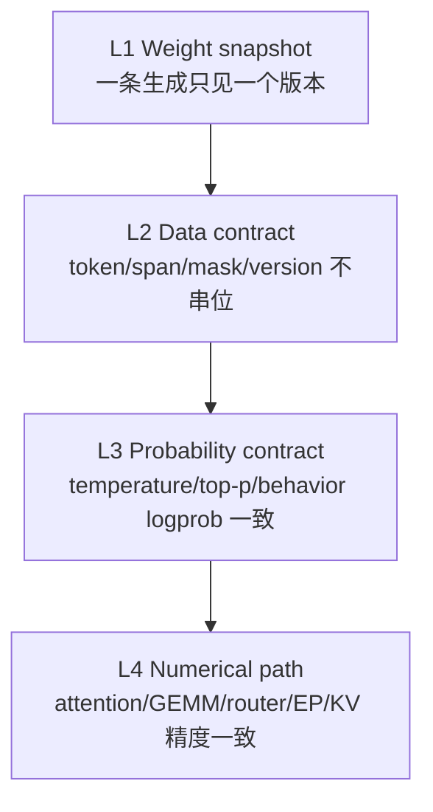

# slime 训推一致性深潜

> **文档类型**：slime 段 1 核心机制 · Train–Inference Consistency
> **源码基线**：slime `main@681b3adca54105d5ecd3fb822fa0dc58a427e0f9`
> **基线提交时间**：2026-08-12T16:50:12+07:00
> **核验日期**：2026-08-14
> **系列入口**：[[slime/index]]
> **结论先行**：slime 把训推一致性拆成可独立验证的四层：同一权重快照、同一 token/mask 数据、同一 sampling distribution、同一算子/路由数值路径。前两层是通用框架契约；top-p 与 MoE 有专门 replay；kernel 级 `<1e-6` 门禁目前是 GLM-5 专项。无法严格对齐时，再用 mismatch metrics、TIS/ICEPOP/OPSM 降低偏差，而不是把修正算法当成精确一致性的替代品。

---

## 1. 四层一致性模型



| 层 | 失败表现 | slime 的主要机制 |
|---|---|---|
| L1 权重快照 | 一条 response 混用 v 与 v+1 | generation barrier；pause/flush/update/resume；`weight_versions` |
| L2 数据契约 | response token 与 logprob/mask/routing 错位 | `Sample.append_response_tokens`、长度校验、compact `rollout_id` |
| L3 概率分布 | 训练算 raw softmax，rollout 来自 temperature/top-p 截断分布 | temperature 重放、top-p nucleus ragged replay、rollout logprob |
| L4 数值路径 | 权重相同但 attention/GEMM/MoE 路由造成 logprob 漂移 | deterministic mode、batch-invariant kernels、DeepEP bridge、layerwise/e2e gate |

把四层分开很重要：L4 的数值差异可以累积为 L3 的 ratio 偏离；但 L1 混版本是提交协议错误，不能靠“换确定性 kernel”解决。

## 2. L1：权重 snapshot 与提交原子性

同步主链在 rollout 完成后训练、再更新权重；下一 rollout 才看见新版本。[`train.py:48-91`](https://github.com/THUDM/slime/blob/681b3adca54105d5ecd3fb822fa0dc58a427e0f9/train.py#L48-L91) 异步主链虽然让 rollout N+1 与 train N overlap，但到权重更新时间会先 `ray.get` generation future，防止生成中途换权重。[`train_async.py:31-40`](https://github.com/THUDM/slime/blob/681b3adca54105d5ecd3fb822fa0dc58a427e0f9/train_async.py#L31-L40) [`train_async.py:66-70`](https://github.com/THUDM/slime/blob/681b3adca54105d5ecd3fb822fa0dc58a427e0f9/train_async.py#L66-L70)

updater 的提交序列进一步是：

```text
pause generation
flush KV/cache
convert + transfer all parameter buckets
optional quantization postprocess
continue generation
```

NCCL path 在 rank 0 pause/flush 后用 Gloo barrier 对齐所有 trainer ranks，分 non-expert/expert 两阶段发送，全部完成才 resume。[`update_weight_from_distributed.py:102-146`](https://github.com/THUDM/slime/blob/681b3adca54105d5ecd3fb822fa0dc58a427e0f9/slime/backends/megatron_utils/update_weight/update_weight_from_distributed.py#L102-L146) 每个 bucket 还用 Ray lock 串行化 broadcast，避免并发 NCCL deadlock。[`update_weight_from_distributed.py:240-265`](https://github.com/THUDM/slime/blob/681b3adca54105d5ecd3fb822fa0dc58a427e0f9/slime/backends/megatron_utils/update_weight/update_weight_from_distributed.py#L240-L265)

disk path 把目录命名为 `weight_vNNNNNN`，热加载时可在 CI 模式读取每个 engine 的 version 并与期望比较，成功后才 continue generation。[`actor_group.py:227-269`](https://github.com/THUDM/slime/blob/681b3adca54105d5ecd3fb822fa0dc58a427e0f9/slime/ray/actor_group.py#L227-L269) delta disk 的 index 同时记录 `version` 与 `base_version`，文件使用原子写，pull/apply 后再 reload。[`update_weight_from_disk_delta.py:127-190`](https://github.com/THUDM/slime/blob/681b3adca54105d5ecd3fb822fa0dc58a427e0f9/slime/backends/megatron_utils/update_weight/update_weight_from_disk_delta.py#L127-L190)

SGLang 返回的 `meta_info.weight_version` 会追加到 sample 的 `weight_versions`，所以多轮/partial 轨迹可以审计是否跨版本。[`types.py:397-416`](https://github.com/THUDM/slime/blob/681b3adca54105d5ecd3fb822fa0dc58a427e0f9/slime/utils/types.py#L397-L416)

## 3. L2：token、mask 与行为元数据必须同长

`Sample.append_response_tokens` 是 consistency ABI：

- logprob 长度必须等于本次 token 数；
- trainable model token 没有 rollout logprob 会直接报错；
- tool/environment token 必须无 logprob，框架填 0 并把 loss mask 置 0；
- partial append 时合并 top-p 与 routed-expert metadata；
- 每次追加后校验 response length、mask、logprob、top-p offsets。

实现见 [`types.py:253-314`](https://github.com/THUDM/slime/blob/681b3adca54105d5ecd3fb822fa0dc58a427e0f9/slime/utils/types.py#L253-L314)、[`types.py:316-395`](https://github.com/THUDM/slime/blob/681b3adca54105d5ecd3fb822fa0dc58a427e0f9/slime/utils/types.py#L316-L395) 与 [`types.py:418-443`](https://github.com/THUDM/slime/blob/681b3adca54105d5ecd3fb822fa0dc58a427e0f9/slime/utils/types.py#L418-L443)。

compact/subagent 一条 rollout 可 fanout 多个训练 sample。RolloutManager 在 flatten 前要求 sibling 都有非空且相同的 `rollout_id`，否则 loss reducer 会把一条 rollout 错算成 N 条。[`rollout.py:690-700`](https://github.com/THUDM/slime/blob/681b3adca54105d5ecd3fb822fa0dc58a427e0f9/slime/ray/rollout.py#L690-L700) [`rollout.py:941-970`](https://github.com/THUDM/slime/blob/681b3adca54105d5ecd3fb822fa0dc58a427e0f9/slime/ray/rollout.py#L941-L970)

## 4. L3：重放 rollout 的真实 sampling distribution

### 4.1 Temperature

rollout 请求把 temperature/top-p/top-k 放入 SGLang sampling params，并要求返回 token logprob。[`sglang_rollout.py:94-107`](https://github.com/THUDM/slime/blob/681b3adca54105d5ecd3fb822fa0dc58a427e0f9/slime/rollout/sglang_rollout.py#L94-L107) 训练侧计算 response logprob 前同样用 `rollout_temperature` 缩放 logits。[`loss.py:513-544`](https://github.com/THUDM/slime/blob/681b3adca54105d5ecd3fb822fa0dc58a427e0f9/slime/backends/megatron_utils/loss.py#L513-L544)

若忽略 temperature，比较的就不是同一个分布：训练侧 $\log\pi_\theta(y\mid x)$ 与 rollout 的 $\log\pi^{(T)}(y\mid x)$ 会出现系统偏差，TIS ratio 会把采样变换误认为 policy lag。

### 4.2 Top-p nucleus replay

当 `rollout_top_p != 1`，SGLang 被要求返回每个 response token 的 nucleus token ids。`Sample` 用 ragged `ids + offsets` 保存，RolloutManager 验证 `len(offsets)=response_length+1` 且最后 offset 等于 ids 长度。[`sglang_rollout.py:95-107`](https://github.com/THUDM/slime/blob/681b3adca54105d5ecd3fb822fa0dc58a427e0f9/slime/rollout/sglang_rollout.py#L95-L107) [`rollout.py:828-846`](https://github.com/THUDM/slime/blob/681b3adca54105d5ecd3fb822fa0dc58a427e0f9/slime/ray/rollout.py#L828-L846)

训练侧为 `[T, local_vocab]` 构造 keep mask，并处理 CP1、zigzag CP、allgather CP 与 TP vocab shard；只有记录了 nucleus 的 response row 被 mask。[`loss.py:326-429`](https://github.com/THUDM/slime/blob/681b3adca54105d5ecd3fb822fa0dc58a427e0f9/slime/backends/megatron_utils/loss.py#L326-L429) keep mask 只应用于 logprob，entropy 仍在完整 raw distribution 上计算；全 `[T,V]` 只前向一次再切 per-sample，避免每 sample 重复大词表 backward。[`loss.py:513-604`](https://github.com/THUDM/slime/blob/681b3adca54105d5ecd3fb822fa0dc58a427e0f9/slime/backends/megatron_utils/loss.py#L513-L604)

若 top-p 开启但 replay payload 缺失，训练直接抛错，而不是静默回退到 full softmax。[`loss.py:83-94`](https://github.com/THUDM/slime/blob/681b3adca54105d5ecd3fb822fa0dc58a427e0f9/slime/backends/megatron_utils/loss.py#L83-L94)

> **边界**：当前 CLI 同时支持 rollout top-k，但通用 `Sample` 契约只定义 top-p nucleus replay；SGLang custom metadata 也只在 top-p 非 1 时请求 nucleus ids。[`arguments.py:343-353`](https://github.com/THUDM/slime/blob/681b3adca54105d5ecd3fb822fa0dc58a427e0f9/slime/utils/arguments.py#L343-L353) [`types.py:121-126`](https://github.com/THUDM/slime/blob/681b3adca54105d5ecd3fb822fa0dc58a427e0f9/slime/utils/types.py#L121-L126) 因此本文不把 top-k exact distribution replay 算作已闭环能力。

### 4.3 Behavior logprob 的三种用法

| 配置 | PPO old policy | mismatch/TIS 基准 | 适用语义 |
|---|---|---|---|
| 默认重算 | actor 在训练侧重算的 old logprob | 可与 rollout logprob 比较 | 同权重但检查 TIM |
| `use_rollout_logprobs` | rollout logprob 直接作为 old policy | 不再额外 TIS | 把 behavior distribution直接纳入 ratio |
| `use_tis` | PPO old 仍是 train recompute | $\exp(\log p_{\mathrm{train,old}}-\log p_{\mathrm{rollout}})$ | 用 IS 修正 TIM/off-policy |

参数校验禁止 `use_rollout_logprobs` 与 `use_tis` 同时开启，防止同一 behavior correction 被重复使用。[`arguments.py:1049-1083`](https://github.com/THUDM/slime/blob/681b3adca54105d5ecd3fb822fa0dc58a427e0f9/slime/utils/arguments.py#L1049-L1083) [`arguments.py:1849-1860`](https://github.com/THUDM/slime/blob/681b3adca54105d5ecd3fb822fa0dc58a427e0f9/slime/utils/arguments.py#L1849-L1860)

训练 loss 始终可报告 `train_rollout_logprob_abs_diff`，把一致性从“感觉 rollout 看起来正常”变成量化信号。[`loss.py:1136-1151`](https://github.com/THUDM/slime/blob/681b3adca54105d5ecd3fb822fa0dc58a427e0f9/slime/backends/megatron_utils/loss.py#L1136-L1151)

## 5. MoE：选中同一专家仍可能不一致

MoE 一致性有两个层次：

1. expert **集合**相同；
2. top-k **顺序**与 owner reduction accumulation order 相同。

SGLang deterministic biased top-k 使用 `torch.topk(sorted=False)`，Megatron 本地路径默认 sorted=True。源码注释指出：即使 expert set 相同，DeepEP low-latency owner reduction 按 top-k column 顺序消费，BF16 accumulation 顺序变化也会在真正 route diverge 前产生数值差异。alignment bridge 因此只对注册 router 的 GLM-5 非 grouped path改成 sorted=False。[`routing_replay.py:49-75`](https://github.com/THUDM/slime/blob/681b3adca54105d5ecd3fb822fa0dc58a427e0f9/slime/utils/routing_replay.py#L49-L75)

通用 R3 routing replay 则可以 record top indices，并在 forward/backward 严格逐次 pop；所有 router 的 forward/backward 消费次数必须等于 recorded 数，否则抛错。[`routing_replay.py:78-140`](https://github.com/THUDM/slime/blob/681b3adca54105d5ecd3fb822fa0dc58a427e0f9/slime/utils/routing_replay.py#L78-L140) [`routing_replay.py:168-213`](https://github.com/THUDM/slime/blob/681b3adca54105d5ecd3fb822fa0dc58a427e0f9/slime/utils/routing_replay.py#L168-L213)

rollout-side route replay要求 SGLang 返回 `[token, layer, topk]` 元数据；`Sample` 对 partial append 的 row 数、layer 数与 router top-k 做严格 shape 检查，RolloutManager 在启用 replay 时再验证完整层覆盖。[`types.py:352-395`](https://github.com/THUDM/slime/blob/681b3adca54105d5ecd3fb822fa0dc58a427e0f9/slime/utils/types.py#L352-L395) [`rollout.py:848-852`](https://github.com/THUDM/slime/blob/681b3adca54105d5ecd3fb822fa0dc58a427e0f9/slime/ray/rollout.py#L848-L852)

## 6. L4：GLM-5 strict alignment stack

项目文档明确把 train/rollout kernel 级 logprob alignment 限定为 GLM-5 结构，并要求 deterministic SGLang、batch-invariant DeepGEMM/DeepEP 与对齐 patch。[`reproducibility.md:53-56`](https://github.com/THUDM/slime/blob/681b3adca54105d5ecd3fb822fa0dc58a427e0f9/docs/zh/advanced/reproducibility.md#L53-L56)

严格路径包括：

| 差异源 | 对齐机制 |
|---|---|
| 稀疏注意力 | DSA `flashmla_sparse` prefill/decode + deterministic cache |
| dense/MoE GEMM | SGLang block-FP8 DeepGEMM forward，batch-invariant global ops；BF16 backward |
| router/LM head | fp32 router；LM head 双侧 BF16，追求精度匹配而非一律升 FP32 |
| DeepEP 模式 | rollout low-latency，train normal；route-preserving FP32 weighted reduction |
| KV cache | BF16 或 FP8-E4M3；只 gather/反量化命中 page |
| DSA indexer | freeze，避免辅助索引器更新破坏对齐 |

这些能力与限制由 [`reproducibility.md:57-69`](https://github.com/THUDM/slime/blob/681b3adca54105d5ecd3fb822fa0dc58a427e0f9/docs/zh/advanced/reproducibility.md#L57-L69) 汇总。shared env 同时固定 CUBLAS/NCCL deterministic 行为、batch-invariant DeepGEMM、DeepEP/DSA flag，并让 Megatron使用 SGLang-aligned kernels。[`alignment/env.py:1-56`](https://github.com/THUDM/slime/blob/681b3adca54105d5ecd3fb822fa0dc58a427e0f9/slime/backends/megatron_utils/alignment/env.py#L1-L56)

`deepgemm_forward` 明确采用 SGLang block-FP8 forward、显式 BF16 GEMM backward，并在首个实现限制 TP1，避免 partial-sum rounding 成为额外混杂因素。[`deepgemm_forward.py:1-12`](https://github.com/THUDM/slime/blob/681b3adca54105d5ecd3fb822fa0dc58a427e0f9/slime/backends/megatron_utils/alignment/deepgemm_forward.py#L1-L12) 综合 hook 安装 batch-invariant global ops、RMSNorm、dense/MoE forward、router GEMM、DeepEP bridge 与可选 layerwise dump。[`deepgemm_forward.py:1110-1147`](https://github.com/THUDM/slime/blob/681b3adca54105d5ecd3fb822fa0dc58a427e0f9/slime/backends/megatron_utils/alignment/deepgemm_forward.py#L1110-L1147)

## 7. 不是宣言，而是两级回归门禁

### 7.1 End-to-end online weight update gate

`test_glm52_6layer_deterministic_e2e.py` 启动真实 6-layer GLM-5.2、Megatron→SGLang NCCL online weight update、DSA、DeepGEMM FP8、DeepEP 与 GRPO+TIS/ICEPOP 配置。[`test_glm52_6layer_deterministic_e2e.py:185-257`](https://github.com/THUDM/slime/blob/681b3adca54105d5ecd3fb822fa0dc58a427e0f9/tests/test_glm52_6layer_deterministic_e2e.py#L185-L257) 测试断言 `train_rollout_logprob_abs_diff < 1e-6`，同时确认主模型参数全部训练、indexer 冻结，并明确不使用 rollout routing replay。[`test_glm52_6layer_deterministic_e2e.py:413-439`](https://github.com/THUDM/slime/blob/681b3adca54105d5ecd3fb822fa0dc58a427e0f9/tests/test_glm52_6layer_deterministic_e2e.py#L413-L439)

### 7.2 Layerwise exact-zero gate

layerwise hook捕获 input ids 与指定 decoder/module 输出，缺失层会直接失败，而不是只比较最终 logprob 后猜是哪层漂了。[`layerwise_alignment.py:41-113`](https://github.com/THUDM/slime/blob/681b3adca54105d5ecd3fb822fa0dc58a427e0f9/slime/backends/megatron_utils/alignment/layerwise_alignment.py#L41-L113) 项目文档说明短 gate 要求 decoder layer 0–5 所有匹配 hidden-state 元素绝对误差严格为 0。[`reproducibility.md:71-78`](https://github.com/THUDM/slime/blob/681b3adca54105d5ecd3fb822fa0dc58a427e0f9/docs/zh/advanced/reproducibility.md#L71-L78)

两级门禁的意义不同：layerwise zero 快速定位首次分叉；e2e `<1e-6` 验证真实权重更新、rollout 与训练闭环没有在最终行为分布上重新积累误差。

## 8. 无法严格对齐时的偏差控制

### 8.1 TIS 与 ICEPOP

vanilla TIS 用

$$
\begin{aligned}
w
&=\operatorname{clip}\!\left(
\exp\!\left(\log p_{\mathrm{train,old}}-\log p_{\mathrm{rollout}}\right),
C_{\mathrm{low}}, C_{\mathrm{high}}
\right).
\end{aligned}
$$

乘 policy loss，并报告 ratio、clip fraction 与 $\lvert w-1\rvert$。[`loss.py:884-905`](https://github.com/THUDM/slime/blob/681b3adca54105d5ecd3fb822fa0dc58a427e0f9/slime/backends/megatron_utils/loss.py#L884-L905) ICEPOP 则把区间外 ratio 权重置 0，相当于 rejection，而非继续用边界值；方差更受控，但丢弃信号更多。[`loss.py:908-931`](https://github.com/THUDM/slime/blob/681b3adca54105d5ecd3fb822fa0dc58a427e0f9/slime/backends/megatron_utils/loss.py#L908-L931)

当 custom TIS/RS 改 loss mask 时，slime 为 backprop 重建 reducer，但 mismatch 指标仍用 rejection 前 mask 聚合，避免“被拒 token 不进 denominator，truncate_fraction 人为变 0”。[`loss.py:1049-1092`](https://github.com/THUDM/slime/blob/681b3adca54105d5ecd3fb822fa0dc58a427e0f9/slime/backends/megatron_utils/loss.py#L1049-L1092) [`loss.py:1156-1163`](https://github.com/THUDM/slime/blob/681b3adca54105d5ecd3fb822fa0dc58a427e0f9/slime/backends/megatron_utils/loss.py#L1156-L1163)

### 8.2 OPSM

OPSM 计算 sequence-level old/new KL；当 advantage 为负且 sequence KL 超过阈值时，整序列 policy loss 被 mask。[`ppo_utils.py:54-92`](https://github.com/THUDM/slime/blob/681b3adca54105d5ecd3fb822fa0dc58a427e0f9/slime/utils/ppo_utils.py#L54-L92) 它针对“大幅 off-policy 的负优势轨迹可能被错误放大”的风险，代价是引入序列级选择与有效 batch 下降。

### 8.3 低精度近似路径

BF16 train + FP8 rollout 是项目推荐生产路径：更新时训练 BF16 权重按 rollout checkpoint 的 quantization config 再量化给 SGLang。[`low-precision.md:3-7`](https://github.com/THUDM/slime/blob/681b3adca54105d5ecd3fb822fa0dc58a427e0f9/docs/zh/advanced/low-precision.md#L3-L7) 它换取显存/带宽/吞吐，不等于逐 token logprob 严格相同；应把 `train_rollout_logprob_abs_diff`、TIS 分位数、reward/quality 与吞吐一起纳入门禁。

## 9. 一致性能力分级

| 等级 | 验收定义 | 当前 slime 证据 |
|---|---|---|
| C0 形状一致 | token/mask/logprob/routing 长度严格相等 | `Sample` 与 RolloutManager assertions |
| C1 snapshot 一致 | 单 generation 不跨 weight version | async barrier + pause/flush/update/resume |
| C2 distribution 一致 | temperature/top-p 后的 behavior logprob可在 train 侧重建 | top-p ragged replay + temperature scaling |
| C3 kernel 级近似 | e2e logprob diff 低于阈值 | GLM-5.2 `<1e-6` gate |
| C4 layerwise exact | 指定层 hidden states exact-zero | GLM-5 layerwise gate |

不要把 C3/C4 泛化到所有 model/backend/parallelism。项目文档明确说 GLM-5 only；其他模型当前最多证明到其实际跑过的 C0–C2 与各自测试门禁。[`reproducibility.md:53-56`](https://github.com/THUDM/slime/blob/681b3adca54105d5ecd3fb822fa0dc58a427e0f9/docs/zh/advanced/reproducibility.md#L53-L56)

## 10. 最小诊断顺序

1. **权重**：初始 push 后跑 `check_weight_update_equal`，确认 engine version 相同。
2. **token/span**：join rollout/train debug dump 的 sample index，比较 tokens、response length、loss mask。
3. **sampling**：确认 temperature、top-p nucleus payload、rollout logprob 都存在且长度一致。
4. **版本**：检查每条 sample 的 `weight_versions`；partial/multi-turn 按 segment 审计。
5. **概率**：看 `train_rollout_logprob_abs_diff`、OIS/TIS ratio 分位数，不只看均值。
6. **路由**：MoE 先比较 route set，再比较 top-k order 与 combine reduction。
7. **layerwise**：从第一处分叉层向下定位 attention/GEMM/EP/KV。
8. **算法修正**：只有确认 mismatch 来源与规模后，再选择 TIS/ICEPOP/OPSM；不能用 correction 掩盖错 token 或混版本。

debug 文档建议第一步检查 rollout/ref logprob 是否相等、推一训一时 KL 是否为 0，并提供 rollout-only/train-only dump/replay 以固定训练输入。[`debug.md:3-24`](https://github.com/THUDM/slime/blob/681b3adca54105d5ecd3fb822fa0dc58a427e0f9/docs/zh/developer_guide/debug.md#L3-L24) [`debug.md:26-55`](https://github.com/THUDM/slime/blob/681b3adca54105d5ecd3fb822fa0dc58a427e0f9/docs/zh/developer_guide/debug.md#L26-L55)

## Related Pages

- [[01_slime_architecture_overview_analysis|D08 slime 架构与端到端闭环]]
- [[30_slime_rollout_optimization_analysis|slime Rollout 优化深潜]]
- [[31_slime_posttraining_stability_analysis|slime 后训练稳定性深潜]]
- [[20_rl_training_inference_precision_analysis|RL 训练—推理精度与 TIM]]
- [[25_on_policy_off_policy_staleness_analysis|On-policy、Off-policy 与 Staleness]]
- [[07_training_reliability/10_determinism_and_numerical_reliability_analysis|确定性与数值可靠性]]
