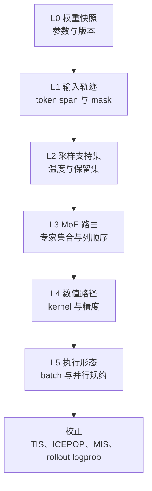
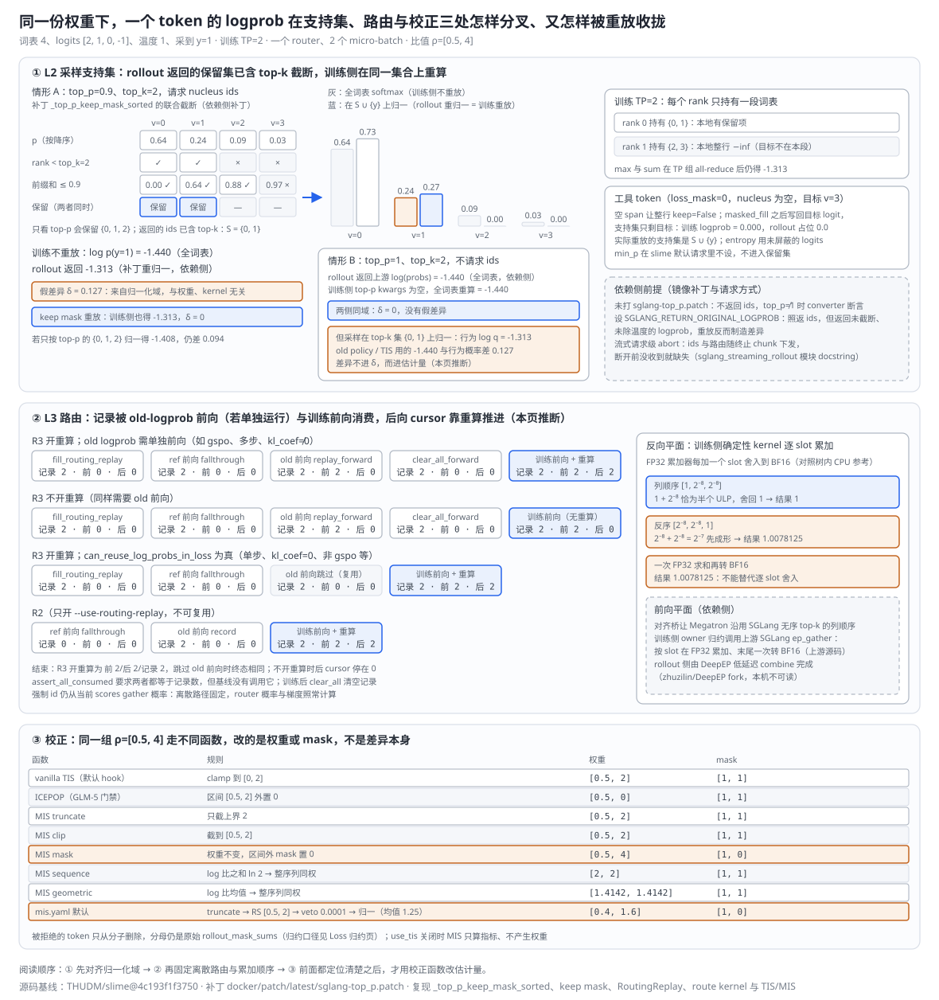
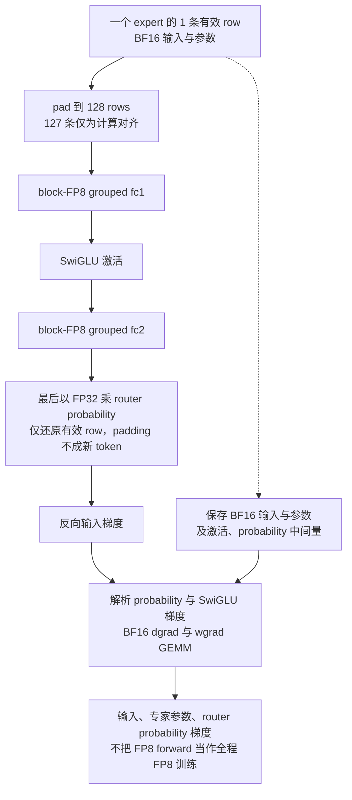
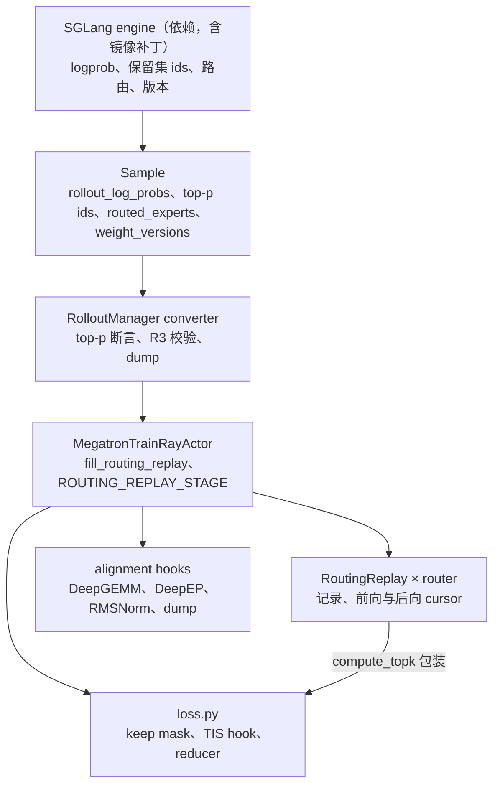
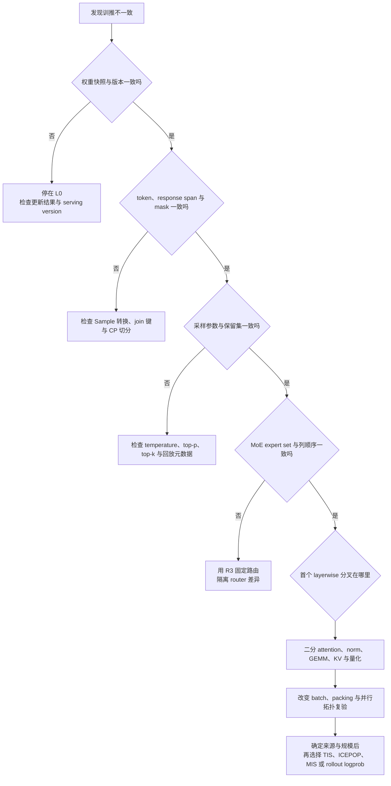

# slime 训推一致性分析

> **源码基线**：`THUDM/slime@4c193f1f37509cca70f0e88807a9305b70f63f4e`（`main`，2026-09-03）
> **源码基线**：`sgl-project/sglang@0b3bb0cbe31873994c9f989fddfe2f87ca839fdd`（`v0.5.15.post1`，2026-07-13）
> **源码基线**：`NVIDIA/Megatron-LM@1dcf0dafa884ad52ffb243625717a3471643e087`（`dev`，2026-02-14）
> **主题**：同一个已生成 token 在 rollout 与训练两侧的 logprob 为什么会不同，以及 slime 按六层一致性阶梯 L0–L5 给出的定位钩子：权重快照与版本、输入轨迹与两类 dump、行为策略元数据与支持集重放、MoE 路由重放与有序 top-k、对齐替换层与确定性 route kernel、批次与并行执行，随后是 TIS、ICEPOP 与示例 MIS 校正。核心代码在 `slime/utils/{types,routing_replay}.py`、`slime/backends/megatron_utils/{loss,actor}.py`、`slime/backends/megatron_utils/alignment/` 与镜像补丁 `docker/patch/latest/`。
> **适用范围**：训推数值一致性的证据链、依赖补丁交接与校正；权重传输归权重同步页，loss 缩放与 reducer 归 Loss 归约页，Sample 字段与 dump 格式归 Sample 页与容错可观测性页，低精度格式归低精度页。
> **最近更新**：2026-09-17。本页覆盖六层阶梯、top-k 在支持集重放中的两种情形、GLM-5 对齐栈的补丁交接与门禁 skip 语义，以及 TIS/MIS 校正与示例 README 的冲突。

---

## 1. 特性概览

### 1.1 问题背景

对已生成 token $y_t$，最直接的比较量是

$$
\delta_t=
\left\lvert
\log p_{\mathrm{train}}(y_t\mid h_t)
-
\log p_{\mathrm{rollout}}(y_t\mid h_t)
\right\rvert.
$$

两侧参数逐元素相等，只固定了函数的参数：两侧仍可能喂给模型不同的 token、位置与 mask，在不同的归一化域里取概率（温度与 top-k、top-p 截断后的保留集），在 MoE 层选到不同的专家或以不同列顺序累加，用不同的 kernel、量化链与精度，在不同的 batch 形状与并行规约下执行。任何一层不同，$\delta_t$ 就不为零，而且上一层的差异会让下一层的比较失去意义：token 错位之后再比较 hidden state，比较的已经不是同一个计算。反过来，$\delta_t=0$ 也不保证两侧用的就是行为概率：两侧可以在同一个错误的域上一致（§2.1.1 情形 B）。

### 1.2 六层一致性阶梯 L0–L5

slime 没有一个"训推一致"总开关，而是给每一层一个可以单独打开、单独失败的钩子。源码逐项实现了这些钩子，但没有一处写下"一致性应组织成六层"；分层是本页按实现形态与失败路径重建的组织方式（本页推断）。其他页面引用时，以下表的"层号 + 名称"为准，校正不是第七层，而是阶梯之后的一步。

| 层 | 名称 | 固定的不变量 | slime 的钩子 | 本页小节 |
|---|---|---|---|---|
| L0 | 权重快照 | 同一个完整参数版本 | `--check-weight-update-equal`；Sample 的 `weight_versions` | §2.2.1 |
| L1 | 输入轨迹 | 同一段 token、位置与 mask | `Sample.append_response_tokens` 的长度守卫；rollout 与 train 两类 dump；`--load-debug-rollout-data` 回放 | §2.2.2 |
| L2 | 采样支持集 | 同一温度与保留集（top-k 与 top-p 联合截断） | 请求返回选中 token logprob 与保留集 ids；训练侧按 rollout 温度缩放后用 keep mask 重算 | §2.2.3 |
| L3 | MoE 路由 | 同一组专家及其列顺序 | `--use-routing-replay`（R2）、`--use-rollout-routing-replay`（R3）；GLM-5 对齐路径的有序 top-k | §2.2.4 |
| L4 | 数值路径 | 同一 kernel、量化链与精度 | `alignment/` 替换层（DeepGEMM、DeepEP、RMSNorm）与镜像补丁；确定性 route kernel；逐层 dump | §2.2.5、§2.2.6 |
| L5 | 执行形态 | batch 与并行规约下的不变性 | 全局批不变算子、每个 PP 边界的 RMSNorm、parallel check | §2.2.7 |
| 校正 | — | 不固定任何不变量，改估计量 | rollout logprob 作 old policy；TIS、ICEPOP、示例 MIS 与拒绝 | §2.2.9 |

前面各层查清差异的来源与规模之后，才用校正去改目标函数。L2 与 L4 的 rollout 侧行为依赖镜像里的 SGLang 与 Megatron 补丁：slime 源码只证明请求怎样发出、返回值怎样被守卫与消费，补丁与上游 SGLang 的实现单独标注（§2.2.3、§2.2.5）。


```mermaid
flowchart TB
    W["L0 权重快照<br/>参数与版本"] --> I["L1 输入轨迹<br/>token span 与 mask"]
    I --> S["L2 采样支持集<br/>温度与保留集"]
    S --> R["L3 MoE 路由<br/>专家集合与列顺序"]
    R --> K["L4 数值路径<br/>kernel 与精度"]
    K --> P["L5 执行形态<br/>batch 与并行规约"]
    P --> C["校正<br/>TIS、ICEPOP、MIS、rollout logprob"]
```

### 1.3 收益、开销和约束

| 层 | 直接收益 | 必付成本或边界 |
|---|---|---|
| L0 权重快照 | 首次推送后逐张量等值检查；每条 Sample 带版本号 | 等值检查只做一次，只证明参数到达 |
| L1 输入轨迹 | 两类 dump 可按 rollout 位置 join；固定输入去掉 rollout 随机性 | 磁盘与存储；回放不能重现在线采样 |
| L2 采样支持集 | 在 rollout 的保留集上重算，消掉截断带来的假差异（本例 0.127）；保留集已含 top-k | 每个 token 多一段 ragged ids；训练侧多一份屏蔽副本、一遍 softmax 与两次 TP all-reduce；依赖 `sglang-top_p.patch`；`top_p=1` 而 `top_k≠-1` 时不请求 ids，差异不进 δ 而进 old policy 与 TIS |
| L3 MoE 路由 | R3 固定离散专家，隔离 router 差异 | 每 token 每层 top-k 个 id 的存储与搬运；会掩盖 router 为何分叉 |
| L4 数值路径 | GLM-5 路径上逐层 bitwise、e2e 差 ≤ 9.999e-7 | 只支持特定结构、补丁栈与软件栈；TP=1、专家 TP=1 等拓扑限制；栈缺失时门禁 skip |
| L5 执行形态 | 并行检查覆盖 DP 与 TP/PP/CP | 只比较 grad norm，容差 0.01 |
| 校正 | 已知 mismatch 下降低目标函数偏差 | 改变估计量；修不了错 token、缺元数据或混版本 |

### 1.4 术语与符号

采样时，第 $t$ 步保留集合为 $S_t$（由 top-k、top-p 与可选 min-p 联合截断得到），rollout 的行为分布是温度缩放后在 $S_t$ 上的重新归一化：

$$
q_t(v)=
\frac{
\exp\!\left(z_{t,v}/T\right)\mathbf{1}[v\in S_t]
}{
\sum_{u\in S_t}\exp\!\left(z_{t,u}/T\right)
}.
$$

| 术语 | 含义 |
|---|---|
| 行为策略 | 真正生成 response 的 rollout 分布 $q_t$；训练侧重算要落在它的定义域上 |
| 保留集（nucleus ids） | 补丁返回的 `top_p_token_ids`：按 top-k 与 top-p 联合截断后的 token 集合；slime 字段名沿用 "top_p" |
| keep mask | 训练侧 `[T, vocab_local]` 布尔矩阵，保留集外置 −inf，目标 logit 写回 |
| R2 / R3 | `--use-routing-replay`（训练侧自己记录再回放）与 `--use-rollout-routing-replay`（回放 rollout 返回的专家 id） |
| stage 与 cursor | 环境变量 `ROUTING_REPLAY_STAGE` 决定本次 router 调用记录、透传还是回放；每个 router 有前向与反向两个 cursor |
| TIS / ICEPOP / MIS | 截断、区间外置零与示例里的多级重要性采样；RS 是基于同一比值的拒绝，veto 是整序列否决 |
| pre-RS reducer | 用原始 `loss_masks` 构造、只用于 mismatch 指标聚合的 reducer |

---

## 2. 训推一致性详细方案

### 2.1 最小实例：一个 token 的 logprob 穿过支持集、路由与校正

取词表只有 4 个 token 的一个位置：两侧同一份权重下的 logits 为 z = [2, 1, 0, −1]，`--rollout-temperature 1`、`--rollout-top-p 0.9`、`--rollout-top-k 2`，采到 y = 1；训练侧 TP=2，词表分片为 rank 0 持有 {0, 1}、rank 1 持有 {2, 3}。同一条 response 里还有一个工具 token，loss_mask 为 0、保留集为空。另取同一位置在 `--rollout-top-p 1`、`--rollout-top-k 2` 下的情形作对照。MoE 部分只看一个 router 与一步训练里的两个 micro-batch，以及某个 token 的 3 个 route 梯度 1、2⁻⁸、2⁻⁸；校正部分看同一序列两个 token 的比值 ρ = exp(train_old − rollout) = [0.5, 4]。下图的三个面板按这个顺序回放。



| 层 | 比较对象 | 决定性操作 | 本例结果 |
|---|---|---|---|
| L2 联合截断 | 降序概率 [0.64, 0.24, 0.09, 0.03] | rank < 2 得 {0, 1}；不含自身的前缀和 ≤ 0.9 得 {0, 1, 2}；两者取与 | S = {0, 1}：返回的 ids 已含 top-k 截断 |
| L2 情形 A 不重放 | 全词表 softmax | $z_y-\mathrm{logsumexp}(z)$ | −1.440，与 rollout 返回的 −1.313（补丁重归一，依赖侧）差 0.127 |
| L2 情形 A 重放 | S ∪ {y} | keep mask 把 S 外置 −inf、目标 logit 写回 | −1.313，δ = 0 |
| L2 只按 top-p 的反例 | {0, 1, 2} | 在只按 top-p 的集合上归一 | −1.408，仍差 0.094 |
| L2 TP=2 | rank 1 本地整行被屏蔽 | max 与 sum 在 TP 组 all-reduce | 仍为 −1.313 |
| L2 工具 token | 空保留集 | 写回后支持集只剩目标 | 训练 0.000，rollout 占位 0.0，loss_mask 0 |
| L2 情形 B：`top_p=1`、`top_k=2` | 全词表（不请求 ids） | 上游 sampler 返回 `log(probs)`；训练侧全词表重算 | 两侧都是 −1.440、δ = 0；行为 log q = −1.313，old policy 与 TIS 用的值与行为概率差 0.127 |
| L3 R3 | 两个 micro-batch 的 rollout 专家 id | 记录 2 条 →〔old logprob 需单独前向时〕old 前向取 2 次 → 清前向 cursor → 训练前向取 2 次、重算取 2 次 | 前 2 / 后 2 / 记录 2；`can_reuse_log_probs_in_loss` 为真时跳过 old 前向，终态相同；不开重算时后向 cursor 停在 0（本页推断） |
| L3 反向 route 梯度 | 同一组 3 个 route 梯度 | 训练侧确定性 kernel 每加一个 slot 舍入到 BF16 | 列顺序 [1, 2⁻⁸, 2⁻⁸] 得 1；反序与一次 FP32 求和都得 1.0078125 |
| 校正 vanilla | ρ = [0.5, 4] | clamp 到 [0, 2] | 权重 [0.5, 2]，mask 不变 |
| 校正 ICEPOP | 同上 | 区间 [0.5, 2] 外置 0 | 权重 [0.5, 0]，mask 不变 |
| 校正 mis.yaml | 同上 | truncate 2 → RS [0.5, 2] → veto → 按 token 均值 1.25 归一 | 权重 [0.4, 1.6]，mask [1, 0] |

#### 2.1.1 同一个 token，两种归一化域，top-k 落在哪里

rollout 按 SGLang sampler 的截断采样。上游 `python/sglang/srt/layers/sampler.py::Sampler._sample_from_probs` 在非简单情形下调用 flashinfer 的 `top_k_top_p_sampling_from_probs(..., filter_apply_order="joint")`（kernel 内部属依赖侧），可读的 torch 后备 `top_k_top_p_min_p_sampling_from_probs_torch` 在未截断的降序分布上先算前缀和，再把 rank ≥ top_k 与前缀和（不含自身）> top_p 的位置一起置零。slime 镜像应用的 `docker/patch/latest/sglang-top_p.patch` 在 `python/sglang/srt/layers/utils/logprob.py` 里新增 `_top_p_keep_mask_sorted` 复现这个截断，docstring 说它复现 sampler 的截断（rank < top_k、前缀和在 top_p 内、概率不低于 top1 × min_p），"让重放看到 sampler 实际保留的集合"；实现首行就是 `keep = ranks < top_ks.view(-1, 1)`，再与前缀和条件（以及开 min_p 时的条件）取与。补丁的 `get_top_p_token_ids_from_probs` 返回这个集合，`renorm_logprob_over_top_p` 在集合 ∪ {采到的 token} 上重归一选中 token 的 logprob；两者只处理"请求了 ids 且该行确实有截断"的行（`_top_p_filter_rows`）。字段名里的 "top_p" 因此是历史叫法，集合本身是联合截断的结果。

**情形 A：`rollout_top_p ≠ 1`。** `slime/rollout/sglang_rollout.py::GenerateState` 在采样参数里加 `custom_params={"return_top_p_token_ids": True}`，返回的 ids 已经含 top-k 截断：本例 top_p=0.9 单独会保留 {0, 1, 2}，top_k=2 再去掉 v=2，S = {0, 1}。训练侧若直接对全词表 softmax，y=1 的概率从保留集上的 0.27 降到 0.24、log 值差 0.127，这 0.127 与权重、kernel 都无关，完全来自归一化域；若误以为 top-k 不属于重放集合、只在 top-p 的 {0, 1, 2} 上归一，会得 −1.408，仍差 0.094。keep mask 直接使用返回的 ids，所以不需要单独的 top-k 字段也覆盖了 top-k。实现上有三处容易忽略的细节：`slime/utils/ppo_utils.py::_VocabParallelLogProbEntropy.forward` 在 `masked_fill(~keep, -inf)` 之后把目标位置的 logit 写回，所以真正的支持集是 S ∪ {y}，与补丁在 rollout 侧 force-keep 采到的 token 对称；工具 token 的 span 为空，写回后只剩目标自身，训练侧 logprob 为 0，与 `append_response_tokens` 给工具 token 填的 0.0 占位一致，不会产生 NaN；TP 分片下 rank 1 本地没有任何保留项，整行 −inf，但 max 与 sum 在 TP 组 all-reduce 之后仍得到同一个值。entropy 始终用未屏蔽的 logits 计算。

**情形 B：`rollout_top_p = 1` 且 `rollout_top_k ≠ -1`。** `GenerateState` 不请求 ids，补丁的两个函数都不运行，上游 `Sampler.forward` 返回温度缩放后全词表 softmax 的 `torch.log(probs)`（开 `rl_on_policy_target` 时是全词表 `log_softmax`）；`slime/backends/megatron_utils/loss.py::get_rollout_top_p_logprob_kwargs` 在 `rollout_top_p == 1.0` 时返回空字典，训练侧也在全词表上重算。两侧同域，本例都是 −1.440，没有假差异；但采样实际在 top-k 集 {0, 1} 上归一，行为 log q(y=1) = −1.313，而用作 old policy（`--use-rollout-logprobs`）或 TIS 比值分母的 rollout logprob 是 −1.440，与行为概率差 0.127。这段差不出现在 `train_rollout_logprob_abs_diff` 里，而是进入估计量：每个 token 缺一个 $\log\sum_{v\in S_t}p(v)$ 的归一化常数（本页推断，未运行验证）。

#### 2.1.2 路由：谁消费记录，列顺序为何也要一致

R3 下 `fill_routing_replay` 把每个 micro-batch、每个本地 MoE 层的 rollout 专家 id 写进对应 router 的 `RoutingReplay`；ref 与 teacher 前向把 stage 设成 `fallthrough`，只算不取。old logprob 前向是否单独运行由 `MegatronTrainRayActor.train_actor` 的条件决定：只有 `(not use_rollout_logprobs or get_mismatch_metrics) and not can_reuse_log_probs_in_loss` 时才跑；`can_reuse_log_probs_in_loss` 要求单个训练步（`len(num_microbatches) == 1`）、policy loss、`kl_coef == 0`、不用 rollout logprob、不开 mismatch 指标、无 critic、无 `keep_old_actor`、非 OPD、不是只开 R2，且估计器不是 gspo。维护的 R3 用例（`tests/test_qwen3_30B_A3B_r3.py`、`tests/test_moonlight_16B_A3B_r3.py`）用 `--advantage-estimator gspo` 与 `--recompute-granularity full`，所以 old 前向会跑：它用 `replay_forward` 取完两条，随后 `clear_all_forward` 把前向 cursor 归零。训练时 actor 把 stage 设成 `replay_backward`，`train_one_step` 的前向闭包临时改成 `replay_forward` 取记录、返回前恢复，按普通 `model(**forward_kwargs)` 分支推算，后向 cursor 只在反向重算再次调用 router 时前进：本例开重算时两个 cursor 都停在 2，不开重算时后向 cursor 停在 0（本页推断；Megatron 内部的其他调度分支未核实）。满足可复用条件时 old 前向与 `clear_all_forward` 都跳过，训练前向直接从 0 取到 2，终态仍是前 2 / 后 2 / 记录 2。R2 只开 `--use-routing-replay` 时不可复用，old logprob 前向改用 `record` 记下训练侧自然选择，训练再按同样的方式消费。回放只固定离散 id：`probs = scores.gather(1, top_indices)` 仍从当前 scores 取概率，router 的概率计算与梯度照常进行。

列顺序是另一层，要分前向与反向两个平面。前向是训推对齐的平面。`slime/utils/routing_replay.py::_compute_topk_for_current_router` 的注释说 SGLang 的确定性 DeepSeek/GLM biased top-k 用 `torch.topk(..., sorted=False)`；上游可读的部分是：`sglang-deterministic.patch` 让 `python/sglang/srt/layers/moe/topk.py::biased_grouped_topk_gpu` 在确定性推理下直接调用未编译的 `biased_grouped_topk_impl`，后者用 `sorted=(True if num_fused_shared_experts > 0 else False)`，在 CUDA 上 EP>1 时 `python/sglang/srt/models/deepseek_v2.py::DeepseekV2ForCausalLM.determine_num_fused_shared_experts` 关闭共享专家融合，`sorted=False` 成立（GLM-5 在 SGLang 中走哪个模型类本页未逐一核对）。Megatron `megatron/core/transformer/moe/moe_utils.py::topk_routing_with_score_function` 的本地 `_compute_topk` 用默认 `torch.topk(scores, k=topk, dim=1)`，即 `sorted=True`：专家集合相同而列顺序不同。对齐桥用 `register_ordered_topk_capture` 让 Megatron 沿用 SGLang 的列顺序，`_patch_sglang_deepep_layer` 里的 `setup_ordered_metadata` 把有序 id 交给 DeepEP 的 `token_indices`，`_SGLangEPGatherWithBF16Backward.forward` 再调用上游 SGLang 的 `python/sglang/srt/layers/moe/ep_moe/kernels.py::ep_gather` 做 owner 归约。上游 `_fwd_kernel_ep_gather` 对每个 token 按 top-k 列顺序把 `tmp.to(tl.float32) * acc_weight` 累加进 FP32 累加器，最后一次转成输出 dtype：docstring 说的 "ordered FP32 gather" 与上游 kernel 一致；`routing_replay.py` 注释说列顺序改变的是 "BF16 accumulation"，不精确，累加本身在 FP32 里，BF16 只出现在末尾一次转换。rollout 侧的 combine 在 DeepEP 低延迟路径里完成，属于 `zhuzilin/DeepEP` fork，本机不可读，只能按官方文档的契约叙述。

反向是训练侧确定性的平面，rollout 不跑反向：确定性 route kernel 每加一个 slot 就把 FP32 累加器舍入到 BF16，复现树内 CPU 参考路径（`_DeepEPScatterWithDeterministicBackward.backward` 按列逐次 `grad_chunk.add_`）的 BF16 原位加法。本例按列顺序 1 + 2⁻⁸ 恰好半个 ULP、舍回 1，最终得 1；反序时 2⁻⁸ + 2⁻⁸ 先凑成 2⁻⁷，最终得 1.0078125；一次 FP32 求和再转 BF16 也得 1.0078125。所以 kernel 注释强调不能换成一次 FP32 求和。

#### 2.1.3 校正：同一组比值，四种函数

vanilla TIS 把比值 clamp 到 `[tis_clip_low, tis_clip]` 后乘进逐 token 的 pg loss，mask 原样返回：本例 [0.5, 2]，两个 token 都保留。ICEPOP 把区间外的权重置零：本例 [0.5, 0]，mask 仍不变，第二个 token 的贡献通过权重而不是 mask 消失。示例 MIS 先按 token、sequence 或 geometric 计算 log 比（sequence 为 ln 0.5 + ln 4 = ln 2，整序列同权 2；geometric 为均值，整序列同权 1.414），限制到 [−20, 20] 再取 exp，然后 truncate 只截上界、clip 截两端、mask 保留权重但把区间外 mask 置零；`mis.yaml` 默认是 truncate 上界 2、RS 用同一 log 比与界 [0.5, 2]、veto 阈值 1e-4、token 级 batch 归一：权重 [0.5, 2] 按均值 1.25 归一成 [0.4, 1.6]，RS 把第二个 token 的 mask 置零；均值按原始 `loss_masks` 计算，被拒的 token 也算在内。被拒绝的 token 只从分子删除，分母仍是原始 `rollout_mask_sums`（见 [[15_slime_loss_parallelism_analysis|Loss 归约与并行]]）。

### 2.2 从最小实例到整个一致性体系

各组件的"为何"是本页依据源码形态与失败路径重建的理由（标"本页推断"），源码与官方文档写出的理由单独注明。依赖侧分三类标注：镜像补丁（`docker/patch/latest/*.patch`，补丁文本在 slime 基线可读）、上游 SGLang `v0.5.15.post1` 源码（本机可读，不含补丁）、DeepGEMM 与 DeepEP 的 fork 内部（本机不可读，只按其公开契约与官方文档叙述）。

#### 2.2.1 L0 权重快照与版本

**职责。** `--check-weight-update-equal` 时，`slime/ray/placement_group.py::create_rollout_manager` 在 engine 启动后对所有 engine 发 `check_weights("snapshot")` 与 `check_weights("reset_tensors")`，`train.py` 与 `train_async.py` 都在第一次 `actor_model.update_weights()` 之后发 `check_weights("compare")`；engine 侧经 `SGLangEngine.check_weights` 调用上游 SGLang 的 `/weights_checker` 端点（上游契约）。每条 Sample 在请求结束（`meta_info` 带 `finish_reason`）时把 SGLang 返回的 `weight_version` 追加到 `weight_versions`，partial 或多段 response 因此能暴露跨版本边界。

**为何。** 参数不相等时，后面所有层的比较都没有意义，这一层必须先过（本页推断）。但参数相等只固定了函数的参数，没有固定输入。

**代价与边界。** 等值检查只在首次推送后做一次，比较对象是 engine 启动时从 hf_checkpoint 加载的快照，所以只在 actor 初始权重等于 hf_checkpoint 时成立；它回答的是"权重是否正确到达推理引擎"。pause、flush、拓扑转换与版本号的完整提交协议归 [[16_slime_weight_sync_analysis|权重同步]]。症状通常是生成突然失真、所有 token 的 logprob 都大幅偏离，或一条轨迹出现多个版本。

#### 2.2.2 L1 输入轨迹：Sample 守卫、两类 dump 与回放

**职责。** `Sample.append_response_tokens` 要求 logprob 与 token 等长；可训练 token 缺 logprob、不可训练 token 带 logprob 都抛 `ValueError`；工具 token 填 0.0 占位、loss_mask 为 0、top-p span 补空；每次追加后校验 mask、rollout logprob 与 top-p offsets 的长度（offsets 长度必须是 response 长度 + 1，末值等于 ids 总数）。`RolloutManager.generate` 与 `eval` 调用 `slime/observability/rollout_data_utils.py::save_debug_rollout_data`，把 `Sample.to_dict()` 与 `rollout_id` 写进 `.pt`（eval 文件名带 `eval_` 前缀）；train dump 由 `slime/observability/train_data_utils.py::save_debug_train_data` 在最后一个 PP stage、TP rank 0 执行，所有 CP rank 参加 response 字段的 gather，CP0 再按 DP 收到一个 writer，`_build_dump_payload` 生成的 version-2 payload 以 `partition`（写成 `rollout_position`，即 rollout 位置）优先、`sample_index` 次之恢复全局顺序（`docs/zh/developer_guide/debug.md` 写"按 `sample_index` 排序"，以代码为准），另存 DP 与 micro-batch 布局；跳过 old logprob 单独重算时，actor 从训练前向快照 `log_probs` 放进 dump。`--load-debug-rollout-data` 经 `load_debug_rollout_data` 直接反序列化保存的 Sample，跳过 SGLang 参数解析并强制 `debug_train_only`，可选 subsample 只取首尾子集。`--save-debug-train-data` 与 `--save-debug-rollout-data` 相同时 `slime_validate_args` 抛 `ValueError`；`--dump-details` 会同时设置两者到不同子目录。

**为何。** 同一权重对不同 token 序列给出不同 logits 是正常行为；weight compare 替代不了输入对账。官方 debug 文档把回放的用途写成"固定训练部分输入，去除 rollout 的随机性"，并区分 rollout-only 与 train-only 两种分离调试。

**代价与边界。** 比较时先按 rollout 位置 join，再核对 tokens、response 长度、loss mask 与位置；典型症状是从首个错位 token 开始整段偏差，而不是孤立的小误差。回放适合回答"同一批 Sample 换并行度或 kernel 后训练行为是否一致"，回答不了"重新采样能否得到同一 response"，后者还需要固定采样种子与确定性推理 kernel（本页推断）。dump 格式与恢复边界归 [[18_slime_fault_tolerance_observability_analysis|容错与可观测性]]，Sample 字段语义归 [[12_slime_sample_datasource_analysis|Sample 与 DataSource]]。

#### 2.2.3 L2 行为策略元数据与支持集重放

**职责。** `GenerateState` 把 `rollout_temperature`、`rollout_top_p`、`rollout_top_k` 放进采样参数，每个请求 `return_logprob=True`，`rollout_top_p != 1` 时加 `custom_params={"return_top_p_token_ids": True}`。温度在解析期必须 > 0（`slime_validate_args` 抛 `ValueError`，温度 0 是贪心解码，训练侧还要除以温度）。`Sample` 只保存选中 token 的 `rollout_log_probs`、ragged 的 `rollout_top_p_token_ids`/`offsets`（第 i 个 response token 的保留集是 `ids[offsets[i]:offsets[i+1]]`）与 `rollout_routed_experts`，不存每步完整词表。converter `RolloutManager._convert_samples_to_train_data` 在 `rollout_top_p != 1` 时逐条断言 ids 与 offsets 完整才放进训练字典，loss 入口 `get_rollout_top_p_logprob_kwargs` 缺字段抛 `ValueError`，不会静默退回全词表。训练侧 `get_log_probs_and_entropy` 先按 rollout 温度缩放 logits，`_build_topp_keep_mask` 按 zigzag CP、allgather CP 与 CP=1 三种布局找出每条 response 行、按 TP 词表段填 keep mask（`tests/test_logprob_response_spans.py` 锁定三种布局）；`MegatronTrainRayActor.compute_log_prob` 对 ref、teacher 与 old 三种前向都传 `use_rollout_top_p_replay=True`，所以 KL 等对照量也在同一支持集上。loss 报告 `train_rollout_logprob_abs_diff`：开 `use_rollout_logprobs` 时比较当前 logprob 与 rollout，否则比较训练侧 old logprob（复用时即训练前向的 detached 值）与 rollout。

**为何。** 保存完整 logits 能彻底重放，但每步一个词表大小的向量太贵；选中 token 的 logprob 加保留集 ids 是重建行为分布所需的最小集合（本页推断）。ids 由补丁按 sampler 的同一截断规则算出，所以只存一个集合就同时覆盖 top-k、top-p 与 min-p，不必为每种截断各设一个字段（本页推断）。同一个 token 可以同时在全词表与保留集里，但它在两个归一化域里的概率不同，token id 相等不等于行为分布相等。目标 logit 为什么要写回，补丁注释给了原因：SGLang 用 flashinfer kernel 采样，`renorm_logprob_over_top_p` 用 torch 重算保留集，两者在边界上可能不一致，采到的 token 若落在重算的集合之外就得到 −inf、下游变成 NaN；rollout 侧 force-keep 与训练侧写回目标因此对称。补丁在投机解码的 `compute_spec_v2_logprobs` 里对 accepted token 做同样的 force-keep。

**代价与边界。** 训练侧每次前向多一份 `~keep` 布尔矩阵与屏蔽后的 FP32 `[T, V_local]` 副本；带 entropy 时（`policy_loss_function` 总是带）entropy 用未屏蔽 logits、logprob 用屏蔽 logits，softmax 跑两遍，多两次 TP all-reduce（MAX 与 SUM）；`_fill_topp_mask_rows` 在 Python 里逐 response token 过滤候选 id、建一个小张量再做一次索引写，ref、teacher、old 与训练前向各做一遍（均未测量）。其余边界按依赖侧前提分列：

- **镜像没有 `sglang-top_p.patch`。** SGLang 不返回 ids，`_extract_rollout_top_p_token_data` 让 Sample 的 ids 留空，`rollout_top_p != 1` 时 converter 断言失败（§2.2.5 的 Dockerfile 闸门决定镜像里有没有这个补丁）。
- **设了 `SGLANG_RETURN_ORIGINAL_LOGPROB`。** 补丁仍返回 ids，但跳过 `renorm_logprob_over_top_p`，上游 `Sampler.forward` 返回温度缩放前、未截断的 `log_softmax`，重放反而静默制造它本想消掉的差异。
- **`rollout_top_p = 1` 而 `rollout_top_k ≠ -1`。** 不请求 ids，两侧在全词表上一致、`train_rollout_logprob_abs_diff` 看不出差异，但 old policy 与 TIS 用的不是行为概率（§2.1.1 情形 B）；需要严格的行为概率时，应让 `rollout_top_p` 取一个不改变实际截断的非 1 值来触发 ids 返回（本页推断，slime 没有单独的 top-k 请求开关）。
- **开 min_p。** `GenerateState` 不设 min_p，SGLang 默认 0；自定义生成函数若开 min_p，上游 flashinfer 分支改为 `top_k_renorm_prob` → `top_p_renorm_prob` → `min_p_sampling_from_probs` 的顺序截断，而补丁掩码按未截断分布联合判断，两者可能不同域（上游源码可读，未运行验证）。
- **流式请求级 abort。** `slime/rollout/sglang_streaming_rollout.py::generate_streaming` 标 `abort_mode = "request"`，abort 时取消单个 HTTP 请求；该模块的 module docstring 写明 SGLang 在终止 chunk 上下发 top-p 与路由专家元数据，取消只保留断开前已收到的元数据，需要这些特性在 partial rollout 中保留时应改用 server abort。缺了 ids 的 sample 在 `append_response_tokens` 的长度校验或 converter 断言处报错，而不是静默退回全词表（源码路径推断，未运行验证）。`slime/rollout/streaming_utils.py::SGLangStreamAccumulator` 遇到覆盖整个 response 的 top-p 快照时整段替换本次调用状态，保证增量与累计两种流格式下元数据对齐。
- **OPD teacher 的温度与保留集。** SGLang teacher 模式下 `slime/rollout/on_policy_distillation.py::reward_func` 把 `sampling_params.temperature` 设为 rollout 温度、`max_new_tokens=0`、`logprob_start_len=0`，取的是 prefill 的 input logprob；上游 `python/sglang/srt/layers/logits_processor.py::LogitsProcessor.process_input_logprobs` 对 input logits 直接做 `log_softmax`，不除温度，镜像补丁也没有改这条路径，所以 `rollout_temperature ≠ 1` 时 teacher logprob 仍在温度 1 上，传进去的温度对它不起作用（上游源码可读，未运行验证）。Megatron teacher 模式走 `MegatronTrainRayActor.compute_log_prob(use_rollout_top_p_replay=True)`，训练侧按 rollout 温度缩放并复用学生 rollout 的保留集 keep mask，teacher 分布因此落在学生的截断域上。两种 teacher 的完整取舍见 [[20_slime_on_policy_distillation_analysis|slime OPD]]。

偏差若只在 temperature、top-k 或 top-p 打开后系统出现，应先查支持集重放与请求方式，而不是归因于权重或 kernel。

#### 2.2.4 L3 MoE 路由重放与有序 top-k

**职责。** SGLang 可返回 `[token, layer, topk]` 路由（请求带 `return_routed_experts`）；Sample 在 partial 追加时按 `routed_experts_start_len` 拼接并检查元素数等于 `(len(tokens) − 1 − start) × num_layers × moe_router_topk`；converter 在 R3 下调用 `slime/observability/rollout_data_utils.py::validate_rollout_routed_experts_for_replay`，拒绝维度错误、空 capture，以及 MoE 层全零的 PP capture（只在 top-k > 1 时检查；注释：多半是 SGLang 的 PP stage 没有汇总各自的路由，拒绝"到处回放 expert 0"）。`fill_routing_replay` 经 `slime/backends/megatron_utils/cp_utils.py::prepare_routed_experts_for_routing_replay` 把路由对齐到训练布局：断言每条样本的路由行数等于 token 数减一，补 1 行后按 CP 布局对齐：zigzag 逐样本切片后拼接，再补齐到 TP × `data_pad_size_multiplier` 的倍数；allgather 先拼接、补齐到 CP × TP × `data_pad_size_multiplier` 的倍数再等分；sequence parallel 时再按 TP rank 取本段。镜像里的 `docker/patch/latest/megatron.patch` 在 `megatron/core/transformer/moe/moe_utils.py::topk_routing_with_score_function` 里把 `compute_topk` 包进 `get_routing_replay_compute_topk`，并在 `megatron/core/transformer/moe/router.py::TopKRouter.__init__` 里 `register_routing_replay`；`RayTrainGroup._allocate_gpus_for_actor` 只给 actor 设 `ENABLE_ROUTING_REPLAY=1`（注释：critic 不能做路由重放）。`RoutingReplay.record` 把 id 存成 pinned CPU 张量（非连续视图先压实），取用时搬到当前加速器设备并转 int32；每次取值断言 token 数与 top-k 形状一致。四个 stage 的使用时机：

| stage | router 行为 | actor 中的使用时机 |
|---|---|---|
| `fallthrough` | 自然计算 top-k，不新增记录 | ref 与 teacher 前向 |
| `record` | 自然计算并把 id 记进该 router 的队列 | 仅 R2 的 old logprob 前向 |
| `replay_forward` | 按前向 cursor 取 id，从当前 scores gather 概率 | R3 的 old logprob 前向（若单独运行）；训练前向闭包 |
| `replay_backward` | 按后向 cursor 取 id | 训练期间的环境值，供反向重算时的 router 调用读取 |

`--use-rollout-routing-replay` 在参数校验中强制打开 `--use-routing-replay`，两者不能都简称成同一个功能。严格的 GLM-5 对齐不依赖 R3：DeepEP 对齐桥用 `register_ordered_topk_capture` 注册 router，只对这些非分组 router 改用 `torch.topk(sorted=False)`，其他训练路径保留 Megatron 原语义（列顺序的前向与反向两个平面见 §2.1.2）。维护的 GLM-5 门禁由 `test_glm52_alignment_gate_trains_all_main_model_parameters_without_r3` 断言参数里没有 R3。

**为何。** R3 是强诊断与校正手段，能把离散专家 id 固定下来，但也会掩盖 router 本身为何分叉；自然路由门禁与强制回放两类测试需要同时保留（本页推断）。同一支持集只约束了 LM head 的分布定义，隐藏层的 router 仍可能因微小数值差跨过 top-k 边界。

**代价与边界。** `RoutingReplay.assert_all_consumed` 要求两个 cursor 都等于记录数，但基线没有任何调用方；不开重算时后向 cursor 本就不前进（本页推断）。超出记录的取值会索引失败。rollout 路由的独立 logprob 前向后清前向 cursor，训练结束 `clear_all` 清空记录（lazy 资源接口在基线里没有注册方）。R2 与 `--use-rollout-logprobs` 同开而不开 `--get-mismatch-metrics` 时，`train_actor` 跳过 old logprob 前向，没有任何记录，训练前向的 `replay_forward` 在空列表上取值而抛 `IndexError`，参数校验没有拦截（源码路径推断，未运行验证）。R3 时 CI 的初始 actor/ref KL 检查被放宽，因为 actor 回放 rollout 路由而 ref 走自然路由。流式请求级 abort 下路由元数据同样可能随终止 chunk 丢失（§2.2.3）。典型症状是 dense 层一致、进入首个 MoE 层后出现稀疏大偏差，或专家 id 相同而 combine 输出已有细小误差。

#### 2.2.5 L4 对齐替换层与依赖补丁交接：DeepGEMM、DeepEP、RMSNorm 与逐层 dump

**职责。** `slime/backends/megatron_utils/alignment/env.py::alignment_env` 集中了训推两侧必须共享的数值环境（确定性集合通信与 matmul、DeepGEMM 批不变、DeepEP 低延迟与 DSA 配置，以及让 Megatron 借用 SGLang 的 fused residual RMSNorm、FP8 indexer、router GEMM、RoPE 与 sparse MLA），docstring 写明集群连通性设置（`PYTHONPATH`、`MASTER_ADDR`、网卡、代理、IBGDA）"有意不放在这里"，由 launcher 与门禁测试自己合并。`slime/backends/megatron_utils/alignment/deepgemm_forward.py::_enable_deepgemm_all_forward` 经 `--custom-megatron-before-log-prob-hook-path` 与 `--custom-megatron-before-train-step-hook-path` 安装：全局批不变算子、每个 PP 边界的首层 RMSNorm、absorbed KV 与 final RMSNorm（三者在 `MEGATRON_USE_SGLANG_FUSED_RESIDUAL_RMS≠1` 时直接返回）；`--megatron-deepgemm-forward-layers` 选中的 dense 层走 SGLang 式 block-FP8 forward 与 SwiGLU；`--megatron-deepgemm-moe-forward-layers` 选中的 MoE 层把整个 `TEGroupedMLP` 换成 block-FP8 grouped fc1 → SwiGLU → block-FP8 grouped fc2 → FP32 乘 router 概率，反向是分组 BF16 dgrad/wgrad 加解析 SwiGLU 与概率梯度；`MEGATRON_USE_SGLANG_ROUTER_GEMM=1` 时再装 router GEMM，`deterministic_mode` 且 `moe_enable_deepep` 时装有序 DeepEP gather；设了 `SLIME_LAYERWISE_ALIGNMENT_DUMP_DIR` 就注册逐层 dump。层号用 `layer_number − 1`，PP 各 rank 的本地层从 0 起编号也不会误选。

<!-- Figure spec: TB paired forward/backward paths for one expert row. Forward quantized grouped fc1, SwiGLU, quantized fc2 then router probability FP32. Backward saved BF16 inputs/weights and incoming gradient drive BF16 dgrad/wgrad and analytic activation/probability derivatives, not differentiating integer quantization. -->

```mermaid
flowchart TB
    X["一个 expert 的 1 条有效 row<br/>BF16 输入与参数"] --> PAD["pad 到 128 rows<br/>127 条仅为计算对齐"]
    PAD --> F1["block-FP8 grouped fc1"]
    F1 --> A["SwiGLU 激活"]
    A --> F2["block-FP8 grouped fc2"]
    F2 --> P["最后以 FP32 乘 router probability<br/>仅还原有效 row，padding 不成新 token"]
    P --> D["反向输入梯度"]
    X -.-> SAV["保存 BF16 输入与参数<br/>及激活、probability 中间量"]
    D --> BW["解析 probability 与 SwiGLU 梯度<br/>BF16 dgrad 与 wgrad GEMM"]
    SAV --> BW
    BW --> OUT["输入、专家参数、router probability 梯度<br/>不把 FP8 forward 当作全程 FP8 训练"]
```

**依赖交接。** 这一层的训推对齐一半在 slime 仓内，一半在镜像补丁与 fork 里。slime 的 `--sglang-*` 参数由 `slime/backends/sglang_utils/arguments.py::add_sglang_arguments` 调用 `ServerArgs.add_cli_args` 生成，补丁新增的 `ServerArgs` 字段只有在打过补丁的 SGLang 上才会注册成 flag；未打补丁时 `sglang_parse_args` 与 `megatron_parse_args(ignore_unknown_args=True)` 都用 `parse_known_args`，`--sglang-enable-fp32-moe-router` 被静默丢弃而不报错，要到安装对齐 hook 时才由 `slime/backends/megatron_utils/alignment/deepgemm_forward.py::enable_sglang_router_gemm` 抛 `RuntimeError`。下表按"slime 设什么 → 谁消费 → 起什么作用 → 哪个门禁看见它缺失"排列：

| slime 侧设置 | 消费方（依赖类别） | 作用 | 门禁与缺失时的表现 |
|---|---|---|---|
| `SGLANG_DEEPGEMM_BATCH_INVARIANT=1` | rollout：`sglang-deterministic.patch` 在 `python/sglang/srt/environ.py::Envs` 注册该变量，`python/sglang/srt/layers/deep_gemm_wrapper/entrypoint.py::update_deep_gemm_config` 调补丁新增的 `configure_deep_gemm_batch_invariant` → DeepGEMM fork 的 `set_batch_invariant`（fork 内部不可读）。训练：slime `slime/backends/megatron_utils/alignment/deepgemm_forward.py::enable_sglang_global_batch_invariant_ops`（调用上游 `python/sglang/srt/batch_invariant_ops/batch_invariant_ops.py::enable_batch_invariant_mode`）与 `slime/backends/megatron_utils/alignment/deepgemm_moe_forward.py::_configure_batch_invariant` | 两侧选同一批不变 dense 与 grouped kernel，训练进程也打开 RMS、BMM、FP32 matmul 与 log-softmax 的批不变实现 | `_PREREQ_PROBE` 断言 `deep_gemm.set_batch_invariant` 存在，否则 skip；训练侧缺补丁函数时退回 DeepGEMM setter（注释：B300/cu130 镜像没有 deterministic 补丁），两者都没有或读回未生效抛 `RuntimeError` |
| `SGLANG_DEEPGEMM_PAD_EXPERT_M=1` | `sglang-deterministic.patch` 的 `python/sglang/srt/layers/moe/moe_runner/deep_gemm.py::_should_pad_contiguous_expert_m`（确定性推理时也打开） | rollout 侧每个专家收到的 token 数补齐到 128 的倍数，与训练包装按 DeepGEMM 对齐倍数补齐专家 rows 对应 | 无独立探针，由 e2e 数值门禁覆盖 |
| `SGLANG_DEEPEP_LL_PREFILL_STAGING=1`、`SGLANG_DEEPEP_NUM_MAX_DISPATCH_TOKENS_PER_RANK=64` | 前者由 `sglang-deterministic.patch` 注册并在 `python/sglang/srt/layers/moe/fused_moe_triton/layer.py::FusedMoE._get_deepep_ll_prefill_staging_slices` 消费；后者是上游已有的容量变量 | DeepEP 低延迟模式下 prefill 按容量分段 dispatch，各 rank 先 all-reduce 最大 token 数再同步段数 | 无独立探针 |
| `SGLANG_JIT_KERNEL_EXTRA_PATH` | `sglang-deterministic.patch` 的 `python/sglang/jit_kernel/utils.py::_extra_kernel_roots`；slime `slime/ray/utils.py::RAY_DEFAULT_ENV_VARS` 默认注入 `slime/backends/sglang_utils/jit_kernels` | 让 SGLang JIT 找到 slime 托管的 `glm5_router_gemm` 等 kernel 源码 | 无独立探针 |
| `--sglang-enable-fp32-moe-router`；训练侧 `MEGATRON_USE_SGLANG_ROUTER_GEMM=1` | `ServerArgs.enable_fp32_moe_router` 由 `sglang-deterministic.patch` 新增，`python/sglang/srt/models/deepseek_v2.py::MoEGate.forward` 在确定性推理下改走 `python/sglang/srt/batch_invariant_ops/batch_invariant_ops.py::router_gemm_batch_invariant`（BF16 GEMM、16 行分块、FP32 logits）。训练：slime `slime/backends/megatron_utils/alignment/deepgemm_forward.py::enable_sglang_router_gemm` | 两侧 router logits 用同一 FP32 前向 | `_PREREQ_PROBE` 断言 `enable_fp32_moe_router` 在 `ServerArgs` 字段里，否则 skip；训练侧开 router GEMM 而没传该 flag 时抛 `RuntimeError`（只读 dump 的 train-only 回放除外） |
| `--sglang-enable-deterministic-inference` | 上游字段；`sglang-deterministic.patch` 让 `_DeepEPDispatcherImplLowLatency` 在 DeepEP fork 的 `low_latency_dispatch` 签名含 `align_fp8_quantization` 时传入它，让 `biased_grouped_topk_gpu` 走未编译实现，并把 `dsa` 加进确定性注意力后端 | DeepEP 低延迟 FP8 量化对齐；确定性 top-k 列顺序；DSA 可用于确定性推理 | `_PREREQ_PROBE` 断言 DeepEP `Buffer.low_latency_dispatch` 有 `align_fp8_quantization` 参数，否则 skip |
| `MEGATRON_USE_SGLANG_FUSED_RESIDUAL_RMS=1` | `megatron-sglang-aligned.patch` 的 `megatron/core/transformer/transformer_layer.py::TransformerLayer`（`_use_sglang_fused_residual_rmsnorm`、`_sglang_native_rmsnorm_from_fp32_sum`）；同一变量还打开 slime `deepgemm_forward.py` 的三个 RMSNorm 替换与 `slime_plugins/models/glm5/glm5.py` 的对应分支 | 残差和保持 FP32，按 SGLang 原生 RMSNorm 在未舍入的和上归一；dropout≠0 或带 bias 时补丁抛 `RuntimeError` | `_skip_reason` 检查 Megatron `transformer_layer.py` 含 `_use_sglang_fused_residual_rmsnorm`，缺失 skip；注释写明缺这个补丁时门禁会发散到约 1e-2 而不是启动失败，所以 skip 而非误报 |
| `MEGATRON_USE_SGLANG_FP8_INDEXER`、`_SPARSE_MLA`、`_ROPE`；`DSA_KV_FP8_QAT`、`DSA_KV_FP8_QAT_BLOCK_SIZE` | slime 仓内 `slime_plugins/models/glm5/glm5.py` 与 `slime_plugins/models/glm5/ops/indexer.py`（import SGLang 算子）；`_ROPE` 要求 TP=1 | GLM-5 DSA 训练侧借用 SGLang 的 FP8 indexer、sparse MLA、RoPE，KV 是否做 FP8 QAT | 无独立探针 |
| `SGLANG_DSA_FUSE_TOPK=0`、`SGLANG_DISABLE_DSA_INDEXER_FUSION=1`、`SGLANG_DSA_PREFILL_DENSE_ATTN_KV_LEN_THRESHOLD=0`、`SGLANG_MASKED_GEMM_FAST_ACT=1`；`INDEXER_ROPE_NEOX_STYLE=0` | 前三项是上游 SGLang `v0.5.15.post1` 在 `python/sglang/srt/environ.py::Envs` 注册的变量；`SGLANG_MASKED_GEMM_FAST_ACT` 没有注册，由上游 `python/sglang/srt/layers/moe/moe_runner/deep_gemm.py` 在模块级用 `get_bool_env_var` 读取（均为上游契约）；最后一项由 `sglang.patch` 在 DSA `Indexer.__init__` 读取 | 关闭 DSA 融合 top-k 与 indexer 融合；阈值 0 让 prefill 不因序列短而改走稠密注意力；DeepGEMM masked 布局走融合激活；indexer RoPE 用非 neox 排列 | 无独立探针 |
| `SGLANG_JIT_DEEPGEMM_PRECOMPILE=false` | 上游 `python/sglang/srt/environ.py::Envs` 注册（默认 True），由 `python/sglang/srt/layers/deep_gemm_wrapper/compile_utils.py` 读取；slime `slime/backends/sglang_utils/engine_group.py` 给 SGLang engine 的默认环境也设为 false（上游契约） | 不在启动时按 M 列表预编译 DeepGEMM JIT kernel，首次遇到形状时再编译 | 无独立探针 |
| `CUBLAS_WORKSPACE_CONFIG`、`NCCL_ALGO=^NVLS`、`NCCL_P2P_LEVEL`、`NVTE_ALLOW_NONDETERMINISTIC_ALGO=0`、`TE_DISABLE_FA3`、`TORCH_COMPILE_DISABLE`、`NVSHMEM_DISABLE_NCCL`、`CUDA_DEVICE_MAX_CONNECTIONS` | cuBLAS、NCCL、Transformer Engine、PyTorch 与 NVSHMEM 自身（外部库契约，本页未核） | 确定性集合通信、matmul 与注意力选择 | 无 |

**镜像闸门。** `docker/Dockerfile` 以 `slimerl/sglang:v0.5.15.post1-cu129` 为底座，`ARG PATCH_VERSION=latest`：先 `git apply megatron.patch --3way`，`megatron-sglang-aligned.patch` 只在文件存在时应用；`ARG ENABLE_SGLANG_PATCH=1` 为 1 时按 `sglang.patch`、`sglang-top_p.patch`、`sglang-release_hicache.patch`、`sglang-pull_weights.patch`、`sglang-deterministic.patch` 的顺序逐个 `git apply --check` 后应用，缺失的文件直接 `continue`，检查失败则构建失败（注释：GB200/GB300 暂时跳过 SGLang 补丁，要求用户自带 SGLang）。基线里 `docker/patch/latest/` 与 `docker/patch/v0.5.15.post1/` 的 7 个补丁逐字节相同；更早的 `PATCH_VERSION` 目录只有 `megatron.patch` 与 `sglang.patch`：缺失的补丁文件被跳过、不报错，旧目录的 `sglang.patch` 能否应用到当前底座由 `git apply --check` 决定（未核）；即使构建成功，镜像里也没有支持集重放与对齐栈。补丁本身的清单与"补丁 → 特性"总表目前没有 owner 页（交 planning 决定），权重同步相关的补丁闸门见 [[16_slime_weight_sync_analysis|权重同步]]。

**为何。** 把训练栈整个改成 bitwise 确定需要替换所有算子；对齐被做成可选装的替换层，DeepGEMM 模块 docstring 自称 "an opt-in numerical-alignment hook"，只替换选中的 TE linear，只对齐 forward，backward 仍是显式 BF16 GEMM 与解析式 norm 梯度。第一版还主动缩小范围：要求 TP=1，让每个目标是一整块矩阵，对上 SGLang 的 dense-TP1 执行，把 row-parallel 部分和的舍入作为混杂变量排除。把概率乘法挪到 fc2 之后，是因为 SGLang 在那里乘，分别包两个 linear 表达不了这条边界（模块 docstring）。精度要"匹配"而不是"更高"：官方文档写 LM head 在两侧都保持 bf16，对齐来自精度一致而不是 fp32；同一条目里 MoE router 用 fp32（GLM-5 门禁传 `--moe-router-dtype fp32` 与 `--sglang-enable-fp32-moe-router`）。补丁分三份而不是并进 slime 仓内，是因为消费点在 SGLang 与 Megatron 的模块内部（`ServerArgs`、`MoEGate.forward`、`TransformerLayer` 的残差路径），slime 只能通过镜像补丁改到（本页推断）。路由 id 相同只固定专家 rows 的归属，不决定专家 GEMM 的量化、累加顺序或 combine 精度，所以 L3 通过之后仍会有小误差逐层放大，这一层要靠替换算子与逐层 dump 二分（本页推断）。

**代价与边界。** 这一层的数值替换发生在 DeepGEMM、DeepEP 与 SGLang kernel 内部，最小实例不回放它，上面的流程图只画结构（依赖侧）。dense 路径在 TP≠1 时抛 `RuntimeError`；MoE 包装要求 TP=1、专家 TP=1、bias-free SiLU gated `TEGroupedMLP`、BF16 参数、hidden 与 MoE FFN 维度是 128 的倍数，拒绝与 Megatron FP8、QAT、SwiGLU clamp、`moe_apply_probs_on_input` 或已单独包装的 expert linear 叠加。forward 把各专家的 rows 补齐到对齐倍数，意味着额外 padding 与重排存储；`SLIME_DEEPGEMM_MOE_EXPERTS_PER_GROUP` 控制 forward 分组（批不变时默认取较小的组），`SLIME_DEEPGEMM_MOE_GROUPED_BF16_BACKWARD` 控制分组反向，另两个环境项限制反向分组与 padding 字节。Blackwell 上 block-FP8 权重必须复现 SGLang 的 quant → requant 有损链，单次量化对不上 rollout。逐层 dump 记录 input ids、packed 序列偏移与选中层/模块输出，缺 input 或缺层立即失败。slime 只验证调用、布局与 API 可用性；补丁的消费点可以从补丁文本读到，但补丁能否干净应用只在镜像构建时检查，DeepGEMM 与 DeepEP fork 的内部实现是不可读的依赖边界。

#### 2.2.6 L4 确定性 route kernels

**职责。** `slime/backends/megatron_utils/alignment/deterministic_route_kernels.py` 不重新选专家，只把 token → route 的复制与反向梯度还原做成确定性操作：`scatter_routes_forward` 把 token 行写到唯一的 expert-major route 行，负值 slot 表示无效；`scatter_routes_backward` 每个 token 一个程序，按 top-k 列顺序累加，每次加完舍入到 BF16；`ordered_route_grad` 把 token 梯度乘 FP32 top-k 权重写回唯一 route 行；`compact_route_positions` 用有效 slot 的前缀和生成紧凑的 `(token, slot)` 索引，并用异步断言核对实际 route 数与 metadata handle 的预期数量，避免 `nonzero` 的数据相关输出大小回传 CPU。例如 token A 的两个 slot 映射到 route 2 与 0、token B 的第二个 slot 无效，前向得到 route 行 A、B、A，反向 A 按 slot 顺序先加 route 2 的梯度再加 route 0 的梯度，B 的无效 slot 贡献零。

**为何。** 模块 docstring：只把启动频繁的张量索引换成等价的逐点拷贝或每 token 一程序的有序归约，不用 atomic，每个可见输出元素只有一个写者；逐次 BF16 舍入是为了复现参考实现逐 slot 原位 BF16 加的可见边界（§2.1.2 的 1 与 1.0078125）。

**代价与边界。** 没有独立 CLI 开关：进入 DeepEP 对齐桥后 CUDA 张量直接用这些 kernel，CPU 走索引循环的参考路径。公共校验要求 CUDA、连续 BF16 二维值与连续整数二维映射，ordered grad 另要求 FP32 权重；"每个输出元素唯一写者"是上游 route 映射的不变量，校验函数不扫描 destination 是否重复。基线里这组 kernel 与 DeepGEMM 替换层没有 CPU 单测，数值只由 GPU 端到端门禁覆盖（§2.2.8）。

#### 2.2.7 L5 批次与并行执行

**职责。** `enable_sglang_global_batch_invariant_ops` 在 `SGLANG_DEEPGEMM_BATCH_INVARIANT` 开启时调用 SGLang 的 `enable_batch_invariant_mode` 并读回确认；`enable_sglang_layer0_input_rmsnorm` 在每个 PP stage 的首个本地层替换独立 RMSNorm。`tests/test_qwen3_0.6B_parallel_check.py` 先在 DP8 下保存 rollout dump 与 grad norm，再用同一 dump 依次跑 DP2、TP2×PP2×CP2、TP4、PP4、CP4，默认与 per-token 两种 loss 口径各一遍；`slime/backends/megatron_utils/model.py::train` 在 `--ci-load-grad-norm` 时以 `math.isclose(rel_tol=0.01, abs_tol=0.01)` 比较 grad norm。

**为何。** 注释给了原因：Megatron actor 与 SGLang worker 是不同进程，DeepGEMM 进程内的批不变开关不够，RMS 归约、BMM、FP32 matmul 与 log-softmax 仍会走普通的 batch 形状相关 kernel；PP>1 时 stage 1 的首层不是全局第 0 层，只检查全局第 0 层会漏掉（规范 PP8 布局里 stage 1 从全局层 2 开始）。批不变算子为什么要固定归约分块，见 [[20_batch_invariance_guide|批次不变性与确定性算子开发指南]]。

**代价与边界。** 两侧都"调用某种 GEMM 或 attention"并不固定输入分块与规约树；除非算子本身批不变，或端到端测试覆盖了目标拓扑，局部 kernel 对齐推不出完整并行执行对齐。失败若只随 batch 大小、packing 或某一并行维度出现，应先查形状相关的 kernel 与集合通信，而不是重做权重同步。

#### 2.2.8 确定性与 CI 门禁

**职责。** 官方 reproducibility 文档把 SGLang 确定性推理与 Megatron deterministic mode 组合成单侧逐位复现的配方：卸载 FlashAttention 3、SGLang 用 flashinfer、设置 NCCL、TE 与 CUBLAS 环境变量，脚本是 `scripts/run-qwen2.5-0.5B-reproducibility.sh`（没有 CI 门禁）。rollout 开启确定性推理后，同一 prompt 组第 i 条 sample 用 `rollout_seed + i`；训练端 `--deterministic-mode` 固定 cudnn 并以 `warn_only=False` 调用 `torch.use_deterministic_algorithms`。CI 分两层：GitHub 托管的 `cpu-unittest` 在每个 PR 与推送 main 时运行注册的契约测试，与本页相关的是 `tests/test_sample.py`、`tests/test_logprob_response_spans.py`、`tests/test_ppo_logprob_entropy.py`、`tests/test_train_data_utils.py`、`tests/test_rollout_data_utils.py`（含 R3 路由校验）、`tests/test_streaming_rollout.py`、`tests/test_layerwise_alignment.py` 与 `tests/test_glm52_layerwise_comparison.py`；GPU 端到端 job 由 label 触发，GLM-5 两个门禁、R3 端到端（Qwen3-30B-A3B 与 Moonlight-16B-A3B）与 parallel check 都在 `run-ci-megatron` 的列表里。

| 门禁 | 固定了什么 | 断言 | 能证明什么 | 不能证明什么 |
|---|---|---|---|---|
| CPU 契约测试 | Sample、top-p 布局、logprob 与 entropy、两类 dump、R3 路由校验、流式元数据合并、逐层 dump 与比较工具 | 异常输入失败、比较逻辑正确 | 元数据约定与诊断工具不会静默失真 | 真实 GPU kernel 一致；DeepGEMM 替换层与 route kernel 无 CPU 单测 |
| top-p e2e | `tests/test_qwen3.5_0.8B_gsm8k_short.py`、`tests/test_qwen3.5_0.8B_gsm8k_async_short.py`、`tests/test_glm4.7_30B_A3B_pd_mooncake.py` 以 `--rollout-top-p 0.95` 跑通保留集回传与 keep mask | `--ci-test` 下 `train_rollout_logprob_abs_diff` ≤ 默认 0.1 | 支持集重放路径端到端可用 | 0.1 只能挡住错位量级的失败，不是精度门禁 |
| parallel check | 同一 rollout dump，不同 DP/TP/PP/CP，两种 loss 口径 | grad norm 相对与绝对容差 0.01 | 目标 Qwen 配置下并行训练结果不过度漂移 | 逐 token、逐位训推对齐 |
| GLM-5 e2e | 真实权重更新、DSA、FP8 DeepGEMM、DeepEP EP8、ICEPOP；`--rollout-top-p 1.0` 且 top-k 默认 -1 | `train_rollout_logprob_abs_diff` ≤ 9.999e-7（文档的 < 1e-6） | 该固定 recipe 的最终行为门禁 | 其他模型、拓扑、后端；L2 支持集重放不在范围内；栈缺失时 skip 而非 fail |
| GLM-5 layerwise | 同一短序列（response 32 token），decoder 层 0–5 | 所有匹配 hidden 元素最大误差为 0 | 前六层边界 bitwise 对齐 | 长生成的最终分布与训练更新；栈缺失时同样 skip |

**为何。** 三种确定性不能混成一个开关：rollout 自身可复现、training 自身可复现、train/rollout 跨引擎对齐；前两项各自成立推不出第三项，基线把第三项的严格支持限定在 GLM-5 专用对齐栈（官方文档写明需要确定性 SGLang、批不变 DeepGEMM、DeepEP 与 `megatron-sglang-aligned.patch`）。GLM-5 论文层面的训推失配与稳定性叙述见 [[25_glm5_training_stability_deepdive|GLM-5 训练稳定性深挖]]；该页转述论文，开源基线里可核验的严格对齐只有这里列出的门禁。

**代价与边界。** GLM-5 e2e 的 fixture 是单机 EP8、3 dense + 3 MoE 的 6 层 GLM-5.2 结构：colocate、`--update-weight-transport nccl`（共卡即张量 IPC）、2 GiB 桶、stateless Adam、`--use-tis` 配 `icepop_function`（clip 0.5 与 2.0）、确定性 SGLang、FP8-E4M3 KV、flex dispatcher 与 DeepEP、`--freeze-indexer`，对齐 hook 覆盖 dense 层 0–5 与 MoE 层 3–5，阈值（测试传 `9.999e-7`）经 `--ci-train-rollout-logprob-abs-diff-threshold` 在 `slime/backends/megatron_utils/model.py::train` 内以 `<=` 断言（该参数默认 0.1）。`tests/test_glm52_6layer_deterministic_e2e.py::_skip_reason` 在以下情况 `pytest.skip`：没有 `nvidia-smi`、GPU 少于 8 张、`_PREREQ_PROBE` 发现 DeepGEMM 没有 `set_batch_invariant`、DeepEP 没有 `align_fp8_quantization` 或 SGLang 没有 `enable_fp32_moe_router`、Megatron 根目录不兼容或缺 `megatron-sglang-aligned.patch`；测试文件以 `pytest.main` 退出，全部 skip 时进程退出码为 0，CI job 显示为通过（本页推断，未观察 CI 日志），所以门禁"绿"必须看输出里的 skip 原因。官方文档称已验证的 DeepEP 对齐参考结果在 1e-7 量级，SGLang rollout 用 DeepEP low-latency、Megatron 训练用 DeepEP normal，第二次小 payload normal dispatch 保留每个 top-k route，token owner 按 slot 顺序做 FP32 加权归约，这条路径不支持普通 Megatron all-to-all；主模型参数（含 router 与专家）都执行 backward。layerwise 变体在训练结束后以脚本方式运行 `tests/glm52_layerwise_comparator.py --max-hidden-diff 0` 比较 0–5 层。CI 文档把 `run-ci-precision` 概括为"不同并行设置下的数值一致性"，而 workflow 里该 job 只注册了 parallel check 与一个 0 GPU 的 `tests/test_glm5_indexer_q_norm.py`，它是并行训练的近似一致门禁，不是逐位的 logprob 门禁。

#### 2.2.9 TIS/MIS 校正机制

**职责。** `policy_loss_function` 在 `get_mismatch_metrics` 或 `use_tis` 时进入校正 hook：断言 batch 带 `rollout_log_probs`，计算 `ois = exp(-ppo_kl)`，把 pg loss、训练侧 logprob（`batch["log_probs"]`，没有时用训练前向的 detached 值）、rollout logprob、`loss_masks` 与长度交给 `custom_tis_function_path` 指向的函数或默认 `vanilla_tis_function`。TIS 修正的是训练侧旧策略与 rollout 行为策略的采样分布差，它与 PPO 的当前/旧策略 ratio 是两个量；rollout logprob 若不是行为概率（§2.1.1 情形 B），这个比值修正的对象也跟着偏。`vanilla_tis_function` 逐 token 计算 `exp(train_old − rollout)`，clamp 到 `[tis_clip_low, tis_clip]` 后乘进 pg loss，原 mask 原样返回，报告 `tis`、`tis_abs` 与 `tis_clipfrac`；`icepop_function` 把区间外置零，同样返回原 mask，只能经自定义路径加载。示例 `compute_mis_weights` 把加权与拒绝分开：按 level 计算 log 比（token 为逐 token 值，sequence 为完整 mask 下的和，geometric 为均值），限制到 [−20, 20] 取 exp，按 mode 截断、截两端或置零 mask；可选 RS 用同一或独立 level 的比值再置零 mask，veto 在任一有效 token 的原始比值低于阈值时拒绝整条序列；`use_tis=False` 时算完 perplexity 与 KL 类指标就提前返回，所以 `use_rs=True` 单独启动不了拒绝。CP wrapper `compute_mis_weights_with_cp` 先 all-gather 每条 response 的两套 logprob，按完整 mask 计算，再切回本 rank 的权重与指标，返回的 mask 仍是完整 response 形态，交给通用 reducer 取本地片段。hook 返回后，`policy_loss_function` 用修改后的 mask 重建分子 reducer，分母仍是原始 `rollout_mask_sums`；mismatch 与 TIS 指标用改前的 reducer 聚合。

**为何。** 源码注释给了保留两个 reducer 的原因：mismatch、TIS、RS 指标通常定义在拒绝前的有效 token 上，若用改后的 mask 聚合，被拒 token 从分母消失，`truncate_fraction` 一类指标会被推向 0。参数校验直接禁止把两种"替换 old policy"的做法叠加：`use_rollout_logprobs` 与 `use_tis` 不能同开；校正因此是最后一步，不是替代诊断的开关。`train_async.py` 的一步异步、partial 续写或 `--update-weights-interval > 1` 时，rollout logprob 来自更旧的权重版本，而 old logprob 由当前 actor 重算，TIS 的比值因此也包含这段策略版本差；源码没有单独校正版本差的项（本页推断）。on-policy、off-policy 与 staleness 的理论区分见 [[25_on_policy_off_policy_staleness_analysis|On-policy、Off-policy 与 Staleness]]。

**代价与边界。** `tis_batch_normalize` 只在该次调用收到的序列上求权重均值，没有 DP all-reduce，是 micro-batch 作用域；它只实现 token 与 sequence 两支，与 geometric 同用抛 `ValueError`。`get_mismatch_metrics` 要求 `custom_tis_function_path`；与 `use_rollout_logprobs` 同开时训练侧仍会多做一次 logprob 前向（校验会打印提示）。核心 parser 只有下表几项，其余 MIS 选项通过 `--custom-config-path examples/train_infer_mismatch_helper/mis.yaml` 写成 args 上的同名属性；`slime_validate_args` 在部分核心断言之后才逐项 `setattr`、可覆盖已有属性，源码没有在加载后重跑整套校验，所以"核心 parser 禁止某组合"不等于 YAML 写回后仍被检查（`mis.yaml` 自己就写了 `use_tis: true`）。

| 核心 CLI | 默认 | 基线的作用 |
|---|---|---|
| `--use-tis` | false | policy loss 开启校正 hook |
| `--tis-clip` / `--tis-clip-low` | 2.0 / 0 | vanilla 与 ICEPOP 的上下界 |
| `--custom-tis-function-path` | None | 替换 vanilla，例如 `loss.icepop_function` 或 `examples.train_infer_mismatch_helper.mis.compute_mis_weights_with_cp` |
| `--get-mismatch-metrics` | false | 也进入 hook，要求自定义路径；与 rollout logprob 同用时额外重算训练 logprob |
| `--use-rollout-logprobs` | false | 直接用 rollout logprob 作 PPO old logprob；与 `use_tis` 互斥 |

| MIS 属性 | 示例 YAML 值 | 规则 |
|---|---|---|
| `tis_level` / `rs_level` | token / token | token、sequence、geometric |
| `tis_mode` | truncate | truncate、clip、mask；README 的参数说明漏了 mask，以实现为准 |
| `tis_lower_bound` / `tis_upper_bound` | 0.5 / 2.0 | 下界为 None 时取上界的倒数；truncate 不用下界；clip 与 mask 断言下界小于上界 |
| `tis_batch_normalize` | true | 该次调用的权重均值归一；只支持 token 与 sequence |
| `use_rs`、`rs_lower_bound`、`rs_upper_bound` | true、null、null | IS 之后附加拒绝，界缺省回退到 IS 的界 |
| `rs_veto_threshold` | 1.0e-4 | 任一有效 token 比值低于它就拒绝整条序列；只在 `use_rs` 分支里执行，README 称它独立于 IS/RS 设置，与实现不符 |

| 日志键 | 实际统计内容 |
|---|---|
| `train/tis`、`train/tis_abs`、`train/tis_clipfrac` | vanilla 或 ICEPOP 的原始比值、距 1 的绝对差、被改动的比例 |
| `train/mis_tis_weight_before_bound`、`train/mis_tis_weight_after_bound` | MIS 限界前后的权重 |
| `train/mis_tis_truncate_fraction` 及 clip、mask 模式的 `mis_tis_clip_fraction_low/high`、`mis_tis_mask_fraction_low/high` | 各模式越界比例 |
| `train/mis_rs_mask_fraction_low/high`、`train/mis_rs_catastrophic_token_fraction`、`train/mis_rs_catastrophic_seq_fraction`、`train/mis_batch_norm_factor`、`train/mis_is_ratio_mean_final` | RS 拒绝比例、veto 命中的 token 与序列比例、batch 归一的均值、最终权重均值 |
| `train/mis_kl`、`train/mis_k3_kl`、`train/mis_training_ppl`、`train/mis_rollout_ppl` 等 | MIS hook 的概率差与两端 perplexity，不要求 use_tis |
| `train/train_rollout_logprob_abs_diff` | 主 policy 路径的 logprob 绝对差，用重建后的主 reducer 聚合，与 hook 的 pre-RS 指标范围不同 |

**示例 README 与实现的冲突。** `examples/train_infer_mismatch_helper/README.md` 把这些选项写成命令行 flag，实现只从 YAML 属性读取，以实现为准：

| README 写法 | 实现中的载体 | 结论 |
|---|---|---|
| `--tis-mode`、`--tis-level`、`--tis-lower-bound`、`--tis-upper-bound`、`--tis-batch-normalize` | `mis.yaml` 的 `tis_mode`、`tis_level`、`tis_lower_bound`、`tis_upper_bound`、`tis_batch_normalize`，经 `--custom-config-path` 写成属性 | 核心 parser 没有注册；`megatron_parse_args` 以 `ignore_unknown_args=True` 解析，命令行上写这些 flag 会被静默忽略而不是报错（源码路径推断，未运行验证） |
| `--rs-lower-bound`、`--rs-upper-bound`、`--rs-level`、`--rs-veto-threshold`；指标表里的 `--mis-level`、`--mis-mode`、`--mis-upper-bound`、`--mis-veto-threshold`、`--mis-batch-normalize` | `mis.yaml` 的 `rs_*` 属性；`--mis-*` 在 YAML 与实现里都不存在 | 同上 |
| `--use-rollout-correction`（算法选择表的一列） | 不存在；实际开关是 `--use-tis` 加 `--custom-tis-function-path` | 表中"Decoupled PPO"对应 `use_tis=True` 且 `use_rollout_logprobs=False` |
| 指标 `mismatch_*`、`mis_mean_is_weight_before_clip`、`mis_ratio_mean_after_mis`、`mis_truncate_fraction`、`mis_catastrophic_*` | CP wrapper 实际输出 `mis_*` 前缀的 `mis_tis_weight_before_bound`、`mis_is_ratio_mean_after_tis_rs`、`mis_tis_truncate_fraction`、`mis_rs_catastrophic_*` | 按上面日志键表查找 |

仓内可运行的组合见 `examples/train_infer_mismatch_helper/run-qwen3-4b-mis.sh`：命令行只给 `--use-tis`、`--custom-config-path` 与 `--custom-tis-function-path`。权重截断与拒绝改变的是估计量，不能反过来证明跨引擎逐位相等。

### 2.3 变体：同一实例在六条选择轴上

| 选择轴 | 枚举依据 | 变体 | 本例的表现 | 压力与上限 |
|---|---|---|---|---|
| old logprob 来源 | `train_actor` 的条件链（含 `can_reuse_log_probs_in_loss`）与 `policy_loss_function` 的 `use_rollout_logprobs` | 训练重算 / 复用训练前向 / rollout logprob | 三者都进入 `train_rollout_logprob_abs_diff`，比较对象不同；复用时 R3 跳过 old 前向 | 多一次全批前向；与 `use_tis` 互斥 |
| 校正函数 | `custom_tis_function_path` 缺省与否 | vanilla / ICEPOP / 示例 MIS | [0.5, 2]、[0.5, 0]、[0.4, 1.6] 加 mask [1, 0] | 改估计量的方式不同 |
| MIS level 与 mode | `compute_log_ratio` 与 `tis_mode` 分支 | token、sequence、geometric × truncate、clip、mask | sequence 同权 2，geometric 同权 1.414 | geometric 不能配 batch 归一 |
| 路由重放 | `--use-routing-replay`、`--use-rollout-routing-replay` | 无 / R2 / R3 | R3 前 2 / 后 2 / 记录 2 | 存储、搬运与掩盖 router 分叉；R2 配 `--use-rollout-logprobs` 且不开 mismatch 指标时 `IndexError` |
| 支持集重放 | `GenerateState` 的 `rollout_top_p != 1.0`；截断规则来自补丁 `_top_p_keep_mask_sorted` | 不截断（`top_p=1`、`top_k=-1`）/ 情形 A（`top_p≠1`，保留集含 top-k）/ 情形 B（`top_p=1`、`top_k≠-1`，不请求 ids） | A：假差异 0.127 → 0；B：δ = 0，但 old policy 与 TIS 与行为概率差 0.127 | 依赖 `sglang-top_p.patch`；B 的差异不可见 |
| 数值对齐 | 两个 layer 列表、`MEGATRON_USE_SGLANG_ROUTER_GEMM`、`deterministic_mode ∧ moe_enable_deepep` | dense block-FP8 / MoE grouped / router GEMM / 有序 DeepEP | 反向 kernel 的列顺序决定 1 与 1.0078125；前向由上游 `ep_gather` 在 FP32 按 slot 归约 | 只在 GLM-5 栈上有严格门禁；依赖三份补丁与两个 fork |

兄弟轴：训练端确定性（`--deterministic-mode`）与 rollout 端确定性（`--sglang-enable-deterministic-inference` 与 `rollout_seed`）是独立开关；rollout 请求方式（默认 `generate` 的 server abort 与 `generate_streaming` 的请求级 abort）决定 partial rollout 能否保留重放元数据；逐层 dump 由环境变量 `SLIME_LAYERWISE_ALIGNMENT_DUMP_DIR` 与 `SLIME_LAYERWISE_ALIGNMENT_MODULE_SUFFIXES` 控制；训练稳定性层面的 mismatch 处理归 [[31_slime_posttraining_stability_analysis|后训练稳定性]]。

### 2.4 整体开销

| 强化手段 | 得到的诊断能力 | 代价或限制 |
|---|---|---|
| rollout 与 train dump | 固定输入并逐 sample 对账 | CPU、磁盘 I/O、存储与敏感数据治理 |
| 行为策略元数据 | 重建选中 token 的概率、保留集与路由 | 每个 token 都要传元数据；保留集与路由数据量随序列长度、层数和 top-k 增长；训练侧 keep mask 的屏蔽副本、第二遍 softmax 与逐 token 的 Python 构建（未测量） |
| mismatch 重算 | 直接观测 train/rollout logprob 差 | 某些配置多一次训练侧前向，校验会打印提示；看不见情形 B 的行为概率差 |
| R3 | 隔离 MoE 离散路由差异 | per-token、per-layer 专家 id 的保存与 pinned 搬运；证明不了自然 router 对齐 |
| 确定性算法 | 多次运行结果稳定，没有确定性实现的算子立即报错 | 限制可选 kernel；示例要求 flashinfer、移除 FA3 |
| GLM-5 对齐栈 | 逐层零误差与 ≤ 9.999e-7 的 e2e 门禁 | 模型结构、三份补丁、DeepGEMM/DeepEP fork、KV dtype 与拓扑受限；专家 rows 的 padding 与重排；镜像构建期的补丁闸门与 skip 语义 |

**总体代价与运行包络。** 确定性越强，吞吐优化器可选的算法、batch 形状与通信路径越少，但基线没有给出一项能推广到所有模型的统一性能代价，这里不编造百分比（本页推断）。工程上更稳妥的是分级启用：日常只记轻量的行为指标，异常时先回放固定输入，再在可复现的小模型与短序列上打开逐层 dump 与严格 kernel 栈；校正放在最后。每一级都先确认镜像里有对应补丁、门禁没有被 skip。本页未运行 slime 训练或 SGLang 服务，文中数值是按基线源码复现的 CPU 计算。

---

## 3. 代码实现分析

### 3.1 对象与所有权视图

<!-- Figure spec: ownership; SGLang engine (dependency, patched) returns logprob, kept-set ids, routed experts, weight_version into Sample; RolloutManager converter validates and packs; actor fills RoutingReplay, sets stage, runs forward_only with keep mask; alignment hooks patch Megatron modules; policy_loss_function runs correction hook and reducers. -->

```mermaid
flowchart TB
    SG["SGLang engine（依赖，含镜像补丁）<br/>logprob、保留集 ids、路由、版本"]
    SA["Sample<br/>rollout_log_probs、top-p ids、routed_experts、weight_versions"]
    RM["RolloutManager converter<br/>top-p 断言、R3 校验、dump"]
    AC["MegatronTrainRayActor<br/>fill_routing_replay、ROUTING_REPLAY_STAGE"]
    RR["RoutingReplay × router<br/>记录、前向与后向 cursor"]
    AL["alignment hooks<br/>DeepGEMM、DeepEP、RMSNorm、dump"]
    LO["loss.py<br/>keep mask、TIS hook、reducer"]
    SG --> SA --> RM --> AC
    AC --> RR
    AC --> AL
    AC --> LO
    RR -->|compute_topk 包装| LO
```

| 对象 | 所在进程 | 拥有的状态 | 生命周期 |
|---|---|---|---|
| `Sample` | RolloutManager 与 rollout 函数 | 行为策略元数据、`weight_versions`、loss_mask | 一轮 rollout；可 dump |
| converter（`RolloutManager._convert_samples_to_train_data`） | RolloutManager | 训练字典里的条件字段 | 一轮 |
| `RoutingReplay` | 每个训练 rank，按 router 一个实例 | pinned 记录列表、两个 cursor（lazy 资源接口无注册方） | 一轮训练；`clear_all` 清空 |
| 环境变量 `ROUTING_REPLAY_STAGE` | 训练 rank | 当前 router 调用的消费方式 | actor 按阶段改写；训练前向闭包临时覆盖 |
| 对齐 hook | 训练 rank 的 Megatron 模块 | 被替换的 forward、workspace、有序 top-k 捕获 | 首次安装后常驻，重复安装有标记防护 |
| 逐层 dumper | 每个 model chunk | 当前 pass 的 input ids、层与模块输出 | 每个 pass 写一个文件 |

### 3.2 调用流程

#### 3.2.1 一次 logprob 比较：从请求到指标

```text
slime/rollout/sglang_rollout.py::generate（或 slime/rollout/sglang_streaming_rollout.py::generate_streaming）
|-- payload：sampling_params（temperature、top_p、top_k、[top_p≠1] custom_params.return_top_p_token_ids）、return_logprob、[R3] return_routed_experts
|-- [确定性推理] generate_and_rm_group 设 sampling_seed = rollout_seed + i
|-- SGLang /generate（依赖侧）
|   `-- python/sglang/srt/layers/sampler.py::Sampler.forward（sglang-top_p.patch）
|       |-- [请求了 ids] get_top_p_token_ids_from_probs → _top_p_keep_mask_sorted（rank < top_k ∧ 不含自身的前缀和 ≤ top_p）
|       `-- [请求了 ids ∧ ¬SGLANG_RETURN_ORIGINAL_LOGPROB] renorm_logprob_over_top_p（force-keep 采到的 token）
`-- Sample.append_response_tokens(tokens, log_probs, meta_info)
    |-- 长度与可训练性守卫 → loss_mask、rollout_log_probs
    `-- _apply_meta_info：top-p ids/offsets 合并或补空、routed_experts 按 start_len 拼接、[结束] weight_versions.append
slime/ray/rollout.py::RolloutManager.generate
|-- _get_rollout_data（[--load-debug-rollout-data] load_debug_rollout_data）
|-- save_debug_rollout_data
`-- _convert_samples_to_train_data
    |-- [rollout_top_p != 1] 逐条断言 offsets 与 ids → rollout_top_p_token_ids / offsets
    `-- [R3] validate_rollout_routed_experts_for_replay → rollout_routed_experts
slime/backends/megatron_utils/actor.py::MegatronTrainRayActor.train_actor
|-- [R3] fill_routing_replay → prepare_routed_experts_for_routing_replay → RoutingReplay.record × (micro-batch × 本地 MoE 层)
|-- ref / teacher：ROUTING_REPLAY_STAGE=fallthrough → compute_log_prob(use_rollout_top_p_replay=True)
|-- old：[(¬use_rollout_logprobs ∨ get_mismatch_metrics) ∧ ¬can_reuse_log_probs_in_loss] stage=replay_forward 或 record → compute_log_prob → [R3] clear_all_forward
|-- 训练：stage=replay_backward → slime/backends/megatron_utils/model.py::train → train_one_step.forward_step（临时 replay_forward）→ loss_function
|   `-- slime/backends/megatron_utils/loss.py::policy_loss_function
|       |-- get_log_probs_and_entropy：温度缩放 → [top_p≠1] _build_topp_keep_mask → calculate_log_probs_and_entropy
|       |   `-- slime/utils/ppo_utils.py::_VocabParallelLogProbEntropy.forward：masked_fill(−inf) → 目标 logit 写回 → TP all-reduce
|       |-- [get_mismatch_metrics ∨ use_tis] tis_func → 重建分子 reducer（分母仍为 rollout_mask_sums）
|       `-- train_rollout_logprob_abs_diff、[hook] pre-RS 指标
|-- train_data_utils.save_debug_train_data
`-- [R2/R3] RoutingReplay.clear_all
slime/backends/megatron_utils/model.py::train（CI）→ train_rollout_logprob_abs_diff ≤ 阈值；[ci_load_grad_norm] grad norm 容差 0.01
```

#### 3.2.2 对齐 hook 的安装

```text
--custom-megatron-before-log-prob-hook-path → deepgemm_forward.enable_deepgemm_all_forward
--custom-megatron-before-train-step-hook-path → enable_deepgemm_all_forward_before_train_step
`-- _enable_deepgemm_all_forward
    |-- enable_sglang_global_batch_invariant_ops（[SGLANG_DEEPGEMM_BATCH_INVARIANT] 上游 enable_batch_invariant_mode）
    |-- enable_sglang_layer0_input_rmsnorm / absorbed_kv_rmsnorm / final_rmsnorm（[MEGATRON_USE_SGLANG_FUSED_RESIDUAL_RMS]）
    |-- [dense 层] enable_deepgemm_forward（TP=1）→ enable_sglang_swiglu_forward
    |-- [MoE 层] deepgemm_moe_forward.enable_deepgemm_moe_forward → install_deepgemm_moe_forward（_validate_parallelism、_validate_te_grouped_mlp、_configure_batch_invariant）
    |-- [MoE 层 ∧ MEGATRON_USE_SGLANG_ROUTER_GEMM=1] enable_sglang_router_gemm（要求 --sglang-enable-fp32-moe-router）
    |-- [MoE 层] enable_sglang_deepep_moe_alignment（¬deterministic_mode ∨ ¬moe_enable_deepep 时直接返回）→ _patch_sglang_deepep_layer → register_ordered_topk_capture、setup_ordered_metadata
    `-- [SLIME_LAYERWISE_ALIGNMENT_DUMP_DIR] layerwise_alignment.enable_megatron_layerwise_dump
Megatron 残差路径（megatron-sglang-aligned.patch）：TransformerLayer → [MEGATRON_USE_SGLANG_FUSED_RESIDUAL_RMS] _sglang_native_rmsnorm_from_fp32_sum
```

### 3.3 源码阅读路线

1. 元数据与请求：`slime/rollout/sglang_rollout.py::GenerateState` / `generate` → `slime/rollout/sglang_streaming_rollout.py::generate_streaming` → `slime/rollout/streaming_utils.py::SGLangStreamAccumulator` → `slime/utils/types.py::Sample.append_response_tokens` / `Sample._apply_meta_info` / `Sample._validate_response_metadata_lengths` → `slime/ray/rollout.py::RolloutManager._convert_samples_to_train_data` → `slime/observability/rollout_data_utils.py::validate_rollout_routed_experts_for_replay` / `save_debug_rollout_data` / `load_debug_rollout_data` → `tests/test_sample.py`、`tests/test_rollout_data_utils.py`、`tests/test_streaming_rollout.py`。
2. rollout 侧保留集（依赖侧）：`docker/patch/latest/sglang-top_p.patch`（`python/sglang/srt/layers/utils/logprob.py::_top_p_filter_rows` / `_top_p_keep_mask_sorted` / `get_top_p_token_ids_from_probs` / `renorm_logprob_over_top_p`；`python/sglang/srt/layers/sampler.py::Sampler.forward`）→ 上游 `sgl-project/sglang@0b3bb0cbe318` 的 `python/sglang/srt/layers/sampler.py::Sampler._sample_from_probs` / `top_k_top_p_min_p_sampling_from_probs_torch`。
3. 训练侧支持集重放：`slime/backends/megatron_utils/loss.py::get_rollout_top_p_logprob_kwargs` / `get_log_probs_and_entropy` / `_build_topp_keep_mask` / `_fill_topp_mask_rows` → `slime/utils/ppo_utils.py::calculate_log_probs_and_entropy` / `_VocabParallelLogProbEntropy` → `slime/backends/megatron_utils/actor.py::MegatronTrainRayActor.compute_log_prob` → `tests/test_logprob_response_spans.py`、`tests/test_ppo_logprob_entropy.py`。
4. 路由重放：`slime/utils/routing_replay.py::RoutingReplay` / `get_routing_replay_compute_topk` / `_compute_topk_for_current_router` / `register_ordered_topk_capture` → `docker/patch/latest/megatron.patch`（`megatron/core/transformer/moe/moe_utils.py::topk_routing_with_score_function` 的 `compute_topk` 包装、`megatron/core/transformer/moe/router.py::TopKRouter` 的 `register_routing_replay`）→ `slime/backends/megatron_utils/actor.py::MegatronTrainRayActor.fill_routing_replay` / `train_actor`（`can_reuse_log_probs_in_loss`）→ `slime/backends/megatron_utils/cp_utils.py::prepare_routed_experts_for_routing_replay` → `slime/backends/megatron_utils/model.py::train_one_step` → `slime/ray/actor_group.py::RayTrainGroup._allocate_gpus_for_actor`（`ENABLE_ROUTING_REPLAY`）→ `tests/test_qwen3_30B_A3B_r3.py`、`tests/test_moonlight_16B_A3B_r3.py`。
5. 对齐替换层与补丁交接：`slime/backends/megatron_utils/alignment/env.py::alignment_env` → `slime/backends/megatron_utils/alignment/deepgemm_forward.py::_enable_deepgemm_all_forward` / `enable_deepgemm_forward` / `_deepgemm_linear` / `enable_sglang_global_batch_invariant_ops` / `enable_sglang_layer0_input_rmsnorm` / `enable_sglang_router_gemm` → `slime/backends/megatron_utils/alignment/deepgemm_moe_forward.py::enable_deepgemm_moe_forward` / `install_deepgemm_moe_forward` / `_validate_parallelism` / `_validate_te_grouped_mlp` / `_configure_batch_invariant` / `_experts_per_forward_group` / `_deepgemm_grouped_moe_forward` / `enable_sglang_deepep_moe_alignment` / `_patch_sglang_deepep_layer` / `_SGLangEPGatherWithBF16Backward` / `_scatter_deepep_routes_with_padding` / `_DeepEPScatterWithDeterministicBackward` / `_ordered_route_backward` → `slime/backends/megatron_utils/alignment/deterministic_route_kernels.py::scatter_routes_forward` / `scatter_routes_backward` / `ordered_route_grad` / `compact_route_positions` → `slime/backends/megatron_utils/alignment/layerwise_alignment.py::enable_megatron_layerwise_dump` → `slime/ray/utils.py::RAY_DEFAULT_ENV_VARS` → `docker/patch/latest/sglang-deterministic.patch`（`python/sglang/srt/environ.py::Envs`、`python/sglang/srt/layers/deep_gemm_wrapper/entrypoint.py::configure_deep_gemm_batch_invariant`、`python/sglang/srt/layers/moe/moe_runner/deep_gemm.py::_should_pad_contiguous_expert_m`、`python/sglang/srt/layers/moe/fused_moe_triton/layer.py::FusedMoE._get_deepep_ll_prefill_staging_slices`、`python/sglang/srt/layers/moe/token_dispatcher/deepep.py::_DeepEPDispatcherImplLowLatency`、`python/sglang/srt/layers/moe/topk.py::biased_grouped_topk_gpu`、`python/sglang/srt/models/deepseek_v2.py::MoEGate.forward`、`python/sglang/srt/server_args.py::ServerArgs.enable_fp32_moe_router`）→ `docker/patch/latest/megatron-sglang-aligned.patch`（`megatron/core/transformer/transformer_layer.py::TransformerLayer`）→ 上游 `python/sglang/srt/layers/moe/ep_moe/kernels.py::ep_gather` → `docker/Dockerfile`（`PATCH_VERSION`、`ENABLE_SGLANG_PATCH`）→ `tests/test_layerwise_alignment.py`。
6. 校正：`slime/backends/megatron_utils/loss.py::policy_loss_function` / `vanilla_tis_function` / `icepop_function` → `examples/train_infer_mismatch_helper/mis.py::compute_mis_weights` / `compute_mis_weights_with_cp` / `truncate` / `clip` / `mask` / `calculate_veto_mask` / `add_ppl_metrics` → `examples/train_infer_mismatch_helper/mis.yaml` → `examples/train_infer_mismatch_helper/run-qwen3-4b-mis.sh` → `slime/utils/arguments.py::get_slime_extra_args_provider` / `slime_validate_args` → `slime/backends/megatron_utils/arguments.py::megatron_parse_args` → `examples/train_infer_mismatch_helper/README.md`。
7. 门禁：`slime/observability/train_metric_utils.py::log_rollout_data`（CI 初始 KL 检查）→ `slime/observability/train_data_utils.py::save_debug_train_data` / `_build_dump_payload` → `slime/backends/megatron_utils/model.py::train`（阈值与 grad norm）→ `tests/test_glm52_6layer_deterministic_e2e.py::_skip_reason` / `run_gate` / `test_glm52_alignment_gate_trains_all_main_model_parameters_without_r3` → `tests/test_glm52_layerwise_zero_e2e.py` → `tests/glm52_layerwise_comparator.py` → `tests/test_qwen3_0.6B_parallel_check.py` → `tests/test_train_data_utils.py` → `.github/workflows/pr-test.yml.j2` → `docs/zh/advanced/reproducibility.md`、`docs/zh/developer_guide/debug.md`、`docs/zh/developer_guide/ci.md`、`scripts/run-qwen2.5-0.5B-reproducibility.sh`。

---

## 4. 配套机制

### 4.1 最小排查流程


```mermaid
flowchart TD
    A["发现训推不一致"] --> W{"权重快照与版本一致吗"}
    W -->|否| W0["停在 L0<br/>检查更新结果与 serving version"]
    W -->|是| I{"token、response span 与 mask 一致吗"}
    I -->|否| I0["检查 Sample 转换、join 键与 CP 切分"]
    I -->|是| S{"采样参数与保留集一致吗"}
    S -->|否| S0["检查 temperature、top-p、top-k 与回放元数据"]
    S -->|是| R{"MoE expert set 与列顺序一致吗"}
    R -->|否| R0["用 R3 固定路由<br/>隔离 router 差异"]
    R -->|是| K{"首个 layerwise 分叉在哪里"}
    K --> K0["二分 attention、norm、GEMM、KV 与量化"]
    K0 --> P["改变 batch、packing 与并行拓扑复验"]
    P --> C["确定来源与规模后<br/>再选择 TIS、ICEPOP、MIS 或 rollout logprob"]
```

1. **权重**：先跑 `--check-weight-update-equal`，再查 engine 版本与 Sample 的 `weight_versions`；失败就停在 L0。
2. **输入**：保存 rollout 与 train dump，按 rollout 位置或 `sample_index` join，逐项比较 tokens、response span 与 mask。
3. **采样**：核对 temperature、top-p、top-k；top-p 非 1 时确认 ids 与 offsets 完整，再看逐 token 的 logprob 差；top-p 为 1 而 top-k 非 -1 时，δ 为零也要记住 rollout logprob 不是行为概率；确认镜像打了 `sglang-top_p.patch`、没有设 `SGLANG_RETURN_ORIGINAL_LOGPROB`。
4. **路由**：MoE 先比专家集合，再比列顺序；必要时用 R3 固定路由，判断差异是否来自 router。
5. **kernel 与精度**：从第一处逐层分叉二分到 attention、norm、GEMM、KV 或量化边界；先对照 §2.2.5 的交接表确认补丁与 fork 都在；token、支持集与专家 id 还不一致时就去调确定性 kernel，只会让两条不同的轨迹各自稳定地重复（本页推断）。
6. **并行执行**：用同一 dump 改变 batch、packing、TP/PP/CP/EP，只在目标拓扑上声明通过。
7. **校正**：前六步确定 mismatch 的来源与规模之后，才选择 rollout logprob、TIS、ICEPOP 或拒绝；不要用算法修正掩盖契约错误。

### 4.2 调试文档的首步检查

官方 debug 指南建议从训练第一步开始：rollout 是否是人话（参数加载、参数名随并行的映射、SGLang 在 release 时是否释放了特殊 buffer），rollout stats 的 `log_probs` 与 `ref_log_probs` 是否完全相等（不等常是 Transformer Engine 的非确定 kernel，例如某些版本需要 `--attention-backend flash` 避免 CP 下 fused attention 不稳定），推一训一时 KL 是否为 0、grad norm 是否较小（MoE 需要 `--moe-permute-fusion`）；再用 rollout-only 与 train-only 分离调试，而不是直接把异常归因于 RL loss。

---

## 5. 约束、适用场景与趋势

### 5.1 硬约束与失败边界

| 前提 | 源码边界 | 破坏后的行为 |
|---|---|---|
| rollout 温度大于 0 | `slime/utils/arguments.py::slime_validate_args` | 解析期 `ValueError` |
| 可训练 token 带 logprob、工具 token 不带；各元数据长度一致 | `slime/utils/types.py::Sample.append_response_tokens` / `Sample._validate_response_metadata_lengths` | `ValueError` |
| top-p 非 1 时每条 Sample 带完整 ids 与 offsets | `slime/ray/rollout.py::RolloutManager._convert_samples_to_train_data`；`slime/backends/megatron_utils/loss.py::get_rollout_top_p_logprob_kwargs` | `AssertionError`；`ValueError` |
| 路由元素数与 token、层数、top-k 一致；partial 追加有前缀 | `slime/utils/types.py::Sample._apply_meta_info` | `ValueError` |
| R3 的路由形状正确、非空、MoE 层非全零 | `slime/observability/rollout_data_utils.py::validate_rollout_routed_experts_for_replay`；`slime/backends/megatron_utils/actor.py::MegatronTrainRayActor.fill_routing_replay` | `ValueError`；记录数不等于 replay 对象数时 `AssertionError` |
| 回放的 id 形状与 scores、top-k 一致，不超出记录 | `slime/utils/routing_replay.py::get_routing_replay_compute_topk` / `RoutingReplay.pop_forward` | `AssertionError`；索引越界 |
| `use_rollout_logprobs` 不与 `use_tis` 同开；`get_mismatch_metrics` 有自定义路径 | `slime/utils/arguments.py::slime_validate_args` | `AssertionError` |
| 两类 dump 路径不同 | `slime/utils/arguments.py::slime_validate_args` | `ValueError` |
| TIS hook 有 `rollout_log_probs` | `slime/backends/megatron_utils/loss.py::policy_loss_function` | `AssertionError` |
| MIS 各序列三者同形；clip 与 mask 下界小于上界；batch 归一不配 geometric | `examples/train_infer_mismatch_helper/mis.py::compute_mis_weights` / `clip` / `mask` | `AssertionError`；`ValueError` |
| dense 对齐 TP=1；MoE 对齐 TP=1、专家 TP=1、结构与维度合规 | `slime/backends/megatron_utils/alignment/deepgemm_forward.py::enable_deepgemm_forward`；`slime/backends/megatron_utils/alignment/deepgemm_moe_forward.py::_validate_parallelism` / `_validate_te_grouped_mlp` | `RuntimeError` |
| 批不变开关真正生效 | `slime/backends/megatron_utils/alignment/deepgemm_moe_forward.py::_configure_batch_invariant`；`slime/backends/megatron_utils/alignment/deepgemm_forward.py::enable_sglang_global_batch_invariant_ops` | `RuntimeError` |
| router GEMM 与 SGLang FP32 router 同开 | `slime/backends/megatron_utils/alignment/deepgemm_forward.py::enable_sglang_router_gemm` | `RuntimeError` |
| fused residual RMSNorm 下 dropout 为 0、无 bias | `megatron-sglang-aligned.patch` 的 `TransformerLayer` | `RuntimeError` |
| 逐层 dump 看到 input 与所有选中层 | `slime/backends/megatron_utils/alignment/layerwise_alignment.py::_MegatronLayerwiseDumper.post_forward` | `RuntimeError` |
| route kernel 输入为 CUDA、连续 BF16 与整数映射，ordered grad 权重为 FP32；实际 route 数等于 metadata | `slime/backends/megatron_utils/alignment/deterministic_route_kernels.py::_validate_common` / `ordered_route_grad` / `compact_route_positions` | `RuntimeError`、`TypeError`；异步断言 |
| CI 的 logprob 差与 grad norm 在阈值内 | `slime/backends/megatron_utils/model.py::train`；`slime/observability/train_metric_utils.py::log_rollout_data` | `AssertionError` |
| rollout logprob 在保留集 ∪ {采到的 token} 上重归一 | 未打补丁时没有 ids：converter 断言；设了 `SGLANG_RETURN_ORIGINAL_LOGPROB` 时补丁照样返回 ids | 未打补丁：`AssertionError`；设了该变量：无守卫，训练侧重放与 rollout 分布不同域（依赖侧，未运行验证） |
| `top_p=1` 而 `top_k≠-1` 时 rollout logprob 是行为概率 | `GenerateState` 只在 `rollout_top_p != 1` 时请求 ids；`get_rollout_top_p_logprob_kwargs` 返回空 | 无守卫：两侧在全词表上一致，old policy 与 TIS 用的不是行为概率（本页推断） |
| 流式请求级 abort 后 partial sample 仍有重放元数据 | `slime/rollout/sglang_streaming_rollout.py` 的 module docstring；`generate_streaming.abort_mode = "request"` | 元数据随终止 chunk 丢失；长度校验或 converter 断言处报错（源码路径推断，未运行验证） |
| R2 有记录可回放 | `train_actor` 在 `use_rollout_logprobs` 且无 mismatch 指标时跳过 old 前向 | 无守卫：训练前向的 `replay_forward` 在空列表上取值，`IndexError`（源码路径推断，未运行验证） |
| 路由记录被恰好消费一次 | `RoutingReplay.assert_all_consumed` 存在但无调用方 | 无守卫 |
| YAML 写回后的组合仍合法 | `--custom-config-path` 在部分断言之后应用 | 无守卫：不会重跑校验 |
| README 风格的 `--tis-*`、`--rs-*` flag 生效 | `megatron_parse_args(ignore_unknown_args=True)` | 无守卫：静默忽略（源码路径推断，未运行验证） |
| 严格对齐门禁真的运行 | `tests/test_glm52_6layer_deterministic_e2e.py::_skip_reason` | 栈或补丁缺失时 `pytest.skip`，退出码 0 |

### 5.2 常见误读

| 误读 | 基线的实际行为 |
|---|---|
| 权重同步成功就说明训推一致 | L0 只证明参数到达；输入、支持集、路由、数值、执行形态各自还能产生差异 |
| 训练侧对采到的 token 重算 softmax 就等于 rollout 的 logprob | 截断后的行为分布在保留集上归一，本例两者差 0.127 |
| top-k 不在支持集重放范围内 | `top_p≠1` 时返回的 ids 由补丁按 rank < top_k 与不含自身的前缀和 ≤ top_p 联合截断，已含 top-k；只按 top-p 的集合归一反而差 0.094 |
| δ = 0 就说明 old policy 是行为概率 | `top_p=1`、`top_k≠-1` 时两侧同在全词表，δ 为零，但行为概率在 top-k 集上归一 |
| keep mask 只保留 nucleus | 目标 logit 总被写回，支持集是 S ∪ {y}；工具 token 因此得到 0 |
| R3 证明了原生训推路由一致 | 它强制离散 id，掩盖 router 为何分叉；GLM-5 严格门禁明确不用 R3 |
| 回放的 id 连概率也冻结了 | 概率仍从当前 scores gather，router 照常求梯度 |
| 专家集合相同就不会有数值差 | 前向 owner 归约按 slot 顺序在 FP32 里累加（上游 `ep_gather`），列顺序不同就不是同一次归约；反向确定性 kernel 按列逐次 BF16 舍入（本例 1 与 1.0078125） |
| 两侧都开确定性模式就能跨引擎对齐 | rollout 可复现、训练可复现、跨引擎对齐是三件事，第三件只在 GLM-5 栈上有严格支持，且依赖三份补丁与两个 fork |
| GLM-5 门禁绿就说明对齐成立 | 栈或补丁缺失时门禁 skip，退出码为 0 |
| `run-ci-precision` 是逐位的 logprob 门禁 | 它只注册了 parallel check 与一个 0 GPU 的 indexer 单测，比较 grad norm，容差 0.01 |
| ICEPOP 与 MIS mask 一样会删 token | ICEPOP 把权重置零、mask 不变；MIS mask 保留权重、把 mask 置零 |
| batch 归一是全局 optimizer batch 的归一 | 只在一次 hook 调用的序列上，没有 DP all-reduce |
| README 里的 `--tis-mode` 等是命令行参数 | 核心 parser 没有注册，只能写在 `mis.yaml` |
| 重要性校正可以替代诊断 | 它改变估计量，修不了错 token、缺元数据、混版本或错专家 capture |

### 5.3 何时使用与分级启用

| 场景 | 建议 | 原因 |
|---|---|---|
| 日常训练 | 只看 `train_rollout_logprob_abs_diff` 与 Sample 版本 | 零额外前向，主路径自带 |
| 开 top-p 的训练 | 保持支持集重放（`rollout_top_p != 1` 自动生效），确认镜像打了 `sglang-top_p.patch` | 否则会把截断误读成 mismatch |
| 只开 top-k 的训练 | 知道 rollout logprob 不是行为概率；需要严格 old policy 时改用触发 ids 返回的 top-p 配置 | 差异不进 δ，只进估计量 |
| MoE 训练出现稀疏大偏差 | 先比专家集合与列顺序，再短期开 R3 定界 | R3 长期开启会掩盖 router 问题 |
| 需要复现某次异常 | 保存两类 dump，用 `--load-debug-rollout-data` 回放 | 固定输入后才能二分 kernel 与并行 |
| 追求逐位对齐 | 只在 GLM-5 对齐栈与小模型短序列上开，并先确认门禁没有 skip | 其余模型没有严格门禁 |
| partial rollout 且依赖重放元数据 | 用默认 server abort，不用流式请求级 abort | 元数据随终止 chunk 下发 |
| mismatch 已定位但无法消除 | 选 TIS、ICEPOP 或 MIS，并看 pre-RS 指标 | 校正是最后一步 |

改动一致性相关代码前逐项核对：新增 Sample 字段是否在 partial 追加与 converter 中都保持长度契约；新的采样参数（如 min_p 或新的截断）是否已被补丁的保留集覆盖、请求是否真的要回了 ids；新 router 路径是否被 `compute_topk` 包装覆盖、R3 记录是否会被恰好消费；替换层是否只在选中的层上生效且 PP 下层号正确；新增的对齐环境变量是否有对应补丁消费方与门禁探针；校正函数返回的 mask 是否仍是完整 response 形态；CI 门禁是否与宣称的范围同尺度。

### 5.4 当前演进方向

| 位置 | 源码现状 | 指向什么 |
|---|---|---|
| `slime/observability/train_metric_utils.py::log_rollout_data` | 首轮 `rollout/log_probs` 与 `rollout/ref_log_probs` 以 `< 1e-8` 断言，而不是严格相等，未注明原因 | 首轮 actor 与 ref logprob 的残差按容差处理 |
| `slime/backends/megatron_utils/model.py::train` | `# TODO: figure out why KL is not exactly zero when using PPO loss with KL clipping, and whether this is expected behavior or a bug.` | PPO 配 KL clipping 时首步 `ppo_kl` 不严格为零 |
| 同上两处 | R3 下 actor 回放 rollout 路由、ref 走自然路由，"初始 KL 本就不应逐位为零" | 已被解释的不相等，据此放宽断言 |
| `examples/train_infer_mismatch_helper/mis.py::compute_mis_weights_with_cp` | `# TODO: A rename of this function?`（指 `slice_log_prob_with_cp` 被用来切权重） | CP 切片工具的命名与用途待整理 |
| `docker/Dockerfile` | `# TODO temporarily skip patching for GB200/GB300 ... should add back later.` | 部分平台镜像暂时没有 SGLang 补丁，因而没有支持集重放与对齐栈 |

> [!note] 推断
> 两处 CI 断言都保留了小容差而不是严格相等，`model.py` 的 TODO 还写明"不知道是否符合预期"，说明项目把"零残差"当作尚未定性的目标，而不是已经放弃；后续要么归因并收紧断言，要么改写成显式的容差契约。在此之前，把 `1e-8` 读成"本应为零的舍入噪声"会误判：本页开头"权重相等不能证明行为相等"在这里不是方法论主张，而是项目 CI 里尚未定性的实测残差。源码没有给出时间或方案，这层归纳由本页承担。

---

## 6. 配置契约

slime 域没有配置 coverage ledger；下表只列本页路径直接读取的参数，默认值取自 `slime/utils/arguments.py`，校正相关的核心 CLI 与 MIS 属性见 §2.2.9，对齐环境变量的消费方见 §2.2.5 的交接表；其余参数的归属见 [[02_slime_quickstart_and_configuration_guide|配置指南]]。

### 元数据与重放

| 参数 | 默认 | 契约 |
|---|---|---|
| `--rollout-temperature` / `--rollout-top-p` / `--rollout-top-k` | 1.0 / 1.0 / -1 | 温度必须 > 0，并同时缩放训练侧 logits；top-p 非 1 时请求保留集 ids，ids 由补丁按 top-k 与 top-p 联合截断，成为必备字段，rollout 侧重归一依赖镜像补丁且未设 `SGLANG_RETURN_ORIGINAL_LOGPROB`；top-p 为 1 而 top-k 非 -1 时不请求 ids，两侧在全词表上重算，rollout logprob 不是行为概率 |
| `--use-routing-replay` / `--use-rollout-routing-replay` | False / False | R2 与 R3；后者强制打开前者，并让请求带 `return_routed_experts` |
| `--check-weight-update-equal` | False | 启动时 snapshot 与 reset，首次推送后 compare（同步与异步入口都做） |
| `--save-debug-rollout-data` / `--load-debug-rollout-data` / `--save-debug-train-data` | None | 两类 dump 与回放；两个保存路径不得相同；`--dump-details` 同时设置两者；加载时跳过 SGLang 并强制 `debug_train_only` |
| `--custom-generate-function-path` | None | 指向 `slime.rollout.sglang_streaming_rollout.generate_streaming` 时改用请求级 abort，partial rollout 可能丢失重放元数据 |

### 数值对齐、确定性与 CI

| 参数或环境变量 | 默认 | 契约 |
|---|---|---|
| `--megatron-deepgemm-forward-layers` / `--megatron-deepgemm-forward-modules` | None | 全局零起始 dense 层与模块后缀，走 block-FP8 forward；要求 TP=1 |
| `--megatron-deepgemm-moe-forward-layers` / `--megatron-deepgemm-moe-forward-modules` | None / `mlp.experts` | MoE 层与 `TEGroupedMLP` 后缀 |
| `--custom-megatron-before-log-prob-hook-path` / `--custom-megatron-before-train-step-hook-path` | None | 对齐 hook 的安装点 |
| `--deterministic-mode` / `--sglang-enable-deterministic-inference` / `--rollout-seed` | False / False / 42 | 训练与 rollout 各自的确定性；后者给组内第 i 条 sample 用 `rollout_seed + i` |
| `--sglang-enable-fp32-moe-router` | False | 由 `sglang-deterministic.patch` 新增的 `ServerArgs` 字段生成；未打补丁时该 flag 被 `parse_known_args` 静默丢弃，开 `MEGATRON_USE_SGLANG_ROUTER_GEMM` 时由 `enable_sglang_router_gemm` 抛 `RuntimeError` |
| `SGLANG_DEEPGEMM_BATCH_INVARIANT`、`MEGATRON_USE_SGLANG_*`、`SLIME_DEEPGEMM_MOE_*`、`SLIME_LAYERWISE_ALIGNMENT_*` | 未设 | 批不变、借用 SGLang 算子、MoE 分组与逐层 dump；前两类的补丁消费方见 §2.2.5 |
| `--ci-test` / `--ci-disable-kl-checker` | False | 打开 CI 断言；后者关掉初始 KL 检查 |
| `--ci-train-rollout-logprob-abs-diff-threshold` | 0.1 | `train_rollout_logprob_abs_diff` 的上界，严格门禁用 9.999e-7 |
| `--ci-save-grad-norm` / `--ci-load-grad-norm` | None | 保存或比较每步 grad norm，容差 0.01 |

## Related Pages

- [[12_slime_sample_datasource_analysis]] — 行为策略元数据、token mask、partial 续写与调试 dump 依赖的 Sample 语义。
- [[15_slime_loss_parallelism_analysis]] — 校正 hook 怎样进入 loss reducer，以及被拒 token 的分母为何不变。
- [[16_slime_weight_sync_analysis]] — L0 权重快照背后的 pause/flush、拓扑转换、版本提交与相关补丁闸门。
- [[22_slime_low_precision_training_rollout_analysis]] — 训练权重、rollout 权重与 KV cache 三条精度轴的实现边界。
- [[31_slime_posttraining_stability_analysis]] — 训推 mismatch 如何与版本陈旧、数值异常和训练失稳共同进入稳定性诊断。
- [[10_determinism_and_numerical_reliability_analysis|确定性与数值可靠性]] — 批不变、浮点规约与跨引擎数值可靠性的通用背景。
- [[30_megatron_rl_posttraining_consistency_analysis|Megatron-LM RL 训推一致性]] — Megatron 自身 refit/resharding 一侧的一致性收敛链；该页分析的是 `85902ef5`，比 slime 镜像钉的 `1dcf0daf` 新，且是 Megatron 内部实现而非 slime 的 SGLang 对齐路径。
