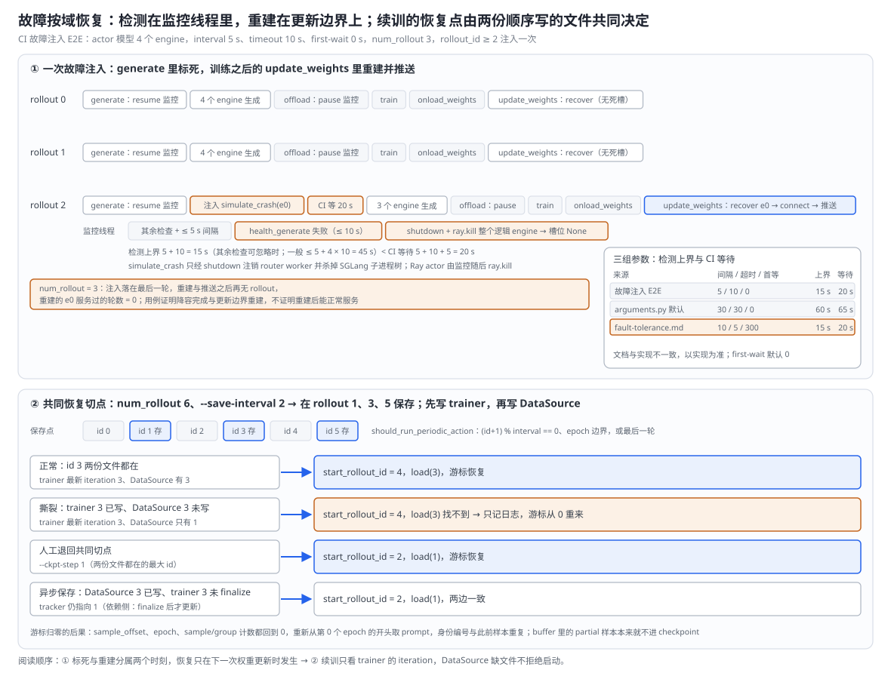
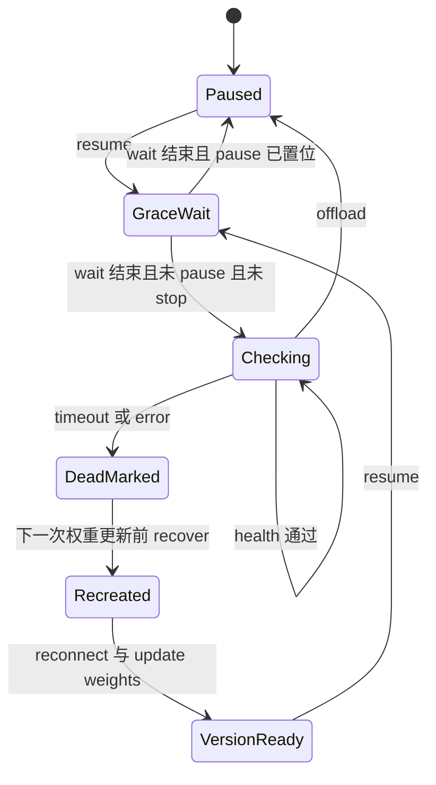
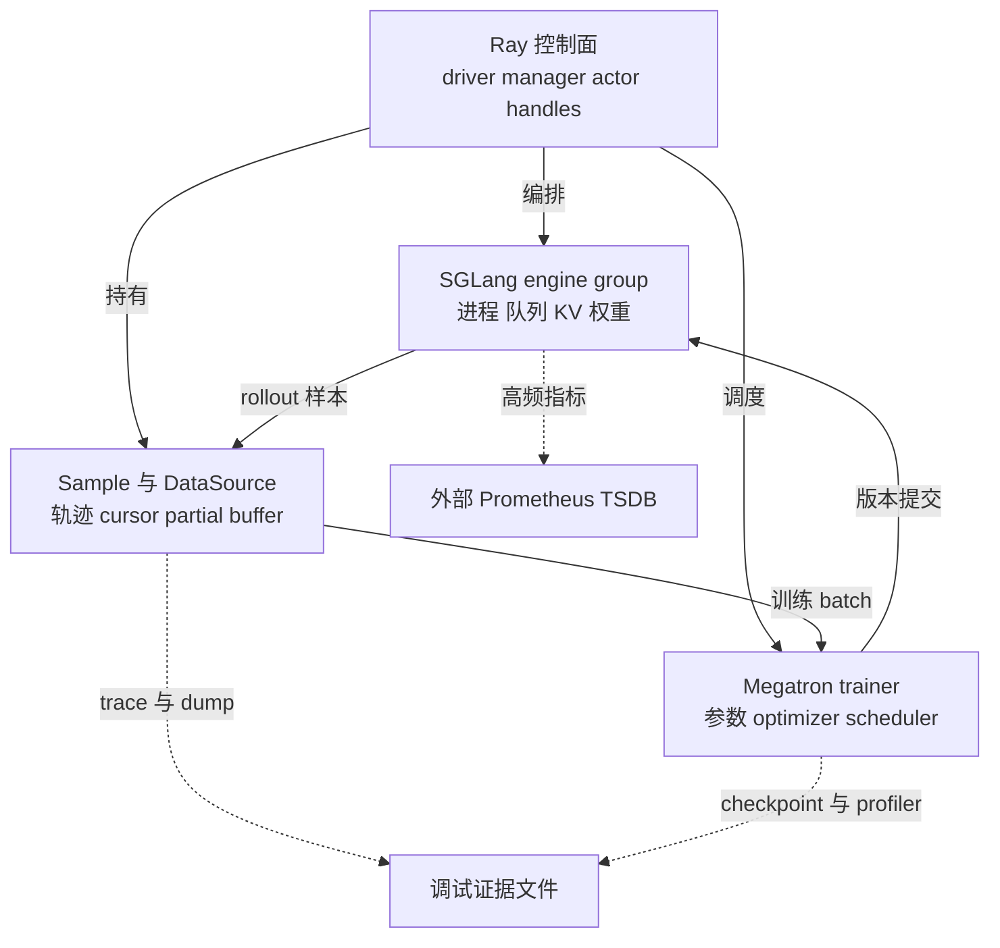
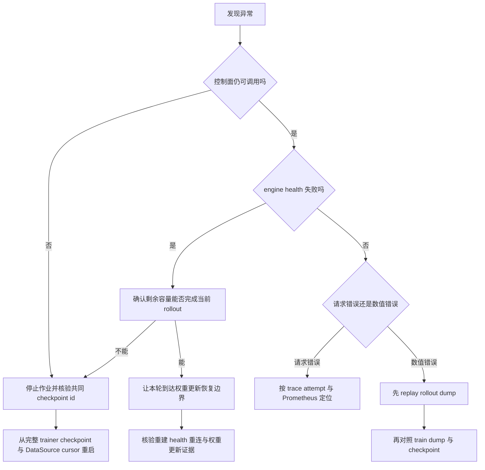

# slime 容错、可观测性与测试体系分析

> **源码基线**：`THUDM/slime@681b3adca54105d5ecd3fb822fa0dc58a427e0f9`（`main`，2026-08-12）
> **主题**：一次训练迭代跨 Ray 控制面、SGLang engine、Sample/DataSource 与 Megatron 四个状态所有者，slime 不做全局事务，而是按故障域局部恢复：健康监控只发现并整组标死推理引擎，重建推迟到下一次权重更新并重新推送当前权重；续训的共同恢复点是同一 rollout id 的 trainer checkpoint 与 DataSource 游标；HTTP 重试只保证瞬态可用；两类 dump、trace、聚合指标、Prometheus 与 profiler 提供不同尺度的取证；CI 按接口、拓扑与故障注入分层。核心代码在 `slime/utils/health_monitor.py`、`slime/ray/rollout.py`、`slime/backends/megatron_utils/actor.py` 与 `slime/rollout/data_source.py`。
> **适用范围**：故障域、恢复切点、取证证据与测试覆盖；单次请求协议归 13，权重提交归 16，数值一致性归 17，Ray 对象与生命周期归 11。
> **最近更新**：2026-09-11。按特性分析画像重写，补最小实例、恢复时间线原理图、调用树与成本账本。

---

## 1. 特性概览

### 1.1 问题背景

一次训练迭代至少跨过四个独立的状态所有者：Ray driver 与 actor 持有编排与对象引用，SGLang 子进程持有请求队列、KV cache 与 serving 权重，`Sample` 与 `DataSource` 持有轨迹与数据游标，Megatron 持有参数、optimizer、scheduler 与训练进度；主循环按 generate → train → save → update_weights 的顺序跨这些边界，没有共享的事务管理器。长时间 RL 任务的失败也不像短 SFT：rollout engine 可能卡住或崩溃，长尾样本能拖住整轮，重启后的 serving 状态必须和权重版本一致。于是恢复要守住四条不变量：每类状态由它自己的所有者恢复，而不是假装能一起回滚；重建出来的推理引擎在重新加入当前权重版本之前不能算恢复；续训的起点在 trainer 与数据游标上必须是同一个 rollout id；"恢复成功"的证据必须和宣称的范围同尺度。

### 1.2 解决方法

slime 让每个故障域在自己的边界内恢复，再把跨域的共同恢复点收缩到"已落盘的 trainer checkpoint + 同一 rollout id 的 DataSource 游标"。开 `--use-fault-tolerance` 后，`RolloutManager` 给每个 server group 起一个 `RolloutHealthMonitor` 守护线程，generate 与 eval 时恢复检查、offload 时暂停；某个 engine 的 `/health_generate` 失败就 shutdown 并 `ray.kill` 这个逻辑 engine 的全部节点、把槽位置为 `None`，但不当场重建。重建发生在训练之后的 `update_weights`：rank 0 调 `recover_updatable_engines`，`RolloutServer.recover` 只为空槽启动新 engine 并等它健康，trainer 发现有新 engine 就重新连接并完整推送当前权重。续训时 Megatron 返回加载的 iteration，下一轮 id 取它加一，global DataSource 读前一轮的游标文件。请求层的 HTTP helper 对任何异常最多重试 60 次；取证分给 rollout dump、train dump、Sample trace、每轮聚合的 `perf/` 指标、外部 Prometheus 与 PyTorch profiler；CI 分成默认运行的 CPU 契约测试和按 label 触发的 GPU 端到端测试，其中一个用例注入 engine 崩溃。

### 1.3 收益、开销和约束

| 维度 | 直接收益 | 必付成本或边界 |
|---|---|---|
| engine 局部恢复 | 坏 engine 被整组标死，本轮用剩余 engine 完成，trainer 已提交状态不受影响 | 重建只发生在下一次权重更新；唯一 engine 卡死时推进不到那里；冻结模型的 engine 不会被重建 |
| 健康监控 | 每个 server group 一个守护线程，offload 期间自动暂停 | 其余检查耗时可忽略时检测上界 interval + timeout（默认 60 秒），一般 ≤ interval + N·timeout；某个 actor 卡死会让整组监控停住；外部 engine 没有监控；默认值与官方文档不一致 |
| 续训 | trainer iteration 决定下一轮 id，DataSource 游标按同一 id 恢复 | 两个文件顺序写入、没有 manifest；游标文件缺失时静默从头开始 |
| 请求重试 | 瞬态网络与 HTTP 错误被 60 次、间隔 1 秒的重试吸收 | 没有幂等键，不能推出 exactly-once |
| dump 与回放 | 固定 Sample 或 trainer 输入复现问题 | 磁盘 I/O 与存储；`.pt` 格式带 TODO，不是稳定归档格式 |
| 可观测性 | 样本因果链、步级聚合、serving 高频指标、算子与内存各有载体 | Prometheus 要外部进程及时 scrape；聚合指标只有 mean/median/min/max |
| CI 分层 | CPU 契约测试每次都跑，GPU 用例覆盖真实拓扑与一次崩溃注入 | 故障注入只覆盖多 engine 降容；manager/trainer 崩溃与联合 checkpoint 撕裂没有用例 |

### 1.4 术语约定

| 术语 | 含义 |
|---|---|
| 故障域 | 一组由同一所有者持有、可以一起失效与重建的状态：Ray 控制面、SGLang engine、Sample/DataSource、trainer、telemetry |
| 逻辑 engine | 一个 SGLang serving 实例，可能跨多个节点；`nodes_per_engine` 个 Ray actor 共同组成它 |
| 标死 | 监控线程 shutdown 并 `ray.kill` 一个逻辑 engine 的全部节点，把 `all_engines` 对应槽位置为 `None` |
| 更新边界 | 训练之后的 `update_weights`；恢复、重连与重新推送都在这里发生 |
| 共同恢复切点 | 某个 rollout id 上 trainer（actor 与可选 critic）checkpoint 与同 id DataSource 文件都完整存在 |

---

## 2. 容错与取证详细方案

### 2.1 最小实例：一次故障注入与一次撕裂的保存

恢复部分用维护的故障注入用例 `tests/test_sglang_config_mixed_offload_ft.py`：8 张卡 colocate，actor 模型 4 个 1 卡 engine 接收权重更新，ref 模型 4 个 1 卡 engine 冻结；`--rollout-health-check-interval 5`、`--rollout-health-check-timeout 10`、`--rollout-health-check-first-wait 0`，`--num-rollout 3`，`--ci-test` 让 `RolloutManager.generate` 在 rollout_id ≥ 2 时对默认 server 第一组的第一个 engine（记作 e0）注入一次崩溃。续训部分假设 `--num-rollout 6`、`--save-interval 2`（显式给出 `--num-rollout` 时 `create_rollout_manager` 不设 `num_rollout_per_epoch`，epoch 触发不生效）、没有 critic，进程在 rollout 3 的 trainer checkpoint 写完、DataSource 文件还没写时崩溃。下图上半部分画注入时间线，下半部分画三种重启情形。



| 步骤 | 输入 | 决定性转换 | 输出 |
|---|---|---|---|
| 注入 | rollout 2 的 generate | `_try_ci_fault_injection` 发 `simulate_crash`，再在 generate 里阻塞 5 + 10 + 5 = 20 秒 | e0 的 router 注册被删、SGLang 子进程树被杀，Ray actor 还在 |
| 检测 | 监控线程每 5 秒一轮 | 下一轮 `health_generate` 失败（最多等 10 秒） | `_kill_engine`：shutdown、`ray.kill`、槽位 `None`；其余检查耗时可忽略时检测上界 15 秒，小于 20 秒 |
| 降容 | 剩余 3 个 engine | 本轮 rollout 照常完成 | offload 暂停监控，train 照常 |
| 重建 | 训练后的 `update_weights` | rank 0 `recover_updatable_engines` → `RolloutServer.recover` 只为空槽启动 → 新 engine 通过健康检查 → `num_new_engines > 0` 触发重连并推送 | e0 回到当前权重版本 |
| 覆盖 | `--num-rollout 3` | 注入落在最后一轮 | 重建之后不再有 rollout，重建的 e0 服务过的轮数为 0 |
| 保存 | `--save-interval 2`、6 轮 | `should_run_periodic_action`：(id+1) % 2 == 0 或最后一轮（epoch 触发只在轮数由 `--num-epoch` 推出时生效） | 在 rollout 1、3、5 保存，每次先 trainer 后 DataSource |
| 撕裂 | trainer 3 已写、DataSource 只有 1 | start_rollout_id = 3 + 1 = 4，DataSource `load(3)` | 文件不存在只记日志，游标从 0 重来 |
| 退回 | `--ckpt-step 1` | start_rollout_id = 2，`load(1)` | 两边一致 |

#### 2.1.1 检测：从崩溃到槽位置空

`simulate_crash` 在本地有 serving 进程时调 `shutdown`：先向 router 注销这个 worker，再 `kill_process_tree` 杀 SGLang 子进程树；external engine 或没有本地进程时只记日志跳过。它不直接退出 Ray actor，所以要分别观察"serving 进程被停"与"Ray 代理被标死"。监控线程每轮按顺序检查节点 0 上的每个 engine，每个检查是 `ray.get(engine.health_generate.remote(timeout=...))`，一轮查完才等 interval：e0 刚通过本轮检查就崩溃时，要等其余 engine 查完、再等满 interval，下一轮先查 e0，在失败的请求上最多耗满 timeout。其余检查耗时可忽略时检测上界是 interval + timeout，本例 15 秒；一般情形 ≤ interval + N·timeout，本例 5 + 4 × 10 = 45 秒，前提是 actor 调用能及时被派发，恢复监控时另有至多 0.5 秒的暂停轮询；`ray.get` 没有 Ray 侧超时，某个 actor 卡死会让这一组的监控停在它上面。CI 注入之后固定等 interval + timeout + 5 秒，本例 20 秒：等待在 `RolloutManager.generate` 里同步阻塞、发生在 `_get_rollout_data` 之前，其余 engine 空闲，被杀的进程立即拒绝连接，所以这个用例里 15 秒的界成立。默认参数是 interval 30、timeout 30、first-wait 0，检测上界 60 秒、CI 等待 65 秒；官方容灾文档写的 first-wait 300、interval 10、timeout 5 与实现不一致。

#### 2.1.2 恢复：为什么等到更新边界

本轮 rollout 用剩下 3 个 engine 完成（e0 已从 router 注销），然后 offload 暂停监控、训练照常；训练之后的 `update_weights` 才重建 e0 并推送当前权重。新 SGLang 进程从 hf_checkpoint 启动，只有重新接入这次推送，它才重新成为 rollout 集合里的有效成员。这条顺序也划出了边界：本例 `--num-rollout 3`，注入落在最后一轮，重建与推送之后不再有 rollout，所以这个用例证明了降容完成、检测与更新边界上的重建，但没有证明重建后的 engine 能正常服务；若唯一的 engine 卡死让 generate 永远返回不了，主循环就走不到 `update_weights`，当前调用链没有旁路的恢复 RPC（本页推断）。offload 时 `recover` 只恢复新 engine 的 weights 显存，KV cache 与 CUDA graph 要等 `train.py` 在更新之后调 `onload_kv` 才回来，此前还不能宣称它已完整恢复。

#### 2.1.3 续训：共同恢复切点

保存点由 `should_run_periodic_action` 决定：本例 6 轮、间隔 2，在 rollout 1、3、5 保存，每次 `train.py` 先等 actor（与 critic）的 `save_model`，再让 `RolloutManager.save` 写 DataSource 文件。进程若在两次写之间崩溃，重启时 Megatron 按 `latest_checkpointed_iteration.txt` 加载到 iteration 3（tracker 语义属依赖侧），actor 把 `start_rollout_id` 设为 4，`create_training_models` 让 global DataSource 读 `global_dataset_state_dict_3.pt`；文件不存在时 `RolloutDataSource.load` 只记一条日志就返回，于是 `sample_offset`、epoch 与 sample/group 计数都停在初值 0，训练从第 0 个 epoch 的开头重新取 prompt，身份编号也与此前重复，不会拒绝启动。可以安全宣称的共同切点是两份文件都完整的最大 id，本例是 1：用 `--ckpt-step 1` 重启得到 start_rollout_id = 2、读 `load(1)`，两边一致。异步保存把风险挪到另一边：DataSource 3 已写而 trainer 3 尚未 finalize 时，Megatron 的 tracker 仍指向 1（finalize 之后才更新，依赖侧），重启得到 start 2、`load(1)`，反而一致，多出来的 DataSource 3 文件会在之后被覆盖。有 critic 时切点还要多看一方：`num_critic_only_steps` 期间 `train.py` 只在 `actor_trains` 时保存 actor，`create_training_models` 又只对 critic 的 start id 断言并采用它，actor 可能从比 rollout id 更旧的 iteration 静默续训（源码路径推断，未运行验证）。

### 2.2 从最小实例到整个容错与取证体系

各组件的"为何"是本页依据源码形态与失败路径重建的理由（标"本页推断"），源码与官方文档写出的理由单独注明；SGLang、Megatron、Prometheus 内部行为按其公开契约叙述并标为依赖侧。

#### 2.2.1 故障域与状态归属

**职责。** 下表按状态所有者划分故障域；`RolloutManager` 是单个 `@ray.remote` actor，源码只为 SGLang engine 创建 `RolloutHealthMonitor`，训练 actor 与 manager 没有同类的局部重建调用链；训练组的显式 `RayTrainGroup.release()` 以 `ray.kill(..., no_restart=True)` 杀掉 actor，之后由上层按需 `create()`，说明 actor 生命周期与 engine 健康恢复是两套机制（归 [[11_slime_ray_control_plane_analysis]]）。

| 故障域 | 运行状态的所有者 | 固定基线能持久化什么 | 能确认的恢复点 | 不会自动恢复的状态 |
|---|---|---|---|---|
| Ray 控制面 | driver、`RolloutManager`、训练 actor | 本层没有统一快照 | 整个作业重启后从 checkpoint 重建 | manager 内的 handles、锁、监控线程、当前 Ray refs |
| SGLang engine | `RolloutServer` / `ServerGroup` 与 engine actor | engine 不写训练 checkpoint | 空槽重建后，在下一次权重更新里重连并覆盖权重 | 在途生成、请求队列、KV cache、CUDA graph |
| Sample / DataSource | `RolloutManager` 进程 | debug rollout dump；global dataset 的游标、epoch、身份计数与 metadata | 与 trainer checkpoint 同 id 的 DataSource 文件 | 带 buffer 的 DataSource 里待续生成的 partial 组 |
| trainer | Megatron actor | 参数、optimizer（受 `--no-save-optim` 控制）、scheduler 与 iteration | 完整 Megatron checkpoint 的 iteration | 未提交的 step、未 finalize 的异步保存、进程内临时量 |
| telemetry | Sample、logger、profiler、外部 Prometheus | dump、tracking 后端、profile 文件、外部 TSDB | 各后端最后一次成功写入 | 未被 scrape 的 engine 指标、未 flush 的进程内日志 |

**为何。** 全局回滚的难点不只是实现成本：四个所有者的可回滚粒度不同，Prometheus 是旁路的外部系统，agent 或工具环境若已有外部副作用，回滚模型参数也撤销不了那次调用；合理的目标是每个域的最小可重建状态加一个跨域共同切点（本页推断）。

**代价与边界。** "没有透明恢复"是固定实现的边界，不是说上层不能重做：集群级抢占、trainer rank 故障与整作业续训，官方容灾文档交给集群调度器、Ray 重启策略与 slime checkpoint 共同处理。

#### 2.2.2 推理引擎的局部恢复：检测、整组标死、在更新边界重建

**职责。** `RolloutHealthMonitor.start` 创建守护线程并以暂停状态开始（没有 engine 时不启动），三个参数的实现默认是 interval 30、timeout 30、first-wait 0（与文档不一致，§2.1.1）；`resume` 要求下一轮先做 first-wait，`pause` 在 offload 与恢复前置位，`stop` 在 dispose 时以 interval + timeout + 5 为上限 join。循环在暂停时每 0.5 秒看一次 stop 事件；first-wait 等的是 stop 事件，期间被暂停不会立即打断，但等完后看到暂停就跳过本轮、下次恢复时再等；随后按顺序检查节点 0 上的每个 engine，槽位为 `None` 的跳过，检查失败就 `_kill_engine` 把这个逻辑 engine 的全部节点 shutdown、`ray.kill` 并置 `None`（两步在同一个 try 里：`shutdown` 抛错就跳过 `ray.kill`、只记警告，槽位照样置空，旧 actor 可能还活着，而 `recover` 会再建一个）。`SGLangEngine.health_generate` 是带 timeout 的 GET，非节点 0 的 rank 直接返回成功。恢复链：`MegatronTrainRayActor.update_weights` 在容错开启时由 rank 0 调 `RolloutManager.recover_updatable_engines`，所有 rank 过 Gloo barrier；manager 先暂停全部监控，只取第一个 `update_weights=True` 的 server，`rollout_id == -1` 或没有这样的 server 就返回，否则 `RolloutServer.recover`：记下每组的空槽，并发 `start_engines`（只为 `None` 槽创建 actor、分配端口），等全部 init 返回（`launch_server_process` 在节点 0 上每 2 秒轮询 `/health_generate` 直到 200，进程死掉就抛错），核对新 engine 数等于空槽数；需要 offload 的组先对新 engine `release_memory_occupation`（其中先 flush），再恢复 weights 显存；trainer 看到 `num_new_engines > 0` 就重新连接、barrier、rank 0 清零计数，再推送（归 [[16_slime_weight_sync_analysis]]）。



**为何。** 整组替换：TP 或多节点 engine 内的 rank 共享集合通信与进程组成员关系，只保留一部分旧 rank 会留下"进程还活着但成员关系已过期"的半恢复状态，整组替换放大了重建成本，却让恢复边界与逻辑 engine 一致；它隐含的前提是丢失的在途工作允许重做：标死不迁移请求状态，被杀 engine 上的请求靠 HTTP 重试经 router 落到剩余 engine（本页推断）。推迟重建：新进程只有重新接入当前权重更新才属于当前版本，把重建放在更新边界上，"进程可访问"与"模型属于当前版本"两个条件在同一处汇合；监控线程也不必自己编排重连与推送。offload 期间暂停，是 docstring 写明的原因：显存已让出的 engine 无法接受健康检查。

**代价与边界。** 监控为每个 server group 创建，但恢复只调用第一个可更新 server 的 `recover`：冻结的 ref 或 reward 模型的 engine 被自己的监控标死之后，冻结基线没有调用方为它重建，`RolloutServer.recover` 里给非可更新组准备的分支在这条调用链上走不到（源码路径推断，未运行验证）。多模型权重更新本身尚不支持（`_get_updatable_server` 的 docstring）。恢复后监控保持暂停，直到下一次 generate 或 eval。`ray.get` 本身没有 Ray 侧超时，timeout 只约束 actor 内的 HTTP 请求。slime 在 engine 进程环境里把 `SGLANG_ENABLE_HEALTH_ENDPOINT_GENERATION` 缺省设为 `false`，这个开关对 `/health_generate` 语义的影响属依赖侧，本页未核实。重建时端口分配会为该节点上从这个 rank 起的各 rank 查空闲端口（§5.4 的 TODO），但 `start_engines` 只对 `None` 槽的新 engine 发 `init`，存活 engine 不会换端口；代价是多几次 `_get_current_node_ip_and_free_port` 的 Ray 往返、节点端口游标向后推。外部 engine（`--rollout-external-engine-addrs`）下 `ExternalRolloutServer.server_groups` 为空：`RolloutManager.__init__` 一个监控也不建，`_try_ci_fault_injection` 因没有 server group 不注入，`ExternalRolloutServer.recover` 只记一条"不支持容错"的警告就返回，`simulate_crash` 与 `shutdown` 也直接跳过；`--use-fault-tolerance` 在这条路径上等于没开，外部 engine 的存活由外部部署负责。

#### 2.2.3 请求重试：可用性而非 exactly-once

**职责。** `slime/utils/http_utils.py::_post` 对任何异常（包括 HTTP 状态错误）等 1 秒后重试，最多 60 次，耗尽后抛出最后一次异常，不区分只读请求与可能已被服务端接受的 POST。默认 `/generate` 的 payload 只有采样参数、`return_logprob`、输入 token（或图像与文本）以及可选的一致性哈希路由头（R3 时再加 `return_routed_experts`），没有去重键；响应成功返回后，`generate` 才把新 token 追加到 `Sample`。

**为何。** 重试以很小的改动吸收瞬态网络错误；但幂等性不是"设置同一个 seed"：seed 至多帮助重现采样，证明不了第一次 POST 没有执行，也撤销不了工具环境的副作用。要把重试提升为 exactly-once，至少需要稳定的 operation id、服务端的持久提交记录、重复请求返回同一结果，以及这条记录与 Sample 状态的原子关联（本页推断）。

**代价与边界。** 固定基线没有这套协议，本页只把 HTTP 重试称为瞬态可用性机制；Sample trace 的 attempt 计数（§2.2.6）能暴露重试次数，不能证明没有重复提交。

#### 2.2.4 Checkpoint 与 DataSource 游标

**职责。** `initialize_model_and_optimizer` 返回 Megatron 加载的 iteration，`MegatronTrainRayActor.init` 把 `start_rollout_id` 设为它加一；`create_training_models` 断言所有 rank 报告同一个 start id（有 critic 时用 critic 的），用户没覆盖就采用它，global dataset 开启时让 `RolloutManager.load(start_rollout_id − 1)`。保存时 actor 以 `rollout_id` 作 Megatron iteration：offload 下先 wake，异步保存时先阻塞 finalize 上一次，再 `save`，`force_sync`（`release_train` 或最后一轮）时再阻塞等待本次；`--no-save-optim` 的帮助写明这样保存的 checkpoint 不能用于续训。`RolloutDataSource.save` 只在 global dataset 开启时写 `args.save/rollout/global_dataset_state_dict_{id}.pt`（`sample_offset`、`epoch_id`、group 与 sample 计数、metadata）；`load` 需要 global dataset 与 `args.load`，读同名文件，缺失只记日志，读到后若开了 `rollout_shuffle` 且数据集存在，按 epoch 重新 shuffle。`RolloutDataSourceWithBuffer` 只新增内存 buffer、先取 buffer 再取 dataset 的逻辑与组级 `add_samples`，没有覆盖 `save`/`load`。

**为何。** 以 rollout id 作 iteration，让训练进度与数据游标天然共用一个编号，续训只需"iteration + 1"一条规则（本页推断）。抽象接口 `DataSource` 把 `get_samples`、`add_samples`、`save`、`load` 都留作替换点：自定义在线数据源若需要更强的恢复，必须自己在 `save`/`load` 中持久化队列、外部 offset 与去重状态。

**代价与边界。** 两份文件顺序写入、没有共同 manifest 或两阶段提交；DataSource 文件缺失时不 fail-closed（§2.1.3）；带 buffer 的数据源不保存 partial 组；`--load` 指向非 Megatron 目录（没有 `latest_checkpointed_iteration.txt`）时，参数校验已把 `start_rollout_id` 缺省成 0（归 [[14_slime_megatron_training_analysis]]）。运维上应退回最近一个人工核验完整的共同 id，而不是把"最新 trainer checkpoint"自动当成全系统提交点。

#### 2.2.5 调试 dump 与回放

**职责。** rollout dump：`--save-debug-rollout-data` 把 `Sample.to_dict()` 与 `rollout_id` 写进 `.pt`（eval 用 `eval_` 前缀）；`--load-debug-rollout-data` 直接反序列化保存的 Sample、绕开自定义或在线 rollout 函数，再继续 reward 后处理与训练数据转换，参数解析同时跳过 SGLang 参数流程并强制 `debug_train_only`。train dump：`--save-debug-train-data` 由最后一个 PP stage、TP rank 0 执行，所有 CP rank 参加 response 字段的 gather，CP0 再按 DP 收到一个 writer，payload 以 rollout 位置优先、`sample_index` 次之恢复全局顺序并另存 DP 与 micro-batch 布局。`--dump-details DIR` 展开成 `DIR/rollout_data/{rollout_id}.pt` 与 `DIR/train_data/{rollout_id}.pt`。要保留 serving 的显存行为时改用 forge：`--rollout-function-path slime.rollout.forge_load.generate_rollout --load-forge-rollout-data /path/to/0.pt`，它保留 router、engine、更新与 offload/onload，只替换真实生成的输入；字面路径与 `{rollout_id}` 模板的回退边界见 [[19_slime_rollout_backend_extension_analysis#3.3 Forge、sleep 和 Sample hooks 是三种不同的替换|函数替换实例]]。

| 调试数据 | 固定在哪一层 | 最适合排除什么 | 不能证明什么 |
|---|---|---|---|
| rollout dump | `Sample` 语义层 | serving 之后的 reward、转换、训练数据问题 | 在线调度、采样内核、请求是否重复 |
| train dump | DP/CP/PP 还原后的 trainer 输入层 | packing、mask、分片还原、样本顺序、loss 输入 | optimizer 与 checkpoint 已提交；serving 为何生成这些 token |
| checkpoint | trainer 持久状态层 | 参数、optimizer、scheduler 与 iteration 的进程重启恢复 | 在途 Sample、DataSource buffer、外部指标 |

**为何。** 官方 debug 文档把回放定义为"固定训练部分输入，去除 rollout 的随机性"，它能回答"固定 Sample 后 reward、advantage、converter 或 trainer 是否仍出错"，回答不了"在线 SGLang 为什么生成了不同 token"；两份 dump 固定的是不同切面，所以都要有。

**代价与边界。** dump 不能代替 checkpoint；`_save_debug_rollout_data` 带 "to be refactored" 与 "may improve the format" 两条 TODO，`.pt` 布局不是跨版本可读的归档格式。测试把两种证据分开验证：rollout-then-train 用例先只跑 rollout 保存 2 步数据，再完全跳过 SGLang 训练；train-dump 用例在 TP、PP、CP 都为 2 时按 `rollout_position` join 两份 dump，比较 CP 重组后的 rollout logprob。

#### 2.2.6 可观测性：五种尺度的证据

**职责。** Sample trace：`bind_trace` 把 `trace_id`、`sample_id`（`sample.index`）、`group_id`、`attempt` 与事件列表绑到 `sample.trace` 上，`export_trace`/`import_trace` 连同 parent span 跨边界传递，`trace_next_attempt` 递增 attempt 并记 `attempt_start` 事件；SGLang `meta_info` 被展开成 request 与 PD prefill/decode 子 span。步级聚合：rollout 结束后，manager 从每条 Sample 的 `sglang_generate` span 结束事件里抽取 e2e 延迟、排队时间、decode 吞吐与可选的 PD 分段时长，丢掉非有限值，经 `compute_statistics` 只输出 mean、median、min、max。serving 高频指标：engine 启动参数恒开 `enable_metrics`，router 暴露 `/metrics` 与 `/engine_metrics`，slime 不落盘也不上传 W&B，官方文档要求外部 Prometheus 在训练运行时 scrape 并把 TSDB 放到持久路径。算子与内存：`TrainProfiler` 按 `--profile-target`（`train_overall`、`train_actor`、`train_log_probs`）创建 PyTorch profiler（schedule 由 profile 步区间决定，记录 shape、stack、内存与 FLOPs，写到 tensorboard 目录），`--record-memory-history` 时用 torch 的内存历史与 OOM 快照或 memray。数据实物：两类 dump 与 checkpoint（§2.2.5）。

| 观测层次 | 主要载体 | 回答的问题 | 如何保存 |
|---|---|---|---|
| 样本因果链 | Sample trace、span、attempt | 哪个 sample 或 group 的哪次尝试卡在哪一段 | 随 Sample 与 rollout dump 保存 |
| 步级聚合 | W&B / TensorBoard | reward、loss、KL、吞吐何时异常 | tracking 后端持久化 |
| serving 高频状态 | SGLang 与 router 的 Prometheus endpoint | 队列、运行请求、KV 传输是否饱和 | 外部 Prometheus 及时 scrape |
| 算子与内存 | PyTorch profiler、内存快照、memray | 慢段内部的算子、调用栈、显存峰值 | profile 与快照文件 |
| 数据实物 | rollout dump、train dump、checkpoint | 当时消费了什么、哪个状态已提交 | 各自独立文件，没有统一 manifest |

**为何。** 同一个故障需要不同尺度的证据：聚合指标告诉你何时异常，trace 告诉你哪条样本卡在哪，Prometheus 告诉你 serving 是否饱和，profiler 告诉你慢在哪个算子；把高频 serving 指标留在 Prometheus，是官方文档写明的取舍：逐秒指标上传 W&B 会拖慢记录。

**代价与边界。** 官方 observability 文档列出 `perf/request/count` 与 `perf/request/profiled_count`，但固定基线里 `profiled_request_count` 只被累加、没有写进返回的 dict，`compute_statistics` 也只返回四个统计量，默认路径不会发出这两个键；dashboard 与告警必须以实际 run 的键集合为准。聚合不带 p95/p99，也不等于后台完成队列的等待年龄；没有启动 Prometheus 时，serving 指标只存在于进程内存与当前 endpoint 输出，训练结束后补不回来。

#### 2.2.7 测试与 CI

**职责。** workflow 由 `.github/workflows/pr-test.yml.j2` 生成：`cpu-unittest` 在 GitHub 托管 runner 上对每个 PR、push 与手动触发自动运行，注册 Sample、train dump、调度、top-p 布局、逐层比较、空共卡桶、专家路由、插件契约等契约测试；GPU 端到端 job 在自托管 runner 上按 label 触发，其中 `run-ci-sglang-config` 包含混合 offload 与故障注入用例，`run-ci-ckpt` 跑 optimizer CPU/GPU 保存与加载的四种组合和异步保存，`run-ci-changed` 跑本次改动的测试。故障注入：`RolloutManager.__init__` 在容错开启时把一次性标志设为 `ci_test`；`generate` 在 `ci_test ∧ use_fault_tolerance ∧ rollout_id ≥ 2` 时调用 `_try_ci_fault_injection`，消费标志，对默认 server 第一组的第一个 engine 发 `simulate_crash.remote()`，再等 interval + timeout + 5 秒。

| 测试层级 | 代表性用例 | 能证明什么 | 不能单独证明什么 |
|---|---|---|---|
| CPU 契约 | Sample 往返、train dump、调度、插件契约 | 序列化、形状、排序、接口不变量 | Ray placement、集合通信、真实 engine 生命周期 |
| GPU 组件 E2E | SGLang config、并行检查、checkpoint 矩阵 | 特定拓扑与参数组合能协同运行 | 未列入 matrix 的故障交错 |
| 故障注入 E2E | 最后一轮崩溃一个 actor engine | 检测、整组标死、降容完成、更新边界重建与推送 | 重建后的 engine 能否服务；manager/trainer 崩溃；唯一 engine 卡死；请求 exactly-once；外部 engine |
| 回放 E2E | rollout-only → train-only；两份 dump join | 两个隔离边界可复现且样本对齐 | 在线 serving 的随机性本身可重放 |
| checkpoint E2E | optimizer CPU/GPU 与异步保存/加载 | trainer checkpoint 组合可加载，DataSource 文件也被写与读 | trainer 与 DataSource 的联合原子恢复；续训后的训练步（加载后一轮不跑）；异步保存的延迟 finalize |

**为何。** 测试层级应与恢复声明一一对应：单元测试守住可重放状态的 schema，GPU E2E 证明具体拓扑能走通，故障注入还必须说明失败发生在哪个阶段、剩余容量多少、哪个状态已经提交；否则一个绿色的 E2E 很容易被读成全局容错（本页推断）。

**代价与边界。** checkpoint 用例先以 `--save-interval 2` 保存、再以 `--ckpt-step 1` 加载；`--rollout-global-dataset` 默认开启（`--disable-rollout-global-dataset` 才关闭），所以两次运行都写读了 DataSource 文件，但用例对这些文件没有断言（`--ci-test` 打开的进程内断言只查 logprob 差、首步 KL 等训练量），也不在两次写之间制造崩溃，证明不了共同提交。两次运行都是 `--num-rollout 2`：加载运行 `--ckpt-step 1` 得到 start 2，`range(2, 2)` 一轮也不跑，只做加载、初始 `update_weights` 与退出；保存运行的唯一保存点 id 1 是最后一轮，`force_sync` 让异步保存立即 finalize，§2.1.3 的 tracker 滞后窗口没有被走到。故障注入用例的 docstring 还写了"非可更新 engine：offload → update_weights_from_disk"与"恢复后继续训练"，而 `slime/ray/rollout.py` 没有 `update_weights_from_disk` 调用，非可更新分支在这条路径上走不到，重建之后也没有 rollout，以代码为准。MTP 梯度等模型专项断言归 [[21_slime_speculative_decoding_mtp_analysis]]。日志里的 `CI Fault Injection`、`Recovered ... dead rollout engines` 与随后的权重更新完成，是这条实验可以核对的证据。

### 2.3 变体：同一实例在五条选择轴上

| 选择轴 | 枚举依据 | 变体 | 本例的表现 | 压力与上限 |
|---|---|---|---|---|
| 容错开关 | `--use-fault-tolerance` | 关（无监控、无恢复）/ 开 | 开：e0 被标死并在更新边界重建 | 关时死 engine 只会让请求失败或卡住 |
| 健康检查参数 | 三个 `--rollout-health-check-*` | 用例 5/10/0、默认 30/30/0 | 其余检查可忽略时检测上界 15 秒与 60 秒 | 太小会误判首次编译与负载尖峰，太大延迟标死 |
| 数据源 | `--data-source-path` | `RolloutDataSource` / `RolloutDataSourceWithBuffer` / 自定义 | 游标可恢复，buffer 不可 | 自定义需自己实现 `save`/`load` |
| 保存方式 | `--async-save` 与 `force_sync` | 同步 / 异步 | 撕裂只发生在同步写之间；异步时 tracker 落后（维护的用例没走到这个窗口） | 异步保存未 finalize 前崩溃会丢这一次 |
| 取证方式 | 各 dump 与 profile 参数 | rollout dump / train dump / forge / trace viewer / serving profiler / train profiler | 各自固定不同切面 | I/O 与存储；profiling 暂停正常训练推进 |

同一关注点的兄弟轴：训练 actor 与 manager 的故障不在这套机制里，由集群调度与整作业续训处理；`--release-train` 按轮释放训练 actor 属于资源编排而非容错（归 11）；外部 engine（`--rollout-external-engine-addrs`）下没有监控、不注入、`recover` 只记警告，`--use-fault-tolerance` 实际无效（§2.2.2）。

### 2.4 整体开销

| 维度 | 来源 | 评估状态 |
|---|---|---|
| 检测 | 每个 server group 一个守护线程，每 interval 对每个 engine 发一次 `/health_generate` | 源码可见 |
| 恢复 | 重建时启动 SGLang 进程、等健康、为节点后缀各 rank 查空闲端口（存活 engine 不换端口）；更新边界多一次重连与完整推送 | 源码可见，未测量 |
| 降容 | 从标死到更新边界之间只剩部分 engine 服务 | 源码可见 |
| 存储与 I/O | checkpoint、DataSource 文件、两类 dump、profile 与内存快照、Prometheus TSDB | 源码与文档 |
| 可观测性 | 每条 Sample 携带 trace 事件；聚合在 rollout 结束时算一次 | 源码可见 |
| CI | 故障注入固定阻塞 interval + timeout + 5 秒 | 源码可见 |

**总体代价与运行包络。** slime 的恢复范围与状态职责大体一致：健康监控判断推理引擎是否存活，权重更新让重建实例回到当前版本，DataSource 负责数据游标，Megatron 负责训练持久状态，dump 与 trace 负责事后取证；相比全局回滚，它保留了已提交的训练状态并缩小影响范围，相比盲目重试，它至少让引擎替换与模型版本更新在同一个边界汇合。包络的外沿是四个明确缺口：没有 trainer + DataSource 的原子 manifest，缺游标文件也不 fail-closed；默认 partial buffer 不进 checkpoint，在途生成没有持久请求台账；恢复入口位于权重更新之前，唯一 engine 阻塞时推进不了；故障注入只覆盖多 engine 降容。本页未运行 slime 训练、Ray 集群或故障注入，时间与轮数都是按冻结源码常数与用例参数推导。

---

## 3. 代码实现分析

### 3.1 对象与所有权视图

<!-- Figure spec: four state owners and the telemetry side paths; Ray control plane orchestrates engines, owns Sample/DataSource, schedules the trainer; engines feed samples; trainer commits versions back to engines; Prometheus, dumps and profiler hang off as dashed evidence sinks. -->


| 对象 | 所在进程 | 拥有的状态 | 生命周期 |
|---|---|---|---|
| `RolloutHealthMonitor` | RolloutManager 进程内的守护线程 | pause/stop 事件、first-wait 标志 | `start` 到 `dispose`；按 generate、offload、恢复暂停与恢复 |
| `ServerGroup.all_engines` | RolloutManager | engine handles（死槽为 `None`）、`num_new_engines` | 训练全程；死槽在更新边界重建 |
| `SGLangEngine` | 每节点一个 Ray actor | serving 子进程、router 注册 | 被监控 `ray.kill` 或 dispose 时结束 |
| `RolloutDataSource` | RolloutManager | 游标、epoch、计数、metadata、可选 buffer | 训练全程；游标按保存点落盘 |
| Megatron 训练状态 | 每 GPU 一个 actor | 参数、optimizer、scheduler、iteration | checkpoint 落盘；异步保存在下次保存前 finalize |
| trace carrier | 每条 Sample | trace_id、attempt、事件 | 随 Sample 与 rollout dump |

### 3.2 调用流程

#### 3.2.1 检测与标死

```text
RolloutManager.__init__ → [use_fault_tolerance ∧ ¬debug_train_only] RolloutHealthMonitor(group).start() × 每个 server group（外部 engine 没有 server group）
RolloutManager.generate(rollout_id) / eval
|-- health_monitoring_resume → monitor.resume（need_first_wait）
|-- [ci_test ∧ use_fault_tolerance ∧ rollout_id ≥ 2] _try_ci_fault_injection（server_groups 为空时跳过）
|   |-- server_groups[0].all_engines[0].simulate_crash.remote()（不等返回）⇢ SGLangEngine.shutdown（注销 router worker、kill_process_tree）
|   `-- 随即 sleep(interval + timeout + 5)
`-- _get_rollout_data → ...
RolloutHealthMonitor._health_monitor_loop（守护线程）
|-- 暂停时每 0.5 s 看 stop；[need_first_wait] stop_event.wait(first_wait) → [已暂停] 跳过本轮
`-- _run_health_checks → 逐个 _check_engine_health
    `-- ray.get(engine.health_generate.remote(timeout)) → [异常] _kill_engine：nodes_per_engine 个 actor 各 shutdown + ray.kill → all_engines[i] = None
RolloutManager.offload → health_monitoring_pause
```

#### 3.2.2 更新边界上的重建

```text
train.py::train → actor_model.update_weights() → MegatronTrainRayActor.update_weights
|-- [use_fault_tolerance] rank 0: RolloutManager.recover_updatable_engines
|   |-- health_monitoring_pause
|   |-- _get_updatable_server()（第一个 update_weights=True）；[rollout_id == -1 ∨ 无] return
|   `-- RolloutServer.recover
|       |-- dead_per_group ← 各组 None 槽
|       |-- ServerGroup.start_engines（只建 None 槽；_allocate_rollout_engine_addr_and_ports_normal）→ SGLangEngine.init → launch_server_process（节点 0 轮询 /health_generate）→ 注册 router
|       |-- ray.get(init handles)；assert num_new_engines == len(dead)
|       `-- [needs_offload] release_memory_occupation（先 flush）→ resume_memory_occupation(weights)
|-- Gloo barrier
|-- get_updatable_engines_and_lock → [无 engine ∧ ¬reconnect] return → [num_new > 0 ∨ reconnect（offload_train ∧ use_critic ∧ ¬colocate，归 16）] weight_updater.connect_rollout_engines → barrier → clear_updatable_num_new_engines
`-- weight_updater.update_weights()                                                          [归 16]
```

#### 3.2.3 保存与续训

```text
train.py::train（每轮 train 之后）
`-- [release_train ∨ should_run_periodic_action(id, save_interval, per_epoch, num_rollout)]
    |-- actor_model.save_model(id, force_sync) → [offload] wake_up → [async] maybe_finalize_async_save(blocking) → model.save（Megatron save_checkpoint，iteration = id）→ [force_sync ∧ async] finalize → [save_hf] HF 导出 → [offload] sleep
    |-- [use_critic] critic_model.save_model
    `-- [rollout_global_dataset] RolloutManager.save(id) → RolloutDataSource.save → args.save/rollout/global_dataset_state_dict_{id}.pt
重启：RayTrainGroup.create → actor.init → initialize_model_and_optimizer → load_checkpoint → iteration
|-- start_rollout_id = iteration + 1；create_training_models：assert 单值 → [未覆盖] args.start_rollout_id
`-- [rollout_global_dataset] RolloutManager.load(start − 1) → RolloutDataSource.load → [文件缺失] 只记日志
```

### 3.3 源码阅读路线

1. 检测：`slime/utils/health_monitor.py::RolloutHealthMonitor.start` / `resume` / `pause` / `_health_monitor_loop` / `_check_engine_health` / `_kill_engine` → `slime/backends/sglang_utils/sglang_engine.py::SGLangEngine.health_generate` / `shutdown` / `simulate_crash` / `_wait_server_healthy` → `slime/ray/rollout.py::RolloutManager.__init__` / `generate` / `eval` / `offload` / `_try_ci_fault_injection`。
2. 恢复：`slime/backends/megatron_utils/actor.py::MegatronTrainRayActor.update_weights` → `slime/ray/rollout.py::RolloutManager.recover_updatable_engines` / `_get_updatable_server` / `clear_updatable_num_new_engines` → `RolloutServer.recover` → `ServerGroup.start_engines` / `_allocate_rollout_engine_addr_and_ports_normal` → `slime/backends/sglang_utils/external.py::ExternalRolloutServer.recover` → `slime/ray/placement_group.py::create_rollout_manager`（`--check-weight-update-equal` 的 snapshot 与 reset）→ `tests/test_sglang_config_mixed_offload_ft.py`。
3. 请求重试：`slime/utils/http_utils.py::_post` → `slime/rollout/sglang_rollout.py::generate`。
4. 续训：`slime/backends/megatron_utils/model.py::initialize_model_and_optimizer` / `save` → `actor.py::MegatronTrainRayActor.init` / `save_model` → `slime/ray/placement_group.py::create_training_models` → `slime/rollout/data_source.py::DataSource` / `RolloutDataSource.save` / `load` / `RolloutDataSourceWithBuffer` → `slime/utils/misc.py::should_run_periodic_action` → `train.py::train` → `tests/test_qwen3_4B_ckpt.py`。
5. dump 与回放：`slime/ray/rollout.py::RolloutManager._save_debug_rollout_data` / `_get_rollout_data` → `slime/backends/megatron_utils/train_dump_utils.py::save_debug_train_data` / `_build_dump_payload` → `slime/rollout/forge_load.py::generate_rollout` / `_resolve_path` → `slime/utils/arguments.py::slime_validate_args`（`dump_details`、`load_debug_rollout_data`）→ `tests/test_qwen2.5_0.5B_debug_rollout_then_train.py`、`tests/test_qwen2.5_0.5B_debug_train_dump_e2e.py` → `docs/zh/developer_guide/debug.md`。
6. 可观测性：`slime/utils/trace_utils.py::bind_trace` / `export_trace` / `import_trace` / `trace_next_attempt` / `build_sglang_meta_trace_attrs` → `slime/ray/rollout.py::_compute_sglang_request_perf_metrics` → `slime/utils/metric_utils.py::compute_statistics` → `slime/utils/profile_utils.py::TrainProfiler` / `_TorchMemoryProfiler` / `_MemrayMemoryProfiler` → `tools/profile_rollout.py`、`tools/trace_timeline_viewer.py` → `docs/zh/advanced/observability.md`、`docs/zh/advanced/fault-tolerance.md`、`docs/zh/developer_guide/profiling.md`、`docs/zh/developer_guide/trace.md`。
7. 测试与 CI：`.github/workflows/pr-test.yml.j2`（`cpu-unittest`、`run-ci-sglang-config`、`run-ci-ckpt`、`run-ci-changed`）→ `docs/zh/developer_guide/ci.md` → `slime/backends/megatron_utils/model.py::train`（`--ci-test` 断言）→ `tests/test_sglang_config_mixed_offload_ft.py`、`tests/test_qwen3_4B_ckpt.py`。

---

## 4. 配套机制

### 4.1 恢复与取证流程



三条纪律：先定故障域，再选恢复动作（engine 死掉不等于 trainer 状态损坏，数值异常也不该靠重启 engine 掩盖）；先定提交证据，再决定重试（不知道前一次是否提交时，不把 POST 重试叫 exactly-once，有外部副作用的自定义 workflow 更应由业务层提供 operation id）；恢复后验证新边界（至少核对健康、重连、权重更新完成、Sample 与 rollout 身份、共同 checkpoint id，性能问题再分别下钻 trace、Prometheus 与 profiler）。

### 4.2 从聚合指标下钻到 profiling

直接可用的低频键有 `perf/rollout_time`、`perf/tokens_per_gpu_per_sec`、`perf/effective_tokens_per_gpu_per_sec`；请求 trace 有相应字段时输出 `perf/request/e2e_latency/{mean,median,min,max}`、`perf/request/queue_time/...` 与 `perf/decode/throughput/...`，开 PD 且 SGLang 返回 `pd_*` 字段时再有 `perf/prefill/...` 与更细的 `perf/decode/...` 分段（完整诊断映射归 [[30_slime_rollout_optimization_analysis]]）。需要 serving 算子证据时，按官方 profiling 文档用 `--rollout-function-path slime.rollout.sleep_rollout.sleep` 让 rollout 进程初始化后睡眠，另开终端查询 router 的 `/workers`，再运行 `python tools/profile_rollout.py --router-url http://127.0.0.1:3000 --action start --num-steps 3`，向服务发送负载后取回 trace，必要时 `--action stop`；`--profile-by-stage`、`--activities`（默认 GPU）、`--output-dir`（默认 `/tmp/sglang_profile`）、`--with-stack`、`--record-shapes` 决定阶段、活动与落盘位置。这个流程暂停的是正常训练推进，不能用来测端到端吞吐。样本时间线用 `python tools/trace_timeline_viewer.py /path/to/rollout_0.pt --no-serve`，从 rollout dump 生成 HTML 与缓存 JSON；它读 Sample span，`profile_rollout.py` 请求 serving profiler，两类 trace 不互相替代，SGLang profiler 的内部实现未核验。

### 4.3 什么才算恢复成功

| 要宣称的结果 | 最低证据 | 固定基线已有 | 仍缺的证据 |
|---|---|---|---|
| engine 重新可服务 | 新进程启动且 `/health_generate` 成功 | 启动路径会等健康检查成功 | engine 代数编号与持久事件 |
| engine 回到当前模型版本 | 重连后完成同一次权重更新，并有版本或权重核验 | 更新路径会重连并推送；可选的启动期 `check_weights` | 故障恢复后默认没有逐次等值断言 |
| 请求没有重复提交 | 稳定 operation id 与服务端去重记录 | trace 有 attempt；SGLang 响应可带 request id | POST payload 的幂等键与持久提交记录 |
| 数据从一致位置继续 | trainer（actor、critic）与 DataSource 同 id 的文件都完整 | iteration 决定游标文件名 | 原子 manifest、buffer 快照、缺文件时 fail-closed |
| 续训后训练照常推进 | 加载后至少完成一轮训练，iteration 与 loss 可核对 | ckpt 用例能加载、DataSource 文件被读 | 加载运行一轮也不跑；异步保存的延迟 finalize 窗口没有用例 |
| 训练输入可复现 | rollout dump 与 train dump 可按身份 join | 两类 dump 与对齐测试 | serving 调度与外部工具副作用的完整重放 |

`--check-weight-update-equal` 只在启动时 snapshot 与 reset、首次推送后 compare，不在每次故障恢复后比较；"训练继续跑"是可用性证据，不等于"恢复后权重逐张量相等"或"没有请求重复"（归 [[16_slime_weight_sync_analysis]]）。

---

## 5. 约束、适用场景与趋势

### 5.1 硬约束与失败边界

| 前提 | 源码边界 | 破坏后的行为 |
|---|---|---|
| 恢复的新 engine 数等于空槽数 | `RolloutServer.recover` | `AssertionError` |
| 新 serving 进程在节点 0 上存活到健康检查通过 | `sglang_engine.py::_wait_server_healthy` | 进程提前退出时抛 `Exception` |
| 所有训练 rank 报告同一个 start id | `placement_group.py::create_training_models` | `AssertionError` |
| 请求在 60 次重试内成功 | `http_utils.py::_post` | 抛出最后一次异常 |
| 保存 checkpoint 时带 optimizer 才能续训 | `--no-save-optim` 帮助文本 | 无守卫：能加载参数，不能恢复训练 |
| 健康检查能在更新边界之前推进 | 主循环先 generate、train 再 `update_weights` | 无守卫：唯一 engine 卡死时走不到恢复入口（本页推断） |
| 外部 engine 的故障能被发现与恢复 | `external.py::ExternalRolloutServer`：`server_groups` 为空，`recover` 只记警告 | 无守卫：开了 `--use-fault-tolerance` 也没有监控与重建，死 engine 让请求失败或卡住 |
| `_kill_engine` 真正杀掉旧 actor | `health_monitor.py::RolloutHealthMonitor._kill_engine`：`shutdown` 与 `ray.kill` 同在一个 try | 无守卫：`shutdown` 抛错时跳过 `ray.kill`，槽位仍置空，旧 actor 可能与新 actor 并存 |
| 冻结模型的 engine 被标死后能恢复 | `recover_updatable_engines` 只处理第一个可更新 server | 无守卫：冻结模型永久降容，全部 engine 死掉后该模型的请求失败（源码路径推断，未运行验证） |
| 续训时 DataSource 文件存在 | `RolloutDataSource.load` | 无守卫：只记日志，游标从 0 重来，身份编号重复 |
| trainer 与 DataSource 在同一 id 都已写完 | `train.py` 顺序写，无 manifest | 无守卫：撕裂时按 trainer 的 iteration 续训 |
| partial 样本在重启后还在 | `RolloutDataSourceWithBuffer` 未覆盖 `save`/`load` | 无守卫：buffer 丢失 |
| 有 critic 时 actor 与 critic 从同一 iteration 续训 | `placement_group.py::create_training_models` 只对 critic 的 start id 断言 | 无守卫：critic-only 阶段不保存 actor，actor 从更旧的 iteration 续训（源码路径推断，未运行验证） |
| 请求只执行一次 | payload 没有幂等键 | 无守卫：服务端已接受后重试可能重复执行 |
| 首次编译较慢的模型不被误判 | `--rollout-health-check-first-wait` 默认 0 | 无守卫：大 MoE 首轮可能被标死，需要显式调大 |
| forge 回放能找到当轮 dump | `forge_load._resolve_path` | 训练路径缺文件时回退到 `0.pt`，两者都缺抛 `RuntimeError`；eval 不回退 |

### 5.2 常见误读

| 误读 | 固定基线的实际行为 |
|---|---|
| 健康检查失败会当场重建 engine | 监控只标死；重建发生在下一次权重更新 |
| 只替换报错的那个 rank | 整个逻辑 engine 的全部节点一起 shutdown 与 kill |
| 所有 server group 的 engine 都会被重建 | 只重建第一个可更新 server；冻结模型没有恢复调用方 |
| 故障注入用例证明了重建后能正常服务 | 注入落在最后一轮，重建之后没有 rollout |
| 默认健康检查参数是文档写的 first-wait 300、interval 10、timeout 5 | 实现默认 first-wait 0、interval 30、timeout 30 |
| 开了 `--use-fault-tolerance`，外部 engine 也受保护 | 外部 engine 没有监控，`recover` 只记警告 |
| checkpoint 用例证明了续训后能继续训练 | 加载运行 `range(2, 2)` 一轮不跑；异步保存的唯一保存点立即 finalize |
| HTTP 重试保证 exactly-once | 没有幂等键与提交记录，只是瞬态可用性 |
| 最新的 trainer checkpoint 就是全系统提交点 | 共同切点要求同 id 的 DataSource 文件也完整；缺文件时静默从头取数据 |
| checkpoint 用例没开 global dataset | global dataset 默认开启；用例写读了 DataSource 文件，只是不做断言 |
| rollout dump 能解释在线生成为何不同 | 它固定 Sample 层输入，绕开了 serving |
| 文档列出的 `perf/request/count` 一定存在 | 固定基线不发这个键 |

### 5.3 何时使用与检查清单

| 场景 | 建议 | 原因 |
|---|---|---|
| 长时间 RL 任务 | 开 `--use-fault-tolerance`，定期 `--save-interval`，新 workload 保存 rollout dump | 官方容灾文档推荐的组合 |
| 大 MoE 首轮编译慢 | 显式调大 `--rollout-health-check-first-wait` | 默认 0，不会自动留出编译时间 |
| 短暂负载尖峰引起误判 | 调大 `--rollout-health-check-timeout` | 一次检查失败就整组标死 |
| 需要 serving 历史指标 | 训练运行时就启动外部 Prometheus，TSDB 放持久路径 | slime 不落盘，事后补不回来 |
| 需要复现训练侧问题 | rollout dump 回放；需要保留显存行为时用 forge | 两者固定的切面不同 |
| 多模型部署 | 冻结模型自己要有冗余 engine | 冻结模型的 engine 死掉不会被重建 |

改动恢复相关代码前逐项核对：新增的状态由谁持有、在哪个故障域里；重建出来的实例在哪个边界重新获得当前权重；新增的数据源状态是否在 `save`/`load` 里持久化；两份 checkpoint 文件的写顺序与缺失时的行为；新增的请求是否需要幂等键；用于宣称恢复的测试是否覆盖了失败阶段、剩余容量与已提交状态。

### 5.4 当前演进方向

| 位置 | 注释原文 | 指向什么 |
|---|---|---|
| `rollout.py::_allocate_rollout_engine_addr_and_ports_normal` | `# TODO: currently when restarting engines, we will set port for all engines on this node starting with this rank.`（例：8 卡机重启 gpu 3 会连带处理 3~7） | 端口查询按节点后缀展开，但只有新 engine 用到；注释描述的范围比实际副作用大 |
| `data_source.py::RolloutDataSource` / `RolloutDataSourceWithBuffer` | `metadata` 字段与 `update_metadata`、`get_metadata` 标 `# TODO remove`；类上 `# TODO may further refactor data-loading part later` | checkpoint payload 里的 metadata 是不稳定接口 |
| `rollout.py::RolloutManager._save_debug_rollout_data` | `# TODO to be refactored (originally Buffer._set_data)`；`# TODO may improve the format` | dump 格式不是跨版本稳定契约 |
| `rollout.py::RolloutManager._get_updatable_server` | "multi-model weight update is not yet supported" | 只有第一个可更新 server 进入恢复路径的上游原因 |
| `placement_group.py::create_training_models` | `# TODO how to decide rollout start id when critic is involved? For now we just require user to specify it via args.` | 有 critic 时实际采用 critic 的 start id，注释与代码的约定尚未统一 |

> [!note] 推断
> 这些锚点指向同一个方向：**恢复与取证的边界正在从"进程可用"收紧到"状态可寻址"，但收紧动作目前都停在 TODO 上。** 反过来也要说清楚：固定基线里没有任何注释、docstring 或官方文档提到跨 trainer 与 DataSource 的原子 manifest、partial buffer 持久化、请求去重台账或冻结模型的重建；§2.4 列出的缺口因此只能算"已知未做"，不能称为"在途工作"。这层归纳由本页承担，不代表项目路线图。

---

## 6. 配置契约

slime 域没有配置 coverage ledger；下表只列本页路径直接读取的参数，默认值取自 `slime/utils/arguments.py`；其余参数的归属见 [[02_slime_quickstart_and_configuration_guide|配置指南]]。

### 容错

| 参数 | 默认 | 契约 |
|---|---|---|
| `--use-fault-tolerance` | False | 为每个 server group 起健康监控，并在每次权重更新前恢复可更新 server；外部 engine 下无效（没有 server group） |
| `--rollout-health-check-interval` / `--rollout-health-check-timeout` / `--rollout-health-check-first-wait` | 30.0 / 30.0 / 0 | 检查间隔、单次超时与每次恢复后的宽限；官方文档写的 10 / 5 / 300（同列顺序）与实现不一致 |
| `--ci-test` | False | 打开进程内 CI 断言（`model.py::train` 的 logprob 差与首步 KL、MTP loss，`actor_group.py` 磁盘权重重载后的 engine 版本核对等）；与容错同开时，在 rollout_id ≥ 2 注入一次 engine 崩溃 |

### 保存与续训

| 参数 | 默认 | 契约 |
|---|---|---|
| `--save` / `--save-interval` / `--async-save` | None / None / False | rollout id 作 iteration；间隔按 (id+1) 整除 interval、最后一轮，或（轮数由 `--num-epoch` 推出时）整除每 epoch 轮数触发；异步保存在下次保存前 finalize |
| `--no-save-optim` | False | 不存 optimizer，checkpoint 不能用于续训 |
| `--load` / `--ckpt-step` / `--start-rollout-id` | None | 加载 Megatron checkpoint 时 start = iteration + 1，也可显式覆盖 |
| `--disable-rollout-global-dataset` | 不设（global dataset 开启） | 关闭后 DataSource 不保存也不加载游标 |
| `--data-source-path` | `slime.rollout.data_source.RolloutDataSourceWithBuffer` | 数据源类；自定义类负责自己的 `save`/`load` |

### 取证与观测

| 参数 | 默认 | 契约 |
|---|---|---|
| `--save-debug-rollout-data` / `--load-debug-rollout-data` / `--save-debug-train-data` / `--dump-details` | None | 两类 dump 与回放；`--dump-details` 同时设置两个保存路径 |
| `--load-forge-rollout-data` | None | 配合 `forge_load.generate_rollout` 保留 serving 的 forge 回放 |
| `--use-pytorch-profiler` / `--profile-target` / `--profile-step-start` / `--profile-step-end` | 见 Megatron 与 slime 参数 | 训练侧 PyTorch profiler 的目标与步区间 |
| `--record-memory-history` / `--memory-recorder` / `--memory-snapshot-num-steps` | False / torch / None | 内存历史、OOM 快照或 memray；memray 要求给出步数 |

## Related Pages

- [[11_slime_ray_control_plane_analysis]] — Ray group、manager、server 与 engine 的所有权边界决定了故障域如何切分。
- [[12_slime_sample_datasource_analysis]] — Sample 身份、partial buffer 与 DataSource 游标是数据恢复语义的基础。
- [[13_slime_sglang_rollout_engine_analysis]] — 单次请求、动态采样与 partial 续写的正常路径。
- [[16_slime_weight_sync_analysis]] — engine 重建后为何必须重新进入连接与提交协议。
- [[17_slime_train_inference_consistency_analysis]] — 区分"进程恢复成功"与权重、输入、kernel、采样的数值一致性。
- [[30_slime_rollout_optimization_analysis]] — Prometheus 队列与 trace 时序如何区分容量不足和调度空洞。
- [[31_slime_posttraining_stability_analysis]] — 系统故障、数据错误与数值不稳定如何形成不同的控制回路。
