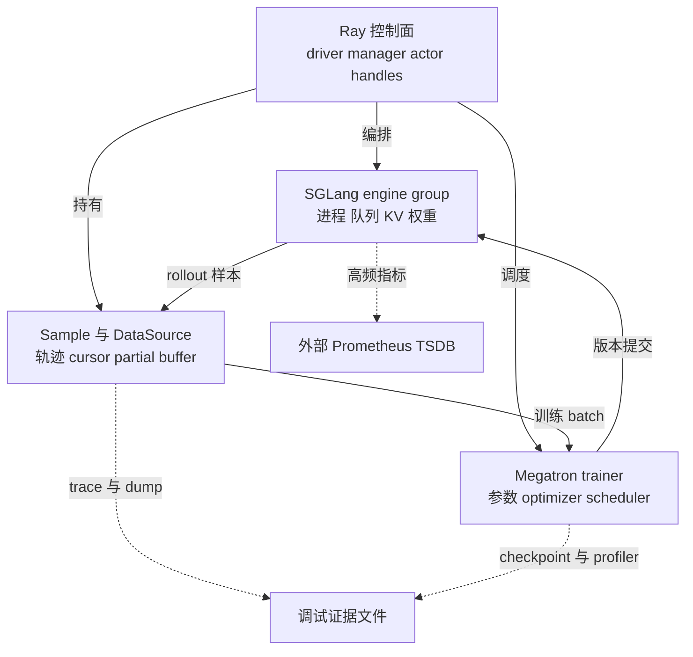
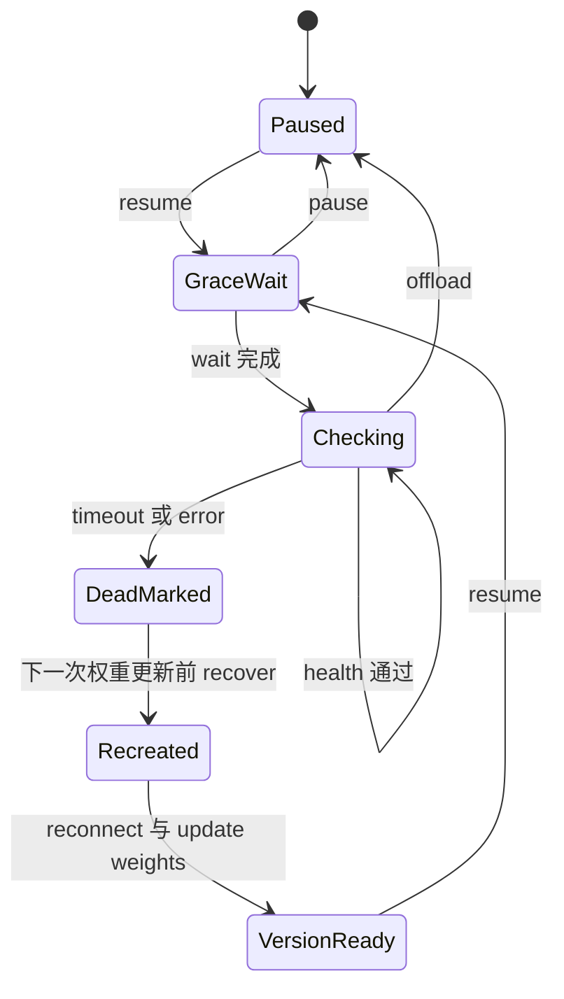
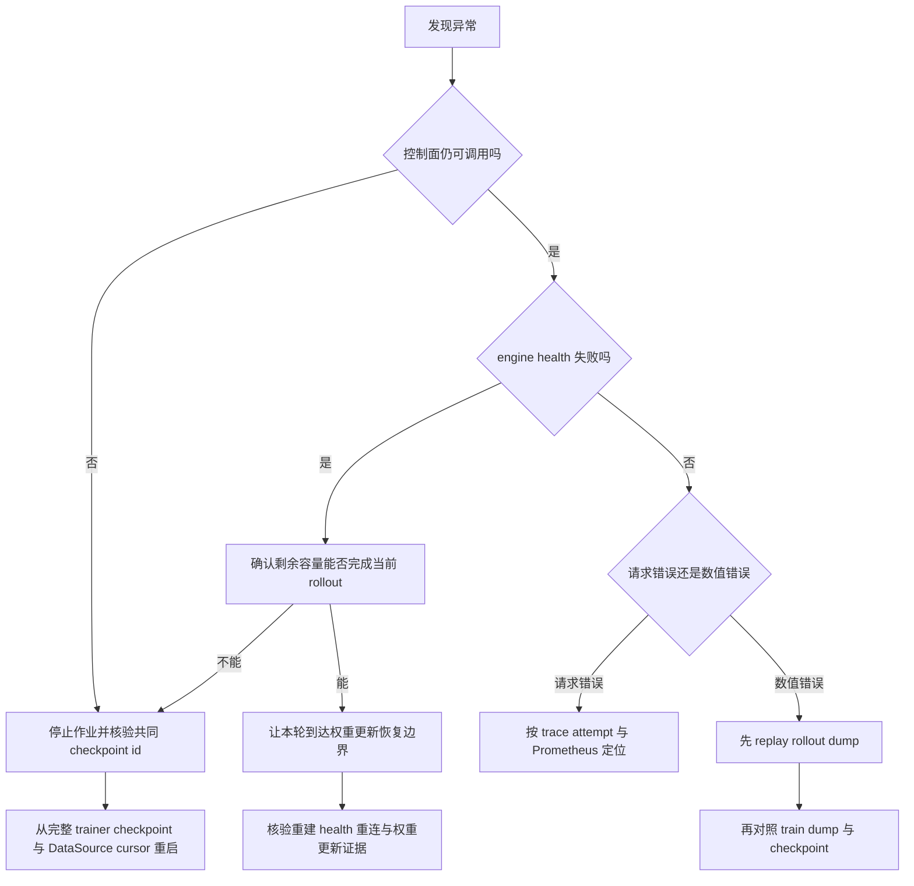

# slime 容错、可观测性与测试体系：按故障域进行局部恢复

> **源码基线**：slime `main@681b3adca54105d5ecd3fb822fa0dc58a427e0f9`
> **文档与测试基线**：同一提交下 `docs/zh/{advanced/observability,developer_guide/{debug,ci}}.md`、`tests/` 与 `.github/workflows/pr-test.yml`
> **核验日期**：2026-08-18 · **系列**：[[02_engineering/04_posttrain_frameworks/slime/index|slime 源码分析]]
> **结论先行**：slime 没有试图把 Ray 控制面、SGLang 进程、正在处理的 Sample、Megatron 优化器和外部监控系统包进一个全局事务；它让每类状态的责任主体在各自故障域内恢复，再把共同恢复点收缩到“已落盘的训练 checkpoint + 使用同一 rollout id 的 DataSource 游标”。代价是局部恢复只在明确边界上成立：推理引擎重建后，必须在下一次权重更新时重新接入并覆盖权重；HTTP 重试不能保证恰好执行一次；partial 缓冲区、在途请求、RolloutManager/训练 actor 的进程内状态和未持久化指标都不会自动恢复。
> **叙事顺序**：本页按五拍组织——背景 → 为什么这么设计（含被否掉的替代）→ 实现思路与细节 → 约束 → 发展趋势。
> **最近更新**：2026-08-27。按五拍重排章节顺序；机制正文与既有引用未改。

本文只讨论故障域、恢复切点、诊断证据和测试覆盖。单次 rollout 请求的状态协议归 [[13_slime_sglang_rollout_engine_analysis]]，训推偏差的分类与定位归 [[17_slime_train_inference_consistency_analysis]]。

## 1. 设计问题：为什么一个全局事务不现实

一次训练迭代至少跨过四个独立状态所有者：Ray driver/actor 持有编排与对象引用，SGLang 子进程持有请求队列、KV cache 和 serving 权重，`Sample`/`DataSource` 持有轨迹与数据游标，Megatron 持有参数、optimizer、scheduler 和训练进度。主循环也按 `generate → train → save → update_weights` 顺序跨这些边界，而不是在一个共享事务管理器中提交。[`train.py:9-27`](https://github.com/THUDM/slime/blob/681b3adca54105d5ecd3fb822fa0dc58a427e0f9/train.py#L9-L27) [`train.py:48-91`](https://github.com/THUDM/slime/blob/681b3adca54105d5ecd3fb822fa0dc58a427e0f9/train.py#L48-L91)

### 1.1 状态归属与恢复边界

| 故障域 | 运行状态的责任主体 | 固定基线可持久化什么 | 能够确认的恢复点 | 不会自动恢复的状态 |
|---|---|---|---|---|
| Ray 控制面 | driver、`RolloutManager`、训练 actor | 本层没有统一控制面快照 | 整个作业重启后从下方 checkpoint 重建 | manager 内的 handles、lock、monitor thread、当前 Ray refs |
| SGLang engine | `RolloutServer` / `ServerGroup` 与 engine actors | engine 自身不写训练 checkpoint | dead group 重建后，在下一次 trainer 权重更新中重新连接并覆盖当前权重 | in-flight generation、请求队列、KV cache、CUDA graph 状态 |
| Sample / DataSource | `RolloutManager` 进程 | debug rollout；global dataset 的 cursor、epoch、identity counters、metadata | 与 trainer checkpoint 同 id 的 DataSource 文件 | 默认 buffer 中待续生成的 partial groups |
| trainer | Megatron actor ranks | 参数、optimizer、scheduler 与 checkpoint iteration；是否保存 optimizer 受参数控制 | 完整 Megatron checkpoint 的 iteration | 未提交 step、未完成 async save、其他 actor 的进程内临时量 |
| telemetry | Sample、logger、profiler、外部 Prometheus | debug dump、tracking 后端、profile 文件、外部 TSDB | 各后端最后一次成功写入 | 未 scrape 的 engine 指标和未 flush 的进程内日志 |

这里的“没有透明恢复”是固定实现边界，不是说上层不能重做。`RolloutManager` 是单个 `@ray.remote` actor，源码只为 SGLang engine 创建 `RolloutHealthMonitor`；训练 actor 与 manager 没有同类的局部重建调用链。[`rollout.py:464-515`](https://github.com/THUDM/slime/blob/681b3adca54105d5ecd3fb822fa0dc58a427e0f9/slime/ray/rollout.py#L464-L515) 训练组的显式 `release()` 甚至以 `no_restart=True` 杀掉 actor，随后由上层按需重新 `create()`，说明 actor 生命周期与 engine health recovery 是两套机制。[`actor_group.py:151-203`](https://github.com/THUDM/slime/blob/681b3adca54105d5ecd3fb822fa0dc58a427e0f9/slime/ray/actor_group.py#L151-L203)

> **设计分析**：全局 rollback 的难点不只是实现成本。四个所有者的可回滚粒度不同，Prometheus 还是旁路外部系统；如果 agent/tool 环境已有外部副作用，回滚模型参数也撤销不了那次调用。因而 slime 的合理目标是找到“每个域最小可重建状态 + 一个跨域共同 checkpoint”，而不是假装所有动作都能原子撤销。

## 2. 为什么这么设计：三种策略——全局回滚、盲重试与故障域局部恢复

| 策略 | 表面吸引力 | 必须满足的条件 | 在 slime 固定基线中的结论 |
|---|---|---|---|
| 全局回滚 | 失败后所有组件回到同一时刻 | 所有参与者都有同粒度快照，外部副作用可撤销，提交记录原子化 | 未实现；trainer checkpoint 与 DataSource cursor 是顺序写入的两个文件系统动作 |
| 盲重试 | 改动小，瞬态网络错误可快速吸收 | 操作幂等，或请求带可持久去重键，并能判断前一次是否已提交 | HTTP helper 会重试 POST，但默认 generation payload 没有提交日志或 idempotency key，不能推出 exactly-once |
| 故障域局部恢复 | 只替换坏 engine，保留 trainer 已提交状态 | 明确状态所有者；重建后重新建立拓扑与模型版本；丢失的在途工作允许重做 | 这是 engine 路径的实际选择，但恢复被绑定到下一次权重更新边界 |

统一 HTTP helper 对请求异常和 HTTP error 最多尝试 60 次，每次间隔一秒，耗尽后抛出最后一次异常；它没有按 endpoint 区分只读操作与可能已被服务端接受的 POST。[`http_utils.py:165-198`](https://github.com/THUDM/slime/blob/681b3adca54105d5ecd3fb822fa0dc58a427e0f9/slime/utils/http_utils.py#L165-L198) 默认 `/generate` payload 携带 input、sampling params 与可选 consistent-hashing routing header，但没有去重 token；response 成功返回后才把新 token append 到 `Sample`。[`sglang_rollout.py:175-219`](https://github.com/THUDM/slime/blob/681b3adca54105d5ecd3fb822fa0dc58a427e0f9/slime/rollout/sglang_rollout.py#L175-L219)

> **设计分析：幂等性不是“设置同一个 seed”**。seed 至多帮助重现采样；它不能证明第一次 POST 未执行，也不能撤销工具环境副作用。要把 retry 提升为 exactly-once，至少需要稳定 operation id、服务端持久提交记录、重复请求返回同一结果，以及这个记录与 Sample 状态的原子关联。固定基线没有这套协议，所以本文只把 HTTP retry 称为瞬态可用性机制。

## 3. 推理引擎的局部恢复：检测、清理、重建、重新加载当前版本

### 3.1 健康监控为何必须区分正常显存卸载与进程故障

`RolloutHealthMonitor` 创建 daemon thread 后初始处于 paused；`resume()` 会要求下一轮先等待 grace period，`offload()` 则在释放 engine 内存前暂停检查。原因由源码直接写明：offloaded engine 无法接受 health check。[`health_monitor.py:10-20`](https://github.com/THUDM/slime/blob/681b3adca54105d5ecd3fb822fa0dc58a427e0f9/slime/utils/health_monitor.py#L10-L20) [`health_monitor.py:35-59`](https://github.com/THUDM/slime/blob/681b3adca54105d5ecd3fb822fa0dc58a427e0f9/slime/utils/health_monitor.py#L35-L59) [`rollout.py:590-625`](https://github.com/THUDM/slime/blob/681b3adca54105d5ecd3fb822fa0dc58a427e0f9/slime/ray/rollout.py#L590-L625)

监控循环在每次 resume 后先等待，再按 interval 逐个调用 `/health_generate`；pause 可中断 first wait，避免 onload 尚未完成就被误杀。[`health_monitor.py:84-143`](https://github.com/THUDM/slime/blob/681b3adca54105d5ecd3fb822fa0dc58a427e0f9/slime/utils/health_monitor.py#L84-L143) health endpoint 是带 timeout 的 GET，非 node-0 rank 直接返回成功。[`sglang_engine.py:240-260`](https://github.com/THUDM/slime/blob/681b3adca54105d5ecd3fb822fa0dc58a427e0f9/slime/backends/sglang_utils/sglang_engine.py#L240-L260)

### 3.2 为什么要把整个逻辑推理引擎作为故障单元

health failure 会 shutdown 并 kill 对应逻辑 engine 的全部 node ranks，然后把 `all_engines` 中这些 handles 设为 `None`；不是只替换报错的一个 rank。[`health_monitor.py:145-177`](https://github.com/THUDM/slime/blob/681b3adca54105d5ecd3fb822fa0dc58a427e0f9/slime/utils/health_monitor.py#L145-L177)

> **设计分析**：TP 或多节点 engine 内的 ranks 共享 collective 与进程组成员关系。只保留一部分旧 rank 会引入“进程仍活着但 collective membership 已过期”的半恢复状态；整组替换放大了重建成本，却让恢复边界与逻辑 engine 一致。

### 3.3 为什么恢复发生在权重更新阶段，而不是由监控线程当场完成

真实调用链是：

1. monitor 只负责发现失败、杀进程、把 handles 置空，并不直接重建。[`health_monitor.py:145-177`](https://github.com/THUDM/slime/blob/681b3adca54105d5ecd3fb822fa0dc58a427e0f9/slime/utils/health_monitor.py#L145-L177)
2. trainer 的 `update_weights()` 在 fault tolerance 开启时，由 rank 0 请求 `recover_updatable_engines()`，再让所有训练 ranks 经过 barrier。[`actor.py:592-608`](https://github.com/THUDM/slime/blob/681b3adca54105d5ecd3fb822fa0dc58a427e0f9/slime/backends/megatron_utils/actor.py#L592-L608)
3. manager 暂停 monitor，只选择第一个 `update_weights=True` 的 server，调用 `RolloutServer.recover()`。[`rollout.py:555-584`](https://github.com/THUDM/slime/blob/681b3adca54105d5ecd3fb822fa0dc58a427e0f9/slime/ray/rollout.py#L555-L584) [`rollout.py:641-652`](https://github.com/THUDM/slime/blob/681b3adca54105d5ecd3fb822fa0dc58a427e0f9/slime/ray/rollout.py#L641-L652)
4. `recover()` 并发重建所有 dead ranks；SGLang 启动路径会等 `/health_generate` 成功才返回。[`rollout.py:384-425`](https://github.com/THUDM/slime/blob/681b3adca54105d5ecd3fb822fa0dc58a427e0f9/slime/ray/rollout.py#L384-L425) [`sglang_engine.py:75-102`](https://github.com/THUDM/slime/blob/681b3adca54105d5ecd3fb822fa0dc58a427e0f9/slime/backends/sglang_utils/sglang_engine.py#L75-L102)
5. 新 engine 数大于零时，weight updater 重新建立连接；随后所有 engines 接收当前 trainer 权重。[`actor.py:622-636`](https://github.com/THUDM/slime/blob/681b3adca54105d5ecd3fb822fa0dc58a427e0f9/slime/backends/megatron_utils/actor.py#L622-L636)

这条链说明“进程可访问”和“模型属于当前版本”是两个提交条件。新 SGLang 进程可能从 HF 初始化权重启动；只有重新接入当前权重更新，它才重新成为 rollout 集合中的有效参与者。完整的权重 pause/flush/version 协议归 [[16_slime_weight_sync_analysis]]。

> [!warning] 恢复不是任意时刻都能推进
> 主循环在 `generate` 和 `train` 之后才调用 `update_weights`。[`train.py:48-85`](https://github.com/THUDM/slime/blob/681b3adca54105d5ecd3fb822fa0dc58a427e0f9/train.py#L48-L85) **由此可推断**：若剩余 engines/router 能让当前 rollout 完成，坏 engine 会在本轮训练后的更新边界恢复；若唯一 engine 的失败让 `generate` 永远无法返回，当前调用链没有一个旁路 recovery RPC 把执行推进到更新阶段。CI 用例杀的是四个 actor-serving engines 中的一个，因此证明的是“降容后继续并在后续更新恢复”，不是“任意单 engine 卡死都可自愈”。[`test_sglang_config_mixed_offload_ft.py:22-36`](https://github.com/THUDM/slime/blob/681b3adca54105d5ecd3fb822fa0dc58a427e0f9/tests/test_sglang_config_mixed_offload_ft.py#L22-L36) [`test_sglang_config_mixed_offload_ft.py:56-69`](https://github.com/THUDM/slime/blob/681b3adca54105d5ecd3fb822fa0dc58a427e0f9/tests/test_sglang_config_mixed_offload_ft.py#L56-L69)

另一个边界是多模型：manager 的 `_get_updatable_server()` 明确只返回第一个可更新 server，并注明尚不支持 multi-model weight update。[`rollout.py:555-563`](https://github.com/THUDM/slime/blob/681b3adca54105d5ecd3fb822fa0dc58a427e0f9/slime/ray/rollout.py#L555-L563) 因此不能从“所有 server groups 都有 monitor”推导出“所有冻结/辅助 server 都会沿同一路径自动重建”。

## 4. Checkpoint 恢复：共同恢复点是 rollout id，不是全局原子提交

### 4.1 trainer checkpoint 决定下一轮 id

Megatron 初始化返回载入的 checkpoint iteration，actor 将 `start_rollout_id` 设为该值加一。[`model.py:974-1013`](https://github.com/THUDM/slime/blob/681b3adca54105d5ecd3fb822fa0dc58a427e0f9/slime/backends/megatron_utils/model.py#L974-L1013) [`actor.py:95-118`](https://github.com/THUDM/slime/blob/681b3adca54105d5ecd3fb822fa0dc58a427e0f9/slime/backends/megatron_utils/actor.py#L95-L118) 多个 actor ranks 必须报告相同 start id；若用户未覆盖，控制面采用该值，并让 global DataSource 加载 `start_rollout_id - 1` 的 cursor。[`placement_group.py:210-223`](https://github.com/THUDM/slime/blob/681b3adca54105d5ecd3fb822fa0dc58a427e0f9/slime/ray/placement_group.py#L210-L223)

trainer 保存时直接把 `rollout_id` 作为 Megatron checkpoint iteration；`--no-save-optim` 明确会让该 checkpoint 不能用于续训。[`actor.py:567-586`](https://github.com/THUDM/slime/blob/681b3adca54105d5ecd3fb822fa0dc58a427e0f9/slime/backends/megatron_utils/actor.py#L567-L586) [`model.py:943-969`](https://github.com/THUDM/slime/blob/681b3adca54105d5ecd3fb822fa0dc58a427e0f9/slime/backends/megatron_utils/model.py#L943-L969) [`arguments.py:853-865`](https://github.com/THUDM/slime/blob/681b3adca54105d5ecd3fb822fa0dc58a427e0f9/slime/utils/arguments.py#L853-L865)

### 4.2 DataSource checkpoint 保存 cursor，但默认不保存 partial buffer

global DataSource 文件记录 `sample_offset`、`epoch_id`、group/sample counters 与 metadata；load 后按 epoch 重新 shuffle，以恢复“下一条 prompt 与 identity 从哪里开始”。[`data_source.py:123-160`](https://github.com/THUDM/slime/blob/681b3adca54105d5ecd3fb822fa0dc58a427e0f9/slime/rollout/data_source.py#L123-L160)

`RolloutDataSourceWithBuffer` 只新增内存 `buffer`、先取 buffer 再取 dataset 的逻辑和 group-level `add_samples()`，没有覆盖 `save/load`；因此继承的 checkpoint payload 不含 buffer。[`data_source.py:168-222`](https://github.com/THUDM/slime/blob/681b3adca54105d5ecd3fb822fa0dc58a427e0f9/slime/rollout/data_source.py#L168-L222)

> [!note] 恢复语义的准确说法
> checkpoint 可重建静态 dataset 的消费顺序与 identity counters；它**不会**恢复默认 partial buffer 中尚待续生成的 Sample groups。自定义在线 DataSource 若需要 stronger recovery，必须自行在 `save/load` 中持久化队列、外部 offset 和去重状态；抽象接口确实把这四个动作留作替换点。[`data_source.py:17-46`](https://github.com/THUDM/slime/blob/681b3adca54105d5ecd3fb822fa0dc58a427e0f9/slime/rollout/data_source.py#L17-L46)

### 4.3 共同恢复切点如何判定

保存路径先等待 actor/critic `save_model`，然后才保存 global DataSource；两者没有共同 manifest 或两阶段提交。[`train.py:71-80`](https://github.com/THUDM/slime/blob/681b3adca54105d5ecd3fb822fa0dc58a427e0f9/train.py#L71-L80) async save 模式会在下一次 save 前 finalize 前一个异步写，只有 force-sync 时才在当前调用末尾强制完成。[`actor.py:567-583`](https://github.com/THUDM/slime/blob/681b3adca54105d5ecd3fb822fa0dc58a427e0f9/slime/backends/megatron_utils/actor.py#L567-L583)

> **设计分析**：可安全宣称的共同恢复切点，是某个 rollout id 上 trainer 所需 checkpoint 文件与同 id DataSource state 都完整存在；不能只看 `latest_checkpointed_iteration.txt`。若 trainer 文件存在而 DataSource 文件缺失，默认 `load()` 只记录“不存在”并从初始 cursor 继续，不会拒绝启动。[`data_source.py:138-157`](https://github.com/THUDM/slime/blob/681b3adca54105d5ecd3fb822fa0dc58a427e0f9/slime/rollout/data_source.py#L138-L157) 运维上应退回最近一个人工核验完整的共同 id，而不是把“最新 trainer checkpoint”自动视为全系统提交点。

## 5. 调试数据导出与回放：固定不同边界，但不能替代 checkpoint

### 5.1 rollout 数据导出固定 Sample 层输入

在线路径会把 flatten 后的 `Sample.to_dict()` 与 `rollout_id` 写入 `.pt`；replay 则读取这些 Sample，绕开自定义/在线 rollout function，再继续 reward 后处理和 train-data conversion。[`rollout.py:671-720`](https://github.com/THUDM/slime/blob/681b3adca54105d5ecd3fb822fa0dc58a427e0f9/slime/ray/rollout.py#L671-L720) 设置 `--load-debug-rollout-data` 时，参数解析跳过 SGLang 参数流程并强制 `debug_train_only=True`，所以它有意隔离 serving 变量。[`arguments.py:1584-1643`](https://github.com/THUDM/slime/blob/681b3adca54105d5ecd3fb822fa0dc58a427e0f9/slime/utils/arguments.py#L1584-L1643) [`arguments.py:1885-1894`](https://github.com/THUDM/slime/blob/681b3adca54105d5ecd3fb822fa0dc58a427e0f9/slime/utils/arguments.py#L1885-L1894)

它能回答“固定 Sample 后 reward、advantage、converter 或 trainer 是否仍出错”，不能回答“为什么在线 SGLang 生成了不同 token”。官方 debug 文档也把该模式定义为固定训练输入、去除 rollout 随机性。[`debug.md:26-55`](https://github.com/THUDM/slime/blob/681b3adca54105d5ecd3fb822fa0dc58a427e0f9/docs/zh/developer_guide/debug.md#L26-L55)

### 5.2 训练数据导出固定训练器实际读取的布局

train dump 在最后一个 PP stage、TP rank 0 上执行，但所有选中 CP ranks 必须参与 response-field gather；CP0 随后按 DP 收集到单 writer。[`train_dump_utils.py:191-242`](https://github.com/THUDM/slime/blob/681b3adca54105d5ecd3fb822fa0dc58a427e0f9/slime/backends/megatron_utils/train_dump_utils.py#L191-L242) payload 将 per-sample fields 与 DP/micro-batch layout 分开，并优先按 rollout position、其次按 sample index 恢复全局顺序。[`train_dump_utils.py:112-188`](https://github.com/THUDM/slime/blob/681b3adca54105d5ecd3fb822fa0dc58a427e0f9/slime/backends/megatron_utils/train_dump_utils.py#L112-L188)

因此两份 dump 的恢复切面不同：

| 调试数据 | 固定在哪一层 | 最适合排除什么 | 不能证明什么 |
|---|---|---|---|
| rollout dump | `Sample` 语义层 | serving 以后的 reward、conversion、training 数据问题 | 在线调度、采样内核、请求重复是否相同 |
| train dump | DP/CP/PP 还原后的 trainer 输入层 | packing、mask、分片还原、sample 顺序、loss 输入 | optimizer/checkpoint 已提交；serving 生成原因 |
| checkpoint | trainer 持久状态层 | 参数、optimizer、scheduler 和 iteration 的进程重启恢复 | in-flight Sample、DataSource buffer、外部指标 |

测试也把两种证据分开验证：rollout-then-train E2E 先生成 dump，再完全跳过 SGLang 训练；train-dump E2E 则在 TP、PP、CP 都开启时 join 两份 dump 并比较重组后的 rollout logprob。[`test_qwen2.5_0.5B_debug_rollout_then_train.py:1-8`](https://github.com/THUDM/slime/blob/681b3adca54105d5ecd3fb822fa0dc58a427e0f9/tests/test_qwen2.5_0.5B_debug_rollout_then_train.py#L1-L8) [`test_qwen2.5_0.5B_debug_train_dump_e2e.py:1-15`](https://github.com/THUDM/slime/blob/681b3adca54105d5ecd3fb822fa0dc58a427e0f9/tests/test_qwen2.5_0.5B_debug_train_dump_e2e.py#L1-L15)

## 6. 可观测性：同一故障需要五种尺度的证据

| 观测层次 | 主要载体 | 回答的问题 | 如何保存 |
|---|---|---|---|
| 样本因果链 | Sample trace carrier、span、attempt | 哪个 sample/group 的哪次尝试卡在哪一段 | 随 Sample/debug dump 保存 |
| step 聚合 | W&B / TensorBoard | reward、loss、KL、吞吐趋势何时异常 | 由 tracking 后端持久化 |
| serving 高频状态 | SGLang/router Prometheus endpoint | queue、running requests、KV transfer 是否饱和 | 必须由外部 Prometheus 及时 scrape |
| 算子与内存 | PyTorch profiler、memory snapshot、memray | 慢段内部的算子、stack、显存峰值在哪里 | 写 profile/snapshot 文件 |
| 数据实物 | rollout dump、train dump、checkpoint | 当时究竟消费了什么，哪个状态已提交 | 各自独立文件，无统一 manifest |

trace carrier 绑定 `trace_id`、sample/group identity、attempt 与 parent span，并可跨边界 import/export；`trace_next_attempt()` 递增 attempt 并写事件。[`trace_utils.py:244-329`](https://github.com/THUDM/slime/blob/681b3adca54105d5ecd3fb822fa0dc58a427e0f9/slime/utils/trace_utils.py#L244-L329) [`trace_utils.py:434-502`](https://github.com/THUDM/slime/blob/681b3adca54105d5ecd3fb822fa0dc58a427e0f9/slime/utils/trace_utils.py#L434-L502) SGLang `meta_info` 还能被展开为 request 与 PD prefill/decode 子 span。[`trace_utils.py:146-216`](https://github.com/THUDM/slime/blob/681b3adca54105d5ecd3fb822fa0dc58a427e0f9/slime/utils/trace_utils.py#L146-L216)

rollout 结束后，manager 从 `sglang_generate` trace 中抽取 e2e、queue、decode throughput 与可选 PD timing，过滤非有限值后只输出 mean/median/min/max 的低频聚合。[`rollout.py:1401-1450`](https://github.com/THUDM/slime/blob/681b3adca54105d5ecd3fb822fa0dc58a427e0f9/slime/ray/rollout.py#L1401-L1450) profiler 则提供训练阶段 hooks、PyTorch schedule、shape/stack/memory/FLOPs，以及 memory history/OOM snapshot 与 memray 路径。[`profile_utils.py:13-78`](https://github.com/THUDM/slime/blob/681b3adca54105d5ecd3fb822fa0dc58a427e0f9/slime/utils/profile_utils.py#L13-L78) [`profile_utils.py:103-147`](https://github.com/THUDM/slime/blob/681b3adca54105d5ecd3fb822fa0dc58a427e0f9/slime/utils/profile_utils.py#L103-L147)

Prometheus 数据不由 slime 落盘；官方文档明确要求外部进程 scrape `/metrics` 或 `/engine_metrics` 并把 TSDB 放到持久路径，否则训练结束后无法补回历史。[`observability.md:31-59`](https://github.com/THUDM/slime/blob/681b3adca54105d5ecd3fb822fa0dc58a427e0f9/docs/zh/advanced/observability.md#L31-L59) [`observability.md:61-87`](https://github.com/THUDM/slime/blob/681b3adca54105d5ecd3fb822fa0dc58a427e0f9/docs/zh/advanced/observability.md#L61-L87)

> [!contradiction] 文档指标名与固定提交源码不一致
> 官方 observability 页面列出 `perf/request/count` 与 `perf/request/profiled_count`。[`observability.md:5-29`](https://github.com/THUDM/slime/blob/681b3adca54105d5ecd3fb822fa0dc58a427e0f9/docs/zh/advanced/observability.md#L5-L29) 但固定提交里 `profiled_request_count` 只被累加，没有写入返回 dict；`compute_statistics` 也只返回 mean/median/max/min，所以默认路径不会发出这两个 count keys。[`rollout.py:1406-1437`](https://github.com/THUDM/slime/blob/681b3adca54105d5ecd3fb822fa0dc58a427e0f9/slime/ray/rollout.py#L1406-L1437) [`metric_utils.py:59-66`](https://github.com/THUDM/slime/blob/681b3adca54105d5ecd3fb822fa0dc58a427e0f9/slime/utils/metric_utils.py#L59-L66) Dashboard 与告警必须以实际 run 的 key 集合为准。

## 7. 什么才算“恢复成功”：证据必须与声明同尺度

| 要宣称的结果 | 最低证据 | 固定基线已有 | 仍缺的证据 |
|---|---|---|---|
| engine 重新可服务 | 新进程启动且 `/health_generate` 成功 | start path 会等待 health 成功 | engine generation id 与持久事件 |
| engine 回到当前模型版本 | 重连后完成同一次权重更新，并有版本/权重核验 | update path 会重连并更新；可选 startup `check_weights` | fault recovery 后默认没有逐次 weight equality assertion |
| 请求未重复提交 | 稳定 operation id + 服务端去重记录 | trace 有 attempt；SGLang response 可带 request id | POST payload 的幂等键与持久 commit record |
| 数据从一致位置继续 | trainer 与 DataSource 同 id 文件都完整 | iteration 驱动 cursor 文件名 | 原子 manifest、buffer snapshot、缺文件时 fail-closed |
| 训练输入可复现 | rollout dump 与 train dump 可按 identity join | 两类 dump 与 E2E 对齐测试 | serving 调度和外部工具副作用的全量 replay |

`--check-weight-update-equal` 的固定调用链是在启动时先 snapshot/reset，初次把 actor 权重推给 rollout 后 compare，并非每次 fault recovery 后都做比较。[`placement_group.py:246-248`](https://github.com/THUDM/slime/blob/681b3adca54105d5ecd3fb822fa0dc58a427e0f9/slime/ray/placement_group.py#L246-L248) [`train.py:26-30`](https://github.com/THUDM/slime/blob/681b3adca54105d5ecd3fb822fa0dc58a427e0f9/train.py#L26-L30) 因而“训练继续跑”是可用性证据，不自动等于“所有恢复后权重逐 tensor 相等”或“没有请求重复”。

## 8. 测试与 CI：按接口、拓扑和故障注入分层验证

官方 CI 明确分为默认 CPU correctness tests 和 label 触发的 GPU E2E：前者覆盖无需集群的 invariant，后者运行真实 Megatron + SGLang 路径。[`ci.md:1-32`](https://github.com/THUDM/slime/blob/681b3adca54105d5ecd3fb822fa0dc58a427e0f9/docs/zh/developer_guide/ci.md#L1-L32) workflow 的 `cpu-unittest` 在 GitHub-hosted runner 上自动运行，而 SGLang config GPU matrix 包含 mixed-offload fault-tolerance 用例。[`pr-test.yml:33-60`](https://github.com/THUDM/slime/blob/681b3adca54105d5ecd3fb822fa0dc58a427e0f9/.github/workflows/pr-test.yml#L33-L60) [`pr-test.yml:560-598`](https://github.com/THUDM/slime/blob/681b3adca54105d5ecd3fb822fa0dc58a427e0f9/.github/workflows/pr-test.yml#L560-L598)

| 测试层级 | 代表性用例 | 能证明什么 | 不能单独证明什么 |
|---|---|---|---|
| CPU unit/contract | Sample round-trip、train dump、schedule、plugin contracts | 序列化、shape、排序、接口不变量 | Ray placement、collective、真实 engine 生命周期 |
| GPU component E2E | SGLang config、parallel precision、checkpoint matrix | 特定拓扑和参数组合可协同运行 | 未列入 matrix 的故障交错 |
| fault injection E2E | 单个 actor engine crash 后训练继续 | monitor 检测、整组标死、降容 rollout、后续重建与更新的组合路径 | manager/trainer crash、唯一 engine 阻塞、请求 exactly-once |
| replay E2E | rollout-only → train-only；rollout/train dump join | 两个隔离边界可复现且 sample 对齐 | 在线 serving 随机性本身可重放 |
| checkpoint E2E | optimizer CPU/GPU 与 async save/load 组合 | trainer checkpoint 组合可加载 | trainer + global DataSource 的联合原子恢复 |

checkpoint E2E 明确分别跑 save 与 `--ckpt-step 1` load，但该用例没有开启 `--rollout-global-dataset`，所以不能拿它证明 DataSource cursor 与 trainer checkpoint 的共同提交。[`test_qwen3_4B_ckpt.py:54-80`](https://github.com/THUDM/slime/blob/681b3adca54105d5ecd3fb822fa0dc58a427e0f9/tests/test_qwen3_4B_ckpt.py#L54-L80) [`test_qwen3_4B_ckpt.py:142-154`](https://github.com/THUDM/slime/blob/681b3adca54105d5ecd3fb822fa0dc58a427e0f9/tests/test_qwen3_4B_ckpt.py#L142-L154)

> **设计分析**：测试层级应与恢复声明一一对应。单元测试适合守住可重放状态的 schema；GPU E2E 证明具体拓扑能走通；故障注入必须再覆盖“失败发生在哪个阶段、剩余容量是多少、哪个状态已经提交”。否则一个绿色 E2E 很容易被过度解读成全局 fault tolerance。

## 9. 一套可操作的恢复与取证流程

操作上有三条纪律：

1. **先定故障域，再选恢复动作**：engine dead 不等于 trainer state 损坏；数值异常也不应靠重启 engine 掩盖。
2. **先定提交证据，再决定 retry**：不知道前一次是否提交时，不把 POST 重试叫作 exactly-once；有外部副作用的 custom workflow 更应由业务层提供 operation id。
3. **恢复后验证新边界**：至少核对 health、engine 重连、权重更新完成、Sample/rollout identity、共同 checkpoint id；性能问题再分别下钻 trace、Prometheus 与 profiler。

## 10. 约束、设计评价与明确缺口

slime 的优点不是“什么都能自动恢复”，而是恢复范围与状态职责大体一致：健康监控负责判断推理引擎进程是否存活，权重更新器负责让重建实例重新加载当前版本，DataSource 负责数据游标，Megatron 负责训练持久状态，数据导出与 trace 负责事后取证。相比全局回滚，它保留了已经提交的训练状态并缩小故障影响范围；相比盲目重试，它至少让推理引擎替换与模型版本更新在同一个边界汇合。

固定基线仍有四个明确缺口：

- 没有 trainer + DataSource 的原子 manifest，缺 cursor 文件时也不是 fail-closed；
- 默认 partial buffer 不进 checkpoint，在途 generation 没有持久 request ledger；
- recovery 入口位于权重更新之前，不能保证唯一 engine 阻塞时自行推进；
- fault-tolerance E2E 证明特定多-engine 降容路径，但没有覆盖 manager/trainer crash、联合 checkpoint 撕裂和请求去重。

这些不是 [[17_slime_train_inference_consistency_analysis]] 所说的数值一致性问题，也不是 [[13_slime_sglang_rollout_engine_analysis]] 的请求调度细节；它们是“故障后哪些状态仍有权威所有者、从哪里重新开始、用什么证据证明”的恢复协议问题。

## 11. 发展趋势

> [!note] 推断
> 本节只使用固定基线里已存在的 TODO 与能力声明作为锚点，不代表项目路线图；每条都注明出处，判断部分是本页的推断。

四个锚点指向同一个方向：**恢复与取证的边界正在从“进程可用”收紧到“状态可寻址”，但收紧动作目前都还停在 TODO 上。**

- **重建 engine 的副作用范围仍待收窄。** 端口分配处自己写明：重启某个 engine 时，会为该节点上从这个 rank 起的所有 engine 重设端口，注释举的例子是 8 卡机上重启 gpu 3 会连带处理 3~7。[`rollout.py:1003-1005`](https://github.com/THUDM/slime/blob/681b3adca54105d5ecd3fb822fa0dc58a427e0f9/slime/ray/rollout.py#L1003-L1005) 这与第 3.2 节“整个逻辑 engine 才是故障单元”的边界并不一致：故障单元按逻辑 engine 划分，端口副作用却按节点后缀展开。TODO 的存在说明作者把它当作待改项，而不是刻意设计。
- **DataSource 的可持久字段正在缩小。** `metadata` 字段本身与 `update_metadata`/`get_metadata` 两个方法都标了 `TODO remove`，而第 4.2 节所述的 checkpoint payload 恰好包含 metadata。[`data_source.py:58-59`](https://github.com/THUDM/slime/blob/681b3adca54105d5ecd3fb822fa0dc58a427e0f9/slime/rollout/data_source.py#L58-L59) [`data_source.py:213-218`](https://github.com/THUDM/slime/blob/681b3adca54105d5ecd3fb822fa0dc58a427e0f9/slime/rollout/data_source.py#L213-L218) 整个 `RolloutDataSource` 还挂着“may further refactor data-loading part later”。[`data_source.py:49`](https://github.com/THUDM/slime/blob/681b3adca54105d5ecd3fb822fa0dc58a427e0f9/slime/rollout/data_source.py#L49) **由此可推断**：把 metadata 当作恢复语义依赖的下游代码应视为不稳定接口。
- **调试 dump 的文件格式未被当成稳定契约。** 保存函数带两条注释：“to be refactored (originally Buffer._set_data)”与“may improve the format”。[`rollout.py:704`](https://github.com/THUDM/slime/blob/681b3adca54105d5ecd3fb822fa0dc58a427e0f9/slime/ray/rollout.py#L704) [`rollout.py:710`](https://github.com/THUDM/slime/blob/681b3adca54105d5ecd3fb822fa0dc58a427e0f9/slime/ray/rollout.py#L710) 第 5 节把两类 dump 用作取证切面仍然成立，但不应把 `.pt` 布局当成跨版本可读的归档格式。
- **多模型权重更新是已声明的空白。** `_get_updatable_server` 的 docstring 直接写 “multi-model weight update is not yet supported”，这正是第 3.3 节“只有第一个可更新 server 进入恢复路径”的上游原因。[`rollout.py:555-559`](https://github.com/THUDM/slime/blob/681b3adca54105d5ecd3fb822fa0dc58a427e0f9/slime/ray/rollout.py#L555-L559)

反过来同样要说清楚：固定基线里**没有**任何注释、docstring 或官方文档提到跨 trainer/DataSource 的原子 manifest、partial buffer 持久化或请求去重台账。第 10 节列出的这三个缺口因此只能算“已知未做”，不能称为“在途工作”。

## Related Pages

- [[11_slime_ray_control_plane_analysis]] — Ray group、manager、server 与 engine 的所有权边界决定了故障域如何切分。
- [[12_slime_sample_datasource_analysis]] — Sample identity、partial buffer 与 DataSource cursor 是数据恢复语义的基础。
- [[13_slime_sglang_rollout_engine_analysis]] — 单次请求、动态采样与 partial continuation 的正常路径在此展开。
- [[16_slime_weight_sync_analysis]] — engine 重建后为何必须重新进入 pause/flush/version 权重提交协议。
- [[17_slime_train_inference_consistency_analysis]] — 区分进程恢复成功与权重、输入、kernel、sampling 的数值一致性。
- [[30_slime_rollout_optimization_analysis]] — Prometheus queue 与 trace timing 如何用于区分容量不足和调度空洞。
- [[31_slime_posttraining_stability_analysis]] — 系统故障、数据错误与数值不稳定如何形成不同控制回路。
