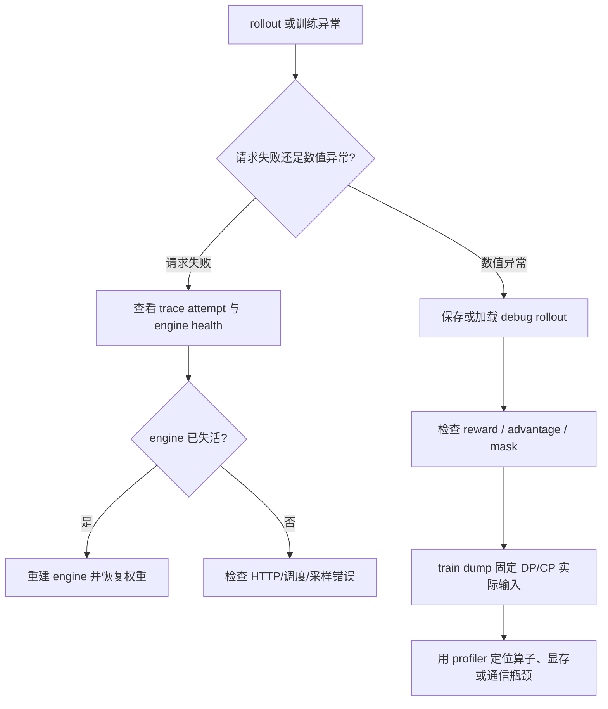

# slime 容错、可观测性与测试体系分析

> **定位**：slime 段 1 实现机制 · Fault Tolerance / Observability / Testing
> **源码基线**：`THUDM/slime@681b3adca54105d5ecd3fb822fa0dc58a427e0f9`
> **系列入口**：[[slime/index]]

## 1. 中心结论

slime 没有把“容错”做成一个能够透明回滚整轮训练的全局事务，而是把故障域拆成四层：HTTP 请求重试、SGLang engine 健康检查与重建、权重恢复、以及 rollout / train input 的离线留档与重放。这个边界很重要：它能修复局部 serving 故障并保住已提交的数据，但不能保证失败中的生成请求自动、无差别地续跑，也不能仅凭 debug replay 消除 serving 侧非确定性。

可观测性同样沿真实执行对象展开：`Sample` 携带样本与分组身份，trace carrier 传播 attempt / parent span，profiler 分别挂到 rollout 和 actor，train dump 则记录最终进入训练的 DP/CP 分片。由此形成的是“定位哪一个样本、哪一次尝试、哪一个 engine、哪一份训练输入出错”的证据链，而不是只有任务级日志。

## 2. 四层故障域

| 层级 | 机制 | 能解决什么 | 明确不能保证什么 |
|---|---|---|---|
| 请求层 | HTTP retry | 短暂连接失败、超时等瞬态错误 | 非幂等请求的 exactly-once 语义 |
| Engine 层 | health monitor + kill/recover | 发现失活的逻辑 engine 并重建其 ranks | 自动续接正在失败的 in-flight generation |
| 模型层 | recover 后恢复权重 | 让新 engine 回到可参与 rollout 的模型版本 | 回滚已经发生的 optimizer update |
| 数据层 | rollout/debug/train dump | 固定或重放训练输入、复现数据路径 | 复刻 serving 内核调度和采样随机性的全部细节 |

这个拆分与 slime 的架构一致：Ray 控制面负责编排 actor 和 engine 生命周期，SGLang/Megatron 仍各自拥有执行状态，因此全局“透明恢复”需要跨两个 runtime 协调，当前实现没有宣称这类事务语义。

## 3. Engine 健康检查不是常驻无条件探测

### 3.1 生命周期与暂停语义

`HealthMonitor` 启动一个 daemon thread，但初始为 paused；每次 resume 后先等待一个 grace period，再逐个检查 engine。它还显式说明：engine 被 offload 时不能进行健康检查，因此 release/offload 阶段必须暂停 monitor（[`health_monitor.py:10-21`](https://github.com/THUDM/slime/blob/681b3adca54105d5ecd3fb822fa0dc58a427e0f9/slime/utils/health_monitor.py#L10-L21)、[`health_monitor.py:35-59`](https://github.com/THUDM/slime/blob/681b3adca54105d5ecd3fb822fa0dc58a427e0f9/slime/utils/health_monitor.py#L35-L59)）。

`stop()`、`pause()`、`resume()` 都通过 event 和锁管理状态，避免监控线程与 engine 生命周期切换互相踩踏（[`health_monitor.py:61-103`](https://github.com/THUDM/slime/blob/681b3adca54105d5ecd3fb822fa0dc58a427e0f9/slime/utils/health_monitor.py#L61-L103)）。监控循环在每次恢复后先等待，再周期执行健康生成；这比一恢复就探测更适合刚完成 reload 的 engine（[`health_monitor.py:105-143`](https://github.com/THUDM/slime/blob/681b3adca54105d5ecd3fb822fa0dc58a427e0f9/slime/utils/health_monitor.py#L105-L143)）。

### 3.2 失败单元是“逻辑 engine”，不是单个 Ray actor

健康生成失败后，monitor 会杀掉该逻辑 engine 的全部 actor ranks，并把对应 handles 置空；也就是说，多节点 engine 的恢复边界是整个 engine group，而不是只替换一个 rank（[`health_monitor.py:145-177`](https://github.com/THUDM/slime/blob/681b3adca54105d5ecd3fb822fa0dc58a427e0f9/slime/utils/health_monitor.py#L145-L177)）。

这个选择牺牲了细粒度恢复，却避免一个 collective/rank group 中混入旧进程和新进程。对于张量并行或多节点 serving，后者通常比多重建几个进程更危险。

## 4. 恢复事务：重建进程之后还要恢复模型状态

### 4.1 RolloutManager 的职责

`RolloutManager` 为 rollout server 创建健康监控器，并在停止时回收这些 monitor；因此 engine 健康状态属于 rollout 控制面，而不是训练 worker（[`rollout.py:465-515`](https://github.com/THUDM/slime/blob/681b3adca54105d5ecd3fb822fa0dc58a427e0f9/slime/ray/rollout.py#L465-L515)）。

恢复路径会并发找出已失活的 server group、重新创建 engine，并根据当前 colocated/offload 状态重新执行权重恢复；“进程活了”与“模型可生成”在这里被当成两个不同条件（[`rollout.py:384-425`](https://github.com/THUDM/slime/blob/681b3adca54105d5ecd3fb822fa0dc58a427e0f9/slime/ray/rollout.py#L384-L425)）。

### 4.2 权重更新之前的恢复屏障

在取得可更新的 rollout server handles 前，manager 会暂停健康监控并恢复目标 server；训练 actor 的 rank 0 也会在发起权重更新前调用这条恢复路径（[`rollout.py:641-652`](https://github.com/THUDM/slime/blob/681b3adca54105d5ecd3fb822fa0dc58a427e0f9/slime/ray/rollout.py#L641-L652)、[`actor.py:592-608`](https://github.com/THUDM/slime/blob/681b3adca54105d5ecd3fb822fa0dc58a427e0f9/slime/backends/megatron_utils/actor.py#L592-L608)）。

这道屏障保护的是权重同步事务：如果更新目标中含有死 engine，distributed collective 或 IPC update 可能整体卡住；先恢复目标集合，才能让 [[16_slime_weight_sync_analysis]] 中的同步协议拥有稳定参与者。

### 4.3 不应过度解读的恢复保证

当前代码能证明的是：失活 engine 可被检测、清理、重建，并在后续权重同步前恢复到可更新状态。它没有实现一个持久化的请求日志来透明续接所有失败中的 generation。因此，若故障发生在一次 rollout 中途，调用方仍需依靠 rollout 调度、重试或整批重放处理该请求；不能把 engine recover 等同于端到端 exactly-once。

## 5. HTTP retry 的边界

统一 HTTP helper 会捕获请求异常、等待后重试，默认最大尝试次数为 60，并在耗尽后抛出最后一个异常（[`http_utils.py:165-198`](https://github.com/THUDM/slime/blob/681b3adca54105d5ecd3fb822fa0dc58a427e0f9/slime/utils/http_utils.py#L165-L198)）。

这适合 GET/health 等幂等操作，也能吸收 engine 启动窗口中的短暂不可达。但对于可能已经被服务端接收的生成请求，客户端没有提交日志或幂等 key 时，retry 只能保证“再次尝试”，不能保证服务端只执行一次。工程上应把它理解为可用性措施，而不是数据一致性协议。

## 6. 两种重放：固定 rollout 结果与固定训练输入

### 6.1 RolloutManager 的 debug 数据

manager 可以把 rollout 返回的样本保存到 debug 文件，也可以在之后直接加载这些样本，从而绕开在线生成并复现 reward、advantage 和训练数据构造路径（[`rollout.py:671-720`](https://github.com/THUDM/slime/blob/681b3adca54105d5ecd3fb822fa0dc58a427e0f9/slime/ray/rollout.py#L671-L720)）。当配置 `load_debug_rollout_data` 时，参数后处理会跳过与 SGLang rollout 相关的部分校验/解析，这表明该模式的设计目标就是隔离 serving 侧（[`arguments.py:1584-1643`](https://github.com/THUDM/slime/blob/681b3adca54105d5ecd3fb822fa0dc58a427e0f9/slime/utils/arguments.py#L1584-L1643)）。

它适合回答：“相同 rollout 样本为什么在 reward/advantage/loss 处数值异常？”它不适合回答：“相同 prompt 为什么在线生成了不同 token？”后者仍包含 SGLang 调度、随机数和采样参数等变量。

### 6.2 Train dump 固定真正消费的数据

train dump 会逐字段收集 context-parallel 分片，并只在最终写入者上转 CPU，避免所有 rank 同时保留一份完整样本（[`train_dump_utils.py:11-94`](https://github.com/THUDM/slime/blob/681b3adca54105d5ecd3fb822fa0dc58a427e0f9/slime/backends/megatron_utils/train_dump_utils.py#L11-L94)）。写出的 payload 同时包含 samples 与 DP shard 元数据，并按 rollout position / sample index 恢复可解释顺序（[`train_dump_utils.py:112-188`](https://github.com/THUDM/slime/blob/681b3adca54105d5ecd3fb822fa0dc58a427e0f9/slime/backends/megatron_utils/train_dump_utils.py#L112-L188)）。

在 PP/TP/CP 拓扑中，只有指定 rank 执行最终落盘，但所有 CP ranks 都必须进入 gather；随后由 CP0 汇总各 DP shard（[`train_dump_utils.py:191-242`](https://github.com/THUDM/slime/blob/681b3adca54105d5ecd3fb822fa0dc58a427e0f9/slime/backends/megatron_utils/train_dump_utils.py#L191-L242)）。这份 dump 比 rollout 原始样本更接近“训练 kernel 实际看见的输入”，特别适合诊断 packing、mask、CP 切分和 reducer 分母问题。

开发文档也把 load/dump debug rollout 作为缩短复现链路的标准手段，并给出从在线 rollout 切换到离线数据的配置方式（[`debug.md:26-55`](https://github.com/THUDM/slime/blob/681b3adca54105d5ecd3fb822fa0dc58a427e0f9/docs/zh/developer_guide/debug.md#L26-L55)）。

## 7. Trace：从样本身份到一次重试尝试

### 7.1 Carrier 传播的不是只有 trace id

trace carrier 包含 trace id、sample id、group id、attempt 和 parent context，并支持在进程/服务边界导入导出（[`trace_utils.py:244-329`](https://github.com/THUDM/slime/blob/681b3adca54105d5ecd3fb822fa0dc58a427e0f9/slime/utils/trace_utils.py#L244-L329)）。这与 [[12_slime_sample_datasource_analysis]] 的 `Sample` 身份模型对齐，使 group-level reward、单样本 generation 和重试尝试能被串到同一条因果链上。

span/event helper 统一创建区间和离散事件；attempt helper 会递增尝试编号，装饰器同时支持同步与异步函数（[`trace_utils.py:332-380`](https://github.com/THUDM/slime/blob/681b3adca54105d5ecd3fb822fa0dc58a427e0f9/slime/utils/trace_utils.py#L332-L380)、[`trace_utils.py:434-502`](https://github.com/THUDM/slime/blob/681b3adca54105d5ecd3fb822fa0dc58a427e0f9/slime/utils/trace_utils.py#L434-L502)）。

### 7.2 Serving 元数据进入同一条观测链

trace 工具还能把 SGLang 和 prefill/decode 分离路径的元数据规范化进 span，因而一次慢请求可以继续下钻到 serving 调度，而不止停在 Ray actor 调用（[`trace_utils.py:146-216`](https://github.com/THUDM/slime/blob/681b3adca54105d5ecd3fb822fa0dc58a427e0f9/slime/utils/trace_utils.py#L146-L216)）。

## 8. Profiling：训练阶段、算子时间与显存事件分层

actor profiler 提供 overall、train step、logprob 等阶段钩子；PyTorch profiler 可配置 schedule，并输出 TensorBoard trace、shape、stack、memory 和 FLOPs 信息（[`profile_utils.py:13-78`](https://github.com/THUDM/slime/blob/681b3adca54105d5ecd3fb822fa0dc58a427e0f9/slime/utils/profile_utils.py#L13-L78)）。

内存诊断则包含 PyTorch memory history/OOM snapshot，以及可选的 memray 路径（[`profile_utils.py:103-147`](https://github.com/THUDM/slime/blob/681b3adca54105d5ecd3fb822fa0dc58a427e0f9/slime/utils/profile_utils.py#L103-L147)）。两类工具回答不同问题：

- trace 回答“请求和样本卡在哪一段”；
- profiler 回答“该段内部哪些算子/阶段耗时或占显存”；
- train dump 回答“造成问题的输入究竟是什么”。

三者组合才形成从症状到执行再到数据的闭环。

## 9. 三条指标通道：step aggregate、request trace 与 serving time series

官方 observability 文档描述的不是一套统一存储，而是三条采样频率和保留位置不同的通道：

| 通道 | 数据粒度 | 去向 | 适合回答 |
|---|---|---|---|
| W&B / TensorBoard | 每个 rollout/train step 的聚合值 | 实验 tracking | reward/loss/KL/吞吐趋势 |
| Sample trace / debug rollout | 每个 sample、每次 `sglang_generate` span | sample payload / debug 文件 | 某个请求为什么慢、PD 卡在哪一段 |
| Prometheus | router/engine 高频时间序列 | 外部 Prometheus TSDB | queue buildup、KV transfer、实时 serving 饱和度 |

### 9.1 W&B/TensorBoard 只接收低频聚合

rollout 结束后，manager 合并 sample 统计、吞吐统计和 request timing，统一加 `rollout/`、`perf/` 前缀，再交给 tracking logger；logger 根据开关写 W&B 或 TensorBoard。[`rollout.py:1334-1349`](https://github.com/THUDM/slime/blob/681b3adca54105d5ecd3fb822fa0dc58a427e0f9/slime/ray/rollout.py#L1334-L1349) [`logging_utils.py:27-51`](https://github.com/THUDM/slime/blob/681b3adca54105d5ecd3fb822fa0dc58a427e0f9/slime/utils/logging_utils.py#L27-L51)

request timing 不是每次 HTTP 完成就写 W&B。聚合器遍历 sample trace 中名为 `sglang_generate` 的结束 span，抽取 e2e latency、queue time、decode throughput 和可选 PD prefill/decode 字段，过滤非数值与非有限值，再计算 mean/median/min/max。[`rollout.py:50-72`](https://github.com/THUDM/slime/blob/681b3adca54105d5ecd3fb822fa0dc58a427e0f9/slime/ray/rollout.py#L50-L72) [`rollout.py:1401-1450`](https://github.com/THUDM/slime/blob/681b3adca54105d5ecd3fb822fa0dc58a427e0f9/slime/ray/rollout.py#L1401-L1450) 这样避免高频 request metrics 把实验 tracking 变成 serving TSDB。

### 9.2 固定提交下的文档/源码差异

官方页面示例列出 `perf/request/count` 与 `perf/request/profiled_count`。[`observability.md:5-29`](https://github.com/THUDM/slime/blob/681b3adca54105d5ecd3fb822fa0dc58a427e0f9/docs/zh/advanced/observability.md#L5-L29) 但在本系列固定的 `681b3adc` 源码中，`profiled_request_count` 虽被累加却没有写入返回字典，通用 `compute_statistics` 也只返回 mean/median/max/min；因此这两个 count key 在默认路径下不会实际发出。[`rollout.py:1406-1437`](https://github.com/THUDM/slime/blob/681b3adca54105d5ecd3fb822fa0dc58a427e0f9/slime/ray/rollout.py#L1406-L1437) [`metric_utils.py:59-66`](https://github.com/THUDM/slime/blob/681b3adca54105d5ecd3fb822fa0dc58a427e0f9/slime/utils/metric_utils.py#L59-L66)

这类差异正是源码级阅读的价值：部署告警或 dashboard 不应只照抄文档 key，应先从实际 run 验证当前 commit 的指标集合。

### 9.3 Prometheus 数据不由 slime 持久化

slime 启动 router 时分配 Prometheus port，启动 SGLang engine 时固定开启 metrics，使 `/metrics` / `/engine_metrics` 可供外部 scrape。[`rollout.py:1063-1112`](https://github.com/THUDM/slime/blob/681b3adca54105d5ecd3fb822fa0dc58a427e0f9/slime/ray/rollout.py#L1063-L1112) [`sglang_engine.py:564-570`](https://github.com/THUDM/slime/blob/681b3adca54105d5ecd3fb822fa0dc58a427e0f9/slime/backends/sglang_utils/sglang_engine.py#L564-L570) slime 自己不保存这些每秒时间序列；没有外部 Prometheus，就没有可在训练结束后回看的 TSDB 历史。官方页面给出的 scrape 与持久化目录同样是旁路 Prometheus 的配置，而不是 slime 内置数据库。[`observability.md:31-59`](https://github.com/THUDM/slime/blob/681b3adca54105d5ecd3fb822fa0dc58a427e0f9/docs/zh/advanced/observability.md#L31-L59) [`observability.md:61-87`](https://github.com/THUDM/slime/blob/681b3adca54105d5ecd3fb822fa0dc58a427e0f9/docs/zh/advanced/observability.md#L61-L87)

### 9.4 观测选择原则

- 查训练是否收敛：W&B/TensorBoard step aggregate；
- 查一个 sample 的多轮请求/PD 时间线：trace viewer 或 debug rollout；
- 查全局 queue、KV transfer 与 engine 饱和：Prometheus/Grafana；
- 查算子和显存：PyTorch profiler/memory snapshot；
- 查真正进 trainer 的 mask/packing：train dump。

把所有问题都交给 W&B 会丢请求细节；把所有请求都上传 W&B 又会产生高基数和 tracking 开销。当前三层设计的重点正是让采样频率与问题尺度匹配。

## 10. 测试体系：CPU 守契约，GPU 守集成

slime 的 CI 把默认 CPU 测试与需要标签触发的 GPU end-to-end 测试分开，并将单元测试、代码质量和镜像/环境相关任务拆成不同 job（[`ci.md:1-32`](https://github.com/THUDM/slime/blob/681b3adca54105d5ecd3fb822fa0dc58a427e0f9/docs/zh/developer_guide/ci.md#L1-L32)、[`ci.md:46-92`](https://github.com/THUDM/slime/blob/681b3adca54105d5ecd3fb822fa0dc58a427e0f9/docs/zh/developer_guide/ci.md#L46-L92)）。GPU job 再按模型/训练场景覆盖完整链路，其触发与检查规则在 CI 文档中单独列出（[`ci.md:96-168`](https://github.com/THUDM/slime/blob/681b3adca54105d5ecd3fb822fa0dc58a427e0f9/docs/zh/developer_guide/ci.md#L96-L168)）。

这种分层对应两类风险：

1. **契约风险**：`Sample`、data source、参数解析、插件接口和纯函数 reducer 是否保持兼容，可由 CPU 测试快速守住；
2. **拓扑风险**：Ray placement、Megatron collective、SGLang engine、权重同步和 GPU kernel 是否协同，只能由真实 GPU 集成测试证明。

因此，本地 CPU 测试通过不能替代 Ray/GPU 端到端证据；反过来，只跑大型 E2E 也很难精确定位接口级回归。

## 11. 一条可操作的故障定位路径

这条路径刻意先区分“执行可用性”和“统计正确性”。[[31_slime_posttraining_stability_analysis]] 讨论的稳定性主要属于后者；engine recovery 不能修复错误的分母、mask 或 stale ratio，数值修正也不能让死掉的 serving rank 自动回来。

## 12. 设计评价

slime 当前方案的优势是边界清楚：health monitor 不假装是训练 checkpoint，HTTP retry 不假装是 exactly-once，debug replay 不假装能复现所有 serving 随机性。代价是调用者仍需理解请求、engine、模型版本和训练数据四个状态层，复杂故障不能靠一个“自动恢复”开关解决。

若继续增强，最有价值的方向不是增加无限重试，而是把以下身份写入统一的持久化事件：`sample_id/group_id`、generation attempt、engine generation、actor step、weight version、rollout model version。这样才能把 [[17_slime_train_inference_consistency_analysis]] 的版本一致性检查和本页的故障恢复真正接起来。

## 13. 相关页面

- [[11_slime_ray_control_plane_analysis]]
- [[13_slime_sglang_rollout_engine_analysis]]
- [[16_slime_weight_sync_analysis]]
- [[17_slime_train_inference_consistency_analysis]]
- [[31_slime_posttraining_stability_analysis]]
