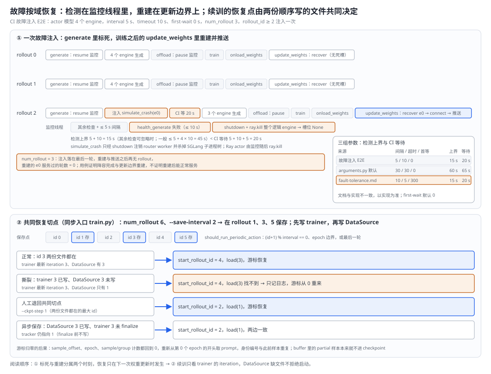
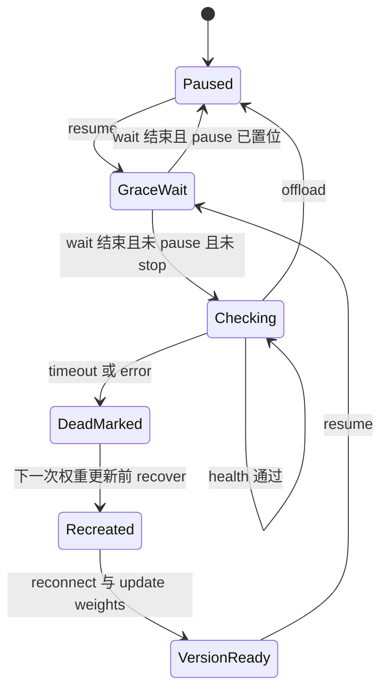
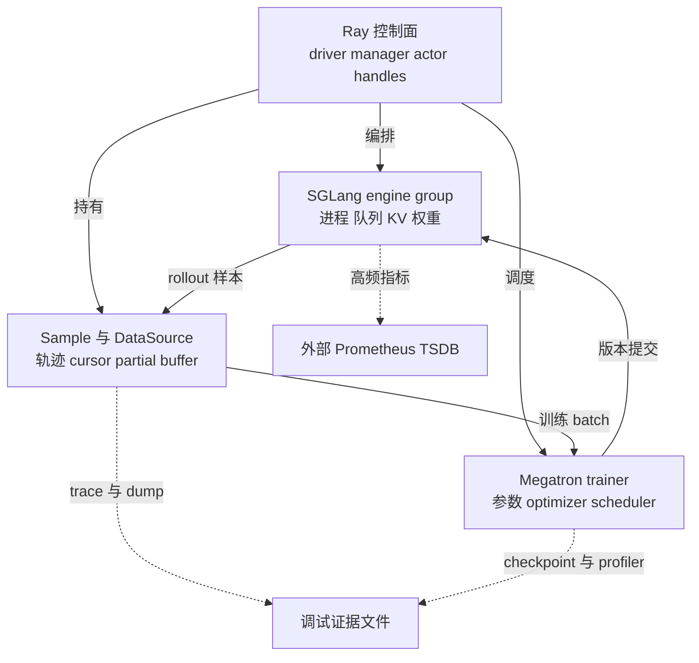
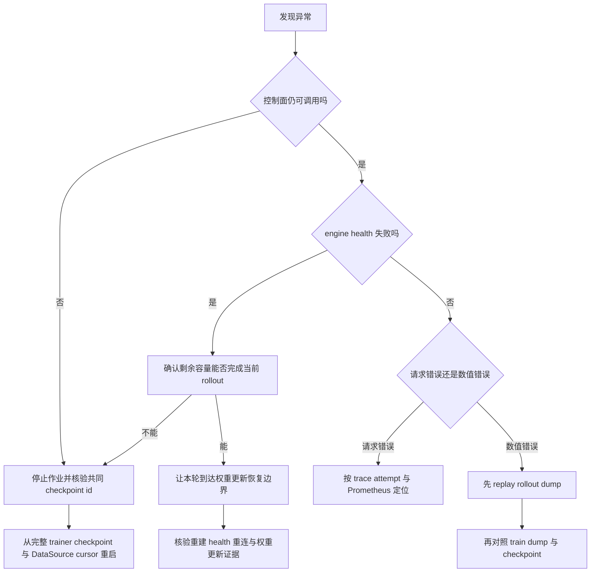
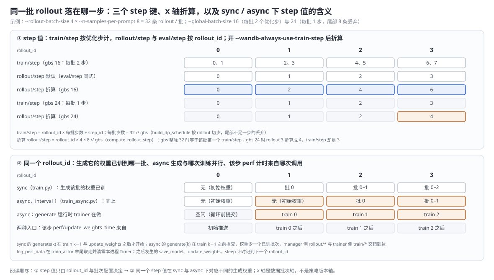

# slime 容错、可观测性与测试体系分析

> **源码基线**：`THUDM/slime@4c193f1f37509cca70f0e88807a9305b70f63f4e`（`main`，2026-09-03）
> **源码基线**：`NVIDIA/Megatron-LM@1dcf0dafa884`（`dev`，2026-02-14）
> **主题**：故障域与状态归属、推理引擎的健康检测与局部恢复、请求重试、checkpoint 与 DataSource 游标续训；两类调试 dump、Sample trace、聚合指标、Prometheus 与 profiler 等取证载体，测试与 CI 分层，以及指标落点与 x 轴、恢复判据和失败边界。核心代码在 `slime/utils/health_monitor.py`、`slime/backends/sglang_utils/engine_group.py`、`slime/rollout/data_source.py` 与 `slime/observability/`。
> **适用范围**：故障域、恢复切点、取证载体、指标落点与测试覆盖；单次请求协议归 [[13_slime_sglang_rollout_engine_analysis|SGLang rollout]]，权重提交归 [[16_slime_weight_sync_analysis|权重同步]]，数值一致性归 [[17_slime_train_inference_consistency_analysis|训推一致性]]，Ray 对象与生命周期归 [[11_slime_ray_control_plane_analysis|Ray 控制面]]，各指标键的数值含义归各自机制页。
> **最近更新**：2026-09-17。覆盖故障域局部恢复、续训共同切点、取证载体、指标落点与 x 轴和 CI 分层。

---

## 1. 特性概览

### 1.1 问题背景

一次训练迭代至少跨过四个独立的状态所有者：Ray driver 与 actor 持有编排与对象引用，SGLang 子进程持有请求队列、KV cache 与 serving 权重，`Sample` 与 `DataSource` 持有轨迹与数据游标，Megatron 持有参数、optimizer、scheduler 与训练进度；主循环按 generate → train → save → update_weights 的顺序跨这些边界，没有共享的事务管理器。长时间 RL 任务的失败也不像短 SFT：rollout engine 可能卡住或崩溃，长尾样本能拖住整轮，重启后的 serving 状态必须和权重版本一致。于是恢复要守住四条不变量：每类状态由它自己的所有者恢复，而不是假装能一起回滚；重建出来的推理引擎在重新加入当前权重版本之前不能算恢复；续训的起点在 trainer 与数据游标上必须是同一个 rollout id；"恢复成功"的证据必须和宣称的范围同尺度。

### 1.2 解决方法

slime 让每个故障域在自己的边界内恢复，再把跨域的共同恢复点收缩到"已落盘的 trainer checkpoint + 同一 rollout id 的 DataSource 游标"。开 `--use-fault-tolerance` 后，`RolloutManager` 给每个 server group 起一个 `RolloutHealthMonitor` 守护线程，generate 与 eval 时恢复检查、offload 时暂停；某个 engine 的 `/health_generate` 失败就 shutdown 并 `ray.kill` 这个逻辑 engine 的全部节点、把槽位置为 `None`，但不当场重建。重建发生在训练之后的 `update_weights`：rank 0 调 `recover_updatable_engines`，`RolloutServer.recover` 只为空槽启动新 engine 并等它健康，trainer 发现有新 engine 就重新连接并完整推送当前权重。续训时 Megatron 返回加载的 iteration，下一轮 id 取它加一，global DataSource 读前一轮的游标文件。请求层的 HTTP helper 对任何异常最多重试 60 次；取证分给 rollout dump、train dump、Sample trace、每轮聚合并按三个 step 键写进 W&B 或 TensorBoard 的指标、外部 Prometheus 与 PyTorch profiler；CI 分成默认运行的 CPU 契约测试和按 label 触发的 GPU 端到端测试，其中一个用例注入 engine 崩溃。

### 1.3 收益、开销和约束

| 维度 | 直接收益 | 必付成本或边界 |
|---|---|---|
| engine 局部恢复 | 坏 engine 被整组标死，本轮用剩余 engine 完成，trainer 已提交状态不受影响 | 重建只发生在下一次权重更新；唯一 engine 卡死时推进不到那里；冻结模型的 engine 不会被重建 |
| 健康监控 | 每个 server group 一个守护线程，offload 期间自动暂停 | 其余检查耗时可忽略时检测上界 interval + timeout（默认 60 秒），一般 ≤ interval + N·timeout；某个 actor 卡死会让整组监控停住；外部 engine 没有监控；默认值与官方文档不一致 |
| 续训 | trainer iteration 决定下一轮 id，DataSource 游标按同一 id 恢复 | 两个文件顺序写入、没有 manifest；游标文件缺失时静默从头开始；只有 `train.py` 的游标与模型进度对齐，`train_async.py` 保存的游标已越过下一批 |
| 请求重试 | 瞬态网络与 HTTP 错误被 60 次、间隔 1 秒的重试吸收 | 没有幂等键，不能推出 exactly-once |
| dump 与回放 | 固定 Sample 或 trainer 输入复现问题 | 磁盘 I/O 与存储；rollout dump 只有 `rollout_id` 与 `samples` 两个键，没有格式版本字段 |
| 可观测性 | 样本因果链、步级聚合、serving 高频指标、算子与内存各有载体 | Prometheus 要外部进程及时 scrape；聚合指标只有 mean/median/min/max；x 轴是数据批次编号，不是策略版本 |
| CI 分层 | CPU 契约测试每次都跑，GPU 用例覆盖真实拓扑与一次崩溃注入 | 故障注入只覆盖多 engine 降容；manager/trainer 崩溃与联合 checkpoint 撕裂没有用例 |

### 1.4 术语约定

| 术语 | 含义 |
|---|---|
| 故障域 | 一组由同一所有者持有、可以一起失效与重建的状态：Ray 控制面、SGLang engine、Sample/DataSource、trainer、telemetry |
| 逻辑 engine | 一个 SGLang serving 实例，可能跨多个节点；`nodes_per_engine` 个 Ray actor 共同组成它 |
| 标死 | 监控线程 shutdown 并 `ray.kill` 一个逻辑 engine 的全部节点，把 `all_engines` 对应槽位置为 `None` |
| 更新边界 | 训练之后的 `update_weights`；恢复、重连与重新推送都在这里发生 |
| 共同恢复切点 | 某个 rollout id 上 trainer（actor 与可选 critic）checkpoint 与同 id DataSource 文件都完整存在 |
| step 键 | `train/step`、`rollout/step`、`eval/step`：tracker 画曲线时用作横轴的值（§4.2） |

---

## 2. 容错与取证详细方案

### 2.1 最小实例：一次故障注入与一次撕裂的保存

恢复部分用维护的故障注入用例 `tests/test_sglang_config_mixed_offload_ft.py`：8 张卡 colocate，actor 模型 4 个 1 卡 engine 接收权重更新，ref 模型 4 个 1 卡 engine 冻结；`--rollout-health-check-interval 5`、`--rollout-health-check-timeout 10`、`--rollout-health-check-first-wait 0`，`--num-rollout 3`，`--ci-test` 让 `RolloutManager.generate` 在 rollout_id ≥ 2 时对默认 server 第一组的第一个 engine（记作 e0）注入一次崩溃。续训部分假设同步入口 `train.py`、`--num-rollout 6`、`--save-interval 2`（显式给出 `--num-rollout` 时 `create_rollout_manager` 不设 `num_rollout_per_epoch`，epoch 触发不生效）、没有 critic，进程在 rollout 3 的 trainer checkpoint 写完、DataSource 文件还没写时崩溃。下图上半部分画注入时间线，下半部分画四种重启情形。



| 步骤 | 输入 | 决定性转换 | 输出 |
|---|---|---|---|
| 注入 | rollout 2 的 generate | `_try_ci_fault_injection` 发 `simulate_crash`，再在 generate 里阻塞 5 + 10 + 5 = 20 秒 | e0 的 router 注册被删、SGLang 子进程树被杀，Ray actor 还在 |
| 检测 | 监控线程每 5 秒一轮 | 下一轮 `health_generate` 失败（最多等 10 秒） | `_kill_engine`：shutdown、`ray.kill`、槽位 `None`；其余检查耗时可忽略时检测上界 15 秒，小于 20 秒 |
| 降容 | 剩余 3 个 engine | 本轮 rollout 照常完成 | offload 暂停监控，train 照常 |
| 重建 | 训练后的 `update_weights` | rank 0 `recover_updatable_engines` → `RolloutServer.recover` 只为空槽启动 → 新 engine 通过健康检查 → `num_new_engines > 0` 触发重连并推送 | e0 回到当前权重版本 |
| 覆盖 | `--num-rollout 3` | 注入落在最后一轮 | 重建之后不再有 rollout，重建的 e0 服务过的轮数为 0 |
| 保存 | `--save-interval 2`、6 轮 | `should_run_periodic_action`：(id+1) % 2 == 0 或最后一轮（epoch 触发只在轮数由 `--num-epoch` 推出时生效） | 在 rollout 1、3、5 保存，每次先 trainer 后 DataSource |
| 撕裂 | trainer 3 已写、DataSource 只有 1 | start_rollout_id = 3 + 1 = 4，DataSource `load(3)` | 文件不存在只记日志，游标从 0 重来 |
| 退回 | `--ckpt-step 1` | start_rollout_id = 2，`load(1)` | 两边一致 |

#### 2.1.1 检测：从崩溃到槽位置空

`simulate_crash` 在本地有 serving 进程时调 `shutdown`：先向 router 注销这个 worker，再 `kill_process_tree` 杀 SGLang 子进程树；external engine 或没有本地进程时只记日志跳过。它不直接退出 Ray actor，所以要分别观察"serving 进程被停"与"Ray 代理被标死"。监控线程每轮按顺序检查节点 0 上的每个 engine，每个检查是 `ray.get(engine.health_generate.remote(timeout=...))`，一轮查完才等 interval：e0 刚通过本轮检查就崩溃时，要等其余 engine 查完、再等满 interval，下一轮先查 e0，在失败的请求上最多耗满 timeout。其余检查耗时可忽略时检测上界是 interval + timeout，本例 15 秒；一般情形 ≤ interval + N·timeout，本例 5 + 4 × 10 = 45 秒，前提是 actor 调用能及时被派发，恢复监控时另有至多 0.5 秒的暂停轮询；`ray.get` 没有 Ray 侧超时，某个 actor 卡死会让这一组的监控停在它上面。CI 注入之后固定等 interval + timeout + 5 秒，本例 20 秒：等待在 `RolloutManager.generate` 里同步阻塞、发生在 `_get_rollout_data` 之前，其余 engine 空闲，被杀的进程立即拒绝连接，所以这个用例里 15 秒的界成立。默认参数是 interval 30、timeout 30、first-wait 0，检测上界 60 秒、CI 等待 65 秒；官方容灾文档写的 first-wait 300、interval 10、timeout 5 与实现不一致。

#### 2.1.2 恢复：为什么等到更新边界

本轮 rollout 用剩下 3 个 engine 完成（e0 已从 router 注销），然后 offload 暂停监控、训练照常；训练之后的 `update_weights` 才重建 e0 并推送当前权重。新 SGLang 进程从 hf_checkpoint 启动，只有重新接入这次推送，它才重新成为 rollout 集合里的有效成员。这条顺序也划出了边界：本例 `--num-rollout 3`，注入落在最后一轮，重建与推送之后不再有 rollout，所以这个用例证明了降容完成、检测与更新边界上的重建，但没有证明重建后的 engine 能正常服务；若唯一的 engine 卡死让 generate 永远返回不了，主循环就走不到 `update_weights`，当前调用链没有旁路的恢复 RPC（本页推断）。offload 时 `recover` 只恢复新 engine 的 weights 显存，KV cache 与 CUDA graph 要等 `train.py` 在更新之后调 `onload_kv` 才回来，此前还不能宣称它已完整恢复。

#### 2.1.3 续训：共同恢复切点

保存点由 `should_run_periodic_action` 决定：本例 6 轮、间隔 2，在 rollout 1、3、5 保存，每次 `train.py` 先等 actor（与 critic）的 `save_model`，再让 `RolloutManager.save` 写 DataSource 文件。进程若在两次写之间崩溃，重启时 Megatron 按 `latest_checkpointed_iteration.txt` 加载到 iteration 3（Megatron@1dcf0daf 的 `megatron/training/checkpointing.py::_load_base_checkpoint` 用 `read_metadata` 读这个 tracker，`--ckpt-step` 非零时覆盖它），actor 把 `start_rollout_id` 设为 4，`create_training_models` 让 global DataSource 读 `global_dataset_state_dict_3.pt`；文件不存在时 `RolloutDataSource.load` 只记一条日志就返回，于是 `sample_offset`、epoch 与 sample/group 计数都停在初值 0，训练从第 0 个 epoch 的开头重新取 prompt，身份编号也与此前重复，不会拒绝启动。在 `train.py` 下，可以安全宣称的共同切点是两份文件都完整的最大 id，本例是 1：用 `--ckpt-step 1` 重启得到 start_rollout_id = 2、读 `load(1)`，两边一致。这个结论依赖同步入口的调用顺序。`train_async.py::train` 在第 i 轮先提交 `rollout_manager.generate.remote(i + 1)`，训练之后才 `ray.get(rollout_manager.save.remote(i))`；`RolloutManager` 是没有设 `max_concurrency`、也没有 async 方法的 Ray actor（`slime/ray/placement_group.py::create_rollout_manager`），按 Ray 对这类 actor 串行执行调用的契约，save(i) 排在 generate(i + 1) 之后，写下的游标已经取走了第 i + 1 批 prompt（分析判断，调用顺序与 actor 选项已核对，串行执行属 Ray 契约）。于是即使两份文件都完整，从 i 续训也会跳过一批；fully-async rollout 的完成队列与在途组也不进 checkpoint。异步入口的切口推导归 [[10_slime_end_to_end_iteration_analysis#5. 保存与恢复切口：只有同步入口对齐|端到端迭代：保存与恢复切口]]。异步保存把风险挪到另一边：DataSource 3 已写而 trainer 3 尚未 finalize 时，Megatron 的 tracker 仍指向 1。Megatron@1dcf0daf 的 `megatron/training/checkpointing.py::save_checkpoint` 只在 rank 0 的 `iter_finalize_fn` 里写 tracker：同步保存时 barrier 之后立即调用，异步保存时这个函数挂在 `async_save_request.add_finalize_fn` 上，要等 `megatron/training/async_utils.py::maybe_finalize_async_save` 才执行；slime 镜像打的 `docker/patch/latest/megatron.patch` 不改这两个文件。于是重启得到 start 2、`load(1)`，反而一致，多出来的 DataSource 3 文件会在之后被覆盖。tracker 可见性在 Megatron checkpoint 完成阶段里的位置见 [[19_megatron_dist_checkpointing_analysis|Megatron 分布式 checkpoint]]（该页分析的是更新的 `85902ef5`，`megatron/training/checkpointing.py` 在两个提交之间改动较大，细节以本段的 `1dcf0daf` 为准）。有 critic 时切点还要多看一方：`num_critic_only_steps` 期间 `train.py` 只在 `actor_trains` 时保存 actor，`create_training_models` 又只对 critic 的 start id 断言并采用它，actor 可能从比 rollout id 更旧的 iteration 静默续训（源码路径推断，未运行验证）。

### 2.2 从最小实例到整个容错与取证体系

各组件的"为何"是本页依据源码形态与失败路径重建的理由（标"本页推断"），源码与官方文档写出的理由单独注明；SGLang、Megatron、Prometheus 内部行为按其公开契约叙述并标为依赖侧。

#### 2.2.1 故障域与状态归属

**职责。** 下表按状态所有者划分故障域；`RolloutManager` 是单个 `@ray.remote` actor，源码只为 SGLang engine 创建 `RolloutHealthMonitor`，训练 actor 与 manager 没有同类的局部重建调用链；训练组的显式 `RayTrainGroup.release()` 以 `ray.kill(..., no_restart=True)` 杀掉 actor，之后由上层按需 `create()`，说明 actor 生命周期与 engine 健康恢复是两套机制（归 [[11_slime_ray_control_plane_analysis|Ray 控制面]]）。

| 故障域 | 运行状态的所有者 | 固定基线能持久化什么 | 能确认的恢复点 | 不会自动恢复的状态 |
|---|---|---|---|---|
| Ray 控制面 | driver、`RolloutManager`、训练 actor | 本层没有统一快照 | 整个作业重启后从 checkpoint 重建 | manager 内的 handles、锁、监控线程、当前 Ray refs |
| SGLang engine | `RolloutServer` / `ServerGroup` 与 engine actor | engine 不写训练 checkpoint | 空槽重建后，在下一次权重更新里重连并覆盖权重 | 在途生成、请求队列、KV cache、CUDA graph |
| Sample / DataSource | `RolloutManager` 进程 | debug rollout dump；global dataset 的游标、epoch、身份计数与 metadata | 与 trainer checkpoint 同 id 的 DataSource 文件 | 带 buffer 的 DataSource 里待续生成的 partial 组 |
| trainer | Megatron actor | 参数、optimizer（受 `--no-save-optim` 控制）、scheduler 与 iteration | 完整 Megatron checkpoint 的 iteration | 未提交的 step、未 finalize 的异步保存、进程内临时量 |
| telemetry | Sample、logger、profiler、外部 Prometheus | dump、tracking 后端、profile 文件、外部 TSDB | 各后端最后一次成功写入 | 未被 scrape 的 engine 指标、未 flush 的进程内日志 |

**为何。** 全局回滚的难点不只是实现成本：四个所有者的可回滚粒度不同，Prometheus 是旁路的外部系统，agent 或工具环境若已有外部副作用，回滚模型参数也撤销不了那次调用；合理的目标是每个域的最小可重建状态加一个跨域共同切点（本页推断）。

**代价与边界。** "没有透明恢复"是固定实现的边界，不是说上层不能重做：集群级抢占、trainer rank 故障与整作业续训，官方容灾文档交给集群调度器、Ray 重启策略与 slime checkpoint 共同处理。slime 的 trainer 用自己的训练循环（`slime/backends/megatron_utils/model.py::train`），代码里没有对 Megatron `ft_integration` 或进程内重启的调用，Megatron 的 NVRx 心跳与进程内重启这类作业级韧性不在这条路径上，其机制见 [[27_megatron_job_resilience_analysis|Megatron 作业韧性]]（该页基线 `85902ef5` 晚于镜像钉的 `1dcf0daf`）。把"整作业重启、弹性缩容、进程内重启、step 级重放"排成恢复粒度坐标时，slime 的 engine 局部重建与 checkpoint 续训分别落在哪一级，可对照 [[11_fault_tolerance_and_recovery_analysis|故障容错与自动恢复]]。

#### 2.2.2 推理引擎的局部恢复：检测、整组标死、在更新边界重建

**职责。** `RolloutHealthMonitor.start` 创建守护线程并以暂停状态开始（没有 engine 时不启动），三个参数的实现默认是 interval 30、timeout 30、first-wait 0（与文档不一致，§2.1.1）；`resume` 要求下一轮先做 first-wait，`pause` 在 offload 与恢复前置位，`stop` 在 dispose 时以 interval + timeout + 5 为上限 join。循环在暂停时每 0.5 秒看一次 stop 事件；first-wait 等的是 stop 事件，期间被暂停不会立即打断，但等完后看到暂停就跳过本轮、下次恢复时再等；随后按顺序检查节点 0 上的每个 engine，槽位为 `None` 的跳过，检查失败就 `_kill_engine` 把这个逻辑 engine 的全部节点 shutdown、`ray.kill` 并置 `None`（两步在同一个 try 里：`shutdown` 抛错就跳过 `ray.kill`、只记警告，槽位照样置空，旧 actor 可能还活着，而 `recover` 会再建一个）。`SGLangEngine.health_generate` 是带 timeout 的 GET，非节点 0 的 rank 直接返回成功。router 由 `slime/backends/sglang_utils/deployment.py::_start_router` 启动时关掉了它自己的健康检查（注释写明由 `RolloutHealthMonitor` 负责）与熔断器（注释：RDMA 传输超时是瞬态，不应把 decode worker 标死），slime 这一侧把 worker 从 router 摘除的动作只有 `shutdown` 里的显式注销；这两个开关在 router 内部的效果属 sglang_router 契约，本页未核。恢复链：`MegatronTrainRayActor.update_weights` 在容错开启时由 rank 0 调 `RolloutManager.recover_updatable_engines`，所有 rank 过 Gloo barrier；manager 先暂停全部监控，只取第一个 `update_weights=True` 的 server，`rollout_id == -1` 或没有这样的 server 就返回，否则 `RolloutServer.recover`：记下每组的空槽，并发 `start_engines`（只为 `None` 槽创建 actor、分配端口），等全部 init 返回（`launch_server_process` 在节点 0 上每 2 秒轮询 `/health_generate` 直到 200，进程死掉就抛错），核对新 engine 数等于空槽数；需要 offload 的组先对新 engine `release_memory_occupation`（其中先 flush），再恢复 weights 显存；trainer 看到 `num_new_engines > 0` 就重新连接、barrier、rank 0 清零计数，再推送（归 [[16_slime_weight_sync_analysis|权重同步]]）。


```mermaid
stateDiagram-v2
    [*] --> Paused
    Paused --> GraceWait: resume
    GraceWait --> Checking: wait 结束且未 pause 且未 stop
    GraceWait --> Paused: wait 结束且 pause 已置位
    Checking --> Checking: health 通过
    Checking --> DeadMarked: timeout 或 error
    DeadMarked --> Recreated: 下一次权重更新前 recover
    Recreated --> VersionReady: reconnect 与 update weights
    VersionReady --> GraceWait: resume
    Checking --> Paused: offload
```

**为何。** 整组替换：TP 或多节点 engine 内的 rank 共享集合通信与进程组成员关系，只保留一部分旧 rank 会留下"进程还活着但成员关系已过期"的半恢复状态，整组替换放大了重建成本，却让恢复边界与逻辑 engine 一致；它隐含的前提是丢失的在途工作允许重做：标死不迁移请求状态，被杀 engine 上的请求靠 HTTP 重试经 router 落到剩余 engine（本页推断）。推迟重建：新进程只有重新接入当前权重更新才属于当前版本，把重建放在更新边界上，"进程可访问"与"模型属于当前版本"两个条件在同一处汇合；监控线程也不必自己编排重连与推送。offload 期间暂停，是 docstring 写明的原因：显存已让出的 engine 无法接受健康检查。

**代价与边界。** 监控为每个 server group 创建，但恢复只调用第一个可更新 server 的 `recover`：冻结的 ref 或 reward 模型的 engine 被自己的监控标死之后，冻结基线没有调用方为它重建，`RolloutServer.recover` 里给非可更新组准备的分支在这条调用链上走不到（源码路径推断，未运行验证）。多模型权重更新本身尚不支持（`_get_updatable_server` 的 docstring）。恢复后监控保持暂停，直到下一次 generate 或 eval。`ray.get` 本身没有 Ray 侧超时，timeout 只约束 actor 内的 HTTP 请求。slime 在 engine 进程环境里把 `SGLANG_ENABLE_HEALTH_ENDPOINT_GENERATION` 缺省设为 `false`，这个开关对 `/health_generate` 语义的影响属依赖侧，本页未核实。重建时端口分配（`slime/backends/sglang_utils/engine_group.py::_allocate_rollout_engine_addr_and_ports_normal`）会为该节点上从这个 rank 起的各 rank 查空闲端口，但 `start_engines` 只对 `None` 槽的新 engine 发 `init`，存活 engine 不会换端口；代价是多几次 `_get_current_node_ip_and_free_port` 的 Ray 往返、节点端口游标向后推。外部 engine（`--rollout-external-engine-addrs`）下 `ExternalRolloutServer.server_groups` 为空：`RolloutManager.__init__` 一个监控也不建，`_try_ci_fault_injection` 因没有 server group 不注入，`ExternalRolloutServer.recover` 只记一条"不支持容错"的警告就返回，`simulate_crash` 与 `shutdown` 也直接跳过；`--use-fault-tolerance` 在这条路径上等于没开，外部 engine 的存活由外部部署负责。

#### 2.2.3 请求重试：可用性而非 exactly-once

**职责。** `slime/utils/http_utils.py::_post` 对任何异常（包括 HTTP 状态错误）等 1 秒后重试，最多 60 次，耗尽后抛出最后一次异常，不区分只读请求与可能已被服务端接受的 POST。默认 `/generate` 的 payload 只有采样参数、`return_logprob`、输入 token（或图像与文本）以及可选的一致性哈希路由头（R3 时再加 `return_routed_experts`），没有去重键；响应成功返回后，`generate` 才把新 token 追加到 `Sample`。

**为何。** 重试以很小的改动吸收瞬态网络错误；但幂等性不是"设置同一个 seed"：seed 至多帮助重现采样，证明不了第一次 POST 没有执行，也撤销不了工具环境的副作用。要把重试提升为 exactly-once，至少需要稳定的 operation id、服务端的持久提交记录、重复请求返回同一结果，以及这条记录与 Sample 状态的原子关联（本页推断）。

**代价与边界。** 固定基线没有这套协议，本页只把 HTTP 重试称为瞬态可用性机制；Sample trace 的 attempt 计数（§2.2.6）能暴露重试次数，不能证明没有重复提交。重试也只覆盖经 `slime/utils/http_utils.py::post` 发出的请求：流式生成函数 `slime/rollout/sglang_streaming_rollout.py::generate_streaming` 直接用共享 httpx client 的 `stream("POST", ...)`，连接或状态码错误直接向上抛；agent adapter 的 `slime/agent/adapters/common.py::call_sglang_generate` 在取消、超时或 aiohttp 客户端错误时不重试，而是由 `_abort_sglang_request` 先查 router 的 `/workers`（返回 404 时把地址当作单个 worker），再向每个 worker 发 `/abort_request` 释放 KV 占用，失败只记日志（agent 路径归 [[24_slime_agent_workflow_examples_analysis|agent workflow]]）。

#### 2.2.4 Checkpoint 与 DataSource 游标

**职责。** `initialize_model_and_optimizer` 返回 Megatron 加载的 iteration，`MegatronTrainRayActor.init` 把 `start_rollout_id` 设为它加一；`create_training_models` 断言所有 rank 报告同一个 start id（有 critic 时用 critic 的），用户没覆盖就采用它，global dataset 开启时让 `RolloutManager.load(start_rollout_id − 1)`。保存时 actor 以 `rollout_id` 作 Megatron iteration：offload 下先 wake，异步保存时先阻塞 finalize 上一次，再 `save`，`force_sync`（`release_train` 或最后一轮）时再阻塞等待本次；`--no-save-optim` 的帮助写明这样保存的 checkpoint 不能用于续训。`RolloutDataSource.save` 只在 global dataset 开启时写 `args.save/rollout/global_dataset_state_dict_{id}.pt`（`sample_offset`、`epoch_id`、group 与 sample 计数、metadata）；`load` 需要 global dataset 与 `args.load`，读同名文件，缺失只记日志，读到后若开了 `rollout_shuffle` 且数据集存在，按 epoch 重新 shuffle。`RolloutDataSourceWithBuffer` 只新增内存 buffer、先取 buffer 再取 dataset 的逻辑与组级 `add_samples`，没有覆盖 `save`/`load`。

**为何。** 以 rollout id 作 iteration，让训练进度与数据游标共用一个编号，续训只需"iteration + 1"一条规则（本页推断）；编号相同不等于位置对齐，只有 `train.py` 在保存时游标恰好停在已训批次之后，`train_async.py` 的游标领先一批（§2.1.3）。抽象接口 `DataSource` 把 `get_samples`、`add_samples`、`save`、`load` 都留作替换点：自定义在线数据源若需要更强的恢复，必须自己在 `save`/`load` 中持久化队列、外部 offset 与去重状态。

**代价与边界。** 两份文件顺序写入、没有共同 manifest 或两阶段提交；DataSource 文件缺失时不 fail-closed（§2.1.3）；带 buffer 的数据源不保存 partial 组；`--load` 指向非 Megatron 目录（没有 `latest_checkpointed_iteration.txt`）时，参数校验已把 `start_rollout_id` 缺省成 0；`slime/utils/arguments.py::slime_validate_args` 只认 tracker 文件，没有 tracker、也没有 `config.json` 的 `iter_XXXXXXX` 目录同样会被静默替换成 `--ref-load`，尽管 `slime/backends/megatron_utils/checkpoint.py::_is_megatron_checkpoint` 认得这个目录名（归 [[14_slime_megatron_training_analysis|Megatron 训练]]）。运维上应退回最近一个人工核验完整的共同 id，而不是把"最新 trainer checkpoint"自动当成全系统提交点。

#### 2.2.5 调试 dump 与回放

**职责。** rollout dump：`--save-debug-rollout-data` 由 `RolloutManager.generate` 与 `eval` 调 `save_debug_rollout_data`，把 `Sample.to_dict()` 列表与 `rollout_id` 写进 `.pt`（eval 用 `eval_` 前缀）；`--load-debug-rollout-data` 经 `load_debug_rollout_data` 直接反序列化保存的 Sample、绕开自定义或在线 rollout 函数，再继续 reward 后处理与训练数据转换，参数解析同时跳过 SGLang 参数流程并强制 `debug_train_only`。train dump：`--save-debug-train-data` 由最后一个 PP stage、TP rank 0 执行，所有 CP rank 参加 response 字段的 gather，CP0 再按 DP 收到一个 writer，payload 以 rollout 位置优先、`sample_index` 次之恢复全局顺序并另存 DP 与 micro-batch 布局。`--dump-details DIR` 展开成 `DIR/rollout_data/{rollout_id}.pt` 与 `DIR/train_data/{rollout_id}.pt`。要保留 serving 的显存行为时改用 forge：`--rollout-function-path slime.rollout.forge_load.generate_rollout --load-forge-rollout-data /path/to/0.pt`，它保留 router、engine、更新与 offload/onload，只替换真实生成的输入；字面路径与 `{rollout_id}` 模板的回退边界见 [[19_slime_rollout_backend_extension_analysis#3.3 Forge、sleep 和 Sample hooks 是三种不同的替换|函数替换实例]]。

| 调试数据 | 固定在哪一层 | 最适合排除什么 | 不能证明什么 |
|---|---|---|---|
| rollout dump | `Sample` 语义层 | serving 之后的 reward、转换、训练数据问题 | 在线调度、采样内核、请求是否重复 |
| train dump | DP/CP/PP 还原后的 trainer 输入层 | packing、mask、分片还原、样本顺序、loss 输入 | optimizer 与 checkpoint 已提交；serving 为何生成这些 token |
| checkpoint | trainer 持久状态层 | 参数、optimizer、scheduler 与 iteration 的进程重启恢复 | 在途 Sample、DataSource buffer、外部指标 |

**为何。** 官方 debug 文档把回放定义为"固定训练部分输入，去除 rollout 的随机性"，它能回答"固定 Sample 后 reward、advantage、converter 或 trainer 是否仍出错"，回答不了"在线 SGLang 为什么生成了不同 token"；两份 dump 固定的是不同切面，所以都要有。

**代价与边界。** dump 不能代替 checkpoint；rollout dump 的 payload 只有 `rollout_id` 与 `samples` 两个键，没有格式版本字段，读回依赖当前版本的 `Sample.from_dict`，跨版本可读性没有契约（分析判断）。`--save-debug-train-data` 与 `--save-debug-rollout-data` 给成同一个路径模板时，`slime/utils/arguments.py::slime_validate_args` 在解析期抛 `ValueError`；`--dump-details` 展开成 `rollout_data/` 与 `train_data/` 两个子目录，不会触发。测试把两种证据分开验证：rollout-then-train 用例先只跑 rollout 保存 2 步数据，再完全跳过 SGLang 训练；train-dump 用例在 TP、PP、CP 都为 2 时按 `rollout_position` join 两份 dump，比较 CP 重组后的 rollout logprob。

#### 2.2.6 可观测性：五种尺度的证据

**职责。** Sample trace：`bind_trace` 把 `trace_id`、`sample_id`（`sample.index`）、`group_id`、`attempt` 与事件列表绑到 `sample.trace` 上，`export_trace`/`import_trace` 连同 parent span 跨边界传递，`trace_next_attempt` 递增 attempt 并记 `attempt_start` 事件；SGLang `meta_info` 被展开成 request 与 PD prefill/decode 子 span。步级聚合：rollout 结束后，manager 侧的 `slime/observability/rollout_metrics.py::log_rollout_data` 从每条 Sample 名为 `sglang_generate` 的 span 结束事件里抽取 e2e 延迟、排队时间、decode 吞吐与可选的 PD 分段时长，丢掉非有限值，经 `compute_statistics` 只输出 mean、median、min、max；这些键与 trainer 侧的键分别在哪个进程、哪个 step 键上写出，见 §4.2。serving 高频指标：engine 启动参数恒开 `enable_metrics`，router 暴露 `/metrics` 与 `/engine_metrics`，另有一个在 4000–5000 间挑选的 `prometheus_port`（写在 router 启动日志里），slime 不落盘也不上传 W&B，官方文档要求外部 Prometheus 在训练运行时 scrape 并把 TSDB 放到持久路径。算子与内存：开 `--use-pytorch-profiler` 时，`TrainProfiler` 在每个 trainer actor 里建一个名为 `train_overall` 的 PyTorch profiler，活动为 CPU 加当前加速器类型，记录 shape、stack、内存与 FLOPs；schedule 的 wait、warmup、active 由 Megatron 的 `--profile-step-start`、`--profile-step-end`（默认 10、12）推出，但 `TrainProfiler.step` 在每次 `train_actor` 末尾调用一次，这里的"步"是 rollout 次数而不是优化步（源码路径推断）；trace 写到 Megatron 的 `--tensorboard-dir`（默认 None），与 `--use-tensorboard` 的标量目录是两套路径。`--record-memory-history` 在 actor 初始化时开始记录：torch 记录器在 OOM 时，或 `rollout_id` 等于 `--memory-snapshot-num-steps` 减 1 时把快照写到 `--memory-snapshot-dir`，不给步数就只在 OOM 时写；memray 记录器必须给步数；训练 actor 在 wake_up、offload、权重推送前后另用 `slime/utils/memory_utils.py::print_memory` 按 rank 打印显存占用到日志。数据实物：两类 dump 与 checkpoint（§2.2.5）。

| 观测层次 | 主要载体 | 回答的问题 | 如何保存 |
|---|---|---|---|
| 样本因果链 | Sample trace、span、attempt | 哪个 sample 或 group 的哪次尝试卡在哪一段 | 随 Sample 与 rollout dump 保存 |
| 步级聚合 | W&B / TensorBoard | reward、loss、KL、吞吐何时异常 | tracking 后端持久化 |
| serving 高频状态 | SGLang 与 router 的 Prometheus endpoint | 队列、运行请求、KV 传输是否饱和 | 外部 Prometheus 及时 scrape |
| 算子与内存 | PyTorch profiler、内存快照、memray | 慢段内部的算子、调用栈、显存峰值 | profile 与快照文件 |
| 数据实物 | rollout dump、train dump、checkpoint | 当时消费了什么、哪个状态已提交 | 各自独立文件，没有统一 manifest |

**为何。** 同一个故障需要不同尺度的证据：聚合指标告诉你何时异常，trace 告诉你哪条样本卡在哪，Prometheus 告诉你 serving 是否饱和，profiler 告诉你慢在哪个算子；把高频 serving 指标留在 Prometheus，是官方文档写明的取舍：逐秒指标上传 W&B 会拖慢记录。

**代价与边界。** 官方 observability 文档列出 `perf/request/count` 与 `perf/request/profiled_count`，但固定基线里 `profiled_request_count` 只被累加、没有写进返回的 dict，`compute_statistics` 也只返回四个统计量，默认路径不会发出这两个键；dashboard 与告警必须以实际 run 的键集合为准。键集合还会因生成函数而变：`generate_streaming` 记的 span 名是 `sglang_generate_stream`，`_iter_sglang_generate_attrs` 只认 `sglang_generate`，所以流式生成没有 `perf/request/*` 与 `perf/decode/throughput/*`；自定义 rollout 日志函数返回真值时，manager 侧的键整组不写（§4.2）。聚合不带 p95/p99，也不等于后台完成队列的等待年龄；没有启动 Prometheus 时，serving 指标只存在于进程内存与当前 endpoint 输出，训练结束后补不回来。

#### 2.2.7 测试与 CI

**职责。** workflow 由 `.github/workflows/pr-test.yml.j2` 生成：`cpu-unittest` 在 GitHub 托管 runner 上对每个 PR、push 与手动触发自动运行，注册 Sample、两类 dump 工具（`tests/test_train_data_utils.py`、`tests/test_rollout_data_utils.py`）、trace（`tests/observability/test_trace_utils.py`）、rollout 指标与指标归约（`tests/test_rollout_metrics.py`、`tests/test_metric_report.py`、`tests/test_metric_report_dist.py`）、调度、top-p 布局、逐层比较、空共卡桶、专家路由、插件契约等契约测试；GPU 端到端 job 在自托管 runner 上按 label 触发，其中 `run-ci-sglang-config` 包含混合 offload 与故障注入用例，`run-ci-ckpt` 跑 optimizer CPU/GPU 保存与加载的四种组合和异步保存，`run-ci-changed` 跑本次改动的测试；自托管 runner 上每个 GPU 用例经 `tests/ci/gpu_lock_exec.py --count $NUM_GPUS` 以文件锁申请卡再执行。故障注入：`RolloutManager.__init__` 在容错开启时把一次性标志设为 `ci_test`；`generate` 在 `ci_test ∧ use_fault_tolerance ∧ rollout_id ≥ 2` 时调用 `_try_ci_fault_injection`，消费标志，对默认 server 第一组的第一个 engine 发 `simulate_crash.remote()`，再等 interval + timeout + 5 秒。

| 测试层级 | 代表性用例 | 能证明什么 | 不能单独证明什么 |
|---|---|---|---|
| CPU 契约 | Sample 往返、两类 dump、trace、指标归约、调度、插件契约 | 序列化、形状、排序、指标口径、接口不变量 | Ray placement、集合通信、真实 engine 生命周期、tracker 后端与 x 轴 |
| GPU 组件 E2E | SGLang config、并行检查、checkpoint 矩阵 | 特定拓扑与参数组合能协同运行 | 未列入 matrix 的故障交错 |
| 故障注入 E2E | 最后一轮崩溃一个 actor engine | 检测、整组标死、降容完成、更新边界重建与推送 | 重建后的 engine 能否服务；manager/trainer 崩溃；唯一 engine 卡死；请求 exactly-once；外部 engine |
| 回放 E2E | rollout-only → train-only；两份 dump join | 两个隔离边界可复现且样本对齐 | 在线 serving 的随机性本身可重放 |
| checkpoint E2E | optimizer CPU/GPU 与异步保存/加载 | trainer checkpoint 组合可加载，DataSource 文件也被写与读 | trainer 与 DataSource 的联合原子恢复；续训后的训练步（加载后一轮不跑）；异步保存的延迟 finalize |

**为何。** 测试层级应与恢复声明一一对应：单元测试守住可重放状态的 schema，GPU E2E 证明具体拓扑能走通，故障注入还必须说明失败发生在哪个阶段、剩余容量多少、哪个状态已经提交；否则一个绿色的 E2E 很容易被读成全局容错（本页推断）。

**代价与边界。** checkpoint 用例先以 `--save-interval 2` 保存、再以 `--ckpt-step 1` 加载；`--rollout-global-dataset` 默认开启（`--disable-rollout-global-dataset` 才关闭），所以两次运行都写读了 DataSource 文件，但用例对这些文件没有断言（`--ci-test` 打开的进程内断言只查 logprob 差、首步 KL 等训练量），也不在两次写之间制造崩溃，证明不了共同提交。两次运行都是 `--num-rollout 2`：加载运行 `--ckpt-step 1` 得到 start 2，`range(2, 2)` 一轮也不跑，只做加载、初始 `update_weights` 与退出；保存运行的唯一保存点 id 1 是最后一轮，`force_sync` 让异步保存立即 finalize，§2.1.3 的 tracker 滞后窗口没有被走到。故障注入用例的 docstring 还写了"非可更新 engine：offload → update_weights_from_disk"与"恢复后继续训练"，而 `slime/backends/sglang_utils/engine_group.py::RolloutServer.recover` 与 `slime/ray/rollout.py` 都不调用 `update_weights_from_disk`（只有 `ServerGroup.model_path` 的注释提到它，恢复分支只恢复 weights 显存），非可更新分支在这条路径上走不到，重建之后也没有 rollout，以代码为准。MTP 梯度等模型专项断言归 [[21_slime_speculative_decoding_mtp_analysis|投机解码与 MTP]]。日志里的 `CI Fault Injection`、`Recovered ... dead rollout engines` 与随后的权重更新完成，是这条实验可以核对的证据。

### 2.3 变体：同一实例在七条选择轴上

| 选择轴 | 枚举依据 | 变体 | 本例的表现 | 压力与上限 |
|---|---|---|---|---|
| 容错开关 | `--use-fault-tolerance` | 关（无监控、无恢复）/ 开 | 开：e0 被标死并在更新边界重建 | 关时死 engine 只会让请求失败或卡住 |
| 健康检查参数 | 三个 `--rollout-health-check-*` | 用例 5/10/0、默认 30/30/0 | 其余检查可忽略时检测上界 15 秒与 60 秒 | 太小会误判首次编译与负载尖峰，太大延迟标死 |
| 数据源 | `--data-source-path` | `RolloutDataSource` / `RolloutDataSourceWithBuffer` / 自定义 | 游标可恢复，buffer 不可 | 自定义需自己实现 `save`/`load` |
| 训练入口 | 启动脚本与 rollout 函数：`train.py`、`train_async.py`，以及 `train_async.py` 上换用 fully-async rollout 函数 | 同步 / 异步（`--update-weights-interval`）/ 异步 driver 上由完成队列供数 | 本例是 `train.py`，共同切点 id 1 两边对齐 | 异步入口保存的游标领先一批，续训跳过一批；fully-async 队列不进 checkpoint（[[10_slime_end_to_end_iteration_analysis#5. 保存与恢复切口：只有同步入口对齐|端到端迭代：保存与恢复切口]]） |
| 保存方式 | `--async-save` 与 `force_sync` | 同步 / 异步 | 撕裂只发生在同步写之间；异步时 tracker 落后（维护的用例没走到这个窗口） | 异步保存未 finalize 前崩溃会丢这一次 |
| 取证方式 | 各 dump 与 profile 参数 | rollout dump / train dump / forge / trace viewer / serving profiler / train profiler | 各自固定不同切面 | I/O 与存储；profiling 暂停正常训练推进 |
| 指标后端 | `--use-wandb`、`--use-tensorboard`、自定义日志函数 | W&B（online / offline / disabled）/ TensorBoard / 接管 manager 侧默认日志 | 本例没有开启 | 键集合与横轴随后端和入口变化（§4.2） |

同一关注点的兄弟轴：训练 actor 与 manager 的故障不在这套机制里，由集群调度与整作业续训处理；`--release-train` 按轮释放训练 actor 属于资源编排而非容错（归 [[11_slime_ray_control_plane_analysis|Ray 控制面]]）；外部 engine（`--rollout-external-engine-addrs`）下没有监控、不注入、`recover` 只记警告，`--use-fault-tolerance` 实际无效（§2.2.2）。

### 2.4 整体开销

| 维度 | 来源 | 评估状态 |
|---|---|---|
| 检测 | 每个 server group 一个守护线程，每 interval 对每个 engine 发一次 `/health_generate` | 源码可见 |
| 恢复 | 重建时启动 SGLang 进程、等健康、为节点后缀各 rank 查空闲端口（存活 engine 不换端口）；更新边界多一次重连与完整推送 | 源码可见，未测量 |
| 降容 | 从标死到更新边界之间只剩部分 engine 服务 | 源码可见 |
| 存储与 I/O | checkpoint、DataSource 文件、两类 dump、profile 与内存快照、Prometheus TSDB | 源码与文档 |
| 可观测性 | 每条 Sample 携带 trace 事件；聚合在 rollout 结束时算一次 | 源码可见 |
| 指标上报 | manager 每轮一次；trainer 的 rollout 字段与 multi_turn、passrate 各走一次 DP gloo 组的 `gather_object`，优化步指标每步一次 | 源码可见，未测量 |
| CI | 故障注入固定阻塞 interval + timeout + 5 秒 | 源码可见 |

**总体代价与运行包络。** slime 的恢复范围与状态职责大体一致：健康监控判断推理引擎是否存活，权重更新让重建实例回到当前版本，DataSource 负责数据游标，Megatron 负责训练持久状态，dump 与 trace 负责事后取证；相比全局回滚，它保留了已提交的训练状态并缩小影响范围，相比盲目重试，它至少让引擎替换与模型版本更新在同一个边界汇合。包络的外沿是五个明确缺口：没有 trainer + DataSource 的原子 manifest，缺游标文件也不 fail-closed；只有 `train.py` 的保存切口对齐，`train_async.py` 与 fully-async 续训会跳过或丢失批次；默认 partial buffer 不进 checkpoint，在途生成没有持久请求台账；恢复入口位于权重更新之前，唯一 engine 阻塞时推进不了；故障注入只覆盖多 engine 降容。本页未运行 slime 训练、Ray 集群或故障注入，时间与轮数都是按冻结源码常数与用例参数推导。

---

## 3. 代码实现分析

### 3.1 对象与所有权视图

<!-- Figure spec: four state owners and the telemetry side paths; Ray control plane orchestrates engines, owns Sample/DataSource, schedules the trainer; engines feed samples; trainer commits versions back to engines; Prometheus, dumps and profiler hang off as dashed evidence sinks. -->

```mermaid
flowchart TB
    CP["Ray 控制面<br/>driver manager actor handles"] -->|编排| EN["SGLang engine group<br/>进程 队列 KV 权重"]
    CP -->|持有| DS["Sample 与 DataSource<br/>轨迹 cursor partial buffer"]
    CP -->|调度| TR["Megatron trainer<br/>参数 optimizer scheduler"]
    EN -->|rollout 样本| DS
    DS -->|训练 batch| TR
    TR -->|版本提交| EN
    EN -.->|高频指标| PM["外部 Prometheus TSDB"]
    DS -.->|trace 与 dump| DB["调试证据文件"]
    TR -.->|checkpoint 与 profiler| DB
```

| 对象 | 所在进程 | 拥有的状态 | 生命周期 |
|---|---|---|---|
| `RolloutHealthMonitor` | RolloutManager 进程内的守护线程 | pause/stop 事件、first-wait 标志 | `start` 到 `dispose`；按 generate、offload、恢复暂停与恢复 |
| `ServerGroup.all_engines` | RolloutManager | engine handles（死槽为 `None`）、`num_new_engines` | 训练全程；死槽在更新边界重建 |
| `SGLangEngine` | 每节点一个 Ray actor | serving 子进程、router 注册 | 被监控 `ray.kill` 或 dispose 时结束 |
| `RolloutDataSource` | RolloutManager | 游标、epoch、计数、metadata、可选 buffer | 训练全程；游标按保存点落盘 |
| Megatron 训练状态 | 每 GPU 一个 actor | 参数、optimizer、scheduler、iteration | checkpoint 落盘；异步保存在下次保存前 finalize |
| trace carrier | 每条 Sample | trace_id、attempt、事件 | 随 Sample 与 rollout dump |
| tracker 句柄 | driver（W&B primary）、RolloutManager 与 trainer 主 rank（secondary） | 共享的 W&B run id；每个进程一个懒构造的 TensorBoard writer；每个 trainer 进程一个 `Timer` 单例 | `init_tracking` 到 `finish_tracking`；`Timer` 每轮被 `log_perf_data` 清零 |

### 3.2 调用流程

#### 3.2.1 检测与标死

```text
RolloutManager.__init__ → [use_fault_tolerance ∧ ¬debug_train_only] RolloutHealthMonitor(group).start() × 每个 server group（外部 engine 没有 server group）
RolloutManager.generate(rollout_id) / eval
|-- health_monitoring_resume → monitor.resume（need_first_wait）
|-- [ci_test ∧ use_fault_tolerance ∧ rollout_id ≥ 2] _try_ci_fault_injection（server_groups 为空时跳过）
|   |-- server_groups[0].all_engines[0].simulate_crash.remote()（不等返回）⇢ SGLangEngine.shutdown（注销 router worker、kill_process_tree）
|   `-- 随即 sleep(interval + timeout + 5)
`-- _get_rollout_data → ...
RolloutHealthMonitor._health_monitor_loop（守护线程）
|-- 暂停时每 0.5 s 看 stop；[need_first_wait] stop_event.wait(first_wait) → [已暂停] 跳过本轮
`-- _run_health_checks → 逐个 _check_engine_health
    `-- ray.get(engine.health_generate.remote(timeout)) → [异常] _kill_engine：nodes_per_engine 个 actor 各 shutdown + ray.kill → all_engines[i] = None
RolloutManager.offload → health_monitoring_pause
```

#### 3.2.2 更新边界上的重建

```text
train.py::train → actor_model.update_weights() → MegatronTrainRayActor.update_weights
|-- [use_fault_tolerance] rank 0: RolloutManager.recover_updatable_engines
|   |-- health_monitoring_pause
|   |-- _get_updatable_server()（第一个 update_weights=True）；[rollout_id == -1 ∨ 无] return
|   `-- RolloutServer.recover
|       |-- dead_per_group ← 各组 None 槽
|       |-- ServerGroup.start_engines（只建 None 槽；_allocate_rollout_engine_addr_and_ports_normal）→ SGLangEngine.init → launch_server_process（节点 0 轮询 /health_generate）→ 注册 router
|       |-- ray.get(init handles)；assert num_new_engines == len(dead)
|       `-- [needs_offload] release_memory_occupation（先 flush）→ resume_memory_occupation(weights)
|-- Gloo barrier
|-- get_updatable_engines_and_lock → [无 engine ∧ ¬reconnect] return → [num_new > 0 ∨ reconnect（offload_train ∧ use_critic ∧ ¬colocate，见权重同步页）] weight_updater.connect_rollout_engines → barrier → clear_updatable_num_new_engines
`-- weight_updater.update_weights()                                                          [权重同步页]
```

#### 3.2.3 保存与续训

```text
train.py::train（每轮 train 之后）
`-- [release_train ∨ should_run_periodic_action(id, save_interval, per_epoch, num_rollout)]
    |-- actor_model.save_model(id, force_sync) → [offload] wake_up → [async] maybe_finalize_async_save(blocking) → model.save（Megatron save_checkpoint，iteration = id）→ [force_sync ∧ async] finalize → [save_hf] HF 导出 → [offload] sleep
    |-- [use_critic] critic_model.save_model
    `-- [rollout_global_dataset] RolloutManager.save(id) → RolloutDataSource.save → args.save/rollout/global_dataset_state_dict_{id}.pt
重启：RayTrainGroup.create → actor.init → initialize_model_and_optimizer → load_checkpoint → iteration
|-- start_rollout_id = iteration + 1；create_training_models：assert 单值 → [未覆盖] args.start_rollout_id
`-- [rollout_global_dataset] RolloutManager.load(start − 1) → RolloutDataSource.load → [文件缺失] 只记日志
```

#### 3.2.4 指标落点

```text
train.py::train → init_tracking(args)（W&B primary：新建 run，把 run id 写回 args.wandb_run_id）
RolloutManager.__init__ → init_tracking(primary=False)；MegatronTrainRayActor.init → [is_megatron_main_rank] init_tracking(primary=False, role)
RolloutManager.generate(k)
`-- rollout_metrics.log_rollout_data(k, samples, metrics, rollout_time)
    |-- [custom_rollout_log_function_path] custom(...) → [真值] return
    |-- [load_debug_rollout_data] return
    `-- rollout/* 与 perf/*（Sample 统计、sglang_generate span）；rollout/step = compute_rollout_step(k) → logging_utils.log
MegatronTrainRayActor.train_actor(k)
|-- train_metric_utils.log_rollout_data → gather_log_data("rollout") → rollout/<字段>；[log_multi_turn] multi_turn/*；[log_passrate] passrate/*
|-- model.train → 每个优化步 train/<键>，train/step = k × 本批步数 + step_id
`-- log_perf_data → 取走并清零 Timer → perf/<名>_time、updater.pop_metrics()；rollout/step
RolloutManager.eval(k) → log_eval_rollout_data → [custom_eval_rollout_log_function_path 真值] return → eval/*；eval/step = compute_rollout_step(k)
logging_utils.log → [use_wandb] wandb.log(metrics)；[use_tensorboard] _TensorboardAdapter(args).log(step = metrics[step_key])
```

### 3.3 源码阅读路线

1. 检测：`slime/utils/health_monitor.py::RolloutHealthMonitor.start` / `resume` / `pause` / `_health_monitor_loop` / `_check_engine_health` / `_kill_engine` → `slime/backends/sglang_utils/sglang_engine.py::SGLangEngine.health_generate` / `shutdown` / `simulate_crash` / `_wait_server_healthy` → `slime/ray/rollout.py::RolloutManager.__init__` / `generate` / `eval` / `offload` / `_try_ci_fault_injection` → `slime/backends/sglang_utils/deployment.py::_start_router`（`disable_health_check`、`disable_circuit_breaker`、`prometheus_port`）。
2. 恢复：`slime/backends/megatron_utils/actor.py::MegatronTrainRayActor.update_weights` → `slime/ray/rollout.py::RolloutManager.recover_updatable_engines` / `_get_updatable_server` / `clear_updatable_num_new_engines` → `slime/backends/sglang_utils/engine_group.py::RolloutServer.recover` / `ServerGroup.start_engines` / `_allocate_rollout_engine_addr_and_ports_normal` → `slime/backends/sglang_utils/external.py::ExternalRolloutServer.recover` → `slime/ray/placement_group.py::create_rollout_manager`（`--check-weight-update-equal` 的 snapshot 与 reset）→ `tests/test_sglang_config_mixed_offload_ft.py`。
3. 请求重试：`slime/utils/http_utils.py::post` / `_post` → `slime/rollout/sglang_rollout.py::generate` → `slime/rollout/sglang_streaming_rollout.py::generate_streaming` → `slime/agent/adapters/common.py::call_sglang_generate` / `_abort_sglang_request`。
4. 续训：`slime/backends/megatron_utils/model.py::initialize_model_and_optimizer` / `save` → `slime/backends/megatron_utils/actor.py::MegatronTrainRayActor.init` / `save_model` → `slime/backends/megatron_utils/checkpoint.py::load_checkpoint` → `slime/ray/placement_group.py::create_training_models` → `slime/rollout/data_source.py::DataSource` / `RolloutDataSource.save` / `load` / `RolloutDataSourceWithBuffer` → `slime/utils/misc.py::should_run_periodic_action` → `train.py::train` → `tests/test_qwen3_4B_ckpt.py`；Megatron@1dcf0daf 侧 `megatron/training/checkpointing.py::save_checkpoint`（`iter_finalize_fn`）/ `_load_base_checkpoint` / `read_metadata` → `megatron/training/async_utils.py::maybe_finalize_async_save`。
5. dump 与回放：`slime/ray/rollout.py::RolloutManager.generate` / `_get_rollout_data` → `slime/observability/rollout_data_utils.py::save_debug_rollout_data` / `load_debug_rollout_data` → `slime/observability/train_data_utils.py::save_debug_train_data` / `_build_dump_payload` → `slime/rollout/forge_load.py::generate_rollout` / `_resolve_path` → `slime/utils/arguments.py::slime_validate_args`（`dump_details`、两类 dump 路径相等检查、`load_debug_rollout_data`）→ `tests/test_qwen2.5_0.5B_debug_rollout_then_train.py`、`tests/test_qwen2.5_0.5B_debug_train_dump_e2e.py` → `docs/zh/developer_guide/debug.md`。
6. 可观测性：`slime/observability/trace_utils.py::bind_trace` / `export_trace` / `import_trace` / `trace_next_attempt` / `build_sglang_meta_trace_attrs` → `slime/observability/rollout_metrics.py::_compute_sglang_request_perf_metrics` / `_iter_sglang_generate_attrs` → `slime/observability/metric_utils.py::compute_statistics` → `slime/observability/profile_utils.py::TrainProfiler` / `_TorchMemoryProfiler` / `_MemrayMemoryProfiler` → `tools/profile_rollout.py`、`tools/analyze_profile.py`、`tools/trace_timeline_viewer.py` → `docs/zh/advanced/observability.md`、`docs/zh/advanced/fault-tolerance.md`、`docs/zh/developer_guide/profiling.md`、`docs/zh/developer_guide/trace.md`。
7. 指标落点与 x 轴：`train.py::train` / `train_async.py::train`（`init_tracking` 与调用顺序）→ `slime/observability/logging_utils.py::init_tracking` / `log` / `finish_tracking` → `slime/observability/wandb_utils.py::init_wandb_primary` / `init_wandb_secondary` / `_init_wandb_common` → `slime/observability/tensorboard_utils.py::_TensorboardAdapter` → `slime/observability/metric_utils.py::compute_rollout_step` → `slime/observability/rollout_metrics.py::log_rollout_data` / `log_eval_rollout_data` → `slime/observability/train_metric_utils.py::gather_log_data` / `gather_and_reduce_log_dict` / `log_rollout_data` / `log_multi_turn_data` / `log_passrate` / `log_perf_data` → `slime/observability/timer.py::Timer` → `slime/utils/dp_schedule.py::build_dp_schedule` → `slime/backends/megatron_utils/model.py::train`（`train/step`）→ `tests/test_rollout_metrics.py`、`tests/test_metric_report.py`、`tests/plugin_contracts/test_plugin_runtime_hook_contracts.py`。
8. 测试与 CI：`.github/workflows/pr-test.yml.j2`（`cpu-unittest`、`run-ci-sglang-config`、`run-ci-ckpt`、`run-ci-changed`）→ `docs/zh/developer_guide/ci.md` → `slime/backends/megatron_utils/model.py::train`（`--ci-test` 断言）→ `tests/test_sglang_config_mixed_offload_ft.py`、`tests/test_qwen3_4B_ckpt.py`。

---

## 4. 配套机制

### 4.1 恢复与取证流程


```mermaid
flowchart TD
    A["发现异常"] --> B{"控制面仍可调用吗"}
    B -->|否| C["停止作业并核验共同 checkpoint id"]
    C --> D["从完整 trainer checkpoint 与 DataSource cursor 重启"]
    B -->|是| E{"engine health 失败吗"}
    E -->|是| F["确认剩余容量能否完成当前 rollout"]
    F -->|能| G["让本轮到达权重更新恢复边界"]
    F -->|不能| C
    G --> H["核验重建 health 重连与权重更新证据"]
    E -->|否| I{"请求错误还是数值错误"}
    I -->|请求错误| J["按 trace attempt 与 Prometheus 定位"]
    I -->|数值错误| K["先 replay rollout dump"]
    K --> L["再对照 train dump 与 checkpoint"]
```

三条纪律：先定故障域，再选恢复动作（engine 死掉不等于 trainer 状态损坏，数值异常也不该靠重启 engine 掩盖）；先定提交证据，再决定重试（不知道前一次是否提交时，不把 POST 重试叫 exactly-once，有外部副作用的自定义 workflow 更应由业务层提供 operation id）；恢复后验证新边界（至少核对健康、重连、权重更新完成、Sample 与 rollout 身份、共同 checkpoint id，性能问题再分别下钻 trace、Prometheus 与 profiler）。

### 4.2 指标落点与 x 轴

slime 不在一处统一上报指标。driver 在 `train.py` 或 `train_async.py` 里建 W&B 主 run，RolloutManager 与 trainer 主 rank 以 secondary 身份用同一个 run id 加入，三类进程各自调用 `slime/observability/logging_utils.py::log`。每次调用都带一个 step 键：W&B 靠 `slime/observability/wandb_utils.py::_init_wandb_common` 的 `define_metric` 把前缀绑到这个键上，TensorBoard 直接把它当作 `add_scalar` 的 step。读一条曲线前要先知道三件事：键从哪个进程写出、什么时候写、横轴是哪个 step。下图的两个面板分别回答 step 的取值，以及同一个 step 值在两种入口下代表什么。



**三个 step 键。**

| step 键 | 写入者与时机 | 值 | W&B 绑定到它的前缀 |
|---|---|---|---|
| `train/step` | trainer 主 rank，`slime/backends/megatron_utils/model.py::train` 每个优化步一次 | `rollout_id × 本批步数 + step_id`；本批步数由 `slime/utils/dp_schedule.py::build_dp_schedule` 按 rollout 数整除 global batch size 切出 | `train/*` |
| `rollout/step` | manager 在 `generate(k)` 末尾；trainer 在 `train_actor(k)` 里（`gather_log_data`、`log_perf_data`） | `slime/observability/metric_utils.py::compute_rollout_step(k)`：默认为 `k`；开 `--wandb-always-use-train-step` 时为 `k × rollout_batch_size × n_samples_per_prompt // global_batch_size` | `rollout/*`、`perf/*`、`multi_turn/*`、`passrate/*` |
| `eval/step` | manager 在 `eval(k)` 末尾 | 同样是 `compute_rollout_step(k)` | `eval/*` |

不匹配这些前缀的键（例如自定义 rollout 函数返回的无前缀 metrics）没有绑定 step 键，W&B 会用自己的内部步计数画它们（W&B 的公开契约，本页未核）。

**x 轴折算的最小实例。** 图中面板 ① 取 `--rollout-batch-size 4`、`--n-samples-per-prompt 8`，每批 32 条 rollout。`--global-batch-size 16` 时每批 2 个优化步，rollout_id 0–3 的 `train/step` 依次是 0、1 / 2、3 / 4、5 / 6、7；默认 `rollout/step` 是 0、1、2、3，同一个 W&B 面板里 `rollout/*` 与 `train/*` 的横轴刻度差一倍。开 `--wandb-always-use-train-step` 后 `rollout/step` 折算成 0、2、4、6，正好落在消费这批数据的第一个训练步上。折算只用名义批次配置，`train/step` 用的却是实际切出的步数：`--global-batch-size 24` 时每批 1 步、尾部 8 条 rollout 被丢弃，`train/step` 是 0、1、2、3，折算出的 `rollout/step` 却是 0、1、2、4，从 rollout 3 起两条轴错开。`train/step` 也只用本批的步数乘 rollout_id，自定义 rollout 函数让各批 rollout 数不同时，它不是累计优化步数（源码路径推断）。这个开关的帮助文本只说"W&B 总用 train step"，实现改的是 `compute_rollout_step` 的返回值，所以 TensorBoard 的 step 值与 `eval/step` 同样被折算。

**sync 与 async 下 step 值的含义。** 面板 ② 按两个入口的调用顺序复现。`train.py` 每轮先 generate、再 train、再 `update_weights`，生成 rollout k 的权重已训到批 k−1。`train_async.py`（`--update-weights-interval 1`）在 train k−1 之前就提交 generate(k)，而每次 `update_weights` 之前都会先 `ray.get` 在途的 generate，所以生成 rollout k 的权重只训到批 k−2：rollout 1 与 rollout 0 一样用初始权重，rollout 2 用训过批 0 的权重，rollout 3 用训过批 0–1 的权重。两个入口给同一批数据的 step 值完全相同，折算开关也只把它换成消费这批数据的第一个训练步；step 值标识数据批次，不标识生成它的策略版本，对比 sync 与 async 曲线时要自己加上这一批的版本差（分析判断；版本栅栏的完整推导归 [[10_slime_end_to_end_iteration_analysis|端到端迭代]]）。async 下 manager 在 train k−1 运行期间就写出 `rollout/step = k` 的键，同一个 run 里 `rollout/*` 会先于上一批的 `train/*` 到达；W&B 按绑定的横轴值落点，到达顺序不改变位置（W&B 的公开契约，本页未核）。

**计时键记到下一个 rollout_id。** `log_perf_data` 在 `train_actor` 末尾取走并清零本进程的 `Timer`，`save_model`、`update_weights`、`sleep` 都发生在它之后，这些 `@timer` 计时因此记在下一个 rollout_id 的 `rollout/step` 上：step k 上的 `perf/update_weights_time` 是 train k−1 之后那次推送，`start_rollout_id` 上的是循环前的初始推送，两个入口相同；weight updater 的 `pop_metrics` 也在同一处取走。manager 侧的 `perf/rollout_time` 从 `generate` 入口算到日志调用，包含 CI 故障注入的固定等待（§2.1 的实例里是 20 秒）与 rollout dump 的写盘时间。各 `perf/*` 键的分母与诊断用法归 [[30_slime_rollout_optimization_analysis|rollout 优化]]。

**续训与回退时的横轴。** 所有 step 值都由 rollout_id 推出，续训后从 `start_rollout_id` 接着画；退回共同切点重跑时（§2.1.3 的 `--ckpt-step 1`），rollout 2、3 的 step 值会再写一遍。W&B 这时是新 run：`init_wandb_primary` 不把 `--wandb-run-id` 传给 `wandb.init`，还用新 run 的 id 覆盖它（不传 id 时 W&B 新建 run，`WANDB_RUN_ID`、`WANDB_RESUME` 等环境变量能否改变这一点属 W&B 契约，本页未核），这个参数只是把主 run id 带给 secondary 进程的载体，接不回旧 run；默认的随机后缀又让 group 名不同，要把前后两段放进同一个 group，需要固定 `--wandb-group` 并加 `--disable-wandb-random-suffix`。TensorBoard 写回同一目录时，同一个 step 会出现两组点，显示方式属 TensorBoard 契约。

**落点开关。** 下表是 17 个指标落点参数，另附同一参数组里的 3 个日志开关与 Megatron 注册、slime 使用的 2 个参数。

| 参数 | 默认 | 读取位置与时机 | 写什么 |
|---|---|---|---|
| `--use-wandb` | False | driver 的 `init_wandb_primary`；manager 与 trainer 主 rank 的 `init_wandb_secondary`（进程初始化时）；每次 `logging_utils.log`；`finish_tracking` | driver 建主 run（`mode="shared"`、`x_primary=True`），其余进程用同一 id、`resume="allow"` 加入；config 是整个 args，开 critic 时另加 `critic/` 前缀的 role args；关闭时把 `args.wandb_run_id` 置空，secondary 直接返回；`init_wandb_secondary` 只看 `wandb_run_id`、不看本开关。Megatron logprob server（`slime/backends/megatron_utils/server/megatron_server.py::launch`）不跑 primary，`configure_megatron_server_args` 把本开关置 False，所以不会 `wandb.log`，但 `wandb_run_id` 没被重置，用户给了 `--wandb-run-id` 时 `TeacherLogpRayActor` 继承的 `init_tracking(primary=False)` 仍会以该 id 调 `wandb.init`（源码路径推断）。rollout buffer 示例 `slime_plugins/rollout_buffer/rollout_buffer_example.py::log_raw_info` 在本开关打开时绕过 `logging_utils.log` 直接 `wandb.log`（见 [[19_slime_rollout_backend_extension_analysis|Rollout 后端扩展]]） |
| `--wandb-mode` | None（可选 online、offline、disabled） | primary 与 secondary 初始化 | 写进 `WANDB_MODE` 环境变量；参数或环境变量为 offline 时用 `mode="offline"` 并跳过登录；disabled 时 slime 仍传 `mode="shared"` 的 Settings，两者谁优先属 W&B 契约 |
| `--wandb-dir` | None | primary 与 secondary 初始化 | 先建目录，再作为 `wandb.init` 的 `dir`；帮助文本写的 `./wandb` 是 W&B 自己的缺省 |
| `--wandb-key` | None | 非离线模式初始化时 | 给出时调用 `wandb.login(key, host)`；不给则依赖 W&B 自己的凭据查找 |
| `--wandb-host` | None | 同上，只随 `--wandb-key` 一起传入 | 只给 host 不给 key 时不会登录 |
| `--wandb-team` | None | primary 与 secondary 初始化 | `wandb.init` 的 `entity`；project 取 Megatron 注册、slime 把默认值重置为 None 的 `--wandb-project` |
| `--wandb-group` | None | primary 初始化 | 默认 group 为 `wandb_group + "_" + 随机 id`，run 名 `{group}-RANK_{rank}`；未给 group 时这一拼接对 None 做字符串加法，会抛 `TypeError`（源码路径推断，仓内示例都同时给出 `--wandb-group`） |
| `--disable-wandb-random-suffix` | 不设（dest `wandb_random_suffix` 为 True） | primary 初始化 | 加上后 group 与 run 名都直接用 `--wandb-group` |
| `--wandb-run-id` | None | secondary 初始化读 `args.wandb_run_id` | 在 `train.py` 与 `train_async.py` 下，primary 总是用新 run 的 id 覆盖它，用户给的值不参与 primary 的 `wandb.init`；没有 primary 的 Megatron logprob server 会把用户给的值原样交给 secondary（见上一行） |
| `--wandb-always-use-train-step` | False | `compute_rollout_step`，每次写 `rollout/step` 与 `eval/step` 时；rollout buffer 示例的 `log_raw_info` 另抄了一份同样的公式 | 折算规则与错位条件见上文；帮助文本只提 W&B，实现对 TensorBoard 同样生效 |
| `--use-tensorboard` | False | 每次 `logging_utils.log`；rollout buffer 示例的 `log_raw_info` 直接调用 `_TensorboardAdapter`，且只在 `--use-wandb` 也打开时才写 | 进程内第一次写指标时懒构造 `_TensorboardAdapter` 单例，`add_scalar(key, value, step)`，step 键本身不写（buffer 示例把 `rollout/step` 也当标量写入） |
| `--tb-project-name` | None | `_TensorboardAdapter.__init__`（第一次写指标时） | 目录优先取 `TENSORBOARD_DIR` 环境变量，否则为 `tensorboard_log/{project}/{experiment}`；两者都没有时抛 `ValueError`，发生在第一次写指标而不是解析期；帮助文本把它说成目录，实现里它只是缺省路径的一段 |
| `--tb-experiment-name` | None | 同上 | 缺省时取本进程第一次写指标时的时间戳；manager 与 trainer 首次写指标的时刻不同，未设环境变量时可能各自落到不同目录（分析判断） |
| `--log-multi-turn` | False | trainer 的 `train_metric_utils.log_rollout_data` 末尾（TP rank 0、最后一个 PP stage） | `multi_turn/raw_response_length/*`、`multi_turn/wo_obs_response_length/*`，数据带 `round_number` 时再有 `multi_turn/multi_turn_metric/round_number_*`；`gather_and_reduce_log_dict` 对非 (sum, count) 值取 DP 平均，`_max`、`_min` 是各 rank 局部极值的平均，不是全局极值（源码路径推断） |
| `--custom-rollout-log-function-path` | None | manager 的 `rollout_metrics.log_rollout_data`，每轮 generate 末尾 | 以 `(rollout_id, args, samples, rollout_extra_metrics, rollout_time)` 调用；返回真值时跳过 manager 侧默认的 `rollout/*` 与 `perf/*`（包括过滤器给出的 `rollout/dynamic_filter/*`），trainer 侧的 `rollout/*`、`train/*`、`perf/*_time` 不受影响；函数拿不到 step，要对齐横轴需自己调 `compute_rollout_step` |
| `--custom-eval-rollout-log-function-path` | None | manager 的 `log_eval_rollout_data`，每次 eval 末尾 | 以 `(rollout_id, args, data, extra_metrics)` 调用；返回真值时跳过默认的 `eval/*` |
| `--memory-snapshot-dir` | `.` | trainer actor 初始化建 `TrainProfiler` 时 | 快照路径为 `{dir}/memory_snapshot_time{时间戳}_rank{rank}_{--memory-snapshot-path}`；写入时机见 §2.2.6 |
| `--log-passrate` | False | trainer 的 `log_passrate`；eval 侧 `log_eval_rollout_data` | `passrate/pass@k`（按 `n_samples_per_prompt` 分组，组大小为 1 时不写）与 `eval/{数据集}-pass@k`；eval 分组次数的边界归 [[27_slime_evaluation_path_analysis|评估路径]] |
| `--log-reward-category` | None | manager 的 `_compute_reward_cat_metrics` | `rollout/error_cat/{类别}` 占比 |
| `--log-correct-samples` | False | trainer 的 `train_metric_utils.log_rollout_data` | 把 `correct_length/*`、`correct_entropy` 写回 rollout 数据，但写回发生在本次 `gather_log_data("rollout")` 之后，默认调用链不会把它们送到 tracker（源码路径推断）；帮助文本照抄了 `--log-passrate` 的 passrate 描述 |
| `--wandb-project`（Megatron 注册） | slime 重置为 None | primary 与 secondary 初始化 | `wandb.init` 的 `project` |
| `--memory-snapshot-path`（Megatron 注册） | `snapshot.pickle` | `TrainProfiler` 构造快照路径时 | 快照文件名的最后一段 |

Megatron 自己的 Timer、TensorBoard 与 W&B writer、能耗监控（[[28_megatron_training_stability_observability_analysis|Megatron 训练稳定性与可观测性]]，该页基线 `85902ef5`）不在这条路径上：slime 的 trainer 初始化只从 Megatron 取 `set_args` 与 tokenizer 构建，不调用会建这些 writer 的 `set_global_variables`，计时与上报都走 `slime/observability/`。

**前缀索引。** 下表只说明键从哪里来、何时出现，数值含义以右列的 owner 页为准。

| 前缀 | 写入者与时机 | 何时出现 | 含义归属 |
|---|---|---|---|
| `train/`（actor）、`train/critic-`（critic） | trainer 主 rank，每个优化步 | 总是写；键集合随 loss 类型与开关变化 | loss、KL、clip、grad norm 与学习率的计算归 [[15_slime_loss_parallelism_analysis|Loss 与并行归一化]]；`train/train_rollout_logprob_abs_diff` 与 TIS、OPSM 等训推偏差键归 [[17_slime_train_inference_consistency_analysis|训推一致性]] |
| `rollout/`，manager 侧：`response_len/*`、`zero_std/*`、`repetition_frac`、`truncated_ratio`、`prefix_cache_hit_rate`、`top_p_kept_vocab_per_token`、`spec_accept_*`、`error_cat/*`、`dynamic_filter/*`；rollout buffer 示例另写 `rollout/no_filter/total_samples`、`rollout/no_filter/avg_reward` | manager，每轮 generate 末尾；buffer 示例在 rollout 函数里直接写 | 默认写；自定义日志函数返回真值或回放 rollout dump 时不写；`no_filter/*` 只在使用 buffer 示例且开 `--use-wandb` 时出现 | 出现条件与结构性零值归 [[31_slime_posttraining_stability_analysis#4.1 指标键、出现条件与结构性零值|后训练稳定性：指标出现条件]] |
| `rollout/`，trainer 侧：rollout 数据字段，如 `log_probs`、`ref_log_probs`、`rollout_log_probs`、`advantages`、`returns`、`values`、`kl`、`rewards` | trainer，`train_actor` 里算完 advantage、训练之前 | 字段存在才写 | 归约口径与 `rollout/kl` 同 `--kl-coef` 的关系归 [[15_slime_loss_parallelism_analysis|Loss 与并行归一化]]；结构性零值（如默认组归一化下接近 0 的 `rollout/rewards`）归 [[31_slime_posttraining_stability_analysis#4.1 指标键、出现条件与结构性零值|后训练稳定性：指标出现条件]] |
| OPD：`rollout/opd_reverse_kl`、`rollout/teacher_log_probs`、`train/opd_reverse_kl` | trainer；前两个是 rollout 数据字段，第三个来自 loss 的报告项 | 开 on-policy distillation 且算出 teacher logprob 时才有 | 反向 KL 的定义、teacher 来源与 advantage 改写归 [[20_slime_on_policy_distillation_analysis|slime OPD]] |
| `perf/`，manager 侧：`rollout_time`、`tokens_per_gpu_per_sec` 等吞吐键，trace 聚合的 `request/*`、`decode/*`、`prefill/*` | manager，每轮 generate 末尾 | 吞吐键默认写；`request/*` 要 `sglang_generate` span，流式生成没有；PD 分段要 SGLang 返回 `pd_*` 字段 | 分母、诊断矩阵归 [[30_slime_rollout_optimization_analysis|rollout 优化]] |
| `perf/`，trainer 侧：`Timer` 键映射成 `perf/{名}_time`，即 `train_wait_time`、`train_time`、`data_preprocess_time`、`log_probs_time`（另有 `ref_`、`teacher_` 前缀的同名键）、`actor_train_time`、`ref_model_update_time`、`save_model_time`、`update_weights_time`、`wake_up_time`、`sleep_time`；派生的 `step_time`、`wait_time_ratio`、`log_probs_tflops`、`ref_log_probs_tflops`、`actor_train_tflops`、`actor_train_tok_per_s`；delta 权重同步的 `update_weights_density`、`update_weights_wire_bytes` | trainer 的 DP rank 0、TP rank 0、最后一个 PP stage，`train_actor` 末尾 `slime/observability/train_metric_utils.py::log_perf_data` | 被计时的函数在上一次上报之后运行过才有；`save_model_time`、`update_weights_time`、`sleep_time` 记在下一个 rollout_id 上，`train_wait_time` 覆盖上一轮训练块结束到本轮进入训练块之间的全部时间（含 train dump、权重备份、保存、发布、等待 rollout 与 `data_preprocess`） | 读法与分母归 [[30_slime_rollout_optimization_analysis#7.2 现成性能指标的分母与记录位置|rollout 优化：现成性能指标的分母与记录位置]] |
| `eval/`：`eval/{数据集}`、`eval/{数据集}-truncated_ratio`、`eval/{数据集}/…`、`eval/{数据集}-pass@k` | manager，每次 eval 末尾 | 配置了评估数据集且 eval 被触发 | 采样配置、评估哪份权重与失败边界归 [[27_slime_evaluation_path_analysis|评估路径]] |
| `multi_turn/` | trainer | `--log-multi-turn` | 本节上表 |
| `passrate/` | trainer | `--log-passrate` 且每组样本数大于 1 | 本节上表；eval 侧分组边界归 [[27_slime_evaluation_path_analysis|评估路径]] |

需要判断某个键何时结构性为零或根本不出现（第 0 步的 `train/ppo_kl` 与 `train/pg_clipfrac`、只统计超过 10000 字符回复的 `rollout/repetition_frac`、只计入同组 reward 全相同的 `rollout/zero_std/*`）时，读 [[31_slime_posttraining_stability_analysis#4.1 指标键、出现条件与结构性零值|后训练稳定性：指标出现条件与结构性零值]]，本页不重复。

### 4.3 从聚合指标下钻到 profiling

直接可用的低频键有 manager 侧的 `perf/rollout_time`、`perf/tokens_per_gpu_per_sec`、`perf/effective_tokens_per_gpu_per_sec`，以及 trainer 侧按函数计时的 `perf/*_time`（§4.2 前缀索引）；请求 trace 有相应字段时输出 `perf/request/e2e_latency/{mean,median,min,max}`、`perf/request/queue_time/...` 与 `perf/decode/throughput/...`，开 PD 且 SGLang 返回 `pd_*` 字段时再有 `perf/prefill/...` 与更细的 `perf/decode/...` 分段（完整诊断映射归 [[30_slime_rollout_optimization_analysis|rollout 优化]]）。需要 serving 算子证据时，按官方 profiling 文档用 `--rollout-function-path slime.rollout.sleep_rollout.sleep` 让 rollout 进程初始化后睡眠，另开终端查询 router 的 `/workers`，再运行 `python tools/profile_rollout.py --router-url http://127.0.0.1:3000 --action start --num-steps 3`，向服务发送负载后取回 trace，必要时 `--action stop`；`--profile-by-stage`、`--activities`（默认 GPU）、`--output-dir`（默认 `/tmp/sglang_profile`）、`--with-stack`、`--record-shapes` 决定阶段、活动与落盘位置。这个流程暂停的是正常训练推进，不能用来测端到端吞吐。样本时间线用 `python tools/trace_timeline_viewer.py /path/to/rollout_0.pt --no-serve`，从 rollout dump 生成 HTML 与缓存 JSON；它读 Sample span，`tools/profile_rollout.py` 请求 serving profiler，两类 trace 不互相替代，SGLang profiler 的内部实现未核验。取回的 serving trace 可以用 `python tools/analyze_profile.py --profile-dir <目录>`（加 `--rank N` 或 `--all-ranks`、`--top-n`）离线汇总：它读 SGLang decode worker 的 `.trace.json.gz`，按 kernel 类别统计耗时并可跨 rank 对比；官方 profiling 文档没有提到这个脚本。

### 4.4 什么才算恢复成功

| 要宣称的结果 | 最低证据 | 固定基线已有 | 仍缺的证据 |
|---|---|---|---|
| engine 重新可服务 | 新进程启动且 `/health_generate` 成功 | 启动路径会等健康检查成功 | engine 代数编号与持久事件 |
| engine 回到当前模型版本 | 重连后完成同一次权重更新，并有版本或权重核验 | 更新路径会重连并推送；可选的启动期 `check_weights` | 故障恢复后默认没有逐次等值断言 |
| 请求没有重复提交 | 稳定 operation id 与服务端去重记录 | trace 有 attempt；SGLang 响应可带 request id | POST payload 的幂等键与持久提交记录 |
| 数据从一致位置继续 | 同步入口 `train.py`，且 trainer（actor、critic）与 DataSource 同 id 的文件都完整 | iteration 决定游标文件名 | 异步入口下游标与模型进度对齐的保存点；原子 manifest、buffer 快照、缺文件时 fail-closed |
| 续训后训练照常推进 | 加载后至少完成一轮训练，iteration 与 loss 可核对 | ckpt 用例能加载、DataSource 文件被读 | 加载运行一轮也不跑；异步保存的延迟 finalize 窗口没有用例 |
| 训练输入可复现 | rollout dump 与 train dump 可按身份 join | 两类 dump 与对齐测试 | serving 调度与外部工具副作用的完整重放 |

`--check-weight-update-equal` 只在启动时 snapshot 与 reset、首次推送后 compare，不在每次故障恢复后比较；"训练继续跑"是可用性证据，不等于"恢复后权重逐张量相等"或"没有请求重复"（归 [[16_slime_weight_sync_analysis|权重同步]]）。

---

## 5. 约束、适用场景与趋势

### 5.1 硬约束与失败边界

| 前提 | 源码边界 | 破坏后的行为 |
|---|---|---|
| 恢复的新 engine 数等于空槽数 | `slime/backends/sglang_utils/engine_group.py::RolloutServer.recover` | `AssertionError` |
| 新 serving 进程在节点 0 上存活到健康检查通过 | `slime/backends/sglang_utils/sglang_engine.py::_wait_server_healthy` | 进程提前退出时抛 `Exception` |
| 所有训练 rank 报告同一个 start id | `slime/ray/placement_group.py::create_training_models` | `AssertionError` |
| 请求在 60 次重试内成功 | `slime/utils/http_utils.py::_post` | 抛出最后一次异常；流式生成与 agent adapter 不经这层重试 |
| 保存 checkpoint 时带 optimizer 才能续训 | `--no-save-optim` 帮助文本 | 无守卫：能加载参数，不能恢复训练 |
| 健康检查能在更新边界之前推进 | 主循环先 generate、train 再 `update_weights` | 无守卫：唯一 engine 卡死时走不到恢复入口（本页推断） |
| 外部 engine 的故障能被发现与恢复 | `slime/backends/sglang_utils/external.py::ExternalRolloutServer`：`server_groups` 为空，`recover` 只记警告 | 无守卫：开了 `--use-fault-tolerance` 也没有监控与重建，死 engine 让请求失败或卡住 |
| `_kill_engine` 真正杀掉旧 actor | `slime/utils/health_monitor.py::RolloutHealthMonitor._kill_engine`：`shutdown` 与 `ray.kill` 同在一个 try | 无守卫：`shutdown` 抛错时跳过 `ray.kill`，槽位仍置空，旧 actor 可能与新 actor 并存 |
| 冻结模型的 engine 被标死后能恢复 | `slime/ray/rollout.py::RolloutManager.recover_updatable_engines` 只处理第一个可更新 server | 无守卫：冻结模型永久降容，全部 engine 死掉后该模型的请求失败（源码路径推断，未运行验证） |
| 续训时 DataSource 文件存在 | `slime/rollout/data_source.py::RolloutDataSource.load` | 无守卫：只记日志，游标从 0 重来，身份编号重复 |
| trainer 与 DataSource 在同一 id 都已写完 | `train.py::train` 顺序写，无 manifest | 无守卫：撕裂时按 trainer 的 iteration 续训 |
| 保存的游标恰好停在已训批次之后 | `train_async.py::train` 先提交 `generate.remote(i + 1)` 再 `save.remote(i)`，`RolloutManager` 串行执行 | 无守卫：两份文件都完整也会在续训时跳过一批（分析判断，归端到端迭代页）；fully-async 队列不进 checkpoint |
| partial 样本在重启后还在 | `slime/rollout/data_source.py::RolloutDataSourceWithBuffer` 未覆盖 `save`/`load` | 无守卫：buffer 丢失 |
| 有 critic 时 actor 与 critic 从同一 iteration 续训 | `slime/ray/placement_group.py::create_training_models` 只对 critic 的 start id 断言 | 无守卫：critic-only 阶段不保存 actor，actor 从更旧的 iteration 续训（源码路径推断，未运行验证） |
| `--ckpt-step` 能选中任意保存点 | Megatron@1dcf0daf `megatron/training/checkpointing.py::_load_base_checkpoint`：`if getattr(args, "ckpt_step", None)` | 无守卫：`--ckpt-step 0` 被当作未设置，仍按 tracker 加载 |
| 请求只执行一次 | payload 没有幂等键 | 无守卫：服务端已接受后重试可能重复执行 |
| 首次编译较慢的模型不被误判 | `--rollout-health-check-first-wait` 默认 0 | 无守卫：大 MoE 首轮可能被标死，需要显式调大 |
| forge 回放能找到当轮 dump | `slime/rollout/forge_load.py::_resolve_path` | 训练路径缺文件时回退到 `0.pt`，两者都缺抛 `RuntimeError`；eval 不回退 |
| 两类 dump 写到不同文件 | `slime/utils/arguments.py::slime_validate_args` | 两个路径模板相同时解析期抛 `ValueError` |
| TensorBoard 有输出目录 | `slime/observability/tensorboard_utils.py::_TensorboardAdapter.__init__` | 没有 `--tb-project-name` 也没有 `TENSORBOARD_DIR` 时抛 `ValueError`，发生在第一次写指标时 |
| W&B 默认 group 可以拼出来 | `slime/observability/wandb_utils.py::init_wandb_primary` | 无守卫：开 `--use-wandb`、保留随机后缀却不给 `--wandb-group` 时对 None 拼字符串，抛 `TypeError`（源码路径推断） |
| dashboard 依赖的键每轮都有 | `slime/observability/rollout_metrics.py::log_rollout_data` 与 `_iter_sglang_generate_attrs` | 无守卫：自定义日志函数返回真值时 manager 侧键整组缺失；流式生成没有 `perf/request/*` |

### 5.2 常见误读

| 误读 | 固定基线的实际行为 |
|---|---|
| 健康检查失败会当场重建 engine | 监控只标死；重建发生在下一次权重更新 |
| 只替换报错的那个 rank | 整个逻辑 engine 的全部节点一起 shutdown 与 kill |
| 所有 server group 的 engine 都会被重建 | 只重建第一个可更新 server；冻结模型没有恢复调用方 |
| 故障注入用例证明了重建后能正常服务 | 注入落在最后一轮，重建之后没有 rollout |
| 默认健康检查参数是文档写的 first-wait 300、interval 10、timeout 5 | 实现默认 first-wait 0、interval 30、timeout 30 |
| 开了 `--use-fault-tolerance`，外部 engine 也受保护 | 外部 engine 没有监控，`recover` 只记警告 |
| checkpoint 用例证明了续训后能继续训练 | 加载运行 `range(2, 2)` 一轮不跑；异步保存的唯一保存点立即 finalize |
| HTTP 重试保证 exactly-once | 没有幂等键与提交记录，只是瞬态可用性 |
| 最新的 trainer checkpoint 就是全系统提交点 | 共同切点要求同 id 的 DataSource 文件也完整；缺文件时静默从头取数据 |
| checkpoint 用例没开 global dataset | global dataset 默认开启；用例写读了 DataSource 文件，只是不做断言 |
| rollout dump 能解释在线生成为何不同 | 它固定 Sample 层输入，绕开了 serving |
| 文档列出的 `perf/request/count` 一定存在 | 固定基线不发这个键 |
| 开了 `--wandb-always-use-train-step`，`rollout/*` 与 `train/*` 总能对齐 | 只在 global batch size 整除每批 rollout 数、各批 rollout 数相同时对齐 |
| step 值相同就说明生成数据的策略版本相同 | `train_async.py` 下同一 step 值的批次比 `train.py` 少一个已训批次 |
| `perf/update_weights_time` 记的是本轮训练之后的推送 | 它在下一个 rollout_id 上，记的是上一轮训练之后的推送 |
| `--wandb-run-id` 能把续训接回旧的 W&B run | primary 总是新建 run 并覆盖这个值 |
| 自定义 rollout 日志函数返回 True 会关掉全部 rollout 指标 | 只跳过 manager 侧的 Sample 与 perf 键；trainer 侧的 `rollout/*`、`train/*`、`perf/*_time` 照常 |

### 5.3 何时使用与检查清单

| 场景 | 建议 | 原因 |
|---|---|---|
| 长时间 RL 任务 | 开 `--use-fault-tolerance`，定期 `--save-interval`，新 workload 保存 rollout dump | 官方容灾文档推荐的组合 |
| 大 MoE 首轮编译慢 | 显式调大 `--rollout-health-check-first-wait` | 默认 0，不会自动留出编译时间 |
| 短暂负载尖峰引起误判 | 调大 `--rollout-health-check-timeout` | 一次检查失败就整组标死 |
| 需要 serving 历史指标 | 训练运行时就启动外部 Prometheus，TSDB 放持久路径 | slime 不落盘，事后补不回来 |
| 需要复现训练侧问题 | rollout dump 回放；需要保留显存行为时用 forge | 两者固定的切面不同 |
| 多模型部署 | 冻结模型自己要有冗余 engine | 冻结模型的 engine 死掉不会被重建 |
| 续训前后的 W&B 曲线要放在一起看 | 固定 `--wandb-group` 并加 `--disable-wandb-random-suffix` | 每次启动都是新 run，默认 group 还带随机后缀 |
| 用 TensorBoard 且 manager 与 trainer 要写同一目录 | 显式给 `--tb-experiment-name` 或设 `TENSORBOARD_DIR` | 缺省 experiment 名取各进程首次写指标的时间戳 |

改动恢复相关代码前逐项核对：新增的状态由谁持有、在哪个故障域里；重建出来的实例在哪个边界重新获得当前权重；新增的数据源状态是否在 `save`/`load` 里持久化；两份 checkpoint 文件的写顺序与缺失时的行为；新增的请求是否需要幂等键；新增的指标写在哪个进程、绑定哪个 step 键；用于宣称恢复的测试是否覆盖了失败阶段、剩余容量与已提交状态。

### 5.4 当前演进方向

| 位置 | 注释原文 | 指向什么 |
|---|---|---|
| `slime/rollout/data_source.py::RolloutDataSource` / `RolloutDataSourceWithBuffer` | `metadata` 字段与 `update_metadata`、`get_metadata` 标 `# TODO remove`；类上 `# TODO may further refactor data-loading part later` | checkpoint payload 里的 metadata 是不稳定接口 |
| `slime/ray/rollout.py::RolloutManager._get_updatable_server` | "multi-model weight update is not yet supported" | 只有第一个可更新 server 进入恢复路径的上游原因 |
| `slime/ray/placement_group.py::create_training_models` | `# TODO how to decide rollout start id when critic is involved? For now we just require user to specify it via args.` | 有 critic 时实际采用 critic 的 start id，注释与代码的约定尚未统一 |
| `slime/observability/logging_utils.py::log` | `# TODO further refactor, e.g. put TensorBoard init to the "init" part` | TensorBoard 目录缺失目前在第一次写指标时才暴露，初始化位置尚未定型 |

> [!note] 推断
> 这些锚点指向同一个方向：**恢复与取证的边界正在从"进程可用"收紧到"状态可寻址"，但收紧动作目前都停在 TODO 上。** 反过来也要说清楚：固定基线里没有任何注释、docstring 或官方文档提到跨 trainer 与 DataSource 的原子 manifest、partial buffer 持久化、请求去重台账、冻结模型的重建或 dump 格式版本；§2.4 列出的缺口因此只能算"已知未做"，不能称为"在途工作"。这层归纳由本页承担，不代表项目路线图。

---

## 6. 配置契约

slime 域没有配置 coverage ledger；下表只列本页路径直接读取的参数，默认值取自 `slime/utils/arguments.py`（Megatron 注册的参数取自 Megatron@1dcf0daf）；其余参数的归属见 [[02_slime_quickstart_and_configuration_guide|配置指南]]。

### 容错

| 参数 | 默认 | 契约 |
|---|---|---|
| `--use-fault-tolerance` | False | 为每个 server group 起健康监控，并在每次权重更新前恢复可更新 server；外部 engine 下无效（没有 server group） |
| `--rollout-health-check-interval` / `--rollout-health-check-timeout` / `--rollout-health-check-first-wait` | 30.0 / 30.0 / 0 | 检查间隔、单次超时与每次恢复后的宽限；官方文档写的 10 / 5 / 300（同列顺序）与实现不一致 |
| `--ci-test` | False | 打开进程内 CI 断言（`slime/backends/megatron_utils/model.py::train` 的 logprob 差与首步 KL、MTP loss，`slime/observability/train_metric_utils.py::log_rollout_data` 的首轮 logprob 检查，`slime/ray/actor_group.py` 磁盘权重重载后的 engine 版本核对等）；与容错同开时，在 rollout_id ≥ 2 注入一次 engine 崩溃 |

### 保存与续训

| 参数 | 默认 | 契约 |
|---|---|---|
| `--save` / `--save-interval` / `--async-save` | None / None / False | rollout id 作 iteration；间隔按 (id+1) 整除 interval、最后一轮，或（轮数由 `--num-epoch` 推出时）整除每 epoch 轮数触发；异步保存在下次保存前 finalize，tracker 在 finalize 时才写 |
| `--no-save-optim` | False | 不存 optimizer，checkpoint 不能用于续训 |
| `--load` / `--ckpt-step` / `--start-rollout-id` | None | 加载 Megatron checkpoint 时 start = iteration + 1，也可显式覆盖；`--ckpt-step 0` 被当作未设置 |
| `--disable-rollout-global-dataset` | 不设（global dataset 开启） | 关闭后 DataSource 不保存也不加载游标 |
| `--data-source-path` | `slime.rollout.data_source.RolloutDataSourceWithBuffer` | 数据源类；自定义类负责自己的 `save`/`load` |

### 取证与观测

| 参数 | 默认 | 契约 |
|---|---|---|
| `--save-debug-rollout-data` / `--load-debug-rollout-data` / `--save-debug-train-data` / `--dump-details` | None | 两类 dump 与回放；`--dump-details` 同时设置两个保存路径；两个保存路径相同时解析期报错 |
| `--load-forge-rollout-data` | None | 配合 `slime.rollout.forge_load.generate_rollout` 保留 serving 的 forge 回放 |
| `--use-pytorch-profiler` / `--profile-step-start` / `--profile-step-end` | False / 10 / 12（Megatron `ProfilingConfig`） | 每个 trainer actor 一个 `train_overall` profiler；步区间按 `train_actor` 调用次数计，trace 写到 Megatron `--tensorboard-dir` |
| `--record-memory-history` / `--memory-recorder` / `--memory-snapshot-num-steps` / `--memory-snapshot-dir` | False / torch / None / `.` | 内存历史、OOM 快照或 memray；memray 要求给出步数；快照目录与文件名见 §4.2 |

W&B、TensorBoard 与日志开关共 22 个参数的读取位置、写入内容与默认值集中在 §4.2 的落点开关表，不在这里重复。

## Related Pages

- [[11_slime_ray_control_plane_analysis|Ray 控制面]] — Ray group、manager、server 与 engine 的所有权边界决定了故障域如何切分。
- [[12_slime_sample_datasource_analysis|Sample 与 DataSource]] — Sample 身份、partial buffer 与 DataSource 游标是数据恢复语义的基础。
- [[16_slime_weight_sync_analysis|权重同步]] — engine 重建后为何必须重新进入连接与提交协议。
- [[31_slime_posttraining_stability_analysis|后训练稳定性]] — 系统故障、数据错误与数值不稳定如何形成不同的控制回路，以及各指标键的出现条件。
- [[11_fault_tolerance_and_recovery_analysis|故障容错与自动恢复]] — 从整作业重启到 step 级重放的恢复粒度坐标，用来定位 slime 局部恢复所处的层级。
- [[23_verl_training_checkpoint_recovery_analysis|verl 训练 checkpoint 与恢复]] — verl 如何对齐模型、数据游标与在途轨迹，可与本页的共同恢复切点对照。
- [[27_megatron_job_resilience_analysis|Megatron 作业韧性]] — slime 没有接入的 NVRx 心跳、进程内重启等作业级机制（该页基线晚于镜像钉的 Megatron 提交）。
