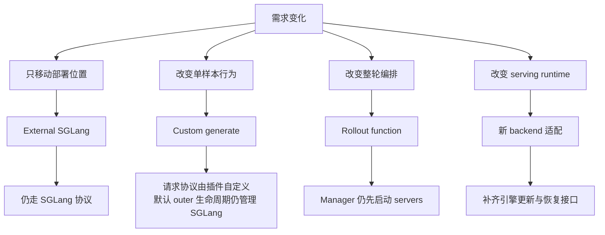
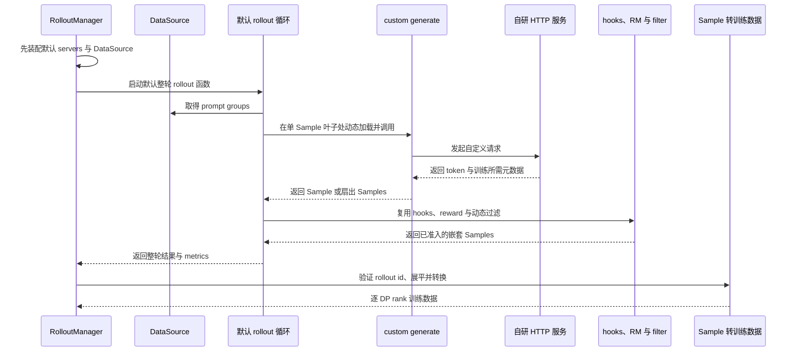

# slime Rollout 后端扩展：先选对扩展边界，再决定是否替换引擎

> **源码基线**：`THUDM/slime@681b3adca54105d5ecd3fb822fa0dc58a427e0f9`（`main`，2026-08-12）
> **主题**：单样本函数、整轮函数、buffer 插件与 external 部署的区别；新推理后端需要承接的内部接口。
> **适用范围**：扩展边界；请求机制归 13，恢复归 18，agent 运行时归 24。
> **最近更新**：2026-09-10。按固定源码核实接口、边界与诊断证据。

slime 的 rollout 扩展不是一个从“轻量插件”逐级升级到“重型插件”的单一路径，而是四条主要改动轴及独立 buffer 插件：外部 SGLang 只改变服务由谁部署；自定义生成函数只改变单次请求和 Sample 的生成方式；替换 rollout 函数会改变整轮数据生成流程；真正接入新后端则必须接管推理引擎生命周期、资源拓扑、路由器、权重更新和故障恢复。前两类函数钩子有文档和接口测试支撑；完整后端的启动位置没有抽象成公开 `Protocol` 或注册分发器，只存在一组目前由 SGLang 具体 actor 实现的内部约定。把四者误当成同一层插件，最常见的结果是“文本能生成”，但旧 SGLang 仍被启动，或者权重更新、样本回收、故障恢复在第一次训练迭代后失效。[`README_zh.md:22-24`](https://github.com/THUDM/slime/blob/681b3adca54105d5ecd3fb822fa0dc58a427e0f9/README_zh.md#L22-L24) [`slime/ray/rollout.py:188-220`](https://github.com/THUDM/slime/blob/681b3adca54105d5ecd3fb822fa0dc58a427e0f9/slime/ray/rollout.py#L188-L220) [`slime/ray/rollout.py:464-498`](https://github.com/THUDM/slime/blob/681b3adca54105d5ecd3fb822fa0dc58a427e0f9/slime/ray/rollout.py#L464-L498)

本文只判断**应在哪个边界扩展**。请求内容、中止与部分结果状态机归 [[13_slime_sglang_rollout_engine_analysis]]；Ray 对象层级归 [[11_slime_ray_control_plane_analysis]]；权重发布协议归 [[16_slime_weight_sync_analysis]]。

## 1. 问题背景：所谓“换 rollout”其实混合了四个问题

项目明确选择单一 SGLang rollout backend：SGLang 的上游参数被加 `--sglang-` 前缀直接暴露，官方把这样做的理由写成避免 lowest-common-denominator 公共子集，并保留 routing、caching、disaggregation 和 weight-sync 能力。[`README_zh.md:18-24`](https://github.com/THUDM/slime/blob/681b3adca54105d5ecd3fb822fa0dc58a427e0f9/README_zh.md#L18-L24) [`README_zh.md:36-50`](https://github.com/THUDM/slime/blob/681b3adca54105d5ecd3fb822fa0dc58a427e0f9/README_zh.md#L36-L50)

这使“我想接另一个服务”至少有四种不同含义：

| 需求 | 正确扩展边界 | 改变什么 | 明确不改变什么 |
|---|---|---|---|
| SGLang 已由外部平台部署 | external SGLang | 进程由谁启动、GPU 在哪个集群 | engine 类型、router 注册、更新端点仍是 SGLang |
| 每条样本要做工具调用、RAG 或多轮交互 | custom generate | 请求序列、环境交互、返回的 Sample 或 fragments | 默认一轮 rollout 的并发、筛选和 server 启动 |
| 默认 prompt-group 循环无法表达后台队列或持续异步 | rollout-function replacement | DataSource 消费、任务队列、跨轮次调度、整轮返回 | `RolloutManager` 的 server 初始化与下游训练数据边界 |
| 必须使用另一套 serving runtime | 新 backend 适配 | engine、router、拓扑、更新、健康检查与恢复 | 只能继续复用上层 Sample/DataSource 与 trainer ABI |

前两种函数入口的职责区分由官方 customization 文档直接给出：绝大多数 agent 场景先用 custom generate，只有 per-sample 定制不够时才替换 rollout function。[`docs/zh/get_started/customization.md:32-44`](https://github.com/THUDM/slime/blob/681b3adca54105d5ecd3fb822fa0dc58a427e0f9/docs/zh/get_started/customization.md#L32-L44) external 文档则把对象限定为“外部系统预先部署和管理的 SGLang engine”。[`docs/zh/advanced/external-rollout-engines.md:1-5`](https://github.com/THUDM/slime/blob/681b3adca54105d5ecd3fb822fa0dc58a427e0f9/docs/zh/advanced/external-rollout-engines.md#L1-L5)

> **设计分析**：这四条轴不能合成一个 `backend_plugin` 开关。部署所有权、请求语义、数据编排和 serving runtime 可以独立变化；把它们捆绑会迫使“小改 agent loop”的用户同时实现健康检查和权重同步，也会让“外部部署同一种 engine”被误报成 backend 替换。

## 2. 为什么这么设计：为什么底层引擎的专有能力必然进入后端接口

SGLang 不是藏在一个纯 `generate(tokens)` 接口后面。固定基线至少有四类原生能力跨过 slime 边界：

| 后端专有能力 | 进入 slime 的位置 | 对通用接口的影响 |
|---|---|---|
| 全量上游参数 | 包装 `ServerArgs.add_cli_args`，给 flag 和 namespace 加 `sglang_` 前缀 | 通用 schema 无法预知每次 SGLang 升级新增的开关 |
| PD/EPD 与异构 group | config 启动 encoder、prefill、decode 或 regular groups，并把 encoder URLs 注入其他 workers | 通用 topology 若只有 replica/TP，就表达不了阶段角色和启动依赖 |
| session 与行为 metadata | 请求可用 consistent-hashing header，并条件请求 routed experts；返回 token/logprob 写入 Sample | 通用 response 若只含 text/tokens，会丢一致性与重放所需语义 |
| 内存与热更新控制 | engine 暴露 tagged resume、pause/continue、disk/distributed/tensor update 与 post-process | 通用 lifecycle 若只有 start/stop，无法支持 colocate 与量化热更新 |

证据分别位于 SGLang 参数包装器、server-group 启动分支、默认请求路径和 engine facade。[`slime/backends/sglang_utils/arguments.py:100-118`](https://github.com/THUDM/slime/blob/681b3adca54105d5ecd3fb822fa0dc58a427e0f9/slime/backends/sglang_utils/arguments.py#L100-L118) [`slime/ray/rollout.py:1214-1258`](https://github.com/THUDM/slime/blob/681b3adca54105d5ecd3fb822fa0dc58a427e0f9/slime/ray/rollout.py#L1214-L1258) [`slime/rollout/sglang_rollout.py:175-218`](https://github.com/THUDM/slime/blob/681b3adca54105d5ecd3fb822fa0dc58a427e0f9/slime/rollout/sglang_rollout.py#L175-L218) `slime/backends/sglang_utils/sglang_engine.py::SGLangEngine.pause_generation/continue_generation/release_memory_occupation/resume_memory_occupation`

> **设计分析：只保留公共能力会带来什么问题**
>
> - 若通用 backend 接口只保留所有 engine 都有的 `generate/start/stop`，它会禁止或旁路 PD/EPD、session affinity、routing replay、tagged offload 和多种在线更新，因而过度限制强 backend。
> - 若把这些能力都做成 optional method、capability flag 和 backend-specific config，抽象层仍要传播 SGLang 的 worker role、cache、quantization 与 update 语义；它形式上通用，实质上已经泄漏。
>
> 所以项目有意选择“上层 Sample/DataSource 接口稳定、下层推理引擎保留原生实现”，而不是遗漏了一个简单工厂。代价是替换运行时需要维护较宽的适配层或派生实现，收益是 SGLang 新能力不必先缩减为公共功能子集。[`README_zh.md:22-24`](https://github.com/THUDM/slime/blob/681b3adca54105d5ecd3fb822fa0dc58a427e0f9/README_zh.md#L22-L24) [`README_zh.md:48-50`](https://github.com/THUDM/slime/blob/681b3adca54105d5ecd3fb822fa0dc58a427e0f9/README_zh.md#L48-L50)

本页其余章节按这条判据展开：两个稳定的函数接口见第 3 节，外部 SGLang 的部署边界见第 4 节，一条可回退的最小接入路径见第 5 节，完整后端必须补齐的内部约定见第 6 节，约束与失败门槛见第 7 节。

## 3. 两个稳定的函数接口：稳定的是数据边界，不是推理引擎边界

### 3.1 Custom generate：改请求和 Sample 行为

公开参数把 custom generate 定义为仅替换默认 rollout 里的 `generate(args, sample, sampling_params)`，用途是 multi-turn、function calling 等特殊生成逻辑。[`slime/utils/arguments.py:477-483`](https://github.com/THUDM/slime/blob/681b3adca54105d5ecd3fb822fa0dc58a427e0f9/slime/utils/arguments.py#L477-L483) 文档给出的稳定签名是异步 callable，返回一个 `Sample` 或一次 execution 拆出的 `list[Sample]`；fanout siblings 必须共享 `rollout_id`。[`docs/zh/get_started/customization.md:71-91`](https://github.com/THUDM/slime/blob/681b3adca54105d5ecd3fb822fa0dc58a427e0f9/docs/zh/get_started/customization.md#L71-L91)

源码在默认信号量和单样本 DP 上下文内，选择 Sample 自带的生成路径或全局自定义路径，随后仍执行样本钩子和 reward 计算；因此这个钩子替换的是“如何完成这一条 Sample”，而不是默认分组收集与过滤、分组 RM 或整轮收集逻辑。[`slime/rollout/sglang_rollout.py:224-289`](https://github.com/THUDM/slime/blob/681b3adca54105d5ecd3fb822fa0dc58a427e0f9/slime/rollout/sglang_rollout.py#L224-L289) 接口测试固定了前三个参数名，并覆盖默认分支、单样本覆盖、全局覆盖与 list 返回。[`tests/plugin_contracts/test_plugin_generate_contracts.py:90-100`](https://github.com/THUDM/slime/blob/681b3adca54105d5ecd3fb822fa0dc58a427e0f9/tests/plugin_contracts/test_plugin_generate_contracts.py#L90-L100) [`tests/plugin_contracts/test_plugin_generate_contracts.py:126-190`](https://github.com/THUDM/slime/blob/681b3adca54105d5ecd3fb822fa0dc58a427e0f9/tests/plugin_contracts/test_plugin_generate_contracts.py#L126-L190)

**能力边界**：custom generate 可以在 callable 内请求另一服务，这是 Python 可编程性带来的能力；但源码并未因此把该服务纳入 rollout backend。默认 outer loop 的 abort 仍查询 SGLang router 的 `/workers` 并调用 SGLang server abort，再等待 pending tasks。[`slime/rollout/sglang_rollout.py:339-371`](https://github.com/THUDM/slime/blob/681b3adca54105d5ecd3fb822fa0dc58a427e0f9/slime/rollout/sglang_rollout.py#L339-L371)

> **设计分析**：若 custom generate 把请求发给自研服务，必须自行定义取消与超时；默认 abort 只能停止 SGLang workers，不能证明自研服务已经停止计算。若这一差异会破坏 partial、资源回收或版本边界，就已越过 custom-generate 的安全适用范围。

### 3.2 Rollout function：改整轮数据编排

`--rollout-function-path` 的公开接口参数是 `args / rollout_id / data_source / evaluation`，训练输出 Sample 至少要设置 `tokens`、`response_length`、`reward` 和 `status`。[`slime/utils/arguments.py:328-340`](https://github.com/THUDM/slime/blob/681b3adca54105d5ecd3fb822fa0dc58a427e0f9/slime/utils/arguments.py#L328-L340) 返回包装器把训练和评估分别表示为 `RolloutFnTrainOutput` 与 `RolloutFnEvalOutput`，并兼容旧式裸返回值。[`slime/rollout/base_types.py:7-25`](https://github.com/THUDM/slime/blob/681b3adca54105d5ecd3fb822fa0dc58a427e0f9/slime/rollout/base_types.py#L7-L25)

对应 contract test 不只比较签名，还检查训练 group 大小、Sample 基本字段和评估字典结构，并显式拒绝缺 reward 的实现。[`tests/plugin_contracts/test_plugin_rollout_contracts.py:97-146`](https://github.com/THUDM/slime/blob/681b3adca54105d5ecd3fb822fa0dc58a427e0f9/tests/plugin_contracts/test_plugin_rollout_contracts.py#L97-L146) [`tests/plugin_contracts/test_plugin_rollout_contracts.py:149-185`](https://github.com/THUDM/slime/blob/681b3adca54105d5ecd3fb822fa0dc58a427e0f9/tests/plugin_contracts/test_plugin_rollout_contracts.py#L149-L185)

官方 fully-async 实例展示了这层真正能改什么：后台线程跨 rollout 保持固定在途池，完成 group 进入队列，abort group 回到 DataSource；官方要求在 `train_async.py` 上叠加该函数；它仍复用默认 `generate_and_rm_group`，入口拒绝 evaluation，跨轮次顺序为 best effort；README 的 partial 限制及原对象回填边界见 [[13_slime_sglang_rollout_engine_analysis]]。[`slime/rollout/fully_async_rollout.py:1-23`](https://github.com/THUDM/slime/blob/681b3adca54105d5ecd3fb822fa0dc58a427e0f9/slime/rollout/fully_async_rollout.py#L1-L23) [`examples/fully_async/README.md:42-83`](https://github.com/THUDM/slime/blob/681b3adca54105d5ecd3fb822fa0dc58a427e0f9/examples/fully_async/README.md#L42-L83)

**能力边界**：rollout function 可以重排“何时取数据、何时提交、何时返回”，但 `RolloutManager.__init__` 先调用 `start_rollout_servers`，之后才加载 rollout function；server 初始化 handle 也在 Manager 完成构造前等待。[`slime/ray/rollout.py:464-498`](https://github.com/THUDM/slime/blob/681b3adca54105d5ecd3fb822fa0dc58a427e0f9/slime/ray/rollout.py#L464-L498) 因而它不是关闭或替换默认 backend 的生命周期 hook。

### 3.3 Forge、sleep 和 Sample hooks 是三种不同的替换

`slime.rollout.forge_load.generate_rollout` 读 `--load-forge-rollout-data` 指定的 `.pt`，把 dict 恢复为 Sample，保留原 `sample.rollout_id`。字面路径每轮复用同一文件，eval 返回空；模板路径 `{rollout_id}` 在训练文件缺失时回退到 0，eval 查 `eval_<id>` 且不回退训练样本。训练找不到文件时抛 RuntimeError。它不设置 debug-train-only，适合保留真实 SGLang、权重更新和显存切换的内存实验。

`slime.rollout.sleep_rollout.sleep` 每小时 sleep 并日志计数，永不返回训练 batch。因为 Manager 已先启动服务，可在此时人工压测/profile；它不是 engine 的显存 sleep API，使用过程归 [[18_slime_fault_tolerance_observability_analysis]]。

`--rollout-sample-hook-path` 更窄：它不替换 generation，而是在 generation 后、RM 前逐 Sample 叶子执行 hook。支持同步/异步、原地改写返回 None 或返回替换 Sample，保持嵌套 list；其他返回类型显式报错。签名可接 `evaluation`、当前 round `rollout_id`，不接收的关键字会被过滤。生成与完整 RM 分派归 [[13_slime_sglang_rollout_engine_analysis]]。

### 3.4 Rollout buffer 插件：把生产者移到独立服务

`slime_plugins/rollout_buffer` 是仓内另一种组合：FastAPI buffer 服务持有按 `instance_id` 分组的数据，`discover_generators` 扫 `generator/*.py` 的 `TASK_TYPE/run_rollout`，可附加 `transform_group/is_valid_group/get_group_data_meta_info`。`/start_rollout` 启动生产者，`/buffer/write` 写入，`/get_rollout_data` 取走有效组；调用侧 `rollout_buffer_example.py::generate_rollout_async` 轮询、校验 `uid/instance_id/messages/reward/extra_info`，用 `MultiTurnLossMaskGenerator` 从 messages 构造 token/mask，再把 groups 放入 data buffer。

这改变的是外部生产队列与整轮函数，仍把 SGLang router 地址交给 generator；不会替换 Manager 的 engine 生命周期。它也不是 `fully_async_rollout.AsyncRolloutWorker` 的输出队列：后者在同一进程保留真实 Sample，前者经 HTTP 传消息记录并重新构造训练数据。示例明确拒绝 eval，且不能从“插件目录存在”推导出与最新 Sample、partial、logprob 接口全覆盖；接入需运行对应契约验证。

紧凑阅读路线：`slime/ray/rollout.py::RolloutManager.__init__`（同时加载 data-source、rollout、eval、reward-post-process、convert-samples-to-train-data 函数）→ `slime/rollout/forge_load.py::_resolve_path/generate_rollout`、`slime/rollout/sleep_rollout.py::sleep`、`slime/rollout/sample_hooks.py::apply_rollout_sample_hooks` → `slime_plugins/rollout_buffer/buffer.py::discover_generators/BufferQueue.get/RolloutBuffer.read` 与 `rollout_buffer_example.py::generate_rollout_async`。SFT 替换例见 [[28_slime_sft_path_and_loss_mask_analysis]]，eval 配置归 [[27_slime_evaluation_path_analysis]]。

## 4. 外部 SGLang：改变服务由谁部署，不改变通信协议

参数解析校验阶段通过 `apply_external_engine_info_to_args` 完成发现，而不是等首个 rollout 请求才连接。external 路径会发现 `/server_info` 或 `/get_server_info`，推断 GPU 数、并行信息与 regular/prefill/decode/encoder worker 类型，并把 workers 注册到 router；它与 `--sglang-config` 互斥，因为前者由外部系统管理 engine 生命周期，后者由 slime 启动 engine。[`docs/zh/advanced/external-rollout-engines.md:20-48`](https://github.com/THUDM/slime/blob/681b3adca54105d5ecd3fb822fa0dc58a427e0f9/docs/zh/advanced/external-rollout-engines.md#L20-L48)

源码中的 external adapter 仍导入并创建零 GPU 的 `SGLangEngine` Ray proxy，调用其 `init` 完成参数校验和 router 注册，再把默认 router 写回 `args.sglang_model_routers`。[`slime/backends/sglang_utils/external.py:195-250`](https://github.com/THUDM/slime/blob/681b3adca54105d5ecd3fb822fa0dc58a427e0f9/slime/backends/sglang_utils/external.py#L195-L250) [`slime/backends/sglang_utils/sglang_engine.py:169-187`](https://github.com/THUDM/slime/blob/681b3adca54105d5ecd3fb822fa0dc58a427e0f9/slime/backends/sglang_utils/sglang_engine.py#L169-L187) 发现测试也要求 server info 能还原 TP/PP/EP/MoE-DP topology，而不是只检查一个通用 `/health`。[`tests/test_external_sglang_engines.py:36-65`](https://github.com/THUDM/slime/blob/681b3adca54105d5ecd3fb822fa0dc58a427e0f9/tests/test_external_sglang_engines.py#L36-L65)

external 的资源边界确实移动了：placement group 不为外部 rollout GPU 预留本地 bundle，proxy actor 本身申请零 GPU；实际 serving GPU 由外部系统拥有。[`slime/ray/placement_group.py:100-117`](https://github.com/THUDM/slime/blob/681b3adca54105d5ecd3fb822fa0dc58a427e0f9/slime/ray/placement_group.py#L100-L117) [`slime/backends/sglang_utils/external.py:206-227`](https://github.com/THUDM/slime/blob/681b3adca54105d5ecd3fb822fa0dc58a427e0f9/slime/backends/sglang_utils/external.py#L206-L227)

但是协议边界没有移动：external 文档仍要求 SGLang HTTP endpoint、server info 和选定的权重通信路径；disk transport 继续调用 SGLang 的 `update_weights_from_disk`。[`docs/zh/advanced/external-rollout-engines.md:50-72`](https://github.com/THUDM/slime/blob/681b3adca54105d5ecd3fb822fa0dc58a427e0f9/docs/zh/advanced/external-rollout-engines.md#L50-L72) external server 的 `offload/onload/onload_weights/onload_kv` 返回空列表，不管理外部显存；`recover` 只是告警并跳过，官方部署清单也明确说 fault-tolerance 恢复不覆盖它。[`slime/backends/sglang_utils/external.py:150-180`](https://github.com/THUDM/slime/blob/681b3adca54105d5ecd3fb822fa0dc58a427e0f9/slime/backends/sglang_utils/external.py#L150-L180) [`docs/zh/advanced/external-rollout-engines.md:95-103`](https://github.com/THUDM/slime/blob/681b3adca54105d5ecd3fb822fa0dc58a427e0f9/docs/zh/advanced/external-rollout-engines.md#L95-L103)

> **设计分析**：external 是“同一种 backend 的远程部署模式”。若把任意生成服务伪装成 external SGLang，就必须模仿 server-info、router worker、热更新、pause/flush/version 等 SGLang 语义；这已经是协议重实现，不是地址配置。

## 5. 追踪一条扩展路径：自研 HTTP 服务先从 custom generate 接入

假设目标只是验证自研服务能否产生可训练轨迹，最小且可回退的路径如下：

这张图刻意保留了默认 rollout 循环：custom generate 只替换单 Sample 的生成叶子，不接管 DataSource、并发收集、准入、中止、训练转换或权重更新。

1. CLI 用 `--custom-generate-function-path` 指向异步函数；参数层只承诺替换单 Sample 的生成步骤。[`slime/utils/arguments.py:477-483`](https://github.com/THUDM/slime/blob/681b3adca54105d5ecd3fb822fa0dc58a427e0f9/slime/utils/arguments.py#L477-L483)
2. `RolloutManager` 先创建默认 servers 与 DataSource，再加载默认 rollout function；custom generate 本身要到单 Sample 执行时才动态加载。[`slime/ray/rollout.py:474-498`](https://github.com/THUDM/slime/blob/681b3adca54105d5ecd3fb822fa0dc58a427e0f9/slime/ray/rollout.py#L474-L498) [`slime/rollout/sglang_rollout.py:250-260`](https://github.com/THUDM/slime/blob/681b3adca54105d5ecd3fb822fa0dc58a427e0f9/slime/rollout/sglang_rollout.py#L250-L260)
3. 默认 `generate_rollout` 从 DataSource 取 group，进入现有的并发收集、动态过滤、abort 与 partial 回填逻辑。[`slime/rollout/sglang_rollout.py:400-470`](https://github.com/THUDM/slime/blob/681b3adca54105d5ecd3fb822fa0dc58a427e0f9/slime/rollout/sglang_rollout.py#L400-L470) [`slime/rollout/sglang_rollout.py:627-649`](https://github.com/THUDM/slime/blob/681b3adca54105d5ecd3fb822fa0dc58a427e0f9/slime/rollout/sglang_rollout.py#L627-L649)
4. `generate_and_rm` 在 semaphore 内调用自研函数；返回后仍由默认路径补 reward、执行 hooks，并允许 fanout list。[`slime/rollout/sglang_rollout.py:242-289`](https://github.com/THUDM/slime/blob/681b3adca54105d5ecd3fb822fa0dc58a427e0f9/slime/rollout/sglang_rollout.py#L242-L289)
5. Manager 接收 `RolloutFnTrainOutput`，在 flatten 前验证 compact siblings 的 `rollout_id`，随后进入既有 Sample→train-data 边界。[`slime/ray/rollout.py:671-701`](https://github.com/THUDM/slime/blob/681b3adca54105d5ecd3fb822fa0dc58a427e0f9/slime/ray/rollout.py#L671-L701)

这条路径验证的是 **token/Sample/奖励/训练兼容性**，不是 backend 完成度。它有三个明确停止条件：默认 SGLang 的额外资源已不可接受；自研服务需要自己的 cancel/session/router 语义；训练权重必须热更新到自研服务。一旦命中任一条件，就应升级为 backend 适配，而不是继续在 custom generate 内堆控制面旁路。

## 6. 接入全新后端需要满足的内部约定：远不止 `generate`

固定基线的服务启动点不是后端分发器：文件直接导入 `SGLangEngine`，`ServerGroup.start_engines` 也直接构造该具体 actor。[`slime/ray/rollout.py:17-19`](https://github.com/THUDM/slime/blob/681b3adca54105d5ecd3fb822fa0dc58a427e0f9/slime/ray/rollout.py#L17-L19) [`slime/ray/rollout.py:188-220`](https://github.com/THUDM/slime/blob/681b3adca54105d5ecd3fb822fa0dc58a427e0f9/slime/ray/rollout.py#L188-L220) 因此下表不是公开稳定 API，而是**根据调用点反推出的最小内部接口要求**：

| 适配面 | 方法与调用点 | 缺失后的边界 |
|---|---|---|
| 参数与发现 | `parse_args/slime_validate_args` → `apply_external_engine_info_to_args`；managed 读取 `ServerArgs` | 地址可达不代表 topology、worker role 兼容 |
| 生命周期 | `ServerGroup.start_engines` → `SGLangEngine.init`；monitor → `health_generate`；清理 → `shutdown` | ready、停止和进程所有权必须明确 |
| 请求与取消 | `generate` → HTTP `/generate`；`abort` → `abort_servers_until_idle` → `/abort_request` | 不等同于 Python `generate` 单函数接口 |
| 拓扑 | `RolloutManager.get_updatable_engines_and_lock` 返回 GPU counts/offsets/parallel configs | updater 必须看到与服务一致的 rank 布局 |
| 显存生命周期 | `ServerGroup.offload/onload` → `release_memory_occupation/resume_memory_occupation` | 无法支持则显式拒绝 colocate/offload |
| 权重发布 | updater → `pause_generation/flush_cache/update_weights_from_tensor/update_weights_from_distributed/update_weights_from_disk/continue_generation`，按 transport 选择 | 完整顺序和 commit 边界归 [[16_slime_weight_sync_analysis]] |
| 恢复 | `RolloutManager.recover_updatable_engines` → `RolloutServer.recover`；trainer → `connect_rollout_engines/update_weights` | 规范恢复链归 [[18_slime_fault_tolerance_observability_analysis#3. 推理引擎的局部恢复：检测、清理、重建、重新加载当前版本|引擎恢复]] |

以上是固定调用点反推的内部义务，不是已发布的 backend Protocol。完整方法外观读 `slime/backends/sglang_utils/sglang_engine.py::SGLangEngine`，生命周期调用者读 `slime/ray/rollout.py::ServerGroup/RolloutServer/RolloutManager`。

> **设计分析**：新后端可以选择实现同名的引擎适配外观，也可以连同服务、更新器和监控一起替换；但只替换请求函数无法满足上述接口要求。前者改动小，却会继承为 SGLang 设计的接口；后者边界更清楚，但会形成派生实现，而不是一个配置插件。

## 7. 约束：选择路径、能力边界与失败门槛

| 你真正需要的能力 | 首选路径 | 升级到下一层的信号 |
|---|---|---|
| 工具、RAG、多轮、环境交互、fanout | custom generate | 需要跨 Sample 全局队列、自有取消协议或不再接受默认 SGLang 启动 |
| 持续后台队列、跨轮次在途任务、自定义 DataSource 消费 | rollout function | 需要改变 engine 资源、router、更新或恢复所有者 |
| 独立容器/集群中的 SGLang | external SGLang | 外部服务不是 SGLang，或无法提供其 server-info/update 协议 |
| 另一推理 runtime | 完整 backend adapter 或派生实现 | 无更低层可升级；必须逐项声明不支持的 native capability |

验收新扩展时，至少主动触发以下失败路径：

1. **资源重复**：custom hook 已请求外部服务，但默认 SGLang 是否仍被 Manager 启动并占 GPU？启动顺序见 [`slime/ray/rollout.py:474-498`](https://github.com/THUDM/slime/blob/681b3adca54105d5ecd3fb822fa0dc58a427e0f9/slime/ray/rollout.py#L474-L498)。
2. **取消悬空**：动态采样结束或权重更新触发 abort 时，非 SGLang 请求是否真的停止，而不是只在本地把 Sample 标为 aborted？默认外层只控制 SGLang workers。[`slime/rollout/sglang_rollout.py:339-371`](https://github.com/THUDM/slime/blob/681b3adca54105d5ecd3fb822fa0dc58a427e0f9/slime/rollout/sglang_rollout.py#L339-L371)
3. **数据悄悄错位**：返回值是否满足接口测试要求的字段，并继续保证 token、mask、logprob 与扇出标识的训练语义完整？基本要求见 [`tests/plugin_contracts/test_plugin_rollout_contracts.py:97-146`](https://github.com/THUDM/slime/blob/681b3adca54105d5ecd3fb822fa0dc58a427e0f9/tests/plugin_contracts/test_plugin_rollout_contracts.py#L97-L146)，完整数据语义见 [[12_slime_sample_datasource_analysis]]。
4. **半版本服务**：每个 serving rank 是否在 resume 前完成更新、清掉旧 cache 并报告同一 version？现有 disk 路径会在 CI 中逐 engine 核验 version。[`slime/ray/actor_group.py:244-269`](https://github.com/THUDM/slime/blob/681b3adca54105d5ecd3fb822fa0dc58a427e0f9/slime/ray/actor_group.py#L244-L269)
5. **恢复到初始权重**：engine 重建后是否重新连接 updater 并覆盖到当前 actor 版本？现有流程以 `num_new_engines` 触发 reconnect。[`slime/backends/megatron_utils/actor.py:596-632`](https://github.com/THUDM/slime/blob/681b3adca54105d5ecd3fb822fa0dc58a427e0f9/slime/backends/megatron_utils/actor.py#L596-L632)
6. **能力假兼容**：不支持 PD、routing replay、colocate offload、量化 post-process 或某种 transport 时，是否在配置期 fail fast，而不是运行中静默降级？SGLang 参数校验本身就在解析后执行 topology 约束与互斥检查。[`slime/backends/sglang_utils/arguments.py:144-186`](https://github.com/THUDM/slime/blob/681b3adca54105d5ecd3fb822fa0dc58a427e0f9/slime/backends/sglang_utils/arguments.py#L144-L186)

最终判断标准不是“能否返回一段文本”，而是**改动是否停在它声称的职责边界内**。只改变数据行为，就使用稳定的函数接口；一旦负责资源、版本或故障恢复，就应明确自己正在实现新的后端。

## 8. 发展趋势

> [!note] 推断
> 本节只引用固定基线里实际存在的 TODO 与能力声明，不构成项目路线图；锚点原文给出定位符，判断部分是本页推断。

三个锚点都落在**扩展边界本身**上，而不是落在“会不会支持某个新引擎”上：

- **router 参数面还没有统一到 `--sglang-` 前缀约定。** `add_sglang_router_arguments` 顶上写着 “TODO: use all sglang router arguments with `--sglang-router` prefix”；当前实现是三个手写 `--sglang-router-*` 参数加一次 `RouterArgs.add_cli_args(parser, use_router_prefix=True, exclude_host_port=True)`。[`slime/backends/sglang_utils/arguments.py:8-35`](https://github.com/THUDM/slime/blob/681b3adca54105d5ecd3fb822fa0dc58a427e0f9/slime/backends/sglang_utils/arguments.py#L8-L35) 第 2 节说“全量上游参数被前缀包装后暴露”对 `ServerArgs` 成立，对 router 只是部分成立；**由此可推断**，依赖具体 router flag 名的外部部署脚本要预期这层命名还会动。
- **多模型/多 server 的权重更新是已声明的未完成项。** `_get_updatable_server` 的 docstring 直接写 “multi-model weight update is not yet supported”，因此第 6 节表格里的“权重提交”义务目前只对单一可更新 server 成立。[`slime/ray/rollout.py:555-559`](https://github.com/THUDM/slime/blob/681b3adca54105d5ecd3fb822fa0dc58a427e0f9/slime/ray/rollout.py#L555-L559) 想在一个作业里同时在线更新两套 serving 模型的扩展，现在没有可复用的上游路径。
- **rollout-function 层的 partial resume 仍未接通。** 官方 fully-async 示例的 Limitations 一节写明 “TODO: partial-rollout-style resume for `ABORTED` trajectories is not yet wired; for now the trajectory is re-queued and starts over”。[`examples/fully_async/README.md:77-83`](https://github.com/THUDM/slime/blob/681b3adca54105d5ecd3fb822fa0dc58a427e0f9/examples/fully_async/README.md#L77-L83) 这是示例声明的支持范围；源码实际回填原 Sample 对象，没有统一清空 token，不能据此断言所有 custom generate 都必定从零重做。具体边界由 [[13_slime_sglang_rollout_engine_analysis]] 维护。

固定基线里**没有**任何注释或文档提到要把 engine 启动点抽象成 `Protocol`、注册表或后端分发器。第 6 节所说“内部约定不是公开 API”因此是当前的稳定状态，而不是一个即将被替换的过渡形态——把它当成“等官方出插件接口”来规划，在这个基线上没有依据。

## Related Pages

- [[11_slime_ray_control_plane_analysis]] — `RolloutManager`、server、group 与 engine 的对象所有权及资源放置以该页为准。
- [[12_slime_sample_datasource_analysis]] — 自定义生成函数与 rollout 函数必须保证的 Sample、DataSource、扇出和训练数据约定。
- [[13_slime_sglang_rollout_engine_analysis]] — 默认请求、router、abort、partial 与 metadata 状态协议的权威展开。
- [[16_slime_weight_sync_analysis]] — 新 backend 必须承接的 pause、flush、传输、版本与 resume 提交事务。
- [[18_slime_fault_tolerance_observability_analysis]] — engine 故障检测、局部恢复和外部部署恢复所有权的边界。
- [[25_vime_vllm_backend_support_analysis]] — 以派生实现方式替换为 vLLM 时，哪些上层接口可复用、哪些后端部分必须重写。
